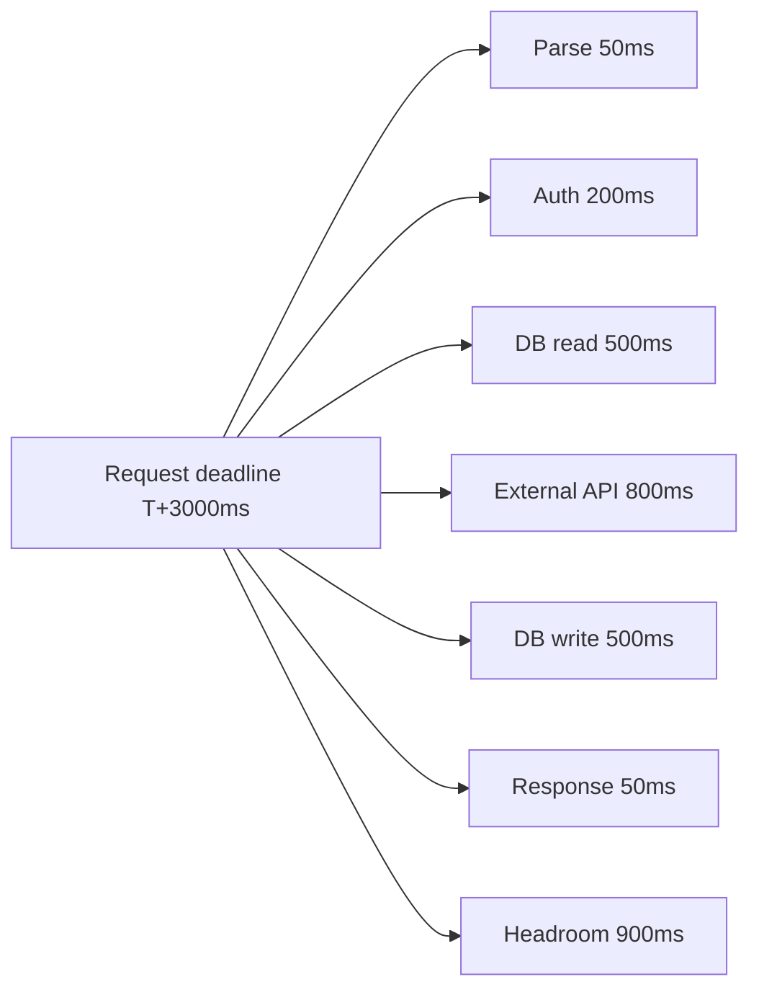
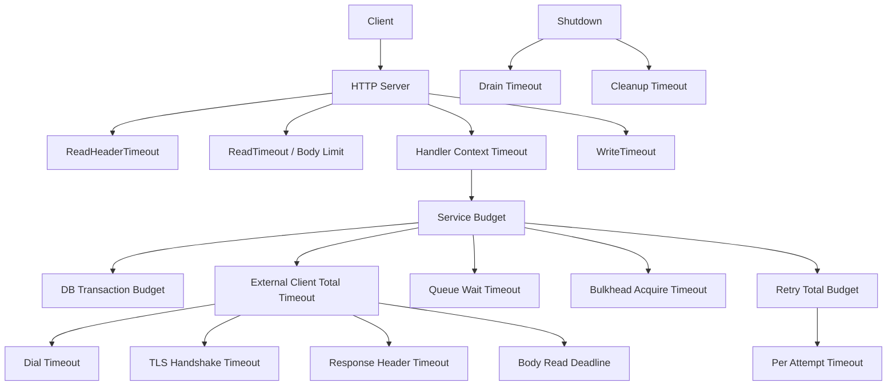
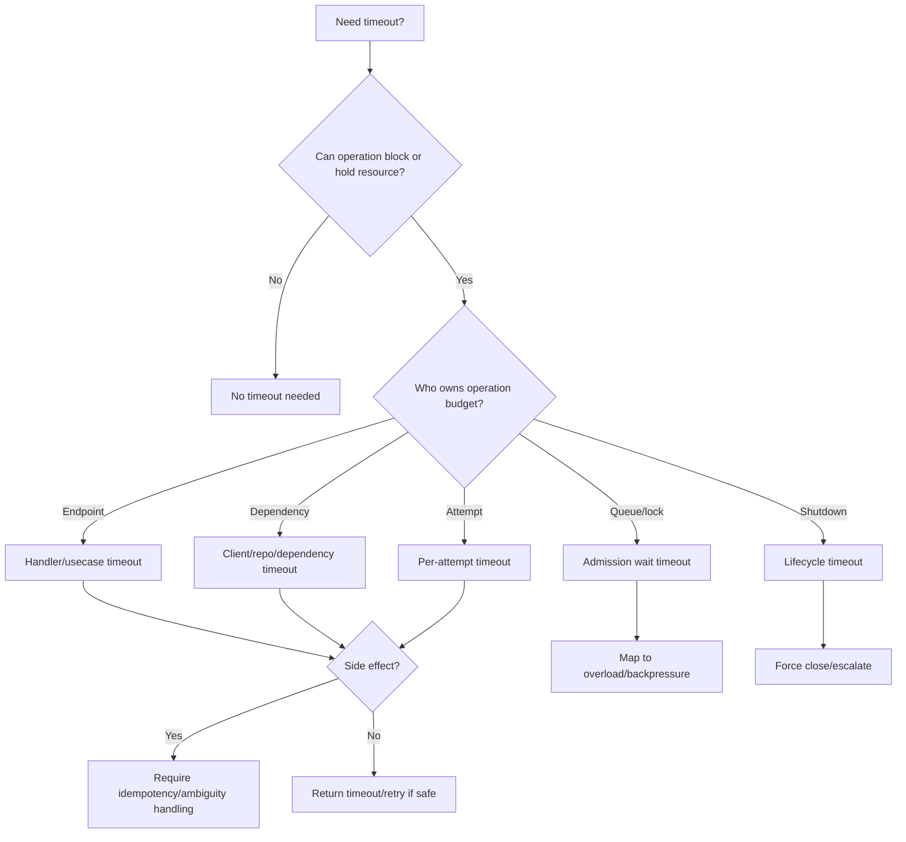

# learn-go-reliability-error-handling-part-013.md

# Timeout Engineering: Connect, TLS, Header, Body, Handler, DB, Queue

> Seri: `learn-go-reliability-error-handling`  
> Part: `013`  
> Target: Go 1.26.x  
> Level: Advanced / internal engineering handbook  
> Fokus: mendesain timeout secara sistematis di Go production system.

---

## 0. Posisi Materi Ini Dalam Seri

Bagian sebelumnya:

- `part-011`: fundamental `context`: cancellation, deadline, timeout, cause.
- `part-012`: context propagation across layers.

Sekarang kita masuk ke **timeout engineering**.

Timeout adalah salah satu mekanisme reliability paling penting sekaligus paling sering disalahgunakan.

Banyak sistem hanya punya konfigurasi seperti:

```yaml
timeout: 30s
```

Lalu angka itu dipakai untuk:

- HTTP handler
- downstream HTTP client
- database query
- queue wait
- retry attempt
- retry total
- message processing
- shutdown
- lock acquisition
- file upload
- report generation

Ini bukan reliability design. Ini hanya angka global.

Timeout yang baik harus menjawab:

1. Timeout untuk fase apa?
2. Siapa yang dilindungi?
3. Apa yang terjadi setelah timeout?
4. Apakah operasi aman di-retry?
5. Apakah timeout berarti failure, overload, cancellation, atau ambiguous outcome?
6. Apakah timeout ini endpoint-level, dependency-level, per-attempt, atau cleanup-level?
7. Apakah timeout ini compatible dengan SLO?
8. Apakah timeout ini terlalu pendek sehingga menyebabkan false failure?
9. Apakah timeout ini terlalu panjang sehingga menyebabkan resource exhaustion?
10. Apakah timeout ini observable?

---

## 1. Core Thesis

Timeout bukan satu angka. Timeout adalah **budget policy** untuk fase kerja yang berbeda.

Dalam sistem Go production, timeout perlu dibedakan minimal menjadi:

- endpoint/request timeout
- handler timeout
- request body read timeout
- server read header timeout
- server read timeout
- server write timeout
- idle timeout
- client total timeout
- dial/connect timeout
- TLS handshake timeout
- response header timeout
- expect-continue timeout
- per-request context timeout
- per-dependency timeout
- database query timeout
- transaction budget
- queue wait timeout
- lock/semaphore acquisition timeout
- retry per-attempt timeout
- retry total timeout
- message processing timeout
- stream idle timeout
- graceful shutdown timeout
- cleanup timeout
- telemetry flush timeout

Top 1% engineer tidak bertanya “timeout berapa detik?” terlebih dahulu. Mereka bertanya:

> Operation ini berada di fase apa, resource apa yang sedang ditahan, failure mode apa yang ingin dicegah, dan apa policy setelah timeout?

---

## 2. Timeout, Deadline, Cancellation: Perbedaan Konseptual

### 2.1 Timeout

Durasi relatif:

```go
ctx, cancel := context.WithTimeout(parent, 2*time.Second)
defer cancel()
```

Artinya: operasi ini diberi waktu maksimal 2 detik dari sekarang.

### 2.2 Deadline

Waktu absolut:

```go
ctx, cancel := context.WithDeadline(parent, time.Now().Add(2*time.Second))
defer cancel()
```

Artinya: operasi ini harus selesai sebelum timestamp tertentu.

### 2.3 Cancellation

Signal bahwa operasi harus berhenti.

Timeout/deadline menyebabkan cancellation, tetapi cancellation juga bisa berasal dari:

- client disconnect
- shutdown
- parent failure
- explicit user cancellation
- fan-out sibling failure

### 2.4 Deadline Budget

Jika request punya deadline 3 detik, semua child operation berbagi budget itu.



---

## 3. Timeout Sebagai Protection Mechanism

Timeout melindungi dari:

- dependency hang
- network partition
- slowloris
- stuck DB query
- queue saturation
- lock contention
- goroutine leak
- connection pool exhaustion
- thread/goroutine pile-up
- cascading failure
- infinite wait during shutdown
- retry amplification
- user-perceived latency blow-up

Tapi timeout juga bisa menyebabkan:

- false failure
- duplicated side effect through retry
- partial work
- ambiguous commit
- excessive cancellation
- cascading retries
- higher tail latency due to retries
- wasted work if operation cannot actually be canceled
- noisy alerts
- poor UX

Timeout adalah pisau tajam.

---

## 4. Timeout Engineering vs Timeout Theater

Timeout theater:

```go
ctx, cancel := context.WithTimeout(ctx, 30*time.Second)
defer cancel()
```

dipakai di semua tempat tanpa reasoning.

Timeout engineering:

```text
Endpoint budget: 2s
- handler decode/body: 100ms
- auth/profile: 300ms
- DB transaction: 700ms
- external policy: 500ms
- response/write/headroom: 400ms
```

Lalu setiap dependency punya budget berdasarkan latency profile dan SLO.

### 4.1 Smell: Same Timeout Everywhere

Jika semua timeout 30 detik, sebenarnya tidak ada budget design.

### 4.2 Smell: Timeout Lebih Besar dari Caller Deadline

Jika handler punya 2 detik, external client timeout 10 detik tidak berguna sebagai upper bound, karena parent context menang. Tetapi angka 10 detik tetap membingungkan.

### 4.3 Smell: Timeout Terlalu Pendek Tanpa Percentile Data

Jika p99 dependency 900ms dan timeout 800ms, Anda menciptakan failure normal.

### 4.4 Smell: Timeout Tanpa Retry/Idempotency Policy

Jika timeout terjadi setelah side effect mungkin sukses, retry bisa menggandakan operasi.

---

## 5. Timeout Taxonomy

| Timeout Type | Tujuan | Typical owner |
|---|---|---|
| Endpoint timeout | Batasi durasi request user | handler/router |
| Server ReadHeaderTimeout | Proteksi slow header/slowloris | HTTP server config |
| Server ReadTimeout | Batasi read request termasuk body | HTTP server config |
| Server WriteTimeout | Batasi write response | HTTP server config |
| IdleTimeout | Batasi idle keep-alive connection | HTTP server config |
| Client total timeout | Upper bound seluruh outbound request | client config |
| Dial timeout | Batasi connect | transport dialer |
| TLS handshake timeout | Batasi TLS negotiation | HTTP transport |
| Response header timeout | Batasi waktu menunggu header response | HTTP transport |
| Body read timeout | Batasi waktu membaca body | context/deadline/connection deadline |
| DB query timeout | Batasi query execution/wait | context/DB config |
| Transaction timeout | Batasi seluruh transaction | service/usecase |
| Queue wait timeout | Batasi waktu menunggu slot/job | queue/bulkhead |
| Retry attempt timeout | Batasi satu percobaan | retry policy |
| Retry total timeout | Batasi semua attempts | caller context |
| Worker job timeout | Batasi satu job | worker |
| Shutdown timeout | Batasi drain/close | main/app lifecycle |
| Cleanup timeout | Batasi cleanup best effort | cleanup owner |

---

## 6. HTTP Server Timeouts

Go `net/http.Server` memiliki beberapa timeout penting:

```go
srv := &http.Server{
    Addr:              ":8080",
    Handler:           handler,
    ReadHeaderTimeout: 2 * time.Second,
    ReadTimeout:       10 * time.Second,
    WriteTimeout:      15 * time.Second,
    IdleTimeout:       60 * time.Second,
}
```

### 6.1 `ReadHeaderTimeout`

Membatasi waktu membaca request headers.

Tujuan:

- proteksi slowloris
- mencegah client mengirim header sangat lambat
- membatasi resource connection yang belum masuk handler

Biasanya ini harus diset.

```go
ReadHeaderTimeout: 2 * time.Second
```

### 6.2 `ReadTimeout`

Membatasi waktu membaca seluruh request termasuk body.

Cocok untuk:

- API dengan request body kecil/terbatas
- mencegah upload lambat menahan connection terlalu lama

Risiko:

- upload besar valid bisa gagal
- long body streaming bisa terputus
- timeout ini tidak memberi handler fine-grained decision per request

Jika service menerima file upload besar, gunakan design khusus:

- endpoint upload terpisah
- max body size
- streaming/chunking
- per-route timeout
- object storage direct upload
- progress/checkpoint
- lower-level deadline strategy

### 6.3 `WriteTimeout`

Membatasi waktu menulis response.

Cocok untuk:

- normal JSON API
- mencegah slow reader menahan resource

Risiko:

- streaming response
- Server-Sent Events
- long polling
- websocket-like behavior
- large download

Untuk streaming, `WriteTimeout` perlu dipertimbangkan hati-hati karena response memang panjang.

### 6.4 `IdleTimeout`

Membatasi idle keep-alive connection menunggu request berikutnya.

Tujuan:

- mencegah idle connection menumpuk
- mengontrol resource FD/memory

Biasanya aman diset.

### 6.5 Server Timeout Bukan Handler Timeout

`ReadTimeout`/`WriteTimeout` tidak sama dengan usecase timeout.

Handler-level timeout menggunakan context:

```go
func timeoutMiddleware(timeout time.Duration, next http.Handler) http.Handler {
    return http.HandlerFunc(func(w http.ResponseWriter, r *http.Request) {
        ctx, cancel := context.WithTimeout(r.Context(), timeout)
        defer cancel()

        next.ServeHTTP(w, r.WithContext(ctx))
    })
}
```

Tetapi handler harus cooperate dengan context. Timeout context tidak membunuh goroutine secara paksa.

---

## 7. Handler Timeout

Handler timeout membatasi application work untuk satu endpoint.

```go
func (h *Handler) Submit(w http.ResponseWriter, r *http.Request) {
    ctx, cancel := context.WithTimeout(r.Context(), h.cfg.SubmitTimeout)
    defer cancel()

    resp, err := h.service.Submit(ctx, req)
    if err != nil {
        h.writeError(ctx, w, err)
        return
    }

    writeJSON(w, http.StatusOK, resp)
}
```

### 7.1 Per-route Timeout

Tidak semua endpoint sama.

| Endpoint | Timeout Reason |
|---|---|
| `GET /health` | sangat pendek |
| `GET /cases/{id}` | pendek |
| `POST /cases/{id}/submit` | sedang |
| `POST /reports/export` sync | mungkin reject / async |
| streaming endpoint | bukan fixed handler timeout biasa |
| upload endpoint | body strategy khusus |

Per-route timeout lebih baik daripada global timeout tunggal.

### 7.2 Timeout Response

Jika context deadline exceeded:

```go
case errors.Is(err, context.DeadlineExceeded):
    writeProblem(w, http.StatusGatewayTimeout, "REQUEST_TIMEOUT", "request timed out")
```

But if service itself is overloaded, `503` may be more appropriate.

### 7.3 Client Disconnect

If context canceled due to client disconnect:

- often no response can be written
- log at info/debug
- metric separately from server failure
- do not alert as incident unless rate abnormal

---

## 8. Request Body Timeout and Size

Timeout alone is not enough. Also limit size.

```go
r.Body = http.MaxBytesReader(w, r.Body, h.cfg.MaxBodyBytes)
defer r.Body.Close()
```

Then decode:

```go
dec := json.NewDecoder(r.Body)
dec.DisallowUnknownFields()

if err := dec.Decode(&req); err != nil {
    return fmt.Errorf("decode request: %w", err)
}
```

### 8.1 Slow Body Attack

ReadHeaderTimeout protects headers, not necessarily body.

For body:

- `ReadTimeout` at server
- max body bytes
- reverse proxy limits
- per-route upload policy
- streaming parser with context checks
- do not `io.ReadAll` untrusted large body

### 8.2 Large Upload

For large uploads:

- use separate endpoint/server
- direct-to-object-storage upload
- chunk upload
- resumable upload
- async processing
- not same timeout as JSON API

---

## 9. Outgoing HTTP Client Timeouts

There are multiple layers.

```go
transport := &http.Transport{
    DialContext: (&net.Dialer{
        Timeout:   500 * time.Millisecond,
        KeepAlive: 30 * time.Second,
    }).DialContext,
    TLSHandshakeTimeout:   500 * time.Millisecond,
    ResponseHeaderTimeout: 1 * time.Second,
    ExpectContinueTimeout: 1 * time.Second,
    IdleConnTimeout:       90 * time.Second,
    MaxIdleConns:          100,
    MaxIdleConnsPerHost:   10,
}

client := &http.Client{
    Transport: transport,
}
```

Per request:

```go
ctx, cancel := context.WithTimeout(parent, 1500*time.Millisecond)
defer cancel()

req, err := http.NewRequestWithContext(ctx, http.MethodGet, url, nil)
```

### 9.1 `http.Client.Timeout`

```go
client := &http.Client{
    Timeout: 2 * time.Second,
}
```

This is a total timeout for the request, including connection, redirects, and reading response body.

Pros:

- simple upper bound
- protects against forgotten context

Cons:

- global for all requests using client
- less flexible per endpoint/dependency operation
- may conflict with streaming/large response
- may be too blunt

Production often uses:

- reusable client with transport phase timeouts
- per-request context timeout for operation budget

### 9.2 Dial Timeout

Controls TCP connect.

Useful for:

- unreachable host
- network partition
- SYN delays
- bad routing

```go
DialContext: (&net.Dialer{
    Timeout: 500 * time.Millisecond,
}).DialContext
```

### 9.3 TLS Handshake Timeout

Controls TLS negotiation.

```go
TLSHandshakeTimeout: 500 * time.Millisecond
```

Protects against slow/broken TLS handshake.

### 9.4 ResponseHeaderTimeout

Controls time from request sent until response headers received.

```go
ResponseHeaderTimeout: 1 * time.Second
```

Good for APIs where server should quickly produce headers.

Does not directly limit entire body read duration.

### 9.5 Body Read Timeout

For body read, use request context deadline or lower-level connection deadlines if needed.

```go
body, err := io.ReadAll(io.LimitReader(resp.Body, maxBytes))
```

For large body:

- stream with context checks
- use request context
- apply max bytes
- consider application-level read deadline
- do not rely only on response header timeout

### 9.6 Expect Continue Timeout

Relevant for requests with `Expect: 100-continue`.

### 9.7 Idle Connection Timeout

Controls how long idle keep-alive connections stay open in client transport.

---

## 10. Outgoing HTTP: Recommended Skeleton

```go
type ExternalClient struct {
    http    *http.Client
    baseURL string
    timeout time.Duration
}

func NewExternalClient(baseURL string) *ExternalClient {
    transport := &http.Transport{
        DialContext: (&net.Dialer{
            Timeout:   500 * time.Millisecond,
            KeepAlive: 30 * time.Second,
        }).DialContext,
        TLSHandshakeTimeout:   500 * time.Millisecond,
        ResponseHeaderTimeout: 1 * time.Second,
        ExpectContinueTimeout: 1 * time.Second,
        IdleConnTimeout:       90 * time.Second,
        MaxIdleConns:          100,
        MaxIdleConnsPerHost:   10,
    }

    return &ExternalClient{
        http: &http.Client{
            Transport: transport,
        },
        baseURL: baseURL,
        timeout: 1500 * time.Millisecond,
    }
}

func (c *ExternalClient) GetCase(ctx context.Context, id string) (Case, error) {
    ctx, cancel := context.WithTimeoutCause(ctx, c.timeout, ErrExternalTimeout)
    defer cancel()

    req, err := http.NewRequestWithContext(ctx, http.MethodGet, c.baseURL+"/cases/"+url.PathEscape(id), nil)
    if err != nil {
        return Case{}, fmt.Errorf("build get case request: %w", err)
    }

    resp, err := c.http.Do(req)
    if err != nil {
        if ctx.Err() != nil {
            return Case{}, fmt.Errorf("get case external timeout/cancel: %w", context.Cause(ctx))
        }
        return Case{}, fmt.Errorf("do get case request: %w", err)
    }
    defer resp.Body.Close()

    if resp.StatusCode != http.StatusOK {
        body, _ := io.ReadAll(io.LimitReader(resp.Body, 4<<10))
        return Case{}, fmt.Errorf("external get case status %d: %s", resp.StatusCode, body)
    }

    var out Case
    if err := json.NewDecoder(resp.Body).Decode(&out); err != nil {
        return Case{}, fmt.Errorf("decode get case response: %w", err)
    }

    return out, nil
}
```

---

## 11. Timeout and Retry Interaction

Timeouts and retries must be designed together.

Bad:

```text
Request timeout: 2s
Retry attempts: 3
Each attempt timeout: 2s
Backoff: 1s
```

Worst-case > 8s, violating caller budget.

Better:

```text
Total request budget: 2s
Attempt timeout: 500ms
Max attempts: 2
Backoff: 100-300ms jitter
Headroom: remaining
```

### 11.1 Retry Budget Diagram

```mermaid
gantt
    title Total Timeout vs Attempt Timeout
    dateFormat X
    axisFormat %Lms

    section Request Budget
    total request deadline :0, 2000

    section Attempt 1
    attempt 1 timeout :0, 500
    jitter backoff :500, 200

    section Attempt 2
    attempt 2 timeout :700, 500
    response/headroom :1200, 800
```



### 11.2 Per-attempt Timeout

```go
totalCtx, cancel := context.WithTimeout(parent, 2*time.Second)
defer cancel()

for attempt := 0; attempt < maxAttempts; attempt++ {
    attemptCtx, cancelAttempt := context.WithTimeout(totalCtx, 500*time.Millisecond)
    err := call(attemptCtx)
    cancelAttempt()

    if err == nil {
        return nil
    }

    if !isRetryable(err) {
        return err
    }

    if totalCtx.Err() != nil {
        return totalCtx.Err()
    }

    delay := jitter(attempt)
    timer := time.NewTimer(delay)
    select {
    case <-timer.C:
    case <-totalCtx.Done():
        timer.Stop()
        return totalCtx.Err()
    }
}
```

### 11.3 Retry Storm

If all clients timeout and retry at the same time, they amplify load.

Use:

- exponential backoff
- jitter
- retry budget
- token bucket
- circuit breaker / load shedding
- idempotency

AWS Builders Library emphasizes that jitter spreads retries over time to avoid correlated retry bursts, and their article discusses retry/backoff risks under overload.

---

## 12. False Timeout

False timeout occurs when operation would have succeeded but client gives up too early.

Causes:

- timeout below normal p99/p99.9 latency
- cold connection/TLS setup included unexpectedly
- DNS lookup delay
- GC pause / CPU throttling
- queueing delay during deployment
- cross-region latency
- overloaded local client
- slow first request after new server deployment
- connection pool empty
- TLS handshake not warmed

Mitigation:

- choose timeout from latency percentile + padding
- separate connect/TLS timeout from request timeout
- warm connections if needed
- measure phase latency
- avoid too-tight timeouts for internet clients
- use adaptive timeout carefully
- monitor timeout rate by phase

---

## 13. Timeout Selection Framework

### 13.1 Start From SLO

Example:

```text
Endpoint SLO: 99% under 1s
Internal target p99: 700ms
Timeout: maybe 900ms
```

### 13.2 Know Dependency Latency

For dependency:

```text
Profile API:
- p50 40ms
- p90 100ms
- p99 300ms
- p99.9 700ms
```

Timeout might be 800ms if false timeout tolerance low.

### 13.3 Account for Network

If dependency is cross-region/public internet:

- latency variance higher
- timeout needs padding
- retry strategy must be conservative

### 13.4 Account for Connection Setup

If timeout includes connect/TLS:

- cold connection may exceed tight timeout
- reuse connections
- tune dial/TLS separately
- warm connection pool if appropriate

### 13.5 Account for Resource Saturation

If queueing under overload causes timeout:

- simply increasing timeout may worsen overload
- use admission control/load shedding
- reduce concurrency
- fail fast where appropriate

---

## 14. Database Timeouts

For Go `database/sql`, use context-aware APIs:

```go
db.QueryContext(ctx, query, args...)
db.ExecContext(ctx, query, args...)
db.QueryRowContext(ctx, query, args...)
db.BeginTx(ctx, opts)
```

### 14.1 Query Timeout

```go
ctx, cancel := context.WithTimeout(parent, 500*time.Millisecond)
defer cancel()

rows, err := db.QueryContext(ctx, query, args...)
```

But where should this child timeout be created?

Options:

1. Handler endpoint budget.
2. Service usecase budget.
3. Repository query budget.
4. DB/session statement timeout.
5. Combination.

### 14.2 Repository Hidden Timeout

Usually avoid hidden repository timeout unless it is platform standard and documented.

```go
func (r *Repo) GetCase(ctx context.Context, id string) (Case, error) {
    // Usually do not hide this:
    ctx, cancel := context.WithTimeout(ctx, 100*time.Millisecond)
    defer cancel()
}
```

Because same repo method can be used by:

- user request
- background reconciliation
- report generation
- migration job
- maintenance script

Timeout requirements differ.

### 14.3 Transaction Timeout

Transactions hold locks/resources. They need budget.

```go
if err := requireBudget(ctx, 500*time.Millisecond); err != nil {
    return fmt.Errorf("not enough budget to start submit tx: %w", err)
}

tx, err := db.BeginTx(ctx, nil)
```

If context is canceled before commit, `database/sql` docs state transaction context is used until commit/rollback and the package will roll back if canceled; `Commit` returns error if context used to begin transaction is canceled.

### 14.4 Server-side Statement Timeout

Context cancellation depends on driver and network. DB-side statement timeout can provide additional protection.

For example conceptually:

```sql
set statement_timeout = '500ms'
```

Exact mechanism depends on DB.

Use both carefully:

- app context for caller lifecycle
- DB statement timeout for database resource protection
- avoid conflicting values that cause confusing errors
- classify DB timeout separately if possible

---

## 15. Connection Pool Timeout

Database timeouts are not only query execution.

Possible waits:

- waiting for free DB connection
- opening new connection
- authentication
- query execution
- row iteration
- commit/rollback

`database/sql` with context can return if context is done while waiting for connection.

Design:

```go
ctx, cancel := context.WithTimeout(parent, 700*time.Millisecond)
defer cancel()

rows, err := db.QueryContext(ctx, query)
```

If pool is exhausted, query may timeout before it even reaches DB.

Observability must distinguish:

- DB execution slow
- DB pool wait slow
- DB unavailable
- context deadline before query start

Metrics to track:

- open connections
- in-use connections
- idle connections
- wait count
- wait duration
- query duration
- timeout count
- transaction duration

---

## 16. Queue Timeout

Queue/buffer waits need timeout too.

```go
func (q *Queue) Submit(ctx context.Context, job Job) error {
    select {
    case q.jobs <- job:
        return nil
    case <-ctx.Done():
        return fmt.Errorf("submit job: %w", context.Cause(ctx))
    }
}
```

### 16.1 Queue Timeout Meaning

If submit times out:

- queue is saturated
- consumer slow/down
- caller deadline too short
- system overloaded
- backpressure working

Do not treat as random internal error.

Map to:

- `503 Service Unavailable`
- `429 Too Many Requests`
- domain-specific “system busy”
- retry-after if safe

### 16.2 Queue Wait Budget

Queue wait should usually be small for synchronous request path.

If request waits too long in internal queue, user latency suffers and resources remain held.

Better:

- fail fast when queue full
- async accepted job
- load shed low-priority work
- per-tenant queue limit

---

## 17. Lock / Semaphore Acquisition Timeout

Local bulkhead:

```go
func (b *Bulkhead) Acquire(ctx context.Context) (func(), error) {
    select {
    case b.ch <- struct{}{}:
        return func() { <-b.ch }, nil
    case <-ctx.Done():
        return nil, fmt.Errorf("acquire bulkhead: %w", context.Cause(ctx))
    }
}
```

### 17.1 Timeout Meaning

If bulkhead acquisition times out:

- local concurrency capacity exhausted
- dependency protected by bulkhead is saturated
- request should probably fail fast
- retry might worsen overload

Classify as overload/admission failure, not dependency timeout.

### 17.2 Holding Time

Timeout on acquire is not enough. Also measure how long permit is held.

```text
bulkhead_wait_duration
bulkhead_hold_duration
bulkhead_rejections_total
```

---

## 18. Distributed Lock/Lease Timeout

For distributed lease:

```go
leaseCtx, cancel := context.WithTimeout(ctx, 300*time.Millisecond)
lease, err := locker.Acquire(leaseCtx, key, ttl)
cancel()
```

Concerns:

- timeout acquiring lock
- lease TTL
- renewal timeout
- release timeout
- fencing token
- idempotency
- split-brain
- clock skew

Timeout acquiring distributed lock usually means:

- another owner holds lock
- lock service slow/unavailable
- network issue
- local deadline expired

Never assume timeout means lock not acquired unless API contract guarantees it.

---

## 19. Message Processing Timeout

Worker job timeout:

```go
func (w *Worker) handle(parent context.Context, msg Message) error {
    ctx, cancel := context.WithTimeout(parent, w.cfg.MessageTimeout)
    defer cancel()

    err := w.service.Process(ctx, msg.Payload)

    return w.ackPolicy(parent, msg, err)
}
```

### 19.1 Timeout and Ack/Nack

If message processing times out:

- retry if idempotent/transient
- nack/requeue maybe
- DLQ after max attempts
- ack if permanent validation failure
- extend visibility timeout if supported and work continues
- stop work if ctx canceled

### 19.2 Visibility Timeout

In queue systems with visibility timeout:

```text
message received
  → invisible for N seconds
  → if not acked, becomes visible again
```

Your processing timeout should be less than visibility timeout or renew visibility deliberately.

---

## 20. Graceful Shutdown Timeout

Shutdown has multiple deadlines.

```text
T0 signal received
T0+0s mark not ready
T0+5s stop accepting
T0+25s drain in-flight
T0+30s force close
```

Go server:

```go
ctx, cancel := context.WithTimeout(context.Background(), 25*time.Second)
defer cancel()

if err := srv.Shutdown(ctx); err != nil {
    return fmt.Errorf("shutdown http server: %w", err)
}
```

Timeout here means shutdown did not complete within grace.

Do not reuse already canceled root context for shutdown cleanup.

---

## 21. Cleanup Timeout

Cleanup should be bounded.

```go
cleanupCtx, cancel := context.WithTimeout(context.Background(), 2*time.Second)
defer cancel()

if err := lease.Release(cleanupCtx); err != nil {
    logger.Warn("release lease failed", "error", err)
}
```

Examples:

- release distributed lock
- flush telemetry
- close broker connection
- drain worker
- delete temp file if remote
- close network connection gracefully

Do not use unbounded cleanup.

---

## 22. Streaming and Timeout

Streaming breaks many ordinary timeout assumptions.

Examples:

- SSE
- websocket
- long-polling
- file download
- event stream
- watch API

Problems:

- `WriteTimeout` may kill valid stream
- handler timeout may kill valid long response
- response header timeout irrelevant after stream starts
- idle timeout may be more appropriate than total timeout

Streaming needs:

- heartbeat
- idle timeout
- max stream lifetime
- client cancellation handling
- backpressure handling
- write error handling
- per-message processing timeout
- connection limits

Example:

```go
func stream(ctx context.Context, w http.ResponseWriter, events <-chan Event) error {
    heartbeat := time.NewTicker(15 * time.Second)
    defer heartbeat.Stop()

    maxLife := time.NewTimer(30 * time.Minute)
    defer maxLife.Stop()

    for {
        select {
        case <-ctx.Done():
            return context.Cause(ctx)

        case <-maxLife.C:
            return ErrStreamMaxLifetime

        case <-heartbeat.C:
            if err := writeHeartbeat(w); err != nil {
                return fmt.Errorf("write heartbeat: %w", err)
            }

        case ev, ok := <-events:
            if !ok {
                return nil
            }
            if err := writeEvent(w, ev); err != nil {
                return fmt.Errorf("write event: %w", err)
            }
        }
    }
}
```

---

## 23. Timeout and Idempotency

Timeout does not always mean operation failed.

Example:

```text
Client sends POST /submit
Server commits DB transaction
Network stalls before response
Client times out
Client retries
```

Without idempotency, duplicate transition can occur.

For side-effecting operations:

- require idempotency key
- store request/result
- use unique constraints
- use state machine guard
- return same response on replay
- make retry safe

Timeout classification:

| Stage | Retry safe? |
|---|---|
| timeout before request sent | usually yes |
| timeout waiting for connection | yes |
| timeout before server accepted | maybe yes |
| timeout waiting for response after send | ambiguous |
| timeout during DB commit | ambiguous |
| timeout after event publish | ambiguous |
| timeout during response body read for GET | usually yes |
| timeout during POST side effect | only with idempotency |

---

## 24. Timeout and Partial Failure

Timeout can produce partial completion.

Examples:

- DB write succeeded, audit failed
- first external call succeeded, second timed out
- file uploaded partially
- message processed but ack timed out
- distributed lock acquired but response timed out
- transaction commit ambiguous

Design with:

- transaction boundary
- outbox
- idempotency
- reconciliation
- compensating action
- state machine
- audit event
- recovery job

---

## 25. Timeout and Observability

Timeouts must be observable by phase.

Metrics:

```text
http_server_request_timeout_total{route,method}
http_client_timeout_total{dependency,operation,phase}
db_query_timeout_total{operation}
queue_submit_timeout_total{queue}
bulkhead_acquire_timeout_total{name}
worker_job_timeout_total{job_type}
shutdown_timeout_total{component}
cleanup_timeout_total{resource}
```

Histograms:

```text
http_server_duration_seconds
http_client_duration_seconds
db_query_duration_seconds
queue_wait_duration_seconds
bulkhead_wait_duration_seconds
worker_job_duration_seconds
```

Avoid high-cardinality labels:

Bad:

```text
db_query_timeout_total{sql="select * from cases where id=123"}
```

Good:

```text
db_query_timeout_total{operation="case_get_for_update"}
```

### 25.1 Logs

Log with operation and phase.

```go
logger.WarnContext(ctx, "dependency timeout",
    "dependency", "profile",
    "operation", "get_profile",
    "phase", "response_header",
    "timeout_ms", 800,
    "error", err,
)
```

### 25.2 Traces

Add span attributes:

```text
timeout.ms = 800
timeout.phase = response_header
dependency = profile
retry.attempt = 1
```

---

## 26. Timeout Error Design

Avoid returning raw timeout only:

```go
return context.DeadlineExceeded
```

Better:

```go
return fmt.Errorf("get profile response header timeout: %w", context.DeadlineExceeded)
```

Better with typed dependency error:

```go
return NewDependencyError("profile", "timeout", true,
    fmt.Errorf("get profile: %w", context.DeadlineExceeded))
```

Use `errors.Is(err, context.DeadlineExceeded)` preservation.

### 26.1 Timeout Causes

```go
var ErrProfileTimeout = errors.New("profile service timeout")

ctx, cancel := context.WithTimeoutCause(parent, 800*time.Millisecond, ErrProfileTimeout)
defer cancel()
```

When context expires:

```go
context.Cause(ctx)
```

can carry `ErrProfileTimeout`.

---

## 27. Timeout Mapping to HTTP

| Timeout Source | Possible HTTP |
|---|---|
| request handler exceeded own budget | 504 or 503 |
| downstream dependency timeout | 504 |
| internal queue full/timeout | 503 or 429 |
| rate limiter wait timeout | 429/503 |
| DB timeout | 503/504/internal depending abstraction |
| client disconnected | no response / internal 499-like metric |
| shutdown timeout before processing | 503 |
| validation timeout? | usually design smell |

Be consistent in your API contract.

Example response:

```json
{
  "code": "REQUEST_TIMEOUT",
  "message": "The request timed out before it could be completed.",
  "correlation_id": "..."
}
```

Do not expose:

```json
{"error":"context deadline exceeded"}
```

as public API contract.

---

## 28. Timeout Configuration

A structured config:

```yaml
timeouts:
  http_server:
    read_header: 2s
    read: 10s
    write: 15s
    idle: 60s

  endpoints:
    submit_case: 2s
    get_case: 500ms
    search_cases: 3s

  dependencies:
    profile:
      total: 800ms
      dial: 300ms
      tls_handshake: 300ms
      response_header: 500ms
    policy:
      total: 500ms

  database:
    submit_transaction_min_budget: 700ms
    query_default: 500ms

  workers:
    case_event_job: 30s

  shutdown:
    http: 25s
    workers: 20s
    cleanup: 3s
```

Avoid one global `timeout`.

---

## 29. Timeout Defaults: Why I Won't Give Universal Numbers

Any universal number is probably wrong.

Timeout depends on:

- SLO
- dependency p99/p99.9
- network location
- request type
- body size
- user expectation
- retry policy
- load profile
- resource cost
- failure blast radius
- idempotency
- operational maturity

However, rule-of-thumb categories:

| Operation | Timeout Shape |
|---|---|
| health check | very short |
| simple internal GET | short |
| DB lookup | short/medium based on query |
| DB transaction | bounded, enough for lock contention but not huge |
| external API | dependency-specific |
| upload/download | route-specific, size-aware |
| streaming | idle/max lifetime, not simple request timeout |
| cleanup | short bounded best-effort |
| shutdown | aligned with orchestrator grace period |
| retry attempt | smaller than total budget |

---

## 30. Timeout Budget Worksheet

For each operation:

```text
Operation:
Caller:
SLO:
Total budget:
Is operation side-effecting:
Idempotency key:
Dependencies:
Expected p50/p95/p99:
Timeout:
Retry policy:
Per-attempt timeout:
Backoff:
Fallback:
Error mapping:
Metric:
Alert:
```

Example:

```text
Operation: Submit Case
Caller: HTTP API
SLO: 99% < 2s
Total budget: 2s
Side-effecting: yes
Idempotency: required
Dependencies:
  - profile API p99 300ms timeout 600ms
  - DB transaction p99 500ms budget 800ms
  - outbox insert included in tx
Retry:
  - no retry for DB transaction commit
  - profile retry max 1 if transient and budget remains
Error mapping:
  - profile timeout -> 504 DEPENDENCY_TIMEOUT
  - DB timeout -> 503 TEMPORARILY_UNAVAILABLE
Metrics:
  - submit_case_timeout_total
  - dependency_timeout_total{dependency="profile"}
```

---

## 31. Timeout Testing

### 31.1 Test Operation Observes Context

```go
func TestServiceTimeout(t *testing.T) {
    repo := blockingRepo{}
    svc := NewService(repo)

    ctx, cancel := context.WithTimeout(context.Background(), time.Nanosecond)
    defer cancel()

    <-ctx.Done()

    err := svc.Do(ctx)

    if !errors.Is(err, context.DeadlineExceeded) {
        t.Fatalf("expected deadline exceeded, got %v", err)
    }
}
```

### 31.2 Test Retry Does Not Exceed Total Budget

Use fake clock if possible.

Without fake clock, keep durations tiny and deterministic, but avoid flaky sleeps.

### 31.3 Test HTTP Client Timeout

Use `httptest.Server` that blocks:

```go
srv := httptest.NewServer(http.HandlerFunc(func(w http.ResponseWriter, r *http.Request) {
    <-r.Context().Done()
}))
defer srv.Close()
```

### 31.4 Test Queue Submit Timeout

```go
q := NewQueue(0)

ctx, cancel := context.WithTimeout(context.Background(), time.Nanosecond)
defer cancel()
<-ctx.Done()

err := q.Submit(ctx, Job{})

if !errors.Is(err, context.DeadlineExceeded) {
    t.Fatalf("expected deadline, got %v", err)
}
```

### 31.5 Test No Goroutine Leak

Use:

- context cancellation
- done channel
- time-bound test
- race detector
- leak detection helper if allowed

---

## 32. Common Anti-Patterns

### 32.1 No Timeout

```go
http.Get(url)
```

Can hang too long.

### 32.2 New HTTP Client Per Request

Loses connection reuse and makes timeout behavior noisy.

### 32.3 Global 30s Timeout Everywhere

No budget model.

### 32.4 Retry Attempt Timeout Equals Total Timeout

Violates caller budget.

### 32.5 Timeout Without Jittered Retry

Can create retry storms.

### 32.6 Timeout Without Idempotency

Dangerous for side effects.

### 32.7 Hidden Repository Timeout

Makes same query fail differently in different usecases without visibility.

### 32.8 ReadTimeout Breaking Uploads

Server-level read timeout can break legitimate large upload if not route-aware.

### 32.9 WriteTimeout Breaking Streaming

Long-lived streaming response may be killed.

### 32.10 Cleanup Without Timeout

Shutdown can hang.

### 32.11 Timeout Error String as API Contract

`context deadline exceeded` is not a user-facing contract.

### 32.12 Increasing Timeout to Fix Overload

Often worsens overload by holding resources longer.

---

## 33. Production Checklist

### 33.1 HTTP Server

- [ ] `ReadHeaderTimeout` set.
- [ ] `ReadTimeout` considered based on body/upload behavior.
- [ ] `WriteTimeout` considered based on streaming behavior.
- [ ] `IdleTimeout` set.
- [ ] `http.Server` explicitly configured, not default convenience server.
- [ ] Request body size limited.

### 33.2 Handler

- [ ] Per-route timeout defined.
- [ ] Timeout derived from `r.Context()`.
- [ ] Client cancellation handled separately.
- [ ] Timeout maps to stable API code.
- [ ] Handler does not assume context kills work automatically.

### 33.3 HTTP Client

- [ ] Reusable `http.Client`.
- [ ] Transport dial timeout set.
- [ ] TLS handshake timeout set.
- [ ] Response header timeout set if appropriate.
- [ ] Per-request context timeout set.
- [ ] Response body closed.
- [ ] Error body limited.
- [ ] Streaming/large body exceptions documented.

### 33.4 Database

- [ ] Uses `QueryContext`, `ExecContext`, `BeginTx`.
- [ ] Transaction has budget.
- [ ] Commit ambiguity considered.
- [ ] DB pool wait metrics monitored.
- [ ] Server-side statement timeout considered.
- [ ] Context cancellation classification preserved.

### 33.5 Retry

- [ ] Total timeout bounds all attempts.
- [ ] Per-attempt timeout smaller than total.
- [ ] Backoff observes context.
- [ ] Jitter used.
- [ ] Retry budget/token limit considered.
- [ ] Retry only for safe/retryable errors.
- [ ] Idempotency required for side-effecting retries.

### 33.6 Queue/Bulkhead/Lock

- [ ] Wait operations accept context.
- [ ] Timeout classified as overload/backpressure where appropriate.
- [ ] Queue length/wait metrics available.
- [ ] Lock acquisition timeout does not imply lock not acquired unless contract says so.
- [ ] Release/cleanup bounded.

### 33.7 Shutdown/Cleanup

- [ ] Shutdown timeout less than orchestrator grace.
- [ ] Cleanup has bounded context.
- [ ] Telemetry flush timeout set.
- [ ] Worker drain timeout set.
- [ ] Force close policy exists.

### 33.8 Observability

- [ ] Timeout metrics by operation/phase.
- [ ] Low-cardinality labels.
- [ ] Logs include phase and configured timeout.
- [ ] Alerts based on symptom/SLO, not every timeout.
- [ ] Dashboards separate client cancel, timeout, overload, dependency failure.

---

## 34. Case Study: Submit Case Timeout Design

### 34.1 Requirements

```text
Endpoint: POST /cases/{id}/submit
SLO: 99% under 2s
Side effect: yes
Idempotency: required
Dependencies:
  - identity/profile API
  - DB transaction
  - audit table
  - outbox table
```

### 34.2 Budget

```text
Total: 2000ms
- request decode/validation: 100ms
- identity/profile: 400ms
- DB transaction: 900ms
- response encode/write: 100ms
- headroom: 500ms
```

### 34.3 Handler

```go
ctx, cancel := context.WithTimeout(r.Context(), 2*time.Second)
defer cancel()
```

### 34.4 Profile Client

```go
ctx, cancel := context.WithTimeoutCause(ctx, 400*time.Millisecond, ErrProfileTimeout)
defer cancel()
```

### 34.5 Transaction

Before begin:

```go
if err := requireBudget(ctx, 900*time.Millisecond); err != nil {
    return fmt.Errorf("submit case insufficient transaction budget: %w", err)
}
```

### 34.6 Timeout Outcomes

| Timeout Location | Meaning | Response |
|---|---|---|
| decode/body | slow/large request | 400/408/413 depending cause |
| profile API | dependency timeout | 504 DEPENDENCY_TIMEOUT |
| DB transaction before commit | temporary unavailable | 503 |
| DB commit | ambiguous | 503 with idempotency/reconciliation |
| response write | client/network issue | log, no reliable response |
| queue/outbox dispatch | not in request path | worker retry |

---

## 35. Mermaid: Timeout Layer Map



---

## 36. Mermaid: Timeout Decision Tree



---

## 37. Java Engineer Translation Layer

Java/Spring often has:

- servlet container connection timeout
- Spring MVC async timeout
- WebClient timeout
- RestTemplate timeout
- JDBC query timeout
- transaction timeout
- executor timeout
- circuit breaker timeout

Go equivalents are more explicit and distributed:

| Java concept | Go equivalent |
|---|---|
| servlet request timeout | handler context timeout / server timeout |
| Tomcat connection timeout | `http.Server` read/write/idle timeouts |
| RestTemplate connect/read timeout | `http.Transport` + request context |
| WebClient timeout | context + client config |
| `@Transactional(timeout=...)` | context around transaction + DB timeout |
| Future timeout | context with timeout |
| Thread interrupt | cooperative `ctx.Done()` |
| Resilience4j time limiter | context deadline + goroutine/client support |

Key difference:

> In Go, timeout is cooperative. Passing context does nothing unless the operation observes it.

---

## 38. Key Takeaways

1. Timeout is not one number; it is layered budget policy.
2. Server timeouts protect connections; handler timeout protects usecase work.
3. `ReadHeaderTimeout` is important for slowloris protection.
4. `ReadTimeout` and `WriteTimeout` can break upload/streaming if applied blindly.
5. Outgoing HTTP has dial, TLS, response-header, body, and total/request timeouts.
6. Reuse `http.Client`; use request context for per-call budgets.
7. DB operations should use context-aware APIs.
8. Transactions need budget because they hold locks/resources.
9. Queue and bulkhead waits must be context-aware.
10. Retry design must fit inside total timeout.
11. Jitter and retry budget prevent correlated retry storms.
12. Timeout does not always mean failure; side effects can be ambiguous.
13. Idempotency is mandatory for safe retry of side-effecting operations.
14. Cleanup and shutdown need their own bounded timeout.
15. Streaming needs idle/max-lifetime strategy, not ordinary short handler timeout.
16. Observability must classify timeout by operation and phase.
17. Increasing timeout is not a reliable fix for overload.
18. Timeout values should be derived from SLO, latency percentiles, and resource cost.
19. Preserve timeout errors with `%w` and stable error taxonomy.
20. Timeout engineering is one of the core skills of production reliability.

---

## 39. References

- Go package documentation: `net/http`
- Go package documentation: `context`
- Go package documentation: `database/sql`
- Go package documentation: `net`
- Go package documentation: `time`
- AWS Builders Library: `Timeouts, retries, and backoff with jitter`
- AWS Architecture Blog: `Exponential Backoff And Jitter`
- Cloudflare Blog: `The complete guide to Go net/http timeouts`
- Go Blog: `Go Concurrency Patterns: Context`

---

## 40. Next Part

Next:

```text
learn-go-reliability-error-handling-part-014.md
```

Topic:

```text
Retry Engineering: Safe Retry, Backoff, Jitter, Retry Budget, Idempotency
```

<!-- NAVIGATION_FOOTER -->
<div class="page-nav">
<a href="./learn-go-reliability-error-handling-part-012.md">⬅️ Context Propagation Across Layers: Handler → Service → Repository → External Client</a>
<a href="./index.md">📚 Kategori</a>
<a href="../../index.md">🏠 Home</a>
<a href="./learn-go-reliability-error-handling-part-014.md">Retry Engineering: Safe Retry, Backoff, Jitter, Retry Budget, Idempotency ➡️</a>
</div>
