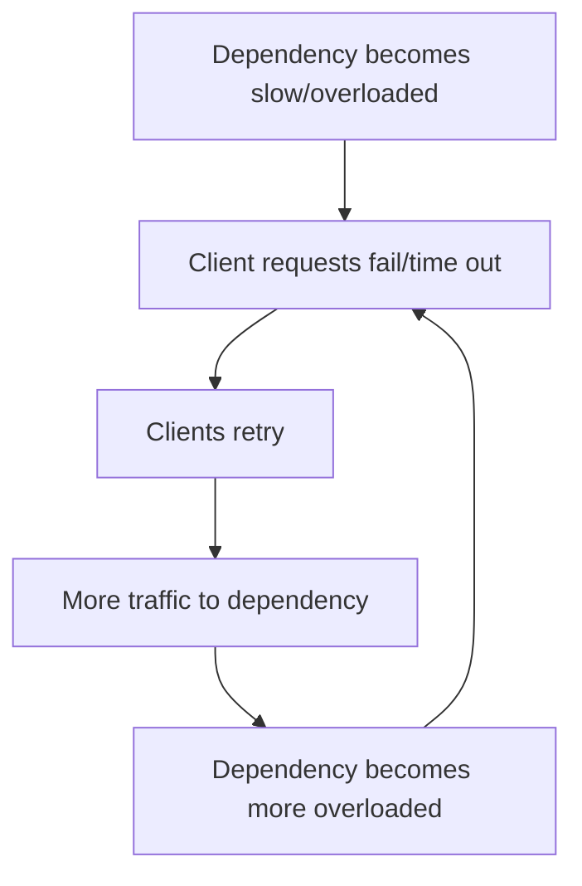
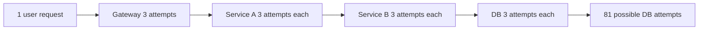
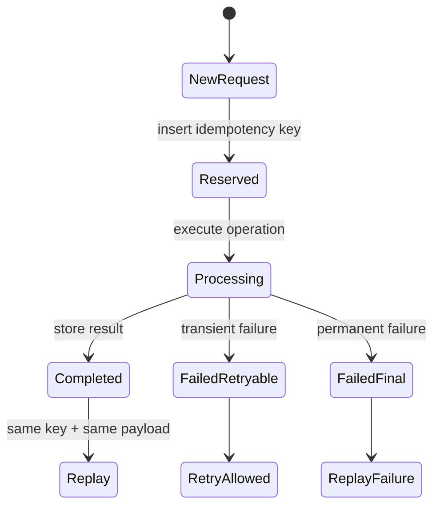
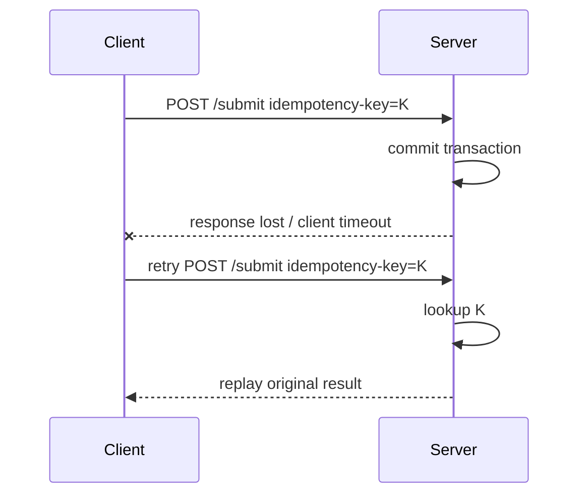
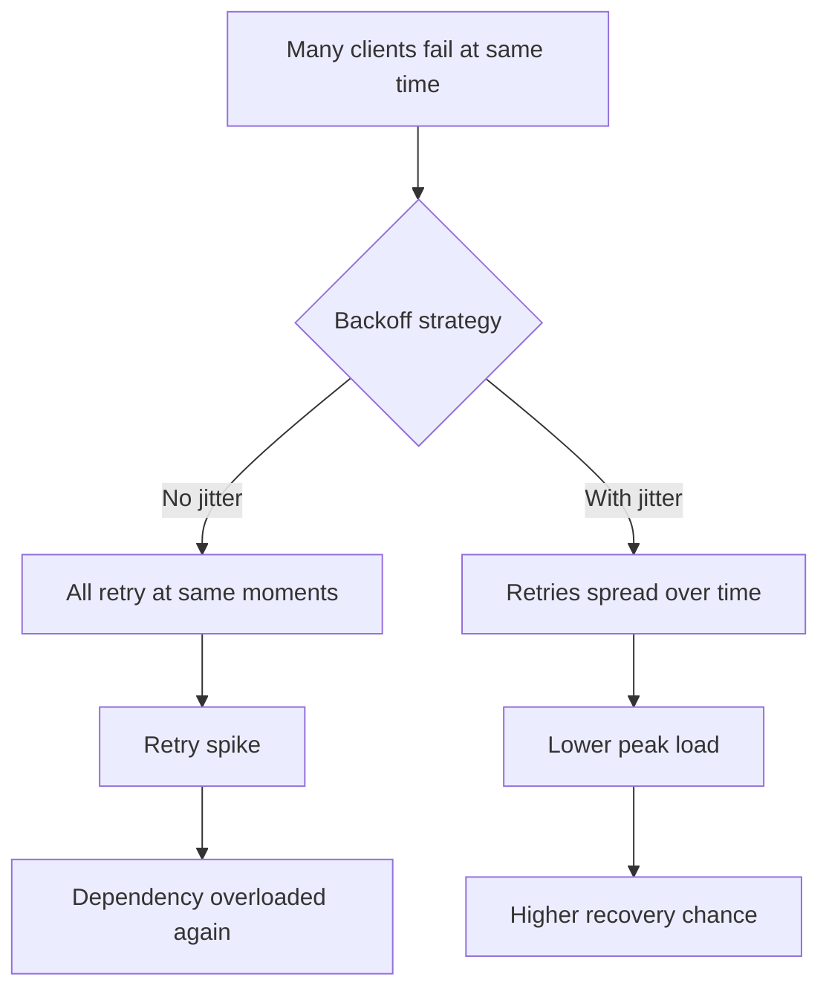
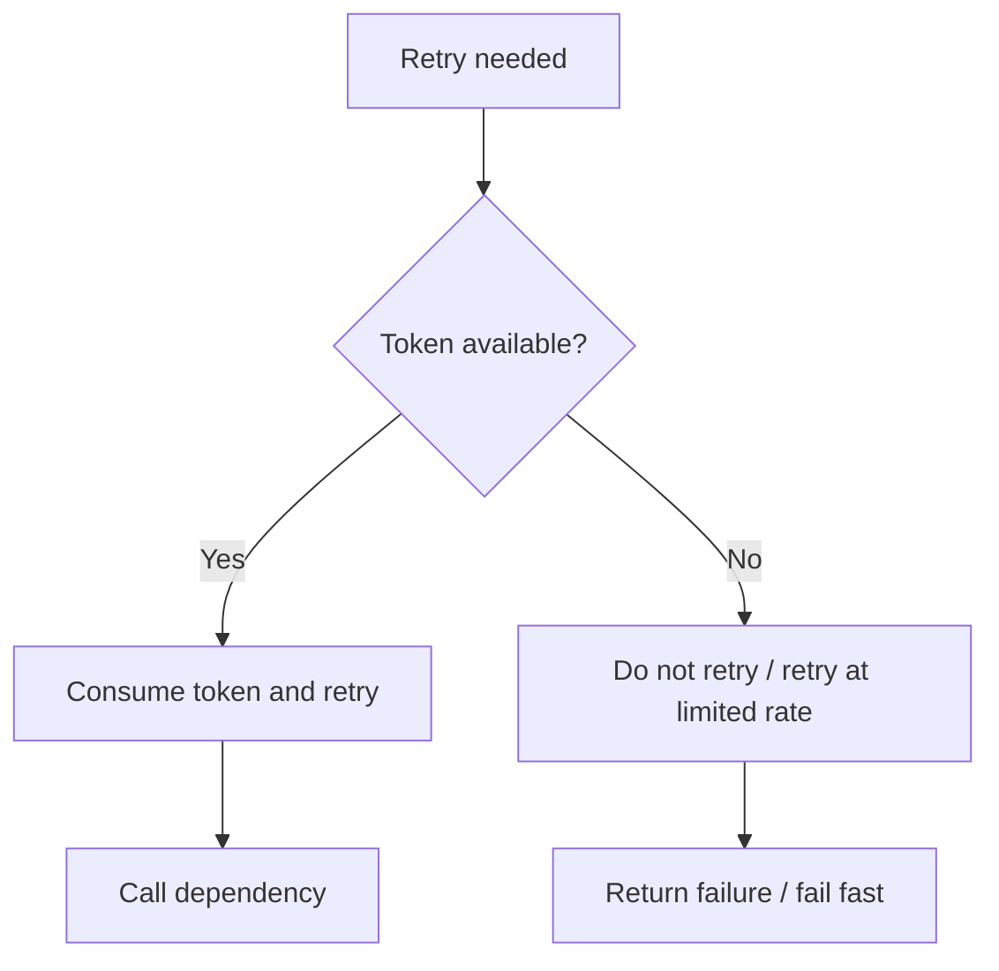
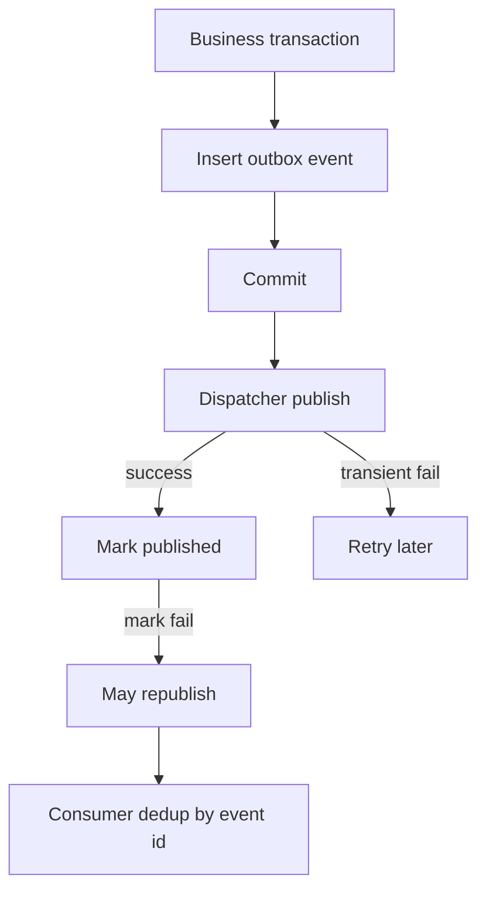
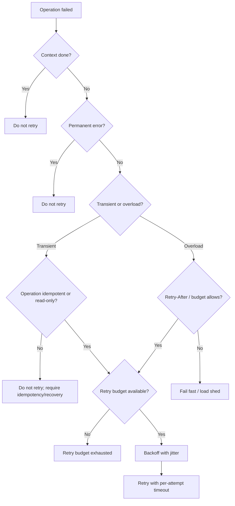
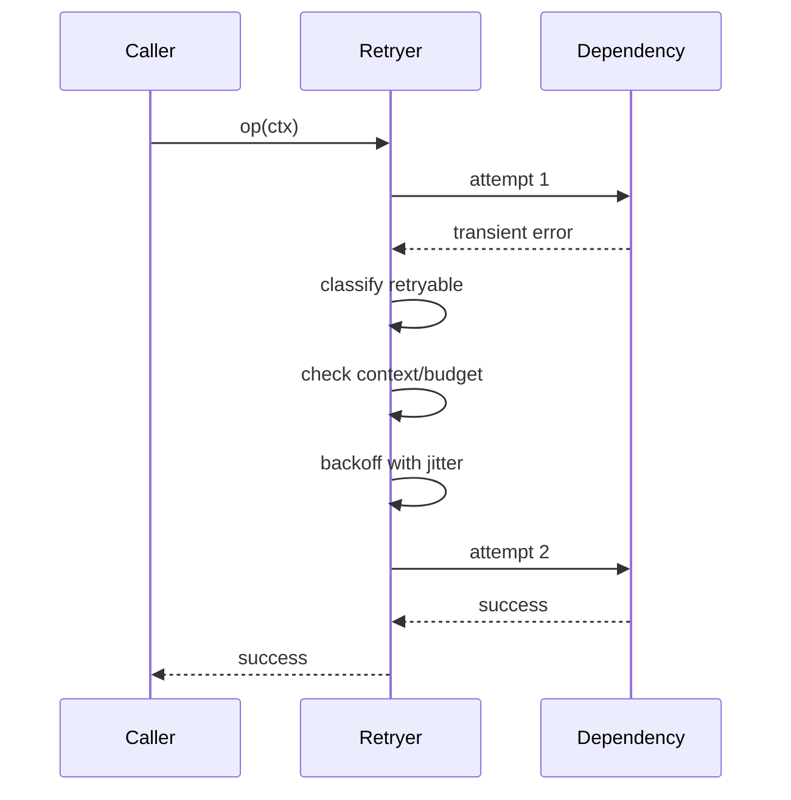
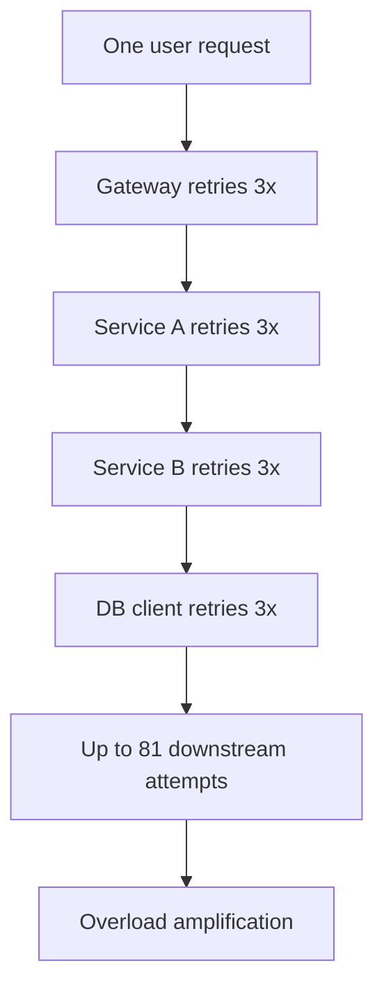

# learn-go-reliability-error-handling-part-014.md

# Retry Engineering: Safe Retry, Backoff, Jitter, Retry Budget, Idempotency

> Seri: `learn-go-reliability-error-handling`  
> Part: `014`  
> Target: Go 1.26.x  
> Level: Advanced / internal engineering handbook  
> Fokus: mendesain retry yang aman, bounded, observable, dan tidak memperburuk outage.

---

## 0. Posisi Materi Ini Dalam Seri

Bagian sebelumnya membahas timeout engineering:

- endpoint timeout
- HTTP server/client timeout
- DB timeout
- queue timeout
- retry total budget vs per-attempt timeout
- timeout ambiguity
- timeout + idempotency

Sekarang kita masuk ke topik yang secara natural mengikuti timeout: **retry**.

Retry terlihat sederhana:

```go
for i := 0; i < 3; i++ {
    err := call()
    if err == nil {
        return nil
    }
}
return err
```

Namun dalam sistem produksi, retry yang salah bisa menjadi penyebab outage lebih besar daripada error awal.

Retry bisa membantu ketika:

- kegagalan transient
- dependency sesaat lambat
- packet loss
- connection reset
- leader election singkat
- rate limit sementara
- stale connection
- optimistic lock conflict yang bisa diulang
- deadlock database yang aman diulang
- broker publish transient failure

Retry bisa merusak ketika:

- dependency sedang overload
- error permanent
- operation tidak idempotent
- timeout outcome ambiguous
- semua client retry bersamaan
- retry berlapis di banyak layer
- retry tidak menghormati context deadline
- retry menahan resource terlalu lama
- retry memperbanyak duplicate side effect
- retry membuat traffic amplification

Topik ini bukan “pakai exponential backoff”. Topik ini adalah **retry sebagai control system**.

---

## 1. Core Thesis

Retry bukan fitur default. Retry adalah **policy decision**.

Sebelum menulis retry, jawab:

1. Error ini transient atau permanent?
2. Operation ini idempotent?
3. Timeout terjadi pada fase apa?
4. Apakah server mungkin sudah melakukan side effect?
5. Apakah retry memperbaiki probabilitas sukses?
6. Apakah retry memperburuk overload?
7. Siapa layer yang bertanggung jawab retry?
8. Berapa total budget retry?
9. Berapa per-attempt timeout?
10. Apakah retry memiliki backoff dan jitter?
11. Apakah ada retry budget/token?
12. Bagaimana retry diobservasi?
13. Bagaimana duplicate result di-handle?
14. Apa response ke caller jika semua retry gagal?

Retry yang baik:

- selective
- bounded
- context-aware
- idempotency-aware
- jittered
- observable
- coordinated with timeout
- avoids amplification
- respects overload signals

---

## 2. Why Retry Exists

Distributed systems fail in non-deterministic ways.

A request can fail because:

- packet dropped
- connection reused but stale
- server just restarted
- load balancer target draining
- dependency leader changed
- DB deadlock victim
- optimistic conflict
- temporary DNS issue
- throttling window
- broker temporarily unavailable
- object storage transient 5xx
- TLS connection reset
- connection pool race

Retry improves success probability when failure is transient and retry cost is acceptable.

But retry is not free.

Retry consumes:

- caller time budget
- CPU
- memory
- goroutines
- connection pool slots
- DB connections
- downstream capacity
- rate limit quota
- queue slots
- user patience

Retry is spending more system capacity to buy a chance of success.

---

## 3. Retry as Feedback Loop

Retry creates feedback.



This is a positive feedback loop.

Google SRE describes cascading failure as failure that grows over time as overload increases probability of more failures. Retry is one mechanism that can feed that loop if uncontrolled.

Therefore retry engineering is partly about **preventing retries from becoming an overload amplifier**.

---

## 4. Retry Amplification

If each layer retries, multiplication happens.

Example:

```text
API gateway retries 3x
Service A retries 3x
Service B retries 3x
DB client retries 3x
```

Worst case:

```text
3 × 3 × 3 × 3 = 81 attempts
```

One user request becomes 81 downstream attempts.



Retry policy must be coordinated.

Rule:

> Retry should happen at the layer that has enough semantic knowledge to know whether retry is safe and enough budget knowledge to know whether retry is still useful.

---

## 5. Retry Eligibility

Not all errors are retryable.

### 5.1 Usually Retryable

Potentially retryable:

- network connection reset before request body sent
- DNS temporary failure
- HTTP 502/503/504
- HTTP 429 with `Retry-After`
- database deadlock victim
- serialization failure
- optimistic concurrency conflict if operation can recompute
- broker temporary unavailable
- object storage transient 5xx
- lock acquisition conflict if usecase allows wait/retry
- dependency timeout before side effect is accepted
- stale connection

### 5.2 Usually Not Retryable

Usually not retryable:

- validation error
- authentication failure
- authorization failure
- business rule violation
- not found, unless eventual consistency expected
- malformed request
- schema mismatch
- unsupported operation
- permanent configuration error
- data corruption
- duplicate idempotency key with different payload
- quota exhausted without retry-after window
- panic/programmer bug
- deterministic domain rejection

### 5.3 Ambiguous

Ambiguous:

- timeout after request sent
- timeout during response read
- connection reset after server received request
- DB commit error
- message ack timeout
- distributed lock acquire timeout
- external API returned unknown state
- partial batch failure

Ambiguous outcome requires idempotency/reconciliation, not blind retry.

---

## 6. Retryability Is Policy, Not Just Error Type

An error can be retryable in one context and not retryable in another.

Example: HTTP 409 Conflict.

- For optimistic locking with recompute: retryable.
- For duplicate username: not retryable.
- For state transition already completed: maybe idempotent success.
- For conflicting idempotency key payload: permanent error.

Example: HTTP 404.

- User fetches case by ID: not retryable.
- Read-after-write in eventually consistent store: retryable for short window.
- Dependency route not found: permanent config error.

Example: timeout.

- GET profile: retryable if budget remains.
- POST payment without idempotency: unsafe.
- DB commit timeout: ambiguous, require recovery.

Retry classifier must include operation semantics.

---

## 7. Basic Retry Classifier

```go
type RetryDecision struct {
    Retryable bool
    Reason    string
}

func IsRetryable(err error) RetryDecision {
    switch {
    case err == nil:
        return RetryDecision{Retryable: false, Reason: "success"}

    case errors.Is(err, context.Canceled):
        return RetryDecision{Retryable: false, Reason: "context_canceled"}

    case errors.Is(err, context.DeadlineExceeded):
        return RetryDecision{Retryable: true, Reason: "timeout"}

    case errors.Is(err, ErrRateLimited):
        return RetryDecision{Retryable: true, Reason: "rate_limited"}

    case errors.Is(err, ErrDependencyUnavailable):
        return RetryDecision{Retryable: true, Reason: "dependency_unavailable"}

    case errors.Is(err, ErrValidation):
        return RetryDecision{Retryable: false, Reason: "validation"}

    case errors.Is(err, ErrForbidden):
        return RetryDecision{Retryable: false, Reason: "forbidden"}

    default:
        return RetryDecision{Retryable: false, Reason: "unknown"}
    }
}
```

This is only a start. Real retry policy needs operation metadata.

---

## 8. Operation-aware Retry Policy

```go
type OperationKind string

const (
    OperationRead          OperationKind = "read"
    OperationCreate        OperationKind = "create"
    OperationUpdate        OperationKind = "update"
    OperationSubmitCase    OperationKind = "submit_case"
    OperationPublishEvent  OperationKind = "publish_event"
)

type RetryPolicy struct {
    Operation         OperationKind
    MaxAttempts      int
    PerAttemptTimeout time.Duration
    BaseDelay        time.Duration
    MaxDelay         time.Duration
    Idempotent       bool
}

func (p RetryPolicy) CanRetry(err error) bool {
    if err == nil {
        return false
    }

    if errors.Is(err, context.Canceled) {
        return false
    }

    if errors.Is(err, ErrValidation) ||
        errors.Is(err, ErrForbidden) ||
        errors.Is(err, ErrBusinessRuleViolation) {
        return false
    }

    if errors.Is(err, ErrAmbiguousOutcome) && !p.Idempotent {
        return false
    }

    if errors.Is(err, context.DeadlineExceeded) {
        return p.Idempotent || p.Operation == OperationRead
    }

    if errors.Is(err, ErrDependencyUnavailable) ||
        errors.Is(err, ErrRateLimited) {
        return true
    }

    return false
}
```

Policy must know whether operation is idempotent.

---

## 9. Idempotency: The Gatekeeper of Safe Retry

Idempotency means repeating the same operation has the same effect as doing it once.

### 9.1 Naturally Idempotent

Examples:

- `GET /cases/{id}`
- `PUT /profile/{id}` with full replacement
- `DELETE /resource/{id}` if delete missing is acceptable
- setting status to a specific value, if state machine allows
- insert with unique key and same payload replay
- publish event with deterministic event id and dedup

### 9.2 Not Naturally Idempotent

Examples:

- `POST /payments`
- `POST /cases/{id}/submit` if it creates new submission each time
- increment counter
- send email
- create audit event without dedup
- enqueue job without idempotency key
- append-only event without deterministic id
- assign case to next officer from queue

### 9.3 Make Operation Idempotent

Mechanisms:

- idempotency key
- request fingerprint
- unique constraint
- deterministic operation id
- state machine guard
- deduplication table
- replay stored response
- outbox with event id
- optimistic version
- compare-and-swap
- exactly-once illusion via idempotent side effects

Retry safety for side-effecting operation usually requires idempotency.

---

## 10. Idempotency Key Pattern

Client sends:

```http
Idempotency-Key: 01J...
```

Server stores:

```text
idempotency_key
request_hash
status: processing/completed/failed
response_code
response_body
created_at
expires_at
```

Flow:



### 10.1 Key Rules

- Same key + same payload => return stored result or continue existing operation.
- Same key + different payload => error.
- Completed result should be replayable.
- Processing state should prevent concurrent duplicate execution.
- Expiry window must cover retry window.
- Store enough response to replay.
- Do not delete idempotency record immediately after success.

---

## 11. Retry and Timeout Ambiguity

Timeout after sending request is ambiguous.



Without idempotency, server might process twice.

### 11.1 Ambiguous Timeout Classifier

```go
var ErrAmbiguousOutcome = errors.New("ambiguous outcome")

func classifyHTTPClientError(req *http.Request, err error, requestStarted bool) error {
    if err == nil {
        return nil
    }

    if errors.Is(err, context.DeadlineExceeded) && requestStarted {
        if req.Method == http.MethodPost || req.Method == http.MethodPatch {
            return fmt.Errorf("%w: %v", ErrAmbiguousOutcome, err)
        }
    }

    return err
}
```

In practice, knowing whether server received request is hard. Conservative design treats side-effecting timeout as ambiguous unless idempotency exists.

---

## 12. Backoff

Backoff means wait before retry.

Without backoff:

```text
fail → retry immediately → fail → retry immediately
```

This hammers dependency.

### 12.1 Fixed Backoff

```text
100ms, 100ms, 100ms
```

Simple but can synchronize many clients.

### 12.2 Linear Backoff

```text
100ms, 200ms, 300ms
```

Better but still correlated.

### 12.3 Exponential Backoff

```text
100ms, 200ms, 400ms, 800ms, ...
```

Common.

### 12.4 Capped Exponential Backoff

```text
100ms, 200ms, 400ms, 800ms, 1s, 1s, 1s
```

Prevents unbounded delay.

But capped exponential without jitter can cause retry waves at cap.

---

## 13. Jitter

Jitter adds randomness to delay.

AWS Builders Library explains that when failures are caused by overload or contention, backoff alone can remain correlated; jitter spreads retries around in time.

### 13.1 No Jitter

All clients retry after same delay.

```text
1000 clients fail at T0
1000 clients retry at T0+100ms
1000 clients retry at T0+300ms
1000 clients retry at T0+700ms
```

### 13.2 With Jitter

Retries spread across interval.

```text
1000 clients fail at T0
client A retries at 17ms
client B retries at 93ms
client C retries at 41ms
...
```

### 13.3 Mermaid: Correlated vs Jittered Retry



---

## 14. Jitter Algorithms

### 14.1 Full Jitter

Common AWS-recommended style:

```text
sleep = random(0, min(cap, base * 2^attempt))
```

Go:

```go
func FullJitter(base, cap time.Duration, attempt int, rnd *rand.Rand) time.Duration {
    max := base << attempt
    if max > cap {
        max = cap
    }
    if max <= 0 {
        return 0
    }
    return time.Duration(rnd.Int63n(int64(max)))
}
```

### 14.2 Equal Jitter

```text
temp = min(cap, base * 2^attempt)
sleep = temp/2 + random(0, temp/2)
```

Keeps minimum delay.

```go
func EqualJitter(base, cap time.Duration, attempt int, rnd *rand.Rand) time.Duration {
    max := base << attempt
    if max > cap {
        max = cap
    }
    half := max / 2
    if half <= 0 {
        return 0
    }
    return half + time.Duration(rnd.Int63n(int64(half)))
}
```

### 14.3 Decorrelated Jitter

```text
sleep = min(cap, random(base, previous * 3))
```

```go
func DecorrelatedJitter(base, cap, previous time.Duration, rnd *rand.Rand) time.Duration {
    if previous <= 0 {
        previous = base
    }

    max := previous * 3
    if max < base {
        max = base
    }

    delta := max - base
    sleep := base
    if delta > 0 {
        sleep += time.Duration(rnd.Int63n(int64(delta)))
    }

    if sleep > cap {
        return cap
    }
    return sleep
}
```

### 14.4 Which One?

Good default for many systems:

- capped exponential backoff with full jitter
- small max attempts
- total context budget
- token bucket retry budget

---

## 15. Retry Budget

Retry budget limits total retry volume.

Without retry budget, retries can dominate traffic during outage.

Retry budget options:

1. Max attempts per request.
2. Total time budget via context.
3. Token bucket per process/dependency.
4. Percentage of original traffic.
5. Global/adaptive retry control.
6. Circuit breaker open state.
7. Retry-After compliance.
8. Per-tenant retry quota.

AWS Builders Library discusses limiting retries locally with token bucket so calls retry while tokens exist, then retry at a fixed rate when tokens are exhausted.

### 15.1 Token Bucket Concept



### 15.2 Simple Retry Token Bucket

```go
type RetryBudget struct {
    ch chan struct{}
}

func NewRetryBudget(tokens int) *RetryBudget {
    b := &RetryBudget{ch: make(chan struct{}, tokens)}
    for i := 0; i < tokens; i++ {
        b.ch <- struct{}{}
    }
    return b
}

func (b *RetryBudget) TryAcquire() bool {
    select {
    case <-b.ch:
        return true
    default:
        return false
    }
}

func (b *RetryBudget) Release() {
    select {
    case b.ch <- struct{}{}:
    default:
    }
}
```

This is incomplete for production because refill behavior matters.

### 15.3 Refilled Token Bucket

```go
type TokenBucket struct {
    ch chan struct{}
}

func NewTokenBucket(ctx context.Context, capacity int, refillEvery time.Duration) *TokenBucket {
    b := &TokenBucket{ch: make(chan struct{}, capacity)}

    for i := 0; i < capacity; i++ {
        b.ch <- struct{}{}
    }

    go func() {
        ticker := time.NewTicker(refillEvery)
        defer ticker.Stop()

        for {
            select {
            case <-ctx.Done():
                return
            case <-ticker.C:
                select {
                case b.ch <- struct{}{}:
                default:
                }
            }
        }
    }()

    return b
}

func (b *TokenBucket) TryAcquire() bool {
    select {
    case <-b.ch:
        return true
    default:
        return false
    }
}
```

Production version needs metrics and lifecycle management.

---

## 16. Retry-After

HTTP `Retry-After` indicates when client should retry.

It can be:

- seconds
- HTTP date

Respect it when reasonable.

```go
func parseRetryAfter(h string, now time.Time) (time.Duration, bool) {
    if h == "" {
        return 0, false
    }

    if seconds, err := strconv.Atoi(h); err == nil {
        if seconds < 0 {
            return 0, false
        }
        return time.Duration(seconds) * time.Second, true
    }

    if t, err := http.ParseTime(h); err == nil {
        d := t.Sub(now)
        if d < 0 {
            return 0, true
        }
        return d, true
    }

    return 0, false
}
```

Caution:

- cap Retry-After to your total budget
- don't sleep beyond caller deadline
- malicious/buggy server can send huge Retry-After
- metric it

---

## 17. Context-aware Retry Loop

A correct retry loop must:

- accept parent context
- create per-attempt context
- call cancel each attempt
- stop if parent done
- classify retryability
- wait with jitter
- respect retry-after
- not exceed max attempts
- preserve last error
- expose attempt metrics

```go
type RetryPolicy struct {
    MaxAttempts       int
    PerAttemptTimeout time.Duration
    BaseDelay         time.Duration
    MaxDelay          time.Duration
    Jitter            func(base, cap time.Duration, attempt int) time.Duration
    CanRetry          func(error) bool
}

func Retry(ctx context.Context, policy RetryPolicy, op func(context.Context, int) error) error {
    if policy.MaxAttempts <= 0 {
        policy.MaxAttempts = 1
    }

    var last error

    for attempt := 1; attempt <= policy.MaxAttempts; attempt++ {
        if ctx.Err() != nil {
            return errors.Join(last, context.Cause(ctx))
        }

        attemptCtx := ctx
        cancel := func() {}

        if policy.PerAttemptTimeout > 0 {
            attemptCtx, cancel = context.WithTimeout(ctx, policy.PerAttemptTimeout)
        }

        err := op(attemptCtx, attempt)
        cancel()

        if err == nil {
            return nil
        }

        last = err

        if attempt == policy.MaxAttempts {
            return last
        }

        if !policy.CanRetry(err) {
            return last
        }

        if ctx.Err() != nil {
            return errors.Join(last, context.Cause(ctx))
        }

        delay := policy.Jitter(policy.BaseDelay, policy.MaxDelay, attempt-1)
        if err := sleepContext(ctx, delay); err != nil {
            return errors.Join(last, err)
        }
    }

    return last
}

func sleepContext(ctx context.Context, d time.Duration) error {
    if d <= 0 {
        return nil
    }

    timer := time.NewTimer(d)
    defer timer.Stop()

    select {
    case <-timer.C:
        return nil
    case <-ctx.Done():
        return context.Cause(ctx)
    }
}
```

---

## 18. Retry Result Metadata

Sometimes caller needs attempt count.

```go
type RetryResult struct {
    Attempts int
    Err      error
}

func RetryWithResult(ctx context.Context, policy RetryPolicy, op func(context.Context, int) error) RetryResult {
    var attempts int
    var last error

    for attempt := 1; attempt <= policy.MaxAttempts; attempt++ {
        attempts = attempt

        err := op(ctx, attempt)
        if err == nil {
            return RetryResult{Attempts: attempts}
        }

        last = err

        if attempt == policy.MaxAttempts || !policy.CanRetry(err) {
            break
        }
    }

    return RetryResult{Attempts: attempts, Err: last}
}
```

Useful for:

- logging
- metrics
- response hints
- debugging
- adaptive policy

---

## 19. HTTP Retry Policy

### 19.1 Retry by Method

Default safe-ish:

| Method | Retry default |
|---|---|
| GET | yes if transient |
| HEAD | yes if transient |
| PUT | yes if idempotent semantics |
| DELETE | maybe, if idempotent |
| POST | no unless idempotency key |
| PATCH | no unless explicit idempotency/conditional update |

### 19.2 Retry by Status Code

Potentially retry:

- 408 Request Timeout
- 429 Too Many Requests
- 500 Internal Server Error, cautiously
- 502 Bad Gateway
- 503 Service Unavailable
- 504 Gateway Timeout

Usually not retry:

- 400
- 401
- 403
- 404, unless eventual consistency
- 409, unless optimistic/recompute
- 422
- 429 without budget? depends
- 501

### 19.3 HTTP Client Wrapper Example

```go
func (c *Client) DoJSON(ctx context.Context, req *http.Request, out any) error {
    policy := c.retryPolicyFor(req)

    return Retry(ctx, policy, func(attemptCtx context.Context, attempt int) error {
        cloned := req.Clone(attemptCtx)

        resp, err := c.http.Do(cloned)
        if err != nil {
            if attemptCtx.Err() != nil {
                return fmt.Errorf("http attempt context done: %w", context.Cause(attemptCtx))
            }
            return fmt.Errorf("http attempt failed: %w", err)
        }
        defer resp.Body.Close()

        if isRetryableStatus(resp.StatusCode) {
            drainLimited(resp.Body)
            return NewHTTPStatusError(resp.StatusCode)
        }

        if resp.StatusCode < 200 || resp.StatusCode >= 300 {
            body, _ := io.ReadAll(io.LimitReader(resp.Body, 4<<10))
            return fmt.Errorf("unexpected status %d: %s", resp.StatusCode, body)
        }

        if err := json.NewDecoder(resp.Body).Decode(out); err != nil {
            return fmt.Errorf("decode response: %w", err)
        }

        return nil
    })
}
```

### 19.4 Body Replay Problem

Retrying HTTP request with body requires body replay.

If body is streaming and cannot be replayed, retry is unsafe/impossible unless buffered or `GetBody` is set.

For `http.Request`, `GetBody` can allow replay for client requests.

Policy:

- retry GET/HEAD easily
- retry small JSON body by buffering safely
- do not retry large streaming upload unless resumable/idempotent
- use idempotency key for POST

---

## 20. Database Retry Policy

Potentially retryable:

- deadlock
- serialization failure
- connection reset before transaction starts
- transient network error
- lock timeout if operation can be retried
- optimistic concurrency conflict with recompute

Usually not retryable:

- syntax error
- missing table/column
- constraint violation due to invalid input
- foreign key violation
- unique violation unless idempotency/dedup
- permission error
- data truncation
- migration/schema mismatch

### 20.1 Transaction Retry

Transaction retry must retry the whole transaction function, not just failed statement.

```go
func WithTxRetry(ctx context.Context, db *sql.DB, policy RetryPolicy, fn func(context.Context, *sql.Tx) error) error {
    return Retry(ctx, policy, func(attemptCtx context.Context, attempt int) error {
        tx, err := db.BeginTx(attemptCtx, nil)
        if err != nil {
            return fmt.Errorf("begin tx: %w", err)
        }

        committed := false
        defer func() {
            if !committed {
                _ = tx.Rollback()
            }
        }()

        if err := fn(attemptCtx, tx); err != nil {
            return fmt.Errorf("tx function: %w", err)
        }

        if err := tx.Commit(); err != nil {
            return fmt.Errorf("commit tx: %w", err)
        }
        committed = true

        return nil
    })
}
```

### 20.2 Warning: Commit Ambiguity

If commit returns error, retrying entire transaction may duplicate side effects unless transaction is idempotent and guarded.

For critical operations:

- idempotency key
- unique operation id
- state transition guard
- outbox
- reconciliation
- check final state before retry
- avoid retrying ambiguous commit blindly

---

## 21. Optimistic Lock Retry

Example:

```go
func (s *Service) UpdateCase(ctx context.Context, id CaseID, change Change) error {
    policy := RetryPolicy{
        MaxAttempts:       3,
        PerAttemptTimeout: 300 * time.Millisecond,
        BaseDelay:         20 * time.Millisecond,
        MaxDelay:          100 * time.Millisecond,
        CanRetry: func(err error) bool {
            return errors.Is(err, ErrVersionConflict)
        },
    }

    return Retry(ctx, policy, func(ctx context.Context, attempt int) error {
        c, err := s.repo.Get(ctx, id)
        if err != nil {
            return err
        }

        if err := c.Apply(change); err != nil {
            return err
        }

        return s.repo.SaveIfVersion(ctx, c)
    })
}
```

This is safe if:

- change can be recomputed
- domain transition still valid on latest state
- retries bounded
- conflict metric observed

Not safe if operation depends on stale decision that cannot be recomputed.

---

## 22. Message Retry

Message systems often retry through redelivery.

Dimensions:

- immediate retry in memory
- nack/requeue
- delayed retry queue/topic
- exponential backoff per message
- DLQ after max attempts
- poison message detection
- idempotent consumer

### 22.1 In-memory Retry Before Nack

```go
err := Retry(ctx, policy, func(ctx context.Context, attempt int) error {
    return handle(ctx, msg)
})
```

Can be useful for very transient dependency.

But too much in-memory retry blocks consumer slot and delays other messages.

### 22.2 Broker-level Retry

Often better:

- fail message
- broker redelivers later
- delayed retry topic
- DLQ after attempts

Consumer must be idempotent.

### 22.3 Ack/Nack Semantics

If processing succeeded but ack failed, outcome ambiguous:

- message may redeliver
- consumer must dedup
- operation must be idempotent

---

## 23. Retry and Circuit Breaker

Circuit breaker prevents repeated calls to failing dependency.

States:

- closed: calls allowed
- open: calls rejected fast
- half-open: limited probe calls

Retry and circuit breaker interact:

- retry can cause breaker to open faster
- open breaker should stop retry attempts
- half-open should avoid many concurrent retries
- retry policy should respect breaker rejection
- breaker rejection may be retryable later, but not immediately

Example classification:

```go
if errors.Is(err, ErrCircuitOpen) {
    return false // do not retry immediately
}
```

---

## 24. Retry and Load Shedding

If system is overloaded, retry should often decrease, not increase.

Signals:

- HTTP 429
- HTTP 503
- queue full
- bulkhead full
- circuit open
- local CPU/memory pressure
- DB pool exhausted
- dependency Retry-After
- adaptive concurrency rejection

Policy:

- fail fast
- honor Retry-After
- use jitter
- reduce max attempts
- disable retries under overload
- preserve capacity for fresh traffic
- shed low-priority work

---

## 25. Retry and Hedging

Hedging sends duplicate request before first fails, usually after p95 delay.

This is not ordinary retry.

Benefits:

- reduce tail latency
- helps with stragglers

Risks:

- increases load even when not failing
- duplicate side effect risk
- requires idempotent read or safe operation
- must cap hedge rate
- can worsen overload

Example:

```text
send request A
if no response by p95, send request B
use first response
cancel loser
```

Use only for:

- read-only idempotent operations
- highly replicated services
- strict hedge budget
- overload-aware conditions

Not for side-effecting operations.

---

## 26. Retry Observability

Metrics:

```text
retry_attempts_total{dependency,operation,result,reason}
retry_exhausted_total{dependency,operation,reason}
retry_success_after_attempt_total{dependency,operation,attempt}
retry_budget_exhausted_total{dependency}
retry_delay_seconds{dependency,operation}
```

Avoid high cardinality:

Bad:

```text
retry_attempts_total{error="profile user 123 timeout after 801ms"}
```

Good:

```text
retry_attempts_total{dependency="profile",operation="get_profile",reason="timeout"}
```

Logs:

```go
logger.WarnContext(ctx, "retrying dependency call",
    "dependency", "profile",
    "operation", "get_profile",
    "attempt", attempt,
    "max_attempts", policy.MaxAttempts,
    "delay_ms", delay.Milliseconds(),
    "reason", decision.Reason,
    "error", err,
)
```

Do not log every retry at error level in high-traffic system. Use debug/info/warn based on attempt and final outcome.

Trace attributes:

```text
retry.attempt = 2
retry.max_attempts = 3
retry.delay_ms = 147
retry.reason = timeout
```

---

## 27. Retry Alerting

Do not alert on every retry.

Alert on symptoms:

- increased user-visible error rate
- SLO burn
- retry exhaustion rate
- dependency timeout rate
- retry budget exhaustion
- queue saturation
- circuit breaker open
- downstream overload

Retry success after second attempt may be useful signal but not necessarily page-worthy.

---

## 28. Go Implementation: Production-ish Retry Package

### 28.1 Types

```go
type Decision struct {
    Retry bool
    Reason string
}

type Classifier func(error) Decision

type DelayFunc func(attempt int) time.Duration

type Policy struct {
    MaxAttempts       int
    PerAttemptTimeout time.Duration
    Delay             DelayFunc
    Classify          Classifier
    Budget            RetryBudget
}

type RetryBudget interface {
    TryAcquire() bool
}
```

### 28.2 Execute

```go
func Do(ctx context.Context, p Policy, op func(context.Context, int) error) error {
    if p.MaxAttempts <= 0 {
        p.MaxAttempts = 1
    }
    if p.Classify == nil {
        p.Classify = func(error) Decision {
            return Decision{Retry: false, Reason: "no_classifier"}
        }
    }
    if p.Delay == nil {
        p.Delay = func(int) time.Duration { return 0 }
    }

    var last error

    for attempt := 1; attempt <= p.MaxAttempts; attempt++ {
        if ctx.Err() != nil {
            return errors.Join(last, context.Cause(ctx))
        }

        attemptCtx := ctx
        cancel := func() {}
        if p.PerAttemptTimeout > 0 {
            attemptCtx, cancel = context.WithTimeout(ctx, p.PerAttemptTimeout)
        }

        err := op(attemptCtx, attempt)
        cancel()

        if err == nil {
            return nil
        }

        last = err

        if attempt >= p.MaxAttempts {
            return last
        }

        decision := p.Classify(err)
        if !decision.Retry {
            return last
        }

        if p.Budget != nil && !p.Budget.TryAcquire() {
            return errors.Join(last, ErrRetryBudgetExceeded)
        }

        delay := p.Delay(attempt)
        if err := sleepContext(ctx, delay); err != nil {
            return errors.Join(last, err)
        }
    }

    return last
}
```

### 28.3 Delay Function

```go
func FullJitterDelay(base, cap time.Duration, rnd *rand.Rand) DelayFunc {
    return func(attempt int) time.Duration {
        max := base << (attempt - 1)
        if max > cap {
            max = cap
        }
        if max <= 0 {
            return 0
        }
        return time.Duration(rnd.Int63n(int64(max)))
    }
}
```

### 28.4 Error

```go
var ErrRetryBudgetExceeded = errors.New("retry budget exceeded")
```

---

## 29. Randomness and Concurrency

Do not use a single `rand.Rand` concurrently without protection.

Options:

- use `math/rand/v2` APIs if appropriate for your Go version and policy
- create per-retryer rand with mutex
- use global concurrency-safe source if available
- use crypto randomness only if unpredictability is security requirement, usually not needed for retry jitter

Simple concurrency-safe wrapper:

```go
type SafeRand struct {
    mu  sync.Mutex
    rnd *rand.Rand
}

func (r *SafeRand) Int63n(n int64) int64 {
    r.mu.Lock()
    defer r.mu.Unlock()
    return r.rnd.Int63n(n)
}
```

For retry jitter, statistical spreading matters; cryptographic randomness is not normally required.

---

## 30. Retry Placement

Where should retry live?

### 30.1 Client Library

Good for:

- HTTP/gRPC dependency transient errors
- object storage SDK
- cloud SDK
- broker publish
- DB driver connection acquisition, cautiously

Pros:

- close to dependency error taxonomy
- reusable
- consistent

Cons:

- may not know operation idempotency
- may hide latency from caller
- can multiply with higher-level retry

### 30.2 Service/Usecase

Good for:

- operation-aware retry
- optimistic conflict retry
- transaction function retry
- idempotency-aware side effect
- retry only if budget remains

Pros:

- knows business semantics
- knows idempotency
- can recompute state

Cons:

- duplicated if every service hand-rolls
- needs shared platform utilities

### 30.3 Gateway/Proxy

Good for:

- safe idempotent GET
- connect failures
- upstream 503/502
- standardized edge policy

Bad for:

- POST side effects without idempotency
- domain-specific conflicts
- ambiguous outcomes

### 30.4 Database Driver/SDK

Many SDKs have built-in retry. Understand them.

If SDK retries internally and your app retries externally, you can get amplification.

Document retry layers.

---

## 31. Retry Configuration

Example:

```yaml
retry:
  dependencies:
    profile:
      max_attempts: 2
      per_attempt_timeout: 400ms
      base_delay: 50ms
      max_delay: 200ms
      jitter: full
      retry_budget:
        capacity: 100
        refill: 10/s

    document:
      max_attempts: 3
      per_attempt_timeout: 1s
      base_delay: 100ms
      max_delay: 1s
      jitter: full

  database:
    optimistic_conflict:
      max_attempts: 3
      base_delay: 10ms
      max_delay: 100ms
      jitter: full

    deadlock:
      max_attempts: 2
      base_delay: 20ms
      max_delay: 200ms
```

Avoid:

```yaml
retry_count: 3
retry_delay: 1s
```

without operation/dependency scope.

---

## 32. Regulatory Case Management: Submit Case

Operation:

```text
POST /cases/{id}/submit
Side-effecting: yes
Creates state transition, audit, outbox event
Requires idempotency key
```

### 32.1 What Can Be Retried?

| Step | Retry? | Reason |
|---|---|---|
| Decode request | no | deterministic client input |
| Validate request | no | deterministic |
| Resolve actor profile | yes if transient | read dependency |
| Acquire bulkhead | no immediate retry | overload signal |
| Get case for update | maybe | DB transient |
| Domain Submit | no | deterministic business rule |
| Save case | inside tx only | retry whole tx if safe |
| Audit insert | inside tx | retry whole tx if safe |
| Outbox insert | inside tx | retry whole tx if safe |
| Commit error | not blindly | ambiguous |
| Response write | no | client/network |

### 32.2 Idempotency Key Required

Without idempotency:

```text
Client timeout after commit
Client retries
Case submit may be processed twice
Audit duplicate
Outbox duplicate
```

With idempotency:

```text
Retry uses same key
Server returns original result
State transition not duplicated
Audit/outbox deduped by operation id
```

### 32.3 Transaction Retry

Safe only if:

- operation id stable
- domain transition idempotent or guarded
- unique constraints prevent duplicate event
- commit ambiguity handled
- re-read current state before retry
- idempotency record coordinates replay

---

## 33. Retry and State Machines

For lifecycle systems, retry must respect state.

Example:

```text
DRAFT --submit--> SUBMITTED
```

If retry sees state already `SUBMITTED`, possibilities:

1. Original operation succeeded. Return idempotent success.
2. Another actor submitted. Return conflict/forbidden.
3. Same idempotency key. Replay original result.
4. Same action but different payload. Error.
5. State moved further to `APPROVED`. Maybe replay success or conflict depending contract.

State machine must distinguish duplicate same operation from invalid second operation.

---

## 34. Retry and Audit Trail

Retry can create duplicate audit events.

Bad:

```text
attempt 1: audit CASE_SUBMITTED inserted
timeout
attempt 2: audit CASE_SUBMITTED inserted again
```

Fixes:

- audit event id = operation id
- unique constraint on operation id + event type
- idempotency record points to audit event
- audit event written in same transaction as state transition
- outbox event dedup uses same operation id

Audit must represent actual business transition, not every technical retry attempt.

Technical retries can be logged/metriced, not necessarily audited as business events.

---

## 35. Retry and Outbox

Outbox pattern helps retry external publication safely.

Inside transaction:

```text
update case
insert audit
insert outbox event with deterministic event_id
commit
```

Dispatcher retries publishing:

```text
fetch pending outbox
publish event
mark published
retry on transient failure
DLQ/manual review after limit
```

If publish succeeds but mark-published fails, event may publish again. Consumers must dedup by event ID.

Retry chain:



---

## 36. Retry Testing

### 36.1 Succeeds After Retry

```go
func TestRetrySucceedsSecondAttempt(t *testing.T) {
    attempts := 0

    err := Retry(context.Background(), policy, func(ctx context.Context, attempt int) error {
        attempts++
        if attempts == 1 {
            return ErrDependencyUnavailable
        }
        return nil
    })

    if err != nil {
        t.Fatalf("expected success, got %v", err)
    }
    if attempts != 2 {
        t.Fatalf("expected 2 attempts, got %d", attempts)
    }
}
```

### 36.2 Does Not Retry Permanent Error

```go
func TestRetryStopsOnValidation(t *testing.T) {
    attempts := 0

    err := Retry(context.Background(), policy, func(ctx context.Context, attempt int) error {
        attempts++
        return ErrValidation
    })

    if !errors.Is(err, ErrValidation) {
        t.Fatalf("expected validation, got %v", err)
    }
    if attempts != 1 {
        t.Fatalf("expected 1 attempt, got %d", attempts)
    }
}
```

### 36.3 Stops on Context Cancellation

```go
func TestRetryStopsOnContextCancel(t *testing.T) {
    ctx, cancel := context.WithCancel(context.Background())
    cancel()

    attempts := 0
    err := Retry(ctx, policy, func(ctx context.Context, attempt int) error {
        attempts++
        return ErrDependencyUnavailable
    })

    if !errors.Is(err, context.Canceled) {
        t.Fatalf("expected canceled, got %v", err)
    }
    if attempts != 0 {
        t.Fatalf("expected 0 attempts, got %d", attempts)
    }
}
```

### 36.4 Backoff Without Sleeping

Inject delay function and sleeper/fake clock.

```go
type Sleeper interface {
    Sleep(context.Context, time.Duration) error
}
```

Then test delays deterministically.

### 36.5 Retry Budget Exhausted

```go
budget := &fakeBudget{allow: false}

err := Retry(ctx, policyWithBudget(budget), opAlwaysTransient)

if !errors.Is(err, ErrRetryBudgetExceeded) {
    t.Fatalf("expected budget exhausted, got %v", err)
}
```

---

## 37. Code Review Checklist

### 37.1 Eligibility

- [ ] Is the error transient?
- [ ] Is the operation idempotent?
- [ ] Is timeout outcome ambiguous?
- [ ] Is retry safe for this method/state transition?
- [ ] Are permanent errors excluded?
- [ ] Is rate limit `Retry-After` respected?

### 37.2 Budget

- [ ] Is there a total context deadline?
- [ ] Is per-attempt timeout smaller than total budget?
- [ ] Does retry sleep observe context?
- [ ] Is max attempts bounded?
- [ ] Is delay capped?
- [ ] Is there retry budget/token under overload?

### 37.3 Backoff/Jitter

- [ ] Is backoff used?
- [ ] Is jitter used?
- [ ] Is cap set?
- [ ] Is random source concurrency-safe?
- [ ] Are retries distributed rather than synchronized?

### 37.4 Layering

- [ ] Is retry happening at the right layer?
- [ ] Are there hidden SDK retries?
- [ ] Are gateway/client/service retries multiplying?
- [ ] Is policy documented per dependency/operation?
- [ ] Does circuit breaker/load shedding stop retry?

### 37.5 Side Effects

- [ ] Is idempotency key required for side-effecting retry?
- [ ] Is duplicate side effect prevented?
- [ ] Is commit ambiguity handled?
- [ ] Are audit/outbox events deduped?
- [ ] Is response replay supported?

### 37.6 Observability

- [ ] Are attempts counted?
- [ ] Is retry exhaustion metric emitted?
- [ ] Are reasons low-cardinality?
- [ ] Are logs not too noisy?
- [ ] Are SLO alerts based on user-visible failure, not every retry?

---

## 38. Anti-Patterns

### 38.1 Retry Everything

```go
if err != nil {
    retry()
}
```

Wrong. Retry only selected failures.

### 38.2 Retry Without Context

```go
time.Sleep(delay)
```

Should be context-aware.

### 38.3 Retry POST Without Idempotency

Dangerous duplicate side effects.

### 38.4 Retry After Parent Deadline

Wasteful and misleading.

### 38.5 Retry on Validation/Authorization

Deterministic failure. Retry won't help.

### 38.6 Retry in Every Layer

Amplifies load.

### 38.7 Backoff Without Jitter

Creates retry waves.

### 38.8 Infinite Retry in Request Path

Breaks latency and resource control.

### 38.9 Increasing Retries During Outage

Often worsens outage.

### 38.10 Audit Every Technical Retry as Business Event

Pollutes audit trail.

### 38.11 Retrying Ambiguous Commit

Can duplicate transaction unless idempotent/reconciled.

### 38.12 Hidden SDK Retry + App Retry

May exceed budget.

---

## 39. Mermaid: Retry Decision Tree



---

## 40. Mermaid: Retry Lifecycle



---

## 41. Mermaid: Retry Amplification



---

## 42. Production Policy Template

```yaml
retry_policy:
  name: profile_get
  owner: profile-client
  applies_to:
    dependency: profile
    operation: get_profile
    methods: [GET]
  max_attempts: 2
  total_budget_source: caller_context
  per_attempt_timeout: 400ms
  backoff:
    type: exponential
    base: 50ms
    cap: 200ms
    jitter: full
  retryable:
    http_status: [429, 502, 503, 504]
    errors:
      - connection_reset
      - timeout
  not_retryable:
    http_status: [400, 401, 403, 404, 422]
  retry_after:
    respect: true
    max: 500ms
  idempotency_required: false
  retry_budget:
    capacity: 100
    refill_rate: 10/s
  observability:
    metrics: true
    log_attempts: final_only_unless_debug
```

For side-effecting operation:

```yaml
retry_policy:
  name: submit_case
  owner: case-service
  idempotency_required: true
  retryable:
    - optimistic_conflict
    - serialization_failure
    - dependency_timeout_before_side_effect
  not_retryable:
    - validation
    - authorization
    - business_rule
    - ambiguous_commit_without_reconciliation
```

---

## 43. Key Takeaways

1. Retry is a policy decision, not default error handling.
2. Retry helps transient failures but can amplify overload.
3. Retryability depends on operation semantics, not just error type.
4. Side-effecting retries require idempotency or reconciliation.
5. Timeout after request is sent can mean ambiguous outcome.
6. Backoff reduces immediate pressure.
7. Jitter prevents synchronized retry waves.
8. Retry budget prevents retries from dominating traffic.
9. Retry must fit inside total context deadline.
10. Per-attempt timeout and total timeout are different.
11. Retry sleep must observe context cancellation.
12. Avoid retrying permanent validation/auth/business errors.
13. Avoid retrying in every layer.
14. Respect `Retry-After`, but cap it to caller budget.
15. Circuit breaker/load shedding should reduce retry pressure under overload.
16. Message retry requires idempotent consumers and DLQ policy.
17. Transaction retry must retry the whole transaction and handle commit ambiguity.
18. Audit/outbox events need deterministic IDs to survive retry.
19. Observability should track attempts, exhaustion, reasons, and budget.
20. A mature retry system protects both caller success rate and dependency survival.

---

## 44. References

- AWS Builders Library: `Timeouts, retries, and backoff with jitter`
- AWS Architecture Blog: `Exponential Backoff And Jitter`
- Go package documentation: `context`
- Go package documentation: `net/http`
- Google SRE Book: `Addressing Cascading Failures`
- Go package documentation: `errors`
- Go package documentation: `time`

---

## 45. Next Part

Next:

```text
learn-go-reliability-error-handling-part-015.md
```

Topic:

```text
Idempotency, Deduplication, dan Exactly-Once Illusion
```


<!-- NAVIGATION_FOOTER -->
<div class="page-nav">
<a href="./learn-go-reliability-error-handling-part-013.md">⬅️ Timeout Engineering: Connect, TLS, Header, Body, Handler, DB, Queue</a>
<a href="./index.md">📚 Kategori</a>
<a href="../../index.md">🏠 Home</a>
<a href="./learn-go-reliability-error-handling-part-015.md">Idempotency, Deduplication, dan Exactly-Once Illusion ➡️</a>
</div>
