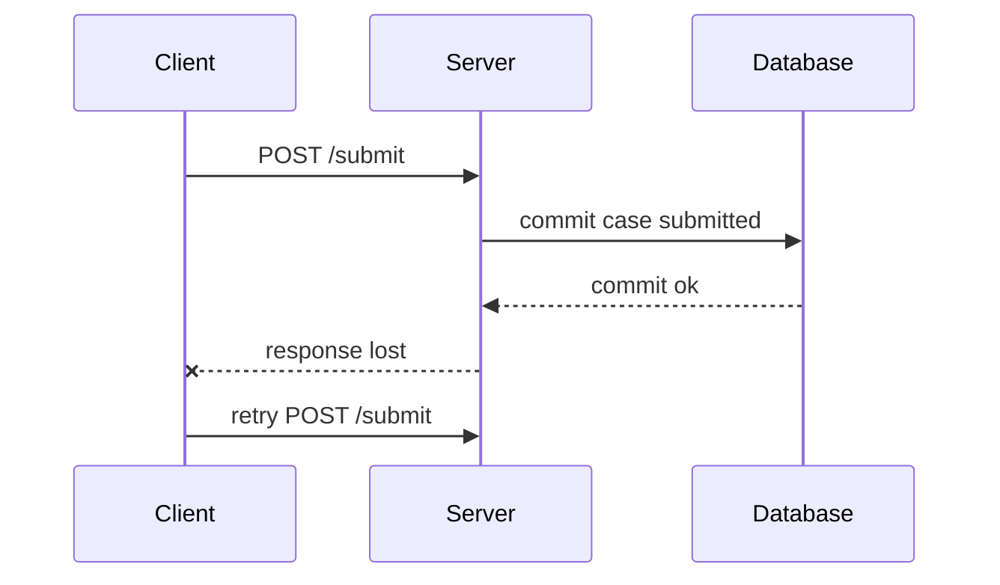
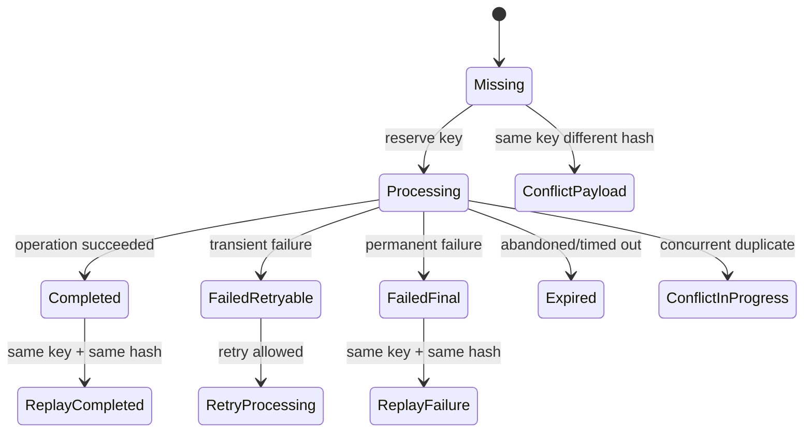
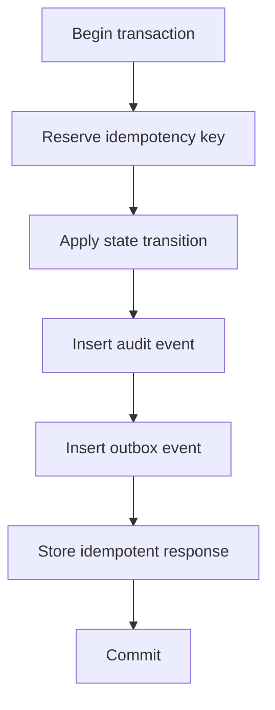
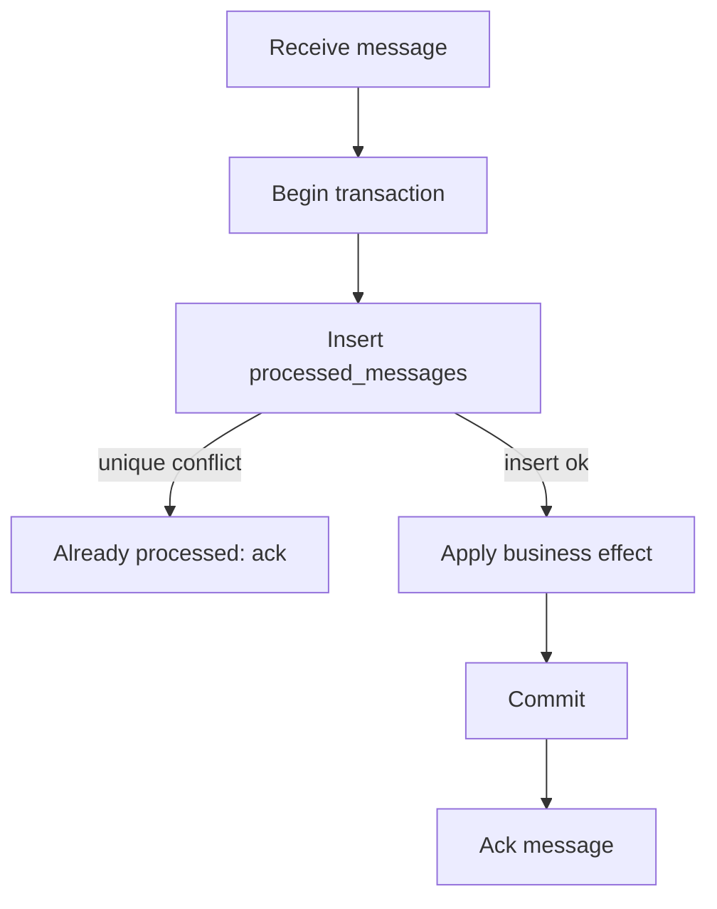
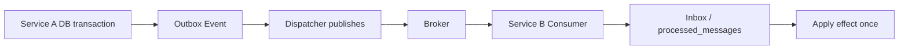
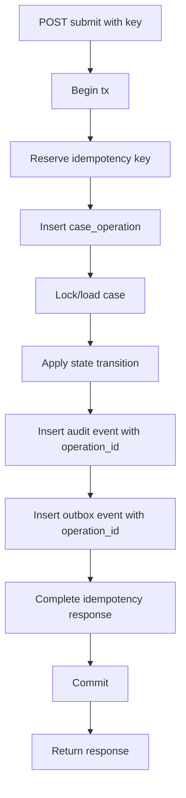
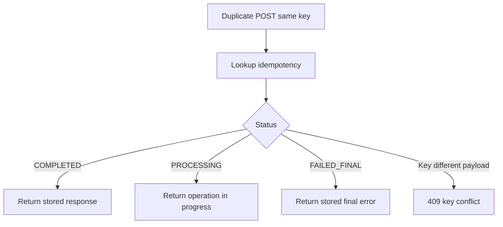

# learn-go-reliability-error-handling-part-015.md

# Idempotency, Deduplication, dan Exactly-Once Illusion

> Seri: `learn-go-reliability-error-handling`  
> Part: `015`  
> Target: Go 1.26.x  
> Level: Advanced / internal engineering handbook  
> Fokus: mendesain operasi side-effecting yang aman terhadap retry, duplicate request, duplicate message, timeout ambiguity, dan partial failure.

---

## 0. Posisi Materi Ini Dalam Seri

Pada `part-014`, kita membahas retry engineering:

- retryability
- backoff
- jitter
- retry budget
- per-attempt timeout
- ambiguous timeout
- retry amplification
- idempotency sebagai syarat retry side-effecting operation

Bagian ini memperdalam inti yang sering menentukan apakah sistem production aman atau tidak:

> Bagaimana membuat operasi tetap benar walaupun request/message/job yang sama dieksekusi lebih dari satu kali?

Dalam distributed system, duplicate bukan anomali. Duplicate adalah kondisi normal.

Duplicate bisa muncul karena:

- client timeout lalu retry
- network response hilang
- load balancer reconnect
- HTTP client retry
- API gateway retry
- message broker redelivery
- consumer crash sebelum ack
- ack gagal setelah processing sukses
- outbox dispatcher publish ulang
- scheduler overlap
- user double-click
- browser retry
- mobile client poor network
- batch import retry
- worker restarted
- deployment rolling restart
- database commit ambiguity
- external service retry internally
- webhook sender retry
- webhook receiver retry
- reconciliation job replay
- operator manual replay

Jika sistem tidak didesain untuk duplicate, retry yang seharusnya meningkatkan reliability justru membuat corruption.

---

## 1. Core Thesis

Exactly-once delivery biasanya ilusi pada boundary distributed system.

Yang realistis:

1. **At-most-once delivery**: pesan/request bisa hilang, tetapi tidak diproses lebih dari sekali.
2. **At-least-once delivery**: pesan/request tidak hilang jika retry/redelivery bekerja, tetapi bisa diproses lebih dari sekali.
3. **Effectively-once outcome**: walaupun delivery/execution bisa berulang, efek bisnis akhir hanya terjadi sekali karena idempotency/deduplication/transactional guard.

Target production bukan “tidak pernah duplicate”.

Target production adalah:

> Duplicate boleh terjadi, tetapi duplicate tidak boleh menghasilkan duplicate business effect.

Inilah yang disebut dalam materi ini sebagai **effectively-once semantics**.

---

## 2. Why Exactly-Once Is Hard

Bayangkan client mengirim `POST /cases/123/submit`.



Client tidak menerima response. Apa yang benar?

Dari sisi client:

```text
Saya tidak tahu operasi sukses atau gagal.
```

Dari sisi server:

```text
Operasi sudah commit.
```

Jika server menjalankan submit lagi, bisa terjadi:

- state transition duplicate
- audit event duplicate
- outbox event duplicate
- notification duplicate
- assignment duplicate
- sequence number lompat
- downstream event duplicate

Tidak ada protokol jaringan biasa yang bisa menghilangkan semua ambiguity ini secara gratis.

Solusinya bukan “jangan retry”. Solusinya adalah membuat operasi retry-safe.

---

## 3. Delivery Semantics

### 3.1 At-most-once

Sistem mencoba mengirim sekali. Jika gagal, tidak retry.

Pros:

- tidak ada duplicate dari retry
- simple

Cons:

- bisa kehilangan operation/message
- reliability rendah untuk critical event

Cocok untuk:

- best-effort telemetry
- cache invalidation yang bisa expire sendiri
- non-critical notification tertentu

Tidak cocok untuk:

- payment
- case state transition
- audit-critical events
- legal/regulatory workflow
- outbox event critical

### 3.2 At-least-once

Sistem retry sampai dianggap berhasil.

Pros:

- tidak mudah hilang
- cocok untuk critical processing

Cons:

- duplicate possible
- consumer/server harus idempotent

Cocok untuk:

- message broker
- webhook delivery
- outbox dispatcher
- background job
- retriable API with idempotency key

### 3.3 Exactly-once Delivery

Sering diklaim, tetapi di boundary distributed system sangat sulit dan biasanya punya banyak batasan.

Dalam praktik, “exactly once” sering berarti:

- transactional write dalam satu database
- exactly-once within a specific stream processing framework
- dedup within a time window
- idempotent producer + transactional consumer
- no duplicate observable outcome under documented constraints

Jangan mengartikan “exactly once” sebagai “tidak perlu idempotency”.

### 3.4 Effectively-once Outcome

Sistem menerima kemungkinan duplicate, tetapi efek akhir stabil.

Example:

```text
SubmitCase(operation_id=abc)
attempt 1 commits state and stores result
attempt 2 finds operation_id=abc completed
attempt 2 returns stored result
```

---

## 4. Idempotency Definition

Operasi idempotent jika menjalankan operasi yang sama lebih dari sekali menghasilkan state akhir yang sama seperti sekali.

Matematis:

```text
f(f(x)) = f(x)
```

Contoh sederhana:

```text
Set status = SUBMITTED
```

bisa idempotent jika state machine menganggap status sudah SUBMITTED sebagai success untuk operation yang sama.

Tidak idempotent:

```text
Increment counter by 1
Append audit event
Send email
Create new resource with random ID
Assign next officer
Charge credit card
```

Tapi operasi non-idempotent bisa dibuat effectively idempotent dengan operation ID/dedup.

---

## 5. Idempotency vs Deduplication

### 5.1 Idempotency

Properti operasi.

```text
Repeated same operation -> same effect/result
```

### 5.2 Deduplication

Mekanisme mendeteksi duplicate.

```text
Have I seen operation_id/message_id/request_id before?
```

### 5.3 Relationship

Dedup membantu membuat operasi menjadi idempotent, tetapi bukan satu-satunya cara.

Other mechanisms:

- state machine guard
- unique constraint
- compare-and-swap
- deterministic IDs
- outbox event ID
- idempotent consumer table
- natural key
- request hash
- version check
- replay response store

---

## 6. Natural Idempotency

Beberapa operasi natural idempotent:

```http
PUT /users/123/profile
{
  "name": "Fajar"
}
```

Jika request sama dikirim dua kali, profile tetap sama.

```http
DELETE /sessions/abc
```

Jika session sudah tidak ada, delete kedua bisa dianggap sukses.

```sql
update cases set status = 'SUBMITTED' where id = ? and status = 'DRAFT'
```

Namun hati-hati: walau state akhir sama, side effects bisa duplicate.

```text
update status to SUBMITTED
insert audit event
send notification
```

Status mungkin idempotent, audit/notification belum tentu.

Idempotency harus mencakup seluruh observable side effect.

---

## 7. Idempotency Key Pattern

Idempotency key adalah key yang mewakili logical operation.

Client atau server menghasilkan key unik untuk satu operasi.

```http
POST /cases/123/submit
Idempotency-Key: 01HX...
```

Server menyimpan:

```text
key
scope
request_hash
status
response_code
response_body
operation_id
created_at
expires_at
locked_until
```

### 7.1 State Machine



### 7.2 Table Design

Example PostgreSQL-ish schema:

```sql
create table idempotency_keys (
    scope text not null,
    key text not null,
    request_hash text not null,
    status text not null,
    operation_id text not null,
    response_code integer,
    response_body jsonb,
    error_code text,
    locked_until timestamptz,
    created_at timestamptz not null,
    updated_at timestamptz not null,
    expires_at timestamptz not null,
    primary key (scope, key)
);
```

Scope can be:

- tenant ID
- user ID
- endpoint
- operation type
- client ID

Do not make key globally ambiguous if clients can collide.

### 7.3 Request Hash

Same idempotency key with different payload must be rejected.

```go
func HashRequest(req SubmitCaseRequest) string {
    // Use canonical representation.
    // Avoid raw map iteration order issues.
    // Avoid including volatile fields.
    // Use stable JSON canonicalization or explicit field concatenation.
    return sha256Hex(canonicalBytes(req))
}
```

If same key but different hash:

```text
409 Conflict / IDEMPOTENCY_KEY_REUSED_WITH_DIFFERENT_PAYLOAD
```

---

## 8. Idempotency Key Lifecycle

### 8.1 Reserve

First request inserts key as `PROCESSING`.

```sql
insert into idempotency_keys(scope, key, request_hash, status, operation_id, created_at, updated_at, expires_at)
values (?, ?, ?, 'PROCESSING', ?, now(), now(), ?)
```

If insert succeeds, this request owns processing.

If insert conflicts:

- same hash + completed: replay response
- same hash + processing: return in-progress or wait carefully
- same hash + failed retryable: maybe retry/resume
- different hash: conflict

### 8.2 Complete

After successful operation:

```sql
update idempotency_keys
set status = 'COMPLETED',
    response_code = ?,
    response_body = ?,
    updated_at = now()
where scope = ? and key = ? and status = 'PROCESSING'
```

### 8.3 Replay

Duplicate request:

```sql
select status, request_hash, response_code, response_body
from idempotency_keys
where scope = ? and key = ?
```

Return stored response if completed.

### 8.4 Expiry

Do not store forever unless required.

Expiry should cover:

- client retry window
- network retry behavior
- message redelivery window
- business reconciliation window
- audit/legal requirement if applicable

Expired key means future duplicate may be treated as new operation. That must be acceptable.

---

## 9. Idempotency Scope

Bad:

```text
key only
```

If two tenants both use `abc`, collision.

Better:

```text
tenant_id + endpoint + key
```

or:

```text
client_id + operation_type + key
```

For case submission:

```text
scope = tenant_id + ":submit_case"
key = client-provided-idempotency-key
```

Or server operation ID:

```text
operation_id = submit_case:{case_id}:{idempotency_key}
```

### 9.1 Scope Design Questions

1. Can two users share same key?
2. Can same key be reused across endpoint?
3. Is key tied to resource ID?
4. Is key tied to tenant?
5. How long should key live?
6. Can mobile client retry after hours/days?
7. Does legal audit require permanent operation ID?

---

## 10. Client-generated vs Server-generated Keys

### 10.1 Client-generated

Useful when client may retry after not receiving response.

```http
Idempotency-Key: client-generated-uuid
```

Pros:

- client can retry same operation
- works across network failure
- common for POST APIs

Cons:

- client must implement correctly
- key entropy/collision concerns
- malicious reuse possible
- need scope/rate limit

### 10.2 Server-generated Operation ID

Useful for internal workflows.

```text
operation_id = deterministic from business key
```

Example:

```text
case_submit:{case_id}:{actor_id}:{version}
```

Pros:

- server controls semantics
- good for state machines/outbox/audit

Cons:

- may not help if client retries first request that never got operation ID
- careful with payload differences

### 10.3 Hybrid

Client sends idempotency key; server maps to operation ID.

```text
scope + key -> operation_id
operation_id used across audit/outbox/dedup
```

This is often best.

---

## 11. Idempotency and Database Transactions

Best design: idempotency record and business effect commit atomically.



If all are in one transaction:

- no completed business state without idempotency record
- no idempotency completed without business state
- replay is reliable
- audit/outbox aligned

### 11.1 Transaction Skeleton

```go
func (s *Service) SubmitCase(ctx context.Context, principal Principal, req SubmitRequest) (_ SubmitResponse, err error) {
    requestHash := hashSubmitRequest(req)
    operationID := newOperationID()

    tx, err := s.db.BeginTx(ctx, nil)
    if err != nil {
        return SubmitResponse{}, fmt.Errorf("begin submit tx: %w", err)
    }

    committed := false
    defer func() {
        if !committed {
            if rbErr := tx.Rollback(); rbErr != nil {
                err = errors.Join(err, fmt.Errorf("rollback submit tx: %w", rbErr))
            }
        }
    }()

    idem, err := s.idem.Reserve(ctx, tx, IdempotencyReserve{
        Scope:       principal.TenantID + ":submit_case",
        Key:         req.IdempotencyKey,
        RequestHash: requestHash,
        OperationID: operationID,
    })
    if err != nil {
        return SubmitResponse{}, fmt.Errorf("reserve idempotency key: %w", err)
    }

    switch idem.Status {
    case IdempotencyReserved:
        // continue
    case IdempotencyCompleted:
        committed = true
        _ = tx.Rollback()
        return idem.StoredSubmitResponse(), nil
    case IdempotencyInProgress:
        return SubmitResponse{}, ErrOperationInProgress
    case IdempotencyPayloadConflict:
        return SubmitResponse{}, ErrIdempotencyPayloadConflict
    default:
        return SubmitResponse{}, fmt.Errorf("unknown idempotency status: %s", idem.Status)
    }

    c, err := s.cases.GetForUpdate(ctx, tx, req.CaseID)
    if err != nil {
        return SubmitResponse{}, fmt.Errorf("get case for update: %w", err)
    }

    if err := c.Submit(principal.Actor(), s.clock.Now()); err != nil {
        return SubmitResponse{}, err
    }

    if err := s.cases.Save(ctx, tx, c); err != nil {
        return SubmitResponse{}, fmt.Errorf("save case: %w", err)
    }

    if err := s.audit.Insert(ctx, tx, AuditEvent{
        EventID:     operationID + ":audit:case_submitted",
        OperationID: operationID,
        CaseID:      c.ID,
        ActorID:     principal.ActorID,
        Action:      "CASE_SUBMITTED",
    }); err != nil {
        return SubmitResponse{}, fmt.Errorf("insert audit: %w", err)
    }

    resp := SubmitResponse{CaseID: c.ID, OperationID: operationID}

    if err := s.outbox.Insert(ctx, tx, OutboxEvent{
        EventID:     operationID + ":event:case_submitted",
        OperationID: operationID,
        Type:        "CaseSubmitted",
        Payload:     mustJSON(resp),
    }); err != nil {
        return SubmitResponse{}, fmt.Errorf("insert outbox: %w", err)
    }

    if err := s.idem.Complete(ctx, tx, principal.TenantID+":submit_case", req.IdempotencyKey, resp); err != nil {
        return SubmitResponse{}, fmt.Errorf("complete idempotency key: %w", err)
    }

    if err := tx.Commit(); err != nil {
        return SubmitResponse{}, fmt.Errorf("commit submit tx: %w", err)
    }
    committed = true

    return resp, nil
}
```

Important: the above skeleton demonstrates semantics, not final library code.

---

## 12. Reserve Implementation

Pseudo-Go:

```go
type IdempotencyStatus string

const (
    IdempotencyReserved        IdempotencyStatus = "reserved"
    IdempotencyCompleted       IdempotencyStatus = "completed"
    IdempotencyInProgress      IdempotencyStatus = "in_progress"
    IdempotencyPayloadConflict IdempotencyStatus = "payload_conflict"
)

type ReserveResult struct {
    Status       IdempotencyStatus
    OperationID  string
    ResponseCode int
    ResponseBody []byte
}

func (s *Store) Reserve(ctx context.Context, tx DBTX, r IdempotencyReserve) (ReserveResult, error) {
    err := insertIdempotency(ctx, tx, r)
    if err == nil {
        return ReserveResult{
            Status:      IdempotencyReserved,
            OperationID: r.OperationID,
        }, nil
    }

    if !isUniqueViolation(err) {
        return ReserveResult{}, fmt.Errorf("insert idempotency key: %w", err)
    }

    existing, err := s.Get(ctx, tx, r.Scope, r.Key)
    if err != nil {
        return ReserveResult{}, fmt.Errorf("get existing idempotency key: %w", err)
    }

    if existing.RequestHash != r.RequestHash {
        return ReserveResult{Status: IdempotencyPayloadConflict}, nil
    }

    switch existing.Status {
    case "COMPLETED":
        return ReserveResult{
            Status:       IdempotencyCompleted,
            OperationID:  existing.OperationID,
            ResponseCode: existing.ResponseCode,
            ResponseBody: existing.ResponseBody,
        }, nil

    case "PROCESSING":
        return ReserveResult{Status: IdempotencyInProgress}, nil

    default:
        return ReserveResult{}, fmt.Errorf("unsupported idempotency status: %s", existing.Status)
    }
}
```

Concurrency issue: two concurrent requests same key. Unique constraint is the guard.

---

## 13. In-progress Duplicate Policy

If duplicate request arrives while original is processing, options:

### 13.1 Return 409/202 In Progress

```text
409 OPERATION_IN_PROGRESS
```

or:

```text
202 ACCEPTED with operation status URL
```

Pros:

- simple
- avoids holding duplicate request
- good for long operations

Cons:

- client must poll/retry

### 13.2 Wait for Completion

Duplicate waits until original completes.

Pros:

- better UX if operation quick

Cons:

- ties up resources
- needs timeout
- can create thundering waiters
- requires notification/polling
- can deadlock if not careful

### 13.3 Steal/Resume If Lock Expired

If `PROCESSING` stale beyond `locked_until`, a retry may resume.

Requires:

- operation idempotent/resumable
- fencing/lease semantics
- careful state checks
- audit trail

For most HTTP APIs, return in-progress and let client retry/poll is safer.

---

## 14. Idempotency and Response Replay

If first request succeeded but response was lost, retry should return same response.

Store:

- HTTP status
- API error code or success code
- response body
- content type/version
- operation ID
- maybe headers relevant to API contract

Do not store:

- sensitive secrets unless encrypted/redacted
- huge response body without size limit
- volatile fields that should change on retry
- internal stack traces

### 14.1 Replay Success

```json
{
  "case_id": "CASE-123",
  "operation_id": "op-abc",
  "status": "SUBMITTED"
}
```

### 14.2 Replay Final Failure

Some permanent failures can be replayed too.

Example: validation error for same payload.

But many systems only store success to reduce complexity. Be explicit.

### 14.3 Replay Headers

Sometimes replay should include:

```http
Idempotent-Replayed: true
```

or not, depending API contract. This is optional.

---

## 15. Idempotency and Error Semantics

Permanent error:

- validation failed
- business rule failed
- authorization denied

Should it be stored?

Options:

1. Store only successful operations.
2. Store successful and final failure responses.
3. Store all attempts including transient failure.

Tradeoff:

| Option | Pros | Cons |
|---|---|---|
| Success only | simpler | repeated invalid request reprocesses |
| Success + final failure | deterministic replay | more storage/PII concerns |
| All attempts | full trace | complex and noisy |

For regulatory systems, final domain decisions often deserve audit, but technical transient failures usually do not become business audit.

---

## 16. Idempotency and State Machine Guards

Idempotency key is not the only guard. State machine must also protect.

Example:

```go
func (c *Case) Submit(operationID string, actor Actor, now time.Time) error {
    if c.LastSubmitOperationID == operationID && c.Status == StatusSubmitted {
        return ErrAlreadyAppliedSameOperation
    }

    if c.Status != StatusDraft {
        return NewDomainError(CodeInvalidTransition, "case is not draft")
    }

    c.Status = StatusSubmitted
    c.SubmittedAt = now
    c.LastSubmitOperationID = operationID
    return nil
}
```

This helps if:

- idempotency table unavailable during reconciliation
- duplicate event arrives downstream
- command is replayed internally
- state is checked after commit ambiguity

State transition should be explicit about duplicate same operation vs invalid new operation.

---

## 17. Unique Constraints as Dedup Guard

Database unique constraints are powerful.

Examples:

```sql
alter table audit_events
add constraint uq_audit_operation_event unique(operation_id, event_type);

alter table outbox_events
add constraint uq_outbox_event_id unique(event_id);

alter table case_operations
add constraint uq_case_operation unique(case_id, operation_id);
```

Then duplicate insert becomes a known dedup signal.

Go mapping:

```go
if isUniqueViolation(err) {
    return ErrDuplicateOperation
}
```

Use DB constraints as correctness guard, not just application pre-checks.

### 17.1 Check-Then-Insert Race

Bad:

```go
exists := repo.Exists(ctx, key)
if !exists {
    repo.Insert(ctx, key)
}
```

Two concurrent requests can both see not exists.

Better:

```sql
insert ... on conflict do nothing
```

or insert and handle unique violation.

---

## 18. Idempotent Consumer Pattern

Message brokers usually deliver at-least-once. Consumer must dedup.

Table:

```sql
create table processed_messages (
    consumer_name text not null,
    message_id text not null,
    processed_at timestamptz not null,
    primary key (consumer_name, message_id)
);
```

Flow:



### 18.1 Consumer Skeleton

```go
func (c *Consumer) Handle(ctx context.Context, msg Message) (err error) {
    tx, err := c.db.BeginTx(ctx, nil)
    if err != nil {
        return fmt.Errorf("begin consumer tx: %w", err)
    }

    committed := false
    defer func() {
        if !committed {
            _ = tx.Rollback()
        }
    }()

    inserted, err := c.dedup.InsertProcessed(ctx, tx, c.name, msg.ID)
    if err != nil {
        return fmt.Errorf("insert processed message: %w", err)
    }

    if !inserted {
        committed = true
        _ = tx.Rollback()
        return ErrDuplicateMessageAlreadyProcessed
    }

    if err := c.apply(ctx, tx, msg); err != nil {
        return fmt.Errorf("apply message: %w", err)
    }

    if err := tx.Commit(); err != nil {
        return fmt.Errorf("commit consumer tx: %w", err)
    }
    committed = true

    return nil
}
```

If duplicate already processed, ack message. Do not process again.

### 18.2 Ack After Commit

Ack after business commit.

If ack before commit and process crashes:

```text
message lost, business effect not applied
```

If commit before ack and ack fails:

```text
message redelivered, dedup prevents duplicate effect
```

At-least-once + idempotent consumer.

---

## 19. Outbox Pattern and Idempotency

Outbox solves dual-write:

Bad:

```text
DB update succeeds
publish event fails
```

or:

```text
publish event succeeds
DB update fails
```

Outbox:

```text
within DB transaction:
  update business state
  insert outbox event

async dispatcher:
  publish outbox event
  mark published
```

Duplicate publish can happen if:

- publish succeeds but mark published fails
- dispatcher crashes
- broker ack ambiguous
- retry occurs

Therefore event must have deterministic ID and consumers must dedup.

Outbox event:

```sql
create table outbox_events (
    event_id text primary key,
    aggregate_id text not null,
    event_type text not null,
    payload jsonb not null,
    status text not null,
    attempts integer not null default 0,
    created_at timestamptz not null,
    published_at timestamptz
);
```

Consumer uses `event_id` for dedup.

---

## 20. Inbox Pattern

Inbox is the receiving-side dedup table.

Outbox + inbox:



This gives effectively-once cross-service effect under constraints:

- outbox insert atomic with source state
- event ID deterministic/unique
- dispatcher retries
- consumer dedups
- consumer effect atomic with inbox insert
- message retention/replay compatible

Still not magical exactly-once. It is engineered idempotency.

---

## 21. Idempotency and External APIs

When calling external side-effecting API:

- prefer external idempotency key if supported
- use deterministic operation ID
- store request/response
- handle ambiguous timeout by querying status if API supports it
- avoid blind retry if no idempotency support

Example:

```go
req.Header.Set("Idempotency-Key", operationID)
```

If external API does not support idempotency:

- avoid retry after request sent
- use reconciliation/status endpoint
- design compensation
- isolate operation in workflow
- require manual review for ambiguous outcome if critical

---

## 22. Idempotency and Emails/Notifications

Sending email is often not idempotent.

Duplicate can happen if:

- send succeeds but response timeout
- job retry
- dispatcher crash
- SMTP retry
- notification service retry

Solution:

- notification ID
- unique constraint on `(recipient, template, operation_id)`
- store send attempt/result
- provider idempotency if available
- make email content include stable operation reference
- dedup at notification service

```sql
create table notifications (
    notification_id text primary key,
    operation_id text not null,
    recipient text not null,
    template text not null,
    status text not null,
    provider_message_id text,
    created_at timestamptz not null
);
```

If duplicate job arrives, check `notification_id`.

---

## 23. Idempotency and Audit Trail

Audit is append-only by nature, so duplicate audit is a major risk.

Audit event should have deterministic event ID:

```text
audit_event_id = operation_id + ":CASE_SUBMITTED"
```

Unique constraint:

```sql
unique(audit_event_id)
```

If duplicate insert occurs, treat as idempotent success only if payload matches.

Do not suppress duplicate audit blindly if payload differs. That indicates corruption or key reuse.

### 23.1 Audit Event Payload Hash

```sql
audit_event_id text primary key,
payload_hash text not null
```

On conflict:

- same hash => duplicate same event, safe
- different hash => integrity violation

---

## 24. Idempotency and File Upload / Import

Batch import duplicates can occur:

- user uploads same file twice
- browser retry
- worker retry
- partial batch failure
- line-level reprocessing

Dedup dimensions:

- file hash
- upload id
- batch id
- row id
- natural business key
- operation id per row
- record hash

Approaches:

### 24.1 Whole-file Idempotency

Same file hash + same import type + same tenant => replay/return existing import.

### 24.2 Row-level Idempotency

Each row has deterministic key.

```text
row_operation_id = import_id + ":" + row_number
```

or business key:

```text
license_id + period + action
```

### 24.3 Partial Success

Store per-row status:

```text
row_id
status: success/failed/skipped
error_code
processed_at
```

Retry only failed retryable rows.

---

## 25. Idempotency and Schedulers

Schedulers can overlap due to:

- previous run still active
- clock skew
- multiple replicas
- leader failover
- deployment restart
- cron triggered twice

Use:

- distributed lock with fencing
- job run ID
- unique period key
- idempotent output
- no overlap policy
- checkpointing

Example unique key:

```text
job_name + scheduled_period
```

```sql
create table job_runs (
    job_name text not null,
    period_start timestamptz not null,
    run_id text not null,
    status text not null,
    primary key(job_name, period_start)
);
```

If duplicate scheduler fires for same period, one wins.

---

## 26. Idempotency and Distributed Locks

Distributed locks alone do not guarantee exactly once.

Why?

- lock acquire response can timeout
- lock holder can pause
- lease can expire while holder still working
- another holder starts
- release can fail
- network partition
- clock issues

Use fencing token:

```text
lock service returns monotonically increasing token
downstream resource accepts only newest token
```

But many systems do not implement fencing. Then locks are best-effort coordination, not correctness proof.

For critical correctness, prefer:

- database transaction
- unique constraints
- compare-and-swap
- version check
- idempotency key
- state machine guard

---

## 27. Idempotency Window

Dedup data cannot always live forever.

Window depends on:

- retry duration
- client behavior
- broker retention
- webhook retry policy
- legal audit requirement
- storage cost
- business risk
- replay need

Examples:

| Operation | Suggested window shape |
|---|---|
| payment-like operation | long/permanent record |
| case state transition | permanent operation/audit ID |
| webhook dedup | as long as sender retry window |
| message consumer dedup | at least broker retention/replay window |
| file import | long enough for user retry/reconciliation |
| cache invalidation | short |
| email notification | long enough to prevent annoying duplicates |

For regulatory lifecycle, operation IDs and audit event IDs often should be durable beyond short TTL.

---

## 28. Request Fingerprinting

Request hash detects key reuse with different payload.

Pitfalls:

- JSON object key order
- default values vs absent values
- whitespace
- floating point normalization
- timestamp precision
- generated IDs
- localization fields
- non-deterministic map iteration
- encrypted fields
- fields irrelevant to operation

Use canonicalization.

Better:

```go
type SubmitFingerprint struct {
    CaseID string
    ActorID string
    Action string
    PayloadVersion int
    RelevantFields RelevantSubmitFields
}
```

Then encode deterministically.

Do not include:

- request timestamp if not semantically relevant
- correlation ID
- retry count
- volatile client metadata

---

## 29. Idempotency and Security

Attack risks:

- key guessing
- replay attack
- key reuse across users/tenants
- response disclosure through shared key
- unbounded key storage DoS
- huge response storage DoS
- malicious different payload same key
- key with PII
- long-lived sensitive stored response

Controls:

- scope key by authenticated principal/tenant/client
- enforce key length/charset
- require sufficient entropy for client-generated keys
- rate limit idempotency reservations
- store response with redaction/encryption if sensitive
- reject same key different payload
- TTL/retention policy
- do not allow user A to replay user B's key
- audit suspicious conflicts

---

## 30. Idempotency and API Contract

Document:

- which endpoints require idempotency key
- key header name
- key max length
- key scope
- retry window
- behavior for same key same payload
- behavior for same key different payload
- behavior while original request in progress
- whether success responses are replayed
- whether error responses are replayed
- status codes

Example:

```text
POST /cases/{id}/submit requires Idempotency-Key.

If a request with the same key and same payload has already completed, the API returns the original response.

If the same key is used with a different payload, the API returns 409 IDEMPOTENCY_KEY_CONFLICT.

If the original request is still processing, the API returns 409 OPERATION_IN_PROGRESS.

Idempotency keys are scoped to tenant and operation type.
```

---

## 31. HTTP Status Mapping

| Situation | Status | Code |
|---|---:|---|
| missing required key | 400 | IDEMPOTENCY_KEY_REQUIRED |
| key too long/invalid | 400 | INVALID_IDEMPOTENCY_KEY |
| same key different payload | 409 | IDEMPOTENCY_KEY_CONFLICT |
| same key currently processing | 409 or 202 | OPERATION_IN_PROGRESS |
| same key completed | original | original code |
| key expired | treat as new or 409 depending contract | IDEMPOTENCY_KEY_EXPIRED |
| duplicate same operation already applied | 200/204 | replay/idempotent success |
| duplicate with conflicting state | 409 | STATE_CONFLICT |

Do not expose internal DB unique violation.

---

## 32. Go API Design

### 32.1 Request Struct

```go
type SubmitCaseRequest struct {
    CaseID         string
    IdempotencyKey string
    Comment        string
}
```

Validation:

```go
func (r SubmitCaseRequest) Validate() error {
    var errs []error

    if r.CaseID == "" {
        errs = append(errs, FieldError{Field: "case_id", Code: "REQUIRED"})
    }
    if r.IdempotencyKey == "" {
        errs = append(errs, FieldError{Field: "idempotency_key", Code: "REQUIRED"})
    }
    if len(r.IdempotencyKey) > 128 {
        errs = append(errs, FieldError{Field: "idempotency_key", Code: "TOO_LONG"})
    }

    return errors.Join(errs...)
}
```

### 32.2 Domain Operation ID

```go
type OperationID string

func NewOperationID() OperationID {
    return OperationID(uuidLike())
}
```

Or deterministic:

```go
func SubmitOperationID(scope, key string) OperationID {
    return OperationID("submit_case:" + sha256Hex(scope+":"+key))
}
```

Be careful: deterministic IDs should not leak raw keys.

---

## 33. Dedup Store Interface

```go
type IdempotencyStore interface {
    Reserve(ctx context.Context, tx DBTX, req ReserveRequest) (ReserveResult, error)
    Complete(ctx context.Context, tx DBTX, req CompleteRequest) error
    FailFinal(ctx context.Context, tx DBTX, req FailRequest) error
}
```

Keep it transaction-aware if business effect and idempotency must commit together.

For cross-service idempotency, store may be separate, but then atomicity is harder.

---

## 34. Handling Commit Ambiguity

If `tx.Commit()` returns error, outcome may be unknown.

Options:

1. Return error and rely on idempotency retry to check.
2. Query by operation ID after reconnect.
3. Mark operation unknown and reconcile.
4. Use transaction status if DB/driver supports it.
5. Avoid external side effects before commit.
6. Use outbox for post-commit effects.

Pattern:

```go
if err := tx.Commit(); err != nil {
    // Do not assume no commit.
    return SubmitResponse{}, fmt.Errorf("commit submit tx ambiguous: %w", err)
}
```

On retry:

- reserve sees existing completed idempotency record if commit succeeded
- if no record, original likely did not commit
- if partial impossible due to transaction, safe to process
- if uncertainty remains, reconciliation/manual review

---

## 35. Idempotency and Eventual Consistency

If write succeeded but read model lags, retrying read may see not found.

Do not confuse read-after-write lag with failed write.

Patterns:

- return command result from write model
- include operation ID
- client polls operation status
- read model exposes consistency lag
- use retry for read with short window
- do not re-submit command just because query read model not updated

---

## 36. Idempotency and Versioning

Request hash depends on API version.

If payload schema changes:

- include API version in fingerprint
- store response version
- replay old response in original version if possible
- avoid breaking old idempotency replay after deployment

Stored response should include schema version:

```text
response_version
```

If cannot replay due to version change, provide stable operation status endpoint.

---

## 37. Idempotency in Multi-region Systems

Multi-region complicates dedup:

- same key may hit different region
- replication lag
- active-active conflicts
- clock skew
- unique constraint local only
- duplicate operation before replication catches up

Options:

- route same idempotency key to same home region
- global strongly consistent store
- region-scoped operation ID with reconciliation
- single-writer per aggregate
- conflict-free state machine where possible
- accept and reconcile duplicates
- use aggregate version/fencing

For regulatory systems, prefer single-writer per case/aggregate when state transition correctness matters.

---

## 38. Idempotency and Aggregate Design

Aggregate root can guard duplicates.

Case table:

```text
case_id
status
version
last_operation_id
```

Case operations table:

```text
case_id
operation_id
operation_type
request_hash
result_status
created_at
primary key(case_id, operation_id)
```

This provides:

- operation history
- dedup by case
- audit linkage
- replay/reconciliation
- conflict detection

For lifecycle systems, an explicit operation table is often cleaner than generic idempotency table only.

---

## 39. Idempotency and Compensation

If duplicate side effect already happened, dedup is too late.

Need compensation:

- reverse duplicate charge
- cancel duplicate notification
- merge duplicate case
- mark duplicate audit as superseded, not delete
- reconcile downstream state

Compensation is not idempotency. It is damage repair.

Prefer preventing duplicate effect through idempotency.

---

## 40. Observability

Metrics:

```text
idempotency_reservations_total{operation,result}
idempotency_replays_total{operation}
idempotency_conflicts_total{operation,reason}
idempotency_in_progress_total{operation}
dedup_hits_total{consumer}
dedup_conflicts_total{consumer}
duplicate_message_total{consumer}
outbox_duplicate_publish_total{event_type}
```

Logs:

```go
logger.InfoContext(ctx, "idempotency replay",
    "operation", "submit_case",
    "scope", scope,
    "key_hash", safeKeyHash(key),
    "operation_id", operationID,
)
```

Never log raw idempotency key if it can be sensitive or used for replay.

Trace attributes:

```text
idempotency.key_hash
idempotency.status
operation.id
duplicate = true
```

---

## 41. Alerting

Do not alert on every replay. Replays are expected.

Alert on:

- sudden spike in key conflicts
- duplicate payload mismatch
- high in-progress stuck count
- dedup table insert failures
- outbox publish duplicates above normal
- idempotency store unavailable
- high ambiguous commit count
- operation reconciliation backlog
- duplicate audit payload hash conflict

---

## 42. Testing Idempotency

### 42.1 Same Key Same Payload Replays

```go
func TestSubmitIdempotencyReplay(t *testing.T) {
    ctx := context.Background()
    req := SubmitRequest{
        CaseID: "CASE-1",
        IdempotencyKey: "key-1",
    }

    resp1, err := svc.Submit(ctx, principal, req)
    if err != nil {
        t.Fatal(err)
    }

    resp2, err := svc.Submit(ctx, principal, req)
    if err != nil {
        t.Fatal(err)
    }

    if resp1 != resp2 {
        t.Fatalf("expected replayed response")
    }

    assertOneAuditEvent(t, resp1.OperationID)
    assertOneOutboxEvent(t, resp1.OperationID)
}
```

### 42.2 Same Key Different Payload Conflicts

```go
func TestIdempotencyPayloadConflict(t *testing.T) {
    req1 := SubmitRequest{CaseID: "CASE-1", IdempotencyKey: "key-1", Comment: "a"}
    req2 := SubmitRequest{CaseID: "CASE-1", IdempotencyKey: "key-1", Comment: "b"}

    _, _ = svc.Submit(ctx, principal, req1)
    _, err := svc.Submit(ctx, principal, req2)

    if !errors.Is(err, ErrIdempotencyPayloadConflict) {
        t.Fatalf("expected payload conflict, got %v", err)
    }
}
```

### 42.3 Concurrent Duplicate

```go
func TestConcurrentDuplicateSubmit(t *testing.T) {
    req := SubmitRequest{CaseID: "CASE-1", IdempotencyKey: "key-1"}

    var wg sync.WaitGroup
    errs := make(chan error, 2)

    for i := 0; i < 2; i++ {
        wg.Add(1)
        go func() {
            defer wg.Done()
            _, err := svc.Submit(ctx, principal, req)
            errs <- err
        }()
    }

    wg.Wait()
    close(errs)

    // Acceptable outcomes:
    // - one success, one replay
    // - one success, one in-progress
    // depending policy.
    assertSingleBusinessEffect(t)
}
```

Run with race detector.

### 42.4 Consumer Dedup

```go
func TestConsumerDedupsMessage(t *testing.T) {
    msg := Message{ID: "msg-1", Payload: payload}

    err1 := consumer.Handle(ctx, msg)
    err2 := consumer.Handle(ctx, msg)

    if err1 != nil {
        t.Fatal(err1)
    }
    if !errors.Is(err2, ErrDuplicateMessageAlreadyProcessed) {
        t.Fatalf("expected duplicate, got %v", err2)
    }

    assertBusinessEffectOnce(t)
}
```

### 42.5 Ack Failure Redelivery

Simulate:

1. process commit succeeds
2. ack fails
3. message redelivered
4. consumer dedups and ack

---

## 43. Fault Injection Scenarios

Test these:

- response lost after commit
- DB unique constraint race
- duplicate POST while first processing
- same key different payload
- commit error after successful commit simulation
- outbox publish succeeds but mark published fails
- message processed but ack fails
- consumer crashes after DB commit before ack
- scheduler fires twice
- distributed lock release fails
- stale `PROCESSING` idempotency record
- replay after deployment/version change
- read model lag after command success

---

## 44. Common Anti-Patterns

### 44.1 “We Have Retry, So We Are Reliable”

Retry without idempotency can corrupt.

### 44.2 Idempotency Key Stored Outside Business Transaction

Can create split-brain between idempotency state and business state.

### 44.3 Check-then-insert Dedup

Race-prone. Use unique constraints.

### 44.4 Duplicate Audit Events

Audit event IDs must be deterministic per operation.

### 44.5 Consumer Ack Before Commit

Can lose message effect.

### 44.6 Treat Timeout as Failure

Timeout may be ambiguous.

### 44.7 Delete Idempotency Record Immediately After Success

Then retry after lost response executes again.

### 44.8 Scope Key Globally Incorrect

Key collision/replay across tenant/user.

### 44.9 Store Raw Sensitive Response Forever

PII/security risk.

### 44.10 Distributed Lock as Only Correctness Guard

Locks can fail; use state/DB/fencing/dedup.

### 44.11 “Exactly Once” Vendor Claim Removes Need for Dedup

Still design idempotent consumers.

### 44.12 Retry POST Without Idempotency

Classic duplicate side effect bug.

---

## 45. Code Review Checklist

### 45.1 API Operation

- [ ] Is operation side-effecting?
- [ ] Does endpoint require idempotency key?
- [ ] Is key scoped by tenant/client/operation?
- [ ] Is same key different payload rejected?
- [ ] Is response replay behavior defined?
- [ ] Is in-progress duplicate behavior defined?
- [ ] Is key retention window defined?

### 45.2 Persistence

- [ ] Is idempotency record stored atomically with business effect?
- [ ] Are unique constraints used?
- [ ] Is operation ID deterministic/stable?
- [ ] Are audit/outbox event IDs deduped?
- [ ] Is commit ambiguity handled?
- [ ] Is check-then-insert avoided?

### 45.3 Messaging

- [ ] Is consumer idempotent?
- [ ] Is processed message table used or equivalent?
- [ ] Is ack after commit?
- [ ] Are duplicate messages acked without reprocessing?
- [ ] Is DLQ/retry policy compatible with dedup retention?

### 45.4 External Side Effects

- [ ] Does external API support idempotency key?
- [ ] Is ambiguous timeout handled?
- [ ] Is status query/reconciliation available?
- [ ] Are notifications deduped?
- [ ] Are provider message IDs stored?

### 45.5 Security

- [ ] Are raw keys not logged?
- [ ] Are keys validated for length/charset?
- [ ] Are keys scoped to principal/tenant?
- [ ] Are stored responses redacted/encrypted if needed?
- [ ] Is replay protected from cross-user disclosure?

### 45.6 Observability

- [ ] Replay metric exists.
- [ ] Conflict metric exists.
- [ ] Stuck processing metric exists.
- [ ] Duplicate consumer metric exists.
- [ ] Audit payload hash conflict alerts exist.
- [ ] Operation ID appears in logs/traces.

---

## 46. Regulatory Case Management Design

For regulatory/case lifecycle systems, model operation explicitly.

### 46.1 Tables

```text
cases
case_operations
audit_events
outbox_events
idempotency_keys
```

### 46.2 Operation Flow



### 46.3 Duplicate Flow



### 46.4 Audit Defensibility

Every state-changing operation should have:

```text
operation_id
actor
action
aggregate_id
before_state
after_state
rule_id
decision_reason
timestamp
correlation_id
```

Technical retry attempts should be observable in logs/metrics, but business audit should represent business effect, deduped by operation ID.

---

## 47. Practical Go Package Layout

```text
internal/
  app/case/
    submit_service.go
    operation_id.go
    idempotency.go

  domain/case/
    case.go
    transitions.go
    errors.go

  persistence/
    idempotency_store.go
    case_operation_store.go
    audit_store.go
    outbox_store.go

  messaging/
    processed_messages.go
    consumer.go

  platform/
    hash/
      canonical.go
    contextx/
      correlation.go
```

Keep idempotency close to application service, not hidden in HTTP middleware only. HTTP middleware can validate header presence, but service must enforce business idempotency.

---

## 48. Key Takeaways

1. Duplicate execution is normal in distributed systems.
2. Exactly-once delivery is usually an illusion at service boundaries.
3. Aim for effectively-once business outcome.
4. Retry side-effecting operation requires idempotency.
5. Idempotency key must be scoped and payload-bound.
6. Same key with different payload must be rejected.
7. Idempotency record should commit atomically with business effect.
8. Unique constraints are correctness tools.
9. State machine should distinguish duplicate same operation from invalid new operation.
10. Audit and outbox events need deterministic IDs.
11. Consumers must dedup messages.
12. Ack message after business commit, not before.
13. Outbox + inbox provides effectively-once cross-service outcome under constraints.
14. Timeout after request sent is ambiguous.
15. Commit error can be ambiguous.
16. Distributed lock alone is not idempotency.
17. Response replay is part of idempotency contract.
18. Dedup retention window must match retry/replay risk.
19. Observability should show replay, conflict, duplicates, and stuck operations.
20. In regulatory systems, operation ID is a first-class concept.

---

## 49. References

- Go package documentation: `context`
- Go package documentation: `database/sql`
- Go package documentation: `errors`
- Go package documentation: `net/http`
- Stripe API documentation: idempotent requests
- AWS Builders Library: making retries safe with idempotent APIs
- Microservices.io: Idempotent Consumer pattern
- Transactional Outbox pattern literature
- Google SRE literature on distributed systems reliability and retries

---

## 50. Next Part

Next:

```text
learn-go-reliability-error-handling-part-016.md
```

Topic:

```text
Concurrency Failure: Goroutine Error Propagation, errgroup, Cancellation Fan-out
```


<!-- NAVIGATION_FOOTER -->
<div class="page-nav">
<a href="./learn-go-reliability-error-handling-part-014.md">⬅️ Retry Engineering: Safe Retry, Backoff, Jitter, Retry Budget, Idempotency</a>
<a href="./index.md">📚 Kategori</a>
<a href="../../index.md">🏠 Home</a>
<a href="./learn-go-reliability-error-handling-part-016.md">Concurrency Failure: Goroutine Error Propagation, `errgroup`, Cancellation Fan-out ➡️</a>
</div>
