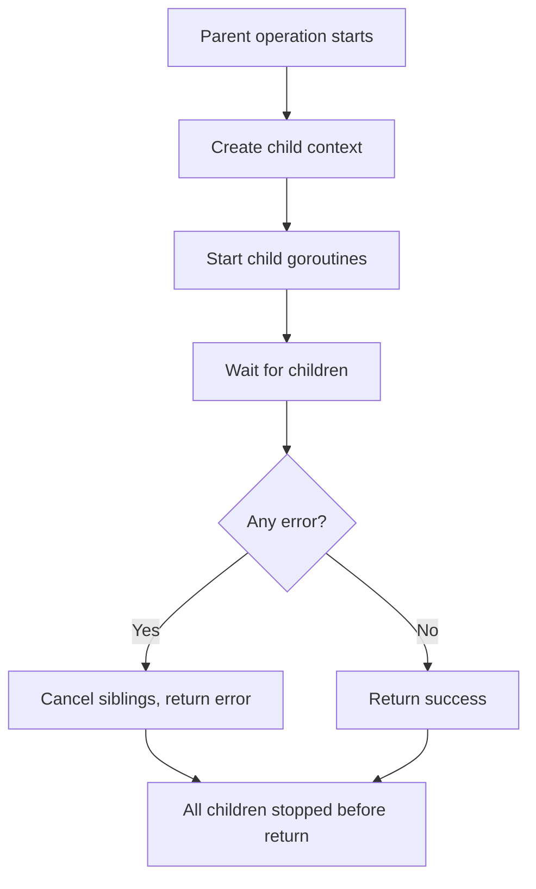
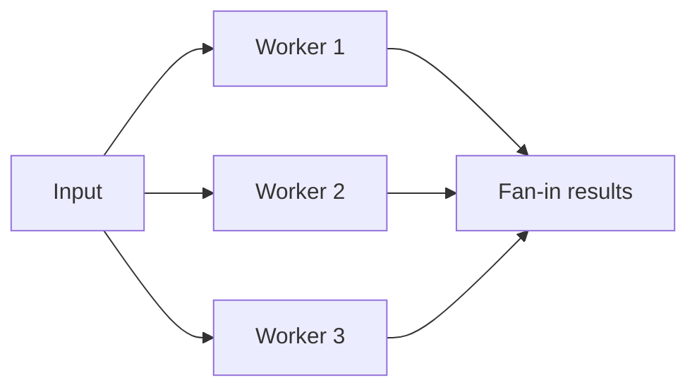
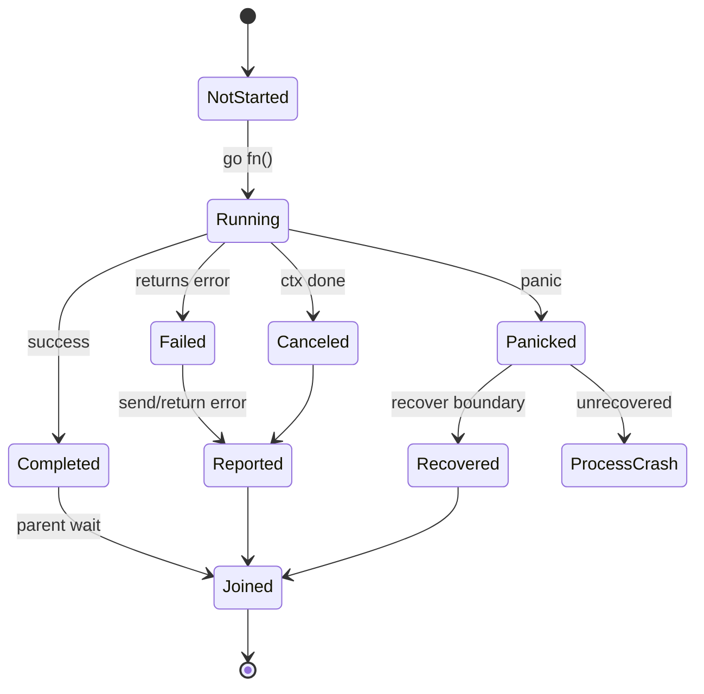
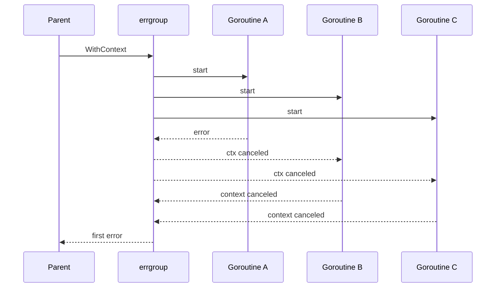
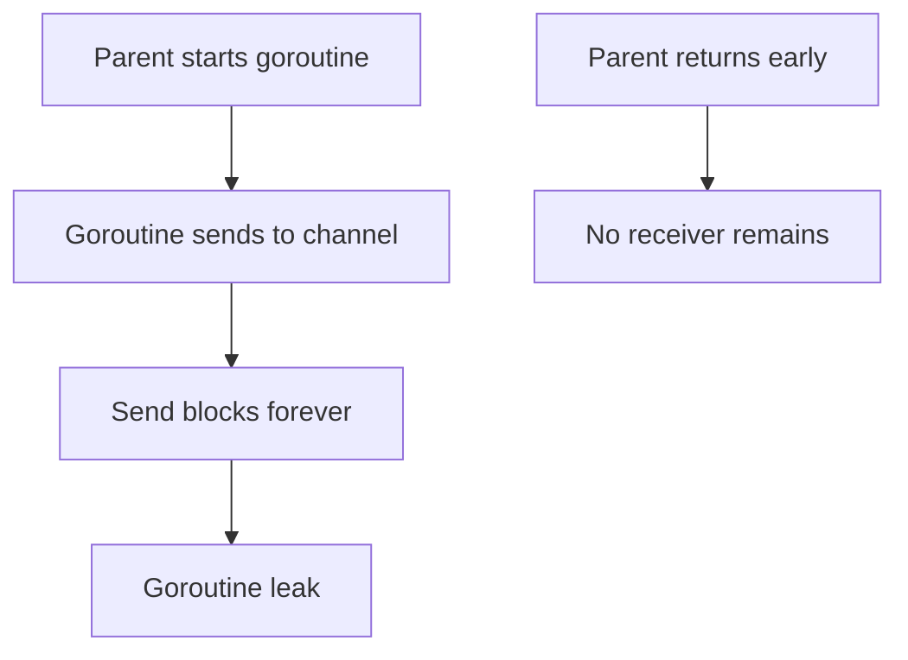
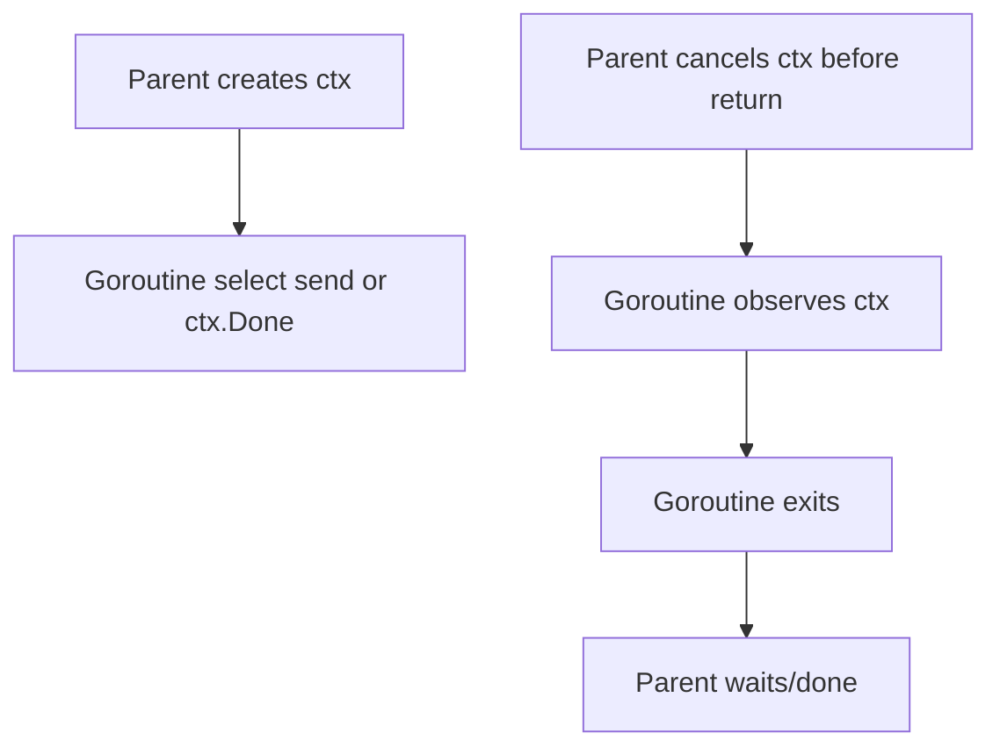

# learn-go-reliability-error-handling-part-016.md

# Concurrency Failure: Goroutine Error Propagation, `errgroup`, Cancellation Fan-out

> Seri: `learn-go-reliability-error-handling`  
> Part: `016`  
> Target: Go 1.26.x  
> Level: Advanced / internal engineering handbook  
> Fokus: failure handling pada goroutine, fan-out/fan-in, worker pool, error propagation, cancellation, leak prevention, dan structured concurrency di Go.

---

## 0. Posisi Materi Ini Dalam Seri

Pada bagian sebelumnya kita sudah membahas:

- error sebagai API surface
- taxonomy error
- wrapping dan boundary
- context, timeout, retry
- idempotency dan duplicate-safe side effect

Sekarang kita masuk ke area yang sangat khas Go: **concurrency failure**.

Go membuat concurrency mudah dibuat:

```go
go doSomething()
```

Tetapi justru karena mudah, banyak bug production muncul dari goroutine yang:

- error-nya hilang
- panic-nya crash process
- tidak bisa dihentikan
- menunggu channel selamanya
- mengirim ke channel tanpa receiver
- tidak observe context
- retry diam-diam setelah request selesai
- leak saat downstream berhenti membaca
- memegang resource setelah parent operation gagal
- menyebabkan partial result tanpa policy jelas
- menulis shared variable tanpa synchronization
- mengembalikan success padahal child goroutine gagal

Dalam Java, failure dalam thread/task biasanya muncul lewat `Future`, `CompletableFuture`, executor exception handler, atau structured concurrency modern. Dalam Go, goroutine tidak punya parent-child failure propagation otomatis.

Jika goroutine gagal, tidak ada yang otomatis menangkap kecuali Anda mendesainnya.

---

## 1. Core Thesis

Di Go, setiap goroutine yang Anda mulai harus memiliki jawaban untuk pertanyaan ini:

1. Siapa owner goroutine ini?
2. Kapan goroutine ini berhenti?
3. Bagaimana error dari goroutine dilaporkan?
4. Bagaimana panic dari goroutine ditangani?
5. Apa yang terjadi jika parent context canceled?
6. Apakah goroutine boleh hidup lebih lama dari request?
7. Bagaimana caller tahu semua goroutine sudah selesai?
8. Bagaimana resource dalam goroutine dibersihkan?
9. Apa policy jika salah satu goroutine gagal?
10. Apakah partial result diperbolehkan?
11. Apakah error pertama cukup, atau semua error perlu dikumpulkan?
12. Bagaimana mencegah goroutine leak?

Concurrency production-grade bukan sekadar “pakai goroutine”. Concurrency production-grade berarti **lifecycle, cancellation, and failure semantics are explicit**.

---

## 2. Goroutine Has No Implicit Parent Error Propagation

Kode ini sering salah:

```go
func Handle(ctx context.Context) error {
    go func() {
        if err := doBackground(ctx); err != nil {
            // error hilang kalau tidak dikirim ke mana-mana
            return
        }
    }()

    return nil
}
```

Masalah:

- `Handle` return sukses langsung
- `doBackground` mungkin gagal
- caller tidak tahu
- request context mungkin canceled saat handler return
- goroutine bisa leak
- panic di goroutine bisa crash process
- tidak ada ownership

Di Go, `go` statement memulai eksekusi terpisah. Return value dari function goroutine tidak bisa langsung dikembalikan ke caller. Harus ada channel, wait group, errgroup, atau lifecycle object.

---

## 3. Failure Modes in Concurrent Go

### 3.1 Lost Error

```go
go func() {
    _ = doWork()
}()
```

Error dibuang.

### 3.2 Unobserved Panic

```go
go func() {
    panic("boom")
}()
```

Panic yang tidak recovered dalam goroutine akan membawa down process.

### 3.3 Goroutine Leak Waiting Receive

```go
go func() {
    result := <-ch
    use(result)
}()
```

Jika `ch` tidak pernah menerima, goroutine leak.

### 3.4 Goroutine Leak Sending

```go
go func() {
    ch <- result
}()
```

Jika receiver berhenti, sender block forever.

### 3.5 Parent Returns Before Children Finish

```go
func f() error {
    go child()
    return nil
}
```

Caller menganggap selesai, child masih jalan.

### 3.6 Context Ignored

```go
func worker(ctx context.Context) {
    for {
        item := <-queue
        process(item)
    }
}
```

Tidak berhenti saat shutdown/cancel.

### 3.7 Data Race

```go
var result Result

go func() {
    result = compute()
}()

return result
```

Tidak ada synchronization.

### 3.8 Partial Result Without Policy

Satu goroutine sukses, satu gagal. Apakah return partial success? Retry? Fail all?

### 3.9 Blocking Error Channel

```go
errCh := make(chan error)
go func() {
    errCh <- doWork()
}()
return nil
```

Jika caller tidak receive, goroutine block.

---

## 4. Structured Concurrency Mental Model

Structured concurrency berarti:

> Child concurrent tasks cannot outlive the scope that created them unless explicitly detached with lifecycle ownership.

Go tidak memaksa structured concurrency secara bahasa, tetapi kita bisa menerapkannya dengan pattern:

- `context`
- `sync.WaitGroup`
- error channel
- `errgroup`
- lifecycle object
- bounded worker pool
- `defer cancel`
- close channel ownership
- wait before return



---

## 5. `sync.WaitGroup`: Wait Without Error

`sync.WaitGroup` waits for goroutines.

```go
var wg sync.WaitGroup

for _, item := range items {
    item := item
    wg.Add(1)
    go func() {
        defer wg.Done()
        process(item)
    }()
}

wg.Wait()
```

But `WaitGroup` does not:

- propagate error
- cancel siblings
- handle panic
- limit concurrency
- collect result safely
- support context directly

It is useful but incomplete for failure handling.

### 5.1 WaitGroup With Error Channel

```go
func processAll(ctx context.Context, items []Item) error {
    var wg sync.WaitGroup
    errCh := make(chan error, len(items))

    for _, item := range items {
        item := item

        wg.Add(1)
        go func() {
            defer wg.Done()

            if err := process(ctx, item); err != nil {
                errCh <- fmt.Errorf("process item %s: %w", item.ID, err)
            }
        }()
    }

    wg.Wait()
    close(errCh)

    var err error
    for e := range errCh {
        err = errors.Join(err, e)
    }

    return err
}
```

This collects all errors. But it does not cancel on first failure.

### 5.2 Buffered Error Channel

Use buffered error channel if goroutines may send before receiver starts.

Bad:

```go
errCh := make(chan error)
go func() { errCh <- doWork() }()
wg.Wait() // deadlock if goroutine blocked sending
```

Good:

```go
errCh := make(chan error, len(items))
```

or receive concurrently.

---

## 6. First Error vs All Errors

Concurrency error policy has two common modes.

### 6.1 First Error Wins

Use when:

- operation is all-or-nothing
- one failure makes whole result invalid
- siblings should stop
- save resource
- lower latency
- caller only needs root cause

Example:

- load case + policy + profile; if profile fails, cancel other work
- parallel calls to required dependencies
- compile pipeline where one stage failure invalidates result
- transaction sub-steps

### 6.2 Collect All Errors

Use when:

- validation batch
- cleanup multiple resources
- best-effort fan-out
- batch import partial failure
- multi-destination notification
- health check all dependencies
- reporting all failed shards

Example:

```go
err = errors.Join(err, fmt.Errorf("shard %d: %w", shard.ID, shardErr))
```

Decision matrix:

| Scenario | Policy |
|---|---|
| Required parallel dependencies | first error + cancel |
| Batch validation | collect all |
| Cleanup | collect/join all |
| Partial enrichment | collect errors, return partial if allowed |
| Worker pool processing independent jobs | per-job error, continue |
| Request path all-or-nothing | first error |

---

## 7. `errgroup`: First Error + Cancellation

`golang.org/x/sync/errgroup` is widely used for structured concurrent work.

Pattern:

```go
g, ctx := errgroup.WithContext(ctx)

for _, item := range items {
    item := item

    g.Go(func() error {
        return process(ctx, item)
    })
}

if err := g.Wait(); err != nil {
    return fmt.Errorf("process items: %w", err)
}

return nil
```

Semantics:

- each `Go` function returns error
- `Wait` returns first non-nil error
- context from `WithContext` is canceled when a goroutine returns non-nil error or when Wait returns
- siblings must observe ctx to stop
- panic is not automatically converted to error

### 7.1 Important: Cancellation Is Cooperative

If sibling ignores context:

```go
g.Go(func() error {
    time.Sleep(time.Minute)
    return nil
})
```

`errgroup` cannot kill it.

Use context-aware operations:

```go
g.Go(func() error {
    return sleepContext(ctx, time.Minute)
})
```

### 7.2 `errgroup.SetLimit`

`errgroup.Group` supports limiting active goroutines.

```go
g, ctx := errgroup.WithContext(ctx)
g.SetLimit(10)

for _, item := range items {
    item := item
    g.Go(func() error {
        return process(ctx, item)
    })
}
```

This prevents unbounded goroutine fan-out.

### 7.3 `errgroup.TryGo`

If available in your version of `x/sync`, `TryGo` starts goroutine only if under limit.

Useful for admission-like behavior.

---

## 8. Example: Parallel Required Calls

Scenario: submit case needs actor profile and case details, both required.

```go
func (s *Service) LoadSubmitInputs(ctx context.Context, actorID, caseID string) (Actor, Case, error) {
    g, ctx := errgroup.WithContext(ctx)

    var actor Actor
    g.Go(func() error {
        got, err := s.identity.GetActor(ctx, actorID)
        if err != nil {
            return fmt.Errorf("get actor: %w", err)
        }
        actor = got
        return nil
    })

    var c Case
    g.Go(func() error {
        got, err := s.cases.GetByID(ctx, caseID)
        if err != nil {
            return fmt.Errorf("get case: %w", err)
        }
        c = got
        return nil
    })

    if err := g.Wait(); err != nil {
        return Actor{}, Case{}, err
    }

    return actor, c, nil
}
```

Shared variables `actor` and `c` are written by separate goroutines and read after `Wait`. This is safe under synchronization from `Wait`.

Still run race detector.

---

## 9. Example: Parallel Optional Enrichment

Scenario: listing cases can optionally enrich with profile and SLA. If enrichment fails, return base cases with warnings.

Here first-error cancellation is wrong.

```go
type EnrichedCases struct {
    Cases    []CaseDTO
    Warnings []string
}

func (s *Service) EnrichCases(ctx context.Context, cases []Case) EnrichedCases {
    var wg sync.WaitGroup
    var mu sync.Mutex

    out := make([]CaseDTO, len(cases))
    warnings := make([]string, 0)

    for i, c := range cases {
        i, c := i, c

        wg.Add(1)
        go func() {
            defer wg.Done()

            dto := CaseDTO{ID: c.ID, Status: c.Status}

            profile, err := s.profile.Get(ctx, c.OwnerID)
            if err != nil {
                mu.Lock()
                warnings = append(warnings, "profile unavailable for case "+c.ID)
                mu.Unlock()
            } else {
                dto.OwnerName = profile.Name
            }

            mu.Lock()
            out[i] = dto
            mu.Unlock()
        }()
    }

    wg.Wait()

    return EnrichedCases{Cases: out, Warnings: warnings}
}
```

Could use errgroup? Maybe, but errgroup first-error semantics does not fit unless errors are swallowed as warnings inside each goroutine.

### 9.1 Concurrency Limit Needed

If `cases` can be 10,000, spawning 10,000 goroutines may be excessive.

Use worker pool or semaphore.

---

## 10. Bounded Parallelism With `errgroup.SetLimit`

```go
func (s *Service) ProcessBatch(ctx context.Context, items []Item) error {
    g, ctx := errgroup.WithContext(ctx)
    g.SetLimit(20)

    for _, item := range items {
        item := item

        g.Go(func() error {
            if err := s.processOne(ctx, item); err != nil {
                return fmt.Errorf("process item %s: %w", item.ID, err)
            }
            return nil
        })
    }

    return g.Wait()
}
```

Benefits:

- no unbounded goroutines
- first error cancels siblings
- concurrency limited

But if you need all item errors, use different pattern.

---

## 11. Bounded Parallelism Collecting All Errors

```go
func (s *Service) ValidateBatch(ctx context.Context, items []Item) error {
    sem := make(chan struct{}, 20)
    errCh := make(chan error, len(items))

    var wg sync.WaitGroup

    for _, item := range items {
        item := item

        select {
        case sem <- struct{}{}:
        case <-ctx.Done():
            return context.Cause(ctx)
        }

        wg.Add(1)
        go func() {
            defer wg.Done()
            defer func() { <-sem }()

            if err := s.validateOne(ctx, item); err != nil {
                errCh <- fmt.Errorf("item %s: %w", item.ID, err)
            }
        }()
    }

    wg.Wait()
    close(errCh)

    var err error
    for e := range errCh {
        err = errors.Join(err, e)
    }

    return err
}
```

Caveat: if context cancels mid-loop, goroutines already started still run. If you return immediately, they may continue after return. Better structure with child context and wait before return.

Improved:

```go
func (s *Service) ValidateBatch(ctx context.Context, items []Item) error {
    ctx, cancel := context.WithCancel(ctx)
    defer cancel()

    sem := make(chan struct{}, 20)
    errCh := make(chan error, len(items))

    var wg sync.WaitGroup
    startErr := error(nil)

loop:
    for _, item := range items {
        item := item

        select {
        case sem <- struct{}{}:
        case <-ctx.Done():
            startErr = context.Cause(ctx)
            break loop
        }

        wg.Add(1)
        go func() {
            defer wg.Done()
            defer func() { <-sem }()

            if err := s.validateOne(ctx, item); err != nil {
                errCh <- fmt.Errorf("item %s: %w", item.ID, err)
            }
        }()
    }

    wg.Wait()
    close(errCh)

    var err error
    err = errors.Join(err, startErr)
    for e := range errCh {
        err = errors.Join(err, e)
    }

    return err
}
```

---

## 12. Error Channel Patterns

### 12.1 One Error Result

For one goroutine:

```go
errCh := make(chan error, 1)

go func() {
    errCh <- doWork(ctx)
}()

select {
case err := <-errCh:
    return err
case <-ctx.Done():
    return context.Cause(ctx)
}
```

Potential issue: if context branch returns, goroutine may still try to send. Buffered channel size 1 prevents send block for one send.

But goroutine itself must stop via ctx.

### 12.2 Result Channel

```go
type result struct {
    value Value
    err   error
}

resultCh := make(chan result, 1)

go func() {
    v, err := compute(ctx)
    resultCh <- result{value: v, err: err}
}()

select {
case r := <-resultCh:
    return r.value, r.err
case <-ctx.Done():
    return Value{}, context.Cause(ctx)
}
```

### 12.3 Multiple Results

If multiple goroutines send, channel must be drained or closed after wait.

```go
go func() {
    wg.Wait()
    close(resultCh)
}()

for r := range resultCh {
    ...
}
```

---

## 13. Avoid Sending Without Cancellation Path

Bad:

```go
out <- result
```

If receiver stopped, goroutine leaks.

Good:

```go
select {
case out <- result:
case <-ctx.Done():
    return context.Cause(ctx)
}
```

Similarly for receive:

```go
select {
case item := <-in:
case <-ctx.Done():
    return context.Cause(ctx)
}
```

### 13.1 Pipeline Leak Example

Bad:

```go
func stage(in <-chan Item) <-chan Result {
    out := make(chan Result)
    go func() {
        defer close(out)
        for item := range in {
            out <- process(item)
        }
    }()
    return out
}
```

If downstream stops reading, `out <-` blocks forever.

Better:

```go
func stage(ctx context.Context, in <-chan Item) <-chan Result {
    out := make(chan Result)
    go func() {
        defer close(out)

        for {
            select {
            case <-ctx.Done():
                return

            case item, ok := <-in:
                if !ok {
                    return
                }

                result := process(item)

                select {
                case out <- result:
                case <-ctx.Done():
                    return
                }
            }
        }
    }()
    return out
}
```

---

## 14. Fan-out/Fan-in

Fan-out: one input split to many workers. Fan-in: many outputs merge.



Failure questions:

- If one worker fails, stop all?
- If input closes, do workers stop?
- If context cancels, do workers stop?
- Who closes output?
- How are errors collected?
- Are results ordered?
- Is partial result allowed?

### 14.1 Worker Pool Skeleton

```go
func ProcessPool(ctx context.Context, items []Item, n int, process func(context.Context, Item) error) error {
    ctx, cancel := context.WithCancel(ctx)
    defer cancel()

    jobs := make(chan Item)
    errCh := make(chan error, 1)

    var wg sync.WaitGroup

    for i := 0; i < n; i++ {
        wg.Add(1)
        go func(workerID int) {
            defer wg.Done()

            for {
                select {
                case <-ctx.Done():
                    return

                case item, ok := <-jobs:
                    if !ok {
                        return
                    }

                    if err := process(ctx, item); err != nil {
                        select {
                        case errCh <- fmt.Errorf("worker %d item %s: %w", workerID, item.ID, err):
                            cancel()
                        default:
                        }
                        return
                    }
                }
            }
        }(i)
    }

    sendErr := func() error {
        defer close(jobs)

        for _, item := range items {
            select {
            case jobs <- item:
            case <-ctx.Done():
                return context.Cause(ctx)
            }
        }

        return nil
    }()

    wg.Wait()

    select {
    case err := <-errCh:
        return err
    default:
    }

    if sendErr != nil && !errors.Is(sendErr, context.Canceled) {
        return sendErr
    }

    return context.Cause(ctx)
}
```

This is complex. For many first-error use cases, `errgroup.SetLimit` is simpler.

---

## 15. Panic Handling in Goroutines

Panic in goroutine does not get recovered by parent goroutine.

Bad assumption:

```go
defer recoverPanic()

go func() {
    panic("boom")
}()
```

Parent defer cannot recover child panic.

Each goroutine boundary needs its own recover if you want to convert panic to error.

```go
func safeGo(g *errgroup.Group, fn func() error) {
    g.Go(func() (err error) {
        defer func() {
            if v := recover(); v != nil {
                err = fmt.Errorf("panic in goroutine: %v\n%s", v, debug.Stack())
            }
        }()

        return fn()
    })
}
```

Use carefully. Not all panics should be swallowed. In request worker boundary, converting panic to error may be acceptable; in invariant corruption, crash may be safer.

### 15.1 Panic Policy

| Context | Policy |
|---|---|
| HTTP handler goroutine | recover at middleware boundary |
| worker job | recover job, mark failed/DLQ maybe |
| background critical supervisor | recover + restart maybe, or crash |
| invariant corruption | crash/re-panic |
| library goroutine | avoid internal goroutine unless lifecycle documented |

---

## 16. Detached Goroutines

Detached goroutine outlives caller.

Example:

```go
go sendEmail(ctx, email)
return nil
```

Danger:

- ctx may cancel when request returns
- errors lost
- no shutdown coordination
- duplicate send risk
- panic risk
- no backpressure
- unbounded goroutines

Better:

- enqueue job
- use worker with lifecycle
- outbox
- background supervisor
- return operation id

### 16.1 When Detach Is Acceptable

Rarely, for bounded best-effort operations:

- telemetry flush
- short cache warm
- async non-critical audit with explicit policy
- local cleanup

Even then:

- use bounded context
- recover panic
- log/metric error
- limit concurrency
- respect shutdown if possible

---

## 17. Lifecycle-owned Background Goroutines

Long-running goroutines should be owned by component.

```go
type Poller struct {
    interval time.Duration
    logger   *slog.Logger
}

func (p *Poller) Run(ctx context.Context) error {
    ticker := time.NewTicker(p.interval)
    defer ticker.Stop()

    for {
        select {
        case <-ctx.Done():
            return context.Cause(ctx)

        case <-ticker.C:
            if err := p.poll(ctx); err != nil {
                p.logger.WarnContext(ctx, "poll failed", "error", err)
            }
        }
    }
}
```

Application:

```go
g, ctx := errgroup.WithContext(root)

g.Go(func() error { return httpServer.Run(ctx) })
g.Go(func() error { return worker.Run(ctx) })
g.Go(func() error { return poller.Run(ctx) })

if err := g.Wait(); err != nil {
    return err
}
```

This gives ownership and shutdown.

---

## 18. Supervisor Pattern

For background workers that should restart on transient failure:

```go
func Supervise(ctx context.Context, name string, logger *slog.Logger, run func(context.Context) error) error {
    for {
        if ctx.Err() != nil {
            return context.Cause(ctx)
        }

        err := run(ctx)
        if err == nil {
            return nil
        }

        if ctx.Err() != nil {
            return context.Cause(ctx)
        }

        logger.ErrorContext(ctx, "background component failed; restarting",
            "component", name,
            "error", err,
        )

        if sleepErr := sleepContext(ctx, time.Second); sleepErr != nil {
            return sleepErr
        }
    }
}
```

But supervise carefully:

- avoid infinite crash loops
- backoff restart
- max restart rate
- distinguish permanent config error
- expose health/readiness
- alert after repeated failure
- preserve panic stack
- avoid hiding corruption

---

## 19. Shared Variable Safety

### 19.1 Capture Loop Variable

Modern Go has improved loop variable semantics in recent versions, but codebases and older versions may still have issues. Defensive style remains clear:

```go
for _, item := range items {
    item := item
    go func() {
        process(item)
    }()
}
```

### 19.2 Race on Shared Slice Append

Bad:

```go
var results []Result

for _, item := range items {
    go func() {
        results = append(results, process(item))
    }()
}
```

Race.

Use mutex:

```go
var mu sync.Mutex
results := make([]Result, 0, len(items))

go func() {
    r := process(item)
    mu.Lock()
    results = append(results, r)
    mu.Unlock()
}()
```

Or pre-allocated index:

```go
results := make([]Result, len(items))

for i, item := range items {
    i, item := i, item
    g.Go(func() error {
        r, err := process(ctx, item)
        if err != nil {
            return err
        }
        results[i] = r
        return nil
    })
}
```

Writing different indices is okay if no append/race on same memory metadata and synchronization before read. Race detector should verify.

---

## 20. Ordering and Partial Result

Parallelism often changes ordering.

If order matters, preserve index.

```go
results := make([]Result, len(items))

for i, item := range items {
    i, item := i, item
    g.Go(func() error {
        r, err := process(ctx, item)
        if err != nil {
            return err
        }
        results[i] = r
        return nil
    })
}
```

If partial result allowed:

```go
type ItemResult struct {
    ItemID string
    Value  Value
    Err    error
}
```

Return per-item status.

For regulatory batch operations, partial result often needs explicit audit/status per record.

---

## 21. Concurrency and Transactions

Do not use a single `*sql.Tx` concurrently unless driver/docs explicitly allow and you have strong reason. Many transaction flows should be sequential because:

- transaction is single connection
- locking order matters
- DB operations inside tx may not benefit from goroutine parallelism
- concurrent statements can create unpredictable lock behavior
- error handling/rollback becomes complex

Bad:

```go
tx, _ := db.BeginTx(ctx, nil)

g.Go(func() error { return repo.UpdateA(ctx, tx) })
g.Go(func() error { return repo.UpdateB(ctx, tx) })
```

Usually better:

```go
if err := repo.UpdateA(ctx, tx); err != nil { return err }
if err := repo.UpdateB(ctx, tx); err != nil { return err }
```

Parallelize independent pre-transaction reads if useful, then perform transaction sequentially.

---

## 22. Concurrency and External Calls

Parallel external calls can improve latency but increase load.

Example:

```go
g, ctx := errgroup.WithContext(ctx)
g.SetLimit(5)
```

Consider:

- dependency rate limit
- bulkhead
- per-call timeout
- retry amplification
- cancellation on first failure
- partial fallback
- response ordering
- hedging risk
- fan-out count bounded

If one user request fans out to 100 downstream calls, you may create large blast radius.

---

## 23. Cancellation Fan-out

When parent fails, cancel children.

```go
ctx, cancel := context.WithCancelCause(ctx)
defer cancel(nil)

g, ctx := errgroup.WithContext(ctx)

g.Go(func() error {
    if err := callA(ctx); err != nil {
        cancel(fmt.Errorf("call A failed: %w", err))
        return err
    }
    return nil
})
```

`errgroup.WithContext` already cancels derived ctx on first error, but `WithCancelCause` can preserve cause if you need more detail.

Caution: mixing errgroup context and cancel cause should be done deliberately.

---

## 24. Cancellation Cause in Fan-out

Example:

```go
func LoadAll(ctx context.Context) error {
    ctx, cancel := context.WithCancelCause(ctx)
    defer cancel(nil)

    g, groupCtx := errgroup.WithContext(ctx)

    g.Go(func() error {
        if err := loadProfile(groupCtx); err != nil {
            cause := fmt.Errorf("profile load failed: %w", err)
            cancel(cause)
            return cause
        }
        return nil
    })

    g.Go(func() error {
        if err := loadPolicy(groupCtx); err != nil {
            cause := fmt.Errorf("policy load failed: %w", err)
            cancel(cause)
            return cause
        }
        return nil
    })

    if err := g.Wait(); err != nil {
        if cause := context.Cause(ctx); cause != nil {
            return cause
        }
        return err
    }

    return nil
}
```

This can help siblings see the cause through `context.Cause(ctx)` if they use the parent cause context. Keep it simple unless needed.

---

## 25. Error Prioritization

If multiple goroutines fail, which error should be returned?

Possible policies:

1. first observed error
2. highest severity error
3. root cause error
4. join all errors
5. domain error preferred over cancellation
6. cancellation preferred if caller canceled
7. timeout preferred if deadline exceeded
8. partial result with per-item errors

Example priority:

```go
func prioritize(errs []error) error {
    var joined error

    for _, err := range errs {
        joined = errors.Join(joined, err)
    }

    for _, err := range errs {
        if errors.Is(err, ErrDataCorruption) {
            return errors.Join(err, joined)
        }
    }

    for _, err := range errs {
        if errors.Is(err, ErrDomainViolation) {
            return errors.Join(err, joined)
        }
    }

    return joined
}
```

Use sparingly. Complexity can hide failure semantics.

---

## 26. Concurrent Cleanup

When closing multiple independent resources, concurrent cleanup may reduce shutdown time.

```go
func CloseAll(ctx context.Context, closers map[string]func(context.Context) error) error {
    g, ctx := errgroup.WithContext(ctx)
    var mu sync.Mutex
    var joined error

    for name, closeFn := range closers {
        name, closeFn := name, closeFn

        g.Go(func() error {
            if err := closeFn(ctx); err != nil {
                mu.Lock()
                joined = errors.Join(joined, fmt.Errorf("close %s: %w", name, err))
                mu.Unlock()
            }
            return nil // collect all, don't cancel siblings
        })
    }

    _ = g.Wait()
    return joined
}
```

Notice: each goroutine returns nil because we want all cleanup attempts, not first-error cancellation.

---

## 27. Concurrency and Observability

Every concurrent component should expose:

Metrics:

```text
goroutines_current{component}
worker_jobs_active{worker}
worker_jobs_failed_total{worker,reason}
fanout_failures_total{operation,dependency}
fanout_cancellations_total{operation,cause}
worker_queue_depth{worker}
worker_pool_saturation{worker}
goroutine_panics_total{component}
```

Logs:

```go
logger.ErrorContext(ctx, "worker failed",
    "worker", workerName,
    "job_id", jobID,
    "error", err,
)
```

Traces:

- child spans for goroutine work
- fan-out dependency calls
- cancellation cause
- attempt index
- worker id if useful, but avoid high cardinality

### 27.1 Avoid Log Storms

If 100 child goroutines fail due to same parent cancellation, do not log 100 error lines at error level.

Classify:

- root cause logged once
- child cancellations debug-level or suppressed
- metrics aggregate counts

---

## 28. Goroutine Leak Detection Mindset

Symptoms:

- increasing `runtime.NumGoroutine()`
- memory growth
- blocked profiles show channel send/receive
- shutdown hangs
- tests time out
- DB connections never released
- workers active after cancel
- HTTP requests continue after client disconnect

Tools:

- `runtime.NumGoroutine`
- pprof goroutine profile
- block profile
- race detector
- test leak checks
- context cancellation tests
- shutdown integration tests

### 28.1 Simple Test Pattern

```go
func TestWorkerStops(t *testing.T) {
    ctx, cancel := context.WithCancel(context.Background())

    done := make(chan error, 1)
    go func() {
        done <- worker.Run(ctx)
    }()

    cancel()

    select {
    case err := <-done:
        if !errors.Is(err, context.Canceled) {
            t.Fatalf("expected canceled, got %v", err)
        }
    case <-time.After(time.Second):
        t.Fatal("worker did not stop")
    }
}
```

---

## 29. Race Detector

Run:

```bash
go test -race ./...
```

Race detector is essential for concurrent error handling.

It catches:

- unsynchronized shared variables
- append races
- result assignment races
- map concurrent access
- cancellation state races
- unsafe test assumptions

Do not ignore race detector failures.

---

## 30. Common Anti-Patterns

### 30.1 Fire-and-forget in Request Path

```go
go sendNotification(ctx, n)
return nil
```

Use outbox/job queue.

### 30.2 Error Channel Not Buffered

Deadlock risk if sender sends before receiver.

### 30.3 Parent Returns Without Waiting

Child may still mutate state or hold resources.

### 30.4 Ignoring Context in Goroutine

Shutdown/cancel cannot stop it.

### 30.5 Unbounded Goroutine Per Item

Large batch causes resource spike.

### 30.6 Logging Every Child Cancellation as Error

Noise and alert fatigue.

### 30.7 Panic Recovery Only in Parent

Does not recover child goroutine panic.

### 30.8 Concurrent Writes to Map/Slice

Data race/panic.

### 30.9 Using `WaitGroup` Without Error Semantics

Caller thinks success even if child failed.

### 30.10 Closing Channel From Receiver

Can panic if sender still sends.

### 30.11 Transaction Used Concurrently

Often unsafe/pointless.

### 30.12 Retrying Concurrently Without Budget

Amplifies downstream load.

---

## 31. Production Patterns

### 31.1 Required Fan-out

Use `errgroup.WithContext`.

```go
g, ctx := errgroup.WithContext(ctx)
g.SetLimit(limit)
```

### 31.2 Best-effort Fan-out

Use WaitGroup + collect errors/warnings, do not cancel on first optional failure.

### 31.3 Worker Pool

Use bounded jobs channel, context-aware send/receive, explicit close ownership.

### 31.4 Background Component

Expose `Run(ctx) error`, owned by app lifecycle.

### 31.5 Detached Work

Prefer queue/outbox. If unavoidable, bounded, logged, recovered, limited.

### 31.6 Panic Boundary

Recover at goroutine boundary if policy requires, include stack, convert to error/metric.

### 31.7 All-or-nothing Batch

Cancel on first failure, wait all children exit, return first/root error.

### 31.8 Partial Batch

Return per-item results and errors; no hidden partial success.

---

## 32. Case Study: Submit Case With Parallel Preload

Before transaction, service can parallelize actor and case read.

```go
func (s *Service) PrepareSubmit(ctx context.Context, principal Principal, req SubmitRequest) (Actor, Case, error) {
    g, ctx := errgroup.WithContext(ctx)

    var actor Actor
    g.Go(func() error {
        got, err := s.identity.ResolveActor(ctx, principal.ActorID)
        if err != nil {
            return fmt.Errorf("resolve actor: %w", err)
        }
        actor = got
        return nil
    })

    var c Case
    g.Go(func() error {
        got, err := s.cases.GetByID(ctx, req.CaseID)
        if err != nil {
            return fmt.Errorf("get case: %w", err)
        }
        c = got
        return nil
    })

    if err := g.Wait(); err != nil {
        return Actor{}, Case{}, err
    }

    return actor, c, nil
}
```

Then transaction re-checks/locks case.

Why re-check?

- data may change after preload
- domain transition must be based on locked/current state
- preload only improves latency for non-locking data
- transaction is source of truth

---

## 33. Case Study: Batch Validation With All Errors

```go
func (s *Service) ValidateRows(ctx context.Context, rows []ImportRow) error {
    var wg sync.WaitGroup
    sem := make(chan struct{}, 16)
    errCh := make(chan error, len(rows))

    for i, row := range rows {
        i, row := i, row

        select {
        case sem <- struct{}{}:
        case <-ctx.Done():
            return context.Cause(ctx)
        }

        wg.Add(1)
        go func() {
            defer wg.Done()
            defer func() { <-sem }()

            if err := s.validateRow(ctx, row); err != nil {
                errCh <- fmt.Errorf("row %d: %w", i+1, err)
            }
        }()
    }

    wg.Wait()
    close(errCh)

    var err error
    for e := range errCh {
        err = errors.Join(err, e)
    }

    return err
}
```

Because validation should report all invalid rows.

---

## 34. Case Study: Outbox Dispatcher

Outbox dispatcher is lifecycle-owned.

```go
func (d *Dispatcher) Run(ctx context.Context) error {
    for {
        if err := d.runOnce(ctx); err != nil {
            if ctx.Err() != nil {
                return context.Cause(ctx)
            }

            d.logger.WarnContext(ctx, "outbox dispatch iteration failed", "error", err)
        }

        if err := sleepContext(ctx, d.interval); err != nil {
            return err
        }
    }
}
```

Per batch bounded concurrency:

```go
func (d *Dispatcher) publishBatch(ctx context.Context, events []OutboxEvent) error {
    g, ctx := errgroup.WithContext(ctx)
    g.SetLimit(d.concurrency)

    for _, event := range events {
        event := event
        g.Go(func() error {
            publishCtx, cancel := context.WithTimeout(ctx, d.publishTimeout)
            defer cancel()

            if err := d.publisher.Publish(publishCtx, event); err != nil {
                return fmt.Errorf("publish event %s: %w", event.ID, err)
            }

            if err := d.repo.MarkPublished(ctx, event.ID); err != nil {
                return fmt.Errorf("mark event %s published: %w", event.ID, err)
            }

            return nil
        })
    }

    return g.Wait()
}
```

Question: should one event failure cancel whole batch? Maybe yes for dependency outage, maybe no for per-event poison. Policy needed.

---

## 35. Testing Concurrent Code

### 35.1 Test First Error Cancels Siblings

```go
func TestFanoutCancelsSiblings(t *testing.T) {
    ctx := context.Background()

    siblingStopped := make(chan struct{})

    err := runFanout(ctx,
        func(ctx context.Context) error {
            return ErrDependencyUnavailable
        },
        func(ctx context.Context) error {
            <-ctx.Done()
            close(siblingStopped)
            return ctx.Err()
        },
    )

    if !errors.Is(err, ErrDependencyUnavailable) {
        t.Fatalf("expected dependency error, got %v", err)
    }

    select {
    case <-siblingStopped:
    case <-time.After(time.Second):
        t.Fatal("sibling was not canceled")
    }
}
```

### 35.2 Test Error Collection

```go
err := validateAll(ctx, []Item{bad1, bad2})

if !errors.Is(err, ErrBad1) || !errors.Is(err, ErrBad2) {
    t.Fatalf("expected both errors, got %v", err)
}
```

### 35.3 Test Panic Converted

```go
err := runSafe(func() error {
    panic("boom")
})

if err == nil {
    t.Fatal("expected panic error")
}
```

### 35.4 Test No Send Leak

Use context cancellation and done channel.

```go
ctx, cancel := context.WithCancel(context.Background())
out := make(chan Result)

done := make(chan struct{})
go func() {
    defer close(done)
    _ = produce(ctx, out)
}()

cancel()

select {
case <-done:
case <-time.After(time.Second):
    t.Fatal("producer leaked")
}
```

### 35.5 Race Detector

Always run concurrent package tests with:

```bash
go test -race ./...
```

---

## 36. Code Review Checklist

### 36.1 Goroutine Ownership

- [ ] Who owns this goroutine?
- [ ] Can it outlive caller?
- [ ] Is that intentional?
- [ ] How does it stop?
- [ ] Is there a done/wait path?

### 36.2 Error Propagation

- [ ] Where does goroutine error go?
- [ ] Is error channel buffered or received concurrently?
- [ ] Does caller wait before returning?
- [ ] Is first-error or all-error policy explicit?
- [ ] Are errors wrapped with operation context?

### 36.3 Cancellation

- [ ] Does goroutine observe `ctx.Done()`?
- [ ] Are channel sends cancellable?
- [ ] Are channel receives cancellable?
- [ ] Does retry/backoff observe context?
- [ ] Are siblings canceled on first failure if needed?

### 36.4 Panic

- [ ] Can goroutine panic?
- [ ] Is there a recover boundary if policy requires?
- [ ] Is stack captured?
- [ ] Should panic instead crash process?
- [ ] Are panics counted/alerted?

### 36.5 Resource Limits

- [ ] Is fan-out bounded?
- [ ] Is worker pool size configured?
- [ ] Is downstream rate limit respected?
- [ ] Is queue bounded?
- [ ] Is memory growth controlled?

### 36.6 Data Safety

- [ ] Any shared variable writes?
- [ ] Any map/slice concurrent mutation?
- [ ] Is mutex/channel/atomic used correctly?
- [ ] Is result ordering preserved if needed?
- [ ] Race detector clean?

### 36.7 Lifecycle

- [ ] Background component has `Run(ctx) error`?
- [ ] Shutdown waits for goroutines?
- [ ] Detached goroutine justified?
- [ ] Cleanup executed?
- [ ] Metrics/logging present?

---

## 37. Mermaid: Goroutine Lifecycle



---

## 38. Mermaid: First Error Cancellation



---

## 39. Mermaid: Leak Pattern



Fix:



---

## 40. Java Engineer Translation Layer

### 40.1 Java Executor Future

Java:

```java
Future<Result> f = executor.submit(() -> work());
Result r = f.get();
```

Go equivalent:

```go
resultCh := make(chan result, 1)
go func() {
    v, err := work(ctx)
    resultCh <- result{v, err}
}()

r := <-resultCh
```

But Go requires explicit cancellation and error handling.

### 40.2 CompletableFuture allOf

Java:

```java
CompletableFuture.allOf(a, b).join();
```

Go:

```go
g, ctx := errgroup.WithContext(ctx)
g.Go(func() error { return a(ctx) })
g.Go(func() error { return b(ctx) })
err := g.Wait()
```

### 40.3 StructuredTaskScope

Modern Java structured concurrency has scope semantics. In Go, `errgroup.WithContext` is common equivalent for first-error cancel scope.

### 40.4 InterruptedException

Java thread interruption is implicit-ish. Go cancellation is explicit and cooperative through context.

---

## 41. Key Takeaways

1. Goroutines do not propagate errors to parent automatically.
2. Every goroutine needs ownership, stop condition, and error path.
3. `sync.WaitGroup` waits but does not handle errors.
4. Error channels must be buffered or drained carefully.
5. `errgroup.WithContext` is the standard first-error + cancellation pattern.
6. Cancellation is cooperative; child goroutines must observe context.
7. Use bounded parallelism; do not fan out unbounded goroutines.
8. First-error and collect-all-errors are different policies.
9. Channel send and receive can leak without `ctx.Done()` path.
10. Panic recovery must be inside the goroutine that can panic.
11. Detached goroutines in request path are usually wrong; use queue/outbox.
12. Background goroutines should be lifecycle-owned with `Run(ctx) error`.
13. Shared variables require synchronization.
14. Do not concurrently use transaction casually.
15. Concurrency can amplify downstream load.
16. Race detector is mandatory for serious concurrent code.
17. Observability should track goroutine lifecycle, worker failures, panics, and cancellation.
18. Parent should wait for child goroutines before returning unless explicitly detached.
19. Partial results need explicit contract.
20. Production Go concurrency is about structured lifecycle, not just `go`.

---

## 42. References

- Go package documentation: `context`
- Go package documentation: `sync`
- Go package documentation: `errors`
- Go package documentation: `runtime/pprof`
- Go Blog: Go Concurrency Patterns: Context
- Go Blog: Go Concurrency Patterns: Pipelines and cancellation
- `golang.org/x/sync/errgroup` package documentation
- Go race detector documentation

---

## 43. Next Part

Next:

```text
learn-go-reliability-error-handling-part-017.md
```

Topic:

```text
Channel Failure Semantics: Close, Done, Backpressure, Drop, Drain
```

<!-- NAVIGATION_FOOTER -->
<div class="page-nav">
<a href="./learn-go-reliability-error-handling-part-015.md">⬅️ Idempotency, Deduplication, dan Exactly-Once Illusion</a>
<a href="./index.md">📚 Kategori</a>
<a href="../../index.md">🏠 Home</a>
<a href="./learn-go-reliability-error-handling-part-017.md">Channel Failure Semantics: Close, Done, Backpressure, Drop, Drain ➡️</a>
</div>
