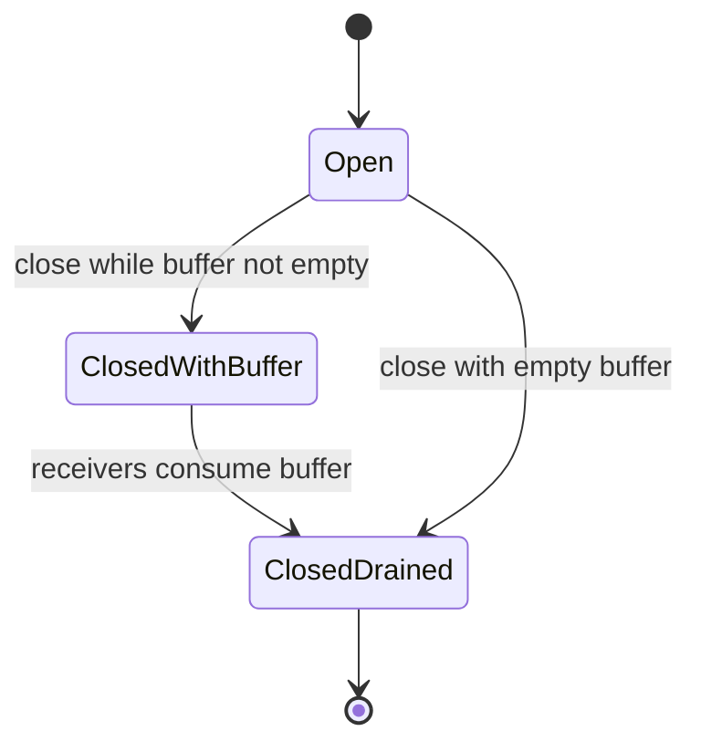
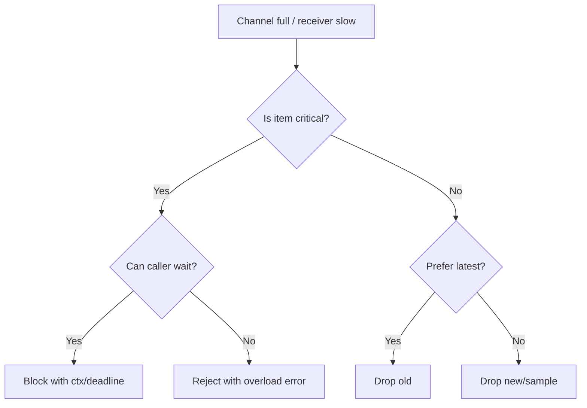
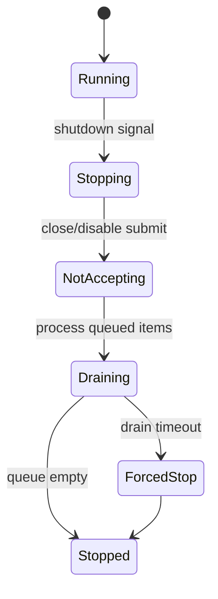
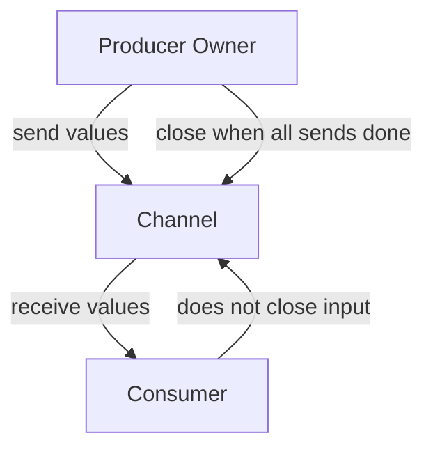
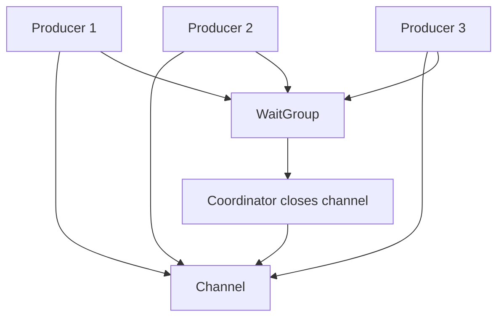
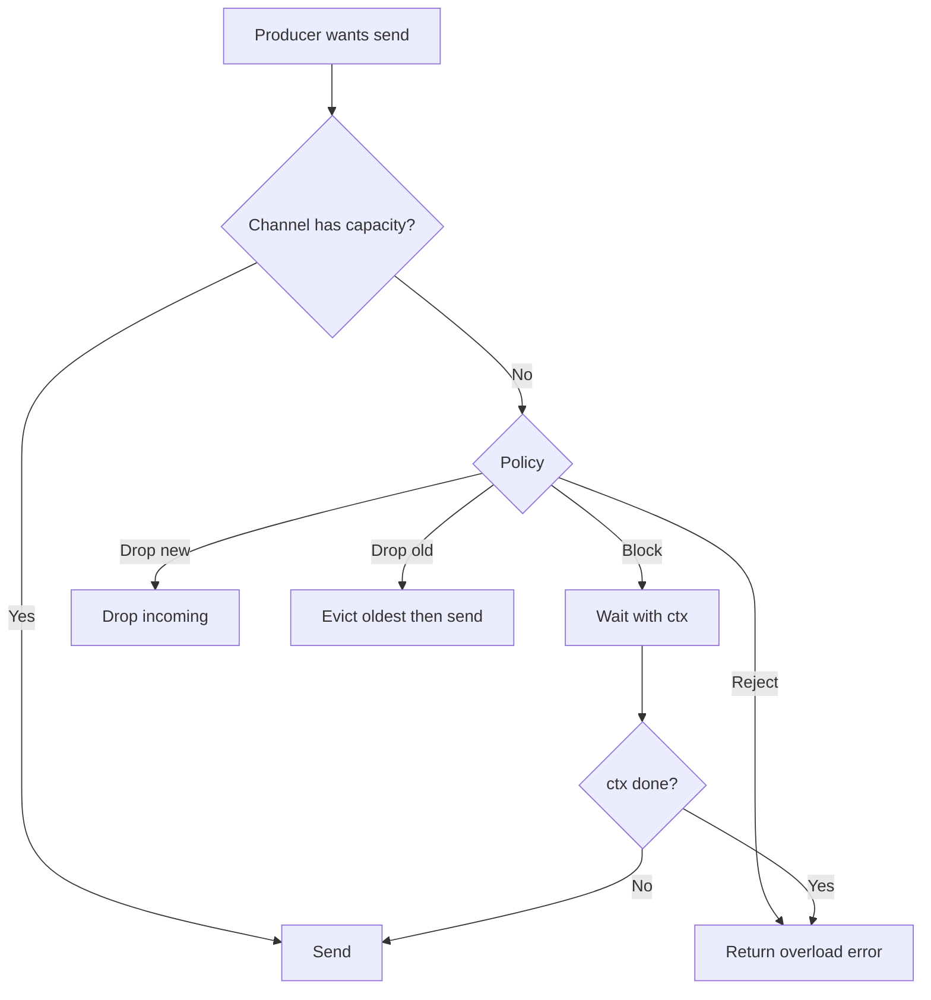
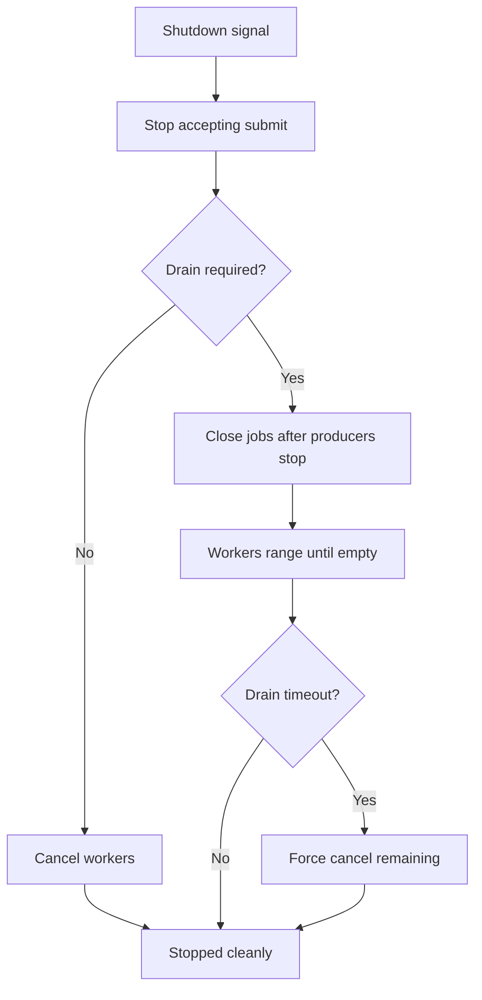

# learn-go-reliability-error-handling-part-017.md

# Channel Failure Semantics: Close, Done, Backpressure, Drop, Drain

> Seri: `learn-go-reliability-error-handling`  
> Part: `017`  
> Target: Go 1.26.x  
> Level: Advanced / internal engineering handbook  
> Fokus: failure semantics pada channel Go: close, send/receive, done signal, cancellation, backpressure, drop policy, drain, dan shutdown.

---

## 0. Posisi Materi Ini Dalam Seri

Pada `part-016`, kita membahas concurrency failure:

- goroutine error propagation
- `sync.WaitGroup`
- `errgroup`
- cancellation fan-out
- goroutine leak
- panic di goroutine
- worker lifecycle
- bounded parallelism

Bagian ini memperdalam mekanisme yang paling sering dipakai untuk koordinasi goroutine di Go: **channel**.

Channel sangat powerful, tetapi juga sering disalahpahami sebagai:

- queue reliability
- event bus
- mailbox tanpa loss
- signal mechanism yang selalu aman
- replacement untuk mutex
- replacement untuk message broker
- cancellation mechanism yang otomatis
- shutdown mechanism yang tidak butuh ownership

Padahal channel hanyalah primitive komunikasi/sinkronisasi di memory process. Reliability-nya bergantung pada semantics yang Anda desain.

---

## 1. Core Thesis

Channel bukan sekadar “tempat kirim data”. Channel adalah **contract** antara sender dan receiver.

Untuk setiap channel production, Anda harus bisa menjawab:

1. Siapa owner channel?
2. Siapa yang boleh send?
3. Siapa yang boleh receive?
4. Siapa yang boleh close?
5. Apa arti close?
6. Apakah channel buffered atau unbuffered?
7. Apa arti buffer penuh?
8. Apa yang terjadi jika receiver lambat?
9. Apakah data boleh drop?
10. Apakah shutdown harus drain?
11. Apakah send/receive harus observe `ctx.Done()`?
12. Apakah order penting?
13. Apakah duplicate mungkin?
14. Apakah channel mewakili queue reliable atau hanya in-memory handoff?
15. Bagaimana error dilaporkan?

Top 1% Go engineer tidak hanya bertanya “pakai channel atau mutex?” Mereka mendefinisikan **protocol**.

---

## 2. Channel Basics Refresher

Channel dibuat dengan:

```go
ch := make(chan Item)
```

Buffered:

```go
ch := make(chan Item, 100)
```

Send:

```go
ch <- item
```

Receive:

```go
item := <-ch
```

Receive dengan status:

```go
item, ok := <-ch
if !ok {
    // channel closed and drained
}
```

Close:

```go
close(ch)
```

Range:

```go
for item := range ch {
    process(item)
}
```

Directional channel:

```go
func producer(out chan<- Item) {}
func consumer(in <-chan Item) {}
```

Directional channel membantu menyatakan contract.

---

## 3. Fundamental Semantics

### 3.1 Send to Nil Channel Blocks Forever

```go
var ch chan int
ch <- 1 // blocks forever
```

### 3.2 Receive From Nil Channel Blocks Forever

```go
var ch chan int
<-ch // blocks forever
```

### 3.3 Send to Closed Channel Panics

```go
close(ch)
ch <- 1 // panic
```

### 3.4 Receive From Closed Channel Returns Zero Value

```go
close(ch)
v, ok := <-ch
// v = zero value, ok = false
```

### 3.5 Close Closed Channel Panics

```go
close(ch)
close(ch) // panic
```

### 3.6 Closing Nil Channel Panics

```go
var ch chan int
close(ch) // panic
```

Production implication: closing is dangerous unless ownership is clear.

---

## 4. Channel Close Is a Broadcast to Receivers

When channel is closed:

- all blocked receivers wake
- future receives return immediately
- buffered values can still be received
- after buffer drained, receive returns zero value with `ok=false`



Close means:

> No more values will be sent.

Close does **not** mean:

- all values processed
- all workers finished
- all senders stopped
- all resources cleaned
- no error occurred

If you need completion acknowledgement, use separate `done` channel or `WaitGroup`.

---

## 5. The Channel Closing Principle

Rule of thumb:

> The sender side owns closing the channel. Receivers should not close channels they do not own.

More precise:

- close channel only when no more sends can occur
- close by the goroutine/component that can prove all sends are done
- if multiple senders exist, coordinate before close
- receiver closing shared input can race with sender and panic

Bad:

```go
func worker(in chan Job) {
    defer close(in) // wrong: worker receives, does not own sends
    for job := range in {
        process(job)
    }
}
```

Good:

```go
func producer(out chan<- Job) {
    defer close(out)

    for _, job := range jobs {
        out <- job
    }
}
```

### 5.1 Multiple Senders

If multiple senders send to same channel, none should independently close it unless coordinated.

```go
out := make(chan Item)
var wg sync.WaitGroup

for _, src := range sources {
    src := src
    wg.Add(1)
    go func() {
        defer wg.Done()
        produce(src, out)
    }()
}

go func() {
    wg.Wait()
    close(out)
}()
```

The closer is the coordinator after all senders finish.

---

## 6. Close Is Not Cancellation

A common confusion:

- `ctx.Done()` means operation canceled.
- `close(ch)` means no more values on this channel.

They are related but not the same.

```go
select {
case item, ok := <-jobs:
    if !ok {
        return nil // no more jobs
    }
    process(item)

case <-ctx.Done():
    return context.Cause(ctx) // canceled
}
```

If input channel closes, that may be normal completion.

If context cancels, that may be shutdown/timeout/client cancel.

Do not collapse them blindly.

---

## 7. Done Channels

Before `context`, Go code often used `done <-chan struct{}`.

```go
done := make(chan struct{})

go func() {
    <-done
    // stop
}()

close(done)
```

`close(done)` broadcasts to all receivers.

Modern Go usually uses `context.Context` for cancellation, but internal done channels remain useful for component lifecycle:

- `done` means component stopped
- `ctx.Done()` means stop requested

Example:

```go
type Worker struct {
    done chan struct{}
}

func (w *Worker) Run(ctx context.Context) {
    defer close(w.done)

    for {
        select {
        case <-ctx.Done():
            return
        case job := <-w.jobs:
            process(job)
        }
    }
}

func (w *Worker) Done() <-chan struct{} {
    return w.done
}
```

### 7.1 Stop Signal vs Done Signal

Use distinct names:

```text
stop/request cancellation: ctx.Done()
done/completed: worker.done
```

Do not use one channel for both unless semantics are extremely clear.

---

## 8. Send With Cancellation

Bad:

```go
jobs <- job
```

If receiver is slow or stopped, sender blocks.

Good:

```go
select {
case jobs <- job:
    return nil
case <-ctx.Done():
    return context.Cause(ctx)
}
```

This is essential for:

- request path enqueue
- pipeline stage output
- fan-in result send
- worker submit
- producer shutdown
- queue backpressure

### 8.1 Buffered Channel Does Not Remove Need for Cancellation

A buffered channel only delays blocking until buffer full.

```go
jobs := make(chan Job, 100)
```

If consumers stop and 100 jobs fill buffer, send blocks.

Still use `select` with context when send can block.

---

## 9. Receive With Cancellation

Bad:

```go
job := <-jobs
```

If no job arrives, goroutine blocks forever.

Good:

```go
select {
case job, ok := <-jobs:
    if !ok {
        return nil
    }
    return process(job)
case <-ctx.Done():
    return context.Cause(ctx)
}
```

Use in:

- workers
- stream processors
- fan-in
- schedulers
- event loops

---

## 10. Non-blocking Send and Drop Policy

Sometimes data may be dropped.

Example: telemetry/event sample.

```go
select {
case ch <- event:
    return nil
default:
    return ErrDropped
}
```

This is non-blocking. If channel full, event is dropped.

But dropping must be explicit policy.

### 10.1 Drop New

```go
select {
case ch <- item:
default:
    metrics.DroppedNew.Inc()
}
```

Drops incoming item when full.

### 10.2 Drop Oldest

```go
select {
case ch <- item:
default:
    select {
    case <-ch:
    default:
    }
    select {
    case ch <- item:
    default:
        metrics.DroppedNew.Inc()
    }
}
```

Drops oldest to make room for latest.

Useful for:

- latest state notifications
- metrics samples
- UI progress updates

Dangerous for:

- audit events
- commands
- financial operations
- case state transitions

### 10.3 Block With Timeout

```go
timer := time.NewTimer(100 * time.Millisecond)
defer timer.Stop()

select {
case ch <- item:
    return nil
case <-timer.C:
    return ErrQueueFull
case <-ctx.Done():
    return context.Cause(ctx)
}
```

Good for bounded backpressure.

---

## 11. Backpressure

Backpressure means slow downstream slows upstream.

Unbuffered channel provides direct backpressure:

```go
ch := make(chan Job)
```

Sender waits until receiver ready.

Buffered channel provides limited decoupling:

```go
ch := make(chan Job, 100)
```

Sender can get ahead by 100.

### 11.1 Backpressure Is Good When

- upstream should slow down
- preserving every item matters
- memory must be bounded
- receiver capacity is real bottleneck
- caller can wait

### 11.2 Backpressure Is Bad When

- sender is latency-sensitive request path
- blocking ties up scarce resources
- receiver might be down
- no cancellation path
- queue can cause head-of-line blocking
- waiting worsens overload

### 11.3 Backpressure Decision



---

## 12. Buffered Channel Is Not a Reliable Queue

Buffered channel data is in process memory.

If process crashes:

- buffered jobs lost
- no redelivery
- no durability
- no visibility timeout
- no DLQ
- no replay
- no ack
- no persistence
- no cross-instance balancing

Use buffered channel for:

- in-process work coordination
- short-lived pipeline
- bounded worker pool
- best-effort events
- local backpressure

Do not use buffered channel as durable queue for:

- payments
- regulatory state transitions
- audit events
- critical notifications
- cross-service integration
- long-running background jobs needing recovery

Use broker/database/outbox for reliable work.

---

## 13. Channel as Semaphore

Buffered channel can act as semaphore.

```go
type Semaphore struct {
    ch chan struct{}
}

func NewSemaphore(n int) *Semaphore {
    return &Semaphore{ch: make(chan struct{}, n)}
}

func (s *Semaphore) Acquire(ctx context.Context) error {
    select {
    case s.ch <- struct{}{}:
        return nil
    case <-ctx.Done():
        return context.Cause(ctx)
    }
}

func (s *Semaphore) Release() {
    <-s.ch
}
```

Usage:

```go
if err := sem.Acquire(ctx); err != nil {
    return err
}
defer sem.Release()
```

Invariants:

- release exactly once after successful acquire
- do not release if acquire failed
- defer release immediately
- acquire must be cancellable
- expose wait/hold metrics for production

---

## 14. Channel as Result Future

One-shot result:

```go
type Result[T any] struct {
    Value T
    Err   error
}

func Async[T any](ctx context.Context, fn func(context.Context) (T, error)) <-chan Result[T] {
    ch := make(chan Result[T], 1)

    go func() {
        v, err := fn(ctx)

        select {
        case ch <- Result[T]{Value: v, Err: err}:
        case <-ctx.Done():
        }

        close(ch)
    }()

    return ch
}
```

Buffered size 1 prevents goroutine blocking if caller abandons.

But this is still a goroutine. Caller must cancel ctx if abandoning.

---

## 15. Channel as Event Stream

Event stream:

```go
func Watch(ctx context.Context) (<-chan Event, error) {
    out := make(chan Event)

    go func() {
        defer close(out)

        for {
            ev, err := readEvent(ctx)
            if err != nil {
                return
            }

            select {
            case out <- ev:
            case <-ctx.Done():
                return
            }
        }
    }()

    return out, nil
}
```

But how are errors reported?

Options:

1. Separate error channel.
2. Event includes error.
3. Return error only after stream ends through iterator API.
4. Use callback.
5. Use explicit `Next(ctx)` method instead of channel.

Channel alone cannot send final error after close unless encoded.

### 15.1 Stream Result Type

```go
type EventResult struct {
    Event Event
    Err   error
}
```

Then:

```go
out <- EventResult{Err: err}
return
```

Receiver stops on `Err != nil`.

---

## 16. Channel Close and Error Reporting

`close(ch)` cannot carry error.

If producer fails, how does consumer know?

Bad:

```go
close(out) // consumer cannot know success vs failure
```

Options:

### 16.1 Separate Error Channel

```go
out := make(chan Item)
errCh := make(chan error, 1)
```

Producer:

```go
defer close(out)
defer close(errCh)

if err := produce(ctx, out); err != nil {
    errCh <- err
}
```

Consumer reads out then err.

### 16.2 Result Channel

```go
type ItemResult struct {
    Item Item
    Err  error
}
```

One channel carries both.

### 16.3 Iterator API

```go
type Iterator interface {
    Next(ctx context.Context) bool
    Item() Item
    Err() error
    Close() error
}
```

Often better for complex streams.

---

## 17. Draining Channels

Drain means consume remaining buffered values until channel closed or empty.

Why drain?

- allow producer to finish
- reuse connection/body
- avoid goroutine blocked on send
- complete shutdown gracefully
- discard pending work intentionally
- collect remaining results

### 17.1 Drain Until Closed

```go
for item := range ch {
    discard(item)
}
```

Requires sender closes channel.

### 17.2 Non-blocking Drain Current Buffer

```go
for {
    select {
    case item := <-ch:
        discard(item)
    default:
        return
    }
}
```

Danger: if channel closed, receive returns zero immediately forever unless using ok.

Correct:

```go
for {
    select {
    case item, ok := <-ch:
        if !ok {
            return
        }
        discard(item)
    default:
        return
    }
}
```

### 17.3 Drain With Context

```go
for {
    select {
    case item, ok := <-ch:
        if !ok {
            return nil
        }
        process(item)

    case <-ctx.Done():
        return context.Cause(ctx)
    }
}
```

---

## 18. Shutdown: Stop, Drain, Drop

On shutdown, choose policy:

### 18.1 Stop Immediately

- cancel context
- workers exit
- queued in-memory work dropped
- suitable for best-effort work

### 18.2 Drain

- stop accepting new work
- process existing buffered work
- wait with timeout
- suitable for important but bounded work

### 18.3 Requeue

- stop accepting
- return unprocessed work to durable queue
- suitable for message broker jobs

### 18.4 Persist and Resume

- checkpoint progress
- resume after restart
- suitable for long jobs/imports

Channel alone cannot provide requeue/persist.

### 18.5 Shutdown State Diagram



---

## 19. Closing Job Channel for Worker Pool

Pattern:

```go
jobs := make(chan Job)

var wg sync.WaitGroup
for i := 0; i < n; i++ {
    wg.Add(1)
    go func() {
        defer wg.Done()
        for job := range jobs {
            process(job)
        }
    }()
}

// producer
for _, job := range input {
    jobs <- job
}
close(jobs)

wg.Wait()
```

This is fine when:

- single producer or coordinated close
- all jobs known
- process should drain all jobs
- no cancellation needed or added separately

With context:

```go
for _, job := range input {
    select {
    case jobs <- job:
    case <-ctx.Done():
        close(jobs)
        wg.Wait()
        return context.Cause(ctx)
    }
}
close(jobs)
wg.Wait()
```

But be careful: if multiple producer goroutines exist, closing jobs in one branch can panic other senders.

---

## 20. Stop Accepting New Work

Encapsulate queue.

```go
type WorkQueue struct {
    jobs   chan Job
    closed chan struct{}
    once   sync.Once
}

func NewWorkQueue(capacity int) *WorkQueue {
    return &WorkQueue{
        jobs:   make(chan Job, capacity),
        closed: make(chan struct{}),
    }
}

func (q *WorkQueue) Submit(ctx context.Context, job Job) error {
    select {
    case <-q.closed:
        return ErrQueueClosed
    default:
    }

    select {
    case q.jobs <- job:
        return nil
    case <-q.closed:
        return ErrQueueClosed
    case <-ctx.Done():
        return context.Cause(ctx)
    }
}

func (q *WorkQueue) Close() {
    q.once.Do(func() {
        close(q.closed)
        close(q.jobs)
    })
}
```

This looks plausible, but has a subtle race: `Submit` might pass first closed check and then race with `Close` closing `jobs` while Submit sends, causing panic.

Safer design needs mutex or single owner goroutine.

---

## 21. Safe Close With Mutex

```go
type WorkQueue struct {
    mu     sync.Mutex
    closed bool
    jobs   chan Job
}

func NewWorkQueue(capacity int) *WorkQueue {
    return &WorkQueue{jobs: make(chan Job, capacity)}
}

func (q *WorkQueue) Submit(ctx context.Context, job Job) error {
    q.mu.Lock()
    if q.closed {
        q.mu.Unlock()
        return ErrQueueClosed
    }

    // Cannot hold mutex while blocking send, or Close may block.
    q.mu.Unlock()

    select {
    case q.jobs <- job:
        return nil
    case <-ctx.Done():
        return context.Cause(ctx)
    }
}
```

Still race: Close can close `jobs` after unlock before send.

Need different design.

### 21.1 Avoid Closing Jobs Channel While Submitters Exist

Better: do not close `jobs` directly from Close. Use separate `closed` signal and single broker goroutine.

---

## 22. Owner Goroutine Pattern

A robust queue can have one owner goroutine that owns the data channel.

Simpler: use input `submit` channel and owner closes worker jobs after stop.

```go
type submitReq struct {
    job Job
    ack chan error
}

type WorkQueue struct {
    submit chan submitReq
    stop   chan struct{}
    done   chan struct{}
}

func NewWorkQueue(capacity int) *WorkQueue {
    q := &WorkQueue{
        submit: make(chan submitReq),
        stop:   make(chan struct{}),
        done:   make(chan struct{}),
    }
    go q.run(capacity)
    return q
}

func (q *WorkQueue) run(capacity int) {
    defer close(q.done)

    jobs := make(chan Job, capacity)
    defer close(jobs)

    // start workers consuming jobs...

    for {
        select {
        case req := <-q.submit:
            select {
            case jobs <- req.job:
                req.ack <- nil
            default:
                req.ack <- ErrQueueFull
            }

        case <-q.stop:
            return
        }
    }
}
```

This is simplified. Real implementation must handle close of submit, worker wait, context, drain policy.

Main point: closing channels safely becomes easier when one goroutine owns them.

---

## 23. Do Not Close a Channel Just to Notify One Sender

If you need cancellation, use context or a done channel.

Bad:

```go
close(jobs) // to tell producer to stop
```

But producer may send and panic.

Better:

```go
cancel()
```

Producer:

```go
select {
case jobs <- job:
case <-ctx.Done():
    return
}
```

Close data channel when no more values will be sent, not as a random stop signal for senders.

---

## 24. Select Fairness and Starvation

`select` chooses pseudo-randomly among ready cases. Do not rely on strict priority.

Example:

```go
select {
case job := <-jobs:
    process(job)
case <-ctx.Done():
    return
}
```

If jobs always ready and ctx canceled, select should eventually pick ctx, but not priority-guaranteed.

If you need cancellation priority:

```go
select {
case <-ctx.Done():
    return context.Cause(ctx)
default:
}

select {
case job := <-jobs:
    process(job)
case <-ctx.Done():
    return context.Cause(ctx)
}
```

Use sparingly. Priority select can starve work if overused.

---

## 25. Nil Channel to Disable Select Case

Nil channel blocks forever. This can disable select cases.

```go
var timerCh <-chan time.Time

if timeout > 0 {
    timer := time.NewTimer(timeout)
    defer timer.Stop()
    timerCh = timer.C
}

select {
case <-timerCh:
    return ErrTimeout
case item := <-items:
    return item
}
```

Another pattern: after channel closed, set to nil to avoid busy loop.

```go
for ch1 != nil || ch2 != nil {
    select {
    case v, ok := <-ch1:
        if !ok {
            ch1 = nil
            continue
        }
        use(v)

    case v, ok := <-ch2:
        if !ok {
            ch2 = nil
            continue
        }
        use(v)
    }
}
```

If you do not set closed channel to nil, closed receive is always ready and can spin.

---

## 26. Channel and Memory Visibility

Send/receive synchronizes memory between goroutines. Closing channel also synchronizes with receive that observes close.

This is why result assignment before send can be observed after receive.

```go
done := make(chan struct{})
var result Result

go func() {
    result = compute()
    close(done)
}()

<-done
use(result)
```

This is safe due to synchronization through channel close.

But do not read shared variables without synchronization.

---

## 27. Channel vs Mutex

Use channel when:

- transferring ownership of data
- coordinating pipeline stages
- signaling completion/cancellation
- bounded worker queue
- semaphore
- fan-in/fan-out

Use mutex when:

- protecting shared state
- simple critical section
- map/cache access
- counters/struct mutation
- state machine in memory

Anti-pattern:

```go
// using channel as awkward mutex for simple map access
```

Channels are not inherently superior. Choose based on ownership and semantics.

---

## 28. Channel as API: Directional Types

Expose receive-only channel to consumers:

```go
func (s *Stream) Events() <-chan Event {
    return s.events
}
```

Expose send method instead of send channel if you need validation/backpressure policy:

```go
func (q *Queue) Submit(ctx context.Context, job Job) error
```

Avoid exposing bidirectional channel:

```go
func (q *Queue) Jobs() chan Job // bad
```

It allows caller to close/send/receive incorrectly.

---

## 29. Error Channel Lifecycle

If using error channel:

- buffer enough or receive concurrently
- close when no more errors
- do not send after close
- decide whether nil errors are sent
- document whether first or all errors are emitted

Pattern:

```go
errCh := make(chan error, 1)

go func() {
    defer close(errCh)
    if err := run(ctx); err != nil {
        errCh <- err
    }
}()

select {
case err, ok := <-errCh:
    if !ok {
        return nil
    }
    return err
case <-ctx.Done():
    return context.Cause(ctx)
}
```

If parent returns on ctx done, goroutine might later send. Buffer size 1 prevents block. But if channel closed by goroutine only, safe.

---

## 30. Combining Data and Error Channels

Two-channel design can deadlock if consumer reads one but not other.

Example:

```go
dataCh := make(chan Data)
errCh := make(chan error, 1)
```

Consumer must select both.

```go
for dataCh != nil || errCh != nil {
    select {
    case data, ok := <-dataCh:
        if !ok {
            dataCh = nil
            continue
        }
        process(data)

    case err, ok := <-errCh:
        if !ok {
            errCh = nil
            continue
        }
        if err != nil {
            return err
        }
    }
}
```

Often simpler: use result channel.

```go
type Result struct {
    Data Data
    Err  error
}
```

---

## 31. Backpressure and HTTP Handler

Request path queue submit:

```go
func (h *Handler) SubmitJob(w http.ResponseWriter, r *http.Request) {
    ctx := r.Context()

    err := h.queue.Submit(ctx, job)
    if err != nil {
        if errors.Is(err, ErrQueueFull) {
            writeProblem(w, http.StatusServiceUnavailable, "QUEUE_FULL", "system is busy")
            return
        }
        if errors.Is(err, context.Canceled) {
            return
        }
        h.writeError(w, err)
        return
    }

    w.WriteHeader(http.StatusAccepted)
}
```

Do not block forever waiting for internal channel.

### 31.1 Non-critical Event

```go
select {
case h.telemetry <- event:
default:
    h.metrics.TelemetryDropped.Inc()
}
```

Dropping telemetry may be okay. Dropping audit event is not.

---

## 32. Backpressure and Worker Pool

Worker pool with bounded queue:

```go
type Pool struct {
    jobs chan Job
}

func (p *Pool) Submit(ctx context.Context, job Job) error {
    select {
    case p.jobs <- job:
        return nil
    case <-ctx.Done():
        return context.Cause(ctx)
    }
}
```

But shutdown needs coordination.

```go
func (p *Pool) Run(ctx context.Context) error {
    var wg sync.WaitGroup

    for i := 0; i < p.workers; i++ {
        wg.Add(1)
        go func() {
            defer wg.Done()
            p.worker(ctx)
        }()
    }

    <-ctx.Done()
    wg.Wait()

    return context.Cause(ctx)
}
```

If `jobs` is never closed, workers need `ctx.Done()`.

---

## 33. Drain vs Cancel in Worker Pool

Worker loop:

```go
func (p *Pool) worker(ctx context.Context) {
    for {
        select {
        case <-ctx.Done():
            return

        case job := <-p.jobs:
            p.process(ctx, job)
        }
    }
}
```

This stops immediately on cancel, possibly leaving buffered jobs.

Drain mode:

```go
func (p *Pool) worker(ctx context.Context, drain <-chan struct{}) {
    for {
        select {
        case job, ok := <-p.jobs:
            if !ok {
                return
            }
            p.process(ctx, job)

        case <-ctx.Done():
            // stop accepting only if not draining
            select {
            case <-drain:
                // continue draining jobs until closed
            default:
                return
            }
        }
    }
}
```

This gets complex. Often better to model lifecycle explicitly:

- close submit path
- close jobs when producers done
- workers range jobs until drained
- separate force timeout context

---

## 34. Pipeline Cancellation

Classic pipeline:

```go
gen -> parse -> validate -> write
```

Each stage must:

- stop when ctx done
- close its output
- drain or stop input according to policy
- report error
- not block sending to abandoned downstream

Stage skeleton:

```go
func mapStage[I, O any](ctx context.Context, in <-chan I, fn func(context.Context, I) (O, error)) (<-chan Result[O]) {
    out := make(chan Result[O])

    go func() {
        defer close(out)

        for {
            select {
            case <-ctx.Done():
                return

            case v, ok := <-in:
                if !ok {
                    return
                }

                mapped, err := fn(ctx, v)
                r := Result[O]{Value: mapped, Err: err}

                select {
                case out <- r:
                case <-ctx.Done():
                    return
                }

                if err != nil {
                    return
                }
            }
        }
    }()

    return out
}
```

If error should cancel upstream/downstream, parent must cancel context.

---

## 35. Channel Panic Recovery?

Do not rely on recover to handle send-on-closed.

Bad:

```go
func safeSend(ch chan Item, item Item) {
    defer recover()
    ch <- item
}
```

This hides ownership bug.

Fix ownership and shutdown protocol instead.

Recovering send-on-closed is acceptable only at very defensive boundary with metrics and investigation, not normal flow.

---

## 36. Context Done Channel Is Receive-only

`ctx.Done()` returns `<-chan struct{}`. You cannot close/send it.

Only cancel function closes it.

```go
ctx, cancel := context.WithCancel(parent)
cancel()
```

This prevents random receivers from corrupting cancellation signal.

Follow similar pattern in your APIs: expose receive-only done channel.

```go
func (w *Worker) Done() <-chan struct{} {
    return w.done
}
```

---

## 37. Select With Default: Non-blocking vs Busy Loop

Non-blocking check:

```go
select {
case <-ctx.Done():
    return context.Cause(ctx)
default:
}
```

Valid inside CPU loop.

Bad event loop:

```go
for {
    select {
    case job := <-jobs:
        process(job)
    default:
        // busy spin
    }
}
```

This burns CPU.

Add blocking or ticker:

```go
for {
    select {
    case job := <-jobs:
        process(job)
    case <-ctx.Done():
        return
    }
}
```

---

## 38. Timeouts in Select

Use context when possible:

```go
ctx, cancel := context.WithTimeout(parent, timeout)
defer cancel()

select {
case item := <-ch:
    return item, nil
case <-ctx.Done():
    return zero, context.Cause(ctx)
}
```

For local timeout:

```go
timer := time.NewTimer(timeout)
defer timer.Stop()

select {
case item := <-ch:
    return item, nil
case <-timer.C:
    return zero, ErrTimeout
}
```

Avoid `time.After` in hot loops because it allocates timer each time and cannot be stopped early.

---

## 39. Channel Buffer Size

Buffer size is policy.

Questions:

1. How much burst do we absorb?
2. How much memory per item?
3. What latency does buffer introduce?
4. Is head-of-line blocking acceptable?
5. What happens when full?
6. Does buffer hide overload?
7. Are items equally important?
8. Does order matter?
9. Should producers block, drop, or fail?

Do not pick `100` blindly.

### 39.1 Buffer Memory

If each item is 1MB and buffer is 1000:

```text
1GB potential memory
```

Even if channel stores pointers, referenced data may remain live.

### 39.2 Buffer Latency

A large buffer can increase queueing delay.

Little's Law intuition:

```text
latency ≈ queue length / throughput
```

If queue has 1000 items and worker processes 10/s, tail waits ~100s.

---

## 40. Observability for Channels

Metrics:

```text
channel_queue_depth{name}
channel_capacity{name}
channel_dropped_total{name,policy}
channel_send_timeout_total{name}
channel_receive_timeout_total{name}
worker_active{name}
worker_processed_total{name,result}
worker_queue_wait_seconds{name}
```

For channel depth:

```go
len(ch)
cap(ch)
```

Use carefully as approximate snapshot.

Logs:

```go
logger.WarnContext(ctx, "queue full",
    "queue", "case_submission",
    "depth", len(q.jobs),
    "capacity", cap(q.jobs),
)
```

Alert on:

- sustained full queue
- drops for critical channel
- worker stopped
- drain timeout
- goroutine leak
- send timeout spike

---

## 41. Case Study: In-memory Queue for Non-critical Notifications

Requirement:

- Send non-critical UI refresh notifications.
- Dropping is acceptable; latest is more useful.
- Must not block request path.

Design:

```go
type Notifier struct {
    ch chan Notification
}

func NewNotifier(size int) *Notifier {
    return &Notifier{ch: make(chan Notification, size)}
}

func (n *Notifier) TryNotify(ev Notification) {
    select {
    case n.ch <- ev:
    default:
        // Drop newest or oldest depending policy.
        metrics.NotificationDropped.Inc()
    }
}

func (n *Notifier) Run(ctx context.Context) error {
    for {
        select {
        case <-ctx.Done():
            return context.Cause(ctx)

        case ev := <-n.ch:
            n.send(ctx, ev)
        }
    }
}
```

This is acceptable because loss is allowed.

Not acceptable for audit/case transition events.

---

## 42. Case Study: Critical Audit Event

Bad:

```go
select {
case auditCh <- event:
default:
    // drop audit
}
```

This violates audit reliability.

Better:

- write audit event in DB transaction
- use outbox for external delivery
- if audit insert fails, fail business transaction
- if external export fails, retry outbox
- dedup by event ID

Channel can be used internally by dispatcher, but durable source of truth must be DB/broker.

---

## 43. Case Study: Bounded Submit Queue

If synchronous submit cannot be processed immediately, decide:

- reject with 503/429
- accept async with durable job ID
- block briefly with request context
- never unbounded queue

```go
func (q *SubmitQueue) Submit(ctx context.Context, job SubmitJob) error {
    timer := time.NewTimer(q.maxWait)
    defer timer.Stop()

    select {
    case q.jobs <- job:
        return nil

    case <-timer.C:
        return ErrQueueFull

    case <-ctx.Done():
        return context.Cause(ctx)
    }
}
```

If accepted job must survive crash, this in-memory channel is insufficient. Use durable table/broker.

---

## 44. Testing Channel Failure Semantics

### 44.1 Send Stops on Context Cancel

```go
func TestSubmitStopsOnCancel(t *testing.T) {
    q := make(chan Job) // unbuffered, no receiver

    ctx, cancel := context.WithCancel(context.Background())
    cancel()

    err := submit(ctx, q, Job{})

    if !errors.Is(err, context.Canceled) {
        t.Fatalf("expected canceled, got %v", err)
    }
}
```

### 44.2 Worker Stops on Closed Channel

```go
func TestWorkerStopsOnClosedJobs(t *testing.T) {
    jobs := make(chan Job)
    done := make(chan struct{})

    go func() {
        defer close(done)
        worker(jobs)
    }()

    close(jobs)

    select {
    case <-done:
    case <-time.After(time.Second):
        t.Fatal("worker did not stop")
    }
}
```

### 44.3 Worker Stops on Context

```go
func TestWorkerStopsOnContext(t *testing.T) {
    ctx, cancel := context.WithCancel(context.Background())
    jobs := make(chan Job)

    done := make(chan error, 1)
    go func() {
        done <- worker(ctx, jobs)
    }()

    cancel()

    select {
    case err := <-done:
        if !errors.Is(err, context.Canceled) {
            t.Fatalf("expected canceled, got %v", err)
        }
    case <-time.After(time.Second):
        t.Fatal("worker leaked")
    }
}
```

### 44.4 Drop Policy

```go
func TestDropWhenFull(t *testing.T) {
    ch := make(chan Event, 1)
    ch <- Event{}

    dropped := trySend(ch, Event{})

    if !dropped {
        t.Fatal("expected drop")
    }
}
```

### 44.5 No Send After Close

Hard to prove generally. Design ownership to avoid it; use tests with race detector and shutdown stress.

---

## 45. Shutdown Test

```go
func TestPoolDrainsOnShutdown(t *testing.T) {
    ctx, cancel := context.WithCancel(context.Background())

    processed := atomic.Int64{}
    pool := NewPool(2, func(ctx context.Context, job Job) error {
        processed.Add(1)
        return nil
    })

    done := make(chan error, 1)
    go func() {
        done <- pool.Run(ctx)
    }()

    for i := 0; i < 10; i++ {
        if err := pool.Submit(context.Background(), Job{}); err != nil {
            t.Fatal(err)
        }
    }

    cancel()

    select {
    case <-done:
    case <-time.After(time.Second):
        t.Fatal("pool did not stop")
    }

    // Depending drain policy, assert processed count.
}
```

Test must align with policy: immediate stop vs drain.

---

## 46. Code Review Checklist

### 46.1 Ownership

- [ ] Who owns channel?
- [ ] Who sends?
- [ ] Who receives?
- [ ] Who closes?
- [ ] Can there be multiple senders?
- [ ] Is close coordinated?

### 46.2 Semantics

- [ ] What does close mean?
- [ ] What does context cancel mean?
- [ ] What does full buffer mean?
- [ ] Is drop allowed?
- [ ] Is drain required?
- [ ] Is order required?

### 46.3 Safety

- [ ] Any send to possibly closed channel?
- [ ] Any close from receiver?
- [ ] Any double close risk?
- [ ] Any nil channel risk?
- [ ] Any receive from closed channel without `ok` where zero value matters?
- [ ] Any busy loop with default?

### 46.4 Cancellation

- [ ] Blocking send observes ctx?
- [ ] Blocking receive observes ctx?
- [ ] Pipeline output send observes ctx?
- [ ] Worker stops on ctx?
- [ ] Submit returns on ctx?

### 46.5 Backpressure

- [ ] Buffer size justified?
- [ ] Full behavior explicit?
- [ ] Queue depth observable?
- [ ] Memory impact understood?
- [ ] Latency impact understood?

### 46.6 Reliability

- [ ] Is this channel used as durable queue incorrectly?
- [ ] Critical event dropped?
- [ ] Ack/retry needed?
- [ ] Process crash loses data?
- [ ] Should this be DB/broker/outbox instead?

### 46.7 Shutdown

- [ ] Stop accepting new work?
- [ ] Drain or drop policy?
- [ ] Timeout?
- [ ] Workers waited?
- [ ] Channel close order safe?

---

## 47. Mermaid: Channel Ownership



Multiple producers:



---

## 48. Mermaid: Backpressure / Drop / Reject



---

## 49. Mermaid: Shutdown Policy



---

## 50. Java Engineer Translation Layer

### 50.1 BlockingQueue vs Channel

Java:

```java
BlockingQueue<Job> queue = new ArrayBlockingQueue<>(100);
queue.put(job);
Job job = queue.take();
```

Go:

```go
jobs := make(chan Job, 100)
jobs <- job
job := <-jobs
```

Key difference:

- Go close broadcasts no-more-values.
- Send to closed channel panics.
- Receive from closed channel returns zero/ok false.
- Context cancellation must be explicit.

### 50.2 ExecutorService Shutdown

Java executor has `shutdown`, `shutdownNow`, `awaitTermination`.

In Go, you design:

- stop accepting
- close channel or cancel context
- wait group
- drain/drop policy
- timeout

### 50.3 Poison Pill

Java often uses poison pill object. In Go, closing channel is often better for “no more jobs” when single/coordinated producer.

But if multiple producers or you need reason/cause, context/done signal may be better.

Avoid magic poison values if zero value confusion possible.

---

## 51. Key Takeaways

1. Channel is a coordination primitive, not a durable queue.
2. Closing a channel means no more values will be sent.
3. Sender/owner closes channel, not receiver.
4. Send to closed channel panics.
5. Receive from closed channel returns zero value and `ok=false`.
6. Close does not carry error.
7. Use result channel or error channel if stream can fail.
8. Blocking sends/receives need `ctx.Done()` path in production.
9. Buffered channel only delays blocking; it does not remove backpressure.
10. Full buffer policy must be explicit: block, drop, reject, drain.
11. Dropping is valid only for non-critical data.
12. Do not use in-memory channel for critical durable work.
13. Shutdown needs stop-accepting, drain/drop, and wait policy.
14. Multiple senders require coordinated close.
15. Context cancellation and channel close mean different things.
16. Nil channels can disable select cases but can also block forever.
17. Avoid busy loops with `select default`.
18. Buffer size is capacity, memory, and latency policy.
19. Expose directional channels or methods to enforce ownership.
20. Production channel design is protocol design.

---

## 52. References

- Go language specification: channel types, send statements, receive operator, close
- Go Blog: Go Concurrency Patterns: Pipelines and cancellation
- Go Blog: Share Memory By Communicating
- Go package documentation: `context`
- Go package documentation: `sync`
- Go package documentation: `time`

---

## 53. Next Part

Next:

```text
learn-go-reliability-error-handling-part-018.md
```

Topic:

```text
HTTP Server Reliability: Handler Errors, Middleware, Panic Recovery, Response Contract
```


<!-- NAVIGATION_FOOTER -->
<div class="page-nav">
<a href="./learn-go-reliability-error-handling-part-016.md">⬅️ Concurrency Failure: Goroutine Error Propagation, `errgroup`, Cancellation Fan-out</a>
<a href="./index.md">📚 Kategori</a>
<a href="../../index.md">🏠 Home</a>
<a href="./learn-go-reliability-error-handling-part-018.md">HTTP Server Reliability: Handler Errors, Middleware, Panic Recovery, Response Contract ➡️</a>
</div>
