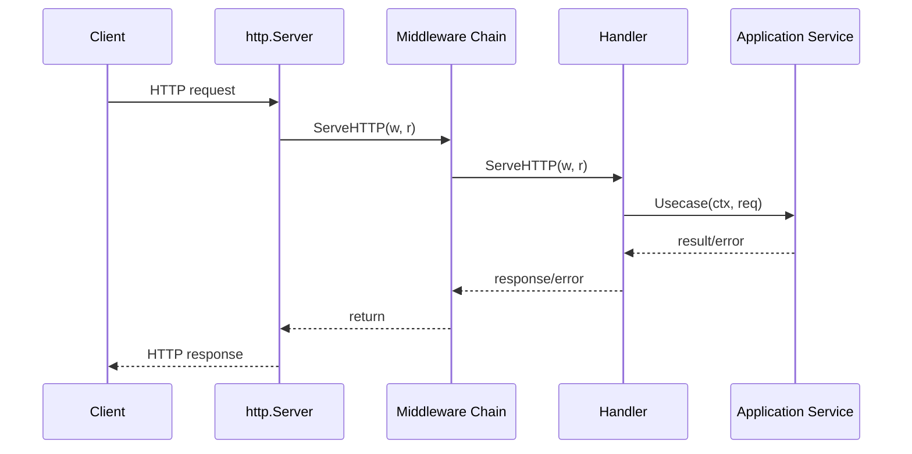
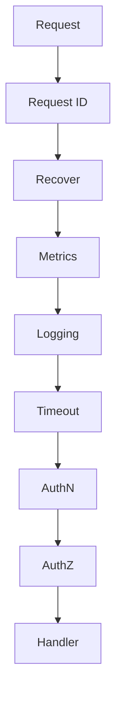
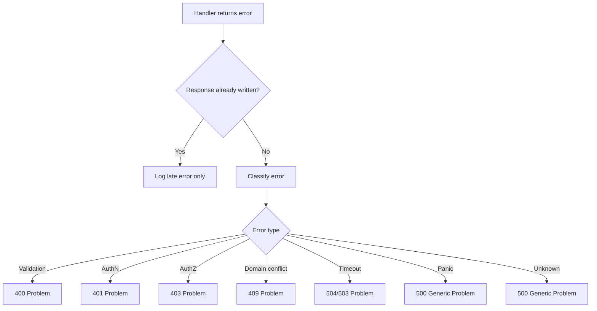
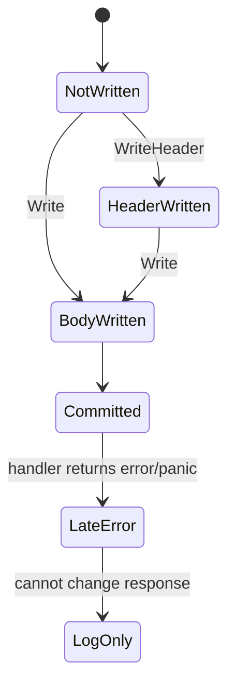

# learn-go-reliability-error-handling-part-018.md

# HTTP Server Reliability: Handler Errors, Middleware, Panic Recovery, Response Contract

> Seri: `learn-go-reliability-error-handling`  
> Part: `018`  
> Target: Go 1.26.x  
> Level: Advanced / internal engineering handbook  
> Fokus: reliability pada HTTP server Go: handler error boundary, middleware, panic recovery, request context, timeout, response contract, observability, dan production hardening.

---

## 0. Posisi Materi Ini Dalam Seri

Bagian sebelumnya sudah membahas:

- error boundary
- validation/domain/dependency error
- panic/recover
- defer/cleanup
- context propagation
- timeout engineering
- retry/idempotency
- concurrency dan channel failure

Sekarang kita masuk ke boundary yang paling sering menjadi wajah sistem: **HTTP server**.

HTTP server adalah tempat error internal berubah menjadi public API response.

Kesalahan di layer ini sering berbahaya:

- raw error string bocor ke client
- panic membocorkan stack trace
- response ditulis dua kali
- status code salah
- context cancellation dianggap internal error
- validation error jadi 500
- domain rejection jadi 500
- dependency timeout jadi 400
- request body tidak dibatasi
- response partial terkirim lalu error baru terjadi
- middleware order salah
- timeout middleware tidak menghentikan kerja
- log spam di setiap layer
- panic recovery mengembalikan success palsu
- streaming endpoint memakai timeout biasa
- readiness masih hijau saat dependency fatal

HTTP reliability bukan sekadar `http.ListenAndServe`.

---

## 1. Core Thesis

HTTP server reliability berarti:

> Setiap request harus memiliki lifecycle, error boundary, response contract, cancellation semantics, panic boundary, timeout policy, observability, dan resource cleanup yang jelas.

Di Go, `net/http` memberi primitive solid, tetapi policy tetap milik aplikasi.

A production-grade HTTP server harus menjawab:

1. Bagaimana handler mengembalikan error?
2. Siapa yang memetakan error ke status code?
3. Apakah public error response stabil?
4. Apakah panic direcover?
5. Apakah panic selalu 500?
6. Apakah request body dibatasi?
7. Apakah response body ditulis sekali?
8. Apakah partial response mungkin?
9. Apakah handler timeout per-route?
10. Apakah client cancellation dibedakan dari server failure?
11. Apakah dependency timeout jadi 504/503?
12. Apakah validation/domain/auth error dipetakan benar?
13. Apakah logs/metrics/traces consistent?
14. Apakah middleware order benar?
15. Apakah server punya read/write/idle timeout?
16. Apakah shutdown graceful?
17. Apakah readiness/liveness benar?

---

## 2. `net/http` Mental Model

Request masuk:



`http.Handler` interface:

```go
type Handler interface {
    ServeHTTP(ResponseWriter, *Request)
}
```

Problem: `ServeHTTP` does not return error.

So application teams often choose one of these patterns:

1. Handler writes errors directly.
2. Handler function returns error through adapter.
3. Panic for control flow, recovered by middleware.
4. Framework-specific context/error handler.

For top-level reliability, pattern 2 is usually clearer in custom Go apps.

---

## 3. Handler Returning Error Pattern

Define application handler:

```go
type AppHandler func(http.ResponseWriter, *http.Request) error
```

Adapter:

```go
func Adapt(h AppHandler, boundary *ErrorBoundary) http.Handler {
    return http.HandlerFunc(func(w http.ResponseWriter, r *http.Request) {
        if err := h(w, r); err != nil {
            boundary.WriteError(w, r, err)
        }
    })
}
```

Usage:

```go
mux.Handle("/cases/submit", Adapt(caseHandler.Submit, boundary))
```

Handler:

```go
func (h *CaseHandler) Submit(w http.ResponseWriter, r *http.Request) error {
    ctx := r.Context()

    var req SubmitRequest
    if err := decodeJSON(w, r, &req, h.cfg.MaxBodyBytes); err != nil {
        return err
    }

    principal, err := h.auth.Principal(ctx)
    if err != nil {
        return err
    }

    resp, err := h.service.SubmitCase(ctx, principal, req)
    if err != nil {
        return err
    }

    return writeJSON(w, http.StatusOK, resp)
}
```

Benefits:

- one central error mapping
- one central log policy
- consistent response contract
- handler code linear
- no duplicate `writeError` everywhere
- easy middleware composition

Caveat:

- handler must not have already written response before returning error unless boundary can detect it.

---

## 4. ResponseWriter Problem: You Cannot Unwrite

Once headers/body are written, you cannot safely change status code.

```go
w.WriteHeader(http.StatusOK)
_, _ = w.Write([]byte("partial"))

return ErrSomething // too late
```

At this point, boundary cannot send 500 because status/body already started.

Therefore:

> Do not write response until all operations that can fail before response are done.

For JSON API:

1. parse/validate
2. call service
3. prepare response object
4. write once

### 4.1 Response Recorder Wrapper

To detect double write or committed response:

```go
type statusRecorder struct {
    http.ResponseWriter
    status      int
    wroteHeader bool
    bytes       int
}

func (r *statusRecorder) WriteHeader(code int) {
    if r.wroteHeader {
        return
    }
    r.status = code
    r.wroteHeader = true
    r.ResponseWriter.WriteHeader(code)
}

func (r *statusRecorder) Write(b []byte) (int, error) {
    if !r.wroteHeader {
        r.WriteHeader(http.StatusOK)
    }
    n, err := r.ResponseWriter.Write(b)
    r.bytes += n
    return n, err
}

func (r *statusRecorder) Written() bool {
    return r.wroteHeader
}
```

Boundary:

```go
func Adapt(h AppHandler, boundary *ErrorBoundary) http.Handler {
    return http.HandlerFunc(func(w http.ResponseWriter, r *http.Request) {
        rec := &statusRecorder{ResponseWriter: w}

        if err := h(rec, r); err != nil {
            if rec.Written() {
                boundary.LogLateError(r, err)
                return
            }
            boundary.WriteError(rec, r, err)
        }
    })
}
```

If response already written, log late error; do not attempt to write a second error response.

---

## 5. Public Error Response Contract

Never expose raw internal errors directly.

Bad:

```go
http.Error(w, err.Error(), http.StatusInternalServerError)
```

Risk:

- SQL details leak
- internal hostnames leak
- stack traces leak
- dependency names leak
- PII leak
- inconsistent client contract
- client depends on English string

Use stable response shape.

Example Problem-like response:

```json
{
  "type": "https://api.example.com/problems/validation-failed",
  "title": "Validation failed",
  "status": 400,
  "code": "VALIDATION_FAILED",
  "message": "The request contains invalid fields.",
  "correlation_id": "req-123",
  "fields": [
    {
      "path": "email",
      "code": "INVALID_FORMAT",
      "message": "Email format is invalid."
    }
  ]
}
```

### 5.1 Go Type

```go
type Problem struct {
    Type          string       `json:"type,omitempty"`
    Title         string       `json:"title"`
    Status        int          `json:"status"`
    Code          string       `json:"code"`
    Message       string       `json:"message"`
    CorrelationID string       `json:"correlation_id,omitempty"`
    Fields        []FieldError `json:"fields,omitempty"`
}

type FieldError struct {
    Path    string `json:"path"`
    Code    string `json:"code"`
    Message string `json:"message"`
}
```

### 5.2 Stable Code, Flexible Message

Clients should rely on `code`, not `message`.

Messages can be localized/changed.

---

## 6. Error Mapping

Centralize mapping.

```go
type ErrorBoundary struct {
    logger *slog.Logger
}

func (b *ErrorBoundary) Map(err error) Problem {
    switch {
    case errors.Is(err, ErrUnauthenticated):
        return Problem{
            Status:  http.StatusUnauthorized,
            Code:    "UNAUTHENTICATED",
            Title:   "Unauthenticated",
            Message: "Authentication is required.",
        }

    case errors.Is(err, ErrForbidden):
        return Problem{
            Status:  http.StatusForbidden,
            Code:    "FORBIDDEN",
            Title:   "Forbidden",
            Message: "You are not allowed to perform this action.",
        }

    case errors.Is(err, ErrValidation):
        return mapValidationProblem(err)

    case errors.Is(err, ErrNotFound):
        return Problem{
            Status:  http.StatusNotFound,
            Code:    "NOT_FOUND",
            Title:   "Not found",
            Message: "The requested resource was not found.",
        }

    case errors.Is(err, ErrConflict):
        return Problem{
            Status:  http.StatusConflict,
            Code:    "CONFLICT",
            Title:   "Conflict",
            Message: "The request conflicts with the current state.",
        }

    case errors.Is(err, context.DeadlineExceeded):
        return Problem{
            Status:  http.StatusGatewayTimeout,
            Code:    "REQUEST_TIMEOUT",
            Title:   "Request timeout",
            Message: "The request timed out before it could be completed.",
        }

    case errors.Is(err, ErrDependencyUnavailable):
        return Problem{
            Status:  http.StatusServiceUnavailable,
            Code:    "DEPENDENCY_UNAVAILABLE",
            Title:   "Dependency unavailable",
            Message: "A required dependency is temporarily unavailable.",
        }

    default:
        return Problem{
            Status:  http.StatusInternalServerError,
            Code:    "INTERNAL_ERROR",
            Title:   "Internal server error",
            Message: "An unexpected error occurred.",
        }
    }
}
```

### 6.1 Mapping Table

| Internal error | HTTP | Public code |
|---|---:|---|
| decode JSON malformed | 400 | MALFORMED_JSON |
| unknown field | 400 | UNKNOWN_FIELD |
| validation | 400/422 | VALIDATION_FAILED |
| unauthenticated | 401 | UNAUTHENTICATED |
| forbidden | 403 | FORBIDDEN |
| not found | 404 | NOT_FOUND |
| domain invalid transition | 409 | INVALID_STATE_TRANSITION |
| idempotency key conflict | 409 | IDEMPOTENCY_KEY_CONFLICT |
| rate limited | 429 | RATE_LIMITED |
| dependency timeout | 504 | DEPENDENCY_TIMEOUT |
| dependency unavailable | 503 | DEPENDENCY_UNAVAILABLE |
| overload/bulkhead full | 503 | SERVICE_BUSY |
| client canceled | no response / internal metric | CLIENT_CANCELED |
| panic | 500 | INTERNAL_ERROR |

---

## 7. Validation Error Mapping

From part 008, validation should be structured.

```go
type ValidationError struct {
    Fields []FieldViolation
}

type FieldViolation struct {
    Path    string
    Code    string
    Message string
}
```

Mapping:

```go
func mapValidationProblem(err error) Problem {
    var v *ValidationError
    if errors.As(err, &v) {
        fields := make([]FieldError, 0, len(v.Fields))
        for _, f := range v.Fields {
            fields = append(fields, FieldError{
                Path:    f.Path,
                Code:    f.Code,
                Message: f.Message,
            })
        }

        return Problem{
            Status:  http.StatusBadRequest,
            Code:    "VALIDATION_FAILED",
            Title:   "Validation failed",
            Message: "The request contains invalid fields.",
            Fields:  fields,
        }
    }

    return Problem{
        Status:  http.StatusBadRequest,
        Code:    "VALIDATION_FAILED",
        Title:   "Validation failed",
        Message: "The request is invalid.",
    }
}
```

Do not parse field errors from `err.Error()`.

---

## 8. Decode JSON Reliably

Naive:

```go
json.NewDecoder(r.Body).Decode(&req)
```

Production-ish:

```go
func decodeJSON(w http.ResponseWriter, r *http.Request, dst any, maxBytes int64) error {
    r.Body = http.MaxBytesReader(w, r.Body, maxBytes)
    defer r.Body.Close()

    dec := json.NewDecoder(r.Body)
    dec.DisallowUnknownFields()

    if err := dec.Decode(dst); err != nil {
        return mapDecodeError(err)
    }

    if dec.More() {
        return ErrMalformedJSON
    }

    var extra any
    if err := dec.Decode(&extra); err != io.EOF {
        return ErrMultipleJSONValues
    }

    return nil
}
```

### 8.1 Decode Pitfalls

- request body too large
- malformed JSON
- unknown fields
- multiple JSON documents
- wrong type
- missing field vs zero value
- numeric precision
- array too large
- deeply nested JSON
- decoder error messages not stable API
- body not closed
- raw error string leaked

### 8.2 Body Size

Always set max body for JSON API.

```go
r.Body = http.MaxBytesReader(w, r.Body, 1<<20)
```

### 8.3 Unknown Fields

`DisallowUnknownFields` prevents silent typo.

But for backward compatibility, some APIs allow unknown fields. Decide intentionally.

---

## 9. Write JSON Reliably

```go
func writeJSON(w http.ResponseWriter, status int, v any) error {
    w.Header().Set("Content-Type", "application/json; charset=utf-8")
    w.WriteHeader(status)

    if err := json.NewEncoder(w).Encode(v); err != nil {
        return fmt.Errorf("encode response: %w", err)
    }

    return nil
}
```

Problem: after `WriteHeader`, encode error cannot be turned into error response.

For simple small JSON, encoding usually fails only if `v` contains unsupported values or client disconnects during write.

To avoid unsupported value late failure, encode to buffer first:

```go
func writeJSON(w http.ResponseWriter, status int, v any) error {
    var buf bytes.Buffer

    enc := json.NewEncoder(&buf)
    if err := enc.Encode(v); err != nil {
        return fmt.Errorf("encode response: %w", err)
    }

    w.Header().Set("Content-Type", "application/json; charset=utf-8")
    w.WriteHeader(status)

    if _, err := w.Write(buf.Bytes()); err != nil {
        return fmt.Errorf("write response: %w", err)
    }

    return nil
}
```

Tradeoff:

- buffer safer for small responses
- streaming large response should not buffer all

---

## 10. Panic Recovery Middleware

Panic recovery must be at HTTP boundary.

```go
func RecoverMiddleware(logger *slog.Logger, next http.Handler) http.Handler {
    return http.HandlerFunc(func(w http.ResponseWriter, r *http.Request) {
        rec := &statusRecorder{ResponseWriter: w}

        defer func() {
            if v := recover(); v != nil {
                err := fmt.Errorf("panic: %v", v)

                logger.ErrorContext(r.Context(), "panic recovered",
                    "error", err,
                    "stack", string(debug.Stack()),
                )

                if rec.Written() {
                    return
                }

                writeProblem(rec, Problem{
                    Status:  http.StatusInternalServerError,
                    Code:    "INTERNAL_ERROR",
                    Title:   "Internal server error",
                    Message: "An unexpected error occurred.",
                })
            }
        }()

        next.ServeHTTP(rec, r)
    })
}
```

### 10.1 Panic Policy

Recover at boundary so one request panic does not crash entire server.

But also:

- log stack
- increment panic metric
- return generic 500
- do not expose panic value
- consider crashing for certain invariant corruption if safer
- alert on panic rate
- test panic middleware

### 10.2 Panic After Partial Response

If response already started, cannot return 500. Log and close if possible. Client may see broken response.

---

## 11. Middleware Chain Order

Recommended order conceptually:

```text
request id / correlation
panic recovery
security headers
request logging / metrics
timeout
body limit maybe per-route
auth
authorization
handler
```

But order depends on what you want measured/recovered.

A common robust chain:



### 11.1 Recovery Should Wrap Most Things

If auth middleware panics, recovery should catch.

### 11.2 Request ID Before Logging

So logs include correlation ID.

### 11.3 Metrics Around Full Chain

So panic/error/latency captured.

### 11.4 Timeout Before Expensive Work

So auth/service also bounded if desired.

### 11.5 Body Limit Often Route-specific

Max body differs per endpoint.

---

## 12. Timeout Middleware Caveat

Context timeout middleware:

```go
func Timeout(timeout time.Duration, next http.Handler) http.Handler {
    return http.HandlerFunc(func(w http.ResponseWriter, r *http.Request) {
        ctx, cancel := context.WithTimeout(r.Context(), timeout)
        defer cancel()

        next.ServeHTTP(w, r.WithContext(ctx))
    })
}
```

This does not forcibly stop handler. Handler/dependencies must observe context.

If handler ignores context:

```go
time.Sleep(time.Minute)
```

Request still consumes goroutine until done.

Use context-aware code.

### 12.1 `http.TimeoutHandler`

`http.TimeoutHandler` runs handler with a time limit and sends timeout response, but it has caveats for streaming and does not magically stop all underlying work unless code cooperates with context. Many production systems prefer explicit context timeout + handler cooperation.

---

## 13. Request Context Cancellation

`r.Context()` is canceled when:

- client connection closes
- request canceled
- HTTP/2 request canceled
- server handler lifecycle ends

Handler should pass it down.

```go
ctx := r.Context()
resp, err := h.service.Do(ctx, req)
```

### 13.1 Client Canceled

If client cancels, do not log as server error.

```go
if errors.Is(err, context.Canceled) {
    logger.InfoContext(ctx, "request canceled by client", "error", err)
    return
}
```

But be careful: `context.Canceled` can also be server shutdown/parent cancellation. Use cause if available.

---

## 14. Server Timeouts

Do not use default `http.ListenAndServe` without explicit server in production.

```go
srv := &http.Server{
    Addr:              cfg.Addr,
    Handler:           handler,
    ReadHeaderTimeout: cfg.ReadHeaderTimeout,
    ReadTimeout:       cfg.ReadTimeout,
    WriteTimeout:      cfg.WriteTimeout,
    IdleTimeout:       cfg.IdleTimeout,
}
```

Purpose:

- `ReadHeaderTimeout`: slowloris protection
- `ReadTimeout`: header+body read bound
- `WriteTimeout`: response write bound
- `IdleTimeout`: idle keep-alive bound

From part 013: choose carefully for streaming/upload.

---

## 15. Max Body Size and Content Type

Before decoding JSON:

```go
if ct := r.Header.Get("Content-Type"); !strings.HasPrefix(ct, "application/json") {
    return ErrUnsupportedMediaType
}
```

Then limit:

```go
r.Body = http.MaxBytesReader(w, r.Body, maxBody)
```

Mapping:

| Error | HTTP |
|---|---:|
| unsupported media type | 415 |
| body too large | 413 |
| malformed JSON | 400 |
| unknown field | 400 |
| validation failed | 400/422 |

---

## 16. Authentication and Authorization Errors

Authentication:

- no credentials
- invalid token
- expired token
- malformed auth header

Map to `401`.

Authorization:

- authenticated but not allowed

Map to `403`.

Do not reveal too much:

```json
{
  "code": "FORBIDDEN",
  "message": "You are not allowed to perform this action."
}
```

Do not expose:

```text
role CASE_APPROVER missing for agency CEA internal module X
```

unless internal-only and safe.

---

## 17. Domain Errors

Domain errors are expected business rejections.

Example:

- case not in draft
- appeal window closed
- duplicate active application
- cannot submit without mandatory document
- status transition invalid

Mapping often:

- `409 Conflict` for state conflict
- `422 Unprocessable Content` for semantic input depending API convention
- `400` for request rule violations
- `403` if business authorization-like rule

Be consistent.

```go
case errors.Is(err, ErrInvalidTransition):
    return Problem{
        Status:  http.StatusConflict,
        Code:    "INVALID_STATE_TRANSITION",
        Title:   "Invalid state transition",
        Message: "The case cannot be submitted in its current state.",
    }
```

---

## 18. Dependency Errors

Dependency errors should not leak raw dependency details.

Internal:

```text
profile service GET /users/123 returned 503
```

Public:

```json
{
  "code": "DEPENDENCY_UNAVAILABLE",
  "message": "A required service is temporarily unavailable."
}
```

Mapping:

| Dependency failure | HTTP |
|---|---:|
| dependency timeout | 504 |
| dependency unavailable | 503 |
| dependency rate limit | 503/429 depending who is limited |
| dependency bad response | 502 |
| dependency permanent config error | 500 |
| dependency auth/config failure | 500/internal alert |

---

## 19. Overload and Load Shedding

If local queue/bulkhead full:

```go
return ErrServiceBusy
```

Map:

```go
Problem{
    Status:  http.StatusServiceUnavailable,
    Code:    "SERVICE_BUSY",
    Message: "The service is currently busy. Please try again later.",
}
```

Optional header:

```go
w.Header().Set("Retry-After", "1")
```

Use `429` if client/tenant-specific rate limit.

Use `503` if server capacity/dependency capacity issue.

---

## 20. Idempotency HTTP Contract

For side-effecting POST:

```http
Idempotency-Key: ...
```

Error mapping:

| Situation | HTTP | Code |
|---|---:|---|
| missing key | 400 | IDEMPOTENCY_KEY_REQUIRED |
| same key different payload | 409 | IDEMPOTENCY_KEY_CONFLICT |
| original still processing | 409/202 | OPERATION_IN_PROGRESS |
| replay completed | original | original |
| expired key | 409/400/new op by contract | IDEMPOTENCY_KEY_EXPIRED |

Add response header if useful:

```http
Idempotent-Replayed: true
```

---

## 21. Response Commit Policy

Rules:

1. Write response once.
2. Do not call `WriteHeader` until status known.
3. Encode small JSON to buffer before writing.
4. For streaming, accept partial response semantics explicitly.
5. If late error occurs after response committed, log/metric; cannot change response.
6. Do not return error from handler after successful response unless adapter handles committed state.

### 21.1 `writeJSON` Returning Error

If `writeJSON` fails due to client disconnect, do not log as internal server bug.

Classify write errors carefully.

---

## 22. Streaming Response Reliability

Streaming is different from normal JSON response.

Once stream starts:

- status code committed
- cannot send normal problem JSON
- errors must be encoded in stream protocol or end stream
- write timeout strategy differs
- client cancellation common
- backpressure matters

Example SSE:

```go
func (h *Handler) Stream(w http.ResponseWriter, r *http.Request) error {
    ctx := r.Context()

    flusher, ok := w.(http.Flusher)
    if !ok {
        return ErrStreamingUnsupported
    }

    w.Header().Set("Content-Type", "text/event-stream")
    w.WriteHeader(http.StatusOK)

    events, err := h.service.Watch(ctx)
    if err != nil {
        return err // too late if already wrote status; so get events before WriteHeader if possible
    }

    for {
        select {
        case <-ctx.Done():
            return context.Cause(ctx)

        case ev, ok := <-events:
            if !ok {
                return nil
            }

            if _, err := fmt.Fprintf(w, "data: %s\n\n", ev.JSON); err != nil {
                return fmt.Errorf("write event: %w", err)
            }
            flusher.Flush()
        }
    }
}
```

Better: create stream source before writing header if possible.

---

## 23. Middleware for Logging

Boundary logging should happen once.

```go
func Logging(logger *slog.Logger, next http.Handler) http.Handler {
    return http.HandlerFunc(func(w http.ResponseWriter, r *http.Request) {
        rec := &statusRecorder{ResponseWriter: w}
        start := time.Now()

        next.ServeHTTP(rec, r)

        status := rec.status
        if status == 0 {
            status = http.StatusOK
        }

        logger.InfoContext(r.Context(), "http request",
            "method", r.Method,
            "path", routePattern(r),
            "status", status,
            "bytes", rec.bytes,
            "duration_ms", time.Since(start).Milliseconds(),
        )
    })
}
```

Avoid logging raw path with high-cardinality IDs if metrics labels. Logs can include path, metrics should use route pattern.

---

## 24. Metrics

Important metrics:

```text
http_requests_total{method,route,status_class,code}
http_request_duration_seconds{method,route}
http_request_body_too_large_total{route}
http_panic_total{route}
http_timeouts_total{route,kind}
http_client_canceled_total{route}
http_response_write_errors_total{route}
http_inflight_requests{route}
```

Avoid high-cardinality labels:

Bad:

```text
route="/cases/CASE-123/submit"
```

Good:

```text
route="/cases/{id}/submit"
```

### 24.1 Error Code Metric

Expose stable error code:

```text
http_requests_total{route="/cases/{id}/submit",status="409",code="INVALID_STATE_TRANSITION"}
```

This is better than label by error string.

---

## 25. Tracing

Trace should show:

- request span
- route
- status code
- error code
- dependency spans
- DB query spans
- timeout/cancellation cause
- retry attempts
- idempotency replay
- panic event if recovered

Do not put PII in span attributes.

Use context propagation.

---

## 26. Security Headers

Basic middleware may set:

```go
w.Header().Set("X-Content-Type-Options", "nosniff")
w.Header().Set("X-Frame-Options", "DENY")
w.Header().Set("Referrer-Policy", "no-referrer")
```

CSP depends on app.

Do not let panic/error response bypass security headers. Put security middleware outside handler before response.

---

## 27. CORS Failure Semantics

CORS errors happen in browser before app response is visible.

Design:

- validate origin
- respond to preflight correctly
- do not use wildcard with credentials
- include CORS headers on error responses when appropriate
- log rejected origin carefully
- avoid origin reflection without whitelist

CORS middleware should run before handler.

---

## 28. Health, Liveness, Readiness

### 28.1 Liveness

Is process alive?

Should be simple.

```go
GET /live -> 200 if process event loop alive
```

Do not check all dependencies in liveness. Bad liveness can cause restart loops.

### 28.2 Readiness

Can this instance accept traffic?

Should consider:

- startup completed
- config loaded
- DB reachable if required
- critical dependencies maybe
- migration state
- shutdown started
- internal queue saturated? maybe
- circuit breakers? maybe

On shutdown, readiness should flip false before server stops.

### 28.3 Health Dependency Timeout

Health checks must have short timeout.

```go
ctx, cancel := context.WithTimeout(r.Context(), 200*time.Millisecond)
defer cancel()
```

Do not let health endpoint hang.

---

## 29. Graceful Shutdown Preview

HTTP server graceful shutdown:

```go
ctx, cancel := context.WithTimeout(context.Background(), cfg.ShutdownTimeout)
defer cancel()

if err := srv.Shutdown(ctx); err != nil {
    return fmt.Errorf("shutdown http server: %w", err)
}
```

But full shutdown includes:

- mark not ready
- stop accepting traffic
- drain in-flight requests
- stop workers
- close dependencies
- flush telemetry

This will be covered in part 019 and 020.

---

## 30. Router and 404/405

Do not let missing route produce inconsistent response.

Define standard 404/405 problem responses.

```json
{
  "code": "ROUTE_NOT_FOUND",
  "message": "The requested endpoint was not found."
}
```

For method not allowed:

```json
{
  "code": "METHOD_NOT_ALLOWED",
  "message": "The HTTP method is not allowed for this endpoint."
}
```

If using standard mux/framework, customize if possible.

---

## 31. Request ID / Correlation ID

Middleware:

```go
func RequestID(next http.Handler) http.Handler {
    return http.HandlerFunc(func(w http.ResponseWriter, r *http.Request) {
        id := r.Header.Get("X-Request-ID")
        if id == "" || !validRequestID(id) {
            id = newRequestID()
        }

        w.Header().Set("X-Request-ID", id)

        ctx := contextx.WithRequestID(r.Context(), id)
        next.ServeHTTP(w, r.WithContext(ctx))
    })
}
```

Use in problem response:

```go
problem.CorrelationID = requestID
```

Do not trust arbitrary long/malicious request IDs.

---

## 32. Route-specific Middleware

Different routes need different policies:

| Route | Body limit | Timeout | Auth | Streaming |
|---|---:|---:|---|---|
| `/live` | none/small | 100ms | no | no |
| `/ready` | none/small | 300ms | no/internal | no |
| `GET /cases/{id}` | small | 500ms | yes | no |
| `POST /cases/{id}/submit` | 1MB | 2s | yes | no |
| `POST /imports` | large | special | yes | maybe async |
| `/events/stream` | small | stream policy | yes | yes |

Avoid one global policy for all routes.

---

## 33. API Versioning and Error Contract

If error response changes, clients can break.

Stabilize:

- `code`
- `status`
- field error `code`
- schema version if needed
- documentation

Allow message wording to evolve.

If versioned API:

```json
{
  "version": "2026-01",
  "code": "VALIDATION_FAILED"
}
```

But do not overcomplicate unless needed.

---

## 34. Testing HTTP Error Boundary

### 34.1 Validation Error

```go
func TestSubmitValidationError(t *testing.T) {
    req := httptest.NewRequest(http.MethodPost, "/cases/1/submit", strings.NewReader(`{}`))
    rr := httptest.NewRecorder()

    handler.ServeHTTP(rr, req)

    if rr.Code != http.StatusBadRequest {
        t.Fatalf("expected 400, got %d", rr.Code)
    }

    var p Problem
    if err := json.NewDecoder(rr.Body).Decode(&p); err != nil {
        t.Fatal(err)
    }

    if p.Code != "VALIDATION_FAILED" {
        t.Fatalf("expected validation code, got %s", p.Code)
    }
}
```

### 34.2 Panic Recovery

```go
func TestRecoverMiddleware(t *testing.T) {
    h := RecoverMiddleware(logger, http.HandlerFunc(func(w http.ResponseWriter, r *http.Request) {
        panic("boom")
    }))

    rr := httptest.NewRecorder()
    req := httptest.NewRequest(http.MethodGet, "/", nil)

    h.ServeHTTP(rr, req)

    if rr.Code != http.StatusInternalServerError {
        t.Fatalf("expected 500, got %d", rr.Code)
    }
}
```

### 34.3 Response Already Written

Test adapter does not write second response.

```go
func TestLateErrorAfterWrite(t *testing.T) {
    h := Adapt(func(w http.ResponseWriter, r *http.Request) error {
        w.WriteHeader(http.StatusOK)
        _, _ = w.Write([]byte(`{"ok":true}`))
        return errors.New("late error")
    }, boundary)

    rr := httptest.NewRecorder()
    req := httptest.NewRequest(http.MethodGet, "/", nil)

    h.ServeHTTP(rr, req)

    if rr.Code != http.StatusOK {
        t.Fatalf("expected original 200, got %d", rr.Code)
    }
}
```

### 34.4 Context Canceled

Use fake service that waits for context.

```go
func TestClientCancel(t *testing.T) {
    ctx, cancel := context.WithCancel(context.Background())
    cancel()

    req := httptest.NewRequest(http.MethodGet, "/", nil).WithContext(ctx)
    rr := httptest.NewRecorder()

    handler.ServeHTTP(rr, req)

    // Depending policy, may have no response or mapped code in tests.
}
```

---

## 35. Testing Decode Hardening

Test:

- malformed JSON
- multiple JSON values
- unknown field
- body too large
- wrong content type
- empty body
- wrong type
- missing required field
- huge array

Example:

```go
func TestDecodeRejectsUnknownField(t *testing.T) {
    body := strings.NewReader(`{"unknown": true}`)
    req := httptest.NewRequest(http.MethodPost, "/", body)
    rr := httptest.NewRecorder()

    var dst SubmitRequest
    err := decodeJSON(rr, req, &dst, 1024)

    if !errors.Is(err, ErrUnknownField) {
        t.Fatalf("expected unknown field, got %v", err)
    }
}
```

---

## 36. Testing Middleware Order

Integration test:

- request id appears in response
- panic response includes request id
- metrics capture panic
- timeout applies to auth/service
- CORS headers present on error
- security headers present on error
- body limit before decode
- auth not bypassed

Middleware order bugs are common.

---

## 37. Anti-Patterns

### 37.1 `http.Error(w, err.Error(), 500)`

Leaks internals and unstable contract.

### 37.2 Writing Response Then Returning Error

Boundary cannot fix committed response.

### 37.3 Panic for Normal Error

Do not use panic for validation/domain/dependency errors.

### 37.4 Recover Without Logging Stack

You lose root cause.

### 37.5 Logging Same Error in Handler, Service, Repo

Log once at boundary; wrap below.

### 37.6 Treating Client Cancel as 500

Not server incident.

### 37.7 No Body Limit

Memory/DoS risk.

### 37.8 Default HTTP Server Timeouts

Slowloris/resource risk.

### 37.9 One Timeout for All Routes

Streaming/upload breaks or JSON too slow.

### 37.10 Exposing Dependency Error

Public API should not reveal internal topology.

### 37.11 Readiness Checks Too Heavy

Can self-DDoS dependencies.

### 37.12 Liveness Depends on DB

Can cause restart loop during DB outage.

---

## 38. Production Checklist

### 38.1 Server

- [ ] Explicit `http.Server`.
- [ ] `ReadHeaderTimeout` set.
- [ ] `ReadTimeout`/`WriteTimeout` reviewed for route types.
- [ ] `IdleTimeout` set.
- [ ] Graceful shutdown implemented.
- [ ] Max header/body policy exists.

### 38.2 Handler

- [ ] Handler returns error or uses consistent boundary.
- [ ] Response written once.
- [ ] Request context propagated.
- [ ] Request body limited.
- [ ] Content-Type validated where needed.
- [ ] Decode errors mapped safely.
- [ ] No raw internal error exposed.

### 38.3 Middleware

- [ ] Recovery middleware present.
- [ ] Request ID middleware present.
- [ ] Logging/metrics middleware present.
- [ ] Timeout middleware route-aware.
- [ ] AuthN/AuthZ order correct.
- [ ] Security/CORS headers applied to error responses.

### 38.4 Error Mapping

- [ ] Validation -> 400/422.
- [ ] AuthN -> 401.
- [ ] AuthZ -> 403.
- [ ] Not found -> 404.
- [ ] Conflict/domain state -> 409.
- [ ] Rate limit -> 429.
- [ ] Dependency timeout -> 504.
- [ ] Overload -> 503.
- [ ] Panic -> 500 generic.
- [ ] Client cancel not counted as 500.

### 38.5 Observability

- [ ] Logs include request id/correlation id.
- [ ] Metrics use route pattern, not raw path.
- [ ] Error code metric exists.
- [ ] Panic metric exists.
- [ ] Timeout/cancel metrics separated.
- [ ] Response write error metric exists.
- [ ] Traces propagate context.

### 38.6 Security

- [ ] No stack trace in response.
- [ ] No SQL/dependency detail in public message.
- [ ] No secrets/PII in error response.
- [ ] Idempotency key not logged raw.
- [ ] Request ID validated.
- [ ] CORS whitelist correct.

---

## 39. Case Study: Submit Case Endpoint

### 39.1 Route Policy

```text
POST /cases/{id}/submit
Auth required: yes
Idempotency-Key required: yes
Max body: 1MB
Timeout: 2s
Response: JSON
Streaming: no
```

### 39.2 Handler

```go
func (h *CaseHandler) Submit(w http.ResponseWriter, r *http.Request) error {
    ctx, cancel := context.WithTimeout(r.Context(), h.cfg.SubmitTimeout)
    defer cancel()

    if err := requireJSON(r); err != nil {
        return err
    }

    var req SubmitCaseRequest
    if err := decodeJSON(w, r.WithContext(ctx), &req, h.cfg.MaxSubmitBody); err != nil {
        return err
    }

    req.CaseID = pathValue(r, "id")
    req.IdempotencyKey = r.Header.Get("Idempotency-Key")

    principal, err := h.auth.Principal(ctx)
    if err != nil {
        return err
    }

    resp, err := h.service.SubmitCase(ctx, principal, req)
    if err != nil {
        return err
    }

    return writeJSON(w, http.StatusOK, resp)
}
```

### 39.3 Error Mapping Examples

| Scenario | HTTP | Code |
|---|---:|---|
| missing idempotency key | 400 | IDEMPOTENCY_KEY_REQUIRED |
| malformed JSON | 400 | MALFORMED_JSON |
| case not found | 404 | CASE_NOT_FOUND |
| actor cannot submit | 403/409 | FORBIDDEN / INVALID_STATE |
| case already submitted by same key | 200 | replay |
| same key different payload | 409 | IDEMPOTENCY_KEY_CONFLICT |
| dependency timeout | 504 | DEPENDENCY_TIMEOUT |
| DB pool exhausted | 503 | SERVICE_BUSY |
| panic | 500 | INTERNAL_ERROR |

---

## 40. Mermaid: HTTP Error Boundary



---

## 41. Mermaid: Middleware Chain


---

## 42. Mermaid: Response Commit



---

## 43. Java Engineer Translation Layer

### 43.1 Spring `@ControllerAdvice`

In Java/Spring, global exception mapping often done by `@ControllerAdvice`.

Go equivalent in custom `net/http` app:

```go
type ErrorBoundary struct{}
func (b *ErrorBoundary) WriteError(w http.ResponseWriter, r *http.Request, err error)
```

### 43.2 Servlet Filter / Spring Filter

Go middleware corresponds to Java servlet filters/Spring filters.

### 43.3 Response Already Committed

Java servlet also has “response committed” problem. Go has same issue: once header/body written, you cannot change status.

### 43.4 Checked Exception vs Explicit Error

Spring exceptions bubble automatically. Go handlers must deliberately return error or write response.

---

## 44. Key Takeaways

1. HTTP handler is an error boundary.
2. `net/http.Handler` does not return error, so define a clear boundary pattern.
3. Do not expose raw internal errors.
4. Public error response should have stable code and schema.
5. Write response once; after commit you cannot change status.
6. Encode small JSON response before writing when possible.
7. Panic recovery belongs at HTTP boundary.
8. Recovery must log stack and return generic 500.
9. Client cancellation is not the same as server failure.
10. Request context must propagate to services and dependencies.
11. Server timeouts and handler timeouts solve different problems.
12. Request body size must be limited.
13. Validation/domain/dependency errors need distinct mapping.
14. Middleware order matters.
15. Logging should happen once at boundary.
16. Metrics should use route pattern and stable error code.
17. Streaming endpoints need different error/timeout semantics.
18. Liveness and readiness should be designed separately.
19. Route-specific policy beats one global policy.
20. HTTP reliability is contract design plus lifecycle control.

---

## 45. References

- Go package documentation: `net/http`
- Go package documentation: `context`
- Go package documentation: `encoding/json`
- Go package documentation: `log/slog`
- Go Blog: Defer, Panic, and Recover
- RFC 9457: Problem Details for HTTP APIs
- OWASP: Error Handling Cheat Sheet
- OWASP: REST Security Cheat Sheet

---

## 46. Next Part

Next:

```text
learn-go-reliability-error-handling-part-019.md
```

Topic:

```text
Graceful Shutdown I: Signal Handling, Readiness, Stop Accepting, In-flight Drain
```

<!-- NAVIGATION_FOOTER -->
<div class="page-nav">
<a href="./learn-go-reliability-error-handling-part-017.md">⬅️ Channel Failure Semantics: Close, Done, Backpressure, Drop, Drain</a>
<a href="./index.md">📚 Kategori</a>
<a href="../../index.md">🏠 Home</a>
<a href="./learn-go-reliability-error-handling-part-019.md">Graceful Shutdown I: Signal Handling, Readiness, Stop Accepting, In-flight Drain ➡️</a>
</div>
