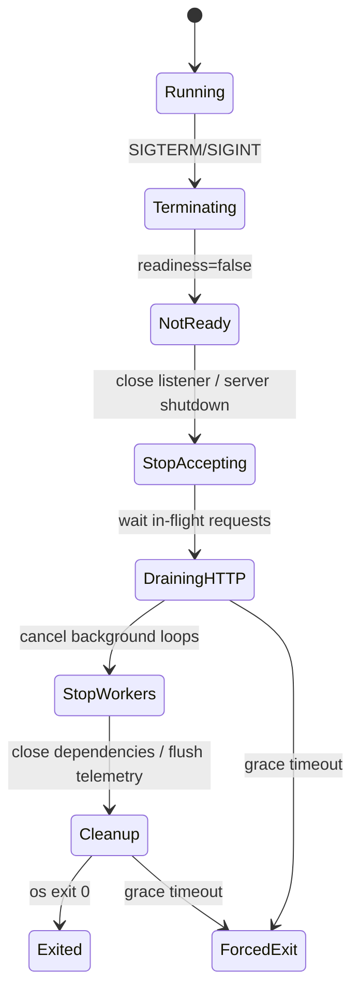
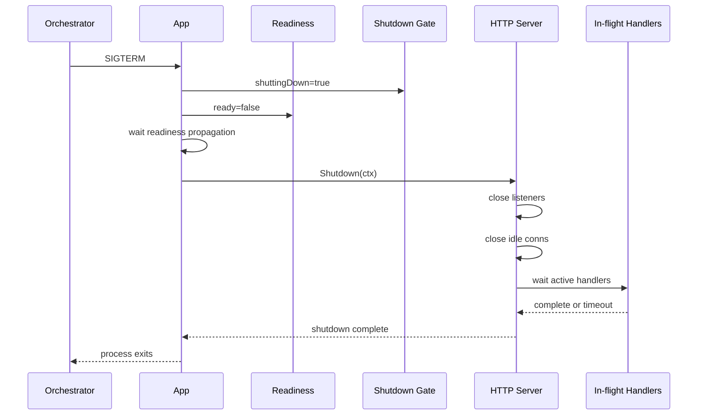
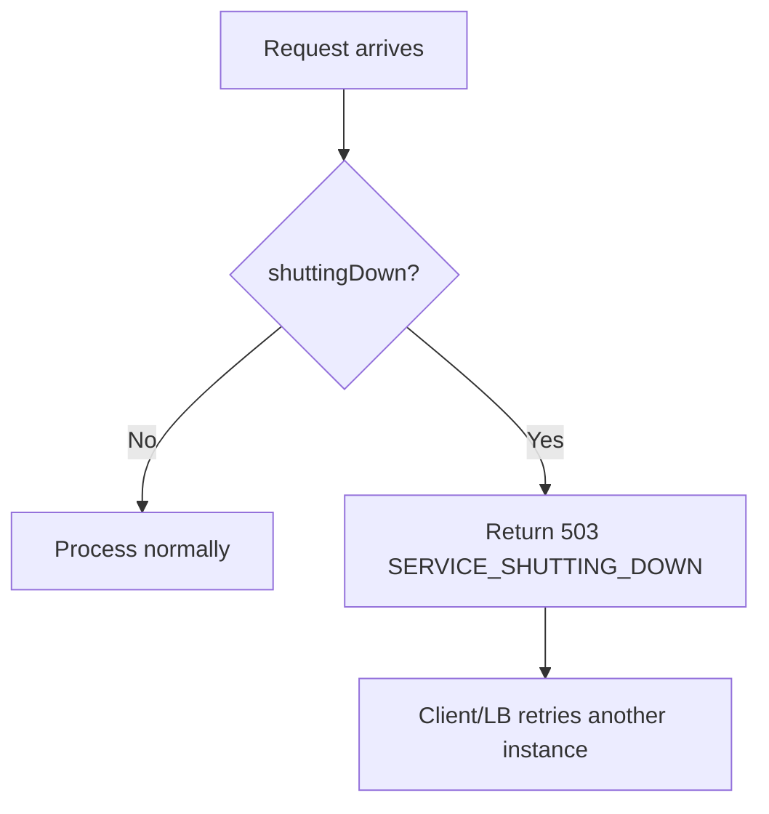

# learn-go-reliability-error-handling-part-019.md

# Graceful Shutdown I: Signal Handling, Readiness, Stop Accepting, In-flight Drain

> Seri: `learn-go-reliability-error-handling`  
> Part: `019`  
> Target: Go 1.26.x  
> Level: Advanced / internal engineering handbook  
> Fokus: graceful shutdown tahap pertama: signal handling, readiness, stop accepting traffic, HTTP server shutdown, in-flight request drain, dan lifecycle orchestration.

---

## 0. Posisi Materi Ini Dalam Seri

Bagian sebelumnya membahas HTTP server reliability:

- handler error boundary
- panic recovery
- response contract
- request context
- timeout
- middleware
- liveness/readiness
- server hardening

Sekarang kita masuk ke **graceful shutdown**.

Graceful shutdown adalah kemampuan service untuk berhenti tanpa membuat kerusakan yang tidak perlu:

- tidak menerima request baru saat akan mati
- menyelesaikan request yang sedang berjalan, jika masih dalam budget
- membatalkan request yang tidak bisa selesai
- tidak memutus transaksi penting di tengah tanpa rollback
- tidak kehilangan message/job
- tidak mengirim duplicate side effect
- tidak drop audit/outbox event
- tidak membuat load balancer mengirim traffic ke instance yang sedang berhenti
- tidak membuat orchestrator membunuh proses sebelum cleanup selesai
- tidak membuat deployment menyebabkan error spike

Graceful shutdown bukan “tangkap SIGTERM lalu `server.Shutdown` saja”. Itu hanya satu bagian.

---

## 1. Core Thesis

Graceful shutdown adalah **lifecycle protocol**.

Protocol minimal:

```text
1. receive shutdown signal
2. mark instance not ready
3. stop accepting new work
4. notify components to stop
5. drain in-flight HTTP requests
6. stop background workers/schedulers
7. finish or requeue current jobs
8. close dependencies
9. flush telemetry/logs
10. exit within orchestrator grace period
```

Part ini fokus pada tahap 1 sampai 5:

- signal handling
- readiness
- stop accepting
- HTTP in-flight drain
- request cancellation/drain policy

Part berikutnya (`part-020`) akan fokus pada:

- worker shutdown
- queues
- message brokers
- DB/HTTP client cleanup
- telemetry flush
- ordering antar component
- forced shutdown
- Kubernetes-specific tuning

---

## 2. Why Graceful Shutdown Matters

Tanpa graceful shutdown:

- user request tiba saat process sedang mati
- response putus di tengah
- transaction mungkin rollback setelah client retry
- client melihat timeout dan retry
- retry menyebabkan duplicate side effect
- message consumer process selesai tapi ack belum terkirim
- outbox dispatcher publish sukses tapi mark-published gagal
- audit buffer belum flush
- dependency connection close mendadak
- deployment rolling update menghasilkan error spike
- pod masih dianggap ready saat sudah menerima SIGTERM

Graceful shutdown mengurangi probabilitas failure saat deploy, scale down, node drain, crash recovery, dan maintenance.

---

## 3. Shutdown Is Not One Event

Shutdown punya beberapa fase.



Kunci: setiap fase punya waktu, owner, dan failure policy.

---

## 4. Signals in Go

Go process menerima OS signals seperti:

- `SIGTERM`: termination request, umum dari Kubernetes/systemd.
- `SIGINT`: interrupt, umum dari Ctrl+C.
- `SIGKILL`: kill paksa, tidak bisa ditangkap.
- `SIGHUP`: reload/terminal hangup, tergantung policy.

Untuk graceful shutdown, biasanya tangkap:

```go
os.Interrupt
syscall.SIGTERM
```

Modern Go menyediakan `signal.NotifyContext`.

```go
ctx, stop := signal.NotifyContext(context.Background(), os.Interrupt, syscall.SIGTERM)
defer stop()

<-ctx.Done()
```

Namun `ctx.Done()` hanya memberi tahu signal terjadi. Anda masih perlu orchestration shutdown.

---

## 5. Basic Signal Handling

Minimal:

```go
func main() {
    if err := run(); err != nil {
        slog.Error("application failed", "error", err)
        os.Exit(1)
    }
}

func run() error {
    root, stop := signal.NotifyContext(context.Background(), os.Interrupt, syscall.SIGTERM)
    defer stop()

    app, err := NewApp()
    if err != nil {
        return fmt.Errorf("initialize app: %w", err)
    }

    errCh := make(chan error, 1)
    go func() {
        errCh <- app.Run(root)
    }()

    select {
    case <-root.Done():
        return app.Shutdown(context.Background())
    case err := <-errCh:
        return err
    }
}
```

This is incomplete but demonstrates structure.

Problems:

- shutdown has no timeout
- app.Run may return due to server error
- root context is already canceled, not good for cleanup
- second signal not handled
- readiness not flipped
- component order unclear

We will improve it.

---

## 6. Root Context vs Shutdown Context

Important distinction:

- root context cancellation tells running components to stop.
- shutdown context gives cleanup a bounded time to complete.

Do not use already canceled root context for cleanup.

Bad:

```go
<-root.Done()
app.Shutdown(root) // root already canceled; cleanup may fail immediately
```

Good:

```go
<-root.Done()

shutdownCtx, cancel := context.WithTimeout(context.Background(), 25*time.Second)
defer cancel()

app.Shutdown(shutdownCtx)
```

Why?

Cleanup may need time:

- `http.Server.Shutdown`
- release lease
- close broker
- flush traces
- mark workers stopped
- finish current job
- rollback/requeue

Use bounded independent shutdown context.

---

## 7. Second Signal Should Force Exit

If user presses Ctrl+C twice or orchestrator sends signal again, service should not hang forever.

Pattern:

```go
root, stop := signal.NotifyContext(context.Background(), os.Interrupt, syscall.SIGTERM)
defer stop()

<-root.Done()

// Stop receiving further signals through this context.
// After stop(), a second Ctrl+C can terminate normally by default behavior.
stop()

shutdownCtx, cancel := context.WithTimeout(context.Background(), cfg.ShutdownTimeout)
defer cancel()

if err := app.Shutdown(shutdownCtx); err != nil {
    return err
}
```

Alternative: explicitly listen for second signal and call `os.Exit(1)`, but use carefully. Calling `os.Exit` skips deferred calls.

---

## 8. `http.Server.Shutdown`

`http.Server.Shutdown(ctx)` gracefully shuts down:

- closes listeners
- closes idle connections
- waits for active connections to become idle
- returns when done or context expires

Typical:

```go
shutdownCtx, cancel := context.WithTimeout(context.Background(), 25*time.Second)
defer cancel()

if err := srv.Shutdown(shutdownCtx); err != nil {
    return fmt.Errorf("shutdown http server: %w", err)
}
```

If context expires, Shutdown returns error. Then you may call `srv.Close()` to force close.

```go
if err := srv.Shutdown(ctx); err != nil {
    _ = srv.Close()
    return fmt.Errorf("graceful shutdown failed: %w", err)
}
```

### 8.1 `Shutdown` vs `Close`

| Method | Meaning |
|---|---|
| `Shutdown(ctx)` | graceful: stop accepting, wait active |
| `Close()` | immediate close active listeners/connections |

Use `Shutdown` first. Use `Close` as forced fallback.

---

## 9. HTTP Server Run Pattern

`ListenAndServe` returns `http.ErrServerClosed` after `Shutdown`. That is not an error to report as failure.

```go
func runHTTP(srv *http.Server) error {
    err := srv.ListenAndServe()
    if err != nil && !errors.Is(err, http.ErrServerClosed) {
        return fmt.Errorf("http server failed: %w", err)
    }
    return nil
}
```

If TLS:

```go
err := srv.ListenAndServeTLS(certFile, keyFile)
```

Same `ErrServerClosed` handling.

---

## 10. App Lifecycle Skeleton

```go
type App struct {
    httpServer *http.Server
    readiness  *Readiness
    logger     *slog.Logger
}

func (a *App) Run(ctx context.Context) error {
    errCh := make(chan error, 1)

    go func() {
        errCh <- runHTTP(a.httpServer)
    }()

    select {
    case <-ctx.Done():
        return context.Cause(ctx)

    case err := <-errCh:
        return err
    }
}

func (a *App) Shutdown(ctx context.Context) error {
    a.readiness.SetNotReady("shutting_down")

    if err := a.httpServer.Shutdown(ctx); err != nil {
        _ = a.httpServer.Close()
        return fmt.Errorf("shutdown http server: %w", err)
    }

    return nil
}
```

This is still simplified. Real app must coordinate workers, dependencies, telemetry.

---

## 11. Readiness: Stop Traffic Before Shutdown

In orchestrated environments, readiness tells load balancer whether this instance should receive traffic.

Shutdown sequence should mark not ready before stopping server.

```go
a.readiness.SetNotReady("shutting_down")
```

Then wait a short pre-drain period if needed:

```go
time.Sleep(cfg.ReadinessPropagationDelay)
```

Why wait?

- Kubernetes readiness update takes time
- endpoints controller/load balancer propagation is not instant
- external LB may still route briefly
- in-flight connections may still exist

In Kubernetes, this is often combined with `preStop` hook or app-level delay.

### 11.1 Readiness State

```go
type Readiness struct {
    ready atomic.Bool
    reason atomic.Value
}

func NewReadiness() *Readiness {
    r := &Readiness{}
    r.ready.Store(false)
    r.reason.Store("starting")
    return r
}

func (r *Readiness) SetReady() {
    r.ready.Store(true)
    r.reason.Store("ready")
}

func (r *Readiness) SetNotReady(reason string) {
    r.ready.Store(false)
    r.reason.Store(reason)
}

func (r *Readiness) Ready() (bool, string) {
    return r.ready.Load(), r.reason.Load().(string)
}
```

Handler:

```go
func (r *Readiness) Handler(w http.ResponseWriter, req *http.Request) {
    ready, reason := r.Ready()
    if !ready {
        http.Error(w, reason, http.StatusServiceUnavailable)
        return
    }
    w.WriteHeader(http.StatusOK)
    _, _ = w.Write([]byte("ok"))
}
```

---

## 12. Liveness vs Readiness During Shutdown

Liveness:

```text
Is process alive?
```

Readiness:

```text
Should this instance receive traffic?
```

During graceful shutdown:

| Probe | Response |
|---|---|
| readiness | false / 503 |
| liveness | true / 200 until process exits |

If liveness fails during shutdown, orchestrator may kill process too aggressively and skip drain.

Do not set liveness false just because you are shutting down gracefully.

---

## 13. Stop Accepting New Requests

There are several layers:

1. Readiness false: load balancer should stop routing.
2. `http.Server.Shutdown`: listener closed; no new connections accepted.
3. Middleware gate: reject new requests if already shutting down.
4. Existing keep-alive connections: Shutdown closes idle and waits active.

### 13.1 Middleware Gate

Because traffic may still arrive briefly after readiness false, add gate.

```go
type ShutdownGate struct {
    shuttingDown atomic.Bool
}

func (g *ShutdownGate) SetShuttingDown() {
    g.shuttingDown.Store(true)
}

func (g *ShutdownGate) Middleware(next http.Handler) http.Handler {
    return http.HandlerFunc(func(w http.ResponseWriter, r *http.Request) {
        if g.shuttingDown.Load() {
            w.Header().Set("Connection", "close")
            writeProblem(w, Problem{
                Status:  http.StatusServiceUnavailable,
                Code:    "SERVICE_SHUTTING_DOWN",
                Title:   "Service shutting down",
                Message: "This instance is shutting down. Please retry.",
            })
            return
        }

        next.ServeHTTP(w, r)
    })
}
```

Call:

```go
gate.SetShuttingDown()
readiness.SetNotReady("shutting_down")
```

### 13.2 Should Gate Reject Health Checks?

Readiness should return 503. Liveness should remain 200.

For business routes, return 503.

---

## 14. In-flight Request Drain

In-flight drain means allow active requests to finish within shutdown budget.

`http.Server.Shutdown(ctx)` waits for active handlers to return.

Handlers must:

- observe request context
- use dependency calls with context
- avoid unbounded loops
- avoid ignoring cancellation
- avoid long background work tied to request
- avoid streaming forever unless shutdown policy handles it

### 14.1 Request Context During Shutdown

`Server.Shutdown` does not necessarily immediately cancel all active request contexts. It waits for handlers to finish. You may need application-level root context to tell handlers shutdown is happening.

A common pattern is to inject base context into server.

---

## 15. Server BaseContext

`http.Server` supports `BaseContext` for accepted connections.

```go
rootCtx, cancelRoot := context.WithCancel(context.Background())

srv := &http.Server{
    Addr:    cfg.Addr,
    Handler: handler,
    BaseContext: func(net.Listener) context.Context {
        return rootCtx
    },
}
```

When shutting down:

```go
cancelRoot()
```

Now request contexts derived from server base can observe shutdown cause/cancellation.

But be careful: canceling root too early may cancel in-flight requests immediately instead of letting them drain.

### 15.1 Two Modes

Mode A: Drain active requests.

- set readiness false
- stop accepting new requests
- allow active request contexts to continue
- shutdown server with timeout

Mode B: Cancel active requests.

- set readiness false
- cancel root context
- active handlers stop sooner
- useful for fast shutdown or non-idempotent risk management

Most services use hybrid:

1. stop accepting new
2. give short drain window
3. then cancel active root
4. force close at final deadline

---

## 16. Drain Budget vs Force Budget

Example:

```text
orchestrator grace: 30s
readiness propagation: 5s
HTTP drain: 20s
force cleanup: 5s
```

Flow:

```mermaid
gantt
    title Shutdown Budget
    dateFormat X
    axisFormat %Ls

    section Shutdown
    readiness false / propagation :0, 5
    http drain :5, 20
    forced cleanup :25, 5
```



Do not set HTTP shutdown timeout equal to full Kubernetes grace if you also need worker cleanup and telemetry flush.

---

## 17. Request Timeout vs Shutdown Timeout

A request may have normal timeout 2s. Shutdown drain might be 20s.

If all requests have per-route timeout, they should finish within their budgets.

But long requests/streams may exceed.

Policy:

- normal JSON endpoints: finish within route timeout
- long-running operations: should be async, not in-flight HTTP
- streaming endpoints: close on shutdown
- uploads: special policy
- admin/report endpoints: may be canceled on shutdown

---

## 18. Streaming During Shutdown

Streaming endpoints can block `Shutdown` forever unless they exit.

Streaming handler must observe shutdown signal.

If using server root context:

```go
select {
case <-r.Context().Done():
    return
case ev := <-events:
    ...
}
```

When shutdown begins, cancel stream context if policy is to close streams.

For SSE/WebSocket-like:

- send shutdown event if possible
- close connection
- client reconnects to another instance
- use sticky/session policy if needed
- do not wait full drain for infinite stream

### 18.1 Stream Policy

| Stream type | Shutdown policy |
|---|---|
| SSE event stream | send close/reconnect, exit |
| WebSocket | close frame, exit |
| long polling | return 503/204/retry |
| file download | allow short drain or cancel based on size |
| upload | cancel or finish based on business criticality |

---

## 19. Readiness Propagation Delay

If behind Kubernetes Service/Ingress/LB, marking not ready does not instantly stop traffic.

Options:

1. App sets readiness false and sleeps before `Shutdown`.
2. Kubernetes `preStop` hook sleeps.
3. LB draining config.
4. Connection close headers during shutting_down.
5. Short server-level keep-alive/idle behavior.

App-level example:

```go
func (a *App) Shutdown(ctx context.Context) error {
    a.gate.SetShuttingDown()
    a.readiness.SetNotReady("shutting_down")

    if err := sleepContext(ctx, a.cfg.ReadinessPropagationDelay); err != nil {
        return err
    }

    if err := a.httpServer.Shutdown(ctx); err != nil {
        _ = a.httpServer.Close()
        return err
    }

    return nil
}
```

Do not sleep longer than shutdown budget.

---

## 20. Connection: close Header

During shutdown gate:

```go
w.Header().Set("Connection", "close")
```

This encourages client not to reuse connection.

But modern HTTP/2 semantics differ; do not rely solely on this.

`Server.Shutdown` handles listeners/idle conns.

---

## 21. In-flight Request Tracking

`http.Server.Shutdown` tracks active connections, but application may also track in-flight requests for observability/readiness.

Middleware:

```go
type InFlight struct {
    n atomic.Int64
}

func (i *InFlight) Middleware(next http.Handler) http.Handler {
    return http.HandlerFunc(func(w http.ResponseWriter, r *http.Request) {
        i.n.Add(1)
        defer i.n.Add(-1)

        next.ServeHTTP(w, r)
    })
}

func (i *InFlight) Count() int64 {
    return i.n.Load()
}
```

Metrics:

```text
http_inflight_requests
shutdown_inflight_remaining
```

During shutdown log periodically:

```go
logger.Info("waiting for in-flight requests", "count", inflight.Count())
```

Avoid high-frequency logs.

---

## 22. Middleware Order for Shutdown Gate

Recommended:

```text
request id
recover
metrics/in-flight
shutdown gate
timeout
auth
handler
```

If gate is before metrics, rejected shutdown requests may not be counted. If after metrics, they are counted.

Usually:

- request ID first
- recover wraps all
- metrics sees all
- shutdown gate rejects early
- auth not executed for rejected new requests

---

## 23. What Should Happen to New Requests During Shutdown?

Return:

```http
503 Service Unavailable
Retry-After: 1
Connection: close
```

Response:

```json
{
  "code": "SERVICE_SHUTTING_DOWN",
  "message": "This instance is shutting down. Please retry."
}
```

Why 503?

- this instance cannot serve
- caller/load balancer may retry another instance
- not client error

Use `Retry-After` cautiously.

---

## 24. Dependency Calls During Shutdown

If in-flight request continues during drain, should it call dependencies?

Usually yes, if request is allowed to finish.

But if shutdown budget is nearly exhausted, dependency calls should fail fast due to context deadline.

Use request context with deadline.

Also consider `requireBudget(ctx, min)` before starting transaction.

```go
if err := requireBudget(ctx, 500*time.Millisecond); err != nil {
    return fmt.Errorf("not enough shutdown/request budget: %w", err)
}
```

---

## 25. Transactions During Shutdown

If request already inside transaction:

- finish quickly if possible
- rollback if context canceled
- do not start new long transaction if shutdown has begun
- idempotency handles client retry
- outbox handles post-commit delivery
- avoid external side effect inside transaction

Shutdown can turn normal request into timeout/cancellation. Your transaction semantics from earlier parts matter.

---

## 26. Long-running Request Anti-pattern

```go
POST /reports/generate
```

that takes 5 minutes synchronously is hard to shutdown gracefully.

Better:

```text
POST /reports -> 202 Accepted + job_id
GET /reports/{job_id}
```

Worker handles job with checkpoint/retry/idempotency.

Graceful shutdown then requeues or resumes job instead of holding HTTP request.

---

## 27. Coordinating Run and Shutdown

A robust app often runs components under `errgroup`.

```go
func (a *App) Run(ctx context.Context) error {
    g, ctx := errgroup.WithContext(ctx)

    g.Go(func() error {
        return a.runHTTP()
    })

    g.Go(func() error {
        <-ctx.Done()
        return context.Cause(ctx)
    })

    return g.Wait()
}
```

But if `runHTTP` returns `http.ErrServerClosed`, don't treat as failure.

Better app orchestration:

```go
func (a *App) Serve() error {
    err := a.httpServer.ListenAndServe()
    if err != nil && !errors.Is(err, http.ErrServerClosed) {
        return fmt.Errorf("http serve: %w", err)
    }
    return nil
}
```

Main handles signal and calls Shutdown.

---

## 28. Full Skeleton

```go
func run() error {
    logger := slog.Default()

    root, stop := signal.NotifyContext(context.Background(), os.Interrupt, syscall.SIGTERM)
    defer stop()

    app, err := NewApp()
    if err != nil {
        return fmt.Errorf("initialize app: %w", err)
    }

    app.readiness.SetReady()

    serveErr := make(chan error, 1)
    go func() {
        serveErr <- app.Serve()
    }()

    select {
    case err := <-serveErr:
        return err

    case <-root.Done():
        logger.Info("shutdown signal received")
    }

    // Allow second Ctrl+C to terminate by default.
    stop()

    shutdownCtx, cancel := context.WithTimeout(context.Background(), app.cfg.ShutdownTimeout)
    defer cancel()

    if err := app.Shutdown(shutdownCtx); err != nil {
        return fmt.Errorf("shutdown app: %w", err)
    }

    select {
    case err := <-serveErr:
        if err != nil {
            return err
        }
    default:
    }

    logger.Info("shutdown completed")
    return nil
}
```

App:

```go
func (a *App) Serve() error {
    err := a.httpServer.ListenAndServe()
    if err != nil && !errors.Is(err, http.ErrServerClosed) {
        return fmt.Errorf("listen and serve: %w", err)
    }
    return nil
}

func (a *App) Shutdown(ctx context.Context) error {
    var err error

    a.gate.SetShuttingDown()
    a.readiness.SetNotReady("shutting_down")

    if a.cfg.ReadinessPropagationDelay > 0 {
        if sleepErr := sleepContext(ctx, a.cfg.ReadinessPropagationDelay); sleepErr != nil {
            err = errors.Join(err, fmt.Errorf("readiness propagation delay: %w", sleepErr))
        }
    }

    if shutdownErr := a.httpServer.Shutdown(ctx); shutdownErr != nil {
        err = errors.Join(err, fmt.Errorf("http graceful shutdown: %w", shutdownErr))

        if closeErr := a.httpServer.Close(); closeErr != nil {
            err = errors.Join(err, fmt.Errorf("http force close: %w", closeErr))
        }
    }

    return err
}
```

`sleepContext`:

```go
func sleepContext(ctx context.Context, d time.Duration) error {
    if d <= 0 {
        return nil
    }

    timer := time.NewTimer(d)
    defer timer.Stop()

    select {
    case <-timer.C:
        return nil
    case <-ctx.Done():
        return context.Cause(ctx)
    }
}
```

---

## 29. Kubernetes Mental Model

Kubernetes pod termination roughly:

```text
1. Pod marked terminating
2. Endpoint removal begins
3. preStop hook runs, if configured
4. SIGTERM sent to containers
5. terminationGracePeriodSeconds countdown
6. SIGKILL if process still alive after grace
```

Important:

- endpoint removal and external LB propagation are not instantaneous
- traffic may still arrive after SIGTERM
- your app must mark readiness false and/or gate new requests
- shutdown must finish before `terminationGracePeriodSeconds`
- SIGKILL cannot be handled

### 29.1 Budget Alignment

If Kubernetes grace is 30s:

```text
readiness propagation: 5s
HTTP drain: 20s
cleanup/telemetry: 4s
safety margin: 1s
```

Do not set shutdown timeout to 30s if you also sleep 10s. You will exceed grace.

---

## 30. `preStop` Hook vs App Delay

`preStop` sleep:

```yaml
lifecycle:
  preStop:
    exec:
      command: ["sh", "-c", "sleep 5"]
```

App delay:

```go
readiness.SetNotReady("shutting_down")
sleepContext(ctx, 5*time.Second)
```

Tradeoff:

| Approach | Pros | Cons |
|---|---|---|
| preStop sleep | simple, infra-controlled | app may still report ready unless readiness changes earlier |
| app delay | app controls readiness/gate | requires correct implementation |
| both | robust in some LB setups | consumes grace budget |

Best design depends on platform.

---

## 31. Readiness Handler Should Be Cheap

Readiness called frequently. Avoid expensive DB query every probe if it can overload dependency.

Use cached health state:

- startup checks
- background dependency monitor
- readiness flags
- circuit breaker state
- shutdown flag

Example:

```go
func (a *App) ReadyHandler(w http.ResponseWriter, r *http.Request) {
    ready, reason := a.readiness.Ready()
    if !ready {
        w.WriteHeader(http.StatusServiceUnavailable)
        _, _ = w.Write([]byte(reason))
        return
    }

    w.WriteHeader(http.StatusOK)
    _, _ = w.Write([]byte("ok"))
}
```

For dependency readiness, use bounded cached check.

---

## 32. Failure During Shutdown

Shutdown can fail.

Examples:

- HTTP server drain timeout
- active handler stuck
- telemetry flush timeout
- worker does not stop
- DB close error
- broker close error
- panic in shutdown hook

Policy:

- log errors
- join cleanup errors
- force close where safe
- exit non-zero if shutdown failed? depends
- emit metrics
- avoid hanging forever

For orchestrated service, if shutdown fails due to timeout, process may be killed anyway. But logging/metrics help diagnosis.

---

## 33. What If Serve Fails Before Signal?

If HTTP server fails unexpectedly:

```go
select {
case err := <-serveErr:
    return err
case <-root.Done():
    ...
}
```

If bind port fails at startup, return error and exit.

If listener fails while running, app should shut down other components. This will be covered more in part 020 with multi-component lifecycle.

---

## 34. Avoid `log.Fatal` in Shutdown Path

`log.Fatal` calls `os.Exit(1)`, skipping deferred cleanup.

Bad:

```go
if err := srv.ListenAndServe(); err != nil {
    log.Fatal(err)
}
```

In production lifecycle, return errors to `main`.

Good:

```go
if err := run(); err != nil {
    logger.Error("application failed", "error", err)
    os.Exit(1)
}
```

At the final top-level, `os.Exit` is acceptable after cleanup is done or initialization failed.

---

## 35. Interaction With Load Balancers

Load balancers may:

- keep existing connections
- retry idempotent requests
- route to terminating pod briefly
- have connection draining settings
- have health check intervals
- cache target health
- use HTTP/2 multiplexed connections

Your app should:

- readiness false early
- reject new requests during shutdown
- close idle connections through `Shutdown`
- set `Connection: close` for rejected HTTP/1.1 requests
- keep request timeouts shorter than drain budget
- design idempotent APIs for retry

---

## 36. Observability for Shutdown

Metrics:

```text
shutdown_started_total
shutdown_completed_total
shutdown_duration_seconds
shutdown_errors_total{component}
shutdown_forced_total
http_inflight_at_shutdown
http_shutdown_timeout_total
readiness_state{state}
```

Logs:

```go
logger.Info("shutdown started", "reason", "signal")
logger.Info("readiness set false")
logger.Info("http server shutdown started", "timeout", cfg.HTTPShutdownTimeout)
logger.Warn("http server graceful shutdown failed", "error", err)
logger.Info("shutdown completed", "duration_ms", ...)
```

Trace is less common for shutdown, but structured logs are critical.

---

## 37. Readiness and Shutdown Race

Potential race:

1. Signal received.
2. App sets readiness false.
3. A request already passed readiness/LB and arrives.
4. Shutdown gate rejects with 503.
5. Client retries another instance.

This is acceptable.

Without gate:

1. Request arrives during shutdown.
2. Handler starts.
3. Server shutdown waits longer.
4. Request may fail mid-flight.

Gate reduces new work.

---

## 38. In-flight Drain Race

Request can start just before gate flips.

That request is in-flight and should either:

- finish within request timeout
- be canceled by final shutdown force
- return error if budget insufficient

Use middleware order:

```text
inflight counter increments before gate
gate rejects new work
handler runs only if not shutting down
```

This gives accurate in-flight metrics.

---

## 39. Graceful Shutdown and Idempotency

Even with graceful shutdown, requests can be interrupted:

- process receives SIGKILL
- drain timeout expires
- node failure
- dependency timeout
- network disconnect

Therefore:

- side-effecting API still needs idempotency
- transactions need rollback/commit ambiguity handling
- outbox needed for external events
- message consumers need dedup

Graceful shutdown reduces failure probability; it does not eliminate distributed failure.

---

## 40. Graceful Shutdown and Retry

During rolling deploy, clients may see:

- 503 from shutting_down gate
- connection reset
- timeout
- 502 from load balancer
- in-flight request canceled

Clients should retry only safe/idempotent operations.

Server should include:

```http
Retry-After: 1
```

for 503 if useful.

But server cannot force clients to behave. APIs must remain idempotent.

---

## 41. Testing Graceful Shutdown

### 41.1 Server Stops Accepting

```go
func TestShutdownStopsServer(t *testing.T) {
    srv := httptest.NewServer(handler)
    defer srv.Close()

    // For real http.Server Shutdown test, use custom server/listener.
}
```

For serious test, create `http.Server` with `net.Listen`.

### 41.2 In-flight Request Drains

```go
func TestShutdownWaitsForInflight(t *testing.T) {
    started := make(chan struct{})
    release := make(chan struct{})
    done := make(chan struct{})

    handler := http.HandlerFunc(func(w http.ResponseWriter, r *http.Request) {
        close(started)
        <-release
        w.WriteHeader(http.StatusOK)
    })

    srv := &http.Server{Handler: handler}
    ln, err := net.Listen("tcp", "127.0.0.1:0")
    if err != nil {
        t.Fatal(err)
    }

    go func() {
        _ = srv.Serve(ln)
    }()

    go func() {
        _, _ = http.Get("http://" + ln.Addr().String())
        close(done)
    }()

    <-started

    shutdownDone := make(chan error, 1)
    go func() {
        ctx, cancel := context.WithTimeout(context.Background(), time.Second)
        defer cancel()
        shutdownDone <- srv.Shutdown(ctx)
    }()

    select {
    case <-shutdownDone:
        t.Fatal("shutdown returned before in-flight request completed")
    case <-time.After(50 * time.Millisecond):
    }

    close(release)

    select {
    case err := <-shutdownDone:
        if err != nil {
            t.Fatal(err)
        }
    case <-time.After(time.Second):
        t.Fatal("shutdown did not complete")
    }

    <-done
}
```

### 41.3 Shutdown Timeout Forces Error

Handler blocks longer than shutdown timeout. Assert `Shutdown` returns error.

### 41.4 Readiness False on Shutdown

Call readiness handler before/after shutdown start.

### 41.5 Gate Rejects New Requests

Set gate shutting down, call handler, expect 503.

---

## 42. Common Anti-Patterns

### 42.1 No Signal Handling

Process dies abruptly on SIGTERM.

### 42.2 Using Canceled Context for Cleanup

Cleanup fails immediately.

### 42.3 Readiness Still True During Shutdown

LB sends new traffic to terminating instance.

### 42.4 No Shutdown Gate

Requests arrive during readiness propagation window.

### 42.5 Full Grace Period Used by HTTP Shutdown

No time left for workers/telemetry.

### 42.6 Liveness Fails During Shutdown

Orchestrator kills process too early.

### 42.7 `log.Fatal` in Goroutine

Skips cleanup.

### 42.8 Ignoring `http.ErrServerClosed`

Normal shutdown reported as error.

### 42.9 Streaming Handler Blocks Shutdown Forever

No shutdown/cancel policy.

### 42.10 Long Synchronous Jobs Over HTTP

Hard to drain; should be async.

### 42.11 No Idempotency Because “We Have Graceful Shutdown”

Graceful shutdown is not a correctness guarantee.

### 42.12 Sleep Without Context

Shutdown delay ignores remaining budget.

---

## 43. Production Checklist

### 43.1 Signal

- [ ] `SIGTERM` handled.
- [ ] `SIGINT` handled.
- [ ] second signal behavior defined.
- [ ] no `SIGKILL` assumption.
- [ ] no `log.Fatal` before cleanup.

### 43.2 Readiness

- [ ] readiness false on shutdown.
- [ ] liveness remains true until exit.
- [ ] readiness handler cheap.
- [ ] readiness propagation delay considered.
- [ ] shutdown gate rejects new business requests.

### 43.3 HTTP Server

- [ ] explicit `http.Server`.
- [ ] `ListenAndServe` handles `http.ErrServerClosed`.
- [ ] `Shutdown(ctx)` used.
- [ ] `Close()` fallback on timeout.
- [ ] server timeouts configured.
- [ ] streaming policy defined.

### 43.4 In-flight Requests

- [ ] in-flight counter metric.
- [ ] request contexts propagated.
- [ ] route timeouts fit drain budget.
- [ ] long-running work async.
- [ ] new requests rejected with 503 during shutdown.
- [ ] client cancel not logged as server error.

### 43.5 Budget

- [ ] orchestrator grace known.
- [ ] readiness delay budgeted.
- [ ] HTTP drain budgeted.
- [ ] worker cleanup budget reserved.
- [ ] telemetry flush budget reserved.
- [ ] safety margin exists.

### 43.6 Testing

- [ ] shutdown stops accepting.
- [ ] shutdown drains in-flight.
- [ ] shutdown timeout tested.
- [ ] readiness flip tested.
- [ ] gate rejection tested.
- [ ] streaming shutdown tested if applicable.

---

## 44. Mermaid: Graceful Shutdown Sequence



---

## 45. Mermaid: Request During Shutdown



---

## 46. Java Engineer Translation Layer

### 46.1 Spring Boot Graceful Shutdown

Spring Boot has built-in graceful shutdown configuration. Go requires explicit orchestration with `http.Server.Shutdown`, signal handling, readiness, and component lifecycle.

### 46.2 JVM Shutdown Hook

Java:

```java
Runtime.getRuntime().addShutdownHook(...)
```

Go:

```go
signal.NotifyContext(...)
```

But Go code must manually coordinate goroutines and server shutdown.

### 46.3 Executor Shutdown

Java:

```java
executor.shutdown();
executor.awaitTermination(...)
```

Go equivalent:

- close/stop submit
- cancel context
- wait group
- drain/drop policy
- bounded shutdown context

---

## 47. Key Takeaways

1. Graceful shutdown is a lifecycle protocol, not one function call.
2. Handle `SIGTERM` and `SIGINT`.
3. Use fresh bounded shutdown context; do not use already canceled root context for cleanup.
4. Mark readiness false before stopping server.
5. Add shutdown gate to reject new requests during propagation window.
6. Liveness should usually remain true during graceful shutdown.
7. `http.Server.Shutdown` stops accepting and waits active connections.
8. Handle `http.ErrServerClosed` as normal shutdown.
9. Use `Close` only as forced fallback after graceful timeout.
10. In-flight requests must observe context and route timeouts.
11. Streaming endpoints need explicit shutdown policy.
12. Shutdown budget must fit orchestrator grace period.
13. Keep budget for workers, cleanup, and telemetry after HTTP drain.
14. Readiness checks should be cheap and not self-DDoS dependencies.
15. Graceful shutdown reduces failure but does not replace idempotency.
16. During shutdown, new requests should get 503/retry semantics.
17. Avoid `log.Fatal` in lifecycle code.
18. Test shutdown behavior; do not assume it works.
19. Kubernetes termination has propagation delays and hard SIGKILL.
20. Production shutdown is part of reliability design.

---

## 48. References

- Go package documentation: `net/http`
- Go package documentation: `os/signal`
- Go package documentation: `context`
- Go package documentation: `syscall`
- Kubernetes documentation: Pod termination lifecycle
- Kubernetes documentation: Probes
- Go Blog: Context patterns
- Go Blog: Defer, Panic, and Recover

---

## 49. Next Part

Next:

```text
learn-go-reliability-error-handling-part-020.md
```

Topic:

```text
Graceful Shutdown II: Workers, Queues, Message Brokers, Dependencies, Telemetry Flush
```

<!-- NAVIGATION_FOOTER -->
<div class="page-nav">
<a href="./learn-go-reliability-error-handling-part-018.md">⬅️ HTTP Server Reliability: Handler Errors, Middleware, Panic Recovery, Response Contract</a>
<a href="./index.md">📚 Kategori</a>
<a href="../../index.md">🏠 Home</a>
<a href="./learn-go-reliability-error-handling-part-020.md">Graceful Shutdown II: Workers, Queues, Message Brokers, Dependencies, Telemetry Flush ➡️</a>
</div>
