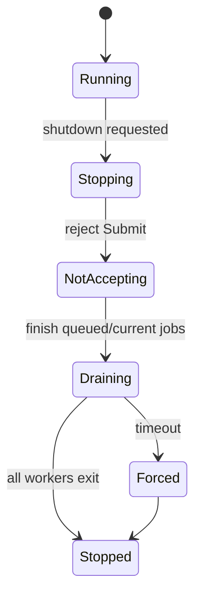
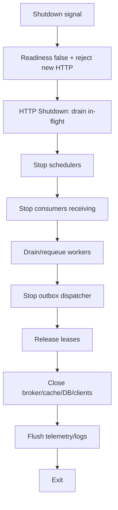
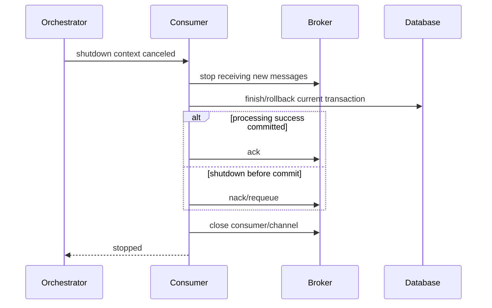
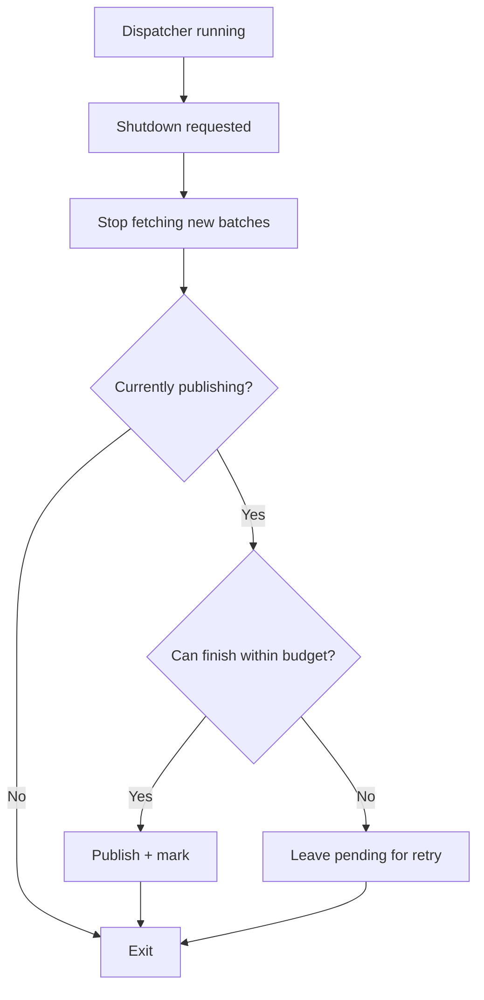

# learn-go-reliability-error-handling-part-020.md

# Graceful Shutdown II: Workers, Queues, Message Brokers, Dependencies, Telemetry Flush

> Seri: `learn-go-reliability-error-handling`  
> Part: `020`  
> Target: Go 1.26.x  
> Level: Advanced / internal engineering handbook  
> Fokus: graceful shutdown untuk background component: workers, queues, schedulers, message brokers, outbox dispatcher, DB/client dependencies, telemetry/log flush, forced shutdown, dan ordering antar komponen.

---

## 0. Posisi Materi Ini Dalam Seri

Pada `part-019`, kita membahas graceful shutdown tahap pertama:

- signal handling
- readiness false
- shutdown gate
- stop accepting HTTP request baru
- `http.Server.Shutdown`
- in-flight request drain
- Kubernetes termination mental model

Bagian ini melanjutkan bagian yang sering lebih sulit daripada HTTP server: **background components**.

Dalam service produksi, HTTP server hanya satu komponen. Aplikasi juga bisa punya:

- message consumers
- job workers
- schedulers
- outbox dispatchers
- retry loops
- in-memory queues
- broker connections
- DB pools
- Redis clients
- HTTP/gRPC clients
- distributed locks/leases
- telemetry exporters
- log buffers
- metrics pushers
- profiler/debug server
- cache warmers
- file processors
- periodic reconciliation jobs

Shutdown yang salah pada komponen ini bisa menyebabkan:

- message hilang
- message diproses dua kali
- ack/nack salah
- job berhenti di tengah tanpa checkpoint
- outbox event publish duplicate
- telemetry hilang
- DB transaction putus
- connection leak
- panic saat close channel
- goroutine leak
- shutdown melebihi grace period lalu SIGKILL
- readiness sudah false tapi worker masih menerima job
- dependency ditutup sebelum handler/worker selesai

---

## 1. Core Thesis

Graceful shutdown untuk background system adalah **ordered lifecycle orchestration**.

Prinsip utama:

```text
Stop intake before closing processors.
Drain or requeue work before closing dependencies.
Flush observability after work stops.
Exit before orchestrator kills you.
```

Urutan umum:

```text
1. mark not ready / reject new HTTP
2. stop accepting new background work
3. stop schedulers from creating new jobs
4. stop consumers from receiving new messages
5. let current jobs finish or requeue/cancel by policy
6. stop outbox dispatchers
7. close broker clients
8. close DB/cache/http clients
9. flush telemetry/logs
10. exit
```

Urutan salah:

```text
close DB first
then ask worker to finish job
```

Akibatnya worker gagal commit/ack.

---

## 2. Component Categories

Tidak semua komponen shutdown dengan cara sama.

| Component | Shutdown action |
|---|---|
| HTTP server | stop accepting, drain in-flight |
| in-memory queue | stop submit, drain/drop/requeue |
| worker pool | stop intake, finish/cancel jobs, wait |
| scheduler | stop triggering new runs |
| message consumer | stop receive, finish current, ack/nack/requeue |
| outbox dispatcher | stop fetching new batch, finish current publish policy |
| DB pool | close after all DB users stopped |
| Redis/cache client | close after users stopped |
| HTTP/gRPC client | close idle connections after users stopped |
| distributed lease | release with bounded cleanup ctx |
| telemetry | flush after everything logged |
| logger | sync/flush last |
| profiler/debug server | stop early/late depending policy |

---

## 3. Shutdown Budget Partition

If orchestrator grace is 30s, do not spend all on HTTP shutdown.

Example:

```text
terminationGracePeriodSeconds: 30s

readiness propagation: 5s
HTTP drain: 10s
workers drain/requeue: 10s
dependency close: 2s
telemetry flush: 2s
margin: 1s
```



```mermaid
gantt
    title Graceful Shutdown Budget
    dateFormat X
    axisFormat %Ls

    section Shutdown
    readiness propagation :0, 5
    HTTP drain :5, 10
    workers/queues drain :15, 10
    dependencies close :25, 2
    telemetry/log flush :27, 2
    margin :29, 1
```

Budget must be explicit. Otherwise the first phase can starve later phases.

---

## 4. Lifecycle Interface

A simple component contract:

```go
type Component interface {
    Start(ctx context.Context) error
    Shutdown(ctx context.Context) error
}
```

But many Go components prefer:

```go
type Runnable interface {
    Run(ctx context.Context) error
}

type Shutdowner interface {
    Shutdown(ctx context.Context) error
}
```

Pattern:

- `Run(ctx)` blocks until component exits.
- `Shutdown(ctx)` asks it to stop and waits/cleans up.
- `Close()` releases resource and should be idempotent.

For many background components, `Run(ctx)` alone is enough if cancellation stops it. For external resources, `Close`/`Shutdown` still needed.

---

## 5. App Lifecycle Orchestrator

```go
type App struct {
    readiness *Readiness
    gate      *ShutdownGate
    http      *http.Server

    scheduler *Scheduler
    consumer  *Consumer
    outbox    *OutboxDispatcher
    workers   *WorkerPool

    db        *sql.DB
    redis     *RedisClient
    httpDeps  []*http.Client

    telemetry *Telemetry
    logger    *slog.Logger

    cfg Config
}
```

Shutdown order:

```go
func (a *App) Shutdown(ctx context.Context) error {
    var err error

    a.gate.SetShuttingDown()
    a.readiness.SetNotReady("shutting_down")

    err = errors.Join(err, a.sleep(ctx, a.cfg.ReadinessPropagationDelay))
    err = errors.Join(err, a.shutdownHTTP(ctx))
    err = errors.Join(err, a.stopSchedulers(ctx))
    err = errors.Join(err, a.stopConsumers(ctx))
    err = errors.Join(err, a.stopWorkers(ctx))
    err = errors.Join(err, a.stopOutbox(ctx))
    err = errors.Join(err, a.closeDependencies(ctx))
    err = errors.Join(err, a.flushTelemetry(ctx))

    return err
}
```

But this simple code has a flaw: if `shutdownHTTP` consumes all `ctx`, later steps fail immediately.

Better: allocate sub-budgets.

---

## 6. Sub-budget Shutdown

```go
func withTimeout(parent context.Context, timeout time.Duration, fn func(context.Context) error) error {
    if timeout <= 0 {
        return fn(parent)
    }

    ctx, cancel := context.WithTimeout(parent, timeout)
    defer cancel()

    return fn(ctx)
}
```

Usage:

```go
func (a *App) Shutdown(ctx context.Context) error {
    var err error

    a.gate.SetShuttingDown()
    a.readiness.SetNotReady("shutting_down")

    err = errors.Join(err, withTimeout(ctx, a.cfg.ReadinessDelay, func(ctx context.Context) error {
        return sleepContext(ctx, a.cfg.ReadinessDelay)
    }))

    err = errors.Join(err, withTimeout(ctx, a.cfg.HTTPShutdownTimeout, a.shutdownHTTP))
    err = errors.Join(err, withTimeout(ctx, a.cfg.WorkerShutdownTimeout, a.shutdownWorkers))
    err = errors.Join(err, withTimeout(ctx, a.cfg.DependencyCloseTimeout, a.closeDependencies))
    err = errors.Join(err, withTimeout(ctx, a.cfg.TelemetryFlushTimeout, a.flushTelemetry))

    return err
}
```

Caution: sub-timeouts derived from same parent. If parent has less remaining time, child cannot exceed parent.

---

## 7. Stop Intake Before Drain

For any component that processes work:

```text
stop receiving new work
then finish/requeue/drop existing work
then close dependencies
```

Examples:

- HTTP: readiness false + server shutdown.
- Consumer: stop broker receive.
- Scheduler: stop ticks.
- Queue: reject submit.
- Worker: no new jobs; drain current.
- Outbox: stop fetching new rows.

If you close dependencies first, active work fails unnecessarily.

---

## 8. Worker Pool Shutdown

Worker pool states:



### 8.1 Worker Pool Contract

```go
type WorkerPool struct {
    jobs chan Job

    mu      sync.Mutex
    closed  bool
    wg      sync.WaitGroup
    logger  *slog.Logger
}
```

But safe submit/close is tricky if closing job channel while submitters may send. Prefer a design where:

- Submit checks closed under mutex.
- Submit does not send to a channel that can be concurrently closed.
- Or never close jobs; use context to stop workers.
- Or have a single owner goroutine manage channel close.

### 8.2 Simpler Pattern: Context Stop, No Channel Close

```go
type WorkerPool struct {
    jobs   chan Job
    wg     sync.WaitGroup
    closed atomic.Bool
}

func (p *WorkerPool) Submit(ctx context.Context, job Job) error {
    if p.closed.Load() {
        return ErrPoolClosed
    }

    select {
    case p.jobs <- job:
        return nil
    case <-ctx.Done():
        return context.Cause(ctx)
    }
}

func (p *WorkerPool) Run(ctx context.Context, n int, process func(context.Context, Job) error) error {
    for i := 0; i < n; i++ {
        p.wg.Add(1)
        go func(workerID int) {
            defer p.wg.Done()

            for {
                select {
                case <-ctx.Done():
                    return

                case job := <-p.jobs:
                    _ = process(ctx, job)
                }
            }
        }(i)
    }

    <-ctx.Done()
    p.wg.Wait()
    return context.Cause(ctx)
}

func (p *WorkerPool) Shutdown(ctx context.Context) error {
    p.closed.Store(true)

    done := make(chan struct{})
    go func() {
        defer close(done)
        p.wg.Wait()
    }()

    select {
    case <-done:
        return nil
    case <-ctx.Done():
        return context.Cause(ctx)
    }
}
```

Issue: workers only exit when their Run context is canceled. `Shutdown` alone does not cancel. Need owner context/cancel.

### 8.3 Pool With Cancel

```go
type WorkerPool struct {
    jobs   chan Job
    cancel context.CancelFunc
    done   chan struct{}
    closed atomic.Bool
}

func (p *WorkerPool) Start(parent context.Context, n int, process func(context.Context, Job) error) {
    ctx, cancel := context.WithCancel(parent)
    p.cancel = cancel
    p.done = make(chan struct{})

    var wg sync.WaitGroup

    for i := 0; i < n; i++ {
        wg.Add(1)
        go func(workerID int) {
            defer wg.Done()
            p.worker(ctx, workerID, process)
        }(i)
    }

    go func() {
        wg.Wait()
        close(p.done)
    }()
}

func (p *WorkerPool) worker(ctx context.Context, workerID int, process func(context.Context, Job) error) {
    for {
        select {
        case <-ctx.Done():
            return

        case job := <-p.jobs:
            _ = process(ctx, job)
        }
    }
}

func (p *WorkerPool) Shutdown(ctx context.Context) error {
    p.closed.Store(true)

    if p.cancel != nil {
        p.cancel()
    }

    select {
    case <-p.done:
        return nil
    case <-ctx.Done():
        return context.Cause(ctx)
    }
}
```

This is immediate stop, not drain.

### 8.4 Drain Policy

Drain requires workers continue processing queued jobs after stop accepting.

One approach:

- set closed true to reject new submit
- close jobs channel only after no submitter can send
- workers range over jobs until channel drained

This requires safe submit coordination.

For critical durable jobs, prefer broker/database queue where unprocessed jobs can be resumed. In-memory drain is best-effort.

---

## 9. In-memory Queue Shutdown Policies

| Policy | Behavior | Use |
|---|---|---|
| drop | cancel workers; buffered jobs lost | best-effort telemetry |
| drain | finish buffered/current jobs | short critical local queue |
| requeue | persist/unclaim unprocessed jobs | durable jobs |
| checkpoint | save progress | long processing |
| reject new | all policies | shutdown start |

Never rely on in-memory channel for critical jobs that must survive process death.

---

## 10. Scheduler Shutdown

Scheduler creates new work periodically.

Shutdown rule:

> Stop scheduler before draining workers, otherwise scheduler may enqueue new work while workers are draining.

Scheduler pattern:

```go
type Scheduler struct {
    interval time.Duration
    runOnce  func(context.Context) error
    done     chan struct{}
}

func (s *Scheduler) Run(ctx context.Context) error {
    defer close(s.done)

    ticker := time.NewTicker(s.interval)
    defer ticker.Stop()

    for {
        select {
        case <-ctx.Done():
            return context.Cause(ctx)

        case <-ticker.C:
            jobCtx, cancel := context.WithTimeout(ctx, s.interval)
            err := s.runOnce(jobCtx)
            cancel()

            if err != nil && ctx.Err() == nil {
                // log/metric but continue or stop by policy
            }
        }
    }
}
```

Shutdown:

- cancel scheduler context
- wait done with timeout
- decide if current run can finish or should cancel

### 10.1 Prevent Overlap

If job run can exceed interval:

```go
running := atomic.Bool{}

if !running.CompareAndSwap(false, true) {
    metrics.SchedulerSkipped.Inc()
    continue
}

go func() {
    defer running.Store(false)
    _ = runOnce(ctx)
}()
```

But now lifecycle/error handling is harder. Often better to run synchronously and skip ticks naturally.

---

## 11. Message Consumer Shutdown

Message consumer shutdown is high-risk.

Typical broker semantics:

```text
receive message
process
ack on success
nack/requeue on retryable failure
reject/DLQ on poison/final failure
```

Shutdown concerns:

- stop receiving new messages
- finish current messages if possible
- if shutdown before finish, requeue/nack
- ack only after successful commit
- avoid duplicate side effect through idempotent consumer
- respect broker visibility timeout / ack deadline
- close channel/connection after ack/nack
- do not close DB before current message done

### 11.1 Consumer Loop

```go
func (c *Consumer) Run(ctx context.Context) error {
    for {
        msg, err := c.Receive(ctx)
        if err != nil {
            if ctx.Err() != nil {
                return context.Cause(ctx)
            }
            return fmt.Errorf("receive message: %w", err)
        }

        if err := c.HandleMessage(ctx, msg); err != nil {
            c.logger.WarnContext(ctx, "message handling failed",
                "message_id", msg.ID,
                "error", err,
            )
        }
    }
}
```

If `Receive(ctx)` unblocks on ctx cancel, shutdown stops intake.

### 11.2 Per-message Context

```go
func (c *Consumer) HandleMessage(parent context.Context, msg Message) error {
    ctx, cancel := context.WithTimeout(parent, c.cfg.MessageTimeout)
    defer cancel()

    err := c.processor.Process(ctx, msg)

    return c.applyAckPolicy(parent, msg, err)
}
```

Ack policy may need separate context because message processing ctx may be canceled.

### 11.3 Ack Policy

```go
func (c *Consumer) applyAckPolicy(parent context.Context, msg Message, processErr error) error {
    ackCtx, cancel := context.WithTimeout(context.Background(), c.cfg.AckTimeout)
    defer cancel()

    switch {
    case processErr == nil:
        if err := msg.Ack(ackCtx); err != nil {
            return fmt.Errorf("ack message after success: %w", err)
        }
        return nil

    case errors.Is(processErr, context.Canceled) && errors.Is(parent.Err(), context.Canceled):
        if err := msg.Nack(ackCtx, true); err != nil {
            return errors.Join(processErr, fmt.Errorf("nack shutdown message: %w", err))
        }
        return processErr

    case IsRetryable(processErr):
        if err := msg.Nack(ackCtx, true); err != nil {
            return errors.Join(processErr, fmt.Errorf("nack retryable message: %w", err))
        }
        return processErr

    default:
        if err := msg.Nack(ackCtx, false); err != nil {
            return errors.Join(processErr, fmt.Errorf("nack final message: %w", err))
        }
        return processErr
    }
}
```

Use actual broker API semantics. Some brokers use ack/nack/reject differently.

---

## 12. Ack After Commit

Correct order for at-least-once consumer:

```text
receive
begin tx
dedup insert
apply effect
commit
ack
```

If crash after commit before ack:

- message redelivered
- dedup prevents duplicate effect
- consumer acks duplicate

If ack before commit:

- crash loses message effect

So:

> Ack after durable business effect, not before.

---

## 13. Visibility Timeout / Ack Deadline

Some systems use visibility timeout.

If processing exceeds visibility timeout:

- message may be delivered to another consumer while first still processing
- duplicate concurrent processing possible

Options:

- message timeout < visibility timeout
- extend/renew visibility while processing
- use idempotency/dedup/fencing
- keep jobs short
- checkpoint long jobs

Shutdown:

- stop renewals carefully
- if not finished, allow message to become visible
- do not ack unfinished work

---

## 14. Outbox Dispatcher Shutdown

Outbox dispatcher has two phases:

1. fetch pending events
2. publish and mark sent

Shutdown policy:

- stop fetching new batch
- finish current publish attempt or stop soon
- if publish succeeds but mark-sent not done, event may republish
- consumers must dedup by event ID
- don't close DB/broker before dispatcher stops

### 14.1 Dispatcher Loop

```go
func (d *Dispatcher) Run(ctx context.Context) error {
    ticker := time.NewTicker(d.interval)
    defer ticker.Stop()

    for {
        if err := d.runOnce(ctx); err != nil && ctx.Err() == nil {
            d.logger.WarnContext(ctx, "outbox run failed", "error", err)
        }

        select {
        case <-ctx.Done():
            return context.Cause(ctx)
        case <-ticker.C:
        }
    }
}
```

### 14.2 Stop Fetching On Shutdown

Inside `runOnce`:

```go
func (d *Dispatcher) runOnce(ctx context.Context) error {
    if ctx.Err() != nil {
        return context.Cause(ctx)
    }

    events, err := d.repo.FetchPending(ctx, d.batchSize)
    if err != nil {
        return fmt.Errorf("fetch pending outbox: %w", err)
    }

    for _, ev := range events {
        if ctx.Err() != nil {
            return context.Cause(ctx)
        }

        if err := d.publishOne(ctx, ev); err != nil {
            return err
        }
    }

    return nil
}
```

### 14.3 Publish One

```go
func (d *Dispatcher) publishOne(parent context.Context, ev OutboxEvent) error {
    ctx, cancel := context.WithTimeout(parent, d.publishTimeout)
    defer cancel()

    if err := d.publisher.Publish(ctx, ev); err != nil {
        return fmt.Errorf("publish outbox event %s: %w", ev.ID, err)
    }

    if err := d.repo.MarkPublished(ctx, ev.ID); err != nil {
        return fmt.Errorf("mark outbox event %s published: %w", ev.ID, err)
    }

    return nil
}
```

If `Publish` succeeded and `MarkPublished` failed due to shutdown/DB, duplicate publish can happen. This is acceptable only if event consumers dedup.

---

## 15. Dependency Shutdown Ordering

Correct:

```text
stop HTTP/consumers/workers/outbox
then close DB/broker/cache clients
then flush telemetry
```

Incorrect:

```text
close DB
then wait workers
```

Workers will fail because dependency gone.

### 15.1 Dependency Close

```go
func (a *App) closeDependencies(ctx context.Context) error {
    var err error

    if a.redis != nil {
        err = errors.Join(err, a.redis.Close())
    }

    if a.db != nil {
        err = errors.Join(err, a.db.Close())
    }

    for _, c := range a.httpClients {
        if tr, ok := c.Transport.(*http.Transport); ok {
            tr.CloseIdleConnections()
        }
    }

    return err
}
```

`sql.DB.Close()` prevents new queries and waits for active queries? It closes the database handle; active operations behavior depends on usage/driver. Still close after users stopped.

---

## 16. HTTP/gRPC Client Shutdown

For `http.Client`, usually no `Close`, but transport can close idle connections:

```go
if tr, ok := client.Transport.(*http.Transport); ok {
    tr.CloseIdleConnections()
}
```

Do this after workers/handlers stopped using it.

For gRPC clients, close connection:

```go
conn.Close()
```

depending on API version. Use bounded shutdown if close can block or if draining RPCs is supported.

---

## 17. DB Pool Shutdown

Close DB after:

- HTTP handlers done
- message consumers stopped
- workers stopped
- outbox stopped
- schedulers stopped

Before:

- telemetry final flush? usually telemetry may not need DB
- process exit

Pattern:

```go
if err := db.Close(); err != nil {
    return fmt.Errorf("close db: %w", err)
}
```

Do not call `db.Close()` from request handler or repository.

---

## 18. Redis/Cache Client Shutdown

Close after components using it stop.

Potential users:

- idempotency cache
- token cache
- rate limiter
- distributed lock
- sessions
- feature flags

If distributed locks/leases exist, release before closing client.

```go
releaseCtx, cancel := context.WithTimeout(ctx, 2*time.Second)
defer cancel()
_ = lease.Release(releaseCtx)

_ = redis.Close()
```

---

## 19. Distributed Lease Shutdown

If process owns leases:

- stop acquiring new leases
- finish/release current lease
- release with bounded context
- rely on TTL as fallback
- use fencing if correctness critical

```go
func (l *LeaseManager) Shutdown(ctx context.Context) error {
    l.stopAcquiring.Store(true)

    var err error
    for _, lease := range l.ActiveLeases() {
        releaseCtx, cancel := context.WithTimeout(ctx, l.releaseTimeout)
        releaseErr := lease.Release(releaseCtx)
        cancel()

        if releaseErr != nil {
            err = errors.Join(err, fmt.Errorf("release lease %s: %w", lease.Key(), releaseErr))
        }
    }

    return err
}
```

Do not hang shutdown forever for lease release. TTL is fallback.

---

## 20. Telemetry Flush

Telemetry must flush after components stop producing telemetry.

Order:

```text
stop work
log shutdown errors
flush metrics/traces
sync logger
exit
```

If you flush too early, later shutdown logs/traces may be lost.

### 20.1 Tracing

OpenTelemetry-style:

```go
ctx, cancel := context.WithTimeout(context.Background(), 2*time.Second)
defer cancel()

if err := tracerProvider.Shutdown(ctx); err != nil {
    logger.Warn("shutdown tracer provider", "error", err)
}
```

### 20.2 Metrics

If push/exporter:

```go
ctx, cancel := context.WithTimeout(context.Background(), 2*time.Second)
defer cancel()

if err := meterProvider.Shutdown(ctx); err != nil {
    logger.Warn("shutdown meter provider", "error", err)
}
```

### 20.3 Logs

If logger has sync/flush:

```go
if err := logger.Sync(); err != nil {
    // avoid noisy error for stdout/stderr sync unsupported depending logger
}
```

For `slog` default stdout handler, explicit sync may not exist. If using zap/zerolog/custom buffered writer, flush.

---

## 21. Forced Shutdown

Graceful shutdown may fail.

After timeout:

- force close HTTP server
- cancel worker root contexts
- close broker connections
- stop waiting
- flush best-effort
- exit before SIGKILL if possible

Forced shutdown policy:

```go
if err := graceful(ctx); err != nil {
    logger.Warn("graceful shutdown failed; forcing", "error", err)
    _ = forceClose()
}
```

But forced close can cause:

- in-flight request failure
- message redelivery
- duplicate events
- partial telemetry

Your idempotency/dedup design handles this.

---

## 22. Multi-component `errgroup` Runtime

Run multiple components:

```go
func (a *App) Run(ctx context.Context) error {
    g, ctx := errgroup.WithContext(ctx)

    g.Go(func() error { return a.serveHTTP() })
    g.Go(func() error { return a.consumer.Run(ctx) })
    g.Go(func() error { return a.outbox.Run(ctx) })
    g.Go(func() error { return a.scheduler.Run(ctx) })

    return g.Wait()
}
```

Problem: if any component fails, errgroup cancels all. That may be desired for critical components.

But some components are optional and should restart or not bring down service.

Classify components:

| Component | Failure policy |
|---|---|
| HTTP server listener fails | fatal |
| critical consumer fails | maybe fatal/restart |
| outbox dispatcher fails | maybe degrade/readiness false |
| metrics exporter fails | warn/degraded |
| optional cache warmer fails | warn |
| scheduler fails | restart or fatal based on job |

---

## 23. Supervisor With Shutdown

```go
func Supervise(ctx context.Context, name string, logger *slog.Logger, run func(context.Context) error) error {
    backoff := time.Second

    for {
        if ctx.Err() != nil {
            return context.Cause(ctx)
        }

        err := run(ctx)
        if err == nil {
            return nil
        }

        if ctx.Err() != nil {
            return context.Cause(ctx)
        }

        logger.ErrorContext(ctx, "component crashed", "component", name, "error", err)

        if sleepErr := sleepContext(ctx, backoff); sleepErr != nil {
            return sleepErr
        }

        if backoff < 30*time.Second {
            backoff *= 2
        }
    }
}
```

Use for components that can be safely restarted.

Do not restart forever for:

- config error
- schema mismatch
- authentication failure
- programmer bug/panic corruption

---

## 24. Panic During Shutdown

Panic in shutdown hook can skip remaining cleanup if not recovered.

At component boundary:

```go
func safeShutdown(name string, fn func(context.Context) error) func(context.Context) (err error) {
    return func(ctx context.Context) (err error) {
        defer func() {
            if v := recover(); v != nil {
                err = fmt.Errorf("panic shutting down %s: %v\n%s", name, v, debug.Stack())
            }
        }()
        return fn(ctx)
    }
}
```

Use sparingly. Panic in shutdown should be logged and next cleanup should continue if possible.

---

## 25. Shutdown Error Aggregation

Shutdown should usually attempt all cleanup steps even if one fails.

```go
var err error

err = errors.Join(err, shutdownHTTP(ctx))
err = errors.Join(err, shutdownWorkers(ctx))
err = errors.Join(err, closeDB(ctx))
err = errors.Join(err, flushTelemetry(ctx))

return err
```

But ordering dependencies matter. If worker shutdown fails, still close DB eventually.

Return joined error to main for final log.

---

## 26. Shutdown State Object

Track shutdown phase for logs/readiness/debug.

```go
type ShutdownState struct {
    phase atomic.Value
}

func (s *ShutdownState) Set(phase string) {
    s.phase.Store(phase)
}

func (s *ShutdownState) Phase() string {
    v := s.phase.Load()
    if v == nil {
        return "running"
    }
    return v.(string)
}
```

Expose in readiness/debug endpoint:

```json
{
  "ready": false,
  "phase": "draining_workers"
}
```

Do not expose sensitive internals publicly.

---

## 27. Worker Job Policy

For each job type define shutdown behavior:

| Job Type | Shutdown behavior |
|---|---|
| short idempotent job | finish if within timeout |
| long import | checkpoint and stop |
| message processing | nack/requeue if not committed |
| outbox publish | finish current or retry later |
| telemetry | drop if timeout |
| audit export | persist and resume |
| cache warm | cancel/drop |

No single behavior fits all jobs.

---

## 28. Long-running Jobs

If job takes minutes:

- do not rely on pod shutdown grace
- checkpoint progress
- store job state durably
- make steps idempotent
- resume after restart
- handle duplicate worker ownership
- use lease/fencing
- expose cancel/resume status

Shutdown:

```text
stop after current checkpoint
persist progress
release lease
exit
```

---

## 29. Requeue vs Nack vs Checkpoint

For durable job queue:

- **requeue/nack** if job can restart from beginning safely.
- **checkpoint** if job expensive/long and can resume.
- **DLQ** if poison/permanent.
- **ack success** only after durable effect complete.
- **ack duplicate** if dedup says already processed.

For in-memory queue:

- requeue impossible unless persisted elsewhere.
- drain or drop only.

---

## 30. Config Example

```yaml
shutdown:
  total: 30s
  readiness_propagation: 5s
  http_drain: 8s
  scheduler_stop: 2s
  consumer_drain: 8s
  worker_drain: 8s
  outbox_stop: 5s
  dependency_close: 2s
  telemetry_flush: 2s
  force_margin: 1s
```

Validate config:

```go
func (c ShutdownConfig) Validate() error {
    sum := c.ReadinessPropagation +
        c.HTTPDrain +
        c.ConsumerDrain +
        c.WorkerDrain +
        c.DependencyClose +
        c.TelemetryFlush +
        c.ForceMargin

    if sum > c.Total {
        return fmt.Errorf("shutdown sub-budgets exceed total: sum=%s total=%s", sum, c.Total)
    }

    return nil
}
```

---

## 31. Observability

Metrics:

```text
shutdown_phase_duration_seconds{phase}
shutdown_errors_total{component}
shutdown_forced_total{component}
worker_shutdown_timeout_total{worker}
consumer_requeue_on_shutdown_total{consumer}
outbox_shutdown_pending_events{dispatcher}
telemetry_flush_errors_total
```

Logs:

```go
logger.Info("shutdown phase started", "phase", "workers", "timeout", timeout)
logger.Info("shutdown phase completed", "phase", "workers", "duration_ms", d.Milliseconds())
logger.Warn("shutdown phase failed", "phase", "workers", "error", err)
```

Avoid log spam per job unless debugging.

---

## 32. Testing Worker Shutdown

### 32.1 Worker Stops

```go
func TestWorkerPoolStops(t *testing.T) {
    pool := NewWorkerPool(10)

    ctx, cancel := context.WithCancel(context.Background())
    pool.Start(ctx, 2, func(ctx context.Context, job Job) error {
        return nil
    })

    cancel()

    shutdownCtx, shutdownCancel := context.WithTimeout(context.Background(), time.Second)
    defer shutdownCancel()

    if err := pool.Shutdown(shutdownCtx); err != nil {
        t.Fatal(err)
    }
}
```

### 32.2 Submit Rejected After Shutdown

```go
pool.Shutdown(ctx)

err := pool.Submit(context.Background(), Job{})
if !errors.Is(err, ErrPoolClosed) {
    t.Fatalf("expected pool closed, got %v", err)
}
```

### 32.3 Current Job Drains

Use channel to block job and assert shutdown waits until release or timeout.

---

## 33. Testing Consumer Shutdown

Scenarios:

1. shutdown while idle receive
2. shutdown while processing
3. shutdown after commit before ack
4. shutdown before commit
5. ack timeout during shutdown
6. duplicate redelivery after shutdown

Fake broker can record ack/nack.

```go
func TestConsumerNacksOnShutdownDuringProcessing(t *testing.T) {
    // Arrange fake message and processor that blocks until ctx canceled.
    // Cancel consumer context.
    // Assert msg.Nack(requeue=true).
}
```

---

## 34. Testing Outbox Shutdown

Scenarios:

- no new fetch after context canceled
- current publish finishes
- publish success + mark failed leads to retry later
- duplicate publish dedup by event ID
- shutdown timeout stops dispatcher
- pending events remain pending

---

## 35. Testing Telemetry Flush

Use fake exporter:

```go
type fakeTelemetry struct {
    flushed atomic.Bool
}

func (f *fakeTelemetry) Shutdown(ctx context.Context) error {
    f.flushed.Store(true)
    return nil
}
```

Assert flush called after workers stopped.

---

## 36. Race and Leak Testing

Run:

```bash
go test -race ./...
```

For leak-prone components:

- start component
- cancel context
- wait done
- assert no goroutine stuck if using leak checker
- use pprof in integration environment

---

## 37. Common Anti-Patterns

### 37.1 Closing Dependencies Before Workers

Workers fail during drain.

### 37.2 Cancel Everything Immediately

No drain; causes duplicate/retry spikes.

### 37.3 Waiting Forever for Worker

SIGKILL eventually kills process; no diagnostic.

### 37.4 Ack Before Commit

Message loss.

### 37.5 No Dedup Consumer

Redelivery duplicates side effect.

### 37.6 In-memory Channel for Critical Queue

Work lost on crash.

### 37.7 Flush Telemetry Before Final Logs

Shutdown errors lost.

### 37.8 Ignore Shutdown Errors

Postmortem impossible.

### 37.9 Shutdown Sub-budgets Exceed Orchestrator Grace

SIGKILL before cleanup.

### 37.10 Scheduler Keeps Enqueuing During Drain

Drain never completes.

### 37.11 Outbox Dispatcher Closed After DB

Cannot mark events.

### 37.12 Lease Release Without Timeout

Shutdown hangs.

---

## 38. Production Checklist

### 38.1 Ordering

- [ ] readiness false before drain.
- [ ] HTTP stopped before dependency close.
- [ ] schedulers stopped before workers drain.
- [ ] consumers stop receiving before broker close.
- [ ] workers stopped before DB/cache close.
- [ ] outbox stopped before broker/DB close.
- [ ] telemetry flush after final logs/errors.

### 38.2 Workers

- [ ] stop accepting new jobs.
- [ ] drain/drop/requeue policy explicit.
- [ ] current job timeout defined.
- [ ] long jobs checkpoint.
- [ ] job idempotency defined.
- [ ] shutdown wait bounded.

### 38.3 Messaging

- [ ] receive loop observes context.
- [ ] ack after commit.
- [ ] shutdown during processing nacks/requeues if needed.
- [ ] duplicate consumer dedup exists.
- [ ] visibility timeout considered.
- [ ] broker close after consumers stopped.

### 38.4 Outbox

- [ ] stop fetching new events.
- [ ] publish/mark semantics documented.
- [ ] duplicate publish expected and deduped.
- [ ] pending events remain retryable.
- [ ] dispatcher stopped before DB/broker close.

### 38.5 Dependencies

- [ ] DB close after users stopped.
- [ ] cache/Redis close after users stopped.
- [ ] HTTP transport idle connections closed.
- [ ] leases released with timeout.
- [ ] close errors joined/logged.

### 38.6 Telemetry

- [ ] metrics/traces flushed.
- [ ] logger synced/flushed if needed.
- [ ] flush timeout bounded.
- [ ] final shutdown status logged before flush.

### 38.7 Budget

- [ ] total grace known.
- [ ] sub-budgets fit total.
- [ ] force margin exists.
- [ ] second signal behavior known.
- [ ] forced close fallback exists.

---

## 39. Mermaid: Shutdown Ordering



---

## 40. Mermaid: Message Consumer Shutdown



---

## 41. Mermaid: Outbox Shutdown



---

## 42. Regulatory Case Management Lens

For a regulatory/case service, shutdown must protect:

- case state transition
- audit event
- outbox event
- message processing
- idempotency record
- document processing/import
- notification dispatch

Recommended:

1. Request path writes state/audit/outbox in one transaction.
2. Shutdown drains HTTP request within route timeout.
3. If interrupted, idempotency allows client retry.
4. Outbox dispatcher may stop; pending events remain in DB.
5. Consumer uses processed message dedup.
6. Long imports checkpoint per row/batch.
7. Audit event IDs deterministic by operation ID.
8. Shutdown never deletes accountability evidence.

---

## 43. Java Engineer Translation Layer

### 43.1 Spring Lifecycle

Spring has `SmartLifecycle`, graceful shutdown configs, executor shutdown, and container-managed lifecycle. In Go, you implement lifecycle orchestration explicitly.

### 43.2 ExecutorService

Java:

```java
executor.shutdown();
executor.awaitTermination(timeout);
executor.shutdownNow();
```

Go equivalent:

```text
stop submit
cancel context
wait group
drain/requeue policy
force after timeout
```

### 43.3 Message Listener Containers

Spring/Kafka listener containers manage stop/ack loops. In Go, your consumer loop must define receive/process/ack/nack/shutdown policy.

---

## 44. Key Takeaways

1. Graceful shutdown must stop intake before closing processors.
2. Drain or requeue work before closing dependencies.
3. Shutdown needs ordered phases and explicit sub-budgets.
4. Worker shutdown policy depends on job criticality.
5. In-memory channels are not durable queues.
6. Schedulers must stop before worker drain.
7. Message consumers must stop receiving and handle current message carefully.
8. Ack after durable commit, not before.
9. Consumer dedup is required for redelivery safety.
10. Outbox dispatcher can stop safely because DB retains pending events.
11. Duplicate publish is expected; consumers dedup by event ID.
12. DB/cache/broker clients close after all users stop.
13. Telemetry flush happens near the end.
14. Shutdown errors should be joined/logged, not ignored.
15. Forced shutdown fallback is necessary.
16. Long jobs need checkpoint/resume, not hope.
17. Lease release needs timeout and TTL fallback.
18. Sub-budgets must fit orchestrator grace.
19. Panic during shutdown should not skip all remaining cleanup.
20. Graceful shutdown complements idempotency; it does not replace it.

---

## 45. References

- Go package documentation: `context`
- Go package documentation: `net/http`
- Go package documentation: `database/sql`
- Go package documentation: `os/signal`
- Go package documentation: `sync`
- Kubernetes documentation: Pod termination lifecycle
- Kubernetes documentation: Container lifecycle hooks
- OpenTelemetry Go documentation: shutdown providers/exporters
- Message broker documentation patterns: ack/nack/redelivery/visibility timeout

---

## 46. Next Part

Next:

```text
learn-go-reliability-error-handling-part-021.md
```

Topic:

```text
Kubernetes & Container Runtime Reliability: Probes, SIGTERM, Resource Limits, OOM, Restarts
```

<!-- NAVIGATION_FOOTER -->
<div class="page-nav">
<a href="./learn-go-reliability-error-handling-part-019.md">⬅️ Graceful Shutdown I: Signal Handling, Readiness, Stop Accepting, In-flight Drain</a>
<a href="./index.md">📚 Kategori</a>
<a href="../../index.md">🏠 Home</a>
<a href="./learn-go-reliability-error-handling-part-021.md">Kubernetes & Container Runtime Reliability: Probes, SIGTERM, Resource Limits, OOM, Restarts ➡️</a>
</div>
