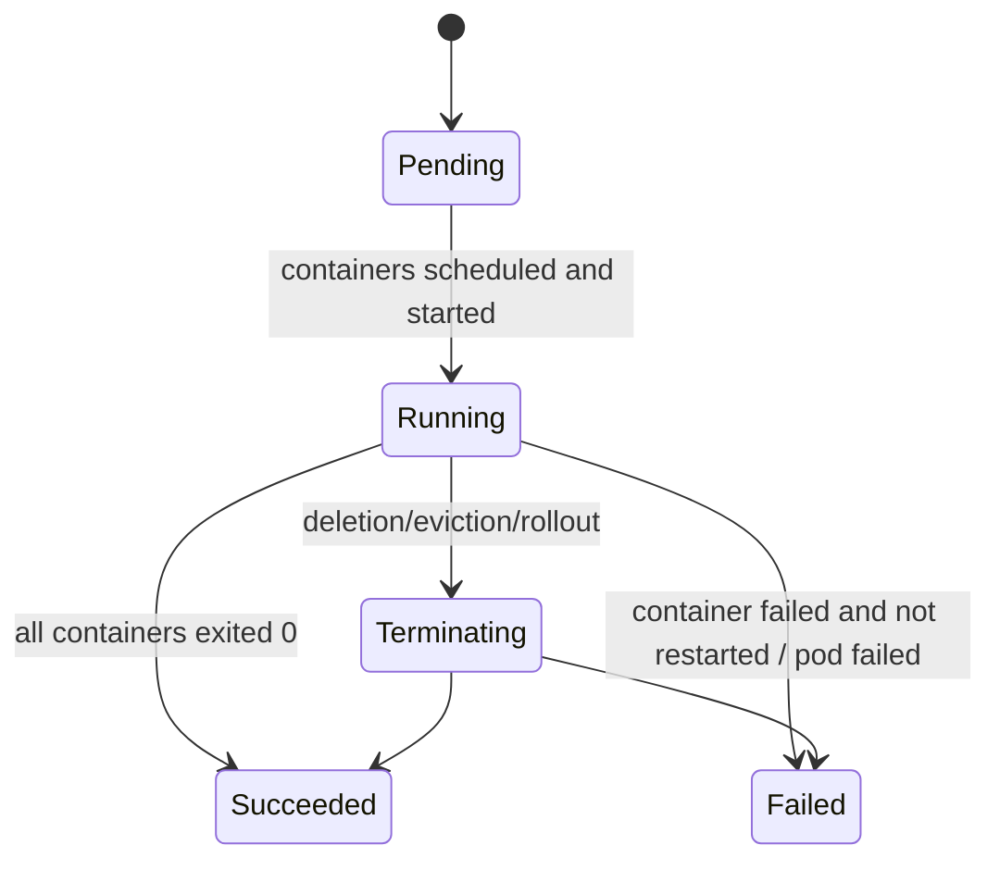
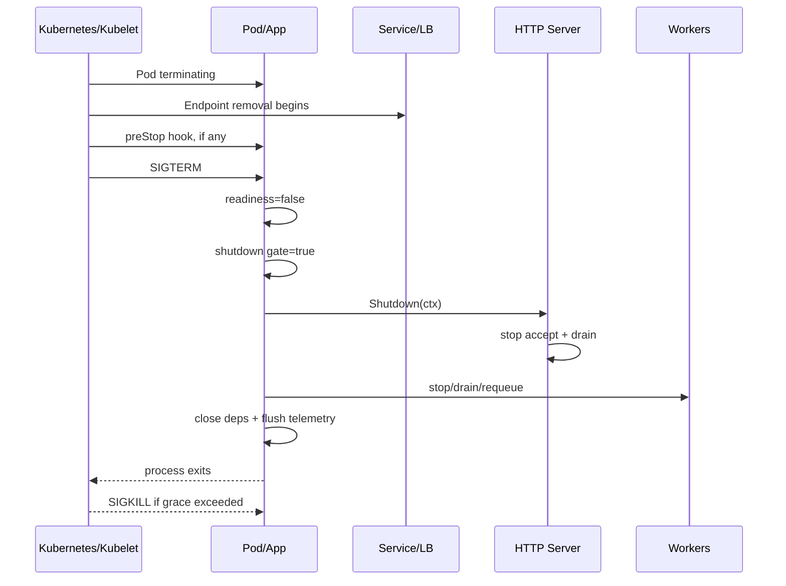
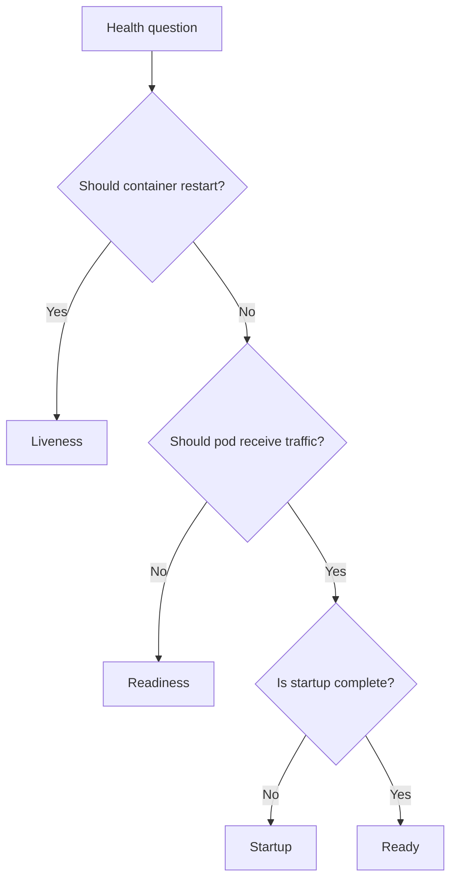
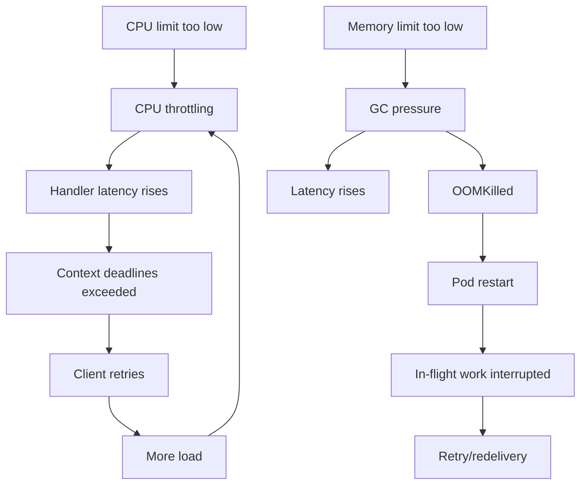

# learn-go-reliability-error-handling-part-021.md

# Kubernetes & Container Runtime Reliability: Probes, SIGTERM, Resource Limits, OOM, Restarts

> Seri: `learn-go-reliability-error-handling`  
> Part: `021`  
> Target: Go 1.26.x  
> Level: Advanced / internal engineering handbook  
> Fokus: reliability Go service saat berjalan di container/Kubernetes: probe, lifecycle, SIGTERM, graceful termination, resource requests/limits, QoS, OOMKilled, CPU throttling, restart loop, rollout, dan observability.

---

## 0. Posisi Materi Ini Dalam Seri

Pada `part-019` dan `part-020`, kita sudah membahas graceful shutdown:

- signal handling
- readiness false
- stop accepting request
- HTTP drain
- worker drain
- message broker ack/nack
- outbox shutdown
- dependency close
- telemetry flush

Sekarang kita naik satu layer: **runtime environment**.

Dalam production modern, service Go hampir selalu berjalan di container dan sering di Kubernetes.

Artinya reliability aplikasi tidak hanya ditentukan oleh kode Go, tetapi juga oleh:

- container image
- process signal handling
- PID 1 behavior
- Kubernetes probes
- resource requests
- resource limits
- OOM killer
- CPU throttling
- pod lifecycle
- restart policy
- deployment rollout
- service endpoint propagation
- node pressure
- eviction
- autoscaling
- sidecar ordering
- config/secret updates
- logging/metrics pipeline

Kode Go yang bagus bisa tetap gagal jika konfigurasi Kubernetes salah.

---

## 1. Core Thesis

Kubernetes reliability bukan sekadar “deploy container”.

Untuk Go service, Kubernetes reliability berarti:

> Application lifecycle, HTTP readiness, resource usage, shutdown behavior, retry/idempotency, and container runtime semantics must align.

Jika tidak align:

- liveness membunuh pod sehat tapi lambat
- readiness tetap true saat dependency fatal
- startup probe tidak ada sehingga slow startup jadi CrashLoopBackOff
- SIGTERM diterima tapi app tidak drain
- termination grace terlalu pendek
- preStop menghabiskan semua grace
- CPU limit menyebabkan throttling dan timeout
- memory limit terlalu rendah menyebabkan OOMKilled
- request memory spike membunuh process
- rolling update menyebabkan error spike
- queue consumer duplicate karena pod mati sebelum ack
- outbox publish duplicate karena shutdown forced
- probe endpoint self-DDoS dependency
- service dianggap ready sebelum warmup selesai
- pod restart loop tanpa evidence

Top 1% engineer mendesain aplikasi dan manifest sebagai satu sistem reliability.

---

## 2. Kubernetes Pod Lifecycle: Mental Model

Pod lifecycle simplified:



Untuk Deployment/ReplicaSet, container biasanya restart jika crash sesuai restart policy.

Pod can be:

- `Pending`
- `Running`
- `Succeeded`
- `Failed`
- `Unknown`

But operationally you also see states/reasons like:

- `CrashLoopBackOff`
- `ImagePullBackOff`
- `OOMKilled`
- `Error`
- `Completed`
- `Evicted`
- `ContainerCreating`
- `Terminating`

These are not all pod phases; many are container states/reasons shown by tooling.

---

## 3. Container Process Model

Container biasanya menjalankan satu main process.

Important:

- process menerima `SIGTERM` during termination
- after grace, runtime sends `SIGKILL`
- `SIGKILL` cannot be caught
- if your process exits, container exits
- if main process is shell wrapper that does not forward signals, Go app may not receive SIGTERM
- PID 1 has special signal/zombie behavior in Linux

### 3.1 Bad Entrypoint

```dockerfile
CMD sh -c "./app"
```

Shell may intercept/not forward signals correctly depending form and script.

Better:

```dockerfile
ENTRYPOINT ["/app/server"]
```

If script needed:

```sh
#!/bin/sh
exec /app/server
```

`exec` replaces shell so app receives signals.

---

## 4. Go Signal Handling in Container

Use:

```go
root, stop := signal.NotifyContext(context.Background(), os.Interrupt, syscall.SIGTERM)
defer stop()
```

On Kubernetes termination, `SIGTERM` is the important one.

Then:

```go
<-root.Done()

shutdownCtx, cancel := context.WithTimeout(context.Background(), cfg.ShutdownTimeout)
defer cancel()

if err := app.Shutdown(shutdownCtx); err != nil {
    logger.Error("shutdown failed", "error", err)
}
```

Do not rely on `defer` after `SIGKILL`; it will not run.

---

## 5. Kubernetes Termination Sequence

Simplified:

```text
1. Pod deletion requested or rollout/scale-down/eviction begins.
2. Pod enters Terminating.
3. Endpoint removal begins; pod should stop receiving Service traffic eventually.
4. preStop hook runs if configured.
5. Kubelet sends SIGTERM to container process.
6. App has terminationGracePeriodSeconds to exit.
7. If still running after grace, SIGKILL.
```

Important nuance from Kubernetes docs: `preStop` hook execution is part of the same termination grace period, and if it hangs, the Pod remains terminating until killed when grace expires.

Therefore:

```text
preStop time + app shutdown time <= terminationGracePeriodSeconds
```

Do not configure:

```text
terminationGracePeriodSeconds: 30
preStop sleep: 25
app shutdown: 20
```

That cannot work.

---

## 6. Kubernetes Probes

Kubernetes supports:

- liveness probe
- readiness probe
- startup probe

They are not interchangeable.

### 6.1 Liveness Probe

Question:

```text
Should Kubernetes restart this container?
```

If liveness fails, kubelet kills the container and applies restart policy.

Use for:

- deadlock
- unrecoverable stuck process
- main event loop wedged
- cannot make progress and restart is useful

Do not use liveness for:

- temporary DB outage
- downstream dependency failure
- overload
- slow response under load
- readiness decision
- expensive deep health checks

Bad liveness causes restart storms.

### 6.2 Readiness Probe

Question:

```text
Should this Pod receive traffic?
```

If readiness fails, pod is marked not ready and removed from Service endpoints.

Use for:

- startup not complete
- config not loaded
- dependency required for serving unavailable
- shutdown started
- warmup not done
- local queue/bulkhead saturated, if routing away helps
- migration not ready

Readiness failure does not restart container.

### 6.3 Startup Probe

Question:

```text
Has the application started successfully?
```

Startup probe disables liveness/readiness failure handling until startup succeeds. It protects slow-starting apps from premature liveness restarts.

Use for:

- app startup can take longer than liveness threshold
- cache warmup
- migrations/checks
- large initialization
- JVM-like slow startup, though Go usually faster
- dependency bootstrap

Even Go services can need startup probes if they perform migrations/warmup.

---

## 7. Probe Semantics Table

| Probe | Failure action | Main question |
|---|---|---|
| startup | container considered not started; liveness/readiness delayed | Has app started? |
| readiness | pod not ready, removed from traffic | Should this pod receive traffic? |
| liveness | container killed/restarted | Is process unrecoverably unhealthy? |

Kubernetes docs specify that liveness/startup probe failure causes kubelet to kill the container subject to restart policy, while readiness failure marks pod not ready and stops matching Services from sending traffic to that pod.

---

## 8. Designing Probe Endpoints in Go

### 8.1 Liveness Handler

Keep simple.

```go
func LiveHandler(w http.ResponseWriter, r *http.Request) {
    w.WriteHeader(http.StatusOK)
    _, _ = w.Write([]byte("ok"))
}
```

Maybe include internal fatal flag:

```go
if fatal.Load() {
    w.WriteHeader(http.StatusInternalServerError)
    return
}
```

Do not query DB.

### 8.2 Readiness Handler

Use app readiness state.

```go
func (a *App) ReadyHandler(w http.ResponseWriter, r *http.Request) {
    ready, reason := a.readiness.Ready()
    if !ready {
        w.WriteHeader(http.StatusServiceUnavailable)
        _, _ = w.Write([]byte(reason))
        return
    }

    w.WriteHeader(http.StatusOK)
    _, _ = w.Write([]byte("ok"))
}
```

Readiness can be controlled by:

- startup complete
- shutdown flag
- critical dependency cached health
- internal queue saturation
- config validity

### 8.3 Startup Handler

Can share readiness state or separate startup state.

```go
func (a *App) StartupHandler(w http.ResponseWriter, r *http.Request) {
    if !a.started.Load() {
        w.WriteHeader(http.StatusServiceUnavailable)
        return
    }
    w.WriteHeader(http.StatusOK)
}
```

---

## 9. Probe Manifest Example

```yaml
livenessProbe:
  httpGet:
    path: /live
    port: http
  initialDelaySeconds: 10
  periodSeconds: 10
  timeoutSeconds: 1
  failureThreshold: 3

readinessProbe:
  httpGet:
    path: /ready
    port: http
  periodSeconds: 5
  timeoutSeconds: 1
  failureThreshold: 2
  successThreshold: 1

startupProbe:
  httpGet:
    path: /startup
    port: http
  periodSeconds: 2
  timeoutSeconds: 1
  failureThreshold: 30
```

This gives startup up to about:

```text
periodSeconds * failureThreshold = 60s
```

before considered failed.

Tune based on actual startup.

---

## 10. Probe Anti-patterns

### 10.1 Liveness Checks DB

DB outage causes all pods restart, making outage worse.

### 10.2 Readiness Does Expensive Deep Check Every Probe

Frequent probe can overload dependency.

Use cached health.

### 10.3 No Startup Probe for Slow Startup

Pod enters CrashLoopBackOff because liveness fires before app ready.

### 10.4 Readiness Always 200

Pod receives traffic before ready or during shutdown.

### 10.5 Liveness Timeout Too Short

CPU throttling/GC/network jitter causes false restart.

### 10.6 Same Endpoint for Live and Ready

Usually wrong because they answer different questions.

### 10.7 Probe Endpoint Requires Auth

Kubelet probe fails unless configured with headers. Prefer internal unauthenticated health path limited by network policy.

---

## 11. Readiness During Shutdown

From part 019:

During shutdown:

- liveness remains 200
- readiness returns 503
- business routes may return 503 via shutdown gate
- server drains in-flight

```go
readiness.SetNotReady("shutting_down")
gate.SetShuttingDown()
```

Kubernetes Service endpoint removal is not instantaneous; gate protects from late traffic.

---

## 12. `terminationGracePeriodSeconds`

This controls how long Kubernetes waits between termination start and force kill.

Example:

```yaml
terminationGracePeriodSeconds: 30
```

Your app shutdown budget must fit inside it.

If your app needs:

```text
readiness delay 5s
HTTP drain 15s
worker drain 10s
telemetry 2s
```

Total 32s. A 30s grace is insufficient.

Either:

- reduce work/drain budget
- make long work resumable
- increase grace
- move long work to durable async jobs
- avoid synchronous long request

---

## 13. `preStop` Hook

Example:

```yaml
lifecycle:
  preStop:
    exec:
      command: ["sh", "-c", "sleep 5"]
```

Purpose:

- delay before SIGTERM
- allow endpoint removal propagation
- call app endpoint to begin drain
- perform custom shutdown notification

But:

- preStop consumes termination grace
- if preStop hangs, app gets less/no time
- app may not know shutdown started until SIGTERM unless preStop calls it
- shell scripts can fail silently

Better if app handles SIGTERM and readiness false itself. Use preStop only when platform/LB propagation needs it.

### 13.1 preStop Calling App

```yaml
lifecycle:
  preStop:
    httpGet:
      path: /shutdown/begin
      port: http
```

This can mark readiness false before SIGTERM, but be careful:

- endpoint must be protected/internal
- idempotent
- fast
- not a replacement for SIGTERM handling
- still within grace

---

## 14. Rolling Update Reliability

Deployment rolling update controls:

```yaml
strategy:
  type: RollingUpdate
  rollingUpdate:
    maxUnavailable: 0
    maxSurge: 1
```

For zero/low downtime:

- readiness must be accurate
- startup probe prevents premature traffic
- preStop/readiness/gate handles termination
- enough replicas exist
- PodDisruptionBudget protects voluntary disruptions
- resource requests allow scheduling
- new version compatible with old during overlap
- idempotent APIs handle retries

### 14.1 maxUnavailable

If `maxUnavailable: 1` and only one replica, service may go down during update.

For critical API:

```yaml
replicas: 2+
maxUnavailable: 0
maxSurge: 1
```

But enough cluster capacity needed for surge.

---

## 15. PodDisruptionBudget

PDB limits voluntary disruptions.

Example:

```yaml
apiVersion: policy/v1
kind: PodDisruptionBudget
metadata:
  name: aceas-api-pdb
spec:
  minAvailable: 1
  selector:
    matchLabels:
      app: aceas-api
```

PDB helps during:

- node drain
- cluster upgrade
- voluntary evictions

It does not prevent:

- node crash
- OOMKill
- container crash
- involuntary failures

---

## 16. Resource Requests and Limits

Kubernetes resource management:

- request: amount scheduler uses and container is guaranteed as baseline
- limit: maximum allowed resource usage

For memory, Kubernetes docs state a container is guaranteed as much memory as requested but cannot use more than its limit.

### 16.1 CPU Request

Used for scheduling and CPU share under contention.

### 16.2 CPU Limit

If container tries to use more CPU than limit, it is throttled, not killed.

CPU throttling can cause:

- higher latency
- request timeout
- liveness probe timeout
- GC slower
- queue buildup
- retry storm
- false dependency timeout

### 16.3 Memory Request

Used for scheduling and QoS.

### 16.4 Memory Limit

If process exceeds memory limit, it can be OOMKilled.

Unlike CPU, memory over limit can kill container.

---

## 17. Go Runtime and Container CPU

Modern Go runtime is container-aware in many respects, but you should still reason about:

- `GOMAXPROCS`
- CPU limits
- CPU throttling
- goroutine parallelism
- latency under load
- GC CPU needs

If CPU limit is too low:

- handler latency increases
- context deadlines fire
- health probes time out
- background workers lag
- GC competes with application work

Avoid setting CPU limit too aggressively for latency-sensitive Go services. Many orgs set CPU request and omit CPU limit or set a generous limit, depending cluster policy.

---

## 18. Go Runtime and Container Memory

Go memory includes:

- heap
- goroutine stacks
- runtime metadata
- mmap/off-heap
- cgo memory
- OS buffers
- file buffers
- TLS/network buffers

Kubernetes memory limit sees process/container memory, not just Go heap.

Go has `GOMEMLIMIT` to set a soft memory limit for the Go runtime.

Example:

```yaml
env:
  - name: GOMEMLIMIT
    value: "768MiB"
```

If container memory limit is `1Gi`, set `GOMEMLIMIT` below it to leave headroom for non-heap memory.

Also can set `GOGC`.

### 18.1 Memory Headroom

If:

```yaml
limits:
  memory: 1Gi
```

Do not set Go heap target to 1Gi. Need headroom.

Potential allocation:

```text
container limit: 1024Mi
Go heap soft limit: 700-800Mi
non-heap/runtime/stacks/buffers: 100-200Mi
spike/headroom: rest
```

Exact tuning requires measurement.

---

## 19. OOMKilled

`OOMKilled` means process/container was killed due to out-of-memory condition.

Symptoms:

```text
Last State: Terminated
Reason: OOMKilled
Exit Code: 137
```

Common causes in Go services:

- unbounded request body read
- large JSON/XML decode
- loading huge query result into memory
- unbounded channel/queue
- goroutine leak
- map/cache growth
- large response buffer
- file upload buffered in memory
- batch processing too much at once
- high cardinality metrics
- log buffer explosion
- memory leak through global references
- too-low memory limit
- GC cannot keep up under CPU throttle

### 19.1 OOMKilled Reliability Impact

- request interrupted
- in-flight transaction may rollback or become ambiguous
- message processing may redeliver
- outbox may republish
- client may retry
- pod restarts
- error evidence may disappear quickly in crash loop

Design:

- idempotency
- dedup
- outbox/inbox
- bounded memory
- pprof
- memory metrics
- correct limits
- startup evidence logging

---

## 20. Kubernetes QoS Classes

QoS classes:

- Guaranteed
- Burstable
- BestEffort

High-level:

### 20.1 Guaranteed

Requests equal limits for CPU and memory for all containers.

Most protected from eviction.

### 20.2 Burstable

Some requests/limits set but not all equal.

Common for apps.

### 20.3 BestEffort

No requests/limits.

Most likely to be evicted under pressure.

For production service, avoid BestEffort.

### 20.4 Tradeoff

Guaranteed memory can be good for critical services, but CPU limit equal request may cause throttling if set too low. Cluster policy matters.

---

## 21. Eviction vs OOMKill

OOMKill:

- container exceeds memory limit or node OOM kills it
- container restarts based on policy
- reason often `OOMKilled`

Eviction:

- kubelet evicts pod due to node pressure
- pod terminated and rescheduled if controlled by Deployment
- reason may be `Evicted`

Both cause interruption. Both require idempotency and graceful-ish design, but eviction may provide termination grace depending scenario.

---

## 22. CrashLoopBackOff

CrashLoopBackOff means container repeatedly starts and crashes; Kubernetes backs off restarting.

Causes:

- app exits due to config error
- panic on startup
- missing env/secret/config
- cannot bind port
- migration failure
- liveness probe kills app repeatedly
- dependency required at startup unavailable
- permission/file error
- incompatible binary/image
- OOM during startup

### 22.1 Good Startup Failure

Fail fast for non-recoverable config errors:

```go
if cfg.DatabaseURL == "" {
    return errors.New("DATABASE_URL required")
}
```

This creates crash loop, but it is correct: app cannot run.

### 22.2 Bad Startup Failure

Failing startup because temporary DB unavailable may be questionable.

Options:

- fail fast if DB required and rollout should stop
- retry startup with bounded backoff
- start but readiness false until DB available
- use startup probe window

Be deliberate.

---

## 23. Startup Design

Startup phases:

```text
1. parse config
2. validate config
3. initialize logger/telemetry
4. initialize clients
5. connect/check critical dependencies
6. run migrations? carefully
7. warm cache? optional
8. mark started
9. mark ready
10. serve traffic
```

### 23.1 Config Error

Fail fast.

### 23.2 Optional Dependency

Do not block startup if service can degrade.

### 23.3 Critical Dependency

Options:

- fail startup
- readiness false until available
- background reconnect

For API service, often better:

```text
process starts
readiness false
background dependency monitor
readiness true when critical dependencies available
```

This avoids CrashLoopBackOff during transient DB outage but keeps traffic away.

---

## 24. Readiness and Dependencies

Should readiness check DB?

Depends.

If every request requires DB, and DB unavailable means no useful traffic, readiness false is reasonable.

But readiness should not perform expensive DB query on every probe.

Use cached state:

```go
type DependencyHealth struct {
    dbReady atomic.Bool
}

func (h *DependencyHealth) Run(ctx context.Context) error {
    ticker := time.NewTicker(time.Second)
    defer ticker.Stop()

    for {
        ctxCheck, cancel := context.WithTimeout(ctx, 200*time.Millisecond)
        err := h.db.PingContext(ctxCheck)
        cancel()

        h.dbReady.Store(err == nil)

        select {
        case <-ctx.Done():
            return context.Cause(ctx)
        case <-ticker.C:
        }
    }
}
```

Readiness reads cached `dbReady`.

---

## 25. Probe Timeout and CPU Throttling

If CPU throttled, probe handler may not run within `timeoutSeconds`.

Then Kubernetes may:

- mark not ready
- restart due to liveness failure

If liveness timeout too aggressive, high CPU causes restart loop.

Guidance:

- liveness should have forgiving timeout/failure threshold
- readiness can be stricter but not too noisy
- use startup probe for slow startup
- monitor CPU throttling
- avoid CPU limits too tight

---

## 26. Requests, Limits, and Timeout Engineering

Timeouts from part 013 interact with resource limits.

If CPU throttled:

```text
handler p99 increases
context deadlines exceed
DB pool waits increase
probe fails
retry increases
load increases
```

If memory too low:

```text
GC runs frequently
latency increases
OOMKilled during spike
```

Resource sizing is reliability work, not just cost work.

---

## 27. Horizontal Pod Autoscaling

HPA may scale on:

- CPU
- memory
- custom metrics
- external metrics

Reliability considerations:

- CPU autoscaling reacts after load increases
- scale-up has pod startup delay
- readiness must be accurate
- queue-based autoscaling can be better for workers
- min replicas matter
- resource requests affect CPU utilization percentage
- too-low CPU request can trigger scaling weirdness
- too-high request can waste capacity

HPA does not replace backpressure/load shedding.

---

## 28. Pod Anti-affinity and Topology

If all replicas on same node, node failure takes all down.

Use:

- pod anti-affinity
- topology spread constraints
- multiple zones
- PDB
- sufficient replicas
- readiness

Example concept:

```yaml
topologySpreadConstraints:
  - maxSkew: 1
    topologyKey: topology.kubernetes.io/zone
    whenUnsatisfiable: ScheduleAnyway
    labelSelector:
      matchLabels:
        app: aceas-api
```

Exact policy depends cluster.

---

## 29. Container Image Reliability

Go image practices:

- small base image
- non-root user
- static binary if possible
- CA certificates if outbound TLS needed
- timezone data if app needs local time
- no shell if not needed
- correct entrypoint exec form
- health endpoint exposed
- version/commit metadata
- read-only root filesystem if possible
- writable dirs explicit

Example multi-stage:

```dockerfile
FROM golang:1.26 AS build
WORKDIR /src
COPY go.mod go.sum ./
RUN go mod download
COPY . .
RUN CGO_ENABLED=0 go build -trimpath -ldflags="-s -w" -o /out/server ./cmd/server

FROM gcr.io/distroless/static-debian12:nonroot
COPY --from=build /out/server /server
USER nonroot:nonroot
ENTRYPOINT ["/server"]
```

If using HTTPS outbound, ensure CA certs exist. Distroless static debian includes certs; scratch needs manual cert copy.

---

## 30. Filesystem and Container Runtime

Container filesystem is ephemeral.

Do not store critical state only on local disk unless using volume and recovery design.

For temp files:

- use `/tmp` or configured writable dir
- enforce size limits
- cleanup with defer/shutdown
- consider emptyDir size limits
- avoid filling node disk
- monitor ephemeral storage

Kubernetes supports ephemeral-storage requests/limits.

Filling ephemeral storage can cause eviction.

---

## 31. Environment Variables, ConfigMaps, Secrets

Reliability risks:

- missing env var causes startup crash
- invalid config causes crash loop
- ConfigMap update not automatically reflected in env
- volume-mounted ConfigMap update propagation delay
- secret rotation not handled
- app reads config once and never reloads
- invalid new config causes all pods fail during rollout

Best practice:

- validate config at startup
- fail fast for invalid required config
- expose config version in logs/metrics
- canary rollout
- do not log secrets
- support reload only if needed and safe
- treat config change as deployment if simpler

---

## 32. Pod Restarts and Evidence

When pod restarts quickly, evidence can be lost.

Capture:

```text
startup logs
config validation error
panic stack
last termination reason
OOMKilled events
exit code
previous container logs
metrics before crash
pprof if possible
```

Operational commands:

```bash
kubectl describe pod <pod>
kubectl logs <pod> --previous
kubectl get events --sort-by=.lastTimestamp
```

Design app logs:

- log version/config summary at startup
- log shutdown reason
- log panic stack
- log memory limit / GOMEMLIMIT if useful
- log readiness transitions

---

## 33. Exit Codes

Common:

- `0`: normal exit
- `1`: general error
- `137`: killed by SIGKILL, often OOMKilled or forced termination
- `143`: terminated by SIGTERM if process exits due to signal default behavior

Your Go app usually exits with code you choose in `main`.

Do not use random exit codes without documentation.

---

## 34. Sidecars

Sidecars can affect shutdown:

- service mesh proxy
- log collector
- metrics agent
- secrets agent
- database proxy

Risks:

- app exits before sidecar flushes
- sidecar exits before app finishes network calls
- proxy drains differently
- readiness includes sidecar state
- shutdown ordering changed
- init sidecar behavior

Kubernetes has sidecar container concepts evolving; check your platform version and mesh docs.

Application should still handle SIGTERM and graceful shutdown correctly.

---

## 35. Service Mesh Considerations

If using service mesh:

- inbound traffic may continue until proxy drain
- outbound calls may fail if proxy shuts first
- readiness may depend on sidecar readiness
- mTLS cert rotation can cause transient errors
- retries/timeouts may also be configured in mesh

Avoid retry amplification:

```text
client retry + mesh retry + app retry
```

Coordinate timeouts and retries across layers.

---

## 36. Manifest Example for Go HTTP API

```yaml
apiVersion: apps/v1
kind: Deployment
metadata:
  name: case-api
spec:
  replicas: 3
  strategy:
    type: RollingUpdate
    rollingUpdate:
      maxUnavailable: 0
      maxSurge: 1
  selector:
    matchLabels:
      app: case-api
  template:
    metadata:
      labels:
        app: case-api
    spec:
      terminationGracePeriodSeconds: 30
      containers:
        - name: app
          image: registry.example.com/case-api:2026.06.22
          ports:
            - name: http
              containerPort: 8080
          env:
            - name: GOMEMLIMIT
              value: "768MiB"
          resources:
            requests:
              cpu: "250m"
              memory: "512Mi"
            limits:
              memory: "1Gi"
          startupProbe:
            httpGet:
              path: /startup
              port: http
            periodSeconds: 2
            timeoutSeconds: 1
            failureThreshold: 30
          readinessProbe:
            httpGet:
              path: /ready
              port: http
            periodSeconds: 5
            timeoutSeconds: 1
            failureThreshold: 2
          livenessProbe:
            httpGet:
              path: /live
              port: http
            periodSeconds: 10
            timeoutSeconds: 1
            failureThreshold: 3
          lifecycle:
            preStop:
              exec:
                command: ["sh", "-c", "sleep 5"]
```

Notes:

- CPU limit omitted intentionally in this example to avoid throttling; cluster policy may require it.
- Memory limit set.
- GOMEMLIMIT below memory limit.
- preStop sleep consumes grace; app must still shutdown within remaining time.
- Tune values with real measurements.

---

## 37. Graceful Shutdown Timeline Example

```text
terminationGracePeriodSeconds = 30s
preStop sleep = 5s
SIGTERM after preStop
app shutdown timeout = 24s
margin = 1s
```

If app also waits readiness delay 5s after SIGTERM, total becomes:

```text
5s preStop + 5s app readiness delay + 24s app shutdown = 34s
```

Too long.

Do not double-count propagation delay.

---

## 38. App Config Aligned With Manifest

App:

```yaml
shutdown:
  total: 24s
  readiness_propagation: 0s # because preStop sleep handles it
  http_drain: 10s
  worker_drain: 8s
  dependency_close: 2s
  telemetry_flush: 2s
  margin: 2s
```

Kubernetes:

```yaml
terminationGracePeriodSeconds: 30
preStop:
  exec:
    command: ["sh", "-c", "sleep 5"]
```

Sum:

```text
5s preStop + 24s app + 1s kube margin = 30s
```

---

## 39. Observability in Kubernetes

Application metrics:

```text
process_resident_memory_bytes
go_memstats_heap_alloc_bytes
go_goroutines
http_inflight_requests
http_requests_total
shutdown_phase_duration_seconds
readiness_state
worker_queue_depth
```

Kubernetes/container metrics:

```text
container_cpu_usage_seconds_total
container_cpu_cfs_throttled_seconds_total
container_memory_working_set_bytes
container_oom_events_total
kube_pod_container_status_restarts_total
kube_pod_container_status_last_terminated_reason
kube_pod_status_ready
```

Events/logs:

```text
OOMKilled
Killing container
Back-off restarting failed container
Readiness probe failed
Liveness probe failed
PreStop hook failed
Evicted
FailedScheduling
```

Dashboards should correlate:

- timeout spikes with CPU throttling
- OOMKilled with heap/memory growth
- restarts with liveness failures
- rollout with 5xx
- readiness false with dependency outage
- queue depth with HPA lag

---

## 40. Kubernetes Failure → App Reliability Mapping

| Kubernetes symptom | Possible app-level cause |
|---|---|
| OOMKilled | unbounded memory, too-low limit, goroutine leak |
| CrashLoopBackOff | startup panic/config/probe failure |
| Readiness probe failed | dependency unavailable, app warming, shutdown |
| Liveness probe failed | deadlock, too aggressive probe, CPU throttle |
| Evicted | node pressure, ephemeral storage |
| High restarts | panic, OOM, bad liveness |
| 5xx during rollout | readiness/shutdown misconfigured |
| Timeout spike | CPU throttling, dependency, DB pool, queue |
| Pending pods | insufficient resources/affinity/PVC/image |
| ImagePullBackOff | registry/auth/tag issue |

---

## 41. Go App Runtime Introspection Endpoint

Internal debug endpoint can expose safe runtime info.

```json
{
  "version": "1.2.3",
  "commit": "abc123",
  "started_at": "...",
  "readiness": "ready",
  "shutdown_phase": "running",
  "go_goroutines": 123,
  "gomemlimit": "768MiB"
}
```

Protect it.

Do not expose:

- env secrets
- tokens
- DB URLs
- internal topology publicly

---

## 42. Resource Sizing Workflow

1. Run load test.
2. Measure p50/p95/p99 latency.
3. Measure CPU usage and throttling.
4. Measure memory working set and heap.
5. Add headroom.
6. Set memory request/limit.
7. Set GOMEMLIMIT below container limit.
8. Set CPU request based on steady-state.
9. Decide CPU limit policy.
10. Validate probes under load.
11. Validate shutdown under load.
12. Validate rollout.
13. Validate OOM/failure recovery.

---

## 43. Memory Reliability Checklist for Go

- [ ] request body limited
- [ ] response body not fully buffered if huge
- [ ] DB queries stream/paginate
- [ ] channels bounded
- [ ] caches bounded/evicting
- [ ] goroutine count monitored
- [ ] high-cardinality metrics avoided
- [ ] pprof available internally
- [ ] GOMEMLIMIT configured
- [ ] memory limit has headroom
- [ ] OOMKilled alerts configured
- [ ] load test includes peak payloads

---

## 44. CPU Reliability Checklist for Go

- [ ] CPU request set
- [ ] CPU throttling monitored
- [ ] CPU limit policy intentional
- [ ] pprof CPU profiling available internally
- [ ] liveness timeout not too aggressive
- [ ] request timeout accounts for throttling risk
- [ ] worker concurrency bounded
- [ ] expensive CPU operations chunk/check context
- [ ] autoscaling metric appropriate
- [ ] GC CPU pressure observed

---

## 45. Probe Checklist

- [ ] separate `/live`, `/ready`, `/startup`
- [ ] liveness does not depend on DB/downstream
- [ ] readiness false on startup until actually ready
- [ ] readiness false during shutdown
- [ ] readiness cheap/cached
- [ ] startup probe protects slow startup
- [ ] probe timeouts/failure thresholds realistic
- [ ] probe endpoints do not require external auth
- [ ] probe metrics/logs not noisy
- [ ] liveness failures alert because they restart containers

---

## 46. Shutdown Checklist in Kubernetes

- [ ] app handles SIGTERM
- [ ] entrypoint forwards signals / exec form
- [ ] readiness false before drain
- [ ] shutdown gate rejects new requests
- [ ] HTTP server Shutdown used
- [ ] worker/consumer shutdown ordered
- [ ] telemetry flushed
- [ ] app shutdown budget fits grace
- [ ] preStop counted in grace budget
- [ ] SIGKILL risk understood
- [ ] rollout tested under traffic
- [ ] idempotency handles interrupted requests
- [ ] consumers dedup redelivery

---

## 47. Testing in Kubernetes-like Environment

Test cases:

### 47.1 SIGTERM

```bash
kubectl delete pod <pod>
```

Observe:

- readiness false
- shutdown logs
- no 5xx spike
- process exits before grace
- no forced kill

### 47.2 Rolling Update

```bash
kubectl rollout restart deployment/case-api
kubectl rollout status deployment/case-api
```

Observe:

- no downtime
- new pods ready before old unavailable
- old pods drain

### 47.3 Probe Failure

Temporarily force readiness false. Ensure traffic stops but pod not restarted.

Force liveness false in test. Ensure pod restarts.

### 47.4 OOM

In staging only, simulate memory spike. Observe OOMKilled, restart, alert, evidence.

### 47.5 CPU Throttle

Apply low CPU limit in staging. Observe latency/probe behavior.

---

## 48. Anti-patterns

### 48.1 Liveness Checks Database

DB outage restarts all pods.

### 48.2 No Readiness Shutdown Flip

Terminating pod still receives traffic.

### 48.3 preStop Sleep + App Sleep Double Counted

Grace period exceeded.

### 48.4 CPU Limit Too Low

Throttling causes timeout and false liveness failure.

### 48.5 Memory Limit Too Close to Go Heap

OOMKilled despite GOMEMLIMIT absent/mis-set.

### 48.6 BestEffort Production Pod

Evicted first under pressure.

### 48.7 Synchronous Long Jobs in HTTP

Shutdown cannot drain reliably.

### 48.8 Channel Queue for Critical Work

Pod restart loses work.

### 48.9 Startup Dependency Failure Causes Endless CrashLoop

Could use readiness false if dependency is transient.

### 48.10 No Previous Logs Collected

CrashLoop evidence lost.

### 48.11 Mesh Retry + App Retry + Client Retry

Retry amplification.

### 48.12 Same Probe for Live/Ready

Wrong semantics.

---

## 49. Mermaid: Kubernetes Termination + App Shutdown



---

## 50. Mermaid: Probe Decision Model



---

## 51. Mermaid: Resource Pressure Failure Chain



---

## 52. Regulatory Case Management Lens

For a regulatory/case service on Kubernetes:

- `POST /submit` must be idempotent because pod may die mid-response.
- Audit/outbox must be transactional because shutdown/OOM can interrupt after state change.
- Message consumers must dedup because pod can be killed after commit before ack.
- Readiness must be false during shutdown to avoid traffic to terminating pod.
- Liveness must not depend on Oracle/Redis/external agency APIs.
- Startup should validate config and mark readiness only after critical dependencies/warmup.
- Resource limits must account for large documents, JSON/XML/protobuf processing, report generation, and DB result size.
- Long imports/reports should be async/checkpointed, not synchronous HTTP.
- Rolling updates must preserve enough replicas and PDB.

---

## 53. Java Engineer Translation Layer

### 53.1 Spring Boot Actuator vs Go Health Endpoints

Spring Boot Actuator provides health/readiness/liveness conventions. In Go, you implement endpoints and state explicitly.

### 53.2 JVM Memory vs Go Memory

Java has `-Xmx`; Go has GC target and `GOMEMLIMIT` soft memory limit. Container memory includes more than heap in both.

### 53.3 Kubernetes Shutdown

Spring Boot may integrate graceful shutdown. Go needs explicit `signal.NotifyContext`, `http.Server.Shutdown`, worker shutdown, telemetry flush.

### 53.4 Thread Pool vs Goroutine

CPU throttling affects both Java threads and Go goroutines. Go goroutines are cheap but not free; unbounded goroutines still consume stacks/scheduling/memory.

---

## 54. Key Takeaways

1. Kubernetes reliability must align app lifecycle and platform lifecycle.
2. `SIGTERM` handling is mandatory; `SIGKILL` cannot be handled.
3. Entrypoint must forward signals; prefer exec form.
4. `preStop` consumes termination grace period.
5. Readiness should go false during shutdown.
6. Liveness should not check downstream dependencies.
7. Startup probe protects slow startup from premature restarts.
8. `http.Server.Shutdown` must fit inside Kubernetes grace budget.
9. CPU limits can cause throttling, latency, timeouts, and probe failures.
10. Memory limits can cause OOMKilled; set Go memory headroom.
11. Production pods should not be BestEffort.
12. CrashLoopBackOff can indicate app bug, config error, bad probe, or OOM.
13. Rolling update reliability depends on readiness, replicas, and strategy.
14. PDB helps voluntary disruptions but not crashes/OOM.
15. In-memory channels are not durable across pod restart.
16. Message consumers need idempotency/dedup for redelivery after pod death.
17. Outbox handles publish after restart and duplicate publish.
18. Probe endpoints must be cheap, distinct, and semantically correct.
19. Observability must correlate app metrics with Kubernetes events/resources.
20. Reliability includes manifests, not just Go code.

---

## 55. References

- Kubernetes documentation: Pod Lifecycle
- Kubernetes documentation: Liveness, Readiness, and Startup Probes
- Kubernetes documentation: Configure Liveness, Readiness and Startup Probes
- Kubernetes documentation: Resource Management for Pods and Containers
- Kubernetes documentation: Assign Memory Resources to Containers and Pods
- Kubernetes documentation: Configure Quality of Service for Pods
- Kubernetes documentation: Container Lifecycle Hooks
- Kubernetes documentation: Pod termination behavior
- Go package documentation: `os/signal`
- Go package documentation: `net/http`
- Go package documentation: `context`
- Go runtime documentation: `GOMEMLIMIT`, `GOGC`

---

## 56. Next Part

Next:

```text
learn-go-reliability-error-handling-part-022.md
```

Topic:

```text
Dependency Failure Management: Database, Cache, External API, DNS, Network, Auth Provider
```

<!-- NAVIGATION_FOOTER -->
<div class="page-nav">
<a href="./learn-go-reliability-error-handling-part-020.md">⬅️ Graceful Shutdown II: Workers, Queues, Message Brokers, Dependencies, Telemetry Flush</a>
<a href="./index.md">📚 Kategori</a>
<a href="../../index.md">🏠 Home</a>
<a href="./learn-go-reliability-error-handling-part-022.md">Dependency Failure Management: Database, Cache, External API, DNS, Network, Auth Provider ➡️</a>
</div>
