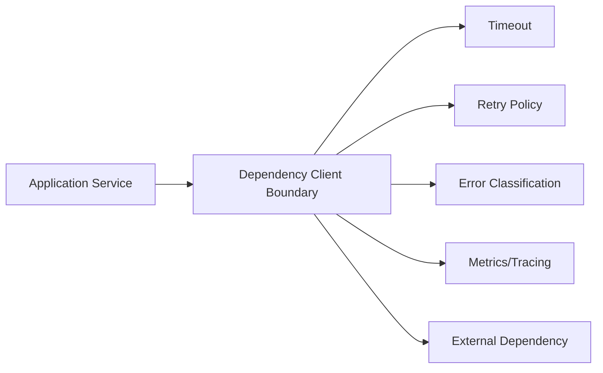
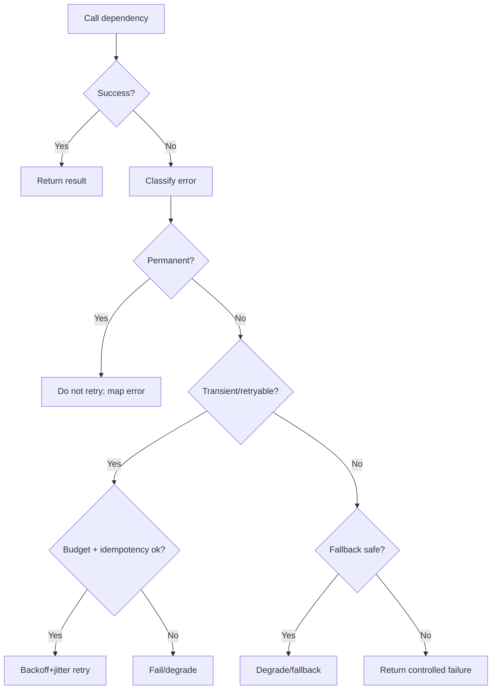
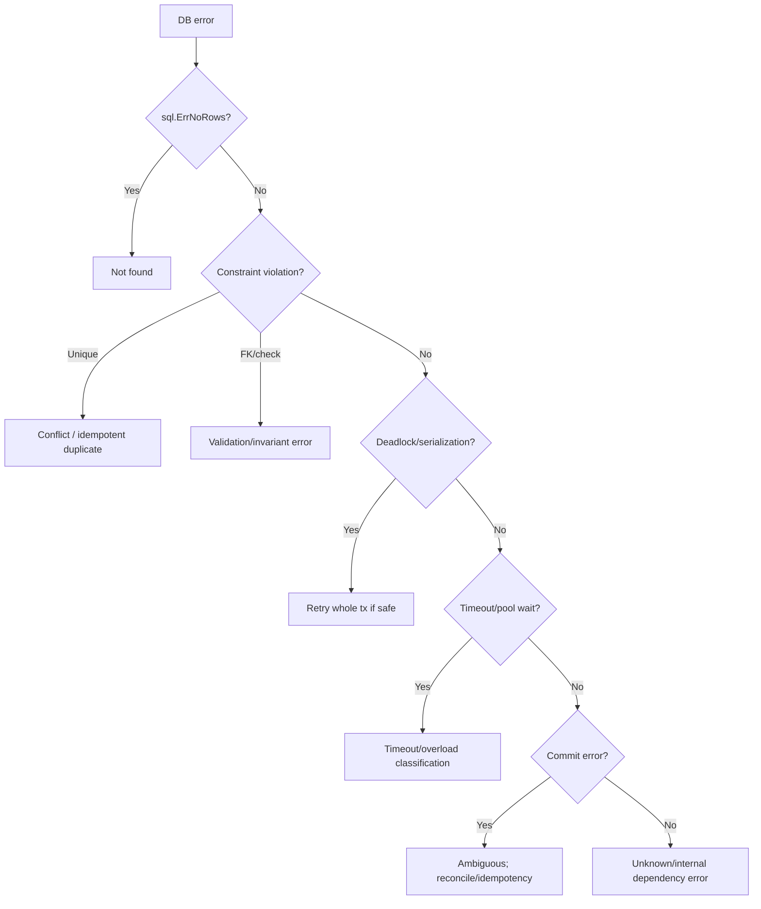
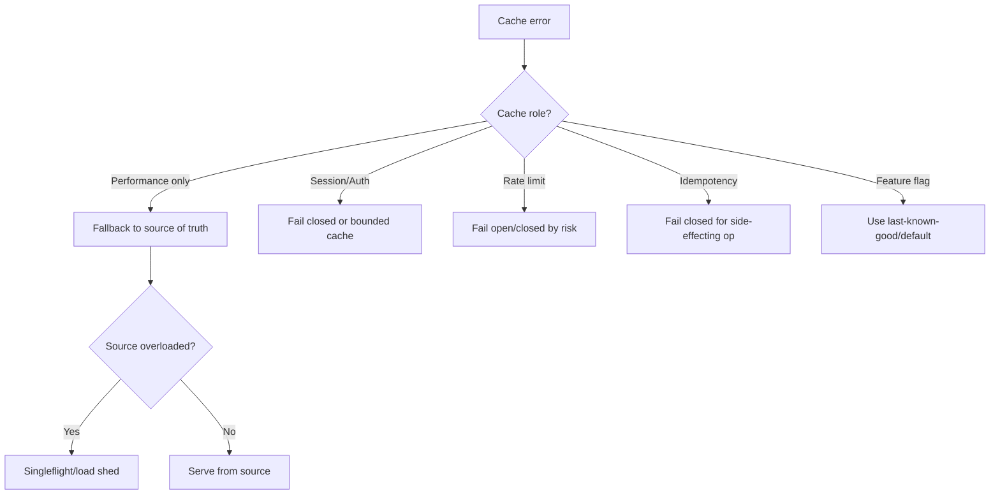

# learn-go-reliability-error-handling-part-022.md

# Dependency Failure Management: Database, Cache, External API, DNS, Network, Auth Provider

> Seri: `learn-go-reliability-error-handling`  
> Part: `022`  
> Target: Go 1.26.x  
> Level: Advanced / internal engineering handbook  
> Fokus: mengelola kegagalan dependency secara sistematis: database, cache, external API, DNS, network, auth provider, message broker, object storage, dan third-party service.

---

## 0. Posisi Materi Ini Dalam Seri

Sebelumnya kita membahas:

- error taxonomy
- context, timeout, retry, idempotency
- concurrency failure
- channel failure
- HTTP server reliability
- graceful shutdown
- Kubernetes/container reliability

Sekarang kita masuk ke salah satu sumber failure paling umum dalam production service:

> Dependency failure.

Dalam aplikasi backend nyata, service jarang benar-benar berdiri sendiri. Ia bergantung pada:

- database
- cache
- message broker
- external HTTP/gRPC API
- DNS
- network
- auth/identity provider
- object storage
- file system/volume
- configuration/secrets
- telemetry backend
- feature flag service
- rate limiter store
- service mesh/proxy
- payment/notification/email provider
- internal platform services

Reliability service Anda tidak bisa lebih baik dari cara Anda menangani dependency failure.

---

## 1. Core Thesis

Dependency failure management bukan hanya “retry kalau error”.

Dependency failure management adalah kemampuan sistem untuk:

1. mengenali dependency failure dengan benar,
2. mengklasifikasikan apakah transient/permanent/overload/ambiguous,
3. membatasi dampak failure,
4. menghindari retry amplification,
5. memberi timeout dan deadline yang tepat,
6. menyediakan fallback/degradation jika aman,
7. menjaga data correctness,
8. menjaga idempotency,
9. mengobservasi dependency health,
10. memulihkan diri tanpa restart manual,
11. memberi error response yang benar ke caller,
12. tidak membuat dependency yang sakit menjadi lebih sakit.

Prinsip utama:

> Treat every dependency as unreliable, slow, partially unavailable, and capable of returning ambiguous outcomes.

---

## 2. Dependency Failure Taxonomy

| Category | Examples | Typical handling |
|---|---|---|
| transient failure | connection reset, 502, short DNS issue | retry with budget/jitter |
| timeout | dependency slow/no response | timeout, maybe retry if safe |
| overload | 429, 503, queue full | backoff, load shed, circuit break |
| permanent failure | auth rejected, schema mismatch, bad request | do not retry |
| partial outage | one shard/zone down | fallback, failover, partial response |
| stale data | cache old, replica lag | consistency policy |
| ambiguous outcome | timeout after write, commit unknown | idempotency/reconcile |
| degraded dependency | high latency but not down | adaptive timeout, bulkhead |
| dependency bug | invalid response/schema | defensive parse, alert |
| security failure | cert invalid, token invalid | fail closed, refresh/reconfigure |
| quota/rate limit | 429, quota exhausted | honor Retry-After, shed |
| local resource exhaustion | pool exhausted, FD exhausted | bulkhead, backpressure, alert |

---

## 3. Dependency Boundary Pattern

Every dependency should be wrapped behind a boundary/client.

Bad:

```go
resp, err := http.Get(url)
```

Good:

```go
type ProfileClient interface {
    GetProfile(ctx context.Context, userID UserID) (Profile, error)
}
```

Boundary responsibilities:

- timeout
- context propagation
- request construction
- response validation
- dependency error classification
- retry policy if appropriate
- circuit/bulkhead/rate limit if needed
- metrics/tracing/logging
- response body limit/close
- public application error mapping
- not leaking dependency details upward unnecessarily

### 3.1 Boundary Diagram



---

## 4. Database Failure Management

Database is often the most critical dependency.

Failure modes:

- connection refused
- authentication failure
- DNS fail
- TLS failure
- connection pool exhausted
- query timeout
- deadlock
- serialization failure
- lock wait timeout
- unique constraint violation
- schema mismatch
- read replica lag
- primary failover
- transaction commit ambiguity
- disk full
- too many connections
- slow query plan
- DB CPU/memory overload
- network partition
- maintenance/restart

### 4.1 Use Context-aware APIs

```go
db.QueryContext(ctx, query, args...)
db.ExecContext(ctx, query, args...)
db.QueryRowContext(ctx, query, args...)
db.BeginTx(ctx, opts)
```

Never use non-context DB calls in request path.

### 4.2 Pool Configuration

`database/sql` pool settings matter:

```go
db.SetMaxOpenConns(50)
db.SetMaxIdleConns(25)
db.SetConnMaxLifetime(30 * time.Minute)
db.SetConnMaxIdleTime(5 * time.Minute)
```

Wrong pool config can cause:

- too many DB connections
- connection storms
- pool wait timeouts
- stale connections
- underutilization
- cascading latency

### 4.3 Pool Exhaustion

If all connections are in use, `QueryContext` can wait for a free connection until context deadline.

This may look like DB timeout, but root cause may be:

- app concurrency too high
- slow queries
- leaked rows not closed
- transactions held too long
- pool too small
- DB too small
- connection leak
- retry amplification

Metrics:

```text
db_open_connections
db_in_use_connections
db_idle_connections
db_wait_count
db_wait_duration
db_max_open_connections
query_duration
transaction_duration
```

### 4.4 Always Close Rows

```go
rows, err := db.QueryContext(ctx, query)
if err != nil {
    return err
}
defer rows.Close()

for rows.Next() {
    ...
}

if err := rows.Err(); err != nil {
    return err
}
```

Not closing rows can hold connection and exhaust pool.

---

## 5. Database Error Classification

Examples:

| DB error | Retry? | Notes |
|---|---|---|
| `sql.ErrNoRows` | no | expected not-found |
| unique violation | no/maybe | idempotency/dedup may treat as success |
| foreign key violation | no | input/invariant issue |
| deadlock | yes, retry whole tx | bounded |
| serialization failure | yes, retry whole tx | recompute |
| connection reset before tx | maybe | transient |
| query timeout | maybe | depends operation |
| lock timeout | maybe | if safe |
| commit error | ambiguous | do not blindly retry |
| schema error | no | deploy/config issue |
| auth error | no | config/secret issue |
| disk full | no immediate | ops incident |

### 5.1 Typed DB Error Mapping

Do not spread driver-specific parsing everywhere.

```go
type DBClassifier interface {
    Classify(error) DBErrorKind
}

type DBErrorKind string

const (
    DBErrorUnknown          DBErrorKind = "unknown"
    DBErrorNotFound         DBErrorKind = "not_found"
    DBErrorUniqueViolation  DBErrorKind = "unique_violation"
    DBErrorDeadlock         DBErrorKind = "deadlock"
    DBErrorSerialization    DBErrorKind = "serialization"
    DBErrorConnection       DBErrorKind = "connection"
    DBErrorTimeout          DBErrorKind = "timeout"
    DBErrorSchema           DBErrorKind = "schema"
)
```

Repository converts to application errors:

```go
if kind := r.classifier.Classify(err); kind == DBErrorDeadlock {
    return fmt.Errorf("%w: %v", ErrDBTransient, err)
}
```

---

## 6. Transaction Failure Management

Transaction rules:

1. Keep transaction short.
2. Do not call slow external API inside transaction.
3. Check context budget before begin.
4. Defer rollback immediately.
5. Commit once.
6. Treat commit error carefully.
7. Retry whole transaction, not individual statement, if safe.
8. Use idempotency for side-effecting operation.
9. Use outbox for external side effects.

Bad:

```go
tx, _ := db.BeginTx(ctx, nil)
external.Call(ctx) // while holding DB locks
tx.Commit()
```

Better:

```text
call external read-only dependency before tx if safe
begin tx
state transition + audit + outbox
commit
async outbox publish
```

### 6.1 Commit Ambiguity

If `Commit` returns error, the app may not know whether DB committed.

Handling:

- retry by idempotency key
- query operation table by operation ID
- reconcile
- avoid external side effects before commit
- never blindly repeat non-idempotent transaction

---

## 7. Cache Failure Management

Cache examples:

- Redis
- Memcached
- in-process cache
- CDN cache
- distributed cache

Cache failure modes:

- unavailable
- high latency
- connection pool exhausted
- stale data
- hot key overload
- eviction storm
- memory pressure
- split brain/cluster failover
- serialization error
- cache stampede
- DNS/network issue
- auth/TLS issue

### 7.1 Cache-aside Pattern

```text
get from cache
if miss:
  get from DB
  set cache
return value
```

If cache unavailable:

- for read-through optimization, bypass cache and hit DB
- but protect DB from stampede
- consider circuit breaker on cache
- use singleflight for hot keys

### 7.2 Cache Is Usually Not Source of Truth

If cache is not source of truth, failure should often degrade, not fail request.

```go
value, err := cache.Get(ctx, key)
if err == nil {
    return value, nil
}

logger.DebugContext(ctx, "cache get failed; falling back to db", "error", err)

value, err = repo.Get(ctx, id)
if err != nil {
    return zero, err
}

_ = cache.Set(context.WithoutCancel(ctx), key, value, ttl) // bounded in real code
return value, nil
```

But do not always ignore cache failure. If cache stores sessions/rate limits/locks, failure may be critical.

---

## 8. Cache Failure Policy by Usage

| Cache Usage | Failure policy |
|---|---|
| performance cache | bypass/fallback to source |
| session store | fail closed or degrade based auth model |
| rate limiter | fail open/closed by risk |
| idempotency store | usually fail closed for side-effecting operations |
| distributed lock | fail operation |
| feature flag cache | use last-known-good |
| token cache | refresh or fail auth |
| permission cache | fail closed if cannot verify |
| config cache | last-known-good with TTL |

### 8.1 Rate Limiter Fail Open vs Fail Closed

Fail open:

- preserves availability
- risk overload/abuse

Fail closed:

- protects system/security
- can block legitimate traffic

Decision depends on endpoint criticality and abuse risk.

---

## 9. Cache Stampede

When hot key expires, many requests hit DB simultaneously.

Mitigations:

- singleflight
- probabilistic early refresh
- stale-while-revalidate
- per-key lock
- jittered TTL
- negative caching
- request coalescing
- circuit breaker to DB

Go `singleflight` style:

```go
type Loader struct {
    group singleflight.Group
}

func (l *Loader) Get(ctx context.Context, key string) (Value, error) {
    v, err, _ := l.group.Do(key, func() (any, error) {
        return l.loadFromDB(ctx, key)
    })
    if err != nil {
        return Value{}, err
    }
    return v.(Value), nil
}
```

Be careful with context: if one caller's context cancels, shared load behavior needs deliberate design.

---

## 10. External HTTP API Failure Management

Failure modes:

- DNS failure
- TCP connect timeout
- TLS handshake failure
- connection reset
- request timeout
- response header timeout
- body read timeout
- 429 rate limit
- 5xx
- 4xx
- invalid JSON
- schema mismatch
- partial response
- slow streaming
- auth/token expired
- quota exhausted
- endpoint deprecated
- load balancer 502/503
- service mesh retry/timeout
- proxy failure

### 10.1 Client Configuration

```go
transport := &http.Transport{
    DialContext: (&net.Dialer{
        Timeout:   500 * time.Millisecond,
        KeepAlive: 30 * time.Second,
    }).DialContext,
    TLSHandshakeTimeout:   500 * time.Millisecond,
    ResponseHeaderTimeout: 1 * time.Second,
    ExpectContinueTimeout: 1 * time.Second,
    IdleConnTimeout:       90 * time.Second,
    MaxIdleConns:          100,
    MaxIdleConnsPerHost:   20,
}

client := &http.Client{
    Transport: transport,
}
```

Per request:

```go
ctx, cancel := context.WithTimeoutCause(ctx, c.timeout, ErrProfileTimeout)
defer cancel()

req, err := http.NewRequestWithContext(ctx, http.MethodGet, url, nil)
```

### 10.2 Always Close Body

```go
resp, err := c.http.Do(req)
if err != nil {
    return err
}
defer resp.Body.Close()
```

If you want connection reuse, drain small response body when ignoring it.

```go
io.Copy(io.Discard, io.LimitReader(resp.Body, 4<<10))
```

Do not read unlimited error body.

---

## 11. HTTP Status Classification

| Status | Meaning | Retry? |
|---:|---|---|
| 200-299 | success | no |
| 400 | bad request | no |
| 401 | auth failure | refresh token maybe once |
| 403 | forbidden | no |
| 404 | not found | no/maybe eventual consistency |
| 409 | conflict | maybe operation-specific |
| 408 | timeout | maybe |
| 429 | rate limited | yes with Retry-After/budget |
| 500 | server error | maybe |
| 502 | gateway | maybe |
| 503 | unavailable | maybe/backoff |
| 504 | gateway timeout | maybe |
| invalid body | dependency bug | no or alert |
| schema mismatch | deploy/version issue | no |

Do not retry all 5xx blindly for side-effecting operations.

---

## 12. External API Boundary Example

```go
type ProfileClient struct {
    http    *http.Client
    baseURL string
    timeout time.Duration
    logger  *slog.Logger
}

func (c *ProfileClient) GetProfile(ctx context.Context, userID string) (Profile, error) {
    ctx, cancel := context.WithTimeoutCause(ctx, c.timeout, ErrProfileTimeout)
    defer cancel()

    req, err := http.NewRequestWithContext(ctx, http.MethodGet, c.baseURL+"/profiles/"+url.PathEscape(userID), nil)
    if err != nil {
        return Profile{}, fmt.Errorf("build profile request: %w", err)
    }

    resp, err := c.http.Do(req)
    if err != nil {
        if ctx.Err() != nil {
            return Profile{}, fmt.Errorf("profile request timeout/canceled: %w", context.Cause(ctx))
        }
        return Profile{}, fmt.Errorf("profile request failed: %w", err)
    }
    defer resp.Body.Close()

    switch resp.StatusCode {
    case http.StatusOK:
        var out Profile
        if err := json.NewDecoder(io.LimitReader(resp.Body, 1<<20)).Decode(&out); err != nil {
            return Profile{}, fmt.Errorf("decode profile response: %w", err)
        }
        return out, nil

    case http.StatusNotFound:
        return Profile{}, ErrProfileNotFound

    case http.StatusTooManyRequests:
        return Profile{}, ErrProfileRateLimited

    case http.StatusBadGateway, http.StatusServiceUnavailable, http.StatusGatewayTimeout:
        return Profile{}, ErrProfileUnavailable

    default:
        body, _ := io.ReadAll(io.LimitReader(resp.Body, 4<<10))
        return Profile{}, fmt.Errorf("profile unexpected status %d: %s", resp.StatusCode, body)
    }
}
```

---

## 13. DNS Failure Management

DNS can fail due to:

- resolver outage
- CoreDNS issue
- search path misconfig
- ndots behavior
- network policy
- node local DNS issue
- stale cache
- service name typo
- upstream DNS latency
- Kubernetes service not created
- headless service endpoint changes

Symptoms:

- `no such host`
- long connect delay
- intermittent resolution
- high DNS query latency
- CoreDNS CPU saturation

Handling:

- classify DNS error as dependency/network failure
- retry with backoff if transient
- do not retry aggressively
- cache clients/connections
- monitor DNS latency/errors
- use fully qualified service names where useful
- avoid per-request creating clients/transports that cause excessive DNS/connect churn

In Go, DNS behavior depends on resolver mode/environment. Operationally, monitor DNS separately.

---

## 14. Network Failure Management

Network failure modes:

- packet loss
- connection reset
- timeout
- refused connection
- TLS handshake failure
- route blackhole
- network policy deny
- load balancer target draining
- NAT exhaustion
- ephemeral port exhaustion
- service mesh proxy failure
- cross-zone latency spike

App handling:

- connect timeout
- request timeout
- retry only safe operations
- circuit breaker/bulkhead
- connection pooling
- low-cardinality metrics by dependency/phase
- do not create new client per request
- avoid infinite reads/writes
- graceful shutdown/idempotency for ambiguous outcomes

---

## 15. Auth Provider Failure Management

Auth dependencies:

- OIDC provider
- JWKS endpoint
- token introspection endpoint
- session store
- authorization service
- identity profile service
- SSO provider
- LDAP/AD
- Keycloak/IdP

Failure modes:

- JWKS fetch fails
- token verification key rotation
- introspection timeout
- session store down
- auth provider 5xx
- userinfo endpoint slow
- clock skew
- cert/TLS issue
- invalid token
- provider returns malformed claims
- rate limit
- login redirect failure

### 15.1 Fail Open vs Fail Closed

Authentication/authorization usually fail closed.

If cannot verify token:

```text
401/503 depending condition
```

But existing validated sessions/JWKS cache can allow continued verification for a bounded period.

### 15.2 JWKS Cache

For JWT verification:

- cache JWKS
- refresh on unknown `kid`
- background refresh
- respect cache headers if appropriate
- keep last-known-good keys for bounded period
- fail closed if token cannot be verified
- avoid calling IdP on every request

### 15.3 Introspection Dependency

If using token introspection on every request:

- auth provider becomes request-path dependency
- latency and availability impact every request
- need timeout/bulkhead/cache
- risk outage if IdP slow
- consider local JWT validation if appropriate

### 15.4 Authorization Service Failure

If permission service unavailable:

- high-risk operations should fail closed
- read-only low-risk operations may use cached permission if policy allows
- cache must have TTL and revocation considerations
- audit degraded authorization decisions

---

## 16. Message Broker Failure Management

Broker dependencies:

- Kafka
- RabbitMQ
- NATS
- SQS
- Pub/Sub
- Redis streams

Failure modes:

- broker unavailable
- publish timeout
- ack timeout
- consumer disconnect
- rebalance
- leader election
- partition unavailable
- queue full
- backpressure
- duplicate delivery
- message ordering break
- poison message
- DLQ unavailable
- auth/TLS error

Handling:

- producer timeout
- idempotent producer if supported
- outbox for critical publish
- consumer dedup
- ack after commit
- DLQ for poison
- bounded retry
- backpressure
- graceful shutdown
- monitor lag/depth
- avoid synchronous dependency on broker for request path unless required

### 16.1 Publish in Request Path

Bad for critical state change:

```go
update DB
publish event directly
```

If publish fails, DB already changed.

Better:

```text
DB transaction:
  update state
  insert outbox event

dispatcher:
  publish later
```

---

## 17. Object Storage Failure Management

Object storage dependencies:

- S3-compatible
- GCS/Azure Blob
- internal document storage

Failure modes:

- timeout
- throttling
- 5xx
- eventual consistency nuance
- object not found
- permission denied
- partial upload
- multipart upload abort needed
- checksum mismatch
- large body memory
- network reset
- region outage

Handling:

- streaming upload/download
- context timeout
- multipart abort on failure
- checksum validation
- idempotent object keys
- retry safe parts
- avoid buffering entire file
- metadata DB transaction coordination
- cleanup orphaned objects
- reconciliation job

### 17.1 DB + Object Storage Dual Write

Danger:

```text
upload object succeeds
DB insert fails
```

or:

```text
DB insert succeeds
upload fails
```

Patterns:

- upload first with temporary key, then DB commit references it, cleanup orphan
- DB creates pending document record, upload, mark complete
- outbox/workflow for document processing
- reconciliation for orphan/pending
- idempotent object key by operation ID

---

## 18. Configuration/Secrets Dependency

Config/secret failure modes:

- missing secret
- invalid secret
- expired credential
- rotated secret not reloaded
- permission denied
- secret store unavailable
- stale cached config
- partial rollout with incompatible config

Handling:

- validate config at startup
- fail fast for required invalid config
- reload carefully with last-known-good
- do not log secret values
- metrics for config version
- readiness false if critical config unavailable
- credential refresh with backoff
- alert before certificate/token expiry

---

## 19. Feature Flag Dependency

Feature flag failure policy:

- last-known-good snapshot
- default values
- local cache
- bounded staleness
- fail safe for risky features
- avoid request-path network call
- audit changes for critical behavior

Do not make every request block on remote feature flag service.

---

## 20. Telemetry Dependency Failure

Telemetry backend down should usually not break business request.

Handling:

- bounded buffers
- drop telemetry under pressure
- never block critical path indefinitely
- flush on shutdown with timeout
- expose dropped telemetry metric
- sample high-volume logs/traces
- avoid retry storm from telemetry exporter

Telemetry is important but usually best-effort.

Exception: audit trail is not telemetry. Audit is business/regulatory data and needs durable handling.

---

## 21. Fallback and Degradation

Fallback is only safe if it preserves correctness.

Examples:

| Dependency | Fallback |
|---|---|
| cache down | use DB |
| profile enrichment down | return base data without enrichment |
| recommendation service down | omit recommendations |
| feature flag service down | last-known-good |
| telemetry down | drop/sampling |
| auth provider down | cached JWKS for JWT verification |
| DB down | usually fail request |
| permission service down | fail closed or cached policy if safe |
| payment provider ambiguous | status check/manual review |

### 21.1 Dangerous Fallback

- allow authorization if auth service down
- assume payment failed after timeout
- create audit only in memory
- use stale permissions indefinitely
- skip idempotency because store down
- ignore DB write failure but return success

Fallback must be correctness-aware.

---

## 22. Graceful Degradation Design

Degradation can be:

- remove optional fields
- serve stale data
- read-only mode
- disable expensive feature
- queue async work
- reject low-priority traffic
- reduce batch size
- shed background jobs
- switch to cached config
- lower concurrency to dependency

Example:

```go
profile, err := s.profile.Get(ctx, userID)
if err != nil {
    if s.policy.AllowProfileDegradation(err) {
        metrics.ProfileDegraded.Inc()
        return UserView{UserID: userID, ProfileAvailable: false}, nil
    }
    return UserView{}, err
}
```

Do not silently degrade critical correctness.

---

## 23. Circuit Breaker Preview

Circuit breaker prevents calls to dependency that is likely failing.

States:

- closed
- open
- half-open

Use when:

- dependency failure causes long waits
- retries amplify load
- fast failure is better
- fallback exists or caller can handle 503

Do not use as band-aid for missing timeout.

Circuit breaker will be covered deeply in part 023.

---

## 24. Bulkhead Preview

Bulkhead isolates dependency failure.

Example:

```text
profile API max 20 concurrent calls
document API max 5 concurrent calls
DB max 50 conns
```

If document API hangs, it should not consume all goroutines/connections.

Implement with semaphores/worker pools/connection pools.

Detailed in part 023.

---

## 25. Rate Limit and Load Shedding Preview

When dependency says `429` or local queue full:

- do not keep retrying aggressively
- respect Retry-After
- shed low-priority work
- return 429/503
- preserve capacity for important traffic

Detailed in part 023/024.

---

## 26. Dependency Health vs Request Success

Do not confuse:

```text
dependency has some errors
```

with:

```text
service should be not ready
```

Readiness should fail only if this instance should not receive traffic.

If dependency global outage affects all pods, making all pods not ready may remove all endpoints and produce different failure behavior.

Sometimes better:

- stay ready and return controlled 503
- or fail readiness if traffic should route elsewhere
- or degrade feature

Decision depends architecture.

---

## 27. Dependency Observability

Metrics per dependency:

```text
dependency_requests_total{dependency,operation,result}
dependency_duration_seconds{dependency,operation}
dependency_timeouts_total{dependency,operation,phase}
dependency_retries_total{dependency,operation,reason}
dependency_circuit_state{dependency}
dependency_inflight{dependency}
dependency_rate_limited_total{dependency}
dependency_errors_total{dependency,kind}
```

Avoid labels:

- raw URL with IDs
- SQL text
- user ID
- error message
- tenant if high-cardinality unless carefully controlled

Logs:

```go
logger.WarnContext(ctx, "dependency call failed",
    "dependency", "profile",
    "operation", "get_profile",
    "kind", "timeout",
    "error", err,
)
```

Traces:

- span per dependency call
- status/error code
- retry attempts
- timeout phase
- response status
- dependency name

---

## 28. Dependency Error Types

Define stable error kinds.

```go
type DependencyError struct {
    Dependency string
    Operation  string
    Kind       DependencyErrorKind
    Retryable  bool
    Err        error
}

type DependencyErrorKind string

const (
    DependencyTimeout       DependencyErrorKind = "timeout"
    DependencyUnavailable   DependencyErrorKind = "unavailable"
    DependencyRateLimited   DependencyErrorKind = "rate_limited"
    DependencyBadResponse   DependencyErrorKind = "bad_response"
    DependencyUnauthorized  DependencyErrorKind = "unauthorized"
    DependencyForbidden     DependencyErrorKind = "forbidden"
    DependencyNotFound      DependencyErrorKind = "not_found"
    DependencyConflict      DependencyErrorKind = "conflict"
    DependencyAmbiguous     DependencyErrorKind = "ambiguous"
)

func (e *DependencyError) Error() string {
    return fmt.Sprintf("%s %s failed: %s: %v", e.Dependency, e.Operation, e.Kind, e.Err)
}

func (e *DependencyError) Unwrap() error {
    return e.Err
}
```

Classifier:

```go
func IsRetryableDependency(err error) bool {
    var dep *DependencyError
    if errors.As(err, &dep) {
        return dep.Retryable
    }
    return false
}
```

---

## 29. Mapping Dependency Error to API Response

At HTTP boundary:

```go
var dep *DependencyError
if errors.As(err, &dep) {
    switch dep.Kind {
    case DependencyTimeout:
        return Problem{Status: 504, Code: "DEPENDENCY_TIMEOUT", ...}
    case DependencyRateLimited:
        return Problem{Status: 503, Code: "DEPENDENCY_RATE_LIMITED", ...}
    case DependencyUnavailable:
        return Problem{Status: 503, Code: "DEPENDENCY_UNAVAILABLE", ...}
    case DependencyBadResponse:
        return Problem{Status: 502, Code: "BAD_GATEWAY", ...}
    default:
        return Problem{Status: 500, Code: "INTERNAL_ERROR", ...}
    }
}
```

Do not leak dependency internal URL/status body.

---

## 30. Dependency-specific Timeout Budget

Every dependency call should have explicit budget.

```yaml
dependencies:
  profile:
    get_profile:
      timeout: 500ms
      max_attempts: 2
  policy:
    check_submit:
      timeout: 700ms
      max_attempts: 1
  document:
    fetch_metadata:
      timeout: 1s
```

Avoid one global dependency timeout.

---

## 31. Dependency Concurrency Limit

Use semaphore per dependency.

```go
type Bulkhead struct {
    sem chan struct{}
}

func (b *Bulkhead) Acquire(ctx context.Context) (func(), error) {
    select {
    case b.sem <- struct{}{}:
        return func() { <-b.sem }, nil
    case <-ctx.Done():
        return nil, context.Cause(ctx)
    }
}
```

Client wrapper:

```go
release, err := c.bulkhead.Acquire(ctx)
if err != nil {
    return zero, NewDependencyError("profile", "get", DependencyUnavailable, false, err)
}
defer release()
```

This prevents one dependency from consuming all request capacity.

---

## 32. Dependency Startup Strategy

Should app start if dependency unavailable?

| Dependency | Startup policy |
|---|---|
| required config/secret | fail fast |
| DB for all endpoints | readiness false or fail fast |
| optional cache | start, degrade |
| telemetry | start, warn |
| auth JWKS initial fetch | maybe require or use mounted cached keys |
| feature flag | last-known-good/default |
| broker consumer | app can start HTTP, consumer degraded maybe |
| migration required | fail startup if migration invalid |

Prefer:

- fail fast for non-recoverable config
- readiness false for transient critical dependency
- degrade for optional dependency

---

## 33. Dependency Recovery

A dependency may recover after outage.

App should recover without restart when possible:

- connection pools reconnect
- clients retry future calls
- circuit breaker half-open probes
- readiness monitor turns ready true
- background reconnect loop
- JWKS refresh succeeds
- broker consumer reconnects
- cache resumes

Avoid requiring pod restart for transient dependency recovery.

---

## 34. Readiness and Dependency Recovery Example

```go
func (m *DependencyMonitor) Run(ctx context.Context) error {
    ticker := time.NewTicker(m.interval)
    defer ticker.Stop()

    for {
        m.checkOnce(ctx)

        select {
        case <-ctx.Done():
            return context.Cause(ctx)
        case <-ticker.C:
        }
    }
}

func (m *DependencyMonitor) checkOnce(parent context.Context) {
    ctx, cancel := context.WithTimeout(parent, m.timeout)
    defer cancel()

    err := m.db.PingContext(ctx)
    m.dbReady.Store(err == nil)

    if err != nil {
        m.logger.WarnContext(parent, "db readiness check failed", "error", err)
    }
}
```

Readiness:

```go
if !m.dbReady.Load() {
    readiness false
}
```

Use caution: if all pods fail readiness during global DB outage, Service has no endpoints. That may be okay or not depending desired behavior.

---

## 35. Dependency Failure and Data Correctness

Availability fallback must not break correctness.

Examples:

### 35.1 Permission Service Down

Wrong:

```go
if permissionErr != nil {
    allow()
}
```

Usually fail closed.

### 35.2 Cache Down

Safe:

```go
fallback to DB
```

if DB can handle load and correctness preserved.

### 35.3 Idempotency Store Down

For side-effecting POST, fail closed.

```go
return 503 IDEMPOTENCY_UNAVAILABLE
```

Do not process without dedup.

### 35.4 Audit Store Down

If audit required for transition, fail transition or store durable local/outbox alternative. Do not silently skip audit.

---

## 36. Dependency Failure and User Experience

Map errors to useful but safe responses.

Bad:

```json
{"error":"dial tcp 10.0.3.12:5432: connect: connection refused"}
```

Good:

```json
{
  "code": "TEMPORARILY_UNAVAILABLE",
  "message": "The service is temporarily unavailable. Please try again later.",
  "correlation_id": "..."
}
```

For async operations:

```json
{
  "code": "DEPENDENCY_DELAYED",
  "message": "The request was accepted and will continue processing asynchronously.",
  "operation_id": "..."
}
```

Only if true.

---

## 37. Testing Dependency Failure

Use fakes and controlled servers.

### 37.1 HTTP Dependency Timeout

```go
srv := httptest.NewServer(http.HandlerFunc(func(w http.ResponseWriter, r *http.Request) {
    <-r.Context().Done()
}))
defer srv.Close()
```

Client with timeout should return timeout error.

### 37.2 HTTP 503 Retry

Fake server returns 503 then 200. Assert retry count and backoff.

### 37.3 Invalid JSON

Return 200 with malformed JSON. Assert `DependencyBadResponse`, no retry unless policy says.

### 37.4 DB Pool Exhaustion

Use limited pool and blocking transaction in integration test.

### 37.5 Cache Down

Fake cache returns error. Assert DB fallback and cache error metric.

### 37.6 Auth Provider Down

Assert fail closed or cached JWKS behavior.

### 37.7 Broker Ack Failure

Assert dedup/redelivery behavior.

---

## 38. Fault Injection / Chaos Scenarios

Inject:

- DB latency
- DB connection refused
- DB deadlock
- Redis unavailable
- DNS failure
- HTTP 429/503
- invalid downstream response
- token provider timeout
- broker disconnect
- object storage timeout
- network packet loss
- dependency partial outage
- slow response body
- connection reset after request body sent

Observe:

- timeouts
- retry volume
- fallback
- circuit breaker
- error response
- resource usage
- logs/metrics/traces
- recovery after dependency returns

---

## 39. Production Checklist

### 39.1 General

- [ ] Each dependency has boundary wrapper.
- [ ] Timeout configured per operation.
- [ ] Retry policy explicit.
- [ ] Idempotency considered for side effects.
- [ ] Circuit/bulkhead considered for critical dependencies.
- [ ] Errors classified into stable kinds.
- [ ] Public API does not leak internal errors.
- [ ] Metrics/traces/logs by dependency/operation.

### 39.2 Database

- [ ] context-aware calls used.
- [ ] rows closed.
- [ ] transactions short.
- [ ] pool configured.
- [ ] pool metrics monitored.
- [ ] deadlock/serialization retry policy.
- [ ] commit ambiguity handled.
- [ ] schema/config errors fail fast.

### 39.3 Cache

- [ ] cache usage type known.
- [ ] fallback policy defined.
- [ ] cache stampede mitigated.
- [ ] TTL jitter considered.
- [ ] cache failure metrics.
- [ ] critical cache fail-open/closed policy documented.

### 39.4 External API

- [ ] reusable HTTP client.
- [ ] dial/TLS/header/request timeouts.
- [ ] response body closed.
- [ ] error body limited.
- [ ] status codes classified.
- [ ] Retry-After honored.
- [ ] invalid response handled.
- [ ] auth/token refresh safe.

### 39.5 Auth

- [ ] fail closed where required.
- [ ] JWKS/session cache policy.
- [ ] token refresh backoff.
- [ ] permission cache TTL.
- [ ] clock skew considered.
- [ ] auth provider outage behavior tested.

### 39.6 Messaging/Object Storage

- [ ] outbox for critical publish.
- [ ] consumer dedup.
- [ ] ack after commit.
- [ ] DLQ policy.
- [ ] multipart abort/cleanup.
- [ ] object key idempotency.
- [ ] orphan reconciliation.

---

## 40. Mermaid: Dependency Failure Handling Pipeline



---

## 41. Mermaid: Database Failure Decision



---

## 42. Mermaid: Cache Failure Policy



---

## 43. Regulatory Case Management Lens

For regulatory/case lifecycle service:

### 43.1 Database

DB failure usually means request cannot complete. Do not fake success.

### 43.2 Cache

Cache failure can degrade reads, but not authorization/idempotency/audit correctness.

### 43.3 External Agency API

If external API needed for validation:

- timeout should map to controlled dependency error
- retry only if operation safe
- preserve operation id
- do not commit state if dependency decision required and unavailable

### 43.4 Auth Provider

Fail closed for identity/permission uncertainty. Use cached JWKS/session only within documented TTL.

### 43.5 Audit

Audit dependency failure in transaction should fail state transition unless durable alternative exists.

### 43.6 Outbox

External notification/API event failure should not rollback committed case state if outbox is used; event remains pending.

---

## 44. Java Engineer Translation Layer

### 44.1 Spring `RestTemplate`/`WebClient`

Go equivalent: custom client boundary using `http.Client`, `Transport`, `context`, typed errors, and retry/bulkhead policies.

### 44.2 JDBC/HikariCP

Go `database/sql` includes built-in pool; you configure `SetMaxOpenConns`, `SetMaxIdleConns`, `SetConnMaxLifetime`, `SetConnMaxIdleTime`.

### 44.3 Resilience4j

Go does not have one standard resilience framework in stdlib. You compose:

- context timeout
- retry package
- circuit breaker library/custom
- bulkhead semaphore
- rate limiter
- typed errors
- metrics

### 44.4 Spring Security/Auth Provider

Go auth provider failure policy must be explicit: cache JWKS, fail closed, map errors, avoid request-path remote introspection if possible.

---

## 45. Key Takeaways

1. Every dependency is unreliable, slow, and partially available.
2. Dependency calls need boundary wrappers.
3. Timeout, retry, and fallback must be dependency/operation-specific.
4. Database errors need classification; not all DB errors are retryable.
5. Transactions should be short and avoid external calls inside.
6. Commit ambiguity requires idempotency/reconciliation.
7. Cache failure policy depends on cache role.
8. Cache-aside fallback can overload DB without stampede protection.
9. External HTTP clients need transport timeouts and per-request context.
10. Always close/limit HTTP response bodies.
11. DNS/network failures need classification and observability.
12. Auth/authorization dependency failure usually fails closed.
13. Messaging reliability requires outbox, ack-after-commit, dedup, and DLQ.
14. Object storage dual-write requires workflow/reconciliation.
15. Telemetry failure should not break business request; audit is different.
16. Fallback is only safe if correctness is preserved.
17. Readiness should reflect whether pod should receive traffic, not every dependency blip.
18. Dependency metrics must be low-cardinality and operation-specific.
19. Dependency recovery should usually not require pod restart.
20. Reliability is the boundary behavior around dependencies, not hope that dependencies stay up.

---

## 46. References

- Go package documentation: `database/sql`
- Go package documentation: `net/http`
- Go package documentation: `net`
- Go package documentation: `context`
- Go package documentation: `errors`
- AWS Builders Library: timeout/retry/backoff/idempotency articles
- Google SRE Book: cascading failures, overload, handling overload
- Microservices.io: Circuit Breaker, Transactional Outbox, Idempotent Consumer
- Kubernetes documentation: DNS for Services and Pods, probes, resource management

---

## 47. Next Part

Next:

```text
learn-go-reliability-error-handling-part-023.md
```

Topic:

```text
Circuit Breaker, Bulkhead, Rate Limit, Load Shedding, Backpressure
```

<!-- NAVIGATION_FOOTER -->
<div class="page-nav">
<a href="./learn-go-reliability-error-handling-part-021.md">⬅️ Kubernetes & Container Runtime Reliability: Probes, SIGTERM, Resource Limits, OOM, Restarts</a>
<a href="./index.md">📚 Kategori</a>
<a href="../../index.md">🏠 Home</a>
<a href="./learn-go-reliability-error-handling-part-023.md">Circuit Breaker, Bulkhead, Rate Limit, Load Shedding, Backpressure ➡️</a>
</div>
