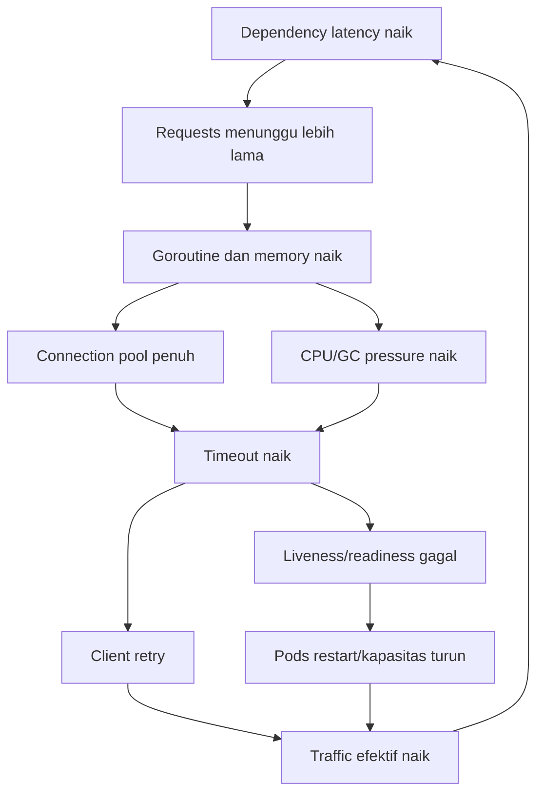
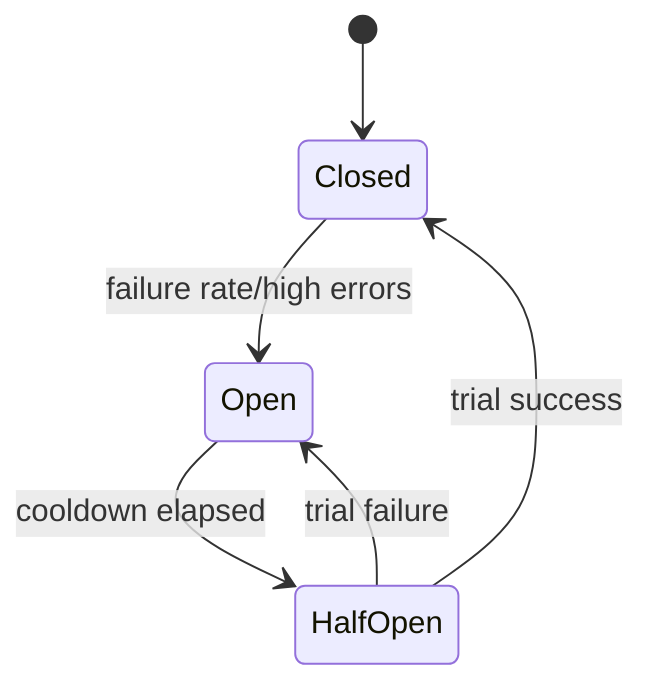
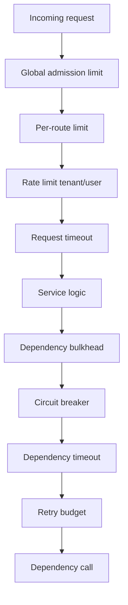

# learn-go-reliability-error-handling-part-023.md

# Circuit Breaker, Bulkhead, Rate Limit, Load Shedding, Backpressure

> Seri: `learn-go-reliability-error-handling`  
> Part: `023`  
> Target: Go 1.26.x  
> Level: Advanced / internal engineering handbook  
> Fokus: resilience control patterns untuk mencegah cascading failure: circuit breaker, bulkhead, rate limit, load shedding, backpressure, admission control, dan overload-safe design.

---

## 0. Posisi Materi Ini Dalam Seri

Pada bagian sebelumnya kita sudah membahas:

- timeout engineering
- retry engineering
- idempotency
- dependency failure management
- graceful shutdown
- Kubernetes resource reliability
- HTTP server reliability
- channel/concurrency failure

Sekarang kita masuk ke pola yang sering dipakai ketika sistem mulai menerima tekanan tinggi atau dependency mulai rusak:

- circuit breaker
- bulkhead
- rate limit
- load shedding
- backpressure
- admission control
- adaptive concurrency
- priority-based rejection
- queue limit
- retry budget

Masalah yang ingin diselesaikan:

```text
Dependency lambat → request menumpuk → goroutine bertambah → DB pool penuh
→ timeout naik → client retry → traffic naik → semua makin lambat
→ liveness probe fail → pod restart → kapasitas turun → outage makin besar.
```

Polanya bukan “biar selalu sukses”. Polanya adalah:

> Fail fast, isolate damage, preserve critical capacity, and recover gradually.

---

## 1. Core Thesis

Resilience pattern bukan pengganti desain domain yang benar. Ia adalah **control system** untuk menjaga service tetap berada dalam batas aman.

Prinsip utama:

1. **Timeout** membatasi durasi menunggu.
2. **Retry** meningkatkan peluang sukses untuk transient failure.
3. **Circuit breaker** menghentikan call sementara ketika dependency kemungkinan besar gagal.
4. **Bulkhead** membatasi blast radius antar dependency/operation.
5. **Rate limit** membatasi laju request.
6. **Load shedding** menolak work saat kapasitas tidak cukup.
7. **Backpressure** memperlambat upstream saat downstream lambat.
8. **Queue limit** mencegah memory/goroutine explosion.
9. **Retry budget** mencegah retry menjadi mayoritas traffic.
10. **Idempotency** menjaga retry/drop/requeue tetap aman.

Semua pattern ini harus dikonfigurasi berdasarkan:

- SLO
- latency distribution
- capacity
- dependency behavior
- idempotency
- criticality
- overload policy
- observability

---

## 2. Cascading Failure Mental Model

Cascading failure terjadi saat satu failure memicu failure lain.



Resilience pattern memotong loop ini.

---

## 3. Pattern Map

| Pattern | Protects | Main tradeoff |
|---|---|---|
| timeout | caller resource/time | false timeout |
| retry | transient failure success rate | amplification |
| circuit breaker | dependency and caller from repeated failure | false open |
| bulkhead | one dependency/operation from consuming all resources | underutilization |
| rate limit | system/dependency from excessive request rate | rejected requests |
| load shedding | core capacity under overload | degraded UX |
| backpressure | downstream by slowing upstream | latency/queueing |
| queue limit | memory/goroutine bound | rejected/dropped work |
| adaptive concurrency | latency under variable capacity | complexity |
| priority shed | critical traffic survives | fairness complexity |

---

## 4. Circuit Breaker

Circuit breaker prevents repeated calls to an unhealthy dependency.

States:

- `closed`: calls allowed
- `open`: calls rejected immediately
- `half-open`: limited trial calls allowed



### 4.1 Why Circuit Breaker

Without breaker:

```text
dependency down
every request waits until timeout
goroutines pile up
retry increases load
service latency explodes
```

With breaker:

```text
dependency down
after threshold, calls fail fast
caller capacity preserved
dependency gets recovery time
```

### 4.2 What Counts as Failure?

Usually count:

- timeout
- connection error
- 502/503/504
- dependency 5xx
- rate limit maybe separate
- bad gateway
- circuit-level rejected? no, avoid self-counting

Usually do not count:

- validation error
- 404 not found
- 401 due to caller token
- business conflict
- context canceled by client
- caller-side deadline before attempt starts, depending policy

### 4.3 Failure Rate vs Consecutive Failure

Simpler: consecutive failure threshold.

```text
open after 5 consecutive failures
```

Better: rolling window failure rate.

```text
open if at least 20 requests and failure rate > 50% in last 30s
```

Consecutive failures are easy but noisy at low traffic. Rolling windows are better but more complex.

---

## 5. Circuit Breaker Minimal Implementation

Educational implementation:

```go
type BreakerState string

const (
    StateClosed   BreakerState = "closed"
    StateOpen     BreakerState = "open"
    StateHalfOpen BreakerState = "half_open"
)

var ErrCircuitOpen = errors.New("circuit breaker open")

type CircuitBreaker struct {
    mu sync.Mutex

    state BreakerState

    consecutiveFailures int
    failureThreshold    int

    openedAt     time.Time
    openDuration time.Duration

    halfOpenInFlight bool
}

func NewCircuitBreaker(threshold int, openDuration time.Duration) *CircuitBreaker {
    return &CircuitBreaker{
        state:            StateClosed,
        failureThreshold: threshold,
        openDuration:     openDuration,
    }
}

func (b *CircuitBreaker) Allow(now time.Time) error {
    b.mu.Lock()
    defer b.mu.Unlock()

    switch b.state {
    case StateClosed:
        return nil

    case StateOpen:
        if now.Sub(b.openedAt) >= b.openDuration {
            b.state = StateHalfOpen
            b.halfOpenInFlight = false
        } else {
            return ErrCircuitOpen
        }
    }

    if b.state == StateHalfOpen {
        if b.halfOpenInFlight {
            return ErrCircuitOpen
        }
        b.halfOpenInFlight = true
        return nil
    }

    return nil
}

func (b *CircuitBreaker) Report(success bool, now time.Time) {
    b.mu.Lock()
    defer b.mu.Unlock()

    switch b.state {
    case StateClosed:
        if success {
            b.consecutiveFailures = 0
            return
        }

        b.consecutiveFailures++
        if b.consecutiveFailures >= b.failureThreshold {
            b.state = StateOpen
            b.openedAt = now
        }

    case StateHalfOpen:
        b.halfOpenInFlight = false

        if success {
            b.state = StateClosed
            b.consecutiveFailures = 0
            return
        }

        b.state = StateOpen
        b.openedAt = now

    case StateOpen:
        // ignore reports while open
    }
}
```

Usage:

```go
func (c *Client) Get(ctx context.Context, id string) (Value, error) {
    now := c.clock.Now()

    if err := c.breaker.Allow(now); err != nil {
        return Value{}, fmt.Errorf("profile circuit open: %w", err)
    }

    v, err := c.callDependency(ctx, id)

    success := err == nil || !isBreakerFailure(err)
    c.breaker.Report(success, c.clock.Now())

    return v, err
}
```

This implementation is not complete enough for high-scale production, but it shows the mechanics.

---

## 6. Circuit Breaker Design Considerations

### 6.1 Per Dependency and Operation

Do not have one global breaker.

```text
profile.get
profile.search
document.upload
document.download
policy.check
```

Each may have different behavior.

### 6.2 Per Instance vs Global

Most circuit breakers are per process/pod.

Pros:

- simple
- local protection
- no distributed coordination

Cons:

- each pod learns separately
- some pods may keep trying
- no global view

Global breakers are complex and can become dependency themselves.

### 6.3 Half-open Concurrency

Half-open should allow limited probes, not full traffic.

```text
half_open_max_inflight = 1 or small N
```

### 6.4 Open Duration

Too short: hammer dependency during outage.

Too long: slow recovery.

Use jitter to avoid all pods probing simultaneously.

### 6.5 Breaker + Fallback

Breaker is most useful when fallback exists or fast error is acceptable.

If no fallback, breaker still protects resources but returns failure.

---

## 7. Circuit Breaker Anti-patterns

### 7.1 Breaker Without Timeout

If calls hang forever, breaker may not get failure signal quickly.

Timeout first.

### 7.2 Breaker on Validation Errors

Opens due to caller bad requests.

### 7.3 Breaker Shared Across Unrelated Operations

One endpoint failure disables all dependency usage.

### 7.4 Half-open Flood

Immediately allowing full traffic causes relapse.

### 7.5 Breaker Hides Incident

Fast failure with no alert can hide dependency outage.

### 7.6 Breaker Around Critical DB Without Fallback

May be okay for protection, but if it opens too eagerly, all requests fail. Tune carefully.

---

## 8. Bulkhead

Bulkhead isolates resources so one failure does not sink the whole service.

Ship analogy: compartments prevent flooding everywhere.

In Go services, bulkhead can be:

- per-dependency concurrency limit
- per-endpoint concurrency limit
- per-tenant concurrency limit
- DB connection pool
- worker pool
- bounded queue
- semaphore
- separate goroutine pools
- separate deployments for workloads
- separate Kubernetes resources

### 8.1 Bulkhead Example

Without bulkhead:

```text
document API hangs
all goroutines wait on document API
profile API requests also starve
```

With bulkhead:

```text
document API max 5 concurrent calls
profile API still has capacity
```

### 8.2 Semaphore Bulkhead

```go
type Bulkhead struct {
    sem chan struct{}
}

var ErrBulkheadFull = errors.New("bulkhead full")

func NewBulkhead(limit int) *Bulkhead {
    return &Bulkhead{sem: make(chan struct{}, limit)}
}

func (b *Bulkhead) Acquire(ctx context.Context) (func(), error) {
    select {
    case b.sem <- struct{}{}:
        return func() { <-b.sem }, nil
    case <-ctx.Done():
        return nil, fmt.Errorf("acquire bulkhead: %w", context.Cause(ctx))
    }
}

func (b *Bulkhead) TryAcquire() (func(), bool) {
    select {
    case b.sem <- struct{}{}:
        return func() { <-b.sem }, true
    default:
        return nil, false
    }
}
```

Usage:

```go
release, err := c.bulkhead.Acquire(ctx)
if err != nil {
    return zero, ErrDependencyOverloaded
}
defer release()

return c.call(ctx)
```

### 8.3 Queue vs Bulkhead

A semaphore limits concurrent execution.

A queue buffers waiting work.

If you combine:

```text
queue + worker pool
```

you have both waiting queue and concurrency limit.

Be careful: queue increases latency and memory.

---

## 9. Bulkhead Sizing

Questions:

1. How many concurrent calls can dependency handle?
2. How much latency can caller tolerate?
3. How many pods call this dependency?
4. Is there retry?
5. Is there per-tenant fairness?
6. Is there a global rate limit?
7. What happens when full?
8. Does full mean reject or wait?

Example:

```text
Dependency capacity: 500 concurrent calls
Pods: 10
Per-pod bulkhead: 30
Total possible: 300
Headroom: 200
```

Do not set per-pod limit without considering number of pods.

---

## 10. Bulkhead Full Policy

When bulkhead full:

- wait with context
- fail fast with 503
- return fallback
- shed low-priority
- enqueue async job
- reject with Retry-After

For request path, waiting too long increases latency and ties resources.

Often:

```go
release, ok := b.TryAcquire()
if !ok {
    return ErrServiceBusy
}
defer release()
```

or wait only briefly:

```go
ctx, cancel := context.WithTimeout(ctx, 50*time.Millisecond)
defer cancel()
release, err := b.Acquire(ctx)
```

---

## 11. Rate Limiting

Rate limiting controls request rate.

Types:

- global rate limit
- per-client
- per-tenant
- per-user
- per-endpoint
- per-dependency
- token bucket
- leaky bucket
- fixed window
- sliding window
- concurrency limit

### 11.1 Token Bucket

Tokens refill over time. Request consumes token.

If no token:

- reject
- wait
- degrade

Go standard library has `golang.org/x/time/rate`.

Concept:

```go
limiter := rate.NewLimiter(rate.Limit(100), 200) // 100/sec burst 200

if err := limiter.Wait(ctx); err != nil {
    return err
}
```

Or non-blocking:

```go
if !limiter.Allow() {
    return ErrRateLimited
}
```

### 11.2 Wait vs Allow

`Wait(ctx)` applies backpressure.

`Allow()` sheds immediately.

Request path often uses `Allow` or short `Wait`.

Background jobs can use `Wait`.

---

## 12. Rate Limit Response

HTTP:

```http
429 Too Many Requests
Retry-After: 1
```

Problem response:

```json
{
  "code": "RATE_LIMITED",
  "message": "Too many requests. Please retry later."
}
```

Use `429` for client-specific quota/rate limit.

Use `503` for service capacity overload.

---

## 13. Distributed Rate Limiting

Local in-memory limiter is per pod.

If you need global per-tenant limit:

- Redis token bucket
- API gateway
- service mesh
- centralized rate limit service
- database counter, usually expensive
- approximate local limit divided by replicas

Tradeoffs:

| Approach | Pros | Cons |
|---|---|---|
| local limiter | fast/simple | not global |
| Redis limiter | global-ish | Redis dependency |
| gateway limiter | centralized edge | less app semantic knowledge |
| service mesh | platform control | can amplify complexity |
| DB limiter | strong-ish | expensive/contention |

If rate limiter dependency fails, decide fail-open/closed by risk.

---

## 14. Load Shedding

Load shedding intentionally rejects work to preserve system health.

Signals:

- CPU high
- memory high
- queue depth high
- DB pool wait high
- dependency bulkhead full
- latency SLO burn
- worker backlog
- circuit open
- retry budget exhausted
- Kubernetes pod shutting down
- GC pressure
- too many in-flight requests

Load shedding is not failure of reliability. It is a reliability mechanism.

### 14.1 Shedding Response

Return:

```http
503 Service Unavailable
Retry-After: 1
```

or:

```http
429 Too Many Requests
```

depending whether overload is server-wide or client-specific.

---

## 15. Admission Control

Admission control decides whether to start work.

Important principle:

> It is better to reject before doing expensive work than after consuming resources.

Admission checks can happen before:

- request body read
- auth? depends
- DB transaction
- dependency call
- queue enqueue
- report generation
- file processing

Example middleware:

```go
func Admission(maxInflight int64) func(http.Handler) http.Handler {
    var inflight atomic.Int64

    return func(next http.Handler) http.Handler {
        return http.HandlerFunc(func(w http.ResponseWriter, r *http.Request) {
            n := inflight.Add(1)
            if n > maxInflight {
                inflight.Add(-1)
                writeProblem(w, Problem{
                    Status:  http.StatusServiceUnavailable,
                    Code:    "SERVICE_BUSY",
                    Message: "The service is busy.",
                })
                return
            }
            defer inflight.Add(-1)

            next.ServeHTTP(w, r)
        })
    }
}
```

This is simple global inflight limit.

---

## 16. In-flight Limit Pitfalls

Global inflight limit can cause:

- slow requests occupy all slots
- low-priority traffic blocks critical traffic
- health checks blocked
- head-of-line blocking
- unfair tenants

Better:

- per-route limit
- per-priority limit
- separate health/admin path
- short-circuit before large body
- bulkhead by dependency
- queue length limit
- timeout per route

---

## 17. Priority-based Load Shedding

Traffic classes:

- critical internal health/liveness
- user write operations
- user read operations
- background reconciliation
- analytics/reporting
- optional enrichment
- telemetry

Under overload:

1. drop optional enrichment
2. pause background jobs
3. reject expensive reports
4. degrade search
5. preserve core writes/reads
6. preserve health/admin

Example:

```go
type Priority int

const (
    PriorityCritical Priority = iota
    PriorityHigh
    PriorityNormal
    PriorityLow
)
```

Admission can use different limits.

---

## 18. Backpressure

Backpressure slows upstream when downstream cannot keep up.

Mechanisms:

- blocking channel send
- queue wait
- TCP flow control
- rate limiter wait
- semaphore acquire
- broker consumer pause
- HTTP 429/503 with Retry-After
- gRPC resource exhausted
- adaptive concurrency
- reducing batch size
- not reading from broker

Backpressure can be good, but if caller cannot wait, reject.

### 18.1 Backpressure vs Load Shedding

| Concept | Behavior |
|---|---|
| backpressure | slow caller/downstream |
| load shedding | reject/drop work |
| rate limit | reject/wait based on rate |
| bulkhead | reject/wait based on concurrency |
| circuit breaker | fail fast based on health |

---

## 19. Queue Backpressure

Queue full choices from part 017:

- block
- drop new
- drop old
- reject
- persist
- requeue

For critical request path, bounded queue + reject often safer than unbounded wait.

```go
func (q *Queue) Submit(ctx context.Context, job Job) error {
    select {
    case q.ch <- job:
        return nil
    default:
        return ErrQueueFull
    }
}
```

or short wait:

```go
ctx, cancel := context.WithTimeout(ctx, 50*time.Millisecond)
defer cancel()

select {
case q.ch <- job:
    return nil
case <-ctx.Done():
    return ErrQueueFull
}
```

---

## 20. Adaptive Concurrency

Static limits are blunt.

Adaptive concurrency changes limit based on latency/error feedback.

Concept:

```text
if latency low and errors low -> increase concurrency slowly
if latency high/timeouts -> decrease concurrency quickly
```

This is advanced and easy to get wrong. But useful when dependency capacity varies.

Simpler alternatives first:

- static bulkhead
- timeout
- retry budget
- circuit breaker
- HPA
- queue limit

---

## 21. Overload Control Layers

Layered protection:



Order matters. Cheap checks first.

---

## 22. Retry Budget + Circuit Breaker + Rate Limit

These patterns interact.

Bad:

```text
dependency 503
client retries 3x
breaker opens after many failures
rate limiter still allows retry flood
```

Better:

```text
rate limit / admission first
retry budget controls retry volume
breaker opens on failure rate
bulkhead caps concurrency
timeout bounds duration
```

If breaker open, do not retry immediately.

```go
if errors.Is(err, ErrCircuitOpen) {
    return false // retry classifier
}
```

---

## 23. Circuit Breaker and Retry Order

Option A:

```text
retry wraps breaker
```

Each retry checks breaker. If open, retry stops.

Option B:

```text
breaker wraps retry
```

Breaker sees final retry outcome, not individual attempt.

Usually:

- dependency client has retry inside, breaker may observe final call result
- or breaker before each attempt to avoid retries when open

Be explicit.

Recommended simple order:

```text
bulkhead acquire
breaker allow
retry loop:
  per-attempt timeout
  call dependency
  classify
report breaker final result
release bulkhead
```

But if retries are expensive, breaker should prevent each attempt when open.

---

## 24. Fallback

Fallback examples:

- cache stale data
- default optional field
- omit recommendations
- read-only mode
- async queue accepted
- alternate region/provider
- local policy snapshot

Fallback must be correct.

Bad fallback:

```go
if authzDown {
    allowAll()
}
```

Good fallback:

```go
if profileDown {
    return baseUserViewWithoutProfile()
}
```

### 24.1 Stale-While-Revalidate

Serve stale data while refreshing in background.

Useful for:

- config
- feature flags
- reference data
- non-critical profile display

Dangerous for:

- permissions
- financial balance
- regulatory state
- idempotency decisions

---

## 25. Fail Open vs Fail Closed

Decision by risk.

| Dependency | Fail mode |
|---|---|
| authn/authz | fail closed |
| idempotency store for POST | fail closed |
| audit store | fail closed or durable fallback |
| rate limiter | open/closed depends abuse risk |
| cache | often fail open to source |
| telemetry | fail open/drop |
| feature flags | last-known-good/default |
| optional enrichment | fail open/degrade |
| payment status ambiguity | fail closed/manual/reconcile |

---

## 26. Overload-safe Error Mapping

| Condition | HTTP |
|---|---:|
| client-specific rate limit | 429 |
| service overload | 503 |
| dependency circuit open | 503/504 depending abstraction |
| bulkhead full | 503 |
| queue full | 503 or 429 |
| retry budget exhausted | 503/504 |
| low-priority shed | 503 |
| shutdown gate | 503 |
| authz fail closed due dependency | 503 or 403? usually 503 if cannot decide |

Do not map overload to 500.

500 means unexpected internal error, not controlled load shedding.

---

## 27. Go Middleware: Global Admission

```go
type AdmissionLimiter struct {
    current atomic.Int64
    max     int64
}

func NewAdmissionLimiter(max int64) *AdmissionLimiter {
    return &AdmissionLimiter{max: max}
}

func (l *AdmissionLimiter) Middleware(next http.Handler) http.Handler {
    return http.HandlerFunc(func(w http.ResponseWriter, r *http.Request) {
        n := l.current.Add(1)
        if n > l.max {
            l.current.Add(-1)
            w.Header().Set("Retry-After", "1")
            writeProblem(w, Problem{
                Status:  http.StatusServiceUnavailable,
                Code:    "SERVICE_BUSY",
                Title:   "Service busy",
                Message: "The service is currently busy. Please retry later.",
            })
            return
        }
        defer l.current.Add(-1)

        next.ServeHTTP(w, r)
    })
}
```

Do not apply same limit to `/live` if it can block probes. Health path should be separate or priority.

---

## 28. Go Middleware: Per-route Limit

```go
type RouteLimiter struct {
    limits map[string]*Bulkhead
}

func (l *RouteLimiter) Middleware(route string, next http.Handler) http.Handler {
    b := l.limits[route]

    return http.HandlerFunc(func(w http.ResponseWriter, r *http.Request) {
        release, ok := b.TryAcquire()
        if !ok {
            writeProblem(w, Problem{
                Status:  http.StatusServiceUnavailable,
                Code:    "ROUTE_BUSY",
                Message: "This operation is currently busy.",
            })
            return
        }
        defer release()

        next.ServeHTTP(w, r)
    })
}
```

Different operations need different limits.

---

## 29. Tenant Rate Limit

Simple local tenant limiter:

```go
type TenantLimiter struct {
    mu       sync.Mutex
    limiters map[string]*rate.Limiter
    rate     rate.Limit
    burst    int
}

func (l *TenantLimiter) Allow(tenantID string) bool {
    l.mu.Lock()
    limiter := l.limiters[tenantID]
    if limiter == nil {
        limiter = rate.NewLimiter(l.rate, l.burst)
        l.limiters[tenantID] = limiter
    }
    l.mu.Unlock()

    return limiter.Allow()
}
```

Production concerns:

- map growth/eviction
- distributed limits across pods
- tenant ID cardinality
- abuse/spoofing
- memory
- fairness
- clock/time behavior

---

## 30. Load Shedding Based on Queue Depth

```go
func (s *Service) ShouldShed() bool {
    depth := len(s.queue)
    cap := cap(s.queue)

    if cap == 0 {
        return false
    }

    utilization := float64(depth) / float64(cap)
    return utilization > 0.9
}
```

Then:

```go
if s.ShouldShed() && priority == PriorityLow {
    return ErrLoadShed
}
```

Queue depth is a snapshot, but useful.

---

## 31. Load Shedding Based on Latency

If p99 latency exceeds threshold, shed lower priority.

Needs rolling metrics.

Avoid reacting to single request.

Pseudo:

```go
if metrics.RouteP99("/search") > 2*time.Second {
    shedLowPrioritySearch = true
}
```

This is more advanced and should be tested carefully to avoid oscillation.

---

## 32. Avoiding Oscillation

Control systems can oscillate:

```text
shed too much -> latency drops -> stop shedding -> overload returns -> shed again
```

Use:

- hysteresis
- cooldown
- moving average
- gradual changes
- min open duration for breaker
- jitter
- separate thresholds for open/close

Example:

```text
start shedding when queue > 90%
stop shedding when queue < 60%
```

---

## 33. Bulkhead + Queue + Timeout Example

```go
func (s *ReportService) Generate(ctx context.Context, req ReportRequest) error {
    release, ok := s.reportBulkhead.TryAcquire()
    if !ok {
        return ErrReportBusy
    }
    defer release()

    ctx, cancel := context.WithTimeout(ctx, s.cfg.ReportTimeout)
    defer cancel()

    return s.generate(ctx, req)
}
```

For async:

```go
func (s *ReportService) Submit(ctx context.Context, req ReportRequest) (JobID, error) {
    if s.queue.IsFull() {
        return "", ErrQueueFull
    }

    jobID := NewJobID()
    if err := s.repo.CreateJob(ctx, jobID, req); err != nil {
        return "", err
    }

    if err := s.queue.Notify(ctx, jobID); err != nil {
        // durable job exists; worker can poll DB
    }

    return jobID, nil
}
```

Critical: durable DB job, in-memory queue only notification.

---

## 34. Per-dependency Bulkhead Example

```go
type DependencyClient struct {
    name     string
    breaker  *CircuitBreaker
    bulkhead *Bulkhead
    limiter  *rate.Limiter
}

func (c *DependencyClient) Do(ctx context.Context, req Request) (Response, error) {
    if !c.limiter.Allow() {
        return Response{}, ErrDependencyRateLimited
    }

    release, err := c.bulkhead.Acquire(ctx)
    if err != nil {
        return Response{}, ErrDependencyBulkheadFull
    }
    defer release()

    if err := c.breaker.Allow(time.Now()); err != nil {
        return Response{}, err
    }

    resp, err := c.call(ctx, req)
    c.breaker.Report(!isBreakerFailure(err), time.Now())

    return resp, err
}
```

Ordering can vary. If limiter is meant to protect dependency, put before bulkhead. If limiter wait can block, make it context-aware.

---

## 35. Observability

Metrics:

```text
circuit_state{dependency,operation}
circuit_open_total{dependency,operation}
circuit_rejected_total{dependency,operation}
bulkhead_inflight{dependency,operation}
bulkhead_rejected_total{dependency,operation}
rate_limited_total{scope,operation}
load_shed_total{reason,priority,route}
queue_depth{queue}
queue_capacity{queue}
backpressure_wait_duration_seconds{resource}
admission_rejected_total{route,reason}
retry_budget_exhausted_total{dependency}
```

Logs:

```go
logger.WarnContext(ctx, "request shed",
    "route", route,
    "reason", "queue_full",
    "priority", priority,
)
```

Avoid logging every rejection at high volume. Metrics first, sampled logs.

---

## 36. Alerts

Alert on:

- sustained circuit open for critical dependency
- bulkhead rejection rate high
- load shed rate high
- queue depth near capacity
- retry budget exhausted
- 503/429 SLO impact
- CPU/memory resource pressure
- DB pool wait duration high
- dependency timeout rate high

Do not page for a single rejected request.

---

## 37. Testing Circuit Breaker

```go
func TestCircuitOpensAfterFailures(t *testing.T) {
    b := NewCircuitBreaker(3, time.Second)
    now := time.Now()

    for i := 0; i < 3; i++ {
        if err := b.Allow(now); err != nil {
            t.Fatalf("unexpected reject: %v", err)
        }
        b.Report(false, now)
    }

    if err := b.Allow(now); !errors.Is(err, ErrCircuitOpen) {
        t.Fatalf("expected circuit open, got %v", err)
    }
}
```

Half-open test:

```go
later := now.Add(time.Second)
err := b.Allow(later)
// should allow one probe
```

---

## 38. Testing Bulkhead

```go
func TestBulkheadRejectsWhenFull(t *testing.T) {
    b := NewBulkhead(1)

    release, ok := b.TryAcquire()
    if !ok {
        t.Fatal("expected first acquire")
    }
    defer release()

    _, ok = b.TryAcquire()
    if ok {
        t.Fatal("expected second acquire rejected")
    }
}
```

Context wait:

```go
ctx, cancel := context.WithCancel(context.Background())
cancel()

_, err := b.Acquire(ctx)
if !errors.Is(err, context.Canceled) {
    t.Fatalf("expected canceled, got %v", err)
}
```

---

## 39. Testing Rate Limit

Use small limiter and deterministic timing if possible.

```go
lim := rate.NewLimiter(rate.Limit(1), 1)

if !lim.Allow() {
    t.Fatal("first should pass")
}
if lim.Allow() {
    t.Fatal("second should be limited")
}
```

---

## 40. Testing Load Shedding

Simulate full queue:

```go
q := make(chan Job, 1)
q <- Job{}

err := submitWithShedding(q, Job{})
if !errors.Is(err, ErrQueueFull) {
    t.Fatalf("expected queue full, got %v", err)
}
```

Test priority:

- low priority shed
- high priority allowed if reserved capacity exists

---

## 41. Failure Injection

Inject:

- dependency 100% timeout
- dependency 50% 503
- dependency high latency
- DB pool exhaustion
- cache down
- queue full
- CPU throttle
- high request concurrency
- retry storm
- downstream rate limit 429
- circuit half-open failure

Observe:

- breaker opens
- bulkhead caps inflight
- retries bounded
- queue does not grow unbounded
- low-priority shed
- core SLO preserved as much as possible
- recovery does not stampede dependency

---

## 42. Anti-patterns

### 42.1 Retry Without Bulkhead

Retries consume all concurrency.

### 42.2 Circuit Breaker Without Timeout

Slow calls still hang.

### 42.3 Infinite Queue

Turns overload into memory/latency failure.

### 42.4 Rate Limit But No Idempotency

Client retries side-effecting requests unsafely.

### 42.5 Fail Open for Authorization

Security incident.

### 42.6 Health Probe Behind Global Admission Limit

Overload causes liveness failure and restarts.

### 42.7 Shed All Traffic Equally

Critical traffic dies with optional traffic.

### 42.8 Circuit Breaker Counts 4xx Client Errors

Bad clients open dependency breaker.

### 42.9 Bulkhead Too Large

No isolation.

### 42.10 Bulkhead Too Small

Unnecessary rejection.

### 42.11 Logging Every Rejection

Log storm during overload.

### 42.12 Mesh/App/Gateway Retry Uncoordinated

Amplification.

---

## 43. Production Checklist

### 43.1 Circuit Breaker

- [ ] per dependency/operation
- [ ] timeout exists
- [ ] failure classification correct
- [ ] 4xx not counted incorrectly
- [ ] half-open limited
- [ ] open duration with jitter considered
- [ ] metrics/alerts
- [ ] fallback/error mapping

### 43.2 Bulkhead

- [ ] per critical dependency/operation
- [ ] limit sized by capacity and replicas
- [ ] full policy defined
- [ ] wait bounded by context
- [ ] inflight/rejected metrics
- [ ] release always deferred after acquire

### 43.3 Rate Limit

- [ ] scope defined: user/tenant/global/dependency
- [ ] local vs distributed understood
- [ ] fail-open/closed policy
- [ ] Retry-After if useful
- [ ] limiter memory bounded for dynamic keys
- [ ] tests for burst behavior

### 43.4 Load Shedding

- [ ] overload signals defined
- [ ] priority classes defined
- [ ] critical paths protected
- [ ] response code stable
- [ ] shedding metrics
- [ ] hysteresis/cooldown if adaptive

### 43.5 Backpressure/Queue

- [ ] queue bounded
- [ ] full behavior explicit
- [ ] memory impact known
- [ ] drain/drop/requeue policy
- [ ] queue depth metrics
- [ ] request path does not wait unbounded

### 43.6 Interactions

- [ ] retry budget configured
- [ ] circuit and retry order known
- [ ] mesh/gateway retries accounted
- [ ] idempotency for side effects
- [ ] Kubernetes probes not harmed by admission
- [ ] graceful shutdown works under overload

---

## 44. Regulatory Case Management Lens

For regulatory/case system:

### 44.1 Protect Core Operations

Core:

- submit case
- approve/reject
- audit write
- outbox event
- authentication/authorization

Optional:

- profile enrichment
- analytics
- recommendation
- non-critical notification preview
- report generation

Under overload:

1. shed optional enrichment
2. pause background reports
3. limit search/export
4. preserve core state transitions
5. fail closed if auth/permission uncertain
6. never drop audit
7. use outbox for external dispatch
8. reject with stable 503 instead of timing out

### 44.2 Bulkheads

- DB transaction bulkhead
- external agency API bulkhead
- document service bulkhead
- report generation bulkhead
- notification dispatch bulkhead

### 44.3 Rate Limits

- per tenant
- per user
- per endpoint
- admin operations maybe separate
- report/export strict

### 44.4 Load Shedding

- disable non-critical listing enrichments
- return partial read model with warnings if allowed
- reject new imports if worker backlog high
- keep readiness true if controlled 503 is better than no endpoints
- readiness false if instance-local queue/path broken

---

## 45. Java Engineer Translation Layer

### 45.1 Resilience4j Concepts

Java often uses Resilience4j:

- CircuitBreaker
- Bulkhead
- RateLimiter
- Retry
- TimeLimiter

In Go, you compose:

- `context.WithTimeout`
- semaphores/channels
- `x/time/rate`
- custom or library circuit breaker
- typed errors
- middleware
- metrics

### 45.2 Thread Pool Bulkhead vs Go Semaphore

Java thread pool bulkhead limits worker threads. Go usually uses semaphore/channel to limit concurrent goroutines calling dependency.

### 45.3 Servlet Rejection vs Go Middleware

Java may reject at filter/executor. Go can reject in middleware before heavy handler work.

---

## 46. Key Takeaways

1. Resilience patterns are control systems, not magic.
2. Timeout bounds waiting; retry must be budgeted.
3. Circuit breaker fails fast when dependency is likely unhealthy.
4. Bulkhead isolates one dependency/operation from consuming all capacity.
5. Rate limit controls request rate; scope matters.
6. Load shedding intentionally rejects work to preserve health.
7. Backpressure slows upstream; load shedding rejects.
8. Infinite queues are reliability bugs.
9. Overload should map to 429/503, not generic 500.
10. Fail open/closed must be correctness-aware.
11. Auth/idempotency/audit usually fail closed.
12. Optional features can degrade.
13. Critical work must not be dropped from in-memory queues.
14. Retry, breaker, bulkhead, and rate limit interact.
15. Mesh/gateway/app retries must be coordinated.
16. Observability must include rejection, circuit, queue, and budget metrics.
17. Load shedding should protect critical traffic first.
18. Adaptive policies need hysteresis to avoid oscillation.
19. Kubernetes probes must bypass or be protected from normal admission limits.
20. Reliability under overload is about controlled failure, not pretending failure will not happen.

---

## 47. References

- Go package documentation: `context`
- Go package documentation: `net/http`
- Go package documentation: `sync`
- `golang.org/x/time/rate`
- Google SRE Book: Handling Overload
- Google SRE Book: Addressing Cascading Failures
- AWS Builders Library: Timeouts, retries, and backoff with jitter
- Microservices.io: Circuit Breaker pattern
- Resilience4j documentation concepts: CircuitBreaker, Bulkhead, RateLimiter

---

## 48. Next Part

Next:

```text
learn-go-reliability-error-handling-part-024.md
```

Topic:

```text
Overload Handling: Queueing, Admission Control, Priority, Fairness, Brownout
```

<!-- NAVIGATION_FOOTER -->
<div class="page-nav">
<a href="./learn-go-reliability-error-handling-part-022.md">⬅️ Dependency Failure Management: Database, Cache, External API, DNS, Network, Auth Provider</a>
<a href="./index.md">📚 Kategori</a>
<a href="../../index.md">🏠 Home</a>
<a href="./learn-go-reliability-error-handling-part-024.md">Overload Handling: Queueing, Admission Control, Priority, Fairness, Brownout ➡️</a>
</div>
