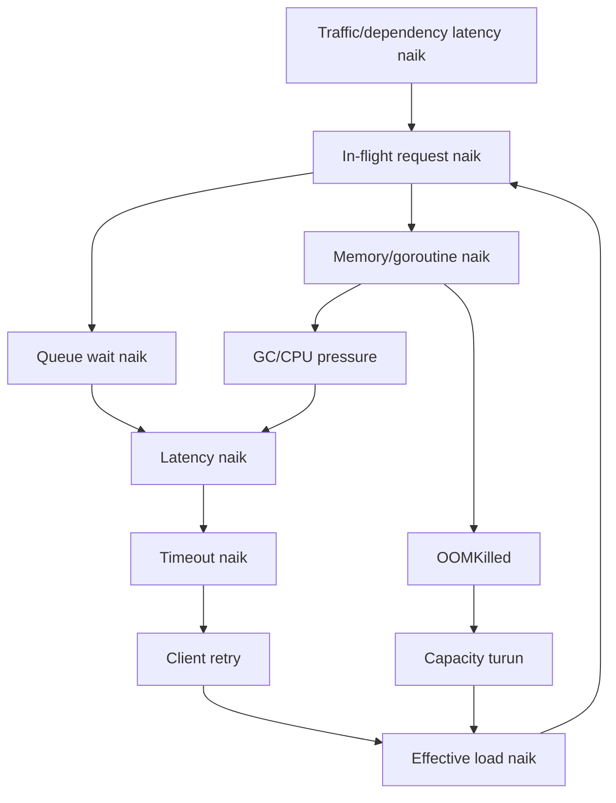
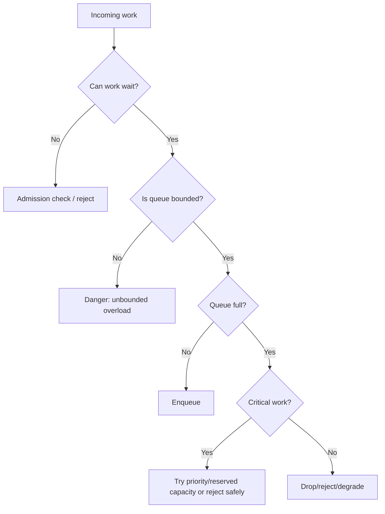
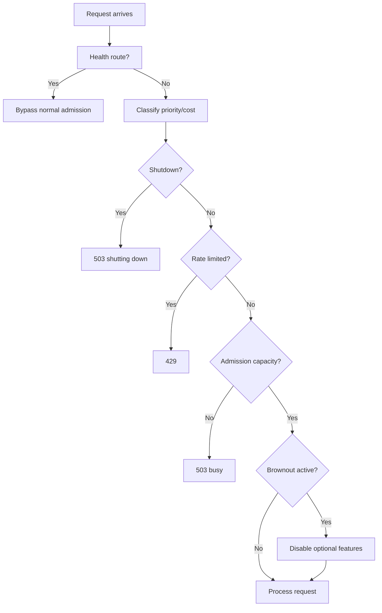
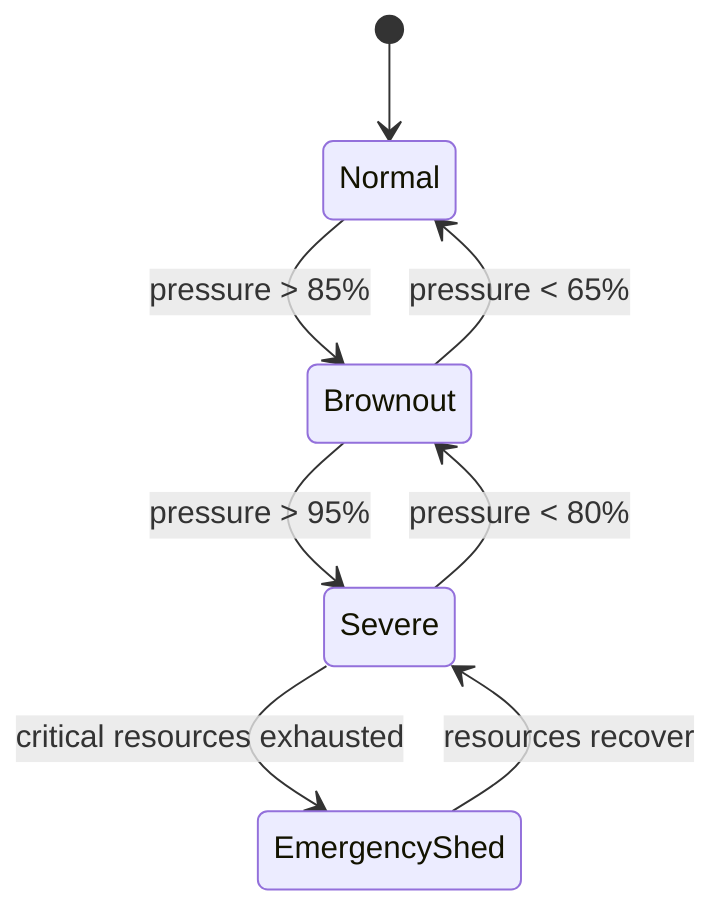
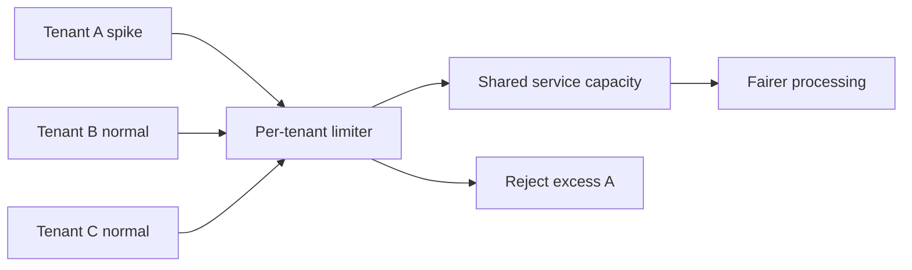

# learn-go-reliability-error-handling-part-024.md

# Overload Handling: Queueing, Admission Control, Priority, Fairness, Brownout

> Seri: `learn-go-reliability-error-handling`  
> Part: `024`  
> Target: Go 1.26.x  
> Level: Advanced / internal engineering handbook  
> Fokus: strategi menghadapi overload secara terkendali: queueing, admission control, priority, fairness, brownout, graceful degradation, rejection semantics, dan overload observability.

---

## 0. Posisi Materi Ini Dalam Seri

Pada `part-023`, kita membahas pola kontrol reliability:

- circuit breaker
- bulkhead
- rate limit
- load shedding
- backpressure
- retry budget
- queue limit
- fail open/fail closed

Bagian ini memperdalam satu tema besar: **overload handling**.

Overload bukan hanya “traffic terlalu banyak”. Overload terjadi ketika demand melebihi kapasitas efektif sistem.

Demand bisa berasal dari:

- user traffic naik
- client retry storm
- dependency lambat
- DB query melambat
- CPU throttling
- GC pressure
- queue backlog
- batch job terlalu agresif
- deployment mengurangi kapasitas sementara
- node/pod restart
- satu tenant mengirim spike
- downstream rate limit
- cache miss storm
- hot key
- report/export besar
- message redelivery
- scheduler overlap

Sistem reliable tidak selalu “menerima semua request”. Sistem reliable tahu kapan harus menolak, menunda, menurunkan kualitas, atau memprioritaskan.

---

## 1. Core Thesis

Overload handling adalah kemampuan service untuk:

1. mendeteksi overload,
2. membatasi work yang diterima,
3. menjaga latency tetap bounded,
4. melindungi resource kritikal,
5. memprioritaskan request penting,
6. menjaga fairness antar user/tenant,
7. menolak request secara cepat dan jelas,
8. menurunkan fitur non-kritikal,
9. mencegah retry storm,
10. memulihkan diri ketika load turun.

Prinsip utama:

> Under overload, controlled rejection is better than uncontrolled timeout.

Timeout adalah kegagalan mahal:

- request sudah mengonsumsi resource
- user menunggu lama
- client mungkin retry
- server tetap kerja walau caller sudah pergi
- queue makin panjang
- error muncul terlambat

Rejection cepat lebih murah:

- resource hemat
- client tahu harus retry nanti
- sistem tidak semakin dalam backlog
- core traffic bisa tetap hidup

---

## 2. Overload Failure Chain



Goal overload handling: cut this loop early.

---

## 3. Overload Signals

### 3.1 Direct Signals

- request rate > capacity
- in-flight request count high
- queue depth high
- queue wait high
- worker utilization high
- bulkhead full
- DB pool wait high
- CPU high/throttled
- memory high
- GC pause/CPU high
- goroutine count rising
- file descriptor count high
- retry budget exhausted

### 3.2 Symptom Signals

- p95/p99 latency high
- timeout rate high
- 5xx/503 high
- client cancel high
- liveness/readiness probe slow
- dependency timeout high
- message lag high
- HPA scaling lag
- OOMKilled/restarts

### 3.3 Downstream Signals

- 429
- 503
- Retry-After
- connection reset
- circuit open
- rate limit headers
- broker backpressure
- DB too many connections

---

## 4. Queueing Theory Intuition

When utilization approaches 100%, latency grows non-linearly.

Simplified intuition:

```text
arrival rate ~= service rate  → queue grows
queue grows                  → wait grows
wait grows                   → timeout grows
timeout grows                → retry grows
retry grows                  → arrival rate grows
```

A service at 90% average utilization may already have terrible tail latency if bursty.

Therefore:

- do not run latency-sensitive services at 100% utilization
- keep headroom
- bound queues
- shed load before saturation
- observe queue wait, not just queue depth
- limit concurrency

---

## 5. Queue: Buffer or Trap?

Queue can smooth bursts. Queue can also hide overload.

### 5.1 Queue Helps When

- bursts are short
- average service rate exceeds arrival rate
- work is bounded
- caller can wait
- memory is bounded
- order matters
- workers can catch up

### 5.2 Queue Hurts When

- arrival rate persistently exceeds service rate
- work expires while waiting
- queue is unbounded
- latency SLO matters
- clients timeout and retry while queued
- memory grows
- head-of-line blocking
- priority traffic stuck behind low-priority
- shutdown cannot drain

### 5.3 Queue Decision



---

## 6. Bounded Queue Pattern

```go
type Queue[T any] struct {
    ch chan T
}

var ErrQueueFull = errors.New("queue full")

func NewQueue[T any](capacity int) *Queue[T] {
    return &Queue[T]{ch: make(chan T, capacity)}
}

func (q *Queue[T]) TrySubmit(item T) error {
    select {
    case q.ch <- item:
        return nil
    default:
        return ErrQueueFull
    }
}

func (q *Queue[T]) Submit(ctx context.Context, item T) error {
    select {
    case q.ch <- item:
        return nil
    case <-ctx.Done():
        return context.Cause(ctx)
    }
}

func (q *Queue[T]) Len() int {
    return len(q.ch)
}

func (q *Queue[T]) Cap() int {
    return cap(q.ch)
}
```

For request path, prefer:

- `TrySubmit`
- or short timeout submit
- not unbounded block

---

## 7. Queue Wait Timeout

```go
func (q *Queue[T]) SubmitWithin(parent context.Context, item T, wait time.Duration) error {
    ctx, cancel := context.WithTimeout(parent, wait)
    defer cancel()

    select {
    case q.ch <- item:
        return nil
    case <-ctx.Done():
        if errors.Is(ctx.Err(), context.DeadlineExceeded) {
            return ErrQueueFull
        }
        return context.Cause(parent)
    }
}
```

Use when:

- brief wait can absorb microburst
- request SLO still protected
- queue full maps to overload response

Example:

```text
Endpoint timeout: 2s
Queue wait max: 25ms
```

Do not wait 2s just to enqueue.

---

## 8. Admission Control

Admission control decides whether to start work.

Goal:

> Reject before consuming expensive resources.

Admission should happen before:

- reading huge body
- expensive auth call if possible
- DB transaction
- external API call
- report generation
- enqueuing memory-heavy job

### 8.1 Simple In-flight Admission

```go
type InflightLimiter struct {
    current atomic.Int64
    max     int64
}

func (l *InflightLimiter) Allow() bool {
    n := l.current.Add(1)
    if n > l.max {
        l.current.Add(-1)
        return false
    }
    return true
}

func (l *InflightLimiter) Done() {
    l.current.Add(-1)
}
```

Middleware:

```go
func (l *InflightLimiter) Middleware(next http.Handler) http.Handler {
    return http.HandlerFunc(func(w http.ResponseWriter, r *http.Request) {
        if !l.Allow() {
            writeProblem(w, Problem{
                Status:  http.StatusServiceUnavailable,
                Code:    "SERVICE_BUSY",
                Title:   "Service busy",
                Message: "The service is currently busy. Please retry later.",
            })
            return
        }
        defer l.Done()

        next.ServeHTTP(w, r)
    })
}
```

### 8.2 Route-specific Admission

Global inflight can be unfair. Better:

```text
GET /cases/{id}: limit 500
POST /cases/{id}/submit: limit 100
POST /reports: limit 5
```

Expensive endpoints need lower concurrency.

---

## 9. Admission Control Must Not Break Health

Do not put liveness behind overload admission.

If liveness fails because admission full, Kubernetes may restart pod, reducing capacity further.

Pattern:

```text
/live and /ready bypass normal admission
business routes use admission
```

But readiness may intentionally return false if overload severe.

---

## 10. Load Shedding

Load shedding is intentional rejection of work.

Shedding can be based on:

- queue depth
- in-flight count
- latency
- CPU/memory
- dependency health
- priority
- tenant usage
- endpoint cost
- request deadline
- retry budget

### 10.1 Shedding Low-priority

```go
func (s *Shedder) ShouldShed(priority Priority) bool {
    pressure := s.Pressure()

    switch {
    case pressure >= 0.95:
        return priority > PriorityCritical
    case pressure >= 0.85:
        return priority > PriorityHigh
    case pressure >= 0.75:
        return priority > PriorityNormal
    default:
        return false
    }
}
```

### 10.2 Pressure Score

Pressure can be derived from:

```go
pressure := max(
    queueUtilization,
    inflightUtilization,
    dbPoolUtilization,
    cpuPressure,
    memoryPressure,
)
```

Keep it simple first. Complex pressure scores can be hard to debug.

---

## 11. Brownout

Brownout means temporarily disabling/degrading non-essential features under load.

Examples:

- skip optional enrichment
- disable recommendations
- reduce search result count
- turn off expensive sorting
- skip real-time count
- serve cached/stale data
- pause background exports
- reduce report concurrency
- disable preview thumbnails
- sample telemetry more aggressively

Brownout is different from outage:

```text
Core service remains available, non-critical features degrade.
```

### 11.1 Brownout Example

```go
func (s *CaseService) ListCases(ctx context.Context, req ListCasesRequest) (ListCasesResponse, error) {
    cases, err := s.repo.List(ctx, req.Filter)
    if err != nil {
        return ListCasesResponse{}, err
    }

    if s.brownout.Enabled("profile_enrichment") {
        return ListCasesResponse{
            Cases:    mapBaseCases(cases),
            Warnings: []string{"Profile enrichment temporarily disabled."},
        }, nil
    }

    enriched, err := s.enrichProfiles(ctx, cases)
    if err != nil {
        if s.policy.AllowEnrichmentDegradation(err) {
            return ListCasesResponse{
                Cases:    mapBaseCases(cases),
                Warnings: []string{"Profile enrichment unavailable."},
            }, nil
        }
        return ListCasesResponse{}, err
    }

    return ListCasesResponse{Cases: enriched}, nil
}
```

### 11.2 Brownout Must Be Safe

Do not brownout:

- authorization
- audit
- idempotency
- required validation
- transaction correctness
- legal decision rules

---

## 12. Priority

Not all work has equal value.

Priority classes:

```go
type Priority int

const (
    PriorityCritical Priority = iota
    PriorityHigh
    PriorityNormal
    PriorityLow
)
```

Examples:

| Priority | Examples |
|---|---|
| critical | health, auth callback, audit commit, core state transition |
| high | user submit/approve, payment-like operation |
| normal | normal reads/search |
| low | reports, exports, enrichment, analytics, cache warm |

### 12.1 Priority Admission

```go
type PriorityLimiter struct {
    critical *InflightLimiter
    high     *InflightLimiter
    normal   *InflightLimiter
    low      *InflightLimiter
}
```

But separate pools can underutilize capacity. Alternative: reserve capacity.

---

## 13. Reserved Capacity

Reserve capacity for critical traffic.

Example:

```text
max inflight = 100
normal can use up to 80
critical can use remaining 20 and also borrow normal if available
```

Simple implementation:

```go
type ReservedLimiter struct {
    total       atomic.Int64
    normal     atomic.Int64
    maxTotal   int64
    maxNormal  int64
}

func (l *ReservedLimiter) Allow(priority Priority) bool {
    total := l.total.Add(1)
    if total > l.maxTotal {
        l.total.Add(-1)
        return false
    }

    if priority > PriorityHigh {
        normal := l.normal.Add(1)
        if normal > l.maxNormal {
            l.normal.Add(-1)
            l.total.Add(-1)
            return false
        }
    }

    return true
}

func (l *ReservedLimiter) Done(priority Priority) {
    if priority > PriorityHigh {
        l.normal.Add(-1)
    }
    l.total.Add(-1)
}
```

This preserves capacity for high/critical traffic.

---

## 14. Fairness

Without fairness, one tenant/user can consume all capacity.

Fairness goals:

- prevent noisy neighbor
- protect small tenants
- enforce quota
- preserve critical operations
- avoid starvation

Fairness strategies:

- per-tenant rate limit
- per-tenant concurrency limit
- weighted fair queue
- separate queues
- token bucket per tenant
- max jobs per tenant
- priority + tenant fairness
- quota enforcement at gateway and app

### 14.1 Per-tenant Concurrency Limit

```go
type TenantLimiters struct {
    mu       sync.Mutex
    limiters map[string]*InflightLimiter
    max      int64
}

func (t *TenantLimiters) Get(tenantID string) *InflightLimiter {
    t.mu.Lock()
    defer t.mu.Unlock()

    l := t.limiters[tenantID]
    if l == nil {
        l = &InflightLimiter{max: t.max}
        t.limiters[tenantID] = l
    }
    return l
}
```

Production concerns:

- limiter map eviction
- tenant ID cardinality
- distributed multi-pod fairness
- spoofing/auth
- burst handling
- high-priority tenant tiers

---

## 15. Weighted Fairness

Some tenants may have paid/critical tiers.

```text
tenant A weight 10
tenant B weight 1
```

Weighted fair queueing is more complex. Simpler:

- different rate limits by tier
- different concurrency limit by tier
- reserved capacity for critical tenants
- separate worker pools for critical tenants

Avoid overengineering before evidence.

---

## 16. Deadline-aware Admission

If request deadline has too little time left, reject early.

```go
func RequireMinBudget(ctx context.Context, min time.Duration) error {
    deadline, ok := ctx.Deadline()
    if !ok {
        return nil
    }

    if time.Until(deadline) < min {
        return ErrInsufficientBudget
    }

    return nil
}
```

Use before expensive work:

```go
if err := RequireMinBudget(ctx, 500*time.Millisecond); err != nil {
    return ErrServiceBusy
}
```

This prevents starting work that cannot finish.

---

## 17. Cost-aware Admission

Some requests are more expensive.

Examples:

- search with broad filter
- report export
- large upload
- batch import
- expensive sort
- large page size
- regex query
- full-text search
- external API fan-out

Assign cost.

```go
func EstimateCost(req SearchRequest) int {
    cost := 1

    if req.PageSize > 100 {
        cost += 2
    }
    if req.SortBy == "complex" {
        cost += 3
    }
    if req.Filter.IsBroad() {
        cost += 5
    }

    return cost
}
```

Weighted admission:

```go
if !budget.TryAcquire(cost) {
    return ErrServiceBusy
}
defer budget.Release(cost)
```

---

## 18. Large Request Body Overload

A single large body can consume memory/CPU.

Controls:

- `MaxBytesReader`
- content length check
- streaming parser
- upload direct to object storage
- async processing
- per-route body limit
- decompression limit
- reject unsupported compression
- request timeout
- per-tenant upload quota

Do not read unbounded body:

```go
body, _ := io.ReadAll(r.Body) // dangerous
```

---

## 19. Response Size Overload

Large responses can overload memory/network.

Controls:

- pagination
- max page size
- streaming with backpressure
- async export
- compression limits
- query limit
- cursor-based pagination
- response timeout
- client cancellation handling

Do not build huge response in memory if it can be streamed or paginated.

---

## 20. Database Overload

Signals:

- pool wait duration high
- max open conns reached
- query latency high
- deadlocks/lock waits
- DB CPU high
- DB connection errors
- slow queries

Controls:

- DB bulkhead/pool size
- per-route DB admission
- query timeout
- read-only degradation
- disable expensive reports
- cache hot reads
- pagination
- index optimization
- shed broad search
- pause background jobs
- avoid retrying DB overload

### 20.1 DB Pool Wait as Admission Signal

If DB pool wait high, reject expensive requests before starting transaction.

---

## 21. Worker Overload

Signals:

- queue depth high
- job age high
- worker utilization high
- retry count high
- DLQ count high
- processing latency high
- visibility timeout extensions high

Controls:

- pause intake
- scale workers
- reduce batch size
- prioritize jobs
- DLQ poison
- checkpoint long jobs
- shed low-priority jobs
- backpressure producers
- per-tenant job limits

---

## 22. Message Broker Backpressure

If broker lag grows:

- consumers too slow
- downstream dependency slow
- poison messages
- insufficient partitions/consumers
- DB bottleneck
- message size too large

Do not blindly increase consumer concurrency if DB is bottleneck.

Analyze bottleneck.

Backpressure options:

- pause consumption
- reduce prefetch
- limit in-flight messages
- nack/requeue carefully
- DLQ poison
- scale consumers if downstream capacity exists
- shed producers if possible

---

## 23. Brownout Control Plane

Brownout can be controlled by config/feature flag.

```yaml
brownout:
  profile_enrichment: auto
  recommendations: disabled
  report_exports: limited
```

Automatic brownout:

```go
if pressure > 0.85 {
    brownout.Enable("profile_enrichment")
}
if pressure < 0.60 {
    brownout.Disable("profile_enrichment")
}
```

Use hysteresis to avoid flapping.

Manual brownout useful during incidents.

---

## 24. Hysteresis

Avoid rapid on/off oscillation.

```text
enable shedding at pressure > 0.85
disable shedding at pressure < 0.65
```

```go
func (b *Brownout) Update(pressure float64) {
    if !b.enabled && pressure > 0.85 {
        b.enabled = true
    }
    if b.enabled && pressure < 0.65 {
        b.enabled = false
    }
}
```

---

## 25. Retry-After

When rejecting due to overload, optional:

```http
Retry-After: 1
```

Use for:

- 429 rate limit
- 503 temporary overload
- shutdown gate

Be conservative. If all clients retry exactly after 1 second, can create spike. Clients should jitter; server can return approximate.

---

## 26. Client Cancellation as Overload Relief

If client disconnects, stop work.

Request context:

```go
select {
case <-ctx.Done():
    return context.Cause(ctx)
default:
}
```

For DB/HTTP calls, pass ctx.

Do not keep processing expensive work for canceled caller unless operation must continue and is moved to durable async workflow.

---

## 27. Overload-safe API Design

For expensive operations:

Instead of synchronous:

```http
POST /reports/generate
```

returning after 2 minutes, use:

```http
POST /reports
202 Accepted
{
  "job_id": "..."
}
```

Then:

```http
GET /reports/{job_id}
```

Benefits:

- request path short
- job can be queued durably
- retry/idempotency easier
- shutdown manageable
- progress visible
- overload can reject before accepting job

---

## 28. Accepting Async Work Correctly

If returning `202 Accepted`, ensure work is durably accepted.

Bad:

```go
queue <- job
w.WriteHeader(202)
```

If process crashes, job lost.

Better:

```go
tx:
  insert job row
  insert outbox/notification
commit
return 202 job_id
```

In-memory queue can wake worker, but DB is source of truth.

---

## 29. Overload Response Contract

Stable problem response:

```json
{
  "code": "SERVICE_BUSY",
  "message": "The service is currently busy. Please retry later.",
  "correlation_id": "..."
}
```

For rate limit:

```json
{
  "code": "RATE_LIMITED",
  "message": "Too many requests. Please retry later."
}
```

For low priority brownout:

```json
{
  "code": "FEATURE_TEMPORARILY_UNAVAILABLE",
  "message": "This feature is temporarily unavailable."
}
```

Do not expose:

```text
worker queue len 999, db pool wait 1.2s
```

in public response.

---

## 30. Overload and Readiness

Should readiness fail under overload?

It depends.

If overload is instance-local and routing away helps:

```text
readiness false may help
```

If all pods are overloaded due global dependency outage:

```text
all pods not ready may remove all endpoints
```

Often better:

- keep readiness true
- return controlled 503 for overload
- autoscale if possible
- shed low-priority
- fail readiness only when instance cannot serve useful traffic

Readiness is traffic routing signal, not generic alarm.

---

## 31. Overload and Autoscaling

Autoscaling can help but is delayed.

Problems:

- scale-up takes time
- startup probe/readiness delay
- cold caches
- DB capacity unchanged
- downstream dependency unchanged
- HPA based on CPU may miss IO bottleneck
- queue-based scaling may lag
- scaling workers may overload DB

Do not rely only on HPA. Use admission/load shedding.

---

## 32. Overload and Kubernetes Resource Limits

CPU throttling can look like overload.

Memory pressure can cause OOMKilled.

If overload causes OOMKilled, capacity drops, overload worsens.

Controls:

- memory limits with headroom
- GOMEMLIMIT
- bounded queues
- no unbounded goroutines
- shed before memory exhaustion
- monitor queue/goroutine/memory
- avoid huge buffers

---

## 33. Observability

Metrics:

```text
overload_rejections_total{route,reason,priority}
admission_rejected_total{route,limiter}
queue_depth{queue}
queue_wait_duration_seconds{queue}
queue_dropped_total{queue,policy}
brownout_enabled{feature}
brownout_requests_total{feature}
priority_requests_total{priority,result}
tenant_rate_limited_total{tenant_tier}
inflight_requests{route}
request_deadline_insufficient_total{route}
```

Low-cardinality labels:

- route pattern
- reason enum
- priority enum
- tenant tier, not tenant ID unless controlled

Logs:

```go
logger.WarnContext(ctx, "request rejected due to overload",
    "route", route,
    "reason", "queue_full",
    "priority", priority,
    "queue_depth", depth,
)
```

Use sampling under high volume.

---

## 34. Alerts

Page when:

- user-visible SLO burn
- sustained overload rejection for critical traffic
- queue depth near capacity for sustained time
- job age exceeds threshold
- DB pool wait high
- OOMKilled/restarts
- brownout active too long
- all capacity protections exhausted

Do not page for short controlled shedding if SLO unaffected.

---

## 35. Testing Overload Handling

### 35.1 Admission Rejects

```go
func TestAdmissionRejectsAboveLimit(t *testing.T) {
    l := &InflightLimiter{max: 1}

    if !l.Allow() {
        t.Fatal("first should pass")
    }
    defer l.Done()

    if l.Allow() {
        t.Fatal("second should reject")
    }
}
```

### 35.2 Queue Full

```go
func TestQueueFull(t *testing.T) {
    q := NewQueue[Job](1)

    if err := q.TrySubmit(Job{}); err != nil {
        t.Fatal(err)
    }

    if err := q.TrySubmit(Job{}); !errors.Is(err, ErrQueueFull) {
        t.Fatalf("expected queue full, got %v", err)
    }
}
```

### 35.3 Brownout

```go
func TestBrownoutSkipsEnrichment(t *testing.T) {
    svc.brownout.Enable("profile_enrichment")

    resp, err := svc.ListCases(ctx, req)
    if err != nil {
        t.Fatal(err)
    }

    if len(resp.Warnings) == 0 {
        t.Fatal("expected brownout warning")
    }
}
```

### 35.4 Priority

Test low priority rejected while high priority accepted under reserved capacity.

---

## 36. Load Testing

Simulate:

- steady load below capacity
- burst above capacity
- dependency slow
- DB pool saturation
- cache miss storm
- large payloads
- mixed priority traffic
- one noisy tenant
- rolling restart during load

Observe:

- controlled rejection
- latency bounded
- no OOM
- no goroutine explosion
- critical traffic preserved
- recovery after load drops
- retry volume controlled

---

## 37. Chaos / Fault Injection

Inject:

- dependency latency + high traffic
- queue consumer paused
- DB pool maxed
- CPU throttling
- memory pressure
- cache down causing DB fallback
- one tenant sends 10x traffic
- report generation spike
- retry storm clients

Validate:

- brownout activates
- rate limit works
- queue rejects
- low priority shed
- high priority still served
- metrics and alerts fire
- no uncontrolled crash

---

## 38. Anti-patterns

### 38.1 Infinite Queue

Memory grows until OOM.

### 38.2 Accept Work You Cannot Complete

Returning 202 before durable job stored.

### 38.3 Timeout as Primary Overload Control

Too late and expensive.

### 38.4 All Traffic Equal

Low-value traffic can kill critical path.

### 38.5 Readiness False for Global Overload Without Plan

May remove all endpoints.

### 38.6 Load Shedding Without Metrics

Looks like random failures.

### 38.7 Brownout of Correctness Features

Skipping auth/audit/validation is not brownout; it is corruption/security risk.

### 38.8 Per-tenant Limit With Unbounded Map

Memory leak via tenant IDs.

### 38.9 Queue Depth Only, No Job Age

Queue depth can be stable while jobs are too old.

### 38.10 HPA as Only Overload Strategy

Scale-up delayed; downstream may not scale.

### 38.11 Blocking Submit Without Context

Goroutine leak / stuck request.

### 38.12 500 for Overload

Misleading; use 429/503.

---

## 39. Production Checklist

### 39.1 Admission

- [ ] global/route-specific in-flight limits
- [ ] expensive endpoints limited
- [ ] health routes protected
- [ ] admission before expensive work
- [ ] deadline budget checked
- [ ] rejection response stable

### 39.2 Queue

- [ ] bounded queue
- [ ] queue full policy
- [ ] queue depth metric
- [ ] queue wait metric
- [ ] job age metric
- [ ] drain/drop/requeue policy
- [ ] no critical in-memory-only work

### 39.3 Priority/Fairness

- [ ] priority classes defined
- [ ] low-priority shed first
- [ ] critical capacity reserved
- [ ] per-tenant noisy neighbor control
- [ ] dynamic key maps bounded
- [ ] fairness tested under load

### 39.4 Brownout

- [ ] optional features identified
- [ ] correctness features excluded
- [ ] manual/auto controls
- [ ] hysteresis/cooldown
- [ ] user-visible warning if needed
- [ ] brownout metrics/alerts

### 39.5 Autoscaling/Platform

- [ ] HPA metric appropriate
- [ ] min replicas sufficient
- [ ] resource limits sized
- [ ] CPU throttling monitored
- [ ] OOM alerts
- [ ] rollout tested under load

### 39.6 Observability

- [ ] overload reason labels
- [ ] rejection metrics
- [ ] queue metrics
- [ ] priority metrics
- [ ] brownout metrics
- [ ] dashboard correlates load/latency/rejection/resource

---

## 40. Mermaid: Overload Control Flow



---

## 41. Mermaid: Brownout State



---

## 42. Mermaid: Fairness



---

## 43. Regulatory Case Management Lens

For regulatory/case-management:

### 43.1 Critical

- authentication/authorization
- submit/approve/reject
- audit write
- idempotency record
- outbox insert
- case retrieval for officer work

### 43.2 Degradable

- profile enrichment in listing
- dashboard counts
- analytics
- report generation
- export
- non-critical notifications
- recommendation/suggestion
- preview rendering

### 43.3 Overload Policy

Under overload:

1. keep auth/audit/idempotency strict
2. preserve core case transitions
3. reject report/export first
4. degrade list enrichment
5. limit broad searches
6. use async jobs for expensive work
7. return stable 503/429 for overload
8. never silently skip audit
9. never accept submit if idempotency store unavailable
10. use tenant fairness to avoid noisy agency/user

---

## 44. Java Engineer Translation Layer

### 44.1 Servlet Thread Pool Saturation

Java app servers often have thread pools and request queues. Go has goroutines, but you still need admission limits because goroutines can grow until memory/DB/dependency saturates.

### 44.2 Executor Queue

Java `ThreadPoolExecutor` has bounded queue and rejection policy. Go needs explicit channel/worker/admission design.

### 44.3 Resilience4j Bulkhead/RateLimiter

Go equivalent:

- semaphore/channel for bulkhead
- `x/time/rate` for token bucket
- middleware for admission
- custom priority/fairness logic

### 44.4 Brownout

Similar to feature flag controlled degradation in Java/Spring, but in Go you wire this explicitly.

---

## 45. Key Takeaways

1. Controlled rejection is better than uncontrolled timeout.
2. Queueing can smooth bursts but can also hide overload.
3. Every queue must be bounded and have full policy.
4. Admission control should happen before expensive work.
5. Health endpoints must not be broken by normal admission limits.
6. Load shedding preserves system health by rejecting work.
7. Brownout disables non-critical features under pressure.
8. Never brownout correctness/security/audit/idempotency.
9. Priority protects critical traffic.
10. Fairness prevents noisy-neighbor tenants/users.
11. Deadline-aware admission avoids starting impossible work.
12. Cost-aware admission protects against expensive requests.
13. Async `202 Accepted` must mean work durably accepted.
14. Readiness is routing signal, not generic overload alarm.
15. HPA is not a substitute for overload handling.
16. Resource limits interact with overload through CPU throttling/OOM.
17. Observability must explain why work was rejected.
18. Use hysteresis to avoid brownout/shedding oscillation.
19. Test overload under realistic mixed traffic.
20. Production reliability means failing predictably when capacity is exceeded.

---

## 46. References

- Google SRE Book: Handling Overload
- Google SRE Book: Addressing Cascading Failures
- AWS Builders Library: timeout, retry, overload, and backoff practices
- Go package documentation: `context`
- Go package documentation: `net/http`
- Go package documentation: `sync/atomic`
- `golang.org/x/time/rate`
- Kubernetes documentation: resource management and probes

---

## 47. Next Part

Next:

```text
learn-go-reliability-error-handling-part-025.md
```

Topic:

```text
Observability for Errors: Logs, Metrics, Traces, Correlation, Error Budgets
```

<!-- NAVIGATION_FOOTER -->
<div class="page-nav">
<a href="./learn-go-reliability-error-handling-part-023.md">⬅️ Circuit Breaker, Bulkhead, Rate Limit, Load Shedding, Backpressure</a>
<a href="./index.md">📚 Kategori</a>
<a href="../../index.md">🏠 Home</a>
<a href="./learn-go-reliability-error-handling-part-025.md">Observability for Errors: Logs, Metrics, Traces, Correlation, Error Budgets ➡️</a>
</div>
