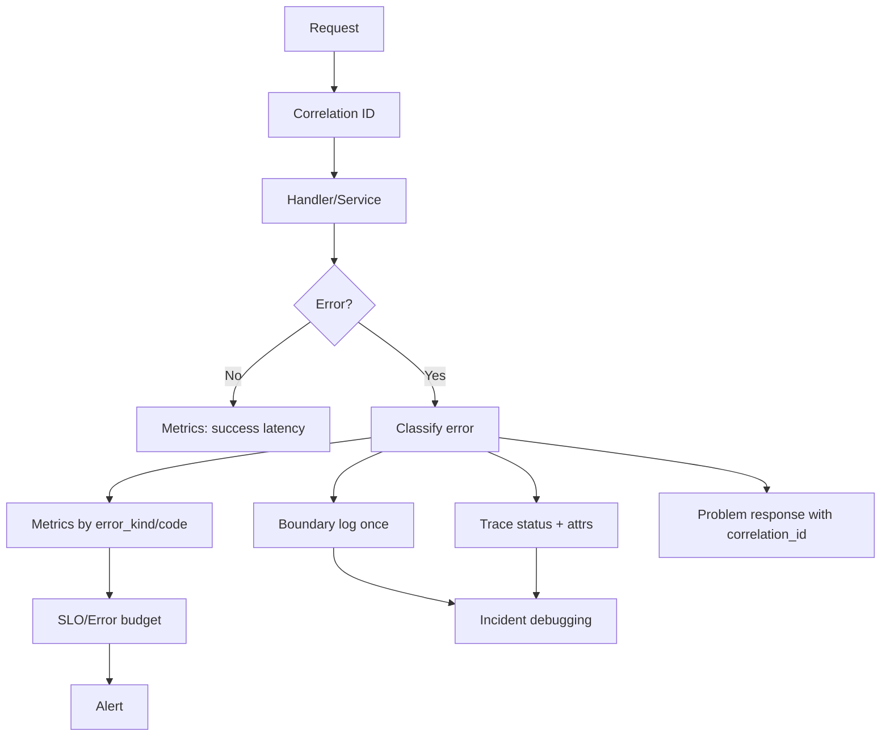
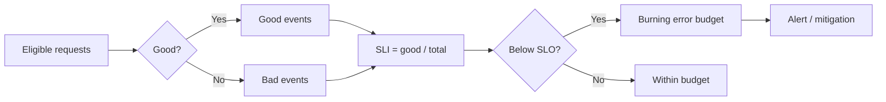
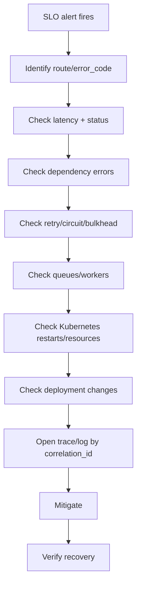

# learn-go-reliability-error-handling-part-025.md

# Observability for Errors: Logs, Metrics, Traces, Correlation, Error Budgets

> Seri: `learn-go-reliability-error-handling`  
> Part: `025`  
> Target: Go 1.26.x  
> Level: Advanced / internal engineering handbook  
> Fokus: observability untuk error dan reliability: structured logging, metrics, tracing, correlation ID, error taxonomy, cardinality control, SLO/error budget, alerting, dashboards, dan incident debugging.

---

## 0. Posisi Materi Ini Dalam Seri

Sampai bagian ini, kita sudah membahas banyak mekanisme reliability:

- error model
- wrapping
- validation/domain/dependency error
- panic/recover
- context propagation
- timeout
- retry
- idempotency
- concurrency failure
- HTTP boundary
- graceful shutdown
- Kubernetes/container behavior
- dependency failure
- circuit breaker/bulkhead/rate limit/load shedding
- overload handling

Sekarang pertanyaan berikutnya:

> Bagaimana kita tahu semua itu bekerja di production?

Tanpa observability:

- error terjadi tapi tidak terlihat
- retry diam-diam menyembunyikan dependency outage
- timeout naik tapi tidak tahu dependency mana
- 500 spike tapi root cause tidak jelas
- latency p99 memburuk tapi average normal
- log terlalu banyak tapi tidak menjawab apa-apa
- metric cardinality meledak
- trace tidak punya correlation ID
- panic direcover tapi tidak ada stack
- client cancel dihitung sebagai server failure
- overload rejection dianggap bug
- SLO burn tidak diketahui sampai user complain

Observability adalah feedback loop untuk reliability engineering.

---

## 1. Core Thesis

Error handling tanpa observability hanyalah local control flow.

Reliability production membutuhkan:

1. **Logs** untuk event naratif/debug detail.
2. **Metrics** untuk agregasi, alert, trend, SLO.
3. **Traces** untuk path request lintas komponen.
4. **Correlation ID** untuk menghubungkan semua sinyal.
5. **Error taxonomy** supaya error bisa dihitung dengan benar.
6. **SLO/error budget** supaya alert berbasis dampak user.
7. **Dashboards** untuk melihat sistem sebagai keseluruhan.
8. **Runbook evidence** untuk incident response.
9. **Cardinality discipline** supaya observability tidak menjadi outage baru.

Prinsip utama:

> Every important failure mode must be visible, classifiable, correlated, and actionable.

---

## 2. Three Pillars Are Not Enough Without Semantics

Logs, metrics, traces sering disebut “three pillars”. Namun pillar saja tidak cukup.

Bad observability:

```text
log: error happened
metric: errors_total++
trace: span status error
```

Good observability:

```text
operation=submit_case
error_kind=dependency_timeout
dependency=profile
retry_attempt=2
idempotency_replayed=false
http_status=504
correlation_id=req-abc
tenant_tier=standard
slo_class=critical_write
```

Observability harus membawa **semantic context**.

---

## 3. Error Observability Goals

Observability untuk error harus bisa menjawab:

### 3.1 User Impact

- Berapa request gagal?
- Endpoint mana?
- Status code apa?
- Error code apa?
- Tenant/user segment mana?
- Apakah SLO terbakar?

### 3.2 Root Cause

- Dependency mana gagal?
- Timeout fase apa?
- DB pool penuh?
- Circuit breaker open?
- Retry exhausted?
- Queue full?
- Panic?
- Deployment baru?
- Kubernetes OOMKilled?
- CPU throttling?

### 3.3 Blast Radius

- Semua pod atau satu pod?
- Semua tenant atau satu tenant?
- Semua endpoint atau satu endpoint?
- Semua dependency atau satu dependency?
- Semua region/zone atau satu?

### 3.4 Recovery

- Error rate turun?
- Latency kembali normal?
- Circuit half-open/closed?
- Queue backlog berkurang?
- Retry volume normal?
- Readiness kembali true?

---

## 4. Error Taxonomy for Observability

Gunakan error kind yang stabil.

```go
type ErrorKind string

const (
    ErrorKindValidation       ErrorKind = "validation"
    ErrorKindAuthentication   ErrorKind = "authentication"
    ErrorKindAuthorization    ErrorKind = "authorization"
    ErrorKindNotFound         ErrorKind = "not_found"
    ErrorKindConflict         ErrorKind = "conflict"
    ErrorKindDomain           ErrorKind = "domain"
    ErrorKindDependency       ErrorKind = "dependency"
    ErrorKindTimeout          ErrorKind = "timeout"
    ErrorKindCanceled         ErrorKind = "canceled"
    ErrorKindOverload         ErrorKind = "overload"
    ErrorKindRateLimited      ErrorKind = "rate_limited"
    ErrorKindPanic            ErrorKind = "panic"
    ErrorKindInternal         ErrorKind = "internal"
)
```

Error kind berbeda dari raw error message.

Raw error:

```text
dial tcp 10.0.12.5:5432: i/o timeout
```

Error kind:

```text
dependency_timeout
```

Metrics should use error kind, not raw message.

---

## 5. Structured Logging

Use structured logs.

Bad:

```go
log.Printf("failed to submit case: %v", err)
```

Better:

```go
logger.ErrorContext(ctx, "submit case failed",
    "operation", "submit_case",
    "case_id", safeCaseID(caseID),
    "error_kind", kind,
    "error_code", code,
    "correlation_id", correlationID,
    "error", err,
)
```

Structured logs allow querying:

```text
operation=submit_case AND error_kind=dependency_timeout
```

### 5.1 `slog`

Go standard library includes `log/slog`.

Example:

```go
logger := slog.New(slog.NewJSONHandler(os.Stdout, &slog.HandlerOptions{
    Level: slog.LevelInfo,
}))
```

Use:

```go
logger.InfoContext(ctx, "request completed",
    "method", r.Method,
    "route", route,
    "status", status,
    "duration_ms", duration.Milliseconds(),
)
```

---

## 6. What to Log

Log:

- request completion summary
- unexpected internal errors
- dependency failures after classification
- panic with stack
- retry exhausted
- circuit open/close transition
- load shedding activation
- shutdown phases
- config/startup validation
- idempotency conflict
- audit integrity conflict
- background worker fatal error
- message moved to DLQ
- reconciliation mismatch

Do not log every normal validation error at error level. It may be user input.

### 6.1 Log Levels

| Level | Use |
|---|---|
| debug | detailed internal attempt info, disabled normally |
| info | normal lifecycle/request summary |
| warn | controlled degradation/retry exhausted/overload |
| error | unexpected failure/action needed |
| critical/fatal | process cannot continue, if logging lib supports |

Example classification:

| Event | Level |
|---|---|
| 400 validation | info/debug aggregate metric |
| 401 invalid token | info/debug, maybe security metric |
| 403 forbidden | info/security metric |
| 404 not found | info/debug |
| dependency timeout causing 504 | warn/error depending rate |
| panic recovered | error |
| audit write failed | error |
| load shed low-priority | warn sampled + metric |
| client canceled | debug/info, not error |
| graceful shutdown started | info |
| OOMKilled | platform event, alert |

---

## 7. Log Once at Boundary

Anti-pattern:

```text
repo logs error
service logs same error
handler logs same error
middleware logs same error
```

This creates noise.

Preferred:

- lower layers wrap error with context
- boundary logs once with full chain and classification
- lower layers may log only unusual local recovery/fallback events

Example:

```go
// repository
return fmt.Errorf("query case by id: %w", err)

// service
return fmt.Errorf("load submit case inputs: %w", err)

// HTTP boundary
logger.ErrorContext(ctx, "request failed", "error", err, ...)
```

Exception:

- security audit
- retry debug traces
- background component without upper boundary
- local fallback event that does not return error

---

## 8. Error Chain Logging

With wrapping:

```go
err := fmt.Errorf("submit case: %w", depErr)
```

Log full error once:

```go
logger.ErrorContext(ctx, "operation failed", "error", err)
```

For structured details, classify with `errors.As`.

```go
var dep *DependencyError
if errors.As(err, &dep) {
    attrs = append(attrs,
        slog.String("dependency", dep.Dependency),
        slog.String("dependency_operation", dep.Operation),
        slog.String("dependency_error_kind", string(dep.Kind)),
    )
}
```

### 8.1 Avoid String Parsing

Bad:

```go
if strings.Contains(err.Error(), "timeout") { ... }
```

Good:

```go
errors.Is(err, context.DeadlineExceeded)
errors.As(err, &depErr)
```

---

## 9. Sensitive Data in Logs

Never log:

- password
- token
- API key
- session ID
- raw authorization header
- private key
- secret config
- full NRIC/NIK/passport
- raw PII
- raw idempotency key if replay-sensitive
- full request body if contains personal data
- full SQL with sensitive parameters

Use:

- hashing
- redaction
- stable opaque IDs
- correlation ID
- tenant tier not tenant name if sensitive
- field-level allowlist

Example:

```go
logger.InfoContext(ctx, "idempotency replay",
    "key_hash", sha256Short(idempotencyKey),
)
```

---

## 10. Correlation ID

Correlation ID connects logs, metrics exemplars, traces, and client reports.

Sources:

- incoming `X-Request-ID`
- generated if missing
- W3C `traceparent`
- internal operation ID
- idempotency key hash
- message ID
- job ID

### 10.1 Request ID Middleware

```go
type ctxKeyRequestID struct{}

func RequestID(next http.Handler) http.Handler {
    return http.HandlerFunc(func(w http.ResponseWriter, r *http.Request) {
        id := r.Header.Get("X-Request-ID")
        if !validRequestID(id) {
            id = newRequestID()
        }

        w.Header().Set("X-Request-ID", id)

        ctx := context.WithValue(r.Context(), ctxKeyRequestID{}, id)
        next.ServeHTTP(w, r.WithContext(ctx))
    })
}

func RequestIDFromContext(ctx context.Context) string {
    v, _ := ctx.Value(ctxKeyRequestID{}).(string)
    return v
}
```

### 10.2 Validation

Do not accept arbitrary huge header.

```go
func validRequestID(id string) bool {
    if len(id) < 8 || len(id) > 128 {
        return false
    }
    for _, r := range id {
        if !(r == '-' || r == '_' || r == '.' ||
            r >= '0' && r <= '9' ||
            r >= 'a' && r <= 'z' ||
            r >= 'A' && r <= 'Z') {
            return false
        }
    }
    return true
}
```

---

## 11. Operation ID

Correlation ID tracks request. Operation ID tracks business operation.

Example:

```text
correlation_id=req-123
operation_id=submit-case-abc
idempotency_key_hash=...
```

If client retries same operation:

- new request/correlation ID may differ
- operation ID should stay same

Use operation ID in:

- audit event
- outbox event
- idempotency record
- logs
- traces
- reconciliation

---

## 12. Metrics

Metrics answer aggregate questions.

Essential HTTP metrics:

```text
http_requests_total{method,route,status_code,error_code}
http_request_duration_seconds{method,route}
http_inflight_requests{route}
http_request_body_bytes{route}
http_response_bytes{route}
```

Error metrics:

```text
errors_total{operation,error_kind,error_code}
panics_total{component}
validation_errors_total{operation,field_code}
dependency_errors_total{dependency,operation,kind}
timeouts_total{operation,kind}
client_canceled_total{route}
```

Reliability control metrics:

```text
retry_attempts_total{dependency,operation,reason}
retry_exhausted_total{dependency,operation}
circuit_state{dependency,operation}
circuit_rejected_total{dependency,operation}
bulkhead_rejected_total{dependency,operation}
rate_limited_total{scope,operation}
load_shed_total{reason,priority}
queue_depth{queue}
queue_wait_duration_seconds{queue}
```

Shutdown/Kubernetes:

```text
shutdown_phase_duration_seconds{phase}
readiness_state
worker_active_jobs{worker}
message_redelivery_total{consumer}
outbox_pending_events
```

---

## 13. Metric Cardinality

Cardinality is number of unique label combinations.

Bad labels:

- user ID
- request ID
- raw URL path with IDs
- error message
- SQL text
- idempotency key
- message ID
- stack trace
- timestamp
- tenant ID if many and unbounded
- arbitrary header

Good labels:

- route pattern
- error kind
- public error code
- dependency name
- operation name
- status class
- priority enum
- tenant tier
- region/zone
- component

Bad:

```text
http_requests_total{path="/cases/CASE-123/submissions/ABC"}
```

Good:

```text
http_requests_total{route="/cases/{case_id}/submissions/{submission_id}"}
```

### 13.1 Cardinality Can Cause Outage

High-cardinality metrics can:

- overload metrics backend
- increase memory in app exporter
- slow dashboards
- increase cost
- drop critical telemetry

Cardinality discipline is reliability work.

---

## 14. RED and USE

### 14.1 RED for Request-driven Services

- Rate
- Errors
- Duration

For HTTP API:

```text
request rate
error rate
latency distribution
```

### 14.2 USE for Resources

- Utilization
- Saturation
- Errors

For DB pool:

```text
in_use/max_open
wait_count/wait_duration
connection errors
```

For worker queue:

```text
queue depth/capacity
worker utilization
job errors
```

Use both.

---

## 15. Histograms and Percentiles

Average latency is misleading.

Track:

- p50
- p90
- p95
- p99
- max maybe

But percentiles from client/server need careful implementation.

Histograms are common:

```text
http_request_duration_seconds_bucket
```

Choose buckets around SLO.

If SLO is 300ms, buckets:

```text
50ms, 100ms, 200ms, 300ms, 500ms, 1s, 2s
```

Not only:

```text
1s, 5s, 10s
```

---

## 16. Tracing

Tracing answers:

```text
Where did request spend time?
```

Trace should include spans for:

- HTTP server request
- middleware important events
- service operation
- DB query
- external HTTP/gRPC call
- cache call
- message publish
- retry attempts
- queue wait
- outbox publish
- worker job

### 16.1 Span Attributes

Useful:

```text
operation.name
http.route
http.method
http.status_code
error.kind
error.code
dependency.name
dependency.operation
retry.attempt
idempotency.replayed
queue.name
queue.wait_ms
```

Avoid:

- PII
- full SQL parameters
- raw request body
- high-cardinality IDs unless trace-only and controlled

### 16.2 Trace Status

Set error status for unexpected/internal/dependency failures.

For validation 400, depending convention, it may be not a system error but still HTTP error. Be consistent.

---

## 17. Logs vs Metrics vs Traces

| Signal | Best for |
|---|---|
| logs | detailed event/context |
| metrics | alert/trend/SLO |
| traces | request path latency/correlation |

Do not use logs as primary alert source for high-volume APIs if metrics are available.

Do not use metrics to store per-request details.

Do not use traces as only source of aggregate error rate.

---

## 18. Error Budget and SLO

SLO example:

```text
99.9% of submit_case requests succeed within 2s over 30 days.
```

Error budget:

```text
0.1% allowed failure/slow requests
```

Error budget is not just 500 errors. It includes user-impacting failures:

- 5xx
- 503 overload
- timeout
- maybe 429 if not expected quota behavior
- latency above SLO
- failed dependency response
- incorrect response? harder but important

Usually exclude:

- 400 validation
- 401 unauthenticated
- 403 forbidden
- 404 user-requested missing resource
- client canceled, maybe
- controlled test traffic

But define carefully.

---

## 19. Availability SLI

For request success:

```text
good events / total eligible events
```

Good:

```text
2xx/3xx maybe expected 4xx? depends API
```

Bad:

```text
5xx
timeout
dependency failure
overload reject
```

For domain API, `409 Conflict` may be successful business response if expected. Do not count all non-2xx as failure blindly.

Example:

```text
submit_case good:
  HTTP 200 replay/success
  HTTP 409 invalid state? maybe user-visible valid rejection, not availability failure
  HTTP 400 validation: not availability failure
  HTTP 500/503/504: availability failure
```

---

## 20. Latency SLI

Example:

```text
99% of successful GET /cases/{id} under 300ms
99% of POST /cases/{id}/submit under 2s
```

Latency SLI should consider:

- successful only?
- all non-client-error?
- include 503 fast reject?
- include client canceled?
- route-specific thresholds

If you exclude failures from latency, track availability separately.

---

## 21. Error Budget Burn

Burn rate:

```text
current error rate / allowed error rate
```

Example:

- SLO 99.9% => allowed error rate 0.1%
- current error rate 2%
- burn rate = 20x

Alerting with burn rate catches severe incidents quickly and slow burns over longer windows.

Common multi-window idea:

- fast burn: high burn rate over 5m/1h
- slow burn: moderate burn over 1h/6h

Exact thresholds depend organization.

---

## 22. Alerting Philosophy

Bad alerts:

- every panic once
- every 500 once
- CPU > 80 once
- log contains "error"
- queue depth > 0

Good alerts:

- SLO burn
- sustained 5xx for critical route
- dependency timeout rate high
- circuit open for critical dependency sustained
- queue age exceeds threshold
- OOMKilled/restart loop
- audit write failure
- idempotency conflict payload mismatch
- message DLQ spike
- readiness false for too long
- no successful jobs processed for N minutes

Alert should be actionable.

---

## 23. Error Severity

Classify severity:

| Severity | Meaning | Example |
|---|---|---|
| info | expected/non-impacting | validation error |
| warning | degraded but controlled | fallback, retry exhausted for optional |
| error | user-impacting/unexpected | dependency timeout causing 504 |
| critical | data correctness/security risk | audit failure, auth fail-open attempt |
| fatal | process cannot continue | invalid config at startup |

Do not page on every warning.

---

## 24. Dashboard Design

Dashboards should answer:

1. Is user impact happening?
2. Where?
3. Why?
4. Is it getting better?
5. What changed?

### 24.1 Top-level Service Dashboard

- request rate
- success/error rate
- p50/p95/p99 latency
- SLO burn
- 5xx by route/error_code
- 429/503 by reason
- in-flight requests
- pod restarts/readiness
- CPU/memory/throttling
- dependency error rate
- queue depth/job age

### 24.2 Dependency Dashboard

Per dependency:

- rate
- latency
- error kind
- timeout rate
- retry attempts
- circuit state
- bulkhead rejections
- request volume by operation

### 24.3 Worker Dashboard

- queue depth
- job age
- processing rate
- success/failure
- retry count
- DLQ
- active workers
- shutdown/rebalance events

---

## 25. Logging Request Completion

Middleware:

```go
func AccessLog(logger *slog.Logger, next http.Handler) http.Handler {
    return http.HandlerFunc(func(w http.ResponseWriter, r *http.Request) {
        rec := &statusRecorder{ResponseWriter: w}
        start := time.Now()

        next.ServeHTTP(rec, r)

        status := rec.status
        if status == 0 {
            status = http.StatusOK
        }

        logger.InfoContext(r.Context(), "http request completed",
            "method", r.Method,
            "route", routePattern(r),
            "status", status,
            "duration_ms", time.Since(start).Milliseconds(),
            "request_id", RequestIDFromContext(r.Context()),
        )
    })
}
```

In high-volume systems, access logs may be sampled or moved to metrics/traces.

---

## 26. Logging Errors at Boundary

```go
func (b *ErrorBoundary) WriteError(w http.ResponseWriter, r *http.Request, err error) {
    problem := b.Map(err)
    requestID := RequestIDFromContext(r.Context())
    problem.CorrelationID = requestID

    attrs := []slog.Attr{
        slog.String("request_id", requestID),
        slog.String("route", routePattern(r)),
        slog.Int("status", problem.Status),
        slog.String("error_code", problem.Code),
        slog.String("error_kind", string(ClassifyErrorKind(err))),
        slog.Any("error", err),
    }

    if problem.Status >= 500 {
        b.logger.LogAttrs(r.Context(), slog.LevelError, "request failed", attrs...)
    } else if problem.Status == http.StatusTooManyRequests || problem.Status == http.StatusServiceUnavailable {
        b.logger.LogAttrs(r.Context(), slog.LevelWarn, "request rejected/degraded", attrs...)
    } else {
        b.logger.LogAttrs(r.Context(), slog.LevelInfo, "request rejected by client/domain input", attrs...)
    }

    writeProblem(w, problem)
}
```

This centralizes logging policy.

---

## 27. Panic Observability

Recovery middleware:

```go
defer func() {
    if v := recover(); v != nil {
        stack := debug.Stack()

        logger.ErrorContext(r.Context(), "panic recovered",
            "panic", fmt.Sprint(v),
            "stack", string(stack),
            "request_id", RequestIDFromContext(r.Context()),
            "route", routePattern(r),
        )

        metrics.PanicsTotal.WithLabelValues(routePattern(r)).Inc()

        if !rec.Written() {
            writeProblem(rec, internalErrorProblem(requestID))
        }
    }
}()
```

Panic event must include stack internally, never in public response.

---

## 28. Client Cancellation Observability

Client cancellations can be normal:

- browser tab closed
- mobile network lost
- client timeout shorter than server
- load balancer timeout

Do not count all as server error.

Metric:

```text
http_client_canceled_total{route}
```

Log level:

- debug/info
- warn only if unusual spike

But if client cancel spikes, it may indicate server latency issue. Correlate with latency and timeouts.

---

## 29. Timeout Observability

Timeout should include phase:

```text
timeout_kind:
  request_deadline
  dependency_connect
  dependency_response_header
  dependency_body_read
  db_query
  db_pool_wait
  queue_wait
  shutdown
```

Metric:

```text
timeouts_total{operation,timeout_kind,dependency}
```

Without phase, “timeout” is too vague.

---

## 30. Retry Observability

Track:

```text
retry_attempts_total{dependency,operation,reason}
retry_success_after_attempt_total{dependency,operation,attempt}
retry_exhausted_total{dependency,operation,reason}
retry_budget_exhausted_total{dependency,operation}
retry_delay_seconds{dependency,operation}
```

Do not log every retry at error level.

Log final exhaustion and sampled repeated retries.

---

## 31. Idempotency Observability

Metrics:

```text
idempotency_reserve_total{operation,result}
idempotency_replay_total{operation}
idempotency_conflict_total{operation,reason}
idempotency_in_progress_total{operation}
```

Important alerts:

- same key different payload spike
- idempotency store unavailable
- stuck processing records
- replay spike after dependency outage
- operation ID duplicate with different payload hash

Logs:

```go
logger.InfoContext(ctx, "idempotency replay",
    "operation", "submit_case",
    "operation_id", operationID,
    "key_hash", keyHash,
)
```

---

## 32. Circuit/Bulkhead/Overload Observability

Metrics:

```text
circuit_state{dependency,operation}
circuit_open_total{dependency,operation}
circuit_half_open_total{dependency,operation}
circuit_rejected_total{dependency,operation}

bulkhead_inflight{dependency,operation}
bulkhead_rejected_total{dependency,operation}

load_shed_total{route,reason,priority}
admission_rejected_total{route,reason}
queue_depth{queue}
queue_oldest_age_seconds{queue}
```

For overload, job age is often more meaningful than queue depth.

---

## 33. Database Observability

From `database/sql`:

```go
stats := db.Stats()
```

Useful:

```text
MaxOpenConnections
OpenConnections
InUse
Idle
WaitCount
WaitDuration
MaxIdleClosed
MaxIdleTimeClosed
MaxLifetimeClosed
```

Export periodically.

Also measure:

- query duration by operation
- transaction duration
- rows scanned/returned if available
- deadlocks/serialization failures
- pool wait
- commit errors
- migration version
- slow query logs at DB side

Repository should label query operation, not raw SQL.

---

## 34. Message/Worker Observability

Metrics:

```text
messages_received_total{consumer}
messages_processed_total{consumer,result}
message_processing_duration_seconds{consumer}
message_redelivered_total{consumer}
message_ack_failed_total{consumer}
message_nack_total{consumer,reason}
message_dlq_total{consumer,reason}

worker_jobs_active{worker}
worker_jobs_completed_total{worker,result}
worker_job_duration_seconds{worker}
worker_queue_depth{worker}
worker_oldest_job_age_seconds{worker}
```

Logs for DLQ should include safe message metadata:

- message id
- event type
- operation id
- attempt count
- error kind

Not full sensitive payload.

---

## 35. Shutdown Observability

Metrics/logs:

```text
shutdown_started_total
shutdown_completed_total
shutdown_forced_total
shutdown_phase_duration_seconds{phase}
shutdown_errors_total{component}
```

Logs:

```text
shutdown signal received
readiness false
http drain started/completed
workers stopped
outbox stopped
dependencies closed
telemetry flushed
shutdown completed
```

This is critical during rolling deploy incidents.

---

## 36. Kubernetes Correlation

Application observability should correlate with platform:

- pod name
- namespace
- container
- node
- version
- deployment revision
- zone
- image tag
- commit SHA

Include as resource attributes in telemetry or log fields.

Avoid per-request metric labels for pod if metrics backend already attaches resource labels. But pod-level dashboards are useful.

---

## 37. Version and Deployment Observability

Every log/metric/trace should be attributable to version.

Startup log:

```go
logger.Info("application starting",
    "version", build.Version,
    "commit", build.Commit,
    "go_version", runtime.Version(),
)
```

Metrics labels/resource attributes:

```text
service.version
deployment.environment
```

During incident:

```text
Did errors start after rollout?
Which version?
```

---

## 38. Sampling

High-traffic systems need sampling.

Sample:

- access logs
- successful traces
- repeated overload logs
- validation logs

Do not sample:

- panic
- audit integrity conflict
- data corruption
- security critical events
- DLQ transition
- startup/shutdown
- rare fatal errors

Tail-based tracing can keep error/slow traces.

---

## 39. Runbook-oriented Logs

Logs should support runbooks.

Bad:

```text
something failed
```

Good:

```text
dependency call failed dependency=profile operation=get_profile kind=timeout timeout_ms=500 retry_attempts=2 circuit_state=closed request_id=...
```

Runbook can say:

1. Check `dependency_errors_total{dependency="profile",kind="timeout"}`.
2. Check circuit state.
3. Check profile service health.
4. Check DB pool if profile depends on DB.
5. Check rollout.

---

## 40. Error Response Correlation

Every error response should include correlation ID.

```json
{
  "code": "DEPENDENCY_TIMEOUT",
  "message": "A required service timed out.",
  "correlation_id": "req-abc"
}
```

Support team can ask user for correlation ID.

Do not include stack trace or raw dependency error.

---

## 41. Observability Testing

### 41.1 Log Contains Request ID

Use test logger/handler to assert structured attrs.

### 41.2 Metrics Increment

Inject dependency failure, assert:

```text
dependency_errors_total{dependency="profile",kind="timeout"} increased
```

### 41.3 Trace Has Error

Use in-memory exporter and assert span status/attributes.

### 41.4 Panic Metric

Trigger panic endpoint in test and assert `panics_total`.

### 41.5 No High-cardinality Label

Unit tests can validate route label is route pattern, not raw path.

---

## 42. Incident Debugging Workflow

When error spike happens:

1. Check SLO/error budget burn.
2. Identify route/error_code.
3. Check latency and saturation.
4. Check dependency errors by dependency/kind.
5. Check retry/circuit/bulkhead metrics.
6. Check queue depth/job age.
7. Check pod restarts/OOM/probe failures.
8. Check rollout/version change.
9. Pull representative trace by correlation ID.
10. Inspect boundary log with error chain.
11. Decide mitigation: rollback, brownout, shed, scale, disable feature, fix dependency.
12. Validate recovery metrics.

---

## 43. Anti-patterns

### 43.1 Raw Error as Metric Label

Explodes cardinality.

### 43.2 Logging Same Error at Every Layer

Noise.

### 43.3 No Correlation ID in Error Response

Support cannot trace incident.

### 43.4 Panic Recovery Without Stack

Root cause lost.

### 43.5 Treat All 4xx as Errors

Pollutes error rate.

### 43.6 Treat Client Cancel as 500

False incident.

### 43.7 Average Latency Only

Tail latency hidden.

### 43.8 Probe Failure Not Correlated With Resource Pressure

Restart loop mystery.

### 43.9 Logs Contain Secrets/PII

Security incident.

### 43.10 No Metrics for Controlled Rejection

Load shedding looks like random 503.

### 43.11 Observability Backend Blocks Request

Telemetry outage becomes app outage.

### 43.12 Error Budget Ignores Latency

Slow is down from user perspective.

---

## 44. Production Checklist

### 44.1 Logs

- [ ] structured JSON logs
- [ ] request ID included
- [ ] operation ID where relevant
- [ ] log once at boundary
- [ ] panic stack logged
- [ ] no PII/secrets
- [ ] sampled high-volume logs
- [ ] startup/shutdown logs

### 44.2 Metrics

- [ ] HTTP RED metrics
- [ ] dependency metrics
- [ ] DB pool stats
- [ ] retry/circuit/bulkhead metrics
- [ ] queue/job metrics
- [ ] idempotency metrics
- [ ] shutdown metrics
- [ ] low cardinality labels
- [ ] SLO/error budget metrics

### 44.3 Traces

- [ ] context propagated
- [ ] route/operation attributes
- [ ] dependency spans
- [ ] error status/attributes
- [ ] retry attempt info
- [ ] no sensitive data
- [ ] sampling keeps errors/slow requests

### 44.4 Alerting

- [ ] SLO burn alerts
- [ ] panic alerts
- [ ] dependency sustained failure
- [ ] queue age alerts
- [ ] OOM/restart alerts
- [ ] audit/idempotency integrity alerts
- [ ] actionable runbooks

### 44.5 Dashboards

- [ ] top-level service dashboard
- [ ] dependency dashboard
- [ ] worker/message dashboard
- [ ] Kubernetes resource dashboard
- [ ] deployment/version overlay
- [ ] overload dashboard

---

## 45. Mermaid: Observability Flow



---

## 46. Mermaid: Error Budget



---

## 47. Mermaid: Debugging Path



---

## 48. Regulatory Case Management Lens

For regulatory systems, observability must support accountability.

Critical signals:

- submit/approve/reject success/failure
- audit write failure
- idempotency conflict
- operation replay
- outbox pending age
- external agency API timeout
- permission decision failure
- document processing failure
- message DLQ
- reconciliation mismatch

Audit is not the same as log.

- Logs are operational evidence.
- Audit is business/legal evidence.
- Metrics are aggregate operational signals.
- Traces are request path evidence.

Do not rely on logs as official audit trail.

---

## 49. Java Engineer Translation Layer

### 49.1 SLF4J/MDC vs Go Context

Java often uses MDC for request ID. In Go, pass `context.Context` and enrich logger from context or explicitly add attrs.

### 49.2 Micrometer vs Go Metrics

Java Micrometer standardizes metrics. In Go, use Prometheus/OpenTelemetry/manual wrappers depending stack.

### 49.3 OpenTelemetry

Concepts are similar: traces, spans, attributes, resource metadata. Go requires explicit instrumentation or libraries.

### 49.4 Exception Stack Trace

Java exceptions carry stack traces by default. Go errors usually do not. Capture stack for panic or when creating special internal errors if needed, but do not attach stack to every ordinary error unless cost justified.

---

## 50. Key Takeaways

1. Error handling without observability is incomplete.
2. Logs, metrics, and traces need semantic error taxonomy.
3. Log once at boundary; wrap errors below.
4. Metrics should use stable low-cardinality labels.
5. Raw error messages must not be metric labels.
6. Correlation ID must appear in logs, traces, and error responses.
7. Operation ID tracks business operation across retries.
8. Public error code should be stable and measurable.
9. Client cancel is not automatically server failure.
10. Timeout metrics need phase/kind.
11. Retry/circuit/bulkhead/load shedding need dedicated metrics.
12. Panic recovery must log stack and increment metric.
13. SLO/error budget should drive alerting.
14. Not all 4xx are availability failures.
15. Latency above SLO is user-impacting even if status is 200.
16. Observability must not leak PII/secrets.
17. High cardinality can break observability systems.
18. Dashboards should answer user impact, root cause, blast radius, and recovery.
19. Audit is not the same as logs.
20. Production reliability depends on feedback loops.

---

## 51. References

- Go package documentation: `log/slog`
- Go package documentation: `context`
- Go package documentation: `errors`
- Go package documentation: `runtime/debug`
- OpenTelemetry documentation concepts: traces, metrics, logs, context propagation
- Google SRE Book: Service Level Objectives
- Google SRE Book: Monitoring Distributed Systems
- Prometheus best practices: metric naming and labels
- OWASP Logging Cheat Sheet

---

## 52. Next Part

Next:

```text
learn-go-reliability-error-handling-part-026.md
```

Topic:

```text
API Error Contract: Public Error Schema, Problem Details, Versioning, Client Semantics
```


<!-- NAVIGATION_FOOTER -->
<div class="page-nav">
<a href="./learn-go-reliability-error-handling-part-024.md">⬅️ Overload Handling: Queueing, Admission Control, Priority, Fairness, Brownout</a>
<a href="./index.md">📚 Kategori</a>
<a href="../../index.md">🏠 Home</a>
<a href="./learn-go-reliability-error-handling-part-026.md">API Error Contract: Public Error Schema, Problem Details, Versioning, Client Semantics ➡️</a>
</div>
