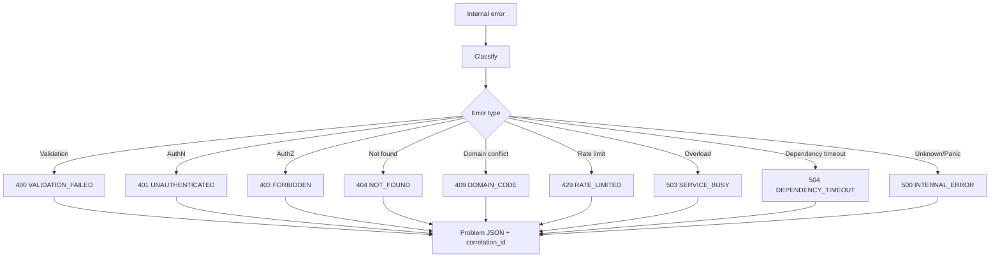
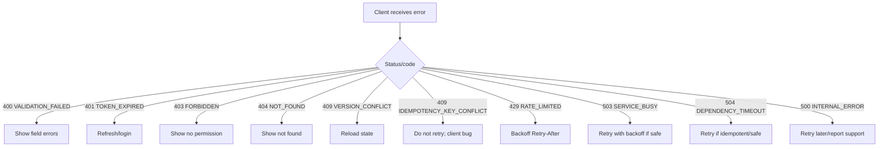
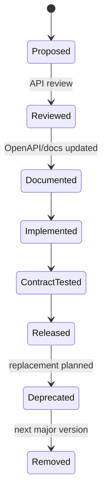

# learn-go-reliability-error-handling-part-026.md

# API Error Contract: Public Error Schema, Problem Details, Versioning, Client Semantics

> Seri: `learn-go-reliability-error-handling`  
> Part: `026`  
> Target: Go 1.26.x  
> Level: Advanced / internal engineering handbook  
> Fokus: mendesain kontrak error API yang stabil, aman, dapat diobservasi, client-friendly, versionable, dan tidak membocorkan detail internal.

---

## 0. Posisi Materi Ini Dalam Seri

Pada bagian sebelumnya, kita membahas:

- HTTP server reliability
- error boundary
- observability untuk error
- correlation ID
- error taxonomy
- idempotency
- overload
- dependency failure
- retry semantics

Sekarang kita fokus pada boundary yang dilihat client:

> Public API Error Contract.

Internal error bisa kaya, detail, berlapis, dan teknis.

Public error harus:

- stabil
- aman
- tidak membocorkan internal
- bisa dipahami client
- bisa dipakai untuk retry/UX
- bisa diukur sebagai metric
- bisa dihubungkan ke correlation ID
- punya status code tepat
- punya error code stabil
- punya field errors untuk validation
- versionable
- documented
- backward-compatible

API error contract adalah bagian dari reliability karena client behavior sangat dipengaruhi oleh error response.

Jika API error contract buruk:

- client retry error permanent
- client tidak retry error transient
- user melihat pesan teknis
- support tidak bisa tracing
- observability sulit
- breaking change terjadi diam-diam
- frontend membuat parsing dari message
- mobile app rusak setelah backend deploy
- integrator salah interpretasi 500 vs 409
- overload dianggap bug internal
- idempotency conflict tidak bisa dipulihkan

---

## 1. Core Thesis

Public error response bukan tempat untuk dump `err.Error()`.

Public error response adalah **contract**.

Sebuah API error contract yang baik harus menjawab:

1. Apa yang terjadi?
2. Apakah client bisa memperbaiki request?
3. Apakah client boleh retry?
4. Apakah retry harus pakai idempotency key?
5. Apakah user harus login ulang?
6. Apakah error sementara atau final?
7. Field mana yang salah?
8. Apakah error berasal dari domain state?
9. Apakah server overload?
10. Apakah ada correlation ID untuk support?
11. Apakah response aman dari leakage?
12. Apakah schema stabil untuk versi API ini?

---

## 2. Internal Error vs Public Error

Internal error:

```text
submit case: load actor profile: profile service GET /users/123 returned 503 after 492ms: context deadline exceeded
```

Public error:

```json
{
  "type": "https://api.example.com/problems/dependency-timeout",
  "title": "A required service timed out",
  "status": 504,
  "code": "DEPENDENCY_TIMEOUT",
  "message": "The request could not be completed because a required service timed out. Please try again later.",
  "correlation_id": "req_01H..."
}
```

Internal error should help engineers.

Public error should help clients and users.

---

## 3. Problem Details as Baseline

RFC 9457 defines “Problem Details for HTTP APIs”. It provides common fields:

```json
{
  "type": "https://example.com/probs/out-of-credit",
  "title": "You do not have enough credit.",
  "status": 403,
  "detail": "Your current balance is 30, but that costs 50.",
  "instance": "/account/12345/msgs/abc"
}
```

For many APIs, use Problem Details style plus extension fields:

```json
{
  "type": "https://api.example.com/problems/validation-failed",
  "title": "Validation failed",
  "status": 400,
  "code": "VALIDATION_FAILED",
  "message": "The request contains invalid fields.",
  "correlation_id": "req_abc",
  "fields": [
    {
      "path": "email",
      "code": "INVALID_FORMAT",
      "message": "Email format is invalid."
    }
  ]
}
```

### 3.1 Why Add `code`?

`type` is URI. It is good for documentation.

But clients often prefer short stable enum:

```text
VALIDATION_FAILED
IDEMPOTENCY_KEY_CONFLICT
SERVICE_BUSY
```

`code` should be stable and documented.

### 3.2 `message` vs `detail`

Problem Details uses `detail`. Many APIs use `message`.

Pick one convention and keep it.

This series uses:

```json
"message": "human-readable summary safe for client"
```

You can also include `detail` if following RFC field names strictly.

---

## 4. Recommended Error Schema

```go
type Problem struct {
    Type          string       `json:"type,omitempty"`
    Title         string       `json:"title"`
    Status        int          `json:"status"`
    Code          string       `json:"code"`
    Message       string       `json:"message"`
    CorrelationID string       `json:"correlation_id,omitempty"`
    Instance      string       `json:"instance,omitempty"`
    Retryable     *bool        `json:"retryable,omitempty"`
    RetryAfterSec *int         `json:"retry_after_seconds,omitempty"`
    Fields        []FieldError `json:"fields,omitempty"`
    Meta          map[string]any `json:"meta,omitempty"`
}

type FieldError struct {
    Path    string `json:"path"`
    Code    string `json:"code"`
    Message string `json:"message"`
}
```

Important:

- `code`: machine-readable stable enum.
- `message`: human-readable safe text.
- `correlation_id`: support/debug.
- `fields`: validation details.
- `retryable`: optional hint.
- `retry_after_seconds`: optional hint.
- `meta`: use sparingly and keep stable.

---

## 5. Stability Rules

### 5.1 Stable

Should be stable:

- HTTP status for same class of error
- `code`
- field error `code`
- JSON field names
- response content type
- retry semantics
- idempotency conflict behavior
- auth error behavior

### 5.2 Flexible

Can change more freely:

- `message` wording
- `title` wording
- documentation URL text
- optional metadata addition

### 5.3 Dangerous Changes

Breaking:

- rename `code`
- remove `fields`
- change `VALIDATION_FAILED` to `BAD_REQUEST`
- change 409 to 500
- change same idempotency replay from 200 to 409
- change retryable transient error to permanent without versioning
- change error shape only for one endpoint
- expose raw error string

---

## 6. Content Type

For Problem Details:

```http
Content-Type: application/problem+json
```

Or if your API standardizes all responses:

```http
Content-Type: application/json; charset=utf-8
```

Pick one.

If using `application/problem+json`, clients can treat error body specially.

Example:

```go
w.Header().Set("Content-Type", "application/problem+json")
```

---

## 7. HTTP Status Code Semantics

Status code communicates broad category.

`code` communicates specific machine-readable reason.

### 7.1 400 Bad Request

Malformed request syntax/shape:

- malformed JSON
- invalid query parameter type
- missing required field
- invalid field format
- unknown field if strict

Code examples:

```text
MALFORMED_JSON
VALIDATION_FAILED
UNKNOWN_FIELD
INVALID_QUERY_PARAMETER
```

### 7.2 401 Unauthorized

Authentication required/failed.

Examples:

- missing token
- invalid token
- expired token

Code:

```text
UNAUTHENTICATED
TOKEN_EXPIRED
INVALID_TOKEN
```

Include `WWW-Authenticate` when appropriate.

### 7.3 403 Forbidden

Authenticated but not allowed.

Code:

```text
FORBIDDEN
INSUFFICIENT_PERMISSION
```

Avoid exposing sensitive permission internals.

### 7.4 404 Not Found

Resource not found or hidden.

Code:

```text
CASE_NOT_FOUND
DOCUMENT_NOT_FOUND
ROUTE_NOT_FOUND
```

Sometimes return 404 instead of 403 to avoid revealing resource existence. Define policy.

### 7.5 409 Conflict

Current state conflicts with request.

Examples:

- invalid state transition
- optimistic version conflict
- idempotency key conflict
- duplicate resource by unique business key
- concurrent update conflict

Code:

```text
INVALID_STATE_TRANSITION
VERSION_CONFLICT
IDEMPOTENCY_KEY_CONFLICT
DUPLICATE_RESOURCE
```

### 7.6 412 Precondition Failed

Conditional request failed.

Examples:

- ETag mismatch
- If-Match failed

Code:

```text
PRECONDITION_FAILED
ETAG_MISMATCH
```

### 7.7 413 Payload Too Large

Request body too large.

Code:

```text
PAYLOAD_TOO_LARGE
```

### 7.8 415 Unsupported Media Type

Wrong content type.

Code:

```text
UNSUPPORTED_MEDIA_TYPE
```

### 7.9 422 Unprocessable Content

Semantic validation failure after syntactically valid request.

Some APIs use 400 for all validation. Both can be acceptable if consistent.

Code:

```text
SEMANTIC_VALIDATION_FAILED
```

### 7.10 429 Too Many Requests

Client/user/tenant-specific rate limit.

Code:

```text
RATE_LIMITED
TENANT_RATE_LIMITED
```

Include `Retry-After` if useful.

### 7.11 500 Internal Server Error

Unexpected server bug/internal failure.

Code:

```text
INTERNAL_ERROR
```

Do not include raw details.

### 7.12 502 Bad Gateway

Upstream returned invalid/bad response.

Code:

```text
BAD_GATEWAY
DEPENDENCY_BAD_RESPONSE
```

### 7.13 503 Service Unavailable

Temporary service/dependency unavailable, overload, shutdown.

Code:

```text
SERVICE_BUSY
SERVICE_SHUTTING_DOWN
DEPENDENCY_UNAVAILABLE
CIRCUIT_OPEN
```

### 7.14 504 Gateway Timeout

Dependency/upstream timeout.

Code:

```text
DEPENDENCY_TIMEOUT
```

Use 504 when your service acts as gateway/client to another dependency and timed out waiting.

---

## 8. Error Code Naming

Good error codes:

```text
VALIDATION_FAILED
CASE_NOT_FOUND
INVALID_STATE_TRANSITION
IDEMPOTENCY_KEY_CONFLICT
DEPENDENCY_TIMEOUT
SERVICE_BUSY
```

Bad error codes:

```text
ERR_001
BAD
SOMETHING_WENT_WRONG
SQL_TIMEOUT_FROM_ORACLE_RDS_IP_10_0_1_5
```

Rules:

- uppercase snake case
- stable
- documented
- not too technical
- not too generic
- not tied to vendor/internal topology
- meaningful to client behavior

---

## 9. Field Error Contract

Validation response:

```json
{
  "code": "VALIDATION_FAILED",
  "message": "The request contains invalid fields.",
  "fields": [
    {
      "path": "applicant.email",
      "code": "INVALID_FORMAT",
      "message": "Email format is invalid."
    },
    {
      "path": "documents[0].type",
      "code": "REQUIRED",
      "message": "Document type is required."
    }
  ]
}
```

### 9.1 Field Path

Use consistent path syntax:

- dot notation: `applicant.email`
- array index: `documents[0].type`
- query param: `query.page_size`
- header: `header.Idempotency-Key`

### 9.2 Field Code

Field codes:

```text
REQUIRED
TOO_SHORT
TOO_LONG
INVALID_FORMAT
INVALID_ENUM
OUT_OF_RANGE
UNKNOWN_FIELD
DUPLICATE_VALUE
MUTUALLY_EXCLUSIVE
```

### 9.3 Field Message

Safe for display, but clients should rely on `code` and `path`.

---

## 10. Validation Error Design in Go

```go
type FieldViolation struct {
    Path    string
    Code    string
    Message string
}

type ValidationError struct {
    Violations []FieldViolation
}

func (e *ValidationError) Error() string {
    return "validation failed"
}

func (e *ValidationError) Add(path, code, message string) {
    e.Violations = append(e.Violations, FieldViolation{
        Path:    path,
        Code:    code,
        Message: message,
    })
}

func (e *ValidationError) Empty() bool {
    return len(e.Violations) == 0
}
```

Mapping:

```go
func problemFromValidation(v *ValidationError) Problem {
    fields := make([]FieldError, 0, len(v.Violations))
    for _, f := range v.Violations {
        fields = append(fields, FieldError{
            Path:    f.Path,
            Code:    f.Code,
            Message: f.Message,
        })
    }

    return Problem{
        Type:    "https://api.example.com/problems/validation-failed",
        Title:   "Validation failed",
        Status:  http.StatusBadRequest,
        Code:    "VALIDATION_FAILED",
        Message: "The request contains invalid fields.",
        Fields:  fields,
    }
}
```

---

## 11. Domain Error Contract

Domain error example:

```go
type DomainError struct {
    Code    string
    Message string
}

func (e *DomainError) Error() string {
    return e.Code + ": " + e.Message
}
```

Domain code:

```text
INVALID_STATE_TRANSITION
APPEAL_WINDOW_CLOSED
MANDATORY_DOCUMENT_MISSING
CASE_ALREADY_SUBMITTED
```

Public response:

```json
{
  "type": "https://api.example.com/problems/invalid-state-transition",
  "title": "Invalid state transition",
  "status": 409,
  "code": "INVALID_STATE_TRANSITION",
  "message": "The case cannot be submitted in its current state.",
  "correlation_id": "req_abc"
}
```

Domain error is not 500. It is expected rejection.

---

## 12. Auth Error Contract

### 12.1 Missing Token

```http
HTTP/1.1 401 Unauthorized
WWW-Authenticate: Bearer
```

```json
{
  "code": "UNAUTHENTICATED",
  "message": "Authentication is required."
}
```

### 12.2 Expired Token

```json
{
  "code": "TOKEN_EXPIRED",
  "message": "The access token has expired."
}
```

Client action:

- refresh token if possible
- redirect/login

### 12.3 Forbidden

```json
{
  "code": "FORBIDDEN",
  "message": "You are not allowed to perform this action."
}
```

Avoid:

```json
{
  "message": "Missing role INTERNAL_CASE_APPROVER_AGENCY_CEA_LEVEL_4"
}
```

unless internal API and safe.

---

## 13. Dependency Error Contract

Internal:

```text
profile service timeout after 500ms
```

Public:

```json
{
  "code": "DEPENDENCY_TIMEOUT",
  "message": "A required service timed out. Please try again later.",
  "status": 504
}
```

Do not expose:

- internal hostname
- IP
- path
- token
- SQL
- stack trace
- vendor-specific exception

### 13.1 Retryable Hint

Optional:

```json
{
  "code": "DEPENDENCY_TIMEOUT",
  "retryable": true,
  "retry_after_seconds": 1
}
```

But be careful: retryability depends on operation idempotency. For side-effecting operation, client should retry only with same idempotency key.

---

## 14. Idempotency Error Contract

### 14.1 Missing Key

```http
400 Bad Request
```

```json
{
  "code": "IDEMPOTENCY_KEY_REQUIRED",
  "message": "Idempotency-Key header is required for this operation."
}
```

### 14.2 Same Key Different Payload

```http
409 Conflict
```

```json
{
  "code": "IDEMPOTENCY_KEY_CONFLICT",
  "message": "The same idempotency key was used with a different request payload."
}
```

### 14.3 In Progress

```http
409 Conflict
Retry-After: 1
```

```json
{
  "code": "OPERATION_IN_PROGRESS",
  "message": "An operation with the same idempotency key is still processing.",
  "retryable": true,
  "retry_after_seconds": 1
}
```

or:

```http
202 Accepted
```

with operation status URL, if your API supports polling.

### 14.4 Replay

Return original response status/body. Optionally:

```http
Idempotent-Replayed: true
```

---

## 15. Overload Error Contract

### 15.1 Service Busy

```http
503 Service Unavailable
Retry-After: 1
```

```json
{
  "code": "SERVICE_BUSY",
  "message": "The service is currently busy. Please try again later.",
  "retryable": true,
  "retry_after_seconds": 1
}
```

### 15.2 Rate Limited

```http
429 Too Many Requests
Retry-After: 60
```

```json
{
  "code": "RATE_LIMITED",
  "message": "Too many requests. Please retry later.",
  "retryable": true,
  "retry_after_seconds": 60
}
```

### 15.3 Shutdown

```http
503 Service Unavailable
Connection: close
Retry-After: 1
```

```json
{
  "code": "SERVICE_SHUTTING_DOWN",
  "message": "This instance is shutting down. Please retry.",
  "retryable": true
}
```

---

## 16. Retry Semantics in Contract

Error contract should tell client behavior.

But do not oversimplify.

Retryability depends on:

- method
- idempotency
- error type
- retry budget
- `Retry-After`
- client deadline

### 16.1 Retryable Errors

Usually retryable:

```text
SERVICE_BUSY
SERVICE_SHUTTING_DOWN
DEPENDENCY_TIMEOUT
DEPENDENCY_UNAVAILABLE
RATE_LIMITED
OPERATION_IN_PROGRESS
```

Usually not retryable:

```text
VALIDATION_FAILED
FORBIDDEN
NOT_FOUND
IDEMPOTENCY_KEY_CONFLICT
INVALID_STATE_TRANSITION
UNSUPPORTED_MEDIA_TYPE
```

Ambiguous:

```text
REQUEST_TIMEOUT
```

For side-effecting POST:

- retry only with same idempotency key
- client should not generate new key for same operation
- client should use backoff+jitter

### 16.2 Document Retry Policy

For each endpoint:

```text
POST /cases/{id}/submit:
- Requires Idempotency-Key.
- If response is 503/504 or client timeout occurs, client may retry with the same Idempotency-Key.
- If response is IDEMPOTENCY_KEY_CONFLICT, do not retry automatically.
- If OPERATION_IN_PROGRESS, retry after Retry-After or poll operation status.
```

---

## 17. Client Semantics

Clients need to know:

| Code | Client action |
|---|---|
| VALIDATION_FAILED | show field errors |
| UNAUTHENTICATED | login/refresh |
| TOKEN_EXPIRED | refresh token |
| FORBIDDEN | show no permission |
| NOT_FOUND | show missing/not accessible |
| INVALID_STATE_TRANSITION | refresh state/show conflict |
| VERSION_CONFLICT | reload and retry user action |
| RATE_LIMITED | wait/backoff |
| SERVICE_BUSY | retry with backoff if safe |
| DEPENDENCY_TIMEOUT | retry if safe |
| INTERNAL_ERROR | retry later/report support |
| IDEMPOTENCY_KEY_CONFLICT | developer/client bug; do not retry same key with different payload |

A good API contract reduces incorrect client retries.

---

## 18. Error Contract and Observability

Public error code should be used in metrics:

```text
http_requests_total{route="/cases/{id}/submit",status="409",code="INVALID_STATE_TRANSITION"}
```

Logs should include same code:

```go
logger.WarnContext(ctx, "request failed",
    "error_code", problem.Code,
    "status", problem.Status,
    "correlation_id", problem.CorrelationID,
)
```

Trace should include:

```text
error.code = INVALID_STATE_TRANSITION
http.status_code = 409
```

This aligns response, logs, metrics, traces.

---

## 19. Error Contract and Localization

Do not make clients parse English message.

Use:

- stable `code`
- optional localized `message`
- client-side localization based on code
- server-side localization only if required

If server localizes:

```http
Accept-Language: id-ID
```

Response:

```json
{
  "code": "VALIDATION_FAILED",
  "message": "Permintaan memiliki field yang tidak valid."
}
```

But code remains same.

---

## 20. Error Contract Versioning

Versioning options:

1. API path version: `/v1/...`
2. header version
3. media type version
4. additive evolution only
5. problem type URI version

Rules:

- adding optional field is usually safe
- removing/renaming field is breaking
- changing code semantics is breaking
- changing status code may be breaking
- changing retry behavior is breaking
- changing field path format may be breaking

### 20.1 Additive Evolution

Safe:

```json
{
  "code": "VALIDATION_FAILED",
  "message": "...",
  "correlation_id": "...",
  "fields": [],
  "retryable": false
}
```

Adding `retryable` is safe if clients ignore unknown fields.

### 20.2 Deprecating Error Code

If replacing code:

- document old and new
- support old for version lifecycle
- emit migration warning internally
- coordinate client update

---

## 21. Security and Error Contract

Do not reveal:

- whether email/user exists in login flow, if enumeration risk
- internal permission model details
- database schema/table
- stack trace
- service hostnames
- cloud account IDs
- file paths
- secrets
- raw token state
- exact rate limit internals if abuse risk
- internal incident details

Example login:

```json
{
  "code": "INVALID_CREDENTIALS",
  "message": "Invalid credentials."
}
```

not:

```json
{
  "message": "User exists but password hash mismatch."
}
```

---

## 22. Problem Type URI

`type` should point to documentation.

```json
"type": "https://api.example.com/problems/validation-failed"
```

It can be:

- public URL
- stable internal docs URL
- `about:blank` if not using type-specific docs

For internal enterprise API, docs URL can be behind authenticated developer portal.

---

## 23. Instance Field

Problem Details `instance` identifies occurrence or resource.

Could be:

```json
"instance": "/cases/123/submissions/456"
```

or request-specific:

```json
"instance": "urn:request:req_abc"
```

Use carefully. Do not leak resource IDs if sensitive.

Correlation ID often covers support use case better.

---

## 24. Public vs Internal APIs

Internal APIs can expose more detail, but still need discipline.

Public internet API:

- very conservative
- no internal detail
- stable codes
- docs

Internal service API:

- can include dependency code
- still avoid secrets/PII
- still stable enough for client teams
- still no raw stack in response

Do not assume “internal” means safe to leak everything.

---

## 25. Batch API Error Contract

Batch operations need per-item result.

Example:

```json
{
  "code": "BATCH_PARTIAL_FAILURE",
  "message": "Some items failed.",
  "results": [
    {
      "index": 0,
      "status": "success",
      "id": "A"
    },
    {
      "index": 1,
      "status": "failed",
      "error": {
        "code": "VALIDATION_FAILED",
        "fields": [
          {
            "path": "email",
            "code": "INVALID_FORMAT",
            "message": "Email format is invalid."
          }
        ]
      }
    }
  ]
}
```

HTTP status options:

- `200` with per-item statuses if batch accepted and processed
- `207 Multi-Status` uncommon outside WebDAV
- `400` if entire batch invalid structurally
- `202` if async batch accepted

Be explicit.

---

## 26. Async Job Error Contract

Submit:

```http
POST /reports
202 Accepted
```

```json
{
  "job_id": "job_123",
  "status": "accepted"
}
```

Status:

```http
GET /reports/job_123
```

Failure:

```json
{
  "job_id": "job_123",
  "status": "failed",
  "error": {
    "code": "REPORT_TOO_LARGE",
    "message": "The report is too large to generate."
  }
}
```

Async errors still need stable schema.

---

## 27. Pagination/Search Error Contract

Common errors:

```text
INVALID_PAGE_SIZE
INVALID_CURSOR
CURSOR_EXPIRED
INVALID_SORT
INVALID_FILTER
QUERY_TOO_BROAD
SEARCH_TEMPORARILY_UNAVAILABLE
```

For expensive broad query:

```http
400 or 422
```

```json
{
  "code": "QUERY_TOO_BROAD",
  "message": "Please narrow the query filters."
}
```

For overload:

```http
503
```

```json
{
  "code": "SEARCH_BUSY",
  "message": "Search is temporarily busy. Please try again later."
}
```

---

## 28. File Upload Error Contract

Errors:

```text
PAYLOAD_TOO_LARGE
UNSUPPORTED_MEDIA_TYPE
INVALID_FILE_TYPE
VIRUS_SCAN_FAILED
VIRUS_SCAN_UNAVAILABLE
CHECKSUM_MISMATCH
UPLOAD_INCOMPLETE
```

If async scan:

```json
{
  "document_id": "doc_123",
  "status": "pending_scan"
}
```

Then later:

```json
{
  "document_id": "doc_123",
  "status": "rejected",
  "error": {
    "code": "VIRUS_SCAN_FAILED",
    "message": "The uploaded file did not pass security checks."
  }
}
```

Do not expose scanner internals.

---

## 29. Go Error Boundary Implementation

```go
type ErrorMapper struct{}

func (m ErrorMapper) Map(err error) Problem {
    var v *ValidationError
    if errors.As(err, &v) {
        return problemFromValidation(v)
    }

    var d *DomainError
    if errors.As(err, &d) {
        return problemFromDomain(d)
    }

    var dep *DependencyError
    if errors.As(err, &dep) {
        return problemFromDependency(dep)
    }

    switch {
    case errors.Is(err, ErrUnauthenticated):
        return Problem{Status: 401, Code: "UNAUTHENTICATED", Title: "Unauthenticated", Message: "Authentication is required."}

    case errors.Is(err, ErrForbidden):
        return Problem{Status: 403, Code: "FORBIDDEN", Title: "Forbidden", Message: "You are not allowed to perform this action."}

    case errors.Is(err, ErrServiceBusy):
        retryable := true
        retryAfter := 1
        return Problem{Status: 503, Code: "SERVICE_BUSY", Title: "Service busy", Message: "The service is currently busy. Please try again later.", Retryable: &retryable, RetryAfterSec: &retryAfter}

    default:
        return Problem{Status: 500, Code: "INTERNAL_ERROR", Title: "Internal server error", Message: "An unexpected error occurred."}
    }
}
```

---

## 30. Writing Problem Response

```go
func writeProblem(w http.ResponseWriter, p Problem) {
    if p.Status == 0 {
        p.Status = http.StatusInternalServerError
    }

    w.Header().Set("Content-Type", "application/problem+json; charset=utf-8")

    if p.RetryAfterSec != nil {
        w.Header().Set("Retry-After", strconv.Itoa(*p.RetryAfterSec))
    }

    w.WriteHeader(p.Status)

    _ = json.NewEncoder(w).Encode(p)
}
```

For extra safety, encode to buffer before `WriteHeader`.

---

## 31. OpenAPI Documentation

Document error responses.

Example:

```yaml
components:
  schemas:
    Problem:
      type: object
      required: [title, status, code, message]
      properties:
        type:
          type: string
        title:
          type: string
        status:
          type: integer
        code:
          type: string
        message:
          type: string
        correlation_id:
          type: string
        retryable:
          type: boolean
        retry_after_seconds:
          type: integer
        fields:
          type: array
          items:
            $ref: '#/components/schemas/FieldError'

    FieldError:
      type: object
      required: [path, code, message]
      properties:
        path:
          type: string
        code:
          type: string
        message:
          type: string
```

Endpoint:

```yaml
responses:
  '400':
    description: Validation failed
    content:
      application/problem+json:
        schema:
          $ref: '#/components/schemas/Problem'
  '409':
    description: Conflict
    content:
      application/problem+json:
        schema:
          $ref: '#/components/schemas/Problem'
```

---

## 32. Testing API Error Contract

### 32.1 Snapshot Shape

```go
func TestValidationProblemShape(t *testing.T) {
    p := problemFromValidation(&ValidationError{
        Violations: []FieldViolation{
            {Path: "email", Code: "INVALID_FORMAT", Message: "Email format is invalid."},
        },
    })

    if p.Code != "VALIDATION_FAILED" {
        t.Fatalf("code changed: %s", p.Code)
    }
    if p.Status != http.StatusBadRequest {
        t.Fatalf("status changed: %d", p.Status)
    }
    if len(p.Fields) != 1 {
        t.Fatalf("expected field error")
    }
}
```

### 32.2 No Internal Leakage

```go
func TestInternalErrorDoesNotLeak(t *testing.T) {
    err := fmt.Errorf("query users: password=secret host=10.0.0.1: %w", errors.New("boom"))

    p := mapper.Map(err)

    b, _ := json.Marshal(p)
    body := string(b)

    if strings.Contains(body, "secret") || strings.Contains(body, "10.0.0.1") {
        t.Fatalf("problem leaked internal detail: %s", body)
    }
}
```

### 32.3 Stable Codes

Maintain a test list:

```go
var publicCodes = []string{
    "VALIDATION_FAILED",
    "UNAUTHENTICATED",
    "FORBIDDEN",
    "CASE_NOT_FOUND",
    "INVALID_STATE_TRANSITION",
    "IDEMPOTENCY_KEY_CONFLICT",
    "SERVICE_BUSY",
    "DEPENDENCY_TIMEOUT",
    "INTERNAL_ERROR",
}
```

Breaking change should be intentional.

---

## 33. Contract Testing With Clients

For important clients:

- frontend
- mobile app
- partner integration
- internal services

Use contract tests:

- validation error shape
- auth error shape
- idempotency conflict
- rate limit
- service busy
- domain conflict
- async job failure

Client should not parse `message`.

---

## 34. Error Contract Governance

For large teams:

- maintain error code registry
- require review for new public error codes
- document code semantics
- map code to owner/team
- define retryability
- define user display behavior
- define SLO classification
- define deprecation policy

Example registry:

| Code | HTTP | Retryable | Owner | Notes |
|---|---:|---|---|---|
| VALIDATION_FAILED | 400 | no | platform | field errors |
| SERVICE_BUSY | 503 | yes | platform | Retry-After |
| INVALID_STATE_TRANSITION | 409 | no | case domain | refresh state |
| DEPENDENCY_TIMEOUT | 504 | maybe | platform | operation-dependent |

---

## 35. Anti-patterns

### 35.1 `err.Error()` as Response

Leaks internals and unstable.

### 35.2 Client Parses Message Text

Breaks localization and copy changes.

### 35.3 200 With Error Body

Unless domain deliberately uses envelope style, this breaks HTTP semantics.

Bad:

```json
{ "success": false, "error": "..." }
```

with HTTP 200.

### 35.4 Every Error Is 500

Client cannot react correctly.

### 35.5 Every Domain Rejection Is 400

State conflict and validation differ.

### 35.6 Error Code Too Generic

`BAD_REQUEST` does not help UI.

### 35.7 Error Code Too Specific/Internal

`ORACLE_RDS_LOCK_WAIT_TIMEOUT_00054` leaks implementation.

### 35.8 Field Errors Without Stable Path

Frontend cannot map field.

### 35.9 Inconsistent Shape Per Endpoint

Client complexity explodes.

### 35.10 Retryable Hint Wrong for Side Effects

Can cause duplicate operations.

### 35.11 Missing Correlation ID

Support/debug difficult.

### 35.12 Breaking Error Code Silently

Client breaks after deploy.

---

## 36. Production Checklist

### 36.1 Schema

- [ ] stable error schema
- [ ] content type defined
- [ ] `code` required
- [ ] `status` included
- [ ] `message` safe
- [ ] `correlation_id` included
- [ ] field errors structured
- [ ] optional retry hints defined

### 36.2 Mapping

- [ ] validation -> 400/422
- [ ] authn -> 401
- [ ] authz -> 403
- [ ] not found -> 404
- [ ] conflict -> 409
- [ ] payload too large -> 413
- [ ] unsupported media -> 415
- [ ] rate limit -> 429
- [ ] overload -> 503
- [ ] dependency timeout -> 504
- [ ] internal unknown -> 500 generic

### 36.3 Safety

- [ ] raw error not exposed
- [ ] stack trace not exposed
- [ ] internal host/IP not exposed
- [ ] SQL not exposed
- [ ] secret/PII not exposed
- [ ] enumeration risks considered

### 36.4 Client Semantics

- [ ] retryability documented
- [ ] idempotency retry rules documented
- [ ] auth refresh behavior documented
- [ ] field code registry
- [ ] error code registry
- [ ] client contract tests

### 36.5 Versioning

- [ ] additive-only changes by default
- [ ] breaking changes versioned
- [ ] deprecated codes tracked
- [ ] OpenAPI updated
- [ ] frontend/mobile/partner notified

### 36.6 Observability

- [ ] public code used in metrics
- [ ] correlation ID in response/logs/traces
- [ ] error mapper tested
- [ ] error leakage tests
- [ ] SLO classification defined

---

## 37. Mermaid: Error Mapping Boundary



---

## 38. Mermaid: Client Decision Tree



---

## 39. Mermaid: Error Contract Lifecycle



---

## 40. Regulatory Case Management Lens

For regulatory/case-management APIs, error contract must support:

- user-friendly field validation
- domain state conflicts
- audit-supportable correlation ID
- idempotency retry semantics
- permission-safe messages
- external dependency temporary failure
- stable integration contract for agencies/internal systems

Examples:

```text
CASE_NOT_FOUND
CASE_ALREADY_SUBMITTED
INVALID_STATE_TRANSITION
MANDATORY_DOCUMENT_MISSING
APPEAL_WINDOW_CLOSED
IDEMPOTENCY_KEY_REQUIRED
IDEMPOTENCY_KEY_CONFLICT
DOCUMENT_SCAN_PENDING
DOCUMENT_REJECTED
DEPENDENCY_TIMEOUT
SERVICE_BUSY
```

Rules:

- never expose internal officer role model if sensitive
- never expose DB/storage details
- distinguish user-correctable validation from system outage
- include operation/correlation ID for support
- document retry with same idempotency key for submit-like operations

---

## 41. Java Engineer Translation Layer

### 41.1 Spring `@ControllerAdvice`

In Spring, global exception mapper maps exceptions to `ResponseEntity`.

Go equivalent:

```go
type ErrorMapper struct{}
type ErrorBoundary struct{}
```

### 41.2 Bean Validation Field Errors

Java Bean Validation gives field violations. In Go, build your own `ValidationError` or use validation library but map to stable public schema.

### 41.3 Problem Details in Spring

Spring supports ProblemDetail in newer versions. In Go, implement struct manually or use a small package.

### 41.4 Exception Class vs Error Code

Java often maps exception class to code. Go maps typed/sentinel errors with `errors.Is/As` to code.

---

## 42. Key Takeaways

1. API error response is a contract, not a debug dump.
2. Public errors must be stable, safe, and client-actionable.
3. Use HTTP status for category and `code` for specific semantics.
4. Do not expose raw internal error messages.
5. Field validation needs structured field errors.
6. Clients should rely on `code`, not `message`.
7. Retry semantics must be documented, especially for side-effecting operations.
8. Idempotency errors need precise contract.
9. Overload/rate-limit errors should use 429/503 with optional Retry-After.
10. Dependency/internal failures should be sanitized.
11. Correlation ID belongs in every error response.
12. Error codes should feed metrics/logs/traces.
13. Versioning applies to error contracts.
14. Security-sensitive flows need anti-enumeration design.
15. Batch/async APIs need per-item/job error schemas.
16. OpenAPI must document common error schema.
17. Contract tests prevent accidental breaking changes.
18. Error code registry helps large teams.
19. Domain rejections are not 500.
20. Good error contracts make clients more reliable.

---

## 43. References

- RFC 9457: Problem Details for HTTP APIs
- Go package documentation: `net/http`
- Go package documentation: `encoding/json`
- Go package documentation: `errors`
- OWASP Error Handling Cheat Sheet
- OWASP REST Security Cheat Sheet
- OpenAPI Specification: response schemas and components
- Google API Design Guide: error model concepts

---

## 44. Next Part

Next:

```text
learn-go-reliability-error-handling-part-027.md
```

Topic:

```text
Persistence Reliability: Transactions, Locks, Consistency, Deadlock, Commit Ambiguity
```


<!-- NAVIGATION_FOOTER -->
<div class="page-nav">
<a href="./learn-go-reliability-error-handling-part-025.md">⬅️ Observability for Errors: Logs, Metrics, Traces, Correlation, Error Budgets</a>
<a href="./index.md">📚 Kategori</a>
<a href="../../index.md">🏠 Home</a>
<a href="./learn-go-reliability-error-handling-part-027.md">Persistence Reliability: Transactions, Locks, Consistency, Deadlock, Commit Ambiguity ➡️</a>
</div>
