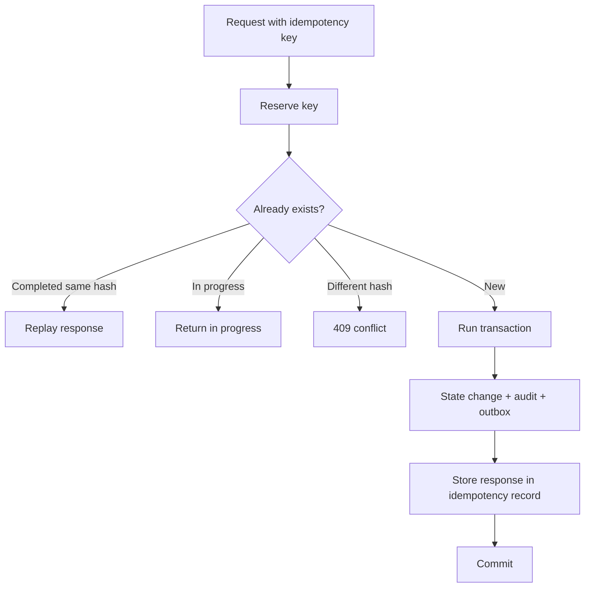
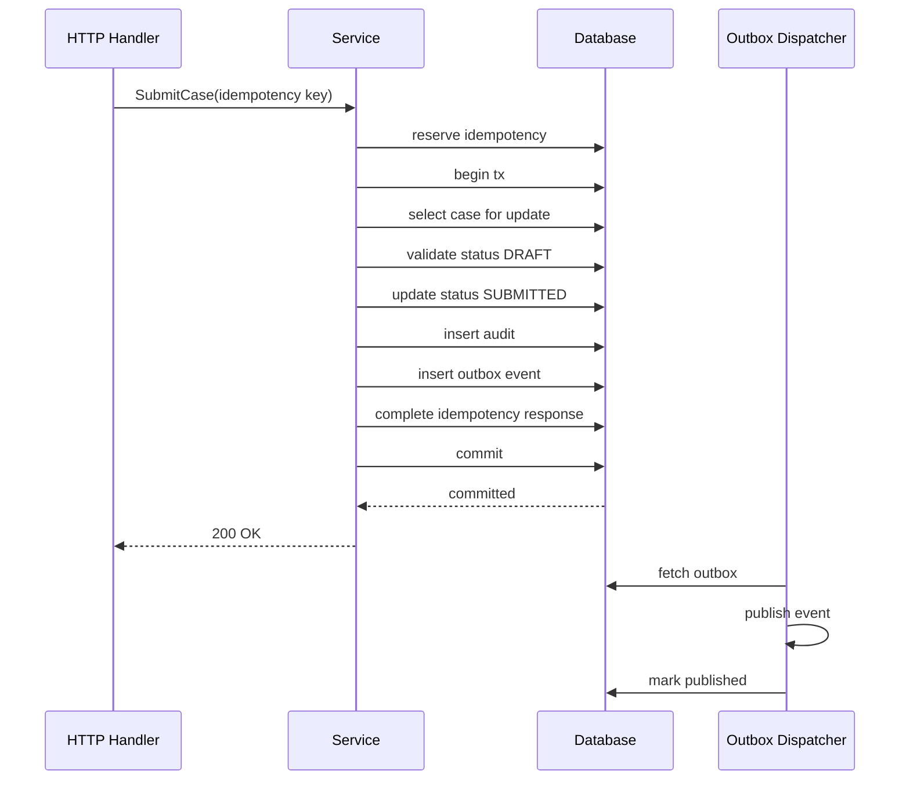
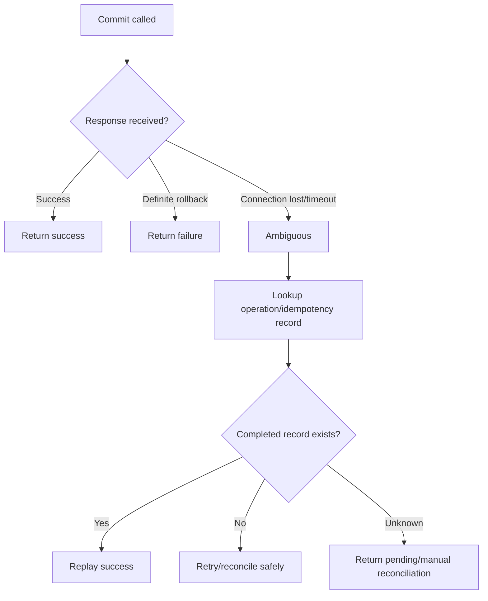
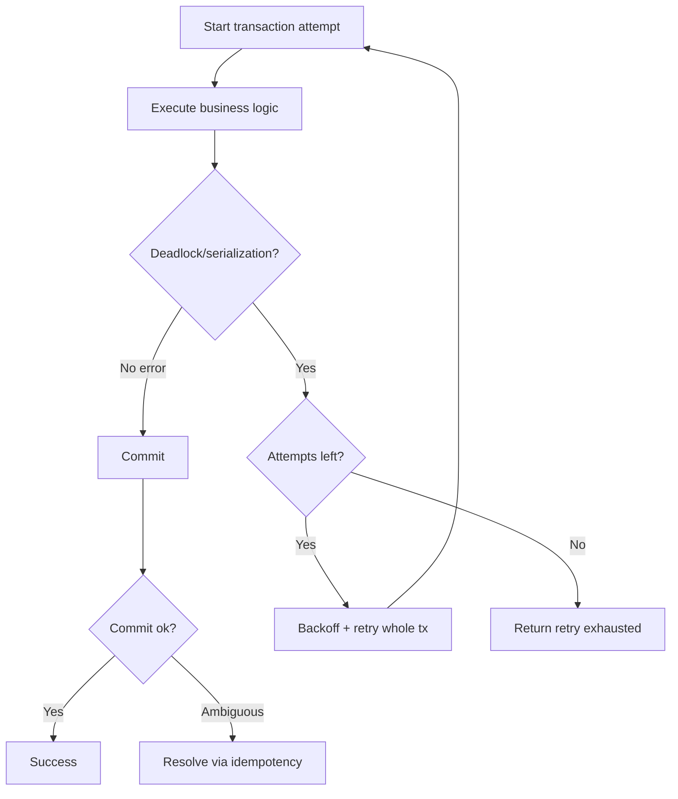

# learn-go-reliability-error-handling-part-027.md

# Persistence Reliability: Transactions, Locks, Consistency, Deadlock, Commit Ambiguity

> Seri: `learn-go-reliability-error-handling`  
> Part: `027`  
> Target: Go 1.26.x  
> Level: Advanced / internal engineering handbook  
> Fokus: reliability pada persistence layer: transaction boundary, isolation, lock, deadlock, optimistic concurrency, commit ambiguity, idempotency, outbox, retry transaction, dan data correctness.

---

## 0. Posisi Materi Ini Dalam Seri

Sampai bagian ini kita sudah membahas:

- error taxonomy
- error boundary
- validation/domain/dependency error
- timeout/retry/idempotency
- HTTP reliability
- graceful shutdown
- Kubernetes runtime reliability
- dependency failure management
- overload handling
- API error contract

Sekarang kita masuk ke layer yang paling menentukan correctness: **persistence**.

Banyak sistem terlihat “reliable” sampai data mulai rusak.

Persistence reliability bukan hanya:

```text
query berhasil atau gagal
```

Tetapi:

```text
apakah state tetap benar walaupun request timeout, retry, crash, deadlock, duplicate message, partial dependency failure, atau commit ambiguous?
```

Di production, bug persistence sering lebih berbahaya daripada 500 error karena:

- data salah tapi response sukses
- duplicate side effect
- missing audit
- lost update
- inconsistent status
- race condition antar request
- deadlock retry salah
- transaction terlalu lama
- commit unknown
- external event terkirim tanpa DB state
- DB state berubah tanpa event
- request retry membuat state ganda
- cache stale dianggap source of truth
- optimistic lock diabaikan
- rollback error disalahartikan
- isolation level salah

---

## 1. Core Thesis

Persistence reliability adalah kemampuan service untuk menjaga invariant data walaupun terjadi failure.

Prinsip utama:

1. State transition harus atomic.
2. Domain invariant harus ditegakkan di transaction boundary.
3. External side effect tidak boleh terjadi sembarangan di dalam transaction.
4. Retry harus mengulang transaction secara utuh, bukan statement acak.
5. Duplicate request harus aman melalui idempotency.
6. Concurrent update harus dikontrol dengan lock/version/constraint.
7. Commit ambiguity harus bisa direkonsiliasi.
8. Database constraint adalah safety net, bukan musuh.
9. Outbox menjaga DB state dan event tetap konsisten.
10. Error DB harus diklasifikasikan.
11. Transaction harus pendek dan bounded by context.
12. Observability harus menunjukkan lock wait, deadlock, pool wait, commit failure.

---

## 2. Persistence Failure Taxonomy

| Failure | Example | Risk |
|---|---|---|
| lost update | two users update same case | one update overwritten |
| dirty read | read uncommitted data | inconsistent decision |
| non-repeatable read | same row changes in tx | incorrect validation |
| phantom read | new row appears | uniqueness/rule violation |
| write skew | two tx pass checks separately | invariant broken |
| deadlock | tx A waits B, B waits A | tx abort |
| lock timeout | row locked too long | request timeout |
| serialization failure | serializable tx conflict | tx abort/retry |
| unique violation | duplicate insert | conflict/dedup |
| commit ambiguity | commit result unknown | duplicate/incorrect retry |
| connection loss | during query/commit | unknown state |
| pool exhaustion | no connection available | latency/timeout |
| stale read | replica lag/cache stale | wrong decision |
| partial write | multiple stores | inconsistency |
| dual write | DB + broker/storage | lost event/duplicate |
| long tx | locks held too long | contention/cascade |
| migration mismatch | app/schema incompatible | runtime failures |

---

## 3. ACID, But Application Still Matters

Database transactions provide ACID within database boundaries:

- Atomicity
- Consistency
- Isolation
- Durability

But application still must decide:

- transaction scope
- isolation level
- lock strategy
- retry policy
- constraint design
- idempotency
- external side effect handling
- error classification
- timeout budget
- consistency with cache/broker/object storage

ACID does not automatically solve:

- DB + external API consistency
- DB + message broker consistency
- DB + object storage consistency
- duplicate client retry
- wrong domain rule
- stale cache decision
- bad isolation choice
- commit ambiguity recovery

---

## 4. Transaction Boundary

A transaction boundary should contain one atomic business state transition.

Good examples:

```text
submit case:
  check current status
  update status
  insert audit event
  insert outbox event
  complete idempotency record
commit
```

Bad transaction:

```text
begin tx
call profile API
call document API
send email
update case
sleep/retry
commit
```

### 4.1 Transaction Should Be Short

Long transaction causes:

- locks held longer
- deadlocks more likely
- lock wait timeouts
- connection pool pressure
- rollback cost
- blocking other requests
- shutdown drain delay

Do slow external calls before transaction if they are read-only and safe, or after commit via outbox.

---

## 5. Go Transaction Pattern

```go
func (r *Repository) WithTx(ctx context.Context, fn func(ctx context.Context, tx *sql.Tx) error) error {
    tx, err := r.db.BeginTx(ctx, nil)
    if err != nil {
        return fmt.Errorf("begin tx: %w", err)
    }

    committed := false
    defer func() {
        if !committed {
            _ = tx.Rollback()
        }
    }()

    if err := fn(ctx, tx); err != nil {
        return err
    }

    if err := tx.Commit(); err != nil {
        return fmt.Errorf("commit tx: %w", err)
    }

    committed = true
    return nil
}
```

Caveat: if `Commit` returns error, `committed` remains false and deferred rollback runs. Rollback after failed commit may itself fail or be meaningless. That is acceptable as cleanup attempt, but the commit outcome may be ambiguous.

---

## 6. Better Transaction Helper With Commit Ambiguity

```go
var ErrCommitAmbiguous = errors.New("transaction commit ambiguous")

func (r *Repository) WithTx(ctx context.Context, fn func(context.Context, *sql.Tx) error) error {
    tx, err := r.db.BeginTx(ctx, nil)
    if err != nil {
        return fmt.Errorf("begin tx: %w", err)
    }

    done := false
    defer func() {
        if !done {
            _ = tx.Rollback()
        }
    }()

    if err := fn(ctx, tx); err != nil {
        return err
    }

    if err := tx.Commit(); err != nil {
        done = true // transaction is no longer usable; rollback may not clarify
        return fmt.Errorf("%w: %v", ErrCommitAmbiguous, err)
    }

    done = true
    return nil
}
```

This forces upper layer to treat commit error carefully.

In reality, some commit errors are clearly not committed, some ambiguous. Driver/database-specific classification may improve this.

---

## 7. Commit Ambiguity

Commit ambiguity means:

```text
Application does not know whether transaction committed.
```

Scenarios:

- network connection lost during commit
- DB primary failover during commit
- context deadline hits while commit in progress
- driver returns connection error
- process crashes after sending commit
- DB commits but response lost

Wrong handling:

```go
if commitErr != nil {
    retry same operation with new operation ID
}
```

This can duplicate.

Correct handling:

- use idempotency key/operation ID
- write operation record inside transaction
- after ambiguous commit, query by operation ID
- if found completed, return/replay success
- if not found, retry safely
- reconcile asynchronously if still unknown

### 7.1 Operation Record

```text
idempotency_records:
  key
  request_hash
  status
  response_status
  response_body
  operation_id
```

Inside transaction:

```text
state change
audit
outbox
idempotency complete
```

After commit ambiguity, lookup idempotency by key.

---

## 8. Isolation Levels

Common isolation levels:

- Read Uncommitted
- Read Committed
- Repeatable Read
- Serializable

Go `database/sql` exposes:

```go
&sql.TxOptions{
    Isolation: sql.LevelSerializable,
    ReadOnly:  false,
}
```

Actual support depends database/driver.

### 8.1 Read Committed

Often default in many databases.

Prevents dirty reads, but non-repeatable reads and phantoms can happen.

Good for many simple operations with row-level locks/constraints.

### 8.2 Repeatable Read

Reads are stable within transaction in many DBs, but behavior differs by database.

Can still have write skew depending implementation.

### 8.3 Serializable

Strongest common isolation; database may abort transactions on conflict.

Requires retry whole transaction on serialization failure.

### 8.4 Choose Based on Invariant

Do not blindly set serializable everywhere. It can reduce concurrency and increase aborts.

But for critical invariant, use:

- row locks
- unique constraints
- serializable tx
- explicit advisory lock
- domain-specific lock row

---

## 9. Lost Update

Lost update:

```text
Tx A reads case status draft
Tx B reads case status draft
Tx A updates assigned_to = Alice
Tx B updates assigned_to = Bob
Tx B overwrites A
```

Mitigations:

### 9.1 Optimistic Version

Table:

```sql
version integer not null
```

Update:

```sql
update cases
set assigned_to = ?, version = version + 1
where id = ? and version = ?
```

If affected rows = 0, version conflict.

Go:

```go
res, err := tx.ExecContext(ctx, `
    update cases
    set assigned_to = ?, version = version + 1
    where id = ? and version = ?
`, assignedTo, id, expectedVersion)
if err != nil {
    return err
}

n, err := res.RowsAffected()
if err != nil {
    return err
}
if n == 0 {
    return ErrVersionConflict
}
```

Map to:

```http
409 VERSION_CONFLICT
```

### 9.2 Pessimistic Lock

```sql
select * from cases where id = ? for update
```

Locks row until transaction ends.

Use when:

- conflict likely
- state transition must be serialized
- update based on current state
- short transaction

---

## 10. Pessimistic Locking

Example:

```go
func (r *CaseRepo) GetForUpdate(ctx context.Context, tx *sql.Tx, id CaseID) (Case, error) {
    row := tx.QueryRowContext(ctx, `
        select id, status, version
        from cases
        where id = ?
        for update
    `, id)

    var c Case
    if err := row.Scan(&c.ID, &c.Status, &c.Version); err != nil {
        if errors.Is(err, sql.ErrNoRows) {
            return Case{}, ErrCaseNotFound
        }
        return Case{}, fmt.Errorf("select case for update: %w", err)
    }

    return c, nil
}
```

### 10.1 Lock Wait Timeout

If another transaction holds lock too long, this transaction waits until:

- lock acquired
- DB lock timeout
- context deadline
- deadlock detector aborts

Set context timeout.

Classify lock timeout as retryable only if operation idempotent and safe.

### 10.2 Lock Ordering

Deadlock risk decreases if all code locks in same order.

Bad:

```text
Tx A locks case then document
Tx B locks document then case
```

Good:

```text
Always lock case first, then document by sorted ID
```

---

## 11. Deadlock

Deadlock:

```text
Tx A holds lock row 1, waits row 2
Tx B holds lock row 2, waits row 1
```

Database aborts one transaction.

Handling:

- classify deadlock error
- retry entire transaction if safe
- use backoff/jitter
- keep transaction short
- lock in consistent order
- reduce indexes/queries that lock too much
- observe deadlock metrics

### 11.1 Retry Whole Transaction

Bad:

```go
// retry only failed statement inside same tx
```

Transaction may already be aborted.

Good:

```go
err := RetryTx(ctx, 3, func(ctx context.Context) error {
    return repo.WithTx(ctx, func(ctx context.Context, tx *sql.Tx) error {
        return doBusinessOperation(ctx, tx)
    })
})
```

---

## 12. Transaction Retry Helper

```go
func RetryTransaction(ctx context.Context, maxAttempts int, fn func(context.Context) error) error {
    var err error

    for attempt := 1; attempt <= maxAttempts; attempt++ {
        if ctx.Err() != nil {
            return context.Cause(ctx)
        }

        err = fn(ctx)
        if err == nil {
            return nil
        }

        if !IsRetryableTxError(err) {
            return err
        }

        if attempt == maxAttempts {
            return fmt.Errorf("transaction retry exhausted after %d attempts: %w", attempt, err)
        }

        delay := jitteredBackoff(attempt)
        if sleepErr := sleepContext(ctx, delay); sleepErr != nil {
            return sleepErr
        }
    }

    return err
}
```

Retryable:

- deadlock
- serialization failure
- maybe lock timeout
- maybe transient connection before commit

Not retryable:

- validation
- unique violation unless idempotency/dedup
- foreign key violation
- schema error
- permission error
- commit ambiguous without idempotency check

---

## 13. Write Skew

Example:

```text
Invariant: at least one approver must remain active.

Tx A reads: approver A and B active.
Tx B reads: approver A and B active.
Tx A disables A.
Tx B disables B.
Both commit.
Invariant broken: no approver active.
```

Row locks on each updated row may not prevent this if transactions update different rows.

Mitigations:

- serializable isolation
- lock parent/domain aggregate row
- materialized invariant row
- constraint if expressible
- advisory lock by aggregate ID

For domain aggregate, often lock the aggregate root row.

---

## 14. Aggregate Root Lock

If case state spans multiple tables:

```text
cases
case_documents
case_assignments
case_audit
```

Lock `cases` row first:

```sql
select id, status from cases where id = ? for update
```

Then check/update related rows.

This serializes state transitions for that case.

Tradeoff:

- lower concurrency per aggregate
- simpler correctness
- acceptable if aggregate-level operations are not too frequent

---

## 15. Unique Constraint as Reliability Tool

Do not rely only on application check:

```go
exists := repo.ExistsEmail(email)
if !exists {
    repo.InsertUser(email)
}
```

Race exists.

Use DB unique constraint:

```sql
create unique index users_email_uq on users(email);
```

Then handle unique violation.

For idempotency:

```sql
create unique index idem_key_uq on idempotency_records(scope, key);
```

For outbox event dedup:

```sql
create unique index outbox_event_id_uq on outbox_events(event_id);
```

Constraints are part of reliability.

---

## 16. Check-Then-Act Race

Bad:

```go
count := select count(*) where case_id = ? and status = 'active'
if count == 0 {
    insert active record
}
```

Two transactions can both see zero.

Fix:

- unique constraint
- lock parent row
- serializable isolation
- insert with conflict handling

---

## 17. Idempotency in Persistence

Side-effecting operation should have idempotency record.

Flow:



Important: idempotency completion should be in same transaction as business state if possible.

---

## 18. Outbox Pattern

Dual write problem:

```text
update DB
publish message
```

If DB commit succeeds but publish fails: lost event.

If publish succeeds but DB fails: false event.

Outbox:

```text
transaction:
  update DB
  insert outbox event
commit

dispatcher:
  read outbox
  publish
  mark published
```

This ensures DB state and event record are atomic.

### 18.1 Outbox Table

```sql
create table outbox_events (
    id text primary key,
    aggregate_type text not null,
    aggregate_id text not null,
    event_type text not null,
    payload jsonb not null,
    status text not null,
    created_at timestamp not null,
    published_at timestamp null,
    attempts integer not null default 0
);
```

Event ID should be deterministic or unique per business operation.

### 18.2 Duplicate Publish

If publish succeeds but mark-published fails, dispatcher may publish again.

Consumers must dedup by event ID.

---

## 19. Inbox / Processed Message Table

For message consumers:

```sql
create table processed_messages (
    consumer_name text not null,
    message_id text not null,
    processed_at timestamp not null,
    primary key (consumer_name, message_id)
);
```

Transaction:

```text
insert processed message id
if duplicate: ack and skip
apply business effect
commit
ack broker
```

This makes redelivery safe.

---

## 20. Ack After Commit

Message consumer order:

```text
receive message
begin tx
dedup
apply effect
commit
ack
```

If crash after commit before ack:

- message redelivered
- dedup sees processed
- ack duplicate

If ack before commit:

- crash loses effect
- broker thinks done

Therefore:

> ack after durable commit.

---

## 21. Cache Consistency

Cache can create persistence reliability bugs.

### 21.1 Cache Aside Staleness

```text
write DB
forget to invalidate cache
client reads stale data
```

Mitigations:

- invalidate after commit
- write-through carefully
- versioned cache keys
- short TTL
- event-driven invalidation
- read-your-write strategy
- avoid cache for critical decision

### 21.2 Do Not Use Stale Cache for Critical State Transition

Bad:

```go
caseStatus := cache.Get(caseID)
if caseStatus == Draft {
    submit()
}
```

Use DB transaction/lock as source of truth.

Cache is for read optimization, not correctness decision unless designed with strong consistency.

---

## 22. Read Replica Lag

If reads go to replica after write to primary, replica may lag.

Issue:

```text
POST submit returns success
GET case immediately reads replica, shows old status
```

Mitigations:

- read-your-write from primary for short window
- session consistency token
- replica lag monitoring
- route critical reads to primary
- tolerate eventual consistency in UX
- expose operation status

For domain decisions, use primary/transaction.

---

## 23. Object Storage + DB Consistency

Document upload example.

Failure cases:

```text
object uploaded, DB insert failed -> orphan object
DB record created, object upload failed -> broken reference
```

Patterns:

### 23.1 Pending Record

```text
tx: insert document status=pending_upload
upload object
tx: mark uploaded/checksum
```

Need cleanup for stuck pending.

### 23.2 Temporary Key

```text
upload to tmp/{operation_id}
tx: insert DB final reference
move/copy to final key or mark tmp as final
cleanup orphan tmp
```

### 23.3 Reconciliation

Periodic job:

- find DB pending too long
- find orphan objects
- cleanup or retry
- alert if high

---

## 24. File/Blob Checksum

For reliability:

- compute checksum
- store checksum
- verify after upload/download if needed
- use content length
- reject mismatch
- idempotent object key
- avoid duplicate objects

Error contract:

```text
CHECKSUM_MISMATCH
UPLOAD_INCOMPLETE
```

---

## 25. Migration Reliability

Schema migration failure can break app.

Principles:

- backward-compatible migrations
- expand-migrate-contract
- deploy app compatible with old/new schema
- avoid long locks
- avoid destructive migration before code stops using column
- monitor migration duration
- run migrations as controlled job if needed
- do not run heavy migration in every pod startup
- have rollback plan

### 25.1 Expand-Contract

1. Add nullable column/table/index.
2. Deploy app writing both old/new if needed.
3. Backfill.
4. Deploy app reading new.
5. Remove old after safe period.

### 25.2 Index Creation

Large index creation can lock/slow DB depending database.

Plan:

- online/concurrent index creation if supported
- off-peak
- monitor locks
- timeout
- rollback
- migration dry-run

---

## 26. Context and Persistence

Every DB operation should use context.

But be careful:

- context canceled during commit can create ambiguity
- context timeout during long query should rollback
- shutdown context may be shorter than transaction needs
- use request context for request transaction
- use job context for worker transaction
- use separate bounded context for cleanup/reconciliation

### 26.1 Check Budget Before Transaction

```go
func RequireBudget(ctx context.Context, min time.Duration) error {
    deadline, ok := ctx.Deadline()
    if !ok {
        return nil
    }
    if time.Until(deadline) < min {
        return ErrInsufficientBudget
    }
    return nil
}
```

Before starting critical tx:

```go
if err := RequireBudget(ctx, 500*time.Millisecond); err != nil {
    return ErrServiceBusy
}
```

---

## 27. SQL Error Wrapping

Repository should wrap operation context.

```go
func (r *CaseRepo) UpdateStatus(ctx context.Context, tx *sql.Tx, id CaseID, status Status) error {
    res, err := tx.ExecContext(ctx, `
        update cases
        set status = ?
        where id = ?
    `, status, id)
    if err != nil {
        return fmt.Errorf("update case status: %w", err)
    }

    n, err := res.RowsAffected()
    if err != nil {
        return fmt.Errorf("read affected rows after update case status: %w", err)
    }

    if n == 0 {
        return ErrCaseNotFound
    }

    return nil
}
```

Service maps repository errors to domain/public contract.

---

## 28. SQL Error Classification

Driver-specific errors should be classified at boundary.

```go
func ClassifyDBError(err error) DBErrorKind {
    if errors.Is(err, sql.ErrNoRows) {
        return DBErrorNotFound
    }

    if errors.Is(err, context.DeadlineExceeded) {
        return DBErrorTimeout
    }

    // Driver-specific classification here.
    return DBErrorUnknown
}
```

Examples to classify depending DB:

- unique violation
- foreign key violation
- deadlock
- serialization failure
- lock timeout
- connection failure
- query canceled
- too many connections

Do not spread database-specific code throughout business services.

---

## 29. Consistency Boundary

Define which consistency you promise.

Examples:

### 29.1 Strong for State Transition

```text
After submit returns success, case status is submitted in primary DB and audit/outbox exist.
```

### 29.2 Eventual for Notification

```text
Email notification may be delivered later.
```

### 29.3 Eventual for Read Model

```text
Dashboard count may lag by up to 60 seconds.
```

### 29.4 Strong for Idempotency

```text
Same key same payload returns same result within retention window.
```

Reliability improves when consistency promises are explicit.

---

## 30. Persistence Observability

Metrics:

```text
db_query_duration_seconds{operation}
db_tx_duration_seconds{operation}
db_tx_retries_total{operation,reason}
db_deadlocks_total{operation}
db_serialization_failures_total{operation}
db_lock_timeouts_total{operation}
db_commit_ambiguous_total{operation}
db_unique_violations_total{constraint}
db_pool_wait_duration_seconds
db_pool_in_use
outbox_pending_events
outbox_oldest_age_seconds
processed_message_duplicates_total{consumer}
```

Logs:

```go
logger.WarnContext(ctx, "transaction retry",
    "operation", "submit_case",
    "attempt", attempt,
    "reason", "deadlock",
)
```

Alert on:

- commit ambiguity
- audit insert failure
- outbox age high
- deadlock spike
- lock timeout spike
- DB pool wait high
- message duplicate spike
- reconciliation mismatch

---

## 31. Testing Persistence Reliability

### 31.1 Version Conflict

Two updates with same expected version; one should fail.

### 31.2 Unique Constraint Race

Run concurrent inserts same key; assert one success, one conflict.

### 31.3 Deadlock Retry

Hard in unit tests; possible in integration DB with controlled locks.

### 31.4 Idempotency Replay

Same key same payload returns same response.

### 31.5 Idempotency Conflict

Same key different payload returns 409.

### 31.6 Outbox Atomicity

If state transition commits, outbox event exists.

### 31.7 Consumer Dedup

Duplicate message does not duplicate effect.

### 31.8 Commit Ambiguity Simulation

Inject repository error after commit and verify idempotency lookup/reconciliation behavior.

---

## 32. Fault Injection

Inject:

- DB connection reset
- query timeout
- lock wait
- deadlock
- serialization failure
- pool exhaustion
- commit error
- duplicate insert
- replica lag
- cache stale
- outbox publish mark failure
- broker ack failure after DB commit
- object storage upload success + DB failure
- process crash after commit before response

Validate:

- no duplicate state transition
- audit exists
- outbox exists
- idempotency replay works
- retry does not corrupt state
- error contract correct
- metrics/logs clear

---

## 33. Case Study: Submit Case Transaction

Requirement:

```text
Submit case if status is DRAFT.
Must insert audit.
Must insert outbox event.
Must be idempotent.
Must prevent duplicate submit.
```

Flow:

```go
func (s *CaseService) Submit(ctx context.Context, principal Principal, req SubmitRequest) (SubmitResponse, error) {
    if err := s.idem.Reserve(ctx, req.IdempotencyKey, req.Hash()); err != nil {
        return SubmitResponse{}, err
    }

    var resp SubmitResponse

    err := RetryTransaction(ctx, 3, func(ctx context.Context) error {
        return s.repo.WithTx(ctx, func(ctx context.Context, tx *sql.Tx) error {
            c, err := s.repo.GetCaseForUpdate(ctx, tx, req.CaseID)
            if err != nil {
                return err
            }

            if c.Status != StatusDraft {
                return ErrInvalidStateTransition
            }

            if err := s.repo.UpdateCaseStatus(ctx, tx, req.CaseID, StatusSubmitted); err != nil {
                return err
            }

            auditID := NewAuditID(req.OperationID)
            if err := s.repo.InsertAudit(ctx, tx, auditID, req.CaseID, principal.ActorID, "SUBMIT"); err != nil {
                return err
            }

            event := OutboxEvent{
                ID:            NewEventID(req.OperationID, "case_submitted"),
                AggregateID:   string(req.CaseID),
                AggregateType: "case",
                EventType:     "case.submitted",
            }
            if err := s.repo.InsertOutbox(ctx, tx, event); err != nil {
                return err
            }

            resp = SubmitResponse{CaseID: req.CaseID, Status: StatusSubmitted}

            if err := s.idem.CompleteTx(ctx, tx, req.IdempotencyKey, http.StatusOK, resp); err != nil {
                return err
            }

            return nil
        })
    })

    if err != nil {
        if errors.Is(err, ErrCommitAmbiguous) {
            return s.idem.ResolveAmbiguous(ctx, req.IdempotencyKey)
        }
        return SubmitResponse{}, err
    }

    return resp, nil
}
```

This is simplified, but shows principles:

- lock aggregate
- check state in transaction
- update state
- audit
- outbox
- idempotency complete
- retry whole tx
- resolve commit ambiguity

---

## 34. Mermaid: State Transition Transaction



---

## 35. Mermaid: Commit Ambiguity



---

## 36. Mermaid: Deadlock Retry



---

## 37. Anti-patterns

### 37.1 External API Inside Transaction

Holds locks while waiting network.

### 37.2 Publish Message Directly After DB Update

Dual-write inconsistency.

### 37.3 Ack Before DB Commit

Message loss.

### 37.4 Check-Then-Insert Without Constraint

Race creates duplicate.

### 37.5 Ignoring RowsAffected

Update silently affects zero rows.

### 37.6 Retrying Commit Ambiguity Blindly

Duplicate operation.

### 37.7 Long Transaction for Batch

Locks/pool exhausted.

### 37.8 Using Cache for Critical Decision

Stale decision.

### 37.9 No Transaction Around State+Audit

Audit missing.

### 37.10 Swallowing Rollback/Commit Errors

Evidence lost.

### 37.11 No Context on DB Calls

Shutdown/timeouts cannot interrupt.

### 37.12 No Error Classification

Deadlock treated as 500, validation treated as retryable.

---

## 38. Production Checklist

### 38.1 Transaction

- [ ] transaction boundary matches business operation
- [ ] transaction short
- [ ] context-aware DB calls
- [ ] rollback deferred
- [ ] commit error handled
- [ ] commit ambiguity strategy
- [ ] retry whole transaction only when safe

### 38.2 Concurrency

- [ ] lost update prevented
- [ ] optimistic version or lock used
- [ ] lock ordering defined
- [ ] deadlock retry policy
- [ ] isolation level chosen by invariant
- [ ] constraints enforce uniqueness/invariants

### 38.3 Idempotency/Outbox

- [ ] idempotency record for side-effecting API
- [ ] idempotency completion atomic with state
- [ ] outbox event inserted in same tx
- [ ] consumers dedup event/message ID
- [ ] ack after commit
- [ ] reconciliation for ambiguous states

### 38.4 Cache/Replica/Object Storage

- [ ] cache not used for critical decision
- [ ] invalidation policy
- [ ] replica lag considered
- [ ] object storage dual-write handled
- [ ] orphan cleanup/reconciliation

### 38.5 Observability

- [ ] tx/query duration metrics
- [ ] deadlock/serialization metrics
- [ ] commit ambiguity metric
- [ ] pool wait metrics
- [ ] outbox age metrics
- [ ] audit failure alerts
- [ ] reconciliation alerts

### 38.6 Testing

- [ ] concurrent update tests
- [ ] duplicate request tests
- [ ] outbox atomicity tests
- [ ] consumer dedup tests
- [ ] lock/deadlock scenarios
- [ ] commit ambiguity simulation
- [ ] crash/retry scenario

---

## 39. Java Engineer Translation Layer

### 39.1 `@Transactional` vs Explicit Go Transaction

Java/Spring often hides transaction boundary with `@Transactional`.

Go usually makes transaction explicit:

```go
db.BeginTx
tx.ExecContext
tx.Commit
tx.Rollback
```

This makes lifecycle visible but requires discipline.

### 39.2 Optimistic Lock

Java JPA has `@Version`.

Go needs explicit `version` column and `where version = ?`.

### 39.3 Exceptions vs Errors

Java DB exceptions are thrown. Go returns errors. You need explicit classification with `errors.Is/As` and driver-specific mapping.

### 39.4 Transactional Outbox

Same pattern applies in Java and Go. Go implementation is manual but straightforward.

---

## 40. Key Takeaways

1. Persistence reliability is about correctness under failure.
2. Keep transactions short and domain-focused.
3. Use context-aware DB APIs.
4. Do not call slow external services inside transaction.
5. Retry whole transactions, not individual statements.
6. Deadlock/serialization failures can be retryable.
7. Commit ambiguity requires idempotency/reconciliation.
8. Optimistic version prevents lost update.
9. Pessimistic locks serialize critical state transitions.
10. Constraints are reliability tools.
11. Check-then-act without constraint is race-prone.
12. Outbox solves DB + message dual-write.
13. Inbox/processed-message table solves duplicate delivery.
14. Ack after DB commit.
15. Cache is not source of truth for critical decisions.
16. Replica lag must be accounted for.
17. Object storage + DB needs workflow/reconciliation.
18. Migration must be backward-compatible.
19. Observability must include tx duration, lock, deadlock, pool, outbox age.
20. Data correctness beats superficial availability.

---

## 41. References

- Go package documentation: `database/sql`
- Go package documentation: `context`
- Go package documentation: `errors`
- PostgreSQL documentation: transaction isolation and locking concepts
- MySQL documentation: InnoDB locking and transaction model
- Oracle documentation: transaction and locking concepts
- Microservices.io: Transactional Outbox pattern
- Microservices.io: Idempotent Consumer pattern
- Google SRE Book: data integrity and distributed systems reliability concepts

---

## 42. Next Part

Next:

```text
learn-go-reliability-error-handling-part-028.md
```

Topic:

```text
Messaging Reliability: At-least-once, Ordering, DLQ, Poison Message, Backoff, Rebalance
```

<!-- NAVIGATION_FOOTER -->
<div class="page-nav">
<a href="./learn-go-reliability-error-handling-part-026.md">⬅️ API Error Contract: Public Error Schema, Problem Details, Versioning, Client Semantics</a>
<a href="./index.md">📚 Kategori</a>
<a href="../../index.md">🏠 Home</a>
<a href="./learn-go-reliability-error-handling-part-028.md">Messaging Reliability: At-least-once, Ordering, DLQ, Poison Message, Backoff, Rebalance ➡️</a>
</div>
