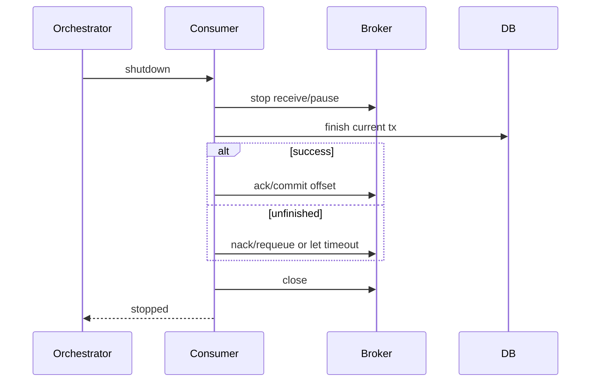
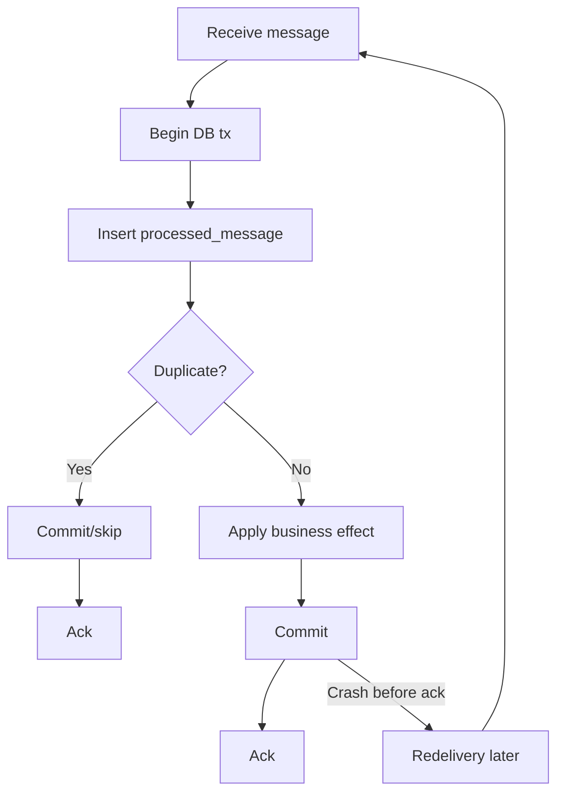
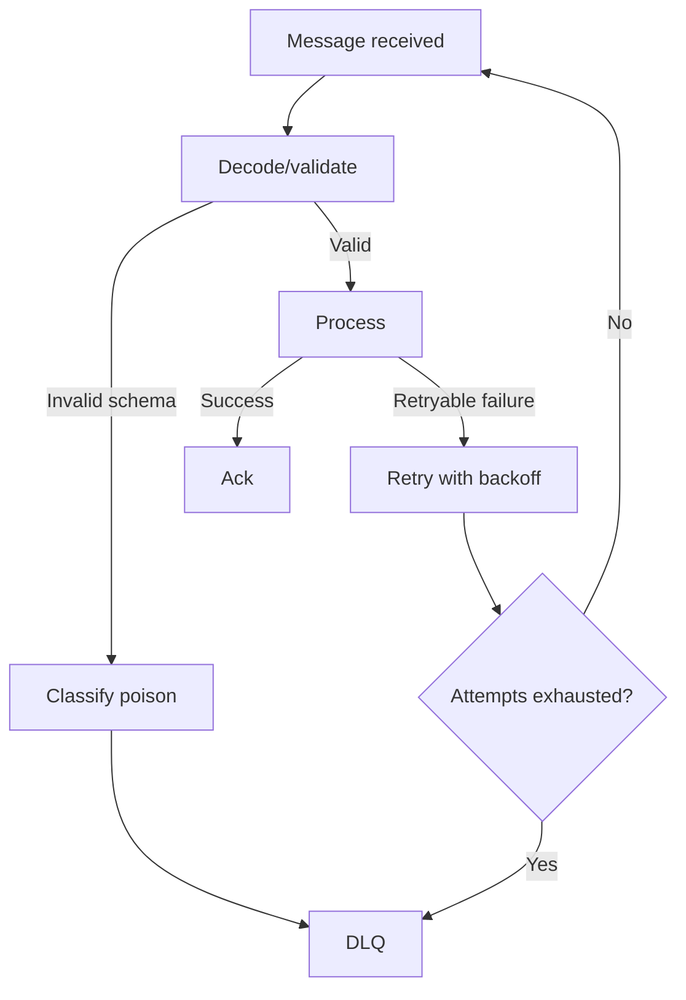
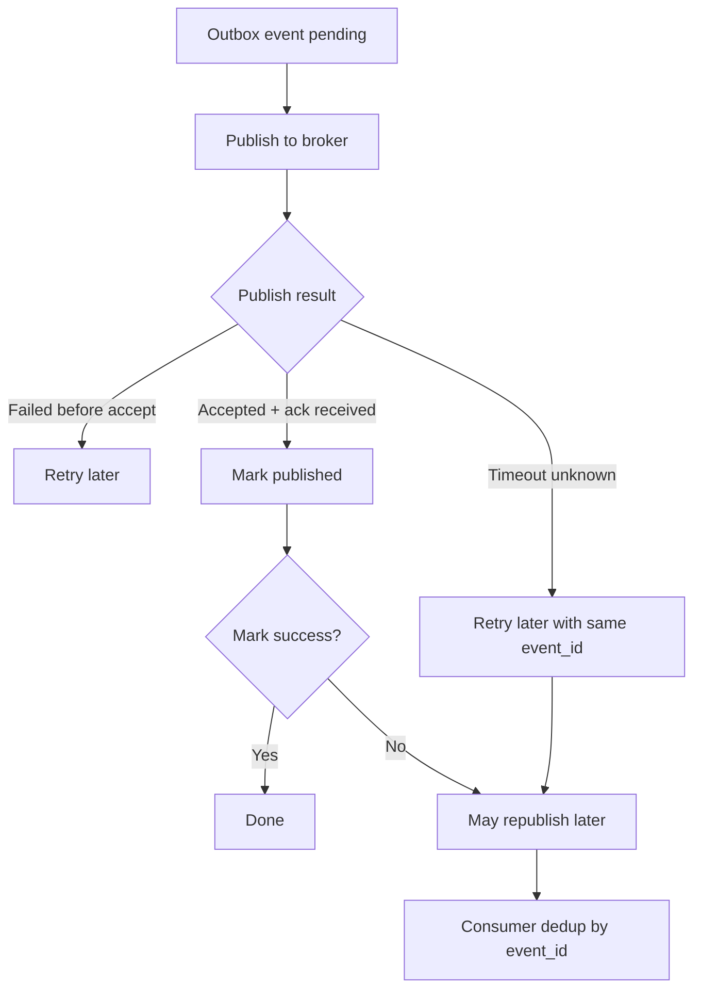

# learn-go-reliability-error-handling-part-028.md

# Messaging Reliability: At-least-once, Ordering, DLQ, Poison Message, Backoff, Rebalance

> Seri: `learn-go-reliability-error-handling`  
> Part: `028`  
> Target: Go 1.26.x  
> Level: Advanced / internal engineering handbook  
> Fokus: reliability pada messaging/event-driven system: delivery semantics, ack/nack, redelivery, dedup, ordering, DLQ, poison message, retry/backoff, consumer group rebalance, outbox/inbox, dan shutdown.

---

## 0. Posisi Materi Ini Dalam Seri

Pada bagian sebelumnya kita membahas **persistence reliability**:

- transaction boundary
- lock
- deadlock
- idempotency
- outbox
- inbox/processed message
- ack-after-commit
- commit ambiguity

Bagian ini melanjutkan secara natural ke **messaging reliability**.

Messaging membuat sistem lebih scalable dan decoupled, tetapi juga membawa failure mode baru:

- duplicate message
- message out of order
- message hilang karena ack salah
- poison message membuat consumer stuck
- retry storm
- DLQ penuh/tidak diproses
- rebalance saat processing
- offset commit salah
- consumer crash setelah commit DB sebelum ack broker
- publish sukses tapi DB mark gagal
- broker unavailable
- partition lag
- visibility timeout expire saat job masih jalan
- message terlalu besar
- schema incompatible
- event replay menyebabkan side effect ulang
- shutdown pod menyebabkan redelivery

Messaging reliability bukan tentang menghindari duplicate. Messaging reliability adalah mendesain sistem yang **tetap benar walaupun duplicate dan redelivery terjadi**.

---

## 1. Core Thesis

Dalam distributed messaging, default mental model yang aman adalah:

> Assume at-least-once delivery, duplicates, reordering, delayed redelivery, partial broker outage, and consumer crash at any point.

Maka desain harus punya:

1. idempotent producer atau outbox
2. stable event/message ID
3. idempotent consumer
4. ack after durable commit
5. retry policy dengan backoff
6. poison message handling
7. DLQ dengan runbook
8. ordering key bila order penting
9. per-message timeout
10. graceful shutdown
11. schema compatibility
12. observability lag/retry/DLQ
13. replay-safe handlers
14. dedup retention
15. recovery/reconciliation

---

## 2. Delivery Semantics

### 2.1 At-most-once

```text
Message delivered zero or one time.
```

Ack/commit before processing. If consumer crashes, message lost.

Use only when loss acceptable:

- telemetry sample
- cache warm signal
- non-critical notification hint

### 2.2 At-least-once

```text
Message delivered one or more times.
```

Common default. If consumer crashes before ack, message redelivered.

Requires idempotent consumer.

### 2.3 Exactly-once

Often misunderstood.

Exactly-once can sometimes be achieved within specific broker/transaction ecosystem, but across arbitrary DB + broker + external API boundaries, the safer mental model is:

```text
effectively-once via idempotency and dedup
```

This means duplicate deliveries may happen, but business effect occurs once.

---

## 3. Messaging Failure Taxonomy

| Failure | Example | Mitigation |
|---|---|---|
| duplicate delivery | consumer crash before ack | dedup/inbox |
| message loss | ack before commit | ack after commit |
| poison message | invalid payload always fails | DLQ |
| retry storm | immediate retry loops | backoff/retry budget |
| out-of-order | partition/retry/rebalance | ordering key/version |
| broker unavailable | publish/consume fails | outbox/reconnect |
| publish ambiguity | producer timeout after send | idempotent event ID |
| consumer crash | pod restart | redelivery + dedup |
| rebalance | partition revoked mid-processing | commit/stop carefully |
| visibility timeout | job longer than timeout | extend/heartbeat/checkpoint |
| schema mismatch | old consumer new event | schema compatibility |
| large message | broker limit/memory | store blob externally |
| DLQ ignored | poison pile grows | alert/runbook |
| duplicate side effect | email/payment repeated | idempotent side effect key |
| lag grows | consumers too slow | scale/fix bottleneck/shed |

---

## 4. Producer Reliability

Producer can fail at:

- before event created
- after DB state changed but before publish
- after publish but before response
- publish timeout but broker accepted
- broker accepted but producer did not receive ack
- app crashes between DB and broker

### 4.1 Direct Publish Anti-pattern

```go
updateDatabase()
publishEvent()
```

If `publishEvent` fails, DB state changed but no event.

If `publishEvent` succeeds then DB rollback, event lies.

### 4.2 Transactional Outbox

Use outbox:

```text
DB transaction:
  update business state
  insert outbox event

dispatcher:
  read outbox
  publish event
  mark published
```

Outbox makes event durable with state.

### 4.3 Event ID

Every event must have stable ID.

```go
type Event struct {
    ID            string
    Type          string
    AggregateID   string
    AggregateType string
    OccurredAt    time.Time
    Payload       []byte
}
```

Use event ID for:

- producer idempotency
- consumer dedup
- tracing
- replay
- DLQ
- audit/reconciliation

---

## 5. Outbox Dispatcher Reliability

Dispatcher failure cases:

| Failure | Result | Mitigation |
|---|---|---|
| publish fails before broker accepts | event remains pending | retry |
| publish succeeds, mark-published fails | event may republish | consumer dedup |
| dispatcher crashes mid-batch | pending retried | idempotent publish/consumer |
| broker down | pending grows | alert/backoff |
| poison event payload | cannot publish/consumer fails | outbox error state/DLQ |

### 5.1 Dispatcher Loop

```go
func (d *Dispatcher) Run(ctx context.Context) error {
    ticker := time.NewTicker(d.interval)
    defer ticker.Stop()

    for {
        if err := d.dispatchOnce(ctx); err != nil && ctx.Err() == nil {
            d.logger.WarnContext(ctx, "outbox dispatch failed", "error", err)
        }

        select {
        case <-ctx.Done():
            return context.Cause(ctx)
        case <-ticker.C:
        }
    }
}
```

### 5.2 Claim Batch

Multiple dispatcher instances need coordination.

Patterns:

- `select ... for update skip locked`
- status `pending -> processing`
- lease with `locked_until`
- partition by aggregate/event ID
- single dispatcher per service instance? less scalable

Example conceptual table:

```text
status: pending | processing | published | failed
locked_by
locked_until
attempts
next_attempt_at
```

### 5.3 Retry With Backoff

```text
next_attempt_at = now + backoff(attempts)
```

Avoid tight retry loop when broker down.

---

## 6. Consumer Reliability

Consumer flow for at-least-once:

```text
receive
decode/validate schema
dedup check
process transaction
commit
ack
```

If fail before commit:

```text
nack/retry/requeue
```

If commit succeeds but ack fails:

```text
message redelivered
dedup skips effect
ack duplicate
```

### 6.1 Consumer Skeleton

```go
func (c *Consumer) Run(ctx context.Context) error {
    for {
        msg, err := c.receiver.Receive(ctx)
        if err != nil {
            if ctx.Err() != nil {
                return context.Cause(ctx)
            }
            return fmt.Errorf("receive message: %w", err)
        }

        if err := c.handle(ctx, msg); err != nil {
            c.logger.WarnContext(ctx, "handle message failed",
                "message_id", msg.ID(),
                "error", err,
            )
        }
    }
}
```

---

## 7. Ack/Nack Policy

Ack means:

```text
I am done; broker can remove/advance.
```

Nack/requeue means:

```text
I failed; broker may redeliver.
```

Reject/DLQ means:

```text
I cannot process this successfully; move aside.
```

Broker APIs differ:

- Kafka commits offset, no per-message ack in same way.
- RabbitMQ has ack/nack/reject.
- SQS has delete message/visibility timeout.
- Pub/Sub has ack/nack/dead-letter policy.
- NATS/Kafka/Rabbit have different semantics.

Always understand broker-specific behavior.

---

## 8. Ack After Commit

Repeat from persistence because it is critical.

Correct:

```text
process durable effect
commit DB
ack broker
```

Incorrect:

```text
ack broker
process DB
```

If crash after ack before DB commit, message lost.

### 8.1 Go Handler

```go
func (c *Consumer) handle(parent context.Context, msg Message) error {
    ctx, cancel := context.WithTimeout(parent, c.cfg.MessageTimeout)
    defer cancel()

    err := c.processor.Process(ctx, msg)

    ackCtx, ackCancel := context.WithTimeout(context.Background(), c.cfg.AckTimeout)
    defer ackCancel()

    switch {
    case err == nil:
        return msg.Ack(ackCtx)

    case IsPoison(err):
        return errors.Join(err, msg.Reject(ackCtx, false))

    case IsRetryable(err):
        return errors.Join(err, msg.Nack(ackCtx, true))

    default:
        return errors.Join(err, msg.Nack(ackCtx, true))
    }
}
```

Ack context often should be independent but bounded, because processing ctx may already be canceled.

---

## 9. Idempotent Consumer / Inbox Pattern

Processed message table:

```sql
create table processed_messages (
    consumer_name text not null,
    message_id text not null,
    processed_at timestamp not null,
    primary key (consumer_name, message_id)
);
```

Processing transaction:

```go
func (p *Processor) Process(ctx context.Context, msg Message) error {
    return p.repo.WithTx(ctx, func(ctx context.Context, tx *sql.Tx) error {
        inserted, err := p.repo.TryInsertProcessedMessage(ctx, tx, p.consumerName, msg.ID())
        if err != nil {
            return err
        }

        if !inserted {
            return ErrDuplicateMessage
        }

        if err := p.applyBusinessEffect(ctx, tx, msg); err != nil {
            return err
        }

        return nil
    })
}
```

If duplicate:

```go
if errors.Is(err, ErrDuplicateMessage) {
    return msg.Ack(ackCtx)
}
```

### 9.1 Dedup Retention

How long keep processed message IDs?

Depends:

- broker redelivery window
- replay policy
- event retention
- business criticality
- storage cost

If events can be replayed months later, dedup record may need longer or handler must be naturally idempotent.

---

## 10. Natural Idempotency

Better than dedup table when possible.

Example:

```sql
update cases
set status = 'SUBMITTED'
where id = ? and status = 'DRAFT'
```

If already submitted, effect is no-op.

But need distinguish:

- duplicate of same event
- conflicting event
- stale/out-of-order event

Natural idempotency often still needs version/operation ID.

---

## 11. Ordering

Messages may not be globally ordered.

Ordering can be per:

- partition
- key
- queue
- consumer group
- aggregate ID
- session/group ID

If order matters for an aggregate, use ordering key:

```text
key = case_id
```

This routes all events for same case to same partition/order stream.

### 11.1 Ordering Is Not Free

Strict ordering reduces parallelism.

If all messages use one key:

```text
one partition bottleneck
```

Choose correct ordering scope:

- per case
- per user
- per tenant
- per document

### 11.2 Out-of-order Handling

Use version/sequence.

Event:

```json
{
  "event_id": "...",
  "aggregate_id": "case-123",
  "aggregate_version": 7,
  "event_type": "case.submitted"
}
```

Consumer:

- if version = expected next, apply
- if version already applied, skip duplicate
- if version gap, delay/retry/fetch current state
- if older, skip
- if impossible, DLQ/reconcile

---

## 12. Reordering Due to Retry

Even if broker preserves partition order, retry mechanisms can break effective order if:

- failed message moved aside and later retried
- later messages continue
- consumer processes concurrently
- DLQ replay happens later
- multiple queues per priority
- outbox dispatcher publishes out of order

If ordering critical, failed message may need to block later messages for same key or use version-aware reconciliation.

---

## 13. Poison Message

Poison message always fails.

Causes:

- invalid schema
- impossible domain state
- missing required field
- unsupported event type
- corrupt payload
- dependency permanent 404
- data too large
- non-retryable validation failure
- bug in consumer

If retried forever, poison message can:

- block queue/partition
- consume CPU
- create log storm
- starve healthy messages
- grow lag

### 13.1 Poison Classification

```go
func IsPoison(err error) bool {
    return errors.Is(err, ErrInvalidSchema) ||
        errors.Is(err, ErrUnsupportedEventType) ||
        errors.Is(err, ErrPermanentDomainFailure)
}
```

Poison should go DLQ after maybe zero/few attempts.

---

## 14. Dead Letter Queue

DLQ stores messages that cannot be processed after policy.

DLQ is not trash. DLQ is an operational workflow.

DLQ record should include:

- original message ID
- original topic/queue
- payload or pointer
- headers
- error code/kind
- attempts
- first failure time
- last failure time
- consumer version
- correlation/trace ID
- stack? internal only
- replay status

### 14.1 DLQ Runbook

For each DLQ:

1. inspect error kind
2. identify poison vs transient
3. fix data/code/config
4. replay safely
5. monitor dedup
6. mark resolved
7. prevent recurrence

### 14.2 DLQ Alerting

Alert on:

- DLQ count > 0 for critical stream
- DLQ rate spike
- oldest DLQ age
- repeated same error code
- replay failures

Do not create DLQ with no owner.

---

## 15. Retry and Backoff

Immediate retry loop is dangerous.

Bad:

```go
for {
    err := process(msg)
    if err == nil { break }
}
```

Good:

- limited attempts
- exponential backoff
- jitter
- max delay
- retry only retryable
- DLQ poison/final failure
- respect context/shutdown

### 15.1 Backoff Formula

```go
func Backoff(attempt int, base, max time.Duration) time.Duration {
    d := base << min(attempt-1, 10)
    if d > max {
        d = max
    }
    jitter := time.Duration(rand.Int63n(int64(d / 2)))
    return d/2 + jitter
}
```

### 15.2 Retry Headers

Store attempt count in message metadata or external state.

Do not trust client-supplied attempt count blindly.

---

## 16. Delayed Retry

Options:

- broker delayed queue
- scheduled message
- visibility timeout extension
- outbox/inbox retry table
- requeue with delay
- separate retry topics
- consumer sleep before nack? usually bad because holds worker

Avoid sleeping inside consumer while holding message if it reduces throughput and visibility semantics.

Better:

```text
move to retry queue with delay
or set next_attempt_at in DB
```

---

## 17. Retry Topic Pattern

Example:

```text
orders.events
orders.events.retry.1m
orders.events.retry.10m
orders.events.dlq
```

Flow:

```text
failure attempt 1 -> retry.1m
failure attempt 2 -> retry.10m
failure attempt N -> dlq
```

Tradeoffs:

- operational complexity
- ordering affected
- message headers must preserve original metadata
- replay tooling needed

---

## 18. Consumer Group Rebalance

In brokers like Kafka, partitions assigned to consumers. Rebalance occurs when:

- consumer joins/leaves
- pod restarts
- scaling
- heartbeat missed
- max poll interval exceeded
- network issue

Risks:

- processing message while partition revoked
- offset commit fails
- duplicate processing
- long processing causes rebalance
- pause/resume mishandled

Mitigations:

- keep processing time within poll/visibility limits
- commit after processing
- handle partition revoke
- idempotent consumer
- graceful shutdown
- avoid long blocking in poll loop
- worker pool with controlled offset commit

---

## 19. Kafka-style Offset Reliability

Kafka commits offsets.

If commit offset before processing:

```text
message loss
```

If process then commit offset:

```text
duplicate possible if crash before commit
```

Thus at-least-once:

```text
process durable effect
commit offset
```

Need dedup.

### 19.1 Parallel Processing Caveat

If processing partition messages concurrently, committing offset becomes tricky.

Example:

```text
offset 10 processing slow
offset 11 done
offset 12 done
cannot commit 12 safely until 10 done
```

Solutions:

- process sequentially per partition
- track completed offsets and commit contiguous sequence
- use partition worker
- accept reprocessing via dedup
- avoid parallelism if ordering required

---

## 20. RabbitMQ-style Prefetch

Prefetch controls unacked messages per consumer.

If prefetch too high:

- many messages in memory
- long redelivery delay on crash
- unfair distribution
- shutdown drain hard

If too low:

- low throughput

Set based on processing time, memory, and concurrency.

For worker pool, align:

```text
prefetch ~= worker concurrency
```

---

## 21. SQS/PubSub Visibility Timeout

Visibility timeout means message hidden for period after receive.

If not deleted/acked before timeout, message redelivered.

If processing can exceed timeout:

- extend visibility/ack deadline
- split work into smaller jobs
- checkpoint
- make idempotent
- increase timeout carefully

During shutdown:

- stop receiving
- finish current if possible
- otherwise do not delete/ack
- allow redelivery
- idempotent processing handles duplicate

---

## 22. Schema Compatibility

Events are contracts.

Compatibility rules:

- add optional fields safely
- do not remove/rename required fields without versioning
- consumers ignore unknown fields if appropriate
- producers include schema version
- use backward/forward compatibility checks
- deploy consumers before producers for additive changes
- validate required fields
- DLQ unsupported schema
- maintain event documentation

### 22.1 Event Envelope

```json
{
  "event_id": "evt_123",
  "event_type": "case.submitted",
  "event_version": 1,
  "aggregate_id": "case_123",
  "aggregate_version": 7,
  "occurred_at": "2026-06-22T10:00:00Z",
  "trace_id": "..."
}
```

Payload can be nested.

---

## 23. Message Size

Large messages cause:

- broker limit errors
- memory pressure
- slow consumers
- retry cost
- DLQ bloat

Pattern:

```text
store large payload in object storage
send pointer + checksum + metadata in message
```

Consumer downloads object with timeout/checksum.

Need handle object not found, permissions, cleanup.

---

## 24. Message Envelope Design

Recommended fields:

```go
type EventEnvelope[T any] struct {
    EventID          string    `json:"event_id"`
    EventType        string    `json:"event_type"`
    EventVersion     int       `json:"event_version"`
    AggregateType    string    `json:"aggregate_type"`
    AggregateID      string    `json:"aggregate_id"`
    AggregateVersion int64     `json:"aggregate_version,omitempty"`
    OperationID      string    `json:"operation_id,omitempty"`
    IdempotencyKeyHash string  `json:"idempotency_key_hash,omitempty"`
    OccurredAt       time.Time `json:"occurred_at"`
    ProducedAt       time.Time `json:"produced_at"`
    TraceID          string    `json:"trace_id,omitempty"`
    Payload          T         `json:"payload"`
}
```

Do not put secrets/PII unless necessary and protected.

---

## 25. Handler Design

Handler should be:

- idempotent
- context-aware
- bounded by timeout
- side-effect safe
- schema validating
- typed-error returning
- observable
- deterministic where possible

```go
type Handler interface {
    Handle(ctx context.Context, msg Message) error
}
```

Do not bury ack inside business handler if you need separation. Let consumer framework handle ack policy based on error.

---

## 26. Error Classification for Messaging

```go
type MessageErrorKind string

const (
    MessageErrorRetryable  MessageErrorKind = "retryable"
    MessageErrorPoison     MessageErrorKind = "poison"
    MessageErrorDuplicate  MessageErrorKind = "duplicate"
    MessageErrorCanceled   MessageErrorKind = "canceled"
    MessageErrorInternal   MessageErrorKind = "internal"
)

type MessageError struct {
    Kind MessageErrorKind
    Err  error
}

func (e *MessageError) Error() string { return string(e.Kind) + ": " + e.Err.Error() }
func (e *MessageError) Unwrap() error { return e.Err }
```

Policy:

| Kind | Action |
|---|---|
| duplicate | ack |
| poison | DLQ/reject |
| retryable | nack/retry |
| canceled shutdown | nack/requeue or let visibility expire |
| internal unknown | retry limited then DLQ |

---

## 27. Worker Pool Consumer

Separate receive from processing carefully.

Bad:

```go
for msg := range messages {
    go process(msg)
    ack immediately
}
```

Good:

- limit concurrency
- ack after process
- handle shutdown
- preserve ordering if required

```go
sem := make(chan struct{}, c.concurrency)

for {
    msg, err := c.receiver.Receive(ctx)
    if err != nil { ... }

    select {
    case sem <- struct{}{}:
    case <-ctx.Done():
        return context.Cause(ctx)
    }

    go func(msg Message) {
        defer func() { <-sem }()
        _ = c.handle(ctx, msg)
    }(msg)
}
```

But shutdown must wait for goroutines. Also offset/ack semantics may not allow arbitrary parallelism.

Use `errgroup`/WaitGroup and broker-specific coordination.

---

## 28. Graceful Shutdown for Consumers

Shutdown sequence:

1. stop receiving new messages
2. stop scheduler/poller
3. wait current messages within budget
4. ack successes
5. nack/requeue unfinished if possible
6. close broker connection
7. flush metrics/logs



---

## 29. Reprocessing and Replay

Replay is valuable for:

- rebuilding read model
- fixing consumer bug
- recovering downstream
- backfill

Replay-safe handler requirements:

- idempotent
- version-aware
- deterministic
- dedup aware
- can handle old schema
- can skip already applied effect
- does not send duplicate external side effects unless outbox/dedup

If handler sends email on event replay, users may receive old emails again. Prevent with notification dedup.

---

## 30. Eventual Consistency and User Experience

Messaging often means eventual consistency.

Example:

```text
Submit case returns 200.
Search index updates asynchronously.
GET case shows submitted.
Search listing may lag.
```

Document expectations:

- status endpoint source of truth
- read model may lag
- UI can show pending state
- outbox pending monitored
- reconcile if lag too high

---

## 31. Backpressure in Messaging

If consumer cannot keep up:

- lag grows
- broker storage grows
- event freshness degrades

Options:

- scale consumers if downstream can handle
- reduce prefetch
- pause low-priority topics
- shed producers
- slow producers via rate limit
- backpressure via queue full response
- brownout optional event production
- optimize processing
- partition by key
- batch carefully

Do not scale consumers if bottleneck is DB; it can worsen DB overload.

---

## 32. Observability

Metrics:

```text
messages_received_total{consumer,topic}
messages_processed_total{consumer,topic,result}
message_processing_duration_seconds{consumer,topic}
message_lag{consumer,topic,partition}
message_redelivery_total{consumer,topic}
message_duplicate_total{consumer,topic}
message_ack_failed_total{consumer,topic}
message_nack_total{consumer,topic,reason}
message_dlq_total{consumer,topic,reason}
message_retry_total{consumer,topic,attempt}
message_oldest_age_seconds{consumer,topic}
consumer_rebalance_total{consumer}
consumer_inflight{consumer}
outbox_pending_events
outbox_oldest_age_seconds
```

Logs:

- DLQ transition
- poison classification
- repeated retry exhausted
- consumer rebalance
- broker reconnect
- schema mismatch
- shutdown with in-flight count

Trace:

- message consume span
- process span
- DB transaction
- publish span
- event ID/operation ID attributes

Avoid high-cardinality metric labels with message ID.

---

## 33. Alerting

Alert on:

- DLQ count/rate
- oldest message age
- consumer lag high
- no messages processed while lag > 0
- ack failure spike
- redelivery spike
- duplicate spike
- outbox oldest age high
- poison message blocking partition
- rebalance storm
- broker connection failures
- retry exhaustion

Do not page on one retry.

---

## 34. Testing Messaging Reliability

### 34.1 Duplicate Message

Process same message twice, assert one business effect.

### 34.2 Crash Before Ack

Simulate process success but ack failure. Redeliver. Assert dedup.

### 34.3 Poison Message

Invalid payload goes DLQ and does not retry forever.

### 34.4 Retryable Failure

Dependency fails twice then succeeds. Assert retry/backoff and final ack.

### 34.5 Ordering

Send aggregate versions 1, 3, 2. Assert policy.

### 34.6 Shutdown

Cancel consumer while processing. Assert stop receiving and current message ack/nack policy.

### 34.7 Schema Version

Old consumer receives new optional field. Assert ignored/handled.

### 34.8 Outbox Duplicate Publish

Publish succeeds but mark fails. Dispatcher republishes. Consumer dedup.

---

## 35. Fault Injection

Inject:

- broker disconnect
- publish timeout
- ack failure
- nack failure
- consumer crash after DB commit
- invalid payload
- slow processing past visibility timeout
- rebalance during processing
- downstream DB timeout
- DLQ unavailable
- outbox DB lock
- large message
- old schema/new schema mismatch

Validate:

- no data corruption
- duplicates safe
- poison isolated
- lag observable
- recovery works
- shutdown clean

---

## 36. Common Anti-patterns

### 36.1 Assuming Exactly-once

Leads to duplicate side effects.

### 36.2 Ack Before Processing

Message loss.

### 36.3 No Dedup

Redelivery duplicates effects.

### 36.4 Infinite Retry of Poison

Partition/queue stuck.

### 36.5 DLQ Without Owner

Failures pile up silently.

### 36.6 Sending Huge Payloads

Broker becomes blob store.

### 36.7 Ignoring Ordering Key

State applied out of order.

### 36.8 Parallel Processing Without Offset Discipline

Message loss or duplicates.

### 36.9 Sleep in Consumer for Backoff

Worker held idle; visibility/heartbeat issues.

### 36.10 Publish Directly in Transaction

External side effect inside lock.

### 36.11 No Schema Version

Consumers break on change.

### 36.12 Closing Broker Before Current Ack

Redelivery/duplicates spike during shutdown.

---

## 37. Production Checklist

### 37.1 Producer

- [ ] outbox for critical events
- [ ] stable event ID
- [ ] event schema version
- [ ] event key/ordering key
- [ ] publish retry/backoff
- [ ] publish metrics
- [ ] duplicate publish safe

### 37.2 Consumer

- [ ] idempotent handler
- [ ] processed message/inbox table if needed
- [ ] ack after commit
- [ ] per-message timeout
- [ ] error classification
- [ ] poison to DLQ
- [ ] retry limit/backoff
- [ ] graceful shutdown
- [ ] schema validation
- [ ] ordering policy

### 37.3 DLQ

- [ ] DLQ configured
- [ ] DLQ owner
- [ ] DLQ alert
- [ ] replay tooling
- [ ] payload safe
- [ ] runbook

### 37.4 Ordering

- [ ] ordering key defined if needed
- [ ] aggregate version included
- [ ] out-of-order policy
- [ ] parallelism does not break order
- [ ] replay handles old events

### 37.5 Observability

- [ ] lag/age metrics
- [ ] retry/redelivery metrics
- [ ] duplicate metrics
- [ ] DLQ metrics
- [ ] ack/nack failure metrics
- [ ] rebalance metrics
- [ ] outbox age metrics

### 37.6 Shutdown

- [ ] stop receiving first
- [ ] wait in-flight
- [ ] ack/nack current
- [ ] close broker after consumer stops
- [ ] shutdown timeout tested

---

## 38. Mermaid: At-least-once Consumer



---

## 39. Mermaid: Poison Message Flow



---

## 40. Mermaid: Outbox Publish Ambiguity



---

## 41. Regulatory Case Management Lens

For case-management/regulatory systems:

Critical events:

```text
case.submitted
case.approved
case.rejected
document.uploaded
audit.recorded
payment.received
appeal.created
```

Reliability rules:

1. Event ID deterministic from operation ID.
2. State change + audit + outbox in one transaction.
3. Consumers dedup by event ID.
4. Notifications dedup by notification key.
5. Search/read model rebuild must be replay-safe.
6. DLQ must be monitored because lost regulatory event is serious.
7. Ordering by `case_id` if state projection depends on order.
8. External agency event dispatch uses outbox retry.
9. Poison event needs incident/runbook, not infinite retry.
10. Shutdown must stop consumers safely before broker close.

---

## 42. Java Engineer Translation Layer

### 42.1 Spring Kafka / Rabbit Listener

Java frameworks often hide ack/retry/DLQ configuration. In Go, you usually implement/compose this explicitly or via broker library.

### 42.2 `@Transactional` Listener

In Java, transaction and offset commit can be integrated depending framework/broker. In Go, be explicit: DB commit first, then ack/commit offset.

### 42.3 Dead Letter Publishing Recoverer

Equivalent in Go: classify error and publish/move message to DLQ with metadata.

### 42.4 Idempotent Consumer

Same pattern: processed-message table or natural idempotency.

---

## 43. Key Takeaways

1. Assume at-least-once delivery unless proven otherwise.
2. At-least-once means duplicates are normal.
3. Exactly-once across arbitrary DB/broker/external systems is usually achieved as effectively-once through idempotency.
4. Ack after durable commit.
5. Use outbox for critical publish.
6. Use inbox/processed message table for duplicate-safe consumption.
7. Poison messages need DLQ, not infinite retry.
8. DLQ needs owner, alert, and replay runbook.
9. Retry needs backoff, jitter, max attempts, and classification.
10. Ordering requires explicit key/version and may reduce parallelism.
11. Parallel processing can break offset/order safety.
12. Visibility timeout/ack deadline must exceed processing or be extended.
13. Rebalance can cause duplicate processing; dedup is mandatory.
14. Event schema is a contract.
15. Large payloads should be stored externally; messages carry pointer.
16. Consumer shutdown must stop receiving before closing broker.
17. Replay-safe handlers are required for recovery/backfill.
18. Messaging makes consistency eventual; document user expectations.
19. Observability must track lag, redelivery, duplicates, DLQ, and outbox age.
20. Messaging reliability is persistence reliability plus delivery semantics.

---

## 44. References

- Microservices.io: Transactional Outbox pattern
- Microservices.io: Idempotent Consumer pattern
- Kafka documentation: consumer groups, offsets, delivery semantics
- RabbitMQ documentation: acknowledgements, confirms, prefetch, dead lettering
- AWS SQS documentation: visibility timeout and dead-letter queues
- Google Pub/Sub documentation: ack deadlines and dead-letter topics
- Go package documentation: `context`, `database/sql`, `errors`

---

## 45. Next Part

Next:

```text
learn-go-reliability-error-handling-part-029.md
```

Topic:

```text
Configuration, Startup, Readiness, Fail-Fast Initialization
```

<!-- NAVIGATION_FOOTER -->
<div class="page-nav">
<a href="./learn-go-reliability-error-handling-part-027.md">⬅️ Persistence Reliability: Transactions, Locks, Consistency, Deadlock, Commit Ambiguity</a>
<a href="./index.md">📚 Kategori</a>
<a href="../../index.md">🏠 Home</a>
<a href="./learn-go-reliability-error-handling-part-029.md">Configuration, Startup, Readiness, Fail-Fast Initialization ➡️</a>
</div>
