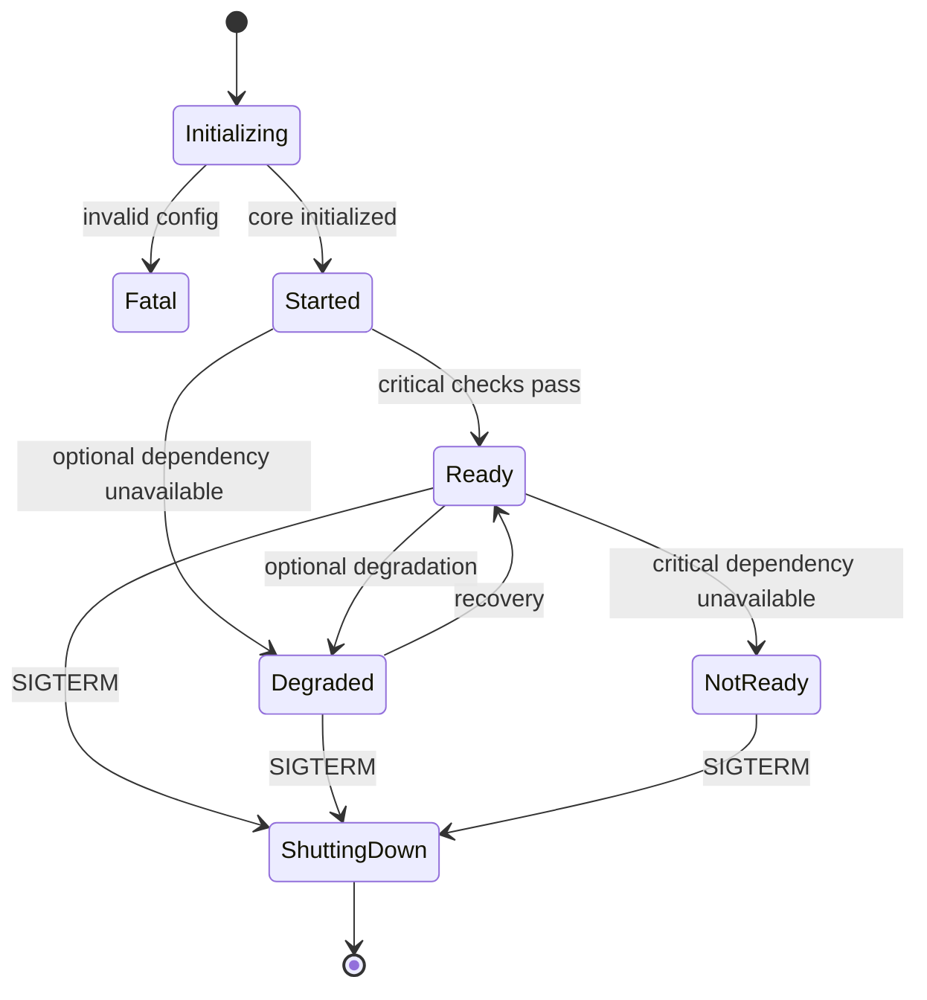
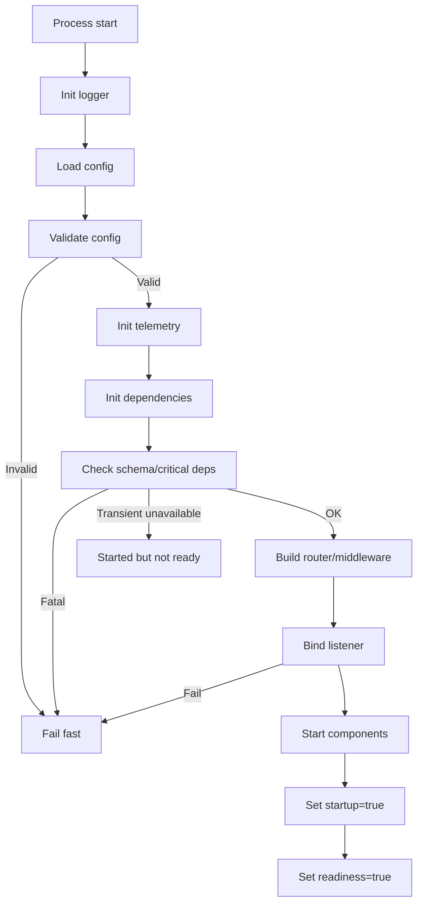
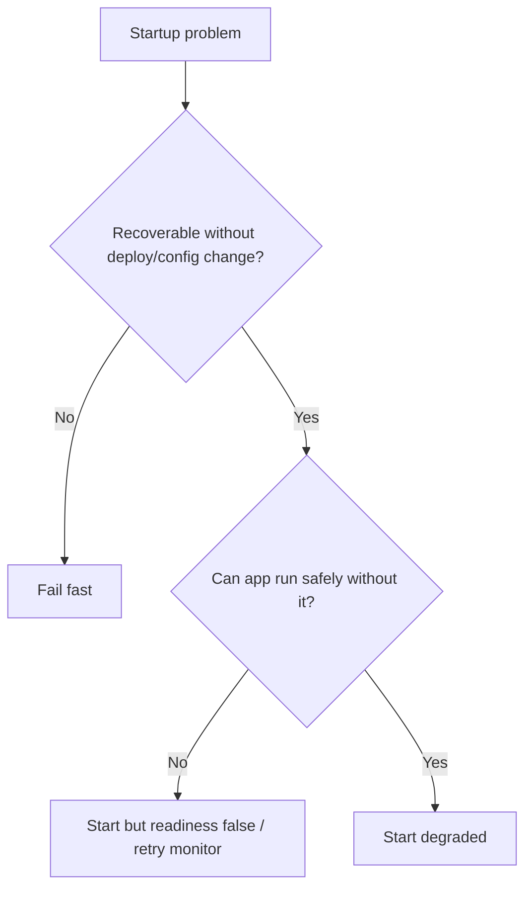
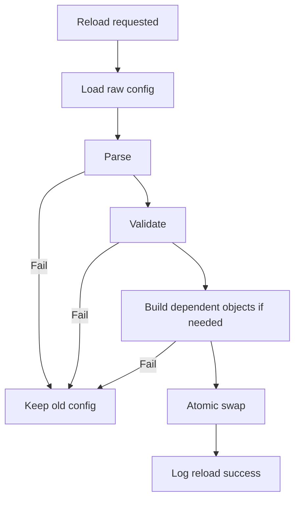

# learn-go-reliability-error-handling-part-029.md

# Configuration, Startup, Readiness, Fail-Fast Initialization

> Seri: `learn-go-reliability-error-handling`  
> Part: `029`  
> Target: Go 1.26.x  
> Level: Advanced / internal engineering handbook  
> Fokus: reliability saat startup: konfigurasi, secret, initialization order, fail-fast, readiness, startup probe, dependency bootstrap, migration, warmup, config reload, dan startup observability.

---

## 0. Posisi Materi Ini Dalam Seri

Sampai bagian ini, kita sudah membahas:

- error model
- timeout/retry/idempotency
- HTTP error boundary
- graceful shutdown
- Kubernetes/container runtime
- dependency failure
- overload handling
- observability
- API error contract
- persistence reliability
- messaging reliability

Sekarang kita membahas fase yang sering diabaikan: **startup**.

Banyak incident dimulai bukan karena request path, tetapi karena service:

- start dengan config salah
- secret missing
- env var typo
- credential expired
- migration belum jalan
- migration jalan di semua pod sekaligus
- readiness true terlalu cepat
- liveness membunuh service saat warming up
- cache dianggap ready padahal belum
- dependency transient down lalu app crash loop
- app menerima traffic sebelum route/middleware siap
- log startup tidak cukup untuk diagnosa
- config reload corrupt
- TLS cert tidak valid
- port bind gagal
- schema mismatch
- feature flag default salah
- fail-open pada auth saat provider unavailable
- pod ready sebelum consumer/outbox siap
- shutdown dari startup failure tidak clean

Startup reliability berarti service hanya menerima traffic ketika benar-benar siap, dan gagal cepat untuk kondisi yang tidak bisa dipulihkan.

---

## 1. Core Thesis

Startup adalah reliability boundary pertama.

Prinsip utama:

1. Validate required configuration before starting work.
2. Fail fast for non-recoverable misconfiguration.
3. Do not become ready until critical initialization completes.
4. Do not block forever on transient dependency.
5. Separate process liveness, startup completion, and readiness.
6. Initialize components in dependency order.
7. Start accepting traffic only after handlers/middleware/state are ready.
8. Avoid long/heavy migration in every pod startup.
9. Log enough startup evidence.
10. Make readiness false during shutdown and startup.
11. Use last-known-good config for reload when applicable.
12. Treat secrets and credentials as dependencies with expiry/rotation.

---

## 2. Startup Failure Taxonomy

| Failure | Example | Policy |
|---|---|---|
| invalid required config | missing DB URL | fail fast |
| invalid secret | bad private key | fail fast |
| expired cert/token | TLS cert expired | fail fast or readiness false depending role |
| port bind failure | address in use | fail fast |
| incompatible schema | migration missing | fail fast/readiness false |
| critical dependency unavailable | DB down | readiness false or fail fast by design |
| optional dependency unavailable | cache down | start degraded |
| telemetry backend unavailable | exporter down | start, warn/drop |
| feature flag service unavailable | use last-known-good/default |
| migration lock busy | another pod migrating | wait bounded/readiness false |
| cache warmup slow | not ready until enough warm or degrade |
| auth provider unavailable | cached JWKS or fail closed |
| config reload invalid | reject reload, keep old config |
| startup panic | bug | crash with stack |

---

## 3. Lifecycle States

A production service should distinguish:

```text
initializing
started
ready
degraded
shutting_down
not_ready
fatal
```

Example:



Kubernetes probes should map to these states.

---

## 4. Liveness, Startup, Readiness

### 4.1 Liveness

Question:

```text
Should the container be restarted?
```

During normal startup, liveness should not kill a slow but healthy service if startup probe exists.

### 4.2 Startup

Question:

```text
Has initialization completed enough that liveness should apply?
```

Use startup probe when initialization may take longer than liveness threshold.

### 4.3 Readiness

Question:

```text
Should this instance receive traffic?
```

Readiness should be false while:

- initializing
- critical dependency unavailable
- migration not complete
- cache/warmup required but not done
- shutdown started
- local component broken

---

## 5. Initialization Order

Typical Go service startup:

```text
1. create root context
2. initialize logger
3. load raw config
4. validate config
5. initialize telemetry
6. initialize build/runtime metadata
7. initialize clients/dependencies
8. initialize repositories/services
9. initialize middleware/router
10. initialize readiness/liveness handlers
11. run startup checks/warmup/migrations if needed
12. start background components
13. start HTTP server
14. mark started
15. mark ready when critical checks pass
```

But exact order depends on app.

Important:

- logger should exist before config validation errors if possible
- do not start workers before config/dependencies valid
- do not mark ready before router/server and critical components ready
- do not start consumers before DB/outbox/dedup ready
- do not accept HTTP before error boundary/middleware ready

---

## 6. Configuration Loading

Sources:

- environment variables
- config file
- command-line flags
- Kubernetes ConfigMap
- Kubernetes Secret
- cloud secret manager
- SSM/Parameter Store
- Vault
- default values

Rules:

1. Required config must be explicit.
2. Defaults only for safe values.
3. Validate range/format.
4. Avoid silent zero values.
5. Do not log secrets.
6. Log sanitized config summary.
7. Config should be immutable after startup unless reload designed.
8. Config should have version/source where possible.

---

## 7. Go Config Struct

```go
type Config struct {
    Env string

    HTTP HTTPConfig
    DB   DBConfig
    Redis RedisConfig
    Auth AuthConfig

    Shutdown ShutdownConfig
    Observability ObservabilityConfig
}

type HTTPConfig struct {
    Addr              string
    ReadHeaderTimeout time.Duration
    ReadTimeout       time.Duration
    WriteTimeout      time.Duration
    IdleTimeout       time.Duration
}

type DBConfig struct {
    DSN             string
    MaxOpenConns    int
    MaxIdleConns    int
    ConnMaxLifetime time.Duration
    ConnMaxIdleTime time.Duration
}

type AuthConfig struct {
    IssuerURL       string
    Audience        string
    JWKSCacheTTL    time.Duration
    FailClosed      bool
}
```

Avoid passing raw map/string values everywhere.

---

## 8. Config Validation

```go
func (c Config) Validate() error {
    var err error

    if c.Env == "" {
        err = errors.Join(err, errors.New("env is required"))
    }

    if c.HTTP.Addr == "" {
        err = errors.Join(err, errors.New("http.addr is required"))
    }

    if c.HTTP.ReadHeaderTimeout <= 0 {
        err = errors.Join(err, errors.New("http.read_header_timeout must be positive"))
    }

    if c.DB.DSN == "" {
        err = errors.Join(err, errors.New("db.dsn is required"))
    }

    if c.DB.MaxOpenConns <= 0 {
        err = errors.Join(err, errors.New("db.max_open_conns must be positive"))
    }

    if c.Auth.IssuerURL == "" {
        err = errors.Join(err, errors.New("auth.issuer_url is required"))
    }

    if c.Shutdown.Total <= 0 {
        err = errors.Join(err, errors.New("shutdown.total must be positive"))
    }

    if budgetErr := c.Shutdown.Validate(); budgetErr != nil {
        err = errors.Join(err, budgetErr)
    }

    return err
}
```

Aggregate validation errors help startup diagnosis.

Do not proceed with invalid required config.

---

## 9. Fail Fast vs Readiness False

Decision table:

| Condition | Preferred policy |
|---|---|
| missing required env | fail fast |
| invalid DSN format | fail fast |
| bad port | fail fast |
| invalid timeout config | fail fast |
| DB temporarily unavailable | readiness false or bounded startup retry |
| DB schema incompatible | fail fast |
| Redis unavailable if optional cache | start degraded |
| Redis unavailable if idempotency store | readiness false/fail critical operations |
| telemetry unavailable | start with warning |
| feature flag unavailable | last-known-good/default |
| auth JWKS unavailable | use cached keys or readiness false/fail closed |
| certificate expired | fail fast |
| migration already running | wait bounded/readiness false |

Fail fast is for errors that will not fix themselves without config/code/deploy change.

Readiness false is for transient recoverable conditions where process can recover.

---

## 10. Startup Checks

Startup check should verify:

- config valid
- required files exist
- cert/private key parse
- DB connection/ping if critical
- schema version compatible
- required tables/indexes exist if needed
- auth issuer/JWKS reachable or cached
- object storage bucket accessible if critical
- broker connection if consumer required
- migration lock status
- dependency credentials valid

But do not overdo startup checks:

- do not run expensive queries
- do not call every optional downstream
- do not block forever
- do not make all pods crash during dependency outage unless intended

### 10.1 Bounded Startup Check

```go
func CheckDB(ctx context.Context, db *sql.DB, timeout time.Duration) error {
    ctx, cancel := context.WithTimeout(ctx, timeout)
    defer cancel()

    if err := db.PingContext(ctx); err != nil {
        return fmt.Errorf("ping db: %w", err)
    }

    return nil
}
```

---

## 11. Startup Retry

For transient startup dependencies, use bounded retry.

```go
func RetryStartup(ctx context.Context, attempts int, base time.Duration, fn func(context.Context) error) error {
    var err error

    for i := 1; i <= attempts; i++ {
        err = fn(ctx)
        if err == nil {
            return nil
        }

        if i == attempts {
            return fmt.Errorf("startup retry exhausted after %d attempts: %w", attempts, err)
        }

        delay := time.Duration(i) * base
        if sleepErr := sleepContext(ctx, delay); sleepErr != nil {
            return sleepErr
        }
    }

    return err
}
```

Use for:

- DB temporarily booting
- broker temporarily unavailable
- JWKS endpoint startup race

Do not use for invalid config.

---

## 12. Readiness Monitor

Instead of blocking startup forever, run dependency monitor.

```go
type ReadinessState struct {
    ready  atomic.Bool
    reason atomic.Value
}

func (r *ReadinessState) SetReady() {
    r.ready.Store(true)
    r.reason.Store("ready")
}

func (r *ReadinessState) SetNotReady(reason string) {
    r.ready.Store(false)
    r.reason.Store(reason)
}

func (r *ReadinessState) Ready() (bool, string) {
    reason, _ := r.reason.Load().(string)
    return r.ready.Load(), reason
}
```

Dependency monitor:

```go
func (m *Monitor) Run(ctx context.Context) error {
    ticker := time.NewTicker(m.interval)
    defer ticker.Stop()

    for {
        m.checkOnce(ctx)

        select {
        case <-ctx.Done():
            return context.Cause(ctx)
        case <-ticker.C:
        }
    }
}
```

Readiness handler reads cached state.

---

## 13. Startup Probe Handler

```go
type StartupState struct {
    started atomic.Bool
}

func (s *StartupState) SetStarted() {
    s.started.Store(true)
}

func (s *StartupState) Handler(w http.ResponseWriter, r *http.Request) {
    if !s.started.Load() {
        w.WriteHeader(http.StatusServiceUnavailable)
        _, _ = w.Write([]byte("starting"))
        return
    }

    w.WriteHeader(http.StatusOK)
    _, _ = w.Write([]byte("ok"))
}
```

Set started after initialization complete enough.

---

## 14. Readiness Handler

```go
func (a *App) ReadyHandler(w http.ResponseWriter, r *http.Request) {
    ready, reason := a.readiness.Ready()
    if !ready {
        w.WriteHeader(http.StatusServiceUnavailable)
        _, _ = w.Write([]byte(reason))
        return
    }

    w.WriteHeader(http.StatusOK)
    _, _ = w.Write([]byte("ok"))
}
```

Do not perform heavy live DB query inside handler.

---

## 15. Liveness Handler

```go
func (a *App) LiveHandler(w http.ResponseWriter, r *http.Request) {
    if a.fatal.Load() {
        w.WriteHeader(http.StatusInternalServerError)
        _, _ = w.Write([]byte("fatal"))
        return
    }

    w.WriteHeader(http.StatusOK)
    _, _ = w.Write([]byte("ok"))
}
```

Liveness should answer process health, not downstream availability.

---

## 16. Build Metadata

Embed version metadata.

```go
var (
    Version = "dev"
    Commit  = "unknown"
    BuiltAt = "unknown"
)
```

Build:

```bash
go build -ldflags="-X main.Version=1.2.3 -X main.Commit=$(git rev-parse HEAD)"
```

Startup log:

```go
logger.Info("starting service",
    "version", Version,
    "commit", Commit,
    "go_version", runtime.Version(),
)
```

Critical during rollout incident.

---

## 17. Sanitized Config Summary

Log safe config summary:

```go
logger.Info("configuration loaded",
    "env", cfg.Env,
    "http_addr", cfg.HTTP.Addr,
    "db_max_open_conns", cfg.DB.MaxOpenConns,
    "shutdown_total", cfg.Shutdown.Total.String(),
    "auth_issuer", cfg.Auth.IssuerURL,
)
```

Do not log:

- DSN with password
- secret values
- tokens
- private keys
- full connection string
- API keys

For DSN, log host/db name only after redaction if safe.

---

## 18. Secret Validation

Secrets can be invalid even if present.

Validate:

- private key parses
- certificate not expired
- token format
- required secret fields non-empty
- DB credentials can authenticate if startup check
- JWKS keys valid
- webhook signing secret length
- encryption key length/version

Example:

```go
func ValidatePEMPrivateKey(pemBytes []byte) error {
    block, _ := pem.Decode(pemBytes)
    if block == nil {
        return errors.New("private key PEM block not found")
    }

    if _, err := x509.ParsePKCS8PrivateKey(block.Bytes); err != nil {
        return fmt.Errorf("parse private key: %w", err)
    }

    return nil
}
```

---

## 19. Credential Expiry

Certificates/tokens expire.

Startup should detect if already expired.

Runtime should monitor if expiring soon.

Metrics:

```text
credential_expiry_seconds{name}
```

Alert before expiry.

Do not discover expired cert only when request fails.

---

## 20. Migration Reliability

Migration strategy affects startup.

### 20.1 Avoid Heavy Migration in Every Pod

Bad:

```text
every pod startup runs migration
```

Risks:

- multiple pods contend
- startup slow
- locks
- CrashLoopBackOff
- partial migration
- rollout blocked

Better:

- migration as separate job
- controlled migration step in pipeline
- leader lock if app-run migration unavoidable
- backward-compatible schema change

### 20.2 Schema Compatibility Check

App can verify expected schema version.

```go
func CheckSchemaVersion(ctx context.Context, db *sql.DB, expected int) error {
    var actual int
    err := db.QueryRowContext(ctx, `select version from schema_version`).Scan(&actual)
    if err != nil {
        return fmt.Errorf("read schema version: %w", err)
    }

    if actual < expected {
        return fmt.Errorf("schema version too old: actual=%d expected=%d", actual, expected)
    }

    return nil
}
```

Fail fast or readiness false depending rollout strategy.

---

## 21. Warmup

Warmup examples:

- load templates
- compile regex
- initialize crypto keys
- load policy snapshot
- prefill cache
- open DB connections
- fetch JWKS
- initialize ML/model data
- build routing table
- check feature flag snapshot

Warmup should be:

- bounded
- observable
- optional vs required classified
- not repeated unnecessarily
- not causing dependency overload during rollout

### 21.1 Staggered Warmup

If 100 pods start and all warm cache from DB, DB spike.

Mitigations:

- jitter
- lazy warmup
- batch limit
- precomputed snapshot
- read-through cache
- warm only critical subset
- readiness after minimum warm set

---

## 22. Startup and Consumers

Should message consumers start before readiness true?

Depends.

For API + consumer in same process:

Option A:

```text
start HTTP ready even if consumer degraded
```

if HTTP can serve independently.

Option B:

```text
readiness false if consumer critical
```

if consumer must run for correctness.

But be careful: readiness affects HTTP traffic, not message delivery. A pod not ready may still run consumers unless you gate them.

Separate deployments for API and worker often simplify reliability.

---

## 23. Startup and Outbox Dispatcher

Outbox dispatcher can start after DB ready.

If broker unavailable:

- API can still accept state changes if outbox stores events
- outbox pending grows
- readiness may remain true if eventual dispatch acceptable
- alert on outbox age

If broker is required synchronously for API contract, then readiness may depend on it, but outbox often decouples.

---

## 24. Startup and Auth Provider

JWT local validation:

- fetch JWKS at startup or lazily
- use cached last-known-good if available
- refresh in background
- fail closed if key missing for token
- readiness false if no keys and auth required

Remote introspection:

- auth provider becomes critical request path dependency
- startup can check endpoint
- readiness may depend on provider health
- use timeout/cache/bulkhead

Do not fail open for auth because provider down.

---

## 25. Startup and Feature Flags

Feature flag startup policies:

- local defaults
- last-known-good snapshot
- remote fetch with timeout
- background refresh
- fail safe for risky features
- do not block startup on optional flag service indefinitely

If feature controls critical security/correctness, treat as required config.

---

## 26. Config Reload

Reload is harder than startup.

Rules:

1. Parse new config fully.
2. Validate new config fully.
3. Build new dependent objects if needed.
4. Swap atomically.
5. Keep old config if new invalid.
6. Log version/change summary.
7. Do not partially apply invalid config.
8. Rollback safely.
9. Protect with synchronization.
10. Test concurrent reads during reload.

### 26.1 Atomic Config Holder

```go
type ConfigHolder struct {
    v atomic.Value // stores Config
}

func (h *ConfigHolder) Load() Config {
    return h.v.Load().(Config)
}

func (h *ConfigHolder) Store(c Config) {
    h.v.Store(c)
}
```

Initialize before use.

### 26.2 Reload Function

```go
func (r *Reloader) Reload(ctx context.Context) error {
    raw, err := r.source.Load(ctx)
    if err != nil {
        return fmt.Errorf("load config: %w", err)
    }

    cfg, err := ParseConfig(raw)
    if err != nil {
        return fmt.Errorf("parse config: %w", err)
    }

    if err := cfg.Validate(); err != nil {
        return fmt.Errorf("validate config: %w", err)
    }

    r.holder.Store(cfg)
    r.logger.InfoContext(ctx, "config reloaded", "version", cfg.Version)

    return nil
}
```

Do not update holder before validation.

---

## 27. Dynamic Config Risks

Some config can be changed safely:

- log level
- rate limit thresholds
- brownout flags
- feature flags
- timeout values with bounds

Some config should require restart:

- DB DSN
- schema mode
- auth issuer
- encryption key
- port/listener
- major dependency endpoint
- queue topic names
- worker concurrency maybe depending implementation

Be explicit.

---

## 28. Initialization Error Wrapping

Startup errors need context.

Bad:

```go
return err
```

Good:

```go
return fmt.Errorf("initialize database: %w", err)
return fmt.Errorf("validate auth config: %w", err)
return fmt.Errorf("start outbox dispatcher: %w", err)
```

At main:

```go
if err := run(); err != nil {
    logger.Error("application failed", "error", err)
    os.Exit(1)
}
```

---

## 29. Panic During Startup

Panic during startup is usually programmer bug.

Recover at top-level only if you can log stack, then exit.

```go
func main() {
    if err := safeMain(); err != nil {
        slog.Error("application failed", "error", err)
        os.Exit(1)
    }
}

func safeMain() (err error) {
    defer func() {
        if v := recover(); v != nil {
            err = fmt.Errorf("panic during startup: %v\n%s", v, debug.Stack())
        }
    }()

    return run()
}
```

Do not continue after unknown startup panic.

---

## 30. Startup Observability

Logs:

```text
application starting
config loaded
config validated
telemetry initialized
db initialized
schema version checked
auth keys loaded
router initialized
background components started
startup completed
readiness true
```

Metrics:

```text
startup_duration_seconds
startup_failures_total{phase}
readiness_state
dependency_startup_check_duration_seconds{dependency}
config_reload_total{result}
credential_expiry_seconds{name}
```

Trace startup? Optional, but logs/metrics usually enough.

---

## 31. Startup Phase Tracking

```go
type StartupPhase struct {
    phase atomic.Value
}

func (s *StartupPhase) Set(phase string) {
    s.phase.Store(phase)
}

func (s *StartupPhase) Get() string {
    v := s.phase.Load()
    if v == nil {
        return "unknown"
    }
    return v.(string)
}
```

Use in logs/readiness debug.

```json
{
  "started": false,
  "phase": "checking_schema"
}
```

Expose only internally.

---

## 32. Startup Timeout

The whole startup should be bounded in orchestrated environment.

```go
startupCtx, cancel := context.WithTimeout(root, cfg.StartupTimeout)
defer cancel()

if err := app.Initialize(startupCtx); err != nil {
    return err
}
```

But if using Kubernetes startup probe with long window, align timeouts.

Do not have startup hang forever waiting for dependency.

---

## 33. Readiness False Until Server Actually Serves

Subtle issue:

```text
mark ready before HTTP listener is serving
```

Kubernetes sends traffic but connection refused.

Start listener and then mark ready, or ensure readiness handler reachable only when server active.

Pattern:

1. initialize
2. start server goroutine
3. optionally wait for listener bound
4. mark started/ready

Using explicit `net.Listen` helps.

```go
ln, err := net.Listen("tcp", cfg.HTTP.Addr)
if err != nil {
    return fmt.Errorf("listen: %w", err)
}

go func() {
    serveErr <- srv.Serve(ln)
}()

readiness.SetReady()
```

If `ListenAndServe` is called inside goroutine, bind error arrives asynchronously. Using `net.Listen` makes bind failure synchronous.

---

## 34. Explicit Listener Pattern

```go
func (a *App) StartHTTP() error {
    ln, err := net.Listen("tcp", a.cfg.HTTP.Addr)
    if err != nil {
        return fmt.Errorf("listen on %s: %w", a.cfg.HTTP.Addr, err)
    }

    a.listener = ln

    go func() {
        err := a.server.Serve(ln)
        if err != nil && !errors.Is(err, http.ErrServerClosed) {
            a.fatal.Store(true)
            a.logger.Error("http server failed", "error", err)
        }
    }()

    return nil
}
```

This catches port bind failure before readiness.

---

## 35. Dependency Optionality Matrix

Create explicit matrix.

| Dependency | Required for startup | Required for readiness | Required for request | Degradation |
|---|---|---|---|---|
| DB | yes/no | yes | most endpoints | none/read-only |
| Redis cache | no | no | optional reads | bypass |
| Redis idempotency | yes/no | yes for write endpoints | submit | fail closed |
| Auth JWKS | yes if no cache | yes | all auth endpoints | cached keys |
| Broker | no if outbox | no maybe | async dispatch | outbox pending |
| Telemetry | no | no | none | drop |
| Feature flag | no | no | feature-specific | defaults/LKG |

This prevents ambiguous startup behavior.

---

## 36. Startup in Multi-component App

If API and worker in same binary:

```go
type ComponentStatus struct {
    Name   string
    Ready  bool
    Reason string
}
```

Readiness can aggregate:

```go
func (a *App) ComputeReady() (bool, string) {
    if a.shutdownGate.ShuttingDown() {
        return false, "shutting_down"
    }
    if !a.dbMonitor.Ready() {
        return false, "db_unavailable"
    }
    if a.auth.Required() && !a.auth.Ready() {
        return false, "auth_unavailable"
    }
    return true, "ready"
}
```

But avoid making readiness depend on optional components.

---

## 37. Fatal Background Component Failure

If critical component fails after startup:

Options:

1. mark readiness false and keep process alive
2. attempt restart with supervisor
3. fatal flag and let liveness restart
4. exit process deliberately after cleanup

Example:

- HTTP listener failure: fatal
- DB monitor failure due bug: maybe restart monitor
- outbox dispatcher failure: supervisor/backoff
- audit writer failure: readiness false/fatal depending architecture
- telemetry exporter failure: warn only

Define policy per component.

---

## 38. Startup and Read-only Mode

If DB writer unavailable but read replica available, service may start read-only.

Readiness response can still be true for read endpoints if routing supports it, but generic Kubernetes readiness cannot distinguish per route.

Options:

- keep ready and return 503 for writes
- split read/write deployments
- use API gateway routing
- expose capability endpoint
- feature flag write-disabled

Error response:

```json
{
  "code": "SERVICE_READ_ONLY",
  "message": "Write operations are temporarily unavailable."
}
```

---

## 39. Startup and Clock

Distributed systems depend on time.

Startup should consider:

- system clock skew
- token validation `nbf/exp`
- certificate validity
- idempotency TTL
- scheduled jobs
- cache TTL
- retry backoff

Usually rely on node time sync, but monitor time skew if critical.

---

## 40. Startup and File System

If app needs files:

- templates
- certificates
- CA bundle
- migrations
- static assets
- policy files

Validate existence and parse at startup.

```go
data, err := os.ReadFile(path)
if err != nil {
    return fmt.Errorf("read policy file %s: %w", path, err)
}
```

If file can be updated via ConfigMap volume, reload carefully.

---

## 41. Startup and Port/Network

Check:

- bind address valid
- port available
- TLS cert/key match
- allowed privileged port?
- IPv4/IPv6 behavior
- proxy/mesh sidecar readiness
- health port vs app port
- admin/debug server binding internal only

Use explicit `net.Listen` for fail-fast bind.

---

## 42. Startup and Debug/pprof

If exposing pprof/debug:

- bind to localhost/internal port
- protect with network policy/auth
- do not expose publicly
- decide if debug server failure is fatal
- shutdown debug server too

Debug endpoints are reliability tools but security risks.

---

## 43. Testing Startup

### 43.1 Missing Config

```go
func TestConfigValidationRequiresDB(t *testing.T) {
    cfg := Config{}
    err := cfg.Validate()
    if err == nil {
        t.Fatal("expected validation error")
    }
}
```

### 43.2 Invalid Duration

Assert negative/zero timeout rejected.

### 43.3 Redaction

Assert sanitized config log does not include password.

### 43.4 Readiness Before/After Startup

- before init: 503
- after init: 200
- after shutdown: 503

### 43.5 Dependency Down

Fake DB ping failure; assert readiness false or fail-fast by policy.

### 43.6 Port Bind Failure

Start listener on port, then app tries same port; assert startup error.

### 43.7 Config Reload Invalid

Load invalid config; assert old config remains active.

---

## 44. Fault Injection Startup

Inject:

- missing secret
- invalid cert
- expired cert
- DB down
- DB schema old
- Redis down
- broker down
- JWKS endpoint timeout
- feature flag down
- ConfigMap invalid
- migration lock held
- port already used
- telemetry backend down

Validate:

- correct fail-fast vs readiness false vs degraded
- logs clear
- no traffic before ready
- no secret leakage
- no CrashLoopBackOff for transient if policy says readiness false
- startup probe window adequate

---

## 45. Anti-patterns

### 45.1 Silent Zero Defaults

`timeout=0` means no timeout or immediate timeout.

### 45.2 Readiness True Too Early

Traffic arrives before app ready.

### 45.3 Liveness Checks DB

DB outage causes restart storm.

### 45.4 Startup Blocks Forever

Pod stuck initializing with no evidence.

### 45.5 Heavy Migration in Every Pod

Rollout causes DB lock storm.

### 45.6 Logging Secrets

Startup logs leak credentials.

### 45.7 Ignoring Bind Error in Goroutine

App marks ready even though server failed.

### 45.8 Optional Dependency Treated Critical

Unnecessary outage.

### 45.9 Critical Dependency Treated Optional

Incorrect success/corruption.

### 45.10 Invalid Reload Partially Applied

Runtime inconsistent.

### 45.11 Consumers Start Before DB/Dedup Ready

Message loss/duplicates/corruption.

### 45.12 No Startup Evidence

CrashLoopBackOff impossible to diagnose.

---

## 46. Production Checklist

### 46.1 Config

- [ ] config struct typed
- [ ] required fields validated
- [ ] ranges validated
- [ ] durations positive
- [ ] shutdown budget validated
- [ ] safe defaults only
- [ ] sanitized config summary logged
- [ ] secrets not logged

### 46.2 Startup

- [ ] logger initialized early
- [ ] telemetry initialized early enough
- [ ] build metadata logged
- [ ] dependencies initialized in order
- [ ] startup timeout bounded
- [ ] explicit listener bind before readiness
- [ ] startup phase logged
- [ ] startup probe supported if needed

### 46.3 Readiness/Liveness

- [ ] liveness simple
- [ ] readiness cached/cheap
- [ ] readiness false during startup
- [ ] readiness false during shutdown
- [ ] critical dependency readiness policy
- [ ] optional dependency degradation policy
- [ ] health endpoints protected from normal admission if needed

### 46.4 Dependencies

- [ ] DB startup policy
- [ ] schema compatibility check
- [ ] auth/JWKS policy
- [ ] cache optionality
- [ ] broker/outbox policy
- [ ] telemetry failure policy
- [ ] feature flag default/LKG policy

### 46.5 Migration

- [ ] migration strategy not per-pod heavy by default
- [ ] schema version known
- [ ] migration lock considered
- [ ] backward-compatible deployment
- [ ] rollback plan

### 46.6 Reload

- [ ] parse before apply
- [ ] validate before apply
- [ ] atomic swap
- [ ] old config retained on failure
- [ ] reload metrics/logs
- [ ] dynamic vs restart-required config documented

### 46.7 Tests

- [ ] config validation tests
- [ ] readiness transition tests
- [ ] dependency failure startup tests
- [ ] reload invalid tests
- [ ] redaction tests
- [ ] bind failure tests
- [ ] startup timeout tests

---

## 47. Mermaid: Startup Flow



---

## 48. Mermaid: Fail Fast vs Readiness False



---

## 49. Mermaid: Config Reload



---

## 50. Regulatory Case Management Lens

For regulatory/case-management systems:

Startup critical:

- DB schema compatible
- audit table available
- idempotency store available for write endpoints
- auth/JWKS available or cached
- template/config for legal documents valid
- outbox table available
- object storage config valid for documents
- migration not half-applied
- feature flags safe default
- readiness false until case state transition path safe

Optional/degradable:

- dashboard cache
- profile enrichment cache
- non-critical telemetry exporter
- report worker if API can serve without it
- recommendation/suggestion service

Fail-fast:

- invalid encryption/signing key
- invalid DB DSN
- missing required auth config
- incompatible schema
- invalid legal template that blocks mandatory document generation

---

## 51. Java Engineer Translation Layer

### 51.1 Spring Boot Configuration Properties

Java/Spring has `@ConfigurationProperties` + validation. In Go, create typed config struct and explicit `Validate()`.

### 51.2 Actuator Health

Spring Actuator has health/readiness/liveness patterns. In Go, implement explicitly with state objects and handlers.

### 51.3 ApplicationContext Startup

Spring fails context startup if bean creation fails. Go startup is manual: each initialization must wrap and return error.

### 51.4 Dynamic Config

Spring Cloud Config/RefreshScope can reload config. In Go, use atomic config holder and validate-before-swap.

---

## 52. Key Takeaways

1. Startup is a reliability boundary.
2. Fail fast for invalid required config and non-recoverable setup.
3. Use readiness false for transient recoverable dependency unavailability.
4. Do not mark ready until the service can actually serve.
5. Liveness, startup, and readiness answer different questions.
6. Config must be typed and validated.
7. Silent zero values are dangerous.
8. Secrets must be validated but never logged.
9. Startup checks must be bounded.
10. Heavy migrations should not run in every pod startup.
11. Warmup should be bounded and jittered.
12. Optional dependencies should degrade, not block startup.
13. Critical dependencies need explicit policy.
14. Config reload must parse/validate before atomic swap.
15. Explicit listener bind catches port errors before readiness.
16. Startup observability is essential for CrashLoopBackOff diagnosis.
17. Auth/idempotency/audit configs are correctness-critical.
18. Startup failure policy must align with Kubernetes probes.
19. Dynamic config is a reliability feature and a risk.
20. A service should be either clearly ready, clearly not ready, degraded by design, or failed fast.

---

## 53. References

- Go package documentation: `context`
- Go package documentation: `net/http`
- Go package documentation: `net`
- Go package documentation: `os`
- Go package documentation: `crypto/x509`
- Go package documentation: `runtime`
- Kubernetes documentation: liveness, readiness, and startup probes
- Kubernetes documentation: ConfigMaps and Secrets
- Kubernetes documentation: Pod lifecycle
- Twelve-Factor App: Config
- Google SRE Book: monitoring and practical alerting concepts

---

## 54. Next Part

Next:

```text
learn-go-reliability-error-handling-part-030.md
```

Topic:

```text
Testing Error Handling and Reliability Behavior
```


<!-- NAVIGATION_FOOTER -->
<div class="page-nav">
<a href="./learn-go-reliability-error-handling-part-028.md">⬅️ Messaging Reliability: At-least-once, Ordering, DLQ, Poison Message, Backoff, Rebalance</a>
<a href="./index.md">📚 Kategori</a>
<a href="../../index.md">🏠 Home</a>
<a href="./learn-go-reliability-error-handling-part-030.md">Testing Error Handling and Reliability Behavior ➡️</a>
</div>
