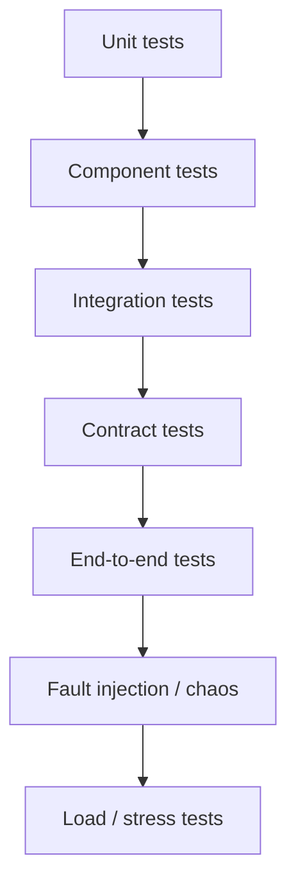
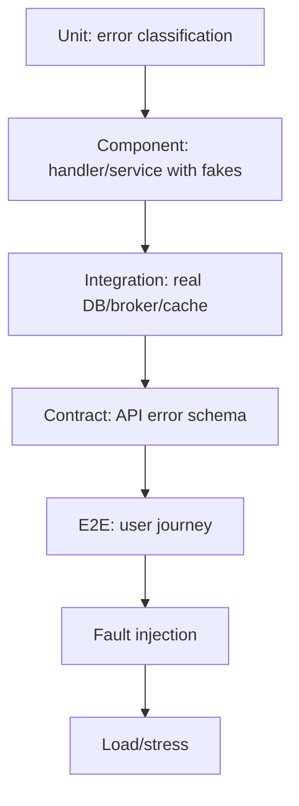
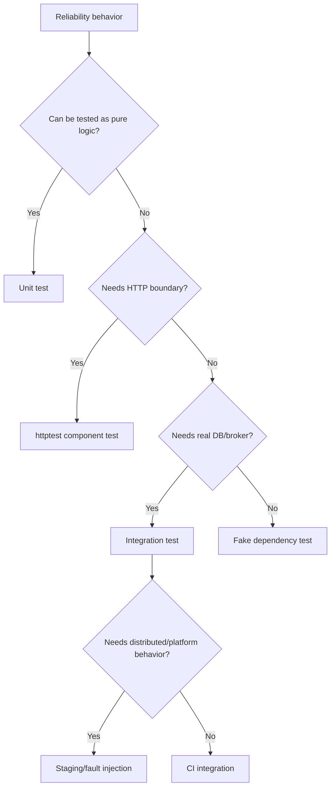
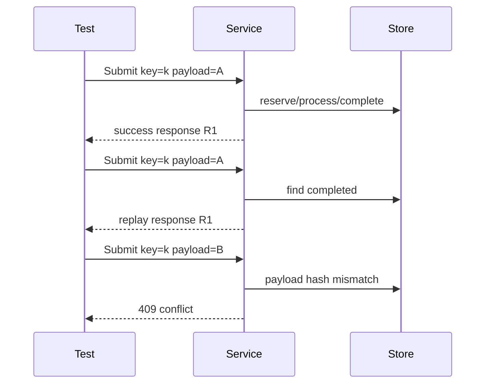

# learn-go-reliability-error-handling-part-030.md

# Testing Error Handling and Reliability Behavior

> Seri: `learn-go-reliability-error-handling`  
> Part: `030`  
> Target: Go 1.26.x  
> Level: Advanced / internal engineering handbook  
> Fokus: menguji error handling dan reliability behavior secara sistematis: unit, integration, contract, concurrency, timeout, retry, idempotency, persistence, messaging, HTTP boundary, overload, shutdown, dan observability.

---

## 0. Posisi Materi Ini Dalam Seri

Sampai bagian ini kita sudah membahas banyak konsep reliability:

- error wrapping
- error boundary
- validation/domain/dependency error
- panic/recover
- context cancellation
- timeout
- retry
- idempotency
- concurrency/channel failure
- HTTP server reliability
- graceful shutdown
- Kubernetes runtime behavior
- dependency failure
- circuit breaker/bulkhead/rate limit
- overload handling
- observability
- API error contract
- persistence reliability
- messaging reliability
- startup/readiness/fail-fast

Sekarang pertanyaan paling penting:

> Bagaimana kita membuktikan semua behavior ini benar?

Banyak engineer menulis test hanya untuk happy path:

```text
input valid -> output success
```

Tetapi production failure sering terjadi pada:

- timeout
- context canceled
- dependency 503
- DB deadlock
- duplicate request
- panic
- partial response
- queue full
- shutdown during request
- broker redelivery
- retry exhausted
- validation multiple fields
- commit ambiguity
- cache down
- race condition
- stale state
- liveness/readiness transition

Testing reliability berarti menguji **behavior under failure**, bukan hanya logic normal.

---

## 1. Core Thesis

Reliability behavior harus menjadi bagian dari test suite.

Prinsip utama:

1. Test error classification.
2. Test public error contract.
3. Test timeout and cancellation.
4. Test retry boundaries and retry exhaustion.
5. Test idempotency replay/conflict/in-progress.
6. Test panic recovery and no leakage.
7. Test transaction rollback/commit ambiguity behavior.
8. Test concurrency conflict and race.
9. Test overload rejection.
10. Test graceful shutdown.
11. Test observability side effects.
12. Test dependency failure with fakes.
13. Test messaging duplicate/poison/DLQ.
14. Test startup fail-fast/readiness.
15. Make tests deterministic.

Reliability code that is not tested becomes folklore.

---

## 2. Testing Pyramid for Reliability



Each layer has role:

| Layer | Purpose |
|---|---|
| unit | classify errors, small logic, mapper |
| component | handler/service with fakes |
| integration | real DB/broker/cache/container |
| contract | API schema/status/code stability |
| e2e | user flow across components |
| fault injection | failure behavior |
| load/stress | overload and saturation behavior |
| race tests | concurrency safety |

Do not put every scenario in E2E. Most reliability behavior can be tested lower.

---

## 3. Test Naming

Use behavior-oriented names.

Bad:

```go
func TestSubmit(t *testing.T)
```

Good:

```go
func TestSubmit_ReturnsConflict_WhenCaseAlreadySubmitted(t *testing.T)
func TestSubmit_ReplaysResponse_WhenSameIdempotencyKeyAndPayload(t *testing.T)
func TestSubmit_ReturnsServiceBusy_WhenDBPoolWaitExceedsBudget(t *testing.T)
func TestSubmit_RollsBack_WhenAuditInsertFails(t *testing.T)
```

Naming should state:

```text
function_behavior_condition
```

---

## 4. Table-driven Tests

Great for error mapping.

```go
func TestErrorMapper(t *testing.T) {
    tests := []struct {
        name       string
        err        error
        wantStatus int
        wantCode   string
    }{
        {
            name:       "validation",
            err:        &ValidationError{},
            wantStatus: http.StatusBadRequest,
            wantCode:   "VALIDATION_FAILED",
        },
        {
            name:       "forbidden",
            err:        ErrForbidden,
            wantStatus: http.StatusForbidden,
            wantCode:   "FORBIDDEN",
        },
        {
            name:       "dependency timeout",
            err:        &DependencyError{Kind: DependencyTimeout, Err: context.DeadlineExceeded},
            wantStatus: http.StatusGatewayTimeout,
            wantCode:   "DEPENDENCY_TIMEOUT",
        },
    }

    mapper := ErrorMapper{}

    for _, tt := range tests {
        t.Run(tt.name, func(t *testing.T) {
            got := mapper.Map(tt.err)
            if got.Status != tt.wantStatus {
                t.Fatalf("status=%d want=%d", got.Status, tt.wantStatus)
            }
            if got.Code != tt.wantCode {
                t.Fatalf("code=%s want=%s", got.Code, tt.wantCode)
            }
        })
    }
}
```

---

## 5. Testing Error Wrapping

Test `errors.Is` and `errors.As`.

```go
func TestRepositoryWrapsNotFound(t *testing.T) {
    err := fmt.Errorf("load case: %w", ErrCaseNotFound)

    if !errors.Is(err, ErrCaseNotFound) {
        t.Fatalf("expected ErrCaseNotFound in chain")
    }
}
```

Typed error:

```go
func TestDependencyErrorAs(t *testing.T) {
    err := fmt.Errorf("submit: %w", &DependencyError{
        Dependency: "profile",
        Operation:  "get",
        Kind:       DependencyTimeout,
        Err:        context.DeadlineExceeded,
    })

    var dep *DependencyError
    if !errors.As(err, &dep) {
        t.Fatalf("expected DependencyError")
    }

    if dep.Dependency != "profile" {
        t.Fatalf("dependency=%s", dep.Dependency)
    }
}
```

---

## 6. Testing Public API Error Contract

Use `httptest`.

```go
func TestHandler_ReturnsValidationProblem(t *testing.T) {
    h := buildTestHandler()

    req := httptest.NewRequest(http.MethodPost, "/cases/123/submit", strings.NewReader(`{}`))
    req.Header.Set("Content-Type", "application/json")
    rr := httptest.NewRecorder()

    h.ServeHTTP(rr, req)

    if rr.Code != http.StatusBadRequest {
        t.Fatalf("status=%d", rr.Code)
    }

    var p Problem
    if err := json.NewDecoder(rr.Body).Decode(&p); err != nil {
        t.Fatal(err)
    }

    if p.Code != "VALIDATION_FAILED" {
        t.Fatalf("code=%s", p.Code)
    }

    if p.CorrelationID == "" {
        t.Fatalf("missing correlation id")
    }
}
```

### 6.1 Test No Internal Leakage

```go
func TestInternalErrorDoesNotLeak(t *testing.T) {
    h := handlerReturningError(errors.New("sql password=secret host=10.0.0.1"))

    rr := httptest.NewRecorder()
    req := httptest.NewRequest(http.MethodGet, "/boom", nil)

    h.ServeHTTP(rr, req)

    body := rr.Body.String()
    if strings.Contains(body, "secret") || strings.Contains(body, "10.0.0.1") {
        t.Fatalf("leaked internal detail: %s", body)
    }
}
```

---

## 7. Testing JSON Decode Hardening

Scenarios:

- malformed JSON
- unknown field
- multiple JSON documents
- too large body
- wrong content type
- empty body
- wrong type

```go
func TestDecodeJSON_RejectsUnknownField(t *testing.T) {
    req := httptest.NewRequest(http.MethodPost, "/", strings.NewReader(`{"unknown": true}`))
    req.Header.Set("Content-Type", "application/json")
    rr := httptest.NewRecorder()

    var dst SubmitRequest
    err := decodeJSON(rr, req, &dst, 1024)

    if !errors.Is(err, ErrUnknownField) {
        t.Fatalf("expected unknown field, got %v", err)
    }
}
```

Body too large:

```go
func TestDecodeJSON_BodyTooLarge(t *testing.T) {
    req := httptest.NewRequest(http.MethodPost, "/", strings.NewReader(`{"name":"abcdef"}`))
    rr := httptest.NewRecorder()

    var dst SubmitRequest
    err := decodeJSON(rr, req, &dst, 4)

    if !errors.Is(err, ErrPayloadTooLarge) {
        t.Fatalf("expected payload too large, got %v", err)
    }
}
```

---

## 8. Testing Panic Recovery

```go
func TestRecoverMiddleware_ReturnsGeneric500(t *testing.T) {
    logger := slog.New(slog.NewTextHandler(io.Discard, nil))

    h := RecoverMiddleware(logger, http.HandlerFunc(func(w http.ResponseWriter, r *http.Request) {
        panic("secret internal panic")
    }))

    rr := httptest.NewRecorder()
    req := httptest.NewRequest(http.MethodGet, "/panic", nil)

    h.ServeHTTP(rr, req)

    if rr.Code != http.StatusInternalServerError {
        t.Fatalf("status=%d", rr.Code)
    }

    if strings.Contains(rr.Body.String(), "secret internal panic") {
        t.Fatalf("panic leaked: %s", rr.Body.String())
    }
}
```

### 8.1 Panic After Response Committed

```go
func TestRecoverMiddleware_DoesNotWriteSecondResponse_WhenCommitted(t *testing.T) {
    h := RecoverMiddleware(testLogger(), http.HandlerFunc(func(w http.ResponseWriter, r *http.Request) {
        w.WriteHeader(http.StatusOK)
        _, _ = w.Write([]byte("partial"))
        panic("boom")
    }))

    rr := httptest.NewRecorder()
    req := httptest.NewRequest(http.MethodGet, "/", nil)

    h.ServeHTTP(rr, req)

    if rr.Code != http.StatusOK {
        t.Fatalf("expected committed status 200, got %d", rr.Code)
    }
}
```

---

## 9. Testing Context Cancellation

### 9.1 Service Stops When Context Canceled

```go
func TestServiceStopsOnContextCancel(t *testing.T) {
    ctx, cancel := context.WithCancel(context.Background())
    cancel()

    err := service.Do(ctx)

    if !errors.Is(err, context.Canceled) {
        t.Fatalf("expected canceled, got %v", err)
    }
}
```

### 9.2 Handler Passes Request Context

Use fake dependency that observes context.

```go
type contextCheckingRepo struct {
    sawDone bool
}

func (r *contextCheckingRepo) Load(ctx context.Context) error {
    <-ctx.Done()
    r.sawDone = true
    return context.Cause(ctx)
}
```

---

## 10. Testing Timeout

Use fake clock when possible. If using real time, keep small but not flaky.

```go
func TestDependencyTimeout(t *testing.T) {
    dep := DependencyFunc(func(ctx context.Context) error {
        <-ctx.Done()
        return context.Cause(ctx)
    })

    ctx := context.Background()
    err := callWithTimeout(ctx, 10*time.Millisecond, dep)

    if !errors.Is(err, context.DeadlineExceeded) {
        t.Fatalf("expected deadline, got %v", err)
    }
}
```

Avoid sleeps longer than necessary.

### 10.1 Prefer Controllable Blocking

Instead of `time.Sleep(1 * time.Second)`:

```go
blocked := make(chan struct{})

dep := func(ctx context.Context) error {
    select {
    case <-blocked:
        return nil
    case <-ctx.Done():
        return context.Cause(ctx)
    }
}
```

---

## 11. Testing Retry

Test:

- retryable error retries
- permanent error does not retry
- max attempts
- context cancellation stops retry
- backoff called
- success after attempt N
- retry budget exhausted

```go
func TestRetry_SucceedsAfterTransientFailure(t *testing.T) {
    attempts := 0

    err := Retry(context.Background(), RetryConfig{
        MaxAttempts: 3,
        Sleep: func(ctx context.Context, d time.Duration) error {
            return nil
        },
    }, func(ctx context.Context) error {
        attempts++
        if attempts < 2 {
            return ErrTransient
        }
        return nil
    })

    if err != nil {
        t.Fatal(err)
    }
    if attempts != 2 {
        t.Fatalf("attempts=%d", attempts)
    }
}
```

Inject sleep function to avoid real wait.

---

## 12. Testing Idempotency

### 12.1 Same Key Same Payload Replays

```go
func TestIdempotency_ReplaysSamePayload(t *testing.T) {
    store := NewInMemoryIdempotencyStore()
    svc := NewService(store)

    req := SubmitRequest{IdempotencyKey: "k1", Payload: "same"}

    first, err := svc.Submit(context.Background(), req)
    if err != nil {
        t.Fatal(err)
    }

    second, err := svc.Submit(context.Background(), req)
    if err != nil {
        t.Fatal(err)
    }

    if first.OperationID != second.OperationID {
        t.Fatalf("expected replay same operation")
    }
}
```

### 12.2 Same Key Different Payload Conflicts

```go
func TestIdempotency_ConflictDifferentPayload(t *testing.T) {
    store := NewInMemoryIdempotencyStore()
    svc := NewService(store)

    _, err := svc.Submit(context.Background(), SubmitRequest{IdempotencyKey: "k1", Payload: "a"})
    if err != nil {
        t.Fatal(err)
    }

    _, err = svc.Submit(context.Background(), SubmitRequest{IdempotencyKey: "k1", Payload: "b"})
    if !errors.Is(err, ErrIdempotencyConflict) {
        t.Fatalf("expected conflict, got %v", err)
    }
}
```

### 12.3 Concurrent Same Key

Run concurrent requests; assert one executes business operation and others replay/in-progress.

Use `sync.WaitGroup` and atomic counter.

---

## 13. Testing HTTP Client Dependency Failure

Use `httptest.Server`.

### 13.1 503 Mapping

```go
func TestClientMaps503ToDependencyUnavailable(t *testing.T) {
    srv := httptest.NewServer(http.HandlerFunc(func(w http.ResponseWriter, r *http.Request) {
        w.WriteHeader(http.StatusServiceUnavailable)
    }))
    defer srv.Close()

    c := NewProfileClient(srv.URL)

    _, err := c.GetProfile(context.Background(), "u1")

    var dep *DependencyError
    if !errors.As(err, &dep) {
        t.Fatalf("expected DependencyError, got %v", err)
    }
    if dep.Kind != DependencyUnavailable {
        t.Fatalf("kind=%s", dep.Kind)
    }
}
```

### 13.2 Invalid JSON

```go
srv := httptest.NewServer(http.HandlerFunc(func(w http.ResponseWriter, r *http.Request) {
    w.WriteHeader(http.StatusOK)
    _, _ = w.Write([]byte(`{bad`))
}))
```

Assert `DependencyBadResponse`.

---

## 14. Testing DB Error Handling

Unit test classifier with fake errors where possible.

Integration test with real DB for:

- unique violation
- foreign key violation
- transaction rollback
- optimistic version conflict
- deadlock/serialization if feasible
- pool exhaustion

### 14.1 Rollback on Error

Fake transaction is hard with `database/sql`; integration test is more reliable.

Flow:

```text
begin tx through service
insert row A
force error
assert row A not committed
```

### 14.2 Optimistic Version Conflict

```go
func TestUpdateVersionConflict(t *testing.T) {
    // insert case version=1
    // update with expected version=1 succeeds
    // update again with expected version=1 fails
}
```

---

## 15. Testing Commit Ambiguity

Real commit ambiguity is hard to reproduce.

Use fault injection seam.

```go
type TxRunner interface {
    WithTx(ctx context.Context, fn func(context.Context, Tx) error) error
}

type ambiguousTxRunner struct{}

func (r ambiguousTxRunner) WithTx(ctx context.Context, fn func(context.Context, Tx) error) error {
    if err := fn(ctx, fakeTx{}); err != nil {
        return err
    }
    return ErrCommitAmbiguous
}
```

Test service calls idempotency resolution.

```go
func TestSubmit_ResolvesCommitAmbiguity(t *testing.T) {
    svc := Service{tx: ambiguousTxRunner{}, idem: fakeResolvedIdem{}}

    _, err := svc.Submit(ctx, req)
    if err != nil {
        t.Fatal(err)
    }

    if !svc.idem.ResolveCalled {
        t.Fatal("expected idempotency resolve")
    }
}
```

---

## 16. Testing Concurrency

### 16.1 Concurrent Updates

```go
func TestConcurrentSubmit_OnlyOneWins(t *testing.T) {
    const n = 20

    var wg sync.WaitGroup
    results := make(chan error, n)

    for i := 0; i < n; i++ {
        wg.Add(1)
        go func(i int) {
            defer wg.Done()
            _, err := svc.Submit(ctx, SubmitRequest{
                CaseID: caseID,
                IdempotencyKey: fmt.Sprintf("k-%d", i),
            })
            results <- err
        }(i)
    }

    wg.Wait()
    close(results)

    success := 0
    conflicts := 0

    for err := range results {
        if err == nil {
            success++
        } else if errors.Is(err, ErrInvalidStateTransition) {
            conflicts++
        } else {
            t.Fatalf("unexpected err: %v", err)
        }
    }

    if success != 1 {
        t.Fatalf("success=%d want=1", success)
    }
}
```

### 16.2 Race Detector

Run:

```bash
go test -race ./...
```

Race detector is essential for shared state:

- readiness state
- circuit breaker
- idempotency memory store
- worker pool
- metrics wrappers
- shutdown gate
- config holder

---

## 17. Testing Circuit Breaker/Bulkhead/Rate Limit

Already introduced in parts 023/024.

Test:

- breaker opens
- half-open allows limited probe
- success closes
- failure reopens
- bulkhead rejects when full
- rate limiter rejects after burst
- context cancel while waiting
- metrics increment

Use fake clock for breaker cooldown if possible.

---

## 18. Testing Overload

### 18.1 Admission

```go
func TestAdmission_Returns503_WhenLimitExceeded(t *testing.T) {
    limiter := &InflightLimiter{max: 1}
    h := limiter.Middleware(http.HandlerFunc(func(w http.ResponseWriter, r *http.Request) {
        select {}
    }))

    // Better use controlled blocker instead of select{} in real test.
}
```

Use blocker channel to occupy slot.

### 18.2 Queue Full

Assert `ErrQueueFull` maps to 503 or 429 depending policy.

### 18.3 Priority

Assert low priority rejected while high priority accepted under pressure.

### 18.4 Brownout

Assert optional dependency not called when brownout enabled.

---

## 19. Testing Graceful Shutdown

Test:

- readiness false on shutdown
- gate rejects new requests
- server drains in-flight
- shutdown timeout forces close
- workers stop
- consumers stop receiving
- telemetry flush called

### 19.1 HTTP Drain

Use `net.Listener` and real `http.Server`.

```go
func TestHTTPShutdownWaitsInflight(t *testing.T) {
    started := make(chan struct{})
    release := make(chan struct{})

    srv := &http.Server{
        Handler: http.HandlerFunc(func(w http.ResponseWriter, r *http.Request) {
            close(started)
            <-release
            w.WriteHeader(http.StatusOK)
        }),
    }

    ln, err := net.Listen("tcp", "127.0.0.1:0")
    if err != nil {
        t.Fatal(err)
    }

    go func() { _ = srv.Serve(ln) }()

    doneReq := make(chan struct{})
    go func() {
        _, _ = http.Get("http://" + ln.Addr().String())
        close(doneReq)
    }()

    <-started

    doneShutdown := make(chan error, 1)
    go func() {
        ctx, cancel := context.WithTimeout(context.Background(), time.Second)
        defer cancel()
        doneShutdown <- srv.Shutdown(ctx)
    }()

    select {
    case <-doneShutdown:
        t.Fatal("shutdown returned before request completed")
    case <-time.After(20 * time.Millisecond):
    }

    close(release)

    if err := <-doneShutdown; err != nil {
        t.Fatal(err)
    }
}
```

---

## 20. Testing Messaging Reliability

Use fake broker.

Scenarios:

- duplicate message skipped
- poison goes DLQ
- retryable nacks
- success acks
- processing success + ack failure redelivers
- shutdown stops receiving
- in-flight completes before close

Fake message:

```go
type fakeMessage struct {
    id       string
    acked    atomic.Bool
    nacked   atomic.Bool
    rejected atomic.Bool
}

func (m *fakeMessage) ID() string { return m.id }
func (m *fakeMessage) Ack(ctx context.Context) error {
    m.acked.Store(true)
    return nil
}
func (m *fakeMessage) Nack(ctx context.Context, requeue bool) error {
    m.nacked.Store(true)
    return nil
}
func (m *fakeMessage) Reject(ctx context.Context, requeue bool) error {
    m.rejected.Store(true)
    return nil
}
```

---

## 21. Testing Observability

### 21.1 Metrics

Use in-memory registry if using Prometheus/OpenTelemetry.

Assert counter increments.

```go
func TestDependencyTimeoutMetric(t *testing.T) {
    metrics := NewTestMetrics()
    client := NewClient(failingTransport{}, metrics)

    _, _ = client.Get(ctx)

    got := metrics.DependencyErrors("profile", "timeout")
    if got != 1 {
        t.Fatalf("metric=%d", got)
    }
}
```

### 21.2 Logs

Use buffer handler.

```go
var buf bytes.Buffer
logger := slog.New(slog.NewJSONHandler(&buf, nil))

logger.Error("request failed", "error_code", "DEPENDENCY_TIMEOUT")

if !strings.Contains(buf.String(), "DEPENDENCY_TIMEOUT") {
    t.Fatalf("missing code in log")
}
```

### 21.3 Traces

Use in-memory exporter if instrumented. Assert span attributes.

---

## 22. Testing Startup/Readiness

Scenarios:

- invalid config fails
- DB unavailable -> readiness false
- optional cache unavailable -> degraded but started
- startup probe false until started
- readiness false during shutdown
- config reload invalid keeps old config
- secret redaction

```go
func TestConfigReload_InvalidKeepsOld(t *testing.T) {
    holder := ConfigHolder{}
    holder.Store(Config{Version: "old"})

    reloader := Reloader{
        holder: &holder,
        source: invalidSource{},
    }

    err := reloader.Reload(context.Background())
    if err == nil {
        t.Fatal("expected error")
    }

    if holder.Load().Version != "old" {
        t.Fatal("old config was replaced")
    }
}
```

---

## 23. Contract Tests

Contract tests protect public API.

Test:

- response schema
- status code
- error code
- field error shape
- retry headers
- idempotency behavior
- auth behavior
- no raw error leakage

Golden files can help but avoid brittle message wording unless message is contract.

Better assert stable fields.

---

## 24. Golden Files

Useful for API contract examples.

```go
func TestValidationProblemGolden(t *testing.T) {
    got := renderProblem(problem)

    want := readGolden(t, "validation_problem.json")

    if diff := cmp.Diff(want, got); diff != "" {
        t.Fatalf("golden mismatch (-want +got):\n%s", diff)
    }
}
```

Be careful:

- messages/localization may change
- correlation IDs dynamic
- timestamps dynamic
- order may vary

Normalize dynamic fields before compare.

---

## 25. Fakes vs Mocks

Prefer fakes for behavior.

Mock:

```text
expect method called exactly once with args
```

Fake:

```text
simulates dependency behavior
```

Reliability tests often need fakes:

- fake DB repository
- fake idempotency store
- fake broker
- fake clock
- fake dependency server
- fake telemetry exporter

Mocks can make tests brittle.

---

## 26. Fake Clock

Time-based reliability code needs deterministic tests.

Define clock:

```go
type Clock interface {
    Now() time.Time
    Sleep(ctx context.Context, d time.Duration) error
}
```

Real:

```go
type RealClock struct{}

func (RealClock) Now() time.Time { return time.Now() }
func (RealClock) Sleep(ctx context.Context, d time.Duration) error {
    return sleepContext(ctx, d)
}
```

Fake clock lets you advance breaker cooldown without sleeping.

---

## 27. Test Determinism

Avoid flaky tests:

- avoid arbitrary long sleeps
- use channels for synchronization
- use fake clock
- set timeouts with margin
- avoid depending on goroutine scheduling
- avoid external network
- isolate tests
- clean up goroutines
- use `t.Cleanup`
- run race detector
- avoid shared global state

### 27.1 Goroutine Cleanup

```go
ctx, cancel := context.WithCancel(context.Background())
t.Cleanup(cancel)
```

Wait for goroutines to exit.

---

## 28. Testing With Real Dependencies

For DB/broker behavior, fakes are not enough.

Use integration tests for:

- transaction isolation
- unique constraints
- deadlock/lock timeout
- DB pool
- broker ack/redelivery
- consumer group rebalance
- object storage multipart
- Redis TTL

Use build tags:

```go
//go:build integration
```

Run separately:

```bash
go test -tags=integration ./...
```

---

## 29. Testcontainers / Docker Compose

For integration tests:

- PostgreSQL/MySQL/Oracle-compatible DB if available
- Redis
- RabbitMQ/Kafka
- LocalStack/S3-compatible
- fake HTTP dependencies

Keep tests:

- reproducible
- isolated schema/db
- cleanup after run
- not too slow for normal unit pipeline

---

## 30. Property-based Testing

Useful for:

- validation
- idempotency hash stability
- retry classification
- parser robustness
- state machine transitions

Example idea:

```text
For any sequence of duplicate submit requests with same idempotency key and same payload, business effect count <= 1.
```

Go has fuzzing support.

---

## 31. Fuzz Testing

Use fuzzing for parsers/decoders.

```go
func FuzzDecodeRequest(f *testing.F) {
    f.Add([]byte(`{"name":"ok"}`))
    f.Fuzz(func(t *testing.T, data []byte) {
        req := httptest.NewRequest(http.MethodPost, "/", bytes.NewReader(data))
        rr := httptest.NewRecorder()

        var dst SubmitRequest
        _ = decodeJSON(rr, req, &dst, 1<<20)
    })
}
```

Goal:

- no panic
- no unbounded memory
- errors handled safely

---

## 32. State Machine Testing

For domain state transitions:

```text
DRAFT -> SUBMITTED -> APPROVED
DRAFT -> CANCELED
SUBMITTED -> REJECTED
```

Test invalid transitions.

```go
func TestCaseStateTransitions(t *testing.T) {
    tests := []struct {
        from Status
        action Action
        wantErr error
    }{
        {StatusDraft, ActionSubmit, nil},
        {StatusSubmitted, ActionSubmit, ErrInvalidStateTransition},
        {StatusApproved, ActionCancel, ErrInvalidStateTransition},
    }
}
```

State machine tests catch domain reliability errors.

---

## 33. Testing Error Budgets/SLO Logic

If you implement SLO classification:

- validation not counted as availability failure
- 500 counted
- 503 counted
- 409 domain conflict maybe not
- latency threshold counted
- client canceled classification

Test classifier.

```go
func TestSLOClassifier(t *testing.T) {
    if IsBadEvent(http.StatusBadRequest, "VALIDATION_FAILED") {
        t.Fatal("validation should not count as availability failure")
    }

    if !IsBadEvent(http.StatusServiceUnavailable, "SERVICE_BUSY") {
        t.Fatal("503 should count")
    }
}
```

---

## 34. Load and Stress Testing

Reliability tests also include load.

Test:

- max inflight
- queue full
- p99 latency
- CPU/memory
- DB pool wait
- retry storm
- overload rejection
- brownout
- graceful shutdown under load

Load test should verify:

```text
under overload, system rejects quickly instead of timing out slowly
```

---

## 35. Chaos / Fault Injection Testing

Fault injection scenarios:

- dependency timeout
- dependency 503
- DB deadlock
- DB pool exhaustion
- Redis down
- broker redelivery
- OOM risk via large body
- CPU throttle
- pod SIGTERM
- network reset
- invalid downstream response
- slow downstream body
- cache stampede

This overlaps with part 031, which will go deeper into chaos.

---

## 36. CI Strategy

Recommended split:

### 36.1 Fast Unit

```bash
go test ./...
```

Every PR.

### 36.2 Race

```bash
go test -race ./...
```

Every PR or nightly depending cost.

### 36.3 Integration

```bash
go test -tags=integration ./...
```

PR for affected modules or nightly.

### 36.4 Fuzz

Nightly/targeted.

### 36.5 Load/Chaos

Staging pipeline or scheduled.

---

## 37. Coverage Is Not Enough

Line coverage can be high while reliability untested.

Need scenario coverage:

- all public error codes
- all retry classifications
- all idempotency states
- all transaction conflict paths
- all shutdown phases
- all dependency failure kinds
- all overload rejection reasons

Create reliability test matrix.

---

## 38. Reliability Test Matrix Example

| Area | Scenario | Test type |
|---|---|---|
| HTTP | validation error shape | component/contract |
| HTTP | panic recovery | component |
| Context | client cancel | unit/component |
| Retry | transient succeeds | unit |
| Retry | permanent not retried | unit |
| Idempotency | replay | integration |
| Idempotency | conflict | integration |
| DB | version conflict | integration |
| DB | rollback on audit failure | integration |
| Messaging | duplicate message | component/integration |
| Messaging | poison DLQ | integration |
| Overload | queue full 503 | component |
| Shutdown | in-flight drain | integration |
| Startup | invalid config fail fast | unit |
| Observability | metric increments | unit/component |

---

## 39. Anti-patterns

### 39.1 Only Happy Path Tests

Production failure remains untested.

### 39.2 Sleeping in Tests

Flaky/slow.

### 39.3 Mocking Too Much

Mocks confirm implementation, not behavior.

### 39.4 No Race Tests

Concurrency bugs escape.

### 39.5 No Integration Tests for DB Semantics

Fakes cannot reveal transaction/constraint behavior.

### 39.6 Ignoring Negative Cases

Error mapper breaks silently.

### 39.7 Golden Tests With Dynamic Fields

Flaky.

### 39.8 Tests Depend on External Internet

Unreliable.

### 39.9 Not Testing Observability

Incident debugging breaks.

### 39.10 No Shutdown Tests

Deploy failures appear only in Kubernetes.

### 39.11 Test Names Too Vague

Failures not actionable.

### 39.12 Coverage Worship

High coverage, low confidence.

---

## 40. Production Checklist

### 40.1 Error Contract

- [ ] all public error codes tested
- [ ] no leakage test
- [ ] field error shape tested
- [ ] retry headers tested
- [ ] correlation ID tested

### 40.2 Context/Timeout/Retry

- [ ] context cancellation tested
- [ ] timeout tested
- [ ] retryable errors tested
- [ ] permanent errors not retried
- [ ] retry exhaustion tested
- [ ] retry stops on context cancel

### 40.3 Idempotency/Persistence

- [ ] same key replay
- [ ] different payload conflict
- [ ] concurrent same key
- [ ] transaction rollback
- [ ] version conflict
- [ ] unique constraint race
- [ ] commit ambiguity resolution
- [ ] outbox atomicity

### 40.4 Messaging

- [ ] duplicate delivery
- [ ] ack after commit
- [ ] poison DLQ
- [ ] retry/backoff
- [ ] ordering/version
- [ ] shutdown behavior

### 40.5 Overload/Shutdown/Startup

- [ ] queue full
- [ ] admission limit
- [ ] brownout
- [ ] graceful shutdown drain
- [ ] readiness false on shutdown/startup
- [ ] invalid config fail fast
- [ ] optional dependency degrade

### 40.6 Observability

- [ ] metrics increment
- [ ] logs contain correlation/error code
- [ ] panic stack logged internally
- [ ] no high-cardinality labels
- [ ] SLO classifier tested

---

## 41. Mermaid: Reliability Testing Layers



---

## 42. Mermaid: Test Scenario Design



---

## 43. Mermaid: Idempotency Test Flow



---

## 44. Regulatory Case Management Lens

For regulatory/case-management systems, minimum reliability tests:

- submit case idempotency replay
- submit case idempotency conflict
- double submit concurrent race
- audit insert failure rolls back state
- outbox event exists after state transition
- message duplicate does not duplicate notification/state
- invalid state transition maps to 409
- auth provider unavailable fails closed
- document upload large body rejected
- DB deadlock/serialization retry
- shutdown during submit does not skip audit
- readiness false during shutdown
- dependency timeout maps to safe 504
- public response never leaks DB/error internals
- DLQ alert path for poison message

---

## 45. Java Engineer Translation Layer

### 45.1 JUnit/Mockito vs Go Testing

Go standard `testing` is simple but powerful. Use table-driven tests and fakes instead of heavy mocking.

### 45.2 Spring MockMvc vs httptest

`httptest` is Go equivalent for HTTP handler tests.

### 45.3 Testcontainers

Same idea as Java Testcontainers: use real DB/broker for integration semantics.

### 45.4 Awaitility vs Channels/Fake Clock

Java often uses Awaitility. In Go, use channels, contexts, and fake clocks for deterministic async tests.

---

## 46. Key Takeaways

1. Reliability behavior must be tested explicitly.
2. Happy path tests are not enough.
3. Test error classification and public error contract.
4. Test timeout, cancellation, and retry exhaustion.
5. Test idempotency replay/conflict/concurrency.
6. Test panic recovery and no leakage.
7. Test DB transaction rollback, conflict, and ambiguity behavior.
8. Test messaging duplicate, poison, DLQ, and ack policy.
9. Test overload rejection and brownout.
10. Test graceful shutdown and readiness transitions.
11. Test startup fail-fast vs degraded/readiness false.
12. Use fakes for behavior and integration tests for real semantics.
13. Use race detector for shared state.
14. Avoid flaky sleeps; use channels/fake clocks.
15. Observability should be tested.
16. Contract tests prevent accidental API breakage.
17. Coverage percentage is not reliability confidence.
18. Fault injection and load tests validate behavior under stress.
19. Test names should explain behavior and condition.
20. A reliability test matrix is a production engineering asset.

---

## 47. References

- Go package documentation: `testing`
- Go package documentation: `net/http/httptest`
- Go package documentation: `context`
- Go package documentation: `errors`
- Go command documentation: race detector
- Go fuzzing documentation
- Google SRE Book: Testing for Reliability
- Google SRE Book: Addressing Cascading Failures
- xUnit testing patterns: fakes, stubs, test doubles
- Testcontainers concept for integration testing

---

## 48. Next Part

Next:

```text
learn-go-reliability-error-handling-part-031.md
```

Topic:

```text
Fault Injection, Chaos Testing, Resilience Validation
```

<!-- NAVIGATION_FOOTER -->
<div class="page-nav">
<a href="./learn-go-reliability-error-handling-part-029.md">⬅️ Configuration, Startup, Readiness, Fail-Fast Initialization</a>
<a href="./index.md">📚 Kategori</a>
<a href="../../index.md">🏠 Home</a>
<a href="./learn-go-reliability-error-handling-part-031.md">Fault Injection, Chaos Testing, Resilience Validation ➡️</a>
</div>
