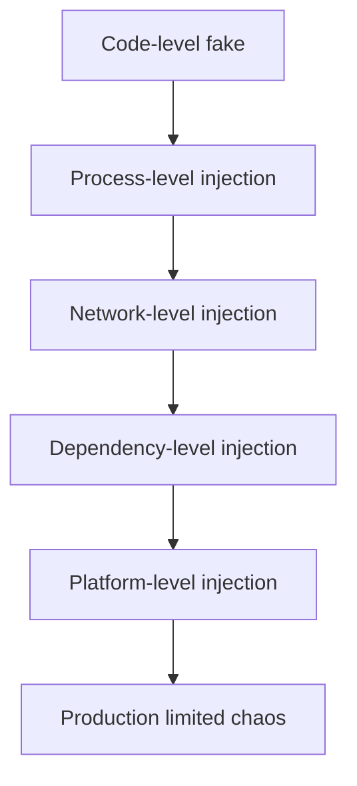
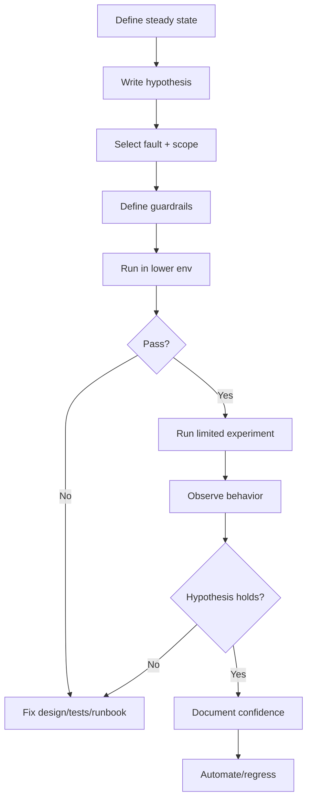
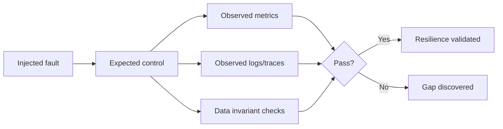
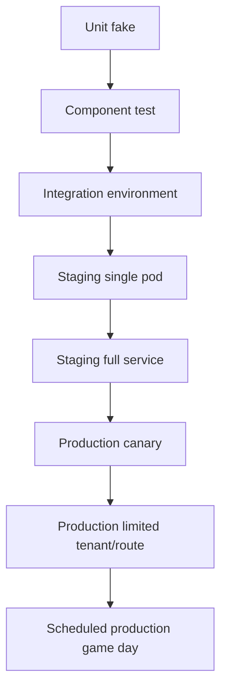

# learn-go-reliability-error-handling-part-031.md

# Fault Injection, Chaos Testing, Resilience Validation

> Seri: `learn-go-reliability-error-handling`  
> Part: `031`  
> Target: Go 1.26.x  
> Level: Advanced / internal engineering handbook  
> Fokus: validasi resilience melalui fault injection dan chaos testing: dependency latency/error, network failure, DB failure, broker redelivery, pod termination, resource pressure, overload, rollback safety, blast radius, guardrail, dan experiment design.

---

## 0. Posisi Materi Ini Dalam Seri

Pada `part-030`, kita membahas cara menguji reliability behavior:

- unit tests
- component tests
- integration tests
- contract tests
- race tests
- timeout/retry/idempotency tests
- graceful shutdown tests
- messaging tests
- startup/readiness tests
- observability tests

Sekarang kita masuk ke level berikutnya:

> Bagaimana membuktikan sistem tetap benar ketika failure nyata terjadi dalam kondisi runtime yang lebih realistis?

Fault injection dan chaos testing bukan sekadar “mematikan server random”.

Tujuannya adalah menguji hipotesis reliability:

- Apakah timeout bekerja?
- Apakah retry tidak memperburuk overload?
- Apakah circuit breaker terbuka?
- Apakah bulkhead melindungi dependency lain?
- Apakah service mengembalikan 503 cepat, bukan timeout lambat?
- Apakah idempotency mencegah duplicate side effect?
- Apakah outbox event tetap terkirim setelah broker pulih?
- Apakah consumer dedup saat redelivery?
- Apakah graceful shutdown drain sebelum SIGKILL?
- Apakah readiness false saat shutdown?
- Apakah alert dan dashboard menunjukkan root cause?
- Apakah runbook cukup untuk recovery?

Reliability bukan klaim. Reliability adalah behavior yang divalidasi.

---

## 1. Core Thesis

Fault injection adalah teknik menyuntikkan kegagalan terkontrol untuk menguji mekanisme reliability.

Chaos testing adalah praktik menjalankan eksperimen failure dengan hipotesis, guardrail, observability, dan rollback.

Prinsip utama:

1. Start small.
2. Define hypothesis.
3. Define blast radius.
4. Define abort condition.
5. Define expected user impact.
6. Run in lower environment first.
7. Observe metrics/logs/traces.
8. Validate data correctness, not only availability.
9. Automate repeatable experiments.
10. Feed findings back into design/tests/runbooks.

Chaos yang baik bukan random destruction. Chaos yang baik adalah engineering experiment.

---

## 2. Fault Injection vs Chaos Testing

| Term | Meaning |
|---|---|
| fault injection | teknik menyuntikkan failure tertentu |
| chaos experiment | eksperimen terstruktur untuk menguji hipotesis resilience |
| game day | latihan tim menghadapi incident simulasi |
| resilience validation | bukti bahwa control bekerja |
| disaster recovery test | validasi pemulihan dari skenario besar |
| load/stress test | validasi kapasitas/performa |
| failure mode test | validasi behavior untuk satu mode failure |

Fault injection bisa dilakukan di unit test, integration test, staging, atau production terbatas.

Chaos testing biasanya lebih sistemik dan observability-heavy.

---

## 3. Why Fault Injection Matters

Banyak failure tidak muncul di unit test biasa:

- DNS timeout
- TCP reset after request body sent
- response header slow
- response body slow
- partial JSON
- DB commit unknown
- DB pool exhaustion
- lock wait timeout
- broker ack failure
- pod SIGTERM during transaction
- OOMKilled
- CPU throttling
- liveness false positive
- retry storm
- cache stampede
- DLQ growth
- config reload invalid
- dependency returns 200 with invalid schema

Fault injection membuat failure menjadi repeatable.

---

## 4. Experiment Template

Gunakan template:

```text
Experiment:
  Name:
  System:
  Environment:
  Date:
  Owner:

Hypothesis:
  If <fault> happens, then <system behavior> should occur, and <user impact> should stay within <limit>.

Preconditions:
  - Version
  - Traffic/load
  - Data setup
  - Dependency state

Fault:
  - Type
  - Scope
  - Duration
  - Injection method

Expected behavior:
  - App response
  - Metrics
  - Logs/traces
  - Data correctness
  - Recovery behavior

Guardrails:
  - Abort if error rate > X
  - Abort if latency > Y
  - Abort if queue age > Z
  - Abort if data mismatch detected

Rollback/Abort:
  - How to stop fault
  - How to restore traffic/config

Observations:
  - What happened

Result:
  - Pass/Fail/Partial

Actions:
  - Fixes
  - New tests
  - Runbook updates
```

---

## 5. Blast Radius

Blast radius defines scope of experiment.

Small blast radius:

- one unit test
- one dependency fake
- one pod
- one endpoint
- one tenant
- staging only
- low traffic percentage
- read-only operation

Large blast radius:

- production all pods
- critical write endpoint
- DB primary
- auth provider
- message broker cluster
- all tenants

Start small. Increase only after confidence.

---

## 6. Guardrails and Abort Conditions

Chaos without guardrails is reckless.

Examples:

```text
Abort if:
- 5xx > 2% for 5 minutes
- p99 latency > 3s for critical route
- queue oldest age > 2 minutes
- DLQ count increases
- data correctness check fails
- audit insert failures > 0
- CPU > 95% for 10 minutes
- memory > 90%
- pod restarts > 1
- customer-facing alert fires unexpectedly
```

Automated experiments should be able to stop fault automatically.

---

## 7. Fault Injection Levels



### 7.1 Code-level

- fake dependency returns error
- fake clock advances
- fake broker redelivers
- fake DB commit ambiguous

### 7.2 Process-level

- kill process
- send SIGTERM
- pause process
- CPU/memory stress

### 7.3 Network-level

- latency
- packet loss
- DNS failure
- connection reset
- blackhole
- bandwidth limit

### 7.4 Dependency-level

- DB failover
- Redis down
- broker disconnect
- HTTP 503
- auth provider timeout

### 7.5 Platform-level

- pod delete
- node drain
- resource pressure
- HPA scale
- rolling restart
- sidecar restart

---

## 8. Code-level Fault Injection

Design dependencies as interfaces.

```go
type ProfileClient interface {
    GetProfile(ctx context.Context, userID string) (Profile, error)
}
```

Fault fake:

```go
type FaultyProfileClient struct {
    Err   error
    Delay time.Duration
}

func (c FaultyProfileClient) GetProfile(ctx context.Context, userID string) (Profile, error) {
    if c.Delay > 0 {
        select {
        case <-time.After(c.Delay):
        case <-ctx.Done():
            return Profile{}, context.Cause(ctx)
        }
    }

    if c.Err != nil {
        return Profile{}, c.Err
    }

    return Profile{UserID: userID}, nil
}
```

Use to test:

- timeout
- fallback
- dependency unavailable
- validation of public error contract

---

## 9. HTTP Fault Server

Use `httptest.Server`.

### 9.1 Slow Header

```go
srv := httptest.NewServer(http.HandlerFunc(func(w http.ResponseWriter, r *http.Request) {
    time.Sleep(200 * time.Millisecond)
    w.WriteHeader(http.StatusOK)
}))
defer srv.Close()
```

Client should timeout at response header timeout/request context.

### 9.2 Slow Body

```go
srv := httptest.NewServer(http.HandlerFunc(func(w http.ResponseWriter, r *http.Request) {
    w.WriteHeader(http.StatusOK)
    flusher, _ := w.(http.Flusher)

    _, _ = w.Write([]byte(`{"partial":`))
    if flusher != nil {
        flusher.Flush()
    }

    time.Sleep(200 * time.Millisecond)
    _, _ = w.Write([]byte(`"done"}`))
}))
```

Test body read timeout/context.

### 9.3 Invalid Response

```go
srv := httptest.NewServer(http.HandlerFunc(func(w http.ResponseWriter, r *http.Request) {
    w.WriteHeader(http.StatusOK)
    _, _ = w.Write([]byte(`not-json`))
}))
```

Assert `DEPENDENCY_BAD_RESPONSE`.

### 9.4 429 With Retry-After

```go
srv := httptest.NewServer(http.HandlerFunc(func(w http.ResponseWriter, r *http.Request) {
    w.Header().Set("Retry-After", "1")
    w.WriteHeader(http.StatusTooManyRequests)
}))
```

Assert backoff/propagation.

---

## 10. Transport-level Faults

Create custom `RoundTripper`.

```go
type RoundTripFunc func(*http.Request) (*http.Response, error)

func (f RoundTripFunc) RoundTrip(r *http.Request) (*http.Response, error) {
    return f(r)
}
```

Connection reset-like error:

```go
client := &http.Client{
    Transport: RoundTripFunc(func(r *http.Request) (*http.Response, error) {
        return nil, &net.OpError{
            Op:  "read",
            Net: "tcp",
            Err: syscall.ECONNRESET,
        }
    }),
}
```

Timeout-like error:

```go
client := &http.Client{
    Transport: RoundTripFunc(func(r *http.Request) (*http.Response, error) {
        <-r.Context().Done()
        return nil, r.Context().Err()
    }),
}
```

Good for unit tests without real network.

---

## 11. DNS Fault Injection

Code-level:

- custom resolver? more complex
- use invalid hostname
- custom dialer that returns DNS-like error
- network policy in staging
- CoreDNS fault in non-prod

Example custom transport dial failure:

```go
transport := &http.Transport{
    DialContext: func(ctx context.Context, network, addr string) (net.Conn, error) {
        return nil, &net.DNSError{
            Err:        "no such host",
            Name:       "profile.internal",
            IsNotFound: true,
        }
    },
}
```

Expected:

- classify as dependency/network failure
- retry only if safe
- no panic
- metric `dependency_errors_total{kind="dns"}` or network/unavailable

---

## 12. Database Fault Injection

### 12.1 Unit-level

Use repository interface fake:

```go
type FaultyCaseRepo struct {
    Err error
}

func (r FaultyCaseRepo) GetCase(ctx context.Context, id CaseID) (Case, error) {
    return Case{}, r.Err
}
```

### 12.2 Integration-level

Use real DB to test:

- unique violation
- lock timeout
- deadlock
- serialization failure
- pool exhaustion
- transaction rollback

### 12.3 Pool Exhaustion

Set small pool:

```go
db.SetMaxOpenConns(1)
```

Hold one transaction open, then attempt another query with short timeout.

Expected:

- request returns timeout/service busy
- pool wait metric increases
- no goroutine leak

### 12.4 Lock Wait

Transaction A locks row.

Transaction B tries update with context timeout.

Expected:

- B timeout/lock error classified
- A still can commit/rollback
- metrics/logs show lock wait

---

## 13. Commit Ambiguity Injection

Real commit ambiguity is hard. Use seam.

```go
type TxRunner interface {
    WithTx(ctx context.Context, fn func(context.Context, Tx) error) error
}

type AmbiguousCommitRunner struct{}

func (r AmbiguousCommitRunner) WithTx(ctx context.Context, fn func(context.Context, Tx) error) error {
    if err := fn(ctx, fakeTx{}); err != nil {
        return err
    }
    return ErrCommitAmbiguous
}
```

Experiment:

```text
Given idempotency key K
When commit ambiguity occurs
Then service resolves by idempotency lookup
And does not execute business operation twice
```

---

## 14. Cache Fault Injection

Faults:

- cache get timeout
- cache set timeout
- cache unavailable
- stale value
- corrupted serialized value
- cache stampede
- Redis connection refused
- TTL expired early/late

Fake:

```go
type FaultyCache struct {
    GetErr error
    SetErr error
    Value  []byte
}

func (c FaultyCache) Get(ctx context.Context, key string) ([]byte, error) {
    if c.GetErr != nil {
        return nil, c.GetErr
    }
    return c.Value, nil
}
```

Expected depends cache role:

- performance cache: fallback DB
- idempotency cache/store: fail closed
- permission cache: fail closed or bounded LKG policy
- feature flag: last-known-good/default

---

## 15. Broker Fault Injection

Faults:

- duplicate delivery
- ack failure
- nack failure
- broker disconnect
- delayed redelivery
- poison message
- DLQ publish failure
- visibility timeout expiry
- rebalance during processing
- out-of-order delivery

Fake broker can simulate:

```go
type FakeBroker struct {
    messages chan Message
    ackErr   error
}

func (b *FakeBroker) Receive(ctx context.Context) (Message, error) {
    select {
    case msg := <-b.messages:
        return msg, nil
    case <-ctx.Done():
        return nil, context.Cause(ctx)
    }
}
```

Message with ack failure:

```go
type FaultyMessage struct {
    id     string
    AckErr error
}

func (m FaultyMessage) Ack(ctx context.Context) error {
    return m.AckErr
}
```

Expected:

- processing committed
- ack failure logged/metric
- redelivery dedup on next receive
- no duplicate side effect

---

## 16. Object Storage Fault Injection

Faults:

- upload timeout
- partial upload
- checksum mismatch
- permission denied
- object not found
- slow download
- large object memory pressure
- delete cleanup failure

Expected:

- multipart abort if applicable
- pending DB state reconciled
- checksum error mapped
- no broken completed document record
- orphan cleanup detects leftovers

---

## 17. Auth Provider Fault Injection

Faults:

- JWKS endpoint timeout
- unknown `kid`
- invalid token signature
- expired token
- clock skew
- introspection 503
- permission service timeout
- malformed claims
- provider rate limit

Expected:

- fail closed
- cached JWKS works if key known
- unknown key refresh bounded
- no auth provider call per request if local JWT
- public error safe
- metrics/alerts

Do not test auth provider down by allowing everyone.

---

## 18. Kubernetes/Runtime Faults

In staging:

```bash
kubectl delete pod <pod>
```

Expected:

- SIGTERM handled
- readiness false
- HTTP drains
- consumers stop receiving
- outbox/worker stop
- telemetry flushes
- pod exits before grace
- no data corruption

Other runtime faults:

- `kubectl rollout restart`
- node drain in non-prod
- reduce memory limit
- reduce CPU limit
- kill container process
- scale down workers
- disrupt DNS/egress via network policy

---

## 19. Resource Pressure Injection

### 19.1 CPU

Use stress tool in container/staging or apply low CPU limit.

Expected:

- latency rises but probes not false-positive too aggressively
- overload/admission may shed
- no liveness restart loop
- CPU throttling metrics visible

### 19.2 Memory

Use controlled memory allocation in staging.

Expected:

- GOMEMLIMIT/GC behavior observed
- bounded queues prevent runaway
- OOMKilled alert if limit exceeded
- idempotency/redelivery handles restart

Do not run memory chaos in production casually.

---

## 20. Network Fault Injection

Fault types:

- latency
- packet loss
- connection reset
- DNS failure
- blackhole
- bandwidth limit
- TLS handshake failure

Tools can include:

- Linux `tc/netem`
- service mesh fault injection
- proxy fault injection
- Kubernetes network policies
- test proxy like Toxiproxy
- custom test transport

Experiment:

```text
Inject 500ms latency to profile service for 5 minutes.
Expected:
  profile client times out at 300ms
  endpoint degrades or returns 504
  no goroutine buildup
  circuit breaker opens
  p99 for core route remains within SLO if fallback exists
```

---

## 21. Toxiproxy-style Testing

A proxy can sit between app and dependency:

```text
app -> proxy -> dependency
```

Inject:

- latency
- timeout
- reset
- bandwidth
- cut connection

Useful for integration tests because app uses real network stack.

Expected metrics:

- dependency timeout count
- retry count
- circuit state
- request latency
- fallback/degradation

---

## 22. Service Mesh Fault Injection

If using mesh, it may support HTTP abort/delay.

Example concepts:

```text
delay 500ms for 20% requests
abort 503 for 10% requests
```

Use carefully:

- match specific route/service
- low percentage
- staging first
- guardrails
- account for mesh retries
- disable after test

---

## 23. Fault Injection in Go Build

You can add test-only hooks, but avoid production danger.

Bad:

```go
if os.Getenv("CHAOS") == "delete_data" { ... }
```

Better:

- dependency injection
- interfaces/fakes
- debug-only build tags
- admin-only internal endpoint disabled by default
- staging-only config
- explicit allowlist

Build tags:

```go
//go:build chaos
```

Use only in test/staging builds if needed.

---

## 24. Chaos Experiment: Dependency Timeout

Template:

```text
Hypothesis:
  If profile dependency times out, GET /cases/{id} should return base case without profile enrichment within 500ms, and error rate for core route should remain under 1%.

Fault:
  Add 1s latency to profile API for 10 minutes.

Expected:
  profile_enrichment_degraded_total increases
  dependency_timeouts_total{dependency=profile} increases
  circuit may open
  core route p99 < 500ms
  no pod restarts
  no DB pool increase
```

Pass criteria:

- degradation works
- no retry storm
- logs sampled
- alert maybe warning not page

---

## 25. Chaos Experiment: DB Pool Exhaustion

Hypothesis:

```text
If DB pool saturates, service should reject expensive requests with 503 quickly and preserve health endpoints.
```

Fault:

- lower max open conns in staging
- run heavy queries
- hold transactions

Expected:

- db_pool_wait_duration rises
- expensive route 503 SERVICE_BUSY
- liveness remains OK
- readiness maybe remains true unless instance unable
- no goroutine explosion
- no OOM
- alert fires if sustained

---

## 26. Chaos Experiment: Pod Termination During Write

Hypothesis:

```text
If pod receives SIGTERM during submit-case request, request either completes with state+audit+outbox committed or fails safely and client retry with same idempotency key resolves correctly.
```

Fault:

- send SIGTERM while controlled request blocks at specific point
- or delete pod during load test

Expected:

- readiness false
- no new requests accepted
- in-flight request drains if within budget
- if killed, retry with same key does not duplicate
- audit/outbox invariant holds
- no partial state

---

## 27. Chaos Experiment: Broker Redelivery

Hypothesis:

```text
If consumer commits DB effect but fails to ack broker, redelivered message should be deduped and acked without duplicate side effect.
```

Fault:

- fake ack failure
- kill consumer after DB commit before ack
- force broker redelivery

Expected:

- processed_messages duplicate metric increments
- business effect count remains 1
- message eventually acked
- no DLQ

---

## 28. Chaos Experiment: Poison Message

Hypothesis:

```text
If invalid message schema is consumed, it should go to DLQ after policy and not block healthy messages.
```

Fault:

- publish invalid message

Expected:

- invalid message classified poison
- DLQ count increments
- healthy subsequent messages process
- alert/runbook available
- no infinite retry/log storm

---

## 29. Chaos Experiment: Cache Stampede

Hypothesis:

```text
If hot cache key expires under high traffic, singleflight/locking prevents DB stampede.
```

Fault:

- expire hot key
- send concurrent requests

Expected:

- only one/few DB loads
- other requests wait bounded or serve stale
- DB latency stable
- no overload

---

## 30. Validating Resilience Controls

Map fault to control.

| Fault | Expected control |
|---|---|
| dependency slow | timeout, circuit, fallback |
| dependency 503 | retry budget, breaker |
| DB deadlock | retry whole tx |
| DB pool full | admission/load shedding |
| duplicate request | idempotency |
| duplicate message | inbox/dedup |
| poison message | DLQ |
| pod SIGTERM | graceful shutdown |
| memory pressure | bounded queues/GOMEMLIMIT |
| CPU throttling | generous probes/admission |
| cache down | fallback or fail closed |
| auth provider down | cached JWKS/fail closed |
| outbox broker down | pending grows, alert |
| invalid config | fail fast |

---

## 31. Data Correctness Validation

Do not only check HTTP status.

Check invariants:

- no duplicate state transition
- audit exists for every state change
- outbox exists for every event-worthy change
- processed message prevents duplicate effect
- idempotency replay returns same result
- no orphan completed DB record without object
- no published event without state
- no state without required audit
- no permission bypass
- no partial batch marked success

Create invariant queries.

Example:

```sql
select case_id
from cases c
where c.status = 'SUBMITTED'
and not exists (
  select 1 from audit_events a
  where a.case_id = c.id
  and a.action = 'SUBMIT'
);
```

Should return zero.

---

## 32. Observability Validation

Fault injection should validate telemetry.

For each experiment, confirm:

- metric increments
- logs include correlation/operation ID
- trace shows fault location
- alert fires or does not fire as expected
- dashboard shows cause
- runbook points to correct mitigation

If system behaves correctly but observability fails, experiment still reveals a reliability gap.

---

## 33. Steady State Hypothesis

Chaos engineering often begins with steady state.

Define steady state:

```text
- submit_case success rate > 99.9%
- p99 latency < 2s
- outbox oldest age < 30s
- DLQ count = 0
- pod restarts = 0
- DB pool wait p95 < 50ms
```

Experiment checks whether steady state holds under fault.

---

## 34. Game Days

Game day is team exercise.

Scenario:

```text
Profile API latency spike + retry storm + one pod OOMKilled.
```

Participants:

- incident commander
- backend engineer
- platform engineer
- QA/BA observer
- support/product if needed

Goals:

- detect
- triage
- mitigate
- communicate
- validate runbook
- find gaps

Game day output:

- timeline
- what worked
- what failed
- action items
- runbook updates
- new automated tests

---

## 35. Production Chaos Safety

Production chaos only after:

- lower env validated
- hypothesis clear
- blast radius small
- guardrails automated
- rollback easy
- stakeholders aware
- observability ready
- on-call ready
- low-risk time window
- data correctness safeguards
- experiment approved

Start with:

- one pod
- non-critical endpoint
- small traffic percentage
- read-only path
- short duration

Do not start with:

- DB primary failover
- auth provider outage
- all pods
- critical write path
- high traffic period

---

## 36. Automation

Automate experiments:

- scripted setup
- scripted fault injection
- automatic metrics check
- automatic abort
- report generation
- cleanup

Example pseudo:

```bash
./chaos/run.sh dependency-timeout \
  --service case-api \
  --dependency profile \
  --latency 500ms \
  --duration 5m \
  --abort-error-rate 2
```

But automation should not hide understanding. Experiment spec still needed.

---

## 37. CI Fault Injection

Some fault injection can run in CI:

- HTTP dependency 503/timeout
- invalid JSON
- cache down
- fake broker duplicate
- idempotency concurrency
- queue full
- circuit breaker
- startup invalid config

Keep CI deterministic.

Staging experiments cover:

- Kubernetes termination
- real network latency
- real DB pool/locks
- broker redelivery
- resource pressure
- rolling update under load

---

## 38. Chaos Maturity Model

```text
Level 0: No failure tests.
Level 1: Unit tests for error mapping/retry.
Level 2: Integration tests for DB/broker failures.
Level 3: Staging fault injection with runbooks.
Level 4: Scheduled game days.
Level 5: Limited production chaos with guardrails.
Level 6: Continuous resilience validation integrated with deployment.
```

Do not jump levels.

---

## 39. Anti-patterns

### 39.1 Randomly Break Things

No hypothesis, no learning.

### 39.2 No Abort Condition

Experiment becomes incident.

### 39.3 Testing Only Availability

Data corruption ignored.

### 39.4 No Observability Check

Cannot diagnose.

### 39.5 Fault Too Broad Too Early

Blast radius too large.

### 39.6 Fault Injection Code Unsafe in Production

Chaos hook becomes vulnerability.

### 39.7 Ignoring Client Behavior

Retries may dominate result.

### 39.8 No Cleanup

Experiment leaves config/fault active.

### 39.9 No Action Items

Learning lost.

### 39.10 Chaos as Performance Theater

Running tools without improving system.

---

## 40. Production Checklist

### 40.1 Experiment Design

- [ ] hypothesis written
- [ ] steady state defined
- [ ] fault defined
- [ ] blast radius defined
- [ ] duration defined
- [ ] guardrails defined
- [ ] abort method tested
- [ ] rollback plan
- [ ] data correctness checks
- [ ] observability checks

### 40.2 Safety

- [ ] lower env tested first
- [ ] small scope
- [ ] stakeholder awareness
- [ ] on-call available
- [ ] no sensitive data exposed
- [ ] chaos hooks protected/disabled
- [ ] cleanup verified

### 40.3 Coverage

- [ ] dependency latency/error
- [ ] DB pool/lock/deadlock
- [ ] cache down/stampede
- [ ] broker redelivery/DLQ
- [ ] pod termination
- [ ] CPU/memory pressure
- [ ] overload/retry storm
- [ ] auth provider failure
- [ ] config/startup failure
- [ ] observability/alert validation

### 40.4 Learning

- [ ] result documented
- [ ] runbook updated
- [ ] new automated tests added
- [ ] design gaps filed
- [ ] dashboard/alert gaps fixed
- [ ] retry/timeout config tuned

---

## 41. Mermaid: Chaos Experiment Lifecycle



---

## 42. Mermaid: Fault to Control Validation



---

## 43. Mermaid: Safe Blast Radius Expansion



---

## 44. Regulatory Case Management Lens

For regulatory/case systems, chaos must validate correctness:

Critical experiments:

1. Pod killed during case submit.
2. DB deadlock during approval.
3. Broker down while outbox accumulates.
4. Duplicate `case.submitted` event.
5. Poison document event.
6. Auth provider timeout.
7. Object storage upload succeeds but DB update fails.
8. Cache stale during state transition.
9. Report worker overload.
10. Graceful shutdown during audit write.

Required invariants:

- every committed state transition has audit
- every event-worthy state transition has outbox event
- no duplicate approval/rejection side effect
- idempotency replay works after crash
- permission uncertainty fails closed
- DLQ is visible and owned
- outbox eventually drains after broker recovery

---

## 45. Java Engineer Translation Layer

### 45.1 Chaos Monkey / Resilience4j

Java ecosystems may use Chaos Monkey for Spring Boot, Resilience4j test utilities, and Testcontainers/Toxiproxy.

Go equivalent patterns:

- interfaces/fakes
- `httptest.Server`
- custom `RoundTripper`
- Testcontainers/Toxiproxy
- Kubernetes-level experiments
- service mesh fault injection

### 45.2 Awaitility vs Go Channels

Use channels/context/fake clocks instead of arbitrary sleeps.

### 45.3 Spring Profiles vs Go Build Tags/Config

For chaos-only hooks, prefer staging config/build tags and strict protection.

---

## 46. Key Takeaways

1. Fault injection makes failure behavior repeatable.
2. Chaos testing is a controlled experiment, not random destruction.
3. Start with hypothesis, blast radius, guardrails, and rollback.
4. Validate data correctness, not just uptime.
5. Validate observability and alerts during every experiment.
6. Dependency latency should trigger timeout/fallback/circuit behavior.
7. DB fault injection should validate retry, rollback, lock, and pool behavior.
8. Messaging fault injection should validate duplicate safety, DLQ, and ack policy.
9. Pod termination should validate graceful shutdown and idempotency.
10. Resource pressure should validate bounded queues and overload rejection.
11. Auth failure should fail closed.
12. Cache failure policy depends on cache role.
13. Production chaos requires maturity and safety.
14. Game days test people, process, and runbooks.
15. Faults should map to expected controls.
16. Guardrails prevent experiments from becoming incidents.
17. CI can run deterministic fault tests; staging validates platform behavior.
18. Learnings must become code/tests/runbooks.
19. Blast radius should expand gradually.
20. Resilience is confidence earned through evidence.

---

## 47. References

- Google SRE Book: Testing for Reliability
- Google SRE Book: Addressing Cascading Failures
- Principles of Chaos Engineering
- AWS Builders Library: timeout, retry, backoff, and resilience practices
- Kubernetes documentation: pod lifecycle, probes, resource management
- Toxiproxy concept/documentation
- Go package documentation: `net/http/httptest`
- Go package documentation: `context`
- Go package documentation: `net`
- Go package documentation: `database/sql`

---

## 48. Next Part

Next:

```text
learn-go-reliability-error-handling-part-032.md
```

Topic:

```text
Production Incident Management: Triage, Mitigation, Postmortem, Runbook, Learning Loop
```


<!-- NAVIGATION_FOOTER -->
<div class="page-nav">
<a href="./learn-go-reliability-error-handling-part-030.md">⬅️ Testing Error Handling and Reliability Behavior</a>
<a href="./index.md">📚 Kategori</a>
<a href="../../index.md">🏠 Home</a>
<a href="./learn-go-reliability-error-handling-part-032.md">Production Incident Management: Triage, Mitigation, Postmortem, Runbook, Learning Loop ➡️</a>
</div>
