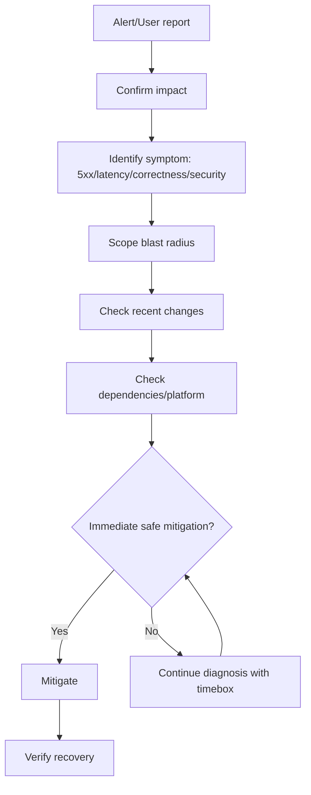
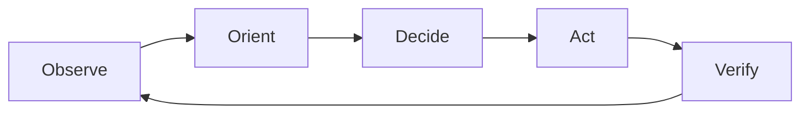
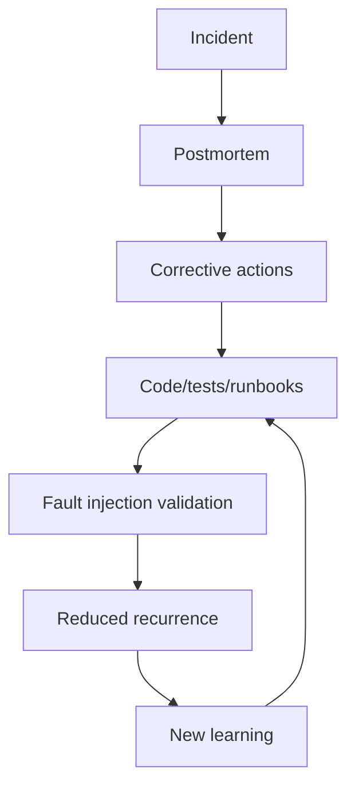
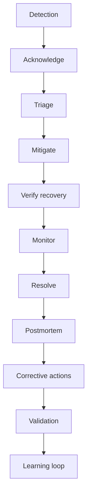
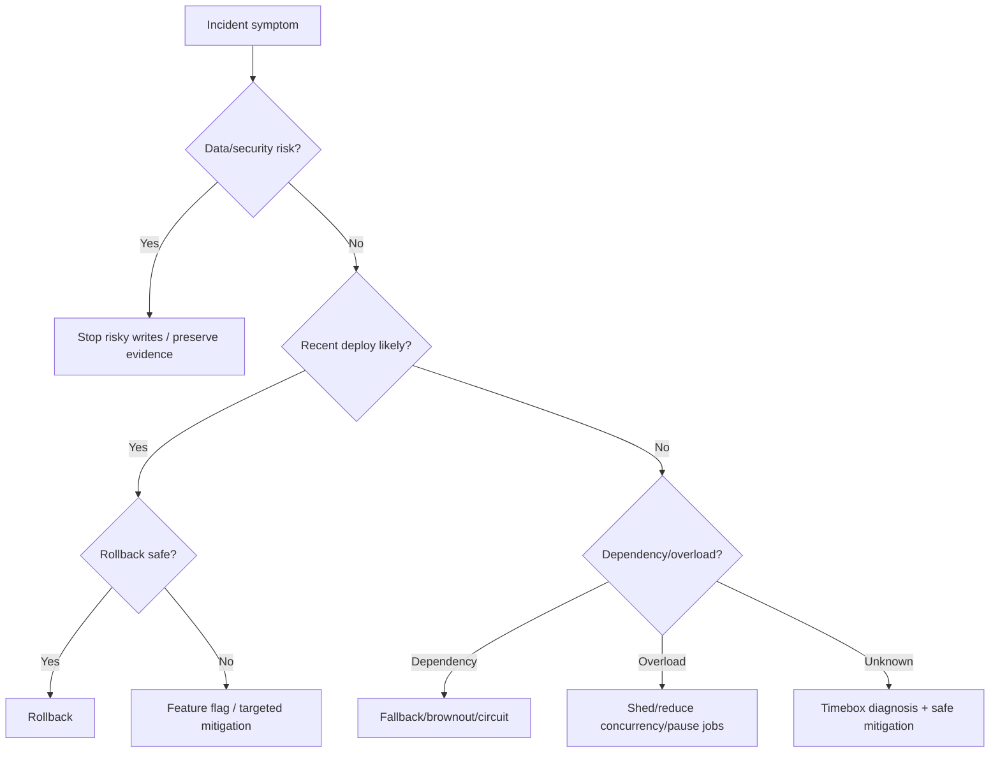
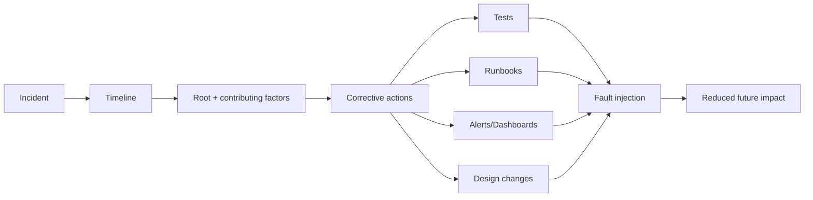

# learn-go-reliability-error-handling-part-032.md

# Production Incident Management: Triage, Mitigation, Postmortem, Runbook, Learning Loop

> Seri: `learn-go-reliability-error-handling`  
> Part: `032`  
> Target: Go 1.26.x  
> Level: Advanced / internal engineering handbook  
> Fokus: incident management untuk Go/backend production system: deteksi, triage, mitigasi, komunikasi, evidence gathering, rollback, runbook, postmortem blameless, corrective action, dan reliability learning loop.

---

## 0. Posisi Materi Ini Dalam Seri

Pada bagian sebelumnya kita membahas:

- observability
- SLO/error budget
- dependency failure
- overload handling
- persistence reliability
- messaging reliability
- startup/shutdown
- testing reliability behavior
- fault injection dan chaos testing

Sekarang kita membahas apa yang terjadi ketika failure benar-benar terjadi di production:

> Incident management.

Incident management bukan hanya kemampuan teknis memperbaiki bug. Incident management adalah kemampuan tim untuk:

- mendeteksi masalah
- memahami user impact
- mengurangi dampak secepat mungkin
- menghindari tindakan yang memperburuk kondisi
- berkomunikasi jelas
- menjaga evidence
- memulihkan service
- belajar dari kejadian
- mencegah kelas kegagalan yang sama berulang

Top engineer tidak hanya bisa coding fix. Top engineer bisa memimpin sistem kembali ke kondisi aman.

---

## 1. Core Thesis

Production incident adalah situasi ketika sistem tidak memenuhi ekspektasi reliability, correctness, security, atau operasional.

Tujuan saat incident:

```text
Minimize user impact first.
Preserve correctness.
Restore safe service.
Learn and improve system.
```

Urutan prioritas:

1. Safety/security/data correctness.
2. Stop the bleeding.
3. Restore critical user journey.
4. Preserve evidence.
5. Communicate.
6. Fix root cause.
7. Prevent recurrence.

Saat incident, jangan langsung mengejar “root cause sempurna”. Pertama, lakukan mitigasi aman.

---

## 2. Incident Types

| Type | Example | Primary risk |
|---|---|---|
| availability | service down, 5xx spike | users cannot use service |
| latency | p99 timeout | slow is down |
| correctness | wrong state, duplicate transition | data damage |
| data loss | missing audit/outbox/event | irrecoverable |
| security | auth bypass, secret leak | breach |
| overload | queue/DB saturation | cascading failure |
| dependency outage | DB/cache/API down | partial/full outage |
| deployment regression | new version breaks route | bad release |
| messaging incident | DLQ spike, lag | eventual consistency broken |
| platform incident | OOMKilled, DNS, node | infra instability |
| operational incident | config/secret expired | startup/runtime failure |

Different incident types require different mitigation.

---

## 3. Severity Classification

Example severity matrix:

| Severity | Meaning | Example |
|---|---|---|
| SEV1 | critical widespread impact/data/security risk | all users cannot submit, data corruption |
| SEV2 | major feature/user segment impact | submit failing for one agency/tenant |
| SEV3 | degraded service with workaround | reports delayed, optional enrichment down |
| SEV4 | minor/non-user-impacting issue | warning alert, single retry spike |

Severity should consider:

- user impact
- business criticality
- data correctness
- security
- duration
- blast radius
- workaround availability
- regulatory/SLA obligation

---

## 4. Incident Roles

For serious incident, assign roles.

| Role | Responsibility |
|---|---|
| Incident Commander | coordinate, decide, maintain timeline |
| Tech Lead / SME | diagnose and propose mitigation |
| Comms Lead | stakeholder/status updates |
| Scribe | timeline/evidence/actions |
| Operator | runs commands/rollbacks |
| Customer/Support Liaison | handles user-facing reports |
| Reviewer | sanity-checks risky action |

Small teams can combine roles, but role clarity matters.

### 4.1 Incident Commander Is Not Always Deepest Engineer

IC’s job:

- keep focus
- ask for impact
- timebox investigation
- decide mitigation
- coordinate communication
- prevent chaos

---

## 5. First 5 Minutes

When alert fires:

1. Acknowledge.
2. Check if real user impact.
3. Identify affected service/route/error code.
4. Assign severity.
5. Create incident channel/thread.
6. Assign IC/scribe if needed.
7. Start timeline.
8. Look for recent changes.
9. Check dashboards.
10. Choose immediate mitigation if obvious.

Do not:

- restart everything blindly
- run destructive DB commands
- change multiple things at once
- ignore data correctness
- silence alerts without understanding
- blame people

---

## 6. Triage Framework

Ask:

```text
What changed?
What is impacted?
When did it start?
Is it getting worse?
Is it all users or subset?
Is it one pod/version/zone/dependency?
Is data correctness at risk?
What is safest mitigation?
```

Triage path:



---

## 7. Golden Signals During Incident

Check:

- request rate
- error rate
- latency
- saturation

Then domain-specific:

- DB pool wait
- dependency timeout
- retry rate
- circuit state
- queue depth/oldest age
- DLQ count
- outbox oldest age
- pod restarts/OOMKilled
- CPU throttling
- deployment version
- readiness/liveness failures
- auth failures
- idempotency conflicts
- audit/outbox mismatch

---

## 8. “What Changed?” Checklist

Recent changes:

- deployment
- config change
- secret rotation
- DB migration
- feature flag
- scaling/HPA
- dependency release
- network policy
- DNS change
- certificate change
- Kubernetes/node upgrade
- traffic pattern
- batch job started
- external provider incident
- data import
- schema change
- index/statistics change
- cache flush
- cron/scheduler run

Many incidents are change-related.

---

## 9. Mitigation vs Root Cause

Mitigation:

```text
Reduce user impact now.
```

Root cause fix:

```text
Prevent recurrence permanently.
```

Examples:

| Symptom | Mitigation | Later fix |
|---|---|---|
| bad deploy 500 | rollback | fix bug/test |
| DB overload | shed reports, reduce concurrency | query/index/capacity |
| dependency timeout | brownout/fallback | dependency fix/SLO |
| queue lag | pause producers/scale consumers | optimize handler |
| poison message | move to DLQ | schema validation |
| OOMKilled | lower concurrency/disable feature | memory profile/fix |
| auth provider down | cached JWKS/fail closed | provider resilience |
| migration lock | stop rollout | migration redesign |

During incident, mitigation first if safe.

---

## 10. Safe Mitigation Options

Common mitigations:

- rollback deployment
- disable feature flag
- enable brownout
- reduce traffic to expensive route
- increase replicas if bottleneck is app CPU and downstream can handle
- reduce worker concurrency if downstream DB overloaded
- pause consumers
- scale consumers if lag and downstream capacity exists
- increase DB pool? only if DB can handle
- shed low-priority traffic
- temporarily rate limit noisy tenant
- route reads to primary/replica carefully
- extend timeout? only if it reduces failures without overload
- restart one stuck pod
- remove bad pod from service
- fix config/secret
- replay DLQ after fix
- run reconciliation

Dangerous mitigations:

- blindly increasing retry
- increasing concurrency when dependency overloaded
- restarting all pods at once
- deleting DLQ messages
- manually editing DB without plan
- disabling auth/permission
- skipping audit
- forcing readiness true
- extending timeouts under overload
- scaling consumers when DB is bottleneck

---

## 11. Rollback Decision

Rollback if:

- issue started after deploy
- error localized to new version
- rollback is safe and compatible
- no irreversible migration dependency
- user impact significant
- root cause unknown but deploy suspect

Do not rollback blindly if:

- migration is not backward-compatible
- rollback may corrupt data
- issue caused by external dependency
- old version has same issue
- new version includes critical security fix

Rollback should be rehearsed.

---

## 12. Feature Flag / Brownout Mitigation

Feature flags can mitigate quickly.

Examples:

```text
disable profile enrichment
disable report export
reduce page size
turn search advanced filters off
pause non-critical notifications
disable expensive dashboard counts
```

Brownout should be predesigned. Improvised feature disables can create correctness bugs.

Do not brownout:

- auth
- authorization
- audit
- idempotency
- required validation
- legal state transition checks

---

## 13. Overload Incident Response

Symptoms:

- latency rises
- DB pool wait high
- queue depth/age grows
- retries rise
- CPU/memory high
- 503/timeout spike

Response:

1. Identify bottleneck.
2. Stop retry amplification.
3. Shed low-priority work.
4. Reduce expensive endpoints.
5. Pause background jobs.
6. Adjust concurrency downward if dependency overloaded.
7. Scale only if bottleneck is app capacity and downstream can handle.
8. Verify latency and queue age recover.

Do not just scale everything.

---

## 14. Dependency Outage Response

If dependency down:

- determine if optional or critical
- check circuit/fallback
- brownout optional feature
- fail closed for auth/permission
- queue async work via outbox if possible
- communicate degraded capability
- monitor recovery
- prevent retry storm
- respect provider rate limit

For external API:

```text
dependency timeout -> fallback/degrade or controlled 503/504
```

For DB:

```text
usually critical; protect correctness and avoid overload
```

---

## 15. Persistence/Data Correctness Incident

If data correctness at risk:

1. Stop writes if necessary.
2. Preserve evidence.
3. Identify affected time window.
4. Identify affected records.
5. Stop propagation via outbox/consumers if needed.
6. Design repair/reconciliation.
7. Validate with invariant queries.
8. Communicate carefully.
9. Postmortem deeply.

Examples:

- duplicate approvals
- missing audit
- outbox not generated
- wrong state transition
- stale cache used for decision
- idempotency conflict mishandled
- migration corrupted data

Availability is secondary to preventing further corruption.

---

## 16. Messaging Incident Response

Symptoms:

- lag rising
- DLQ spike
- poison message
- duplicate side effects
- consumer restart loop
- rebalance storm
- outbox age high

Response:

| Symptom | Action |
|---|---|
| poison message | route to DLQ, keep healthy flow |
| lag due slow dependency | reduce intake, fix bottleneck |
| duplicate side effects | stop consumer, inspect dedup |
| outbox age high | check broker/dispatcher |
| DLQ spike | classify error, stop bad producer if needed |
| rebalance storm | check consumer processing time/resources |
| schema mismatch | rollback producer or deploy compatible consumer |

Never delete DLQ without understanding.

---

## 17. Kubernetes/Runtime Incident Response

Symptoms:

- CrashLoopBackOff
- OOMKilled
- readiness probe failed
- liveness probe failed
- pod pending
- node pressure
- CPU throttling
- ImagePullBackOff

Checks:

```bash
kubectl describe pod <pod>
kubectl logs <pod> --previous
kubectl get events --sort-by=.lastTimestamp
kubectl rollout history deployment/<name>
kubectl rollout status deployment/<name>
```

Common actions:

- rollback deployment
- fix config/secret
- increase memory limit/headroom
- reduce concurrency
- fix liveness/readiness probe
- scale replicas
- cordon/drain bad node if infra issue
- revert bad image tag

---

## 18. Evidence Gathering

Collect:

- alert time
- first bad timestamp
- affected routes/error codes
- p95/p99 latency
- dependency metrics
- logs by correlation ID
- traces
- deployment timeline
- config changes
- Kubernetes events
- DB metrics
- queue/DLQ metrics
- user reports
- mitigation actions
- recovery time

Evidence should be captured before logs expire or pods restart.

### 18.1 Timeline Format

```text
10:02 Alert fired: submit_case 5xx > 5%
10:04 IC assigned
10:05 Error localized to version 1.42.0
10:07 Rollback started
10:11 Error rate recovering
10:15 Service back within SLO
10:35 Root cause suspected: nil pointer in validation mapper
```

---

## 19. Communication

Good incident communication is concise and factual.

Include:

- impact
- scope
- start time
- current status
- mitigation
- next update time
- user workaround if any

Avoid:

- speculation as fact
- blame
- overly technical internal details for business audience
- silence

### 19.1 Internal Update Template

```text
Status: Investigating / Mitigating / Monitoring / Resolved
Severity: SEV2
Impact: POST /cases/{id}/submit failing for ~18% of requests since 10:02.
Current finding: Failures correlate with deployment v1.42.0.
Action: Rolling back to v1.41.3.
Next update: 10:20.
```

### 19.2 Technical Update Template

```text
Observation:
- 5xx increased on route POST /cases/{id}/submit.
- Error code INTERNAL_ERROR.
- Only pods on version v1.42.0 affected.
- No DB pool saturation.
- No dependency timeout spike.

Action:
- Rollback started at 10:07.
- Watching error rate and p99.
```

---

## 20. Incident Command Loop

Repeat:

```text
Observe → Orient → Decide → Act → Verify
```



Timebox deep dives.

If no progress after 10-15 minutes and mitigation exists, mitigate.

---

## 21. Avoiding Incident Thrash

Thrash happens when multiple people change things simultaneously.

Prevent with:

- IC approval for actions
- one change at a time
- announce before action
- record action time
- verify after action
- rollback plan
- command copy/paste review for risky ops
- freeze nonessential deploys

---

## 22. Runbooks

A runbook is an operational guide for known failure mode.

Runbook should include:

- symptom/alert
- impact
- dashboards
- quick checks
- likely causes
- safe mitigations
- commands
- rollback steps
- escalation
- validation
- cleanup
- post-incident checks

### 22.1 Runbook Example: Outbox Lag High

```text
Alert:
  outbox_oldest_age_seconds > 300

Impact:
  External events/notifications delayed.

Check:
  - broker availability
  - dispatcher logs
  - outbox pending count by event type
  - DB lock/pool metrics
  - recent deployment

Mitigation:
  - if dispatcher bug: rollback
  - if broker down: wait/monitor, no data loss expected
  - if poison event: mark failed/DLQ per procedure
  - if DB overloaded: pause low-priority jobs

Validation:
  - outbox oldest age decreasing
  - publish success rate normal
  - no DLQ spike
```

---

## 23. Postmortem

Postmortem is for learning, not blame.

Sections:

1. Summary
2. Impact
3. Timeline
4. Detection
5. Root cause
6. Contributing factors
7. What went well
8. What went poorly
9. Where we got lucky
10. Corrective actions
11. Prevention
12. Follow-up owners/dates

### 23.1 Blameless

Avoid:

```text
Engineer forgot to validate config.
```

Better:

```text
The deployment process allowed invalid config to pass because config validation was not part of CI/startup.
```

Focus on system improvements.

---

## 24. Root Cause vs Contributing Factors

Incidents rarely have one root cause.

Example:

```text
Immediate cause:
  New version returned panic for missing optional field.

Contributing factors:
  - contract test did not include missing field
  - panic recovery returned 500 but alert only fired after 15m
  - canary not enabled
  - validation mapper logged raw error but metric used INTERNAL_ERROR only
  - rollback runbook outdated
```

Fixing only code bug is insufficient.

---

## 25. Corrective Actions

Good action item:

```text
Add contract test for missing optional field in SubmitRequest by 2026-07-01. Owner: API team.
```

Bad action item:

```text
Be more careful.
```

Action items should be:

- specific
- owned
- dated
- verifiable
- prioritized
- linked to failure mode

Categories:

- code fix
- test
- alert
- dashboard
- runbook
- deployment process
- config validation
- capacity
- documentation
- training
- architecture change

---

## 26. Learning Loop

Incident should feed back into:

```text
error taxonomy
tests
fault injection
runbooks
dashboards
alerts
SLOs
capacity planning
deployment strategy
code review checklist
architecture decisions
```



---

## 27. Error Budget Policy

If error budget is burning:

- freeze risky deploys
- prioritize reliability work
- reduce feature rollout
- increase testing/validation
- address top contributors
- review SLO thresholds

Error budget connects reliability to product velocity.

---

## 28. Incident Metrics

Track incident process metrics:

```text
MTTD: mean time to detect
MTTA: mean time to acknowledge
MTTM: mean time to mitigate
MTTR: mean time to restore
repeat incident count
postmortem action completion rate
alert precision
rollback duration
```

Do not optimize blindly. For example, fast restore matters more than perfectly fast root cause.

---

## 29. Alert Quality Review

After incident:

- Did alert fire?
- Was it too late?
- Was it actionable?
- Was it noisy?
- Did it identify service/route/error?
- Did it page correct owner?
- Did dashboards help?
- Did correlation ID help?
- Were logs/traces sufficient?

If user reported before alert, detection gap.

---

## 30. Deployment Incident Prevention

Practices:

- canary deploy
- progressive rollout
- automatic rollback on SLO burn
- feature flags
- backward-compatible migrations
- smoke tests
- contract tests
- synthetic checks
- version labels in telemetry
- deployment freeze during incident
- rollback rehearsals

### 30.1 Canary

Canary should compare:

- error rate
- latency
- dependency errors
- panic count
- resource usage
- domain-specific errors

Not just pod readiness.

---

## 31. Data Repair / Reconciliation

For correctness incidents, create repair plan:

1. Identify affected records.
2. Stop further corruption.
3. Backup/snapshot if needed.
4. Write deterministic repair script.
5. Dry-run.
6. Peer review.
7. Execute with logging.
8. Validate invariant queries.
9. Store evidence.
10. Add regression test/reconciliation job.

Never manually patch critical data without audit trail.

---

## 32. Incident-safe Scripts

Repair scripts should be:

- idempotent
- dry-run capable
- batched
- logged
- bounded
- peer-reviewed
- reversible if possible
- tested on copy/staging
- using transaction where appropriate
- emitting summary

Example output:

```text
dry_run=true
matched_records=123
would_update=120
skipped_already_fixed=3
errors=0
```

---

## 33. Decision Records During Incident

For risky decisions, record:

```text
Decision:
  Rollback v1.42.0 to v1.41.3.

Reason:
  Error rate isolated to v1.42.0 and migration is backward-compatible.

Risk:
  v1.41.3 lacks feature X but preserves submit flow.

Owner:
  IC approved at 10:07.
```

This helps postmortem and audit.

---

## 34. Security Incidents

If security risk:

- preserve evidence
- involve security team
- avoid public speculation
- rotate credentials if leaked
- revoke tokens if needed
- audit access
- patch safely
- legal/compliance communication if required

Do not treat security incident as ordinary availability incident.

---

## 35. Communication With Users/Stakeholders

User-facing update should include:

- what is impacted
- what users may experience
- workaround if any
- current status
- next update
- resolution confirmation

Avoid internal root cause details until confirmed.

Example:

```text
We are investigating elevated errors when submitting cases. Viewing existing cases is not affected. We are applying a mitigation and will provide the next update in 15 minutes.
```

---

## 36. Incident Review Questions

Ask:

- How did we detect it?
- Could we detect it earlier?
- Why did it happen?
- Why did safeguards not catch it?
- Why did tests not catch it?
- Why did rollout not stop?
- Was mitigation fast?
- Did communication work?
- Was data correctness protected?
- Did runbooks help?
- What action prevents recurrence?
- What action reduces impact next time?

---

## 37. Common Anti-patterns

### 37.1 Debugging Too Long Before Mitigation

User impact continues.

### 37.2 Multiple Uncoordinated Changes

Cannot know what fixed/worsened.

### 37.3 Restart Everything

Can amplify outage.

### 37.4 Increasing Retry During Dependency Outage

Retry storm.

### 37.5 Scaling Consumers When DB Is Bottleneck

Worse DB overload.

### 37.6 Deleting DLQ

Evidence/data loss.

### 37.7 Blaming Individual

System does not improve.

### 37.8 No Timeline

Postmortem becomes memory contest.

### 37.9 No Action Owner

Nothing changes.

### 37.10 Closing Incident Too Early

Recovery not verified.

### 37.11 No User Impact Assessment

Severity wrong.

### 37.12 Fix Forward When Rollback Safer

Longer outage.

---

## 38. Production Incident Checklist

### 38.1 During Incident

- [ ] acknowledge alert
- [ ] assess user impact
- [ ] assign severity
- [ ] create incident channel/thread
- [ ] assign IC/scribe if needed
- [ ] start timeline
- [ ] check recent changes
- [ ] inspect SLO/error metrics
- [ ] inspect dependency/platform metrics
- [ ] identify safe mitigation
- [ ] communicate status
- [ ] execute one action at a time
- [ ] verify recovery
- [ ] preserve evidence

### 38.2 Technical Checks

- [ ] route/error code breakdown
- [ ] p95/p99 latency
- [ ] dependency error rate
- [ ] DB pool wait/deadlocks
- [ ] queue lag/DLQ/outbox age
- [ ] pod restarts/OOM/probes
- [ ] deployment version correlation
- [ ] retry/circuit/bulkhead metrics
- [ ] logs/traces by correlation ID
- [ ] data invariant checks if correctness risk

### 38.3 After Incident

- [ ] postmortem scheduled
- [ ] timeline completed
- [ ] impact quantified
- [ ] root/contributing factors identified
- [ ] corrective actions created
- [ ] owners/dates assigned
- [ ] runbook updated
- [ ] tests added
- [ ] alert/dashboard gaps fixed
- [ ] fault injection added if useful

---

## 39. Mermaid: Incident Lifecycle



---

## 40. Mermaid: Mitigation Decision



---

## 41. Mermaid: Postmortem Learning Loop



---

## 42. Regulatory Case Management Lens

For regulatory/case-management systems, incident process must emphasize correctness and auditability.

Critical incident questions:

- Were any case states changed incorrectly?
- Are audit records complete?
- Are outbox events complete?
- Were notifications duplicated/missing?
- Did authorization fail closed?
- Were documents lost/orphaned?
- Were idempotency guarantees preserved?
- Which agencies/users were affected?
- Is there legal/SLA reporting requirement?
- Do we need reconciliation script?
- Do we need to pause case submissions?

Example mitigations:

- disable report/export first
- pause background consumers if duplicate side effects
- stop writes if audit/state invariant at risk
- rollback bad API deploy
- keep read-only access if safe
- run invariant queries after restore
- replay outbox/DLQ only after fix

---

## 43. Java Engineer Translation Layer

### 43.1 Similarity

Incident management is mostly language-agnostic.

But Go-specific checks include:

- goroutine leak
- context cancellation behavior
- `http.Server.Shutdown`
- `database/sql` pool stats
- panic recovery stack
- race-prone shared state
- `GOMEMLIMIT`
- CPU throttling impact on goroutine scheduling

### 43.2 Java Comparison

Java/Spring incidents often inspect:

- thread pools
- heap dump
- GC logs
- HikariCP metrics
- Actuator health
- exception stack traces

Go incidents inspect:

- goroutine count/profile
- heap/profile
- `database/sql` stats
- context deadlines
- structured logs
- pprof
- panic stack if any

---

## 44. Key Takeaways

1. During incident, mitigate user impact before perfect root cause.
2. Data correctness/security outrank availability.
3. Assign roles for serious incidents.
4. Start timeline early.
5. “What changed?” is one of the highest-value questions.
6. Rollback is often best if safe and recent deploy is suspect.
7. Overload mitigation requires identifying bottleneck, not blindly scaling.
8. Dependency outage mitigation must prevent retry storm.
9. Messaging incidents require DLQ/lag/replay discipline.
10. Correctness incidents require invariant checks and repair plan.
11. Communication should be factual, concise, and regular.
12. Runbooks turn knowledge into repeatable operations.
13. Postmortems are for learning, not blame.
14. Corrective actions must be specific, owned, dated, and verifiable.
15. Error budgets connect reliability work with product velocity.
16. Alert quality must be reviewed after incidents.
17. Repair scripts must be idempotent and auditable.
18. Avoid uncoordinated changes during incident.
19. Every incident should improve tests, dashboards, alerts, runbooks, or design.
20. Reliability is a learning loop.

---

## 45. References

- Google SRE Book: Managing Incidents
- Google SRE Book: Postmortem Culture
- Google SRE Workbook: Incident Response
- Atlassian incident management concepts
- PagerDuty incident response and postmortem practices
- Kubernetes documentation: debugging pods and events
- Go package documentation: `net/http`, `database/sql`, `runtime/pprof`, `log/slog`

---

## 46. Next Part

Next:

```text
learn-go-reliability-error-handling-part-033.md
```

Topic:

```text
Engineering Handbook Checklist: Error Handling & Reliability Review Guide
```

<!-- NAVIGATION_FOOTER -->
<div class="page-nav">
<a href="./learn-go-reliability-error-handling-part-031.md">⬅️ Fault Injection, Chaos Testing, Resilience Validation</a>
<a href="./index.md">📚 Kategori</a>
<a href="../../index.md">🏠 Home</a>
<a href="./learn-go-reliability-error-handling-part-033.md">Engineering Handbook Checklist: Error Handling & Reliability Review Guide ➡️</a>
</div>
