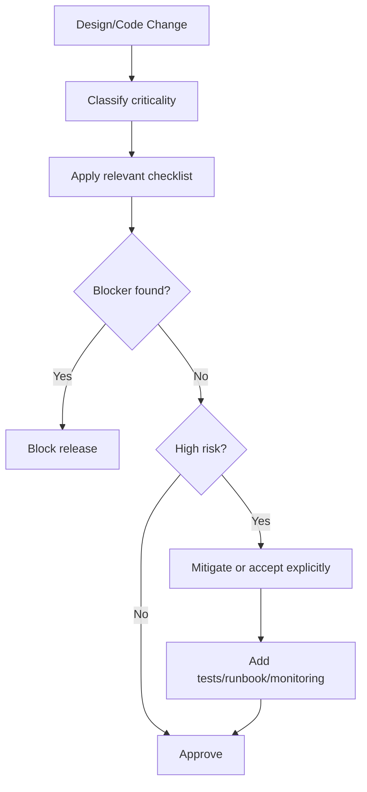
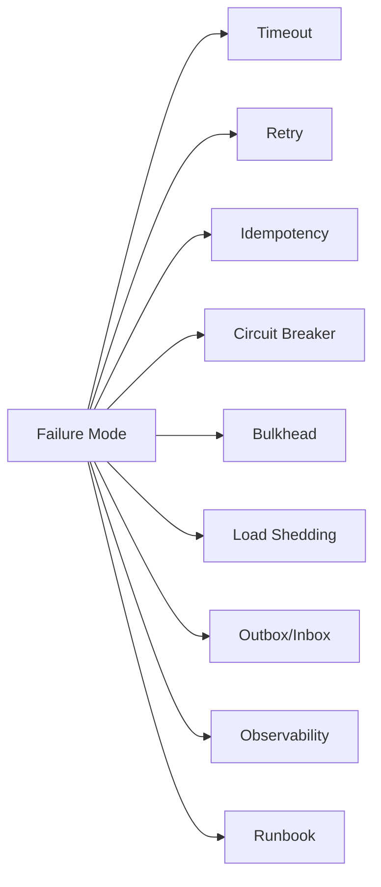
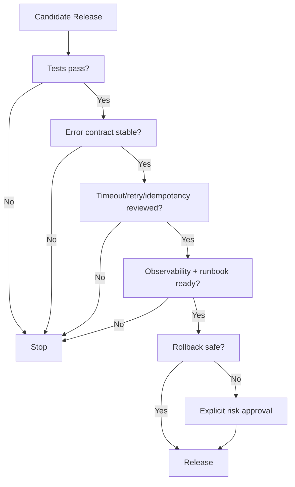

# learn-go-reliability-error-handling-part-033.md

# Engineering Handbook Checklist: Error Handling & Reliability Review Guide

> Seri: `learn-go-reliability-error-handling`  
> Part: `033`  
> Target: Go 1.26.x  
> Level: Advanced / internal engineering handbook  
> Fokus: checklist praktis untuk review desain, review kode, readiness production, operational review, dan reliability maturity pada Go backend service.

---

## 0. Posisi Materi Ini Dalam Seri

Sampai bagian ini, kita sudah membangun fondasi besar:

- mental model error/failure/reliability
- explicit error handling di Go
- wrapping/classification
- error boundary
- validation/domain/dependency error
- panic/recover
- context/timeout/retry/idempotency
- concurrency/channel failure
- HTTP server reliability
- graceful shutdown
- Kubernetes/container behavior
- dependency failure management
- circuit breaker/bulkhead/rate limit/load shedding
- overload handling
- observability
- public API error contract
- persistence reliability
- messaging reliability
- startup/readiness/fail-fast
- testing/fault injection
- incident management

Bagian ini mengubah semua materi tersebut menjadi **engineering handbook checklist**.

Tujuannya:

> Membuat reliability bisa direview, diaudit, diajarkan, dan diulang secara konsisten dalam kerja tim.

Checklist ini bisa dipakai untuk:

- design review
- code review
- production readiness review
- incident postmortem review
- service onboarding
- refactoring guide
- technical debt assessment
- release gate
- architecture decision record
- mentoring engineer baru
- AI/code-agent review prompt

---

## 1. Core Thesis

Reliability bukan hanya “skill individu senior”. Reliability harus menjadi **sistem kerja tim**.

Checklist yang baik membantu tim:

1. menemukan bug sebelum production,
2. mengurangi variasi kualitas antar engineer,
3. membuat standar eksplisit,
4. mempercepat review,
5. menghindari repeated incident,
6. mengubah pengetahuan tacit menjadi operasional,
7. menilai tradeoff secara konsisten,
8. memandu refactoring,
9. menjaga correctness saat pressure delivery tinggi.

Checklist bukan pengganti engineering judgment. Checklist adalah alat bantu agar judgment tidak lupa hal penting.

---

## 2. How to Use This Checklist

Tidak semua item wajib untuk semua service.

Gunakan berdasarkan jenis sistem:

| Service type | Fokus utama |
|---|---|
| simple internal API | error contract, timeout, logging, config |
| public API | strict API contract, auth, rate limit, observability |
| critical write service | idempotency, transaction, audit, outbox |
| worker/consumer | dedup, DLQ, retry, shutdown |
| gateway/BFF | dependency failure, timeout, overload |
| batch/report | queue, cancellation, resource limit |
| auth/security service | fail closed, audit, strict logging |
| platform service | startup/readiness, config, incident runbook |

Use checklist as:

```text
Must-have:
  blocks release if missing.

Should-have:
  recommended; accepted risk if missing.

Contextual:
  depends on service.

Not applicable:
  explicitly marked.
```

---

## 3. Review Severity

Classify findings.

| Severity | Meaning | Example |
|---|---|---|
| Blocker | can cause data corruption/security/outage | no idempotency for payment-like POST |
| High | likely production incident | no timeout to critical dependency |
| Medium | degraded reliability/debuggability | missing metrics for retry |
| Low | maintainability/consistency | inconsistent error code naming |
| Info | suggestion | improve log field name |

This prevents all feedback being treated equally.

---

## 4. Design Review Checklist

Use before implementation.

### 4.1 System Boundary

- [ ] What is the service responsible for?
- [ ] What is outside its responsibility?
- [ ] What are critical user journeys?
- [ ] What are correctness-critical operations?
- [ ] What are optional/degradable features?
- [ ] What are external dependencies?
- [ ] What is the expected availability/latency SLO?
- [ ] What are data consistency promises?

### 4.2 Failure Modes

- [ ] Dependency timeout considered.
- [ ] Dependency 5xx considered.
- [ ] Dependency malformed response considered.
- [ ] DB transaction failure considered.
- [ ] Duplicate request considered.
- [ ] Concurrent update considered.
- [ ] Process crash considered.
- [ ] Pod shutdown considered.
- [ ] Broker redelivery considered.
- [ ] Cache stale/down considered.
- [ ] Config/secret invalid considered.
- [ ] Overload considered.
- [ ] Partial failure considered.
- [ ] Data repair/reconciliation considered.

### 4.3 Reliability Controls

- [ ] Timeout policy defined.
- [ ] Retry policy defined.
- [ ] Idempotency policy defined.
- [ ] Fallback/degradation policy defined.
- [ ] Circuit breaker needed or explicitly not needed.
- [ ] Bulkhead/concurrency limits defined.
- [ ] Rate limit/load shedding policy defined.
- [ ] Graceful shutdown behavior defined.
- [ ] Observability signals defined.
- [ ] Runbook expectations defined.

---

## 5. Go Error Design Checklist

### 5.1 General

- [ ] Errors are returned explicitly.
- [ ] No ignored errors.
- [ ] Errors are wrapped with operation context.
- [ ] Error wrapping preserves `errors.Is/As`.
- [ ] Sentinel errors are stable and limited.
- [ ] Typed errors are used when structured data needed.
- [ ] Error message does not include secrets/PII.
- [ ] Lower layers do not decide public HTTP status.
- [ ] Error classification is centralized enough.

### 5.2 Error Wrapping

Good:

```go
return fmt.Errorf("load case %s: %w", id, err)
```

Review questions:

- [ ] Does wrapping add useful context?
- [ ] Does wrapping avoid duplicate/noisy context?
- [ ] Does caller still detect sentinel/typed error?
- [ ] Is `%w` used when preserving cause matters?
- [ ] Is `%v` used intentionally when hiding cause?

### 5.3 Error Comparison

- [ ] Uses `errors.Is`, not `==`, for wrapped sentinel.
- [ ] Uses `errors.As` for typed errors.
- [ ] Avoids parsing `err.Error()`.
- [ ] Handles joined errors where relevant.

---

## 6. Error Boundary Checklist

At service/API boundary:

- [ ] All internal errors mapped to public error contract.
- [ ] Unknown errors map to generic 500.
- [ ] Validation errors map to 400/422 with field errors.
- [ ] Domain conflicts map to 409.
- [ ] Authn maps to 401.
- [ ] Authz maps to 403.
- [ ] Not found maps to 404 or hidden 404 policy.
- [ ] Rate limit maps to 429.
- [ ] Overload maps to 503.
- [ ] Dependency timeout maps to 504/503 based role.
- [ ] Public response includes correlation ID.
- [ ] Raw internal error never returned.
- [ ] Boundary logs once.
- [ ] Boundary increments metric.

---

## 7. API Error Contract Checklist

- [ ] Error schema documented.
- [ ] Error schema consistent across endpoints.
- [ ] Stable `code` exists.
- [ ] HTTP status meaningful.
- [ ] `message` safe and client-readable.
- [ ] `fields` present for validation.
- [ ] `Retry-After` used for 429/503 if useful.
- [ ] Retry semantics documented.
- [ ] Idempotency error semantics documented.
- [ ] Auth error semantics documented.
- [ ] Error codes listed in registry.
- [ ] OpenAPI updated.
- [ ] Contract tests exist.
- [ ] Clients do not parse message text.
- [ ] Localization does not change code.

---

## 8. Validation Checklist

- [ ] Request body size limit.
- [ ] Content-Type checked.
- [ ] JSON malformed handled.
- [ ] Unknown fields policy defined.
- [ ] Multiple JSON documents rejected if inappropriate.
- [ ] Required fields validated.
- [ ] Field format validated.
- [ ] Enum values validated.
- [ ] Range validated.
- [ ] Cross-field rules validated.
- [ ] Validation errors aggregated.
- [ ] Field paths stable.
- [ ] Validation does not query slow dependencies unless necessary.
- [ ] Validation split from domain state checks.

---

## 9. Domain Error Checklist

- [ ] Domain invariant explicitly modeled.
- [ ] Invalid state transition returns domain error, not 500.
- [ ] Domain error code stable.
- [ ] Domain error not tied to DB/vendor details.
- [ ] Domain errors are tested.
- [ ] Domain errors map to API contract.
- [ ] Domain errors are distinguishable from validation errors.
- [ ] Domain conflict does not trigger retry incorrectly.
- [ ] Domain logic does not rely on stale cache for critical decision.

---

## 10. Panic and Recover Checklist

- [ ] Panic not used for normal control flow.
- [ ] HTTP recovery middleware exists.
- [ ] Worker goroutines recover/log where appropriate.
- [ ] Panic stack logged internally.
- [ ] Panic response is generic 500.
- [ ] Panic increments metric.
- [ ] Panic after response committed handled carefully.
- [ ] Panic recovery does not continue corrupted state.
- [ ] Startup panic logs stack and exits.
- [ ] Tests cover panic recovery.

---

## 11. Context Checklist

- [ ] `context.Context` first parameter for request-scoped operations.
- [ ] Context propagated to DB/HTTP/broker calls.
- [ ] Context not stored in struct for long-lived use.
- [ ] Context values limited to request metadata.
- [ ] Cancellation respected in loops.
- [ ] Background goroutines have lifecycle context.
- [ ] Shutdown context used correctly.
- [ ] `context.WithTimeout` cancel called.
- [ ] Context cause used if useful.
- [ ] Client cancellation not treated as internal server error.

---

## 12. Timeout Checklist

- [ ] Request timeout budget defined.
- [ ] Dependency timeout defined per operation.
- [ ] DB query timeout defined.
- [ ] Queue wait timeout defined.
- [ ] Shutdown timeout budget defined.
- [ ] Startup timeout bounded.
- [ ] Timeout values are config-validated.
- [ ] Timeout is shorter than caller deadline where appropriate.
- [ ] Timeout metrics include phase/kind.
- [ ] No indefinite blocking on channel/lock/network.
- [ ] Timeout does not cause commit ambiguity mishandling.

---

## 13. Retry Checklist

- [ ] Retry only for retryable errors.
- [ ] Retry classification explicit.
- [ ] Max attempts bounded.
- [ ] Backoff with jitter.
- [ ] Retry respects context.
- [ ] Retry budget considered.
- [ ] Non-idempotent operations not retried unsafely.
- [ ] 4xx not retried unless specifically justified.
- [ ] Circuit open not retried immediately.
- [ ] Retry metrics exist.
- [ ] Retry exhaustion mapped correctly.
- [ ] Tests cover retryable/permanent/exhausted/canceled.

---

## 14. Idempotency Checklist

For side-effecting operations:

- [ ] Idempotency key required or operation naturally idempotent.
- [ ] Request hash stored.
- [ ] Same key + same payload replays response.
- [ ] Same key + different payload returns conflict.
- [ ] In-progress behavior defined.
- [ ] Idempotency record atomic with state change.
- [ ] Retention policy defined.
- [ ] Concurrency race tested.
- [ ] Commit ambiguity resolution uses idempotency.
- [ ] Public API documents retry with same key.
- [ ] Metrics for replay/conflict/in-progress.

---

## 15. HTTP Server Checklist

- [ ] `http.Server` configured explicitly.
- [ ] `ReadHeaderTimeout` set.
- [ ] body size limits.
- [ ] route-level timeouts if needed.
- [ ] request ID middleware.
- [ ] panic recovery middleware.
- [ ] structured access/error logs.
- [ ] error boundary central.
- [ ] graceful shutdown implemented.
- [ ] readiness false during shutdown.
- [ ] response does not write twice after committed.
- [ ] client cancellation handled.
- [ ] streaming endpoints handle close/cancel.

---

## 16. HTTP Client / Dependency Checklist

- [ ] Reused `http.Client`, not new per request.
- [ ] Transport timeouts configured.
- [ ] Request context passed.
- [ ] Response body always closed.
- [ ] Error body read limited.
- [ ] Status codes classified.
- [ ] 429/Retry-After handled.
- [ ] Invalid JSON/schema handled.
- [ ] Retry policy safe.
- [ ] Circuit/bulkhead considered.
- [ ] Metrics by dependency/operation.
- [ ] No internal dependency details leak publicly.

---

## 17. Database Checklist

### 17.1 `database/sql`

- [ ] `QueryContext`/`ExecContext`/`BeginTx` used.
- [ ] Rows closed.
- [ ] `rows.Err()` checked.
- [ ] Pool configured.
- [ ] Pool metrics exported.
- [ ] Query operation labeled.
- [ ] Slow queries observable.
- [ ] DB errors classified.
- [ ] Connection errors handled.

### 17.2 Transactions

- [ ] Transaction boundary matches business operation.
- [ ] Transaction short.
- [ ] No slow external call inside transaction.
- [ ] Rollback deferred.
- [ ] Commit error handled.
- [ ] Commit ambiguity strategy.
- [ ] Deadlock/serialization retry whole tx.
- [ ] Lock ordering defined.
- [ ] Optimistic/pessimistic concurrency chosen.
- [ ] Constraints enforce invariants.
- [ ] Rows affected checked.
- [ ] Tests cover rollback/conflict.

---

## 18. Persistence Correctness Checklist

- [ ] Every state transition has audit if required.
- [ ] Outbox event inserted atomically with state.
- [ ] Idempotency complete atomically with state.
- [ ] Duplicate submit/update prevented.
- [ ] Cache not used for critical state decision.
- [ ] Read replica lag considered.
- [ ] Object storage dual-write handled.
- [ ] Reconciliation path exists for ambiguous states.
- [ ] Migration compatible with app rollout.
- [ ] Data repair scripts are idempotent/dry-run.
- [ ] Invariant queries defined for critical flows.

---

## 19. Messaging Checklist

### 19.1 Producer

- [ ] Transactional outbox for critical events.
- [ ] Stable event ID.
- [ ] Event schema/version.
- [ ] Ordering key defined if needed.
- [ ] Publish retry/backoff.
- [ ] Duplicate publish safe.
- [ ] Outbox age metrics.

### 19.2 Consumer

- [ ] Assumes at-least-once delivery.
- [ ] Idempotent handler.
- [ ] Inbox/processed message table if needed.
- [ ] Ack after durable commit.
- [ ] Poison classification.
- [ ] DLQ configured and owned.
- [ ] Retry/backoff bounded.
- [ ] Ordering/version policy.
- [ ] Graceful shutdown.
- [ ] Lag/DLQ/redelivery metrics.
- [ ] Replay behavior safe.

---

## 20. Concurrency Checklist

- [ ] Shared state protected by mutex/atomic/channel.
- [ ] Race detector passes.
- [ ] Goroutines have lifecycle/cancellation.
- [ ] No goroutine leaks.
- [ ] Channels closed by owner only.
- [ ] Send/receive blocking behavior understood.
- [ ] Bounded worker pools.
- [ ] Panic in goroutine handled if appropriate.
- [ ] Backpressure/queue full policy.
- [ ] WaitGroup usage safe.
- [ ] No unbounded goroutine per request/dependency.

---

## 21. Channel/Queue Checklist

- [ ] Queue bounded.
- [ ] Full policy explicit: reject/drop/block/persist.
- [ ] Context-aware send/receive.
- [ ] Queue depth metrics.
- [ ] Oldest age metrics.
- [ ] Shutdown drain policy.
- [ ] Critical work durable before enqueue.
- [ ] Poison job handling.
- [ ] Retry/backoff policy.
- [ ] Priority/fairness if needed.

---

## 22. Graceful Shutdown Checklist

- [ ] Signal handling for SIGTERM/SIGINT.
- [ ] Readiness false first.
- [ ] Stop accepting new work.
- [ ] HTTP server shutdown with timeout.
- [ ] Workers stop receiving.
- [ ] Consumers ack/nack current messages.
- [ ] Outbox dispatcher stops safely.
- [ ] Background goroutines joined.
- [ ] DB/cache/broker closed after users stop.
- [ ] Telemetry flush bounded.
- [ ] Total shutdown budget < Kubernetes grace.
- [ ] Forced shutdown path understood.
- [ ] Tests cover shutdown.

---

## 23. Kubernetes/Container Checklist

- [ ] Exec-form ENTRYPOINT.
- [ ] App handles SIGTERM.
- [ ] terminationGracePeriodSeconds adequate.
- [ ] preStop only if needed and budgeted.
- [ ] liveness not dependent on DB.
- [ ] readiness cheap/cached.
- [ ] startup probe for slow init.
- [ ] resource requests/limits set.
- [ ] memory/GOMEMLIMIT considered.
- [ ] CPU throttling observed.
- [ ] PDB configured if needed.
- [ ] rolling update maxUnavailable/maxSurge reviewed.
- [ ] readiness false during shutdown.
- [ ] logs to stdout/stderr structured.

---

## 24. Dependency Failure Checklist

For each dependency:

- [ ] Name/owner documented.
- [ ] Criticality classified.
- [ ] Timeout per operation.
- [ ] Retry policy.
- [ ] Fallback/degradation policy.
- [ ] Fail-open/closed decision.
- [ ] Circuit breaker considered.
- [ ] Bulkhead/concurrency limit considered.
- [ ] Rate limit/quota known.
- [ ] Health/readiness role.
- [ ] Observability metrics.
- [ ] Runbook for outage.
- [ ] Chaos/fault test scenario.

Dependency matrix:

```text
dependency | operation | criticality | timeout | retry | fallback | readiness | owner
```

---

## 25. Overload Checklist

- [ ] Admission control exists for expensive paths.
- [ ] In-flight limits set.
- [ ] Queue bounded.
- [ ] Load shedding policy.
- [ ] Priority classes defined.
- [ ] Fairness/noisy neighbor considered.
- [ ] Rate limit by user/tenant if needed.
- [ ] Brownout features identified.
- [ ] Correctness features excluded from brownout.
- [ ] Retry storm prevention.
- [ ] Overload returns 429/503, not generic 500.
- [ ] Metrics for rejection reasons.
- [ ] Load test validates behavior.

---

## 26. Observability Checklist

### 26.1 Logs

- [ ] Structured JSON logs.
- [ ] Request/correlation ID.
- [ ] Operation ID where relevant.
- [ ] Error code/kind.
- [ ] Log once at boundary.
- [ ] Panic stack internal.
- [ ] No secrets/PII.
- [ ] Sampling for noisy logs.
- [ ] Startup/shutdown logs.

### 26.2 Metrics

- [ ] RED metrics for HTTP.
- [ ] USE metrics for resources.
- [ ] Dependency metrics.
- [ ] DB pool metrics.
- [ ] Retry/circuit/bulkhead metrics.
- [ ] Queue/worker metrics.
- [ ] Idempotency metrics.
- [ ] Shutdown/startup metrics.
- [ ] Low-cardinality labels.

### 26.3 Traces

- [ ] Request spans.
- [ ] Dependency spans.
- [ ] DB/cache/broker spans if available.
- [ ] Error attributes.
- [ ] No sensitive data.
- [ ] Sampling keeps error/slow traces.

---

## 27. SLO/Error Budget Checklist

- [ ] Critical user journeys identified.
- [ ] Availability SLI defined.
- [ ] Latency SLI defined.
- [ ] Error budget policy defined.
- [ ] Client errors excluded appropriately.
- [ ] Domain conflicts classified correctly.
- [ ] 5xx/503/504 counted.
- [ ] Latency above threshold counted.
- [ ] Burn-rate alerts.
- [ ] Dashboard visible.
- [ ] Incident process tied to SLO.

---

## 28. Startup/Config Checklist

- [ ] Typed config struct.
- [ ] Required config validation.
- [ ] Safe defaults only.
- [ ] Secret validation.
- [ ] Secret redaction.
- [ ] Build metadata logged.
- [ ] Startup checks bounded.
- [ ] Explicit listener bind.
- [ ] Readiness false until ready.
- [ ] Startup probe if needed.
- [ ] Migration strategy safe.
- [ ] Config reload validates before swap.
- [ ] Optional dependency degraded.
- [ ] Critical dependency policy defined.

---

## 29. Security/Error Reliability Checklist

- [ ] Auth failure fails closed.
- [ ] Authorization uncertainty fails closed.
- [ ] Error response avoids enumeration risk.
- [ ] No raw token/log secret leakage.
- [ ] JWKS/token validation cache policy.
- [ ] Permission cache TTL/revocation considered.
- [ ] Audit failures treated as critical.
- [ ] Security events logged safely.
- [ ] Rate limiting/abuse controls.
- [ ] Panic/internal errors not exposed.
- [ ] Sensitive fields redacted from traces/logs.

---

## 30. Testing Checklist

- [ ] Error mapper tests.
- [ ] API contract tests.
- [ ] Validation tests.
- [ ] Panic recovery tests.
- [ ] Timeout/cancel tests.
- [ ] Retry tests.
- [ ] Idempotency tests.
- [ ] Concurrency/race tests.
- [ ] DB transaction tests.
- [ ] Messaging duplicate/DLQ tests.
- [ ] Overload tests.
- [ ] Shutdown tests.
- [ ] Startup/readiness tests.
- [ ] Observability tests.
- [ ] Integration tests for real DB/broker.
- [ ] Fault injection/chaos scenarios.

---

## 31. Incident Readiness Checklist

- [ ] Runbook exists for key alerts.
- [ ] Dashboard links in runbook.
- [ ] Rollback procedure tested.
- [ ] Feature flag/brownout documented.
- [ ] DLQ replay procedure.
- [ ] Data invariant queries.
- [ ] Repair script process.
- [ ] On-call ownership.
- [ ] Severity matrix.
- [ ] Communication templates.
- [ ] Postmortem template.
- [ ] Error budget policy.
- [ ] Recent incident actions tracked.

---

## 32. Code Review Red Flags

Blocker/high red flags:

- ignored error
- raw `http.Get` without timeout
- `context.Background()` inside request path
- unbounded goroutine per request
- unbounded channel/queue
- no body close
- DB transaction with external call inside
- ack before commit
- no idempotency for side-effecting retryable POST
- raw internal error returned to client
- liveness checks DB
- auth fail-open
- panic for expected validation
- retry all errors
- infinite retry
- no rollback on tx error
- no `rows.Close`
- cache used for critical state decision
- no DLQ for poison messages
- 200 response with error body for unexpected failure
- `err.Error()` as metric label
- logging token/password
- readiness true before startup complete

---

## 33. Design Review Questions

Ask:

1. What happens if dependency times out?
2. What happens if request is retried?
3. What happens if process crashes after DB commit but before response?
4. What happens if two requests update same resource concurrently?
5. What happens if broker redelivers message?
6. What happens if downstream returns invalid JSON?
7. What happens if cache is stale?
8. What happens if DB pool is exhausted?
9. What happens if pod receives SIGTERM?
10. What happens if config is invalid?
11. What happens if auth provider is down?
12. What happens if audit insert fails?
13. What happens if queue is full?
14. What happens if DLQ grows?
15. How do we know this happened?

If design cannot answer, reliability gap exists.

---

## 34. Production Readiness Review Template

```text
Service:
Owner:
Criticality:
SLO:
Dependencies:
Data stores:
Message streams:
Deployment model:
Rollback strategy:

Error handling:
Timeout/retry:
Idempotency:
Persistence correctness:
Messaging correctness:
Overload controls:
Startup/readiness:
Shutdown:
Observability:
Security:
Testing:
Runbooks:
Known risks:
Launch decision:
```

---

## 35. ADR Template for Reliability Decision

```text
Title:
Status:
Context:
Decision:
Alternatives:
Consequences:
Failure modes considered:
Operational impact:
Testing plan:
Rollback plan:
Owner:
Date:
```

Example:

```text
Decision:
Use transactional outbox for case state events.

Reason:
State change and event publication must be atomic. Direct publish can lose events.

Consequence:
Consumers must dedup because dispatcher may republish after mark-published failure.
```

---

## 36. Reliability Maturity Levels

### Level 0: Ad hoc

- no explicit timeout
- no error contract
- logs only
- manual incident response

### Level 1: Basic

- errors returned/wrapped
- config validation
- request logging
- simple health checks

### Level 2: Production-capable

- timeouts
- error boundary
- graceful shutdown
- readiness
- metrics
- DB transaction discipline
- basic tests

### Level 3: Resilient

- idempotency
- outbox/inbox
- retry budget
- circuit/bulkhead
- overload shedding
- SLO alerts
- runbooks

### Level 4: Operable at scale

- fault injection
- chaos game days
- automated rollback/canary
- error budget governance
- mature dashboards
- repair/reconciliation tooling

### Level 5: Continuously improving

- incident learning loop
- automated resilience validation
- reliability review embedded in SDLC
- quantified risk management

---

## 37. Minimal Baseline for Any Go Service

At minimum:

- [ ] typed config validation
- [ ] structured logger
- [ ] request ID
- [ ] panic recovery
- [ ] centralized error mapper
- [ ] public error contract
- [ ] explicit `http.Server` timeouts
- [ ] context propagation
- [ ] dependency timeouts
- [ ] DB rows close and tx discipline if DB used
- [ ] graceful shutdown
- [ ] liveness/readiness
- [ ] basic RED metrics
- [ ] no secret logging
- [ ] unit tests for error mapper
- [ ] startup fail-fast for invalid config

---

## 38. Baseline for Critical Write Service

Additional must-have:

- [ ] idempotency key
- [ ] transaction boundary
- [ ] audit atomic with state
- [ ] outbox atomic with state
- [ ] optimistic/pessimistic concurrency control
- [ ] duplicate/concurrent tests
- [ ] commit ambiguity plan
- [ ] domain invariant tests
- [ ] rollback tested
- [ ] data invariant queries
- [ ] runbook for partial failure
- [ ] SLO/error budget
- [ ] fault injection for crash/retry

---

## 39. Baseline for Worker/Consumer

Additional must-have:

- [ ] at-least-once assumption
- [ ] idempotent handler
- [ ] ack after commit
- [ ] DLQ
- [ ] retry/backoff
- [ ] poison classification
- [ ] graceful shutdown
- [ ] lag/DLQ metrics
- [ ] replay procedure
- [ ] duplicate delivery tests
- [ ] schema compatibility policy

---

## 40. Baseline for Gateway/BFF

Additional must-have:

- [ ] per-dependency timeout
- [ ] no unbounded fanout
- [ ] partial response/degradation policy
- [ ] circuit/bulkhead if needed
- [ ] response body limits
- [ ] dependency error mapping
- [ ] correlation propagation
- [ ] rate limiting/admission
- [ ] downstream invalid response handling
- [ ] fallback correctness review

---

## 41. Example Review: Side-effecting POST

Endpoint:

```text
POST /cases/{id}/submit
```

Review:

- [ ] Requires idempotency key.
- [ ] Validates request.
- [ ] Auth/authz fail closed.
- [ ] Locks case or uses version.
- [ ] Checks status in transaction.
- [ ] Updates state.
- [ ] Inserts audit.
- [ ] Inserts outbox.
- [ ] Completes idempotency.
- [ ] Commits.
- [ ] Handles commit ambiguity.
- [ ] Maps invalid state to 409.
- [ ] Maps duplicate key conflict to 409.
- [ ] Handles timeout safely.
- [ ] Supports client retry with same key.
- [ ] Tests concurrent submit.
- [ ] Metrics/logs/traces include operation ID.

---

## 42. Example Review: External API Call

Operation:

```text
Get profile enrichment from profile service.
```

Review:

- [ ] Timeout < parent request budget.
- [ ] Reused HTTP client.
- [ ] Transport timeouts set.
- [ ] Status codes classified.
- [ ] 429 handled.
- [ ] Response body closed/limited.
- [ ] Invalid JSON mapped to bad response.
- [ ] Retry only safe errors.
- [ ] Fallback/degradation defined.
- [ ] Circuit/bulkhead considered.
- [ ] Metrics include dependency/operation/kind.
- [ ] Public error sanitized.
- [ ] Test 503/timeout/invalid JSON.

---

## 43. Example Review: Message Consumer

Consumer:

```text
case.submitted -> create notification
```

Review:

- [ ] Event has stable event ID.
- [ ] Handler dedups by event ID or notification key.
- [ ] Processing transaction includes dedup + notification record.
- [ ] Ack after commit.
- [ ] Email dispatch via outbox or provider idempotency.
- [ ] Poison schema goes DLQ.
- [ ] Retry provider timeout with backoff.
- [ ] Duplicate event does not duplicate email.
- [ ] Shutdown stops receiving first.
- [ ] DLQ alert/runbook.
- [ ] Replay safe.

---

## 44. AI/Code Agent Review Prompt

You can use this prompt when asking an AI coding agent to review Go reliability:

```text
Review this Go code for production reliability.

Focus on:
- ignored errors
- error wrapping and classification
- public API error contract
- context propagation
- timeouts and cancellation
- retry safety and idempotency
- panic/recover boundaries
- HTTP client/server timeouts
- DB transaction correctness
- rows/response body closing
- concurrency/race/goroutine leaks
- channel/queue boundedness
- graceful shutdown
- dependency failure behavior
- overload behavior
- observability: logs/metrics/traces
- security leakage in errors/logs
- tests for failure behavior

For each finding:
- severity: blocker/high/medium/low
- code location
- failure scenario
- recommended fix
- test to add
```

---

## 45. Mermaid: Review Flow



---

## 46. Mermaid: Reliability Control Map



---

## 47. Mermaid: Release Gate



---

## 48. Regulatory Case Management Lens

For regulatory/case-management systems, handbook checklist should emphasize:

- state transition correctness
- audit completeness
- idempotent submit/approve/reject
- authorization fail-closed
- document integrity
- outbox event completeness
- DLQ handling
- data repair audit trail
- SLA observability
- agency/tenant fairness
- incident communication and evidence

Critical review question:

```text
If this operation succeeds, what durable evidence proves it succeeded correctly?
```

For case transition:

```text
case state updated
audit inserted
outbox event inserted
idempotency completed
correlation/operation ID logged
```

---

## 49. Key Takeaways

1. Reliability must be reviewable, not just remembered.
2. Checklists convert hard-earned knowledge into repeatable team practice.
3. Different service types need different checklist emphasis.
4. Severity classification prevents review noise.
5. Error handling review must include public contract and observability.
6. Timeout/retry/idempotency must be reviewed together.
7. Persistence correctness needs transaction, constraints, audit, outbox, and tests.
8. Messaging correctness assumes duplicate/redelivery.
9. Overload behavior must be intentional.
10. Liveness/readiness/startup/shutdown are part of application design.
11. Observability must be designed before incident.
12. Security-sensitive failures must fail closed.
13. Tests should cover failure behavior, not only happy path.
14. Incident readiness is part of production readiness.
15. Red flags should block release if they risk correctness/security/outage.
16. ADRs preserve reliability decisions and tradeoffs.
17. Mature teams embed reliability review into SDLC.
18. AI/code agents can use this checklist as review guidance.
19. A checklist is not bureaucracy when it prevents repeated incident.
20. Reliability is a system property produced by engineering process.

---

## 50. References

- Google SRE Book: Service Level Objectives
- Google SRE Book: Monitoring Distributed Systems
- Google SRE Book: Managing Incidents
- Google SRE Workbook: Production Readiness Reviews
- AWS Builders Library: reliability and operational practices
- Go package documentation: `errors`, `context`, `net/http`, `database/sql`, `log/slog`
- Kubernetes documentation: probes, pod lifecycle, resource management
- OWASP Error Handling Cheat Sheet
- OWASP Logging Cheat Sheet

---

## 51. Next Part

Next:

```text
learn-go-reliability-error-handling-part-034.md
```

Topic:

```text
Capstone Production-Grade Go Service Reliability Skeleton
```

<!-- NAVIGATION_FOOTER -->
<div class="page-nav">
<a href="./learn-go-reliability-error-handling-part-032.md">⬅️ Production Incident Management: Triage, Mitigation, Postmortem, Runbook, Learning Loop</a>
<a href="./index.md">📚 Kategori</a>
<a href="../../index.md">🏠 Home</a>
<a href="./learn-go-reliability-error-handling-part-034.md">Capstone Production-Grade Go Service Reliability Skeleton ➡️</a>
</div>
