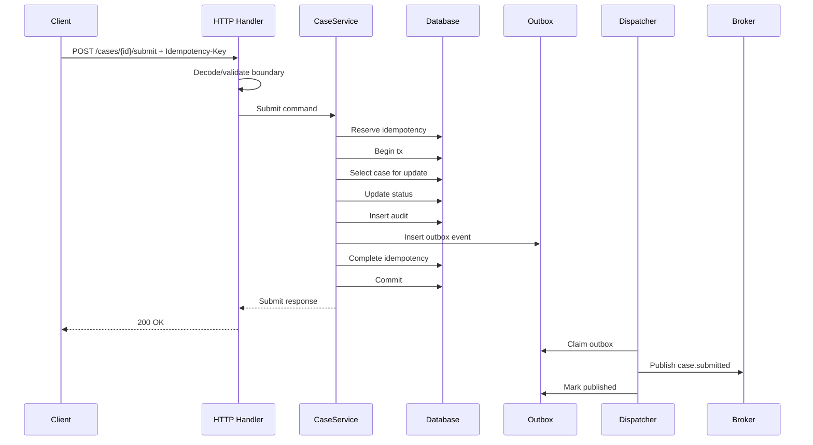
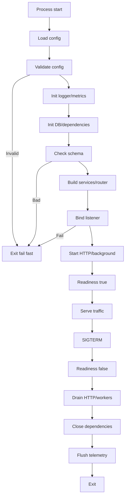
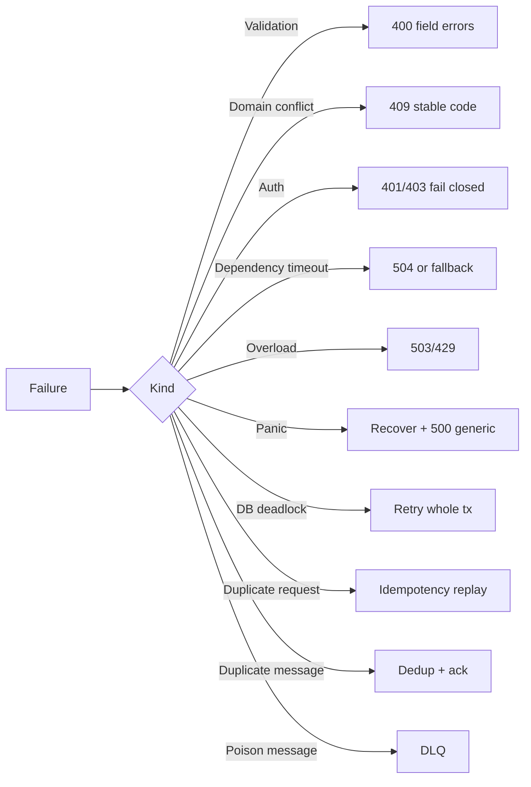

# learn-go-reliability-error-handling-part-034.md

# Capstone Production-Grade Go Service Reliability Skeleton

> Seri: `learn-go-reliability-error-handling`  
> Part: `034`  
> Target: Go 1.26.x  
> Level: Advanced / capstone  
> Fokus: menyatukan seluruh materi menjadi skeleton service Go yang production-grade dari sudut pandang error handling, reliability, operability, correctness, dan graceful lifecycle.

---

## 0. Posisi Materi Ini Dalam Seri

Ini adalah bagian terakhir dari seri:

```text
learn-go-reliability-error-handling
```

Kita sudah membahas dari fondasi sampai production operations:

- error philosophy
- error taxonomy
- sentinel/typed/wrapped/joined error
- error message design
- error boundary
- validation/domain/dependency error
- panic/recover
- defer/cleanup/resource safety
- context propagation
- timeout
- retry
- idempotency
- concurrency/channel failure
- HTTP reliability
- graceful shutdown
- Kubernetes reliability
- dependency failure management
- circuit breaker/bulkhead/rate limit/load shedding/backpressure
- overload handling
- observability
- API error contract
- persistence reliability
- messaging reliability
- startup/readiness/fail-fast
- testing/fault injection
- incident management
- engineering checklist

Bagian ini menggabungkan semuanya menjadi **production-grade skeleton**.

Tujuannya bukan memberikan framework final yang harus di-copy mentah-mentah, tetapi memberikan blueprint mental dan struktur implementasi yang bisa Anda adaptasi ke service nyata.

---

## 1. Core Thesis

Production-grade Go service bukan hanya kumpulan handler.

Ia adalah sistem dengan lifecycle lengkap:

```text
load config
validate config
initialize dependencies
start server
become ready
serve requests with bounded resources
classify errors
return stable API contract
observe everything important
handle dependency failures
protect data correctness
process async work safely
reject overload predictably
shutdown gracefully
recover from incidents
```

Skeleton ini harus menjawab:

1. Bagaimana startup gagal cepat kalau config salah?
2. Bagaimana readiness merepresentasikan state service?
3. Bagaimana HTTP server punya timeout dan graceful shutdown?
4. Bagaimana error internal dipetakan ke public contract?
5. Bagaimana request ID/correlation ID dipropagasi?
6. Bagaimana dependency call punya timeout/retry/classification?
7. Bagaimana side-effecting POST idempotent?
8. Bagaimana DB transaction menjaga state+audit+outbox?
9. Bagaimana outbox dispatcher mengirim event reliably?
10. Bagaimana worker/consumer idempotent?
11. Bagaimana overload direject cepat?
12. Bagaimana observability memberi bukti?
13. Bagaimana shutdown tidak merusak data?
14. Bagaimana test matrix membuktikan behavior?

---

## 2. Target Architecture

Skeleton service:

```text
case-api
├── HTTP API
│   ├── request id
│   ├── panic recovery
│   ├── admission/load shedding
│   ├── auth middleware
│   ├── error boundary
│   └── handlers
├── Application service
│   ├── validation
│   ├── domain logic
│   ├── idempotency
│   └── transaction orchestration
├── Persistence
│   ├── repositories
│   ├── transactions
│   ├── audit
│   └── outbox
├── Dependencies
│   ├── profile client
│   ├── auth/JWKS
│   └── cache
├── Async
│   ├── outbox dispatcher
│   └── message consumer
├── Reliability controls
│   ├── timeouts
│   ├── retry
│   ├── bulkhead
│   ├── circuit breaker
│   ├── rate limit
│   └── overload shedder
├── Observability
│   ├── logs
│   ├── metrics
│   └── traces
└── Lifecycle
    ├── startup
    ├── readiness/liveness
    └── graceful shutdown
```

---

## 3. Repository Layout

Recommended layout:

```text
case-api/
├── cmd/
│   └── case-api/
│       └── main.go
├── internal/
│   ├── app/
│   │   ├── app.go
│   │   ├── lifecycle.go
│   │   └── readiness.go
│   ├── config/
│   │   ├── config.go
│   │   └── validate.go
│   ├── httpapi/
│   │   ├── router.go
│   │   ├── middleware.go
│   │   ├── handlers.go
│   │   ├── problem.go
│   │   └── decode.go
│   ├── domain/
│   │   ├── case.go
│   │   ├── errors.go
│   │   └── service.go
│   ├── persistence/
│   │   ├── db.go
│   │   ├── tx.go
│   │   ├── case_repo.go
│   │   ├── idempotency_repo.go
│   │   ├── audit_repo.go
│   │   └── outbox_repo.go
│   ├── outbox/
│   │   └── dispatcher.go
│   ├── messaging/
│   │   ├── consumer.go
│   │   └── inbox.go
│   ├── clients/
│   │   └── profile_client.go
│   ├── reliability/
│   │   ├── retry.go
│   │   ├── bulkhead.go
│   │   ├── circuit.go
│   │   ├── admission.go
│   │   └── errors.go
│   ├── observability/
│   │   ├── logger.go
│   │   ├── metrics.go
│   │   └── trace.go
│   └── buildinfo/
│       └── buildinfo.go
├── migrations/
├── test/
│   ├── integration/
│   └── contract/
├── go.mod
└── README.md
```

Principle:

- `cmd` wires the app.
- `internal/app` controls lifecycle.
- `httpapi` owns HTTP boundary.
- `domain` owns business rules.
- `persistence` owns DB details.
- `clients` own dependency boundaries.
- `reliability` owns reusable controls.
- `observability` owns telemetry abstraction.

---

## 4. Main Function

`main.go` should be boring and safe.

```go
package main

import (
    "context"
    "errors"
    "log/slog"
    "os"
    "os/signal"
    "runtime/debug"
    "syscall"

    "example.com/case-api/internal/app"
    "example.com/case-api/internal/config"
    "example.com/case-api/internal/observability"
)

func main() {
    if err := safeMain(); err != nil {
        slog.Error("application failed", "error", err)
        os.Exit(1)
    }
}

func safeMain() (err error) {
    defer func() {
        if v := recover(); v != nil {
            err = errors.Join(err, errors.New("panic during startup"))
            slog.Error("panic during startup",
                "panic", v,
                "stack", string(debug.Stack()),
            )
        }
    }()

    ctx, stop := signal.NotifyContext(context.Background(), syscall.SIGTERM, syscall.SIGINT)
    defer stop()

    rawCfg, err := config.Load()
    if err != nil {
        return err
    }

    cfg, err := config.Parse(rawCfg)
    if err != nil {
        return err
    }

    if err := cfg.Validate(); err != nil {
        return err
    }

    logger := observability.NewLogger(cfg.Observability)
    logger.Info("starting case-api",
        "version", app.Version,
        "commit", app.Commit,
    )

    application, err := app.New(ctx, cfg, logger)
    if err != nil {
        return err
    }

    return application.Run(ctx)
}
```

Key properties:

- panic during startup logged with stack and exits
- config validated before app starts
- signal context used
- main does not contain business logic

---

## 5. Config

```go
type Config struct {
    Env string

    HTTP HTTPConfig
    DB   DBConfig
    Auth AuthConfig

    Profile ProfileClientConfig

    Idempotency IdempotencyConfig
    Outbox      OutboxConfig
    Shutdown    ShutdownConfig

    Observability ObservabilityConfig
}

type ShutdownConfig struct {
    Total              time.Duration
    ReadinessDrain     time.Duration
    HTTPShutdown       time.Duration
    WorkerShutdown     time.Duration
    DependencyClose    time.Duration
    TelemetryFlush     time.Duration
}

func (c ShutdownConfig) Validate() error {
    var err error

    if c.Total <= 0 {
        err = errors.Join(err, errors.New("shutdown.total must be positive"))
    }

    sum := c.ReadinessDrain + c.HTTPShutdown + c.WorkerShutdown + c.DependencyClose + c.TelemetryFlush
    if c.Total > 0 && sum > c.Total {
        err = errors.Join(err, fmt.Errorf("shutdown phase sum %s exceeds total %s", sum, c.Total))
    }

    return err
}
```

Validation:

```go
func (c Config) Validate() error {
    var err error

    if c.Env == "" {
        err = errors.Join(err, errors.New("env is required"))
    }
    if c.HTTP.Addr == "" {
        err = errors.Join(err, errors.New("http.addr is required"))
    }
    if c.DB.DSN == "" {
        err = errors.Join(err, errors.New("db.dsn is required"))
    }
    if c.DB.MaxOpenConns <= 0 {
        err = errors.Join(err, errors.New("db.max_open_conns must be positive"))
    }
    if c.Profile.BaseURL == "" {
        err = errors.Join(err, errors.New("profile.base_url is required"))
    }
    if c.Profile.Timeout <= 0 {
        err = errors.Join(err, errors.New("profile.timeout must be positive"))
    }

    err = errors.Join(err, c.Shutdown.Validate())

    return err
}
```

---

## 6. App Lifecycle

```go
type App struct {
    cfg    config.Config
    logger *slog.Logger

    readiness *Readiness

    server *http.Server
    db     *sql.DB

    outboxDispatcher *outbox.Dispatcher
    consumer         *messaging.Consumer

    shutdownOnce sync.Once
}

func New(ctx context.Context, cfg config.Config, logger *slog.Logger) (*App, error) {
    readiness := NewReadiness()
    readiness.SetNotReady("initializing")

    db, err := persistence.OpenDB(cfg.DB)
    if err != nil {
        return nil, fmt.Errorf("open db: %w", err)
    }

    if err := persistence.CheckSchema(ctx, db, cfg.DB.ExpectedSchemaVersion); err != nil {
        _ = db.Close()
        return nil, fmt.Errorf("check schema: %w", err)
    }

    profileClient := clients.NewProfileClient(cfg.Profile, logger)

    caseRepo := persistence.NewCaseRepo(db)
    idemRepo := persistence.NewIdempotencyRepo(db)
    outboxRepo := persistence.NewOutboxRepo(db)

    caseService := domain.NewCaseService(domain.CaseServiceDeps{
        Tx:          persistence.NewTxRunner(db),
        Cases:       caseRepo,
        Idempotency: idemRepo,
        Outbox:      outboxRepo,
        Profile:     profileClient,
        Logger:      logger,
    })

    router := httpapi.NewRouter(httpapi.RouterDeps{
        CaseService: caseService,
        Readiness:   readiness,
        Logger:      logger,
    })

    server := &http.Server{
        Addr:              cfg.HTTP.Addr,
        Handler:           router,
        ReadHeaderTimeout: cfg.HTTP.ReadHeaderTimeout,
        ReadTimeout:       cfg.HTTP.ReadTimeout,
        WriteTimeout:      cfg.HTTP.WriteTimeout,
        IdleTimeout:       cfg.HTTP.IdleTimeout,
    }

    return &App{
        cfg:       cfg,
        logger:    logger,
        readiness: readiness,
        server:    server,
        db:        db,
    }, nil
}
```

Startup policy:

- invalid config: fail fast
- schema mismatch: fail fast
- optional cache unavailable: degrade
- telemetry unavailable: start with warning
- auth key missing: fail closed/readiness false based design

---

## 7. Readiness State

```go
type Readiness struct {
    ready  atomic.Bool
    reason atomic.Value
}

func NewReadiness() *Readiness {
    r := &Readiness{}
    r.SetNotReady("initializing")
    return r
}

func (r *Readiness) SetReady() {
    r.ready.Store(true)
    r.reason.Store("ready")
}

func (r *Readiness) SetNotReady(reason string) {
    r.ready.Store(false)
    r.reason.Store(reason)
}

func (r *Readiness) Snapshot() (bool, string) {
    reason, _ := r.reason.Load().(string)
    return r.ready.Load(), reason
}
```

Handlers:

```go
func ReadyHandler(readiness *Readiness) http.HandlerFunc {
    return func(w http.ResponseWriter, r *http.Request) {
        ok, reason := readiness.Snapshot()
        if !ok {
            w.WriteHeader(http.StatusServiceUnavailable)
            _, _ = w.Write([]byte(reason))
            return
        }

        w.WriteHeader(http.StatusOK)
        _, _ = w.Write([]byte("ok"))
    }
}

func LiveHandler() http.HandlerFunc {
    return func(w http.ResponseWriter, r *http.Request) {
        w.WriteHeader(http.StatusOK)
        _, _ = w.Write([]byte("ok"))
    }
}
```

---

## 8. Run and Shutdown

```go
func (a *App) Run(ctx context.Context) error {
    ln, err := net.Listen("tcp", a.cfg.HTTP.Addr)
    if err != nil {
        return fmt.Errorf("listen: %w", err)
    }

    serverErr := make(chan error, 1)

    go func() {
        a.logger.Info("http server starting", "addr", a.cfg.HTTP.Addr)
        err := a.server.Serve(ln)
        if err != nil && !errors.Is(err, http.ErrServerClosed) {
            serverErr <- err
            return
        }
        serverErr <- nil
    }()

    a.readiness.SetReady()
    a.logger.Info("application ready")

    select {
    case <-ctx.Done():
        return a.Shutdown(context.Background())
    case err := <-serverErr:
        if err != nil {
            a.readiness.SetNotReady("http_server_failed")
            return fmt.Errorf("http server failed: %w", err)
        }
        return nil
    }
}
```

Shutdown:

```go
func (a *App) Shutdown(parent context.Context) error {
    var err error

    a.shutdownOnce.Do(func() {
        a.logger.Info("shutdown started")
        a.readiness.SetNotReady("shutting_down")

        cfg := a.cfg.Shutdown

        time.Sleep(cfg.ReadinessDrain)

        httpCtx, cancelHTTP := context.WithTimeout(parent, cfg.HTTPShutdown)
        defer cancelHTTP()
        if e := a.server.Shutdown(httpCtx); e != nil {
            err = errors.Join(err, fmt.Errorf("http shutdown: %w", e))
        }

        depCtx, cancelDep := context.WithTimeout(parent, cfg.DependencyClose)
        defer cancelDep()

        done := make(chan struct{})
        go func() {
            _ = a.db.Close()
            close(done)
        }()

        select {
        case <-done:
        case <-depCtx.Done():
            err = errors.Join(err, fmt.Errorf("close dependencies: %w", context.Cause(depCtx)))
        }

        a.logger.Info("shutdown completed", "error", err)
    })

    return err
}
```

Important:

- readiness false first
- HTTP drain before closing DB
- close dependencies after users stop
- bounded phases
- errors joined

---

## 9. HTTP Middleware Chain

```go
func NewRouter(deps RouterDeps) http.Handler {
    mux := http.NewServeMux()

    mux.HandleFunc("GET /live", LiveHandler())
    mux.HandleFunc("GET /ready", ReadyHandler(deps.Readiness))

    caseHandler := NewCaseHandler(deps.CaseService, deps.Logger)

    mux.Handle("POST /cases/{case_id}/submit", caseHandler.Submit())

    var h http.Handler = mux

    h = Recover(deps.Logger)(h)
    h = AccessLog(deps.Logger)(h)
    h = RequestID(h)
    h = Admission(deps.AdmissionLimiter)(h)

    return h
}
```

Order can vary, but principles:

- request ID early
- panic recovery around handler
- admission before expensive work
- health routes may bypass normal admission if required
- access logs include status/duration

---

## 10. Request ID Middleware

```go
type requestIDKey struct{}

func RequestID(next http.Handler) http.Handler {
    return http.HandlerFunc(func(w http.ResponseWriter, r *http.Request) {
        id := r.Header.Get("X-Request-ID")
        if !validRequestID(id) {
            id = newRequestID()
        }

        w.Header().Set("X-Request-ID", id)

        ctx := context.WithValue(r.Context(), requestIDKey{}, id)
        next.ServeHTTP(w, r.WithContext(ctx))
    })
}

func RequestIDFromContext(ctx context.Context) string {
    id, _ := ctx.Value(requestIDKey{}).(string)
    return id
}
```

---

## 11. Problem/Error Contract

```go
type Problem struct {
    Type          string       `json:"type,omitempty"`
    Title         string       `json:"title"`
    Status        int          `json:"status"`
    Code          string       `json:"code"`
    Message       string       `json:"message"`
    CorrelationID string       `json:"correlation_id,omitempty"`
    Retryable     *bool        `json:"retryable,omitempty"`
    RetryAfterSec *int         `json:"retry_after_seconds,omitempty"`
    Fields        []FieldError `json:"fields,omitempty"`
}

type FieldError struct {
    Path    string `json:"path"`
    Code    string `json:"code"`
    Message string `json:"message"`
}
```

Mapper:

```go
type ErrorMapper struct{}

func (m ErrorMapper) Map(err error) Problem {
    var v *domain.ValidationError
    if errors.As(err, &v) {
        return problemFromValidation(v)
    }

    if errors.Is(err, domain.ErrCaseNotFound) {
        return Problem{Status: 404, Code: "CASE_NOT_FOUND", Title: "Case not found", Message: "The case was not found."}
    }

    if errors.Is(err, domain.ErrInvalidStateTransition) {
        return Problem{Status: 409, Code: "INVALID_STATE_TRANSITION", Title: "Invalid state transition", Message: "The case cannot be submitted in its current state."}
    }

    if errors.Is(err, domain.ErrIdempotencyConflict) {
        return Problem{Status: 409, Code: "IDEMPOTENCY_KEY_CONFLICT", Title: "Idempotency conflict", Message: "The same idempotency key was used with a different payload."}
    }

    var dep *reliability.DependencyError
    if errors.As(err, &dep) {
        return problemFromDependency(dep)
    }

    if errors.Is(err, reliability.ErrServiceBusy) {
        retry := true
        after := 1
        return Problem{Status: 503, Code: "SERVICE_BUSY", Title: "Service busy", Message: "The service is currently busy. Please retry later.", Retryable: &retry, RetryAfterSec: &after}
    }

    return Problem{Status: 500, Code: "INTERNAL_ERROR", Title: "Internal server error", Message: "An unexpected error occurred."}
}
```

Boundary write:

```go
func WriteProblem(w http.ResponseWriter, p Problem) {
    if p.Status == 0 {
        p.Status = http.StatusInternalServerError
    }

    w.Header().Set("Content-Type", "application/problem+json; charset=utf-8")

    if p.RetryAfterSec != nil {
        w.Header().Set("Retry-After", strconv.Itoa(*p.RetryAfterSec))
    }

    w.WriteHeader(p.Status)
    _ = json.NewEncoder(w).Encode(p)
}
```

---

## 12. Handler Skeleton

```go
type CaseHandler struct {
    service *domain.CaseService
    mapper  ErrorMapper
    logger  *slog.Logger
}

func (h *CaseHandler) Submit() http.Handler {
    return http.HandlerFunc(func(w http.ResponseWriter, r *http.Request) {
        ctx := r.Context()

        caseID := r.PathValue("case_id")
        idempotencyKey := r.Header.Get("Idempotency-Key")

        var req SubmitCaseRequest
        if err := DecodeJSON(w, r, &req, 1<<20); err != nil {
            h.writeError(w, r, err)
            return
        }

        cmd := domain.SubmitCaseCommand{
            CaseID:         domain.CaseID(caseID),
            IdempotencyKey: idempotencyKey,
            Payload:        req,
            ActorID:        ActorIDFromContext(ctx),
        }

        resp, err := h.service.Submit(ctx, cmd)
        if err != nil {
            h.writeError(w, r, err)
            return
        }

        w.Header().Set("Content-Type", "application/json; charset=utf-8")
        w.WriteHeader(http.StatusOK)
        _ = json.NewEncoder(w).Encode(resp)
    })
}

func (h *CaseHandler) writeError(w http.ResponseWriter, r *http.Request, err error) {
    p := h.mapper.Map(err)
    p.CorrelationID = RequestIDFromContext(r.Context())

    level := slog.LevelInfo
    if p.Status >= 500 {
        level = slog.LevelError
    } else if p.Status == 429 || p.Status == 503 {
        level = slog.LevelWarn
    }

    h.logger.LogAttrs(r.Context(), level, "request failed",
        slog.String("route", r.URL.Path),
        slog.Int("status", p.Status),
        slog.String("error_code", p.Code),
        slog.String("request_id", p.CorrelationID),
        slog.Any("error", err),
    )

    WriteProblem(w, p)
}
```

---

## 13. Decode JSON Safely

```go
func DecodeJSON(w http.ResponseWriter, r *http.Request, dst any, maxBytes int64) error {
    if r.Header.Get("Content-Type") != "" {
        mediaType, _, err := mime.ParseMediaType(r.Header.Get("Content-Type"))
        if err != nil || mediaType != "application/json" {
            return ErrUnsupportedMediaType
        }
    }

    r.Body = http.MaxBytesReader(w, r.Body, maxBytes)

    dec := json.NewDecoder(r.Body)
    dec.DisallowUnknownFields()

    if err := dec.Decode(dst); err != nil {
        var maxErr *http.MaxBytesError
        if errors.As(err, &maxErr) {
            return ErrPayloadTooLarge
        }
        return fmt.Errorf("%w: %v", ErrMalformedJSON, err)
    }

    if dec.Decode(&struct{}{}) != io.EOF {
        return ErrMultipleJSONValues
    }

    return nil
}
```

---

## 14. Domain Service: Submit Case

```go
type CaseService struct {
    tx    TxRunner
    cases CaseRepository
    idem  IdempotencyRepository
    audit AuditRepository
    outbox OutboxRepository
    profile ProfileClient
    logger *slog.Logger
}

type SubmitCaseCommand struct {
    CaseID         CaseID
    IdempotencyKey string
    Payload        any
    ActorID        string
}

func (s *CaseService) Submit(ctx context.Context, cmd SubmitCaseCommand) (SubmitCaseResponse, error) {
    if err := validateSubmitCommand(cmd); err != nil {
        return SubmitCaseResponse{}, err
    }

    hash := HashPayload(cmd.Payload)

    reservation, err := s.idem.Reserve(ctx, cmd.IdempotencyKey, hash)
    if err != nil {
        return SubmitCaseResponse{}, err
    }

    if reservation.Replayed {
        return DecodeSubmitResponse(reservation.Response)
    }

    if reservation.Conflict {
        return SubmitCaseResponse{}, ErrIdempotencyConflict
    }

    var response SubmitCaseResponse

    err = reliability.RetryTransaction(ctx, 3, func(ctx context.Context) error {
        return s.tx.WithTx(ctx, func(ctx context.Context, tx Tx) error {
            c, err := s.cases.GetForUpdate(ctx, tx, cmd.CaseID)
            if err != nil {
                return err
            }

            if c.Status != StatusDraft {
                return ErrInvalidStateTransition
            }

            if err := s.cases.UpdateStatus(ctx, tx, cmd.CaseID, StatusSubmitted); err != nil {
                return err
            }

            audit := AuditEvent{
                ID:      NewAuditID(cmd.IdempotencyKey),
                CaseID:  cmd.CaseID,
                ActorID: cmd.ActorID,
                Action:  "SUBMIT_CASE",
            }
            if err := s.audit.Insert(ctx, tx, audit); err != nil {
                return err
            }

            event := OutboxEvent{
                ID:            NewEventID(cmd.IdempotencyKey, "case.submitted"),
                AggregateType: "case",
                AggregateID:   string(cmd.CaseID),
                EventType:     "case.submitted",
                Payload:       MarshalEventPayload(cmd.CaseID),
            }
            if err := s.outbox.Insert(ctx, tx, event); err != nil {
                return err
            }

            response = SubmitCaseResponse{CaseID: string(cmd.CaseID), Status: "SUBMITTED"}

            if err := s.idem.CompleteTx(ctx, tx, cmd.IdempotencyKey, http.StatusOK, response); err != nil {
                return err
            }

            return nil
        })
    })

    if err != nil {
        if errors.Is(err, reliability.ErrCommitAmbiguous) {
            replayed, replayErr := s.idem.Resolve(ctx, cmd.IdempotencyKey)
            if replayErr == nil && replayed.Completed {
                return DecodeSubmitResponse(replayed.Response)
            }
        }
        return SubmitCaseResponse{}, err
    }

    return response, nil
}
```

This combines:

- validation
- idempotency
- transaction
- pessimistic lock
- domain state check
- audit
- outbox
- commit ambiguity handling
- transaction retry

---

## 15. Transaction Runner

```go
type Tx interface {
    ExecContext(context.Context, string, ...any) (sql.Result, error)
    QueryContext(context.Context, string, ...any) (*sql.Rows, error)
    QueryRowContext(context.Context, string, ...any) *sql.Row
}

type TxRunner struct {
    db *sql.DB
}

func (r TxRunner) WithTx(ctx context.Context, fn func(context.Context, Tx) error) error {
    tx, err := r.db.BeginTx(ctx, nil)
    if err != nil {
        return fmt.Errorf("begin tx: %w", err)
    }

    done := false
    defer func() {
        if !done {
            _ = tx.Rollback()
        }
    }()

    if err := fn(ctx, tx); err != nil {
        return err
    }

    if err := tx.Commit(); err != nil {
        done = true
        return fmt.Errorf("%w: %v", reliability.ErrCommitAmbiguous, err)
    }

    done = true
    return nil
}
```

Production implementation should classify commit errors more specifically if driver/database allows.

---

## 16. Repository Pattern

```go
func (r *CaseRepo) GetForUpdate(ctx context.Context, tx Tx, id domain.CaseID) (domain.Case, error) {
    row := tx.QueryRowContext(ctx, `
        select id, status, version
        from cases
        where id = ?
        for update
    `, id)

    var c domain.Case
    if err := row.Scan(&c.ID, &c.Status, &c.Version); err != nil {
        if errors.Is(err, sql.ErrNoRows) {
            return domain.Case{}, domain.ErrCaseNotFound
        }
        return domain.Case{}, fmt.Errorf("select case for update: %w", err)
    }

    return c, nil
}

func (r *CaseRepo) UpdateStatus(ctx context.Context, tx Tx, id domain.CaseID, status domain.Status) error {
    res, err := tx.ExecContext(ctx, `
        update cases
        set status = ?, version = version + 1
        where id = ?
    `, status, id)
    if err != nil {
        return fmt.Errorf("update case status: %w", err)
    }

    n, err := res.RowsAffected()
    if err != nil {
        return fmt.Errorf("rows affected update case status: %w", err)
    }
    if n == 0 {
        return domain.ErrCaseNotFound
    }

    return nil
}
```

Repository rules:

- context-aware SQL
- wrap errors
- map `sql.ErrNoRows`
- check rows affected
- no public HTTP status decisions
- no raw SQL errors leaked beyond classification boundary

---

## 17. Dependency Client Skeleton

```go
type ProfileClient struct {
    http    *http.Client
    baseURL string
    timeout time.Duration

    bulkhead *reliability.Bulkhead
    breaker  *reliability.CircuitBreaker
    logger   *slog.Logger
}

func NewProfileClient(cfg ProfileClientConfig, logger *slog.Logger) *ProfileClient {
    transport := &http.Transport{
        DialContext: (&net.Dialer{
            Timeout:   cfg.DialTimeout,
            KeepAlive: 30 * time.Second,
        }).DialContext,
        TLSHandshakeTimeout:   cfg.TLSHandshakeTimeout,
        ResponseHeaderTimeout: cfg.ResponseHeaderTimeout,
        IdleConnTimeout:       cfg.IdleConnTimeout,
        MaxIdleConns:          cfg.MaxIdleConns,
        MaxIdleConnsPerHost:   cfg.MaxIdleConnsPerHost,
    }

    return &ProfileClient{
        http:      &http.Client{Transport: transport},
        baseURL:   cfg.BaseURL,
        timeout:   cfg.Timeout,
        bulkhead:  reliability.NewBulkhead(cfg.MaxConcurrency),
        breaker:   reliability.NewCircuitBreaker(cfg.Breaker),
        logger:    logger,
    }
}
```

Call:

```go
func (c *ProfileClient) GetProfile(ctx context.Context, userID string) (Profile, error) {
    release, err := c.bulkhead.Acquire(ctx)
    if err != nil {
        return Profile{}, reliability.NewDependencyError("profile", "get_profile", reliability.DependencyOverloaded, false, err)
    }
    defer release()

    if err := c.breaker.Allow(time.Now()); err != nil {
        return Profile{}, reliability.NewDependencyError("profile", "get_profile", reliability.DependencyCircuitOpen, false, err)
    }

    ctx, cancel := context.WithTimeout(ctx, c.timeout)
    defer cancel()

    url := c.baseURL + "/profiles/" + url.PathEscape(userID)
    req, err := http.NewRequestWithContext(ctx, http.MethodGet, url, nil)
    if err != nil {
        return Profile{}, fmt.Errorf("build profile request: %w", err)
    }

    resp, err := c.http.Do(req)
    if err != nil {
        depErr := reliability.NewDependencyError("profile", "get_profile", reliability.DependencyUnavailable, true, err)
        c.breaker.Report(false, time.Now())
        return Profile{}, depErr
    }
    defer resp.Body.Close()

    switch resp.StatusCode {
    case http.StatusOK:
        var p Profile
        if err := json.NewDecoder(io.LimitReader(resp.Body, 1<<20)).Decode(&p); err != nil {
            c.breaker.Report(false, time.Now())
            return Profile{}, reliability.NewDependencyError("profile", "get_profile", reliability.DependencyBadResponse, false, err)
        }
        c.breaker.Report(true, time.Now())
        return p, nil

    case http.StatusNotFound:
        c.breaker.Report(true, time.Now())
        return Profile{}, ErrProfileNotFound

    case http.StatusTooManyRequests:
        c.breaker.Report(false, time.Now())
        return Profile{}, reliability.NewDependencyError("profile", "get_profile", reliability.DependencyRateLimited, true, errors.New("rate limited"))

    case http.StatusBadGateway, http.StatusServiceUnavailable, http.StatusGatewayTimeout:
        c.breaker.Report(false, time.Now())
        return Profile{}, reliability.NewDependencyError("profile", "get_profile", reliability.DependencyUnavailable, true, fmt.Errorf("status %d", resp.StatusCode))

    default:
        c.breaker.Report(false, time.Now())
        body, _ := io.ReadAll(io.LimitReader(resp.Body, 4096))
        return Profile{}, reliability.NewDependencyError("profile", "get_profile", reliability.DependencyBadResponse, false, fmt.Errorf("unexpected status %d: %s", resp.StatusCode, body))
    }
}
```

---

## 18. Reliability Controls

### 18.1 Bulkhead

```go
type Bulkhead struct {
    sem chan struct{}
}

func NewBulkhead(limit int) *Bulkhead {
    return &Bulkhead{sem: make(chan struct{}, limit)}
}

func (b *Bulkhead) Acquire(ctx context.Context) (func(), error) {
    select {
    case b.sem <- struct{}{}:
        return func() { <-b.sem }, nil
    case <-ctx.Done():
        return nil, context.Cause(ctx)
    }
}
```

### 18.2 Admission

```go
type AdmissionLimiter struct {
    current atomic.Int64
    max     int64
}

func (l *AdmissionLimiter) Middleware(next http.Handler) http.Handler {
    return http.HandlerFunc(func(w http.ResponseWriter, r *http.Request) {
        n := l.current.Add(1)
        if n > l.max {
            l.current.Add(-1)
            WriteProblem(w, Problem{
                Status:  http.StatusServiceUnavailable,
                Code:    "SERVICE_BUSY",
                Title:   "Service busy",
                Message: "The service is currently busy. Please retry later.",
            })
            return
        }
        defer l.current.Add(-1)

        next.ServeHTTP(w, r)
    })
}
```

### 18.3 Retry

```go
func Retry(ctx context.Context, cfg RetryConfig, fn func(context.Context) error) error {
    var err error

    for attempt := 1; attempt <= cfg.MaxAttempts; attempt++ {
        err = fn(ctx)
        if err == nil {
            return nil
        }

        if !cfg.Retryable(err) || attempt == cfg.MaxAttempts {
            return err
        }

        delay := cfg.Backoff(attempt)
        if sleepErr := sleepContext(ctx, delay); sleepErr != nil {
            return sleepErr
        }
    }

    return err
}
```

---

## 19. Outbox Dispatcher

```go
type Dispatcher struct {
    repo      OutboxRepo
    publisher Publisher
    logger    *slog.Logger
    interval  time.Duration
    batchSize int
}

func (d *Dispatcher) Run(ctx context.Context) error {
    ticker := time.NewTicker(d.interval)
    defer ticker.Stop()

    for {
        if err := d.dispatchOnce(ctx); err != nil && ctx.Err() == nil {
            d.logger.WarnContext(ctx, "outbox dispatch failed", "error", err)
        }

        select {
        case <-ctx.Done():
            return context.Cause(ctx)
        case <-ticker.C:
        }
    }
}

func (d *Dispatcher) dispatchOnce(ctx context.Context) error {
    events, err := d.repo.ClaimBatch(ctx, d.batchSize)
    if err != nil {
        return fmt.Errorf("claim outbox batch: %w", err)
    }

    for _, event := range events {
        if err := d.publisher.Publish(ctx, event); err != nil {
            _ = d.repo.MarkFailed(ctx, event.ID, err)
            continue
        }

        if err := d.repo.MarkPublished(ctx, event.ID); err != nil {
            d.logger.WarnContext(ctx, "mark outbox published failed; event may republish",
                "event_id", event.ID,
                "error", err,
            )
        }
    }

    return nil
}
```

Reliability:

- claim batch
- publish retry/backoff in repo schedule
- duplicate publish safe because event ID stable
- consumers dedup

---

## 20. Consumer Skeleton

```go
type Consumer struct {
    receiver  Receiver
    processor Processor
    logger    *slog.Logger
}

func (c *Consumer) Run(ctx context.Context) error {
    for {
        msg, err := c.receiver.Receive(ctx)
        if err != nil {
            if ctx.Err() != nil {
                return context.Cause(ctx)
            }
            return fmt.Errorf("receive: %w", err)
        }

        if err := c.handle(ctx, msg); err != nil {
            c.logger.WarnContext(ctx, "message handling failed",
                "message_id", msg.ID(),
                "error", err,
            )
        }
    }
}

func (c *Consumer) handle(parent context.Context, msg Message) error {
    ctx, cancel := context.WithTimeout(parent, 30*time.Second)
    defer cancel()

    err := c.processor.Process(ctx, msg)

    ackCtx, ackCancel := context.WithTimeout(context.Background(), 5*time.Second)
    defer ackCancel()

    switch {
    case err == nil:
        return msg.Ack(ackCtx)

    case errors.Is(err, ErrDuplicateMessage):
        return msg.Ack(ackCtx)

    case IsPoison(err):
        return errors.Join(err, msg.Reject(ackCtx, false))

    default:
        return errors.Join(err, msg.Nack(ackCtx, true))
    }
}
```

---

## 21. Observability Baseline

Logs:

- startup
- readiness change
- request completed
- request failed
- dependency failure
- retry exhausted
- circuit transition
- outbox publish failure
- consumer DLQ/poison
- shutdown phases

Metrics:

```text
http_requests_total{route,status,code}
http_request_duration_seconds{route}
dependency_errors_total{dependency,operation,kind}
dependency_duration_seconds{dependency,operation}
db_pool_in_use
db_pool_wait_duration_seconds
idempotency_replay_total
idempotency_conflict_total
outbox_pending_events
outbox_oldest_age_seconds
message_processed_total{consumer,result}
message_dlq_total{consumer,reason}
admission_rejected_total{route,reason}
panics_total{component}
readiness_state
shutdown_phase_duration_seconds{phase}
```

Traces:

- request span
- DB transaction span
- dependency call span
- outbox publish span
- consumer process span

---

## 22. Testing Map

Minimum tests:

```text
config validation
error mapper
validation error contract
panic recovery
request ID
dependency timeout
dependency 503
invalid dependency JSON
retry permanent vs transient
idempotency replay
idempotency conflict
concurrent submit
DB rollback on audit failure
outbox atomicity
consumer duplicate
consumer poison DLQ
queue/admission full
readiness startup/shutdown
graceful shutdown drains request
startup invalid config fail fast
no internal error leakage
```

Integration:

```text
real DB transaction
unique constraint
version conflict
outbox pending/published
processed message dedup
```

Fault injection:

```text
pod SIGTERM during submit
broker publish failure
DB pool exhaustion
profile API latency
cache down
```

---

## 23. Production Manifests Concept

Kubernetes deployment should include:

```yaml
livenessProbe:
  httpGet:
    path: /live
    port: http

readinessProbe:
  httpGet:
    path: /ready
    port: http

startupProbe:
  httpGet:
    path: /live
    port: http
  failureThreshold: 30
  periodSeconds: 2

terminationGracePeriodSeconds: 45
```

Resources:

```yaml
resources:
  requests:
    cpu: "500m"
    memory: "512Mi"
  limits:
    cpu: "1"
    memory: "768Mi"
```

Environment:

```yaml
env:
  - name: GOMEMLIMIT
    value: "650MiB"
```

Principles:

- startup probe protects slow startup
- liveness simple
- readiness reflects traffic eligibility
- grace period > shutdown budget
- memory limit aligns with GOMEMLIMIT
- resource requests realistic

---

## 24. End-to-End Request Flow



---

## 25. Lifecycle Flow



---

## 26. Failure Handling Map



---

## 27. Operational Runbook Links

Skeleton should ship with runbooks:

```text
runbooks/
├── service-busy.md
├── dependency-timeout.md
├── db-pool-exhaustion.md
├── outbox-lag.md
├── dlq-spike.md
├── crashloop-startup.md
├── oomkilled.md
├── auth-provider-down.md
├── rollback.md
└── data-reconciliation.md
```

Each runbook should include:

- symptoms
- dashboards
- likely causes
- safe mitigations
- commands
- validation
- escalation
- post-checks

---

## 28. Production Readiness Checklist for Skeleton

Before release:

- [ ] Config validation complete.
- [ ] HTTP server timeout configured.
- [ ] Error mapper tested.
- [ ] Request ID in logs and responses.
- [ ] Panic recovery tested.
- [ ] Idempotency tested.
- [ ] DB transaction rollback tested.
- [ ] Outbox atomicity tested.
- [ ] Consumer dedup tested.
- [ ] Dependency timeout tested.
- [ ] Readiness/liveness tested.
- [ ] Graceful shutdown tested.
- [ ] Metrics dashboard created.
- [ ] Alerts configured.
- [ ] Runbooks written.
- [ ] Rollback tested.
- [ ] Resource requests/limits configured.
- [ ] Fault injection scenarios executed in staging.

---

## 29. What This Skeleton Deliberately Does Not Solve

No skeleton can fully solve:

- distributed consensus
- cross-service transactions
- arbitrary exactly-once semantics
- infinite dependency outage
- bad domain model
- missing indexes/query tuning
- insufficient capacity
- bad incident process
- unowned DLQs
- unsafe manual DB changes
- secrets leaked by developers
- all security threats
- all compliance requirements

Skeleton provides structure. Engineering judgment remains required.

---

## 30. How to Adapt This to Real Projects

Adapt by:

1. identifying critical user journeys,
2. listing dependencies,
3. choosing consistency guarantees,
4. defining idempotency for side effects,
5. deciding outbox/inbox requirements,
6. setting timeout/retry policies,
7. defining public error contract,
8. defining observability labels,
9. writing production readiness checklist,
10. writing fault injection scenarios,
11. building runbooks,
12. iterating after incidents.

Avoid copying patterns blindly.

---

## 31. Capstone Mental Model

A production request should move through layers:

```text
transport boundary
→ decode/validate
→ auth/authz
→ admission
→ application command
→ idempotency
→ transaction
→ domain invariant
→ persistence/audit/outbox
→ commit
→ response contract
→ observability
```

A production service should move through lifecycle:

```text
config
→ validate
→ initialize
→ bind
→ ready
→ serve
→ degrade if needed
→ not ready
→ drain
→ close
→ exit
```

A production team should move through learning loop:

```text
design
→ review
→ test
→ deploy
→ observe
→ incident
→ postmortem
→ improve
```

---

## 32. Final Series Summary

Across 35 parts (`000` to `034`), the series built a complete reliability mindset for Go:

```text
Error is not just return value.
Error is API surface.
Failure is system behavior.
Reliability is controlled behavior under failure.
```

Core ideas:

1. Go forces explicit error handling; use it as design advantage.
2. Every boundary should classify and translate errors.
3. Internal error detail and public API error contract are different.
4. Context is cancellation/deadline propagation, not bag of optional values.
5. Timeout and retry must be budgeted and idempotency-aware.
6. Panic is crash semantics, not business control flow.
7. Defer/cleanup protects resource correctness.
8. Concurrency requires lifecycle, cancellation, and bounded queues.
9. HTTP reliability requires server/client timeout, body limits, and graceful shutdown.
10. Kubernetes reliability depends on signal handling, probes, resources, and readiness.
11. Dependency failure is normal; use timeout, retry, circuit, bulkhead, fallback.
12. Overload should be rejected/degraded predictably.
13. Observability must make failures visible, correlated, and actionable.
14. API error contract determines client behavior.
15. Persistence reliability protects correctness under retry/crash/concurrency.
16. Messaging reliability assumes duplicates and redelivery.
17. Startup must fail fast for invalid config and become ready only when safe.
18. Tests must cover failure behavior.
19. Chaos/fault injection validates assumptions.
20. Incident management closes the learning loop.
21. Checklists make reliability repeatable.
22. Skeleton architecture turns concepts into practice.

---

## 33. Recommended Next Learning Path

After this series, the strongest continuation topics are:

1. **Go Observability Deep Dive**
   - OpenTelemetry
   - Prometheus metrics
   - slog patterns
   - tracing propagation
   - dashboards/SLOs

2. **Go Database Reliability Deep Dive**
   - `database/sql`
   - transaction isolation
   - connection pooling
   - migrations
   - outbox/inbox
   - PostgreSQL/MySQL/Oracle-specific failure modes

3. **Go Distributed Systems Patterns**
   - idempotency
   - saga/workflow
   - outbox/inbox
   - leader election
   - distributed locks
   - consistency models

4. **Go Kubernetes Production Engineering**
   - probes
   - resources
   - HPA/KEDA
   - rollout strategies
   - pod lifecycle
   - operators/controllers

5. **Go Security/AuthN/AuthZ Reliability**
   - JWT/JWKS
   - OIDC
   - authorization failure
   - token/cache semantics
   - fail-closed design

6. **Go Performance & Load Engineering**
   - pprof
   - benchmark
   - memory profiling
   - CPU profiling
   - GC/GOMEMLIMIT
   - load testing

7. **Incident Response & SRE Practice**
   - SLO/error budget
   - postmortem
   - runbook
   - on-call
   - capacity planning
   - chaos engineering

---

## 34. Final Production Mantra

```text
Do not just handle errors.
Design failure behavior.

Do not just return 500.
Classify, observe, and respond.

Do not just retry.
Budget, backoff, and preserve idempotency.

Do not just write to DB.
Protect invariants.

Do not just publish messages.
Make duplicates safe.

Do not just start the service.
Become ready only when safe.

Do not just pass tests.
Test failure.

Do not just fix incidents.
Learn from them.
```

---

## 35. End of Series

This is the final part of:

```text
learn-go-reliability-error-handling
```

Completed parts:

```text
part-000 through part-034
```

The series is complete.

<!-- NAVIGATION_FOOTER -->
<div class="page-nav">
<a href="./learn-go-reliability-error-handling-part-033.md">⬅️ Engineering Handbook Checklist: Error Handling & Reliability Review Guide</a>
<a href="./index.md">📚 Kategori</a>
<a href="../../index.md">🏠 Home</a>
<span></span>
</div>
