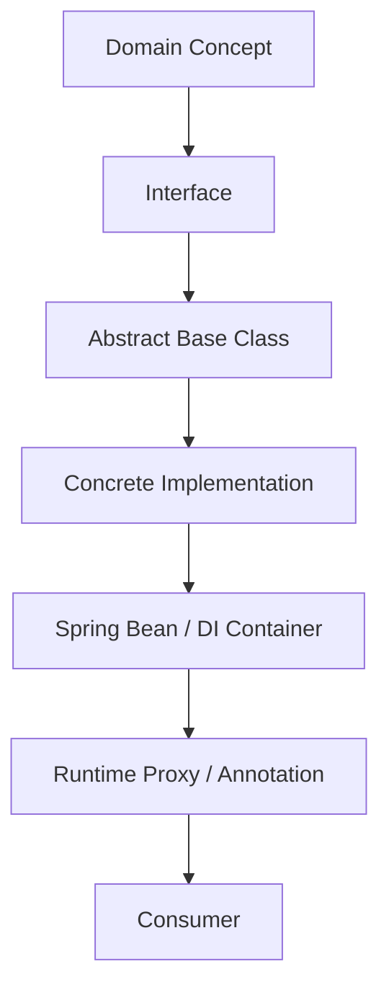
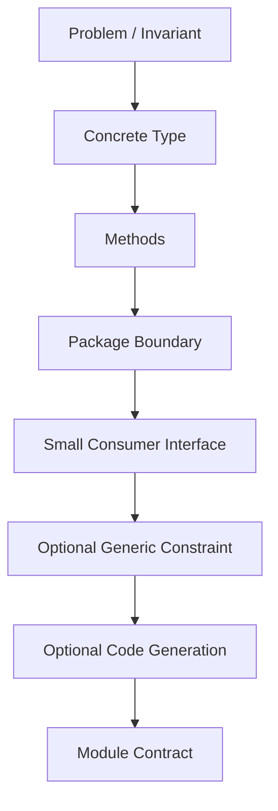
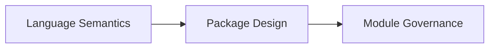
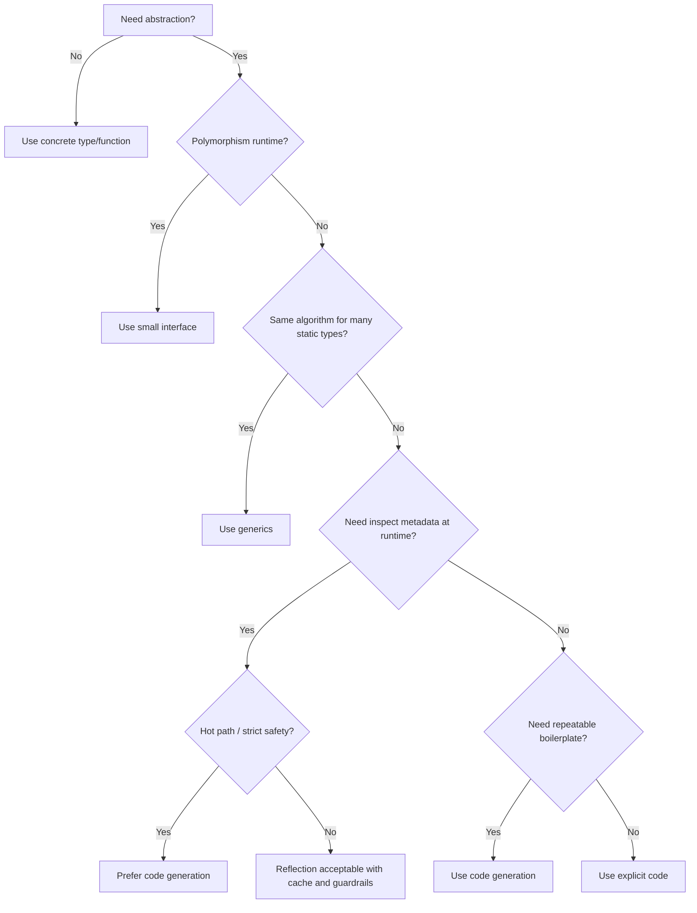
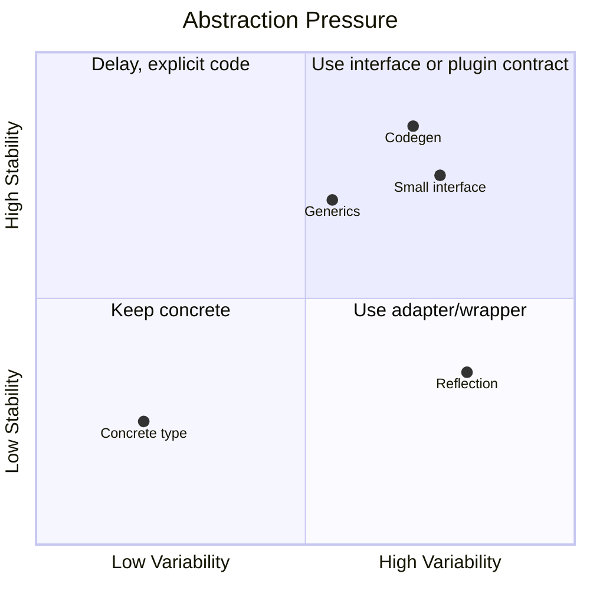

# learn-go-composition-oop-functional-reflection-codegen-modules-part-000.md

# Part 000 — Peta Seri, Mental Model, Scope, dan Cara Belajar Efisien

> Seri: **learn-go-composition-oop-functional-reflection-codegen-modules**  
> Target pembaca: **Java software engineer / tech lead** yang ingin berpindah dari sekadar “bisa menulis Go” menjadi mampu mendesain library, package, module, dan platform-level API Go dengan kualitas production-grade.  
> Baseline versi: **Go 1.26.x**  
> Status seri: **Belum selesai** — ini adalah **Part 000 dari 030**.

---

## 0. Ringkasan Eksekutif

Bagian 000 ini bukan materi syntax. Ini adalah **peta mental dan peta kurikulum** untuk seluruh seri.

Seri ini membahas wilayah yang sering salah dipahami oleh engineer yang datang dari Java:

- apakah Go punya OOP?
- apakah embedding sama dengan inheritance?
- kenapa interface Go terasa “terbalik” dibanding Java?
- kapan harus memakai interface, generic, reflection, atau code generation?
- bagaimana membuat package boundary yang tahan bertahun-tahun?
- bagaimana module governance menjadi bagian dari architecture, bukan hanya dependency management?
- bagaimana menjaga API compatibility ketika package dipakai banyak service?
- bagaimana menghindari over-engineering ala Java di Go tanpa jatuh ke procedural spaghetti?

Mental model utama seri ini:

> **Go bukan bahasa tanpa desain. Go adalah bahasa yang memaksa desain muncul dari boundary, behavior, invariants, dan dependency direction — bukan dari class hierarchy.**

Dalam Java, desain sering muncul dari:

```text
class
abstract class
interface
inheritance tree
annotation
framework container
runtime proxy
reflection-heavy convention
```

Dalam Go, desain lebih sering muncul dari:

```text
package boundary
small interface
concrete type
composition
function
method set
generic constraint
explicit dependency
generated code
module version
build contract
```

Perbedaan ini kelihatan sederhana, tetapi dampaknya besar. Engineer Java senior yang masuk ke Go sering membawa insting yang salah:

| Insting dari Java | Risiko di Go | Koreksi mental |
|---|---|---|
| Mulai desain dari interface besar | Interface menjadi artificial dan sulit berevolusi | Mulai dari concrete type, ekstrak interface di consumer |
| Pakai inheritance untuk reuse | Embedding disalahgunakan sebagai pseudo-inheritance | Gunakan composition eksplisit dan delegation |
| Pakai annotation + reflection untuk extensibility | Runtime magic, panic surface, sulit di-test | Pilih explicit registration, generics, atau codegen |
| Buat package berdasarkan technical layer | Circular dependency dan domain leakage | Package berdasarkan ownership, behavior, dan stability boundary |
| Anggap module hanya dependency file | Supply chain, compatibility, dan reproducibility tidak terkontrol | Module adalah contract release dan governance boundary |
| Generalize terlalu awal | API menjadi rumit sebelum problem stabil | Delay abstraction sampai behavior berulang dan invariant jelas |

Bagian ini memberikan fondasi supaya setiap part setelahnya dibaca dengan benar.

---

## 1. Baseline Fakta Teknis yang Akan Dipakai

Seri ini memakai Go hingga **1.26.x**. Beberapa fakta resmi yang relevan:

1. Go 1.26.0 dirilis sebagai major release pada 2026-02-10.
2. Per 2026-06-22, release history resmi mencatat patch Go 1.26.4 dirilis pada 2026-06-02.
3. Go 1.26 memperluas built-in `new`: argumen `new` sekarang boleh berupa **type** atau **expression**.
4. `go mod init` pada toolchain 1.N.X sekarang default membuat `go.mod` dengan `go 1.(N-1).0`, bukan langsung versi toolchain aktif. Untuk Go 1.26.x, default `go mod init` adalah `go 1.25.0`.
5. `go fix` pada Go 1.26 direwrite menjadi modernizer berbasis analysis framework.
6. `go generate` bukan bagian dari `go build`, tidak punya dependency analysis, dan harus dijalankan eksplisit.
7. Go module memakai mekanisme seperti `go.mod`, `go.sum`, Minimal Version Selection, semantic import versioning, proxy, checksum database, `replace`, `exclude`, `retract`, workspace, vendoring, dan environment untuk private module.
8. Interface modern Go bukan hanya daftar method; untuk constraint generic, interface dapat memiliki type set, union terms, dan `~T`.
9. Method set adalah aturan formal yang menentukan apakah sebuah type memenuhi interface.
10. Reflection adalah runtime mechanism untuk memanipulasi object dengan arbitrary type; banyak operasi reflect dapat panic bila dipakai pada `Kind` yang salah, value yang tidak addressable, atau value yang tidak settable.

Konsekuensi:

> Seri ini tidak boleh hanya bicara “idiom”. Kita harus membedakan antara:
>
> - **aturan formal bahasa**,
> - **konvensi idiomatik**,
> - **trade-off production**,
> - **kebijakan organisasi**,
> - **preferensi style**.

Banyak kesalahan desain Go muncul karena engineer mencampur kelima hal itu.

---

## 2. Kenapa Seri Ini Penting

Setelah menguasai basic Go, data model, error handling, dan concurrency, area berikutnya yang menentukan level engineering adalah **design surface**.

Design surface adalah semua titik tempat code Anda disentuh oleh code lain:

```text
function signature
method receiver
interface
struct field
constructor
package export
module path
generated file
configuration option
build tag
go.mod directive
dependency version
```

Di sistem kecil, design surface bisa diganti kapan saja. Di sistem besar, design surface menjadi kontrak sosial dan teknis.

Begitu sebuah package dipakai oleh 10 service, setiap perubahan kecil bisa menyebabkan:

- compile break,
- hidden behavior change,
- incompatible generated code,
- dependency diamond problem,
- module upgrade conflict,
- semantic import versioning mistake,
- regression di consumer yang tidak Anda ketahui,
- deployment freeze karena dependency tidak reproducible,
- review bottleneck karena boundary tidak jelas.

Karena itu, seri ini membahas Go bukan sebagai bahasa scripting server, tetapi sebagai bahasa untuk membangun:

- internal platform library,
- shared SDK,
- domain package,
- adapter framework,
- generated client,
- validation/mapping infrastructure,
- package yang dipakai lintas service,
- module yang harus bertahan beberapa tahun,
- API yang bisa berkembang tanpa memecahkan consumer.

---

## 3. Prinsip Utama Seri

### 3.1 Concrete first, abstraction later

Di Go, desain yang sehat sering dimulai dari concrete type.

Bukan karena interface buruk, tetapi karena:

- concrete type lebih mudah dipahami,
- concrete type membawa invariant lebih jelas,
- concrete type bisa berkembang tanpa menambah contract palsu,
- premature interface membuat desain terlihat fleksibel tetapi sebenarnya kosong.

Contoh buruk:

```go
type UserService interface {
    CreateUser(ctx context.Context, req CreateUserRequest) (*CreateUserResponse, error)
    UpdateUser(ctx context.Context, req UpdateUserRequest) (*UpdateUserResponse, error)
    DeleteUser(ctx context.Context, id UserID) error
    FindUser(ctx context.Context, id UserID) (*User, error)
    SearchUsers(ctx context.Context, q Query) ([]User, error)
}
```

Interface seperti ini sering dibuat hanya karena kebiasaan Java:

```java
interface UserService { ... }
class DefaultUserService implements UserService { ... }
```

Di Go, interface besar seperti itu biasanya membuat desain menjadi lebih buruk karena:

- consumer jarang membutuhkan semua method,
- mocking menjadi terlalu luas,
- API evolution sulit,
- interface menjadi mirror dari implementation,
- abstraction tidak menambah informasi.

Pendekatan lebih sehat:

```go
type UserCreator interface {
    CreateUser(ctx context.Context, req CreateUserRequest) (UserID, error)
}

type UserFinder interface {
    FindUser(ctx context.Context, id UserID) (User, error)
}
```

Atau bahkan jangan buat interface dulu:

```go
type UserService struct {
    repo UserRepository
    clock Clock
    ids IDGenerator
}

func (s *UserService) CreateUser(ctx context.Context, req CreateUserRequest) (UserID, error) {
    // enforce invariant here
}
```

Interface muncul saat ada consumer yang butuh boundary.

---

### 3.2 Composition is about capability, not taxonomy

Dalam Java, model sering dimulai dari taxonomy:

```text
Animal
 ├── Bird
 │   ├── Eagle
 │   └── Penguin
 └── Mammal
     ├── Dog
     └── Whale
```

Dalam Go, desain lebih sering dimulai dari capability:

```go
type Reader interface {
    Read([]byte) (int, error)
}

type Writer interface {
    Write([]byte) (int, error)
}

type Closer interface {
    Close() error
}
```

Pertanyaannya bukan:

```text
Apa parent class dari object ini?
```

Pertanyaannya:

```text
Behavior apa yang dibutuhkan consumer di boundary ini?
Invariant apa yang harus dijaga type ini?
Dependency apa yang boleh diketahui package ini?
```

Composition di Go bukan sekadar “memasukkan struct ke struct lain”. Composition adalah cara menyusun behavior dan ownership tanpa inheritance tree.

---

### 3.3 Package adalah unit arsitektur, bukan folder

Di Java, package sering dipakai sebagai namespace:

```text
com.company.project.user.controller
com.company.project.user.service
com.company.project.user.repository
com.company.project.user.dto
```

Di Go, package adalah compilation unit, visibility boundary, dependency boundary, documentation unit, dan API surface.

Kesalahan umum:

```text
/internal/user/controller
/internal/user/service
/internal/user/repository
/internal/user/model
/internal/user/dto
```

Struktur seperti itu sering hanya memindahkan Java layer ke Go. Akibatnya:

- package kecil tapi saling bocor,
- domain logic tersebar,
- cyclic dependency mengancam,
- naming menjadi redundant,
- test boundary tidak natural.

Go package sebaiknya menjawab:

```text
Siapa owner konsep ini?
Apa behavior publiknya?
Apa invariant internalnya?
Apa yang boleh diketahui consumer?
Apa yang harus tetap tersembunyi?
```

---

### 3.4 Reflection is a tax

Reflection tidak haram. Banyak package penting menggunakan reflection:

- `encoding/json`,
- `encoding/xml`,
- validator,
- mapper,
- ORM,
- dependency injection tertentu,
- testing/helper tools.

Tetapi reflection membawa pajak:

- runtime failure,
- panic surface,
- hidden allocation,
- metadata lookup cost,
- sulit di-inline,
- sulit dianalisis compiler,
- lemah untuk refactoring,
- membutuhkan caching metadata,
- butuh handling exported/unexported field,
- butuh aturan addressability dan settable yang benar.

Karena itu reflection harus selalu dibandingkan dengan alternatif:

```text
explicit code
interface
generic
functional option
registry
code generation
unsafe
```

Keputusan memakai reflection harus punya alasan, bukan karena “mirip annotation Java”.

---

### 3.5 Code generation is explicit automation, not magic

Di Java, code generation sering tersembunyi di:

- annotation processor,
- Lombok,
- MapStruct,
- JPA metamodel,
- OpenAPI generator,
- protobuf plugin,
- build lifecycle Maven/Gradle.

Di Go, generation cenderung lebih eksplisit:

```go
//go:generate stringer -type=Status
```

Lalu dijalankan:

```bash
go generate ./...
```

Tetapi `go generate` tidak otomatis jalan saat `go build`.

Konsekuensi production:

- generated file harus masuk version control atau pipeline harus sangat disiplin,
- generator version harus dipin,
- generated code harus reproducible,
- CI harus memastikan tidak ada generated drift,
- developer onboarding harus jelas,
- generated API harus dianggap public surface bila diekspor.

---

### 3.6 Module is release contract

`go.mod` bukan hanya file dependency.

Ia menentukan:

- module path,
- minimum Go version,
- dependency graph,
- dependency versions,
- replacement policy,
- toolchain behavior,
- workspace interaction,
- private module behavior,
- reproducible builds,
- public compatibility promise.

Salah desain module bisa lebih mahal dari salah desain function.

Contoh masalah nyata:

```text
module path berubah
v2 tanpa /v2
replace bocor ke production
private module lookup bocor ke public proxy
go directive terlalu tinggi
generated tool tidak dipin
multi-module repo saling tidak sinkron
```

Seri ini akan membahas module sebagai bagian dari governance.

---

## 4. Peta Besar Seri

```mermaid
flowchart TD
    A[Part 000<br/>Series Map] --> B[Object Model]
    B --> C[Defined Type, Alias, Receiver]
    C --> D[Method Set]
    D --> E[Embedding & Composition]
    E --> F[Interface Design]
    F --> G[Structural Typing]
    G --> H[Generics Constraint]

    H --> I[OOP in Go]
    I --> J[Java-to-Go Migration Patterns]

    J --> K[Functional Style]
    K --> L[Functional Options]
    L --> M[Higher-order API]
    M --> N[Iterator & Lazy API]

    N --> O[Reflection Mental Model]
    O --> P[Struct Metadata & Tags]
    P --> Q[Reflection Performance & Safety]
    Q --> R[Reflection vs Generics vs Codegen]

    R --> S[go generate]
    S --> T[AST Generation]
    T --> U[Type-aware Generation]
    U --> V[Annotation-like Design]
    V --> W[Production Codegen]

    W --> X[Package Design]
    X --> Y[Module Fundamentals]
    Y --> Z[Module Governance]
    Z --> AA[Private Modules & Supply Chain]
    AA --> AB[Large-scale Repo Architecture]
    AB --> AC[API Compatibility]
    AC --> AD[Capstone]
```



Pola seri sengaja dibuat dari **semantics → design → automation → governance**.

Urutannya penting:

1. Anda tidak bisa mendesain interface dengan benar tanpa memahami method set.
2. Anda tidak bisa memakai embedding dengan aman tanpa memahami promoted method.
3. Anda tidak bisa memakai generic constraint dengan benar tanpa memahami interface type set.
4. Anda tidak bisa memutuskan reflection vs codegen tanpa memahami runtime dan build contract.
5. Anda tidak bisa mendesain package besar tanpa memahami export surface.
6. Anda tidak bisa merilis module aman tanpa memahami compatibility dan MVS.

---

## 5. Daftar Isi Final Seri

| Part | Filename | Topik |
|---:|---|---|
| 000 | `learn-go-composition-oop-functional-reflection-codegen-modules-part-000.md` | Peta seri, mental model, scope, dan cara belajar efisien |
| 001 | `learn-go-composition-oop-functional-reflection-codegen-modules-part-001.md` | Go vs Java object model: dari class hierarchy ke behavior composition |
| 002 | `learn-go-composition-oop-functional-reflection-codegen-modules-part-002.md` | Defined type, alias, receiver, method, dan konsekuensi API |
| 003 | `learn-go-composition-oop-functional-reflection-codegen-modules-part-003.md` | Method set formal: value receiver, pointer receiver, addressability, interface satisfaction |
| 004 | `learn-go-composition-oop-functional-reflection-codegen-modules-part-004.md` | Struct embedding: promoted fields/methods, shadowing, ambiguity, safe composition |
| 005 | `learn-go-composition-oop-functional-reflection-codegen-modules-part-005.md` | Composition patterns: delegation, wrapper, adapter, decorator, facade, capability object |
| 006 | `learn-go-composition-oop-functional-reflection-codegen-modules-part-006.md` | Interface sebagai behavioral contract: small interface, consumer-side interface, nil traps |
| 007 | `learn-go-composition-oop-functional-reflection-codegen-modules-part-007.md` | Structural typing deep dive: implicit implementation, compile-time guarantees, API evolution |
| 008 | `learn-go-composition-oop-functional-reflection-codegen-modules-part-008.md` | Interface type sets & generics constraints: `~T`, union terms, comparable, constraint design |
| 009 | `learn-go-composition-oop-functional-reflection-codegen-modules-part-009.md` | OOP tanpa class: polymorphism, encapsulation, lifecycle, invariant, domain modeling |
| 010 | `learn-go-composition-oop-functional-reflection-codegen-modules-part-010.md` | Anti-inheritance migration: Java abstract class/template method ke Go composition |
| 011 | `learn-go-composition-oop-functional-reflection-codegen-modules-part-011.md` | Functional style: first-class function, closure, option, strategy, pipeline |
| 012 | `learn-go-composition-oop-functional-reflection-codegen-modules-part-012.md` | Functional options pattern: configuration API, validation, defaulting, immutability boundary |
| 013 | `learn-go-composition-oop-functional-reflection-codegen-modules-part-013.md` | Higher-order API: middleware, interceptor, handler chain, mapper/reducer tanpa over-abstraction |
| 014 | `learn-go-composition-oop-functional-reflection-codegen-modules-part-014.md` | Iterator-style design, lazy sequence, dan API ergonomics modern Go |
| 015 | `learn-go-composition-oop-functional-reflection-codegen-modules-part-015.md` | Reflection mental model: type vs value, kind vs type, settable/addressable, zero value, panic surface |
| 016 | `learn-go-composition-oop-functional-reflection-codegen-modules-part-016.md` | Reflection untuk struct metadata: tags, visible fields, embedded fields, validation, mapping |
| 017 | `learn-go-composition-oop-functional-reflection-codegen-modules-part-017.md` | Reflection performance & safety: allocation, caching metadata, unsafe boundary, concurrency safety |
| 018 | `learn-go-composition-oop-functional-reflection-codegen-modules-part-018.md` | Reflection vs generics vs code generation: decision framework dan trade-off matrix |
| 019 | `learn-go-composition-oop-functional-reflection-codegen-modules-part-019.md` | Code generation fundamentals: `go generate`, generated contract, reproducibility, CI policy |
| 020 | `learn-go-composition-oop-functional-reflection-codegen-modules-part-020.md` | AST-based generation: `go/parser`, `go/ast`, `go/token`, formatting, comments, directives |
| 021 | `learn-go-composition-oop-functional-reflection-codegen-modules-part-021.md` | Type-aware generation: `go/types`, package loading, import resolution, generic type inspection |
| 022 | `learn-go-composition-oop-functional-reflection-codegen-modules-part-022.md` | Annotation-like design: tags, marker interfaces, directives, registries, build tags |
| 023 | `learn-go-composition-oop-functional-reflection-codegen-modules-part-023.md` | Generating production APIs: DTO, mapper, validator, enum stringer, error codes, mocks, clients |
| 024 | `learn-go-composition-oop-functional-reflection-codegen-modules-part-024.md` | Package design: naming, export surface, internal package, dependency direction, cohesion |
| 025 | `learn-go-composition-oop-functional-reflection-codegen-modules-part-025.md` | Module fundamentals: `go.mod`, `go.sum`, MVS, semantic import versioning, replace/exclude/retract |
| 026 | `learn-go-composition-oop-functional-reflection-codegen-modules-part-026.md` | Modern module governance: toolchain directive, `go` directive, `godebug`, workspace, vendoring |
| 027 | `learn-go-composition-oop-functional-reflection-codegen-modules-part-027.md` | Private modules & enterprise supply chain: GOPRIVATE, proxy, sumdb, credentials, internal registry |
| 028 | `learn-go-composition-oop-functional-reflection-codegen-modules-part-028.md` | Large-scale repo architecture: mono-repo vs multi-module, `/cmd`, `/internal`, `/pkg`, layering |
| 029 | `learn-go-composition-oop-functional-reflection-codegen-modules-part-029.md` | API compatibility engineering: Go 1 promise, breaking changes, versioning, deprecation, migration |
| 030 | `learn-go-composition-oop-functional-reflection-codegen-modules-part-030.md` | Capstone handbook: designing a production-grade Go platform library end-to-end |

---

## 6. Apa yang Tidak Akan Diulang

Seri ini sengaja menghindari pengulangan dari seri yang sudah selesai.

### 6.1 Tidak mengulang `learn-go`

Tidak akan membahas ulang:

- `if`, `for`, `switch`,
- basic function,
- syntax struct dasar,
- syntax interface dasar,
- basic package import,
- basic testing,
- basic command `go run`, `go test`, `go build`.

Akan dibahas hanya ketika syntax dasar itu punya implikasi desain.

Contoh:

```go
func (s Service) Do()
func (s *Service) Do()
```

Bukan dibahas sebagai syntax receiver, tetapi sebagai:

- method set,
- copy semantics,
- mutation boundary,
- interface satisfaction,
- nil receiver possibility,
- allocation/escape implication,
- API compatibility.

---

### 6.2 Tidak mengulang `learn-go-data-model`

Tidak akan membahas ulang:

- primitive type,
- struct literal dasar,
- slice/map dasar,
- pointer dasar,
- zero value dasar.

Tetapi akan dibahas ulang secara selektif bila berhubungan dengan:

- defined type vs alias,
- underlying type,
- receiver eligibility,
- generic constraint,
- reflect type identity,
- struct tag identity,
- exported/unexported fields.

---

### 6.3 Tidak mengulang `learn-go-reliability-error-handling`

Tidak akan membahas ulang:

- `error` dasar,
- wrapping dasar,
- sentinel error,
- retry,
- context cancellation dasar.

Tetapi akan disinggung bila berkaitan dengan desain API:

- apakah constructor return error?
- apakah generated validator return structured error?
- apakah package expose sentinel error atau typed error?
- bagaimana menjaga compatibility error contract?
- apakah reflection panic harus dikonversi menjadi error?

---

### 6.4 Tidak mengulang `learn-go-concurrency-parallelism`

Tidak akan membahas ulang:

- goroutine dasar,
- channel dasar,
- worker pool,
- mutex,
- race dasar.

Tetapi akan disinggung bila berkaitan dengan:

- reflection metadata cache concurrency,
- generated registry concurrency,
- package init ordering,
- API safety pada shared object,
- functional option yang memodifikasi config sebelum object dipakai concurrent,
- module-level singleton anti-pattern.

---

## 7. Mental Model Besar: Dari Java Class Thinking ke Go Boundary Thinking

### 7.1 Java class thinking

Di Java, desain sering dimulai dari pertanyaan:

```text
Apa class-nya?
Apa interface-nya?
Apa parent class-nya?
Apa annotation-nya?
Apa framework lifecycle-nya?
Apa dependency injection binding-nya?
```

Ini natural karena Java punya:

- nominal typing,
- class sebagai unit utama,
- interface eksplisit,
- inheritance,
- annotation ecosystem,
- reflection-heavy framework,
- package sebagai namespace,
- build system besar.

Diagram mental Java:



Model ini tidak salah di Java. Tetapi bila dibawa mentah-mentah ke Go, hasilnya sering buruk:

```go
type IService interface { ... }
type ServiceImpl struct { ... }
type AbstractHandler struct { ... } // impossible in Go
type BaseRepository struct { ... }
```

Go tidak memberi class inheritance, annotation, atau framework container sebagai jalan utama. Jika tetap memaksa pola itu, code akan terasa “Go syntax, Java soul”.

---

### 7.2 Go boundary thinking

Di Go, desain lebih sehat dimulai dari pertanyaan:

```text
Package ini owner apa?
Apa invariant yang harus dijaga?
Apa behavior minimum yang dibutuhkan consumer?
Apakah abstraction ini stabil?
Apakah dependency direction benar?
Apakah compile-time cukup?
Apakah runtime flexibility benar-benar dibutuhkan?
Apakah generated code lebih cocok?
Apakah API ini bisa dipertahankan 3 tahun?
```

Diagram mental Go:



Go design bukan anti-abstraction. Go justru sangat kuat untuk abstraction, tetapi abstraction-nya harus lahir dari behavior nyata.

---

## 8. Tiga Layer Desain Go

Setiap keputusan dalam seri ini akan diklasifikasikan ke tiga layer.



### 8.1 Language semantics

Ini aturan formal bahasa:

- defined type,
- alias,
- underlying type,
- method declaration,
- method set,
- interface implementation,
- selector resolution,
- embedding promotion,
- assignability,
- type identity,
- generic constraint,
- reflection behavior.

Di layer ini, tidak ada “menurut saya”. Yang berlaku adalah spec.

Contoh:

```go
type T struct{}

func (T) V()  {}
func (*T) P() {}
```

Aturan method set:

- method set `T` berisi `V`,
- method set `*T` berisi `V` dan `P`.

Konsekuensi:

```go
type NeedsP interface {
    P()
}

var _ NeedsP = T{}  // compile error
var _ NeedsP = &T{} // ok
```

Ini bukan style. Ini semantics.

---

### 8.2 Package design

Ini keputusan engineering:

- nama package,
- export vs unexport,
- constructor,
- interface location,
- package ownership,
- internal package,
- dependency direction,
- avoiding cycles,
- test package strategy,
- documentation,
- deprecation.

Contoh pertanyaan:

```text
Haruskah package user expose UserRepository interface?
Haruskah domain package import database package?
Haruskah package validation memakai reflection atau generated code?
Haruskah config struct diekspor?
Haruskah field struct diekspor?
```

Jawaban bergantung pada context, tetapi harus dianalisis dengan prinsip.

---

### 8.3 Module governance

Ini layer release dan supply chain:

- module path,
- semantic import versioning,
- `go` directive,
- `toolchain` directive,
- `godebug`,
- `replace`,
- `retract`,
- vendoring,
- workspace,
- private proxy,
- checksum database,
- generator pinning,
- CI reproducibility.

Ini bukan hanya urusan DevOps. Ini mempengaruhi architecture.

Contoh:

```text
Apakah internal SDK perlu module sendiri?
Apakah mono-repo perlu satu go.mod atau banyak?
Apakah v2 package perlu /v2 import path?
Apakah replace boleh committed?
Bagaimana pin generator version?
Bagaimana mencegah GOPROXY public lookup untuk private module?
```

---

## 9. Decision Framework Utama: Interface vs Generics vs Reflection vs Codegen

Salah satu tujuan terbesar seri ini adalah membuat Anda tidak bingung memilih alat.

### 9.1 Ringkasan cepat

| Kebutuhan | Bias awal | Kenapa |
|---|---|---|
| Runtime polymorphism kecil | Interface | Natural, sederhana, idiomatic |
| Compile-time type-safe algorithm | Generics | Menghindari `any` dan reflection |
| Metadata-driven behavior | Reflection atau codegen | Tergantung frekuensi, performance, safety |
| High-volume mapping/validation | Codegen | Lebih cepat, type-safe, predictable |
| Plugin-like runtime dynamic | Interface + registry | Lebih explicit dari reflection magic |
| Framework-like extensibility | Interface + option + registry + codegen | Kombinasi, jangan satu alat untuk semua |
| Cross-package stable contract | Small interface atau concrete exported type | Surface kecil lebih mudah dijaga |
| Enterprise reproducibility | Codegen pinned + CI drift check | Hindari “works on my machine” |

---

### 9.2 Decision tree



---

### 9.3 Hard rule

> Jangan memilih abstraction karena ingin terlihat advanced. Pilih abstraction karena ada force yang nyata: duplication, boundary, variability, compatibility, performance, atau governance.

Contoh force nyata:

```text
Ada 20 DTO mapping dengan pola sama.
Ada 8 storage backend dengan contract sama.
Ada consumer berbeda yang hanya butuh 1 method.
Ada generated client yang harus sync dengan schema.
Ada validation metadata yang disimpan dalam struct tags.
Ada package yang harus dipakai lintas 30 service.
Ada module public yang butuh compatibility promise.
```

Contoh force palsu:

```text
Biasanya di Java ada interface.
Biar nanti fleksibel.
Biar kelihatan clean architecture.
Biar gampang mock.
Biar generic.
Biar framework-like.
```

Force palsu sering menciptakan complexity tanpa benefit.

---

## 10. Composition: Definisi yang Akan Kita Pakai

Composition dalam seri ini berarti:

> Menyusun behavior, state, dependency, dan lifecycle dari unit-unit kecil tanpa inheritance, dengan boundary yang eksplisit dan invariant yang terjaga.

Composition punya beberapa bentuk:

### 10.1 Field composition

```go
type Service struct {
    repo  Repository
    clock Clock
    log   Logger
}
```

Ini bentuk paling umum: object memiliki dependency.

---

### 10.2 Embedded composition

```go
type AuditedStore struct {
    Store
    audit AuditSink
}
```

Ini membuat method `Store` dipromosikan. Power-nya besar, tetapi harus hati-hati karena export surface ikut melebar.

---

### 10.3 Function composition

```go
type Handler func(ctx context.Context, req Request) (Response, error)

func WithLogging(next Handler, log Logger) Handler {
    return func(ctx context.Context, req Request) (Response, error) {
        log.Info("request")
        return next(ctx, req)
    }
}
```

Ini natural untuk middleware, interceptor, policy chain.

---

### 10.4 Interface composition

```go
type ReadCloser interface {
    Reader
    Closer
}
```

Ini menyusun contract behavior.

---

### 10.5 Package composition

```text
identity
 ├── token
 ├── password
 ├── session
 └── policy
```

Package composition bukan sekadar folder. Ia mengatur dependency dan ownership.

---

### 10.6 Module composition

```text
company.dev/platform/auth
company.dev/platform/validation
company.dev/platform/httpclient
company.dev/product/case-management
```

Module composition mengatur release cadence dan dependency surface.

---

## 11. OOP di Go: Posisi Seri Ini

Go tidak punya class, inheritance, constructor keyword, annotation, method overloading, atau exception.

Tetapi Go punya unsur yang cukup untuk OOP dalam arti yang lebih fundamental:

| Konsep OOP | Bentuk di Go |
|---|---|
| Encapsulation | package-level export/unexport |
| Object state | struct |
| Behavior | method |
| Polymorphism | interface |
| Composition | struct fields, embedding, delegation |
| Constructor | ordinary function, usually `NewX` |
| Invariant | unexported fields + constructor + method |
| Dependency injection | explicit constructor parameter |
| Lifecycle | `Close`, context, explicit start/stop |
| Substitutability | interface satisfaction |
| Reuse | composition, not inheritance |

Jadi pertanyaannya bukan “apakah Go mendukung OOP?”

Pertanyaan yang lebih tepat:

```text
Model OOP seperti apa yang Go dukung, dan model OOP seperti apa yang sengaja tidak didukung?
```

Seri ini akan memperlakukan OOP sebagai:

> Desain object berbasis invariant dan behavior, bukan class hierarchy.

---

## 12. Java-to-Go Translation Map

### 12.1 Class

Java:

```java
public class UserService {
    private final UserRepository repo;

    public UserService(UserRepository repo) {
        this.repo = repo;
    }

    public UserId create(CreateUserRequest request) {
        ...
    }
}
```

Go:

```go
type UserService struct {
    repo UserRepository
}

func NewUserService(repo UserRepository) *UserService {
    return &UserService{repo: repo}
}

func (s *UserService) Create(ctx context.Context, req CreateUserRequest) (UserID, error) {
    ...
}
```

Perhatikan:

- constructor hanya function biasa,
- invariant dijaga lewat unexported field,
- dependency eksplisit,
- tidak ada framework container wajib.

---

### 12.2 Interface

Java:

```java
public interface UserRepository {
    Optional<User> findById(UserId id);
}
```

Go:

```go
type UserFinder interface {
    FindByID(ctx context.Context, id UserID) (User, bool, error)
}
```

Di Go, interface biasanya dibuat dekat consumer:

```go
type Service struct {
    users UserFinder
}
```

Bukan otomatis di package provider.

---

### 12.3 Abstract class

Java:

```java
abstract class BaseProcessor {
    public final Result process(Input input) {
        validate(input);
        return doProcess(input);
    }

    protected abstract Result doProcess(Input input);
}
```

Go alternative:

```go
type ProcessorFunc func(context.Context, Input) (Result, error)

type Processor struct {
    validate func(Input) error
    process  ProcessorFunc
}

func (p Processor) Process(ctx context.Context, in Input) (Result, error) {
    if err := p.validate(in); err != nil {
        return Result{}, err
    }
    return p.process(ctx, in)
}
```

Atau:

```go
type Step interface {
    Process(context.Context, Input) (Result, error)
}

type ValidatingStep struct {
    next Step
}

func (s ValidatingStep) Process(ctx context.Context, in Input) (Result, error) {
    if err := validate(in); err != nil {
        return Result{}, err
    }
    return s.next.Process(ctx, in)
}
```

Template method di Go biasanya diterjemahkan menjadi:

- function field,
- interface dependency,
- wrapper/decorator,
- pipeline,
- explicit orchestration.

---

### 12.4 Annotation

Java:

```java
@NotNull
@Size(max = 100)
private String name;
```

Go:

```go
type CreateUserRequest struct {
    Name string `validate:"required,max=100"`
}
```

Tetapi struct tags di Go bukan annotation engine. Tag hanya metadata string. Behavior harus dibuat oleh:

- reflection reader,
- generated validator,
- explicit validation method,
- external tool.

Seri ini akan membedakan:

```text
metadata declaration
metadata interpretation
runtime execution
generated execution
error reporting
compatibility contract
```

---

### 12.5 Generic

Java:

```java
interface Repository<T, ID> {
    Optional<T> findById(ID id);
}
```

Go:

```go
type Repository[T any, ID comparable] interface {
    FindByID(context.Context, ID) (T, bool, error)
}
```

Tetapi generic repository sering menjadi smell di Go bila domain behavior berbeda. Seri ini akan membahas kapan generic membantu dan kapan malah menyembunyikan domain invariant.

---

## 13. Struktur Tiap Part

Setiap part setelah ini akan memakai struktur berikut:

```text
1. Problem framing
2. Mental model
3. Formal semantics
4. Java-to-Go comparison
5. Production design consequences
6. Patterns
7. Anti-patterns
8. Example kecil
9. Example realistis
10. Failure modes
11. Review checklist
12. Decision matrix
13. Exercises
14. Summary
```

Tujuannya agar materi tidak menjadi kumpulan tips, tetapi membangun kemampuan desain.

---

## 14. Cara Membaca Seri Ini

### 14.1 Jangan membaca seperti tutorial syntax

Jika hanya mencari “cara pakai interface”, materi ini akan terasa terlalu panjang.

Baca dengan pertanyaan:

```text
Bagaimana keputusan ini mempengaruhi sistem 2 tahun ke depan?
Apa invariant yang dilindungi?
Apa failure mode bila dipakai oleh 30 service?
Apa yang akan sulit di-refactor?
Apa yang compile-time dan apa yang runtime?
Apa yang explicit dan apa yang magic?
```

---

### 14.2 Selalu bedakan provider dan consumer

Banyak keputusan Go tergantung posisi Anda:

```text
Apakah package ini provider behavior?
Apakah package ini consumer behavior?
Apakah interface dibuat untuk menerima dependency?
Apakah interface dibuat untuk diekspor sebagai plugin contract?
```

Contoh:

```go
// Di package service
type UserFinder interface {
    FindByID(ctx context.Context, id UserID) (User, bool, error)
}

type Service struct {
    users UserFinder
}
```

Interface ini milik consumer (`service`) karena service yang menentukan kebutuhan minimumnya.

Tetapi untuk plugin contract:

```go
// Di package storage
type Driver interface {
    Open(ctx context.Context, cfg Config) (Store, error)
}
```

Interface ini boleh milik provider/platform karena memang contract ekstensi.

---

### 14.3 Jangan anti-interface, jangan interface-first

Sikap matang bukan:

```text
Go harus pakai interface kecil.
```

Sikap matang adalah:

```text
Interface dibuat ketika ada boundary behavior yang nyata, ukuran contract minimum, dan arah dependency benar.
```

---

### 14.4 Jangan anti-reflection, jangan reflection-first

Sikap matang bukan:

```text
Reflection selalu buruk.
```

Sikap matang adalah:

```text
Reflection boleh dipakai bila metadata runtime adalah requirement nyata, panic surface dikontrol, metadata dicache, dan performance profile diterima.
```

---

### 14.5 Jangan anti-codegen, jangan codegen-first

Sikap matang bukan:

```text
Generated code pasti lebih cepat.
```

Sikap matang adalah:

```text
Codegen cocok bila boilerplate stabil, contract jelas, generator reproducible, CI menjaga drift, dan generated code bisa direview/debug.
```

---

## 15. Golden Rules Seri Ini

### Rule 1 — Exported API is debt

Setiap exported identifier adalah janji.

```go
type Config struct {
    Timeout time.Duration
}
```

Begitu diekspor dan dipakai consumer, menghapus atau mengubah semantics-nya bukan sekadar refactor.

Pertanyaan review:

```text
Apakah ini perlu diekspor?
Apakah nama ini akan tetap benar 2 tahun lagi?
Apakah zero value aman?
Apakah field boleh diubah langsung?
Apakah constructor perlu menjaga invariant?
```

---

### Rule 2 — Small interface beats generic service interface

Interface ideal sering hanya 1–3 method.

```go
type Clock interface {
    Now() time.Time
}
```

Ini bagus karena:

- consumer jelas,
- mock mudah,
- behavior kecil,
- compatibility tinggi,
- implementation bebas.

Bandingkan:

```go
type PlatformService interface {
    Start(context.Context) error
    Stop(context.Context) error
    Health(context.Context) Health
    Metrics(context.Context) Metrics
    Configure(Config) error
    Reload(context.Context) error
}
```

Interface besar sering tanda boundary belum matang.

---

### Rule 3 — Embedding expands your surface

Embedding terlihat praktis:

```go
type MyBuffer struct {
    bytes.Buffer
}
```

Tetapi semua promoted method ikut menjadi bagian dari method set.

Ini bisa menjadi masalah:

- API surface membesar tanpa disadari,
- consumer bergantung pada method yang tidak Anda maksud expose,
- future change sulit,
- conflict/ambiguity bisa muncul,
- behavior wrapper bisa bocor.

Jika tujuan Anda hanya reuse internal, field named sering lebih aman:

```go
type MyBuffer struct {
    buf bytes.Buffer
}
```

---

### Rule 4 — Reflection must have a boundary

Reflection sebaiknya dikurung:

```go
package mapper

func Compile[T any]() (Mapper[T], error) {
    // reflection here
}
```

Jangan sebar reflection ke seluruh codebase:

```go
func handleAnything(x any) {
    v := reflect.ValueOf(x)
    ...
}
```

Boundary reflection yang baik:

- compile metadata sekali,
- cache metadata,
- expose typed API,
- return error bukan panic,
- punya test untuk malformed input,
- punya benchmark,
- dokumentasikan tag contract.

---

### Rule 5 — Generated code is source code

Generated code bukan “file sampah”.

Generated code harus:

- format stabil,
- header jelas,
- deterministic,
- bisa di-debug,
- bisa di-review bila public,
- dicek drift di CI,
- punya generator version yang dipin,
- tidak bergantung pada environment random.

Header umum:

```go
// Code generated by internal/cmd/genmapper. DO NOT EDIT.
```

---

### Rule 6 — Package cycle is design feedback

Go melarang import cycle. Ini bukan kekurangan. Ini feedback desain.

Jika Anda mendapatkan cycle:

```text
domain -> repository -> domain
service -> handler -> service
config -> app -> config
```

Biasanya ada masalah:

- ownership salah,
- interface di package yang salah,
- shared type harus dipindah,
- dependency direction terbalik,
- package terlalu granular,
- abstraction dibuat sebelum waktunya.

Jangan buru-buru membuat `common` package. `common` sering menjadi tempat sampah architecture.

---

### Rule 7 — Module path is identity

Module path adalah identitas publik.

```text
github.com/company/platform/auth
```

Mengubah module path berarti semua import path berubah.

Untuk v2+ public module, semantic import versioning membutuhkan suffix:

```text
github.com/company/platform/auth/v2
```

Ini harus direncanakan sejak awal untuk module yang akan dirilis luas.

---

## 16. Contoh Kasus Besar yang Akan Dipakai Berulang

Agar materi konsisten, seri ini akan memakai beberapa contoh domain.

### 16.1 Validation library

Tujuan:

```go
type CreateUserRequest struct {
    Email string `validate:"required,email"`
    Age   int    `validate:"min=18"`
}
```

Kita akan membahas beberapa implementasi:

1. explicit validation method,
2. reflection-based validation,
3. generic helper,
4. code-generated validator,
5. hybrid metadata compiler,
6. package/module design,
7. compatibility policy.

Pertanyaan desain:

```text
Apakah tag adalah public contract?
Bagaimana error path direpresentasikan?
Bagaimana handle nested struct?
Bagaimana handle slice/map?
Bagaimana cache metadata?
Bagaimana avoid panic?
Bagaimana benchmark?
Bagaimana generator dipin?
```

---

### 16.2 Mapper library

Tujuan:

```go
func MapUserToDTO(u User) UserDTO
```

Kita akan membandingkan:

- manual mapper,
- reflection mapper,
- generic mapper,
- generated mapper,
- interface-based custom conversion.

Pertanyaan desain:

```text
Apakah field by name cukup?
Bagaimana mapping beda nama?
Bagaimana nullable/optional?
Bagaimana error reporting?
Bagaimana handle versioned DTO?
Bagaimana migrate breaking field?
```

---

### 16.3 Storage abstraction

Tujuan:

```go
type Store interface {
    Put(ctx context.Context, key string, value []byte) error
    Get(ctx context.Context, key string) ([]byte, bool, error)
}
```

Kita akan membahas:

- interface size,
- lifecycle,
- capability interface,
- decorator,
- instrumentation wrapper,
- retry wrapper,
- package ownership,
- generated mock,
- module versioning.

---

### 16.4 Platform SDK

Tujuan:

```text
company.dev/platform/httpclient
company.dev/platform/auth
company.dev/platform/validation
company.dev/platform/config
```

Kita akan membahas:

- mono-repo vs multi-module,
- internal package,
- public package,
- semantic import versioning,
- dependency policy,
- private module proxy,
- reproducible generation,
- API review checklist.

---

## 17. Maturity Model

Seri ini menargetkan level 4–5.

| Level | Karakteristik |
|---:|---|
| 1 | Bisa menulis Go syntax, function, struct, interface dasar |
| 2 | Bisa membuat service sederhana dengan package dan error handling cukup |
| 3 | Bisa membuat code idiomatic, testable, dan cukup maintainable |
| 4 | Bisa mendesain package boundary, interface kecil, composition, module contract |
| 5 | Bisa membuat internal platform/library yang stabil, extensible, generated, governed |
| 6 | Bisa menetapkan engineering standard lintas tim dan menjaga compatibility bertahun-tahun |

Part 000 ini memulai transisi dari level 3 ke level 5.

---

## 18. Design Review Checklist Awal

Checklist ini akan muncul berkali-kali dalam seri.

### 18.1 Untuk type

```text
[ ] Apakah type ini perlu diekspor?
[ ] Apakah zero value usable atau harus constructor?
[ ] Apakah field harus exported?
[ ] Apakah invariant bisa dilanggar dari luar?
[ ] Apakah receiver harus value atau pointer?
[ ] Apakah method set yang dihasilkan sesuai interface target?
[ ] Apakah type ini aman dicopy?
[ ] Apakah type ini punya lifecycle?
[ ] Apakah nil receiver perlu didukung?
```

---

### 18.2 Untuk interface

```text
[ ] Siapa consumer interface ini?
[ ] Apakah interface ini dibuat di package yang benar?
[ ] Apakah method terlalu banyak?
[ ] Apakah interface mirror dari concrete type?
[ ] Apakah return type terlalu concrete?
[ ] Apakah error contract jelas?
[ ] Apakah interface akan stabil?
[ ] Apakah compile-time assertion diperlukan?
```

Contoh compile-time assertion:

```go
var _ io.Reader = (*MyReader)(nil)
```

---

### 18.3 Untuk embedding

```text
[ ] Apakah promoted method memang ingin diekspor?
[ ] Apakah ada kemungkinan name conflict?
[ ] Apakah embedding membuat behavior bocor?
[ ] Apakah named field lebih aman?
[ ] Apakah embedded pointer bisa nil?
[ ] Apakah method set berubah bila T diganti menjadi *T?
```

---

### 18.4 Untuk reflection

```text
[ ] Apakah reflection benar-benar diperlukan?
[ ] Apakah generic/codegen lebih cocok?
[ ] Apakah semua Kind dicek sebelum operasi?
[ ] Apakah panic dikontrol?
[ ] Apakah value addressable/settable saat perlu mutation?
[ ] Apakah metadata dicache?
[ ] Apakah cache concurrent-safe?
[ ] Apakah benchmark tersedia?
[ ] Apakah unexported field ditangani dengan benar?
```

---

### 18.5 Untuk code generation

```text
[ ] Apakah generated code deterministic?
[ ] Apakah generator version dipin?
[ ] Apakah generated drift dicek di CI?
[ ] Apakah generated file masuk VCS?
[ ] Apakah header generated jelas?
[ ] Apakah generator membaca AST atau regex?
[ ] Apakah generator type-aware bila perlu?
[ ] Apakah generated API compatibility dijaga?
```

---

### 18.6 Untuk package

```text
[ ] Apakah package punya satu alasan jelas untuk berubah?
[ ] Apakah nama package pendek dan jelas?
[ ] Apakah export surface minimal?
[ ] Apakah dependency direction benar?
[ ] Apakah ada risiko import cycle?
[ ] Apakah package terlalu granular?
[ ] Apakah ada common/util dumping ground?
[ ] Apakah doc package menjelaskan contract?
```

---

### 18.7 Untuk module

```text
[ ] Apakah module path stabil?
[ ] Apakah go directive sesuai policy?
[ ] Apakah dependency minimal?
[ ] Apakah replace tidak bocor?
[ ] Apakah private module tidak bocor ke public proxy?
[ ] Apakah generator/tool dependency dipin?
[ ] Apakah v2+ memakai semantic import path?
[ ] Apakah release note dan deprecation policy jelas?
```

---

## 19. Anti-Pattern Besar yang Akan Kita Hindari

### 19.1 Java-shaped Go

Gejala:

```go
type IUserService interface {}
type UserServiceImpl struct {}
type BaseRepository struct {}
type AbstractProcessor struct {}
```

Masalah:

- abstraction tidak lahir dari kebutuhan,
- naming noisy,
- interface provider-side terlalu besar,
- composition tidak natural,
- package boundary mengikuti layer Java.

---

### 19.2 Everything is interface

Gejala:

```go
type Config interface { ... }
type Logger interface { ... }
type User interface { ... }
type Request interface { ... }
```

Masalah:

- data menjadi opaque tanpa manfaat,
- type assertion meningkat,
- test sulit karena contract terlalu abstrak,
- compile-time clarity hilang.

---

### 19.3 Everything is generic

Gejala:

```go
type Service[T any, ID comparable, R Repository[T, ID]] struct { ... }
```

Masalah:

- domain invariant hilang,
- error contract generik tapi tidak meaningful,
- debugging type instantiation sulit,
- public API terlalu rumit,
- generic dipakai untuk menghindari desain domain.

---

### 19.4 Everything is reflection

Gejala:

```go
func Do(x any) any
func Map(src any, dst any) error
func Validate(x any) error
```

Masalah:

- runtime failure,
- refactor unsafe,
- poor discoverability,
- performance unpredictable,
- caller kehilangan type information.

---

### 19.5 Package by layer

Gejala:

```text
controller
service
repository
model
dto
util
common
```

Masalah:

- domain behavior tersebar,
- package saling tahu terlalu banyak,
- util menjadi dumping ground,
- boundary tidak stabil,
- cycle avoidance dilakukan dengan hacks.

---

### 19.6 Replace-driven development

Gejala:

```go
replace company.dev/platform/auth => ../auth
```

Masalah:

- build lokal beda dengan CI,
- release tidak reproducible,
- dependency graph palsu,
- replace tidak berlaku untuk downstream consumer,
- sulit trace versi sebenarnya.

---

## 20. Terminologi yang Harus Konsisten

| Istilah | Makna dalam seri |
|---|---|
| Type | Bentuk static dalam Go: defined, alias, pointer, struct, interface, etc |
| Defined type | Type baru dengan identity baru |
| Alias | Nama lain untuk type yang sama |
| Underlying type | Struktur dasar dari type |
| Method set | Kumpulan method yang menentukan callability dan interface satisfaction |
| Receiver | Parameter khusus method |
| Interface satisfaction | Tipe memenuhi interface bila method set sesuai |
| Structural typing | Kecocokan berdasarkan struktur behavior, bukan deklarasi implements |
| Embedding | Field tanpa nama eksplisit yang dapat mempromosikan field/method |
| Promotion | Field/method embedded bisa diakses seolah milik outer struct |
| Constraint | Interface yang dipakai untuk type parameter |
| Type set | Set tipe yang memenuhi constraint/interface general |
| Reflection | Runtime introspection/manipulation atas type/value |
| Code generation | Membuat source code dari source/schema/metadata |
| Package | Unit kompilasi, visibility, documentation, dan dependency |
| Module | Unit versioning dan dependency distribution |
| MVS | Minimal Version Selection untuk dependency module |
| Semantic import versioning | v2+ module path harus menyertakan major suffix |
| Export surface | Identifier yang terlihat dari luar package |
| API compatibility | Kemampuan mempertahankan consumer lama tetap compile dan behave benar |

---

## 21. Contoh Mini: Satu Problem, Banyak Gaya

Problem:

```text
Kita ingin membuat komponen yang mengirim notification.
Ada beberapa channel: email, SMS, webhook.
Kita ingin bisa menambah channel.
Kita ingin test service tanpa mengirim notification nyata.
```

### 21.1 Java-ish Go yang kurang sehat

```go
type NotificationService interface {
    SendEmail(ctx context.Context, to string, body string) error
    SendSMS(ctx context.Context, to string, body string) error
    SendWebhook(ctx context.Context, url string, body []byte) error
}

type NotificationServiceImpl struct {
    // ...
}
```

Masalah:

- interface terlalu tahu semua channel,
- service yang hanya butuh email tetap tergantung SMS/webhook,
- menambah channel mengubah interface,
- mock terlalu besar,
- nama `Impl` tidak memberi informasi.

---

### 21.2 Go yang lebih behavior-oriented

```go
type Sender interface {
    Send(ctx context.Context, msg Message) error
}

type Message struct {
    Recipient string
    Body      string
}

type EmailSender struct {
    client EmailClient
}

func (s *EmailSender) Send(ctx context.Context, msg Message) error {
    // send email
}
```

Ini cocok bila semua channel bisa diseragamkan menjadi `Message`.

---

### 21.3 Capability-specific interface

```go
type PasswordResetSender interface {
    SendPasswordReset(ctx context.Context, user User, token ResetToken) error
}

type SignupSender interface {
    SendSignupWelcome(ctx context.Context, user User) error
}
```

Ini cocok bila domain behavior lebih penting dari transport channel.

---

### 21.4 Function type

```go
type SendFunc func(context.Context, Message) error

func (f SendFunc) Send(ctx context.Context, msg Message) error {
    return f(ctx, msg)
}
```

Ini ringan untuk test dan injection.

---

### 21.5 Decorator composition

```go
type LoggingSender struct {
    next Sender
    log  Logger
}

func (s LoggingSender) Send(ctx context.Context, msg Message) error {
    s.log.Info("sending notification")
    return s.next.Send(ctx, msg)
}
```

Ini composition, bukan inheritance.

---

### 21.6 Registry/plugin style

```go
type SenderFactory interface {
    Create(Config) (Sender, error)
}

type Registry struct {
    factories map[string]SenderFactory
}
```

Ini cocok bila channel dipilih runtime dari config.

---

### 21.7 Codegen/reflection?

Untuk notification sender, reflection hampir pasti tidak perlu. Codegen juga tidak perlu kecuali ada schema besar yang menghasilkan client.

Decision:

```text
Default: interface kecil + concrete sender + decorator.
Reflection: no.
Codegen: no, kecuali schema-driven.
Generics: no, kecuali ada typed message family dengan compile-time benefit.
```

Ini contoh cara berpikir yang akan dipakai di seluruh seri.

---

## 22. Diagram Mental: Abstraction Pressure

Abstraction sebaiknya muncul ketika pressure cukup besar.



Interpretasi:

- Variability rendah + stability rendah: concrete dulu.
- Variability tinggi + stability rendah: hati-hati; abstraction bisa salah arah.
- Variability tinggi + stability tinggi: interface/plugin/codegen bisa masuk akal.
- Stability tinggi + pola berulang: generics atau codegen bisa membantu.

---

## 23. Praktik Belajar yang Disarankan

Untuk setiap part, lakukan empat tahap.

### 23.1 Read

Baca untuk memahami:

```text
Apa aturan formalnya?
Apa bedanya dengan Java?
Apa konsekuensi desainnya?
```

---

### 23.2 Rewrite

Tulis ulang contoh dengan variasi:

```text
value receiver -> pointer receiver
exported field -> unexported field
interface provider-side -> consumer-side
embedding -> named field
reflection -> codegen
```

---

### 23.3 Break

Sengaja buat error:

```text
interface tidak satisfied
method promoted ambigu
reflect panic karena Kind salah
value tidak settable
import cycle
go.mod replace bocor
v2 module path salah
```

Top 1% engineer bukan hanya tahu happy path. Mereka tahu failure mode.

---

### 23.4 Review

Gunakan checklist:

```text
Apakah API surface minimal?
Apakah invariant terlindungi?
Apakah dependency direction benar?
Apakah compile-time guarantee cukup?
Apakah runtime flexibility benar-benar perlu?
Apakah compatibility bisa dijaga?
```

---

## 24. Latihan Awal Sebelum Part 001

Latihan ini tidak perlu diselesaikan sekarang, tetapi berguna sebagai baseline.

### Exercise 1 — Java service translation

Ambil service Java yang punya:

```text
interface
implementation
repository
mapper
validator
DTO
annotation
```

Lalu tulis tiga versi Go:

1. versi Java-shaped,
2. versi concrete-first,
3. versi interface consumer-side.

Bandingkan:

```text
mana API paling kecil?
mana test paling mudah?
mana invariant paling aman?
mana paling mudah evolve?
```

---

### Exercise 2 — Embedding risk

Buat:

```go
type Base struct{}

func (Base) A() {}
func (*Base) B() {}

type Outer1 struct { Base }
type Outer2 struct { *Base }
```

Cek method set:

```go
var _ interface{ A() } = Outer1{}
var _ interface{ B() } = Outer1{}
var _ interface{ A() } = Outer2{}
var _ interface{ B() } = Outer2{}
```

Prediksi mana yang compile dan kenapa.

---

### Exercise 3 — Reflection boundary

Buat function:

```go
func SetStringField(ptr any, name string, value string) error
```

Requirement:

```text
- return error bila input bukan pointer to struct
- return error bila field tidak ada
- return error bila field bukan string
- return error bila field tidak settable
- tidak boleh panic
```

Ini akan menjadi bekal Part 015–017.

---

### Exercise 4 — Package boundary

Desain package untuk:

```text
case management approval workflow
```

Jangan pakai layer:

```text
controller/service/repository/model
```

Coba desain berdasarkan capability:

```text
approval
assignment
escalation
audit
policy
```

Lihat dependency direction-nya.

---

### Exercise 5 — Module governance

Buat sketsa module:

```text
company.dev/platform/validation
company.dev/platform/mapper
company.dev/platform/httpclient
```

Jawab:

```text
Apakah satu module atau banyak?
Siapa consumer?
Berapa release cadence?
Apakah v2 mungkin?
Apakah private?
Bagaimana generator dipin?
```

---

## 25. Red Flags Saat Code Review Go

Gunakan ini sebagai alarm.

```text
- Interface dinamai IThing
- Concrete type dinamai ThingImpl
- Package bernama common, util, helper tanpa ownership jelas
- Interface dibuat sebelum ada second implementation atau consumer boundary
- Struct embedding dipakai hanya agar "inherit method"
- Reflection dipakai untuk hal yang bisa explicit/generic/codegen
- `any` menyebar ke public API tanpa alasan
- Package import saling mendekati cycle
- Constructor tidak menjaga invariant
- Exported field membuat state bisa invalid
- Functional option tidak divalidasi
- `replace` committed tanpa policy
- Generated code tidak deterministic
- Generator version tidak dipin
- Module v2 tidak memakai `/v2`
- go directive dinaikkan tanpa policy consumer
- Private module belum set GOPRIVATE/GONOSUMDB
```

---

## 26. Engineering Standard yang Akan Kita Bangun

Di akhir seri, Anda seharusnya bisa membuat standar seperti ini untuk tim:

### 26.1 Type design standard

```text
- Prefer concrete type until abstraction pressure exists.
- Use pointer receiver for mutation, large structs, or shared identity.
- Use value receiver for immutable/small value semantics.
- Do not expose mutable fields unless they are true data carriers.
- Constructor required when zero value invalid.
- Document zero-value behavior.
```

---

### 26.2 Interface standard

```text
- Define interface at consumer boundary by default.
- Keep interfaces small.
- Avoid provider-side mirror interfaces unless it is a plugin/SDK contract.
- Do not export interface just for mocking.
- Use compile-time assertions for important implementation contracts.
```

---

### 26.3 Composition standard

```text
- Prefer named fields for internal reuse.
- Use embedding when promotion is intended API.
- Avoid embedding types with broad method sets in exported structs.
- Wrap behavior explicitly when adding cross-cutting concerns.
```

---

### 26.4 Reflection standard

```text
- Reflection must be isolated.
- All reflect operations must guard Kind/CanSet/CanAddr.
- Metadata must be cached for repeated use.
- Reflection packages must have panic tests and benchmarks.
- Prefer codegen for hot-path mapping/validation.
```

---

### 26.5 Codegen standard

```text
- Generator version must be pinned.
- Generated files must have standard header.
- CI must check generated drift.
- Generated output must be deterministic.
- Generated public API follows compatibility rules.
```

---

### 26.6 Package standard

```text
- Package name should describe capability, not layer.
- Minimize export surface.
- Avoid common/util dumping ground.
- Use internal package for non-public implementation.
- Keep dependency direction explicit.
```

---

### 26.7 Module standard

```text
- Module path is stable identity.
- Use semantic import versioning for v2+.
- Avoid leaking replace directives.
- Define private module environment.
- Pin tool dependencies.
- Review go directive impact before upgrade.
```

---

## 27. Pemetaan ke Workflows Engineering Nyata

Materi ini relevan untuk pekerjaan nyata seperti:

### 27.1 Membuat shared validation framework

Decisions:

```text
struct tag atau explicit rules?
reflection atau generated?
generic error type?
package path?
module sendiri?
CI drift?
compatibility policy?
```

---

### 27.2 Membuat internal HTTP client SDK

Decisions:

```text
interface client atau concrete client?
functional option?
middleware chain?
retry policy?
generated OpenAPI?
versioning?
breaking change?
```

---

### 27.3 Membuat case management domain package

Decisions:

```text
package approval atau service?
state transition invariant?
policy interface?
escalation composition?
audit decorator?
internal package?
```

---

### 27.4 Migrasi library Java ke Go

Decisions:

```text
abstract class -> wrapper/function/interface?
annotation -> tag/reflection/codegen?
Spring DI -> explicit constructor?
generic repository -> domain-specific package?
module release strategy?
```

---

### 27.5 Membuat platform module lintas microservice

Decisions:

```text
single module vs multi-module?
go directive policy?
private proxy?
toolchain policy?
semantic import versioning?
deprecation lifecycle?
```

---

## 28. Kesalahan Premis yang Perlu Ditantang

### 28.1 “Go tidak cocok untuk enterprise karena tidak punya OOP lengkap”

Premis ini salah arah.

Go tidak cocok untuk desain yang bergantung pada inheritance dan framework magic. Tetapi Go sangat cocok untuk enterprise bila desainnya berbasis:

- explicit dependency,
- package boundary,
- stable API,
- simple deployment,
- strong tooling,
- readable code,
- backward compatibility discipline.

---

### 28.2 “Interface harus dibuat untuk semua service supaya gampang mock”

Mocking bukan alasan cukup untuk interface besar.

Pertanyaan lebih baik:

```text
Apa behavior minimum yang dibutuhkan unit ini?
Apakah dependency eksternal ini bisa diganti dengan fake kecil?
Apakah test bisa lewat concrete in-memory implementation?
Apakah package boundary butuh interface?
```

---

### 28.3 “Reflection membuat Go seperti Java framework”

Reflection bisa meniru sebagian behavior Java framework, tetapi Go tidak memberi safety net yang sama seperti annotation processor dan framework convention besar.

Jika ingin framework-like behavior di Go, desain yang lebih sehat biasanya hybrid:

```text
explicit registration
small interface
functional option
code generation
limited reflection
clear package boundary
```

---

### 28.4 “Codegen membuat code sulit dibaca”

Codegen buruk memang sulit dibaca. Tetapi codegen yang baik sering lebih production-safe daripada reflection hot path.

Generated code yang baik:

- biasa saja,
- type-safe,
- deterministic,
- bisa di-debug,
- compile-time checked,
- minim runtime surprise.

---

### 28.5 “Module tinggal go get saja”

Di organisasi besar, module adalah supply chain.

Dependency policy yang buruk bisa menyebabkan:

- build tidak reproducible,
- vulnerability sulit dilacak,
- private module leak,
- incompatible transitive dependency,
- accidental major upgrade,
- release sulit dirollback.

---

## 29. Minimum Tooling yang Akan Dipakai

Sepanjang seri, tools yang akan sering muncul:

```bash
go version
go env
go list
go test
go test -run
go test -bench
go test -race
go vet
go fix
go generate
go mod tidy
go mod graph
go mod why
go mod vendor
go work
gofmt
go doc
```

Untuk codegen/AST:

```go
go/parser
go/ast
go/token
go/types
go/format
```

Untuk reflection:

```go
reflect.Type
reflect.Value
reflect.Kind
reflect.StructField
reflect.StructTag
reflect.VisibleFields
```

Untuk module governance:

```text
GOPROXY
GOSUMDB
GOPRIVATE
GONOPROXY
GONOSUMDB
GOVCS
GOTOOLCHAIN
```

---

## 30. Sumber Resmi yang Digunakan untuk Baseline

Bagian ini memakai sumber resmi berikut sebagai baseline fakta:

1. Go Release History — `https://go.dev/doc/devel/release`
2. Go 1.26 Release Notes — `https://go.dev/doc/go1.26`
3. The Go Programming Language Specification — `https://go.dev/ref/spec`
4. Go Modules Reference — `https://go.dev/ref/mod`
5. go.mod file reference — `https://go.dev/doc/modules/gomod-ref`
6. Go blog: Generating code — `https://go.dev/blog/generate`
7. Go blog: Using go fix to modernize Go code — `https://go.dev/blog/gofix`
8. reflect package documentation — `https://pkg.go.dev/reflect`
9. Effective Go — `https://go.dev/doc/effective_go`
10. Go Toolchains — `https://go.dev/doc/toolchain`

Sumber tersebut bukan berarti semua keputusan desain harus mengikuti contoh di dokumentasi secara literal. Dokumentasi resmi memberi aturan dan baseline. Engineering judgement tetap diperlukan untuk package architecture, API design, dan governance.

---

## 31. Output yang Diharapkan Setelah Menyelesaikan Seri

Setelah part 030, Anda seharusnya mampu:

```text
[ ] Mendesain Go package yang kecil, cohesive, dan stabil.
[ ] Menentukan kapan memakai concrete type, interface, generic, reflection, atau codegen.
[ ] Menjelaskan method set dan interface satisfaction tanpa trial-and-error.
[ ] Menggunakan embedding tanpa membuat API bocor.
[ ] Menerjemahkan Java OOP pattern ke Go composition.
[ ] Mendesain functional option API yang validated dan maintainable.
[ ] Membuat reflection-based package yang aman dan benchmarked.
[ ] Membuat generator berbasis AST/type information.
[ ] Menjaga generated code reproducible.
[ ] Mendesain module path dan versioning dengan benar.
[ ] Mengatur private module supply chain.
[ ] Menulis compatibility policy untuk internal platform library.
[ ] Melakukan design review Go di level architecture, bukan style comment.
```

---

## 32. Ringkasan Part 000

Bagian ini menetapkan fondasi:

1. Seri ini adalah lanjutan advanced, bukan pengulangan basic.
2. Fokus utama adalah desain: composition, OOP style Go, functional style, reflection, codegen, package, dan module.
3. Go harus dipahami dari tiga layer: language semantics, package design, module governance.
4. Engineer Java perlu mengubah mental model dari class hierarchy ke boundary behavior.
5. Interface, generics, reflection, dan codegen bukan saling menggantikan; masing-masing punya force dan trade-off.
6. Exported API adalah debt.
7. Embedding memperluas surface.
8. Reflection adalah runtime tax.
9. Codegen adalah explicit automation.
10. Module adalah release contract.
11. Seri belum selesai; ini baru part 000 dari 030.

---

## 33. Jembatan ke Part 001

Part berikutnya:

```text
learn-go-composition-oop-functional-reflection-codegen-modules-part-001.md
```

Topik:

```text
Go vs Java object model: mengubah cara berpikir dari class hierarchy ke behavior composition
```

Pertanyaan utama Part 001:

```text
Apa sebenarnya “object model” Go?
Mengapa Go tidak punya class tetapi tetap bisa mendesain object?
Apa perbedaan nominal typing Java dan structural typing Go?
Mengapa inheritance tidak hilang begitu saja, tetapi diganti oleh composition + interface?
Bagaimana Java engineer harus mengubah cara membaca dan menulis desain?
```

---


<!-- NAVIGATION_FOOTER -->
<div class="page-nav">
<span></span>
<a href="./index.md">📚 Kategori</a>
<a href="../../index.md">🏠 Home</a>
<a href="./learn-go-composition-oop-functional-reflection-codegen-modules-part-001.md">Part 001 — Dari Java Class Hierarchy ke Go Behavior Composition ➡️</a>
</div>
