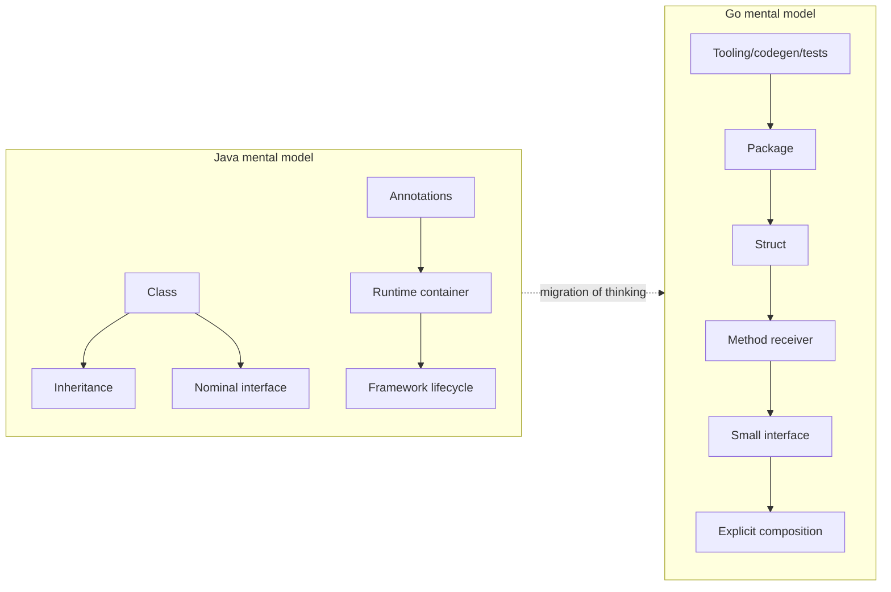
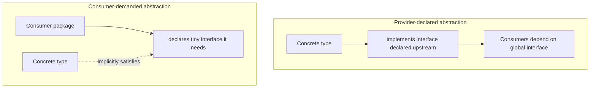
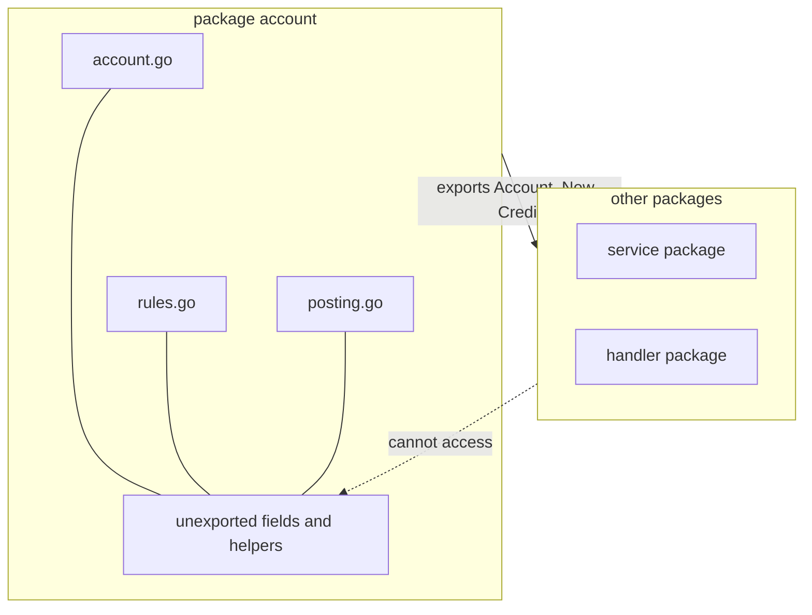
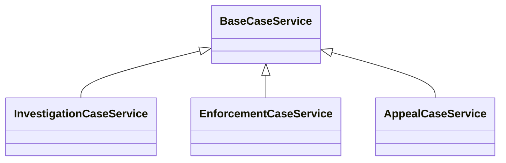
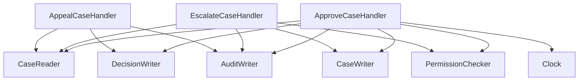
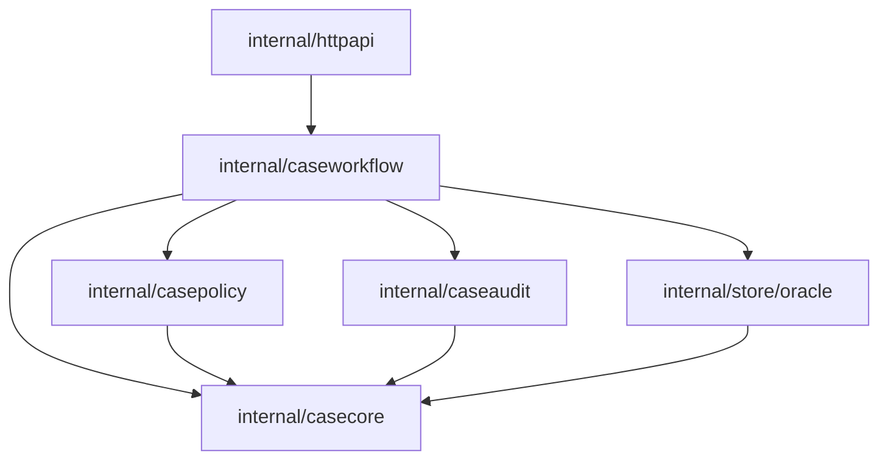
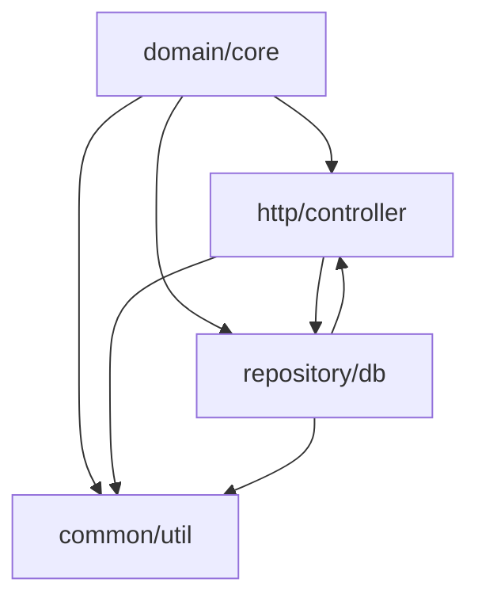

# learn-go-composition-oop-functional-reflection-codegen-modules-part-001.md

# Part 001 — Dari Java Class Hierarchy ke Go Behavior Composition

> Seri: `learn-go-composition-oop-functional-reflection-codegen-modules`  
> Bagian: `001 / 030`  
> Status seri: **belum selesai**  
> Target pembaca: Java software engineer / tech lead yang ingin berpanti mental model ke desain Go production-grade  
> Fokus: object model, composition, behavior, interface satisfaction, dan cara tidak membawa “Java class hierarchy reflex” ke Go

---

## 0. Tujuan Bagian Ini

Bagian ini bukan tutorial syntax Go dasar. Bagian ini menjawab pertanyaan yang lebih dalam:

> “Kalau Go tidak punya class inheritance seperti Java, lalu bagaimana kita mendesain sistem besar yang tetap modular, extensible, testable, dan defensible?”

Sebagai Java engineer, kemungkinan besar Anda terbiasa berpikir dengan vocabulary seperti:

- `class`
- `abstract class`
- `interface`
- `extends`
- `implements`
- inheritance hierarchy
- service interface + implementation class
- dependency injection container
- template method
- base class
- protected method
- annotation-driven framework
- reflection-heavy runtime wiring

Go tidak memindahkan semua konsep itu satu-satu. Go memaksa kita menurunkan abstraksi ke bentuk yang lebih eksplisit:

- data direpresentasikan oleh `struct`
- behavior ditempelkan melalui method receiver
- polymorphism terjadi lewat interface yang dipenuhi secara implicit
- reuse dilakukan lewat composition, bukan subclassing
- abstraction dibuat di sisi consumer bila memungkinkan
- package adalah unit encapsulation yang jauh lebih penting daripada class
- zero value, explicit constructor, dan invariant menjadi bagian desain API
- runtime magic diminimalkan; build-time/codegen/generic/interface dipilih dengan sadar

Part 001 bertujuan membangun **mental model utama** sebelum kita masuk ke method set, embedding, interface, functional option, reflection, code generation, dan module governance pada part-part berikutnya.

---

## 1. Peta Besar: Java dan Go Memecahkan Masalah yang Sama dengan Bentuk Berbeda

Baik Java maupun Go ingin membantu engineer membangun sistem besar. Tetapi keduanya memilih trade-off yang berbeda.

Java banyak memberi mekanisme language/runtime untuk membuat object model yang kaya:

- class sebagai pusat desain
- inheritance hierarchy
- nominal interface implementation
- annotation + reflection ecosystem
- framework container yang melakukan wiring runtime
- access modifier granular seperti `private`, `protected`, package-private, `public`
- generics dengan type erasure
- exception sebagai control path error

Go memilih surface area bahasa yang lebih kecil:

- tidak ada class
- tidak ada inheritance
- tidak ada `implements` declaration
- tidak ada annotation
- tidak ada exception untuk error biasa
- tidak ada method overloading
- tidak ada constructor khusus
- visibility hanya exported/unexported berdasarkan kapitalisasi nama
- interface dipenuhi secara structural dan implicit
- composition lebih eksplisit
- package boundary sangat penting
- tooling adalah bagian dari bahasa sehari-hari: `go test`, `go vet`, `go mod`, `go generate`, `go fmt`

Perbedaan ini bukan berarti Go lebih sederhana secara desain. Yang berubah adalah lokasi kompleksitasnya.

Di Java, kompleksitas sering berada di:

```text
class hierarchy + framework lifecycle + annotation metadata + runtime proxy + DI container
```

Di Go, kompleksitas yang baik biasanya berada di:

```text
package boundary + small interface + explicit composition + generated code where needed + tests as contract
```

Diagram mentalnya:



Hal pertama yang harus dilepas adalah anggapan bahwa “tidak ada inheritance” berarti “tidak ada OOP”.

Go tetap bisa memiliki:

- encapsulation
- polymorphism
- behavioral contracts
- domain objects
- lifecycle control
- invariants
- dependency inversion
- composition
- substitutability

Namun mekanismenya berbeda.

---

## 2. Core Shift: Dari “What Is This Object?” ke “What Behavior Is Needed Here?”

Di Java, desain sering dimulai dari identitas object:

```java
abstract class PaymentProcessor {
    abstract PaymentResult process(PaymentRequest request);
}

class CardPaymentProcessor extends PaymentProcessor { ... }
class BankTransferProcessor extends PaymentProcessor { ... }
```

Pertanyaan desainnya biasanya:

> “Object ini termasuk class apa? Base class apa? Interface apa yang harus diimplement?”

Di Go, desain idiomatik lebih sering mulai dari kebutuhan behavior di titik pemakaian:

```go
type PaymentProcessor interface {
    ProcessPayment(ctx context.Context, req PaymentRequest) (PaymentResult, error)
}
```

Pertanyaan desainnya menjadi:

> “Kode ini membutuhkan behavior apa agar bisa bekerja?”

Perbedaan ini penting.

Java cenderung mendorong **provider-declared abstraction**:

```text
Provider says: I implement PaymentProcessor.
```

Go lebih sering mendorong **consumer-demanded abstraction**:

```text
Consumer says: I only need something that can ProcessPayment.
```

Diagram:



Dalam Go, Anda tidak perlu menulis:

```go
// Tidak ada di Go:
type CardProcessor struct implements PaymentProcessor
```

Cukup method set-nya cocok, maka type tersebut memenuhi interface.

```go
type CardProcessor struct {
    gateway CardGateway
}

func (p *CardProcessor) ProcessPayment(ctx context.Context, req PaymentRequest) (PaymentResult, error) {
    // ...
}
```

Jika method signature cocok dengan interface, `*CardProcessor` satisfy interface tersebut.

Konsekuensi arsitekturalnya besar:

1. concrete type bisa tetap tidak tahu interface mana saja yang ia satisfy
2. consumer bisa membuat interface kecil tanpa memaksa provider berubah
3. unit test bisa memakai fake kecil tanpa inheritance/mock framework besar
4. abstraction bisa muncul belakangan setelah ada kebutuhan nyata
5. package dependency bisa diarahkan dari consumer ke contract yang minimal

---

## 3. Go Tidak Punya Class, Tetapi Punya Type + Method

Java:

```java
class Money {
    private final String currency;
    private final long amountMinor;

    public Money add(Money other) { ... }
}
```

Go:

```go
type Money struct {
    currency    string
    amountMinor int64
}

func (m Money) Add(other Money) (Money, error) {
    if m.currency != other.currency {
        return Money{}, ErrCurrencyMismatch
    }
    return Money{
        currency:    m.currency,
        amountMinor: m.amountMinor + other.amountMinor,
    }, nil
}
```

Di Go, method bukan berada “di dalam class body”. Method didefinisikan dengan receiver:

```go
func (receiver ReceiverType) MethodName(args) returns {
    // ...
}
```

Receiver membuat method tersebut masuk ke method set type tertentu.

Poin penting:

- receiver bukan `this` yang magical
- receiver adalah parameter khusus
- receiver bisa value atau pointer
- method bisa didefinisikan pada named type, tidak harus struct
- package boundary menentukan visibility, bukan class boundary

Contoh method pada non-struct named type:

```go
type CaseID string

func (id CaseID) IsZero() bool {
    return id == ""
}

func (id CaseID) String() string {
    return string(id)
}
```

Ini sangat berbeda dari Java. Di Go, Anda bisa memberi behavior pada domain primitive wrapper tanpa membuat class wrapper verbose.

Contoh lain:

```go
type Percentage int

func (p Percentage) Valid() bool {
    return p >= 0 && p <= 100
}
```

Secara desain domain, ini powerful karena Anda bisa mencegah primitive obsession tanpa class hierarchy.

---

## 4. Tidak Ada Constructor Khusus: Invariant Harus Dirancang Eksplisit

Java punya constructor:

```java
public class CaseAssignment {
    private final UserId assignee;
    private final Instant assignedAt;

    public CaseAssignment(UserId assignee, Instant assignedAt) {
        if (assignee == null) throw new IllegalArgumentException();
        this.assignee = assignee;
        this.assignedAt = assignedAt;
    }
}
```

Go tidak punya constructor language-level. Biasanya kita membuat function:

```go
type CaseAssignment struct {
    assignee   UserID
    assignedAt time.Time
}

func NewCaseAssignment(assignee UserID, assignedAt time.Time) (CaseAssignment, error) {
    if assignee.IsZero() {
        return CaseAssignment{}, ErrMissingAssignee
    }
    if assignedAt.IsZero() {
        return CaseAssignment{}, ErrMissingAssignedAt
    }
    return CaseAssignment{
        assignee:   assignee,
        assignedAt: assignedAt,
    }, nil
}
```

Tetapi ada konsekuensi penting: caller masih bisa membuat zero value jika type diekspor dan field diekspor.

```go
var a CaseAssignment // zero value
```

Maka desain Go harus menjawab:

> Apakah zero value type ini valid, invalid tapi detectable, atau harus tidak mungkin dibuat dari luar package?

Ada beberapa strategi.

### 4.1 Zero value valid

Contoh standard library yang banyak mengusahakan zero value berguna:

```go
var b bytes.Buffer
b.WriteString("hello")
```

Untuk type Anda sendiri:

```go
type RetryPolicy struct {
    MaxAttempts int
}

func (p RetryPolicy) Attempts() int {
    if p.MaxAttempts <= 0 {
        return 1
    }
    return p.MaxAttempts
}
```

Zero value berarti default behavior.

### 4.2 Zero value invalid tapi aman terdeteksi

```go
type TokenSigner struct {
    key []byte
}

func (s *TokenSigner) Sign(payload []byte) ([]byte, error) {
    if len(s.key) == 0 {
        return nil, ErrSignerNotConfigured
    }
    // ...
    return nil, nil
}
```

Zero value tidak usable, tetapi tidak panic diam-diam.

### 4.3 Zero value dicegah dari luar package

```go
package assignment

type Assignment struct {
    assignee   UserID
    assignedAt time.Time
}

func New(assignee UserID, assignedAt time.Time) (Assignment, error) {
    // validate
    return Assignment{assignee: assignee, assignedAt: assignedAt}, nil
}

func (a Assignment) Assignee() UserID {
    return a.assignee
}
```

Karena fields unexported, package lain tidak bisa mengisi field langsung.

Namun mereka tetap bisa membuat:

```go
var a assignment.Assignment
```

Jadi method harus tetap punya stance terhadap zero value.

---

## 5. Encapsulation di Go: Package Boundary Lebih Penting dari Class Boundary

Di Java, encapsulation sering dipikirkan pada level class:

```java
public class Account {
    private BigDecimal balance;
}
```

Di Go, visibility berdasarkan identifier:

- `Account` exported karena uppercase
- `account` unexported karena lowercase
- `Balance` exported
- `balance` unexported

Dan boundary-nya adalah package, bukan file atau struct.

```go
package account

type Account struct {
    id      AccountID
    balance Money
}

func (a *Account) Credit(amount Money) error {
    // package account controls invariant
    return nil
}
```

Semua file dalam package `account` bisa akses `id` dan `balance`. Package lain tidak bisa.

Ini membuat package design menjadi pusat desain OOP di Go.

### Java mental model

```text
Encapsulation = private fields inside class
```

### Go mental model

```text
Encapsulation = exported API surface of package + unexported implementation details
```

Diagram:



Implikasinya:

- jangan membuat package terlalu besar, karena semua internal detail package dapat saling akses
- jangan membuat package terlalu kecil sampai dependency graph pecah berlebihan
- pikirkan package sebagai “module kecil dengan public API”
- gunakan unexported concrete type saat ingin menyembunyikan implementasi
- hindari package `model` / `common` / `util` yang menjadi tempat buangan semua hal

---

## 6. Polymorphism di Go: Interface Dipenuhi Secara Implicit

Java:

```java
interface Notifier {
    void notify(Message message);
}

class EmailNotifier implements Notifier {
    public void notify(Message message) { ... }
}
```

Go:

```go
type Notifier interface {
    Notify(ctx context.Context, msg Message) error
}

type EmailNotifier struct {
    client EmailClient
}

func (n *EmailNotifier) Notify(ctx context.Context, msg Message) error {
    return n.client.Send(ctx, msg)
}
```

Tidak ada deklarasi `implements`. Ini disebut structural typing.

Sebuah type satisfy interface jika method set-nya cocok. Spec Go mendefinisikan method set dan interface satisfaction secara formal. Embedding juga memengaruhi method set melalui promoted methods.

### Compile-time assertion

Kadang kita ingin memastikan sebuah type memenuhi interface:

```go
var _ Notifier = (*EmailNotifier)(nil)
```

Maknanya:

- tidak membuat object nyata
- hanya compile-time check
- jika `*EmailNotifier` tidak satisfy `Notifier`, build gagal

Gunakan untuk:

- adapter publik
- implementasi plugin
- generated code
- type yang sengaja menjadi contract implementation

Jangan gunakan secara berlebihan pada semua type, karena salah satu kekuatan Go adalah concrete type tidak harus tahu semua interface kecil yang mungkin ia satisfy.

---

## 7. Interface di Go Bukan “Java Interface dengan Syntax Berbeda”

Ini salah satu jebakan terbesar Java engineer.

Java interface sering dipakai sebagai default layer:

```text
UserService interface
UserServiceImpl class
```

Lalu semua dependency mengarah ke interface tersebut bahkan ketika hanya ada satu implementasi.

Di Go, ini sering menjadi smell:

```go
type UserService interface {
    CreateUser(ctx context.Context, cmd CreateUserCommand) (User, error)
    DisableUser(ctx context.Context, id UserID) error
    FindUser(ctx context.Context, id UserID) (User, error)
}

type userService struct {
    repo UserRepository
}
```

Jika interface dibuat di package yang sama dengan satu concrete implementation, sering kali interface itu belum memberi value.

Go idiom yang lebih sering:

```go
type Service struct {
    repo UserRepository
}

func NewService(repo UserRepository) *Service {
    return &Service{repo: repo}
}
```

Interface dibuat pada dependency yang benar-benar ingin di-invert:

```go
type UserRepository interface {
    Save(ctx context.Context, user User) error
    FindByID(ctx context.Context, id UserID) (User, error)
}
```

Atau bahkan lebih kecil di sisi function:

```go
type UserFinder interface {
    FindByID(ctx context.Context, id UserID) (User, error)
}

func CanAccessUser(ctx context.Context, finder UserFinder, actor Actor, id UserID) (bool, error) {
    user, err := finder.FindByID(ctx, id)
    if err != nil {
        return false, err
    }
    return actor.CanAccess(user), nil
}
```

### Rule of thumb

```text
Accept interfaces, return concrete types.
```

Ini bukan hukum absolut, tapi default yang baik.

- parameter menerima interface agar caller bisa menyediakan variasi implementation
- constructor sering return concrete type agar caller punya full capability
- interface besar hanya dibuat jika boundary memang stabil dan multi-implementation nyata

---

## 8. Composition Over Inheritance: Apa Artinya Secara Praktis?

Dalam Java, Anda mungkin menulis:

```java
abstract class AuditedService {
    protected final AuditLogger auditLogger;

    protected void audit(String action) { ... }
}

class CaseService extends AuditedService {
    void approve(CaseId id) {
        audit("approve");
        ...
    }
}
```

Di Go, jangan mencari `extends`. Buat dependency eksplisit:

```go
type AuditLogger interface {
    Log(ctx context.Context, event AuditEvent) error
}

type CaseService struct {
    audit AuditLogger
    repo  CaseRepository
}

func NewCaseService(repo CaseRepository, audit AuditLogger) *CaseService {
    return &CaseService{repo: repo, audit: audit}
}

func (s *CaseService) Approve(ctx context.Context, id CaseID) error {
    if err := s.repo.Approve(ctx, id); err != nil {
        return err
    }
    return s.audit.Log(ctx, AuditEvent{Action: "case.approve", EntityID: id.String()})
}
```

Composition berarti object memiliki dependency yang dibutuhkan, bukan mewarisi implementation dari parent.

### Keuntungan composition

- dependency terlihat di struct field/constructor
- testing lebih mudah
- lifecycle lebih eksplisit
- tidak ada fragile base class problem
- tidak ada hidden override behavior
- tidak ada protected hook yang membuat control flow tersebar
- dependency graph lebih mudah dianalisis

### Risiko composition

- boilerplate lebih banyak jika desain buruk
- interface terlalu kecil bisa fragmented
- tanpa package discipline, dependency bisa tetap kacau
- embedding bisa disalahgunakan sebagai pseudo-inheritance

---

## 9. Embedding Bukan Inheritance

Go memiliki embedding:

```go
type Logger struct{}

func (Logger) Info(msg string) {}

type Service struct {
    Logger
}

func Example() {
    var s Service
    s.Info("started") // promoted method
}
```

Sekilas terlihat seperti inheritance. Tetapi secara semantic berbeda.

Ketika `Service` embed `Logger`, method `Info` dipromosikan sehingga bisa dipanggil lewat `s.Info`. Namun receiver method tersebut tetap `Logger`, bukan `Service`.

Ini penting.

```go
type Base struct{}

func (Base) Name() string {
    return "base"
}

func (Base) PrintName() {
    fmt.Println(Base{}.Name())
}

type Child struct {
    Base
}

func (Child) Name() string {
    return "child"
}
```

Di Java, dynamic dispatch melalui overridden method sering membuat base method memanggil child override.

Di Go, embedding bukan virtual inheritance. `Base.PrintName` tidak otomatis dispatch ke `Child.Name` karena receiver-nya tetap `Base`.

Ini salah satu alasan mengapa template method via base class tidak diterjemahkan langsung ke embedding.

### Salah pakai embedding

```go
type Service struct {
    *sql.DB // exposes entire sql.DB API as Service API
}
```

Ini berbahaya karena Anda secara tidak sengaja mengekspor capability besar.

Caller bisa memanggil semua method promoted dari `*sql.DB` melalui `Service`. API surface Anda bocor.

Lebih aman:

```go
type Service struct {
    db *sql.DB
}
```

Gunakan named field kecuali Anda benar-benar ingin promoted method menjadi bagian API type luar.

---

## 10. Behavior Composition: Desain Berdasarkan Capability

Dalam Go, interface kecil sering merepresentasikan capability.

Contoh standard idiom:

```go
type Reader interface {
    Read(p []byte) (n int, err error)
}

type Writer interface {
    Write(p []byte) (n int, err error)
}
```

Lalu capability bisa dikomposisi:

```go
type ReadWriter interface {
    Reader
    Writer
}
```

Inilah behavior composition.

Untuk domain regulatory/case management, contoh capability:

```go
type CaseLoader interface {
    LoadCase(ctx context.Context, id CaseID) (Case, error)
}

type CaseMutator interface {
    SaveCase(ctx context.Context, c Case) error
}

type DecisionRecorder interface {
    RecordDecision(ctx context.Context, d Decision) error
}

type AuditWriter interface {
    WriteAudit(ctx context.Context, e AuditEvent) error
}
```

Use case tertentu hanya menerima capability yang dibutuhkan:

```go
type ApproveCaseHandler struct {
    cases  interface {
        LoadCase(ctx context.Context, id CaseID) (Case, error)
        SaveCase(ctx context.Context, c Case) error
    }
    audit AuditWriter
}
```

Atau agar lebih readable:

```go
type CaseStore interface {
    LoadCase(ctx context.Context, id CaseID) (Case, error)
    SaveCase(ctx context.Context, c Case) error
}

type ApproveCaseHandler struct {
    cases CaseStore
    audit AuditWriter
}
```

Prinsipnya:

> Jangan memberi dependency capability yang tidak dibutuhkan.

Ini sangat penting untuk sistem enforcement/case-management karena capability yang terlalu luas memperbesar risiko cross-entity mutation, audit ambiguity, dan authorization bypass.

---

## 11. Dari Inheritance Tree ke Capability Graph

Java engineer sering menggambar inheritance tree:



Go lebih cocok digambar sebagai capability graph:



Yang penting bukan “kelas apa parent-nya”, tetapi:

- capability apa yang dibutuhkan?
- siapa pemilik capability tersebut?
- apakah capability terlalu luas?
- apakah ada state mutation tersembunyi?
- apakah audit/permission/context dibawa eksplisit?
- apakah failure path observable?

Ini membuat desain Go lebih cocok untuk architecture review berbasis invariant.

---

## 12. Package sebagai Boundary Sistem

Mari bandingkan desain Java layered architecture:

```text
com.company.case.domain
com.company.case.service
com.company.case.repository
com.company.case.controller
com.company.case.dto
```

Sering kali class-level abstraction dominan.

Di Go, struktur package harus lebih hati-hati karena import cycle tidak diizinkan dan package adalah unit visibility.

Contoh awal:

```text
caseapp/
  casecmd/
  casequery/
  casepolicy/
  caseaudit/
  internal/store/oracle/
  internal/httpapi/
```

Atau:

```text
internal/
  casecore/
  caseworkflow/
  caseauthz/
  caseaudit/
  oraclecase/
  httpcase/
```

Tujuannya bukan mengikuti nama layer secara membabi buta, tetapi membatasi arah dependency.



Hindari arah seperti ini:



Jika semua tergantung `common`, package itu menjadi “global junk drawer”.

---

## 13. Dependency Injection Tanpa Container Berat

Di Java enterprise, DI container sering natural:

```java
@Service
public class CaseService {
    private final CaseRepository repo;

    public CaseService(CaseRepository repo) {
        this.repo = repo;
    }
}
```

Spring/CDI menyelesaikan dependency graph.

Di Go, dependency injection biasanya plain constructor:

```go
type CaseService struct {
    repo   CaseRepository
    audit  AuditWriter
    clock  Clock
    policy Policy
}

func NewCaseService(repo CaseRepository, audit AuditWriter, clock Clock, policy Policy) *CaseService {
    return &CaseService{
        repo:   repo,
        audit:  audit,
        clock:  clock,
        policy: policy,
    }
}
```

Composition root dibuat eksplisit di `main` atau package wiring:

```go
func main() {
    db := mustOpenDB()
    repo := oraclecase.NewRepository(db)
    audit := oracleaudit.NewWriter(db)
    clock := systemclock.Clock{}
    policy := casepolicy.New()

    svc := caseworkflow.NewCaseService(repo, audit, clock, policy)
    api := httpapi.NewServer(svc)

    log.Fatal(api.ListenAndServe())
}
```

### Keuntungan explicit wiring

- dependency graph bisa dibaca tanpa framework magic
- lifecycle resource jelas
- test bisa mengganti dependency dengan fake
- startup failure lebih eksplisit
- tidak ada hidden reflection scanning
- build lebih deterministic

### Kapan codegen/wiring tool berguna?

Untuk graph besar, manual wiring bisa verbose. Go ecosystem sering memilih:

- manual constructor untuk graph kecil/sedang
- code generation untuk graph besar
- runtime reflection DI hanya jika trade-off diterima sadar

Part code generation nanti akan membahas pola ini lebih detail.

---

## 14. Java Pattern Translation Table

| Java habit | Go translation yang lebih idiomatik | Catatan |
|---|---|---|
| `AbstractBaseService` | named dependencies + helper functions + small interfaces | Hindari fragile base class |
| `Service interface` + `ServiceImpl` selalu | concrete exported type; interface di sisi consumer | Interface hanya saat ada substitusi nyata |
| `protected hook method` | strategy function/interface eksplisit | Control flow lebih jelas |
| annotation-driven validation | explicit validation, tags + reflection/codegen bila perlu | Runtime magic harus dibatasi |
| inheritance for reuse | composition via fields | Reuse bukan subtype relation |
| interface besar per layer | capability-specific interface | Kurangi privilege dependency |
| `private` per class | unexported fields/functions per package | Package cohesion jadi penting |
| DI container autowire | constructor injection + composition root | Lebih eksplisit dan testable |
| dynamic proxy | decorator/wrapper function/type | Observability lebih jelas |
| `equals/hashCode/toString` convention | explicit methods, comparable, Stringer | Tidak semua type comparable |
| checked exception | `(T, error)` return | Error path explicit |
| reflection framework | reflection/codegen/generics decision | Pilih berdasarkan runtime vs compile-time need |

---

## 15. Case Study: Migrasi Java-Style Workflow ke Go-Style Design

### 15.1 Java-style pseudo design

Misal sistem case management punya workflow:

- assign case
- approve case
- escalate case
- close case

Java-ish design:

```java
abstract class AbstractCaseAction {
    protected final CaseRepository repo;
    protected final AuditLogger audit;
    protected final PermissionService permission;

    public final ActionResult execute(ActionCommand command) {
        validate(command);
        checkPermission(command);
        Case c = repo.find(command.caseId());
        ActionResult result = doExecute(c, command);
        repo.save(c);
        audit.log(command, result);
        return result;
    }

    protected abstract ActionResult doExecute(Case c, ActionCommand command);
}

class ApproveCaseAction extends AbstractCaseAction { ... }
class EscalateCaseAction extends AbstractCaseAction { ... }
```

Masalahnya:

- base class mengontrol terlalu banyak lifecycle
- subclass hidden behavior sulit dilihat
- hook method bisa membuat invariant bocor
- testing sering perlu setup base class besar
- menambah action baru harus paham contract implisit base class
- jika authorization/audit berbeda per action, base class makin rumit

### 15.2 Go-style decomposition

Mulai dari invariant, bukan inheritance.

```go
type CaseRepository interface {
    FindByID(ctx context.Context, id CaseID) (Case, error)
    Save(ctx context.Context, c Case) error
}

type PermissionChecker interface {
    CanApprove(ctx context.Context, actor Actor, c Case) (bool, error)
}

type AuditWriter interface {
    WriteAudit(ctx context.Context, event AuditEvent) error
}

type ApproveCaseHandler struct {
    repo       CaseRepository
    permission PermissionChecker
    audit      AuditWriter
    clock      Clock
}
```

Handler eksplisit:

```go
func (h *ApproveCaseHandler) Handle(ctx context.Context, cmd ApproveCaseCommand) (ApproveCaseResult, error) {
    if err := cmd.Validate(); err != nil {
        return ApproveCaseResult{}, err
    }

    c, err := h.repo.FindByID(ctx, cmd.CaseID)
    if err != nil {
        return ApproveCaseResult{}, err
    }

    allowed, err := h.permission.CanApprove(ctx, cmd.Actor, c)
    if err != nil {
        return ApproveCaseResult{}, err
    }
    if !allowed {
        return ApproveCaseResult{}, ErrForbidden
    }

    decision, err := c.Approve(cmd.Actor, h.clock.Now())
    if err != nil {
        return ApproveCaseResult{}, err
    }

    if err := h.repo.Save(ctx, c); err != nil {
        return ApproveCaseResult{}, err
    }

    if err := h.audit.WriteAudit(ctx, AuditEvent{
        EntityID: cmd.CaseID.String(),
        Action:   "case.approve",
        Actor:    cmd.Actor.ID,
        At:       decision.At,
    }); err != nil {
        return ApproveCaseResult{}, err
    }

    return ApproveCaseResult{DecisionID: decision.ID}, nil
}
```

Ya, ini lebih eksplisit. Tetapi explicitness adalah fitur ketika sistem harus defensible.

### 15.3 Mengurangi duplikasi tanpa inheritance

Jika banyak handler memiliki langkah sama, jangan langsung membuat base class. Cari bentuk reuse yang tepat.

#### Helper function untuk pure rule

```go
func ensureAssignable(c Case, actor Actor) error {
    if c.Closed() {
        return ErrCaseClosed
    }
    if actor.IsZero() {
        return ErrMissingActor
    }
    return nil
}
```

#### Decorator untuk cross-cutting concern

```go
type Handler[C any, R any] interface {
    Handle(ctx context.Context, cmd C) (R, error)
}

type AuditedHandler[C any, R any] struct {
    next  Handler[C, R]
    audit AuditWriter
}

func (h AuditedHandler[C, R]) Handle(ctx context.Context, cmd C) (R, error) {
    result, err := h.next.Handle(ctx, cmd)
    // write generic audit if appropriate
    return result, err
}
```

#### Strategy untuk variasi behavior

```go
type TransitionPolicy interface {
    CanTransition(ctx context.Context, c Case, actor Actor) error
}
```

#### Function parameter untuk variasi kecil

```go
type TransitionFunc func(ctx context.Context, c Case, actor Actor) error

func (f TransitionFunc) CanTransition(ctx context.Context, c Case, actor Actor) error {
    return f(ctx, c, actor)
}
```

---

## 16. Go OOP: Empat Pilar, Versi Go

Sering orang belajar OOP dengan empat pilar:

1. encapsulation
2. abstraction
3. inheritance
4. polymorphism

Di Go, mapping-nya perlu direvisi.

### 16.1 Encapsulation

Dilakukan lewat package-level visibility.

```go
type Account struct {
    balance Money // unexported
}
```

### 16.2 Abstraction

Dilakukan lewat interface kecil, package API, dan function boundary.

```go
type BalanceReader interface {
    Balance(ctx context.Context, id AccountID) (Money, error)
}
```

### 16.3 Inheritance

Tidak ada. Diganti oleh composition.

```go
type Service struct {
    repo Repository
    log  Logger
}
```

### 16.4 Polymorphism

Dilakukan lewat interface satisfaction.

```go
func GenerateReport(ctx context.Context, source ReportSource) (Report, error) {
    return source.LoadReport(ctx)
}
```

Ringkasnya:

```text
Java OOP = class-centric object model
Go OOP   = package + type + method + interface + composition
```

---

## 17. Design Heuristics untuk Java Engineer

### 17.1 Jangan mulai dari interface

Di Go, mulai dari concrete implementation sering lebih baik.

```go
type Processor struct {
    repo Repository
}
```

Interface muncul saat:

- testing membutuhkan substitusi yang meaningful
- ada lebih dari satu implementation nyata
- package boundary membutuhkan dependency inversion
- function hanya butuh subset behavior kecil
- external adapter perlu contract stabil

### 17.2 Jangan membuat package berdasarkan technical layer secara buta

Package `service`, `repository`, `model`, `util`, `dto` sering menjadi terlalu generik.

Lebih baik package merepresentasikan cohesive capability/domain boundary.

```text
caseworkflow
casepolicy
caseaudit
casestore
```

### 17.3 Jangan embed untuk menghemat pengetikan

Embedding mengubah method set dan API surface. Named field lebih aman.

```go
// Safer default
type Service struct {
    logger Logger
}
```

Bukan:

```go
type Service struct {
    Logger
}
```

kecuali promoted method memang bagian API.

### 17.4 Jangan menganggap method pointer/value receiver hanya performance detail

Receiver choice memengaruhi:

- mutability
- method set
- interface satisfaction
- copy semantics
- concurrency safety
- nil receiver behavior

Ini akan dibahas formal di Part 003.

### 17.5 Jangan membuat abstraction sebelum pressure-nya nyata

Go design sering berkembang dari concrete ke interface, bukan sebaliknya.

```text
Concrete first -> observe duplication/variation -> extract small interface -> stabilize package API
```

---

## 18. Failure Modes Jika Membawa Java Style ke Go

### 18.1 Interface pollution

```go
type UserService interface {
    Create(...)
    Update(...)
    Delete(...)
    Search(...)
    Export(...)
    Import(...)
}
```

Masalah:

- sulit fake
- consumer tergantung method yang tidak dipakai
- perubahan satu method memecah banyak test
- contract terlalu luas

Perbaikan:

```go
type UserCreator interface {
    CreateUser(ctx context.Context, cmd CreateUserCommand) (UserID, error)
}
```

### 18.2 Impl suffix everywhere

```go
type PaymentService interface { ... }
type PaymentServiceImpl struct { ... }
```

Di Go, suffix `Impl` jarang memberi informasi.

Lebih baik:

```go
type Service struct { ... }
```

atau jika ada variasi nyata:

```go
type StripeProcessor struct { ... }
type ManualProcessor struct { ... }
type CompositeProcessor struct { ... }
```

### 18.3 Framework-shaped package design

```text
controller/
service/
repository/
entity/
dto/
mapper/
util/
```

Ini sering membuat domain boundary kabur.

Pertanyaan yang lebih baik:

- siapa pemilik invariant case transition?
- siapa pemilik audit semantics?
- siapa pemilik authorization decision?
- siapa pemilik persistence mapping?
- siapa boleh mutate aggregate?

### 18.4 Hidden lifecycle via global variables

Karena tidak ada DI container, sebagian engineer pindah ke global variable:

```go
var Repo CaseRepository
var Audit AuditWriter
```

Ini buruk untuk:

- test isolation
- concurrency
- startup order
- lifecycle
- multi-tenant config
- observability

Gunakan constructor/composition root.

### 18.5 Overusing reflection to recreate annotations

Go tidak punya annotation. Jangan langsung membuat mini-Spring via reflection.

Pertimbangkan urutan:

```text
explicit code -> interface -> generics -> code generation -> reflection
```

Reflection valid, tetapi harus dipakai sadar.

---

## 19. Decision Matrix Awal

| Problem | Default Go approach | Alternative | Hindari |
|---|---|---|---|
| Butuh reuse logic | helper function / composed dependency | decorator | base struct pseudo-inheritance |
| Butuh polymorphism | small interface | generic constraint | giant service interface |
| Butuh config fleksibel | functional options | config struct | long constructor tanpa naming |
| Butuh metadata struct | explicit method | tag + reflection/codegen | reflection scanning global tanpa cache |
| Butuh generate repetitive code | `go generate` + checked-in generated file policy | build-time codegen in CI | generator tidak deterministic |
| Butuh DI | manual constructor | codegen wiring | runtime container magic tanpa alasan kuat |
| Butuh package private | unexported identifier | internal package | global common package |
| Butuh variant behavior | strategy interface/function | switch over enum if local | inheritance tree |
| Butuh stable external API | exported concrete type + small interfaces | interface if external substitution needed | returning interface prematurely |

---

## 20. Production Design Review Checklist

Gunakan checklist ini saat review desain Go, khususnya jika tim berasal dari Java.

### 20.1 Type design

- Apakah type ini perlu exported?
- Apakah field harus unexported?
- Apakah zero value valid?
- Apakah constructor menjaga invariant?
- Apakah method receiver value/pointer sudah disengaja?
- Apakah type ini terlalu banyak responsibility?

### 20.2 Interface design

- Apakah interface dibuat di package consumer?
- Apakah interface hanya punya method yang benar-benar dibutuhkan?
- Apakah ada satu implementasi saja dan interface belum memberi value?
- Apakah nama interface menjelaskan capability?
- Apakah interface terlalu besar untuk fake di test?
- Apakah nil interface risk dipahami?

### 20.3 Composition design

- Apakah dependency eksplisit di struct/constructor?
- Apakah embedding dipakai dengan sengaja?
- Apakah promoted method membocorkan API?
- Apakah cross-cutting concern lebih cocok decorator?
- Apakah helper function cukup, tidak perlu abstraction?

### 20.4 Package design

- Apakah package punya cohesion jelas?
- Apakah package name menjelaskan capability?
- Apakah ada import cycle pressure?
- Apakah `internal` perlu dipakai?
- Apakah package `common`/`util` mulai membesar?
- Apakah dependency direction sesuai arsitektur?

### 20.5 Enterprise defensibility

- Apakah authorization dependency eksplisit?
- Apakah audit dependency eksplisit?
- Apakah state transition punya invariant lokal?
- Apakah mutation path mudah dilacak?
- Apakah test bisa membuktikan failure path?
- Apakah API tidak memberi capability lebih dari yang diperlukan?

---

## 21. Mini Lab: Ubah Java Reflex ke Go Design

### Problem

Anda memiliki use case:

> Assign case ke officer, dengan validasi status case, authorization, audit trail, dan repository persistence.

### Java reflex design

```text
AbstractCaseCommandHandler
  - validate
  - checkPermission
  - loadCase
  - executeInternal
  - saveCase
  - audit

AssignCaseHandler extends AbstractCaseCommandHandler
```

### Go design exercise

Mulai dari capability:

```go
type CaseRepository interface {
    FindByID(ctx context.Context, id CaseID) (Case, error)
    Save(ctx context.Context, c Case) error
}

type AssignmentPolicy interface {
    CanAssign(ctx context.Context, actor Actor, c Case, assignee OfficerID) error
}

type AuditWriter interface {
    WriteAudit(ctx context.Context, e AuditEvent) error
}

type Clock interface {
    Now() time.Time
}
```

Handler:

```go
type AssignCaseHandler struct {
    repo   CaseRepository
    policy AssignmentPolicy
    audit  AuditWriter
    clock  Clock
}

func NewAssignCaseHandler(
    repo CaseRepository,
    policy AssignmentPolicy,
    audit AuditWriter,
    clock Clock,
) *AssignCaseHandler {
    return &AssignCaseHandler{
        repo:   repo,
        policy: policy,
        audit:  audit,
        clock:  clock,
    }
}
```

Command:

```go
type AssignCaseCommand struct {
    Actor    Actor
    CaseID   CaseID
    Assignee OfficerID
    Reason   string
}

func (c AssignCaseCommand) Validate() error {
    if c.Actor.IsZero() {
        return ErrMissingActor
    }
    if c.CaseID.IsZero() {
        return ErrMissingCaseID
    }
    if c.Assignee.IsZero() {
        return ErrMissingAssignee
    }
    return nil
}
```

Handle flow:

```go
func (h *AssignCaseHandler) Handle(ctx context.Context, cmd AssignCaseCommand) error {
    if err := cmd.Validate(); err != nil {
        return err
    }

    c, err := h.repo.FindByID(ctx, cmd.CaseID)
    if err != nil {
        return err
    }

    if err := h.policy.CanAssign(ctx, cmd.Actor, c, cmd.Assignee); err != nil {
        return err
    }

    event, err := c.Assign(cmd.Assignee, cmd.Actor, h.clock.Now(), cmd.Reason)
    if err != nil {
        return err
    }

    if err := h.repo.Save(ctx, c); err != nil {
        return err
    }

    return h.audit.WriteAudit(ctx, AuditEvent{
        EntityID: cmd.CaseID.String(),
        Action:   "case.assign",
        Actor:    cmd.Actor.ID,
        At:       event.At,
        Details: map[string]string{
            "assignee": cmd.Assignee.String(),
        },
    })
}
```

### Yang berubah dari Java design

- tidak ada base class
- lifecycle terlihat eksplisit
- dependency terlihat eksplisit
- policy adalah capability, bukan protected method
- audit adalah dependency, bukan inherited helper
- domain invariant berada di `Case.Assign`
- handler orchestration bisa dites tanpa framework
- failure point terlihat linear

---

## 22. “Top 1%” Lens: Apa yang Harus Dikuasai, Bukan Hanya Diketahui

Untuk mencapai keluwesan tinggi dalam Go, Anda harus bisa menjawab pertanyaan desain ini dengan presisi:

1. Apakah abstraction ini seharusnya concrete type, interface, generic, reflection, atau generated code?
2. Apakah interface ini milik provider atau consumer?
3. Apakah package boundary ini menjaga invariant atau hanya mengelompokkan file?
4. Apakah embedding ini memperjelas API atau membocorkan capability?
5. Apakah zero value type ini valid dan aman?
6. Apakah method receiver choice membuat interface satisfaction berubah?
7. Apakah composition root jelas?
8. Apakah test membuktikan contract atau hanya menguji implementation detail?
9. Apakah dependency memberi terlalu banyak privilege?
10. Apakah desain ini akan tetap kompatibel setelah API evolve?

Engineer biasa tahu bahwa Go punya interface. Engineer kuat tahu kapan **tidak** membuat interface.

Engineer biasa tahu bahwa Go punya embedding. Engineer kuat tahu embedding bukan inheritance, dan tahu kapan named field lebih aman.

Engineer biasa tahu bahwa Go sederhana. Engineer kuat tahu kesederhanaan Go memindahkan disiplin ke package boundary, API design, tests, dan tooling.

---

## 23. Mental Model Akhir Part 001

Simpan model ini:

```text
Java:
  Design starts from class identity and hierarchy.

Go:
  Design starts from behavior needed at boundaries,
  explicit state ownership,
  small contracts,
  and package-level encapsulation.
```

Atau dalam bentuk pipeline:

```mermaid
flowchart LR
    Requirement[Requirement]
    Invariant[State invariant]
    Boundary[Package boundary]
    Concrete[Concrete type]
    Behavior[Needed behavior]
    Interface[Small interface if needed]
    Composition[Explicit composition]
    Test[Test contract]

    Requirement --> Invariant
    Invariant --> Boundary
    Boundary --> Concrete
    Concrete --> Behavior
    Behavior --> Interface
    Interface --> Composition
    Composition --> Test
```



Jangan mulai dari:

```text
What class hierarchy should I create?
```

Mulailah dari:

```text
What state owns the invariant?
What behavior does this boundary require?
What dependency capability is sufficient?
What API surface should remain stable?
```

Itulah pintu masuk desain Go yang serius.

---

## 24. Preview Part 002

Part berikutnya akan masuk ke fondasi formal:

```text
Part 002 — Defined Type, Alias, Receiver, Method, dan Konsekuensi Desain API
```

Kita akan membahas:

- named type vs alias
- kapan membuat domain-specific type
- method pada non-struct type
- receiver sebagai bagian API
- value receiver vs pointer receiver dari sisi semantic
- copy semantics dan mutability signal
- exported/unexported method design
- API compatibility ketika menambah/mengubah method
- bagaimana type design kecil menentukan maintainability package besar

---

## 25. Referensi Resmi dan Bacaan Pendukung

Referensi utama:

- Go Language Specification — method sets, interface types, struct types, embedded fields: https://go.dev/ref/spec
- Effective Go — methods, interfaces, embedding, naming idioms: https://go.dev/doc/effective_go
- The Laws of Reflection — interface value as type/value pair, reflection mental model: https://go.dev/blog/laws-of-reflection
- When To Use Generics — guidance on interface, generics, and reflection trade-offs: https://go.dev/blog/when-generics

Catatan: bagian ini sengaja memakai sumber resmi Go sebagai fondasi. Artikel komunitas dapat membantu, tetapi untuk aturan language-level seperti method set, embedding, interface satisfaction, dan type set, sumber kebenaran utama tetap Go specification.

---

# Status Seri

- Part saat ini: **001 / 030**
- Seri sudah selesai? **Belum**
- Lanjut berikutnya: `learn-go-composition-oop-functional-reflection-codegen-modules-part-002.md`

<!-- NAVIGATION_FOOTER -->
<div class="page-nav">
<a href="./learn-go-composition-oop-functional-reflection-codegen-modules-part-000.md">⬅️ Part 000 — Peta Seri, Mental Model, Scope, dan Cara Belajar Efisien</a>
<a href="./index.md">📚 Kategori</a>
<a href="../../index.md">🏠 Home</a>
<a href="./learn-go-composition-oop-functional-reflection-codegen-modules-part-002.md">Part 002 — Defined Type, Alias, Receiver, Method, dan Konsekuensi Desain API ➡️</a>
</div>
