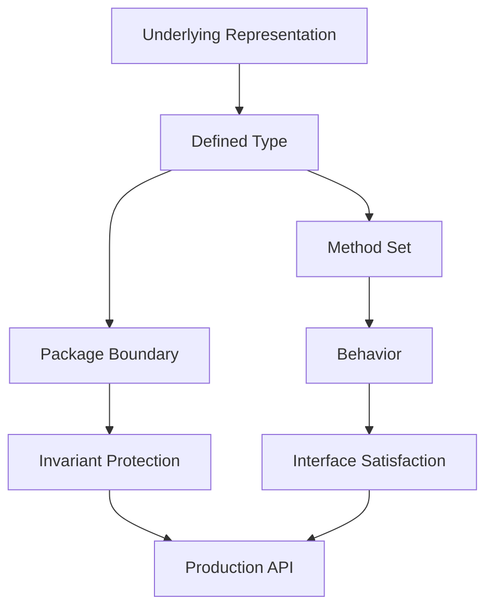
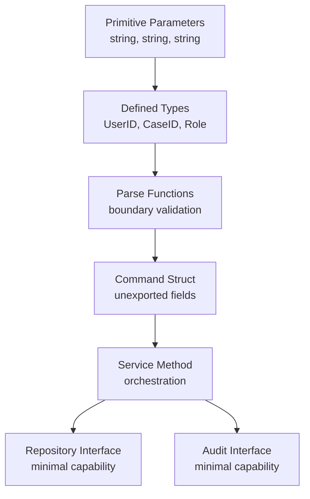

# learn-go-composition-oop-functional-reflection-codegen-modules-part-002.md

# Part 002 — Defined Type, Alias, Receiver, Method, dan Konsekuensi Desain API

> Seri: `learn-go-composition-oop-functional-reflection-codegen-modules`  
> Bagian: `002 / 030`  
> Fokus: bagaimana Go membangun model perilaku melalui **type**, **method**, **receiver**, dan **package boundary**, bukan melalui class hierarchy.

---

## 0. Posisi Part Ini dalam Seri

Pada Part 001, kita sudah menggeser mental model dari:

```text
Java: class hierarchy -> declared inheritance -> nominal polymorphism
Go  : type + method set -> implicit interface satisfaction -> behavior composition
```

Part 002 masuk ke fondasi yang lebih rendah: **apa sebenarnya arti membuat type di Go?**

Banyak engineer Java yang baru masuk Go melihat ini:

```go
type UserID string
```

lalu menganggapnya seperti:

```java
class UserID extends String { ... }
```

atau seperti type alias biasa. Keduanya tidak tepat.

Di Go, `type UserID string` adalah **defined type baru** dengan underlying type `string`, tetapi ia bukan alias dan bukan subclass. Ia memiliki identitas type sendiri, method set sendiri, dan aturan assignment/conversion sendiri.

Ini adalah salah satu fondasi terbesar untuk membuat API Go yang kuat: kita bisa memberi nama, boundary, behavior, invariant, dan semantic meaning pada data tanpa membangun class hierarchy.

---

## 1. Problem Framing

Dalam sistem produksi, masalah desain sering bukan karena bahasa tidak punya fitur, tetapi karena engineer salah memilih boundary.

Contoh masalah nyata:

- `string` dipakai untuk semua hal: user id, case id, email, phone, country code, permission code.
- `int` dipakai untuk money, retry count, status code, duration, priority.
- `map[string]any` dipakai sebagai domain object karena dianggap fleksibel.
- struct diekspos langsung sehingga invariant bisa dilanggar dari luar package.
- method dipasang di tempat yang salah sehingga type menjadi terlalu besar.
- API menerima primitive mentah sehingga caller mudah salah urutan argument.
- type alias digunakan padahal butuh semantic boundary.
- pointer receiver digunakan tanpa memahami efeknya ke method set dan interface satisfaction.

Dalam Java, banyak masalah ini biasanya diselesaikan dengan:

- value object class,
- enum,
- interface,
- abstract class,
- package-private constructor,
- builder,
- annotation,
- validation framework.

Di Go, solusi sering lebih kecil tetapi lebih formal:

- defined type,
- unexported field,
- constructor function,
- method receiver,
- small interface,
- package-level function,
- generic constraint,
- generated code bila perlu.

Part ini membangun mental model untuk memilih alat yang tepat.

---

## 2. Mental Model Utama

### 2.1 Type di Go Bukan Class

Go tidak memiliki class. Tetapi Go punya:

- defined type,
- underlying type,
- method,
- receiver,
- interface,
- package boundary,
- exported/unexported identifier,
- embedding,
- generics.

Gabungan elemen ini cukup untuk membangun domain model dan API yang kuat.

Diagram mental model:



Interpretasinya:

- underlying representation menentukan bentuk data di memory,
- defined type memberi identitas semantik,
- method set memberi perilaku,
- package boundary melindungi invariant,
- interface satisfaction muncul dari behavior, bukan deklarasi inheritance.

---

### 2.2 Go Memisahkan Data Shape dari Behavior Attachment

Dalam Java, data dan behavior biasanya digabung dalam class:

```java
public final class EmailAddress {
    private final String value;

    public EmailAddress(String value) {
        if (!isValid(value)) throw new IllegalArgumentException();
        this.value = value;
    }

    public String domain() { ... }
}
```

Dalam Go, desainnya bisa seperti:

```go
type EmailAddress string

func ParseEmailAddress(s string) (EmailAddress, error) {
    if !isValidEmail(s) {
        return "", fmt.Errorf("invalid email address")
    }
    return EmailAddress(s), nil
}

func (e EmailAddress) Domain() string {
    s := string(e)
    i := strings.LastIndexByte(s, '@')
    if i < 0 {
        return ""
    }
    return s[i+1:]
}
```

Ini bukan OOP klasik, tetapi tetap punya:

- semantic type,
- construction rule,
- method,
- behavior,
- invariant convention.

Namun ada detail penting: karena `EmailAddress` underlying type-nya `string`, package luar masih bisa membuat:

```go
e := EmailAddress("not an email")
```

Jadi defined type saja belum cukup untuk invariant keras. Untuk invariant keras, kita perlu struct dengan unexported field.

---

## 3. Defined Type

### 3.1 Apa Itu Defined Type?

Defined type adalah type baru yang dibuat dengan deklarasi `type`.

```go
type UserID string
type RetryCount int
type PermissionCode string
type MoneyCents int64
```

Setiap nama di atas adalah type baru, walaupun underlying type-nya primitive.

Contoh:

```go
type UserID string
type CaseID string

func LoadUser(id UserID) {}
func LoadCase(id CaseID) {}

func example() {
    var u UserID = "u-123"
    var c CaseID = "c-456"

    LoadUser(u) // ok
    LoadCase(c) // ok

    // LoadUser(c) // compile error
}
```

Keuntungannya besar:

- mencegah argument tertukar,
- membuat API self-documenting,
- memberi tempat untuk method,
- memberi tempat untuk validation helper,
- membuat compiler membantu menjaga domain boundary.

---

### 3.2 Defined Type Bukan Alias

Perhatikan dua deklarasi ini:

```go
type UserID string
```

vs:

```go
type UserID = string
```

Yang pertama membuat **defined type baru**.  
Yang kedua membuat **alias**.

Contoh:

```go
package identity

type UserID string

type LegacyUserID = string
```

Efeknya:

```go
var s string = "u-123"

var a identity.UserID = identity.UserID(s) // explicit conversion needed
var b identity.LegacyUserID = s           // alias, no conversion needed
```

Alias tidak memberi semantic boundary kuat. Alias hanya nama lain untuk type yang sama.

---

### 3.3 Kapan Memakai Defined Type?

Gunakan defined type ketika ada makna domain yang berbeda walaupun representasinya sama.

Contoh bagus:

```go
type TenantID string
type AccountID string
type CaseID string
type Permission string
type RoleName string
type Version int64
type SequenceNumber uint64
type MoneyCents int64
type PercentageBasisPoints int32
```

Manfaat:

- mengurangi primitive obsession,
- mengunci semantic mismatch pada compile time,
- membuat function signature lebih jelas,
- memberi tempat untuk method domain.

Contoh:

```go
func (id TenantID) IsZero() bool {
    return id == ""
}

func (id TenantID) String() string {
    return string(id)
}
```

---

### 3.4 Kapan Jangan Memakai Defined Type?

Jangan membuat defined type hanya untuk semua variable lokal.

Buruk:

```go
type UserName string
type UserAge int
type UserActive bool
```

Jika type tidak punya semantic boundary, tidak melindungi dari bug berarti, dan tidak punya behavior, ia bisa menambah noise.

Defined type bagus ketika minimal salah satu ini benar:

1. Ada risiko tertukar dengan type lain yang underlying-nya sama.
2. Ada validation atau construction rule.
3. Ada method behavior yang natural.
4. Ada API boundary publik.
5. Ada constraint untuk generics.
6. Ada format khusus untuk marshal/unmarshal.
7. Ada compatibility contract jangka panjang.

---

## 4. Underlying Type

### 4.1 Apa Itu Underlying Type?

Underlying type adalah representasi dasar dari sebuah defined type.

```go
type UserID string      // underlying: string
type Count int          // underlying: int
type Labels []string    // underlying: []string
type Metadata map[string]string
```

Underlying type menentukan operasi dasar yang tersedia.

Contoh:

```go
type Labels []string

func example(labels Labels) {
    labels = append(labels, "urgent")
    _ = len(labels)
}
```

Karena underlying type `Labels` adalah `[]string`, operasi slice bisa digunakan.

---

### 4.2 Defined Type Tidak Otomatis Mewarisi Method Underlying Type

Jika underlying type adalah defined type lain yang punya method, type baru tidak otomatis mendapatkan method tersebut.

```go
type Base string

func (b Base) Upper() string {
    return strings.ToUpper(string(b))
}

type Name Base

func example(n Name) {
    // n.Upper() // compile error
}
```

Ini penting. Go tidak punya inheritance method melalui underlying type.

Jika ingin behavior tersedia, pilih salah satu:

1. definisikan ulang method,
2. gunakan embedding bila struct,
3. gunakan function biasa,
4. gunakan interface abstraction.

---

### 4.3 Conversion vs Assignment

Defined type berbeda tidak assignable langsung walaupun underlying type sama.

```go
type UserID string
type AccountID string

var u UserID = "u-1"
var a AccountID = "a-1"

// u = a // compile error
u = UserID(a) // explicit conversion
```

Ini bagus karena compiler memaksa kita menyatakan bahwa konversi semantic memang disengaja.

Dalam sistem regulatory/case management, hal ini sangat berharga. Misalnya:

```go
type CaseID string
type AppealID string
type EnforcementActionID string
```

Jika semuanya `string`, bug tertukar bisa lolos test. Jika defined type, bug tertangkap compile time.

---

## 5. Type Alias

### 5.1 Apa Itu Type Alias?

Type alias memakai `=`:

```go
type ID = string
```

Alias berarti `ID` dan `string` adalah type yang sama. Tidak ada type identity baru.

Contoh:

```go
type UserID = string

func LoadUser(id UserID) {}

func example() {
    var s string = "u-1"
    LoadUser(s) // ok, karena UserID hanya alias string
}
```

Alias berguna, tetapi untuk tujuan berbeda.

---

### 5.2 Kapan Alias Tepat?

Alias cocok untuk:

1. Migrasi package tanpa breaking change.
2. Backward compatibility.
3. Re-export type dari package lain secara terkontrol.
4. Mengurangi churn saat refactoring besar.
5. Menjaga API lama tetap compile sambil memindahkan implementasi.

Contoh migrasi:

```go
// old/package
package old

import "example.com/project/newpkg"

type Client = newpkg.Client
type Config = newpkg.Config
```

Caller lama masih bisa memakai:

```go
old.Client{}
```

Tetapi type sebenarnya sama dengan `newpkg.Client`.

---

### 5.3 Alias untuk Generic Type

Pada Go modern, alias juga relevan untuk generic type. Namun secara desain, gunakan dengan hati-hati karena alias dapat membuat API terlihat lokal padahal ownership-nya ada di package lain.

Contoh konseptual:

```go
type Set[T comparable] = map[T]struct{}
```

Ini nyaman, tetapi tidak memberi method baru dan tidak memberi boundary baru.

Jika butuh behavior:

```go
type Set[T comparable] map[T]struct{}

func (s Set[T]) Has(v T) bool {
    _, ok := s[v]
    return ok
}
```

---

## 6. Struct sebagai Boundary Invariant

### 6.1 Defined Primitive Tidak Selalu Melindungi Invariant

Seperti dibahas sebelumnya:

```go
type EmailAddress string
```

Caller masih bisa membuat:

```go
e := EmailAddress("invalid")
```

Jika invariant harus kuat, gunakan struct dengan unexported field.

```go
type EmailAddress struct {
    value string
}

func ParseEmailAddress(s string) (EmailAddress, error) {
    if !isValidEmail(s) {
        return EmailAddress{}, fmt.Errorf("invalid email address")
    }
    return EmailAddress{value: s}, nil
}

func (e EmailAddress) String() string {
    return e.value
}
```

Package luar tidak bisa mengisi `value` langsung karena field tidak diekspor.

---

### 6.2 Zero Value Problem

Go sangat menghargai zero value. Tetapi untuk value object dengan invariant ketat, zero value bisa menjadi masalah.

```go
type EmailAddress struct {
    value string
}
```

Zero value-nya:

```go
var e EmailAddress
```

`e.value == ""`.

Pertanyaannya: apakah empty email valid?

Ada beberapa strategi.

#### Strategi A — Zero value invalid, validasi saat dipakai

```go
func (e EmailAddress) IsValid() bool {
    return e.value != ""
}
```

Cocok jika type sering muncul di struct optional.

#### Strategi B — Zero value adalah meaningful empty

```go
type OptionalEmailAddress struct {
    value string
}

func (e OptionalEmailAddress) IsSet() bool {
    return e.value != ""
}
```

Cocok jika empty memang state domain.

#### Strategi C — Pakai pointer untuk optional

```go
type User struct {
    Email *EmailAddress
}
```

Cocok jika ingin membedakan absent vs present-empty.

Namun pointer menambah nil handling.

#### Strategi D — Pakai separate validity flag

```go
type EmailAddress struct {
    value string
    valid bool
}
```

Cocok jika empty string bisa valid tapi perlu tahu constructed atau tidak.

Trade-off-nya lebih kompleks.

---

### 6.3 Struct Literal dan Exported Fields

Jika field exported, caller bisa bypass constructor.

```go
type User struct {
    ID    UserID
    Email string
}
```

Caller bisa:

```go
u := User{Email: "invalid"}
```

Jika invariant penting, jangan expose field secara bebas.

```go
type User struct {
    id    UserID
    email EmailAddress
}

func NewUser(id UserID, email EmailAddress) User {
    return User{id: id, email: email}
}

func (u User) ID() UserID { return u.id }
func (u User) Email() EmailAddress { return u.email }
```

Namun jangan overdo. Untuk DTO sederhana, exported fields sering lebih idiomatic.

Prinsipnya:

```text
DTO/transport shape    -> exported fields acceptable
Domain invariant model -> prefer unexported fields + constructor
Internal mutable state -> unexported fields
Config object          -> exported fields often okay, validated at boundary
```

---

## 7. Method dan Receiver

### 7.1 Method di Go

Method adalah function dengan receiver.

```go
type UserID string

func (id UserID) String() string {
    return string(id)
}
```

Receiver bukan `this` dalam arti Java. Receiver adalah parameter khusus yang muncul sebelum nama function.

Secara mental:

```go
func (id UserID) String() string
```

mirip function:

```go
func UserIDString(id UserID) string
```

Tetapi method punya efek tambahan:

- masuk ke method set,
- bisa memenuhi interface,
- bisa dipanggil dengan dot syntax,
- menjadi bagian dari API surface type.

---

### 7.2 Value Receiver

Value receiver menerima copy dari value.

```go
type Money struct {
    cents int64
}

func (m Money) Cents() int64 {
    return m.cents
}
```

Cocok untuk:

- immutable value object,
- small struct,
- primitive-defined type,
- method yang tidak mengubah receiver,
- type yang aman dicopy.

Contoh:

```go
type Status string

func (s Status) IsTerminal() bool {
    switch s {
    case "approved", "rejected", "cancelled":
        return true
    default:
        return false
    }
}
```

Value receiver membuat method tersedia pada `T` dan biasanya juga callable pada `*T` karena compiler bisa dereference untuk call expression. Detail formal method set akan dibahas penuh di Part 003.

---

### 7.3 Pointer Receiver

Pointer receiver menerima address dari value.

```go
type Counter struct {
    n int64
}

func (c *Counter) Inc() {
    c.n++
}
```

Cocok untuk:

- method yang mutate state,
- struct besar yang tidak ingin dicopy,
- type yang mengandung lock/mutex,
- type yang punya identity/lifecycle,
- method perlu observable side effect pada receiver.

Contoh:

```go
type Builder struct {
    parts []string
}

func (b *Builder) Add(s string) {
    b.parts = append(b.parts, s)
}

func (b *Builder) Build() string {
    return strings.Join(b.parts, "")
}
```

---

### 7.4 Receiver Choice Adalah API Decision

Receiver choice bukan hanya micro-optimization. Ia memengaruhi:

- method set,
- interface satisfaction,
- copy semantics,
- mutability expectations,
- nil behavior,
- concurrency safety,
- API ergonomics.

Rule praktis:

```text
Use value receiver when the type behaves like a value.
Use pointer receiver when the type behaves like an object with identity/state/lifecycle.
```

Contoh value-like:

```go
type Money struct {
    cents    int64
    currency string
}

func (m Money) Add(other Money) (Money, error) {
    if m.currency != other.currency {
        return Money{}, fmt.Errorf("currency mismatch")
    }
    return Money{cents: m.cents + other.cents, currency: m.currency}, nil
}
```

Contoh identity-like:

```go
type Session struct {
    id        string
    lastSeen  time.Time
    closed    bool
}

func (s *Session) Touch(now time.Time) {
    s.lastSeen = now
}

func (s *Session) Close() {
    s.closed = true
}
```

---

## 8. Receiver Naming

Receiver name di Go biasanya pendek, tetapi bukan asal satu huruf.

Baik:

```go
func (u User) ID() UserID
func (c *Client) Do(req Request) (Response, error)
func (s Status) IsTerminal() bool
func (r *Repository) Save(ctx context.Context, user User) error
```

Kurang baik:

```go
func (this *User) ID() UserID
func (self *Client) Do(req Request) (Response, error)
func (userInstance User) ID() UserID
```

Go tidak memakai `this`/`self`. Receiver sebaiknya konsisten antar method.

```go
func (c *Client) Do(...) ...
func (c *Client) Close() error
func (c *Client) Ping(ctx context.Context) error
```

Jangan campur tanpa alasan:

```go
func (client *Client) Do(...) ...
func (c *Client) Close() error
func (x *Client) Ping(...) error
```

---

## 9. Method Placement

### 9.1 Kapan Behavior Menjadi Method?

Tidak semua function harus menjadi method.

Gunakan method jika behavior:

- secara natural dimiliki type,
- membutuhkan invariant internal type,
- harus ikut method set untuk interface satisfaction,
- meningkatkan discoverability API,
- menjaga encapsulation.

Contoh method bagus:

```go
func (s Status) IsTerminal() bool
func (id UserID) String() string
func (m Money) Add(other Money) (Money, error)
func (c *Client) Do(ctx context.Context, req Request) (Response, error)
```

Gunakan function biasa jika behavior:

- bekerja pada banyak type setara,
- bukan bagian identitas type,
- lebih cocok sebagai algorithm/helper,
- tidak butuh access ke internal state,
- akan membuat method set terlalu gemuk.

Contoh function biasa:

```go
func SortUsers(users []User, less func(a, b User) bool)
func ParseUserID(s string) (UserID, error)
func MergePermissions(a, b []Permission) []Permission
```

---

### 9.2 Parse sebagai Function, String sebagai Method

Pattern umum:

```go
func ParseUserID(s string) (UserID, error) { ... }
func (id UserID) String() string { ... }
```

Kenapa `ParseUserID` bukan method?

Karena belum ada receiver valid sebelum parsing.

Buruk:

```go
func (id UserID) Parse(s string) (UserID, error) { ... }
```

Caller harus membuat dummy receiver:

```go
var id UserID
parsed, err := id.Parse("u-1")
```

Ini tidak natural.

---

### 9.3 Constructor Function

Go tidak punya constructor khusus. Gunakan function.

```go
func NewClient(cfg Config) (*Client, error) {
    if err := cfg.Validate(); err != nil {
        return nil, err
    }
    return &Client{cfg: cfg}, nil
}
```

Naming umum:

```text
NewT(...) (*T, error)        -> membuat object utama/lifecycle
ParseT(string) (T, error)   -> parsing dari string/text
MustParseT(string) T        -> panic jika invalid, biasanya untuk test/static init
FromX(...) (T, error)       -> konversi dari representation lain
```

Contoh:

```go
func ParseCaseID(s string) (CaseID, error)
func MustParseCaseID(s string) CaseID
func NewRepository(db *sql.DB) *Repository
func NewService(repo Repository, clock Clock) *Service
```

---

## 10. Method Set sebagai Kontrak Tersembunyi

Method yang kita pasang pada type akan menentukan interface apa yang dapat dipenuhi type tersebut.

Contoh:

```go
type Stringer interface {
    String() string
}

type UserID string

func (id UserID) String() string {
    return string(id)
}
```

Maka `UserID` memenuhi `Stringer`.

Kita tidak menulis:

```go
type UserID implements Stringer
```

Satisfaction terjadi implicit.

Dampaknya besar:

- setiap method publik meningkatkan surface behavior,
- method kecil bisa membuat type ikut interface yang tidak kita rancang,
- nama method harus hati-hati,
- receiver choice memengaruhi apakah `T` atau `*T` memenuhi interface.

Detail formalnya Part 003.

---

## 11. Pointer Receiver dan Interface Satisfaction Preview

Contoh:

```go
type Closer interface {
    Close() error
}

type FileHandle struct{}

func (f *FileHandle) Close() error {
    return nil
}
```

Maka biasanya:

```go
var p *FileHandle = &FileHandle{}
var c Closer = p // ok

var v FileHandle
// var c2 Closer = v // compile error
```

Karena `Close` ada pada method set `*FileHandle`, bukan `FileHandle`.

Ini sering mengejutkan engineer Java, karena di Java object reference selalu reference-like. Di Go, value dan pointer adalah type berbeda dengan method set berbeda.

---

## 12. Copy Semantics dan Receiver

### 12.1 Value Receiver Copy

Value receiver membuat copy.

```go
type Big struct {
    data [1024]int64
}

func (b Big) Sum() int64 { ... }
```

Setiap call akan copy receiver secara konseptual. Compiler bisa mengoptimasi, tetapi desain API tidak boleh bergantung pada harapan optimasi.

Jika type besar, pointer receiver mungkin lebih tepat.

---

### 12.2 Copying Lock adalah Bug Besar

Jika struct mengandung mutex, jangan pakai value receiver.

Buruk:

```go
type Cache struct {
    mu sync.Mutex
    m  map[string]string
}

func (c Cache) Get(k string) string {
    c.mu.Lock()
    defer c.mu.Unlock()
    return c.m[k]
}
```

Method ini copy `sync.Mutex`. Itu berbahaya.

Benar:

```go
func (c *Cache) Get(k string) string {
    c.mu.Lock()
    defer c.mu.Unlock()
    return c.m[k]
}
```

Rule:

```text
If a type contains sync.Mutex, sync.RWMutex, sync.Once, atomic state, or other non-copyable state,
use pointer receivers consistently and prevent accidental copying where possible.
```

---

### 12.3 Slice/Map Fields Tetap Reference-like

Value receiver copy struct, tetapi slice/map di dalam struct tetap menunjuk backing storage yang sama.

```go
type Bag struct {
    items []string
}

func (b Bag) Add(x string) {
    b.items = append(b.items, x)
}
```

Apakah ini mutate original?

Jawabannya tricky:

- field slice header dicopy,
- append bisa menulis ke backing array lama jika capacity cukup,
- tetapi update header `b.items` tidak kembali ke caller,
- perilaku terlihat tidak konsisten bagi pembaca.

Lebih jelas:

```go
func (b *Bag) Add(x string) {
    b.items = append(b.items, x)
}
```

Untuk method yang logically mutate, gunakan pointer receiver.

---

## 13. Nil Receiver

Pointer receiver bisa dipanggil pada nil pointer jika method menangani nil.

```go
type Node struct {
    Value string
    Next  *Node
}

func (n *Node) IsNil() bool {
    return n == nil
}
```

Ini valid:

```go
var n *Node
fmt.Println(n.IsNil()) // true
```

Tetapi jika method dereference tanpa check:

```go
func (n *Node) ValueOrEmpty() string {
    return n.Value // panic if n == nil
}
```

Nil receiver bisa berguna untuk type tertentu, tetapi harus disengaja dan terdokumentasi.

Contoh yang wajar:

```go
type Logger struct {
    out io.Writer
}

func (l *Logger) Debug(msg string) {
    if l == nil {
        return
    }
    fmt.Fprintln(l.out, msg)
}
```

Namun jangan menjadikan nil receiver sebagai default pattern karena bisa menyembunyikan lifecycle bug.

---

## 14. Exported vs Unexported Type dan Method

### 14.1 Exported Identifier

Di Go, identifier exported jika dimulai huruf besar.

```go
type Client struct{}   // exported
func NewClient() *Client
func (c *Client) Do() error
```

Unexported:

```go
type client struct{}
func newClient() *client
func (c *client) do() error
```

Package boundary adalah encapsulation mechanism utama.

---

### 14.2 Exported Type dengan Unexported Fields

Pattern umum:

```go
type Client struct {
    endpoint string
    http     *http.Client
}

func NewClient(endpoint string, httpClient *http.Client) *Client {
    return &Client{endpoint: endpoint, http: httpClient}
}
```

Caller bisa menggunakan `*Client`, tetapi tidak bisa mengubah field internal.

---

### 14.3 Unexported Concrete Type, Exported Interface?

Kadang package mengembalikan interface atau concrete unexported type.

Contoh:

```go
type Store interface {
    Get(ctx context.Context, key string) ([]byte, error)
    Put(ctx context.Context, key string, value []byte) error
}

type store struct {
    db *sql.DB
}

func NewStore(db *sql.DB) Store {
    return &store{db: db}
}
```

Ini membatasi caller agar hanya bergantung pada interface.

Namun hati-hati: terlalu sering mengembalikan interface dari constructor bisa membatasi extensibility, testing, dan discovery. Dalam Go, idiom umum adalah:

```text
Accept interfaces, return concrete types.
```

Tetapi rule ini bukan dogma. Untuk plugin boundary, cross-package contract, atau security-sensitive abstraction, return interface bisa tepat.

---

## 15. API Design: Accept Interface, Return Concrete — dengan Nuance

### 15.1 Mengapa Return Concrete Sering Lebih Baik?

```go
func NewClient(cfg Config) *Client
```

Keuntungannya:

- caller mendapat semua method concrete,
- mudah evolve dengan menambah method,
- dokumentasi lebih jelas,
- interface bisa dibuat consumer sendiri,
- tidak memaksa abstraction prematur.

Caller bisa membuat interface lokal:

```go
type Doer interface {
    Do(ctx context.Context, req Request) (Response, error)
}
```

---

### 15.2 Kapan Return Interface Tepat?

Return interface bisa tepat jika:

- concrete type sengaja disembunyikan,
- ada beberapa implementasi setara,
- package adalah framework/plugin host,
- ingin mencegah caller bergantung pada implementation detail,
- lifecycle dikontrol package,
- security boundary memerlukan minimal capability.

Contoh:

```go
func OpenPolicyEngine(cfg Config) (Evaluator, error)
```

Jika caller hanya boleh mengevaluasi policy, bukan mutate registry internal.

---

### 15.3 Accept Concrete vs Accept Interface

Function yang menerima dependency biasanya lebih fleksibel jika menerima interface kecil.

```go
type UserLoader interface {
    LoadUser(ctx context.Context, id UserID) (User, error)
}

func NewService(loader UserLoader) *Service {
    return &Service{loader: loader}
}
```

Tetapi jangan membuat interface terlalu awal di package provider.

Buruk:

```go
package userrepo

type RepositoryInterface interface {
    Create(...)
    Update(...)
    Delete(...)
    FindByID(...)
    FindByEmail(...)
    Search(...)
    Count(...)
}
```

Lebih baik consumer mendefinisikan interface sesuai kebutuhan:

```go
package service

type userFinder interface {
    FindByID(ctx context.Context, id UserID) (User, error)
}
```

---

## 16. Semantic Type untuk Domain Modeling

### 16.1 Regulatory Case Management Example

Misalnya kita punya sistem enforcement lifecycle.

Naif:

```go
type Case struct {
    ID          string
    ApplicantID string
    Status      string
    Priority    int
}
```

Lebih kuat:

```go
type CaseID string
type ApplicantID string
type CaseStatus string
type Priority int

type Case struct {
    id          CaseID
    applicantID ApplicantID
    status      CaseStatus
    priority    Priority
}
```

Behavior:

```go
func (s CaseStatus) IsTerminal() bool {
    switch s {
    case CaseStatusClosed, CaseStatusRejected, CaseStatusWithdrawn:
        return true
    default:
        return false
    }
}

func (p Priority) IsEscalated() bool {
    return p >= 80
}
```

Constants:

```go
const (
    CaseStatusDraft     CaseStatus = "draft"
    CaseStatusSubmitted CaseStatus = "submitted"
    CaseStatusReviewing CaseStatus = "reviewing"
    CaseStatusClosed    CaseStatus = "closed"
    CaseStatusRejected  CaseStatus = "rejected"
    CaseStatusWithdrawn CaseStatus = "withdrawn"
)
```

---

### 16.2 Enum-like Defined Type

Go tidak punya enum seperti Java. Pattern umum:

```go
type CaseStatus string

const (
    CaseStatusDraft     CaseStatus = "draft"
    CaseStatusSubmitted CaseStatus = "submitted"
    CaseStatusApproved  CaseStatus = "approved"
    CaseStatusRejected  CaseStatus = "rejected"
)

func (s CaseStatus) Valid() bool {
    switch s {
    case CaseStatusDraft, CaseStatusSubmitted, CaseStatusApproved, CaseStatusRejected:
        return true
    default:
        return false
    }
}
```

Kelemahan:

```go
s := CaseStatus("whatever") // compile ok
```

Jadi validasi tetap perlu pada boundary:

- parsing request,
- database scan,
- message decode,
- config load,
- test fixture.

---

### 16.3 Stronger Enum dengan Unexported Type?

Alternatif:

```go
type caseStatus struct {
    value string
}

var (
    CaseStatusDraft    = caseStatus{"draft"}
    CaseStatusApproved = caseStatus{"approved"}
)
```

Ini lebih sulit dipalsukan, tetapi ergonominya lebih buruk:

- tidak bisa const,
- comparison masih bisa tapi object style,
- marshalling lebih custom,
- API terlihat tidak idiomatic untuk banyak kasus.

Untuk kebanyakan sistem, defined string type + constants + validation sudah cukup.

---

## 17. Method Jangan Menjadi Tempat Semua Logic

Engineer Java sering membawa kebiasaan “domain object harus punya semua behavior”. Di Go, method boleh ada, tetapi tidak semua logic harus method.

Buruk:

```go
type Case struct { ... }

func (c *Case) Submit(repo Repository, notifier Notifier, audit Auditor) error
func (c *Case) Approve(policy PolicyEngine, tx Transaction) error
func (c *Case) Escalate(sla SLAService, clock Clock) error
```

Domain object menjadi service container.

Lebih baik pisahkan:

```go
type Case struct {
    id     CaseID
    status CaseStatus
}

func (c Case) CanSubmit() bool { ... }
func (c Case) WithStatus(status CaseStatus) (Case, error) { ... }

type CaseService struct {
    repo     CaseRepository
    policy   PolicyEngine
    notifier Notifier
    audit    Auditor
}

func (s *CaseService) Submit(ctx context.Context, id CaseID) error { ... }
```

Prinsip:

```text
Entity/value methods should protect local invariants.
Application services coordinate dependencies and transactions.
```

---

## 18. Receiver dan Immutability by Convention

Go tidak punya `final` object atau readonly field. Immutability biasanya by convention dan package design.

Value object:

```go
type Money struct {
    cents    int64
    currency string
}

func NewMoney(cents int64, currency string) (Money, error) {
    if currency == "" {
        return Money{}, fmt.Errorf("currency required")
    }
    return Money{cents: cents, currency: currency}, nil
}

func (m Money) Add(other Money) (Money, error) {
    if m.currency != other.currency {
        return Money{}, fmt.Errorf("currency mismatch")
    }
    return Money{cents: m.cents + other.cents, currency: m.currency}, nil
}
```

Tidak ada method yang mengubah `m`. Caller mendapat value baru.

Ini mirip Java immutable value object, tetapi tanpa language-level enforcement penuh.

---

## 19. Value Object vs Entity vs Service di Go

### 19.1 Value Object

Ciri:

- equality by value,
- biasanya small,
- immutable by convention,
- value receiver,
- no lifecycle,
- no external resource.

Contoh:

```go
type Money struct { ... }
type EmailAddress struct { ... }
type DateRange struct { ... }
type PermissionCode string
```

### 19.2 Entity

Ciri:

- punya identity,
- state bisa berubah melalui transition,
- invariant penting,
- method bisa value atau pointer tergantung desain.

Contoh:

```go
type Case struct {
    id     CaseID
    status CaseStatus
}
```

Mutable style:

```go
func (c *Case) Submit() error {
    if c.status != CaseStatusDraft {
        return fmt.Errorf("cannot submit from %s", c.status)
    }
    c.status = CaseStatusSubmitted
    return nil
}
```

Immutable style:

```go
func (c Case) Submitted() (Case, error) {
    if c.status != CaseStatusDraft {
        return Case{}, fmt.Errorf("cannot submit from %s", c.status)
    }
    c.status = CaseStatusSubmitted
    return c, nil
}
```

### 19.3 Service

Ciri:

- mengoordinasikan dependencies,
- transaction boundary,
- IO boundary,
- policy orchestration,
- biasanya pointer receiver.

```go
type CaseService struct {
    repo   CaseRepository
    audit  Auditor
    clock  Clock
}

func (s *CaseService) Submit(ctx context.Context, id CaseID) error { ... }
```

---

## 20. Package Boundary sebagai Encapsulation

### 20.1 Java Private vs Go Unexported

Java punya `private`, `protected`, package-private, public.

Go hanya punya:

- exported: terlihat dari package lain,
- unexported: hanya terlihat dalam package yang sama.

Artinya, package design sangat menentukan encapsulation.

Jika package terlalu besar, unexported menjadi terlalu luas. Jika package terlalu kecil, dependency graph bisa berisik.

---

### 20.2 Package sebagai Unit Invariant

Jika invariant `Case` sangat penting, letakkan type dan constructor dalam package yang sama.

```go
package casecore

type Case struct {
    id     CaseID
    status CaseStatus
}

func NewCase(id CaseID) Case {
    return Case{id: id, status: CaseStatusDraft}
}

func (c Case) Submit() (Case, error) { ... }
```

Package lain tidak bisa mutate field.

---

### 20.3 Jangan Membuat Package per Class

Engineer Java kadang membuat struktur seperti:

```text
case/
  Case.go
  CaseService.go
  CaseRepository.go
  CaseStatus.go
```

Di Go, package bukan folder untuk satu class. Package adalah unit API.

Lebih baik pikirkan:

```text
casecore/      domain model dan transition rules
caseapp/       orchestration/use case service
caseoracle/    persistence adapter
casehttp/      transport handler
```

Atau sesuai konteks project:

```text
internal/case/domain
internal/case/app
internal/case/adapter/oracle
internal/case/adapter/http
```

Namun jangan dogmatis. Struktur harus mengikuti dependency direction dan change locality.

---

## 21. Defined Type dan JSON/DB Boundary

Defined type bekerja baik dengan encoding jika underlying type sederhana.

```go
type UserID string

type UserDTO struct {
    ID UserID `json:"id"`
}
```

JSON akan encode sebagai string.

Tetapi validasi tidak otomatis.

Jika perlu validation saat unmarshal:

```go
func (id *UserID) UnmarshalText(text []byte) error {
    s := string(text)
    if s == "" {
        return fmt.Errorf("user id required")
    }
    *id = UserID(s)
    return nil
}
```

Untuk database, bisa implement `driver.Valuer` dan `sql.Scanner`.

```go
func (id UserID) Value() (driver.Value, error) {
    return string(id), nil
}

func (id *UserID) Scan(src any) error {
    switch v := src.(type) {
    case string:
        *id = UserID(v)
        return nil
    case []byte:
        *id = UserID(string(v))
        return nil
    default:
        return fmt.Errorf("cannot scan %T into UserID", src)
    }
}
```

Catatan: detail database integration sudah menjadi seri lain, jadi di sini hanya dilihat dari sisi type design.

---

## 22. Type Definition untuk Collections

Defined type dapat dibuat atas slice/map.

```go
type Permissions []Permission

func (ps Permissions) Has(p Permission) bool {
    for _, x := range ps {
        if x == p {
            return true
        }
    }
    return false
}
```

Ini bagus jika collection punya domain behavior.

Namun hati-hati dengan mutability:

```go
func (ps Permissions) Add(p Permission) Permissions {
    if ps.Has(p) {
        return ps
    }
    return append(ps, p)
}
```

Karena slice reference-like, caller perlu memahami apakah method return value baru atau mutate existing.

Untuk API jelas, bisa gunakan naming:

```go
func (ps Permissions) With(p Permission) Permissions
func (ps Permissions) Without(p Permission) Permissions
func (ps *Permissions) Add(p Permission)
func (ps *Permissions) Remove(p Permission)
```

---

## 23. Type Definition untuk Function

Function juga bisa menjadi defined type.

```go
type Authorizer func(ctx context.Context, subject Subject, action Action, resource Resource) (Decision, error)
```

Lalu diberi method:

```go
func (a Authorizer) Authorize(ctx context.Context, subject Subject, action Action, resource Resource) (Decision, error) {
    return a(ctx, subject, action, resource)
}
```

Ini pattern powerful untuk adapter.

Contoh:

```go
type Clock func() time.Time

func (c Clock) Now() time.Time {
    if c == nil {
        return time.Now()
    }
    return c()
}
```

Function type cocok untuk:

- strategy kecil,
- test double,
- middleware,
- callback,
- adapter ke interface.

Namun jangan gunakan function type untuk dependency besar dengan banyak method.

---

## 24. Type Definition untuk Interface? Hati-hati

Interface biasanya langsung diberi nama:

```go
type Reader interface {
    Read(p []byte) (int, error)
}
```

Alias interface bisa berguna untuk re-export:

```go
type Reader = io.Reader
```

Tetapi membuat interface baru yang identik kadang menambah noise:

```go
type MyReader interface {
    Read(p []byte) (int, error)
}
```

Ini structural compatible, tetapi nama baru perlu alasan domain.

Gunakan nama domain bila behavior punya makna domain:

```go
type PolicySource interface {
    ReadPolicy(ctx context.Context, id PolicyID) (Policy, error)
}
```

---

## 25. Compile-Time Assertion

Karena interface satisfaction implicit, kadang kita ingin assertion eksplisit untuk dokumentasi dan compile-time check.

```go
type Repository struct { ... }

var _ UserRepository = (*Repository)(nil)
```

Artinya:

- pastikan `*Repository` memenuhi `UserRepository`,
- tidak membuat runtime value,
- berguna untuk adapter, generated code, plugin boundary.

Contoh:

```go
var _ fmt.Stringer = UserID("")
var _ json.Marshaler = (*Policy)(nil)
var _ io.Closer = (*Client)(nil)
```

Jangan berlebihan. Gunakan saat contract penting.

---

## 26. Design Matrix: Defined Type vs Struct vs Alias

| Kebutuhan | Pilihan | Alasan |
|---|---|---|
| Nama semantik untuk primitive | defined type | compile-time semantic boundary |
| Migrasi package tanpa break | alias | menjaga compatibility |
| Invariant kuat | struct unexported field | caller tidak bisa bypass constructor |
| DTO sederhana | struct exported fields | ergonomic untuk encoding/binding |
| Collection dengan behavior domain | defined slice/map type | method dapat dipasang |
| Re-export type eksternal | alias | satu identity type tetap sama |
| Value object immutable | struct unexported fields + value receiver | menjaga invariant dan copy semantics |
| Stateful service/client | struct + pointer receiver | lifecycle dan mutable state jelas |
| Strategy kecil | function defined type | ringan dan testable |
| Runtime polymorphism | interface | behavior contract |

---

## 27. Design Matrix: Value Receiver vs Pointer Receiver

| Pertanyaan | Value Receiver | Pointer Receiver |
|---|---|---|
| Method mutate receiver? | Tidak | Ya |
| Type besar? | Hindari | Cocok |
| Contains mutex/atomic/non-copy state? | Jangan | Wajib/praktis wajib |
| Value object kecil? | Cocok | Bisa, tapi kurang natural |
| Needs nil receiver handling? | Tidak | Bisa |
| Method should be on both value and pointer? | Biasanya lebih luas | Lebih sempit |
| Lifecycle/resource handle? | Jarang | Cocok |
| Immutable style? | Cocok | Kurang natural kecuali internal cache |

Prinsip konsistensi:

```text
If some methods of a type require pointer receiver, often use pointer receiver for all methods,
especially for stateful types, to avoid confusing method set and copy semantics.
```

Namun untuk pure value type, value receiver lebih idiomatic.

---

## 28. Anti-Patterns

### 28.1 Primitive Obsession

Buruk:

```go
func AssignCase(userID string, caseID string, role string) error
```

Lebih baik:

```go
func AssignCase(userID UserID, caseID CaseID, role AssignmentRole) error
```

---

### 28.2 Java Bean Struct

Buruk:

```go
type User struct {
    ID string
    Name string
    Email string
}

func (u *User) GetID() string
func (u *User) SetID(id string)
func (u *User) GetName() string
func (u *User) SetName(name string)
```

Go tidak memerlukan getter/setter mekanis. Gunakan field exported untuk DTO, atau method bermakna untuk domain.

Lebih baik:

```go
type User struct {
    id    UserID
    email EmailAddress
}

func (u User) ID() UserID { return u.id }
func (u User) Email() EmailAddress { return u.email }
func (u User) WithEmail(email EmailAddress) User {
    u.email = email
    return u
}
```

---

### 28.3 Alias untuk Domain Boundary

Buruk:

```go
type CaseID = string
```

Jika ingin compiler mencegah mismatch, gunakan:

```go
type CaseID string
```

---

### 28.4 Pointer Receiver untuk Semua Hal

Buruk:

```go
type Status string

func (s *Status) IsTerminal() bool { ... }
```

Ini membuat caller harus punya pointer untuk interface satisfaction tertentu dan memberi kesan method mutate.

Lebih baik:

```go
func (s Status) IsTerminal() bool { ... }
```

---

### 28.5 Method Dumping

Buruk:

```go
type User struct { ... }

func (u User) ValidatePassword(...)
func (u User) SendEmail(...)
func (u User) SaveToDatabase(...)
func (u User) RenderHTML(...)
```

Type domain dicampur dengan infrastructure, security, persistence, presentation.

Lebih baik pisahkan boundary:

```go
User domain model
PasswordService
UserRepository
EmailSender
HTTPPresenter
```

---

### 28.6 Inconsistent Receiver

Buruk:

```go
func (c Client) Endpoint() string
func (c *Client) Do(req Request) (Response, error)
func (c Client) Close() error
```

Jika `Client` punya lifecycle/resource, gunakan pointer receiver konsisten.

---

## 29. Production Checklist

Saat mendesain type baru, tanyakan:

### 29.1 Type Identity

- Apakah ini benar-benar butuh type baru?
- Apakah underlying type sama dengan konsep lain yang mudah tertukar?
- Apakah type ini muncul di API boundary?
- Apakah caller perlu explicit conversion?

### 29.2 Invariant

- Apakah value invalid bisa dibuat dari luar package?
- Apakah itu acceptable?
- Apakah butuh constructor/parse function?
- Apakah zero value valid?
- Apakah harus ada `Valid()` atau `IsZero()`?

### 29.3 Receiver

- Apakah method mutate receiver?
- Apakah type aman dicopy?
- Apakah type mengandung mutex/atomic/resource?
- Apakah value receiver akan menimbulkan ambiguous mutation?
- Apakah pointer receiver memengaruhi interface satisfaction?

### 29.4 API Surface

- Apakah method ini benar-benar milik type?
- Apakah sebaiknya function biasa?
- Apakah method name bisa membuat type memenuhi interface yang tidak disengaja?
- Apakah exported method menjadi compatibility contract jangka panjang?

### 29.5 Package Boundary

- Apakah field perlu exported?
- Apakah constructor cukup menjaga invariant?
- Apakah package terlalu besar sehingga unexported tidak cukup aman?
- Apakah type ini harus concrete exported atau interface exported?

### 29.6 Evolution

- Apakah menambah field nanti akan breaking?
- Apakah caller bergantung pada struct literal?
- Apakah alias diperlukan untuk migrasi?
- Apakah defined type akan menyulitkan integration boundary?

---

## 30. Worked Example: Mendesain Case Assignment API

### 30.1 Versi Naif

```go
func Assign(userID string, caseID string, role string) error {
    if userID == "" {
        return errors.New("user id required")
    }
    if caseID == "" {
        return errors.New("case id required")
    }
    if role != "owner" && role != "reviewer" {
        return errors.New("invalid role")
    }
    return nil
}
```

Masalah:

- `userID` dan `caseID` bisa tertukar,
- role tidak punya semantic type,
- validation tersebar,
- function signature kurang ekspresif,
- tidak ada tempat natural untuk behavior role.

---

### 30.2 Versi dengan Defined Type

```go
type UserID string
type CaseID string
type AssignmentRole string

const (
    AssignmentRoleOwner    AssignmentRole = "owner"
    AssignmentRoleReviewer AssignmentRole = "reviewer"
)

func (r AssignmentRole) Valid() bool {
    switch r {
    case AssignmentRoleOwner, AssignmentRoleReviewer:
        return true
    default:
        return false
    }
}

func Assign(userID UserID, caseID CaseID, role AssignmentRole) error {
    if userID == "" {
        return errors.New("user id required")
    }
    if caseID == "" {
        return errors.New("case id required")
    }
    if !role.Valid() {
        return errors.New("invalid role")
    }
    return nil
}
```

Lebih baik:

- compiler mencegah ID tertukar,
- role punya behavior,
- signature lebih jelas.

Masih ada kelemahan:

```go
Assign(UserID(""), CaseID(""), AssignmentRole("hacker"))
```

Masih compile, validasi runtime tetap perlu.

---

### 30.3 Versi dengan Constructor/Parser

```go
func ParseUserID(s string) (UserID, error) {
    if s == "" {
        return "", errors.New("user id required")
    }
    return UserID(s), nil
}

func ParseCaseID(s string) (CaseID, error) {
    if s == "" {
        return "", errors.New("case id required")
    }
    return CaseID(s), nil
}

func ParseAssignmentRole(s string) (AssignmentRole, error) {
    r := AssignmentRole(s)
    if !r.Valid() {
        return "", fmt.Errorf("invalid assignment role %q", s)
    }
    return r, nil
}
```

Boundary decode:

```go
func decodeAssignRequest(req AssignRequestDTO) (AssignCommand, error) {
    userID, err := ParseUserID(req.UserID)
    if err != nil {
        return AssignCommand{}, err
    }

    caseID, err := ParseCaseID(req.CaseID)
    if err != nil {
        return AssignCommand{}, err
    }

    role, err := ParseAssignmentRole(req.Role)
    if err != nil {
        return AssignCommand{}, err
    }

    return AssignCommand{UserID: userID, CaseID: caseID, Role: role}, nil
}
```

---

### 30.4 Command Struct dengan Invariant

```go
type AssignCommand struct {
    userID UserID
    caseID CaseID
    role   AssignmentRole
}

func NewAssignCommand(userID UserID, caseID CaseID, role AssignmentRole) (AssignCommand, error) {
    if userID == "" {
        return AssignCommand{}, errors.New("user id required")
    }
    if caseID == "" {
        return AssignCommand{}, errors.New("case id required")
    }
    if !role.Valid() {
        return AssignCommand{}, errors.New("invalid role")
    }
    return AssignCommand{userID: userID, caseID: caseID, role: role}, nil
}

func (c AssignCommand) UserID() UserID { return c.userID }
func (c AssignCommand) CaseID() CaseID { return c.caseID }
func (c AssignCommand) Role() AssignmentRole { return c.role }
```

Sekarang caller luar package tidak bisa membuat invalid command via struct literal.

---

### 30.5 Service Boundary

```go
type AssignmentRepository interface {
    Assign(ctx context.Context, cmd AssignCommand) error
}

type AssignmentService struct {
    repo  AssignmentRepository
    audit Auditor
    clock Clock
}

func NewAssignmentService(repo AssignmentRepository, audit Auditor, clock Clock) *AssignmentService {
    return &AssignmentService{repo: repo, audit: audit, clock: clock}
}

func (s *AssignmentService) Assign(ctx context.Context, cmd AssignCommand) error {
    if err := s.repo.Assign(ctx, cmd); err != nil {
        return err
    }
    return s.audit.Record(ctx, AuditEvent{
        Action: "case.assigned",
        At:     s.clock.Now(),
    })
}
```

Perhatikan pembagian:

- defined type menjaga semantic ID/role,
- command struct menjaga invariant request,
- service mengoordinasikan repo/audit/clock,
- interface kecil didefinisikan sesuai kebutuhan service.

---

## 31. Mermaid: Evolusi Desain Type



Makna diagram:

- jangan mulai dari framework,
- mulai dari semantic type,
- validasi di boundary,
- jaga invariant dalam package,
- dependency interface mengikuti kebutuhan use case.

---

## 32. Java Translation Notes

| Java Concept | Go Equivalent / Alternative | Catatan |
|---|---|---|
| Class | struct + methods + package | tidak ada inheritance |
| Constructor | `NewT`, `ParseT`, `MustParseT` | function biasa |
| Private field | unexported field | scoped ke package, bukan type |
| Getter | method bila perlu | tidak perlu `GetX` kecuali convention tertentu |
| Value object | defined type atau struct unexported fields | immutability by convention |
| Enum | defined type + const + validation | tidak closed set penuh |
| Abstract class | interface + composition | tidak ada shared implementation via inheritance |
| Method override | interface dispatch / function field / embedding | behavior explicit |
| Package-private | unexported in same package | package granularity penting |
| Type alias | `type A = B` | untuk migration/re-export, bukan domain boundary |

---

## 33. Review Heuristics untuk Senior Engineer

Saat code review Go, lihat sinyal berikut.

### 33.1 Sinyal Desain Bagus

- Function signature memakai semantic type untuk konsep domain penting.
- Constructor/parse function jelas di boundary.
- Method receiver konsisten.
- Value object memakai value receiver.
- Stateful service/client memakai pointer receiver.
- Struct field unexported jika invariant penting.
- Interface kecil dan muncul di consumer side.
- Alias dipakai untuk migration/re-export, bukan menggantikan domain type.
- DTO dan domain model tidak dicampur tanpa alasan.

### 33.2 Sinyal Risiko

- Banyak `string`/`int` di API publik.
- Struct domain semua field exported tanpa validation.
- Getter/setter JavaBean mekanis.
- Method terlalu banyak pada satu type.
- Pointer receiver dipakai untuk enum-like type.
- Value receiver pada type yang mengandung mutex/map mutation.
- Constructor return interface tanpa alasan kuat.
- Alias dipakai untuk ID domain.
- Package menjadi dumping ground sehingga unexported tidak lagi meaningful.

---

## 34. Latihan Desain

### Latihan 1 — Strong ID Type

Ambil API ini:

```go
func Approve(userID string, caseID string, reason string) error
```

Refactor menjadi:

- `UserID`,
- `CaseID`,
- `ApprovalReason`,
- parse functions,
- command struct dengan unexported fields,
- service method.

Evaluasi:

- bug apa yang sekarang dicegah compiler?
- invariant apa yang masih runtime?
- apakah zero value valid?

---

### Latihan 2 — Receiver Decision

Untuk type berikut, pilih value atau pointer receiver dan jelaskan:

```go
type Money struct { cents int64; currency string }
type Cache struct { mu sync.RWMutex; data map[string]string }
type Status string
type Client struct { http *http.Client; endpoint string }
type DateRange struct { start, end time.Time }
type Buffer struct { data []byte }
```

Expected reasoning:

- Money: value receiver,
- Cache: pointer receiver,
- Status: value receiver,
- Client: pointer receiver,
- DateRange: value receiver,
- Buffer: depends; if mutating, pointer receiver.

---

### Latihan 3 — Alias vs Defined Type

Tentukan mana yang harus alias dan mana yang defined type:

1. `UserID` berbasis string.
2. `LegacyClient` yang dipindahkan package dari `old` ke `new`.
3. `PermissionSet` berbasis map dengan method `Has`.
4. `ExternalRequestID` yang hanya re-export dari shared tracing library.
5. `MoneyCents` berbasis int64.

Jawaban umum:

1. defined type,
2. alias,
3. defined type,
4. alias atau defined type tergantung ownership,
5. defined type.

---

## 35. Key Takeaways

1. `type T U` membuat defined type baru dengan identity sendiri.
2. `type T = U` membuat alias, bukan boundary baru.
3. Defined type adalah alat utama untuk menghindari primitive obsession.
4. Underlying type memberi operasi dasar, tetapi method tidak diwariskan dari underlying defined type.
5. Method adalah function dengan receiver dan memengaruhi method set.
6. Receiver choice adalah keputusan desain API, bukan hanya optimisasi.
7. Value receiver cocok untuk value-like immutable concepts.
8. Pointer receiver cocok untuk mutable, large, identity-bearing, lifecycle, atau non-copyable state.
9. Struct dengan unexported fields adalah alat utama untuk invariant keras.
10. Package boundary adalah mekanisme encapsulation utama di Go.
11. Jangan membawa JavaBean style getter/setter secara mekanis ke Go.
12. Alias berguna untuk migration/re-export, bukan untuk domain modeling.
13. Method placement harus menjaga cohesion; jangan menaruh semua logic pada entity.
14. Type design yang baik membuat compiler ikut menjaga domain correctness.

---

## 36. Bridge ke Part 003

Part ini memberi fondasi praktis: defined type, alias, receiver, method, invariant, package boundary.

Part berikutnya akan membedah **method set secara formal**:

- method set `T` vs `*T`,
- value receiver vs pointer receiver,
- addressability,
- promoted method dari embedding,
- interface satisfaction,
- kenapa suatu value “terlihat bisa dipanggil” tetapi tidak memenuhi interface,
- bug desain API yang muncul dari receiver choice.

Ini penting karena Go polymorphism tidak ditentukan oleh deklarasi `implements`, tetapi oleh method set.

---

## Status Seri

Seri belum selesai.

Progress saat ini:

```text
Part 000 selesai
Part 001 selesai
Part 002 selesai
Part 003 berikutnya
...
Part 030 target akhir
```


<!-- NAVIGATION_FOOTER -->
<div class="page-nav">
<a href="./learn-go-composition-oop-functional-reflection-codegen-modules-part-001.md">⬅️ Part 001 — Dari Java Class Hierarchy ke Go Behavior Composition</a>
<a href="./index.md">📚 Kategori</a>
<a href="../../index.md">🏠 Home</a>
<a href="./learn-go-composition-oop-functional-reflection-codegen-modules-part-003.md">Part 003 — Method Set Secara Formal: Value Receiver, Pointer Receiver, Addressability, dan Interface Satisfaction ➡️</a>
</div>
