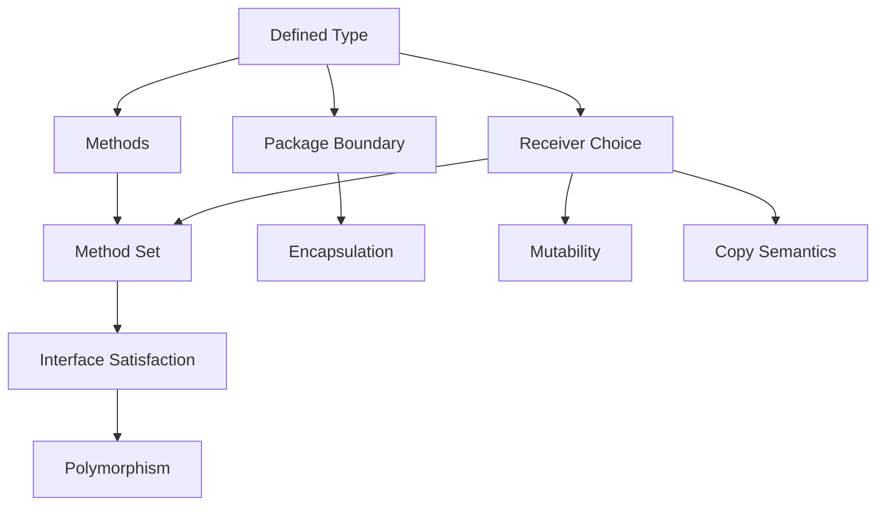
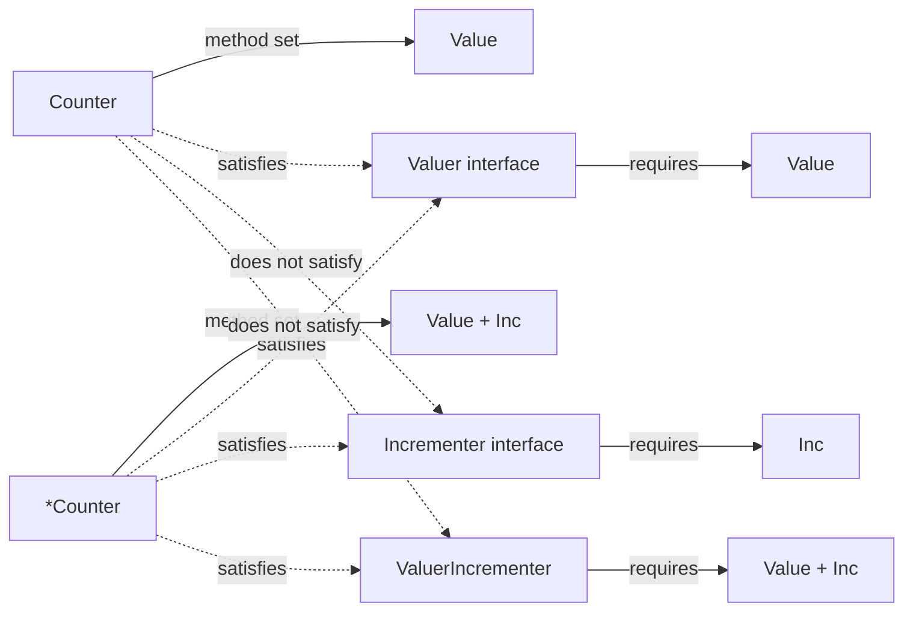
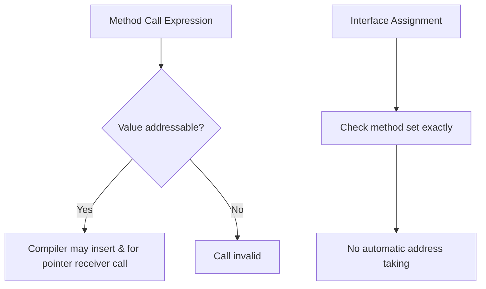
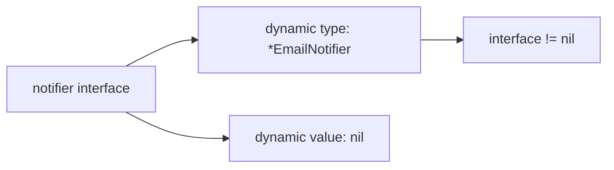
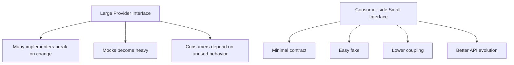
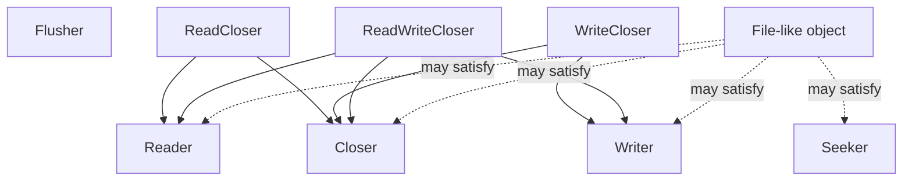
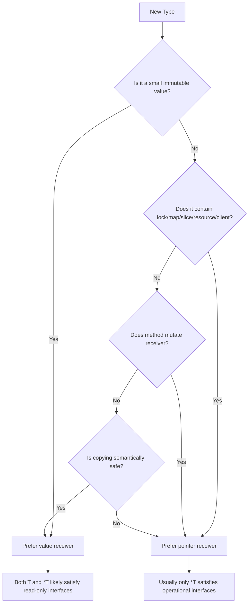
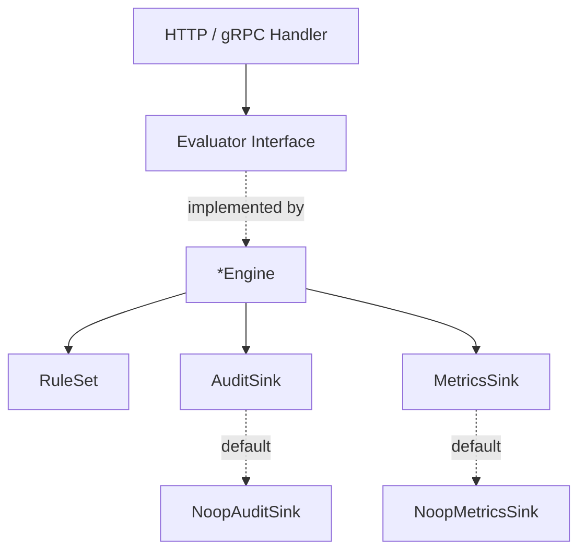
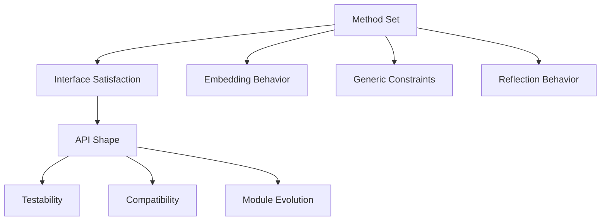
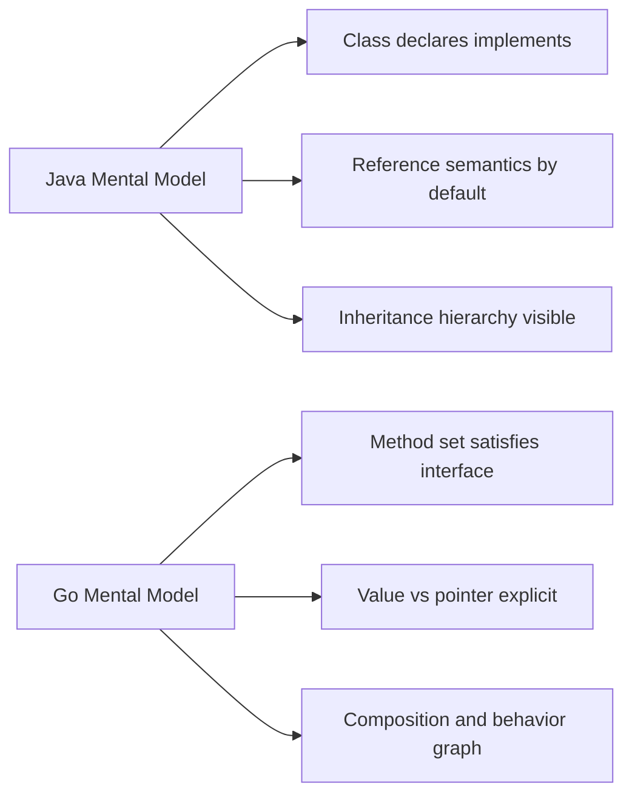

# learn-go-composition-oop-functional-reflection-codegen-modules-part-003.md

# Part 003 — Method Set Secara Formal: Value Receiver, Pointer Receiver, Addressability, dan Interface Satisfaction

> Seri: `learn-go-composition-oop-functional-reflection-codegen-modules`  
> Part: `003 / 030`  
> Target pembaca: Java software engineer yang ingin menguasai desain Go tingkat senior/principal  
> Fokus: memahami aturan method set Go secara formal dan konsekuensinya pada polymorphism, interface, API boundary, embedding, mutability, testing, dan compatibility.

---

## 0. Ringkasan Eksekutif

Di Java, sebuah class mengimplementasikan interface karena ia **mendeklarasikan** `implements InterfaceName`. Di Go, sebuah type mengimplementasikan interface jika **method set** dari type tersebut memenuhi method set interface. Tidak ada deklarasi eksplisit.

Karena itu, untuk menguasai OOP idiomatik di Go, Anda harus menguasai satu konsep inti:

> **Interface satisfaction di Go ditentukan oleh method set, bukan oleh niat programmer, bukan oleh nama type, dan bukan oleh inheritance hierarchy.**

Method set menjawab pertanyaan seperti:

- Apakah `User` mengimplementasikan `fmt.Stringer`?
- Apakah `*User` mengimplementasikan `io.Reader`?
- Mengapa `bytes.Buffer` sering dipakai sebagai pointer?
- Mengapa method pointer receiver tidak selalu bisa dipanggil dari value?
- Mengapa `[]T` value tidak bisa disimpan ke interface tertentu, tetapi `*T` bisa?
- Mengapa embedding kadang membuat promoted method masuk ke interface, kadang tidak?
- Mengapa perubahan receiver dari value ke pointer bisa menjadi breaking change?
- Mengapa interface kecil jauh lebih aman daripada interface gemuk?
- Mengapa nil pointer dalam interface sering menjadi jebakan?

Dalam Go, “object model” sebenarnya adalah kombinasi dari:



Part ini membangun fondasi formal untuk semua pembahasan berikutnya: interface design, embedding, functional option, reflection, code generation, dan module compatibility.

---

## 1. Problem Framing: Mengapa Method Set Penting?

Banyak engineer yang datang dari Java membawa model mental seperti ini:

```java
class FileUserRepository implements UserRepository {
    public User findByID(UserID id) { ... }
}
```

Di Java, hubungan antara concrete class dan interface terlihat eksplisit di source code. Compiler memeriksa apakah class memenuhi interface karena class menyatakan intent tersebut.

Di Go, bentuknya seperti ini:

```go
type UserRepository interface {
    FindByID(ctx context.Context, id UserID) (User, error)
}

type PostgresUserRepository struct {
    db *sql.DB
}

func (r *PostgresUserRepository) FindByID(ctx context.Context, id UserID) (User, error) {
    // ...
    return User{}, nil
}
```

Tidak ada keyword `implements`.

Compiler menyimpulkan:

```go
var _ UserRepository = (*PostgresUserRepository)(nil)
```

Pernyataan di atas sering dipakai sebagai compile-time assertion. Ia berarti:

> Pastikan `*PostgresUserRepository` memenuhi interface `UserRepository`.

Bukan `PostgresUserRepository`, melainkan `*PostgresUserRepository`.

Perbedaan ini penting.

Jika method-nya memiliki pointer receiver:

```go
func (r *PostgresUserRepository) FindByID(...) (...)
```

maka method tersebut ada pada method set `*PostgresUserRepository`, tetapi tidak pada method set `PostgresUserRepository`.

Akibatnya:

```go
var repo UserRepository

repo = &PostgresUserRepository{} // OK
repo = PostgresUserRepository{}  // Compile error
```

Inilah sumber banyak kebingungan awal.

Namun untuk engineer senior, ini bukan sekadar “aturan compiler”. Ini adalah alat desain:

- Apakah type boleh dicopy?
- Apakah method memodifikasi state?
- Apakah interface sebaiknya menerima value atau pointer?
- Apakah type aman untuk dipakai sebagai immutable value object?
- Apakah API Anda akan mudah dievolusi tanpa breaking change?
- Apakah embedding akan mengekspos method yang tidak sengaja?
- Apakah mock/fake menjadi natural atau dipaksakan?

---

## 2. Definisi Formal yang Harus Dipegang

Di Go, method adalah function dengan receiver.

```go
func (u User) FullName() string {
    return u.FirstName + " " + u.LastName
}
```

Receiver `u User` membuat `FullName` menjadi method dari defined type `User`.

```go
func (u *User) Rename(first, last string) {
    u.FirstName = first
    u.LastName = last
}
```

Receiver `u *User` membuat `Rename` menjadi method dari pointer type `*User`.

Secara praktis:

- method dengan receiver `T` tersedia pada method set `T` dan `*T`
- method dengan receiver `*T` hanya tersedia pada method set `*T`
- interface satisfaction menggunakan method set, bukan convenience call syntax

Tiga aturan ini harus menjadi refleks.

---

## 3. Method Set: T vs *T

Misalkan kita punya type berikut:

```go
type Counter struct {
    n int
}

func (c Counter) Value() int {
    return c.n
}

func (c *Counter) Inc() {
    c.n++
}
```

Maka method set-nya:

| Type | Method set |
|---|---|
| `Counter` | `Value()` |
| `*Counter` | `Value()`, `Inc()` |

Konsekuensinya:

```go
type Valuer interface {
    Value() int
}

type Incrementer interface {
    Inc()
}

type ValuerIncrementer interface {
    Value() int
    Inc()
}
```

Maka:

```go
var _ Valuer = Counter{}       // OK
var _ Valuer = (*Counter)(nil) // OK

var _ Incrementer = Counter{}       // Compile error
var _ Incrementer = (*Counter)(nil) // OK

var _ ValuerIncrementer = Counter{}       // Compile error
var _ ValuerIncrementer = (*Counter)(nil) // OK
```

Diagramnya:



---

## 4. Method Call Syntax vs Interface Satisfaction

Go punya convenience rule: jika value addressable, Anda boleh memanggil pointer receiver method dari value.

```go
var c Counter
c.Inc() // OK, compiler interprets as (&c).Inc()
```

Ini sering membuat orang salah menyimpulkan:

> “Kalau `Counter` bisa memanggil `Inc`, berarti `Counter` punya method `Inc`.”

Tidak.

`Counter` tidak punya `Inc` di method set-nya. Compiler hanya melakukan automatic address taking untuk method call jika value addressable.

Perbedaan ini sangat penting:

```go
var c Counter
c.Inc() // OK

var i Incrementer
// i = c // Compile error

i = &c // OK
```

Jadi ada dua mekanisme berbeda:



### 4.1 Addressable Value

Value addressable artinya compiler bisa mengambil alamatnya.

Addressable:

```go
var c Counter
c.Inc() // OK

s := struct{ C Counter }{}
s.C.Inc() // OK, field of addressable struct variable
```

Tidak addressable:

```go
Counter{}.Inc() // Compile error: cannot call pointer method on Counter literal

func NewCounter() Counter { return Counter{} }
NewCounter().Inc() // Compile error

m := map[string]Counter{"a": {}}
m["a"].Inc() // Compile error
```

Mengapa map element tidak addressable?

Karena Go map dapat memindahkan bucket internal. Jika alamat elemen map boleh diambil, pointer bisa menjadi invalid saat map tumbuh atau reorganisasi.

Solusinya:

```go
m := map[string]*Counter{"a": {}}
m["a"].Inc() // OK
```

Atau:

```go
m := map[string]Counter{"a": {}}
c := m["a"]
c.Inc()
m["a"] = c
```

---

## 5. Receiver Choice: Bukan Sekadar Mutability

Aturan umum yang sering diajarkan:

- gunakan value receiver jika method tidak memodifikasi receiver
- gunakan pointer receiver jika method memodifikasi receiver

Ini benar, tapi tidak lengkap.

Untuk desain produksi, receiver choice harus mempertimbangkan:

| Faktor | Value receiver | Pointer receiver |
|---|---|---|
| Mutasi state | Tidak cocok | Cocok |
| Ukuran struct besar | Bisa mahal karena copy | Lebih murah |
| Mengandung mutex | Berbahaya dicopy | Wajib pointer |
| Mengandung slice/map/pointer | Copy shallow, bisa membingungkan | Lebih eksplisit |
| Immutable value object | Cocok | Kadang overkill |
| Interface satisfaction | `T` dan `*T` satisfy | hanya `*T` satisfy |
| API future evolution | lebih fleksibel untuk value semantics | lebih aman untuk stateful object |
| Nil receiver handling | tidak bisa nil | bisa nil jika method dirancang |

### 5.1 Konsistensi Receiver

Jika sebagian method memakai value receiver dan sebagian pointer receiver, method set `T` dan `*T` berbeda.

Kadang ini disengaja.

Contoh:

```go
type Counter struct {
    n int
}

func (c Counter) Value() int { return c.n }
func (c *Counter) Inc()      { c.n++ }
```

Ini masuk akal: `Value` bisa dibaca dari value maupun pointer; `Inc` hanya untuk pointer.

Namun untuk type stateful, sering lebih baik semua method memakai pointer receiver agar tidak ada ilusi value semantics.

```go
type Cache struct {
    mu sync.Mutex
    m  map[string]string
}

func (c *Cache) Get(key string) (string, bool) { ... }
func (c *Cache) Set(key, value string) { ... }
func (c *Cache) Delete(key string) { ... }
```

Jangan begini:

```go
func (c Cache) Get(key string) (string, bool) { ... } // suspicious
func (c *Cache) Set(key, value string) { ... }
```

Karena `Cache` mengandung mutex/map dan secara semantik adalah object stateful. Value receiver membuat copy header/map/mutex dan menambah risiko bug.

---

## 6. Java Translation: Object Identity vs Value Semantics

Di Java, hampir semua object variable adalah reference.

```java
Counter c = new Counter();
Counter d = c;
d.inc();
System.out.println(c.value()); // berubah
```

Di Go, assignment struct adalah copy.

```go
c := Counter{}
d := c

d.Inc()
fmt.Println(c.Value()) // tidak berubah
fmt.Println(d.Value()) // berubah
```

Jika ingin shared identity:

```go
c := &Counter{}
d := c

d.Inc()
fmt.Println(c.Value()) // berubah
```

Ini bukan detail kecil. Ini menentukan model domain.

Untuk engineer Java, pertanyaan desainnya berubah dari:

> “Class ini punya method apa?”

menjadi:

> “Type ini merepresentasikan value yang bisa dicopy atau identity-bearing object yang harus dipakai lewat pointer?”

### 6.1 Domain Value Object

Contoh value object:

```go
type Money struct {
    amount   int64
    currency string
}

func NewMoney(amount int64, currency string) (Money, error) {
    if currency == "" {
        return Money{}, errors.New("currency is required")
    }
    return Money{amount: amount, currency: currency}, nil
}

func (m Money) Amount() int64     { return m.amount }
func (m Money) Currency() string  { return m.currency }
func (m Money) Add(other Money) (Money, error) {
    if m.currency != other.currency {
        return Money{}, errors.New("currency mismatch")
    }
    return Money{amount: m.amount + other.amount, currency: m.currency}, nil
}
```

`Money` cocok memakai value receiver karena:

- immutable secara API
- ukurannya kecil
- copy aman
- tidak punya identity mutable
- method menghasilkan value baru

### 6.2 Stateful Service/Object

Contoh identity-bearing object:

```go
type TokenCache struct {
    mu      sync.RWMutex
    entries map[string]Token
}

func NewTokenCache() *TokenCache {
    return &TokenCache{entries: make(map[string]Token)}
}

func (c *TokenCache) Get(key string) (Token, bool) {
    c.mu.RLock()
    defer c.mu.RUnlock()
    t, ok := c.entries[key]
    return t, ok
}

func (c *TokenCache) Put(key string, token Token) {
    c.mu.Lock()
    defer c.mu.Unlock()
    c.entries[key] = token
}
```

`TokenCache` harus pointer receiver karena:

- punya mutex
- punya mutable map
- object identity penting
- copy berbahaya
- interface satisfaction sebaiknya oleh `*TokenCache`, bukan `TokenCache`

---

## 7. Interface Satisfaction in Practice

Misalkan:

```go
type Store interface {
    Get(ctx context.Context, key string) ([]byte, error)
    Put(ctx context.Context, key string, value []byte) error
}

type MemoryStore struct {
    mu sync.RWMutex
    m  map[string][]byte
}

func NewMemoryStore() *MemoryStore {
    return &MemoryStore{m: make(map[string][]byte)}
}

func (s *MemoryStore) Get(ctx context.Context, key string) ([]byte, error) {
    s.mu.RLock()
    defer s.mu.RUnlock()

    v, ok := s.m[key]
    if !ok {
        return nil, ErrNotFound
    }

    out := append([]byte(nil), v...)
    return out, nil
}

func (s *MemoryStore) Put(ctx context.Context, key string, value []byte) error {
    s.mu.Lock()
    defer s.mu.Unlock()

    s.m[key] = append([]byte(nil), value...)
    return nil
}
```

Compile-time assertion:

```go
var _ Store = (*MemoryStore)(nil)
```

Ini lebih baik daripada:

```go
var _ Store = MemoryStore{}
```

Karena `MemoryStore` tidak aman dicopy dan method-nya pointer receiver.

### 7.1 Compile-Time Assertion Sebagai Dokumentasi Arsitektur

Assertion seperti ini bukan wajib, tetapi sangat berguna di production code:

```go
var _ Store = (*MemoryStore)(nil)
```

Ia berfungsi sebagai:

- guard saat refactor
- dokumentasi niat desain
- proteksi terhadap method signature drift
- sinyal bahwa interface tersebut memang sengaja dipenuhi

Namun jangan berlebihan.

Tidak semua type perlu assertion. Gunakan pada boundary penting:

- adapter external system
- repository implementation
- generated client/server implementation
- plugin implementation
- production implementation dari contract publik
- fake/test double yang harus memenuhi contract

---

## 8. Nil Pointer dan Interface Trap

Salah satu jebakan Go paling terkenal:

```go
type Notifier interface {
    Notify(message string) error
}

type EmailNotifier struct{}

func (n *EmailNotifier) Notify(message string) error {
    if n == nil {
        return errors.New("nil EmailNotifier")
    }
    return nil
}

var n *EmailNotifier = nil
var notifier Notifier = n

fmt.Println(notifier == nil) // false
```

Mengapa `notifier != nil`?

Karena interface value berisi dua komponen konseptual:

```text
(dynamic type, dynamic value)
```

Dalam contoh:

```text
(*EmailNotifier, nil)
```

Interface-nya tidak nil karena dynamic type-nya ada.

Diagram:



Nil interface yang benar-benar nil adalah:

```go
var notifier Notifier = nil
```

Konsekuensi desain:

- jangan return typed nil sebagai interface
- hati-hati pada function yang return interface
- gunakan concrete nil sebelum assign ke interface
- jika method pointer receiver boleh menerima nil receiver, dokumentasikan jelas

Contoh buruk:

```go
func NewNotifier(enabled bool) Notifier {
    var n *EmailNotifier
    if !enabled {
        return n // BAD: returns non-nil interface containing nil pointer
    }
    return &EmailNotifier{}
}
```

Contoh lebih aman:

```go
func NewNotifier(enabled bool) Notifier {
    if !enabled {
        return nil
    }
    return &EmailNotifier{}
}
```

Atau gunakan no-op implementation:

```go
type NoopNotifier struct{}

func (NoopNotifier) Notify(message string) error { return nil }

func NewNotifier(enabled bool) Notifier {
    if !enabled {
        return NoopNotifier{}
    }
    return &EmailNotifier{}
}
```

No-op object sering lebih aman daripada nil.

---

## 9. Method Set dan Embedding Preview

Embedding akan dibahas detail pada part 004, tetapi method set tidak bisa dipahami penuh tanpa preview.

```go
type Logger struct{}

func (Logger) Info(msg string) {}
func (*Logger) Debug(msg string) {}

type ServiceA struct {
    Logger
}

type ServiceB struct {
    *Logger
}
```

Secara umum:

- embedding `T` mempromosikan method tertentu ke method set outer type
- embedding `*T` punya efek lebih luas pada method promotion
- method set `ServiceA` dan `*ServiceA` bisa berbeda
- method set `ServiceB` dan `*ServiceB` bisa membuat outer type satisfy interface secara tidak sengaja

Inilah mengapa embedding adalah alat kuat tetapi harus dipakai hati-hati.

Jika Anda embed type dari package lain, Anda bisa tidak sengaja mengekspos method package tersebut sebagai API Anda.

```go
type MyBuffer struct {
    bytes.Buffer
}
```

`MyBuffer` sekarang mempromosikan banyak method `bytes.Buffer`. Ini mungkin diinginkan, mungkin juga bocor.

Pertanyaan desain:

> Apakah Anda ingin “is behaviorally compatible with buffer”, atau hanya ingin “uses a buffer internally”?

Jika hanya internal, gunakan named field:

```go
type MyBuffer struct {
    buf bytes.Buffer
}
```

---

## 10. Method Expression dan Method Value

Go memiliki dua konsep yang sering berguna dalam desain functional-style dan code generation.

### 10.1 Method Value

```go
c := &Counter{}
f := c.Inc
f()
f()
fmt.Println(c.Value()) // 2
```

`c.Inc` menghasilkan function yang sudah mengikat receiver.

Secara konseptual:

```go
func() { c.Inc() }
```

### 10.2 Method Expression

```go
f := (*Counter).Inc
c := &Counter{}
f(c)
```

`(*Counter).Inc` menghasilkan function yang receiver-nya menjadi parameter eksplisit.

Secara konseptual:

```go
func(c *Counter) { c.Inc() }
```

### 10.3 Mengapa Ini Penting?

Method value/expression berguna untuk:

- callback registry
- table-driven test
- middleware composition
- generic-like operation tanpa interface tambahan
- adapter function
- generated dispatch table
- reflection-free method binding di beberapa desain

Contoh:

```go
type Handler struct{}

func (h *Handler) Create(ctx context.Context, req Request) (Response, error) { ... }
func (h *Handler) Update(ctx context.Context, req Request) (Response, error) { ... }

var routes = map[string]func(*Handler, context.Context, Request) (Response, error){
    "create": (*Handler).Create,
    "update": (*Handler).Update,
}
```

Ini sering lebih eksplisit dan lebih murah daripada reflection.

---

## 11. Pointer Receiver pada Nil Receiver

Pointer receiver method bisa dipanggil dengan nil receiver jika method-nya memang menangani nil.

```go
type Node struct {
    Value string
    Next  *Node
}

func (n *Node) Len() int {
    if n == nil {
        return 0
    }
    return 1 + n.Next.Len()
}
```

Pemakaian:

```go
var n *Node
fmt.Println(n.Len()) // 0
```

Ini sah.

Namun jangan menjadikan ini default.

Nil receiver handling cocok untuk:

- recursive structure
- optional object dengan natural zero behavior
- no-op semantic yang jelas
- compatibility dengan legacy API

Tidak cocok untuk:

- service object yang wajib diinisialisasi
- repository/client yang butuh dependency
- object dengan invariant kuat
- concurrency primitive

Contoh yang buruk:

```go
type PaymentClient struct {
    http *http.Client
}

func (c *PaymentClient) Charge(ctx context.Context, req ChargeRequest) error {
    if c == nil {
        return nil // BAD: silently drops payment
    }
    // ...
    return nil
}
```

Untuk dependency penting, fail fast lebih baik.

```go
func (c *PaymentClient) Charge(ctx context.Context, req ChargeRequest) error {
    if c == nil {
        return errors.New("nil PaymentClient")
    }
    // ...
    return nil
}
```

Lebih baik lagi: desain constructor yang menjamin non-nil dependency.

---

## 12. Receiver dan API Compatibility

Perubahan receiver bisa menjadi breaking change.

Misalnya versi 1:

```go
type ID struct {
    value string
}

func (id ID) String() string { return id.value }
```

Maka `ID` dan `*ID` sama-sama satisfy:

```go
type Stringer interface {
    String() string
}
```

Jika di versi 2 Anda ubah:

```go
func (id *ID) String() string { return id.value }
```

Maka `ID` tidak lagi satisfy `Stringer`.

Code consumer yang sebelumnya valid menjadi gagal compile:

```go
var s fmt.Stringer = ID{value: "abc"} // now broken
```

Jadi receiver choice adalah bagian dari public API.

### 12.1 Compatibility Rule

Untuk exported type dan exported method:

> Jangan ubah receiver dari value ke pointer atau sebaliknya tanpa memperlakukan itu sebagai breaking API change.

Meskipun method name dan signature parameter terlihat sama, method set berubah.

---

## 13. Interface Design Berdasarkan Method Set

Karena interface satisfaction implicit, interface besar menciptakan coupling tersembunyi.

Contoh buruk:

```go
type UserService interface {
    Create(ctx context.Context, input CreateUserInput) (User, error)
    Update(ctx context.Context, input UpdateUserInput) (User, error)
    Delete(ctx context.Context, id UserID) error
    FindByID(ctx context.Context, id UserID) (User, error)
    FindByEmail(ctx context.Context, email string) (User, error)
    List(ctx context.Context, filter UserFilter) ([]User, error)
    Suspend(ctx context.Context, id UserID) error
    Activate(ctx context.Context, id UserID) error
}
```

Masalah:

- fake test harus implement semua method
- sulit reuse sebagian capability
- setiap penambahan method adalah breaking change untuk semua implementer
- interface menjadi “role god object”
- tidak jelas consumer butuh behavior mana

Lebih baik consumer-side interface:

```go
type UserFinder interface {
    FindByID(ctx context.Context, id UserID) (User, error)
}

type UserCreator interface {
    Create(ctx context.Context, input CreateUserInput) (User, error)
}
```

Consumer mendefinisikan kebutuhannya:

```go
type SendWelcomeEmailHandler struct {
    users UserFinder
    mail  Mailer
}
```

Ini membuat method set kecil dan satisfaction mudah.

Diagram:



---

## 14. Method Set dan Generic Constraints

Generics akan dibahas lagi di part 008, tetapi method set juga relevan untuk constraints.

```go
type Stringer interface {
    String() string
}

func PrintAll[T Stringer](items []T) {
    for _, item := range items {
        fmt.Println(item.String())
    }
}
```

Jika:

```go
type ID struct{ value string }

func (id ID) String() string { return id.value }
```

Maka:

```go
ids := []ID{{"a"}, {"b"}}
PrintAll(ids) // OK
```

Jika method-nya pointer receiver:

```go
func (id *ID) String() string { return id.value }
```

Maka:

```go
ids := []ID{{"a"}, {"b"}}
PrintAll(ids) // Compile error
```

Tetapi:

```go
ids := []*ID{{"a"}, {"b"}}
PrintAll(ids) // OK
```

Ini penting untuk generic collection API.

Jika Anda ingin `[]T` bisa dipakai secara natural, value receiver sering lebih ergonomis untuk immutable value object.

Namun jangan memaksa value receiver hanya demi generics jika type stateful atau expensive to copy.

---

## 15. Method Set dan Reflection

Reflection juga melihat method set.

Contoh:

```go
t := reflect.TypeOf(Counter{})
fmt.Println(t.NumMethod())
```

Ini hanya melihat exported method dari method set `Counter` jika dipakai dari package berbeda.

```go
t := reflect.TypeOf(&Counter{})
fmt.Println(t.NumMethod())
```

Ini melihat method set `*Counter`, termasuk method value receiver dan pointer receiver.

Konsekuensi:

- framework reflection-based sering butuh pointer
- validator/mapper bisa gagal menemukan setter-like method jika value diberikan
- code generation yang membaca method harus sadar `T` vs `*T`
- dynamic dispatch via reflection harus memperhatikan exported/unexported method

Karena itu, API reflection-heavy biasanya meminta pointer:

```go
func Decode(input []byte, out any) error
```

Pemakaiannya:

```go
var user User
err := Decode(data, &user)
```

Bukan:

```go
err := Decode(data, user) // tidak bisa mutate caller's value
```

---

## 16. Design Pattern: Capability Interface

Method set mendorong desain berbasis capability.

Misalnya:

```go
type Reader interface {
    Read(p []byte) (n int, err error)
}

type Writer interface {
    Write(p []byte) (n int, err error)
}

type Closer interface {
    Close() error
}

type ReadCloser interface {
    Reader
    Closer
}

type ReadWriteCloser interface {
    Reader
    Writer
    Closer
}
```

Ini adalah composition di level interface.

Daripada membuat hierarchy:

```text
AbstractStream
  InputStream
  OutputStream
  FileInputStream
  BufferedInputStream
```

Go cenderung membuat capability graph:



Ini lebih fleksibel daripada inheritance tree.

---

## 17. Design Pattern: Pointer-Only Implementation

Kadang Anda sengaja ingin hanya pointer yang satisfy interface.

Contoh:

```go
type Transaction interface {
    Commit() error
    Rollback() error
}

type tx struct {
    done bool
}

func (t *tx) Commit() error {
    if t.done {
        return errors.New("transaction already completed")
    }
    t.done = true
    return nil
}

func (t *tx) Rollback() error {
    if t.done {
        return errors.New("transaction already completed")
    }
    t.done = true
    return nil
}
```

`tx` tidak boleh dicopy secara semantik. Pointer-only method set membantu.

Factory:

```go
func Begin() Transaction {
    return &tx{}
}
```

Karena concrete type `tx` unexported, consumer tidak bisa membuat copy langsung.

Ini menggabungkan:

- unexported concrete type
- exported interface atau function
- pointer receiver
- package boundary
- invariant enforcement

---

## 18. Design Pattern: Value Object with Behavior

Sebaliknya, untuk value object:

```go
type EmailAddress struct {
    value string
}

func ParseEmailAddress(s string) (EmailAddress, error) {
    if !strings.Contains(s, "@") {
        return EmailAddress{}, errors.New("invalid email address")
    }
    return EmailAddress{value: strings.ToLower(s)}, nil
}

func (e EmailAddress) String() string { return e.value }
func (e EmailAddress) Domain() string {
    _, domain, _ := strings.Cut(e.value, "@")
    return domain
}
func (e EmailAddress) Equal(other EmailAddress) bool {
    return e.value == other.value
}
```

Di sini value receiver benar.

Keuntungannya:

- mudah dipakai di map key jika comparable
- mudah disimpan di slice
- tidak perlu heap allocation
- interface satisfaction natural untuk `T` dan `*T`
- cocok untuk domain invariant

---

## 19. Anti-Pattern: Interface Satisfaction Tidak Disengaja

Karena satisfaction implicit, Anda bisa tidak sengaja memenuhi interface.

```go
type Closer interface {
    Close() error
}

type Report struct{}

func (r Report) Close() error {
    // maybe means "close report period"
    return nil
}
```

`Report` sekarang satisfy `io.Closer`-like interface.

Ini tidak selalu masalah, tetapi method name generik bisa menciptakan ambiguity semantik.

Nama method harus merepresentasikan behavior yang benar-benar kompatibel.

Jika `Close` berarti close resource, OK.

Jika `Close` berarti close business period, mungkin lebih baik:

```go
func (r Report) ClosePeriod() error
```

Atau:

```go
func (r Report) Finalize() error
```

Structural typing memberi fleksibilitas, tetapi menuntut disiplin semantik.

---

## 20. Anti-Pattern: Returning Interface Too Early

Java engineer sering membuat interface di awal karena terbiasa dengan DI framework.

```go
type UserRepository interface {
    FindByID(ctx context.Context, id UserID) (User, error)
    Save(ctx context.Context, user User) error
}

func NewUserRepository(db *sql.DB) UserRepository {
    return &postgresUserRepository{db: db}
}
```

Ini kadang benar, tetapi sering terlalu cepat.

Masalah:

- consumer kehilangan akses ke concrete-specific configuration jika dibutuhkan
- interface ditempatkan di provider package, bukan consumer package
- testing bisa tetap dilakukan dengan fake tanpa provider-owned interface
- API evolution lebih kaku jika interface diexport

Alternatif:

```go
type PostgresUserRepository struct {
    db *sql.DB
}

func NewPostgresUserRepository(db *sql.DB) *PostgresUserRepository {
    return &PostgresUserRepository{db: db}
}

func (r *PostgresUserRepository) FindByID(ctx context.Context, id UserID) (User, error) { ... }
func (r *PostgresUserRepository) Save(ctx context.Context, user User) error { ... }
```

Consumer yang butuh interface mendefinisikan sendiri:

```go
type userFinder interface {
    FindByID(ctx context.Context, id UserID) (User, error)
}
```

Rule of thumb:

> Accept interfaces, return concrete types.

Bukan hukum absolut, tetapi default yang baik.

---

## 21. Anti-Pattern: Receiver Tidak Konsisten Karena Kebiasaan

Contoh:

```go
type Config struct {
    values map[string]string
}

func (c Config) Get(key string) string {
    return c.values[key]
}

func (c *Config) Set(key, value string) {
    c.values[key] = value
}
```

Ini mungkin bekerja, tetapi perlu hati-hati. `Config` mengandung map. Value receiver `Get` meng-copy map header, tetapi underlying map tetap shared.

Artinya ini bukan immutable value.

Jika ingin mutable config:

```go
func (c *Config) Get(key string) string
func (c *Config) Set(key, value string)
```

Jika ingin immutable config:

```go
type Config struct {
    values map[string]string
}

func NewConfig(values map[string]string) Config {
    copied := make(map[string]string, len(values))
    for k, v := range values {
        copied[k] = v
    }
    return Config{values: copied}
}

func (c Config) Get(key string) string {
    return c.values[key]
}

func (c Config) With(key, value string) Config {
    copied := make(map[string]string, len(c.values)+1)
    for k, v := range c.values {
        copied[k] = v
    }
    copied[key] = value
    return Config{values: copied}
}
```

Receiver choice harus mengikuti semantic model, bukan kebiasaan.

---

## 22. Anti-Pattern: Copying Types with Locks

Ini sangat penting.

```go
type SafeCounter struct {
    mu sync.Mutex
    n  int
}

func (c SafeCounter) Value() int {
    c.mu.Lock()
    defer c.mu.Unlock()
    return c.n
}
```

Ini salah secara desain. `Value` meng-copy mutex. Lock pada copy bukan lock pada original.

Benar:

```go
func (c *SafeCounter) Value() int {
    c.mu.Lock()
    defer c.mu.Unlock()
    return c.n
}
```

Untuk type yang mengandung:

- `sync.Mutex`
- `sync.RWMutex`
- `sync.Once`
- `sync.WaitGroup`
- atomic fields dengan identity semantics
- file/socket/client handle
- mutable map/slice dengan invariant

biasanya gunakan pointer receiver dan hindari copy.

Tambahkan komentar jika perlu:

```go
type SafeCounter struct {
    _ noCopy
    mu sync.Mutex
    n  int
}
```

`noCopy` pattern sering digunakan bersama `go vet` copylocks analysis, tetapi harus diterapkan dengan pemahaman, bukan sebagai ritual.

---

## 23. Practical Decision Framework

Saat mendesain type baru, tanyakan berurutan:



### 23.1 Receiver Decision Table

| Situation | Recommended receiver | Reason |
|---|---|---|
| Small immutable domain type | value | copy safe, ergonomic |
| Numeric/string wrapper | value | value semantics |
| Struct with mutex | pointer | copying unsafe |
| Struct with mutable map | usually pointer | shared underlying state confusing |
| Struct with large fields | pointer | avoid copy cost |
| Service/client/repository | pointer | identity + dependencies |
| Builder | pointer or immutable value | depends on model |
| Config object immutable after construction | value possible | but deep-copy mutable fields |
| Method mutates receiver | pointer | required for mutation |
| Method must handle nil receiver | pointer | only pointer can be nil |

---

## 24. Production Design Checklist

Gunakan checklist ini saat code review.

### 24.1 Type Semantics

- Apakah type ini value object atau identity-bearing object?
- Apakah assignment/copy type ini aman?
- Apakah type mengandung lock, map, slice, pointer, file handle, network client, atau external resource?
- Apakah zero value valid?
- Apakah constructor wajib untuk menjaga invariant?

### 24.2 Receiver Choice

- Apakah value receiver menyebabkan copy besar?
- Apakah pointer receiver membuat interface satisfaction hanya berlaku untuk `*T`?
- Apakah receiver konsisten dengan semantic model?
- Apakah perubahan receiver akan memecahkan public API?
- Apakah nil receiver mungkin terjadi? Jika ya, apakah behavior-nya jelas?

### 24.3 Interface Satisfaction

- Apakah interface didefinisikan di sisi consumer?
- Apakah interface terlalu besar?
- Apakah compile-time assertion diperlukan?
- Apakah concrete type secara tidak sengaja satisfy interface lain?
- Apakah fake/test double mudah dibuat?

### 24.4 Embedding

- Apakah embedding mengekspos promoted method sebagai API publik?
- Apakah named field lebih aman?
- Apakah embedded pointer bisa nil?
- Apakah promoted method menyebabkan interface satisfaction tidak sengaja?

### 24.5 Compatibility

- Apakah exported method receiver sudah stabil?
- Apakah menambah method ke exported interface akan memecahkan implementer?
- Apakah mengubah value receiver ke pointer receiver adalah breaking change?
- Apakah interface return type mengunci evolusi API?

---

## 25. Case Study: Designing a Policy Engine Boundary

Misalkan kita membangun authorization policy engine.

Java-style mungkin seperti ini:

```java
interface PolicyEngine {
    Decision evaluate(RequestContext ctx, Subject subject, Resource resource, Action action);
}

abstract class BasePolicyEngine implements PolicyEngine {
    protected AuditLogger auditLogger;
    protected Metrics metrics;

    protected abstract Decision doEvaluate(...);
}
```

Di Go, kita mulai dari behavior kecil.

```go
type Evaluator interface {
    Evaluate(ctx context.Context, input EvaluationInput) (Decision, error)
}

type AuditSink interface {
    RecordPolicyEvaluation(ctx context.Context, event PolicyEvaluationEvent) error
}

type MetricsSink interface {
    CountPolicyDecision(ctx context.Context, decision Decision)
}
```

Concrete engine:

```go
type Engine struct {
    rules   RuleSet
    audit   AuditSink
    metrics MetricsSink
}

func NewEngine(rules RuleSet, audit AuditSink, metrics MetricsSink) *Engine {
    if audit == nil {
        audit = NoopAuditSink{}
    }
    if metrics == nil {
        metrics = NoopMetricsSink{}
    }
    return &Engine{rules: rules, audit: audit, metrics: metrics}
}

func (e *Engine) Evaluate(ctx context.Context, input EvaluationInput) (Decision, error) {
    if e == nil {
        return Decision{}, errors.New("nil policy engine")
    }

    decision, err := e.rules.Evaluate(input)
    if err != nil {
        return Decision{}, err
    }

    _ = e.audit.RecordPolicyEvaluation(ctx, PolicyEvaluationEvent{
        Input:    input,
        Decision: decision,
    })
    e.metrics.CountPolicyDecision(ctx, decision)

    return decision, nil
}
```

Compile-time assertion:

```go
var _ Evaluator = (*Engine)(nil)
```

No-op implementations:

```go
type NoopAuditSink struct{}

func (NoopAuditSink) RecordPolicyEvaluation(ctx context.Context, event PolicyEvaluationEvent) error {
    return nil
}

type NoopMetricsSink struct{}

func (NoopMetricsSink) CountPolicyDecision(ctx context.Context, decision Decision) {}
```

Design notes:

- `Engine` pointer receiver karena stateful dependency object.
- `NoopAuditSink` value receiver karena stateless value.
- `Evaluator` kecil dan consumer-friendly.
- Tidak ada abstract base class.
- Cross-cutting concern dikomposisi sebagai dependency.
- Nil dependency diganti no-op agar runtime path lebih aman.

Diagram:



---

## 26. Testing Implication

Small interface + method set membuat testing lebih sederhana.

```go
type fakeEvaluator struct {
    decision Decision
    err      error
}

func (f fakeEvaluator) Evaluate(ctx context.Context, input EvaluationInput) (Decision, error) {
    return f.decision, f.err
}
```

Karena fake stateless/simple, value receiver cukup.

Test:

```go
func TestHandlerAllowsRequest(t *testing.T) {
    h := Handler{
        evaluator: fakeEvaluator{decision: Decision{Allowed: true}},
    }

    // execute handler
}
```

Jika interface terlalu besar, fake menjadi berat.

```go
type HugePolicyService interface {
    Evaluate(...)
    Reload(...)
    Validate(...)
    Export(...)
    Import(...)
    Explain(...)
    DryRun(...)
}
```

Setiap test yang hanya butuh `Evaluate` dipaksa implement semua method. Ini sinyal interface salah tempat atau terlalu besar.

---

## 27. Package Boundary dan Unexported Methods

Interface bisa memiliki unexported method.

```go
package engine

type sealed interface {
    evaluate()
}
```

Interface dengan unexported method dari package tertentu tidak bisa diimplementasikan oleh package lain, karena package lain tidak bisa mendeklarasikan method dengan identity package yang sama.

Pattern ini bisa dipakai untuk sealed-like behavior, terutama pada constraints/internal API.

Namun gunakan dengan hati-hati.

Untuk public API, sealed interface bisa membuat consumer frustrasi jika tidak jelas alasannya.

Cocok untuk:

- closed set internal variants
- generic constraints internal
- marker untuk generated code
- preventing external implementation when invariants cannot be guaranteed

Tidak cocok untuk:

- plugin interface publik
- extension point
- mocking boundary consumer

---

## 28. Advanced Edge Cases

### 28.1 Type Alias Tidak Membuat Method Set Baru

```go
type MyString = string
```

`MyString` adalah alias, bukan defined type baru. Anda tidak bisa menambahkan method ke alias non-local/builtin seperti itu.

```go
type UserID string

func (id UserID) String() string { return string(id) }
```

`UserID` adalah defined type dan bisa punya method.

### 28.2 Method Tidak Bisa Ditambahkan ke Type dari Package Lain

Tidak bisa:

```go
func (t time.Time) MyFormat() string { ... } // invalid
```

Solusi:

```go
type MyTime struct {
    time.Time
}
```

atau:

```go
type MyTime time.Time
```

Pilih berdasarkan apakah Anda ingin preserve method `time.Time` via embedding atau membuat domain type baru.

### 28.3 Pointer to Interface Hampir Selalu Salah

```go
func Use(r *io.Reader) // suspicious
```

Interface value sudah seperti descriptor dynamic type/value. Pointer ke interface jarang diperlukan.

Biasanya yang benar:

```go
func Use(r io.Reader)
```

Pointer ke concrete type yang implement interface boleh:

```go
var b bytes.Buffer
Use(&b)
```

### 28.4 Interface Containing Pointer to Concrete Type Is Usually Too Specific

```go
type Bad interface {
    Use(*Concrete)
}
```

Ini mengurangi substitutability. Kadang valid, tapi sering menandakan interface tidak berada di boundary yang tepat.

---

## 29. Common Compiler Errors dan Cara Membacanya

### 29.1 “does not implement interface (method has pointer receiver)”

Contoh:

```go
type Closer interface { Close() error }

type File struct{}
func (f *File) Close() error { return nil }

var _ Closer = File{}
```

Error berarti method set `File` tidak punya `Close`; hanya `*File` yang punya.

Fix:

```go
var _ Closer = (*File)(nil)
```

Atau ubah receiver jika memang value semantics:

```go
func (f File) Close() error { return nil }
```

Tapi untuk resource seperti file, pointer receiver lebih masuk akal.

### 29.2 “cannot call pointer method on literal”

```go
Counter{}.Inc()
```

Literal result tidak addressable untuk call seperti ini.

Fix:

```go
c := Counter{}
c.Inc()
```

atau:

```go
(&Counter{}).Inc()
```

### 29.3 “cannot assign to struct field in map”

```go
m := map[string]Counter{"a": {}}
m["a"].n++
```

Map element tidak addressable.

Fix:

```go
c := m["a"]
c.n++
m["a"] = c
```

atau simpan pointer:

```go
m := map[string]*Counter{"a": {}}
m["a"].Inc()
```

---

## 30. Engineering Heuristics

### 30.1 Default Heuristics

- Untuk domain value kecil: value receiver.
- Untuk service/repository/client/cache: pointer receiver.
- Untuk type dengan lock: pointer receiver.
- Untuk type dengan mutable internal state: pointer receiver.
- Untuk no-op/stateless implementation: value receiver.
- Untuk exported type: treat receiver choice as API.
- Untuk interface: kecil, consumer-side, behavior-specific.
- Untuk compile-time assertion: gunakan di boundary penting.

### 30.2 Red Flags

- Interface besar di provider package.
- `*Interface` sebagai parameter.
- Value receiver pada struct dengan mutex.
- Receiver campur tanpa alasan semantic.
- Embedding type besar hanya untuk reuse satu method.
- Return typed nil sebagai interface.
- Pointer receiver untuk tiny immutable value object tanpa alasan.
- Value receiver pada object yang memegang resource.
- Method name terlalu generik sehingga satisfy interface tak sengaja.

---

## 31. Mini Lab: Predict the Method Set

### 31.1 Lab A

```go
type A struct{}

func (A) X() {}
func (*A) Y() {}
```

Pertanyaan:

```go
type IX interface{ X() }
type IY interface{ Y() }
type IXY interface{ X(); Y() }
```

Mana yang valid?

```go
var _ IX = A{}
var _ IX = (*A)(nil)
var _ IY = A{}
var _ IY = (*A)(nil)
var _ IXY = A{}
var _ IXY = (*A)(nil)
```

Jawaban:

```go
var _ IX = A{}          // OK
var _ IX = (*A)(nil)    // OK
var _ IY = A{}          // error
var _ IY = (*A)(nil)    // OK
var _ IXY = A{}         // error
var _ IXY = (*A)(nil)   // OK
```

### 31.2 Lab B

```go
type B struct {
    items []string
}

func (b B) Add(s string) {
    b.items = append(b.items, s)
}
```

Apakah `Add` memodifikasi caller?

Jawaban: tidak konsisten/berbahaya.

Receiver `b B` meng-copy slice header. `append` bisa menulis ke backing array lama jika capacity cukup, tetapi update length hanya terjadi pada copy. Jika append allocate backing array baru, caller tidak melihat perubahan. Ini desain buruk.

Gunakan pointer receiver:

```go
func (b *B) Add(s string) {
    b.items = append(b.items, s)
}
```

Atau immutable style:

```go
func (b B) With(s string) B {
    out := B{items: append([]string(nil), b.items...)}
    out.items = append(out.items, s)
    return out
}
```

### 31.3 Lab C

```go
type C struct{}

func (c *C) Do() {}

func NewC() C { return C{} }

NewC().Do()
```

Valid?

Tidak. Return value dari function tidak addressable untuk automatic address taking.

Fix:

```go
c := NewC()
c.Do()
```

atau:

```go
func NewC() *C { return &C{} }
```

---

## 32. How This Connects to Later Parts

Part ini menjadi fondasi untuk:

- Part 004: struct embedding dan promoted method.
- Part 005: delegation, wrapper, decorator, facade.
- Part 006: interface sebagai behavioral contract.
- Part 007: structural typing dan API evolution.
- Part 008: generic constraints dan type sets.
- Part 015-018: reflection, generics, dan code generation decision framework.
- Part 024-030: package/module compatibility dan large-scale API governance.

Method set adalah low-level rule, tetapi efeknya high-level:



---

## 33. Final Mental Model

Pegang model ini:

> **Go tidak bertanya “type ini extends/implements siapa?” Go bertanya “method set type ini berisi method apa?”**

Dari situ:

- polymorphism muncul dari method set
- interface satisfaction terjadi implicit
- receiver choice menentukan method set
- addressability hanya membantu method call, bukan interface assignment
- pointer receiver membatasi satisfaction ke `*T`
- value receiver membuat method tersedia untuk `T` dan `*T`
- embedding dapat mempromosikan method dan mengubah method set outer type
- receiver adalah bagian dari public API compatibility

Untuk engineer Java, ini adalah salah satu pergeseran terbesar:



Jika Anda menguasai method set, banyak desain Go yang tadinya terasa “terlalu implicit” akan menjadi sangat deterministik.

---

## 34. Referensi Resmi

- Go Language Specification — Method declarations, method sets, interface types, assignability.  
  https://go.dev/ref/spec
- Effective Go — Methods, interfaces, embedding, pointer vs value receiver guidance.  
  https://go.dev/doc/effective_go
- Go Blog — Laws of Reflection.  
  https://go.dev/blog/laws-of-reflection
- `reflect` package documentation.  
  https://pkg.go.dev/reflect
- Go Modules Reference.  
  https://go.dev/ref/mod

---

## 35. Status Seri

Seri belum selesai.

Progress saat ini:

- [x] Part 000 — Peta seri, mental model, scope, dan cara belajar efisien
- [x] Part 001 — Go vs Java object model
- [x] Part 002 — Defined type, alias, receiver, method, dan desain API
- [x] Part 003 — Method set formal, receiver, addressability, dan interface satisfaction
- [ ] Part 004 — Struct embedding: promoted fields/methods, shadowing, ambiguity, dan desain composition yang aman

<!-- NAVIGATION_FOOTER -->
<div class="page-nav">
<a href="./learn-go-composition-oop-functional-reflection-codegen-modules-part-002.md">⬅️ Part 002 — Defined Type, Alias, Receiver, Method, dan Konsekuensi Desain API</a>
<a href="./index.md">📚 Kategori</a>
<a href="../../index.md">🏠 Home</a>
<a href="./learn-go-composition-oop-functional-reflection-codegen-modules-part-004.md">Part 004 — Struct Embedding: Promoted Fields/Methods, Shadowing, Ambiguity, dan Composition yang Aman ➡️</a>
</div>
