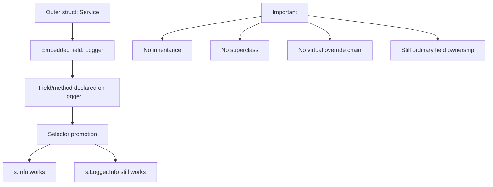
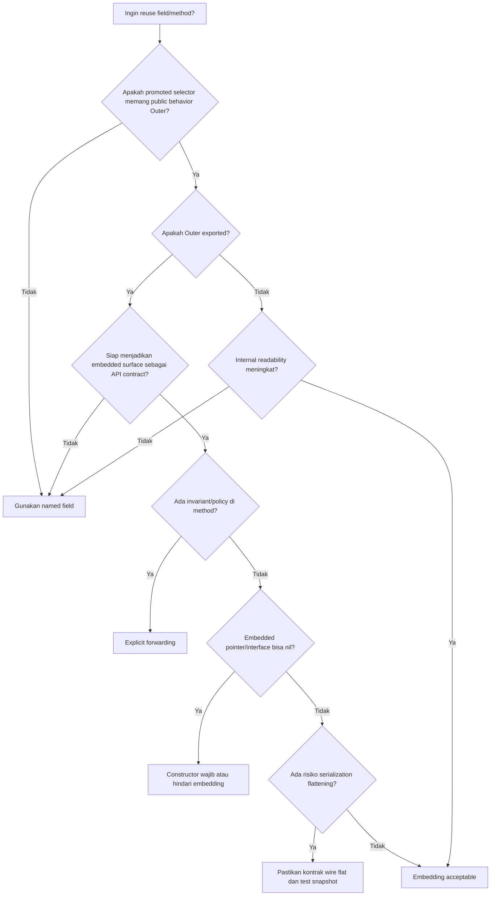

# learn-go-composition-oop-functional-reflection-codegen-modules-part-004.md

# Part 004 — Struct Embedding: Promoted Fields/Methods, Shadowing, Ambiguity, dan Composition yang Aman

> Seri: `learn-go-composition-oop-functional-reflection-codegen-modules`  
> Part: `004 / 030`  
> Target pembaca: Java software engineer yang ingin menguasai Go composition design secara production-grade  
> Fokus: struct embedding sebagai mekanisme composition, bukan inheritance

---

## 0. Posisi Part Ini dalam Seri

Kita sudah membahas:

- **Part 001** — pergeseran mental model dari Java class hierarchy ke Go behavior composition.
- **Part 002** — defined type, alias, receiver, method, dan efeknya terhadap desain API.
- **Part 003** — method set formal: value receiver, pointer receiver, addressability, dan interface satisfaction.

Part ini masuk ke salah satu fitur Go yang paling sering disalahpahami oleh engineer dari background Java/C#/TypeScript:

> **Struct embedding terlihat seperti inheritance, tetapi bukan inheritance.**

Embedding adalah mekanisme language-level untuk **composition + promotion**, bukan subtype inheritance.

Kalau digunakan dengan benar, embedding bisa menghasilkan API yang ringkas, composable, dan idiomatic.
Kalau digunakan secara serampangan, embedding akan membuat API bocor, method tak sengaja terekspos, invariant melemah, dan coupling sulit dikendalikan.

---

## 1. Tujuan Pembelajaran

Setelah menyelesaikan part ini, Anda harus mampu:

1. Memahami apa itu embedded field secara formal.
2. Membedakan embedding dari inheritance.
3. Menjelaskan promoted field dan promoted method.
4. Memahami aturan selector resolution: shallowest depth wins, ambiguity, shadowing.
5. Menjelaskan perbedaan embedding `T` vs `*T`.
6. Menilai efek embedding terhadap method set `S` dan `*S`.
7. Menghindari pseudo-inheritance yang rapuh.
8. Menggunakan embedding untuk composition yang aman.
9. Mendesain API package yang tidak bocor akibat promoted method.
10. Membuat keputusan kapan harus embed, kapan harus memakai named field + forwarding eksplisit.

---

## 2. Problem Framing: Kenapa Struct Embedding Penting?

Di Java, reuse behavior sering dilakukan dengan:

```java
abstract class BaseService {
    protected final Logger logger;

    protected void audit(String event) { ... }
}

final class OrderService extends BaseService {
    void approve(Order order) {
        audit("order.approve");
    }
}
```

Java memberikan reuse lewat inheritance. Tetapi inheritance membawa banyak konsekuensi:

- subclass bergantung pada detail superclass;
- protected state memperlemah encapsulation;
- hierarchy menjadi sulit diubah;
- behavior reuse bercampur dengan subtype relation;
- abstract base class sering berubah menjadi dumping ground.

Go tidak punya class inheritance. Go memilih:

- struct untuk data composition;
- method untuk behavior;
- interface untuk behavior contract;
- embedding untuk promotion;
- package boundary untuk encapsulation;
- explicit forwarding bila invariant perlu dikontrol.

Di sinilah embedding muncul.

Embedding sering terlihat menggoda:

```go
type BaseService struct {
    Logger *slog.Logger
}

func (b *BaseService) Audit(event string) {
    b.Logger.Info(event)
}

type OrderService struct {
    *BaseService
}

func (s *OrderService) Approve(order Order) {
    s.Audit("order.approve")
}
```

Ini terlihat seperti inheritance. Tetapi sebenarnya `OrderService` **tidak extends** `BaseService`. Ia hanya memiliki field embedded `*BaseService`, dan Go memperbolehkan selector `s.Audit(...)` sebagai shorthand untuk `s.BaseService.Audit(...)`.

Perbedaannya sangat penting.

---

## 3. Mental Model Utama

Gunakan mental model ini:

```text
Embedding = field ownership + selector promotion
Inheritance = subtype hierarchy + override dispatch + inherited state contract
```

Go embedding tidak memberikan:

- superclass;
- subclass;
- `super`;
- protected member;
- virtual override semantics seperti Java;
- constructor chaining;
- Liskov subtype hierarchy otomatis;
- inheritance visibility model.

Go embedding memberikan:

- field tanpa explicit field name dalam declaration;
- promoted fields;
- promoted methods;
- selector shorthand;
- method set propagation tertentu;
- composition ergonomics.

Dengan kata lain:

> Embedding adalah cara membuat bagian internal sebuah struct bisa diakses seolah-olah berada di outer struct, tetapi bagian itu tetap field biasa.

---

## 4. Embedded Field Secara Formal

Struct biasa:

```go
type User struct {
    ID   string
    Name string
}

type AuditEnvelope struct {
    User User
}
```

Akses:

```go
env.User.ID
```

Embedded field:

```go
type AuditEnvelope struct {
    User
}
```

Akses:

```go
env.User.ID // explicit path tetap valid
env.ID      // promoted selector
```

Field `User` tetap ada. Nama field-nya adalah type name `User`.

Jadi ini:

```go
type AuditEnvelope struct {
    User
}
```

secara konseptual mirip:

```go
type AuditEnvelope struct {
    User User
}
```

bedanya: field tersebut embedded sehingga fields/methods dari `User` dapat dipromosikan ke selector outer struct.

---

## 5. Embedded Field Bukan Anonymous Field dalam Arti “Tidak Bernama”

Kadang embedding disebut “anonymous field”. Istilah ini bisa menyesatkan.

```go
type Envelope struct {
    User
}
```

Field itu tetap punya nama: `User`.

```go
e := Envelope{}
e.User = User{ID: "u-1"}
```

Kalau embedded pointer:

```go
type Envelope struct {
    *User
}
```

Field name-nya tetap `User`, walaupun type-nya `*User`.

```go
e := Envelope{}
e.User = &User{ID: "u-1"}
```

Maka jangan berpikir embedding sebagai field tanpa nama. Lebih tepat:

> Embedded field adalah field yang namanya diambil dari unqualified type name dan selector-nya ikut dipromosikan.

---

## 6. Promoted Field

Contoh:

```go
type Identity struct {
    ID string
}

type User struct {
    Identity
    Name string
}

func example() {
    u := User{
        Identity: Identity{ID: "u-1"},
        Name:     "Alice",
    }

    fmt.Println(u.Identity.ID) // explicit
    fmt.Println(u.ID)          // promoted
}
```

`u.ID` adalah selector promoted. Ia bukan field yang benar-benar dideklarasikan langsung di `User`.

Artinya:

```go
u.ID
```

adalah shorthand yang valid untuk:

```go
u.Identity.ID
```

selama selector resolution tidak ambiguous.

---

## 7. Promoted Method

Embedding juga mempromosikan method.

```go
type Logger struct{}

func (Logger) Info(msg string) {
    fmt.Println("INFO", msg)
}

type Service struct {
    Logger
}

func example() {
    s := Service{}
    s.Logger.Info("explicit")
    s.Info("promoted")
}
```

`Service` tidak mendeklarasikan method `Info`, tetapi selector `s.Info` valid karena method `Info` dari embedded `Logger` dipromosikan.

Ini membuat embedding sangat ergonomis.

Tetapi sekaligus berbahaya:

> Semua exported promoted methods dapat menjadi bagian dari public surface outer type.

Kalau outer type diekspos dari package publik, embedding bisa tidak sengaja memperbesar API.

---

## 8. Diagram Mental Model



---

## 9. Embedding `T` vs `*T`

Ada dua bentuk umum:

```go
type ServiceA struct {
    Logger
}

type ServiceB struct {
    *Logger
}
```

Keduanya berbeda secara signifikan.

### 9.1 Embedding Value `T`

```go
type Metrics struct {
    prefix string
}

func (m Metrics) Name(name string) string {
    return m.prefix + "." + name
}

type Worker struct {
    Metrics
}
```

Karakteristik:

- embedded value selalu ada sebagai zero value;
- tidak nil;
- cocok untuk small immutable-ish component;
- outer struct mengandung component secara langsung;
- copy outer struct juga copy embedded value;
- pointer receiver methods dari embedded value tetap dapat dipanggil pada addressable outer value melalui compiler shorthand, tetapi method set interface satisfaction punya aturan tersendiri.

### 9.2 Embedding Pointer `*T`

```go
type Worker struct {
    *Metrics
}
```

Karakteristik:

- embedded component bisa nil;
- zero value outer struct mungkin panic saat promoted method dipanggil;
- cocok untuk optional/lazy/heavy/shared dependency;
- copy outer struct copy pointer, bukan object;
- method set outer type dapat berbeda;
- API bisa terlihat seolah zero value usable padahal tidak.

Contoh bahaya:

```go
type Logger struct{}

func (*Logger) Info(msg string) {
    fmt.Println(msg)
}

type Service struct {
    *Logger
}

func example() {
    var s Service
    s.Info("boom?")
}
```

Selector `s.Info` valid secara compile-time, tetapi saat runtime field `s.Logger` nil. Tergantung method implementation, ini bisa panic atau berperilaku tidak diharapkan.

Production rule:

> Jangan embed pointer dependency jika zero value outer struct tampak valid tetapi sebenarnya tidak valid.

Gunakan constructor atau named field eksplisit.

---

## 10. Method Set Impact dari Embedding

Ini lanjutan dari Part 003.

Anggap:

```go
type Inner struct{}

func (Inner) ValueMethod() {}
func (*Inner) PointerMethod() {}
```

### 10.1 Outer Embed Value

```go
type Outer struct {
    Inner
}
```

Secara method set:

- method set `Outer` menyertakan promoted methods dengan receiver `Inner`.
- method set `*Outer` menyertakan promoted methods dengan receiver `Inner` dan `*Inner`.

Konsekuensi:

```go
type Valuer interface {
    ValueMethod()
}

type Pointerer interface {
    PointerMethod()
}

var _ Valuer = Outer{}    // ok
var _ Valuer = &Outer{}   // ok
var _ Pointerer = Outer{} // tidak ok
var _ Pointerer = &Outer{} // ok
```

### 10.2 Outer Embed Pointer

```go
type Outer struct {
    *Inner
}
```

Secara method set:

- method set `Outer` dan `*Outer` dapat menyertakan promoted methods dari `Inner` dan `*Inner`.

Sehingga:

```go
var _ Valuer = Outer{}     // ok
var _ Pointerer = Outer{}  // ok
var _ Valuer = &Outer{}    // ok
var _ Pointerer = &Outer{} // ok
```

Tetapi hati-hati: compile-time satisfaction bukan jaminan runtime non-nil.

```go
type Pointerer interface {
    PointerMethod()
}

func use(p Pointerer) {
    p.PointerMethod()
}

func example() {
    var o Outer // o.Inner nil
    use(o)      // compile ok, runtime risk
}
```

Ini salah satu jebakan embedding pointer.

---

## 11. Selector Resolution: Depth, Shadowing, Ambiguity

Go menentukan selector promoted berdasarkan kedalaman embedding.

### 11.1 Shallowest Depth Wins

```go
type A struct {
    ID string
}

type B struct {
    A
}

type C struct {
    B
    ID string
}

func example() {
    c := C{
        B:  B{A: A{ID: "from-A"}},
        ID: "from-C",
    }

    fmt.Println(c.ID)   // from-C
    fmt.Println(c.B.ID) // from-A promoted through B
}
```

`C.ID` lebih shallow daripada `C.B.A.ID`, maka `c.ID` mengacu ke field langsung `C.ID`.

### 11.2 Ambiguity pada Kedalaman Sama

```go
type A struct {
    ID string
}

type B struct {
    ID string
}

type C struct {
    A
    B
}

func example() {
    c := C{}
    // fmt.Println(c.ID) // compile error: ambiguous selector c.ID

    fmt.Println(c.A.ID)
    fmt.Println(c.B.ID)
}
```

Jika dua selector dipromosikan pada kedalaman sama, selector pendek ambiguous dan tidak boleh digunakan.

Ini bagus karena Go memilih failure at compile time daripada memilih salah satu secara diam-diam.

### 11.3 Shadowing oleh Field Langsung

```go
type Audit struct {
    CreatedBy string
}

type Case struct {
    Audit
    CreatedBy string
}
```

`Case.CreatedBy` shadow promoted `Audit.CreatedBy`.

```go
c.CreatedBy       // Case.CreatedBy
c.Audit.CreatedBy // Audit.CreatedBy
```

Shadowing dapat berguna untuk intentional override di selector surface, tetapi berbahaya jika tidak disengaja.

Production recommendation:

> Hindari nama field umum seperti `ID`, `Name`, `Status`, `Type` pada banyak embedded struct dalam satu aggregate publik.

---

## 12. Embedding dan Method Shadowing

Method juga bisa shadow.

```go
type Base struct{}

func (Base) Validate() error {
    return nil
}

type Order struct {
    Base
}

func (Order) Validate() error {
    return errors.New("order-specific validation")
}
```

`Order.Validate` mengalahkan promoted `Base.Validate`.

Namun ini bukan override polymorphism seperti Java.

Di Java:

```java
Base x = new Order();
x.validate(); // dynamic dispatch ke Order.validate()
```

Di Go, jika Anda menyimpan embedded field sebagai `Base`, method call pada field itu tetap method `Base`.

```go
o := Order{}
o.Validate()      // Order.Validate
o.Base.Validate() // Base.Validate
```

Tidak ada `super.Validate()`, tetapi Anda bisa memanggil explicit embedded field.

---

## 13. Embedding Bukan Override Chain

Contoh yang sering membingungkan:

```go
type Base struct{}

func (b Base) Process() {
    b.Step()
}

func (b Base) Step() {
    fmt.Println("base step")
}

type Child struct {
    Base
}

func (c Child) Step() {
    fmt.Println("child step")
}

func example() {
    c := Child{}
    c.Process()
}
```

Banyak engineer Java menebak output:

```text
child step
```

Tetapi output sebenarnya:

```text
base step
```

Kenapa?

Karena `Process` didefinisikan pada receiver `Base`. Di dalam `Base.Process`, receiver-nya adalah `Base`, bukan `Child`. Tidak ada virtual dispatch ke outer struct.

Ini membongkar asumsi utama:

> Embedding tidak membuat inner type tahu tentang outer type.

Kalau Anda ingin template method style, gunakan function field, interface dependency, atau explicit strategy injection.

---

## 14. Cara Menerjemahkan Template Method Java ke Go

Java style:

```java
abstract class Job {
    final void Run() {
        before();
        execute();
        after();
    }

    protected void before() {}
    protected abstract void execute();
    protected void after() {}
}
```

Go style yang lebih jelas:

```go
type JobSteps interface {
    Before(context.Context) error
    Execute(context.Context) error
    After(context.Context) error
}

type Runner struct{}

func (Runner) Run(ctx context.Context, steps JobSteps) error {
    if err := steps.Before(ctx); err != nil {
        return err
    }
    if err := steps.Execute(ctx); err != nil {
        return err
    }
    return steps.After(ctx)
}
```

Atau jika hooks optional:

```go
type StepFunc func(context.Context) error

type Job struct {
    Before  StepFunc
    Execute StepFunc
    After   StepFunc
}

func (j Job) Run(ctx context.Context) error {
    if j.Before != nil {
        if err := j.Before(ctx); err != nil {
            return err
        }
    }
    if j.Execute == nil {
        return errors.New("execute step is required")
    }
    if err := j.Execute(ctx); err != nil {
        return err
    }
    if j.After != nil {
        return j.After(ctx)
    }
    return nil
}
```

Keuntungannya:

- explicit dependencies;
- tidak bergantung pada inheritance magic;
- mudah dites;
- lifecycle jelas;
- invariant bisa divalidasi di constructor.

---

## 15. Embedding untuk Reuse Behavior: Kapan Cocok?

Embedding cocok ketika embedded component adalah bagian semantik natural dari outer type, dan promoted behavior memang ingin menjadi behavior outer type.

Contoh baik:

```go
type ReadCloser struct {
    io.Reader
    io.Closer
}
```

Atau wrapper yang memang ingin mengekspos capability:

```go
type InstrumentedReader struct {
    io.Reader
    metrics *Metrics
}

func (r InstrumentedReader) Read(p []byte) (int, error) {
    start := time.Now()
    n, err := r.Reader.Read(p)
    r.metrics.RecordRead(n, time.Since(start), err)
    return n, err
}
```

Di sini embedding `io.Reader` sebagai field interface dapat menjadi desain yang wajar jika tujuan outer type memang “is usable as reader”.

Namun perhatikan: contoh `InstrumentedReader` di atas tidak hanya embed dan membiarkan `Read` promoted. Ia override/menyediakan method `Read` sendiri agar instrumentation terjadi. Jika hanya embed, instrumentation tidak jalan.

---

## 16. Embedding Interface

Go memperbolehkan embedding interface di struct:

```go
type Handler struct {
    Logger
}
```

Jika `Logger` adalah interface:

```go
type Logger interface {
    Info(msg string)
    Error(msg string, err error)
}
```

Maka `Handler` memiliki field embedded interface `Logger`, dan methods dari interface tersebut dapat dipromosikan.

```go
h.Info("started")
```

Namun risiko besar:

```go
var h Handler
h.Info("started") // panic: nil interface field
```

Embedding interface juga dapat membuat API outer type mengimplementasikan interface secara tidak sengaja.

```go
type CloserHolder struct {
    io.Closer
}

var _ io.Closer = CloserHolder{} // compile ok, but may panic if Closer nil
```

Production rule:

> Jangan embed interface hanya untuk dependency injection biasa. Gunakan named field agar dependency terlihat dan invariant bisa dijaga.

Lebih aman:

```go
type Handler struct {
    logger Logger
}

func NewHandler(logger Logger) (*Handler, error) {
    if logger == nil {
        return nil, errors.New("logger is required")
    }
    return &Handler{logger: logger}, nil
}
```

---

## 17. Embedding untuk Mixin? Hati-hati

Banyak engineer Java/Scala/Ruby mencoba memakai embedding sebagai mixin.

```go
type Auditable struct{}

func (Auditable) Audit(event string) {}

type Validatable struct{}

func (Validatable) Validate() error { return nil }

type OrderService struct {
    Auditable
    Validatable
}
```

Ini terlihat rapi, tetapi bisa menjadi anti-pattern jika:

- embedded type tidak merepresentasikan part-of relation;
- method dipromosikan tanpa kontrol;
- outer type menjadi implementer interface yang tidak disengaja;
- behavior umum butuh akses state outer type;
- embedded type mulai menyimpan hidden mutable state;
- method names berbenturan.

Mixin-style embedding sering berubah menjadi inheritance terselubung.

Alternatif yang lebih eksplisit:

```go
type Auditor interface {
    Audit(ctx context.Context, event AuditEvent) error
}

type OrderService struct {
    auditor Auditor
}

func (s *OrderService) Approve(ctx context.Context, orderID OrderID) error {
    // domain work...
    return s.auditor.Audit(ctx, AuditEvent{Action: "order.approve"})
}
```

Ini lebih verbose, tetapi dependency dan invariant lebih jelas.

---

## 18. Embedding dan Encapsulation

Go encapsulation terjadi di level package, bukan class.

```go
type service struct {
    logger Logger
}
```

`service` tidak exported.

Jika Anda membuat exported type dengan embedded exported type:

```go
type Service struct {
    *BaseService
}
```

Maka field `BaseService` exported karena namanya exported. User package lain bisa mengakses:

```go
svc.BaseService.SomeMethod()
```

Bahkan jika Anda tidak bermaksud menjadikan `BaseService` bagian dari public API, Anda sudah mengeksposnya.

Lebih buruk lagi, promoted exported methods dari `BaseService` juga menjadi bagian dari selector surface `Service`.

Production rule:

> Jangan embed exported concrete type di exported struct kecuali Anda memang ingin menjadikannya bagian dari public API contract.

Lebih aman:

```go
type Service struct {
    base *baseService // unexported named field
}
```

atau:

```go
type Service struct {
    base baseService
}
```

Lalu expose method yang benar-benar Anda ingin publish:

```go
func (s *Service) Start(ctx context.Context) error {
    return s.base.start(ctx)
}
```

---

## 19. API Surface Leakage

Misal library Anda punya:

```go
type Client struct {
    *http.Client
}
```

Pengguna bisa memanggil:

```go
client.Get(url)
client.Post(url, contentType, body)
client.Do(req)
client.Timeout = 10 * time.Second
```

Apakah itu yang Anda inginkan?

Jika `Client` adalah domain-specific client, embedding `*http.Client` mungkin membocorkan terlalu banyak capability.

Lebih baik:

```go
type Client struct {
    httpClient *http.Client
    baseURL    *url.URL
    auth       AuthProvider
}

func (c *Client) Do(ctx context.Context, req Request) (Response, error) {
    // enforce base URL, auth, retry, telemetry, error mapping
}
```

Jika Anda expose raw `http.Client`, user bisa bypass:

- authentication;
- base URL restriction;
- retry policy;
- timeout policy;
- telemetry;
- audit;
- error normalization.

Embedding dapat melemahkan invariants.

---

## 20. Embedding dalam Domain Model

Contoh domain:

```go
type AuditFields struct {
    CreatedAt time.Time
    CreatedBy UserID
    UpdatedAt time.Time
    UpdatedBy UserID
}

type Case struct {
    ID CaseID
    AuditFields
    Status CaseStatus
}
```

Ini umum dan bisa diterima jika `AuditFields` benar-benar bagian dari `Case`.

Namun hati-hati terhadap promoted mutable fields:

```go
caseObj.CreatedAt = time.Time{}
```

Jika domain invariant melarang `CreatedAt` berubah bebas, jangan expose struct field exported.

Alternatif:

```go
type auditFields struct {
    createdAt time.Time
    createdBy UserID
    updatedAt time.Time
    updatedBy UserID
}

type Case struct {
    id     CaseID
    audit  auditFields
    status CaseStatus
}

func (c Case) CreatedAt() time.Time {
    return c.audit.createdAt
}
```

Go memungkinkan plain data struct, tetapi production domain modeling perlu membedakan:

- DTO shape;
- database row shape;
- API response shape;
- domain aggregate with invariants.

Embedding exported fields cocok untuk DTO/data shape. Kurang cocok untuk invariant-heavy domain aggregate.

---

## 21. Embedding dan JSON/XML Serialization

Embedding memengaruhi encoding, khususnya `encoding/json`.

Contoh:

```go
type Audit struct {
    CreatedAt time.Time `json:"createdAt"`
}

type Case struct {
    ID string `json:"id"`
    Audit
}
```

JSON output umumnya flatten:

```json
{
  "id": "case-1",
  "createdAt": "2026-06-22T00:00:00Z"
}
```

Bukan:

```json
{
  "id": "case-1",
  "audit": {
    "createdAt": "..."
  }
}
```

Jika Anda ingin nested JSON, jangan embed:

```go
type Case struct {
    ID    string `json:"id"`
    Audit Audit  `json:"audit"`
}
```

Production warning:

> Embedding dapat mengubah wire format secara tidak sengaja.

Dalam API publik, perubahan dari named field ke embedded field dapat menjadi breaking change.

---

## 22. Embedding dan Database Mapping

Jika Anda memakai scanner/ORM/codegen mapper, embedding bisa menyebabkan flattening field, ambiguity, atau mapping rules yang berbeda tergantung library.

Contoh:

```go
type AuditColumns struct {
    CreatedAt time.Time `db:"created_at"`
    UpdatedAt time.Time `db:"updated_at"`
}

type CaseRow struct {
    ID string `db:"id"`
    AuditColumns
}
```

Ini cocok jika row memang flat.

Tetapi untuk object relation:

```go
type CaseRow struct {
    ID    string       `db:"id"`
    Audit AuditColumns `db:"audit"` // usually not meaningful for SQL row directly
}
```

Pada SQL row flat, embedding sering membantu. Pada domain object, named field sering lebih jelas.

Guideline:

| Shape | Embedding cocok? | Alasan |
|---|---:|---|
| SQL row flat | Ya, hati-hati tag conflict | kolom memang flat |
| JSON DTO flat | Ya, jika kontrak wire flat | field promotion sejalan |
| Domain aggregate | Sering tidak | invariant perlu dikontrol |
| Config object | Kadang | defaulting dan validation harus jelas |
| Service dependency | Biasanya tidak | dependency injection lebih aman named field |

---

## 23. Embedding dan Interface Satisfaction Tidak Disengaja

Contoh:

```go
type Lifecycle struct{}

func (Lifecycle) Start(context.Context) error { return nil }
func (Lifecycle) Stop(context.Context) error  { return nil }

type Worker struct {
    Lifecycle
}
```

Sekarang `Worker` bisa satisfy interface:

```go
type Component interface {
    Start(context.Context) error
    Stop(context.Context) error
}

var _ Component = Worker{}
```

Apakah itu disengaja?

Jika ya, bagus.
Jika tidak, ini API leak.

Lebih berbahaya kalau promoted behavior default tidak benar untuk outer type:

```go
func (Lifecycle) Stop(context.Context) error {
    return nil // no-op
}
```

Maka `Worker` terlihat stoppable padahal tidak benar-benar menghentikan resource miliknya.

Production checklist:

- Apakah promoted methods merepresentasikan behavior outer type secara benar?
- Apakah outer type boleh dianggap implementer interface tersebut?
- Apakah default/no-op method melemahkan lifecycle invariant?
- Apakah future addition method pada embedded type dapat membuat outer type satisfy interface baru secara tak sengaja?

---

## 24. The Fragile Base Type Problem versi Go

Java punya fragile base class problem. Go punya variasinya jika embedding concrete type publik digunakan sembarangan.

Misal versi v1:

```go
type Base struct{}

func (Base) A() {}

type Service struct {
    Base
}
```

User memakai:

```go
svc.A()
```

Versi v2 Anda menambah method:

```go
func (Base) Close() error { return nil }
```

Sekarang `Service` juga punya promoted `Close`.

Konsekuensi:

- `Service` bisa satisfy `io.Closer` secara tak disengaja.
- Ada naming conflict dengan method user expectation.
- Public API surface bertambah.
- Tooling dan behavior generic bisa berubah.

Menambah method pada embedded exported concrete type bisa berdampak ke outer types.

Guideline:

> Treat embedded exported concrete type as part of your compatibility contract.

---

## 25. Embedding dan Nil Receiver Design

Pointer embedded field bisa nil. Tetapi method pointer receiver dapat dirancang untuk handle nil receiver.

```go
type Logger struct{}

func (l *Logger) Info(msg string) {
    if l == nil {
        return
    }
    fmt.Println(msg)
}
```

Maka:

```go
type Service struct {
    *Logger
}

var s Service
s.Info("ignored")
```

Ini tidak panic jika method handle nil.

Tetapi desain seperti ini harus explicit dan documented. Jangan mengandalkan accidental nil tolerance.

Nil receiver cocok untuk:

- optional no-op behavior;
- linked list/tree sentinel style;
- compatibility wrapper;
- logging/tracing no-op;
- rare low-level type.

Tidak cocok untuk:

- required dependency;
- database client;
- security policy;
- authorization checker;
- transaction manager;
- external API client.

---

## 26. Pattern: Embedded Capability Interface

Kadang embedding interface di struct memang berguna untuk capability composition.

```go
type ReadSeekCloser struct {
    io.Reader
    io.Seeker
    io.Closer
}
```

Tetapi ini sering lebih lazim sebagai interface embedding:

```go
type ReadSeekCloser interface {
    io.Reader
    io.Seeker
    io.Closer
}
```

Perhatikan bedanya:

- struct embedding interface = runtime field composition;
- interface embedding interface = compile-time contract composition.

Untuk contract, lebih baik gunakan interface embedding.

```go
type TransactionalStore interface {
    Reader
    Writer
    Committer
    Rollbacker
}
```

Untuk runtime object, gunakan named fields jika dependencies harus valid.

---

## 27. Pattern: Explicit Forwarding untuk Invariant

Misal Anda ingin `Service` expose `Close`, tetapi dengan invariant:

- close hanya sekali;
- record telemetry;
- return domain error;
- cleanup children;
- enforce timeout.

Jangan embed `io.Closer` dan membiarkan `Close` promoted.

```go
type Service struct {
    closer io.Closer
    closed atomic.Bool
}

func (s *Service) Close() error {
    if !s.closed.CompareAndSwap(false, true) {
        return nil
    }

    start := time.Now()
    err := s.closer.Close()
    recordClose(time.Since(start), err)
    return err
}
```

Explicit forwarding adalah pilihan lebih baik saat method punya semantic policy.

---

## 28. Pattern: Embedding untuk Test Helpers

Dalam tests, embedding bisa membuat fixtures ringkas.

```go
type TestServer struct {
    *httptest.Server
    Client *Client
}

func NewTestServer(t *testing.T) *TestServer {
    t.Helper()

    srv := httptest.NewServer(handler())
    return &TestServer{
        Server: srv,
        Client: NewClient(srv.URL),
    }
}
```

Di test, expose underlying `httptest.Server` mungkin acceptable:

```go
ts.Close()
```

Namun tetap pertimbangkan:

- apakah test helper public package?
- apakah promoted methods membingungkan?
- apakah cleanup harus selalu lewat `t.Cleanup`?

Lebih aman:

```go
func NewTestServer(t *testing.T) *TestServer {
    t.Helper()
    srv := httptest.NewServer(handler())
    t.Cleanup(srv.Close)
    return &TestServer{server: srv, Client: NewClient(srv.URL)}
}
```

---

## 29. Pattern: Embedding untuk Metadata Flattening

DTO flat:

```go
type PageMeta struct {
    Limit  int `json:"limit"`
    Offset int `json:"offset"`
    Total  int `json:"total"`
}

type CaseListResponse struct {
    PageMeta
    Items []CaseDTO `json:"items"`
}
```

JSON:

```json
{
  "limit": 20,
  "offset": 0,
  "total": 120,
  "items": []
}
```

Ini bagus jika API contract memang flat.

Tetapi jika API contract nested:

```json
{
  "page": {
    "limit": 20,
    "offset": 0,
    "total": 120
  },
  "items": []
}
```

Gunakan named field:

```go
type CaseListResponse struct {
    Page  PageMeta  `json:"page"`
    Items []CaseDTO `json:"items"`
}
```

---

## 30. Pattern: Embedded Unexported Type untuk Controlled Surface

Anda bisa embed unexported type di exported type:

```go
type serviceCore struct {
    logger Logger
}

func (c *serviceCore) log(msg string) {
    c.logger.Info(msg)
}

type Service struct {
    serviceCore
}
```

Karena `serviceCore` unexported, external package tidak bisa name type-nya secara langsung. Tetapi promoted exported methods tetap bisa muncul jika ada.

Kalau method `serviceCore` unexported:

```go
func (c *serviceCore) log(msg string) {}
```

external package tidak bisa memanggil `svc.log`, karena method unexported dari package lain tidak accessible.

Namun internal package tetap bisa.

Ini kadang berguna untuk internal implementation reuse dalam package yang sama. Tetapi jangan berlebihan; named field sering lebih jelas.

---

## 31. Anti-Pattern: Embedding BaseService

```go
type BaseService struct {
    DB     *sql.DB
    Logger *slog.Logger
    Config Config
}

func (b *BaseService) Query(...) {}
func (b *BaseService) Audit(...) {}
func (b *BaseService) Authorize(...) {}
func (b *BaseService) PublishEvent(...) {}

type OrderService struct {
    *BaseService
}

type PaymentService struct {
    *BaseService
}
```

Ini biasanya Java inheritance yang disamarkan.

Masalah:

- `BaseService` jadi god object;
- semua service dapat semua capability;
- dependencies tidak minimal;
- sulit dites;
- authorization/audit bisa dipanggil bebas;
- invariant service-specific tidak jelas;
- public API surface membesar;
- lifecycle dependencies kacau.

Lebih baik:

```go
type OrderService struct {
    orders OrderRepository
    authz  AuthorizationPolicy
    audit  Auditor
    events EventPublisher
}
```

Dependency menjadi explicit dan sesuai capability yang benar-benar dibutuhkan.

---

## 32. Anti-Pattern: Embedding for “Convenience Access”

```go
type RequestContext struct {
    context.Context
    User
    Tenant
    Logger
}
```

Sekilas nyaman:

```go
ctx.UserID
ctx.TenantID
ctx.Info("message")
```

Tetapi risiko:

- context semantics bercampur dengan domain user;
- nil embedded interfaces;
- ambiguous fields;
- hidden dependencies;
- object membengkak;
- sulit menentukan owner lifecycle;
- cancellation context bisa disalahgunakan.

Lebih baik:

```go
type RequestScope struct {
    ctx    context.Context
    user   User
    tenant Tenant
    logger Logger
}

func (s RequestScope) Context() context.Context { return s.ctx }
func (s RequestScope) User() User               { return s.user }
func (s RequestScope) Tenant() Tenant           { return s.tenant }
```

Atau lebih sederhana: pass dependencies eksplisit pada function boundary yang perlu.

---

## 33. Anti-Pattern: Embedding Mutable Config

```go
type HTTPConfig struct {
    Timeout time.Duration
    Retries int
}

type Client struct {
    HTTPConfig
    http *http.Client
}
```

External code bisa mengubah:

```go
client.Timeout = 0
client.Retries = -1
```

Padahal `http.Client` sudah dibangun dengan timeout lama.

State visible dan runtime behavior bisa diverge.

Lebih baik:

```go
type Client struct {
    timeout time.Duration
    retries int
    http    *http.Client
}

func NewClient(cfg HTTPConfig) (*Client, error) {
    cfg = normalizeHTTPConfig(cfg)
    if err := validateHTTPConfig(cfg); err != nil {
        return nil, err
    }
    return &Client{
        timeout: cfg.Timeout,
        retries: cfg.Retries,
        http:    &http.Client{Timeout: cfg.Timeout},
    }, nil
}
```

---

## 34. Anti-Pattern: “Looks Like Is-A” But Actually Has-A

```go
type User struct {
    Person
}
```

Apakah `User` is-a `Person`?

Di Go, tidak ada inheritance. `User` has-a embedded `Person`.

Jika code Anda bergantung pada pemikiran “User is Person”, mungkin desainnya Java-ish.

Gunakan pertanyaan:

1. Apakah `Person` adalah reusable data shape?
2. Apakah semua method `Person` benar-benar method `User`?
3. Apakah perubahan method `Person` boleh memengaruhi API `User`?
4. Apakah `User` boleh diperlakukan sebagai implementer interface yang dipenuhi `Person`?
5. Apakah wire format akan flatten?

Jika banyak jawaban tidak pasti, gunakan named field.

---

## 35. Composition Decision Matrix

| Tujuan | Gunakan Embedding? | Lebih Baik |
|---|---:|---|
| Flatten DTO fields | Ya, jika contract flat | embedding struct data |
| Reuse internal helper method | Kadang | unexported embedded type atau named field |
| Dependency injection | Biasanya tidak | named field interface/concrete |
| Expose exact capability outer type | Bisa | embed interface atau explicit method |
| Enforce invariant/policy | Tidak | explicit forwarding |
| Avoid boilerplate | Hati-hati | boilerplate sering lebih aman |
| Simulate inheritance | Tidak | strategy/interface/composition |
| Share lifecycle methods | Jarang | explicit lifecycle coordination |
| Compose interface contract | Ya, di interface | interface embedding |
| Hide implementation detail | Tidak jika exported embed | unexported named field |

---

## 36. Review Checklist sebelum Embed

Sebelum menulis:

```go
type Outer struct {
    Inner
}
```

jawab pertanyaan ini:

### 36.1 Semantic Fit

- Apakah `Inner` benar-benar bagian natural dari `Outer`?
- Apakah semua promoted fields/methods masuk akal sebagai selector `Outer`?
- Apakah ini bukan sekadar convenience access?

### 36.2 API Surface

- Apakah `Outer` exported?
- Apakah `Inner` exported?
- Apakah promoted exported methods akan menjadi public API?
- Apakah menambah method ke `Inner` kelak bisa breaking atau surprising?

### 36.3 Interface Satisfaction

- Interface apa yang sekarang otomatis dipenuhi `Outer`?
- Apakah satisfaction itu disengaja?
- Apakah behavior promoted benar secara domain?

### 36.4 Nil Safety

- Apakah embedded field pointer/interface bisa nil?
- Apakah zero value `Outer` masih valid?
- Apakah method promoted aman dipanggil saat embedded field nil?

### 36.5 Serialization/Mapping

- Apakah embedding mengubah JSON/XML/DB flattening?
- Apakah tag conflict mungkin terjadi?
- Apakah wire contract publik menjadi ambiguous?

### 36.6 Invariant

- Apakah promoted field memungkinkan mutation yang melanggar invariant?
- Apakah explicit method lebih aman?
- Apakah constructor wajib?

---

## 37. Production Design Example: Service Composition

### 37.1 Desain Buruk: Embedded Dependencies

```go
type Dependencies struct {
    DB      *sql.DB
    Logger  *slog.Logger
    Authz   AuthorizationService
    Audit   AuditService
    Metrics Metrics
}

type CaseService struct {
    Dependencies
}

func (s *CaseService) Approve(ctx context.Context, id CaseID) error {
    s.Logger.Info("approve")
    if err := s.Authz.CanApprove(ctx, id); err != nil {
        return err
    }
    // ...
    return nil
}
```

Masalah:

- `CaseService` mengekspos `DB`, `Logger`, `Authz`, `Audit`, `Metrics`;
- user bisa mutate dependencies;
- dependencies tidak minimal;
- public surface membesar;
- testing bisa tidak sengaja bergantung pada internals;
- invariant construction tidak jelas.

### 37.2 Desain Lebih Baik: Named Dependencies

```go
type CaseService struct {
    cases   CaseRepository
    authz   CaseAuthorization
    audit   Auditor
    metrics MetricsRecorder
    logger  *slog.Logger
}

type CaseServiceConfig struct {
    Cases   CaseRepository
    Authz   CaseAuthorization
    Audit   Auditor
    Metrics MetricsRecorder
    Logger  *slog.Logger
}

func NewCaseService(cfg CaseServiceConfig) (*CaseService, error) {
    if cfg.Cases == nil {
        return nil, errors.New("cases repository is required")
    }
    if cfg.Authz == nil {
        return nil, errors.New("case authorization is required")
    }
    if cfg.Audit == nil {
        return nil, errors.New("auditor is required")
    }
    if cfg.Metrics == nil {
        cfg.Metrics = noopMetrics{}
    }
    if cfg.Logger == nil {
        cfg.Logger = slog.Default()
    }

    return &CaseService{
        cases:   cfg.Cases,
        authz:   cfg.Authz,
        audit:   cfg.Audit,
        metrics: cfg.Metrics,
        logger:  cfg.Logger,
    }, nil
}
```

Public API tetap kecil. Dependencies valid. Invariant eksplisit.

---

## 38. Production Design Example: Response Metadata Embedding

### 38.1 Cocok untuk Embedding

```go
type ResponseMeta struct {
    RequestID string `json:"requestId"`
    TraceID   string `json:"traceId"`
}

type ErrorResponse struct {
    ResponseMeta
    Code    string `json:"code"`
    Message string `json:"message"`
}
```

Jika API contract:

```json
{
  "requestId": "req-1",
  "traceId": "trace-1",
  "code": "VALIDATION_FAILED",
  "message": "Invalid request"
}
```

maka embedding cocok.

### 38.2 Tidak Cocok Jika Contract Nested

```json
{
  "meta": {
    "requestId": "req-1",
    "traceId": "trace-1"
  },
  "error": {
    "code": "VALIDATION_FAILED",
    "message": "Invalid request"
  }
}
```

Gunakan named fields:

```go
type ErrorResponse struct {
    Meta  ResponseMeta `json:"meta"`
    Error ErrorBody    `json:"error"`
}
```

---

## 39. Production Design Example: Extending Reader Safely

### 39.1 Naive Embedding

```go
type CountingReader struct {
    io.Reader
    Count int64
}
```

Masalah: `Read` dipromosikan dari `io.Reader`, sehingga `Count` tidak pernah berubah.

```go
cr := CountingReader{Reader: strings.NewReader("abc")}
_, _ = cr.Read(make([]byte, 2))
fmt.Println(cr.Count) // 0
```

### 39.2 Correct Wrapper

```go
type CountingReader struct {
    reader io.Reader
    count  int64
}

func NewCountingReader(r io.Reader) (*CountingReader, error) {
    if r == nil {
        return nil, errors.New("reader is required")
    }
    return &CountingReader{reader: r}, nil
}

func (r *CountingReader) Read(p []byte) (int, error) {
    n, err := r.reader.Read(p)
    r.count += int64(n)
    return n, err
}

func (r *CountingReader) Count() int64 {
    return r.count
}
```

Jika perlu satisfy `io.Reader`, implement method eksplisit.

Rule:

> Jika outer type perlu interpose behavior, jangan biarkan method embedded dipromosikan begitu saja.

---

## 40. Production Design Example: Embedding for Extension Points

Kadang Anda ingin menyediakan default implementation yang bisa di-compose.

```go
type NoopHooks struct{}

func (NoopHooks) BeforeCreate(context.Context, *Case) error { return nil }
func (NoopHooks) AfterCreate(context.Context, *Case) error  { return nil }

type Hooks interface {
    BeforeCreate(context.Context, *Case) error
    AfterCreate(context.Context, *Case) error
}
```

User bisa embed default hooks:

```go
type CustomHooks struct {
    NoopHooks
}

func (CustomHooks) BeforeCreate(ctx context.Context, c *Case) error {
    // custom logic
    return nil
}
```

Ini mirip default methods, tetapi tetap bukan inheritance virtual dispatch. Ia hanya membantu user tidak perlu implement semua methods.

Risiko:

- default no-op bisa menyembunyikan missing behavior;
- menambah method ke interface tetap breaking unless default embedded helper ikut dipakai;
- method shadowing harus dipahami.

Pattern ini bisa dipakai untuk plugin/hook API, tetapi dokumentasikan jelas.

---

## 41. Mermaid: Decision Flow untuk Embedding



---

## 42. Embedding dan Generics

Embedding generic type diperbolehkan dengan batasan tertentu tergantung bentuk type.

Contoh wrapper generic:

```go
type Box[T any] struct {
    Value T
}

func (b Box[T]) Get() T {
    return b.Value
}

type StringBox struct {
    Box[string]
}
```

`StringBox` mendapat promoted method `Get() string`.

```go
sb := StringBox{Box: Box[string]{Value: "hello"}}
fmt.Println(sb.Get())
```

Ini bisa berguna untuk specialization.

Namun hati-hati:

- API surface dari instantiated generic type ikut promoted;
- perubahan method pada `Box[T]` berdampak ke semua outer types;
- embedding generic type bisa membuat error message lebih sulit;
- interface satisfaction bisa terjadi tidak sengaja.

Gunakan jika semantic relation jelas.

---

## 43. Embedding dan Reflection

Reflection melihat embedded field sebagai struct field dengan `Anonymous` flag.

Konseptual:

```go
type User struct {
    ID string
}

type Envelope struct {
    User
}
```

Dengan reflection, field `User` ada sebagai field, dan metadata-nya menunjukkan embedded/anonymous.

Ini penting untuk:

- validator;
- mapper;
- serializer;
- code generator;
- dependency injection container;
- config loader.

Production reflection logic harus menangani:

- embedded pointer nil;
- promoted field ambiguity;
- field tag conflict;
- unexported embedded field;
- recursive embedding;
- duplicate field names;
- depth priority.

Jangan menulis mapper reflection yang sekadar flatten semua embedded field tanpa aturan conflict.

---

## 44. Embedding dan Code Generation

Jika nanti kita membuat code generator, embedding harus dipahami sebagai struktur AST/type info.

Contoh:

```go
type CaseDTO struct {
    AuditDTO
    ID string `json:"id"`
}
```

Generator perlu memutuskan:

- apakah `AuditDTO` harus di-flatten?
- apakah tag dari promoted fields ikut?
- bagaimana conflict diselesaikan?
- apakah unexported embedded field diabaikan?
- apakah pointer embedded field nullable?
- apakah generated mapper harus allocate embedded pointer jika nil?

Keputusan ini tidak trivial.

Contoh mapper yang salah:

```go
func Map(src CaseDTO) Case {
    return Case{
        ID: src.ID,
        // lupa CreatedAt dari embedded AuditDTO
    }
}
```

Contoh mapper yang terlalu agresif:

```go
// blindly copies all promoted fields, including fields that should not be writable
```

Part code generation nanti akan kembali ke topik ini.

---

## 45. Embedding Best Practices Ringkas

### 45.1 Prefer Named Field untuk Dependencies

Buruk:

```go
type Service struct {
    Logger
}
```

Lebih baik:

```go
type Service struct {
    logger Logger
}
```

### 45.2 Embed untuk True Capability Exposure

Bisa diterima:

```go
type ReadCloser struct {
    io.Reader
    io.Closer
}
```

jika memang object tersebut dimaksudkan untuk expose kedua capability.

### 45.3 Jangan Embed demi Menghindari 3 Baris Forwarding

Boilerplate kecil sering lebih murah daripada API leak bertahun-tahun.

```go
func (s *Service) Close() error {
    return s.resource.Close()
}
```

### 45.4 Hindari Embedded Exported Concrete Type pada Exported Struct

Kecuali benar-benar intentional.

### 45.5 Test Interface Satisfaction Explicitly

```go
var _ io.Reader = (*CountingReader)(nil)
```

Tetapi jangan lupa: compile-time satisfaction tidak menjamin invariant runtime.

### 45.6 Snapshot Test untuk Wire Format

Jika embedding DTO memengaruhi JSON, buat test.

```go
func TestErrorResponseJSONShape(t *testing.T) {
    got := marshal(ErrorResponse{...})
    assertJSONEqual(t, expected, got)
}
```

---

## 46. Java-to-Go Translation Table

| Java Concept | Go Equivalent | Catatan |
|---|---|---|
| `extends` | tidak ada | gunakan composition/interface |
| abstract base class | interface + runner/strategy/helper | jangan dipaksa embedding |
| protected field | unexported field dalam package | package boundary, bukan subclass boundary |
| inherited method | promoted method via embedding | bukan virtual override |
| method override | method shadowing/own method | tidak ada override chain |
| `super.method()` | explicit embedded field method call | `x.Base.Method()` |
| default method interface | interface embedding/helper type | hati-hati no-op defaults |
| mixin | embedded helper type atau function composition | gunakan terbatas |
| subclass polymorphism | interface satisfaction | implicit structural typing |
| base service | explicit dependencies | hindari god object |

---

## 47. Failure Modes di Production

### 47.1 Public API Tidak Sengaja Membesar

Embedding membuat user memakai promoted method. Saat Anda ingin mengganti internal implementation, Anda tidak bisa tanpa breaking.

### 47.2 Nil Panic dari Embedded Pointer

Zero value outer type compile, tetapi panic saat method promoted dipanggil.

### 47.3 Interface Satisfaction Tidak Sengaja

Outer type masuk ke generic/helper function karena satisfy interface akibat embedded method.

### 47.4 Serialization Shape Berubah

Embedding membuat JSON flatten. Client API rusak.

### 47.5 Base Type Menjadi God Object

Semua service embed same base, dependencies tidak minimal, test sulit.

### 47.6 Override Assumption Salah

Engineer mengira embedded type akan dispatch ke outer method. Tidak terjadi.

### 47.7 Shadowing Membingungkan

Field/method dengan nama sama membuat selector ambiguous atau memilih shallow field yang tidak diharapkan.

---

## 48. Design Review Questions untuk Tech Lead

Saat review PR yang memakai embedding, tanyakan:

1. Kenapa embedding, bukan named field?
2. Apakah promoted methods memang bagian dari public contract?
3. Apakah zero value outer struct valid?
4. Apakah embedded pointer/interface bisa nil?
5. Apakah outer type sekarang satisfy interface baru?
6. Apakah encoding/json output berubah?
7. Apakah field mutation dari luar melanggar invariant?
8. Apakah method yang dipromosikan bypass telemetry/auth/audit?
9. Apakah ini Java inheritance yang disamarkan?
10. Apakah explicit forwarding lebih aman?

---

## 49. Practical Exercise

### Exercise 1 — Identify API Leak

Diberikan:

```go
type Client struct {
    *http.Client
    baseURL string
    token   string
}
```

Jawab:

1. Method apa saja yang ikut terekspos?
2. Bagaimana user bisa bypass token?
3. Bagaimana redesign-nya?
4. Apakah `Client` sebaiknya implement `Do(*http.Request)`?
5. Apakah raw `http.Client` perlu diekspos?

### Exercise 2 — Fix CountingReader

Diberikan:

```go
type CountingReader struct {
    io.Reader
    Count int64
}
```

Buat versi yang benar sehingga setiap `Read` menambah counter.

### Exercise 3 — Resolve Ambiguity

Diberikan:

```go
type A struct { ID string }
type B struct { ID string }
type C struct { A; B }
```

Apa yang terjadi pada `c.ID`? Bagaimana memperbaikinya?

### Exercise 4 — Template Method Migration

Migrasikan Java-style base job ke Go tanpa mengandalkan embedding sebagai override.

---

## 50. Key Takeaways

1. **Embedding bukan inheritance.** Ia adalah field ownership dengan selector promotion.
2. **Promoted selector bukan berarti field/method benar-benar dideklarasikan di outer type.**
3. **Embedding `T` dan `*T` punya konsekuensi method set dan nil safety berbeda.**
4. **Selector resolution mengikuti depth, shadowing, dan ambiguity rules.**
5. **Embedding concrete exported type dalam exported struct adalah public API decision.**
6. **Embedding pointer/interface dapat membuat compile-time valid tetapi runtime nil-risk.**
7. **Jangan memakai embedding untuk dependency injection biasa.**
8. **Jangan memakai embedding untuk mensimulasikan inheritance/template method.**
9. **Gunakan explicit forwarding saat invariant, telemetry, audit, auth, lifecycle, atau policy harus dikontrol.**
10. **Embedding paling aman saat semantic relation jelas dan promoted behavior memang diinginkan.**

---

## 51. Hubungan ke Part Berikutnya

Part berikutnya akan membahas:

```text
Part 005 — Composition patterns: delegation, wrapper, adapter, decorator, facade, capability object
```

Di Part 004 kita membedah mekanisme bahasa: embedding, promotion, method set, shadowing, dan ambiguity.

Di Part 005 kita naik satu level ke desain arsitektural:

- kapan memakai delegation;
- kapan memakai wrapper;
- kapan adapter lebih cocok daripada embedding;
- bagaimana decorator/interceptor style di Go;
- bagaimana membangun capability object yang eksplisit;
- bagaimana menghindari over-abstraction ala enterprise Java tetapi tetap menjaga extensibility.

---

## 52. Status Seri

Seri belum selesai.

Progress saat ini:

```text
[xxxx---------------------------] 004 / 030
```

Part yang sudah dibuat:

- Part 000 — Peta seri, mental model, scope, dan cara belajar efisien
- Part 001 — Go vs Java object model
- Part 002 — Defined type, alias, receiver, method, dan konsekuensi desain API
- Part 003 — Method set secara formal
- Part 004 — Struct embedding


<!-- NAVIGATION_FOOTER -->
<div class="page-nav">
<a href="./learn-go-composition-oop-functional-reflection-codegen-modules-part-003.md">⬅️ Part 003 — Method Set Secara Formal: Value Receiver, Pointer Receiver, Addressability, dan Interface Satisfaction</a>
<a href="./index.md">📚 Kategori</a>
<a href="../../index.md">🏠 Home</a>
<a href="./learn-go-composition-oop-functional-reflection-codegen-modules-part-005.md">Part 005 — Composition Patterns: Delegation, Wrapper, Adapter, Decorator, Facade, Capability Object ➡️</a>
</div>
