# learn-go-composition-oop-functional-reflection-codegen-modules-part-005.md

# Part 005 — Composition Patterns: Delegation, Wrapper, Adapter, Decorator, Facade, Capability Object

> Seri: `learn-go-composition-oop-functional-reflection-codegen-modules`  
> Target pembaca: Java software engineer / tech lead yang ingin menguasai desain Go tingkat production/internal engineering handbook.  
> Fokus part ini: mengubah pemahaman formal tentang `type`, method set, interface, dan embedding menjadi pola desain composition yang aman, eksplisit, testable, dan tahan evolusi API.

---

## 0. Posisi Part Ini Dalam Seri

Sampai part sebelumnya kita sudah membangun fondasi:

- Part 001: Go bukan class hierarchy; Go mendorong behavior composition.
- Part 002: defined type, alias, receiver, method, dan API surface.
- Part 003: method set formal, pointer/value receiver, addressability, interface satisfaction.
- Part 004: struct embedding, promoted field/method, shadowing, ambiguity, dan risiko pseudo-inheritance.

Part ini menjawab pertanyaan praktis:

> Kalau Go tidak punya inheritance, lalu bagaimana kita membangun desain yang reusable, extensible, testable, dan tetap jelas?

Jawaban singkatnya:

> Di Go, reuse dan extensibility dibangun lewat composition pattern yang kecil, eksplisit, dan berbasis capability, bukan lewat parent class, framework inheritance, atau object graph yang tersembunyi.

Part ini bukan katalog pattern ala textbook. Fokusnya adalah **cara berpikir produksi**: kapan memakai pattern tertentu, invariant apa yang harus dijaga, risiko failure mode-nya apa, dan bagaimana pattern tersebut berinteraksi dengan package boundary, interface, generics, reflection, dan code generation di part berikutnya.

---

## 1. Mental Model: Composition Di Go Adalah Wiring Behavior Secara Eksplisit

Di Java, banyak desain dimulai dari pertanyaan:

- class apa parent-nya?
- interface apa yang harus diimplementasikan?
- abstract base class apa yang menyimpan shared logic?
- annotation apa yang membuat framework menghubungkan dependency?

Di Go, pertanyaannya bergeser:

- dependency minimum apa yang benar-benar dibutuhkan function/type ini?
- behavior apa yang dikonsumsi di boundary ini?
- data apa yang dimiliki langsung oleh type ini?
- behavior apa yang didelegasikan ke dependency lain?
- apakah dependency harus berupa concrete type, interface kecil, function, atau generic parameter?
- apakah reuse harus dilakukan dengan embedding, named field, wrapper, atau code generation?

Perbedaannya fundamental.

### Java-style mental model

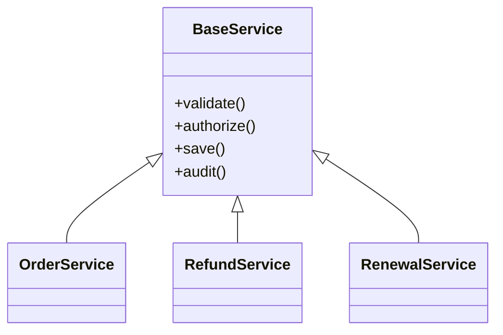

Shared behavior disimpan di parent. Subclass mewarisi banyak hal, termasuk behavior yang mungkin tidak relevan.

### Go-style mental model

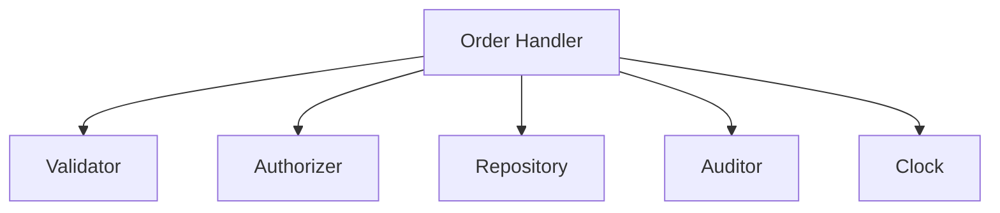

Sebuah component hanya memegang dependency yang dibutuhkan. Reuse tidak terjadi lewat parent class, melainkan lewat kolaborasi antar capability kecil.

### Konsekuensi engineering

Composition yang baik di Go biasanya memiliki sifat:

1. **Eksplisit** — dependency terlihat dari struct field, constructor, atau parameter.
2. **Kecil** — interface merepresentasikan kebutuhan consumer, bukan semua kemampuan provider.
3. **Local** — behavior yang dipakai bisa dipahami dari package terdekat, bukan dari superclass jauh.
4. **Testable** — dependency bisa diganti dengan fake/stub tanpa container berat.
5. **Evolvable** — penambahan capability baru tidak memaksa perubahan inheritance tree.
6. **Defensible** — invariant domain tidak bocor karena embedding/promoted method sembarangan.

---

## 2. Composition Pattern Map

Kita akan membahas beberapa pattern utama:

| Pattern | Tujuan | Cocok Ketika | Risiko Utama |
|---|---|---|---|
| Delegation | Memindahkan sebagian pekerjaan ke dependency | Type butuh collaborator eksplisit | terlalu banyak pass-through method |
| Wrapper | Membungkus dependency untuk menambah policy/invariant | Perlu logging, validation, metrics, retry, guard | menyembunyikan semantics asli |
| Adapter | Mengubah interface satu komponen agar cocok dengan interface consumer | Integrasi library/external API/legacy | adapter menjadi translation swamp |
| Decorator | Menambah behavior berlapis dengan contract yang sama | Middleware, instrumentation, caching | urutan layer salah, side effect tidak jelas |
| Facade | Menyederhanakan subsistem kompleks ke API kecil | Boundary use case/application service | facade menjadi god service |
| Capability Object | Memberikan akses terbatas berbasis kemampuan | Security boundary, permissioned operations | capability terlalu besar dan jadi service locator |
| Policy Object | Mengekstrak aturan keputusan | Authorization, validation, routing, retry | policy bercampur dengan IO |
| Boundary Object | Mengunci dependency direction antar layer/package | Clean architecture pragmatis | terlalu banyak interface ceremony |
| Function Object | Menggunakan function sebagai dependency | Strategy kecil, callback, hook | closure state tidak jelas |
| Composite | Menggabungkan banyak implementation contract sama | Fan-out, chain, multi-validator | error aggregation dan ordering tidak jelas |

Diagram hubungan besar:

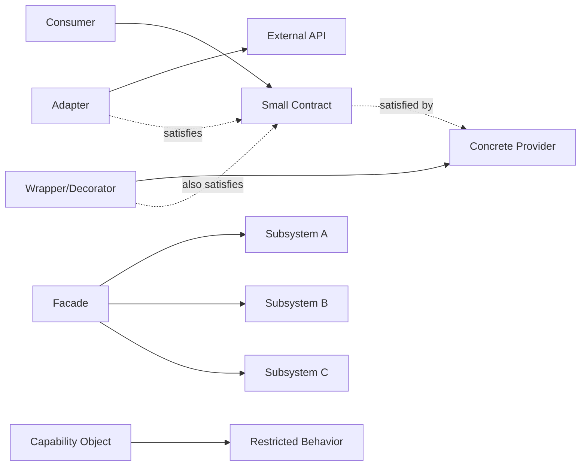

---

## 3. Delegation Pattern

Delegation berarti sebuah type meminta dependency lain melakukan sebagian pekerjaan.

Ini pattern paling dasar dan paling Go-friendly.

### 3.1 Bentuk dasar

```go
type UserRepository interface {
    Save(ctx context.Context, user User) error
}

type UserValidator interface {
    Validate(user User) error
}

type UserService struct {
    repo      UserRepository
    validator UserValidator
}

func NewUserService(repo UserRepository, validator UserValidator) *UserService {
    if repo == nil {
        panic("nil UserRepository")
    }
    if validator == nil {
        panic("nil UserValidator")
    }
    return &UserService{repo: repo, validator: validator}
}

func (s *UserService) Create(ctx context.Context, user User) error {
    if err := s.validator.Validate(user); err != nil {
        return err
    }
    return s.repo.Save(ctx, user)
}
```

Tidak ada inheritance. `UserService` tidak “is-a” repository atau validator. Ia “has-a” repository dan validator.

### 3.2 Apa yang penting?

Delegation bukan hanya teknik reuse. Delegation mendefinisikan **ownership**.

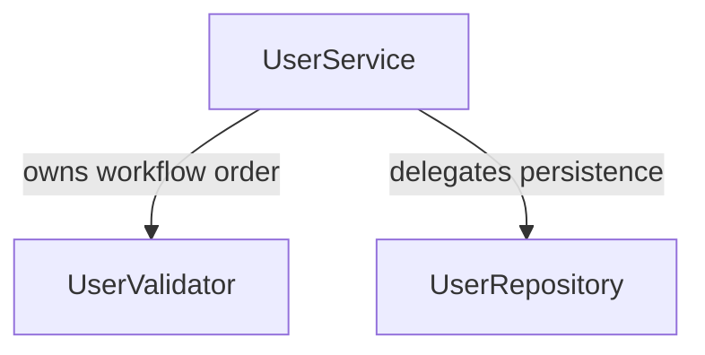

`UserService` memiliki workflow:

1. validate
2. save

Tetapi ia tidak memiliki detail validation atau persistence.

### 3.3 Delegation vs inheritance

Java inheritance sering mengaburkan ownership:

```java
abstract class BaseService {
    protected void validate(Object o) {}
    protected void audit(Object o) {}
    protected void save(Object o) {}
}

class UserService extends BaseService {
    void create(User user) {
        validate(user);
        save(user);
        audit(user);
    }
}
```

Masalah:

- subclass tahu terlalu banyak tentang helper parent;
- parent menjadi tempat buangan shared logic;
- testing perlu subclass/fake inheritance;
- override dapat merusak invariant;
- dependency tidak terlihat jelas dari constructor.

Go delegation memaksa dependency terlihat.

### 3.4 Kapan memakai delegation?

Gunakan delegation ketika:

- component memiliki workflow sendiri;
- sebagian responsibility jelas milik component lain;
- dependency bisa diganti untuk test;
- dependency memiliki lifecycle sendiri;
- Anda ingin menghindari embedded type yang mengekspos method terlalu luas.

### 3.5 Anti-pattern: pass-through object

```go
type Service struct {
    repo Repository
}

func (s *Service) FindByID(ctx context.Context, id ID) (User, error) {
    return s.repo.FindByID(ctx, id)
}

func (s *Service) Save(ctx context.Context, user User) error {
    return s.repo.Save(ctx, user)
}

func (s *Service) Delete(ctx context.Context, id ID) error {
    return s.repo.Delete(ctx, id)
}
```

Jika service hanya meneruskan semua method tanpa policy, ia bukan service. Ia hanya proxy kosong.

Pertanyaan review:

- Apa invariant tambahan yang dijaga service?
- Apakah service menambah authorization, validation, transaction, audit, idempotency?
- Jika tidak, apakah consumer sebaiknya memakai repository langsung?

### 3.6 Production checklist delegation

- Constructor menolak dependency nil.
- Interface didefinisikan di sisi consumer jika memungkinkan.
- Method service tidak sekadar pass-through tanpa policy.
- Dependency field biasanya unexported.
- Ownership workflow jelas.
- Error dari dependency diberi konteks bila melewati boundary semantic.
- Tidak menyimpan `context.Context` sebagai field.

---

## 4. Wrapper Pattern

Wrapper membungkus object lain untuk menambah behavior.

Perbedaan dengan delegation:

- delegation: component menggunakan dependency untuk menyelesaikan workflow miliknya;
- wrapper: component terlihat seperti dependency yang dibungkus, tetapi menambahkan behavior.

### 4.1 Contoh wrapper repository dengan metrics

```go
type UserRepository interface {
    Save(ctx context.Context, user User) error
    FindByID(ctx context.Context, id UserID) (User, error)
}

type MetricsUserRepository struct {
    next    UserRepository
    metrics Metrics
}

func NewMetricsUserRepository(next UserRepository, metrics Metrics) *MetricsUserRepository {
    if next == nil {
        panic("nil UserRepository")
    }
    if metrics == nil {
        panic("nil Metrics")
    }
    return &MetricsUserRepository{next: next, metrics: metrics}
}

func (r *MetricsUserRepository) Save(ctx context.Context, user User) error {
    start := time.Now()
    err := r.next.Save(ctx, user)
    r.metrics.Observe("user_repository_save", time.Since(start), err)
    return err
}

func (r *MetricsUserRepository) FindByID(ctx context.Context, id UserID) (User, error) {
    start := time.Now()
    user, err := r.next.FindByID(ctx, id)
    r.metrics.Observe("user_repository_find_by_id", time.Since(start), err)
    return user, err
}
```

### 4.2 Wrapper menjaga contract yang sama

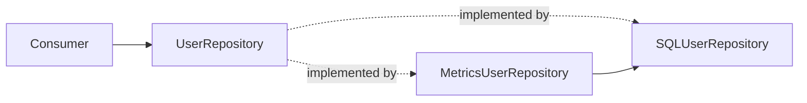

Consumer tidak peduli apakah repository asli atau wrapper. Selama contract sama, wrapper bisa disisipkan.

### 4.3 Wrapper umum di Go

Contoh wrapper idiomatik:

- `io.LimitReader(r, n)` membungkus reader agar hanya membaca sampai batas tertentu.
- `bufio.NewReader(r)` membungkus reader dengan buffering.
- `gzip.NewReader(r)` membungkus compressed stream menjadi readable stream.
- HTTP middleware membungkus `http.Handler`.
- Logging writer membungkus `io.Writer`.

Walaupun detail library spesifik tidak dibahas di sini, prinsipnya sama: contract kecil membuat wrapping murah.

### 4.4 Wrapper vs embedding

Kadang orang menulis:

```go
type MetricsRepo struct {
    UserRepository
    metrics Metrics
}
```

Ini membuat semua method `UserRepository` dipromosikan otomatis. Terlihat praktis, tetapi bisa berbahaya.

Jika interface bertambah method baru, method itu langsung tersedia tanpa metrics. Ini bisa membuat sebagian operasi tidak terinstrumentasi.

Lebih aman:

```go
type MetricsRepo struct {
    next    UserRepository
    metrics Metrics
}
```

Lalu implementasikan method secara eksplisit.

### 4.5 Kapan wrapper tepat?

Gunakan wrapper ketika ingin menambah:

- metrics;
- tracing;
- logging;
- retry;
- timeout;
- rate limit;
- validation;
- authorization guard;
- caching;
- idempotency;
- transaction boundary;
- panic recovery;
- feature flag behavior.

### 4.6 Risiko wrapper

Wrapper bisa salah jika:

- mengubah semantics diam-diam;
- swallowing error;
- retry operasi non-idempotent;
- logging data sensitif;
- caching data yang tidak boleh stale;
- metrics label cardinality meledak;
- context deadline diabaikan;
- wrapper order salah.

Contoh wrapper order:

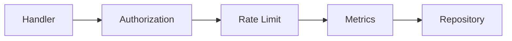

Order berbeda bisa menghasilkan semantics berbeda. Misalnya metrics ingin mengukur semua request termasuk unauthorized, maka metrics harus berada di luar auth.

---

## 5. Decorator Pattern

Decorator adalah wrapper yang menjaga contract yang sama dan bisa disusun berlapis-lapis.

Di Go, decorator sering muncul dalam bentuk:

- HTTP middleware;
- `io.Reader`/`io.Writer` chain;
- repository instrumentation;
- service guard;
- function wrapper;
- command handler wrapper.

### 5.1 Decorator pada function

```go
type HandlerFunc func(ctx context.Context, cmd Command) error

func WithLogging(next HandlerFunc, logger Logger) HandlerFunc {
    return func(ctx context.Context, cmd Command) error {
        logger.Info("handling command", "type", cmd.Type())
        err := next(ctx, cmd)
        if err != nil {
            logger.Error("command failed", "type", cmd.Type(), "error", err)
        }
        return err
    }
}

func WithAuthorization(next HandlerFunc, authorizer Authorizer) HandlerFunc {
    return func(ctx context.Context, cmd Command) error {
        if err := authorizer.Authorize(ctx, cmd); err != nil {
            return err
        }
        return next(ctx, cmd)
    }
}
```

Pemakaian:

```go
handler := createOrderHandler
handler = WithLogging(handler, logger)
handler = WithAuthorization(handler, authorizer)
```

Hati-hati: urutan assignment menentukan urutan eksekusi.

Jika `handler = WithAuthorization(WithLogging(createOrderHandler, logger), authorizer)`, maka authorization terjadi sebelum logging inner handler. Jika dibalik, logging bisa mencatat unauthorized attempt.

### 5.2 Decorator pada interface

```go
type CommandHandler interface {
    Handle(ctx context.Context, cmd Command) error
}

type LoggingCommandHandler struct {
    next   CommandHandler
    logger Logger
}

func (h *LoggingCommandHandler) Handle(ctx context.Context, cmd Command) error {
    h.logger.Info("command.start", "type", cmd.Type())
    err := h.next.Handle(ctx, cmd)
    if err != nil {
        h.logger.Error("command.failed", "type", cmd.Type(), "error", err)
    }
    return err
}
```

### 5.3 Function decorator vs interface decorator

| Aspek | Function decorator | Interface decorator |
|---|---|---|
| Boilerplate | rendah | sedang |
| Cocok untuk | single-method behavior | multi-method contract |
| Testability | mudah | mudah |
| Extensibility | terbatas ke signature | lebih stabil untuk domain object |
| Discoverability | kadang tersembunyi | lebih eksplisit |
| State | closure | struct field |

### 5.4 Decorator chain diagram

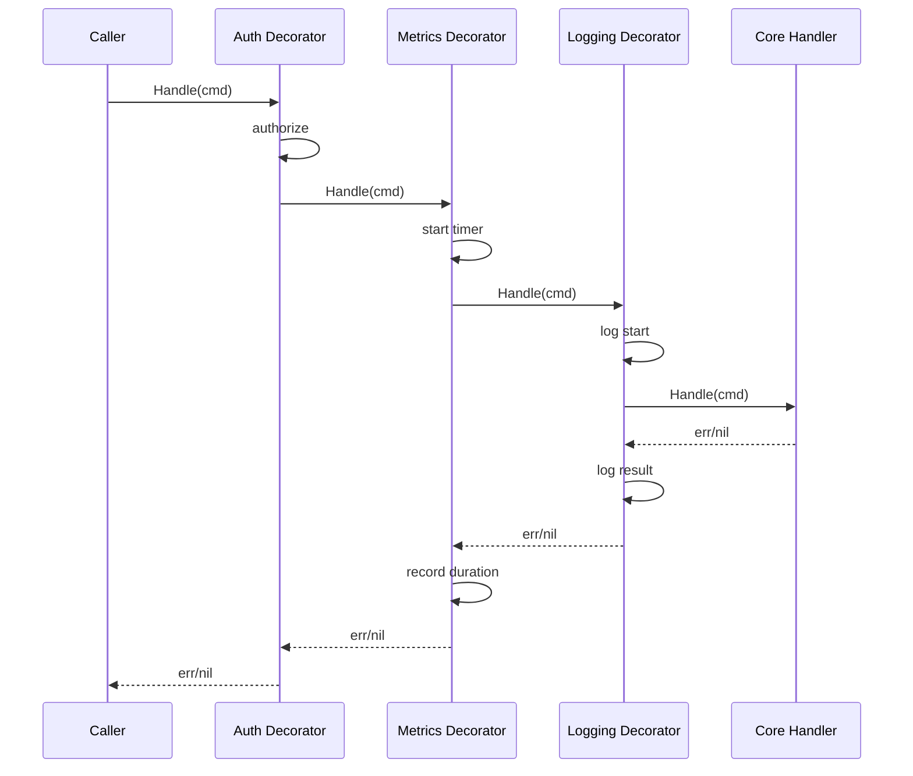

### 5.5 Failure mode decorator

Decorator chain berbahaya jika:

1. **Order tidak terdokumentasi**  
   Misalnya retry membungkus transaction. Jika retry berada di dalam transaction, satu transaction bisa mencoba ulang operasi yang seharusnya rollback dulu.

2. **Semantics error berubah**  
   Decorator recovery yang mengubah panic menjadi error bisa menyembunyikan bug programming.

3. **Context tidak diteruskan**  
   Wrapper membuat context baru tanpa deadline/correlation id.

4. **Data race pada state decorator**  
   Decorator menyimpan mutable state per request di struct shared.

5. **Observability tidak konsisten**  
   Metrics hanya di layer tertentu sehingga sebagian failure tidak tercatat.

### 5.6 Checklist decorator production

- Urutan layer ditulis eksplisit.
- Setiap decorator punya satu alasan eksis.
- Decorator tidak menyimpan per-request mutable state di field shared.
- Error semantics tidak diubah tanpa dokumentasi.
- Context diteruskan apa adanya kecuali ada alasan kuat.
- Retry hanya untuk operasi idempotent atau operation dengan idempotency key.
- Logging tidak membocorkan secret/PII.
- Metrics label cardinality dikontrol.

---

## 6. Adapter Pattern

Adapter mengubah bentuk API satu komponen agar cocok dengan API yang diinginkan consumer.

Adapter sangat penting di Go karena interface sering didefinisikan di sisi consumer.

### 6.1 Masalah

Misalnya domain service hanya butuh kemampuan mengirim email:

```go
type EmailSender interface {
    SendEmail(ctx context.Context, msg EmailMessage) error
}
```

Tetapi library eksternal memiliki API berbeda:

```go
type ThirdPartyMailClient struct{}

func (c *ThirdPartyMailClient) Send(req ThirdPartyRequest) (ThirdPartyResponse, error) {
    // external library
}
```

Adapter:

```go
type ThirdPartyEmailSender struct {
    client *ThirdPartyMailClient
}

func NewThirdPartyEmailSender(client *ThirdPartyMailClient) *ThirdPartyEmailSender {
    if client == nil {
        panic("nil ThirdPartyMailClient")
    }
    return &ThirdPartyEmailSender{client: client}
}

func (s *ThirdPartyEmailSender) SendEmail(ctx context.Context, msg EmailMessage) error {
    req := ThirdPartyRequest{
        To:      msg.To,
        Subject: msg.Subject,
        Body:    msg.Body,
    }

    resp, err := s.client.Send(req)
    if err != nil {
        return fmt.Errorf("send email through third party: %w", err)
    }
    if !resp.Accepted {
        return ErrEmailRejected
    }
    return nil
}
```

### 6.2 Adapter sebagai anti-corruption layer

Adapter bukan sekadar mengubah signature. Ia melindungi domain dari konsep eksternal.

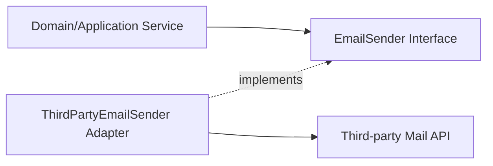

Domain tidak perlu tahu:

- response code vendor;
- retry header vendor;
- auth detail vendor;
- error payload vendor;
- field naming vendor;
- transport mechanism vendor.

### 6.3 Adapter placement

Umumnya adapter ditempatkan di package integration/infrastructure, bukan domain.

Contoh struktur:

```text
internal/
  account/
    service.go        // domain/application behavior
    port.go           // small consumer-side interfaces
  mail/
    thirdparty.go     // adapter implementation
```

Aturan dependency:

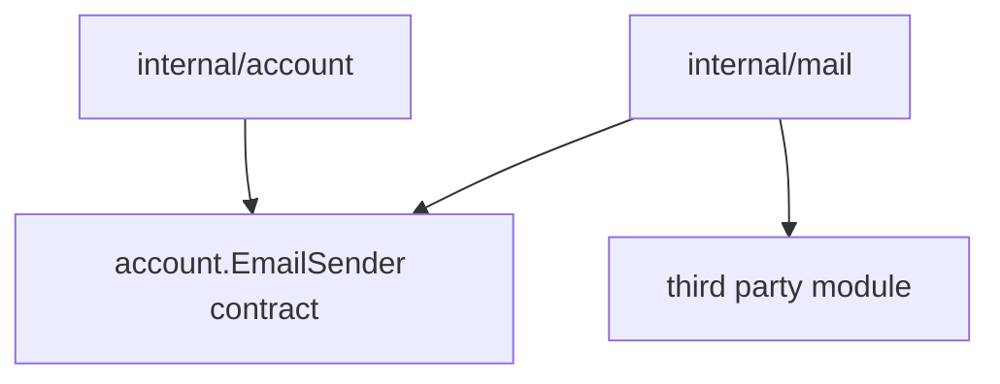

Lebih umum, port bisa berada di consumer package atau package boundary terpisah. Yang penting domain tidak bergantung pada vendor API.

### 6.4 Adapter yang buruk

```go
type EmailSender interface {
    Send(req ThirdPartyRequest) (ThirdPartyResponse, error)
}
```

Ini bukan adapter. Ini vendor API yang disamarkan sebagai domain interface.

Masalah:

- domain bocor ke vendor model;
- test perlu membuat vendor request;
- migration vendor mahal;
- error handling domain bergantung pada vendor semantics.

### 6.5 Adapter checklist

- Interface merepresentasikan kebutuhan domain/consumer, bukan API vendor.
- Adapter adalah satu-satunya tempat translasi model eksternal.
- Vendor-specific error dikonversi ke error domain/infrastructure yang masuk akal.
- Context/deadline diteruskan ke client bila client mendukung.
- Observability mencatat vendor latency/error tanpa membocorkan payload sensitif.
- Tidak mengekspor type vendor dari domain package.
- Contract test memastikan mapping penting benar.

---

## 7. Facade Pattern

Facade menyediakan API sederhana di atas subsistem kompleks.

Di Go, facade sering muncul sebagai:

- application service;
- client package;
- SDK internal;
- use case boundary;
- orchestration layer;
- package-level API yang menyembunyikan detail beberapa dependency.

### 7.1 Contoh facade application service

```go
type RegistrationService struct {
    users       UserRepository
    profiles    ProfileRepository
    email       EmailSender
    idGenerator IDGenerator
    clock       Clock
}

func (s *RegistrationService) Register(ctx context.Context, input RegisterInput) (UserID, error) {
    if err := input.Validate(); err != nil {
        return "", err
    }

    id := s.idGenerator.NewUserID()
    now := s.clock.Now()

    user := NewUser(id, input.Email, now)
    profile := NewProfile(id, input.DisplayName)

    if err := s.users.Save(ctx, user); err != nil {
        return "", fmt.Errorf("save user: %w", err)
    }
    if err := s.profiles.Save(ctx, profile); err != nil {
        return "", fmt.Errorf("save profile: %w", err)
    }
    if err := s.email.SendEmail(ctx, WelcomeEmail(input.Email)); err != nil {
        return "", fmt.Errorf("send welcome email: %w", err)
    }

    return id, nil
}
```

Facade menyederhanakan client:

```go
id, err := registration.Register(ctx, input)
```

Client tidak perlu tahu urutan create user, profile, email.

### 7.2 Facade bukan god service

Facade menjadi buruk jika mengambil semua responsibility:

```go
type PlatformService struct {
    // 30 repositories
    // 20 clients
    // 15 policies
    // 10 config groups
}
```

Gejala god facade:

- constructor sangat besar;
- method tidak kohesif;
- test setup berat;
- package menjadi dependency magnet;
- perubahan satu use case mempengaruhi banyak area;
- cycle dependency mulai muncul;
- semua orang menambahkan method baru ke service yang sama.

### 7.3 Facade yang baik punya cohesion

Cohesion berarti method dalam facade berbagi alasan perubahan yang sama.

Contoh baik:

```text
RegistrationService
- Register
- ConfirmEmail
- ResendConfirmation
```

Contoh buruk:

```text
UserService
- Register
- GenerateMonthlyRevenueReport
- ReindexSearch
- ImportLegacyData
- ApproveRefund
- SendMarketingEmail
```

### 7.4 Facade diagram

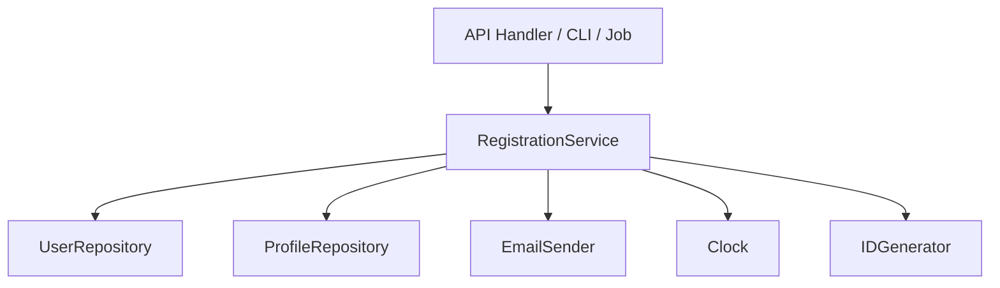

### 7.5 Facade checklist

- Facade merepresentasikan use case atau bounded capability yang kohesif.
- Constructor dependency masih bisa dipahami.
- Tidak semua dependency disuntikkan hanya untuk kemungkinan masa depan.
- Method tidak menjadi procedural script raksasa tanpa domain object/policy.
- Facade tidak mengekspor model infrastructure/vendor.
- Error boundary jelas: domain error vs infrastructure error.
- Transaction boundary, idempotency, dan side effect order didesain eksplisit.

---

## 8. Capability Object Pattern

Capability object adalah object yang merepresentasikan hak/kewenangan terbatas untuk melakukan operasi tertentu.

Ini pattern yang sangat berguna untuk sistem dengan authorization, workflow, state transition, atau regulatory defensibility.

### 8.1 Ide dasar

Daripada memberikan service besar ke banyak tempat:

```go
type CaseService interface {
    ViewCase(ctx context.Context, id CaseID) (Case, error)
    ApproveCase(ctx context.Context, id CaseID) error
    RejectCase(ctx context.Context, id CaseID, reason string) error
    ReassignCase(ctx context.Context, id CaseID, officer OfficerID) error
    DeleteCase(ctx context.Context, id CaseID) error
}
```

Berikan capability spesifik:

```go
type CaseApprover interface {
    ApproveCase(ctx context.Context, id CaseID) error
}

type CaseViewer interface {
    ViewCase(ctx context.Context, id CaseID) (Case, error)
}
```

Atau object yang sudah mengandung authorization decision:

```go
type ApprovalCapability struct {
    actor Actor
    policy ApprovalPolicy
    cases CaseRepository
}

func (c *ApprovalCapability) Approve(ctx context.Context, id CaseID) error {
    cs, err := c.cases.FindByID(ctx, id)
    if err != nil {
        return err
    }
    if err := c.policy.CanApprove(c.actor, cs); err != nil {
        return err
    }
    cs.Approve(c.actor.ID)
    return c.cases.Save(ctx, cs)
}
```

### 8.2 Capability object sebagai security boundary

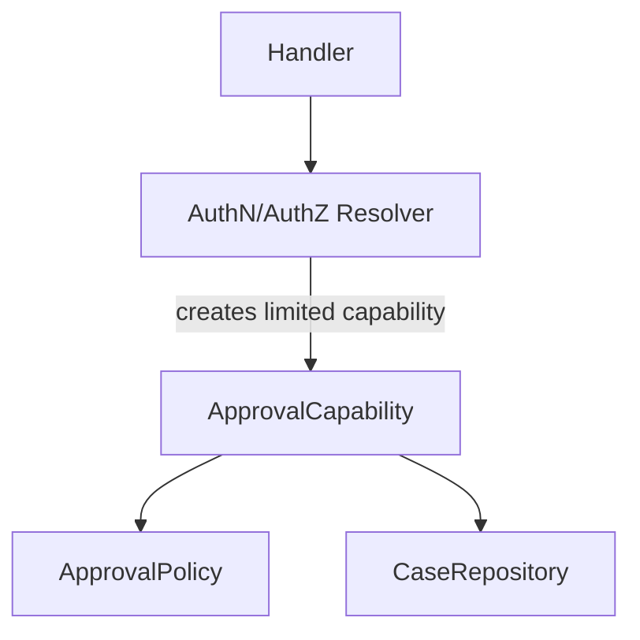

Handler tidak menerima full service dengan semua method. Ia menerima capability sesuai operasi.

### 8.3 Kenapa ini penting?

Pada sistem enterprise/regulatory, bug authorization sering muncul karena object terlalu powerful.

Contoh buruk:

```go
type Context struct {
    User  User
    Admin bool
    DB    *sql.DB
    Cases *CaseService
}
```

Semua layer punya akses ke semua hal. Batas responsibility hilang.

Capability object mempersempit authority.

### 8.4 Capability vs role check biasa

Role check biasa:

```go
if actor.HasRole("supervisor") {
    service.ApproveCase(ctx, id)
}
```

Masalah:

- role tersebar;
- policy duplication;
- sulit audit;
- kondisi state case sering lupa;
- exception rule tidak terpusat.

Capability object:

```go
approver, err := capabilities.ApproverFor(actor)
if err != nil {
    return err
}
return approver.Approve(ctx, id)
```

Policy terkonsentrasi di capability factory/policy object.

### 8.5 Capability checklist

- Capability kecil dan spesifik.
- Capability tidak menjadi service locator.
- Actor/principal jelas.
- Policy dan state precondition dicek dekat operasi.
- Audit event mencatat actor, target, decision, reason.
- Capability tidak diekspor terlalu luas bila hanya internal boundary.
- Test mencakup allowed, denied, wrong state, stale state, concurrent update.

---

## 9. Policy Object Pattern

Policy object mengekstrak aturan keputusan dari workflow.

Ini sangat penting ketika aturan berubah lebih sering daripada orchestration.

### 9.1 Contoh authorization policy

```go
type ApprovalPolicy interface {
    CanApprove(actor Actor, cs Case) error
}

type DefaultApprovalPolicy struct{}

func (p DefaultApprovalPolicy) CanApprove(actor Actor, cs Case) error {
    if !actor.HasPermission(PermissionApproveCase) {
        return ErrPermissionDenied
    }
    if cs.Status != CaseStatusPendingApproval {
        return ErrInvalidCaseState
    }
    if cs.AssignedApprover != actor.ID {
        return ErrNotAssignedApprover
    }
    return nil
}
```

Service:

```go
type CaseApprovalService struct {
    cases  CaseRepository
    policy ApprovalPolicy
}

func (s *CaseApprovalService) Approve(ctx context.Context, actor Actor, id CaseID) error {
    cs, err := s.cases.FindByID(ctx, id)
    if err != nil {
        return err
    }
    if err := s.policy.CanApprove(actor, cs); err != nil {
        return err
    }
    cs.Approve(actor.ID)
    return s.cases.Save(ctx, cs)
}
```

### 9.2 Kenapa bukan method di service saja?

Bisa saja policy berada di service jika sederhana. Tetapi pisahkan bila:

- aturan kompleks;
- aturan berubah sering;
- aturan perlu diuji secara intensif;
- aturan dipakai di beberapa use case;
- aturan butuh audit/explainability;
- aturan memiliki matrix state/role/attribute.

### 9.3 Policy object harus pure bila memungkinkan

Policy idealnya tidak melakukan IO.

Baik:

```go
func (p Policy) CanApprove(actor Actor, cs Case) error
```

Kurang baik:

```go
func (p Policy) CanApprove(ctx context.Context, actorID ActorID, caseID CaseID) error
```

Versi kedua memaksa policy melakukan lookup. Kadang perlu, tetapi membuat policy lebih sulit diuji dan lebih sulit dijelaskan.

Pisahkan data loading dari decision.

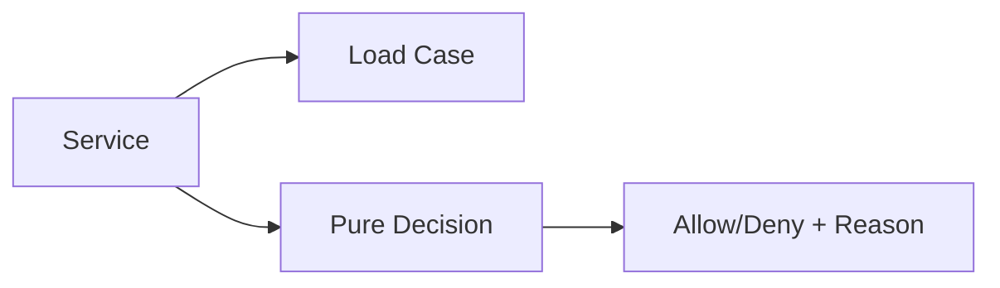

### 9.4 Policy result yang explainable

Untuk sistem audit, error saja kadang tidak cukup.

```go
type Decision struct {
    Allowed bool
    Code    string
    Reason  string
}

type ApprovalPolicy interface {
    Decide(actor Actor, cs Case) Decision
}
```

Keuntungan:

- audit lebih jelas;
- UI bisa menampilkan reason;
- test matrix lebih eksplisit;
- rule engine bisa diganti nanti.

### 9.5 Policy checklist

- Policy punya input eksplisit.
- IO dipisahkan dari decision bila memungkinkan.
- Result bisa diuji dengan table-driven tests.
- Denial reason distandardisasi.
- Rule precedence terdokumentasi.
- Tidak menyembunyikan global state/time random.
- Jika butuh waktu, inject `Clock` atau kirim `now` sebagai input.

---

## 10. Boundary Object Pattern

Boundary object adalah object yang sengaja dibuat untuk mengunci arah dependency dan mencegah leakage antar layer/package.

### 10.1 Masalah dependency leakage

Misalnya package domain langsung bergantung ke SQL:

```go
package caseworkflow

import "database/sql"

type Service struct {
    db *sql.DB
}
```

Ini membuat domain/application logic sulit dipisahkan dari persistence.

Boundary object memperkenalkan contract:

```go
type CaseStore interface {
    FindByID(ctx context.Context, id CaseID) (Case, error)
    Save(ctx context.Context, cs Case) error
}
```

SQL implementation berada di package lain.

### 10.2 Boundary object bukan dogma clean architecture

Di Go, terlalu banyak interface juga buruk. Boundary object perlu alasan.

Gunakan boundary object ketika:

- dependency eksternal berat;
- testing perlu fake;
- package harus stabil;
- implementation akan berganti;
- domain tidak boleh tahu vendor;
- module boundary enterprise perlu defensible;
- lifecycle dependency berbeda.

Tidak perlu interface jika:

- hanya ada satu implementation kecil;
- tidak ada testing benefit;
- abstraction belum punya semantics jelas;
- interface hanya meniru concrete type lengkap.

### 10.3 Boundary object diagram

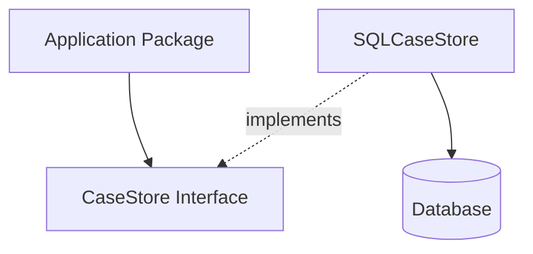

### 10.4 Checklist boundary object

- Boundary memutus dependency yang memang perlu diputus.
- Interface kecil dan consumer-owned.
- Nama interface merepresentasikan role, bukan implementation.
- Tidak mengekspor model vendor.
- Error translation jelas.
- Boundary tidak dibuat hanya demi “semua harus interface”.

---

## 11. Function Object Pattern

Di Go, function bisa menjadi dependency.

Ini sering lebih sederhana daripada membuat interface satu method.

### 11.1 Function dependency

```go
type NowFunc func() time.Time

type TokenIssuer struct {
    now NowFunc
}

func NewTokenIssuer(now NowFunc) *TokenIssuer {
    if now == nil {
        now = time.Now
    }
    return &TokenIssuer{now: now}
}

func (i *TokenIssuer) Issue(subject string) Token {
    issuedAt := i.now()
    return Token{
        Subject:  subject,
        IssuedAt: issuedAt,
        ExpiresAt: issuedAt.Add(15 * time.Minute),
    }
}
```

Test:

```go
issuer := NewTokenIssuer(func() time.Time {
    return time.Date(2026, 1, 1, 0, 0, 0, 0, time.UTC)
})
```

### 11.2 Function object vs interface

Interface:

```go
type Clock interface {
    Now() time.Time
}
```

Function:

```go
type ClockFunc func() time.Time
```

Kapan function lebih cocok:

- dependency hanya satu behavior;
- tidak butuh state kompleks;
- test fake sederhana;
- API internal package;
- callback/hook/strategy kecil.

Kapan interface lebih cocok:

- ada beberapa method terkait;
- lifecycle penting;
- stateful implementation;
- public API perlu nama concept yang jelas;
- akan ada decorator/wrapper;
- perlu compile-time assertion type implements interface.

### 11.3 Function adapter method

Go idiom sering membuat function type mengimplementasikan interface.

```go
type Authorizer interface {
    Authorize(ctx context.Context, action Action) error
}

type AuthorizerFunc func(ctx context.Context, action Action) error

func (f AuthorizerFunc) Authorize(ctx context.Context, action Action) error {
    return f(ctx, action)
}
```

Dengan ini, test bisa sederhana:

```go
svc := NewService(AuthorizerFunc(func(ctx context.Context, action Action) error {
    return nil
}))
```

### 11.4 Risiko closure

Closure dapat menyembunyikan state.

```go
attempts := 0
authorizer := AuthorizerFunc(func(ctx context.Context, action Action) error {
    attempts++
    return nil
})
```

Jika dipakai concurrent, ini data race.

Untuk production code, hati-hati dengan closure yang menangkap mutable state.

### 11.5 Checklist function object

- Cocok untuk single behavior.
- Jangan menangkap mutable state tanpa synchronization.
- Nil function dicek sebelum dipanggil.
- Untuk public API, pertimbangkan apakah interface lebih readable.
- Jangan membuat function signature terlalu panjang.
- Gunakan named input struct jika parameter makin banyak.

---

## 12. Composite Pattern

Composite menggabungkan banyak implementation contract sama.

Contoh umum:

- multiple validators;
- multiple notifiers;
- multiple policy checks;
- multiple event handlers;
- fan-out writer;
- chain of responsibility.

### 12.1 Composite validator

```go
type Validator[T any] interface {
    Validate(T) error
}

type CompositeValidator[T any] struct {
    validators []Validator[T]
}

func NewCompositeValidator[T any](validators ...Validator[T]) *CompositeValidator[T] {
    return &CompositeValidator[T]{validators: append([]Validator[T](nil), validators...)}
}

func (v *CompositeValidator[T]) Validate(value T) error {
    var errs []error
    for _, validator := range v.validators {
        if err := validator.Validate(value); err != nil {
            errs = append(errs, err)
        }
    }
    return errors.Join(errs...)
}
```

### 12.2 Fail-fast vs collect-all

Composite harus menentukan error policy.

Fail-fast:

```go
for _, validator := range validators {
    if err := validator.Validate(value); err != nil {
        return err
    }
}
return nil
```

Collect-all:

```go
var errs []error
for _, validator := range validators {
    if err := validator.Validate(value); err != nil {
        errs = append(errs, err)
    }
}
return errors.Join(errs...)
```

Trade-off:

| Policy | Kelebihan | Kekurangan |
|---|---|---|
| Fail-fast | cepat, sederhana, cocok untuk dependency chain | user hanya lihat error pertama |
| Collect-all | cocok untuk validation UX | perlu aggregation semantics jelas |

### 12.3 Composite notification

```go
type Notifier interface {
    Notify(ctx context.Context, event Event) error
}

type MultiNotifier struct {
    notifiers []Notifier
}

func (n *MultiNotifier) Notify(ctx context.Context, event Event) error {
    var errs []error
    for _, notifier := range n.notifiers {
        if err := notifier.Notify(ctx, event); err != nil {
            errs = append(errs, err)
        }
    }
    return errors.Join(errs...)
}
```

Pertanyaan penting:

- Apakah notifier kedua tetap jalan jika pertama gagal?
- Apakah ordering penting?
- Apakah operasi harus parallel?
- Apakah error partial harus retry?
- Apakah event idempotent?
- Apakah side effect boleh terjadi sebagian?

### 12.4 Composite failure mode

Composite berbahaya jika partial success tidak ditangani.

Contoh: kirim email berhasil, push notification gagal, audit gagal. Apa status operasi? Apakah command dianggap gagal? Apakah perlu compensation?

Composite tidak boleh hanya menjadi loop. Ia harus punya semantics.

### 12.5 Checklist composite

- Ordering jelas.
- Error policy jelas: fail-fast, collect-all, best-effort, quorum, first-success.
- Partial success dipikirkan.
- Side effect idempotency dipikirkan.
- Observability per child tersedia.
- Timeout/deadline diteruskan.
- Collection child tidak dimutasi setelah construction kecuali disinkronkan.

---

## 13. Named Field vs Embedding Dalam Pattern

Part 004 sudah membahas embedding. Dalam pattern composition, keputusan paling penting adalah: memakai named field atau embedding?

### 13.1 Named field sebagai default

```go
type Service struct {
    repo Repository
}
```

Kelebihan:

- dependency eksplisit;
- method tidak bocor;
- tidak ada promoted method surprise;
- API surface stabil;
- mudah mencari usage;
- lebih aman untuk invariant.

### 13.2 Embedding untuk intentional promotion

```go
type LoggingReader struct {
    io.Reader
    logger Logger
}
```

Embedding masuk akal jika:

- wrapper memang ingin mengekspos semua method embedded interface/type;
- contract kecil dan stabil;
- promotion disengaja;
- tidak ada invariant tambahan untuk setiap method;
- missing override tidak berbahaya.

### 13.3 Risiko embedding pada wrapper

```go
type SecureStore struct {
    Store
    authorizer Authorizer
}

func (s *SecureStore) Get(ctx context.Context, key string) ([]byte, error) {
    if err := s.authorizer.CanRead(ctx, key); err != nil {
        return nil, err
    }
    return s.Store.Get(ctx, key)
}
```

Jika `Store` juga punya `Delete`, maka `SecureStore.Delete` otomatis tersedia tanpa authorization jika tidak dioverride.

Ini bug serius.

Lebih aman:

```go
type SecureStore struct {
    next       Store
    authorizer Authorizer
}
```

Lalu implementasikan semua method yang boleh diekspos.

### 13.4 Rule of thumb

Gunakan named field kecuali Anda benar-benar ingin promoted API.

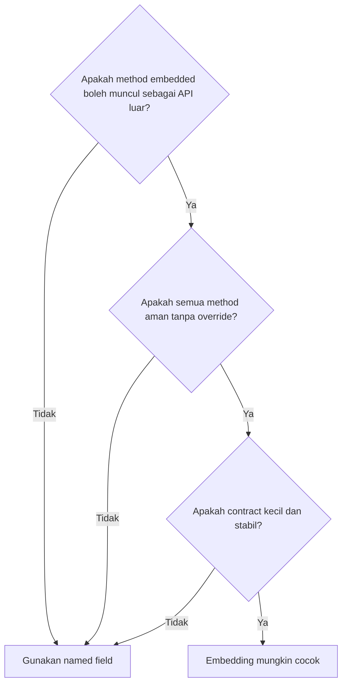

---

## 14. Interface Placement Dalam Composition Pattern

Salah satu pertanyaan desain Go paling penting:

> Interface diletakkan di package provider atau consumer?

Jawaban pragmatis:

> Interface kecil biasanya lebih baik didefinisikan di sisi consumer ketika interface itu merepresentasikan kebutuhan consumer.

### 14.1 Provider-defined interface yang terlalu besar

```go
package storage

type Repository interface {
    FindUser(ctx context.Context, id UserID) (User, error)
    SaveUser(ctx context.Context, user User) error
    DeleteUser(ctx context.Context, id UserID) error
    FindOrder(ctx context.Context, id OrderID) (Order, error)
    SaveOrder(ctx context.Context, order Order) error
    DeleteOrder(ctx context.Context, id OrderID) error
}
```

Consumer yang hanya butuh `FindUser` dipaksa bergantung ke semua method.

### 14.2 Consumer-defined interface

```go
package registration

type UserSaver interface {
    SaveUser(ctx context.Context, user User) error
}
```

Concrete repository di package lain bisa satisfy secara implicit.

### 14.3 Compile-time assertion

Jika ingin memastikan implementation memenuhi interface:

```go
var _ registration.UserSaver = (*SQLRepository)(nil)
```

Assertion ini cocok ditempatkan di package implementation atau test.

### 14.4 Interface placement checklist

- Interface diletakkan di consumer jika menggambarkan kebutuhan consumer.
- Provider tidak perlu mengekspor interface hanya untuk semua consumer.
- Interface besar harus dicurigai.
- Jangan membuat interface sebelum ada behavior nyata.
- Interface public adalah API compatibility commitment.
- Interface dengan satu implementation tidak otomatis salah, tetapi harus punya alasan: boundary, testing, vendor isolation, package direction.

---

## 15. Composition Dengan Generics

Generics tidak menggantikan composition. Generics menambah cara composition di compile-time.

### 15.1 Generic composite validator

```go
type Validator[T any] interface {
    Validate(T) error
}

type ValidatorFunc[T any] func(T) error

func (f ValidatorFunc[T]) Validate(v T) error {
    return f(v)
}
```

Ini membuat validator reusable tanpa `any` runtime casting.

### 15.2 Generic repository? Hati-hati

Java engineer sering ingin membuat:

```go
type Repository[T any, ID comparable] interface {
    FindByID(ctx context.Context, id ID) (T, error)
    Save(ctx context.Context, entity T) error
    Delete(ctx context.Context, id ID) error
}
```

Ini bisa berguna untuk in-memory/test utility, tetapi untuk domain production sering terlalu generik.

Masalah:

- setiap aggregate punya query/invariant berbeda;
- persistence semantics berbeda;
- generic repository bisa mendorong CRUD anemia;
- domain behavior hilang ke service layer;
- transaction/concurrency/idempotency sulit distandardisasi.

Gunakan generic repository hanya jika semantics benar-benar seragam.

### 15.3 Generics untuk infrastructure utility

Cocok:

```go
type Cache[K comparable, V any] interface {
    Get(ctx context.Context, key K) (V, bool, error)
    Set(ctx context.Context, key K, value V, ttl time.Duration) error
}
```

Karena cache semantics biasanya cukup seragam.

### 15.4 Decision rule

Gunakan generics untuk:

- collection utility;
- typed cache;
- validator/composite;
- mapper internal;
- option builder;
- test harness;
- codegen support;
- type-safe registry.

Hindari generics untuk:

- menyamakan domain aggregate yang sebenarnya berbeda;
- membuat framework internal yang abstraksinya belum matang;
- menggantikan interface runtime yang memang perlu dynamic dispatch;
- meniru Java generic base class terlalu awal.

---

## 16. Composition Dengan Reflection Dan Code Generation

Part ini belum membahas reflection/codegen secara detail, tetapi pattern composition nanti akan berinteraksi dengan keduanya.

### 16.1 Reflection sebagai dynamic composition

Reflection bisa menemukan metadata runtime:

- struct tag;
- field name;
- field type;
- method set;
- zero value;
- nested structure.

Contoh penggunaan:

- validation framework;
- JSON/XML mapper;
- dependency injection container;
- ORM;
- test assertion utility.

Tetapi reflection melemahkan explicitness.

Jika Anda bisa menyelesaikan dengan interface/function/generic sederhana, jangan langsung memilih reflection.

### 16.2 Code generation sebagai static composition

Code generation bisa menghasilkan glue code:

- mapper;
- validator;
- mock;
- enum stringer;
- API client;
- SQL boilerplate;
- routing table;
- registry.

Kelebihan codegen:

- compile-time type checking;
- runtime lebih murah;
- generated code bisa dibaca;
- contract bisa distandardisasi.

Kekurangan:

- build pipeline lebih kompleks;
- generated file harus direview/diatur;
- generator bisa menjadi framework tersembunyi;
- debugging pindah ke generator.

### 16.3 Decision matrix awal

| Kebutuhan | Interface | Function | Generics | Reflection | Codegen |
|---|---:|---:|---:|---:|---:|
| Runtime polymorphism | kuat | sedang | lemah | kuat | sedang |
| Compile-time safety | kuat | kuat | kuat | lemah | kuat |
| Boilerplate rendah | sedang | kuat | sedang | kuat | kuat setelah setup |
| Performance | kuat | kuat | kuat | lemah-sedang | kuat |
| Dynamic metadata | lemah | lemah | lemah | kuat | sedang |
| Public API clarity | kuat | sedang | sedang | lemah | sedang |
| Enterprise reproducibility | kuat | kuat | kuat | sedang | perlu governance |

---

## 17. Pattern Selection Framework

Ketika mendesain component Go, gunakan urutan pertanyaan berikut.

### 17.1 Pertanyaan 1: Apakah ini data ownership atau behavior dependency?

Jika object memiliki data sebagai bagian dari state sendiri:

```go
type Account struct {
    id      AccountID
    balance Money
}
```

Jika object hanya memakai collaborator:

```go
type TransferService struct {
    accounts AccountRepository
}
```

Jangan campur.

### 17.2 Pertanyaan 2: Apakah behavior perlu diganti di test/runtime?

Jika tidak, concrete type cukup.

```go
type Service struct {
    parser *Parser
}
```

Jika ya, interface/function dependency bisa tepat.

```go
type Service struct {
    sender EmailSender
}
```

### 17.3 Pertanyaan 3: Apakah contract satu method?

Jika satu method kecil, function type mungkin cukup.

```go
type RetryDecider func(error) bool
```

Jika concept domain penting, interface lebih readable.

```go
type Authorizer interface {
    Authorize(ctx context.Context, action Action) error
}
```

### 17.4 Pertanyaan 4: Apakah ingin menambah behavior tanpa mengubah implementation?

Gunakan wrapper/decorator.

```go
repo := NewSQLUserRepository(db)
repo = NewMetricsUserRepository(repo, metrics)
repo = NewTracingUserRepository(repo, tracer)
```

### 17.5 Pertanyaan 5: Apakah menghubungkan vendor/external API?

Gunakan adapter.

### 17.6 Pertanyaan 6: Apakah menyederhanakan beberapa subsystem?

Gunakan facade, tetapi jaga cohesion.

### 17.7 Pertanyaan 7: Apakah membatasi authority?

Gunakan capability object.

### 17.8 Pertanyaan 8: Apakah aturan keputusan kompleks?

Gunakan policy object.

### 17.9 Pertanyaan 9: Apakah boilerplate terlalu besar dan deterministik?

Pertimbangkan code generation.

### 17.10 Diagram selection

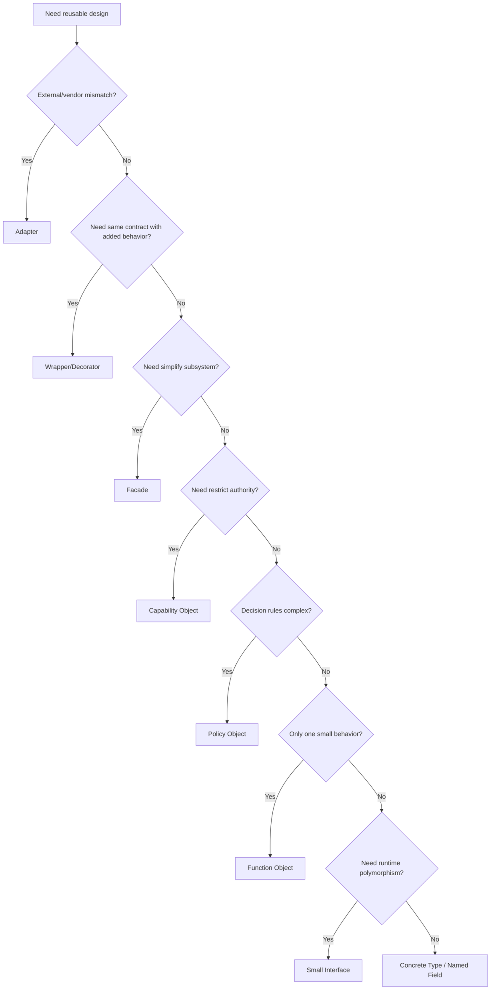

---

## 18. Case Study: Regulatory Case Approval Workflow

Kita gunakan contoh yang lebih dekat ke sistem enterprise/regulatory.

### 18.1 Requirement

Ada sistem case management:

- officer membuat case;
- supervisor melakukan review;
- approver menyetujui;
- audit trail wajib tercatat;
- email notification dikirim;
- authorization bergantung role, assignment, dan status case;
- case tidak boleh approve jika sudah closed;
- external document service dipakai untuk generate approval letter;
- semua operasi harus observable.

### 18.2 Desain buruk: god service

```go
type CaseService struct {
    db       *sql.DB
    mail     *MailClient
    docs     *DocumentClient
    logger   *Logger
    metrics  *Metrics
    cfg      Config
}

func (s *CaseService) Approve(ctx context.Context, actorID string, caseID string) error {
    // load actor from db
    // load case from db
    // check role
    // check assignment
    // check status
    // update db
    // generate document
    // send email
    // insert audit
    // log
    // metrics
    return nil
}
```

Masalah:

- dependency vendor bocor;
- business policy bercampur dengan SQL;
- test sulit;
- audit rule tersebar;
- authorization tidak reusable;
- side effect order tidak jelas;
- service akan membesar terus.

### 18.3 Desain composition

Contracts:

```go
type CaseRepository interface {
    FindByID(ctx context.Context, id CaseID) (Case, error)
    Save(ctx context.Context, cs Case) error
}

type ApprovalPolicy interface {
    Decide(actor Actor, cs Case) Decision
}

type AuditRecorder interface {
    Record(ctx context.Context, event AuditEvent) error
}

type ApprovalLetterGenerator interface {
    GenerateApprovalLetter(ctx context.Context, cs Case) (DocumentID, error)
}

type Notifier interface {
    NotifyApproval(ctx context.Context, cs Case, doc DocumentID) error
}
```

Service/facade:

```go
type CaseApprovalService struct {
    cases    CaseRepository
    policy   ApprovalPolicy
    audit    AuditRecorder
    letters  ApprovalLetterGenerator
    notifier Notifier
    clock    Clock
}

func (s *CaseApprovalService) Approve(ctx context.Context, actor Actor, id CaseID) error {
    cs, err := s.cases.FindByID(ctx, id)
    if err != nil {
        return fmt.Errorf("load case for approval: %w", err)
    }

    decision := s.policy.Decide(actor, cs)
    if !decision.Allowed {
        _ = s.audit.Record(ctx, AuditEvent{
            Type:      "case.approval.denied",
            ActorID:   actor.ID,
            CaseID:    id,
            Reason:    decision.Code,
            OccurredAt: s.clock.Now(),
        })
        return NewAuthorizationError(decision.Code, decision.Reason)
    }

    docID, err := s.letters.GenerateApprovalLetter(ctx, cs)
    if err != nil {
        return fmt.Errorf("generate approval letter: %w", err)
    }

    cs.Approve(actor.ID, s.clock.Now(), docID)

    if err := s.cases.Save(ctx, cs); err != nil {
        return fmt.Errorf("save approved case: %w", err)
    }

    if err := s.audit.Record(ctx, AuditEvent{
        Type:      "case.approved",
        ActorID:   actor.ID,
        CaseID:    id,
        OccurredAt: s.clock.Now(),
    }); err != nil {
        return fmt.Errorf("record approval audit: %w", err)
    }

    if err := s.notifier.NotifyApproval(ctx, cs, docID); err != nil {
        return fmt.Errorf("notify approval: %w", err)
    }

    return nil
}
```

### 18.4 Diagram composition

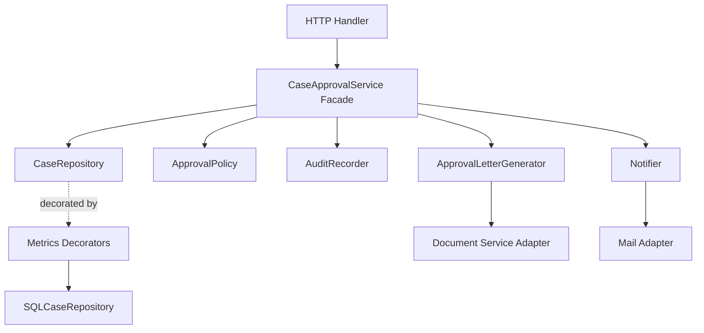

### 18.5 Apa pattern yang dipakai?

| Concern | Pattern |
|---|---|
| CaseApprovalService | Facade / orchestration boundary |
| CaseRepository | Boundary object / port |
| ApprovalPolicy | Policy object |
| Document service integration | Adapter |
| Mail integration | Adapter |
| Metrics repository | Decorator/wrapper |
| Actor-limited operation | Bisa dikembangkan menjadi capability object |
| Audit event | Boundary object untuk compliance |

### 18.6 Masalah yang masih harus diputuskan

Composition tidak otomatis menyelesaikan semua hal. Desain di atas masih perlu keputusan:

- Apakah document generation terjadi sebelum atau setelah save?
- Apakah audit failure membuat approval gagal?
- Apakah notification failure membuat approval gagal?
- Apakah approval harus dalam transaction?
- Apakah document generation idempotent?
- Apakah approval command punya idempotency key?
- Bagaimana menangani concurrent approval?
- Bagaimana memastikan audit denial tidak menutupi authorization error?
- Bagaimana observability untuk partial failure?

Top 1% engineer tidak hanya memilih pattern. Mereka menanyakan semantics.

---

## 19. Anti-Patterns Composition Di Go

### 19.1 Java inheritance disguised as embedding

```go
type BaseService struct {
    Logger Logger
    DB     *sql.DB
    Config Config
}

type UserService struct {
    BaseService
}
```

Ini sering hanya memindahkan inheritance Java ke embedding Go.

Masalah:

- promoted field/method bocor;
- dependency tidak spesifik;
- semua service membawa dependency yang belum tentu dipakai;
- test setup berat;
- invariant sulit dilacak.

Lebih baik:

```go
type UserService struct {
    users  UserRepository
    logger Logger
}
```

### 19.2 Interface pollution

```go
type UserServiceInterface interface {
    CreateUser(...)
    UpdateUser(...)
    DeleteUser(...)
    FindUser(...)
    ListUsers(...)
}
```

Jika interface dibuat hanya karena “best practice”, itu bukan best practice.

### 19.3 Abstract factory mania

```go
type ServiceFactory interface {
    NewUserService() UserService
    NewOrderService() OrderService
    NewCaseService() CaseService
}
```

Di Go, constructor function biasa sering cukup.

### 19.4 Service locator

```go
type Container struct {
    services map[string]any
}

func (c *Container) Get(name string) any
```

Ini melemahkan type safety dan menyembunyikan dependency.

### 19.5 Mega options

```go
type Options struct {
    Logger Logger
    DB *sql.DB
    Cache Cache
    Mail MailClient
    Metrics Metrics
    Tracer Tracer
    FeatureFlags FeatureFlags
    // 30 more
}
```

Options object boleh, tetapi jika semua component menerima options yang sama, dependency boundary hilang.

### 19.6 Generic everything

```go
type Service[T any, ID comparable] struct {
    repo Repository[T, ID]
}
```

Jika domain behavior berbeda, generic service bisa membuat model anemic.

### 19.7 Reflection-based magic injection

Dependency injection dengan reflection bisa menggoda:

```go
container.Resolve(&service)
```

Masalah:

- dependency tersembunyi;
- error muncul runtime;
- navigation sulit;
- test lebih opaque;
- build reproducibility tergantung registration magic.

Manual wiring sering lebih jelas untuk Go.

---

## 20. Production Design Review Checklist

Gunakan checklist ini saat review desain Go berbasis composition.

### 20.1 Dependency clarity

- Apakah dependency terlihat dari constructor/field?
- Apakah ada dependency tersembunyi dari global variable?
- Apakah dependency terlalu besar?
- Apakah interface berada di sisi consumer?
- Apakah dependency nil dicegah?

### 20.2 API surface

- Apakah exported method memang perlu publik?
- Apakah embedding mengekspos method yang tidak dimaksud?
- Apakah wrapper mengimplementasikan semua method yang harus dijaga policy-nya?
- Apakah ada promoted method yang melewati authorization/metrics/validation?

### 20.3 Semantics

- Apa invariant yang dijaga setiap component?
- Apa yang terjadi saat partial failure?
- Apakah ordering side effect penting?
- Apakah operasi idempotent?
- Apakah context cancellation dihormati?
- Apakah transaction boundary jelas?

### 20.4 Testability

- Apakah fake bisa dibuat tanpa framework berat?
- Apakah policy bisa diuji pure?
- Apakah adapter punya contract test?
- Apakah decorator order dites?
- Apakah error path utama tercakup?

### 20.5 Observability

- Apakah wrapper metrics/tracing/logging berada di layer yang benar?
- Apakah label cardinality aman?
- Apakah audit event mencatat actor, action, target, result, reason?
- Apakah error wrapping memberi konteks boundary?

### 20.6 Evolvability

- Jika interface bertambah method, apa yang rusak?
- Jika provider diganti, package mana yang berubah?
- Jika policy berubah, apakah workflow ikut berubah?
- Jika vendor API berubah, apakah domain aman?
- Jika module dipecah, apakah dependency direction tetap benar?

---

## 21. Java Engineer Translation Notes

### 21.1 Dari base class ke helper/collaborator

Java:

```java
abstract class BaseHandler {
    protected void validate(Request req) {}
    protected void audit(Request req) {}
}
```

Go:

```go
type Handler struct {
    validator Validator
    auditor   Auditor
}
```

### 21.2 Dari abstract method ke interface dependency

Java:

```java
abstract class Processor {
    final void process(Job job) {
        validate(job);
        execute(job);
    }
    abstract void execute(Job job);
}
```

Go:

```go
type Executor interface {
    Execute(ctx context.Context, job Job) error
}

type Processor struct {
    executor Executor
}
```

### 21.3 Dari annotation magic ke explicit constructor

Java/Spring:

```java
@Service
class UserService {
    @Autowired UserRepository repo;
}
```

Go:

```go
func NewUserService(repo UserRepository) *UserService {
    return &UserService{repo: repo}
}
```

### 21.4 Dari inheritance polymorphism ke structural interface

Java:

```java
class SQLUserRepository implements UserRepository {}
```

Go:

```go
// no declaration required
var _ UserRepository = (*SQLUserRepository)(nil)
```

### 21.5 Dari decorator class hierarchy ke simple wrapper

Java:

```java
class MetricsRepository implements Repository {
    private final Repository next;
}
```

Go:

```go
type MetricsRepository struct {
    next Repository
}
```

Perbedaannya bukan pada bentuk akhir, tetapi pada ekosistem: Go tidak memerlukan framework inheritance/annotation agar pattern ini natural.

---

## 22. Practical Heuristics: Apa Yang Biasanya Dilakukan Engineer Senior Go?

### 22.1 Mulai dari concrete type

Jangan mulai dari interface besar.

Mulai dari concrete type dan function. Extract interface ketika ada consumer nyata yang membutuhkan abstraction.

### 22.2 Pakai interface kecil

Interface satu sampai tiga method sering lebih sehat daripada interface besar.

### 22.3 Pakai named field sebagai default

Embedding hanya jika intentional promotion.

### 22.4 Pisahkan policy dari IO

Policy yang pure lebih mudah diuji, diaudit, dan dijelaskan.

### 22.5 Jangan takut boilerplate kecil

Go sering memilih sedikit boilerplate eksplisit daripada magic besar.

### 22.6 Hindari framework internal terlalu awal

Banyak organisasi membuat “internal framework” yang akhirnya meniru Java/Spring setengah matang. Go lebih kuat jika package kecil tersusun jelas.

### 22.7 Wiring manual itu fitur, bukan kekurangan

Manual wiring membuat dependency graph terlihat.

```go
repo := sqlcase.NewRepository(db)
repoWithMetrics := metricscase.NewRepository(repo, metrics)
policy := caseapproval.NewPolicy()
service := caseapproval.NewService(repoWithMetrics, policy, audit, letters, notifier, clock)
```

Ini verbose, tetapi mudah dibaca dan di-debug.

---

## 23. Mermaid: Composition Decision Architecture

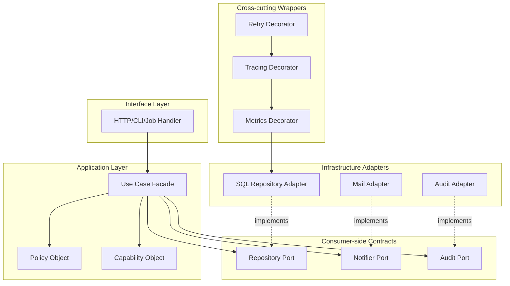

---

## 24. Mini Exercise Untuk Menginternalisasi

Ambil satu service Java yang biasanya Anda desain dengan base class atau Spring service besar. Pecah menjadi:

1. facade/use case service;
2. repository port;
3. external API adapter;
4. pure policy object;
5. audit recorder;
6. metrics decorator;
7. function dependency untuk clock/id generator;
8. capability object jika ada authorization sensitive operation.

Lalu jawab:

- dependency mana yang benar-benar dibutuhkan setiap component?
- method mana yang tidak boleh diekspor?
- apakah ada embedding yang membocorkan method?
- apakah policy bisa diuji tanpa database?
- apakah adapter menyembunyikan vendor model?
- apakah partial failure sudah punya semantics?
- apakah wiring manual masih bisa dibaca?

---

## 25. Ringkasan Part 005

Composition pattern di Go bukan pengganti inheritance secara mekanis. Ia adalah cara mendesain sistem dengan dependency eksplisit, behavior kecil, boundary jelas, dan semantic ownership yang kuat.

Inti part ini:

1. **Delegation** memindahkan pekerjaan ke collaborator tanpa mewarisi behavior.
2. **Wrapper** membungkus dependency untuk menambah policy/instrumentation.
3. **Decorator** membuat wrapper yang bisa disusun berlapis dengan contract sama.
4. **Adapter** melindungi domain dari API eksternal/vendor.
5. **Facade** menyederhanakan subsystem kompleks, tetapi harus tetap kohesif.
6. **Capability object** membatasi authority dan cocok untuk operasi sensitif.
7. **Policy object** memisahkan aturan keputusan dari workflow dan IO.
8. **Boundary object** mengunci dependency direction.
9. **Function object** memberi strategi kecil tanpa interface ceremony.
10. **Composite** menggabungkan banyak implementation, tetapi harus punya error/ordering semantics.
11. **Named field adalah default**; embedding hanya untuk intentional promotion.
12. **Pattern tidak cukup**; production engineering membutuhkan invariant, failure mode, ordering, idempotency, observability, dan compatibility.

---

## 26. Hubungan Ke Part Berikutnya

Part berikutnya akan membahas:

> **Part 006 — Interface sebagai Behavioral Contract: small interface, consumer-side interface, nil interface traps**

Kita akan masuk lebih dalam ke interface sebagai contract desain, bukan hanya syntax. Topik utama:

- interface value internal model;
- dynamic type + dynamic value;
- nil interface vs typed nil;
- consumer-owned interface;
- interface pollution;
- interface segregation ala Go;
- compile-time assertion;
- interface compatibility;
- interface dalam public API;
- kapan tidak memakai interface.

---

## 27. Status Seri

Seri belum selesai.

Progress saat ini:

- Selesai: Part 000 sampai Part 005.
- Berikutnya: Part 006.
- Target akhir: Part 030.

<!-- NAVIGATION_FOOTER -->
<div class="page-nav">
<a href="./learn-go-composition-oop-functional-reflection-codegen-modules-part-004.md">⬅️ Part 004 — Struct Embedding: Promoted Fields/Methods, Shadowing, Ambiguity, dan Composition yang Aman</a>
<a href="./index.md">📚 Kategori</a>
<a href="../../index.md">🏠 Home</a>
<a href="./learn-go-composition-oop-functional-reflection-codegen-modules-part-006.md">Part 006 — Interface Sebagai Behavioral Contract: Small Interface, Consumer-Side Interface, Nil Trap, dan API Evolution ➡️</a>
</div>
