# learn-go-composition-oop-functional-reflection-codegen-modules-part-006.md

# Part 006 — Interface Sebagai Behavioral Contract: Small Interface, Consumer-Side Interface, Nil Trap, dan API Evolution

> Seri: `learn-go-composition-oop-functional-reflection-codegen-modules`  
> Target pembaca: Java software engineer / tech lead yang ingin menguasai desain Go tingkat production/internal engineering handbook.  
> Fokus part ini: memahami interface bukan sebagai “class contract” seperti Java, tetapi sebagai kontrak perilaku kecil yang dipakai untuk membentuk boundary, dependency, test seam, substitutability, dan evolusi API yang aman.

---

## 0. Posisi Part Ini Dalam Seri

Sampai titik ini kita sudah membangun beberapa fondasi penting:

- Part 001: Go menggeser desain dari class hierarchy ke behavior composition.
- Part 002: defined type, alias, receiver, method, dan package boundary membentuk public API.
- Part 003: method set menentukan apakah `T` atau `*T` mengimplementasikan interface.
- Part 004: struct embedding dapat mempromosikan method dan field, tetapi bukan inheritance.
- Part 005: composition pattern dibangun dari explicit dependency, wrapper, adapter, decorator, facade, dan capability object.

Part ini membahas pusat gravitasi desain Go:

> Interface adalah kontrak perilaku yang dikonsumsi oleh caller, bukan deklarasi identitas class yang dimiliki provider.

Dalam Java, interface sering menjadi bagian dari hierarchy dan framework contract. Dalam Go, interface lebih sering menjadi alat lokal untuk mengatakan:

> “Untuk menyelesaikan pekerjaan ini, saya hanya butuh behavior sekecil ini.”

Itu terdengar sederhana, tetapi konsekuensinya sangat besar:

- interface biasanya kecil;
- interface sering didefinisikan di sisi consumer;
- concrete type tidak perlu mendeklarasikan bahwa ia mengimplementasikan interface;
- implementasi bersifat implicit dan structural;
- interface dapat menjadi boundary untuk testing, tetapi juga dapat menjadi over-abstraction;
- menambah method ke interface publik adalah breaking change;
- interface value punya model runtime yang dapat menghasilkan nil trap;
- `any` bukan desain interface yang baik, melainkan escape hatch;
- generic constraint interface berbeda dari runtime interface biasa.

Part ini adalah salah satu bagian paling penting untuk Java engineer, karena banyak desain Go yang buruk lahir dari kebiasaan membuat `IService`, `ServiceImpl`, `BaseService`, dan “interface untuk semua class”.

---

## 1. Baseline Resmi: Apa Itu Interface Menurut Go

Secara konseptual, interface di Go mendefinisikan sekumpulan method dan/atau type set. Untuk interface biasa yang digunakan sebagai nilai runtime, yang paling penting adalah method set. Sebuah type mengimplementasikan interface jika method set type tersebut memenuhi method yang diminta interface.

Beberapa fakta formal yang perlu dipegang:

1. Implementasi interface di Go bersifat implicit.
2. Tidak ada keyword `implements`.
3. Yang dicek adalah method set.
4. `T` dan `*T` bisa punya method set berbeda.
5. Interface value secara runtime menyimpan pasangan dynamic type dan dynamic value.
6. Empty interface sekarang biasa ditulis sebagai `any`, tetapi secara makna tetap interface yang menerima semua non-interface type.
7. Interface yang berisi type terms seperti `~T` atau union umumnya dipakai sebagai generic constraint, bukan sebagai value runtime biasa.

Sumber resmi yang menjadi fondasi part ini:

- Go Specification: interface type, method set, type set.
- Effective Go: interface naming dan idiom interface kecil seperti `Reader`, `Writer`, `Formatter`.
- Go FAQ: kenapa method set `T` dan `*T` berbeda.
- The Laws of Reflection: interface value menyimpan dynamic type dan dynamic value.
- Go blog “When To Use Generics”: interface, generics, dan reflection punya area penggunaan berbeda.

Kita tidak akan membaca ini sebagai teori bahasa saja. Kita akan pakai sebagai aturan engineering.

---

## 2. Mental Model Utama: Interface Adalah Permintaan, Bukan Pengakuan Identitas

Di Java, interface sering terasa seperti label identitas:

```java
public interface PaymentGateway {
    PaymentResult charge(PaymentRequest request);
}

public class StripePaymentGateway implements PaymentGateway {
    @Override
    public PaymentResult charge(PaymentRequest request) { ... }
}
```

Class secara eksplisit menyatakan:

> “Saya adalah PaymentGateway.”

Di Go, concrete type tidak perlu menyatakan itu:

```go
type PaymentRequest struct {
    AmountCents int64
    Currency    string
}

type PaymentResult struct {
    Reference string
}

type StripeClient struct {
    endpoint string
}

func (c *StripeClient) Charge(ctx context.Context, req PaymentRequest) (PaymentResult, error) {
    return PaymentResult{Reference: "ch_123"}, nil
}
```

Lalu consumer dapat mendefinisikan interface kecilnya sendiri:

```go
type Charger interface {
    Charge(context.Context, PaymentRequest) (PaymentResult, error)
}

type CheckoutService struct {
    charger Charger
}
```

`StripeClient` tidak tahu interface `Charger` ada. Ia tetap memenuhi interface tersebut karena method set-nya cocok.

Ini mengubah arah desain.

### Java-style provider-driven interface

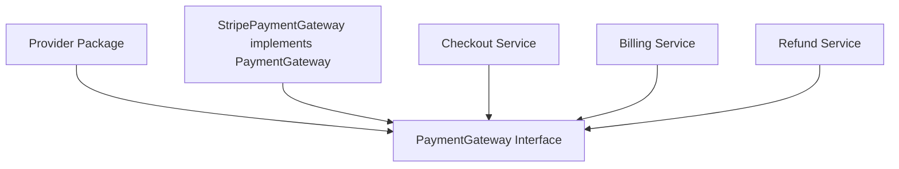

Provider sering mendefinisikan interface besar untuk semua consumer.

### Go-style consumer-driven interface

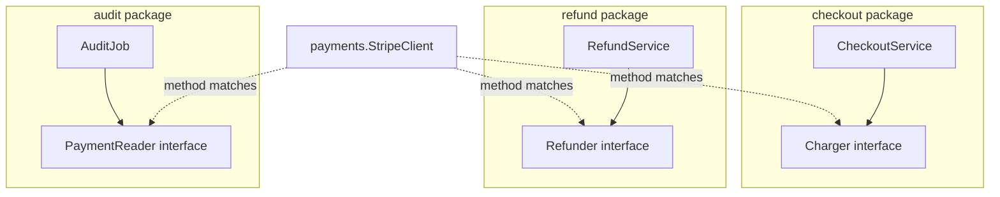

Concrete type yang sama bisa memenuhi beberapa interface kecil tanpa perlu tahu interface tersebut.

### Konsekuensi engineering

Interface bukan lagi “API utama provider”. Interface menjadi “kebutuhan minimum consumer”.

Ini menghasilkan desain yang:

- lebih kecil;
- lebih mudah dites;
- lebih rendah coupling;
- lebih aman terhadap evolusi provider;
- lebih mudah dikombinasikan dengan wrapper/decorator;
- lebih eksplisit tentang dependency behavior.

Tetapi juga ada risikonya:

- terlalu banyak interface lokal bisa membuat sistem susah dicari;
- interface yang terlalu abstrak bisa kehilangan semantic contract;
- interface yang didefinisikan terlalu cepat bisa menjadi noise;
- mock-driven design bisa membuat desain jauh dari real behavior.

---

## 3. Kesalahan Java Engineer: Membuat Interface Untuk Semua Concrete Type

Salah satu anti-pattern paling umum:

```go
type UserService interface {
    CreateUser(ctx context.Context, cmd CreateUserCommand) (User, error)
    UpdateUser(ctx context.Context, cmd UpdateUserCommand) (User, error)
    DeleteUser(ctx context.Context, id UserID) error
    FindUser(ctx context.Context, id UserID) (User, error)
    ListUsers(ctx context.Context, filter UserFilter) ([]User, error)
}

type UserServiceImpl struct {
    repo UserRepository
}
```

Ini sangat Java-esque:

- ada `Interface`;
- ada `Impl`;
- interface mengikuti bentuk concrete type;
- semua method dimasukkan;
- consumer dipaksa bergantung pada kontrak besar.

Masalahnya bukan karena interface besar selalu salah. Masalahnya adalah interface dibuat dari sudut pandang provider, bukan consumer.

### Pertanyaan desain yang benar

Bukan:

> “Class/service ini harus punya interface apa?”

Tetapi:

> “Consumer ini butuh behavior minimum apa?”

Misalnya handler create user hanya butuh:

```go
type UserCreator interface {
    CreateUser(ctx context.Context, cmd CreateUserCommand) (User, error)
}

type CreateUserHandler struct {
    users UserCreator
}
```

Handler delete user hanya butuh:

```go
type UserDeleter interface {
    DeleteUser(ctx context.Context, id UserID) error
}
```

Report generator mungkin hanya butuh:

```go
type UserFinder interface {
    FindUser(ctx context.Context, id UserID) (User, error)
}
```

Concrete `*UserService` boleh punya semua method, tetapi consumer tidak perlu tahu semuanya.

```go
type UserService struct {
    repo UserRepository
}

func (s *UserService) CreateUser(ctx context.Context, cmd CreateUserCommand) (User, error) { ... }
func (s *UserService) UpdateUser(ctx context.Context, cmd UpdateUserCommand) (User, error) { ... }
func (s *UserService) DeleteUser(ctx context.Context, id UserID) error { ... }
func (s *UserService) FindUser(ctx context.Context, id UserID) (User, error) { ... }
```

`*UserService` otomatis memenuhi `UserCreator`, `UserDeleter`, dan `UserFinder`.

---

## 4. Small Interface: Bukan Dogma, Melainkan Coupling Control

Go terkenal dengan interface kecil seperti:

```go
type Reader interface {
    Read(p []byte) (n int, err error)
}

type Writer interface {
    Write(p []byte) (n int, err error)
}
```

Ini bukan karena Go anti-abstraction. Justru ini abstraction yang sangat kuat karena kecil.

Small interface punya property penting:

1. Mudah diimplementasikan.
2. Mudah dites.
3. Mudah dikombinasikan.
4. Mudah distabilkan.
5. Lebih tahan terhadap perubahan.
6. Memaksa caller menyatakan kebutuhan minimum.
7. Mengurangi accidental dependency.

### Interface besar memperbesar blast radius

Misalnya:

```go
type CaseRepository interface {
    Create(ctx context.Context, c Case) (CaseID, error)
    Update(ctx context.Context, c Case) error
    Delete(ctx context.Context, id CaseID) error
    FindByID(ctx context.Context, id CaseID) (Case, error)
    FindByOfficer(ctx context.Context, officerID OfficerID) ([]Case, error)
    Search(ctx context.Context, filter CaseFilter) ([]Case, error)
    Count(ctx context.Context, filter CaseFilter) (int64, error)
    Lock(ctx context.Context, id CaseID) error
    Unlock(ctx context.Context, id CaseID) error
    AppendEvent(ctx context.Context, id CaseID, e CaseEvent) error
}
```

Jika handler hanya butuh `FindByID`, maka bergantung pada `CaseRepository` besar membuat handler terkena perubahan method lain.

Lebih kecil:

```go
type CaseFinder interface {
    FindByID(ctx context.Context, id CaseID) (Case, error)
}

type ViewCaseHandler struct {
    cases CaseFinder
}
```

### Coupling diagram

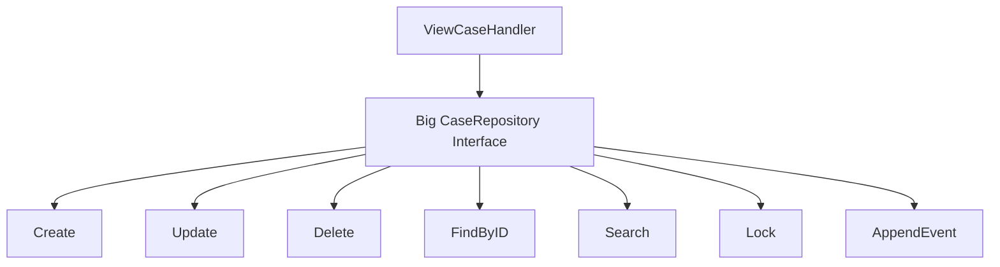

Handler yang hanya butuh `FindByID` secara desain ikut terhubung ke semua operasi.

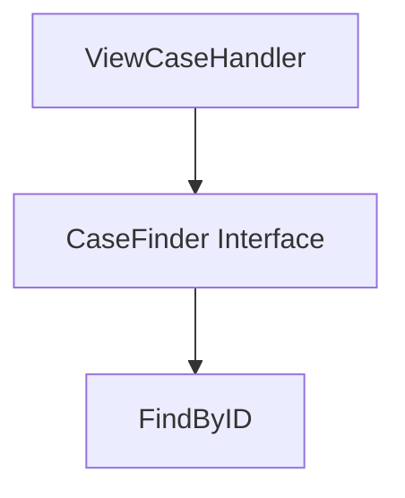

Small interface mengurangi dependency secara struktural.

---

## 5. Consumer-Side Interface: Definisikan Interface Di Tempat Kebutuhan Muncul

Salah satu prinsip paling praktis:

> Accept interfaces, return concrete types.

Tetapi prinsip ini sering disalahpahami. Bukan berarti semua parameter harus interface. Maksudnya: ketika sebuah function/type perlu menerima dependency yang bisa bervariasi, ia menerima interface kecil sesuai kebutuhan. Sementara constructor/factory biasanya mengembalikan concrete type agar caller punya API penuh dan evolusi lebih mudah.

### Provider-side interface yang kurang ideal

```go
package payment

type Gateway interface {
    Charge(context.Context, ChargeRequest) (ChargeResult, error)
    Refund(context.Context, RefundRequest) (RefundResult, error)
    GetTransaction(context.Context, TransactionID) (Transaction, error)
    Void(context.Context, TransactionID) error
}

type Client struct { ... }
```

Semua consumer dipaksa ke `payment.Gateway`, padahal mungkin hanya butuh satu method.

### Consumer-side interface

```go
package checkout

type Charger interface {
    Charge(context.Context, payment.ChargeRequest) (payment.ChargeResult, error)
}

type Service struct {
    charger Charger
}
```

```go
package refund

type Refunder interface {
    Refund(context.Context, payment.RefundRequest) (payment.RefundResult, error)
}

type Service struct {
    refunder Refunder
}
```

`payment.Client` tidak perlu mengekspor interface besar. Cukup ekspor concrete type dan method.

```go
package payment

type Client struct { ... }

func NewClient(cfg Config) (*Client, error) { ... }

func (c *Client) Charge(ctx context.Context, req ChargeRequest) (ChargeResult, error) { ... }
func (c *Client) Refund(ctx context.Context, req RefundRequest) (RefundResult, error) { ... }
```

### Kenapa return concrete type?

Jika provider mengembalikan interface:

```go
func NewClient(cfg Config) Gateway {
    return &Client{...}
}
```

Maka caller hanya melihat method pada `Gateway`. Jika nanti provider menambah method yang berguna pada `Client`, caller tidak bisa memakainya tanpa mengubah return type atau interface. Return interface juga menyembunyikan concrete behavior yang mungkin valid untuk konfigurasi, observability, health check, close, atau specialized operation.

Lebih fleksibel:

```go
func NewClient(cfg Config) (*Client, error) {
    return &Client{...}, nil
}
```

Consumer yang butuh abstraction tetap bisa menerima interface lokal.

---

## 6. Kapan Interface Didefinisikan Di Provider Tetap Benar?

Consumer-side interface bukan aturan absolut. Ada interface yang memang harus hidup di provider package.

Provider-side interface cocok ketika interface adalah **domain standard**, **extension point**, atau **protocol contract** yang sengaja diekspos.

Contoh:

```go
type Handler interface {
    ServeHTTP(ResponseWriter, *Request)
}
```

Interface seperti ini adalah extension point publik. Provider package menyediakan ecosystem contract.

Provider-side interface layak jika:

1. Banyak caller perlu kontrak yang sama.
2. Interface adalah plugin/extension boundary.
3. Package menyediakan framework kecil.
4. Interface mewakili protocol stabil.
5. Implementasi external memang diharapkan.
6. Nama dan semantic contract interface bisa distabilkan jangka panjang.

Contoh internal enterprise:

```go
package workflow

type TransitionGuard interface {
    Allow(ctx context.Context, state State, command Command) (Decision, error)
}
```

Jika package `workflow` memang menyediakan engine yang menerima guard dari banyak module, provider-side interface masuk akal.

### Decision rule

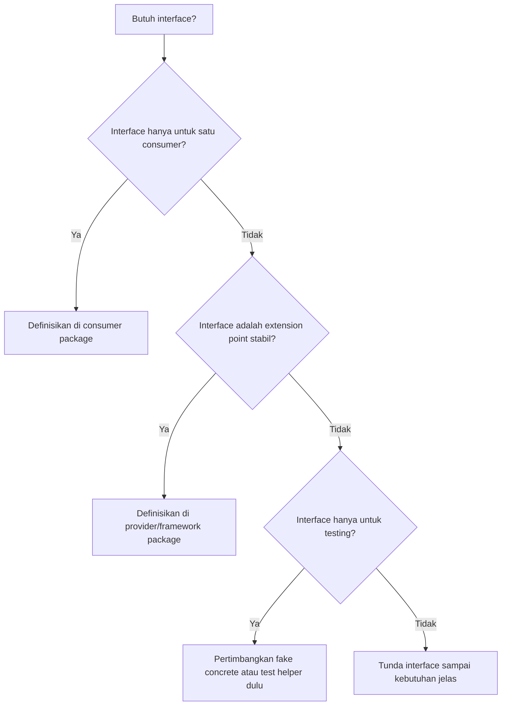

---

## 7. Interface Sebagai Capability, Bukan Role Besar

Desain Go yang kuat sering berbasis capability kecil:

```go
type Reader interface {
    Read([]byte) (int, error)
}

type Writer interface {
    Write([]byte) (int, error)
}

type Closer interface {
    Close() error
}
```

Lalu capability bisa dikomposisi:

```go
type ReadCloser interface {
    Reader
    Closer
}

type ReadWriteCloser interface {
    Reader
    Writer
    Closer
}
```

Dalam domain bisnis, prinsip yang sama berlaku.

```go
type CaseReader interface {
    FindCase(ctx context.Context, id CaseID) (Case, error)
}

type CaseWriter interface {
    SaveCase(ctx context.Context, c Case) error
}

type CaseLocker interface {
    LockCase(ctx context.Context, id CaseID, owner OfficerID) (LockToken, error)
}

type CaseEventAppender interface {
    AppendCaseEvent(ctx context.Context, id CaseID, e CaseEvent) error
}
```

Service tertentu menggabungkan kebutuhan:

```go
type EscalationStore interface {
    CaseReader
    CaseWriter
    CaseEventAppender
}
```

Capability interface membantu desain permission dan failure boundary.

### Capability graph

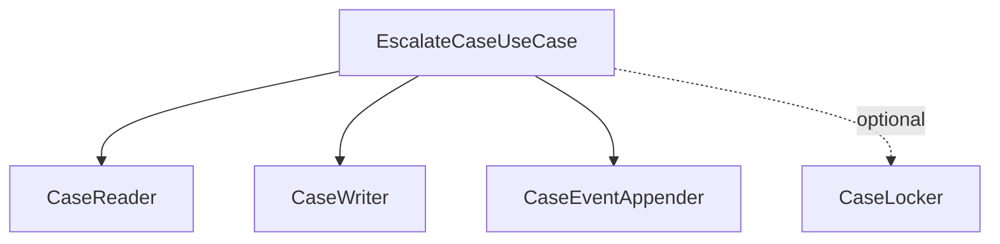

Dengan model ini, dependency tidak lagi berupa “repository besar”, melainkan capability spesifik.

---

## 8. Interface Naming: Nama Harus Menggambarkan Behavior

Go idiom memakai nama kecil berbasis behavior, sering dengan suffix `-er`:

- `Reader`
- `Writer`
- `Closer`
- `Formatter`
- `Scanner`
- `Validator`
- `Authorizer`
- `Resolver`
- `Mapper`

Tetapi nama `-er` bukan dogma. Yang penting nama menggambarkan behavior, bukan implementasi.

### Buruk

```go
type IUserRepository interface { ... }
type UserRepositoryInterface interface { ... }
type UserServiceContract interface { ... }
type AbstractUserStore interface { ... }
```

Masalah:

- membawa idiom Java/C#;
- menambahkan noise;
- tidak menjelaskan capability;
- sering menjadi interface besar.

### Lebih baik

```go
type UserFinder interface {
    FindUser(ctx context.Context, id UserID) (User, error)
}

type UserSaver interface {
    SaveUser(ctx context.Context, u User) error
}

type UserAuthorizer interface {
    CanAccessUser(ctx context.Context, actor Actor, id UserID) (bool, error)
}
```

### Hindari nama yang terlalu generik

```go
type Processor interface {
    Process(context.Context, any) error
}
```

Nama `Processor` sering terlalu kosong. Jika behavior-nya penting, beri domain meaning:

```go
type CaseEventProcessor interface {
    ProcessCaseEvent(ctx context.Context, event CaseEvent) error
}
```

Atau lebih spesifik:

```go
type CaseEscalationEvaluator interface {
    EvaluateEscalation(ctx context.Context, c Case) (EscalationDecision, error)
}
```

Nama interface adalah dokumentasi dependency. Jangan hemat kata sampai semantic contract hilang.

---

## 9. Interface Method Shape: Signature Adalah Contract, Bukan Detail

Signature method pada interface bukan sekadar parameter dan return. Ia membentuk kontrak:

- apakah method bisa dibatalkan?
- apakah method deterministic?
- apakah method mutating?
- apakah error domain jelas?
- apakah return zero value valid?
- apakah input boleh dimodifikasi?
- apakah data ownership berpindah?
- apakah method safe untuk concurrent use?

Contoh:

```go
type Validator interface {
    Validate(ctx context.Context, input Case) error
}
```

Pertanyaan:

- Apakah `Validate` boleh melakukan I/O?
- Mengapa butuh `context.Context`?
- Apakah error berisi field violation atau hanya error generic?
- Apakah `input` boleh dimutasi?
- Apakah validasi pure atau policy-based?

Jika kontrak sebenarnya adalah validasi pure:

```go
type CaseValidator interface {
    ValidateCase(input Case) ValidationResult
}
```

Jika kontrak melakukan policy check ke sistem eksternal:

```go
type CasePolicyChecker interface {
    CheckCasePolicy(ctx context.Context, input Case) (PolicyDecision, error)
}
```

Jangan membuat interface terlalu generic karena “nanti fleksibel”. Fleksibilitas tanpa semantic contract hanya memindahkan kompleksitas ke caller.

---

## 10. Context Dalam Interface: Gunakan Jika Boundary Bisa Blocking, Cancelable, atau Deadline-Aware

Di Go production code, banyak interface method menerima `context.Context`:

```go
type CaseStore interface {
    FindByID(ctx context.Context, id CaseID) (Case, error)
}
```

Ini benar untuk boundary yang bisa:

- melakukan network I/O;
- database query;
- lock acquisition;
- long-running computation;
- memerlukan deadline/cancellation;
- membawa trace/request-scoped metadata.

Tetapi jangan otomatis menaruh `context.Context` di semua method.

### Tidak perlu context

```go
type MoneyFormatter interface {
    FormatMoney(m Money) string
}
```

### Perlu context

```go
type ExchangeRateProvider interface {
    Rate(ctx context.Context, from Currency, to Currency) (Rate, error)
}
```

### Rule sederhana

Gunakan `context.Context` bila operasi:

- bisa menunggu resource;
- bisa gagal karena external system;
- perlu cancellation;
- bagian dari request/trace lifecycle;
- punya timeout/deadline meaningful.

Jangan gunakan context sebagai tempat dependency injection atau optional parameter global.

---

## 11. Error Contract Dalam Interface

Interface method yang mengembalikan `error` harus punya semantic error contract.

Buruk:

```go
type CaseFinder interface {
    Find(ctx context.Context, id CaseID) (Case, error)
}
```

Tanpa dokumentasi, caller tidak tahu:

- error apa jika case tidak ditemukan?
- apakah permission denied dikembalikan sebagai error?
- apakah transient database error dibedakan?
- apakah zero `Case{}` valid saat error non-nil?

Lebih jelas:

```go
// CaseFinder finds a case visible to the caller's execution context.
//
// It returns ErrCaseNotFound if the case does not exist.
// It returns ErrCaseNotAccessible if the case exists but the caller is not allowed to access it.
// If err is non-nil, the returned Case must be ignored.
type CaseFinder interface {
    FindCase(ctx context.Context, id CaseID) (Case, error)
}
```

Interface tanpa error contract membuat caller menebak. Dalam sistem regulatory, ini berbahaya karena not found, not authorized, invalid state, stale version, dan external failure punya konsekuensi berbeda.

### Error classification diagram

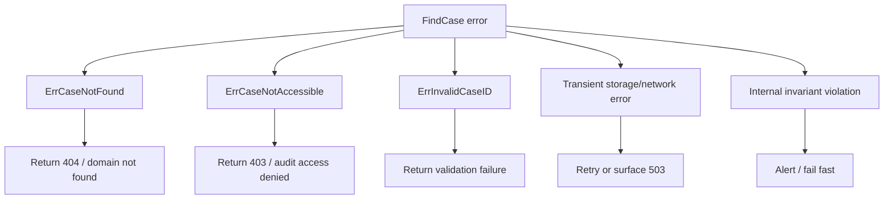

Interface contract harus membantu caller memilih aksi yang benar.

---

## 12. Nil Interface Trap: Masalah Runtime Yang Sangat Sering Menipu

Interface value di Go secara mental dapat dianggap menyimpan dua hal:

```text
(dynamic type, dynamic value)
```

Sebuah interface bernilai nil hanya jika keduanya nil:

```text
(nil, nil)
```

Jika interface menyimpan typed nil pointer, interface itu tidak nil:

```text
(*MyType, nil)
```

### Contoh klasik

```go
package main

import "fmt"

type Notifier interface {
    Notify(message string) error
}

type EmailNotifier struct{}

func (n *EmailNotifier) Notify(message string) error {
    fmt.Println("email:", message)
    return nil
}

func buildNotifier(enabled bool) Notifier {
    var n *EmailNotifier
    if enabled {
        n = &EmailNotifier{}
    }
    return n
}

func main() {
    n := buildNotifier(false)
    fmt.Println(n == nil) // false

    // Panic risk if Notify dereferences receiver internals.
    _ = n.Notify("hello")
}
```

`n` bukan nil karena dynamic type-nya `*EmailNotifier`. Dynamic value-nya nil.

### Diagram

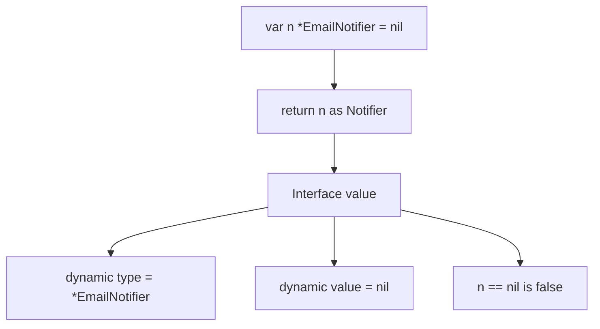

### Cara menghindari

#### 1. Return nil interface secara eksplisit

```go
func buildNotifier(enabled bool) Notifier {
    if !enabled {
        return nil
    }
    return &EmailNotifier{}
}
```

#### 2. Jangan return typed nil sebagai interface

Buruk:

```go
func NewStore(cfg Config) Store {
    var s *SQLStore
    if cfg.Disabled {
        return s
    }
    return &SQLStore{...}
}
```

Baik:

```go
func NewStore(cfg Config) (Store, error) {
    if cfg.Disabled {
        return nil, ErrStoreDisabled
    }
    return &SQLStore{...}, nil
}
```

#### 3. Prefer return concrete dari constructor

```go
func NewSQLStore(cfg Config) (*SQLStore, error) {
    if cfg.Disabled {
        return nil, ErrStoreDisabled
    }
    return &SQLStore{...}, nil
}
```

Lalu inject ke interface consumer.

#### 4. Compile-time assertion bukan nil check

Compile-time assertion memastikan method set cocok, bukan nilai runtime non-nil.

```go
var _ Store = (*SQLStore)(nil)
```

Ini berguna, tetapi tidak menyelesaikan nil interface trap.

---

## 13. Interface Value, Dynamic Dispatch, dan Allocation Awareness

Interface call di Go memakai dynamic dispatch. Untuk banyak aplikasi, overhead-nya kecil dan tidak perlu dipikirkan terlalu awal. Tetapi pada hot path, interface punya konsekuensi:

- dynamic dispatch bisa menghambat inlining;
- boxing ke interface dapat menyebabkan allocation jika value escape;
- `any` membuat type information hilang di compile-time;
- interface dalam loop ketat bisa berdampak;
- generic atau concrete function kadang lebih cocok untuk hot path.

Contoh sederhana:

```go
type Encoder interface {
    Encode(dst []byte, v Event) ([]byte, error)
}

func WriteEvents(w io.Writer, enc Encoder, events []Event) error {
    buf := make([]byte, 0, 4096)
    for _, e := range events {
        out, err := enc.Encode(buf[:0], e)
        if err != nil {
            return err
        }
        if _, err := w.Write(out); err != nil {
            return err
        }
    }
    return nil
}
```

Ini sangat masuk akal jika encoder memang pluggable. Tetapi jika encoder selalu satu concrete implementation dan loop ini sangat panas, interface bisa jadi abstraction cost yang tidak perlu.

Alternative:

```go
func WriteJSONEvents(w io.Writer, enc *JSONEventEncoder, events []Event) error {
    ...
}
```

Atau generic jika operasi bisa diekspresikan sebagai compile-time shape:

```go
type EventEncoder[T any] interface {
    Encode(dst []byte, v T) ([]byte, error)
}

func WriteEvents[T any, E EventEncoder[T]](w io.Writer, enc E, events []T) error {
    ...
}
```

Namun jangan otomatis mengganti interface dengan generics. Pilih berdasarkan kebutuhan.

---

## 14. Interface vs Generics vs Reflection: Jangan Campur Tanpa Alasan

Tiga alat ini sering dianggap saling menggantikan, padahal mental model-nya berbeda.

| Alat | Binding | Cocok Untuk | Risiko |
|---|---|---|---|
| Interface runtime | runtime dynamic dispatch | behavior polymorphism, plugin, dependency boundary, testing seam | over-abstraction, nil trap, method bloat |
| Generics | compile-time parametric polymorphism | container, algorithm, typed utility, zero-cost-ish abstraction | constraint terlalu kompleks, API sulit dibaca |
| Reflection | runtime type inspection | serialization, mapping, validation, framework-like metadata | panic, allocation, unsafe semantics, runtime error |
| Code generation | build-time specialization | DTO mapper, enum, validator, client, repetitive boilerplate | stale generated code, CI drift, generator complexity |

Decision matrix:

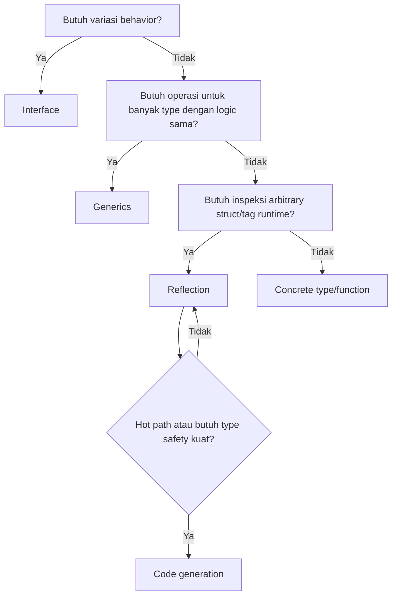

Prinsip:

- Pakai interface untuk behavior.
- Pakai generics untuk type-parametric algorithm/data structure.
- Pakai reflection untuk metadata runtime ketika static typing tidak cukup.
- Pakai codegen saat reflection terlalu mahal/rapuh atau boilerplate terlalu besar.

---

## 15. Compile-Time Interface Assertion

Karena Go tidak punya `implements`, kadang kita ingin memastikan suatu concrete type memenuhi interface tertentu.

```go
type CaseFinder interface {
    FindCase(ctx context.Context, id CaseID) (Case, error)
}

type SQLCaseStore struct { ... }

func (s *SQLCaseStore) FindCase(ctx context.Context, id CaseID) (Case, error) {
    ...
}

var _ CaseFinder = (*SQLCaseStore)(nil)
```

Artinya:

> Compiler, pastikan `*SQLCaseStore` mengimplementasikan `CaseFinder`.

Jika method hilang atau signature berubah, compile error.

### Kapan assertion berguna?

Gunakan untuk:

- public implementation yang memang dimaksudkan memenuhi public interface;
- adapter/wrapper/decorator;
- generated code;
- plugin boundary;
- compile-time safety saat refactor;
- dokumentasi niat desain.

### Kapan tidak perlu?

Tidak perlu menambahkan assertion untuk semua interface kecil lokal jika compiler sudah mengecek saat injection:

```go
type Service struct {
    finder CaseFinder
}

func NewService(finder CaseFinder) *Service {
    return &Service{finder: finder}
}

store := &SQLCaseStore{}
svc := NewService(store) // compiler already checks
```

Assertion berlebihan menjadi noise.

### Value vs pointer assertion

```go
var _ CaseFinder = SQLCaseStore{}      // checks value method set
var _ CaseFinder = (*SQLCaseStore)(nil) // checks pointer method set
```

Jika method memakai pointer receiver, assertion value akan gagal.

---

## 16. Interface Evolution: Menambah Method Adalah Breaking Change

Di Go, interface satisfaction implicit. Ini memudahkan adopsi, tetapi membuat evolusi interface harus hati-hati.

Misalnya public interface:

```go
type Store interface {
    Get(ctx context.Context, key string) ([]byte, error)
    Put(ctx context.Context, key string, value []byte) error
}
```

Jika versi berikutnya menambahkan:

```go
type Store interface {
    Get(ctx context.Context, key string) ([]byte, error)
    Put(ctx context.Context, key string, value []byte) error
    Delete(ctx context.Context, key string) error
}
```

Semua type external yang sebelumnya mengimplementasikan `Store` akan gagal compile jika belum punya `Delete`.

Ini breaking change.

### Evolusi lebih aman: interface composition baru

```go
type Getter interface {
    Get(ctx context.Context, key string) ([]byte, error)
}

type Putter interface {
    Put(ctx context.Context, key string, value []byte) error
}

type Store interface {
    Getter
    Putter
}

type Deleter interface {
    Delete(ctx context.Context, key string) error
}

type MutableStore interface {
    Store
    Deleter
}
```

Consumer yang butuh delete menerima `MutableStore`. Consumer lama tetap aman.

### Evolusi melalui optional capability

```go
func DeleteIfSupported(ctx context.Context, store Store, key string) error {
    deleter, ok := store.(interface {
        Delete(context.Context, string) error
    })
    if !ok {
        return ErrDeleteUnsupported
    }
    return deleter.Delete(ctx, key)
}
```

Ini bisa berguna, tetapi jangan berlebihan. Optional interface runtime dapat membuat behavior tersembunyi jika tidak didokumentasikan.

### Evolusi melalui concrete type

Jika constructor mengembalikan concrete type, provider bisa menambah method tanpa memecahkan caller:

```go
func (s *SQLStore) Delete(ctx context.Context, key string) error { ... }
```

Caller yang butuh bisa mulai memakainya. Interface consumer tetap kecil.

---

## 17. Interface Segregation Versi Go

Di Java SOLID, Interface Segregation Principle mengatakan client tidak boleh dipaksa bergantung pada method yang tidak digunakan.

Di Go, prinsip ini lebih natural karena interface kecil bisa didefinisikan di sisi consumer.

### Java-ish interface segregation

```go
type CaseService interface {
    CreateCase(ctx context.Context, cmd CreateCaseCommand) (CaseID, error)
    AssignCase(ctx context.Context, id CaseID, officer OfficerID) error
    EscalateCase(ctx context.Context, id CaseID, reason Reason) error
    CloseCase(ctx context.Context, id CaseID, outcome Outcome) error
    ReopenCase(ctx context.Context, id CaseID, reason Reason) error
}
```

### Go-style segregation

```go
type CaseCreator interface {
    CreateCase(ctx context.Context, cmd CreateCaseCommand) (CaseID, error)
}

type CaseAssigner interface {
    AssignCase(ctx context.Context, id CaseID, officer OfficerID) error
}

type CaseEscalator interface {
    EscalateCase(ctx context.Context, id CaseID, reason Reason) error
}

type CaseCloser interface {
    CloseCase(ctx context.Context, id CaseID, outcome Outcome) error
}
```

Lalu use case menerima yang dibutuhkan.

```go
type EscalateCaseHandler struct {
    cases CaseEscalator
}
```

Atau jika butuh beberapa capability:

```go
type EscalationWorkflow interface {
    CaseEscalator
    CaseAssigner
}
```

---

## 18. Interface Dan Package Boundary

Interface yang diletakkan di package yang salah menciptakan coupling yang salah.

### Contoh salah: domain package tahu storage interface terlalu teknis

```go
package casepkg

type CaseRepository interface {
    BeginTx(ctx context.Context) (Tx, error)
    Query(ctx context.Context, sql string, args ...any) (Rows, error)
    SaveCase(ctx context.Context, c Case) error
}
```

Domain interface bocor detail database.

### Lebih baik: domain/use case package hanya tahu behavior domain

```go
package caseworkflow

type CaseStore interface {
    FindCase(ctx context.Context, id CaseID) (Case, error)
    SaveCase(ctx context.Context, c Case) error
    AppendEvent(ctx context.Context, id CaseID, e CaseEvent) error
}
```

Infrastructure package mengimplementasikan:

```go
package oraclecase

type Store struct {
    db *sql.DB
}

func (s *Store) FindCase(ctx context.Context, id caseworkflow.CaseID) (caseworkflow.Case, error) { ... }
func (s *Store) SaveCase(ctx context.Context, c caseworkflow.Case) error { ... }
func (s *Store) AppendEvent(ctx context.Context, id caseworkflow.CaseID, e caseworkflow.CaseEvent) error { ... }
```

Dependency direction:

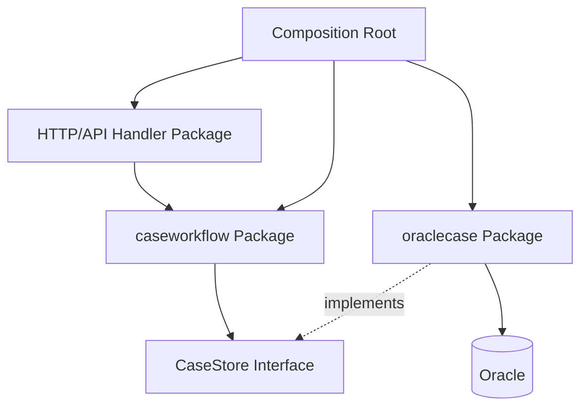

`caseworkflow` tidak import `oraclecase`. `oraclecase` boleh import `caseworkflow` untuk domain type.

---

## 19. Interface Di Domain Model: Hati-Hati Jangan Membuat Domain Menjadi Anemik

Karena Go interface kuat, ada godaan membuat semua domain behavior menjadi interface:

```go
type Case interface {
    ID() CaseID
    Status() Status
    Escalate(reason Reason) error
    Close(outcome Outcome) error
}
```

Ini bisa masuk akal untuk plugin domain, tetapi sering over-abstraction. Domain entity biasanya lebih baik sebagai concrete type dengan method untuk menjaga invariant.

```go
type Case struct {
    id      CaseID
    status  Status
    version Version
}

func (c *Case) Escalate(reason Reason) error {
    if c.status != StatusOpen {
        return ErrInvalidTransition
    }
    c.status = StatusEscalated
    c.version++
    return nil
}
```

Interface lebih cocok untuk boundary external:

```go
type CaseStore interface {
    FindCase(ctx context.Context, id CaseID) (Case, error)
    SaveCase(ctx context.Context, c Case) error
}
```

Domain object tidak perlu interface jika variasi behavior tidak dibutuhkan.

### Rule

Gunakan concrete domain type untuk:

- invariant;
- state transition;
- value object;
- entity behavior;
- business rules yang tidak perlu polymorphism.

Gunakan interface untuk:

- external dependency;
- plugin policy;
- strategy yang benar-benar bervariasi;
- I/O boundary;
- time/random/ID generator;
- audit/event sink;
- authorization checker;
- testing seam pada boundary.

---

## 20. Interface Dan Testing: Test Seam, Bukan Mock Factory Otomatis

Interface sangat berguna untuk testing.

```go
type Clock interface {
    Now() time.Time
}
```

```go
type fixedClock struct {
    t time.Time
}

func (c fixedClock) Now() time.Time { return c.t }
```

Tetapi membuat interface hanya karena ingin mock semua dependency sering menghasilkan desain palsu.

### Over-mocking anti-pattern

```go
type UserService interface {
    CreateUser(ctx context.Context, cmd CreateUserCommand) (User, error)
    ValidateUser(ctx context.Context, cmd CreateUserCommand) error
    NormalizeUser(ctx context.Context, cmd CreateUserCommand) CreateUserCommand
    BuildAuditEvent(ctx context.Context, user User) AuditEvent
}
```

Di sini method internal service dijadikan interface hanya agar bisa mock. Ini memecah unit secara artifisial.

### Lebih baik: interface di boundary yang memang bervariasi

```go
type UserStore interface {
    SaveUser(ctx context.Context, user User) error
}

type AuditSink interface {
    Append(ctx context.Context, event AuditEvent) error
}

type IDGenerator interface {
    NewID() UserID
}
```

Business logic tetap diuji sebagai concrete service.

```go
type CreateUserService struct {
    store UserStore
    audit AuditSink
    ids   IDGenerator
}
```

### Fake lebih baik dari mock kompleks

```go
type fakeUserStore struct {
    saved []User
    err   error
}

func (f *fakeUserStore) SaveUser(ctx context.Context, user User) error {
    if f.err != nil {
        return f.err
    }
    f.saved = append(f.saved, user)
    return nil
}
```

Fake sering lebih jelas daripada generated mock karena:

- menyimpan state yang bisa diassert;
- lebih dekat ke behavior nyata;
- tidak mengunci test ke urutan call yang tidak penting;
- mudah membaca intent test.

---

## 21. Interface Dan Observability Boundary

Interface sering menjadi tempat bagus untuk decorator observability.

Misalnya:

```go
type CaseFinder interface {
    FindCase(ctx context.Context, id CaseID) (Case, error)
}
```

Decorator:

```go
type ObservedCaseFinder struct {
    next CaseFinder
    log  Logger
}

func (o *ObservedCaseFinder) FindCase(ctx context.Context, id CaseID) (Case, error) {
    start := time.Now()
    c, err := o.next.FindCase(ctx, id)
    duration := time.Since(start)

    o.log.Info("case.find",
        "case_id", id,
        "duration_ms", duration.Milliseconds(),
        "error", err,
    )

    return c, err
}
```

Jika interface terlalu besar, decorator harus mengimplementasikan banyak method dan sering menjadi boilerplate. Small interface membuat decorator mudah.

### Decorator chain

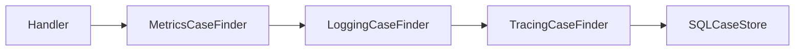

Interface kecil membuat cross-cutting concern composable tanpa inheritance.

---

## 22. Interface Dan Authorization Boundary

Dalam sistem regulatory/case management, interface adalah tempat bagus untuk memisahkan action dari policy.

```go
type CaseAuthorizer interface {
    CanEscalate(ctx context.Context, actor Actor, c Case) (Decision, error)
}

type CaseEscalator interface {
    EscalateCase(ctx context.Context, id CaseID, reason Reason) error
}
```

Use case:

```go
type EscalateCaseService struct {
    cases CaseStore
    authz CaseAuthorizer
    audit AuditSink
}

func (s *EscalateCaseService) Escalate(ctx context.Context, actor Actor, id CaseID, reason Reason) error {
    c, err := s.cases.FindCase(ctx, id)
    if err != nil {
        return err
    }

    decision, err := s.authz.CanEscalate(ctx, actor, c)
    if err != nil {
        return err
    }
    if !decision.Allowed {
        return ErrNotAllowed
    }

    if err := c.Escalate(reason); err != nil {
        return err
    }

    if err := s.cases.SaveCase(ctx, c); err != nil {
        return err
    }

    return s.audit.Append(ctx, AuditEvent{
        Actor:  actor.ID,
        Action: "case.escalate",
        Target: id.String(),
    })
}
```

Di sini interface membentuk boundary:

- storage;
- authorization;
- audit.

Domain transition tetap concrete method pada `Case`.

---

## 23. Interface Dan Transaction Boundary

Interface desain transaksi harus sangat hati-hati. Banyak Java engineer membawa mental model `@Transactional` ke Go. Di Go, boundary transaksi sering harus eksplisit.

Anti-pattern:

```go
type CaseRepository interface {
    Begin(ctx context.Context) (CaseRepository, error)
    Commit() error
    Rollback() error
    SaveCase(ctx context.Context, c Case) error
    AppendEvent(ctx context.Context, e Event) error
}
```

Interface ini mencampur repository dan transaction lifecycle.

Alternatif lebih eksplisit:

```go
type UnitOfWork interface {
    WithinTx(ctx context.Context, fn func(ctx context.Context, tx Tx) error) error
}

type Tx interface {
    CaseStore
    AuditSink
}
```

Use case:

```go
func (s *CloseCaseService) Close(ctx context.Context, id CaseID, outcome Outcome) error {
    return s.uow.WithinTx(ctx, func(ctx context.Context, tx Tx) error {
        c, err := tx.FindCase(ctx, id)
        if err != nil {
            return err
        }
        if err := c.Close(outcome); err != nil {
            return err
        }
        if err := tx.SaveCase(ctx, c); err != nil {
            return err
        }
        return tx.Append(ctx, AuditEvent{Action: "case.close"})
    })
}
```

Diagram:

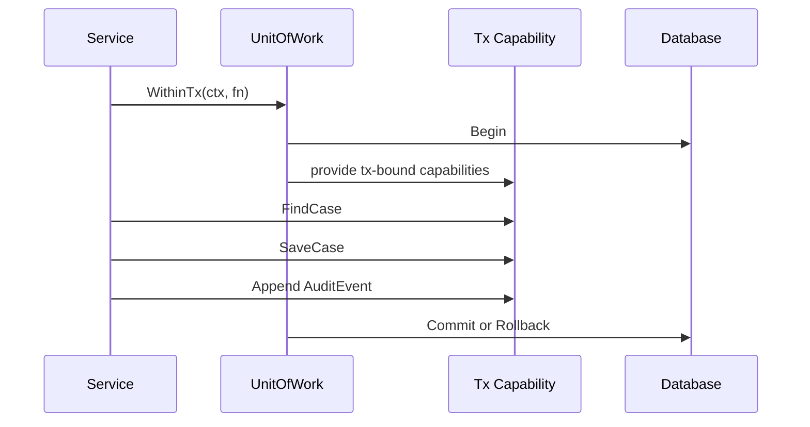

Interface di sini menyatakan capability dalam transaksi, bukan detail `sql.Tx`.

---

## 24. Interface Dan Optional Behavior: Type Assertion Dengan Disiplin

Kadang sebuah object punya optional behavior.

Contoh:

```go
type Flusher interface {
    Flush() error
}
```

Kita bisa mengecek:

```go
func ClosePipeline(w io.Writer) error {
    if f, ok := w.(interface{ Flush() error }); ok {
        if err := f.Flush(); err != nil {
            return err
        }
    }
    if c, ok := w.(io.Closer); ok {
        return c.Close()
    }
    return nil
}
```

Ini berguna untuk adapter umum. Tetapi dalam domain bisnis, optional behavior terlalu banyak bisa membuat sistem sulit diprediksi.

### Risiko optional interface

```go
if reopener, ok := service.(interface{
    ReopenCase(context.Context, CaseID, Reason) error
}); ok {
    return reopener.ReopenCase(ctx, id, reason)
}
return ErrUnsupported
```

Jika behavior penting, lebih baik jadikan dependency eksplisit:

```go
type CaseReopener interface {
    ReopenCase(ctx context.Context, id CaseID, reason Reason) error
}

type ReopenCaseHandler struct {
    cases CaseReopener
}
```

Gunakan optional interface untuk:

- library generic;
- adapter terhadap standard library pattern;
- backward compatibility;
- feature detection yang benar-benar optional.

Hindari untuk core business flow.

---

## 25. Empty Interface / `any`: Kapan Berguna, Kapan Berbahaya

`any` adalah alias untuk `interface{}`. Artinya bisa menampung nilai dari type apa pun.

Berguna untuk:

- logging fields;
- JSON-like dynamic value;
- reflection entry point;
- generic container sebelum type diketahui;
- API kompatibilitas lama;
- testing helper;
- bridge ke framework.

Tetapi `any` berbahaya jika menggantikan domain modeling.

### Buruk

```go
type Event struct {
    Type string
    Data any
}
```

Caller harus type assert manual:

```go
switch e.Type {
case "case.closed":
    data := e.Data.(CaseClosedData)
    ...
}
```

Risiko:

- panic runtime;
- schema tidak jelas;
- tidak discoverable;
- sulit refactor;
- sulit generate docs;
- sulit validate.

### Lebih baik: typed event

```go
type CaseClosedEvent struct {
    CaseID  CaseID
    Outcome Outcome
    At      time.Time
}
```

Atau interface dengan semantic behavior:

```go
type DomainEvent interface {
    EventName() string
    OccurredAt() time.Time
}
```

Tetapi hati-hati: interface event bisa kehilangan data shape. Untuk banyak sistem, concrete event struct + envelope eksplisit lebih baik.

```go
type EventEnvelope[T any] struct {
    ID        EventID
    Name      string
    Occurred  time.Time
    Payload   T
}
```

---

## 26. Interface Dengan Unexported Method: Sealed-Like Contract

Go tidak punya sealed interface seperti beberapa bahasa lain. Tetapi package bisa membuat interface dengan unexported method agar hanya type dalam package yang sama bisa mengimplementasikannya.

```go
package token

type Token interface {
    String() string
    tokenMarker()
}

type AccessToken struct {
    value string
}

func (AccessToken) String() string { return "***" }
func (AccessToken) tokenMarker()   {}
```

Package luar tidak bisa mengimplementasikan `Token` karena tidak bisa mendefinisikan method unexported yang sama dari package `token`.

### Kapan berguna?

- membatasi implementasi domain union;
- mencegah external implementation untuk invariant-sensitive type;
- representasi internal variant;
- AST node internal;
- token/credential handle;
- state machine event tertutup.

### Risiko

- mengurangi extensibility;
- membuat testing external lebih sulit;
- harus didokumentasikan;
- jangan dipakai untuk sekadar “control freak”.

Contoh domain state:

```go
package workflow

type State interface {
    Name() string
    stateMarker()
}

type Draft struct{}
func (Draft) Name() string { return "draft" }
func (Draft) stateMarker() {}

type Submitted struct{}
func (Submitted) Name() string { return "submitted" }
func (Submitted) stateMarker() {}
```

Ini membuat state variant tertutup di package `workflow`.

---

## 27. Interface Dan Generics Constraint: Mirip Sintaks, Beda Peran

Setelah generics, interface bisa dipakai sebagai constraint dengan type set:

```go
type Integer interface {
    ~int | ~int64 | ~uint64
}

func Max[T Integer](a, b T) T {
    if a > b {
        return a
    }
    return b
}
```

Ini bukan runtime interface value biasa. Ini constraint compile-time.

### Runtime interface

```go
type Stringer interface {
    String() string
}

func Print(s Stringer) {
    fmt.Println(s.String())
}
```

Caller mengirim value yang dibungkus interface. Dispatch runtime.

### Constraint interface

```go
type Stringish interface {
    ~string
}

func Normalize[T Stringish](v T) string {
    return strings.TrimSpace(string(v))
}
```

Compiler memastikan `T` punya underlying type string.

### Jangan mencampur role

Buruk:

```go
type Repository[T any] interface {
    ~struct{}
    Save(context.Context, T) error
}
```

Type set constraint seperti ini sering tidak masuk akal untuk runtime behavior. Pisahkan:

```go
type Repository[T any] interface {
    Save(context.Context, T) error
}
```

Constraint type set cocok untuk algorithm/data structure, bukan service boundary umum.

---

## 28. Interface Dan Method Receiver: API Bisa Tidak Sengaja Berubah

Kita sudah bahas method set pada part 003, tetapi di sini kita lihat dampaknya ke interface.

```go
type Validator interface {
    Validate() error
}

type Config struct {}

func (c Config) Validate() error { return nil }
```

Maka keduanya valid:

```go
var _ Validator = Config{}
var _ Validator = (*Config)(nil)
```

Jika diubah ke pointer receiver:

```go
func (c *Config) Validate() error { return nil }
```

Maka:

```go
var _ Validator = Config{} // compile error
var _ Validator = (*Config)(nil)
```

Perubahan receiver bisa menjadi breaking change bagi caller yang menyimpan value sebagai interface.

### Rule

- Jika method tidak mutating dan type kecil/value-like, value receiver memberi fleksibilitas lebih.
- Jika method mutating, sync primitive, large struct, atau identity-bearing object, pointer receiver benar.
- Jangan mengubah receiver public method sembarangan karena memengaruhi method set dan interface satisfaction.

---

## 29. Interface Dan Embedding: Interface Composition Yang Baik vs Bloat

Interface bisa embed interface lain:

```go
type Reader interface {
    Read([]byte) (int, error)
}

type Writer interface {
    Write([]byte) (int, error)
}

type ReadWriter interface {
    Reader
    Writer
}
```

Ini bagus jika komposisi capability jelas.

Dalam domain:

```go
type CaseReader interface {
    FindCase(ctx context.Context, id CaseID) (Case, error)
}

type CaseWriter interface {
    SaveCase(ctx context.Context, c Case) error
}

type CaseEventWriter interface {
    AppendCaseEvent(ctx context.Context, id CaseID, event CaseEvent) error
}

type CaseTxStore interface {
    CaseReader
    CaseWriter
    CaseEventWriter
}
```

Tetapi hati-hati jangan membuat interface raksasa melalui embedding.

```go
type Everything interface {
    UserCreator
    UserUpdater
    UserDeleter
    UserFinder
    CaseCreator
    CaseUpdater
    CaseDeleter
    CaseFinder
    AuditWriter
    EmailSender
    ReportGenerator
}
```

Ini hanya god interface dengan langkah ekstra.

### Smell

Interface embedding menjadi bloat jika:

- namanya terlalu umum;
- dipakai hanya di composition root karena malas wiring;
- tidak ada consumer yang benar-benar butuh semua method;
- dipakai untuk menyembunyikan dependency list yang terlalu panjang;
- membuat testing perlu fake besar.

---

## 30. Interface Dan Dependency Injection Manual

Go tidak membutuhkan DI container untuk membuat interface berguna. Composition root eksplisit sering lebih jelas.

```go
func main() {
    db := mustOpenDB()
    caseStore := oraclecase.NewStore(db)
    authz := policy.NewAuthorizer(...)
    audit := auditlog.NewSink(db)

    closeCase := caseworkflow.NewCloseCaseService(caseworkflow.CloseCaseDeps{
        Cases: caseStore,
        Authz: authz,
        Audit: audit,
    })

    handler := api.NewCloseCaseHandler(closeCase)
    http.ListenAndServe(":8080", handler)
}
```

Constructor menerima interface kecil:

```go
type CloseCaseDeps struct {
    Cases CaseStore
    Authz CaseAuthorizer
    Audit AuditSink
}

func NewCloseCaseService(deps CloseCaseDeps) *CloseCaseService {
    if deps.Cases == nil {
        panic("nil Cases")
    }
    if deps.Authz == nil {
        panic("nil Authz")
    }
    if deps.Audit == nil {
        panic("nil Audit")
    }
    return &CloseCaseService{deps: deps}
}
```

### Nil dependency validation

Karena interface nil trap, validation tetap penting. Namun `deps.Cases == nil` tidak mendeteksi typed nil di dalam interface. Untuk dependency constructor internal, disiplin terbaik:

- jangan pass typed nil;
- constructor provider return concrete;
- fail fast saat provider gagal;
- gunakan tests untuk dependency wiring;
- jika perlu, gunakan reflection helper terbatas untuk detect typed nil, tetapi jangan jadikan default.

Contoh helper:

```go
func isNilInterface(v any) bool {
    if v == nil {
        return true
    }
    rv := reflect.ValueOf(v)
    switch rv.Kind() {
    case reflect.Chan, reflect.Func, reflect.Interface, reflect.Map, reflect.Pointer, reflect.Slice:
        return rv.IsNil()
    default:
        return false
    }
}
```

Helper ini memakai reflection dan harus dipakai hati-hati. Dalam banyak codebase, lebih baik mencegah typed nil lewat factory discipline daripada mengecek semua dependency secara reflektif.

---

## 31. Interface Dan Documentation: Contract Yang Tidak Tertulis Tetap Contract

Interface public harus didokumentasikan. Bukan hanya “apa method ini”, tetapi juga behavior.

Contoh dokumentasi buruk:

```go
// Store stores cases.
type Store interface {
    Save(ctx context.Context, c Case) error
}
```

Lebih baik:

```go
// Store persists case state.
//
// Implementations must treat Case.ID as the stable identity. Save must be atomic
// for a single Case. If optimistic concurrency is enforced and the version is
// stale, Save returns ErrStaleCaseVersion. If ctx is canceled before the write
// is durable, Save returns an error and must not report success.
type Store interface {
    Save(ctx context.Context, c Case) error
}
```

Dokumentasi interface harus menjelaskan:

- ownership input/output;
- mutability;
- concurrency safety;
- error classification;
- idempotency;
- ordering;
- transaction semantics;
- cancellation semantics;
- nil handling;
- partial failure behavior.

Ini penting untuk top-level engineering, karena interface adalah boundary tempat asumsi hidup.

---

## 32. Interface Dan Concurrency Safety

Interface tidak menyatakan apakah implementasi safe untuk concurrent use. Itu harus didokumentasikan.

```go
// Cache is safe for concurrent use by multiple goroutines.
type Cache interface {
    Get(key string) (Value, bool)
    Set(key string, value Value)
}
```

Atau:

```go
// Builder is not safe for concurrent use.
type Builder interface {
    AddField(name string, value any)
    Build() Record
}
```

Jika tidak jelas, caller bisa membuat asumsi salah.

### Contoh failure mode

```go
type TokenProvider interface {
    Token(ctx context.Context) (string, error)
}
```

Apakah `Token` boleh dipanggil concurrently? Jika provider refresh token internal, harus jelas:

- apakah refresh deduplicated?
- apakah ada race?
- apakah token cache protected?
- apakah caller harus synchronize?

Interface kecil tetap butuh contract besar jika behavior-nya stateful.

---

## 33. Interface Dan Idempotency

Banyak interface production harus menyatakan idempotency.

```go
type EventPublisher interface {
    Publish(ctx context.Context, event Event) error
}
```

Pertanyaan:

- Jika `Publish` return error, apakah event mungkin sudah terkirim?
- Apakah retry aman?
- Apakah event ID digunakan untuk deduplication?
- Apakah order dijamin?

Lebih explicit:

```go
// EventPublisher publishes events at least once.
//
// If Publish returns an error, the event may or may not have been accepted by
// the downstream broker. Callers that retry must provide a stable Event.ID so
// consumers can deduplicate.
type EventPublisher interface {
    Publish(ctx context.Context, event Event) error
}
```

Interface signature sederhana bisa menyembunyikan distributed-system semantics yang kompleks.

---

## 34. Interface Dan Ownership: Slice/Map/Pointer Contract

Jika interface method menerima atau mengembalikan slice/map/pointer, ownership harus jelas.

```go
type Encoder interface {
    Encode(dst []byte, value Event) ([]byte, error)
}
```

Contract yang perlu dijelaskan:

- apakah returned slice boleh alias `dst`?
- apakah caller boleh reuse `dst` setelah call?
- apakah encoder menyimpan reference ke `dst`?
- apakah returned bytes immutable?

Contoh dokumentasi:

```go
// Encode appends the encoded representation of value to dst and returns the
// extended buffer. Implementations must not retain dst after Encode returns.
type Encoder interface {
    Encode(dst []byte, value Event) ([]byte, error)
}
```

Untuk map:

```go
type MetadataProvider interface {
    Metadata() map[string]string
}
```

Apakah caller boleh mutate map? Jika tidak, lebih baik:

```go
// Metadata returns a copy. The caller may mutate the returned map.
type MetadataProvider interface {
    Metadata() map[string]string
}
```

Atau gunakan iterator/callback untuk menghindari copy besar.

---

## 35. Interface Dan State Machine / Workflow Design

Dalam regulatory lifecycle, interface sering dipakai untuk memisahkan engine generic dari policy/domain module.

```go
type TransitionPolicy interface {
    Evaluate(ctx context.Context, input TransitionInput) (TransitionDecision, error)
}

type TransitionPersister interface {
    PersistTransition(ctx context.Context, tx TransitionRecord) error
}

type TransitionNotifier interface {
    NotifyTransition(ctx context.Context, event TransitionEvent) error
}
```

Engine:

```go
type Engine struct {
    policy    TransitionPolicy
    persister TransitionPersister
    notifier  TransitionNotifier
}
```

Flow:

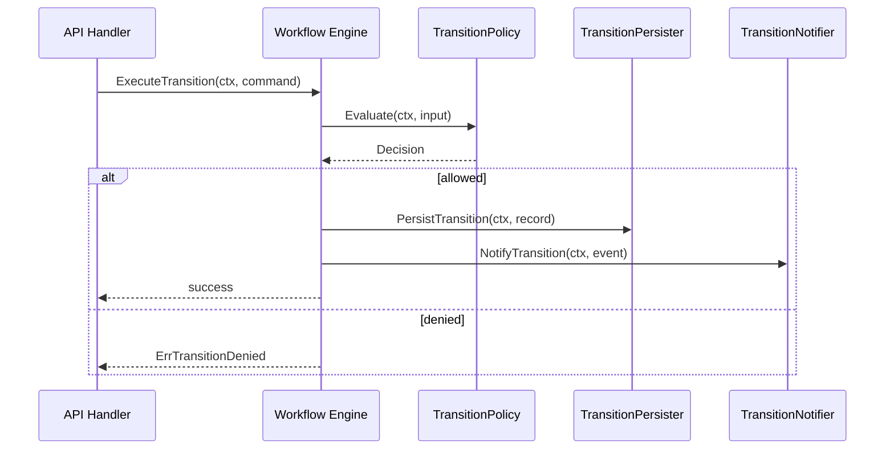

Interface di sini bukan “repository/service interface” generik. Ia merepresentasikan extension point yang stabil.

---

## 36. Interface Dan Hexagonal Architecture: Jangan Terlalu Religius

Dalam hexagonal architecture, interface sering disebut port. Go cocok untuk ini, tetapi jangan membuat port untuk semua hal.

Baik:

```go
type CaseStore interface { ... }
type AuditSink interface { ... }
type NotificationSender interface { ... }
```

Berlebihan:

```go
type CaseIDFormatter interface { ... }
type CaseStatusMapper interface { ... }
type CaseCommandNormalizer interface { ... }
type CaseFieldCopier interface { ... }
```

Jika behavior tidak punya variasi nyata, tidak butuh interface.

### Heuristic

Buat interface jika minimal salah satu benar:

- ada lebih dari satu implementasi nyata;
- dependency external ingin diisolasi;
- boundary perlu fake untuk test;
- capability harus dibatasi;
- plugin/extension point memang product requirement;
- contract perlu distabilkan lintas package/team;
- implementation detail harus disembunyikan dari domain.

Jangan buat interface jika:

- hanya ada satu implementation dan tidak ada variasi yang realistis;
- dibuat hanya untuk “best practice”;
- hanya meniru Java service interface;
- method-nya sama persis dengan concrete type;
- membuat caller kehilangan semantic detail;
- membuat navigation code lebih sulit.

---

## 37. Interface Dan Mock Generation: Kapan Layak

Mock generator berguna pada boundary besar atau external dependency. Tetapi small interface sering bisa difake manual.

Layak memakai mock generation jika:

- interface punya banyak method karena memang protocol eksternal;
- banyak test membutuhkan expectation berbeda;
- interface berasal dari external package;
- call ordering penting secara domain/protocol;
- cost membuat fake manual terlalu tinggi.

Lebih baik fake manual jika:

- interface kecil;
- behavior stateful sederhana;
- test lebih peduli output daripada exact call sequence;
- ingin menghindari brittle test;
- fake bisa dipakai ulang sebagai in-memory implementation.

### Brittle mock smell

Test terlalu fokus pada urutan internal:

```go
mock.EXPECT().FindCase(ctx, id).Return(c, nil)
mock.EXPECT().SaveCase(ctx, gomock.Any()).Return(nil)
mock.EXPECT().Append(ctx, gomock.Any()).Return(nil)
```

Jika urutan internal berubah tetapi behavior sama, test bisa gagal. Kadang ini valid, kadang brittle.

Fake stateful:

```go
type fakeCaseStore struct {
    cases map[CaseID]Case
    saved []Case
}
```

Lalu assert state akhir.

---

## 38. Interface Dan Anti-Corruption Layer

Ketika berhubungan dengan external system, interface dapat membentuk anti-corruption boundary.

Misalnya external identity provider punya client besar:

```go
type ExternalIAMClient struct { ... }

func (c *ExternalIAMClient) FetchUser(ctx context.Context, token string) (ExternalUser, error) { ... }
func (c *ExternalIAMClient) FetchRoles(ctx context.Context, userID string) ([]ExternalRole, error) { ... }
func (c *ExternalIAMClient) Refresh(ctx context.Context) error { ... }
```

Domain tidak perlu tahu external shape.

```go
type IdentityResolver interface {
    ResolveActor(ctx context.Context, credential Credential) (Actor, error)
}
```

Adapter:

```go
type IAMIdentityResolver struct {
    client *ExternalIAMClient
}

func (r *IAMIdentityResolver) ResolveActor(ctx context.Context, credential Credential) (Actor, error) {
    ext, err := r.client.FetchUser(ctx, credential.Token)
    if err != nil {
        return Actor{}, mapIAMError(err)
    }
    return Actor{
        ID:    ActorID(ext.Subject),
        Roles: mapRoles(ext.Roles),
    }, nil
}
```

Interface melindungi domain dari:

- external DTO;
- external error semantics;
- auth protocol detail;
- retry/token refresh mechanics;
- transport concern.

---

## 39. Interface Dan Package Export Surface

Public interface adalah janji jangka panjang. Jangan ekspor interface terlalu cepat.

### Internal interface

```go
type caseFinder interface {
    findCase(ctx context.Context, id CaseID) (Case, error)
}
```

Unexported interface memberi kebebasan refactor.

### Exported interface

```go
// CaseFinder finds cases by identity.
type CaseFinder interface {
    FindCase(ctx context.Context, id CaseID) (Case, error)
}
```

Begitu exported, external package bisa implement. Menambah method menjadi breaking change.

### Rule

Export interface jika:

- external package memang diharapkan mengimplementasikan;
- semantic contract stabil;
- interface kecil;
- dokumentasi lengkap;
- ada test/compatibility expectation;
- nama tidak terlalu umum.

Jangan export interface hanya karena concrete type diekspor.

---

## 40. Interface Dan Adapter Pattern: Mengubah Shape Tanpa Mengubah Provider

Karena interface satisfaction implicit, adapter di Go sering ringan.

Misalnya function dapat menjadi implementation:

```go
type Authorizer interface {
    Authorize(ctx context.Context, actor Actor, action Action, resource Resource) (Decision, error)
}

type AuthorizerFunc func(context.Context, Actor, Action, Resource) (Decision, error)

func (f AuthorizerFunc) Authorize(ctx context.Context, actor Actor, action Action, resource Resource) (Decision, error) {
    return f(ctx, actor, action, resource)
}
```

Pemakaian:

```go
authz := AuthorizerFunc(func(ctx context.Context, actor Actor, action Action, resource Resource) (Decision, error) {
    return Decision{Allowed: actor.HasRole("admin")}, nil
})
```

Ini pattern penting untuk middleware, strategy, testing, dan lightweight plugin.

### Adapter untuk legacy package

```go
type LegacyChecker struct { ... }

func (c *LegacyChecker) Check(user string, permission string) bool { ... }
```

Consumer butuh:

```go
type PermissionChecker interface {
    Can(ctx context.Context, actor Actor, permission Permission) (bool, error)
}
```

Adapter:

```go
type LegacyPermissionAdapter struct {
    checker *LegacyChecker
}

func (a *LegacyPermissionAdapter) Can(ctx context.Context, actor Actor, permission Permission) (bool, error) {
    return a.checker.Check(actor.ID.String(), permission.String()), nil
}
```

Adapter membuat interface consumer tetap bersih.

---

## 41. Interface Dan Decorator Pattern: Interface Kecil Membuat Cross-Cutting Concern Murah

Decorator mengimplementasikan interface yang sama dan meneruskan call ke `next`.

```go
type CaseStore interface {
    FindCase(ctx context.Context, id CaseID) (Case, error)
    SaveCase(ctx context.Context, c Case) error
}
```

Decorator metrics:

```go
type MetricsCaseStore struct {
    next CaseStore
    meter Meter
}

func (m *MetricsCaseStore) FindCase(ctx context.Context, id CaseID) (Case, error) {
    start := time.Now()
    c, err := m.next.FindCase(ctx, id)
    m.meter.Observe("case_store.find", time.Since(start), err)
    return c, err
}

func (m *MetricsCaseStore) SaveCase(ctx context.Context, c Case) error {
    start := time.Now()
    err := m.next.SaveCase(ctx, c)
    m.meter.Observe("case_store.save", time.Since(start), err)
    return err
}
```

Jika `CaseStore` memiliki 20 method, decorator menjadi mahal. Ini alasan praktis untuk small interface.

---

## 42. Interface Dan Facade: Interface Tidak Harus Selalu Kecil Jika Boundary Memang Besar

Small interface penting, tetapi ada boundary yang memang besar. Misalnya SDK facade:

```go
type CaseManagementClient interface {
    CreateCase(ctx context.Context, req CreateCaseRequest) (CreateCaseResponse, error)
    SubmitCase(ctx context.Context, req SubmitCaseRequest) (SubmitCaseResponse, error)
    AssignCase(ctx context.Context, req AssignCaseRequest) (AssignCaseResponse, error)
    CloseCase(ctx context.Context, req CloseCaseRequest) (CloseCaseResponse, error)
}
```

Ini bisa valid jika:

- interface merepresentasikan remote API facade;
- caller memang butuh client lengkap;
- method set mengikuti public protocol;
- compatibility dijaga dengan versioning;
- generated mock/client dibutuhkan.

Tetapi untuk internal use case, jangan otomatis memakai facade besar. Buat interface consumer kecil dari facade jika perlu.

```go
type CaseSubmitter interface {
    SubmitCase(ctx context.Context, req SubmitCaseRequest) (SubmitCaseResponse, error)
}
```

---

## 43. Interface Design Checklist

Sebelum membuat interface, jawab pertanyaan ini:

1. Siapa consumer interface ini?
2. Apakah interface didefinisikan di sisi consumer atau provider? Mengapa?
3. Apakah method yang diminta benar-benar minimum?
4. Apakah nama interface menggambarkan behavior?
5. Apakah error contract jelas?
6. Apakah context diperlukan?
7. Apakah operation blocking/cancelable?
8. Apakah concurrency safety perlu didokumentasikan?
9. Apakah input/output ownership jelas?
10. Apakah interface diekspor? Jika ya, apakah siap menjadi public contract?
11. Apakah menambah method nanti akan memecahkan external implementation?
12. Apakah fake manual cukup untuk test?
13. Apakah interface dibuat hanya karena kebiasaan Java?
14. Apakah concrete type lebih sederhana?
15. Apakah generics lebih tepat?
16. Apakah reflection/codegen sebenarnya yang dibutuhkan?
17. Apakah nil interface trap bisa terjadi di constructor/factory?
18. Apakah compile-time assertion dibutuhkan?
19. Apakah interface ini mendukung observability/decorator dengan baik?
20. Apakah interface ini memperjelas atau justru menyembunyikan domain invariant?

---

## 44. Anti-Pattern Catalog

### 44.1 Interface Untuk Setiap Struct

```go
type UserService interface { ... }
type userService struct { ... }
```

Tidak selalu salah, tetapi smell jika dilakukan otomatis.

### 44.2 `Impl` Naming

```go
type PaymentServiceImpl struct { ... }
```

Nama ini mengindikasikan interface-first Java mindset. Di Go, beri nama berdasarkan implementasi nyata:

```go
type StripePaymentClient struct { ... }
type SQLPaymentStore struct { ... }
type PaymentService struct { ... }
```

### 44.3 Fat Interface

Interface besar membuat consumer bergantung pada method yang tidak dipakai.

### 44.4 Interface Dengan `any` Everywhere

```go
type Handler interface {
    Handle(ctx context.Context, input any) (any, error)
}
```

Kadang berguna untuk framework, tetapi buruk untuk domain core.

### 44.5 Returning Interface From Constructor Tanpa Alasan

```go
func NewService() ServiceInterface { ... }
```

Menyembunyikan concrete type dan mempersulit evolusi.

### 44.6 Interface Tanpa Documentation

Public interface tanpa behavior contract membuat implementer dan caller menebak.

### 44.7 Optional Interface Untuk Core Business Behavior

Jika behavior wajib, jadikan dependency eksplisit. Jangan berharap type assertion runtime.

### 44.8 Interface Sebagai “Mock Hook” Internal

Jangan memecah private helper menjadi interface hanya agar bisa mock. Test behavior, bukan struktur internal.

### 44.9 Nil Interface Trap

Returning typed nil sebagai interface menyebabkan `x == nil` false.

### 44.10 Embedding Interface Terlalu Banyak

God interface bisa dibangun melalui interface embedding. Tetap god interface.

---

## 45. Production Case Study: Regulatory Case Escalation

Kita desain use case escalation dengan interface yang tepat.

### Requirement

- Officer mengajukan escalation untuk case.
- Sistem harus load case.
- Sistem harus check authorization.
- Sistem harus validate transition.
- Sistem harus persist state change.
- Sistem harus append audit event.
- Sistem harus publish domain event.
- Semua dalam transaction untuk state + audit.
- Publish event boleh outbox, bukan direct broker call.

### Interface desain

```go
type CaseStore interface {
    FindCase(ctx context.Context, id CaseID) (Case, error)
    SaveCase(ctx context.Context, c Case) error
}

type AuditSink interface {
    AppendAudit(ctx context.Context, event AuditEvent) error
}

type Outbox interface {
    Enqueue(ctx context.Context, event DomainEvent) error
}

type EscalationAuthorizer interface {
    CanEscalate(ctx context.Context, actor Actor, c Case) (Decision, error)
}

type Tx interface {
    CaseStore
    AuditSink
    Outbox
}

type UnitOfWork interface {
    WithinTx(ctx context.Context, fn func(context.Context, Tx) error) error
}
```

### Service

```go
type EscalateCaseService struct {
    uow   UnitOfWork
    authz EscalationAuthorizer
}

func NewEscalateCaseService(uow UnitOfWork, authz EscalationAuthorizer) *EscalateCaseService {
    if uow == nil {
        panic("nil UnitOfWork")
    }
    if authz == nil {
        panic("nil EscalationAuthorizer")
    }
    return &EscalateCaseService{uow: uow, authz: authz}
}

func (s *EscalateCaseService) Escalate(ctx context.Context, actor Actor, id CaseID, reason Reason) error {
    return s.uow.WithinTx(ctx, func(ctx context.Context, tx Tx) error {
        c, err := tx.FindCase(ctx, id)
        if err != nil {
            return err
        }

        decision, err := s.authz.CanEscalate(ctx, actor, c)
        if err != nil {
            return err
        }
        if !decision.Allowed {
            return ErrEscalationDenied
        }

        if err := c.Escalate(reason); err != nil {
            return err
        }

        if err := tx.SaveCase(ctx, c); err != nil {
            return err
        }

        if err := tx.AppendAudit(ctx, AuditEvent{
            ActorID: actor.ID,
            Action:  "case.escalate",
            Target:  id.String(),
            Reason:  reason.String(),
        }); err != nil {
            return err
        }

        return tx.Enqueue(ctx, CaseEscalatedEvent{
            CaseID: id,
            Actor:  actor.ID,
            Reason: reason,
        })
    })
}
```

### Kenapa interface-nya seperti ini?

- `UnitOfWork` adalah transaction boundary.
- `Tx` menggabungkan capability yang valid dalam transaksi.
- `EscalationAuthorizer` terpisah karena policy bisa berubah.
- `Case` tetap concrete karena invariant state transition harus dekat dengan data.
- `Outbox` dipakai agar publish event atomic dengan state change.
- Tidak ada `CaseServiceInterface` besar.

### Diagram desain

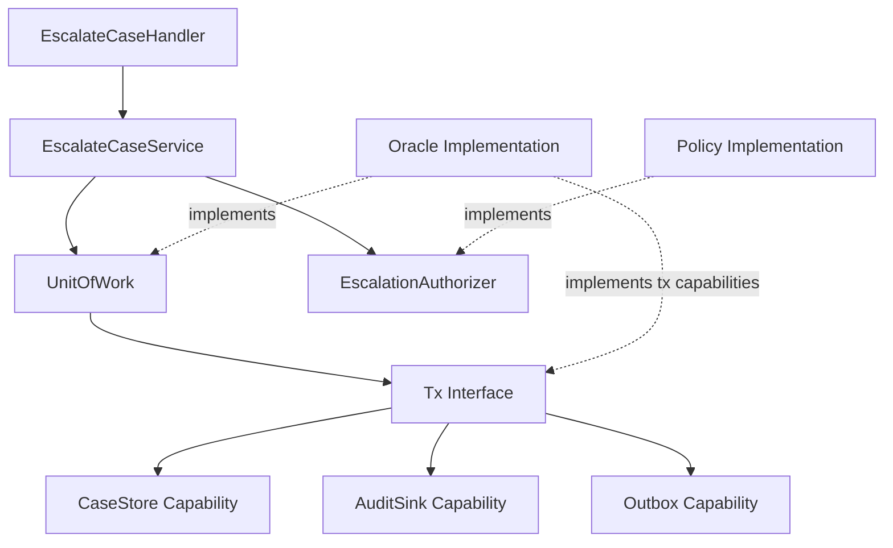

---

## 46. Review Exercise: Pilih Interface Yang Tepat

### Kasus buruk

```go
type ApplicationService interface {
    CreateApplication(ctx context.Context, cmd CreateApplicationCommand) (ApplicationID, error)
    SubmitApplication(ctx context.Context, id ApplicationID) error
    ApproveApplication(ctx context.Context, id ApplicationID) error
    RejectApplication(ctx context.Context, id ApplicationID, reason string) error
    SearchApplications(ctx context.Context, filter ApplicationFilter) ([]Application, error)
    GetApplication(ctx context.Context, id ApplicationID) (Application, error)
    GenerateApplicationPDF(ctx context.Context, id ApplicationID) ([]byte, error)
    SendApplicationEmail(ctx context.Context, id ApplicationID) error
}
```

### Analisis

Interface ini mencampur:

- command use case;
- query use case;
- approval workflow;
- document generation;
- email side effect.

Consumer yang hanya butuh submit dipaksa bergantung pada semua method.

### Refactor

```go
type ApplicationSubmitter interface {
    SubmitApplication(ctx context.Context, id ApplicationID) error
}

type ApplicationApprover interface {
    ApproveApplication(ctx context.Context, id ApplicationID) error
}

type ApplicationRejecter interface {
    RejectApplication(ctx context.Context, id ApplicationID, reason Reason) error
}

type ApplicationFinder interface {
    GetApplication(ctx context.Context, id ApplicationID) (Application, error)
}

type ApplicationSearcher interface {
    SearchApplications(ctx context.Context, filter ApplicationFilter) ([]Application, error)
}

type ApplicationPDFGenerator interface {
    GenerateApplicationPDF(ctx context.Context, id ApplicationID) ([]byte, error)
}

type ApplicationEmailSender interface {
    SendApplicationEmail(ctx context.Context, id ApplicationID) error
}
```

Lalu tiap handler/service menerima interface sesuai kebutuhan.

---

## 47. Practical Heuristics Untuk Engineer Senior

Gunakan aturan praktis berikut:

1. Concrete type dulu, interface nanti saat consumer butuh variasi.
2. Interface didefinisikan oleh consumer, kecuali extension point/protocol stabil.
3. Interface kecil bukan tujuan estetika; itu alat mengontrol coupling.
4. Jangan return interface dari constructor kecuali ada alasan kuat.
5. Jangan buat `Impl` type; beri nama berdasarkan implementasi nyata.
6. Compile-time assertion dipakai untuk niat desain yang penting, bukan untuk semua hal.
7. Public interface harus dianggap compatibility promise.
8. Menambah method ke interface public adalah breaking change.
9. Dokumentasikan error, concurrency, idempotency, ownership, cancellation.
10. Jangan pakai `any` untuk menghindari domain modeling.
11. Jangan pakai optional interface untuk core flow.
12. Jangan jadikan interface sebagai mock factory.
13. Gunakan fake manual untuk interface kecil.
14. Gunakan decorator untuk observability jika interface kecil.
15. Jika interface mulai punya 5+ method, cek apakah itu benar-benar satu capability.
16. Jika interface punya kata `Manager`, `Processor`, `Service`, cek apakah namanya terlalu kabur.
17. Jika semua implementation hanya satu dan tidak ada boundary external, concrete mungkin cukup.
18. Jika behavior perlu compile-time type parameter, pertimbangkan generics.
19. Jika behavior bergantung pada struct tag/arbitrary type, reflection/codegen mungkin lebih cocok.
20. Jika bingung, hapus interface dulu; tambahkan saat pressure desain muncul.

---

## 48. Mental Model Ringkas

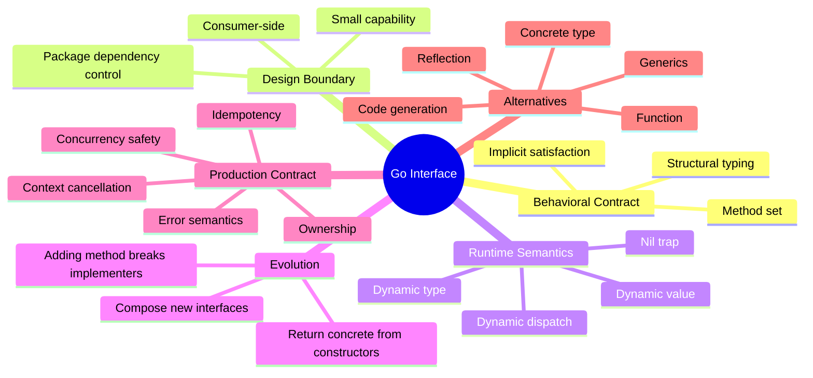

---

## 49. Ringkasan

Interface di Go bukan versi lain dari Java interface. Interface di Go adalah alat untuk menyatakan kebutuhan behavior minimum pada boundary tertentu.

Hal terpenting dari part ini:

- Interface satisfaction di Go implicit dan structural.
- Interface sebaiknya kecil karena kecil berarti coupling rendah.
- Consumer-side interface membuat dependency lebih presisi.
- Provider-side interface tetap valid untuk extension point/protocol stabil.
- Constructor biasanya lebih baik return concrete type.
- Public interface adalah compatibility promise.
- Menambah method ke interface public adalah breaking change.
- Interface value punya nil trap karena menyimpan dynamic type dan dynamic value.
- `any` adalah escape hatch, bukan desain domain default.
- Interface harus didokumentasikan dari sisi behavior, error, concurrency, ownership, dan idempotency.
- Interface bukan hanya untuk testing; interface adalah alat arsitektur.

Jika Java OOP sering bertanya:

> “Class ini mengimplementasikan interface apa?”

Go design yang matang bertanya:

> “Consumer ini membutuhkan behavior minimum apa, di boundary mana, dengan contract apa, dan apakah interface memang alat paling tepat?”

Pertanyaan kedua jauh lebih kuat untuk sistem besar.

---

## 50. Latihan Mandiri

1. Ambil satu Java-style service interface besar dari project lama Anda.
2. Pecah menjadi capability interface kecil dari sisi consumer.
3. Tandai mana yang harus exported dan mana yang cukup unexported.
4. Tulis error contract untuk setiap method.
5. Tulis concurrency contract jika dependency stateful.
6. Buat fake manual untuk satu interface kecil.
7. Buat decorator logging untuk interface tersebut.
8. Cek apakah constructor provider sebaiknya return concrete type.
9. Cari potensi nil interface trap di factory/constructor.
10. Tulis compile-time assertion hanya untuk implementation yang memang harus memenuhi public interface.

---

## 51. Koneksi Ke Part Berikutnya

Part berikutnya akan membahas:

> **Part 007 — Structural Typing Deep Dive: Implicit Implementation, Compile-Time Guarantees, dan API Evolution**

Di Part 006 kita memahami interface sebagai kontrak behavior. Part 007 akan masuk lebih dalam ke konsekuensi structural typing:

- bagaimana implicit implementation memengaruhi package design;
- bagaimana accidental implementation bisa terjadi;
- bagaimana method naming menjadi bagian dari compatibility;
- bagaimana structural typing berbeda dari nominal typing Java;
- bagaimana API evolution harus dirancang agar tidak merusak implementer external;
- bagaimana structural typing berinteraksi dengan embedding, generics, dan code generation.

---

## Status Seri

- Part saat ini: **Part 006 dari 030**
- Status: **belum selesai**
- Part terakhir yang direncanakan: **Part 030 — Capstone handbook: designing a production-grade Go platform library end-to-end**

<!-- NAVIGATION_FOOTER -->
<div class="page-nav">
<a href="./learn-go-composition-oop-functional-reflection-codegen-modules-part-005.md">⬅️ Part 005 — Composition Patterns: Delegation, Wrapper, Adapter, Decorator, Facade, Capability Object</a>
<a href="./index.md">📚 Kategori</a>
<a href="../../index.md">🏠 Home</a>
<a href="./learn-go-composition-oop-functional-reflection-codegen-modules-part-007.md">Part 007 — Structural Typing Deep Dive: Implicit Implementation, Compile-Time Guarantees, dan API Evolution ➡️</a>
</div>
