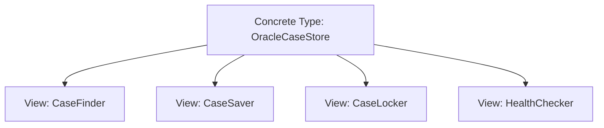
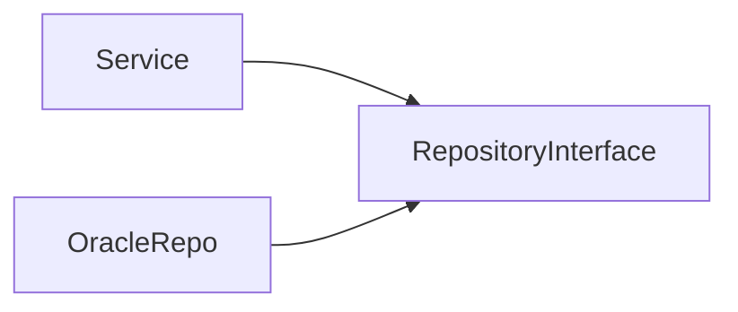
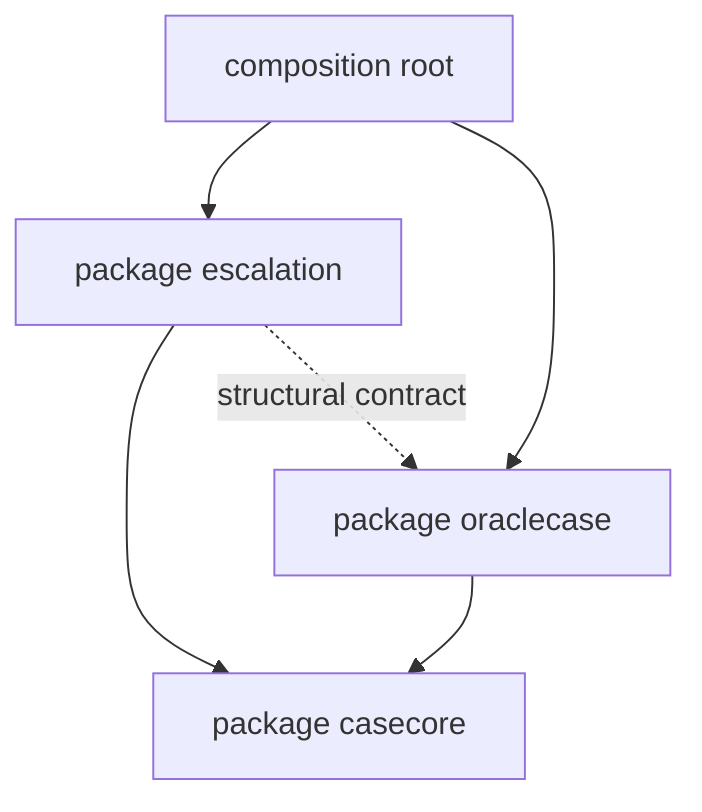
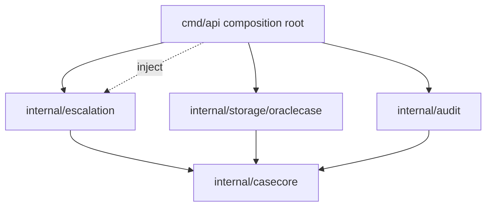
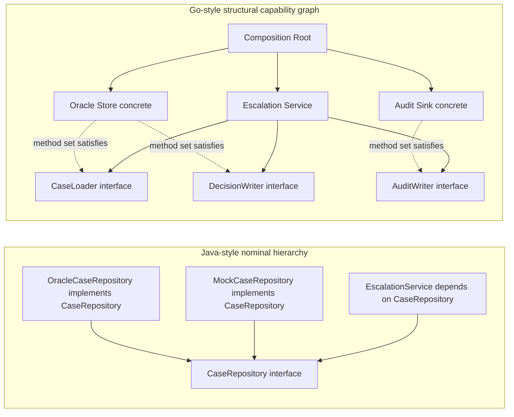

# learn-go-composition-oop-functional-reflection-codegen-modules-part-007.md

# Part 007 — Structural Typing Deep Dive: Implicit Implementation, Compile-Time Guarantees, dan API Evolution

> Seri: `learn-go-composition-oop-functional-reflection-codegen-modules`  
> Bagian: `007 / 030`  
> Target pembaca: Java software engineer / tech lead yang ingin memahami desain Go pada level production engineering.  
> Fokus: structural typing, interface satisfaction, kontrak implisit, evolusi API, compatibility, dan failure mode desain.

---

## 0. Posisi Part Ini di Dalam Seri

Di part sebelumnya kita membahas interface sebagai **behavioral contract**. Kita sudah melihat bahwa interface di Go idealnya kecil, diletakkan dekat consumer, dan mendeskripsikan perilaku yang benar-benar dibutuhkan.

Part ini masuk lebih dalam ke akar desain tersebut: **structural typing**.

Di Java, hubungan antara class dan interface bersifat eksplisit:

```java
class OracleCaseRepository implements CaseRepository {
    ...
}
```

Di Go, hubungan itu muncul dari bentuk method set:

```go
type CaseRepository interface {
    FindByID(ctx context.Context, id CaseID) (Case, error)
}

type OracleCaseRepository struct {
    db *sql.DB
}

func (r *OracleCaseRepository) FindByID(ctx context.Context, id CaseID) (Case, error) {
    ...
}
```

Tidak ada deklarasi `implements`. Jika method set `*OracleCaseRepository` memenuhi method set interface `CaseRepository`, maka type tersebut mengimplementasikan interface itu.

Itu terdengar sederhana. Tetapi konsekuensinya sangat besar untuk:

- API design
- package dependency
- mock/testing
- plugin architecture
- backward compatibility
- accidental implementation
- hidden contract
- refactoring safety
- code generation
- generics constraints
- package ownership
- large-scale repository governance

Part ini bertujuan membangun model mental yang cukup kuat agar Anda tidak hanya tahu bahwa Go memakai structural typing, tetapi juga tahu **cara memanfaatkannya tanpa kehilangan kontrol arsitektur**.

---

## 1. Core Mental Model

### 1.1 Nominal Typing vs Structural Typing

Secara sederhana:

| Model | Relasi tipe ditentukan oleh | Contoh |
|---|---|---|
| Nominal typing | Nama/deklarasi eksplisit | Java class `implements Interface` |
| Structural typing | Bentuk/struktur perilaku | Go type punya method yang diminta interface |

Java nominal typing bertanya:

> “Apakah type ini secara eksplisit menyatakan dirinya sebagai implementasi interface tersebut?”

Go structural typing bertanya:

> “Apakah type ini memiliki method set yang cocok dengan interface tersebut?”

Perbedaannya terlihat kecil, tetapi mengubah arah dependency.

Di Java, provider sering tahu interface apa yang ia implementasikan.

Di Go, provider tidak harus tahu semua interface yang bisa dipenuhi olehnya.

Satu concrete type Go dapat memenuhi banyak interface dari banyak package tanpa import package tersebut.

```go
type FileAuditSink struct {
    path string
}

func (s *FileAuditSink) Write(p []byte) (int, error) { ... }
func (s *FileAuditSink) Close() error { ... }
```

Type ini otomatis dapat memenuhi:

```go
io.Writer
io.Closer
interface { Write([]byte) (int, error) }
interface { Close() error }
interface {
    Write([]byte) (int, error)
    Close() error
}
```

Tanpa `FileAuditSink` tahu semua interface itu.

### 1.2 Interface di Go Adalah View, Bukan Parent Type

Dalam Java, interface sering dipakai sebagai “supertype” di hierarchy.

Dalam Go, interface lebih tepat dipahami sebagai **view terhadap capability**.



Concrete type tetap satu. Interface adalah sudut pandang berbeda terhadap perilaku type tersebut.

Ini membuat desain Go cenderung menghindari hierarchy besar seperti:

```text
Repository
  ├── ReadOnlyRepository
  ├── MutableRepository
  ├── AuditableRepository
  └── TransactionalRepository
```

Go lebih nyaman dengan capability kecil:

```go
type CaseFinder interface {
    FindByID(context.Context, CaseID) (Case, error)
}

type CaseSaver interface {
    Save(context.Context, Case) error
}

type CaseLocker interface {
    Lock(context.Context, CaseID) (UnlockFunc, error)
}
```

Lalu consumer memilih capability yang ia butuhkan.

---

## 2. Structural Typing dan Dependency Direction

### 2.1 Java-Style Provider Interface

Di Java, lazim membuat interface bersama implementasinya:

```java
public interface CaseRepository {
    Case findById(CaseId id);
    void save(Case c);
    void delete(CaseId id);
}

public class OracleCaseRepository implements CaseRepository { ... }
```

Package relationship:



Ini tidak selalu buruk. Tetapi di Go, kalau selalu meniru pola ini, kita sering menciptakan interface terlalu besar dan terlalu dini.

### 2.2 Go-Style Consumer Interface

Di Go, consumer bisa mendeklarasikan interface minimalnya sendiri:

```go
package escalation

type CaseReader interface {
    FindByID(ctx context.Context, id caseid.ID) (casecore.Case, error)
}

type Service struct {
    cases CaseReader
}
```

Provider tidak perlu import package `escalation`.

```go
package oraclecase

type Store struct {
    db *sql.DB
}

func (s *Store) FindByID(ctx context.Context, id caseid.ID) (casecore.Case, error) {
    ...
}
```

Dependency direction menjadi:



Tidak ada dependency langsung dari `oraclecase` ke `escalation` atau sebaliknya untuk implementasi interface. Composition root menyambungkan keduanya.

### 2.3 Arsitektur yang Muncul

Structural typing memungkinkan desain seperti ini:

```text
/internal/app/escalation
    service.go        // declares minimal interfaces it consumes

/internal/storage/oraclecase
    store.go          // concrete implementation

/cmd/api
    main.go           // wires concrete store into service
```

Pola ini membuat package business logic tidak bergantung pada package infrastructure.

Yang penting: ini bukan “clean architecture ritual”. Ini konsekuensi praktis dari structural typing.

---

## 3. Interface Satisfaction: Apa yang Dicek Compiler?

### 3.1 Compiler Mengecek Method Set

Interface satisfaction terjadi ketika method set sebuah type mencakup semua method yang diminta interface.

```go
type Approver interface {
    Approve(ctx context.Context, id CaseID) error
}

type CaseApprovalService struct{}

func (s *CaseApprovalService) Approve(ctx context.Context, id CaseID) error {
    return nil
}

var _ Approver = (*CaseApprovalService)(nil)
```

Line terakhir adalah compile-time assertion.

Artinya:

> Pastikan `*CaseApprovalService` memenuhi interface `Approver`.

Jika signature berubah, build gagal.

### 3.2 Yang Dicek Hanya Signature, Bukan Semantik

Compiler hanya mengecek bentuk method.

```go
type CaseLocker interface {
    Lock(ctx context.Context, id CaseID) error
}
```

Type berikut memenuhi interface:

```go
type NoopLocker struct{}

func (NoopLocker) Lock(ctx context.Context, id CaseID) error {
    return nil
}
```

Secara signature valid. Secara semantik bisa salah total.

Structural typing memberi compile-time guarantee untuk **shape**, bukan untuk **meaning**.

Maka kontrak penting harus ditulis, diuji, dan dimodelkan:

- apakah method idempotent?
- apakah menghormati context cancellation?
- apakah boleh retry?
- apakah safe untuk concurrent use?
- apakah return `nil` berarti sukses final atau hanya accepted?
- apakah error transient/permanent?
- apakah caller memiliki ownership terhadap returned object?

### 3.3 Signature Compatibility Bukan Behavioral Compatibility

Dua method bisa punya signature sama tetapi makna berbeda:

```go
type CaseCloser interface {
    Close(ctx context.Context, id CaseID) error
}
```

`Close` bisa berarti:

- close workflow case
- close DB connection
- close file handle
- close audit batch
- close appeal window

Nama method yang terlalu generik dapat menyebabkan accidental satisfaction.

Untuk domain interface, gunakan nama method yang cukup spesifik:

```go
type CaseLifecycleCloser interface {
    CloseCase(ctx context.Context, id CaseID, reason CloseReason) error
}
```

Ini mengurangi risiko type yang tidak dimaksudkan tiba-tiba memenuhi interface.

---

## 4. Accidental Implementation

### 4.1 Apa Itu Accidental Implementation?

Accidental implementation terjadi ketika sebuah type memenuhi interface tanpa desain/niat eksplisit.

Contoh:

```go
type Resetter interface {
    Reset() error
}

type PasswordAttemptCounter struct{}

func (PasswordAttemptCounter) Reset() error {
    return nil
}
```

Secara compiler, `PasswordAttemptCounter` adalah `Resetter`.

Tetapi apakah `Resetter` yang dimaksud adalah reset apa?

- reset password attempts?
- reset connection?
- reset state machine?
- reset metric counter?

Jika interface berada di package umum dan method-nya terlalu generik, accidental implementation makin mungkin.

### 4.2 Risiko Accidental Implementation

Risiko nyata:

1. **Wrong dependency injection**  
   Type yang salah bisa lolos compile karena signature cocok.

2. **Over-generic abstraction**  
   Interface menjadi terlalu abstrak sehingga kehilangan makna domain.

3. **API evolution trap**  
   Saat interface ditambah method generik, banyak type tiba-tiba terkena konflik atau satisfaction berubah.

4. **Security boundary leakage**  
   Capability yang seharusnya eksplisit menjadi bisa dipenuhi oleh type tidak terkontrol.

5. **Reflection/codegen confusion**  
   Tooling yang memindai interface satisfaction bisa menganggap type relevan padahal tidak.

### 4.3 Cara Mengurangi Accidental Implementation

Gunakan nama method domain-specific untuk interface domain.

Buruk:

```go
type Processor interface {
    Process(context.Context) error
}
```

Lebih baik:

```go
type CaseEscalationProcessor interface {
    ProcessEscalation(ctx context.Context, caseID CaseID) error
}
```

Buruk:

```go
type Validator interface {
    Validate() error
}
```

Lebih baik untuk domain tertentu:

```go
type AppealSubmissionValidator interface {
    ValidateAppealSubmission(ctx context.Context, submission AppealSubmission) error
}
```

Namun jangan terlalu panjang tanpa alasan. Prinsipnya: nama harus cukup spesifik untuk membawa makna kontrak.

---

## 5. Compile-Time Assertion

### 5.1 Mengapa Perlu Assertion Jika Go Sudah Structural?

Karena implementasi interface implicit, kadang kita ingin menyatakan niat eksplisit:

```go
var _ CaseReader = (*Store)(nil)
```

Ini bukan runtime code. Ini compile-time check.

Gunanya:

- mendokumentasikan intent
- mempercepat feedback saat refactor
- menjaga implementasi provider terhadap interface public
- memudahkan reviewer
- membantu code navigation

### 5.2 Kapan Assertion Layak Dipakai?

Gunakan assertion ketika:

1. Provider memang secara resmi menjanjikan implementasi interface public.
2. Interface ada di package lain dan menjadi API contract penting.
3. Type adalah adapter/decorator yang harus transparan terhadap interface tertentu.
4. Generated code harus menjamin shape tertentu.
5. Mock/fake harus memenuhi interface test target.

Contoh:

```go
type AuditDecorator struct {
    next CaseWriter
    audit AuditSink
}

var _ CaseWriter = (*AuditDecorator)(nil)
```

### 5.3 Kapan Assertion Tidak Perlu?

Tidak perlu menulis assertion untuk semua interface kecil yang hanya dipakai lokal.

```go
func Run(r interface{ Read([]byte) (int, error) }) error { ... }
```

Jika interface hanya local dan concrete langsung digunakan di test, assertion berlebihan.

### 5.4 Pattern Assertion untuk Value vs Pointer

Jika method receiver pointer:

```go
func (s *Store) FindByID(ctx context.Context, id CaseID) (Case, error) { ... }
```

Assertion harus:

```go
var _ CaseReader = (*Store)(nil)
```

Bukan:

```go
var _ CaseReader = Store{}
```

Karena `Store` value tidak memiliki pointer receiver method dalam method set-nya.

Jika method receiver value:

```go
func (s Store) FindByID(ctx context.Context, id CaseID) (Case, error) { ... }
```

Maka keduanya bisa memenuhi:

```go
var _ CaseReader = Store{}
var _ CaseReader = (*Store)(nil)
```

Tetapi tetap pilih assertion yang sesuai cara type dipakai dalam production.

---

## 6. Interface Evolution dan Compatibility

### 6.1 Menambah Method ke Interface Itu Breaking Change

Di Go, jika sebuah public interface menambahkan method baru, semua implementor harus menambahkan method tersebut.

Sebelum:

```go
type CaseRepository interface {
    FindByID(ctx context.Context, id CaseID) (Case, error)
}
```

Sesudah:

```go
type CaseRepository interface {
    FindByID(ctx context.Context, id CaseID) (Case, error)
    Save(ctx context.Context, c Case) error
}
```

Semua existing type yang hanya punya `FindByID` akan gagal memenuhi interface baru.

Itu breaking change.

Dalam Java, ini juga breaking untuk implementor, kecuali memakai default method. Di Go tidak ada default method di interface.

### 6.2 Interface Kecil Lebih Mudah Dievolusikan

Daripada:

```go
type CaseRepository interface {
    FindByID(ctx context.Context, id CaseID) (Case, error)
    Search(ctx context.Context, q Query) ([]Case, error)
    Save(ctx context.Context, c Case) error
    Delete(ctx context.Context, id CaseID) error
    Lock(ctx context.Context, id CaseID) error
}
```

Gunakan capability interface:

```go
type CaseFinder interface {
    FindByID(ctx context.Context, id CaseID) (Case, error)
}

type CaseSearcher interface {
    Search(ctx context.Context, q Query) ([]Case, error)
}

type CaseSaver interface {
    Save(ctx context.Context, c Case) error
}
```

Jika perlu kombinasi:

```go
type CaseReadStore interface {
    CaseFinder
    CaseSearcher
}
```

Ini membuat evolusi lebih aman karena perubahan dapat terjadi pada capability tertentu.

### 6.3 Interface Composition untuk Evolusi

Go interface bisa meng-embed interface lain:

```go
type CaseReader interface {
    FindByID(ctx context.Context, id CaseID) (Case, error)
}

type CaseWriter interface {
    Save(ctx context.Context, c Case) error
}

type CaseStore interface {
    CaseReader
    CaseWriter
}
```

Ini berguna untuk menyusun contract besar dari contract kecil.

Namun hati-hati: `CaseStore` tetap contract besar. Jangan pakai hanya karena terlihat rapi.

Gunakan `CaseStore` hanya jika caller memang membutuhkan semua behavior tersebut.

### 6.4 Versioned Interface

Kadang contract memang berevolusi.

Contoh:

```go
type DecisionEngine interface {
    Decide(ctx context.Context, input DecisionInput) (Decision, error)
}

type DecisionEngineV2 interface {
    Decide(ctx context.Context, input DecisionInput) (Decision, error)
    Explain(ctx context.Context, decisionID DecisionID) (Explanation, error)
}
```

Ini bisa diterima jika:

- V1 masih dipertahankan untuk compatibility
- V2 punya semantic addition jelas
- caller memilih interface yang dibutuhkan
- migration plan eksplisit

Namun jangan membuat `V2`, `V3`, `V4` sebagai kebiasaan. Sering kali lebih baik memecah capability:

```go
type DecisionEngine interface {
    Decide(ctx context.Context, input DecisionInput) (Decision, error)
}

type DecisionExplainer interface {
    Explain(ctx context.Context, decisionID DecisionID) (Explanation, error)
}
```

---

## 7. Structural Typing dan Package Boundary

### 7.1 Interface Locality

Rule praktis Go:

> Define interface where it is consumed, not necessarily where it is implemented.

Kenapa?

Karena consumer tahu behavior minimal yang dibutuhkan.

Provider sering punya lebih banyak method daripada yang dibutuhkan consumer.

```go
type OracleCaseStore struct{}

func (s *OracleCaseStore) FindByID(...) (...)
func (s *OracleCaseStore) Save(...) error
func (s *OracleCaseStore) Search(...) (...)
func (s *OracleCaseStore) Archive(...) error
func (s *OracleCaseStore) HealthCheck(...) error
```

Escalation service mungkin hanya butuh:

```go
type CaseLookup interface {
    FindByID(ctx context.Context, id CaseID) (Case, error)
}
```

Jika escalation memakai provider interface besar, escalation menjadi bergantung pada capability yang tidak dipakai.

### 7.2 Provider-Side Interface yang Valid

Walaupun consumer-side interface sering lebih idiomatis, provider-side interface tidak selalu salah.

Provider-side interface valid ketika:

1. Package mendefinisikan protocol umum.  
   Contoh: `io.Reader`, `http.Handler`.

2. Package menyediakan extension point.  
   Contoh: custom policy, custom encoder, custom resolver.

3. Interface adalah bagian dari stable public API.  
   Implementor eksternal memang diharapkan membuat type yang memenuhi contract itu.

4. Interface digunakan untuk plugin/driver ecosystem.

Contoh:

```go
package authorization

type PolicyEvaluator interface {
    Evaluate(ctx context.Context, input PolicyInput) (Decision, error)
}
```

Jika package ini memang menyediakan framework authorization dan user diharapkan membuat evaluator custom, interface provider-side masuk akal.

### 7.3 Interface yang Terlalu Jauh dari Consumer

Masalah umum:

```text
/internal/platform/repository
    type Repository interface { ... huge ... }

/internal/case/escalation
    imports repository.Repository

/internal/case/appeal
    imports repository.Repository

/internal/case/screening
    imports repository.Repository
```

Semua service bergantung pada interface besar yang tidak mereka miliki.

Dampaknya:

- change ripple besar
- test double sulit
- dependency direction kabur
- domain service tahu terlalu banyak
- implementasi baru harus memenuhi terlalu banyak method

Lebih baik:

```text
/internal/case/escalation
    type CaseReader interface { FindByID(...) }

/internal/case/appeal
    type AppealCaseReader interface { FindForAppeal(...) }

/internal/case/screening
    type ScreeningCaseSource interface { LoadScreeningInput(...) }
```

Concrete store bisa memenuhi semuanya tanpa import package consumer.

---

## 8. Structural Typing dan Testing

### 8.1 Test Double Tanpa Framework

Karena interface kecil, test double bisa sangat sederhana.

```go
type fakeCaseReader struct {
    result Case
    err    error
}

func (f fakeCaseReader) FindByID(ctx context.Context, id CaseID) (Case, error) {
    return f.result, f.err
}
```

Tidak butuh mock framework.

### 8.2 Interface Besar Membuat Test Rapuh

Jika service bergantung pada interface besar:

```go
type CaseRepository interface {
    FindByID(...)
    Search(...)
    Save(...)
    Delete(...)
    Lock(...)
    Unlock(...)
    Audit(...)
    HealthCheck(...)
}
```

Fake harus implement semua method, walau test hanya butuh satu.

Akibatnya test double menjadi noisy:

```go
func (f fakeRepo) Search(...) (...) { panic("not used") }
func (f fakeRepo) Save(...) error { panic("not used") }
func (f fakeRepo) Delete(...) error { panic("not used") }
```

Ini sinyal bahwa interface salah tempat atau terlalu besar.

### 8.3 Compile-Time Assertion untuk Fake

Gunakan assertion saat fake penting:

```go
var _ CaseReader = fakeCaseReader{}
```

Untuk fake dengan pointer receiver:

```go
var _ CaseReader = (*fakeCaseReader)(nil)
```

Ini memastikan test double tetap valid saat interface berubah.

---

## 9. Structural Typing dan Generics

### 9.1 Interface Sebagai Runtime Contract vs Constraint

Setelah generics, interface punya dua peran:

1. Runtime interface value.
2. Type constraint.

Runtime interface:

```go
type CaseReader interface {
    FindByID(context.Context, CaseID) (Case, error)
}

func Run(r CaseReader) error { ... }
```

Generic constraint:

```go
type Key interface {
    ~string | ~int64
}

func NewID[T Key](v T) ID[T] { ... }
```

Keduanya sama-sama memakai `interface`, tetapi desain mentalnya berbeda.

### 9.2 Structural Typing Tetap Berlaku pada Method Constraint

```go
type Validator interface {
    Validate() error
}

func ValidateAll[T Validator](items []T) error {
    for _, item := range items {
        if err := item.Validate(); err != nil {
            return err
        }
    }
    return nil
}
```

`T` bisa type apa pun yang method set-nya punya `Validate() error`.

### 9.3 Constraint Type Set Bukan Runtime Interface Biasa

Constraint seperti ini:

```go
type Ordered interface {
    ~int | ~int64 | ~float64 | ~string
}
```

Tidak dimaksudkan untuk dipakai sebagai runtime value:

```go
// bukan pattern yang tepat
var x Ordered
```

Type set constraint adalah alat compile-time untuk generic function/type.

Ini akan dibahas lebih detail di part 008.

Untuk part ini, ingat saja:

> Structural typing di Go berlaku pada method set, sedangkan type set menambahkan dimensi compile-time untuk family of underlying types.

---

## 10. Structural Typing dan Reflection

Reflection bisa memeriksa apakah sebuah type mengimplementasikan interface:

```go
readerType := reflect.TypeOf((*io.Reader)(nil)).Elem()
t := reflect.TypeOf((*MyReader)(nil))

ok := t.Implements(readerType)
```

Namun reflection-based interface matching harus hati-hati.

Masalah:

- pointer vs value method set
- nil type
- embedded promoted method
- unexported method dari package lain
- interface dengan type set constraint tidak sama dengan runtime interface biasa
- semantic contract tetap tidak bisa diperiksa reflection

Reflection hanya bisa menjawab:

> Apakah type shape cocok?

Bukan:

> Apakah behavior benar?

---

## 11. Structural Typing dan Code Generation

Code generator sering memakai structural typing untuk memastikan generated type memenuhi contract tertentu.

Contoh generated mapper:

```go
// Code generated by casemapper; DO NOT EDIT.

package casemapper

var _ CaseToDTOMapper = (*GeneratedCaseMapper)(nil)

type GeneratedCaseMapper struct{}

func (m *GeneratedCaseMapper) ToDTO(c casecore.Case) casedto.CaseDTO {
    ...
}
```

Compile-time assertion penting karena generated code bisa gagal sinkron dengan interface setelah refactor.

### 11.1 Generator Jangan Mengandalkan “Kebetulan Cocok”

Buruk:

```go
// Generated type accidentally has Convert method.
func (m *Mapper) Convert(x any) any { ... }
```

Lebih baik:

```go
type CaseDTOMapper interface {
    MapCaseToDTO(casecore.Case) (casedto.CaseDTO, error)
}
```

Generated code memenuhi contract domain-specific.

---

## 12. Unexported Methods sebagai Sealed-Like Pattern

Go tidak punya sealed interface seperti beberapa bahasa lain. Tetapi package bisa membatasi implementor eksternal dengan unexported method.

```go
package decision

type Outcome interface {
    isOutcome()
}

type Approved struct{}
func (Approved) isOutcome() {}

type Rejected struct{}
func (Rejected) isOutcome() {}
```

Package lain tidak bisa implement `Outcome` karena tidak bisa mendeklarasikan method `isOutcome` yang sama dari package `decision`.

Walaupun namanya sama, unexported identifier dari package berbeda tidak identik dalam konteks method set interface package tersebut.

Ini bisa dipakai untuk closed set-like design.

Namun gunakan hati-hati.

Cocok untuk:

- internal AST node
- domain outcome yang sengaja dibatasi
- generated variant type
- protocol token internal

Tidak cocok untuk:

- public extension point
- plugin interface
- driver interface
- custom policy interface

Jika interface ingin diimplementasikan user, jangan tambahkan unexported method.

---

## 13. Hidden Contract Problem

Structural typing membuat implementasi implicit. Ini bagus untuk decoupling. Tetapi dapat menciptakan hidden contract.

Contoh:

```go
type EscalationStore interface {
    LoadPending(ctx context.Context, limit int) ([]Case, error)
}
```

Signature tidak menjelaskan:

- apakah result ordered?
- apakah limit wajib positif?
- apakah locked rows dikecualikan?
- apakah returned cases sudah filtered by permission?
- apakah method boleh dipanggil concurrently?
- apakah method menggunakan transaction caller?
- apakah context cancellation harus dihormati?

Jadi interface harus dilengkapi dengan comment jika public atau penting.

```go
// EscalationStore loads cases eligible for automatic escalation.
//
// Implementations must:
//   - return cases ordered by oldest SLA breach first;
//   - treat limit <= 0 as invalid and return ErrInvalidLimit;
//   - exclude cases currently locked by a human reviewer;
//   - respect context cancellation;
//   - be safe for concurrent use by multiple workers.
type EscalationStore interface {
    LoadPending(ctx context.Context, limit int) ([]Case, error)
}
```

In production, interface comment bukan kosmetik. Itu bagian dari contract.

---

## 14. Structural Typing Design Rules

### Rule 1 — Interface Mengekspresikan Need, Bukan Inventory

Buruk:

```go
type CaseRepository interface {
    FindByID(...)
    Save(...)
    Delete(...)
    Search(...)
    Export(...)
    Import(...)
    Lock(...)
}
```

Lebih baik:

```go
type CaseFinder interface {
    FindByID(...)
}
```

Consumer tidak butuh tahu semua inventory provider.

### Rule 2 — Nama Method Harus Membawa Makna Kontrak

Buruk:

```go
type Handler interface {
    Handle(any) error
}
```

Lebih baik:

```go
type AppealSubmissionHandler interface {
    HandleAppealSubmission(ctx context.Context, cmd SubmitAppealCommand) error
}
```

### Rule 3 — Jangan Membuat Interface Untuk Satu Concrete Type Tanpa Alasan

Buruk:

```go
type UserService interface {
    Register(...)
}

type userService struct{}
```

Jika tidak ada consumer seam, test seam, extension point, atau boundary, interface ini hanya ceremony.

Gunakan concrete type dulu:

```go
type Service struct {
    store *Store
}
```

Tambahkan interface ketika ada kebutuhan nyata.

### Rule 4 — Return Concrete, Accept Interface

Sering kali API package lebih baik return concrete type dan menerima interface.

```go
func NewStore(db *sql.DB) *Store {
    return &Store{db: db}
}
```

Jangan:

```go
func NewStore(db *sql.DB) CaseRepository {
    return &Store{db: db}
}
```

Kecuali memang ingin menyembunyikan implementasi dan contract interface adalah public abstraction utama.

Return concrete memberi user fleksibilitas memakai method tambahan, compile-time assertion, dan embedding/decorator.

### Rule 5 — Interface Public Harus Stabil

Setiap public interface adalah janji kepada implementor.

Sebelum membuat public interface, tanyakan:

- siapa implementor eksternal?
- apakah method list sudah minimal?
- apakah semantics terdokumentasi?
- apakah future method addition akan breaking?
- apakah extension lebih baik lewat option/function?
- apakah unexported method diperlukan untuk menutup implementor?

---

## 15. Case Study: Regulatory Case Escalation Engine

Misal kita membangun engine untuk enforcement case lifecycle.

### 15.1 Kebutuhan

Service escalation perlu:

1. Load case by ID.
2. Check current state.
3. Evaluate escalation policy.
4. Persist escalation decision.
5. Write audit trail.

Java-style desain mungkin:

```java
interface CaseRepository {
    Case findById(CaseId id);
    void save(Case c);
    List<Case> search(Query q);
    void lock(CaseId id);
    void unlock(CaseId id);
}

interface AuditRepository {
    void save(AuditTrail audit);
}
```

Go structural design bisa lebih sempit:

```go
package escalation

type CaseLoader interface {
    LoadCaseForEscalation(ctx context.Context, id caseid.ID) (casecore.Case, error)
}

type DecisionWriter interface {
    SaveEscalationDecision(ctx context.Context, decision Decision) error
}

type AuditWriter interface {
    WriteEscalationAudit(ctx context.Context, entry AuditEntry) error
}

type Policy interface {
    EvaluateEscalation(ctx context.Context, c casecore.Case) (Decision, error)
}
```

Service:

```go
type Service struct {
    cases     CaseLoader
    decisions DecisionWriter
    audit     AuditWriter
    policy    Policy
}
```

Concrete store:

```go
package oraclecase

type Store struct {
    db *sql.DB
}

func (s *Store) LoadCaseForEscalation(ctx context.Context, id caseid.ID) (casecore.Case, error) {
    ...
}

func (s *Store) SaveEscalationDecision(ctx context.Context, d escalation.Decision) error {
    ...
}
```

Tetapi hati-hati: jika `oraclecase` import `escalation` untuk type `Decision`, dependency bisa mengarah ke domain service. Lebih baik letakkan shared domain type di package netral:

```text
/internal/casecore
/internal/escalation
/internal/storage/oraclecase
```

Atau definisikan persistence DTO di storage boundary.

### 15.2 Diagram Dependency yang Sehat



`escalation` mendefinisikan behavior yang dibutuhkan. `oraclecase.Store` memenuhi contract melalui method set. `cmd/api` menyambungkan.

### 15.3 Contract Documentation

```go
// CaseLoader loads a case specifically for escalation evaluation.
//
// Implementations must:
//   - return ErrCaseNotFound when the case does not exist;
//   - return ErrCaseNotEscalatable when the case is in a terminal state;
//   - include the current lifecycle state and SLA attributes;
//   - respect context cancellation;
//   - be safe for concurrent calls.
type CaseLoader interface {
    LoadCaseForEscalation(ctx context.Context, id caseid.ID) (casecore.Case, error)
}
```

Ini jauh lebih kuat daripada:

```go
type Repository interface {
    FindByID(context.Context, caseid.ID) (casecore.Case, error)
}
```

Karena method name dan comment membawa domain invariant.

---

## 16. Failure Modes dalam Structural Typing

### 16.1 Fat Interface

Gejala:

- test fake banyak panic method
- implementor sulit dibuat
- interface berubah sering
- caller hanya pakai 1-2 method
- package dependency melebar

Solusi:

- pecah interface berdasarkan capability
- pindahkan interface ke consumer
- compose interface hanya di boundary yang perlu

### 16.2 Premature Interface

Gejala:

- interface hanya punya satu implementasi
- interface ada di package yang sama dengan concrete type
- tidak dipakai untuk testing atau extension
- nama interface sama dengan concrete type: `FooService interface`, `fooService struct`

Solusi:

- hapus interface
- expose concrete type
- tambahkan interface nanti saat ada seam nyata

### 16.3 Accidental Satisfaction

Gejala:

- method terlalu generik: `Run`, `Do`, `Process`, `Handle`, `Validate`
- interface berada di shared/common package
- wrong type lolos injection

Solusi:

- gunakan nama method domain-specific
- jangan taruh interface domain di common package
- tambahkan compile-time assertions di provider penting
- tambahkan integration wiring test

### 16.4 Semantic Drift

Gejala:

- method signature tetap sama tetapi makna berubah
- implementor lama tidak update behavior
- tests hanya compile, tidak verify semantics

Solusi:

- tulis contract comment
- contract test suite
- versioned/capability interface
- migration note

### 16.5 Interface Pollution

Gejala:

- setiap concrete type punya interface sendiri
- banyak file `interfaces.go`
- package penuh abstraction tanpa behavior
- reader harus loncat-loncat untuk memahami flow

Solusi:

- return concrete
- accept interface hanya di boundary
- define interface di consumer
- delete abstraction yang tidak memberi decoupling nyata

---

## 17. Contract Test Pattern

Compile-time assertion mengecek shape. Contract test mengecek behavior.

```go
type CaseLoaderContract struct {
    NewLoader func(t *testing.T) escalation.CaseLoader
    SeedCase  func(t *testing.T, c casecore.Case)
}

func (c CaseLoaderContract) TestLoadExistingCase(t *testing.T) {
    loader := c.NewLoader(t)
    expected := casecore.NewCase(...)
    c.SeedCase(t, expected)

    got, err := loader.LoadCaseForEscalation(context.Background(), expected.ID())
    if err != nil {
        t.Fatal(err)
    }
    if got.ID() != expected.ID() {
        t.Fatalf("unexpected case id: got %v want %v", got.ID(), expected.ID())
    }
}
```

Provider test:

```go
func TestOracleStore_CaseLoaderContract(t *testing.T) {
    contract := CaseLoaderContract{
        NewLoader: func(t *testing.T) escalation.CaseLoader {
            return newTestOracleStore(t)
        },
        SeedCase: seedOracleCase,
    }

    contract.TestLoadExistingCase(t)
}
```

Ini penting untuk public interface yang punya banyak implementor.

---

## 18. Structural Typing dan Security Boundary

Structural typing bisa berbahaya jika capability sensitif dibuat terlalu generik.

Buruk:

```go
type Authorizer interface {
    Allow(ctx context.Context, action string) bool
}
```

Apa resource-nya? Siapa principal-nya? Bagaimana policy decision dievaluasi? Apakah deny by default?

Lebih aman:

```go
type CaseAccessAuthorizer interface {
    AuthorizeCaseAction(ctx context.Context, input CaseActionAuthorization) (AuthorizationDecision, error)
}
```

Dengan input eksplisit:

```go
type CaseActionAuthorization struct {
    Principal Principal
    CaseID    caseid.ID
    Action    CaseAction
    Context   RequestContext
}
```

Untuk security-sensitive interface, hindari accidental implementation.

Terapkan:

- nama method domain-specific
- input/output typed jelas
- deny-by-default semantics
- auditability
- contract tests
- wiring tests
- jangan pakai `any` untuk decision input kecuali ada alasan kuat

---

## 19. Wiring Test untuk Mencegah Salah Inject

Karena type bisa memenuhi interface implicit, composition root perlu diuji.

```go
func TestWiring_EscalationService(t *testing.T) {
    deps := NewTestDependencies(t)

    svc := escalation.NewService(escalation.Dependencies{
        Cases:     deps.CaseStore,
        Decisions: deps.DecisionStore,
        Audit:     deps.AuditStore,
        Policy:    deps.Policy,
    })

    if svc == nil {
        t.Fatal("service is nil")
    }
}
```

Jika memakai compile-time assertion di package provider:

```go
var _ escalation.CaseLoader = (*Store)(nil)
var _ escalation.DecisionWriter = (*Store)(nil)
```

Ini membantu, tetapi jangan sampai storage package harus import application service package jika menyebabkan cycle atau dependency inversion rusak.

Alternatifnya letakkan interface di package domain contract netral jika contract memang lintas layer.

---

## 20. Interface Placement Decision Matrix

| Situasi | Interface ditempatkan di mana? | Alasan |
|---|---|---|
| Consumer hanya butuh subset kecil dari provider | Consumer package | Consumer owns need |
| Public protocol umum seperti Reader/Writer | Provider/framework package | Interface adalah extension point |
| Banyak implementor eksternal diharapkan | Provider/framework package | Contract memang public |
| Interface hanya untuk test satu service | Consumer test atau consumer package | Hindari pollution global |
| Interface besar mencerminkan storage inventory | Jangan dibuat atau pecah | Biasanya over-abstraction |
| Cross-layer contract stabil | Domain/core contract package | Hindari dependency cycle |
| Security-sensitive authorization decision | Domain/security package dengan contract kuat | Perlu semantic clarity |

---

## 21. Structural Typing Review Checklist

Gunakan checklist ini saat code review.

### 21.1 Untuk Interface Baru

Tanyakan:

- Siapa consumer interface ini?
- Apakah interface diletakkan dekat consumer?
- Apakah method list minimal?
- Apakah semua method dipakai caller?
- Apakah nama method cukup spesifik?
- Apakah comment menjelaskan semantic contract?
- Apakah interface public akan stabil?
- Apakah menambah method nanti akan breaking?
- Apakah interface ini sebenarnya hanya premature abstraction?
- Apakah concrete type lebih baik?

### 21.2 Untuk Implementasi Concrete

Tanyakan:

- Interface apa yang sengaja dipenuhi?
- Perlukah compile-time assertion?
- Apakah pointer/value receiver sesuai contract?
- Apakah method name berpotensi accidental implementation?
- Apakah behavior sesuai comment interface?
- Apakah concurrency semantics jelas?
- Apakah context cancellation dihormati?
- Apakah error semantics konsisten?

### 21.3 Untuk Package Boundary

Tanyakan:

- Apakah package consumer import provider concrete package secara tidak perlu?
- Apakah provider import consumer package dan menyebabkan coupling aneh?
- Apakah composition root menyambungkan dependency?
- Apakah interface berada di common package tanpa alasan kuat?
- Apakah dependency graph tetap acyclic dan jelas?

---

## 22. Diagram: Dari Nominal Hierarchy ke Capability Graph



Java-style diagram menekankan declaration. Go-style diagram menekankan capability dan wiring.

---

## 23. Advanced Edge Cases

### 23.1 Embedded Methods Bisa Menyebabkan Interface Satisfaction

```go
type Base struct{}

func (Base) Validate() error { return nil }

type UserInput struct {
    Base
}
```

`UserInput` dapat memenuhi:

```go
type Validator interface {
    Validate() error
}
```

karena method `Validate` dipromosikan.

Ini bisa disengaja, tetapi juga bisa accidental.

Untuk domain type sensitif, hindari embedding type yang membawa method publik generik.

### 23.2 Pointer Embedding dan Nil Risk

```go
type Logger struct{}
func (*Logger) Log(msg string) {}

type Service struct {
    *Logger
}
```

`*Service` dapat punya promoted method `Log`, tetapi jika embedded pointer nil, call bisa panic tergantung method implementation.

Structural satisfaction tidak menjamin embedded dependency sudah diinisialisasi.

### 23.3 Unexported Methods dan Cross-Package Satisfaction

Interface dengan unexported method dari package tertentu tidak bisa diimplementasikan dari package lain secara normal.

Ini bisa dipakai sebagai sealed-like pattern.

Namun jika Anda tanpa sadar menambahkan unexported method ke public interface, Anda menutup extension point eksternal.

### 23.4 Method Signature Harus Exact

Signature harus exact, termasuk:

- parameter type
- return type
- variadicness
- package identity type
- pointer/value type
- named type berbeda walau underlying sama

Contoh:

```go
type ID string

type Finder interface {
    Find(ID) error
}

type Store struct{}

func (Store) Find(id string) error { return nil }
```

`Store` tidak memenuhi `Finder`, karena `string` bukan `ID`.

Ini bagus untuk domain safety.

---

## 24. Practical Heuristics untuk Java Engineer

### 24.1 Jangan Cari “Base Class”

Jika Anda ingin membuat abstract base class di Go, berhenti dulu.

Tanyakan:

- Apakah yang ingin saya reuse adalah data?
- Apakah yang ingin saya reuse adalah behavior?
- Apakah yang ingin saya enforce adalah contract?
- Apakah yang ingin saya vary adalah policy?
- Apakah dependency bisa diinjeksi sebagai small interface?

Di Go, jawaban umum:

- data reuse: named field atau embedding hati-hati
- behavior reuse: function/helper/delegation
- contract: interface kecil
- variation: function/policy interface
- lifecycle: explicit constructor + unexported fields

### 24.2 Jangan Menyamakan Interface dengan “Service Layer Interface”

Di Java Spring, interface sering dibuat untuk service walau hanya satu implementasi.

Di Go, ini sering menjadi noise.

Lebih baik:

```go
type Service struct {
    cases CaseLoader
}
```

bukan:

```go
type ServiceInterface interface {
    Escalate(...) error
}

type ServiceImpl struct { ... }
```

Kecuali ada alasan nyata: plugin, boundary, decorator, test seam lintas package, atau public API.

### 24.3 Jangan Menaruh Semua Interface di `interfaces.go`

File `interfaces.go` sering menjadi tanda desain nominal-style.

Lebih baik letakkan interface dekat use case.

```text
escalation/
    service.go        // CaseLoader interface dekat Service
    policy.go         // Policy interface dekat policy use
    audit.go          // AuditWriter jika spesifik audit escalation
```

---

## 25. Summary Mental Model

Structural typing di Go berarti:

1. Type tidak perlu mendeklarasikan interface yang diimplementasikan.
2. Interface adalah view terhadap behavior, bukan parent type.
3. Compiler mengecek method shape, bukan semantic meaning.
4. Interface kecil membuat dependency lebih tajam dan test lebih ringan.
5. Interface besar sulit berevolusi dan mudah menjadi bottleneck.
6. Accidental implementation adalah risiko nyata jika method terlalu generik.
7. Compile-time assertion mendokumentasikan intent dan mempercepat refactor feedback.
8. Contract comment dan contract test diperlukan untuk semantic guarantee.
9. Consumer-side interface sering lebih sehat daripada provider-side interface, tetapi tidak absolut.
10. Public interface adalah compatibility promise.

---

## 26. Production Checklist

Sebelum merge interface baru:

```text
[ ] Interface punya consumer jelas.
[ ] Method list minimal.
[ ] Nama method membawa semantic intent.
[ ] Interface tidak hanya mirror concrete type.
[ ] Tidak diletakkan di common package tanpa alasan kuat.
[ ] Public interface punya comment contract.
[ ] Error, context, concurrency, ownership semantics jelas.
[ ] Breaking-change risk dipahami.
[ ] Test double tidak perlu implement method yang tidak dipakai.
[ ] Compile-time assertion ditambahkan jika provider secara resmi memenuhi contract.
[ ] Contract test disiapkan jika ada banyak implementor atau behavior kritikal.
[ ] Tidak ada accidental satisfaction dari embedding/method generik.
```

---

## 27. Latihan Mandiri

### Latihan 1 — Pecah Fat Interface

Ambil interface seperti ini:

```go
type CaseRepository interface {
    FindByID(ctx context.Context, id CaseID) (Case, error)
    Search(ctx context.Context, q Query) ([]Case, error)
    Save(ctx context.Context, c Case) error
    Delete(ctx context.Context, id CaseID) error
    Lock(ctx context.Context, id CaseID) error
    Unlock(ctx context.Context, id CaseID) error
    WriteAudit(ctx context.Context, entry AuditEntry) error
}
```

Pecah menjadi capability interface berdasarkan consumer:

- escalation service
- appeal submission service
- case closure service
- audit exporter

### Latihan 2 — Deteksi Accidental Implementation

Cari method generik di codebase:

```text
Run
Do
Process
Handle
Validate
Reset
Close
Start
Stop
```

Tentukan mana yang perlu dibuat lebih domain-specific.

### Latihan 3 — Tulis Contract Comment

Untuk interface:

```go
type PolicyEvaluator interface {
    Evaluate(ctx context.Context, input PolicyInput) (Decision, error)
}
```

Tulis comment yang menjelaskan:

- context semantics
- error semantics
- default decision
- audit expectation
- concurrency safety
- deterministic behavior

### Latihan 4 — Buat Wiring Test

Buat test composition root untuk memastikan concrete provider memenuhi semua dependency service tanpa salah inject.

---

## 28. Referensi Resmi yang Relevan

- Go Language Specification — method sets, interface types, assignability, type identity.
- Go Modules Reference — package/module boundary dan compatibility.
- Effective Go — interface idioms dan naming.
- Go Code Review Comments — interface placement, receiver, naming, and API clarity.
- Package `io` — contoh interface kecil yang kuat (`Reader`, `Writer`, `Closer`).
- Package `net/http` — contoh provider-side interface sebagai extension point (`Handler`).
- Package `reflect` — interface implementation check via `Type.Implements`.

---

## 29. Penutup

Structural typing adalah salah satu pembeda paling penting antara Go dan Java.

Jika dipakai dangkal, ia hanya terasa seperti “tidak perlu tulis implements”.

Jika dipahami dalam, ia menjadi alat desain arsitektur:

- dependency lebih tajam,
- package boundary lebih bersih,
- test seam lebih ringan,
- provider tidak dipaksa tahu semua consumer,
- public API lebih hati-hati,
- composition root lebih eksplisit,
- kontrak behavior lebih dekat ke use case.

Kunci utamanya: compiler hanya menjaga bentuk. Engineer harus menjaga makna.

Part berikutnya akan masuk ke **interface type sets & generics constraints**: bagaimana `interface` modern di Go bukan hanya runtime contract, tetapi juga compile-time constraint untuk generic programming.

---

# Status Seri

- Part selesai: `007 / 030`
- Seri belum selesai.
- Lanjut ke: `learn-go-composition-oop-functional-reflection-codegen-modules-part-008.md`


<!-- NAVIGATION_FOOTER -->
<div class="page-nav">
<a href="./learn-go-composition-oop-functional-reflection-codegen-modules-part-006.md">⬅️ Part 006 — Interface Sebagai Behavioral Contract: Small Interface, Consumer-Side Interface, Nil Trap, dan API Evolution</a>
<a href="./index.md">📚 Kategori</a>
<a href="../../index.md">🏠 Home</a>
<a href="./learn-go-composition-oop-functional-reflection-codegen-modules-part-008.md">Part 008 — Interface Type Sets & Generics Constraints: `~T`, Union Terms, `comparable`, dan Constraint Design ➡️</a>
</div>
