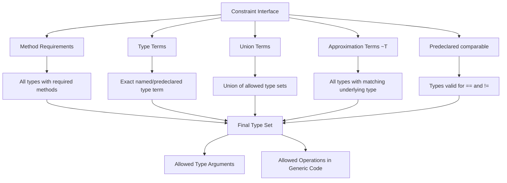
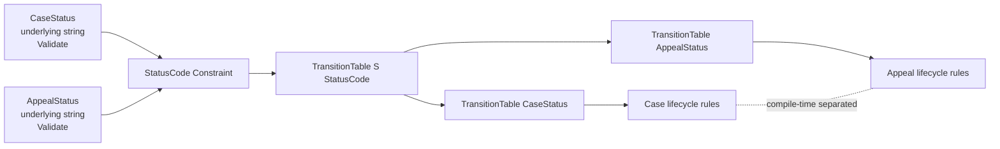
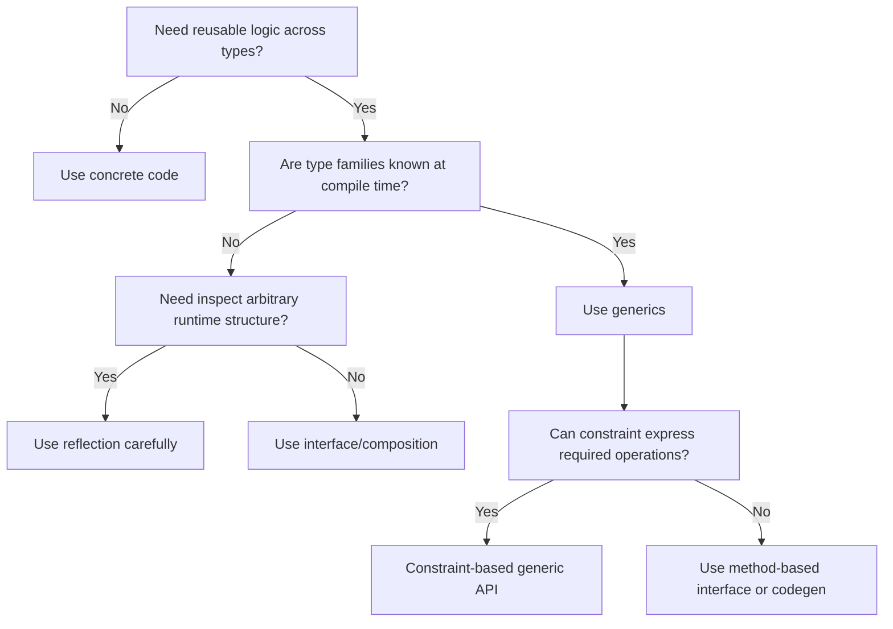

# learn-go-composition-oop-functional-reflection-codegen-modules-part-008.md

# Part 008 — Interface Type Sets & Generics Constraints: `~T`, Union Terms, `comparable`, dan Constraint Design

> Seri: `learn-go-composition-oop-functional-reflection-codegen-modules`  
> Bagian: `008 / 030`  
> Status: **belum selesai**  
> Target pembaca: Java software engineer / tech lead yang ingin memahami Go pada level desain library, platform engineering, dan production API governance.  
> Versi acuan: Go 1.26.x.  

---

## 0. Tujuan Bagian Ini

Bagian ini membahas salah satu area Go modern yang sering disalahpahami oleh engineer yang datang dari Java: **generic constraints**.

Di Java, generic biasanya dibaca sebagai:

```java
class Box<T extends Number> { ... }
```

Mental model Java cenderung:

- ada nominal type hierarchy;
- `T extends X` berarti `T` berada dalam hierarchy `X`;
- constraint biasanya berbasis class/interface nominal;
- operator arithmetic tidak bisa dipakai pada `T` kecuali melalui method;
- generic terutama dipakai untuk reusable collection, repository, DTO, dan type-safe container.

Di Go, generic constraint bukan sekadar “interface bound”. Constraint di Go adalah **interface yang dapat mendeskripsikan set type yang diizinkan**. Interface dapat berisi:

- method requirement;
- union type terms, misalnya `~int | ~int64`;
- approximation term `~T`, artinya semua type yang underlying type-nya `T`;
- predeclared constraint seperti `comparable`;
- kombinasi method set dan type set.

Konsekuensinya besar. Constraint di Go bukan hanya menentukan “type apa yang boleh masuk”, tetapi juga menentukan **operasi apa yang legal dilakukan** di dalam generic function/type.

Bagian ini akan membangun mental model yang diperlukan untuk mendesain generic API Go yang tidak over-engineered, tidak bocor, dan tetap maintainable untuk sistem besar.

---

## 1. Masalah Nyata yang Ingin Diselesaikan Generics di Go

Generics di Go bukan dibuat supaya semua hal menjadi generic. Go tetap bahasa yang mengutamakan explicitness, simple composition, dan concrete code. Generics berguna ketika kita perlu menulis logic yang sama untuk beberapa type tanpa kehilangan type safety.

Contoh problem nyata:

1. **Reusable data structure**
   - set;
   - ordered map;
   - priority queue;
   - typed cache;
   - registry;
   - deduplication helper.

2. **Numeric/domain primitive operation**
   - amount;
   - score;
   - duration-like numeric wrapper;
   - percentage;
   - version number;
   - monotonic sequence;
   - retry attempt count.

3. **Typed pipeline**
   - mapping slice `[]A` ke `[]B`;
   - filtering;
   - grouping;
   - reducing;
   - transforming event payload.

4. **Compile-time API contract**
   - key harus comparable;
   - value harus punya method tertentu;
   - type harus berasal dari family primitive tertentu;
   - state transition type harus punya behavior tertentu.

5. **Avoid reflection for hot paths**
   - typed mapper;
   - typed validator;
   - typed decoder;
   - typed cache accessor;
   - typed domain registry.

Namun generics juga bisa merusak desain jika dipakai untuk:

- meniru inheritance hierarchy;
- membuat “abstract framework” berlapis-lapis;
- menyembunyikan business semantics di balik type parameter yang terlalu umum;
- membuat public API sulit dibaca;
- mengganti interface runtime padahal polymorphism runtime lebih tepat;
- mengganti plain function padahal variasinya kecil.

Rule utama:

> Gunakan generics ketika variasi type bisa dimodelkan secara compile-time dan operasi terhadap type tersebut benar-benar sama secara semantic.

Kalau variasinya adalah behavior runtime, policy runtime, lifecycle, external dependency, atau orchestration, interface/composition biasanya lebih tepat.

---

## 2. Dari Java Generic Bound ke Go Constraint

### 2.1 Java: bound berbasis nominal hierarchy

Di Java:

```java
interface Identifiable {
    String id();
}

class Repository<T extends Identifiable> {
    String getId(T value) {
        return value.id();
    }
}
```

`T extends Identifiable` berarti `T` harus secara nominal mengimplementasikan `Identifiable`.

Java generic tidak membuat `+`, `<`, `==`, atau operator lain otomatis legal terhadap `T`. Semua operasi harus datang dari method/interface/utility.

### 2.2 Go: constraint adalah interface type

Di Go:

```go
type Identifiable interface {
    ID() string
}

func GetID[T Identifiable](v T) string {
    return v.ID()
}
```

Ini mirip Java secara permukaan. Tetapi Go melangkah lebih jauh:

```go
type Integer interface {
    ~int | ~int8 | ~int16 | ~int32 | ~int64 |
        ~uint | ~uint8 | ~uint16 | ~uint32 | ~uint64 | ~uintptr
}

func Max[T Integer](a, b T) T {
    if a > b {
        return a
    }
    return b
}
```

Di sini constraint bukan method-based. Constraint mendeskripsikan **set type** yang boleh menjadi `T`. Karena semua type di set tersebut mendukung operator `>`, operator tersebut legal di dalam `Max`.

Ini tidak setara dengan Java `T extends Number`. Ini lebih dekat ke:

- compile-time family of underlying types;
- allowed operations derived from type set;
- structural constraint, bukan nominal inheritance.

---

## 3. Mental Model Utama: Constraint = Set Type + Allowed Operations

Constraint Go harus dibaca dengan dua pertanyaan:

1. **Type apa saja yang masuk ke himpunan ini?**
2. **Operasi apa saja yang legal untuk semua type dalam himpunan itu?**

Contoh:

```go
type Signed interface {
    ~int | ~int8 | ~int16 | ~int32 | ~int64
}
```

Artinya:

- `int`, `int8`, `int16`, `int32`, `int64` masuk;
- defined type dengan underlying type tersebut juga masuk;
- operator numeric seperti `+`, `-`, `<`, `>` legal;
- method tidak diwajibkan.

Defined type:

```go
type Attempt int

type Priority int

type Score int64
```

Semua ini bisa masuk ke constraint `Signed` karena underlying type-nya sesuai.

Namun `~int` berbeda dengan `int`.

```go
type OnlyBuiltinInt interface {
    int
}

type AnyIntLike interface {
    ~int
}
```

`OnlyBuiltinInt` hanya menerima type yang identik dengan `int`. `AnyIntLike` menerima `int` dan semua defined type yang underlying type-nya `int`.

Perbedaan ini sangat penting untuk domain modeling.

---

## 4. Basic Interface vs Constraint Interface

Tidak semua interface Go bisa dipakai sebagai value type biasa.

### 4.1 Basic interface

Basic interface hanya berisi method:

```go
type Reader interface {
    Read(p []byte) (n int, err error)
}
```

Interface seperti ini bisa dipakai sebagai:

```go
var r Reader
```

Basic interface adalah runtime polymorphism.

### 4.2 Constraint interface dengan type terms

Constraint interface bisa berisi type terms:

```go
type Integer interface {
    ~int | ~int64
}
```

Interface seperti ini biasanya dipakai hanya sebagai constraint:

```go
func Add[T Integer](a, b T) T {
    return a + b
}
```

Bukan sebagai variable runtime biasa:

```go
// Ini bukan tujuan desain constraint interface.
// var x Integer // invalid untuk interface dengan type terms di konteks value biasa.
```

Mental model:

- basic interface = runtime behavior contract;
- constraint interface = compile-time type set contract.

Jangan mencampur keduanya tanpa alasan kuat.

---

## 5. Type Set: Apa yang Sebenarnya Direpresentasikan Interface Modern?

Dalam Go modern, sebuah interface mendefinisikan **type set**.

Untuk basic interface:

```go
type Stringer interface {
    String() string
}
```

Type set-nya adalah semua type yang punya method `String() string`.

Untuk constraint:

```go
type IntLike interface {
    ~int
}
```

Type set-nya adalah semua type yang underlying type-nya `int`.

Untuk union:

```go
type Number interface {
    ~int | ~int64 | ~float64
}
```

Type set-nya adalah union dari ketiga family tersebut.

Untuk gabungan method dan type term:

```go
type OrderedID interface {
    ~string
    Validate() error
}
```

Type set-nya adalah semua type yang:

- underlying type-nya `string`; dan
- memiliki method `Validate() error`.

Ini adalah intersection antara type term dan method requirement.

---

## 6. Diagram: Constraint sebagai Type Set



Key idea:

> Constraint bukan hanya filter type argument. Constraint juga menentukan operasi legal di dalam generic implementation.

---

## 7. `~T`: Approximation Term dan Underlying Type

### 7.1 Tanpa `~`

```go
type ExactInt interface {
    int
}
```

Constraint ini sangat sempit. Ia pada dasarnya menerima `int`, bukan semua custom type berbasis `int`.

```go
type Age int

type Priority int
```

`Age` dan `Priority` tidak diterima oleh `ExactInt`.

### 7.2 Dengan `~`

```go
type IntLike interface {
    ~int
}
```

Constraint ini menerima:

```go
type Age int

type Priority int

type Attempt int
```

Karena underlying type mereka adalah `int`.

### 7.3 Kenapa ini penting?

Dalam desain domain, kita sering membuat defined type untuk memberi makna:

```go
type CasePriority int

type RiskScore int

type AppealLevel int
```

Kalau helper generic Anda memakai `int`, defined type ini tidak masuk. Kalau memakai `~int`, domain type tetap bisa masuk tanpa kehilangan semantic type.

Contoh:

```go
type Integer interface {
    ~int | ~int64
}

func Clamp[T Integer](v, min, max T) T {
    if v < min {
        return min
    }
    if v > max {
        return max
    }
    return v
}
```

Pemakaian:

```go
type RiskScore int

func Example() {
    score := RiskScore(120)
    score = Clamp(score, RiskScore(0), RiskScore(100))
}
```

Return type tetap `RiskScore`, bukan turun menjadi `int`.

Ini penting untuk menjaga domain invariant di compile-time.

---

## 8. Union Terms: `A | B | C`

Union terms mendefinisikan gabungan beberapa type set.

```go
type Signed interface {
    ~int | ~int8 | ~int16 | ~int32 | ~int64
}
```

Artinya type argument boleh berasal dari salah satu family tersebut.

### 8.1 Union bukan inheritance hierarchy

Union term tidak berarti type punya common superclass. Ia hanya berarti:

- compiler menerima type yang berada dalam salah satu term;
- operasi yang boleh dipakai harus valid untuk semua type dalam union.

Contoh valid:

```go
type Numeric interface {
    ~int | ~int64 | ~float64
}

func Add[T Numeric](a, b T) T {
    return a + b
}
```

`+` valid untuk semua term.

Contoh problem:

```go
type TextOrNumber interface {
    ~string | ~int
}

func Less[T TextOrNumber](a, b T) bool {
    return a < b // valid karena string dan int mendukung <
}

func Add[T TextOrNumber](a, b T) T {
    return a + b // valid karena string dan int mendukung +, tetapi semantic-nya mencurigakan
}
```

Secara teknis `+` valid untuk `string` dan `int`, tetapi semantic berbeda:

- `int + int` = arithmetic addition;
- `string + string` = concatenation.

Ini contoh penting:

> Generic legality tidak selalu berarti generic semantic correctness.

Production design harus menilai **makna operasi**, bukan hanya compile success.

---

## 9. Operator Validity dan Semantic Drift

Salah satu jebakan generic constraints adalah membuat constraint terlalu luas karena operator kebetulan tersedia.

Contoh:

```go
type Addable interface {
    ~int | ~int64 | ~float64 | ~string
}

func Combine[T Addable](a, b T) T {
    return a + b
}
```

Secara compiler, ini bisa masuk akal. Secara desain API, ini buruk bila fungsi dipakai untuk domain numeric.

Kenapa?

Karena nama `Combine` kabur dan operasi `+` punya semantic berbeda antar type.

Desain lebih baik:

```go
type Number interface {
    ~int | ~int64 | ~float64
}

func Sum[T Number](values []T) T {
    var total T
    for _, v := range values {
        total += v
    }
    return total
}
```

Atau pisahkan:

```go
type StringLike interface {
    ~string
}

func JoinRaw[T StringLike](values []T) T {
    var out T
    for _, v := range values {
        out += v
    }
    return out
}
```

Checklist semantic:

- Apakah operator punya arti yang sama untuk semua type dalam constraint?
- Apakah nama function menjelaskan semantic, bukan hanya mekanik?
- Apakah return type menjaga domain type?
- Apakah constraint terlalu permisif?
- Apakah user bisa memasukkan type yang technically valid tapi domain-invalid?

---

## 10. `comparable`: Constraint untuk `==`, `!=`, dan Map Key

`comparable` adalah predeclared identifier yang dipakai sebagai constraint untuk type yang dapat dibandingkan dengan `==` dan `!=`.

Contoh umum:

```go
type Set[T comparable] map[T]struct{}

func NewSet[T comparable](values ...T) Set[T] {
    s := make(Set[T], len(values))
    for _, v := range values {
        s[v] = struct{}{}
    }
    return s
}

func (s Set[T]) Has(v T) bool {
    _, ok := s[v]
    return ok
}
```

Kenapa `T comparable` perlu?

Karena map key di Go harus comparable. Tanpa constraint ini, compiler tidak bisa menjamin `T` legal sebagai key.

### 10.1 Comparable bukan equality semantics yang selalu benar

`comparable` berarti type bisa dibandingkan dengan `==`, bukan berarti equality-nya domain-correct.

Contoh:

```go
type Email string
```

`Email` comparable. Tapi domain equality email mungkin membutuhkan normalization:

- lowercase domain;
- trim whitespace;
- Unicode normalization;
- provider-specific local-part rule.

Contoh lain:

```go
type Money struct {
    Amount   int64
    Currency string
}
```

Struct ini comparable jika field-field-nya comparable. Tapi apakah `Money{100, "USD"}` dan `Money{10000, "USD"}` comparable secara domain? Tergantung unit: cents atau dollars.

Jangan confuse:

- comparable = mechanical equality;
- equivalent = domain equality;
- identical = same representation;
- same identity = same entity ID;
- same value = same value object semantic.

### 10.2 When `comparable` is appropriate

Bagus untuk:

- set;
- map key;
- dedup primitive/domain ID;
- registry key;
- enum-like type;
- state ID;
- permission code;
- feature flag key.

Kurang tepat untuk:

- fuzzy equality;
- normalized equality;
- deep equality;
- case-insensitive text;
- floating point domain comparison;
- time comparison with location/precision normalization;
- object identity in mutable entity graph.

---

## 11. Constraint dengan Method Requirement

Generics tetap bisa memakai method-based constraints.

```go
type Validator interface {
    Validate() error
}

func ValidateAll[T Validator](values []T) error {
    for i, v := range values {
        if err := v.Validate(); err != nil {
            return fmt.Errorf("validate item %d: %w", i, err)
        }
    }
    return nil
}
```

Ini mirip Java generic bound, tetapi satisfaction-nya structural/implicit.

### 11.1 Value receiver vs pointer receiver impact

```go
type Rule struct {
    Name string
}

func (r *Rule) Validate() error {
    if r == nil {
        return errors.New("nil rule")
    }
    if r.Name == "" {
        return errors.New("empty name")
    }
    return nil
}
```

`*Rule` memenuhi `Validator`, tetapi `Rule` tidak.

Maka:

```go
rules := []*Rule{{Name: "A"}}
_ = ValidateAll(rules) // ok

values := []Rule{{Name: "A"}}
_ = ValidateAll(values) // tidak ok jika Validate hanya ada di *Rule
```

Ini menghubungkan Part 003: method set menentukan constraint satisfaction.

### 11.2 Constraint method harus kecil

Jangan membuat:

```go
type Entity interface {
    ID() string
    Validate() error
    Save(ctx context.Context) error
    Delete(ctx context.Context) error
    AuditTrail() []AuditEntry
    MarshalJSON() ([]byte, error)
}
```

Ini framework-ish dan mencampur domain, persistence, audit, serialization.

Lebih baik pisah:

```go
type Identified interface {
    ID() string
}

type Validatable interface {
    Validate() error
}
```

Lalu generic function memilih constraint sesuai kebutuhan.

```go
func IndexByID[T Identified](values []T) map[string]T {
    out := make(map[string]T, len(values))
    for _, v := range values {
        out[v.ID()] = v
    }
    return out
}
```

---

## 12. Combining Method Requirement and Type Terms

Kadang kita ingin type punya underlying type tertentu dan method tertentu.

Contoh domain:

```go
type Code interface {
    ~string
    Validate() error
}
```

Contoh implementation:

```go
type PermissionCode string

func (c PermissionCode) Validate() error {
    if c == "" {
        return errors.New("empty permission code")
    }
    return nil
}
```

Generic function:

```go
func ValidateCodes[T Code](codes []T) error {
    seen := make(map[string]struct{}, len(codes))
    for _, c := range codes {
        if err := c.Validate(); err != nil {
            return err
        }
        raw := string(c)
        if _, exists := seen[raw]; exists {
            return fmt.Errorf("duplicate code: %s", raw)
        }
        seen[raw] = struct{}{}
    }
    return nil
}
```

Kenapa bukan hanya `interface{ Validate() error }`?

Karena logic butuh convert ke `string` dan butuh uniqueness berdasarkan raw string.

Constraint `~string` membuat conversion `string(c)` legal.

### 12.1 Jangan terlalu cepat memakai combined constraint

Combined constraint berguna jika:

- underlying representation memang bagian dari contract;
- operasi terhadap representation diperlukan;
- domain type ingin tetap distinct;
- method memberi invariant/behavior tambahan.

Kalau generic function hanya butuh `Validate() error`, jangan masukkan `~string`.

Constraint harus sekecil mungkin.

---

## 13. Approximation Term dan Domain Type Preservation

Perhatikan fungsi berikut:

```go
func Normalize[T ~string](v T) T {
    s := strings.TrimSpace(string(v))
    s = strings.ToUpper(s)
    return T(s)
}
```

Jika dipakai:

```go
type CaseStatus string

type Permission string

status := Normalize(CaseStatus(" pending "))
perm := Normalize(Permission(" approve_case "))
```

Return type tetap:

- `CaseStatus`;
- `Permission`.

Ini powerful, tetapi juga berbahaya.

Kenapa?

Karena generic normalization mungkin tidak valid untuk semua string-like domain.

Contoh:

- `CaseStatus` mungkin harus uppercase;
- `Email` mungkin harus lowercase domain saja;
- `DisplayName` tidak boleh uppercase semua;
- `DocumentID` mungkin case-sensitive;
- `ExternalReference` mungkin whitespace meaningful.

Maka jangan membuat helper terlalu umum:

```go
func NormalizeStringLike[T ~string](v T) T
```

kecuali semantic-nya benar-benar universal.

Lebih baik domain-specific:

```go
type CodeLike interface {
    ~string
}

func NormalizeCode[T CodeLike](v T) T {
    s := strings.TrimSpace(string(v))
    s = strings.ToUpper(s)
    return T(s)
}
```

Bahkan lebih baik jika domain invariant dibuat di constructor:

```go
type PermissionCode string

func NewPermissionCode(raw string) (PermissionCode, error) {
    s := strings.ToUpper(strings.TrimSpace(raw))
    if s == "" {
        return "", errors.New("empty permission code")
    }
    return PermissionCode(s), nil
}
```

Generic helper tidak boleh mengambil alih domain constructor secara sembrono.

---

## 14. Constraint untuk Ordered Type

Go standard library memiliki package `cmp` untuk ordered comparison pada ordered types, dan `slices` untuk banyak operasi generic di slice. Tetapi di library internal, kadang kita mendesain sendiri constraint agar domain lebih eksplisit.

Contoh:

```go
type Ordered interface {
    ~int | ~int8 | ~int16 | ~int32 | ~int64 |
        ~uint | ~uint8 | ~uint16 | ~uint32 | ~uint64 | ~uintptr |
        ~float32 | ~float64 |
        ~string
}
```

Generic helper:

```go
func Min[T Ordered](a, b T) T {
    if a < b {
        return a
    }
    return b
}
```

Pertanyaan desain:

- Apakah `string` harus masuk?
- Apakah `float32/float64` harus masuk?
- Bagaimana dengan NaN?
- Apakah ordering lexicographic string sesuai domain?
- Apakah helper ini sebaiknya memakai standard library saja?

Untuk platform library internal, lebih baik constraint domain-specific:

```go
type PriorityNumber interface {
    ~int | ~int8 | ~int16 | ~int32 | ~int64
}

func HigherPriority[T PriorityNumber](a, b T) T {
    if a > b {
        return a
    }
    return b
}
```

Nama constraint dan function harus mempersempit semantic.

---

## 15. Type Constraint dan Public API Surface

Constraint yang diekspor adalah public contract.

```go
type Integer interface {
    ~int | ~int8 | ~int16 | ~int32 | ~int64
}
```

Jika constraint ini diekspor dari package publik, maka perubahan terhadap union terms bisa menjadi breaking change.

### 15.1 Menambah type term

Misalnya dari:

```go
type Number interface {
    ~int | ~int64
}
```

menjadi:

```go
type Number interface {
    ~int | ~int64 | ~float64
}
```

Apakah ini aman?

Belum tentu.

Jika function lama:

```go
func Divide[T Number](a, b T) T {
    return a / b
}
```

Untuk integer, division truncates. Untuk float, division fractional. Menambah `float64` mengubah semantic family.

### 15.2 Menghapus type term

Menghapus term jelas dapat memecahkan caller.

### 15.3 Mengganti exact term menjadi approximation

Dari:

```go
type CaseID interface {
    string
}
```

ke:

```go
type CaseID interface {
    ~string
}
```

Ini memperluas type set. Biasanya kompatibel untuk caller, tetapi bisa mengubah overload-like inference dan semantic expectation.

### 15.4 Menambah method requirement

Dari:

```go
type Code interface {
    ~string
}
```

ke:

```go
type Code interface {
    ~string
    Validate() error
}
```

Ini breaking change besar. Semua type argument yang sebelumnya valid bisa menjadi invalid.

Prinsip:

> Exported constraint harus diperlakukan seperti exported interface: kecil, stabil, dan sulit berubah.

---

## 16. Constraint Placement: Package Mana yang Harus Memiliki Constraint?

Pertanyaan desain penting: constraint sebaiknya didefinisikan di mana?

Pilihan:

1. package generic utility;
2. package domain;
3. package consumer;
4. unexported di file implementation.

### 16.1 Utility package

```go
package constraints

type Signed interface {
    ~int | ~int8 | ~int16 | ~int32 | ~int64
}
```

Cocok jika benar-benar reusable dan low-level.

Risiko:

- menjadi dumping ground;
- constraint terlalu umum;
- domain package tergantung package util yang tidak perlu.

### 16.2 Domain package

```go
package caseworkflow

type Priority interface {
    ~int
}
```

Cocok jika constraint punya semantic domain.

### 16.3 Consumer-side unexported constraint

```go
package escalation

type priorityNumber interface {
    ~int | ~int32 | ~int64
}

func clampPriority[T priorityNumber](v, min, max T) T { ... }
```

Ini sering paling sehat. Jika constraint hanya dipakai untuk implementation detail, jangan diekspor.

### 16.4 Decision rule

Export constraint hanya jika:

- caller perlu menulis type/function yang depend pada constraint tersebut;
- constraint adalah bagian dari public extension model;
- type set-nya stabil;
- semantic-nya bisa didokumentasikan jelas;
- breaking change policy sudah dipikirkan.

Jika tidak, buat unexported.

---

## 17. Type Inference dan API Ergonomics

Generic function bisa dipanggil tanpa explicit type argument jika compiler bisa infer.

```go
func First[T any](values []T) (T, bool) {
    if len(values) == 0 {
        var zero T
        return zero, false
    }
    return values[0], true
}

v, ok := First([]int{1, 2, 3})
```

Compiler infer `T = int`.

Tetapi inference bisa gagal jika type parameter hanya muncul di return type.

```go
func NewZero[T any]() T {
    var zero T
    return zero
}

// x := NewZero() // tidak bisa infer T
x := NewZero[int]()
```

Design implication:

- type parameter sebaiknya muncul di input bila ingin ergonomic;
- kalau harus explicit, pastikan API memang layak;
- jangan membuat caller selalu menulis `[VeryLongType]` kecuali manfaatnya jelas.

### 17.1 Constructor generic smell

Contoh smell:

```go
func NewRepository[T any]() *Repository[T] { ... }
```

Caller:

```go
repo := NewRepository[CaseRecord]()
```

Ini masih oke jika repository typed benar-benar memberi safety.

Tetapi jika semua method akhirnya menerima `any`, reflection, atau `map[string]any`, generic-nya kosmetik.

---

## 18. `any` Bukan Desain, Hanya Batas Minimal

`any` adalah alias untuk `interface{}`.

```go
func Identity[T any](v T) T {
    return v
}
```

`any` berarti tidak ada operasi khusus yang bisa dilakukan selain:

- assign;
- pass around;
- return;
- compare to nil hanya jika bentuknya memungkinkan? Tidak secara umum untuk `T any`;
- memakai `interface{}` conversion/reflection jika dipaksa.

Contoh salah:

```go
func Equal[T any](a, b T) bool {
    return a == b // invalid
}
```

Harus:

```go
func Equal[T comparable](a, b T) bool {
    return a == b
}
```

`any` cocok untuk:

- container yang tidak butuh compare;
- map/filter generic;
- pipeline transform;
- holder;
- identity-like helper;
- typed wrapper yang hanya menyimpan dan mengembalikan.

`any` tidak cukup untuk:

- map key;
- equality;
- ordering;
- arithmetic;
- method invocation;
- conversion ke representation tertentu.

---

## 19. Constraint dan Zero Value

Generic code sering butuh zero value:

```go
func First[T any](values []T) (T, bool) {
    if len(values) == 0 {
        var zero T
        return zero, false
    }
    return values[0], true
}
```

Zero value untuk `T` bisa:

- `0` untuk numeric;
- `""` untuk string;
- `nil` untuk pointer/slice/map/channel/function/interface;
- struct zero untuk struct.

Jangan menganggap zero value selalu invalid atau valid. Itu tergantung domain.

Contoh:

```go
type CaseID string
```

`var zero CaseID` menghasilkan `""`, mungkin invalid.

Generic helper harus hati-hati:

```go
func MustFirst[T any](values []T) T {
    if len(values) == 0 {
        panic("empty slice")
    }
    return values[0]
}
```

Atau return `(T, bool)` lebih aman.

### 19.1 Optional generic type

```go
type Optional[T any] struct {
    value T
    ok    bool
}

func Some[T any](v T) Optional[T] {
    return Optional[T]{value: v, ok: true}
}

func None[T any]() Optional[T] {
    return Optional[T]{}
}

func (o Optional[T]) Get() (T, bool) {
    return o.value, o.ok
}
```

Ini membedakan absent dari zero value.

Production implication:

- Jangan gunakan zero value sebagai sentinel untuk semua domain.
- Gunakan `(T, bool)`, explicit option type, atau error jika absence penting.

---

## 20. Generic Type vs Generic Function

### 20.1 Generic function

```go
func Map[A, B any](values []A, fn func(A) B) []B {
    out := make([]B, 0, len(values))
    for _, v := range values {
        out = append(out, fn(v))
    }
    return out
}
```

Cocok untuk reusable operation.

### 20.2 Generic type

```go
type Cache[K comparable, V any] struct {
    values map[K]V
}

func NewCache[K comparable, V any]() *Cache[K, V] {
    return &Cache[K, V]{values: make(map[K]V)}
}

func (c *Cache[K, V]) Get(k K) (V, bool) {
    v, ok := c.values[k]
    return v, ok
}

func (c *Cache[K, V]) Put(k K, v V) {
    c.values[k] = v
}
```

Cocok jika state juga typed.

### 20.3 Hindari generic type jika function cukup

Jangan membuat:

```go
type Mapper[A, B any] struct{}

func (m Mapper[A, B]) Map(values []A, fn func(A) B) []B { ... }
```

Jika tidak ada state/invariant, function biasa lebih idiomatis.

---

## 21. Generic Method Limitation dan Desain Alternatif

Go mendukung generic type dan generic function. Namun method tidak bisa punya type parameter sendiri yang baru di luar receiver type parameter.

Desain seperti ini bukan model Go:

```go
// Tidak valid dalam Go: method dengan type parameter sendiri.
// func (c Cache[K, V]) Map[U any](fn func(V) U) []U { ... }
```

Alternatif:

### 21.1 Generic function menerima generic type

```go
func CacheValues[K comparable, V any](c *Cache[K, V]) []V {
    out := make([]V, 0, len(c.values))
    for _, v := range c.values {
        out = append(out, v)
    }
    return out
}

func MapCacheValues[K comparable, V, U any](c *Cache[K, V], fn func(V) U) []U {
    out := make([]U, 0, len(c.values))
    for _, v := range c.values {
        out = append(out, fn(v))
    }
    return out
}
```

### 21.2 Put transform di package-level function

Ini idiomatis untuk generic utility. Jangan memaksakan fluent API seperti Java Streams jika Go function lebih jelas.

---

## 22. Constraint untuk Domain State Machine

Karena user context banyak terkait regulatory lifecycle dan state machines, mari kita ambil contoh domain.

Kita punya status case:

```go
type CaseStatus string

const (
    StatusDraft       CaseStatus = "DRAFT"
    StatusSubmitted   CaseStatus = "SUBMITTED"
    StatusScreening   CaseStatus = "SCREENING"
    StatusInvestigate CaseStatus = "INVESTIGATE"
    StatusClosed      CaseStatus = "CLOSED"
)

func (s CaseStatus) Validate() error {
    switch s {
    case StatusDraft, StatusSubmitted, StatusScreening, StatusInvestigate, StatusClosed:
        return nil
    default:
        return fmt.Errorf("invalid case status: %q", s)
    }
}
```

Kita juga punya appeal status:

```go
type AppealStatus string

const (
    AppealPending  AppealStatus = "PENDING"
    AppealApproved AppealStatus = "APPROVED"
    AppealRejected AppealStatus = "REJECTED"
)

func (s AppealStatus) Validate() error {
    switch s {
    case AppealPending, AppealApproved, AppealRejected:
        return nil
    default:
        return fmt.Errorf("invalid appeal status: %q", s)
    }
}
```

Generic constraint:

```go
type StatusCode interface {
    ~string
    Validate() error
}
```

Generic transition table:

```go
type TransitionTable[S StatusCode] struct {
    allowed map[S]map[S]struct{}
}

func NewTransitionTable[S StatusCode](pairs [][2]S) (*TransitionTable[S], error) {
    table := make(map[S]map[S]struct{})

    for _, p := range pairs {
        from, to := p[0], p[1]

        if err := from.Validate(); err != nil {
            return nil, fmt.Errorf("invalid from status %q: %w", from, err)
        }
        if err := to.Validate(); err != nil {
            return nil, fmt.Errorf("invalid to status %q: %w", to, err)
        }

        if table[from] == nil {
            table[from] = make(map[S]struct{})
        }
        table[from][to] = struct{}{}
    }

    return &TransitionTable[S]{allowed: table}, nil
}

func (t *TransitionTable[S]) CanMove(from, to S) bool {
    next, ok := t.allowed[from]
    if !ok {
        return false
    }
    _, ok = next[to]
    return ok
}
```

Apa yang kita dapat?

- status tetap type-specific;
- transition table case tidak tercampur dengan appeal;
- map key aman karena `S` underlying string, sehingga comparable;
- validation method dipaksa compile-time;
- representation string tetap bisa dipakai untuk logging/storage jika diperlukan.

Pemakaian:

```go
caseTransitions, err := NewTransitionTable([][2]CaseStatus{
    {StatusDraft, StatusSubmitted},
    {StatusSubmitted, StatusScreening},
    {StatusScreening, StatusInvestigate},
    {StatusInvestigate, StatusClosed},
})
if err != nil {
    return err
}

ok := caseTransitions.CanMove(StatusSubmitted, StatusScreening)
```

Compiler mencegah:

```go
// Tidak bisa mencampur CaseStatus dan AppealStatus dalam table yang sama.
```

Ini contoh generics yang benar: generic logic sama, domain type tetap distinct.

---

## 23. Diagram: Generic Transition Table



Desain ini menjaga reuse tanpa mengorbankan domain boundary.

---

## 24. Generic Constraint vs Interface Runtime untuk State Machine

Alternatif runtime interface:

```go
type Status interface {
    Code() string
    Validate() error
}
```

Transition table:

```go
type RuntimeTransitionTable struct {
    allowed map[string]map[string]struct{}
}
```

Ini lebih fleksibel, tetapi kehilangan type separation.

| Kriteria | Generic constraint | Runtime interface |
|---|---|---|
| Type separation | kuat | lemah, sering turun ke string/interface |
| Runtime extensibility | rendah/sedang | tinggi |
| Plugin-like status dari luar | kurang cocok | lebih cocok |
| Compile-time safety | tinggi | sedang |
| Dynamic config | perlu parsing ke typed status | lebih natural |
| Hot path performance | baik | baik, tergantung design |
| API complexity | sedang | rendah/sedang |

Rule:

- Jika semua status family diketahui compile-time, generic constraint bagus.
- Jika status family bisa datang dari plugin/config/runtime, interface/string registry lebih realistis.
- Jika butuh keduanya, pisahkan typed domain core dan dynamic adapter di boundary.

---

## 25. Constraint dan Reflection: Kapan Generic Mengganti Reflection?

Sebelum generics, beberapa util Go memakai reflection:

```go
func Contains(slice any, item any) bool {
    v := reflect.ValueOf(slice)
    for i := 0; i < v.Len(); i++ {
        if reflect.DeepEqual(v.Index(i).Interface(), item) {
            return true
        }
    }
    return false
}
```

Dengan generics:

```go
func Contains[T comparable](values []T, target T) bool {
    for _, v := range values {
        if v == target {
            return true
        }
    }
    return false
}
```

Generic version:

- type-safe;
- lebih mudah dibaca;
- tidak panic karena wrong kind;
- tidak butuh `reflect.DeepEqual`;
- biasanya lebih efisien;
- constraint menjelaskan equality requirement.

Namun generics tidak mengganti semua reflection.

Reflection masih berguna untuk:

- struct tags;
- schema discovery;
- arbitrary unknown type at runtime;
- serialization/deserialization framework;
- ORM-like mapper;
- dependency injection container;
- generic admin tooling;
- test diff utilities.

Decision rule:



---

## 26. Constraint dan Code Generation

Generics mengurangi kebutuhan code generation untuk simple typed containers dan helpers.

Sebelum generics:

- generate `StringSet`, `IntSet`, `CaseIDSet`;
- generate mapper variants;
- generate typed queue;
- generate typed registry.

Dengan generics:

```go
type Set[T comparable] map[T]struct{}
```

Namun codegen tetap berguna untuk:

- DTO mapper dengan field-level mapping;
- validation code dari schema/tag;
- enum stringer;
- protobuf/grpc/openapi clients;
- SQL row scanner;
- JSON optimized encoder;
- finite state machine generated from spec;
- permission matrix generated from policy source.

Generic constraints dan codegen bisa digabung.

Contoh:

```go
type Enum interface {
    ~string
    IsValid() bool
}
```

Generator membuat:

```go
type CaseStatus string

func (s CaseStatus) IsValid() bool { ... }
```

Generic helper menggunakan constraint:

```go
func ParseEnum[T Enum](raw string) (T, error) {
    v := T(raw)
    if !v.IsValid() {
        var zero T
        return zero, fmt.Errorf("invalid enum value: %s", raw)
    }
    return v, nil
}
```

Ini pattern kuat:

- codegen menghasilkan concrete domain type + method;
- generic helper menyediakan reusable logic;
- constraint menjaga compile-time contract.

---

## 27. Self-Referential Generic Constraints di Go 1.26

Go 1.26 memperluas kemampuan constraint dengan mengizinkan beberapa bentuk self-reference pada generic type constraints yang sebelumnya tidak diperbolehkan.

Contoh bentuk konseptual:

```go
type Adder[A Adder[A]] interface {
    Add(A) A
}

func AddTwo[A Adder[A]](x, y A) A {
    return x.Add(y)
}
```

Apa artinya?

Type `A` harus memiliki method `Add(A) A`, yaitu operasi add terhadap type dirinya sendiri.

Contoh domain:

```go
type RiskScore int

func (s RiskScore) Add(other RiskScore) RiskScore {
    return s + other
}
```

Lalu:

```go
func SumPair[A Adder[A]](a, b A) A {
    return a.Add(b)
}
```

Kenapa ini penting?

Sebelumnya, beberapa pattern “self type” sulit ditulis secara natural. Java developer mengenal pola serupa sebagai F-bounded polymorphism:

```java
interface Comparable<T extends Comparable<T>> {
    int compareTo(T other);
}
```

Di Go, fitur ini harus tetap dipakai hemat. Jangan membuat hierarchy generic rumit hanya karena sekarang bisa.

Gunakan untuk:

- algebraic-like domain primitive;
- strongly typed numeric/domain operations;
- type-safe builder yang memang butuh self type;
- comparator/merger/accumulator dengan same-type operation.

Hindari untuk:

- membuat inheritance-style framework;
- fluent builder berlapis yang lebih mudah ditulis concrete;
- abstract domain base type;
- pseudo-ORM generic supertype.

---

## 28. Constraint untuk Same-Type Operation

Contoh useful:

```go
type Merger[T any] interface {
    Merge(T) T
}

func MergeAll[T Merger[T]](values []T) (T, bool) {
    if len(values) == 0 {
        var zero T
        return zero, false
    }

    acc := values[0]
    for _, v := range values[1:] {
        acc = acc.Merge(v)
    }
    return acc, true
}
```

Domain:

```go
type PermissionSet map[string]struct{}

func (p PermissionSet) Merge(other PermissionSet) PermissionSet {
    out := make(PermissionSet, len(p)+len(other))
    for k := range p {
        out[k] = struct{}{}
    }
    for k := range other {
        out[k] = struct{}{}
    }
    return out
}
```

Pemakaian:

```go
merged, ok := MergeAll([]PermissionSet{a, b, c})
```

Kita mendapat:

- method harus menerima type yang sama;
- return type sama;
- tidak perlu `any` dan type assertion;
- domain semantic tetap jelas.

---

## 29. Constraint Design Smells

### 29.1 Constraint terlalu umum

```go
type Everything interface {
    any
}
```

Tidak menambah informasi.

### 29.2 Constraint terlalu besar

```go
type DomainEntity interface {
    ~string
    ID() string
    Validate() error
    Save(context.Context) error
    MarshalJSON() ([]byte, error)
    Audit() []AuditEntry
}
```

Mencampur representation, identity, validation, persistence, serialization, audit.

### 29.3 Constraint sebagai substitute inheritance

```go
type BaseService[T any] interface {
    BeforeCreate(T) error
    Create(T) error
    AfterCreate(T) error
    BeforeUpdate(T) error
    Update(T) error
    AfterUpdate(T) error
}
```

Ini biasanya Java template method disguised as Go generic.

Lebih baik composition eksplisit:

```go
type CreateHook[T any] interface {
    BeforeCreate(context.Context, T) error
    AfterCreate(context.Context, T) error
}
```

Atau function option / pipeline.

### 29.4 Constraint dengan semantic campur

```go
type Addable interface {
    ~int | ~float64 | ~string
}
```

Operator sama, semantic beda.

### 29.5 Exported constraint tanpa alasan

```go
type InternalSortable interface {
    ~int | ~string
}
```

Kalau hanya dipakai internal, jangan export.

### 29.6 Constraint mengikuti implementation detail

```go
type DBKey interface {
    ~int64
}
```

Jika nanti key berubah ke UUID string, semua public API kena dampak. Jangan expose representation jika tidak perlu.

---

## 30. Constraint Naming

Nama constraint harus menjawab “semantic set apa ini?”

Buruk:

```go
type T1 interface { ~string }
type GenericString interface { ~string }
type MyConstraint interface { ~int | ~int64 }
```

Lebih baik:

```go
type Code interface { ~string }
type StateCode interface { ~string; Validate() error }
type PriorityNumber interface { ~int | ~int32 | ~int64 }
type ID interface { ~string | ~int64 }
```

Namun hati-hati dengan nama terlalu luas:

```go
type ID interface { ~string | ~int64 }
```

Apakah semua ID di organisasi hanya string/int64? Apakah UUID custom type masuk? Apakah composite ID masuk? Apakah tenant ID sama dengan case ID?

Untuk platform besar, lebih baik domain-specific:

```go
type CaseIDLike interface { ~string }
type UserIDLike interface { ~string }
type PermissionCodeLike interface { ~string }
```

Tapi jangan overdo sampai semua type punya constraint sendiri tanpa reusable value.

---

## 31. Constraint Documentation Contract

Untuk exported constraint, dokumentasi harus menyebut:

1. family type yang diterima;
2. semantic operasi yang diasumsikan;
3. apakah defined type didukung via `~`;
4. apakah zero value valid;
5. apakah equality/order mechanical atau domain-specific;
6. apakah caller boleh mendefinisikan custom type;
7. compatibility promise.

Contoh:

```go
// StateCode is implemented by string-backed domain status codes that can
// validate themselves. It is intended for closed lifecycle status types such
// as CaseStatus and AppealStatus.
//
// Implementations should treat the zero value as invalid unless explicitly
// documented otherwise. Equality is representation equality after the type's
// own normalization/constructor rules.
type StateCode interface {
    ~string
    Validate() error
}
```

Dokumentasi constraint bukan hiasan. Ia adalah satu-satunya tempat caller memahami semantic type set.

---

## 32. Constraint dan Testing

Testing generic code perlu mencakup:

- built-in type;
- defined type dengan underlying type;
- pointer receiver vs value receiver;
- zero value;
- invalid domain value;
- multiple instantiations;
- inference behavior;
- compile-time negative tests bila perlu.

### 32.1 Positive compile tests

```go
type CaseStatus string

func (s CaseStatus) Validate() error { return nil }

func TestTransitionTableWithCaseStatus(t *testing.T) {
    _, err := NewTransitionTable([][2]CaseStatus{
        {"DRAFT", "SUBMITTED"},
    })
    if err != nil {
        t.Fatal(err)
    }
}
```

### 32.2 Compile-time assertion

```go
var _ StatusCode = CaseStatus("")
```

Untuk constraint interface dengan type terms, assertion seperti ini tergantung konteks dan bentuk constraint; sering lebih jelas memakai generic compile helper:

```go
func assertStatusCode[T StatusCode]() {}

func TestCompileConstraints(t *testing.T) {
    assertStatusCode[CaseStatus]()
}
```

### 32.3 Negative compile tests

Go test biasa tidak nyaman untuk memastikan kode tidak compile. Untuk library serius, bisa memakai:

- testdata dengan script;
- `go test` yang menjalankan `go test ./testdata/invalid/...` dan mengharapkan failure;
- static analysis test;
- documentation examples untuk intended use.

Namun jangan berlebihan. Negative compile test berguna untuk public generic library yang constraint-nya critical.

---

## 33. Performance Considerations

Generic code di Go biasanya tidak perlu ditakuti. Tetapi engineer senior tetap perlu memahami dampak desain.

Hal yang perlu diamati:

1. **Instantiation cost at compile time**
   - banyak instantiation bisa memperbesar compile time;
   - banyak generic package utility bisa memperlambat CI.

2. **Binary size**
   - generic instantiation dapat menambah code size;
   - tergantung compiler strategy dan bentuk penggunaan.

3. **Inlining**
   - generic function sederhana sering bisa diinline;
   - abstraction berlapis bisa menghambat readability dan kadang optimization.

4. **Escape analysis**
   - generic wrapper yang mengambil interface/function closure bisa memicu allocation;
   - ukur dengan benchmark dan `-gcflags=-m` bila penting.

5. **Reflection avoidance**
   - generic sering lebih murah dibanding reflection untuk typed collection/lookup.

6. **Function parameter overhead**
   - `func(T) U` callback di tight loop bisa punya overhead jika tidak inline;
   - jangan mengganti simple loop hot path dengan generic functional helper tanpa benchmark.

Prinsip:

> Desain generic untuk correctness dan API clarity dulu. Optimasi dilakukan berdasarkan benchmark pada path yang benar-benar penting.

---

## 34. API Design Matrix: Interface vs Generics vs Reflection vs Codegen

| Problem | Pilihan utama | Kenapa |
|---|---|---|
| Runtime dependency substitution | Interface | Behavior berubah runtime |
| Multiple concrete types, operasi sama compile-time | Generics | Type safety tanpa duplication |
| Need inspect arbitrary struct tags | Reflection | Type tidak diketahui compile-time |
| Need generated mapper/validator from schema | Codegen | Compile-time specialized code |
| Set/map/dedup by key | Generics + `comparable` | Map key safety |
| Numeric helper preserving domain type | Generics + `~T` | Return type tetap domain type |
| Plugin architecture | Interface/registry | Type datang runtime |
| Serialization framework | Reflection + codegen hybrid | Schema/runtime metadata |
| Domain lifecycle typed table | Generics constraint | Memisahkan status family compile-time |
| Business workflow orchestration | Composition/interface | Policy/lifecycle lebih penting dari type family |

---

## 35. Production Checklist untuk Generic Constraint

Sebelum merge generic API, tanyakan:

### 35.1 Necessity

- Apakah duplication yang dihilangkan benar-benar signifikan?
- Apakah plain concrete function lebih jelas?
- Apakah interface runtime lebih cocok?
- Apakah reflection/codegen lebih cocok?

### 35.2 Constraint correctness

- Apakah constraint terlalu luas?
- Apakah constraint terlalu sempit?
- Apakah `~T` diperlukan untuk mendukung defined domain type?
- Apakah exact type term lebih aman?
- Apakah union terms punya semantic operasi yang sama?
- Apakah method requirement minimal?

### 35.3 API stability

- Apakah constraint diekspor?
- Apakah type set bisa berubah di masa depan?
- Apakah perubahan term akan breaking?
- Apakah constraint mengungkap representation detail?

### 35.4 Caller ergonomics

- Apakah type inference bekerja?
- Apakah caller harus menulis type argument panjang?
- Apakah error compiler mudah dipahami?
- Apakah nama constraint membantu?

### 35.5 Domain safety

- Apakah generic helper menjaga domain type?
- Apakah zero value ditangani?
- Apakah normalization tidak merusak domain tertentu?
- Apakah equality/order sesuai semantic domain?

### 35.6 Operational risk

- Apakah compile time meningkat signifikan?
- Apakah benchmark hot path tersedia?
- Apakah generic API memperumit debugging?
- Apakah documentation/example cukup?

---

## 36. Case Study: Typed Permission Matrix

Problem:

Regulatory system punya banyak permission code untuk modul berbeda:

- case management;
- appeal;
- compliance;
- correspondence;
- document;
- report.

Kita ingin reusable matrix, tetapi tidak ingin permission code antar modul bercampur sembarangan.

### 36.1 Domain types

```go
type CasePermission string

const (
    CaseView     CasePermission = "CASE_VIEW"
    CaseApprove  CasePermission = "CASE_APPROVE"
    CaseEscalate CasePermission = "CASE_ESCALATE"
)

func (p CasePermission) Validate() error {
    switch p {
    case CaseView, CaseApprove, CaseEscalate:
        return nil
    default:
        return fmt.Errorf("invalid case permission: %q", p)
    }
}
```

```go
type AppealPermission string

const (
    AppealView    AppealPermission = "APPEAL_VIEW"
    AppealApprove AppealPermission = "APPEAL_APPROVE"
)

func (p AppealPermission) Validate() error {
    switch p {
    case AppealView, AppealApprove:
        return nil
    default:
        return fmt.Errorf("invalid appeal permission: %q", p)
    }
}
```

### 36.2 Constraint

```go
type PermissionCode interface {
    ~string
    Validate() error
}
```

### 36.3 Matrix

```go
type Role string

func (r Role) Validate() error {
    if r == "" {
        return errors.New("empty role")
    }
    return nil
}

type PermissionMatrix[P PermissionCode] struct {
    byRole map[Role]map[P]struct{}
}

func NewPermissionMatrix[P PermissionCode]() *PermissionMatrix[P] {
    return &PermissionMatrix[P]{
        byRole: make(map[Role]map[P]struct{}),
    }
}

func (m *PermissionMatrix[P]) Grant(role Role, permission P) error {
    if err := role.Validate(); err != nil {
        return err
    }
    if err := permission.Validate(); err != nil {
        return err
    }
    if m.byRole[role] == nil {
        m.byRole[role] = make(map[P]struct{})
    }
    m.byRole[role][permission] = struct{}{}
    return nil
}

func (m *PermissionMatrix[P]) Has(role Role, permission P) bool {
    perms, ok := m.byRole[role]
    if !ok {
        return false
    }
    _, ok = perms[permission]
    return ok
}
```

### 36.4 Usage

```go
caseMatrix := NewPermissionMatrix[CasePermission]()
_ = caseMatrix.Grant("CASE_OFFICER", CaseView)
_ = caseMatrix.Grant("CASE_MANAGER", CaseApprove)

appealMatrix := NewPermissionMatrix[AppealPermission]()
_ = appealMatrix.Grant("APPEAL_OFFICER", AppealView)
```

Compiler mencegah:

```go
// caseMatrix.Grant("CASE_OFFICER", AppealView) // invalid type
```

Ini desain yang kuat:

- permission representation tetap string-backed;
- setiap module punya type sendiri;
- matrix logic reusable;
- compile-time separation mencegah cross-module leakage;
- validation tetap domain-specific.

---

## 37. Where This Can Go Wrong

### 37.1 Terlalu generic untuk business rule

Jika permission punya rule berbeda per module:

- case permission depends on case status;
- appeal permission depends on appeal outcome;
- compliance permission depends on inspection type;

Maka `PermissionMatrix[P]` mungkin hanya cocok sebagai primitive, bukan sebagai full authorization engine.

Business decision sebaiknya tetap di service/policy layer:

```go
type CaseAuthorizationPolicy interface {
    CanApprove(ctx context.Context, user User, c Case) Decision
}
```

Generic matrix hanya salah satu input.

### 37.2 Generic type membuat dependency arah salah

Jangan letakkan `PermissionMatrix` di package domain `case` jika dipakai appeal/compliance. Letakkan di package lebih netral, misalnya:

```text
/internal/security/permissionmatrix
```

atau jika public reusable:

```text
/pkg/permission
```

Tapi hati-hati dengan `/pkg`; jangan jadikan dumping ground.

### 37.3 Constraint bocor ke semua layer

Jangan biarkan semua function membawa `[P PermissionCode]` jika hanya satu layer yang perlu. Boundary API ke handler/transport bisa tetap concrete.

---

## 38. Mini Pattern Catalog

### 38.1 Typed Set

```go
type Set[T comparable] map[T]struct{}

func (s Set[T]) Add(v T) {
    s[v] = struct{}{}
}

func (s Set[T]) Has(v T) bool {
    _, ok := s[v]
    return ok
}
```

### 38.2 String-backed enum parser

```go
type StringEnum interface {
    ~string
    IsValid() bool
}

func ParseStringEnum[T StringEnum](raw string) (T, error) {
    v := T(raw)
    if !v.IsValid() {
        var zero T
        return zero, fmt.Errorf("invalid enum: %s", raw)
    }
    return v, nil
}
```

### 38.3 Numeric clamp preserving domain type

```go
type OrderedNumber interface {
    ~int | ~int64 | ~float64
}

func Clamp[T OrderedNumber](v, min, max T) T {
    if v < min {
        return min
    }
    if v > max {
        return max
    }
    return v
}
```

### 38.4 Index by key extractor

```go
func IndexBy[K comparable, V any](values []V, keyFn func(V) K) map[K]V {
    out := make(map[K]V, len(values))
    for _, v := range values {
        out[keyFn(v)] = v
    }
    return out
}
```

### 38.5 Group by key

```go
func GroupBy[K comparable, V any](values []V, keyFn func(V) K) map[K][]V {
    out := make(map[K][]V)
    for _, v := range values {
        k := keyFn(v)
        out[k] = append(out[k], v)
    }
    return out
}
```

### 38.6 Same-type merger

```go
type Merger[T any] interface {
    Merge(T) T
}

func MergePair[T Merger[T]](a, b T) T {
    return a.Merge(b)
}
```

---

## 39. Design Review: Generic Helper Example

Misalnya ada PR:

```go
type Addable interface {
    ~int | ~int64 | ~float64 | ~string
}

func Add[T Addable](a, b T) T {
    return a + b
}
```

Review comment yang baik:

1. Constraint terlalu luas karena `string` dan numeric punya semantic `+` berbeda.
2. Nama `Addable` menjelaskan mekanik, bukan domain semantic.
3. Jika tujuan numeric, pisahkan `Number` tanpa `string`.
4. Jika tujuan concatenation, buat function string-specific.
5. Jika function hanya dipakai sekali, concrete code mungkin lebih jelas.

Versi lebih baik:

```go
type Number interface {
    ~int | ~int64 | ~float64
}

func Sum2[T Number](a, b T) T {
    return a + b
}
```

Atau domain-specific:

```go
type ScoreNumber interface {
    ~int | ~int64
}

func CombineScore[T ScoreNumber](a, b T) T {
    return a + b
}
```

---

## 40. Practical Heuristics untuk Engineer Java

Jika Anda berasal dari Java, gunakan translation table berikut.

| Java instinct | Go correction |
|---|---|
| Buat base class generic | Gunakan concrete type + composition/interface kecil |
| Buat `T extends Entity` besar | Buat constraint kecil sesuai operasi yang dibutuhkan |
| Buat framework lifecycle generic | Buat explicit orchestration + hooks kecil |
| Semua repository generic | Tanyakan apakah domain behavior benar-benar sama |
| Generic untuk menghindari duplication 2 function | Mungkin duplication kecil lebih jelas |
| Reflection untuk collection helper | Generics lebih aman jika type diketahui compile-time |
| `Number` sebagai bound umum | Buat type set yang operasi dan semantic-nya jelas |
| `Comparable<T>` style | Gunakan `comparable` untuk mechanical equality, method untuk domain equality |
| Fluent generic builder | Package-level generic function sering lebih Go-ish |
| Public generic utility package besar | Mulai dari unexported helper, extract hanya jika terbukti reusable |

---

## 41. Latihan Mandiri

### Latihan 1: Typed Set untuk Domain ID

Buat:

```go
type CaseID string
type UserID string
```

Lalu buat generic `Set[T comparable]`.

Pastikan:

- `Set[CaseID]` tidak menerima `UserID`;
- `Set[UserID]` tidak menerima `CaseID`;
- zero value handling jelas.

### Latihan 2: Enum Parser

Buat constraint:

```go
type Enum interface {
    ~string
    IsValid() bool
}
```

Implementasikan untuk:

- `CaseStatus`;
- `AppealStatus`.

Buat generic `ParseEnum[T Enum](raw string) (T, error)`.

### Latihan 3: Transition Table

Buat generic `TransitionTable[S StatusCode]`.

Tambahkan:

- duplicate transition detection;
- invalid transition error;
- `Next(from S) []S`;
- deterministic ordering jika dibutuhkan.

Diskusikan apakah deterministic ordering sebaiknya masuk generic table atau caller.

### Latihan 4: Refactor Reflection Contains

Tulis versi reflection `ContainsAny`. Lalu refactor ke:

```go
func Contains[T comparable](values []T, target T) bool
```

Bandingkan:

- type safety;
- failure mode;
- benchmark sederhana;
- readability.

### Latihan 5: Constraint Smell Review

Review constraint ini:

```go
type DomainValue interface {
    ~string | ~int | ~int64
    Validate() error
    String() string
}
```

Jawab:

- apa semantic-nya?
- apakah terlalu luas?
- apakah method requirement valid?
- apakah `String()` perlu?
- apakah `~int` dan `~string` punya operasi common yang benar?

---

## 42. Ringkasan Mental Model

1. Generic constraint di Go adalah interface yang mendeskripsikan type set.
2. Type set menentukan type argument yang valid dan operasi yang legal.
3. `~T` menerima semua type dengan underlying type `T`, sangat penting untuk domain type preservation.
4. Union terms memperluas type set, tetapi harus dijaga agar semantic operasi tetap konsisten.
5. `comparable` berarti mechanical equality, bukan domain equality.
6. Method-based constraints tetap berguna, tetapi harus kecil.
7. Combined constraints berguna jika representation dan behavior sama-sama bagian dari contract.
8. Exported constraint adalah public API dan harus stabil.
9. Generics sering mengganti reflection untuk typed collection/helper, tetapi tidak mengganti reflection untuk runtime metadata.
10. Codegen tetap relevan untuk schema/DTO/validator/enum/client yang butuh generated concrete code.
11. Go 1.26 membuat self-referential generic constraints lebih kuat, tetapi fitur ini harus digunakan hemat.
12. Jangan memakai generics untuk meniru inheritance framework Java.

---

## 43. Apa yang Harus Anda Kuasai Sebelum Lanjut

Sebelum masuk Part 009, pastikan Anda bisa menjawab:

1. Apa beda `int` dan `~int` dalam constraint?
2. Kenapa `comparable` tidak sama dengan domain equality?
3. Kapan constraint harus diekspor?
4. Bagaimana union term bisa valid secara compiler tapi salah secara semantic?
5. Kenapa `T any` tidak boleh dipakai untuk `==`?
6. Bagaimana method set memengaruhi satisfaction terhadap method-based constraint?
7. Kapan generics lebih tepat daripada reflection?
8. Kapan code generation tetap lebih tepat daripada generics?
9. Apa risiko membuat constraint seperti `Entity` atau `DomainObject`?
10. Bagaimana mendesain typed transition table tanpa mencampur status antar domain?

---

## 44. Referensi Resmi dan Bacaan Lanjutan

Referensi utama yang perlu dibaca langsung:

- The Go Programming Language Specification — bagian type parameter, interface type, type set, method set, assignability, comparability.
- Go 1.26 Release Notes — perubahan constraint self-reference dan perubahan bahasa lain yang relevan.
- Go blog: generics introduction dan evolusi konsep core type/type set.
- Package documentation: `cmp`, `slices`, `maps`, `constraints` jika tersedia dalam konteks library/tooling yang Anda gunakan.
- Go Modules Reference dan Go Toolchains docs untuk memahami dampak `go` directive terhadap language feature availability.

---

## 45. Penutup

Generics di Go bukan deklarasi bahwa Go berubah menjadi Java/C# dengan syntax berbeda. Generics di Go adalah tambahan kecil tetapi kuat pada sistem type untuk menyelesaikan problem yang sebelumnya jatuh ke duplication, reflection, atau code generation.

Engineer senior perlu melihat generic constraint sebagai alat desain API:

- cukup sempit untuk aman;
- cukup luas untuk reusable;
- cukup eksplisit untuk dibaca;
- cukup stabil untuk menjadi public contract;
- cukup sederhana agar tidak menjadi framework tersembunyi.

Jika Anda memahami type set, `~T`, union terms, `comparable`, dan method-based constraints, Anda akan jauh lebih mampu membuat library Go yang typed, idiomatis, dan tahan evolusi.

Pada Part 009, kita akan masuk ke topik: **OOP tanpa class — polymorphism, encapsulation, lifecycle, invariant, dan domain modeling di Go**.

---

# Status Seri

- Part saat ini: **008**
- Total rencana: **030**
- Status: **belum selesai**
- Lanjut ke: `learn-go-composition-oop-functional-reflection-codegen-modules-part-009.md`


<!-- NAVIGATION_FOOTER -->
<div class="page-nav">
<a href="./learn-go-composition-oop-functional-reflection-codegen-modules-part-007.md">⬅️ Part 007 — Structural Typing Deep Dive: Implicit Implementation, Compile-Time Guarantees, dan API Evolution</a>
<a href="./index.md">📚 Kategori</a>
<a href="../../index.md">🏠 Home</a>
<a href="./learn-go-composition-oop-functional-reflection-codegen-modules-part-009.md">Part 009 — OOP Tanpa Class: Polymorphism, Encapsulation, Lifecycle, Invariant, dan Domain Modeling di Go ➡️</a>
</div>
