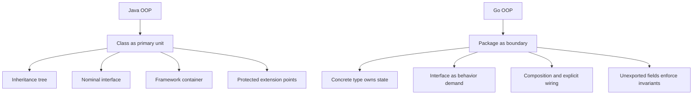
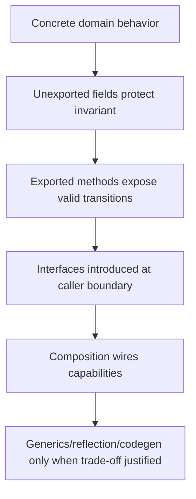
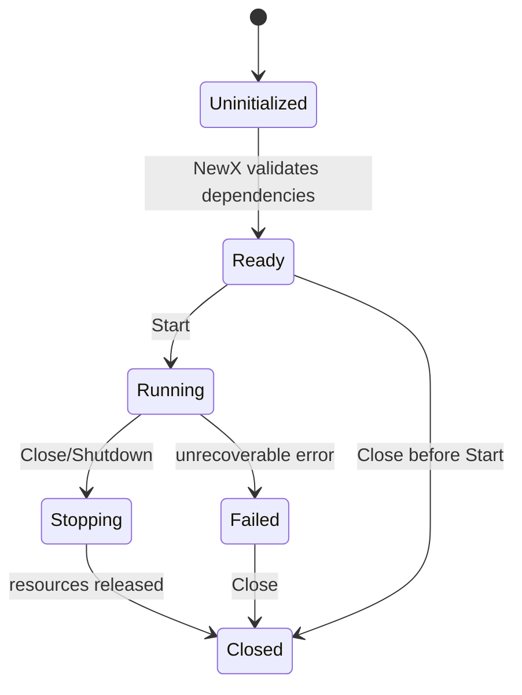
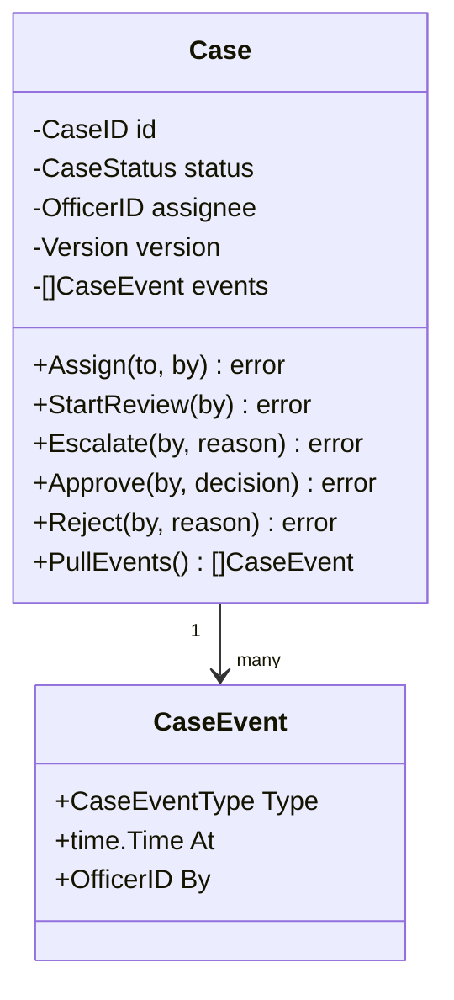
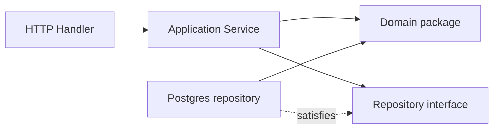
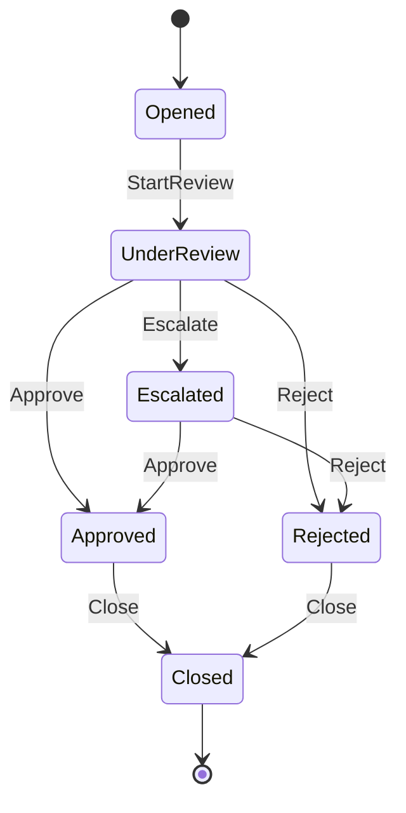

# learn-go-composition-oop-functional-reflection-codegen-modules-part-009.md

# Part 009 — OOP Tanpa Class: Polymorphism, Encapsulation, Lifecycle, Invariant, dan Domain Modeling di Go

> Seri: `learn-go-composition-oop-functional-reflection-codegen-modules`  
> Part: `009 / 030`  
> Fokus: membangun object-oriented design di Go tanpa class hierarchy, inheritance, abstract class, annotation-heavy model, atau framework-centric domain model.  
> Target pembaca: Java software engineer / tech lead yang ingin mendesain Go codebase dengan kualitas production engineering.

---

## 0. Posisi Part Ini Dalam Seri

Pada part sebelumnya kita sudah membahas:

1. transisi mental model dari Java class hierarchy ke Go behavior composition,
2. defined type, alias, receiver, dan method,
3. method set formal,
4. struct embedding,
5. composition patterns,
6. interface sebagai behavioral contract,
7. structural typing,
8. type sets dan generics constraints.

Part ini adalah titik konsolidasi: **bagaimana semua konsep tersebut dipakai untuk membangun desain yang tetap object-oriented, tetapi tidak berbasis class**.

Yang penting: Go tidak anti-OOP. Go hanya tidak menjadikan **class hierarchy** sebagai pusat desain.

Di Java, OOP sering terasa seperti:

```text
Class -> Field -> Method -> Inheritance -> Interface -> Framework wiring
```

Di Go, modelnya lebih dekat ke:

```text
Package -> Type -> Method -> Interface satisfaction -> Composition -> Explicit wiring
```

Dengan kata lain, pusat gravitasi desain berpindah dari **class sebagai unit utama** ke **package + type + behavior boundary**.

---

## 1. Tujuan Pembelajaran

Setelah menyelesaikan part ini, Anda diharapkan mampu:

1. menjelaskan bagaimana Go mendukung OOP tanpa `class`, `extends`, `implements`, `abstract`, dan `protected`;
2. membedakan polymorphism berbasis inheritance dengan polymorphism berbasis interface satisfaction;
3. mendesain encapsulation memakai package boundary, unexported type, exported constructor, dan method receiver;
4. menjaga invariant domain tanpa setter-heavy model;
5. mengelola lifecycle object secara eksplisit tanpa framework container;
6. menerjemahkan Java domain model ke Go tanpa membawa anti-pattern Java-style OOP;
7. memilih antara concrete type, interface, generic, function, dan package-level function;
8. membangun aggregate/domain object yang realistis untuk sistem case management/regulatory workflow;
9. melakukan review desain OOP Go secara production-oriented.

---

## 2. Premis Utama: Go Punya OOP, Tetapi Tidak Punya Class-OOP

Go punya banyak elemen yang biasanya diasosiasikan dengan OOP:

| OOP concept | Ada di Go? | Bentuk di Go |
|---|---:|---|
| Object/state | Ya | `struct`, defined type |
| Method | Ya | function dengan receiver |
| Encapsulation | Ya | package-level visibility, exported/unexported names |
| Polymorphism | Ya | interface satisfaction, function value, generics |
| Composition | Ya | named field, embedding, wrapper, delegation |
| Constructor | Tidak sebagai keyword | factory function seperti `NewX(...)` |
| Inheritance | Tidak | explicit composition/delegation |
| Abstract class | Tidak | interface + concrete helper + composition |
| Protected visibility | Tidak | package boundary only |
| Implements declaration | Tidak | implicit structural satisfaction |
| Override | Tidak | method promotion/shadowing bukan override inheritance |

Ini bukan sekadar perbedaan syntax. Ini memaksa perubahan cara mendesain.

Di Java, banyak desain dimulai dengan pertanyaan:

> “Apa parent class-nya?”

Di Go, pertanyaan yang lebih sehat:

> “Behavior apa yang dibutuhkan caller, invariant apa yang harus dijaga, dan package mana yang berhak memodifikasi state?”

---

## 3. Mental Model Utama

### 3.1 Java: identity + hierarchy + nominal contracts

Dalam Java, tipe biasanya diorganisasi secara nominal:

```java
interface Approver {
    ApprovalResult approve(Case c);
}

abstract class BaseApprover implements Approver {
    protected final AuditLogger auditLogger;

    protected BaseApprover(AuditLogger auditLogger) {
        this.auditLogger = auditLogger;
    }

    protected void audit(Case c) { ... }
}

final class SeniorOfficerApprover extends BaseApprover {
    @Override
    public ApprovalResult approve(Case c) { ... }
}
```

Hubungan desainnya eksplisit pada deklarasi tipe:

```text
SeniorOfficerApprover extends BaseApprover implements Approver
```

Kelebihannya:

- mudah mengekspresikan hierarchy;
- familiar untuk framework;
- reusable protected helper;
- mudah memakai template method.

Risikonya:

- parent class menjadi dependency tersembunyi;
- protected state bocor ke subclass;
- perubahan base class dapat merusak subclass;
- hierarchy sering menjadi taxonomy palsu;
- behavior composition sulit jika inheritance tree sudah kaku.

### 3.2 Go: behavior + composition + package boundary

Di Go, desain yang sama lebih natural ditulis seperti ini:

```go
type Approver interface {
	Approve(ctx context.Context, c *Case) (ApprovalResult, error)
}

type AuditLogger interface {
	LogApprovalAttempt(ctx context.Context, c *Case, actor ActorID) error
}

type SeniorOfficerApprover struct {
	auditLogger AuditLogger
	policy      ApprovalPolicy
}

func NewSeniorOfficerApprover(auditLogger AuditLogger, policy ApprovalPolicy) *SeniorOfficerApprover {
	return &SeniorOfficerApprover{
		auditLogger: auditLogger,
		policy:      policy,
	}
}

func (a *SeniorOfficerApprover) Approve(ctx context.Context, c *Case) (ApprovalResult, error) {
	if err := a.policy.Validate(c); err != nil {
		return ApprovalResult{}, err
	}

	if err := a.auditLogger.LogApprovalAttempt(ctx, c, c.CurrentActor()); err != nil {
		return ApprovalResult{}, err
	}

	return c.Approve(c.CurrentActor())
}
```

Di sini tidak ada `extends`, tidak ada `implements`, dan tidak ada `protected`.

Yang ada:

- `SeniorOfficerApprover` memiliki dependencies secara eksplisit;
- `Approver` adalah behavior contract;
- `SeniorOfficerApprover` otomatis satisfy `Approver` karena punya method `Approve`;
- reusable behavior dibuat melalui composition, bukan inheritance;
- invariant `Case` bisa dikunci di package domain.

### 3.3 Diagram pergeseran mental model



---

## 4. Apa Itu “Object” di Go?

Secara praktis, object di Go adalah:

> nilai yang punya state, behavior, dan lifecycle yang dikontrol melalui package/type boundary.

Contoh:

```go
type Case struct {
	id        CaseID
	status    CaseStatus
	assignee  OfficerID
	version   Version
	history   []CaseEvent
}
```

`Case` menjadi object ketika diberi behavior:

```go
func (c *Case) Assign(to OfficerID, by OfficerID) error {
	if c.status != CaseStatusOpen {
		return ErrCaseNotAssignable
	}
	if to.IsZero() {
		return ErrInvalidAssignee
	}

	c.assignee = to
	c.version++
	c.history = append(c.history, CaseEvent{
		Type: CaseEventAssigned,
		By:   by,
	})
	return nil
}
```

Perhatikan:

- field unexported;
- perubahan state lewat method;
- method menjaga invariant;
- caller tidak bisa sembarang mengubah `status`, `version`, atau `history`;
- state transition terpusat.

Ini sangat OOP.

Yang tidak ada hanya `class` keyword.

---

## 5. Encapsulation di Go: Package Boundary, Bukan Private Class Field Saja

### 5.1 Visibility di Go berbasis nama

Go memakai aturan sederhana:

- nama diawali huruf besar: exported;
- nama diawali huruf kecil: unexported;
- visibility berlaku pada level package, bukan class.

Contoh:

```go
package casefile

type Case struct {
	id      CaseID
	status  CaseStatus
	version Version
}

func (c *Case) ID() CaseID {
	return c.id
}

func (c *Case) Status() CaseStatus {
	return c.status
}
```

Package lain bisa memanggil:

```go
c.ID()
c.Status()
```

Tetapi tidak bisa melakukan:

```go
c.status = CaseStatusClosed // compile error dari package lain
```

### 5.2 Encapsulation bukan hanya menyembunyikan field

Encapsulation yang kuat mencakup:

1. siapa yang boleh membuat object;
2. siapa yang boleh mengubah state;
3. state transition apa yang valid;
4. kapan object dianggap initialized;
5. bagaimana object menjadi invalid;
6. bagaimana object diserialisasi;
7. bagaimana object dipersist;
8. bagaimana versioning/concurrency conflict dicegah;
9. bagaimana invariant dites.

Contoh constructor/factory:

```go
func OpenNewCase(id CaseID, applicant ApplicantID, now time.Time) (*Case, error) {
	if id.IsZero() {
		return nil, ErrInvalidCaseID
	}
	if applicant.IsZero() {
		return nil, ErrInvalidApplicant
	}

	return &Case{
		id:      id,
		status:  CaseStatusOpen,
		version: 1,
		history: []CaseEvent{
			{Type: CaseEventOpened, At: now},
		},
	}, nil
}
```

### 5.3 Constructor di Go adalah API design, bukan ritual

Go tidak memiliki constructor keyword. Ini justru memberi fleksibilitas:

| Bentuk | Kapan dipakai |
|---|---|
| zero value usable | type sederhana yang aman tanpa inisialisasi khusus |
| `NewX(...)` | object butuh dependency/default/invariant |
| `OpenX(...)`, `ParseX(...)`, `LoadX(...)` | nama factory menunjukkan intent |
| unexported concrete + exported interface | caller tidak perlu tahu implementasi |
| exported concrete + unexported fields | caller boleh menyimpan/memanggil, tidak boleh merusak state |

Contoh zero-value friendly:

```go
type CaseFilter struct {
	Status   CaseStatus
	Assignee OfficerID
	Limit    int
}
```

Contoh butuh constructor:

```go
type EscalationService struct {
	clock      Clock
	repository CaseRepository
	policy     EscalationPolicy
}

func NewEscalationService(clock Clock, repository CaseRepository, policy EscalationPolicy) (*EscalationService, error) {
	if clock == nil {
		return nil, ErrMissingClock
	}
	if repository == nil {
		return nil, ErrMissingRepository
	}
	if policy == nil {
		return nil, ErrMissingPolicy
	}

	return &EscalationService{
		clock:      clock,
		repository: repository,
		policy:     policy,
	}, nil
}
```

### 5.4 Anti-pattern: JavaBean di Go

Hindari domain object seperti ini:

```go
type Case struct {
	ID       CaseID
	Status   CaseStatus
	Assignee OfficerID
	Version  int
}
```

Untuk DTO, ini bisa benar. Untuk domain object, ini berbahaya.

Karena caller bisa melakukan:

```go
c.Status = CaseStatusClosed
c.Assignee = ""
c.Version = -100
```

Ini sama dengan membuat database table menjadi domain model tanpa invariant.

Model yang lebih defensible:

```go
type Case struct {
	id       CaseID
	status   CaseStatus
	assignee OfficerID
	version  Version
}

func (c *Case) Close(by OfficerID, reason CloseReason) error {
	if c.status != CaseStatusOpen && c.status != CaseStatusEscalated {
		return ErrInvalidCaseState
	}
	if reason.IsZero() {
		return ErrMissingCloseReason
	}

	c.status = CaseStatusClosed
	c.version++
	return nil
}
```

---

## 6. Polymorphism di Go

Go punya beberapa bentuk polymorphism.

### 6.1 Interface polymorphism

Ini bentuk paling mirip Java interface, tetapi implicit.

```go
type Notifier interface {
	Notify(ctx context.Context, msg Message) error
}

type EmailNotifier struct {
	client EmailClient
}

func (n *EmailNotifier) Notify(ctx context.Context, msg Message) error {
	return n.client.Send(ctx, msg.ToEmail())
}

type SMSNotifier struct {
	client SMSClient
}

func (n *SMSNotifier) Notify(ctx context.Context, msg Message) error {
	return n.client.Send(ctx, msg.ToSMS())
}
```

Caller:

```go
func Dispatch(ctx context.Context, notifier Notifier, msg Message) error {
	return notifier.Notify(ctx, msg)
}
```

Tidak ada deklarasi `implements Notifier`.

### 6.2 Function polymorphism

Untuk behavior kecil, interface kadang terlalu berat.

```go
type ApprovalRule func(c *Case) error

func RequireAssignee(c *Case) error {
	if c.assignee.IsZero() {
		return ErrMissingAssignee
	}
	return nil
}

func RequireOpenStatus(c *Case) error {
	if c.status != CaseStatusOpen {
		return ErrInvalidCaseState
	}
	return nil
}

func Validate(c *Case, rules ...ApprovalRule) error {
	for _, rule := range rules {
		if err := rule(c); err != nil {
			return err
		}
	}
	return nil
}
```

Ini functional-style polymorphism.

Cocok untuk:

- rule kecil;
- strategy sederhana;
- middleware/interceptor;
- validation chain;
- transformation pipeline;
- test stub ringan.

Tidak cocok jika behavior punya lifecycle, dependency banyak, atau state kompleks.

### 6.3 Generic polymorphism

Generic cocok ketika algoritma sama untuk beberapa type dan constraint dapat diekspresikan compile-time.

```go
type ID interface {
	~string | ~int64
}

func ContainsID[T ID](ids []T, target T) bool {
	for _, id := range ids {
		if id == target {
			return true
		}
	}
	return false
}
```

Untuk domain model, generic sering lebih baik pada utility/container/collection/policy composition, bukan pada aggregate behavior utama.

### 6.4 Ad-hoc polymorphism melalui interface kecil

Contoh dari standard library style:

```go
type Stringer interface {
	String() string
}
```

Object apa pun yang punya `String() string` satisfy behavior tersebut.

Dalam domain regulatory:

```go
type AuditSubject interface {
	AuditID() string
	AuditType() string
}
```

Lalu beberapa object bisa menjadi audit subject:

```go
func (c *Case) AuditID() string  { return string(c.id) }
func (c *Case) AuditType() string { return "case" }

func (a *Appeal) AuditID() string  { return string(a.id) }
func (a *Appeal) AuditType() string { return "appeal" }
```

Audit service tidak perlu tahu concrete domain object.

---

## 7. Encapsulation + Polymorphism: Dua Sisi yang Harus Seimbang

Kesalahan umum engineer Java saat masuk Go:

1. terlalu cepat membuat interface untuk semua service;
2. membuat struct field exported agar mudah test;
3. membuat setter untuk semua field;
4. membuat base struct lalu di-embed di mana-mana;
5. membuat package terlalu besar agar unexported field bisa diakses banyak type;
6. memakai reflection untuk mengganti missing abstraction;
7. memakai generic untuk domain behavior yang sebetulnya tidak generic.

Desain yang sehat biasanya mengikuti urutan ini:



Prinsipnya:

> Concrete type menjaga kebenaran. Interface memberi substitusi di boundary.

Jika interface diletakkan terlalu dini, domain sering berubah menjadi kumpulan kontrak dangkal tanpa invariant.

---

## 8. Lifecycle Object di Go

Di Java enterprise, lifecycle object sering dikelola framework:

- Spring Bean creation;
- dependency injection container;
- `@PostConstruct`;
- singleton/prototype scope;
- transaction proxy;
- interceptor;
- lifecycle callback.

Di Go, lifecycle biasanya eksplisit:

```go
service, err := NewEscalationService(clock, repository, policy)
if err != nil {
	return err
}

if err := service.Start(ctx); err != nil {
	return err
}

defer service.Close()
```

### 8.1 Lifecycle states

Object production sering punya lifecycle seperti:



Tidak semua object perlu state machine lifecycle. Tetapi untuk object yang memegang resource, lifecycle harus eksplisit.

Contoh resource-owning object:

```go
type Worker struct {
	queue  Queue
	logger Logger
	done   chan struct{}
	closed atomic.Bool
}

func NewWorker(queue Queue, logger Logger) (*Worker, error) {
	if queue == nil {
		return nil, ErrMissingQueue
	}
	if logger == nil {
		return nil, ErrMissingLogger
	}

	return &Worker{
		queue:  queue,
		logger: logger,
		done:   make(chan struct{}),
	}, nil
}

func (w *Worker) Start(ctx context.Context) error {
	if w.closed.Load() {
		return ErrWorkerClosed
	}

	go w.loop(ctx)
	return nil
}

func (w *Worker) Close() error {
	if w.closed.Swap(true) {
		return nil
	}
	close(w.done)
	return nil
}
```

Part concurrency sudah membahas detail goroutine/channel. Di sini poinnya adalah desain object:

- constructor validasi dependencies;
- `Start` eksplisit;
- `Close` idempotent;
- state tidak diubah sembarang;
- lifecycle menjadi bagian dari API contract.

### 8.2 Object bukan selalu pointer

Tidak semua object harus pointer.

Gunakan value jika:

- immutable atau logically immutable;
- kecil;
- tidak punya identity mutatif;
- copy aman;
- zero value valid.

Contoh:

```go
type Money struct {
	amount   int64
	currency Currency
}

func NewMoney(amount int64, currency Currency) (Money, error) {
	if currency == "" {
		return Money{}, ErrInvalidCurrency
	}
	return Money{amount: amount, currency: currency}, nil
}

func (m Money) Add(other Money) (Money, error) {
	if m.currency != other.currency {
		return Money{}, ErrCurrencyMismatch
	}
	return Money{amount: m.amount + other.amount, currency: m.currency}, nil
}
```

Gunakan pointer jika:

- method mengubah state;
- object besar;
- identity penting;
- object memegang resource;
- copy berbahaya;
- perlu share mutation.

Contoh:

```go
type Case struct {
	id      CaseID
	status  CaseStatus
	version Version
}

func (c *Case) Escalate(reason EscalationReason) error {
	if c.status != CaseStatusOpen {
		return ErrInvalidCaseState
	}
	c.status = CaseStatusEscalated
	c.version++
	return nil
}
```

---

## 9. Invariant: Inti Domain Modeling di Go

Invariant adalah kondisi yang harus selalu benar.

Contoh invariant case management:

- case ID tidak boleh kosong;
- closed case tidak boleh di-assign ulang;
- escalation hanya boleh dari status open atau under review;
- approval membutuhkan assignee;
- rejection membutuhkan reason;
- version harus meningkat setiap state mutation;
- audit event harus tercatat untuk transition tertentu;
- actor harus punya authority;
- submitted application tidak boleh punya missing mandatory document.

### 9.1 Invariant harus dekat dengan state

Buruk:

```go
// package service
func ApproveCase(c *casefile.Case) error {
	if c.Status != casefile.CaseStatusUnderReview {
		return ErrInvalidState
	}
	c.Status = casefile.CaseStatusApproved
	return nil
}
```

Masalah:

- field exported;
- semua package bisa bypass rule;
- validasi tersebar;
- invariant tidak melekat pada object;
- test harus mengejar semua tempat mutation.

Lebih baik:

```go
// package casefile
func (c *Case) Approve(by OfficerID, decision Decision) error {
	if c.status != CaseStatusUnderReview {
		return ErrInvalidCaseState
	}
	if by.IsZero() {
		return ErrMissingActor
	}
	if decision.IsZero() {
		return ErrMissingDecision
	}

	c.status = CaseStatusApproved
	c.version++
	c.events = append(c.events, CaseEvent{
		Type: CaseEventApproved,
		By:   by,
	})
	return nil
}
```

### 9.2 Tapi domain object jangan menjadi God object

Jika semua rule dimasukkan ke `Case`, object bisa menjadi terlalu besar.

Pisahkan:

| Rule type | Lokasi yang cocok |
|---|---|
| intrinsic invariant | method domain object |
| cross-aggregate invariant | domain service / application service |
| authorization rule | policy/capability service |
| external system dependency | application service / gateway |
| persistence concern | repository |
| presentation concern | DTO/handler |
| workflow orchestration | application service / use case |

Contoh intrinsic invariant:

```go
func (c *Case) CanBeEscalated() bool {
	return c.status == CaseStatusOpen || c.status == CaseStatusUnderReview
}
```

Contoh cross-aggregate rule:

```go
type EscalationService struct {
	caseRepo    CaseRepository
	officerRepo OfficerRepository
	policy      EscalationPolicy
}

func (s *EscalationService) Escalate(ctx context.Context, id CaseID, actor OfficerID, reason EscalationReason) error {
	c, err := s.caseRepo.Get(ctx, id)
	if err != nil {
		return err
	}

	officer, err := s.officerRepo.Get(ctx, actor)
	if err != nil {
		return err
	}

	if err := s.policy.CanEscalate(officer, c); err != nil {
		return err
	}

	if err := c.Escalate(actor, reason); err != nil {
		return err
	}

	return s.caseRepo.Save(ctx, c)
}
```

Di sini `Case` menjaga state transition internal. `EscalationService` mengatur orchestration yang butuh repository dan policy.

---

## 10. Domain Object vs DTO vs Persistence Model

Salah satu kesalahan besar di Go adalah menyamakan semua struct.

Go membuat struct sangat murah secara syntax. Tetapi secara desain, struct punya role berbeda.

| Role | Tujuan | Field exported? | Behavior? | Contoh |
|---|---|---:|---:|---|
| Domain object | menjaga invariant | biasanya tidak | ya | `Case`, `Application`, `Appeal` |
| DTO/API request | boundary format | ya | minimal | `CreateCaseRequest` |
| Persistence record | mapping database | bisa ya/tidak | minimal | `caseRecord` |
| View model | response/read model | ya | minimal | `CaseSummary` |
| Config | startup configuration | ya/tidak | validasi | `ServerConfig` |
| Event | immutable fact | biasanya exported read-only via constructor/getter | jarang | `CaseApproved` |

### 10.1 Jangan pakai satu struct untuk semua layer

Anti-pattern:

```go
type Case struct {
	ID          string    `json:"id" db:"id"`
	Status      string    `json:"status" db:"status"`
	AssigneeID  string    `json:"assignee_id" db:"assignee_id"`
	CreatedAt   time.Time `json:"created_at" db:"created_at"`
	UpdatedAt   time.Time `json:"updated_at" db:"updated_at"`
}
```

Ini tampak praktis, tetapi mencampur:

- domain invariant;
- JSON contract;
- database schema;
- nullability;
- migration concern;
- access control;
- versioning;
- serialization concern.

Lebih sehat:

```go
// Domain object.
type Case struct {
	id        CaseID
	status    CaseStatus
	assignee  OfficerID
	createdAt time.Time
	updatedAt time.Time
	version   Version
}

// API response.
type CaseResponse struct {
	ID        string `json:"id"`
	Status    string `json:"status"`
	Assignee  string `json:"assignee,omitempty"`
	UpdatedAt string `json:"updated_at"`
}

// Persistence model.
type caseRecord struct {
	ID         string
	Status     string
	AssigneeID sql.NullString
	CreatedAt  time.Time
	UpdatedAt  time.Time
	Version    int64
}
```

Mapping memang terlihat lebih banyak. Tetapi itu harga untuk boundary yang defensible.

### 10.2 Mapping sebagai boundary policy

```go
func caseFromRecord(r caseRecord) (*Case, error) {
	status, err := ParseCaseStatus(r.Status)
	if err != nil {
		return nil, err
	}

	c := &Case{
		id:        CaseID(r.ID),
		status:    status,
		createdAt: r.CreatedAt,
		updatedAt: r.UpdatedAt,
		version:   Version(r.Version),
	}

	if r.AssigneeID.Valid {
		c.assignee = OfficerID(r.AssigneeID.String)
	}

	if err := c.validateLoaded(); err != nil {
		return nil, err
	}
	return c, nil
}
```

`validateLoaded` bisa unexported:

```go
func (c *Case) validateLoaded() error {
	if c.id.IsZero() {
		return ErrInvalidCaseID
	}
	if !c.status.Valid() {
		return ErrInvalidCaseStatus
	}
	if c.version <= 0 {
		return ErrInvalidVersion
	}
	return nil
}
```

---

## 11. Aggregate Design di Go

Aggregate adalah boundary konsistensi. Ia menentukan state mana yang berubah bersama dan invariant mana yang harus dijaga secara atomik.

Contoh aggregate `Case`:



Mermaid memakai `classDiagram`, tetapi jangan artikan ini sebagai Java class hierarchy. Ini hanya diagram state/behavior.

### 11.1 Aggregate root dengan uncommitted events

```go
type Case struct {
	id       CaseID
	status   CaseStatus
	assignee OfficerID
	version  Version
	events   []CaseEvent
}

func (c *Case) Escalate(by OfficerID, reason EscalationReason) error {
	if !c.canEscalate() {
		return ErrInvalidCaseState
	}
	if by.IsZero() {
		return ErrMissingActor
	}
	if reason.IsZero() {
		return ErrMissingReason
	}

	c.status = CaseStatusEscalated
	c.version++
	c.record(CaseEvent{
		Type:   CaseEventEscalated,
		CaseID: c.id,
		By:     by,
		Reason: string(reason),
	})
	return nil
}

func (c *Case) PullEvents() []CaseEvent {
	out := append([]CaseEvent(nil), c.events...)
	c.events = nil
	return out
}

func (c *Case) record(event CaseEvent) {
	c.events = append(c.events, event)
}
```

### 11.2 Kenapa `PullEvents` mengembalikan copy?

Karena slice adalah descriptor yang menunjuk backing array. Jika internal slice dikembalikan langsung, caller bisa mengubah isi internal.

```go
out := append([]CaseEvent(nil), c.events...)
```

Ini membuat copy dari event slice.

Di domain object, hal kecil seperti ini penting untuk encapsulation.

---

## 12. Service Object di Go

Service object adalah object yang mengoordinasikan dependency, bukan pemilik invariant utama.

Contoh:

```go
type CaseApplicationService struct {
	repository CaseRepository
	authz      AuthorizationService
	audit      AuditLogger
	clock      Clock
}
```

Method:

```go
func (s *CaseApplicationService) EscalateCase(ctx context.Context, cmd EscalateCaseCommand) error {
	actor, err := ActorFromContext(ctx)
	if err != nil {
		return err
	}

	c, err := s.repository.Get(ctx, cmd.CaseID)
	if err != nil {
		return err
	}

	if err := s.authz.Require(ctx, actor, PermissionEscalateCase, c); err != nil {
		return err
	}

	if err := c.Escalate(actor.ID, cmd.Reason); err != nil {
		return err
	}

	if err := s.repository.Save(ctx, c); err != nil {
		return err
	}

	return s.audit.Log(ctx, AuditEvent{
		Actor:  actor.ID,
		Action: "case.escalate",
		Target: c.ID().String(),
		At:     s.clock.Now(),
	})
}
```

Desain ini memisahkan:

- `Case` sebagai domain object;
- `CaseApplicationService` sebagai use-case orchestrator;
- `CaseRepository` sebagai persistence boundary;
- `AuthorizationService` sebagai policy boundary;
- `AuditLogger` sebagai side effect boundary.

### 12.1 Jangan buat service menjadi anemic transaction script total

Buruk:

```go
func (s *CaseService) EscalateCase(ctx context.Context, id CaseID, reason string) error {
	r, err := s.db.GetCase(ctx, id)
	if err != nil {
		return err
	}

	if r.Status != "OPEN" {
		return ErrInvalidState
	}

	r.Status = "ESCALATED"
	r.Reason = reason
	r.Version++

	return s.db.UpdateCase(ctx, r)
}
```

Ini membuat rule domain tersebar di service.

Lebih baik: service orchestrates, aggregate validates transition.

---

## 13. Repository sebagai Interface: Di Mana Diletakkan?

Dalam Go, interface sebaiknya sering diletakkan di sisi consumer.

```go
package caseapp

type CaseRepository interface {
	Get(ctx context.Context, id casefile.CaseID) (*casefile.Case, error)
	Save(ctx context.Context, c *casefile.Case) error
}
```

Implementasi bisa ada di package infra:

```go
package casepostgres

type Repository struct {
	db *sql.DB
}

func (r *Repository) Get(ctx context.Context, id casefile.CaseID) (*casefile.Case, error) {
	// query + mapping
}

func (r *Repository) Save(ctx context.Context, c *casefile.Case) error {
	// transaction + optimistic lock
}
```

Dependency direction:



`caseapp` tidak perlu import `casepostgres`. Wiring dilakukan di composition root.

---

## 14. OOP Go dan Package Architecture

Package adalah unit encapsulation paling penting.

### 14.1 Package yang terlalu kecil

Anti-pattern:

```text
/internal/domain/case/model
/internal/domain/case/service
/internal/domain/case/repository
/internal/domain/case/validator
/internal/domain/case/constant
```

Ini sering warisan Java package-by-layer. Di Go, package terlalu kecil bisa membuat unexported encapsulation tidak berguna karena semua harus diexport agar bisa dipakai package lain.

### 14.2 Package yang terlalu besar

Anti-pattern lain:

```text
/internal/domain
```

Berisi semua entity, service, repository interface, event, policy, validation, constants.

Masalah:

- cohesion rendah;
- dependency sulit dilihat;
- package-level visibility terlalu luas;
- test fixture besar;
- perubahan kecil menyentuh banyak konsep.

### 14.3 Package berdasarkan cohesive capability

Lebih sehat:

```text
/internal/casefile
    case.go
    status.go
    event.go
    decision.go
    errors.go

/internal/caseapp
    service.go
    command.go
    repository.go
    authorization.go

/internal/casepostgres
    repository.go
    mapper.go
    record.go
```

Prinsipnya:

- `casefile` menjaga domain invariant;
- `caseapp` mengoordinasikan use case;
- `casepostgres` tahu database;
- handler/API package tahu transport;
- package boundary membantu encapsulation.

---

## 15. Dari Java Abstract Class ke Go Composition

Misal Java:

```java
abstract class BaseCaseAction {
    protected final CaseRepository repository;
    protected final AuditLogger auditLogger;

    public final void execute(Command command) {
        Case c = repository.get(command.caseId());
        validate(c, command);
        apply(c, command);
        repository.save(c);
        auditLogger.log(...);
    }

    protected abstract void validate(Case c, Command command);
    protected abstract void apply(Case c, Command command);
}
```

Di Go, jangan langsung membuat embedded base struct dengan pseudo-template method jika tidak perlu.

Desain Go lebih eksplisit:

```go
type CaseAction struct {
	repository CaseRepository
	audit      AuditLogger
}

func NewCaseAction(repository CaseRepository, audit AuditLogger) *CaseAction {
	return &CaseAction{repository: repository, audit: audit}
}

func (a *CaseAction) Execute(ctx context.Context, cmd CaseCommand, op CaseOperation) error {
	c, err := a.repository.Get(ctx, cmd.CaseID())
	if err != nil {
		return err
	}

	if err := op.Apply(ctx, c, cmd); err != nil {
		return err
	}

	if err := a.repository.Save(ctx, c); err != nil {
		return err
	}

	return a.audit.Log(ctx, op.AuditEvent(c, cmd))
}

type CaseOperation interface {
	Apply(ctx context.Context, c *casefile.Case, cmd CaseCommand) error
	AuditEvent(c *casefile.Case, cmd CaseCommand) AuditEvent
}
```

Atau lebih ringan dengan function:

```go
type CaseMutation func(ctx context.Context, c *casefile.Case) (AuditEvent, error)

func (a *CaseAction) Mutate(ctx context.Context, id casefile.CaseID, mutation CaseMutation) error {
	c, err := a.repository.Get(ctx, id)
	if err != nil {
		return err
	}

	event, err := mutation(ctx, c)
	if err != nil {
		return err
	}

	if err := a.repository.Save(ctx, c); err != nil {
		return err
	}

	return a.audit.Log(ctx, event)
}
```

Pilihan interface vs function tergantung kompleksitas.

---

## 16. Inheritance Smells Saat Menulis Go

Jika Anda mulai menulis hal-hal berikut, berhenti dan evaluasi ulang.

### 16.1 `BaseX` struct yang di-embed di banyak tempat

```go
type BaseService struct {
	logger Logger
	db     *sql.DB
	clock  Clock
}

type CaseService struct {
	BaseService
}

type AppealService struct {
	BaseService
}
```

Ini sering pseudo-inheritance.

Masalah:

- dependencies tidak eksplisit per service;
- public method BaseService bisa ikut promoted;
- sulit melihat service butuh dependency apa;
- perubahan BaseService berdampak luas;
- test setup membengkak.

Lebih baik:

```go
type CaseService struct {
	logger Logger
	repo   CaseRepository
	clock  Clock
}

type AppealService struct {
	logger Logger
	repo   AppealRepository
	clock  Clock
}
```

Duplikasi field kecil lebih baik daripada coupling besar.

### 16.2 `I` prefix interface untuk semua concrete

```go
type ICaseService interface { ... }
type CaseService struct { ... }
```

Go tidak butuh `I` prefix. Interface seharusnya dinamai berdasarkan behavior:

```go
type CaseEscalator interface {
	EscalateCase(ctx context.Context, cmd EscalateCaseCommand) error
}
```

Atau jika hanya satu method:

```go
type Escalator interface {
	Escalate(ctx context.Context, c *Case) error
}
```

### 16.3 Setter-heavy object

```go
func (c *Case) SetStatus(status CaseStatus) { c.status = status }
func (c *Case) SetAssignee(id OfficerID) { c.assignee = id }
func (c *Case) SetVersion(v Version) { c.version = v }
```

Setter sering bypass domain rule.

Ganti dengan behavior method:

```go
func (c *Case) Assign(to OfficerID, by OfficerID) error
func (c *Case) StartReview(by OfficerID) error
func (c *Case) Escalate(by OfficerID, reason EscalationReason) error
func (c *Case) Approve(by OfficerID, decision Decision) error
```

### 16.4 Interface untuk setiap concrete type

```go
type CaseServiceInterface interface {
	Create(...)
	Update(...)
	Delete(...)
	Search(...)
	Assign(...)
	Escalate(...)
	Approve(...)
	Reject(...)
}
```

Ini bukan abstraction. Ini mirror dari concrete type.

Interface besar sulit dievolusikan dan sulit di-test.

Lebih baik caller mendefinisikan interface kecil sesuai kebutuhan:

```go
type CaseApprover interface {
	ApproveCase(ctx context.Context, cmd ApproveCaseCommand) error
}
```

---

## 17. Designing for Substitution Tanpa Inheritance

Substitution berarti caller bisa memakai implementation berbeda tanpa tahu concrete type.

Di Go, substitution terjadi melalui interface.

Contoh:

```go
type Clock interface {
	Now() time.Time
}

type SystemClock struct{}

func (SystemClock) Now() time.Time {
	return time.Now()
}

type FixedClock struct {
	value time.Time
}

func (c FixedClock) Now() time.Time {
	return c.value
}
```

Production:

```go
service := NewCaseService(SystemClock{}, repo)
```

Test:

```go
service := NewCaseService(FixedClock{value: fixedTime}, fakeRepo)
```

Tidak perlu inheritance.

### 17.1 Substitution harus punya semantic contract

Jangan hanya cocok method signature. Harus cocok makna.

```go
type CaseRepository interface {
	Get(ctx context.Context, id CaseID) (*Case, error)
	Save(ctx context.Context, c *Case) error
}
```

Kontrak semantik perlu dijelaskan:

- `Get` return `ErrCaseNotFound` jika tidak ada;
- `Save` harus menjaga optimistic concurrency;
- `Save` harus persist event bersama state jika event sourcing/outbox dipakai;
- repository tidak boleh mengubah invariant domain;
- returned `Case` harus valid menurut constructor/loading invariant;
- context cancellation harus dihormati.

Di Go, banyak kontrak tidak bisa diekspresikan dalam type system. Maka doc comment dan contract test penting.

---

## 18. Object Identity vs Value Semantics

Java object hampir selalu reference semantics.

Go memiliki value semantics by default. Ini mempengaruhi OOP design.

### 18.1 Value object

```go
type CaseID string

func ParseCaseID(s string) (CaseID, error) {
	if strings.TrimSpace(s) == "" {
		return "", ErrInvalidCaseID
	}
	return CaseID(s), nil
}

func (id CaseID) String() string {
	return string(id)
}

func (id CaseID) IsZero() bool {
	return id == ""
}
```

`CaseID` aman dicopy.

### 18.2 Entity object

```go
type Case struct {
	id      CaseID
	status  CaseStatus
	version Version
}
```

`Case` punya identity dan mutable state. Pointer biasanya lebih cocok.

### 18.3 Copy hazard

Jika object mutable dicopy tanpa sengaja:

```go
func Process(c Case) error { // copy
	return c.Escalate(...)
}
```

Mutation terjadi pada copy, bukan original. Jika `Case` punya slice/map/mutex/resource, copy bisa lebih berbahaya lagi.

Untuk object mutable, desain API biasanya:

```go
func Process(c *Case) error
```

Dan pertimbangkan marker non-copy jika object punya lock/resource.

---

## 19. Encapsulation dan Snapshot State

Kadang caller perlu melihat state tanpa mengubahnya.

Jangan selalu return pointer ke internal state.

Buruk:

```go
func (c *Case) Events() []CaseEvent {
	return c.events
}
```

Caller bisa mutate:

```go
events := c.Events()
events[0].Type = CaseEventApproved
```

Lebih aman:

```go
func (c *Case) Events() []CaseEvent {
	return append([]CaseEvent(nil), c.events...)
}
```

Atau pakai snapshot DTO:

```go
type CaseSnapshot struct {
	ID       CaseID
	Status   CaseStatus
	Assignee OfficerID
	Version  Version
}

func (c *Case) Snapshot() CaseSnapshot {
	return CaseSnapshot{
		ID:       c.id,
		Status:   c.status,
		Assignee: c.assignee,
		Version:  c.version,
	}
}
```

Snapshot cocok untuk read model, logging, audit, testing assertion.

---

## 20. Error Contract Sebagai Bagian dari OOP Design

Error bukan hanya reliability concern. Error adalah bagian dari object behavior contract.

Contoh:

```go
func (c *Case) Approve(by OfficerID, decision Decision) error
```

Caller perlu tahu error apa yang mungkin terjadi:

- invalid state;
- missing actor;
- missing decision;
- already finalized;
- domain rule violation.

Gunakan error yang bisa diinspeksi jika caller perlu branch.

```go
var (
	ErrInvalidCaseState = errors.New("invalid case state")
	ErrMissingActor     = errors.New("missing actor")
	ErrMissingDecision  = errors.New("missing decision")
)
```

Atau typed error:

```go
type InvalidTransitionError struct {
	From CaseStatus
	To   CaseStatus
}

func (e InvalidTransitionError) Error() string {
	return fmt.Sprintf("invalid case transition: %s -> %s", e.From, e.To)
}
```

Object behavior perlu stabil dalam error semantics.

---

## 21. Authorization dan Domain Object: Jangan Dicampur Sembarangan

Pertanyaan penting:

> Apakah `Case.Approve(...)` harus mengecek role/permission?

Jawabannya: tergantung jenis rule.

Intrinsic domain rule:

```go
if c.status != CaseStatusUnderReview {
	return ErrInvalidCaseState
}
```

Cocok di domain object.

Authorization rule:

```go
if !actor.HasPermission(PermissionApproveCase) {
	return ErrForbidden
}
```

Sering lebih cocok di policy/application layer.

Kenapa?

- permission bisa bergantung pada org structure;
- role bisa berubah;
- delegation/acting role bisa kompleks;
- authorization membutuhkan external source;
- rule bisa berbeda per channel/agency/module.

Desain:

```go
func (s *CaseApplicationService) ApproveCase(ctx context.Context, cmd ApproveCaseCommand) error {
	actor, err := s.actorProvider.Actor(ctx)
	if err != nil {
		return err
	}

	c, err := s.repository.Get(ctx, cmd.CaseID)
	if err != nil {
		return err
	}

	if err := s.authz.Require(ctx, actor, PermissionApproveCase, c); err != nil {
		return err
	}

	if err := c.Approve(actor.ID, cmd.Decision); err != nil {
		return err
	}

	return s.repository.Save(ctx, c)
}
```

Domain object tetap menjaga transition validity. Authorization service menjaga authority.

---

## 22. Testing OOP Design di Go

Testing desain OOP Go harus membuktikan invariant dan contract, bukan hanya coverage method.

### 22.1 Domain object test

```go
func TestCase_Escalate_FromOpen_Succeeds(t *testing.T) {
	c := mustOpenCase(t)

	err := c.Escalate(OfficerID("officer-1"), EscalationReason("sla breach"))
	if err != nil {
		t.Fatalf("Escalate returned error: %v", err)
	}

	if got, want := c.Status(), CaseStatusEscalated; got != want {
		t.Fatalf("status = %v, want %v", got, want)
	}
}
```

### 22.2 Invalid transition test

```go
func TestCase_Escalate_FromClosed_Fails(t *testing.T) {
	c := mustClosedCase(t)

	err := c.Escalate(OfficerID("officer-1"), EscalationReason("late"))
	if !errors.Is(err, ErrInvalidCaseState) {
		t.Fatalf("error = %v, want ErrInvalidCaseState", err)
	}
}
```

### 22.3 Contract test untuk repository

```go
func RepositoryContract(t *testing.T, newRepo func(t *testing.T) CaseRepository) {
	t.Helper()

	t.Run("save and get preserves valid case", func(t *testing.T) {
		repo := newRepo(t)
		c := mustOpenCase(t)

		if err := repo.Save(context.Background(), c); err != nil {
			t.Fatalf("Save: %v", err)
		}

		loaded, err := repo.Get(context.Background(), c.ID())
		if err != nil {
			t.Fatalf("Get: %v", err)
		}

		if loaded.ID() != c.ID() {
			t.Fatalf("loaded ID = %v, want %v", loaded.ID(), c.ID())
		}
	})
}
```

Ini memastikan semua implementation repository satisfy semantic contract, bukan hanya compile-time interface.

---

## 23. Design Review Checklist

Gunakan checklist ini saat mereview OOP design di Go.

### 23.1 Type design

- Apakah type ini value object, entity, service, DTO, persistence record, atau config?
- Apakah field exported karena memang boundary format, atau hanya karena malas membuat behavior method?
- Apakah zero value valid? Jika tidak, apakah constructor dipaksa?
- Apakah pointer receiver dipakai karena mutability/identity, bukan kebiasaan?
- Apakah copy hazard sudah dipikirkan?

### 23.2 Encapsulation

- Apakah invariant bisa dibypass dari package lain?
- Apakah method merepresentasikan behavior domain, bukan setter mekanis?
- Apakah slice/map internal dikembalikan sebagai copy/snapshot?
- Apakah object expose state terlalu banyak?
- Apakah package terlalu kecil sehingga semua hal harus exported?

### 23.3 Polymorphism

- Apakah interface berada di sisi consumer?
- Apakah interface kecil dan behavior-oriented?
- Apakah interface punya semantic contract yang didokumentasikan?
- Apakah ada interface yang hanya mirror concrete type?
- Apakah function type lebih cocok daripada interface?
- Apakah generic benar-benar dibutuhkan?

### 23.4 Composition

- Apakah named field lebih jelas daripada embedding?
- Apakah embedding menyebabkan method promotion yang tidak disengaja?
- Apakah dependency eksplisit per service?
- Apakah ada `BaseX` smell?
- Apakah wrapper/decorator menjaga contract original?

### 23.5 Lifecycle

- Apakah object punya resource yang harus ditutup?
- Apakah `Close` idempotent?
- Apakah `Start`/`Stop` contract jelas?
- Apakah constructor memvalidasi dependency mandatory?
- Apakah object bisa digunakan setelah close? Jika tidak, error apa yang dikembalikan?

### 23.6 Domain modeling

- Apakah intrinsic invariant berada dekat dengan state?
- Apakah cross-aggregate rule dipisahkan dari aggregate?
- Apakah authorization bercampur dengan state transition secara tidak perlu?
- Apakah persistence model mencemari domain object?
- Apakah API DTO mencemari invariant domain?

---

## 24. Case Study: Regulatory Case Lifecycle

Kita desain mini-domain untuk regulatory enforcement case.

### 24.1 State model



### 24.2 Domain package

```go
package casefile

type CaseStatus string

const (
	CaseStatusOpened      CaseStatus = "OPENED"
	CaseStatusUnderReview CaseStatus = "UNDER_REVIEW"
	CaseStatusEscalated   CaseStatus = "ESCALATED"
	CaseStatusApproved    CaseStatus = "APPROVED"
	CaseStatusRejected    CaseStatus = "REJECTED"
	CaseStatusClosed      CaseStatus = "CLOSED"
)

type Case struct {
	id       CaseID
	status   CaseStatus
	assignee OfficerID
	version  Version
	events   []CaseEvent
}

func Open(id CaseID, by OfficerID) (*Case, error) {
	if id.IsZero() {
		return nil, ErrInvalidCaseID
	}
	if by.IsZero() {
		return nil, ErrMissingActor
	}

	c := &Case{
		id:      id,
		status:  CaseStatusOpened,
		version: 1,
	}
	c.record(CaseEvent{Type: CaseEventOpened, CaseID: id, By: by})
	return c, nil
}

func (c *Case) StartReview(by OfficerID, assignee OfficerID) error {
	if c.status != CaseStatusOpened {
		return ErrInvalidCaseState
	}
	if by.IsZero() || assignee.IsZero() {
		return ErrMissingActor
	}

	c.status = CaseStatusUnderReview
	c.assignee = assignee
	c.version++
	c.record(CaseEvent{Type: CaseEventReviewStarted, CaseID: c.id, By: by})
	return nil
}

func (c *Case) Escalate(by OfficerID, reason EscalationReason) error {
	if c.status != CaseStatusUnderReview {
		return ErrInvalidCaseState
	}
	if by.IsZero() {
		return ErrMissingActor
	}
	if reason.IsZero() {
		return ErrMissingReason
	}

	c.status = CaseStatusEscalated
	c.version++
	c.record(CaseEvent{Type: CaseEventEscalated, CaseID: c.id, By: by, Reason: reason.String()})
	return nil
}

func (c *Case) Approve(by OfficerID, decision Decision) error {
	if c.status != CaseStatusUnderReview && c.status != CaseStatusEscalated {
		return ErrInvalidCaseState
	}
	if by.IsZero() {
		return ErrMissingActor
	}
	if decision.IsZero() {
		return ErrMissingDecision
	}

	c.status = CaseStatusApproved
	c.version++
	c.record(CaseEvent{Type: CaseEventApproved, CaseID: c.id, By: by})
	return nil
}
```

### 24.3 Application service

```go
package caseapp

type Repository interface {
	Get(ctx context.Context, id casefile.CaseID) (*casefile.Case, error)
	Save(ctx context.Context, c *casefile.Case) error
}

type Authorization interface {
	Require(ctx context.Context, actor Actor, permission Permission, target any) error
}

type AuditLogger interface {
	Log(ctx context.Context, event AuditEvent) error
}

type Service struct {
	repository Repository
	authz      Authorization
	audit      AuditLogger
	clock      Clock
}

func NewService(repository Repository, authz Authorization, audit AuditLogger, clock Clock) (*Service, error) {
	if repository == nil {
		return nil, ErrMissingRepository
	}
	if authz == nil {
		return nil, ErrMissingAuthorization
	}
	if audit == nil {
		return nil, ErrMissingAuditLogger
	}
	if clock == nil {
		return nil, ErrMissingClock
	}

	return &Service{
		repository: repository,
		authz:      authz,
		audit:      audit,
		clock:      clock,
	}, nil
}

func (s *Service) Escalate(ctx context.Context, cmd EscalateCommand) error {
	actor, err := ActorFromContext(ctx)
	if err != nil {
		return err
	}

	c, err := s.repository.Get(ctx, cmd.CaseID)
	if err != nil {
		return err
	}

	if err := s.authz.Require(ctx, actor, PermissionEscalateCase, c.Snapshot()); err != nil {
		return err
	}

	if err := c.Escalate(actor.ID, cmd.Reason); err != nil {
		return err
	}

	if err := s.repository.Save(ctx, c); err != nil {
		return err
	}

	return s.audit.Log(ctx, AuditEvent{
		Action: "case.escalate",
		Actor:  actor.ID.String(),
		Target: c.ID().String(),
		At:     s.clock.Now(),
	})
}
```

### 24.4 Composition root

```go
func BuildCaseService(db *sql.DB, logger Logger) (*caseapp.Service, error) {
	repo := casepostgres.NewRepository(db)
	authz := rbac.NewAuthorizationService(...)
	audit := auditlog.NewLogger(logger)
	clock := systemclock.Clock{}

	return caseapp.NewService(repo, authz, audit, clock)
}
```

Tidak ada framework magic. Semua dependency eksplisit.

---

## 25. Decision Framework: Concrete Type, Interface, Function, Generic, atau Reflection?

| Kebutuhan | Pilihan utama | Alasan |
|---|---|---|
| Menjaga state dan invariant | concrete type | invariant dekat dengan state |
| Mengganti implementation dependency | interface kecil | substitusi di boundary |
| Behavior kecil tanpa state | function type | sederhana dan mudah test |
| Algoritma sama untuk banyak type | generic | compile-time reuse |
| Mapping arbitrary struct/tag | reflection/codegen | type tidak diketahui atau boilerplate besar |
| Public domain model | exported concrete + unexported fields | caller bisa menggunakan, tidak bisa merusak |
| Hide implementation total | exported interface + unexported concrete | cocok untuk plugin/driver boundary |
| Resource lifecycle | concrete type with `Close`/`Start` | lifecycle explicit |

Rule of thumb:

1. mulai dari concrete type;
2. tambahkan method yang menjaga invariant;
3. buat interface hanya saat ada consumer boundary;
4. gunakan function type untuk behavior kecil;
5. gunakan generic untuk algoritma reusable dengan constraint jelas;
6. gunakan reflection/codegen saat runtime metadata atau boilerplate benar-benar menjadi masalah.

---

## 26. Hubungan Dengan Spec dan Dokumen Resmi Go

Beberapa fakta bahasa yang menjadi dasar part ini:

1. Program Go dibangun dari package; package membantu manajemen dependency dan boundary desain.
2. Method di Go adalah function dengan receiver; receiver mengikat behavior ke defined type.
3. Interface di Go adalah type yang mendefinisikan type set/method set; implementation bersifat implicit melalui method set.
4. Interface value memiliki static interface type dan dynamic concrete value/type saat runtime.
5. Reflection bekerja dengan mengambil informasi dynamic type/value dari interface value.
6. `go generate` adalah langkah eksplisit oleh author, bukan bagian otomatis dari `go build`.

Implikasi engineering-nya:

- encapsulation utama bukan class-private, tetapi package-private;
- polymorphism utama bukan inheritance, tetapi interface satisfaction;
- object lifecycle eksplisit, bukan container-managed secara default;
- domain correctness harus dijaga oleh constructor/method/package boundary;
- abstraction harus dibangun saat ada kebutuhan substitusi, bukan otomatis untuk semua concrete type.

---

## 27. Common Review Comments Untuk Engineer Java

### 27.1 “Ini Java class yang diterjemahkan ke Go”

Tanda-tanda:

- `BaseService`;
- `AbstractProcessor`;
- `IThing`;
- setter untuk semua field;
- package-by-layer terlalu granular;
- interface besar untuk semua method service;
- embedding untuk reuse semua dependency;
- domain struct penuh tag `json`, `db`, `validate`, `xml` sekaligus.

Perbaikan:

- pisahkan role struct;
- kecilkan interface;
- pindahkan invariant ke domain method;
- gunakan named field composition;
- gunakan mapper di boundary;
- pakai package cohesive capability.

### 27.2 “Interface ini belum punya consumer”

Jika interface dibuat di package provider dan hanya punya satu implementation tanpa consumer boundary jelas, tunda dulu.

Concrete type lebih mudah dievolusikan.

### 27.3 “Setter ini merusak invariant”

Ganti setter dengan behavior method.

```go
// Daripada:
SetStatus(CaseStatusApproved)

// Lebih baik:
Approve(actor, decision)
```

### 27.4 “Embedding ini mengekspos terlalu banyak method”

Jika embedding hanya untuk reuse helper, pakai named field.

```go
type Service struct {
	audit *AuditSupport
}
```

Lalu forwarding hanya method yang memang bagian API.

### 27.5 “DTO bocor ke domain”

Jika domain object punya terlalu banyak serialization tag, pertimbangkan split DTO/persistence record/domain.

---

## 28. Production Invariants Untuk OOP Go

Untuk codebase besar, gunakan invariant berikut sebagai standar:

1. Domain object tidak boleh mengekspos mutable internal state tanpa alasan kuat.
2. State transition domain harus punya method bernama berdasarkan business action.
3. Constructor/factory harus memvalidasi mandatory invariant.
4. Interface harus kecil, behavior-oriented, dan berada dekat consumer.
5. Concrete type boleh diexport jika field tetap unexported dan invariant aman.
6. Service object harus eksplisit dependency-nya.
7. Lifecycle resource harus punya close/shutdown contract yang jelas.
8. DTO, persistence record, dan domain object tidak otomatis sama.
9. Mapping boilerplate lebih dapat diterima daripada boundary yang bocor.
10. Embedding harus direview sebagai public API risk.
11. Error behavior harus stabil dan dapat dites.
12. Contract yang tidak bisa diekspresikan type system harus didokumentasikan dan diuji.

---

## 29. Ringkasan Mental Model

Jika Anda hanya mengingat satu hal:

> Go OOP adalah desain berbasis type, method, interface satisfaction, dan package boundary; bukan desain berbasis class hierarchy.

Versi lebih operasional:

```text
State lives in concrete types.
Invariants live near state.
Behavior is exposed by methods.
Substitution happens through small interfaces.
Reuse happens through composition.
Lifecycle is explicit.
Package boundary is the encapsulation wall.
```

Untuk Java engineer:

```text
Do not ask: what should this class extend?
Ask: who owns this state, what invariant must never break, and what behavior does the caller actually need?
```

---

## 30. Latihan Desain

### Latihan 1 — Refactor JavaBean-style Go struct

Diberikan:

```go
type Application struct {
	ID        string
	Status    string
	Applicant string
	Documents []Document
}
```

Refactor menjadi:

- domain object dengan unexported fields;
- constructor;
- method `Submit`, `Approve`, `Reject`;
- snapshot DTO;
- event recording.

### Latihan 2 — Pisahkan DTO, domain, persistence

Buat tiga struct berbeda:

- `CreateApplicationRequest`;
- `Application`;
- `applicationRecord`.

Tulis mapping dari request ke domain dan domain ke record.

### Latihan 3 — Design interface consumer-side

Buat `ApplicationService` yang butuh:

- repository;
- authorization;
- audit logger;
- clock.

Letakkan interface di package application service, bukan package implementation.

### Latihan 4 — Hindari pseudo-inheritance

Refactor desain ini:

```go
type BaseProcessor struct { ... }
type CaseProcessor struct { BaseProcessor }
type AppealProcessor struct { BaseProcessor }
```

Menjadi composition explicit dengan named dependencies dan shared helper yang tidak mengekspos API tidak perlu.

### Latihan 5 — Review aggregate boundary

Ambil domain dari sistem kerja nyata Anda. Tentukan:

- aggregate root;
- value object;
- domain event;
- application service;
- repository interface;
- DTO;
- persistence record;
- invariant yang harus dijaga.

---

## 31. Preview Part Berikutnya

Part berikutnya adalah:

```text
learn-go-composition-oop-functional-reflection-codegen-modules-part-010.md
```

Topik:

```text
Anti-inheritance migration: menerjemahkan Java abstract class/template method ke Go composition
```

Kita akan masuk lebih spesifik ke strategi migrasi desain Java-style:

- abstract class;
- template method;
- inheritance reuse;
- protected hook;
- strategy object;
- lifecycle callback;
- class hierarchy flattening;
- adapter/wrapper migration;
- sealed-ish pattern;
- framework service to explicit Go composition.

---

## 32. Status Seri

Seri belum selesai.

Progress saat ini:

```text
Part 009 dari 030 selesai.
```

Masih tersisa:

```text
Part 010 sampai Part 030.
```

<!-- NAVIGATION_FOOTER -->
<div class="page-nav">
<a href="./learn-go-composition-oop-functional-reflection-codegen-modules-part-008.md">⬅️ Part 008 — Interface Type Sets & Generics Constraints: `~T`, Union Terms, `comparable`, dan Constraint Design</a>
<a href="./index.md">📚 Kategori</a>
<a href="../../index.md">🏠 Home</a>
<a href="./learn-go-composition-oop-functional-reflection-codegen-modules-part-010.md">Part 010 — Anti-Inheritance Migration: Menerjemahkan Java Abstract Class, Template Method, dan Framework-Style Inheritance ke Go Composition ➡️</a>
</div>
