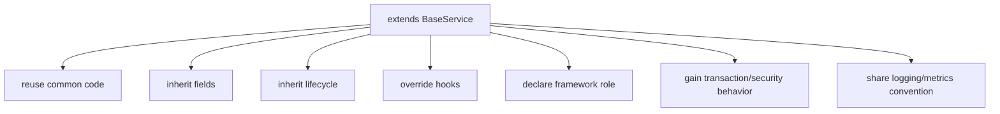
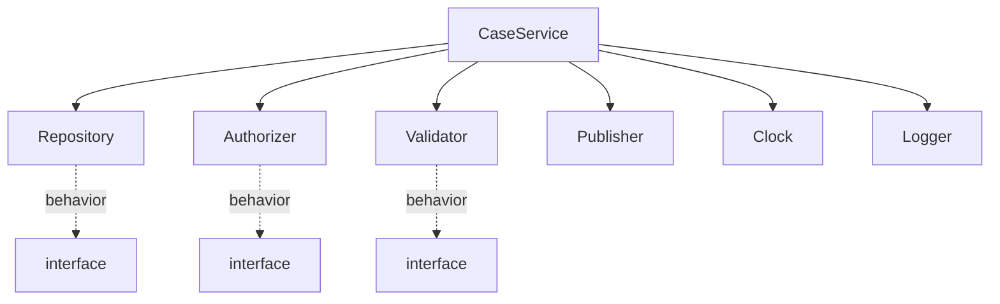
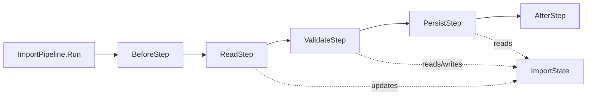
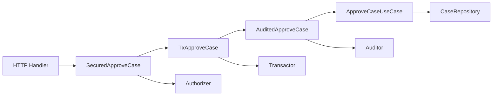
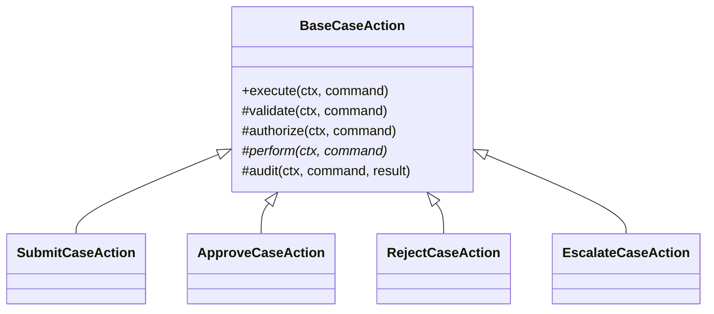
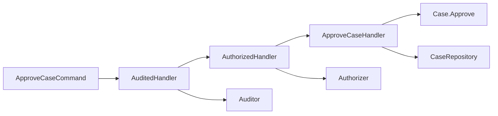
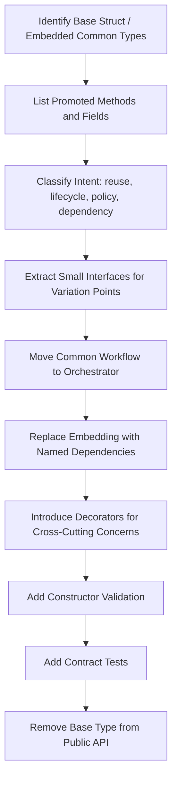
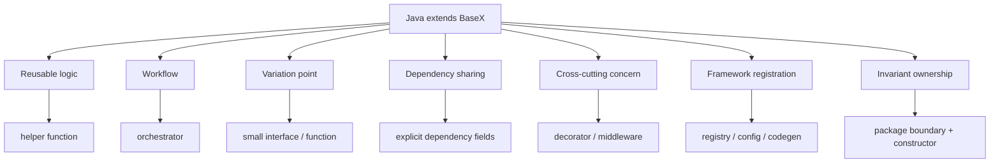

# learn-go-composition-oop-functional-reflection-codegen-modules-part-010.md

# Part 010 — Anti-Inheritance Migration: Menerjemahkan Java Abstract Class, Template Method, dan Framework-Style Inheritance ke Go Composition

> Seri: `learn-go-composition-oop-functional-reflection-codegen-modules`  
> Bagian: `010 / 030`  
> Status seri: **belum selesai**  
> Target pembaca: Java software engineer / tech lead yang ingin mendesain sistem Go besar tanpa membawa mental model inheritance-heavy dari Java.

---

## 0. Tujuan Bagian Ini

Bagian ini membahas salah satu transisi desain paling penting bagi engineer Java senior yang masuk ke Go:

> Bagaimana menerjemahkan desain berbasis inheritance, abstract class, template method, framework callback, annotation-heavy extension, dan class hierarchy ke desain Go yang lebih eksplisit, komposisional, testable, dan stabil secara API.

Di Java, banyak framework dan codebase enterprise dibangun dengan kombinasi:

- `abstract class`
- `interface`
- inheritance hierarchy
- template method
- protected hook
- annotation scanning
- reflection-driven wiring
- classpath discovery
- proxy/AOP
- dependency injection container
- base service/base controller/base repository

Di Go, sebagian besar pola tersebut **tidak diterjemahkan secara literal**.

Go tidak punya class, subclass, protected method, override annotation, constructor hierarchy, atau inheritance chain. Go punya:

- package boundary
- defined type
- struct
- method
- interface structural
- embedding
- function value
- explicit dependency injection
- explicit registration
- explicit composition
- generics untuk compile-time reuse tertentu
- reflection/code generation sebagai tool khusus, bukan default model desain

Tujuan bagian ini bukan berkata bahwa inheritance selalu buruk. Tujuannya adalah memberi Anda kemampuan untuk:

1. Mengenali desain Java yang inheritance-heavy.
2. Memahami niat desain di balik inheritance tersebut.
3. Memilih terjemahan Go yang tepat.
4. Menghindari pseudo-inheritance melalui embedding yang bocor.
5. Mendesain API Go yang lebih kecil, lebih eksplisit, dan lebih kuat terhadap perubahan.

---

## 1. Premis Utama: Jangan Migrasi Bentuk, Migrasi Intent

Kesalahan besar saat memindahkan desain Java ke Go adalah memindahkan **bentuk**.

Contoh bentuk Java:

```java
abstract class BaseHandler {
    public final Result handle(Request req) {
        validate(req);
        authorize(req);
        return doHandle(req);
    }

    protected abstract Result doHandle(Request req);

    protected void validate(Request req) {}
    protected void authorize(Request req) {}
}
```

Engineer yang terbiasa dengan Java mungkin mencari padanan Go seperti:

```go
type BaseHandler struct{}

func (h *BaseHandler) Handle(req Request) Result {
    h.Validate(req)
    h.Authorize(req)
    return h.DoHandle(req) // tidak bisa dinamis seperti virtual dispatch Java
}

func (h *BaseHandler) DoHandle(req Request) Result {
    panic("abstract")
}
```

Ini bukan terjemahan yang sehat. Ini mencoba membuat Go menjadi Java.

Yang harus dimigrasi bukan struktur `abstract class`, tetapi **intent**:

- Ada pipeline operasi.
- Ada langkah invariant yang selalu harus terjadi.
- Ada beberapa titik variasi.
- Ada policy yang bisa diganti.
- Ada common orchestration.
- Ada domain-specific behavior.

Dalam Go, intent tersebut bisa diterjemahkan menjadi:

- orchestrator function
- interface kecil untuk titik variasi
- function parameter
- strategy object
- explicit pipeline
- middleware chain
- decorator
- package-level constructor
- unexported struct + exported interface bila memang perlu

---

## 2. Mental Model: Java Inherits State and Behavior, Go Composes Capability

### 2.1 Java class hierarchy

Dalam Java, sebuah class biasanya membawa:

- identity type
- state
- method implementation
- inherited method
- overridden method
- visibility hierarchy (`private`, `protected`, `public`)
- constructor chain
- annotation metadata
- runtime reflection metadata
- framework integration point

Relasi `extends` sering berarti banyak hal sekaligus:



Satu keyword `extends` bisa menyembunyikan banyak kontrak.

### 2.2 Go composition model

Dalam Go, relasi sebaiknya dipecah menjadi kontrak kecil:



Satu service tidak “menjadi subclass dari base service”. Ia memiliki dependency yang eksplisit.

Go lebih menyukai pertanyaan:

> Capability apa yang dibutuhkan object ini untuk melakukan tugasnya?

bukan:

> Parent class apa yang harus diwarisi agar object ini menjadi bagian dari framework?

---

## 3. Taxonomy Inheritance Java yang Sering Muncul

Sebelum menerjemahkan, kita harus tahu jenis inheritance yang sedang digunakan.

| Java Pattern | Biasanya Dipakai Untuk | Masalah Saat Dibawa ke Go | Terjemahan Go yang Lebih Tepat |
|---|---|---|---|
| Abstract base class | common logic + hooks | Go tidak punya virtual override | orchestrator + small interface/function hook |
| Template method | fixed workflow dengan variasi langkah | hidden control flow | explicit pipeline/service method |
| Base service | logger, repo, tx, metrics, common validation | god struct, dependency leakage | explicit dependencies + decorator/middleware |
| Base controller | common HTTP behavior | framework inheritance | handler function + middleware |
| Base repository | CRUD reuse | leaky generic repository | package-specific repository + generic helper bila perlu |
| Protected method hook | override extension point | tidak ada `protected` | unexported helper + interface/function option |
| Marker interface | tagging type | runtime ambiguity | explicit registration / capability interface |
| Annotation-driven extension | framework scanning | hidden wiring | explicit config, registry, codegen bila perlu |
| Inheritance for polymorphism | substitutable subtype | over-wide contract | small interface at consumer boundary |
| Inheritance for code reuse | avoid duplication | brittle hierarchy | function/helper/delegation |

Kunci diagnosis:

> Apakah inheritance dipakai untuk polymorphism, code reuse, lifecycle, framework registration, atau policy variation?

Jawaban itu menentukan desain Go.

---

## 4. Go Tidak Punya Abstract Class — dan Itu Memaksa Pemisahan Dua Hal

Java abstract class sering menggabungkan dua peran:

1. reusable implementation
2. abstract contract

Contoh:

```java
abstract class PaymentProcessor {
    public Receipt process(Payment payment) {
        validate(payment);
        Charge charge = charge(payment);
        persist(charge);
        notifyCustomer(charge);
        return receipt(charge);
    }

    protected abstract Charge charge(Payment payment);
}
```

Di Go, pisahkan:

- orchestration
- variation point
- side-effect dependency
- data model

```go
type Charger interface {
	Charge(ctx context.Context, payment Payment) (Charge, error)
}

type ChargeStore interface {
	Save(ctx context.Context, charge Charge) error
}

type Notifier interface {
	NotifyCharge(ctx context.Context, charge Charge) error
}

type PaymentService struct {
	charger  Charger
	store    ChargeStore
	notifier Notifier
}

func NewPaymentService(charger Charger, store ChargeStore, notifier Notifier) *PaymentService {
	if charger == nil {
		panic("nil Charger")
	}
	if store == nil {
		panic("nil ChargeStore")
	}
	if notifier == nil {
		panic("nil Notifier")
	}
	return &PaymentService{charger: charger, store: store, notifier: notifier}
}

func (s *PaymentService) Process(ctx context.Context, payment Payment) (Receipt, error) {
	if err := validatePayment(payment); err != nil {
		return Receipt{}, err
	}

	charge, err := s.charger.Charge(ctx, payment)
	if err != nil {
		return Receipt{}, err
	}

	if err := s.store.Save(ctx, charge); err != nil {
		return Receipt{}, err
	}

	if err := s.notifier.NotifyCharge(ctx, charge); err != nil {
		return Receipt{}, err
	}

	return NewReceipt(charge), nil
}
```

Di sini `PaymentService` bukan parent class. Ia adalah orchestrator.

`Charger` bukan child class. Ia adalah capability.

---

## 5. Template Method: Dari Hidden Override ke Explicit Workflow

### 5.1 Java template method

Template method di Java mengunci urutan workflow di base class, lalu subclass mengisi langkah tertentu.

```java
abstract class CaseAction {
    public final Outcome execute(Case c, User u) {
        checkPermission(c, u);
        validate(c);
        Outcome out = perform(c, u);
        audit(c, u, out);
        return out;
    }

    protected abstract Outcome perform(Case c, User u);
}
```

Masalah umum:

- subclass behavior tersembunyi
- override bisa melanggar invariant
- protected hooks sulit diuji secara terisolasi
- parent class tumbuh jadi god object
- urutan lifecycle tersebar di parent dan subclass
- debugging harus lompat class hierarchy

### 5.2 Go translation: explicit operation object

```go
type CaseOperation interface {
	Perform(ctx context.Context, c *Case, actor User) (Outcome, error)
}

type CaseExecutor struct {
	authorizer Authorizer
	validator  CaseValidator
	auditor    Auditor
}

func NewCaseExecutor(authorizer Authorizer, validator CaseValidator, auditor Auditor) *CaseExecutor {
	return &CaseExecutor{
		authorizer: authorizer,
		validator:  validator,
		auditor:    auditor,
	}
}

func (e *CaseExecutor) Execute(
	ctx context.Context,
	c *Case,
	actor User,
	op CaseOperation,
) (Outcome, error) {
	if err := e.authorizer.Authorize(ctx, actor, c); err != nil {
		return Outcome{}, err
	}

	if err := e.validator.Validate(ctx, c); err != nil {
		return Outcome{}, err
	}

	outcome, err := op.Perform(ctx, c, actor)
	if err != nil {
		_ = e.auditor.RecordFailure(ctx, c, actor, err)
		return Outcome{}, err
	}

	if err := e.auditor.RecordSuccess(ctx, c, actor, outcome); err != nil {
		return Outcome{}, err
	}

	return outcome, nil
}
```

Workflow tetap terkunci di `CaseExecutor`, tetapi variasi behavior masuk sebagai dependency eksplisit.

### 5.3 Function sebagai operation

Kalau variasi kecil, interface bisa diganti function type:

```go
type CaseOperationFunc func(ctx context.Context, c *Case, actor User) (Outcome, error)

func (f CaseOperationFunc) Perform(ctx context.Context, c *Case, actor User) (Outcome, error) {
	return f(ctx, c, actor)
}
```

Ini memberi fleksibilitas tanpa class hierarchy.

---

## 6. Jangan Mengganti Inheritance dengan Embedding Secara Buta

Embedding sering disalahgunakan oleh Java engineer sebagai inheritance substitute.

Contoh buruk:

```go
type BaseService struct {
	Logger Logger
	DB     *sql.DB
	Clock  Clock
}

func (b *BaseService) Audit(ctx context.Context, msg string) error { return nil }
func (b *BaseService) Tx(ctx context.Context, fn func(*sql.Tx) error) error { return nil }

type CaseService struct {
	BaseService
}
```

Masalah:

- `CaseService` mengekspos method `Audit` dan `Tx` walaupun mungkin bukan public API-nya.
- Field `Logger`, `DB`, `Clock` ikut promoted bila exported.
- Boundary capability menjadi kabur.
- Test double harus memahami base service.
- Perubahan `BaseService` bisa merusak API `CaseService`.
- Ada risiko accidental interface satisfaction.

Embedding bukan inheritance, tetapi dapat membuat API luar tampak seperti inheritance.

### 6.1 Versi lebih aman: named dependency

```go
type CaseService struct {
	logger Logger
	tx      Transactor
	auditor Auditor
	clock  Clock
}

func NewCaseService(logger Logger, tx Transactor, auditor Auditor, clock Clock) *CaseService {
	return &CaseService{
		logger:  logger,
		tx:      tx,
		auditor: auditor,
		clock:  clock,
	}
}
```

Named dependency lebih membosankan, tetapi jauh lebih jelas.

### 6.2 Kapan embedding valid?

Embedding masih valid bila:

1. Anda memang ingin outer type mengekspos behavior embedded type.
2. Embedded type adalah implementation detail yang unexported dan tidak membocorkan API berbahaya.
3. Promoted method memang bagian dari kontrak outer type.
4. Tidak ada lifecycle ambiguity.
5. Tidak membuat semantic identity palsu.

Contoh embedding yang lebih wajar:

```go
type ReadSeekCloser interface {
	io.Reader
	io.Seeker
	io.Closer
}
```

Interface embedding semacam ini jelas: ia menyusun behavior contract.

---

## 7. Migration Pattern 1 — Abstract Base Class ke Orchestrator + Strategy

### 7.1 Java source pattern

```java
abstract class ReportGenerator {
    public Report generate(Input input) {
        Data data = load(input);
        Data transformed = transform(data);
        return render(transformed);
    }

    protected abstract Data load(Input input);
    protected abstract Data transform(Data data);
    protected abstract Report render(Data data);
}
```

### 7.2 Intent

- Ada workflow tetap: load → transform → render.
- Setiap step bisa berbeda.
- Workflow ingin reusable.

### 7.3 Go translation

```go
type Loader interface {
	Load(ctx context.Context, input Input) (Data, error)
}

type Transformer interface {
	Transform(ctx context.Context, data Data) (Data, error)
}

type Renderer interface {
	Render(ctx context.Context, data Data) (Report, error)
}

type ReportGenerator struct {
	loader      Loader
	transformer Transformer
	renderer     Renderer
}

func NewReportGenerator(loader Loader, transformer Transformer, renderer Renderer) *ReportGenerator {
	return &ReportGenerator{
		loader:      loader,
		transformer: transformer,
		renderer:     renderer,
	}
}

func (g *ReportGenerator) Generate(ctx context.Context, input Input) (Report, error) {
	data, err := g.loader.Load(ctx, input)
	if err != nil {
		return Report{}, err
	}

	data, err = g.transformer.Transform(ctx, data)
	if err != nil {
		return Report{}, err
	}

	return g.renderer.Render(ctx, data)
}
```

### 7.4 Kelebihan desain Go

- Setiap step bisa diuji terpisah.
- Workflow bisa diuji sebagai orchestration.
- Tidak ada subclass lifecycle.
- Tidak ada protected hook.
- Dependency terlihat di constructor.
- Bisa diganti per environment.
- Bisa didekorasi dengan metrics/logging.

### 7.5 Trade-off

Desain ini lebih eksplisit dan sedikit lebih verbose. Tetapi verbosity tersebut membeli clarity.

---

## 8. Migration Pattern 2 — Template Method ke Pipeline eksplisit

### 8.1 Java pattern

```java
abstract class ImportJob {
    public final void run() {
        before();
        List<Record> records = read();
        validate(records);
        persist(records);
        after();
    }

    protected void before() {}
    protected abstract List<Record> read();
    protected abstract void validate(List<Record> records);
    protected abstract void persist(List<Record> records);
    protected void after() {}
}
```

### 8.2 Go pipeline model

```go
type ImportStep interface {
	Name() string
	Run(ctx context.Context, state *ImportState) error
}

type ImportPipeline struct {
	steps []ImportStep
}

func NewImportPipeline(steps ...ImportStep) *ImportPipeline {
	copied := append([]ImportStep(nil), steps...)
	return &ImportPipeline{steps: copied}
}

func (p *ImportPipeline) Run(ctx context.Context, state *ImportState) error {
	for _, step := range p.steps {
		if err := step.Run(ctx, state); err != nil {
			return fmt.Errorf("import step %s: %w", step.Name(), err)
		}
	}
	return nil
}
```

### 8.3 Step implementation

```go
type ReadCSVStep struct {
	reader CSVReader
}

func (s ReadCSVStep) Name() string { return "read-csv" }

func (s ReadCSVStep) Run(ctx context.Context, state *ImportState) error {
	records, err := s.reader.Read(ctx, state.Source)
	if err != nil {
		return err
	}
	state.Records = records
	return nil
}
```

### 8.4 Diagram pipeline



### 8.5 Kapan pipeline cocok?

Pipeline cocok bila:

- urutan step penting
- setiap step cukup independen
- step perlu instrumentation
- step bisa di-enable/disable
- failure attribution penting
- ada audit trail per step
- ada retry atau compensation policy per step

Tidak cocok bila workflow sangat kecil dan bisa berupa function biasa.

---

## 9. Migration Pattern 3 — Base Service ke Explicit Dependency Object

### 9.1 Java pattern

```java
abstract class BaseService {
    protected final Logger log;
    protected final TransactionManager tx;
    protected final Clock clock;
    protected final Auditor auditor;
}

class CaseService extends BaseService {
    public void approve(Case c) {
        tx.run(() -> {
            c.approve(clock.instant());
            auditor.record(c);
        });
    }
}
```

### 9.2 Go anti-pattern

```go
type BaseService struct {
	Log     Logger
	Tx      Transactor
	Clock   Clock
	Auditor Auditor
}

type CaseService struct {
	BaseService
}
```

### 9.3 Better Go design

```go
type ServiceDeps struct {
	Log     Logger
	Tx      Transactor
	Clock   Clock
	Auditor Auditor
}

func (d ServiceDeps) Validate() error {
	if d.Log == nil {
		return errors.New("nil Logger")
	}
	if d.Tx == nil {
		return errors.New("nil Transactor")
	}
	if d.Clock == nil {
		return errors.New("nil Clock")
	}
	if d.Auditor == nil {
		return errors.New("nil Auditor")
	}
	return nil
}

type CaseService struct {
	log     Logger
	tx      Transactor
	clock   Clock
	auditor Auditor
}

func NewCaseService(deps ServiceDeps) (*CaseService, error) {
	if err := deps.Validate(); err != nil {
		return nil, err
	}
	return &CaseService{
		log:     deps.Log,
		tx:      deps.Tx,
		clock:   deps.Clock,
		auditor: deps.Auditor,
	}, nil
}
```

### 9.4 Kenapa tidak embed `ServiceDeps`?

Karena `ServiceDeps` adalah construction artifact, bukan public behavior.

Jika di-embed:

```go
type CaseService struct {
	ServiceDeps
}
```

maka dependency container ikut menjadi bagian dari shape `CaseService`.

Itu biasanya bukan yang Anda inginkan.

---

## 10. Migration Pattern 4 — Base Controller ke Handler + Middleware

### 10.1 Java/Spring-style pattern

```java
abstract class BaseController {
    protected ResponseEntity<?> ok(Object body) { ... }
    protected User currentUser() { ... }
    protected void requirePermission(String permission) { ... }
}
```

Controller child mewarisi helper dan framework context.

### 10.2 Go translation

Di Go, HTTP boundary biasanya lebih sehat bila helper dijadikan dependency atau middleware.

```go
type CurrentUserProvider interface {
	CurrentUser(r *http.Request) (User, error)
}

type PermissionChecker interface {
	Require(ctx context.Context, user User, permission string) error
}

type CaseHandler struct {
	users       CurrentUserProvider
	permissions PermissionChecker
	service     CaseService
}

func (h *CaseHandler) Approve(w http.ResponseWriter, r *http.Request) {
	ctx := r.Context()

	user, err := h.users.CurrentUser(r)
	if err != nil {
		writeError(w, err)
		return
	}

	if err := h.permissions.Require(ctx, user, "case.approve"); err != nil {
		writeError(w, err)
		return
	}

	// decode request, call service, encode response
}
```

### 10.3 Middleware for cross-cutting concerns

```go
type Middleware func(http.Handler) http.Handler

func WithRequestID(next http.Handler) http.Handler {
	return http.HandlerFunc(func(w http.ResponseWriter, r *http.Request) {
		ctx := withRequestID(r.Context())
		next.ServeHTTP(w, r.WithContext(ctx))
	})
}
```

Cross-cutting behavior seperti request ID, logging, auth, panic recovery, metrics, compression, dan timeout lebih cocok sebagai middleware daripada base controller.

---

## 11. Migration Pattern 5 — Base Repository ke Package-Specific Repository

### 11.1 Java base repository mindset

```java
interface BaseRepository<T, ID> {
    Optional<T> findById(ID id);
    void save(T entity);
    void delete(ID id);
}
```

Di Java, ini sering masuk akal karena generic abstraction dan framework seperti JPA/Spring Data.

Di Go, generic repository sering menjadi terlalu abstrak:

```go
type Repository[T any, ID comparable] interface {
	FindByID(ctx context.Context, id ID) (T, error)
	Save(ctx context.Context, entity T) error
	Delete(ctx context.Context, id ID) error
}
```

Masalah:

- Semua aggregate terlihat punya lifecycle sama.
- Domain-specific query hilang.
- Transaction boundary tidak jelas.
- Error semantics terlalu generik.
- Partial update dan optimistic locking tidak tertangkap.
- Audit/regulatory invariant tidak terlihat.

### 11.2 Go repository lebih domain-specific

```go
type CaseRepository interface {
	FindForUpdate(ctx context.Context, tx Tx, id CaseID) (*Case, error)
	SaveDecision(ctx context.Context, tx Tx, decision CaseDecision) error
	AppendAudit(ctx context.Context, tx Tx, entry AuditEntry) error
}
```

Interface ini lebih sempit tetapi lebih jujur terhadap domain.

### 11.3 Generic helper tetap mungkin

Generics bisa dipakai untuk helper internal:

```go
func scanOne[T any](ctx context.Context, q Queryer, query string, args ...any) (T, error) {
	var out T
	// scanning logic
	return out, nil
}
```

Tetapi jangan menjadikan generic helper sebagai domain repository contract jika domain membutuhkan behavior khusus.

---

## 12. Migration Pattern 6 — Protected Hook ke Function Option atau Small Interface

Java protected hook:

```java
abstract class NotificationSender {
    public void send(Message msg) {
        beforeSend(msg);
        transport(msg);
        afterSend(msg);
    }

    protected void beforeSend(Message msg) {}
    protected void afterSend(Message msg) {}
    protected abstract void transport(Message msg);
}
```

Go translation dengan hooks eksplisit:

```go
type SendHook func(ctx context.Context, msg Message) error

type Sender struct {
	transport Transport
	before    []SendHook
	after     []SendHook
}

type SenderOption func(*Sender)

func WithBeforeSend(h SendHook) SenderOption {
	return func(s *Sender) {
		s.before = append(s.before, h)
	}
}

func WithAfterSend(h SendHook) SenderOption {
	return func(s *Sender) {
		s.after = append(s.after, h)
	}
}

func NewSender(transport Transport, opts ...SenderOption) *Sender {
	s := &Sender{transport: transport}
	for _, opt := range opts {
		opt(s)
	}
	return s
}

func (s *Sender) Send(ctx context.Context, msg Message) error {
	for _, hook := range s.before {
		if err := hook(ctx, msg); err != nil {
			return err
		}
	}

	if err := s.transport.Send(ctx, msg); err != nil {
		return err
	}

	for _, hook := range s.after {
		if err := hook(ctx, msg); err != nil {
			return err
		}
	}
	return nil
}
```

Keuntungan:

- hook terlihat di constructor
- urutan hook explicit
- error policy explicit
- testable
- tidak perlu inheritance

---

## 13. Migration Pattern 7 — Marker Interface ke Explicit Capability atau Registration

### 13.1 Java marker interface

```java
interface Auditable {}

class CaseDecision implements Auditable {}
```

Marker interface sering dipakai untuk memberi sinyal ke framework.

### 13.2 Go: jangan pakai empty interface sebagai marker

Buruk:

```go
type Auditable interface{}
```

Ini tidak memberi kontrak.

### 13.3 Capability interface

```go
type Auditable interface {
	AuditRecord() AuditRecord
}
```

Atau explicit registration:

```go
type AuditRegistry struct {
	handlers map[reflect.Type]AuditEncoder
}

func (r *AuditRegistry) Register(sample any, encoder AuditEncoder) {
	// explicit registration
}
```

Atau tanpa reflection:

```go
type EventType string

type AuditEncoder interface {
	EncodeAudit(event DomainEvent) (AuditRecord, error)
}
```

Pertanyaan desain:

> Apakah Anda butuh menandai type, atau butuh behavior yang bisa dipanggil?

Jika butuh behavior, pakai method. Jika butuh discovery, gunakan registry atau codegen.

---

## 14. Migration Pattern 8 — Annotation-Heavy Java ke Explicit Wiring / Code Generation

Java enterprise sering memakai annotation:

```java
@Service
@Transactional
@PreAuthorize("hasAuthority('CASE_APPROVE')")
class ApproveCaseUseCase { ... }
```

Di Go, ada beberapa alternatif.

### 14.1 Explicit constructor wiring

```go
approveCase := NewApproveCaseUseCase(
	repo,
	authorizer,
	auditor,
	clock,
)

handler := NewApproveCaseHandler(approveCase)
```

### 14.2 Decorator untuk transaction/security

```go
type ApproveCase interface {
	Approve(ctx context.Context, cmd ApproveCaseCommand) error
}

type TxApproveCase struct {
	tx   Transactor
	next ApproveCase
}

func (u TxApproveCase) Approve(ctx context.Context, cmd ApproveCaseCommand) error {
	return u.tx.WithinTx(ctx, func(ctx context.Context, tx Tx) error {
		return u.next.Approve(ctx, cmd)
	})
}
```

### 14.3 Explicit policy composition

```go
type SecuredApproveCase struct {
	authorizer Authorizer
	next       ApproveCase
}

func (u SecuredApproveCase) Approve(ctx context.Context, cmd ApproveCaseCommand) error {
	if err := u.authorizer.Require(ctx, cmd.Actor, "case.approve"); err != nil {
		return err
	}
	return u.next.Approve(ctx, cmd)
}
```

### 14.4 Wiring diagram



Cross-cutting behavior menjadi terlihat sebagai graph.

---

## 15. Migration Pattern 9 — Inheritance-Based Framework Extension ke Registry

Java framework extension:

```java
abstract class RulePlugin {
    public abstract String code();
    public abstract Decision evaluate(Context ctx);
}
```

Subclass ditemukan oleh classpath scanning.

Go lebih sering memakai registry eksplisit:

```go
type Rule interface {
	Code() RuleCode
	Evaluate(ctx context.Context, input RuleInput) (RuleDecision, error)
}

type RuleRegistry struct {
	rules map[RuleCode]Rule
}

func NewRuleRegistry(rules ...Rule) (*RuleRegistry, error) {
	m := make(map[RuleCode]Rule, len(rules))
	for _, rule := range rules {
		if rule == nil {
			return nil, errors.New("nil rule")
		}
		code := rule.Code()
		if _, exists := m[code]; exists {
			return nil, fmt.Errorf("duplicate rule code %s", code)
		}
		m[code] = rule
	}
	return &RuleRegistry{rules: m}, nil
}

func (r *RuleRegistry) Get(code RuleCode) (Rule, bool) {
	rule, ok := r.rules[code]
	return rule, ok
}
```

Keuntungan registry eksplisit:

- duplicate detection jelas
- startup failure jelas
- dependency graph jelas
- test bisa mengontrol rule set
- tidak tergantung reflection scanning
- deployment lebih reproducible

---

## 16. Migration Pattern 10 — Base Entity ke Domain Constructor dan Unexported Fields

### 16.1 Java base entity

```java
abstract class BaseEntity {
    protected UUID id;
    protected Instant createdAt;
    protected Instant updatedAt;
    protected long version;
}
```

Go embedding yang kurang hati-hati:

```go
type BaseEntity struct {
	ID        string
	CreatedAt time.Time
	UpdatedAt time.Time
	Version   int64
}

type Case struct {
	BaseEntity
	Status CaseStatus
}
```

Masalah:

- semua field mutable bila exported
- invariant domain tidak terlindungi
- `BaseEntity` menjadi pseudo-parent
- promoted field menjadi bagian dari API

### 16.2 Better domain design

```go
type Case struct {
	id        CaseID
	createdAt time.Time
	updatedAt time.Time
	version   Version
	status    CaseStatus
}

func NewCase(id CaseID, now time.Time) (*Case, error) {
	if id.IsZero() {
		return nil, errors.New("zero case id")
	}
	return &Case{
		id:        id,
		createdAt: now,
		updatedAt: now,
		version:   1,
		status:    CaseStatusDraft,
	}, nil
}

func (c *Case) ID() CaseID { return c.id }
func (c *Case) Status() CaseStatus { return c.status }
```

Common metadata bisa tetap direpresentasikan sebagai named field jika memang berguna:

```go
type EntityMetadata struct {
	ID        CaseID
	CreatedAt time.Time
	UpdatedAt time.Time
	Version   Version
}

type CaseSnapshot struct {
	Metadata EntityMetadata
	Status   CaseStatus
}
```

Gunakan snapshot/DTO untuk exposure, bukan field domain mutable.

---

## 17. Migration Pattern 11 — Java Enum Polymorphism ke Strategy Map

Java enum kadang punya behavior:

```java
enum CaseStatus {
    DRAFT {
        boolean canApprove() { return false; }
    },
    SUBMITTED {
        boolean canApprove() { return true; }
    };

    abstract boolean canApprove();
}
```

Go tidak punya enum method override per constant. Gunakan rule map atau switch yang explicit.

### 17.1 Simple switch

```go
func CanApprove(status CaseStatus) bool {
	switch status {
	case CaseStatusSubmitted:
		return true
	case CaseStatusDraft, CaseStatusApproved, CaseStatusRejected:
		return false
	default:
		return false
	}
}
```

### 17.2 Strategy table

```go
type StatusPolicy struct {
	CanApprove bool
	CanReject  bool
	CanWithdraw bool
}

var statusPolicies = map[CaseStatus]StatusPolicy{
	CaseStatusDraft: {
		CanApprove: false,
		CanReject:  false,
	},
	CaseStatusSubmitted: {
		CanApprove: true,
		CanReject:  true,
	},
}

func PolicyForStatus(status CaseStatus) (StatusPolicy, bool) {
	p, ok := statusPolicies[status]
	return p, ok
}
```

### 17.3 State transition object

Untuk domain yang kompleks:

```go
type TransitionRule interface {
	From() CaseStatus
	To() CaseStatus
	Validate(ctx context.Context, c *Case, actor User) error
}
```

Jangan memaksakan enum polymorphism bila table atau explicit rule lebih mudah diaudit.

---

## 18. Design Heuristic: Replace “is-a” dengan “can-do” atau “has-a”

Java sering bertanya:

> Apakah `CaseApprovalService` adalah subtype dari `BaseCaseService`?

Go bertanya:

> Capability apa yang dibutuhkan `CaseApprovalService`?

Ada dua relasi utama:

### 18.1 Has-a

```go
type CaseApprovalService struct {
	repo      CaseRepository
	auth      Authorizer
	auditor   Auditor
}
```

### 18.2 Can-do

```go
type Approver interface {
	Approve(ctx context.Context, cmd ApproveCommand) error
}
```

Inheritance biasanya menyatukan `is-a`, `has-a`, dan `can-do` dalam satu hierarchy. Go memisahkannya.

---

## 19. Decision Matrix: Apa Pengganti Inheritance?

| Niat Desain | Jangan Langsung Pakai | Pilihan Go Lebih Tepat |
|---|---|---|
| Reuse helper kecil | embedded base struct | unexported function/helper |
| Reuse orchestration | abstract class | concrete orchestrator + strategy interface |
| Vary one behavior | subclass override | function type atau small interface |
| Add cross-cutting behavior | base class/AOP | middleware/decorator |
| Share dependencies | base service | explicit dependency struct for constructor only |
| Share state fields | base entity | named metadata/snapshot, unexported domain fields |
| Runtime plugin | subclass scanning | explicit registry/codegen/plugin boundary |
| Framework lifecycle | inherited lifecycle methods | explicit `Start/Stop/Close` interface atau runner |
| Common repository CRUD | generic base repo | domain-specific repo + generic internal helper |
| Marker role | marker interface | capability method atau explicit registration |
| Annotation config | reflection scanning | explicit config/codegen/build-time registry |

---

## 20. Regulatory Case Management Example: Migrasi Java Hierarchy ke Go

### 20.1 Java-style design

Bayangkan sistem case management punya action:

- submit case
- assign case
- approve case
- reject case
- escalate case
- close case

Java hierarchy mungkin terlihat seperti ini:



Masalah:

- Base action tahu terlalu banyak.
- Hook `perform` menyembunyikan domain behavior.
- Per-action dependency sulit dikontrol.
- Audit/transaction/security bercampur.
- Test perlu subclass atau mock inheritance.
- Urutan execution tersembunyi.

### 20.2 Go design

```go
type CaseCommand interface {
	CaseID() CaseID
	Actor() UserID
	Action() CaseActionType
}

type CaseActionHandler[C CaseCommand] interface {
	Handle(ctx context.Context, cmd C) error
}
```

Concrete use case:

```go
type ApproveCaseCommand struct {
	caseID CaseID
	actor  UserID
	reason string
}

func (c ApproveCaseCommand) CaseID() CaseID { return c.caseID }
func (c ApproveCaseCommand) Actor() UserID { return c.actor }
func (c ApproveCaseCommand) Action() CaseActionType { return ActionApprove }

type ApproveCaseHandler struct {
	repo  CaseRepository
	clock Clock
}

func (h *ApproveCaseHandler) Handle(ctx context.Context, cmd ApproveCaseCommand) error {
	return h.repo.WithCase(ctx, cmd.caseID, func(c *Case) error {
		return c.Approve(cmd.actor, cmd.reason, h.clock.Now())
	})
}
```

Decorators:

```go
type AuthorizedHandler[C CaseCommand] struct {
	authorizer Authorizer
	next       CaseActionHandler[C]
}

func (h AuthorizedHandler[C]) Handle(ctx context.Context, cmd C) error {
	if err := h.authorizer.Authorize(ctx, cmd.Actor(), cmd.Action(), cmd.CaseID()); err != nil {
		return err
	}
	return h.next.Handle(ctx, cmd)
}

type AuditedHandler[C CaseCommand] struct {
	auditor Auditor
	next    CaseActionHandler[C]
}

func (h AuditedHandler[C]) Handle(ctx context.Context, cmd C) error {
	err := h.next.Handle(ctx, cmd)
	if auditErr := h.auditor.Record(ctx, cmd, err); auditErr != nil && err == nil {
		return auditErr
	}
	return err
}
```

Wiring:

```go
approve := &ApproveCaseHandler{repo: repo, clock: clock}
secured := AuthorizedHandler[ApproveCaseCommand]{authorizer: auth, next: approve}
audited := AuditedHandler[ApproveCaseCommand]{auditor: auditor, next: secured}
```

### 20.3 Go graph



Di desain Go, cross-cutting concern adalah lapisan eksplisit, bukan magic dari base class.

---

## 21. Checklist Migrasi Java ke Go

Saat melihat desain Java inheritance-heavy, tanyakan:

### 21.1 Pertanyaan diagnosis

1. Apa yang diwarisi: state, behavior, lifecycle, dependency, metadata, atau role?
2. Apakah subclass benar-benar substitutable?
3. Apakah parent class memiliki invariant yang harus selalu dijaga?
4. Apakah protected hook boleh dipanggil di luar urutan?
5. Apakah override bisa melanggar transaction/security/audit?
6. Apakah dependency parent dipakai semua subclass?
7. Apakah base class tumbuh karena convenience?
8. Apakah annotation/framework melakukan wiring tersembunyi?
9. Apakah behavior lebih cocok sebagai function, interface, atau decorator?
10. Apakah registry eksplisit lebih aman daripada scanning?

### 21.2 Pilihan desain Go

- Common pure logic → function.
- Common mutable dependency → explicit dependency field.
- Shared workflow → orchestrator.
- Variation point kecil → function type.
- Variation point besar → small interface.
- Cross-cutting behavior → decorator/middleware.
- Type family behavior → interface.
- Compile-time reusable algorithm → generics.
- Runtime metadata → reflection with cache.
- Boilerplate repetitive → code generation.
- Plugin discovery → explicit registry.

---

## 22. Anti-Patterns yang Harus Diwaspadai

### 22.1 `BaseX` di mana-mana

```go
type BaseUseCase struct { ... }
type BaseHandler struct { ... }
type BaseRepository struct { ... }
```

Tidak selalu salah, tetapi sering menjadi tanda Java-style inheritance migration.

Tanyakan:

> Apakah `BaseX` ini benar-benar behavior yang perlu diekspos, atau hanya tempat menyimpan dependency/helper?

### 22.2 Embedding exported dependency container

```go
type Service struct {
	CommonDeps
}
```

Ini membocorkan dependency sebagai API.

### 22.3 Interface terlalu besar karena meniru abstract class

```go
type CaseAction interface {
	Validate(ctx context.Context) error
	Authorize(ctx context.Context) error
	Before(ctx context.Context) error
	Perform(ctx context.Context) error
	After(ctx context.Context) error
	Audit(ctx context.Context) error
}
```

Ini template method yang disamarkan sebagai interface.

### 22.4 Panic sebagai abstract method

```go
func (b BaseHandler) Handle(ctx context.Context) error {
	panic("abstract")
}
```

Ini hampir selalu desain buruk.

### 22.5 Reflection untuk mengganti annotation tanpa alasan kuat

Java annotation scanning sering menggoda untuk ditiru:

```go
// scan all structs with tags and wire automatically
```

Di Go, explicit wiring biasanya lebih mudah dipahami, diuji, dan dideploy.

Reflection boleh dipakai, tetapi dengan batas jelas.

---

## 23. Kapan Pattern Java Boleh Dipertahankan Secara Konseptual?

Beberapa konsep inheritance Java masih valid sebagai **intent**, bukan bentuk:

| Konsep Java | Masih Valid? | Bentuk Go |
|---|---:|---|
| Template method | Ya | orchestrator + strategy |
| Abstract operation | Ya | small interface/function type |
| Base controller concern | Ya | middleware/helper package |
| Repository abstraction | Ya | domain-specific interface |
| Framework extension | Ya | registry/plugin/config/codegen |
| Lifecycle method | Ya | `Start`, `Stop`, `Close`, `Run` interface kecil |
| Cross-cutting transaction | Ya | decorator/transactor function |
| Security annotation | Ya | explicit authorizer/middleware/decorator |
| Entity base metadata | Ya | named metadata/snapshot, not mutable embedded base |

---

## 24. API Compatibility Consequence

Inheritance migration bukan hanya soal style. Ini juga soal compatibility.

Jika Anda embed base struct exported:

```go
type CaseService struct {
	BaseService
}
```

Maka method exported di `BaseService` bisa menjadi bagian dari method set `CaseService`.

Jika kemudian `BaseService` berubah, public surface `CaseService` ikut berubah.

Ini bisa menyebabkan:

- accidental interface implementation
- breaking behavior expectation
- ambiguous selector
- dependency leakage
- test brittleness
- semver compatibility problem

Named field lebih aman:

```go
type CaseService struct {
	base *baseService // unexported, not promoted
}
```

Atau lebih baik:

```go
type CaseService struct {
	tx      Transactor
	auditor Auditor
}
```

---

## 25. Testing Consequence

Inheritance-heavy Java sering membuat test bergantung pada subclass.

Go composition membuat test bergantung pada capability.

### 25.1 Test double kecil

```go
type fakeAuthorizer struct {
	err error
}

func (f fakeAuthorizer) Authorize(ctx context.Context, actor UserID, action CaseActionType, id CaseID) error {
	return f.err
}
```

### 25.2 Testing decorator

```go
func TestAuthorizedHandlerRejectsUnauthorized(t *testing.T) {
	next := fakeApproveHandler{}
	h := AuthorizedHandler[ApproveCaseCommand]{
		authorizer: fakeAuthorizer{err: ErrForbidden},
		next:       next,
	}

	err := h.Handle(context.Background(), ApproveCaseCommand{})
	if !errors.Is(err, ErrForbidden) {
		t.Fatalf("expected forbidden, got %v", err)
	}
	if next.called {
		t.Fatalf("next handler must not be called")
	}
}
```

Test seperti ini sulit dibuat bila authorization tersembunyi di base class atau annotation magic.

---

## 26. Failure Modeling

Saat memigrasikan template/inheritance ke composition, modelkan failure eksplisit.

| Area | Pertanyaan Failure |
|---|---|
| Authorization | Apakah operation berhenti sebelum side effect? |
| Validation | Apakah validation error dibedakan dari system error? |
| Transaction | Apakah audit dicatat di dalam atau luar transaksi? |
| Decorator order | Apakah metrics mengukur termasuk auth atau hanya use case? |
| Retry | Apakah operation idempotent? |
| Hook | Apakah hook failure menggagalkan operation? |
| Registry | Apa yang terjadi jika rule duplicate? |
| Wiring | Apakah nil dependency fail fast saat startup? |
| Domain invariant | Apakah state mutation hanya lewat method domain? |
| Compatibility | Apakah promoted method membocorkan public API? |

Production Go design harus membuat jawaban ini terlihat dari code structure.

---

## 27. Refactoring Sequence dari Java-Style Go ke Idiomatic Go

Jika Anda sudah punya Go code yang terlanjur Java-style, jangan refactor sekaligus.

Urutan aman:



### Step 1 — inventory promoted API

Cari semua embedded exported type.

### Step 2 — freeze external behavior

Tambahkan tests sebelum refactor.

### Step 3 — extract consumer-side interface

Jangan buat interface besar di provider package.

### Step 4 — replace base methods with helper/dependency

Base method yang pure → helper function.  
Base method yang side-effectful → dependency interface.  
Base method yang workflow → orchestrator.

### Step 5 — remove embedding last

Jangan langsung hapus embedding bila masih ada external caller yang memakai promoted method.

---

## 28. Practical Review Checklist untuk Pull Request

Gunakan checklist ini saat review code Go dari engineer Java background:

- Apakah ada type bernama `Base...`?
- Apakah ada embedded exported struct?
- Apakah embedding dipakai hanya agar method bisa “diwarisi”?
- Apakah interface terlihat seperti lifecycle template method?
- Apakah dependency disimpan di common parent struct?
- Apakah constructor memvalidasi nil dependency?
- Apakah behavior variation lebih cocok sebagai function?
- Apakah cross-cutting concern lebih cocok sebagai decorator/middleware?
- Apakah domain object punya exported mutable field?
- Apakah package boundary menjaga invariant?
- Apakah public API berubah karena promoted method?
- Apakah test bisa mengganti dependency kecil tanpa subclass?
- Apakah registry explicit atau magic reflection scanning?
- Apakah reflection dipakai karena perlu, atau karena meniru annotation?
- Apakah generic abstraction menghilangkan domain semantics?

---

## 29. Rule of Thumb

### 29.1 Jangan tanya “apa parent class-nya?”

Tanya:

- Siapa owner invariant?
- Behavior apa yang dibutuhkan consumer?
- Dependency apa yang harus eksplisit?
- Variasi apa yang benar-benar perlu dibuat pluggable?
- Urutan workflow mana yang harus dijaga?
- Cross-cutting concern mana yang harus menjadi decorator?
- Apa public API minimum?

### 29.2 Duplication kecil lebih baik dari abstraction salah

Di Go, sedikit duplikasi sering lebih sehat daripada hierarchy umum yang terlalu cepat.

Abstraction di Go sebaiknya muncul setelah pattern penggunaan nyata terlihat.

### 29.3 Composition bukan berarti semua jadi interface

Composition bisa berupa:

- field concrete
- field interface
- function
- closure
- decorator
- middleware
- registry
- helper function
- package boundary
- generic helper

Interface hanya salah satu alat.

---

## 30. Ringkasan Mental Model

Java inheritance-heavy design sering menyembunyikan banyak keputusan di class hierarchy.

Go memaksa Anda membuka keputusan tersebut:

- dependency dibuat eksplisit
- workflow dibuat eksplisit
- variation point dibuat eksplisit
- policy dibuat eksplisit
- lifecycle dibuat eksplisit
- public API dibuat sempit
- invariant dijaga oleh package dan constructor

Inheritance migration yang baik bukan mencari pengganti `extends`.

Migration yang baik adalah memecah `extends` menjadi:



Jika Anda bisa melakukan pemecahan ini secara konsisten, Anda tidak hanya menulis Go yang idiomatis. Anda membangun sistem yang lebih mudah direview, diuji, diobservasi, dan dipertahankan dalam jangka panjang.

---

## 31. Latihan Mandiri

### Latihan 1 — Migrasi abstract class

Ambil satu abstract class Java yang Anda pernah gunakan. Klasifikasikan setiap method ke salah satu kategori:

- invariant workflow
- variation point
- helper pure function
- dependency side effect
- lifecycle hook
- framework integration

Lalu desain versi Go-nya dengan:

- concrete orchestrator
- interface kecil
- function type bila cukup
- constructor explicit
- decorator bila cross-cutting

### Latihan 2 — Hapus base service

Cari desain Go seperti:

```go
type XService struct {
	BaseService
}
```

Ubah menjadi:

```go
type XService struct {
	dep1 Dep1
	dep2 Dep2
}
```

Lalu cek apakah public method set berubah.

### Latihan 3 — Refactor template method ke pipeline

Buat pipeline dengan step:

- authorize
- validate
- mutate domain
- persist
- audit
- publish event

Tentukan failure policy setiap step.

---

## 32. Production Checklist

Sebelum memakai pattern pengganti inheritance di Go, pastikan:

- Tidak ada promoted API yang tidak disengaja.
- Tidak ada `panic("abstract")`.
- Interface tidak meniru abstract base class besar.
- Dependency graph bisa dibaca dari constructor.
- Cross-cutting concern punya urutan yang jelas.
- Error policy setiap decorator jelas.
- Domain invariant tidak bergantung pada caller mengisi field exported.
- Registry mendeteksi duplicate/missing handler saat startup.
- Tests dapat mengganti dependency kecil.
- Public API tidak membocorkan implementation detail.
- Reflection/codegen dipakai karena trade-off sadar, bukan karena kebiasaan annotation Java.

---

## 33. Koneksi ke Part Berikutnya

Part 010 menutup blok besar tentang OOP/composition fundamental:

- Part 001: Go vs Java object model
- Part 002: defined type, alias, receiver, method
- Part 003: method set
- Part 004: struct embedding
- Part 005: composition patterns
- Part 006: interface contract
- Part 007: structural typing
- Part 008: type sets dan generics constraints
- Part 009: OOP tanpa class
- Part 010: anti-inheritance migration

Part berikutnya akan masuk ke **functional style di Go**:

- function sebagai value
- closure
- strategy function
- function options
- pipeline
- middleware mental model
- kapan functional style membuat desain lebih baik
- kapan justru membuat code sulit dipahami

Nama file berikutnya:

```text
learn-go-composition-oop-functional-reflection-codegen-modules-part-011.md
```


<!-- NAVIGATION_FOOTER -->
<div class="page-nav">
<a href="./learn-go-composition-oop-functional-reflection-codegen-modules-part-009.md">⬅️ Part 009 — OOP Tanpa Class: Polymorphism, Encapsulation, Lifecycle, Invariant, dan Domain Modeling di Go</a>
<a href="./index.md">📚 Kategori</a>
<a href="../../index.md">🏠 Home</a>
<a href="./learn-go-composition-oop-functional-reflection-codegen-modules-part-011.md">Part 011 — Functional Style di Go: Function, Closure, Strategy, Option, dan Pipeline Tanpa Over-Abstraction ➡️</a>
</div>
