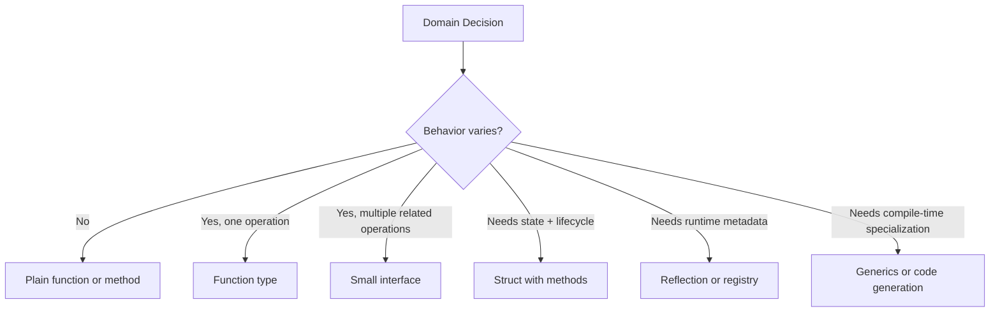
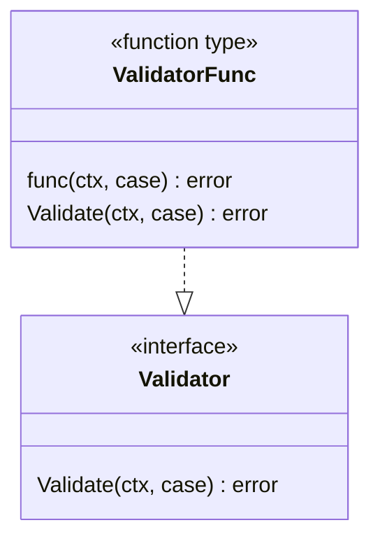
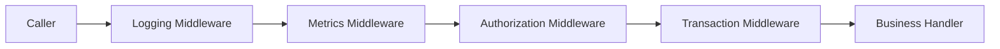
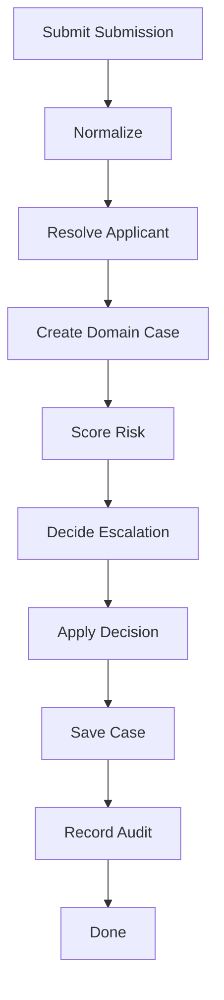

# learn-go-composition-oop-functional-reflection-codegen-modules-part-011.md

# Part 011 — Functional Style di Go: Function, Closure, Strategy, Option, dan Pipeline Tanpa Over-Abstraction

> Seri: `learn-go-composition-oop-functional-reflection-codegen-modules`  
> Bagian: `011 / 030`  
> Target pembaca: Java software engineer / tech lead yang ingin mendesain sistem Go secara idiomatis, production-ready, dan tidak sekadar memindahkan pola Java ke Go.

---

## 0. Tujuan Bagian Ini

Bagian ini membahas **functional style di Go** sebagai alat desain, bukan sebagai ideologi.

Go bukan Haskell, Scala, F#, Clojure, atau Java Streams. Go juga bukan Java dengan lambda syntax yang lebih ringan. Namun Go punya beberapa fitur yang sangat kuat untuk desain berbasis fungsi:

- function sebagai first-class value;
- function type;
- anonymous function;
- closure;
- method value dan method expression;
- function sebagai dependency;
- function sebagai strategy;
- function sebagai middleware/interceptor;
- function sebagai validator, mapper, predicate, handler, dan option;
- pipeline eksplisit yang mudah di-review;
- kombinasi function + interface + struct composition.

Setelah bagian ini, targetnya Anda mampu:

1. melihat kapan function lebih tepat daripada interface;
2. melihat kapan interface lebih tepat daripada function;
3. memakai closure tanpa menciptakan state tersembunyi yang berbahaya;
4. membangun strategy pattern tanpa class hierarchy;
5. membangun option/configuration API yang stabil;
6. membangun pipeline transformasi yang explicit, testable, dan observable;
7. menghindari over-functional style yang membuat Go sulit dibaca;
8. menerjemahkan mental model Java lambda/functional interface ke Go secara tepat.

---

## 1. Problem Framing: Kenapa Functional Style Penting di Go?

Di Java modern, Anda mungkin terbiasa dengan:

- `Function<T, R>`;
- `Predicate<T>`;
- `Consumer<T>`;
- `Supplier<T>`;
- `Comparator<T>`;
- stream pipeline;
- strategy object;
- lambda;
- method reference;
- callback;
- template method;
- Spring bean function injection;
- annotation-driven interceptor.

Di Go, bentuk desainnya berbeda.

Go tidak punya class, inheritance, annotation processing framework besar sebagai default, dan tidak punya Java Stream API bawaan. Namun Go justru membuat function-based design lebih dekat dengan bahasa inti.

Contoh sederhana:

```go
package caseflow

type Case struct {
    ID     string
    Status string
    Risk   int
}

type Predicate func(Case) bool

func IsHighRisk(c Case) bool {
    return c.Risk >= 80
}

func IsOpen(c Case) bool {
    return c.Status == "OPEN"
}

func And(a, b Predicate) Predicate {
    return func(c Case) bool {
        return a(c) && b(c)
    }
}
```

Ini terlihat sederhana. Namun di production, desain function seperti ini bisa menjadi dasar untuk:

- filtering rule;
- validation rule;
- routing rule;
- authorization policy;
- escalation condition;
- transformation pipeline;
- retry policy;
- middleware chain;
- dependency injection ringan tanpa framework;
- testing seam tanpa mock framework.

Tetapi ada sisi bahayanya.

Functional style yang buruk di Go bisa berubah menjadi:

- closure yang menyimpan state tersembunyi;
- function parameter yang terlalu banyak;
- pipeline terlalu abstrak;
- generic helper yang tidak jelas manfaatnya;
- error handling yang tersembunyi;
- stack trace/debugging lebih sulit;
- dependency graph tidak eksplisit;
- callback hell versi Go;
- framework mini buatan sendiri yang lebih sulit dibaca daripada kode imperative biasa.

Jadi prinsip utama bagian ini:

> Functional style di Go adalah teknik untuk membuat variasi perilaku menjadi eksplisit dan composable, bukan teknik untuk menyembunyikan control flow.

---

## 2. Mental Model: Function Sebagai Behavior Value

Dalam Java, behavior sering direpresentasikan sebagai object:

```java
public interface RiskPolicy {
    boolean isHighRisk(Case c);
}
```

Lalu implementasinya:

```java
public final class DefaultRiskPolicy implements RiskPolicy {
    @Override
    public boolean isHighRisk(Case c) {
        return c.riskScore() >= 80;
    }
}
```

Di Go, kalau contract hanya satu operasi, sering kali function type cukup:

```go
type RiskPolicy func(Case) bool

func DefaultRiskPolicy(c Case) bool {
    return c.RiskScore >= 80
}
```

Lalu dipakai:

```go
type Escalator struct {
    isHighRisk RiskPolicy
}

func NewEscalator(isHighRisk RiskPolicy) *Escalator {
    if isHighRisk == nil {
        isHighRisk = DefaultRiskPolicy
    }
    return &Escalator{isHighRisk: isHighRisk}
}

func (e *Escalator) ShouldEscalate(c Case) bool {
    return e.isHighRisk(c)
}
```

Function di sini adalah **value yang membawa behavior**.

Bukan object dengan identity penting. Bukan hierarchy. Bukan container-managed bean. Hanya perilaku yang bisa dipassing, disimpan, dites, dan dikomposisi.

Diagram mental model:



Rule praktis:

- satu behavior kecil → function type;
- beberapa behavior yang harus konsisten → interface;
- behavior + state + invariant → struct;
- behavior family dengan compile-time type relation → generics;
- behavior generated dari schema/metadata → code generation;
- behavior runtime dynamic → reflection atau registry, dengan disiplin.

---

## 3. First-Class Function di Go

Function di Go bisa:

- disimpan dalam variable;
- dipassing sebagai argument;
- direturn dari function lain;
- menjadi field struct;
- dibuat sebagai anonymous function;
- menangkap variable dari scope luar sebagai closure.

Contoh:

```go
package approval

type Case struct {
    ID       string
    Amount   int64
    Priority string
}

type Rule func(Case) bool

func HighAmount(threshold int64) Rule {
    return func(c Case) bool {
        return c.Amount >= threshold
    }
}

func PriorityIs(priority string) Rule {
    return func(c Case) bool {
        return c.Priority == priority
    }
}

func Any(rules ...Rule) Rule {
    return func(c Case) bool {
        for _, rule := range rules {
            if rule(c) {
                return true
            }
        }
        return false
    }
}
```

Pemakaian:

```go
rule := Any(
    HighAmount(1_000_000),
    PriorityIs("URGENT"),
)

if rule(c) {
    // escalate
}
```

Dari sudut pandang desain, `HighAmount` bukan sekadar helper. Ia adalah **rule factory**.

`HighAmount(1_000_000)` menghasilkan satu behavior konkret yang sudah membawa konfigurasi threshold.

---

## 4. Function Type vs Anonymous Function Literal

Anda bisa menulis:

```go
func(c Case) bool {
    return c.Amount > 1000
}
```

Atau memberi nama type:

```go
type Rule func(Case) bool
```

Named function type lebih baik ketika behavior punya meaning domain.

Buruk:

```go
func FilterCases(cases []Case, fn func(Case) bool) []Case
```

Lebih baik jika domain semantics penting:

```go
type CasePredicate func(Case) bool

func FilterCases(cases []Case, predicate CasePredicate) []Case
```

Kenapa?

Karena `func(Case) bool` hanya menjelaskan bentuk. `CasePredicate` menjelaskan peran.

Dalam production code, bentuk function yang sama bisa punya arti berbeda:

```go
type CasePredicate func(Case) bool

type CaseAuthorizer func(User, Case) bool

type CaseLocker func(context.Context, CaseID) bool
```

Semua mungkin return `bool`, tetapi semantiknya berbeda. Jangan hanya desain berdasarkan shape; desain berdasarkan contract.

---

## 5. Function Type Bisa Punya Method

Ini fitur yang sering diremehkan.

Di Go, defined function type bisa punya method.

```go
type Rule func(Case) bool

func (r Rule) And(other Rule) Rule {
    return func(c Case) bool {
        return r(c) && other(c)
    }
}

func (r Rule) Or(other Rule) Rule {
    return func(c Case) bool {
        return r(c) || other(c)
    }
}

func (r Rule) Not() Rule {
    return func(c Case) bool {
        return !r(c)
    }
}
```

Pemakaian:

```go
rule := HighAmount(1_000_000).
    And(PriorityIs("URGENT")).
    Or(AssignedToSpecialUnit())
```

Ini terasa fluent seperti Java, tetapi tetap lightweight.

Namun hati-hati. Fluent functional API bisa cepat menjadi terlalu clever.

Gunakan jika:

- operasi benar-benar domain meaningful;
- komposisi meningkatkan readability;
- error semantics jelas;
- tidak menyembunyikan side effect;
- tidak membuat debugging sulit.

Hindari jika:

- method chain panjang;
- ada I/O tersembunyi;
- ada mutation tersembunyi;
- error handling dipaksa masuk bool;
- behavior sulit di-observe.

---

## 6. Function Type vs Interface Satu Method

Di Java, satu behavior lazim diekspresikan sebagai interface:

```java
interface Validator<T> {
    ValidationResult validate(T value);
}
```

Di Go, ada dua pilihan:

```go
type Validator[T any] interface {
    Validate(T) error
}
```

atau:

```go
type ValidatorFunc[T any] func(T) error
```

Mana yang lebih baik?

Jawabannya bergantung pada contract.

### 6.1 Gunakan Function Type Jika Behavior Sederhana

```go
type CaseValidator func(Case) error

func RequiredApplicant(c Case) error {
    if c.ApplicantID == "" {
        return errors.New("applicant is required")
    }
    return nil
}
```

Bagus ketika:

- satu operasi;
- tidak butuh lifecycle;
- tidak butuh multiple method;
- tidak butuh identity;
- mudah dites;
- dependency kecil.

### 6.2 Gunakan Interface Jika Contract Lebih Kaya

```go
type CaseValidator interface {
    Validate(ctx context.Context, c Case) error
    Name() string
    Severity() Severity
}
```

Bagus ketika:

- ada metadata;
- ada lifecycle;
- ada multiple operation yang harus konsisten;
- ada observability contract;
- ada dependency/state internal;
- ada extension point yang stabil.

### 6.3 Hybrid: Interface + Adapter Function

Pattern umum di Go:

```go
type Validator interface {
    Validate(context.Context, Case) error
}

type ValidatorFunc func(context.Context, Case) error

func (f ValidatorFunc) Validate(ctx context.Context, c Case) error {
    return f(ctx, c)
}
```

Dengan ini, function biasa bisa memenuhi interface:

```go
validator := ValidatorFunc(func(ctx context.Context, c Case) error {
    if c.ID == "" {
        return errors.New("case id is required")
    }
    return nil
})
```

Pattern ini sangat berguna untuk:

- middleware;
- handler;
- validator;
- mapper;
- test double;
- plugin kecil;
- policy function.

Contoh dari standard library yang terkenal adalah `http.Handler` dan `http.HandlerFunc`.

Mental model:



---

## 7. Closure: Power Tool yang Harus Diawasi

Closure adalah function yang menangkap variable dari scope luar.

```go
func MinAmount(threshold int64) Rule {
    return func(c Case) bool {
        return c.Amount >= threshold
    }
}
```

`threshold` tetap hidup setelah `MinAmount` return, karena dipakai oleh function yang direturn.

Ini sangat berguna untuk configuration.

Namun closure juga bisa menyembunyikan state.

Buruk:

```go
func CountingRule(rule Rule) Rule {
    count := 0
    return func(c Case) bool {
        count++
        return rule(c)
    }
}
```

Kode ini terlihat innocent, tapi:

- `count` mutable;
- tidak thread-safe;
- state tersembunyi;
- behavior berubah setiap call;
- observability tidak eksplisit;
- race jika dipakai concurrent.

Lebih aman:

```go
type CountingRule struct {
    rule  Rule
    count atomic.Int64
}

func NewCountingRule(rule Rule) *CountingRule {
    return &CountingRule{rule: rule}
}

func (r *CountingRule) Match(c Case) bool {
    r.count.Add(1)
    return r.rule(c)
}

func (r *CountingRule) Count() int64 {
    return r.count.Load()
}
```

Jika state punya lifecycle, ownership, concurrency semantics, atau observability, jangan sembunyikan di closure. Jadikan struct.

Rule:

> Closure bagus untuk immutable captured configuration. Closure berbahaya untuk mutable hidden state.

---

## 8. Closure Capture Pitfall

Salah satu bug klasik adalah loop variable capture.

Versi modern Go telah memperbaiki beberapa kasus loop variable semantics dalam range loop, tetapi sebagai engineer production, tetap penting memahami pola pikirnya: closure menangkap variable, bukan sekadar value literal yang terlihat.

Contoh yang aman secara eksplisit:

```go
func BuildRules(thresholds []int64) []Rule {
    rules := make([]Rule, 0, len(thresholds))

    for _, threshold := range thresholds {
        threshold := threshold // explicit per-iteration binding for clarity
        rules = append(rules, func(c Case) bool {
            return c.Amount >= threshold
        })
    }

    return rules
}
```

Walaupun Go modern lebih aman untuk range variable, explicit binding masih sering dipakai saat:

- code harus mudah dipahami lint/review;
- ada campuran loop complex;
- closure dibuat dalam nested function;
- variable yang dicapture bukan hanya range variable;
- codebase mendukung banyak versi Go historis;
- Anda ingin membuat intent crystal clear.

---

## 9. Function Sebagai Strategy Pattern

Java strategy pattern biasanya seperti ini:

```java
interface AssignmentStrategy {
    Officer assign(Case c);
}

final class RoundRobinAssignmentStrategy implements AssignmentStrategy { ... }
final class RiskBasedAssignmentStrategy implements AssignmentStrategy { ... }
```

Di Go, jika strategi hanya satu operasi:

```go
type AssignmentStrategy func(context.Context, Case) (Officer, error)
```

Implementasi:

```go
func RoundRobinAssignment(pool OfficerPool) AssignmentStrategy {
    return func(ctx context.Context, c Case) (Officer, error) {
        return pool.Next(ctx)
    }
}

func RiskBasedAssignment(directory OfficerDirectory) AssignmentStrategy {
    return func(ctx context.Context, c Case) (Officer, error) {
        if c.RiskScore >= 80 {
            return directory.FindSpecialist(ctx, "HIGH_RISK")
        }
        return directory.FindAvailable(ctx)
    }
}
```

Orchestrator:

```go
type CaseAssigner struct {
    assign AssignmentStrategy
}

func NewCaseAssigner(assign AssignmentStrategy) *CaseAssigner {
    if assign == nil {
        panic("assignment strategy is required")
    }
    return &CaseAssigner{assign: assign}
}

func (a *CaseAssigner) Assign(ctx context.Context, c Case) (Officer, error) {
    if c.ID == "" {
        return Officer{}, errors.New("case id is required")
    }
    return a.assign(ctx, c)
}
```

Yang menarik: `CaseAssigner` tetap struct karena ia punya lifecycle/invariant. Strategi assignment cukup function karena hanya satu variasi behavior.

---

## 10. Function Sebagai Policy Object

Policy sering hanya decision function.

```go
type EscalationPolicy func(Case) EscalationDecision

type EscalationDecision struct {
    Escalate bool
    Reason   string
    Level    EscalationLevel
}
```

Contoh:

```go
func RiskEscalationPolicy(threshold int) EscalationPolicy {
    return func(c Case) EscalationDecision {
        if c.RiskScore >= threshold {
            return EscalationDecision{
                Escalate: true,
                Reason:   "risk threshold exceeded",
                Level:    EscalationLevelSeniorOfficer,
            }
        }

        return EscalationDecision{Escalate: false}
    }
}
```

Kenapa return struct decision lebih baik daripada bool?

Karena production policy butuh:

- reason;
- audit trail;
- explainability;
- testing assertion;
- metrics label;
- regulatory defensibility;
- future extension.

Buruk:

```go
type EscalationPolicy func(Case) bool
```

Lebih baik:

```go
type EscalationPolicy func(Case) EscalationDecision
```

Jika policy bisa error karena external dependency:

```go
type EscalationPolicy func(context.Context, Case) (EscalationDecision, error)
```

Rule:

> Bool function cocok untuk predicate lokal. Untuk keputusan domain production, return decision object.

---

## 11. Function Sebagai Mapper dan Transformer

Dalam sistem enterprise, mapper sering menjadi sumber boilerplate besar.

Go bisa memakai function type untuk mapper:

```go
type Mapper[S, T any] func(S) (T, error)
```

Contoh:

```go
type CaseDTO struct {
    ID          string `json:"id"`
    ApplicantID string `json:"applicantId"`
    Status      string `json:"status"`
}

type Case struct {
    id          CaseID
    applicantID ApplicantID
    status      CaseStatus
}

func MapCaseDTO(dto CaseDTO) (Case, error) {
    id, err := NewCaseID(dto.ID)
    if err != nil {
        return Case{}, err
    }

    applicantID, err := NewApplicantID(dto.ApplicantID)
    if err != nil {
        return Case{}, err
    }

    status, err := NewCaseStatus(dto.Status)
    if err != nil {
        return Case{}, err
    }

    return NewCase(id, applicantID, status)
}
```

Generic helper:

```go
func MapSlice[S, T any](items []S, mapper Mapper[S, T]) ([]T, error) {
    out := make([]T, 0, len(items))
    for _, item := range items {
        mapped, err := mapper(item)
        if err != nil {
            return nil, err
        }
        out = append(out, mapped)
    }
    return out, nil
}
```

Gunakan generic helper seperti ini jika pattern berulang jelas. Jangan membuat library FP internal besar hanya untuk menghindari `for` loop.

Go `for` loop bukan code smell.

---

## 12. Function Sebagai Validator

Validator function sangat natural di Go.

```go
type Validator[T any] func(T) error

func RequiredString(field string, value string) error {
    if strings.TrimSpace(value) == "" {
        return fmt.Errorf("%s is required", field)
    }
    return nil
}

func ValidateCase(c CaseDTO) error {
    if err := RequiredString("id", c.ID); err != nil {
        return err
    }
    if err := RequiredString("applicantId", c.ApplicantID); err != nil {
        return err
    }
    return nil
}
```

Untuk composition:

```go
type Validator[T any] func(T) error

func All[T any](validators ...Validator[T]) Validator[T] {
    return func(value T) error {
        for _, validate := range validators {
            if err := validate(value); err != nil {
                return err
            }
        }
        return nil
    }
}
```

Namun ada pertanyaan: fail-fast atau collect-all?

Fail-fast:

```go
func All[T any](validators ...Validator[T]) Validator[T] {
    return func(value T) error {
        for _, validate := range validators {
            if err := validate(value); err != nil {
                return err
            }
        }
        return nil
    }
}
```

Collect-all:

```go
type Violation struct {
    Field   string
    Code    string
    Message string
}

type ValidationResult struct {
    Violations []Violation
}

func (r ValidationResult) OK() bool {
    return len(r.Violations) == 0
}

type RichValidator[T any] func(T) ValidationResult
```

Production decision:

- command validation often collect-all untuk user feedback;
- invariant validation often fail-fast;
- security validation often fail-fast and avoid leaking details;
- batch validation often collect-all with row context;
- regulatory validation often needs structured violations.

Jangan menyembunyikan semua ini di `error` string jika domain butuh traceability.

---

## 13. Function Sebagai Middleware

Middleware adalah contoh functional composition paling umum.

Generic shape:

```go
type Handler func(context.Context, Request) (Response, error)

type Middleware func(Handler) Handler
```

Contoh:

```go
func WithLogging(log Logger) Middleware {
    return func(next Handler) Handler {
        return func(ctx context.Context, req Request) (Response, error) {
            start := time.Now()
            resp, err := next(ctx, req)
            log.Info("handled request",
                "duration", time.Since(start),
                "error", err,
            )
            return resp, err
        }
    }
}
```

Composition:

```go
func Chain(h Handler, middlewares ...Middleware) Handler {
    for i := len(middlewares) - 1; i >= 0; i-- {
        h = middlewares[i](h)
    }
    return h
}
```

Pemakaian:

```go
handler := Chain(
    approveCase,
    WithLogging(log),
    WithMetrics(metrics),
    WithAuthorization(authz),
    WithTransaction(tx),
)
```

Perhatikan urutan wrapping.

Diagram:



Jika chain dibangun dari kanan ke kiri, middleware pertama di list menjadi outermost. Ini harus terdokumentasi.

---

## 14. Middleware Order adalah Contract

Middleware order bukan detail implementasi. Ia contract.

Contoh order berbeda:

```go
handler := Chain(
    approveCase,
    WithTransaction(tx),
    WithAuthorization(authz),
)
```

vs:

```go
handler := Chain(
    approveCase,
    WithAuthorization(authz),
    WithTransaction(tx),
)
```

Pertanyaan desain:

- Apakah authorization perlu terjadi sebelum transaction dibuka?
- Apakah metrics harus mengukur authorization failure?
- Apakah logging harus melihat request sebelum sanitization?
- Apakah panic recovery harus outermost?
- Apakah idempotency harus sebelum business transaction?
- Apakah audit trail harus ikut rollback atau tetap tercatat?

Untuk sistem regulatory, ini bukan detail teknis kecil.

Contoh policy:

```text
Recommended order:
1. panic recovery
2. request correlation
3. authentication context extraction
4. authorization
5. idempotency guard
6. transaction boundary
7. domain audit event capture
8. business handler
9. post-commit event publishing
10. metrics/logging around full duration
```

Namun policy ini tidak universal. Yang penting adalah eksplisit.

---

## 15. Function Options Pattern: Preview

Part 012 akan khusus membahas functional options secara mendalam. Di sini cukup sebagai pengantar.

Pattern:

```go
type Option func(*Config) error

type Config struct {
    Timeout time.Duration
    Retries int
    Logger  Logger
}

func WithTimeout(timeout time.Duration) Option {
    return func(c *Config) error {
        if timeout <= 0 {
            return errors.New("timeout must be positive")
        }
        c.Timeout = timeout
        return nil
    }
}

func WithRetries(retries int) Option {
    return func(c *Config) error {
        if retries < 0 {
            return errors.New("retries must not be negative")
        }
        c.Retries = retries
        return nil
    }
}
```

Constructor:

```go
func NewClient(options ...Option) (*Client, error) {
    cfg := Config{
        Timeout: 5 * time.Second,
        Retries: 3,
        Logger:  NoopLogger{},
    }

    for _, option := range options {
        if option == nil {
            return nil, errors.New("nil option")
        }
        if err := option(&cfg); err != nil {
            return nil, err
        }
    }

    return &Client{cfg: cfg}, nil
}
```

Pemakaian:

```go
client, err := NewClient(
    WithTimeout(10*time.Second),
    WithRetries(5),
)
```

Functional options cocok untuk:

- banyak optional config;
- default value;
- API evolvability;
- constructor readability;
- backward compatibility.

Tetapi tidak cocok untuk semua hal. Untuk config sederhana, struct literal bisa lebih jelas.

---

## 16. Pipeline Style di Go

Pipeline tidak harus berarti goroutine/channel. Di seri concurrency sebelumnya, channel pipeline mungkin sudah dibahas. Di sini pipeline berarti **urutan transformasi eksplisit**.

Contoh business pipeline:

```go
type Step[I, O any] func(context.Context, I) (O, error)
```

Namun composition generic lintas tipe bisa cepat kompleks. Kadang lebih baik eksplisit:

```go
func ProcessSubmission(ctx context.Context, raw RawSubmission) (Case, error) {
    dto, err := DecodeSubmission(raw)
    if err != nil {
        return Case{}, err
    }

    if err := ValidateSubmission(dto); err != nil {
        return Case{}, err
    }

    normalized, err := NormalizeSubmission(dto)
    if err != nil {
        return Case{}, err
    }

    c, err := MapSubmissionToCase(normalized)
    if err != nil {
        return Case{}, err
    }

    if err := CheckCaseInvariant(c); err != nil {
        return Case{}, err
    }

    return c, nil
}
```

Ini verbose, tetapi sangat production-friendly:

- error point jelas;
- debugging mudah;
- logging bisa diletakkan di boundary;
- tidak ada magic;
- bisa di-review oleh engineer baru;
- tidak butuh framework internal.

Pipeline helper hanya perlu dibuat jika ada nilai nyata.

---

## 17. Explicit Pipeline dengan Named Step

Untuk kasus yang butuh observability per step:

```go
type Step[T any] struct {
    Name string
    Run  func(context.Context, T) (T, error)
}

func RunPipeline[T any](ctx context.Context, input T, steps ...Step[T]) (T, error) {
    current := input

    for _, step := range steps {
        if step.Name == "" {
            return current, errors.New("step name is required")
        }
        if step.Run == nil {
            return current, fmt.Errorf("step %q has nil run function", step.Name)
        }

        next, err := step.Run(ctx, current)
        if err != nil {
            return current, fmt.Errorf("step %s failed: %w", step.Name, err)
        }
        current = next
    }

    return current, nil
}
```

Pemakaian:

```go
processed, err := RunPipeline(ctx, submission,
    Step[Submission]{Name: "normalize", Run: Normalize},
    Step[Submission]{Name: "enrich", Run: Enrich},
    Step[Submission]{Name: "deduplicate", Run: Deduplicate},
)
```

Ini cocok jika semua step input/output type sama.

Jika tiap step beda type, pipeline generic bisa menjadi terlalu rumit. Lebih baik tulis eksplisit.

---

## 18. Jangan Memaksakan Stream API ke Go

Java Stream style:

```java
cases.stream()
    .filter(Case::isOpen)
    .filter(c -> c.riskScore() > 80)
    .map(CaseSummary::from)
    .sorted(comparing(CaseSummary::createdAt))
    .toList();
```

Go versi terlalu functional:

```go
summaries := ToList(
    SortBy(
        Map(
            Filter(
                Filter(cases, IsOpen),
                IsHighRisk,
            ),
            ToSummary,
        ),
        ByCreatedAt,
    ),
)
```

Ini sering lebih buruk daripada loop biasa:

```go
summaries := make([]CaseSummary, 0, len(cases))
for _, c := range cases {
    if !c.IsOpen() {
        continue
    }
    if !IsHighRisk(c) {
        continue
    }
    summaries = append(summaries, ToSummary(c))
}

sort.Slice(summaries, func(i, j int) bool {
    return summaries[i].CreatedAt.Before(summaries[j].CreatedAt)
})
```

Loop Go tidak rendah kualitas. Loop Go sering paling jelas.

Functional helper harus menang atas loop dalam:

- readability;
- correctness;
- testability;
- reuse;
- performance predictability;
- error handling clarity.

Jika tidak menang, jangan dipakai.

---

## 19. Function dan Error Semantics

Salah satu perbedaan besar dengan Java lambda adalah error handling.

Java checked exception tidak compatible dengan functional interface standar tanpa wrapper. Go error justru explicit di signature.

Contoh:

```go
type Transform[S, T any] func(context.Context, S) (T, error)
```

Ini baik karena error menjadi bagian dari contract.

Buruk:

```go
type Transform[S, T any] func(S) T
```

lalu panic jika gagal.

Untuk production system, function type harus jujur terhadap failure mode.

Contoh mapper:

```go
type CaseMapper func(CaseDTO) (Case, error)
```

Contoh external lookup:

```go
type ApplicantResolver func(context.Context, ApplicantID) (Applicant, error)
```

Contoh pure predicate:

```go
type CasePredicate func(Case) bool
```

Jangan mencampur external I/O ke predicate bool. Jika ada I/O, gunakan context dan error.

---

## 20. Context dalam Function Type

Function yang melakukan I/O atau berpotensi lama sebaiknya menerima `context.Context`.

```go
type Resolver[K, V any] func(context.Context, K) (V, error)
```

Jangan menaruh context di struct lalu dipakai banyak method:

Buruk:

```go
type Service struct {
    ctx context.Context
}
```

Lebih baik:

```go
type Service struct {
    resolve ApplicantResolver
}

func (s *Service) Process(ctx context.Context, cmd Command) error {
    applicant, err := s.resolve(ctx, cmd.ApplicantID)
    if err != nil {
        return err
    }
    _ = applicant
    return nil
}
```

Context adalah request-scoped, bukan object-scoped.

---

## 21. Method Value dan Method Expression

Go punya dua konsep penting:

1. method value;
2. method expression.

Misal:

```go
type Approver struct {
    policy Policy
}

func (a *Approver) Approve(ctx context.Context, c Case) error {
    return nil
}
```

Method value:

```go
approver := &Approver{}
handler := approver.Approve
```

`handler` punya type:

```go
func(context.Context, Case) error
```

Receiver `approver` sudah terikat.

Method expression:

```go
handler := (*Approver).Approve
```

`handler` punya type:

```go
func(*Approver, context.Context, Case) error
```

Receiver menjadi parameter eksplisit.

Kegunaan:

- method value berguna untuk callback/handler;
- method expression berguna untuk generic-ish adapter, testing, table-driven behavior;
- method value menangkap receiver, jadi perhatikan lifecycle dan nil receiver.

Contoh method value sebagai handler:

```go
type Handler func(context.Context, Case) error

func Register(name string, h Handler) {}

approver := NewApprover(policy)
Register("approve-case", approver.Approve)
```

Ini sangat idiomatis.

---

## 22. Dependency Injection dengan Function

Go tidak membutuhkan DI framework untuk banyak kasus.

Contoh service:

```go
type LoadCase func(context.Context, CaseID) (Case, error)
type SaveCase func(context.Context, Case) error
type Authorize func(context.Context, User, Case, Action) error

type CaseService struct {
    load      LoadCase
    save      SaveCase
    authorize Authorize
}

func NewCaseService(load LoadCase, save SaveCase, authorize Authorize) (*CaseService, error) {
    if load == nil {
        return nil, errors.New("load case dependency is required")
    }
    if save == nil {
        return nil, errors.New("save case dependency is required")
    }
    if authorize == nil {
        return nil, errors.New("authorize dependency is required")
    }

    return &CaseService{
        load:      load,
        save:      save,
        authorize: authorize,
    }, nil
}
```

Test:

```go
service, err := NewCaseService(
    func(ctx context.Context, id CaseID) (Case, error) {
        return Case{ID: id, Status: StatusOpen}, nil
    },
    func(ctx context.Context, c Case) error {
        saved = c
        return nil
    },
    func(ctx context.Context, u User, c Case, a Action) error {
        return nil
    },
)
```

Ini mengurangi kebutuhan mock framework untuk dependency kecil.

Namun jika dependency punya banyak operasi terkait, interface lebih baik:

```go
type CaseRepository interface {
    Load(context.Context, CaseID) (Case, error)
    Save(context.Context, Case) error
    Exists(context.Context, CaseID) (bool, error)
}
```

Rule:

- satu operasi → function dependency;
- operasi berkelompok dengan invariant sama → interface dependency;
- dependency punya state/lifecycle → struct dependency;
- dependency perlu transaction semantics → interface/struct, bukan banyak function terpisah tanpa boundary.

---

## 23. Function Field dalam Struct: Baik atau Buruk?

Function field bisa berguna:

```go
type Clock func() time.Time

type TokenIssuer struct {
    now Clock
}
```

Testable:

```go
issuer := TokenIssuer{
    now: func() time.Time {
        return time.Date(2026, 1, 1, 0, 0, 0, 0, time.UTC)
    },
}
```

Namun function field yang terlalu banyak bisa membuat struct kehilangan bentuk domain.

Buruk:

```go
type Service struct {
    fn1 func()
    fn2 func(string) error
    fn3 func(context.Context, int) (string, error)
    fn4 func(any) any
}
```

Ini biasanya tanda:

- dependency boundary tidak jelas;
- interface mungkin lebih tepat;
- struct hanya menjadi bag of callbacks;
- naming contract lemah;
- testing mungkin mudah tapi production wiring membingungkan.

Gunakan named function type untuk field penting:

```go
type ResolveApplicant func(context.Context, ApplicantID) (Applicant, error)

type CaseSubmissionService struct {
    resolveApplicant ResolveApplicant
}
```

Named type membuat dependency graph lebih terbaca.

---

## 24. Callback Design: Jangan Membuat Control Flow Gelap

Callback sering dipakai untuk event, traversal, hooks, atau custom behavior.

Contoh:

```go
type WalkFunc func(path string, info FileInfo) error

func Walk(root string, fn WalkFunc) error
```

Dalam domain system:

```go
type CaseEventHandler func(context.Context, CaseEvent) error

func ReplayEvents(ctx context.Context, events []CaseEvent, handle CaseEventHandler) error {
    for _, event := range events {
        if err := handle(ctx, event); err != nil {
            return err
        }
    }
    return nil
}
```

Ini bagus karena traversal ownership jelas: `ReplayEvents` mengontrol loop, caller mengontrol behavior.

Namun callback buruk jika:

- callback dipanggil async tanpa contract;
- callback dipanggil lebih dari sekali tanpa dokumentasi;
- callback boleh dipanggil concurrent tanpa dokumentasi;
- callback error diabaikan;
- callback memodifikasi object internal tanpa invariant;
- callback punya side effect tak terlihat.

Dokumentasikan callback contract:

```go
// CaseEventHandler handles one event during replay.
// It is called synchronously in event order.
// If it returns an error, replay stops and the error is returned.
// The handler must not retain mutable references from the event.
type CaseEventHandler func(context.Context, CaseEvent) error
```

Komentar seperti ini bukan kosmetik; ini bagian dari API contract.

---

## 25. Functional Composition dengan Observability

Pure functional helper sering melupakan observability. Production system tidak boleh begitu.

Contoh middleware dengan metrics:

```go
type Metrics interface {
    ObserveDuration(name string, d time.Duration)
    IncrementError(name string)
}

func InstrumentStep[T any](name string, metrics Metrics, step Step[T]) Step[T] {
    return Step[T]{
        Name: name,
        Run: func(ctx context.Context, input T) (T, error) {
            start := time.Now()
            output, err := step.Run(ctx, input)
            metrics.ObserveDuration(name, time.Since(start))
            if err != nil {
                metrics.IncrementError(name)
            }
            return output, err
        },
    }
}
```

Tetapi jangan instrument terlalu abstrak jika hasilnya tidak jelas.

Checklist observability untuk function composition:

- Apakah setiap step punya nama stabil?
- Apakah error diberi konteks step?
- Apakah logging menghindari PII?
- Apakah metrics cardinality aman?
- Apakah duration diukur di boundary yang benar?
- Apakah retry/timeout terlihat?
- Apakah audit reason tersedia untuk keputusan domain?

---

## 26. Side Effect Discipline

Functional style paling mudah dipahami saat function pure.

Pure-ish:

```go
func NormalizePostalCode(s string) (string, error) {
    s = strings.TrimSpace(s)
    if len(s) != 6 {
        return "", errors.New("postal code must be 6 digits")
    }
    return s, nil
}
```

Side-effectful:

```go
func ResolveAddress(ctx context.Context, postalCode string) (Address, error)
```

Keduanya valid, tetapi harus jelas dari signature.

Tanda function menyembunyikan side effect:

```go
func IsValidApplicant(id ApplicantID) bool
```

Apakah ini hanya check format? Atau query database? Atau call external API?

Lebih jujur:

```go
func IsValidApplicantIDFormat(id ApplicantID) bool
```

atau:

```go
type ApplicantRegistry interface {
    Exists(context.Context, ApplicantID) (bool, error)
}
```

Nama dan signature harus membuka failure mode.

---

## 27. Functional Style dan Domain Defensibility

Dalam regulatory system, keputusan harus bisa dijelaskan.

Buruk:

```go
if shouldEscalate(c) {
    escalate(c)
}
```

Lebih baik:

```go
decision := escalationPolicy.Decide(c)
if decision.Escalate {
    if err := escalator.Escalate(ctx, c.ID, decision); err != nil {
        return err
    }
}
```

Dengan type:

```go
type EscalationPolicy interface {
    Decide(Case) EscalationDecision
}
```

atau function:

```go
type EscalationPolicyFunc func(Case) EscalationDecision

func (f EscalationPolicyFunc) Decide(c Case) EscalationDecision {
    return f(c)
}
```

Decision object:

```go
type EscalationDecision struct {
    Escalate bool
    Level    EscalationLevel
    Code     string
    Reason   string
    Evidence []EvidenceRef
}
```

Functional style tetap bisa defensible jika output-nya bukan bool miskin makna.

---

## 28. Generic Functional Helpers: Gunakan Secara Hemat

Go mendukung generics, sehingga mudah tergoda membuat helper:

```go
func Filter[T any](items []T, keep func(T) bool) []T {
    out := make([]T, 0, len(items))
    for _, item := range items {
        if keep(item) {
            out = append(out, item)
        }
    }
    return out
}
```

Ini tidak salah.

Tapi pertanyaannya:

- Apakah helper ini benar-benar meningkatkan clarity?
- Apakah error handling tetap jelas?
- Apakah allocation behavior acceptable?
- Apakah stack trace/debugging tetap mudah?
- Apakah team sepakat dengan style ini?
- Apakah helper ini akan menjadi pseudo-standard-library internal?

Untuk codebase Go besar, helper generic terlalu banyak bisa menciptakan dialect internal.

Gunakan generic helper jika:

- pattern sangat sering;
- behavior obvious;
- performance acceptable;
- nama jelas;
- tidak menyembunyikan error;
- tidak membuat control flow sulit.

Jangan gunakan hanya karena ingin terlihat modern.

---

## 29. Performance Notes

Function call di Go biasanya murah, tetapi bukan gratis.

Yang perlu diperhatikan:

- closure bisa menyebabkan allocation jika escape ke heap;
- function values bisa menghambat inlining dalam beberapa kasus;
- generic helper bisa atau tidak bisa memberi benefit tergantung compiler;
- interface call dan function call punya dispatch cost berbeda;
- abstraction di hot path harus diukur, bukan ditebak;
- pipeline yang membuat banyak intermediate slice bisa mahal;
- captured large object bisa memperpanjang lifetime memory;
- closure mutable bisa menyebabkan race.

Namun jangan premature optimize.

Prinsip:

1. desain jelas dulu;
2. benchmark jika hot path;
3. lihat escape analysis bila perlu;
4. profiling sebelum rewrite;
5. jangan mengorbankan correctness untuk micro-optimization.

Contoh command:

```bash
go test ./... -run '^$' -bench . -benchmem
```

Escape analysis:

```bash
go test ./... -gcflags='-m=2'
```

---

## 30. Decision Matrix

| Kebutuhan | Pilihan Umum | Kenapa |
|---|---|---|
| Satu behavior sederhana | Function type | Ringan, explicit, mudah dites |
| Satu behavior tapi harus memenuhi interface existing | Function type + adapter method | Seperti `HandlerFunc` pattern |
| Banyak operasi terkait | Interface | Contract lebih kaya |
| Behavior + state + lifecycle | Struct | Ownership dan invariant jelas |
| Optional configuration banyak | Functional options | API evolvable |
| Pure transform reusable | Function | Mudah dikomposisi |
| Transform dengan error | `func(ctx, in) (out, error)` | Failure eksplisit |
| Runtime dynamic mapping | Reflection | Fleksibel, tapi butuh guard |
| Compile-time type-specific boilerplate | Code generation | Performa dan explicit output |
| Hot path sangat sensitif | Plain loop/method | Mudah dioptimasi dan diukur |
| Domain decision perlu audit | Decision object | Explainability dan defensibility |

---

## 31. Anti-Patterns

### 31.1 Callback Soup

```go
type Service struct {
    Before func()
    During func(any) any
    After  func(error)
}
```

Masalah:

- lifecycle tidak jelas;
- error semantics lemah;
- dependency graph tidak jelas;
- testing mungkin mudah tapi production behavior sulit dipahami.

### 31.2 Boolean Policy untuk Keputusan Besar

```go
type ApprovalPolicy func(Case) bool
```

Jika keputusan harus diaudit, gunakan decision object.

### 31.3 Hidden I/O Predicate

```go
func IsEligible(c Case) bool
```

Jika call database/API, signature harus mengandung context/error.

### 31.4 Over-Generic Pipeline

```go
pipeline.Then(A).Then(B).Then(C).Recover(D).Tap(E).Map(F)
```

Jika engineer harus membuka framework internal untuk memahami flow, Anda sudah kalah.

### 31.5 Closure Mutable State Tanpa Synchronization

```go
func CountCalls(f func()) func() {
    count := 0
    return func() {
        count++
        f()
    }
}
```

Race-prone jika dipakai concurrent.

### 31.6 Functional Options untuk Config Sederhana

Buruk:

```go
client := NewClient(WithHost("localhost"), WithPort(8080))
```

Padahal cukup:

```go
client := NewClient(Config{Host: "localhost", Port: 8080})
```

Functional options bukan default. Ia alat untuk optional config yang berkembang.

---

## 32. Design Review Checklist

Saat melihat function-heavy Go code, tanyakan:

1. Apakah function type diberi nama berdasarkan domain semantics?
2. Apakah error dan context muncul saat function melakukan I/O?
3. Apakah closure hanya menangkap immutable configuration?
4. Apakah mutable state tersembunyi di closure?
5. Apakah function dependency lebih tepat daripada interface?
6. Apakah interface lebih tepat karena ada beberapa method terkait?
7. Apakah pipeline lebih jelas daripada loop biasa?
8. Apakah middleware order terdokumentasi?
9. Apakah decision domain return bool atau decision object?
10. Apakah observability tetap eksplisit?
11. Apakah testing mudah tanpa mengorbankan production wiring clarity?
12. Apakah abstraction membantu membaca code, bukan hanya mengurangi baris?
13. Apakah generic helper menciptakan dialect internal?
14. Apakah hot path sudah diukur?
15. Apakah nil function dicegah di constructor?

---

## 33. Studi Kasus: Regulatory Case Escalation Pipeline

Bayangkan workflow:

1. case diterima;
2. data dinormalisasi;
3. applicant diverifikasi;
4. risk dihitung;
5. authorization dicek;
6. escalation decision dibuat;
7. audit event dicatat;
8. case disimpan.

Kita tidak ingin membuat inheritance tree:

```text
AbstractCaseProcessor
 ├── NormalizingCaseProcessor
 ├── RiskCaseProcessor
 ├── EscalatingCaseProcessor
 └── AuditingCaseProcessor
```

Di Go, kita bisa desain explicit orchestration:

```go
type NormalizeSubmission func(Submission) (Submission, error)
type ResolveApplicant func(context.Context, ApplicantID) (Applicant, error)
type ScoreRisk func(context.Context, Case, Applicant) (RiskScore, error)
type DecideEscalation func(Case, RiskScore) EscalationDecision
type SaveCase func(context.Context, Case) error
type RecordAudit func(context.Context, AuditEvent) error

type SubmissionService struct {
    normalize        NormalizeSubmission
    resolveApplicant ResolveApplicant
    scoreRisk        ScoreRisk
    decideEscalation DecideEscalation
    saveCase         SaveCase
    recordAudit      RecordAudit
}
```

Constructor validates dependencies:

```go
func NewSubmissionService(deps SubmissionServiceDeps) (*SubmissionService, error) {
    if deps.Normalize == nil {
        return nil, errors.New("normalize dependency is required")
    }
    if deps.ResolveApplicant == nil {
        return nil, errors.New("resolve applicant dependency is required")
    }
    if deps.ScoreRisk == nil {
        return nil, errors.New("score risk dependency is required")
    }
    if deps.DecideEscalation == nil {
        return nil, errors.New("decide escalation dependency is required")
    }
    if deps.SaveCase == nil {
        return nil, errors.New("save case dependency is required")
    }
    if deps.RecordAudit == nil {
        return nil, errors.New("record audit dependency is required")
    }

    return &SubmissionService{
        normalize:        deps.Normalize,
        resolveApplicant: deps.ResolveApplicant,
        scoreRisk:        deps.ScoreRisk,
        decideEscalation: deps.DecideEscalation,
        saveCase:         deps.SaveCase,
        recordAudit:      deps.RecordAudit,
    }, nil
}
```

Deps struct:

```go
type SubmissionServiceDeps struct {
    Normalize        NormalizeSubmission
    ResolveApplicant ResolveApplicant
    ScoreRisk        ScoreRisk
    DecideEscalation DecideEscalation
    SaveCase         SaveCase
    RecordAudit      RecordAudit
}
```

Use case method:

```go
func (s *SubmissionService) Submit(ctx context.Context, submission Submission) error {
    normalized, err := s.normalize(submission)
    if err != nil {
        return fmt.Errorf("normalize submission: %w", err)
    }

    applicant, err := s.resolveApplicant(ctx, normalized.ApplicantID)
    if err != nil {
        return fmt.Errorf("resolve applicant: %w", err)
    }

    c, err := NewCaseFromSubmission(normalized, applicant)
    if err != nil {
        return fmt.Errorf("create case: %w", err)
    }

    risk, err := s.scoreRisk(ctx, c, applicant)
    if err != nil {
        return fmt.Errorf("score risk: %w", err)
    }

    decision := s.decideEscalation(c, risk)
    c.ApplyEscalationDecision(decision)

    if err := s.saveCase(ctx, c); err != nil {
        return fmt.Errorf("save case: %w", err)
    }

    if err := s.recordAudit(ctx, AuditEventFromDecision(c, decision)); err != nil {
        return fmt.Errorf("record audit: %w", err)
    }

    return nil
}
```

Yang perlu diperhatikan:

- orchestration tetap eksplisit;
- setiap dependency punya nama domain;
- error context jelas;
- decision object bisa diaudit;
- function style tidak menyembunyikan workflow;
- jika dependency membesar, bisa dipromosikan menjadi interface/struct.

Diagram:



---

## 34. Testing Function-Based Design

Function dependency membuat testing sederhana.

```go
func TestSubmissionService_Submit_EscalatesHighRiskCase(t *testing.T) {
    var saved Case
    var audit AuditEvent

    svc, err := NewSubmissionService(SubmissionServiceDeps{
        Normalize: func(s Submission) (Submission, error) {
            return s, nil
        },
        ResolveApplicant: func(ctx context.Context, id ApplicantID) (Applicant, error) {
            return Applicant{ID: id}, nil
        },
        ScoreRisk: func(ctx context.Context, c Case, a Applicant) (RiskScore, error) {
            return RiskScore{Value: 95}, nil
        },
        DecideEscalation: func(c Case, r RiskScore) EscalationDecision {
            return EscalationDecision{
                Escalate: true,
                Level:    EscalationLevelSeniorOfficer,
                Code:     "HIGH_RISK",
                Reason:   "risk score above threshold",
            }
        },
        SaveCase: func(ctx context.Context, c Case) error {
            saved = c
            return nil
        },
        RecordAudit: func(ctx context.Context, e AuditEvent) error {
            audit = e
            return nil
        },
    })
    if err != nil {
        t.Fatal(err)
    }

    err = svc.Submit(context.Background(), Submission{ApplicantID: "A-001"})
    if err != nil {
        t.Fatal(err)
    }

    if !saved.IsEscalated() {
        t.Fatalf("expected case to be escalated")
    }
    if audit.Code != "HIGH_RISK" {
        t.Fatalf("expected audit code HIGH_RISK, got %q", audit.Code)
    }
}
```

Ini testable tanpa mock generator. Namun bila test setup terlalu panjang, mungkin dependency boundary perlu dikaji ulang.

---

## 35. Refactoring Path: Function ke Interface ke Struct

Desain Go bisa dimulai simple lalu tumbuh.

### Tahap 1: Function

```go
type RiskScorer func(context.Context, Case) (RiskScore, error)
```

### Tahap 2: Interface saat contract bertambah

```go
type RiskScorer interface {
    Score(context.Context, Case) (RiskScore, error)
    ModelVersion() string
}
```

### Tahap 3: Struct saat ada state/lifecycle

```go
type MLModelRiskScorer struct {
    client  ModelClient
    version string
    cache   RiskCache
}

func (s *MLModelRiskScorer) Score(ctx context.Context, c Case) (RiskScore, error) {
    return s.client.Score(ctx, s.version, c.Features())
}

func (s *MLModelRiskScorer) ModelVersion() string {
    return s.version
}
```

Ini natural evolution. Jangan mulai dari framework besar jika function cukup.

---

## 36. Hubungan dengan Part Berikutnya

Part ini adalah fondasi untuk Part 012 tentang **Functional Options Pattern**.

Functional options adalah kasus spesifik dari closure + function type + constructor design. Namun karena pattern itu sering dipakai dan sering disalahgunakan, ia layak dibahas sendiri secara jauh lebih detail:

- defaulting;
- validation;
- config immutability;
- option ordering;
- option conflict;
- error handling;
- backward compatibility;
- public API evolution;
- testing;
- anti-pattern.

---

## 37. Ringkasan

Functional style di Go bukan tentang membuat semua hal menjadi `Map`, `Filter`, `Reduce`, atau fluent chain.

Functional style yang baik di Go berarti:

- behavior bisa dipassing sebagai value;
- variasi behavior eksplisit;
- dependency kecil tidak perlu interface besar;
- strategy bisa dibuat tanpa inheritance;
- middleware bisa dikomposisi jelas;
- closure dipakai untuk immutable configuration;
- mutable state diberi struct/lifecycle yang jelas;
- error/context tetap jujur di signature;
- domain decision tidak direduksi menjadi bool miskin makna;
- loop tetap diterima jika paling jelas;
- generic helper dipakai hemat;
- observability dan auditability tidak hilang.

Prinsip paling penting:

> Di Go, function adalah alat untuk membuat behavior eksplisit dan composable. Jangan gunakan function untuk menyembunyikan control flow, state, atau failure mode.

---

## 38. Checklist Praktis Setelah Membaca Part Ini

Anda sebaiknya mulai bisa:

- membedakan kapan function type lebih baik daripada interface;
- membuat function type dengan nama domain yang jelas;
- membuat adapter function type agar memenuhi interface;
- memakai closure untuk configuration tanpa mutable hidden state;
- membuat strategy/policy/validator/mapper sebagai function;
- membuat middleware chain yang order-nya eksplisit;
- mendesain decision object untuk kebutuhan audit;
- menghindari stream-style over-abstraction;
- melihat kapan function dependency harus berevolusi menjadi interface atau struct;
- melakukan review terhadap function-heavy Go code secara production-oriented.

---

## 39. Status Seri

- Part saat ini: `011`
- Total rencana: `030`
- Status: **belum selesai**

Part berikutnya:

```text
learn-go-composition-oop-functional-reflection-codegen-modules-part-012.md
```

Topik berikutnya:

```text
Functional Options Pattern: configuration API, validation, defaulting, immutability boundary, ordering, conflict detection, dan API compatibility.
```


<!-- NAVIGATION_FOOTER -->
<div class="page-nav">
<a href="./learn-go-composition-oop-functional-reflection-codegen-modules-part-010.md">⬅️ Part 010 — Anti-Inheritance Migration: Menerjemahkan Java Abstract Class, Template Method, dan Framework-Style Inheritance ke Go Composition</a>
<a href="./index.md">📚 Kategori</a>
<a href="../../index.md">🏠 Home</a>
<a href="./learn-go-composition-oop-functional-reflection-codegen-modules-part-012.md">Part 012 — Functional Options Pattern: Configuration API, Validation, Defaulting, dan Immutable Boundary ➡️</a>
</div>
