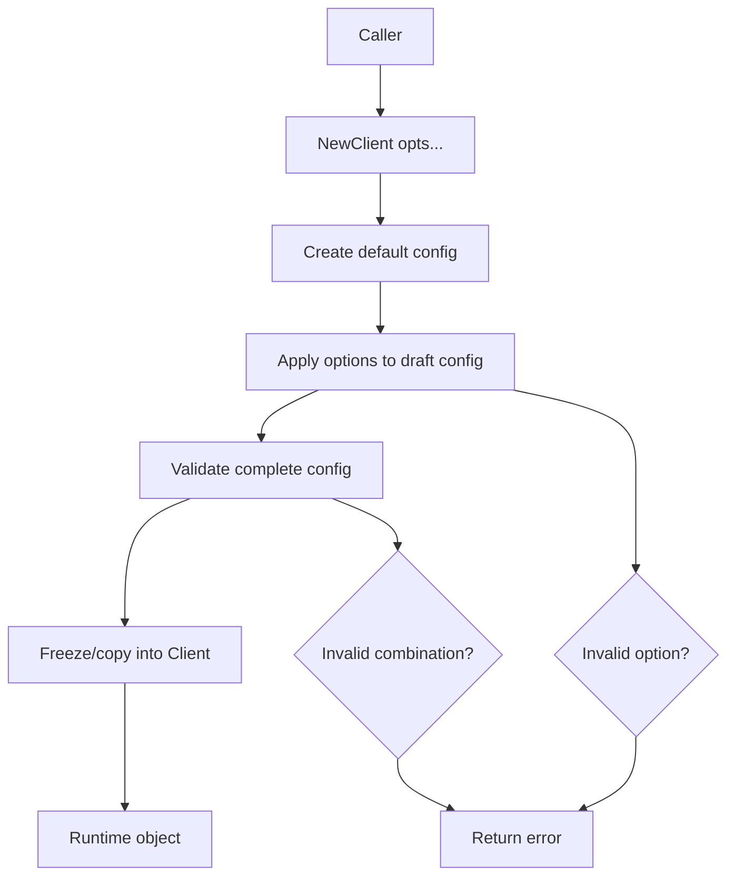
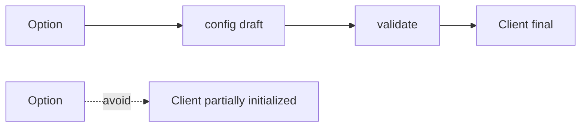
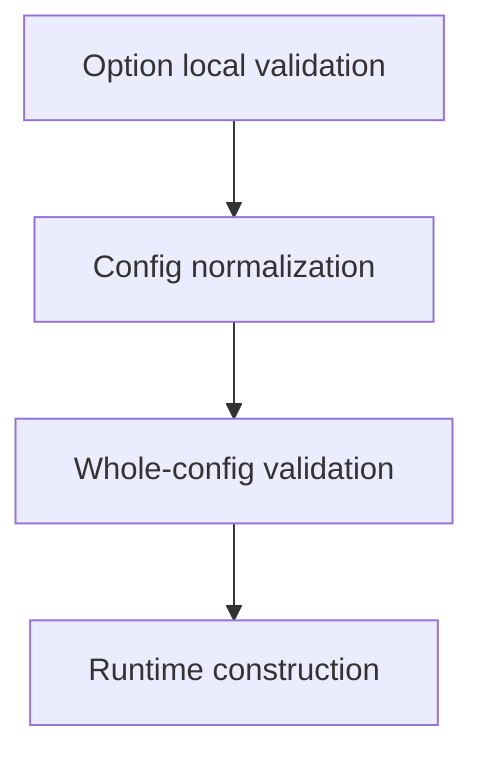
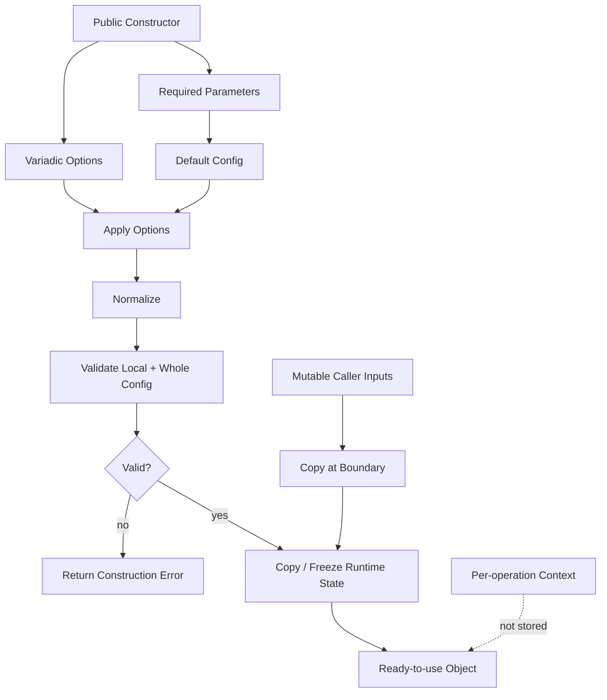

# learn-go-composition-oop-functional-reflection-codegen-modules-part-012.md

# Part 012 — Functional Options Pattern: Configuration API, Validation, Defaulting, dan Immutable Boundary

> Seri: `learn-go-composition-oop-functional-reflection-codegen-modules`  
> Bagian: 012 dari 030  
> Target pembaca: Java software engineer / tech lead yang ingin mendesain API Go yang stabil, eksplisit, kompatibel, dan production-ready.  
> Fokus: functional options pattern sebagai alat desain API konfigurasi, bukan sekadar template `func WithX(...) Option`.

---

## 0. Posisi Part Ini Dalam Seri

Pada part sebelumnya, kita membahas gaya functional di Go: function sebagai value, closure, strategy, validator, mapper, middleware, dan pipeline. Sekarang kita masuk ke salah satu pattern paling sering dipakai dalam API Go modern: **functional options**.

Functional options pattern sering terlihat sederhana:

```go
type Option func(*Config)

func WithTimeout(d time.Duration) Option {
    return func(c *Config) {
        c.Timeout = d
    }
}
```

Lalu constructor menerima variadic options:

```go
client := NewClient(
    WithTimeout(3*time.Second),
    WithRetry(3),
)
```

Tetapi di sistem produksi, pattern ini bukan cuma soal sintaks. Ia adalah jawaban terhadap beberapa problem desain API:

1. bagaimana menambah konfigurasi baru tanpa merusak caller lama;
2. bagaimana menjaga default tetap konsisten;
3. bagaimana memvalidasi kombinasi konfigurasi;
4. bagaimana membedakan configuration-time error dari runtime error;
5. bagaimana menghindari mutable shared config;
6. bagaimana membuat API mudah dibaca tetapi tetap tidak terlalu magical;
7. bagaimana memastikan observability, security, dan compatibility tetap terkendali.

Functional options bisa sangat elegan. Tapi jika digunakan sembarangan, ia bisa berubah menjadi hidden global state, order-dependent configuration, error yang terlambat, dan API yang sulit diaudit.

---

## 1. Problem Yang Diselesaikan Functional Options

Di Java, konfigurasi object sering dilakukan dengan beberapa pendekatan:

1. overloaded constructors;
2. builder pattern;
3. setter injection;
4. configuration object;
5. annotation/configuration framework;
6. dependency injection container.

Contoh Java builder:

```java
Client client = Client.builder()
    .timeout(Duration.ofSeconds(3))
    .maxRetries(3)
    .baseUrl("https://api.example.com")
    .build();
```

Di Go, kita bisa memakai struct config langsung:

```go
client, err := NewClient(Config{
    Timeout:    3 * time.Second,
    MaxRetries: 3,
    BaseURL:    "https://api.example.com",
})
```

Ini sering pilihan paling jelas. Namun struct config punya trade-off:

- jika field diekspor, caller bisa membangun konfigurasi tidak valid;
- zero value tidak selalu berarti default yang benar;
- sulit membedakan “caller sengaja set zero” vs “caller tidak set field”; 
- config struct menjadi bagian dari public API yang sulit diubah;
- caller harus tahu seluruh konfigurasi walau hanya butuh satu atau dua field;
- jika config struct disimpan lalu dimutasi setelah constructor, invariant bisa bocor.

Functional options muncul untuk menyelesaikan sebagian problem tersebut.

---

## 2. Mental Model: Option Adalah Command Terbatas Terhadap Draft Config

Functional option paling mudah dipahami sebagai **command kecil yang mengubah draft configuration sebelum object dibuat**.



Konsep penting:

- Option bukan runtime behavior utama.
- Option bukan dependency injection container.
- Option bukan tempat melakukan IO berat.
- Option seharusnya hanya mengubah draft config secara terbatas.
- Object final sebaiknya tidak menyimpan pointer ke draft config yang bisa dimutasi dari luar.

Jadi flow idealnya:

```text
input options -> draft config -> validation -> immutable runtime state
```

Bukan:

```text
input options -> mutate object directly -> hope everything is valid
```

---

## 3. Bentuk Dasar Functional Options

Versi paling sederhana:

```go
package caseclient

import (
    "time"
)

type Client struct {
    baseURL    string
    timeout    time.Duration
    maxRetries int
}

type Option func(*config)

type config struct {
    baseURL    string
    timeout    time.Duration
    maxRetries int
}

func defaultConfig() config {
    return config{
        baseURL:    "https://api.internal.example",
        timeout:    5 * time.Second,
        maxRetries: 2,
    }
}

func WithBaseURL(url string) Option {
    return func(c *config) {
        c.baseURL = url
    }
}

func WithTimeout(d time.Duration) Option {
    return func(c *config) {
        c.timeout = d
    }
}

func WithMaxRetries(n int) Option {
    return func(c *config) {
        c.maxRetries = n
    }
}

func NewClient(opts ...Option) (*Client, error) {
    cfg := defaultConfig()

    for _, opt := range opts {
        if opt != nil {
            opt(&cfg)
        }
    }

    if cfg.baseURL == "" {
        return nil, ErrMissingBaseURL
    }
    if cfg.timeout <= 0 {
        return nil, ErrInvalidTimeout
    }
    if cfg.maxRetries < 0 {
        return nil, ErrInvalidMaxRetries
    }

    return &Client{
        baseURL:    cfg.baseURL,
        timeout:    cfg.timeout,
        maxRetries: cfg.maxRetries,
    }, nil
}
```

Ada beberapa hal penting dari contoh ini:

1. `config` tidak diekspor.
2. `Option` hanya bisa memodifikasi `*config`, bukan `*Client`.
3. Default dibuat dahulu.
4. Options diterapkan ke draft config.
5. Validasi dilakukan setelah semua option diterapkan.
6. `Client` menyimpan hasil final, bukan pointer ke config eksternal.

Ini adalah baseline sehat.

---

## 4. Kenapa Option Sebaiknya Mengubah Config, Bukan Object Langsung

Desain yang sering muncul:

```go
type Option func(*Client)

func NewClient(opts ...Option) *Client {
    c := &Client{}
    for _, opt := range opts {
        opt(c)
    }
    return c
}
```

Ini terlihat ringkas, tetapi ada masalah:

1. object bisa berada dalam state setengah jadi;
2. option bisa memanggil method runtime sebelum invariant lengkap;
3. validasi sulit dipusatkan;
4. dependency initialization bisa terjadi dalam urutan tidak jelas;
5. option bisa menyentuh terlalu banyak internal field;
6. sulit membedakan configuration state vs runtime state.

Lebih aman:

```go
type Option func(*config)
```

Lalu `NewClient` membangun object final setelah validasi.



Dalam desain production, constructor adalah boundary yang harus menjamin invariant:

```text
Jika NewX berhasil, X siap digunakan.
Jika konfigurasi tidak valid, NewX gagal sebelum object dipublikasikan.
```

---

## 5. Option Dengan Error

Option sederhana `func(*config)` tidak bisa mengembalikan error. Jika validasi cukup dilakukan setelah semua option diterapkan, ini tidak masalah.

Tetapi beberapa option butuh validasi lokal:

```go
func WithBaseURL(raw string) Option {
    return func(c *config) {
        c.baseURL = raw
    }
}
```

Kalau `raw` harus parse URL, ada dua pilihan.

### 5.1 Validasi Di Constructor

```go
func NewClient(opts ...Option) (*Client, error) {
    cfg := defaultConfig()
    for _, opt := range opts {
        if opt != nil {
            opt(&cfg)
        }
    }

    u, err := url.ParseRequestURI(cfg.baseURL)
    if err != nil {
        return nil, fmt.Errorf("invalid base URL: %w", err)
    }

    return &Client{baseURL: u.String()}, nil
}
```

Kelebihan:

- semua validasi terpusat;
- constructor punya gambaran konfigurasi lengkap;
- option tetap sederhana.

Kekurangan:

- error menunjuk ke field, bukan langsung ke option;
- validasi option yang mahal tetap ditunda.

### 5.2 Option Mengembalikan Error

```go
type Option func(*config) error

func WithBaseURL(raw string) Option {
    return func(c *config) error {
        u, err := url.ParseRequestURI(raw)
        if err != nil {
            return fmt.Errorf("base URL: %w", err)
        }
        c.baseURL = u.String()
        return nil
    }
}

func NewClient(opts ...Option) (*Client, error) {
    cfg := defaultConfig()
    for _, opt := range opts {
        if opt == nil {
            continue
        }
        if err := opt(&cfg); err != nil {
            return nil, err
        }
    }
    if err := validateConfig(cfg); err != nil {
        return nil, err
    }
    return newClientFromConfig(cfg), nil
}
```

Kelebihan:

- error dekat dengan option;
- validasi lokal jelas;
- caller tahu option mana yang gagal.

Kekurangan:

- semua option sekarang punya signature lebih berat;
- temptation untuk melakukan IO di option meningkat;
- validasi kombinasi tetap harus ada di constructor.

Rule praktis:

```text
Gunakan Option func(*config) untuk konfigurasi sederhana.
Gunakan Option func(*config) error jika option perlu parsing/validasi lokal yang meaningful.
Tetap lakukan final validation setelah semua option diterapkan.
```

---

## 6. Defaulting: Zero Value Tidak Selalu Default

Salah satu tantangan konfigurasi Go adalah zero value.

```go
type Config struct {
    Timeout time.Duration
}
```

Apakah `Timeout == 0` berarti:

1. caller tidak set timeout;
2. caller ingin no timeout;
3. default timeout;
4. invalid timeout?

Functional options membantu karena default dibuat dahulu:

```go
func defaultConfig() config {
    return config{
        timeout: 5 * time.Second,
    }
}

func WithTimeout(d time.Duration) Option {
    return func(c *config) {
        c.timeout = d
    }
}
```

Sekarang jika caller tidak memanggil `WithTimeout`, timeout default dipakai.

Tetapi bagaimana jika caller ingin menonaktifkan timeout?

Jangan overload `0` secara diam-diam jika itu rawan ambigu. Lebih eksplisit:

```go
func WithTimeout(d time.Duration) Option {
    return func(c *config) {
        c.timeout = d
        c.timeoutSet = true
    }
}

func WithoutTimeout() Option {
    return func(c *config) {
        c.timeout = 0
        c.timeoutDisabled = true
    }
}
```

Atau:

```go
func WithNoTimeout() Option {
    return func(c *config) {
        c.timeout = 0
        c.disableTimeout = true
    }
}
```

Prinsipnya:

```text
Jangan jadikan zero value sebagai multi-meaning state jika konsekuensinya besar.
```

Untuk production API, lebih baik verbose sedikit tetapi eksplisit daripada ringkas tetapi ambigu.

---

## 7. Immutable Boundary

Config draft boleh mutable selama constructor berjalan. Setelah object dibuat, runtime state sebaiknya tidak bergantung pada mutable input dari caller.

Contoh bug:

```go
type Client struct {
    headers map[string]string
}

func WithHeaders(headers map[string]string) Option {
    return func(c *config) {
        c.headers = headers
    }
}
```

Jika caller mengubah map setelah client dibuat:

```go
headers := map[string]string{"X-App": "case"}
client, _ := NewClient(WithHeaders(headers))
headers["Authorization"] = "unexpected"
```

Kalau `Client` menyimpan map yang sama, invariant bocor.

Solusi: copy at boundary.

```go
func cloneStringMap(in map[string]string) map[string]string {
    if len(in) == 0 {
        return nil
    }
    out := make(map[string]string, len(in))
    for k, v := range in {
        out[k] = v
    }
    return out
}

func WithHeaders(headers map[string]string) Option {
    return func(c *config) {
        c.headers = cloneStringMap(headers)
    }
}

func newClientFromConfig(cfg config) *Client {
    return &Client{
        headers: cloneStringMap(cfg.headers),
    }
}
```

Untuk slice:

```go
func cloneStrings(in []string) []string {
    if len(in) == 0 {
        return nil
    }
    out := make([]string, len(in))
    copy(out, in)
    return out
}
```

Rule:

```text
Jika option menerima map, slice, pointer, function, interface, atau object mutable, tentukan ownership secara eksplisit.
```

Ownership bisa:

1. copied;
2. borrowed read-only;
3. retained and caller must not mutate;
4. transferred ownership;
5. shared concurrently safe.

Di Go, ownership tidak diformalkan oleh compiler. Maka API harus mendesain dan mendokumentasikannya.

---

## 8. Functional Options vs Config Struct

Functional options bukan selalu pilihan terbaik. Banyak API lebih baik memakai config struct.

### 8.1 Config Struct Cocok Jika

- konfigurasi banyak dan stabil;
- caller sering membangun config dari file/env;
- config perlu di-log/redact/validate sebagai object;
- config dipakai linting atau schema generation;
- config ingin bisa dibandingkan dalam test;
- semua field memang bagian dari external configuration surface.

Contoh:

```go
type ServerConfig struct {
    Address         string
    ReadTimeout     time.Duration
    WriteTimeout    time.Duration
    ShutdownTimeout time.Duration
    TLS             TLSConfig
}

func NewServer(cfg ServerConfig) (*Server, error) {
    cfg = cfg.withDefaults()
    if err := cfg.validate(); err != nil {
        return nil, err
    }
    return newServer(cfg), nil
}
```

### 8.2 Functional Options Cocok Jika

- hanya sebagian kecil caller yang butuh konfigurasi advanced;
- API ingin backward-compatible ketika option baru ditambah;
- default dominan dan caller biasanya hanya override sedikit;
- ada dependency/policy optional;
- constructor ingin tetap ringkas;
- konfigurasi perlu menyembunyikan internal representation.

Contoh:

```go
client, err := NewClient(
    WithHTTPClient(httpClient),
    WithRetryPolicy(policy),
    WithMetrics(recorder),
)
```

### 8.3 Hybrid Pattern

Untuk sistem besar, hybrid sering paling baik:

```go
type Config struct {
    BaseURL string
    Timeout time.Duration
}

type Option func(*config) error

func WithConfig(cfg Config) Option {
    return func(c *config) error {
        c.baseURL = cfg.BaseURL
        c.timeout = cfg.Timeout
        return nil
    }
}

func WithMetrics(m Metrics) Option {
    return func(c *config) error {
        c.metrics = m
        return nil
    }
}
```

Config struct untuk external/environment-driven settings. Functional options untuk advanced dependency injection/policy injection.

---

## 9. Order Dependence: Bahaya Yang Sering Tidak Terlihat

Variadic options diterapkan berurutan.

```go
NewClient(
    WithTimeout(1*time.Second),
    WithTimeout(5*time.Second),
)
```

Yang terakhir menang.

Ini bisa diterima untuk simple override. Tapi bisa berbahaya jika option saling bergantung.

Contoh buruk:

```go
func WithFastMode() Option {
    return func(c *config) {
        c.timeout = 500 * time.Millisecond
        c.maxRetries = 0
    }
}

func WithRetry(n int) Option {
    return func(c *config) {
        c.maxRetries = n
    }
}
```

Maka:

```go
NewClient(WithFastMode(), WithRetry(3))
```

berbeda dari:

```go
NewClient(WithRetry(3), WithFastMode())
```

Order-dependent options membuat konfigurasi sulit diaudit.

Solusi:

1. hindari option “mode” yang mengubah banyak field;
2. lakukan conflict validation;
3. pisahkan high-level preset dari low-level option secara jelas;
4. dokumentasikan last-write-wins jika memang disengaja;
5. gunakan explicit config object untuk preset besar.

Contoh conflict validation:

```go
type config struct {
    timeout       time.Duration
    timeoutSource string

    fastMode bool
    retrySet bool
    maxRetries int
}

func WithFastMode() Option {
    return func(c *config) {
        c.fastMode = true
        c.timeout = 500 * time.Millisecond
        c.timeoutSource = "fast-mode"
        c.maxRetries = 0
    }
}

func WithRetry(n int) Option {
    return func(c *config) {
        c.retrySet = true
        c.maxRetries = n
    }
}

func validateConfig(c config) error {
    if c.fastMode && c.retrySet && c.maxRetries > 0 {
        return fmt.Errorf("fast mode cannot be combined with positive retry count")
    }
    return nil
}
```

Namun jika config butuh banyak source-tracking seperti ini, itu sinyal bahwa functional options mulai terlalu kompleks.

---

## 10. Option Naming

Naming option menentukan readability API.

### 10.1 Gunakan `WithX` Untuk Menyetel Capability/Dependency/Value

```go
WithTimeout(3 * time.Second)
WithLogger(logger)
WithClock(clock)
WithRetryPolicy(policy)
WithHTTPClient(client)
```

### 10.2 Gunakan `WithoutX` Atau `DisableX` Untuk Mematikan Fitur

```go
WithoutRetry()
DisableMetrics()
WithoutTimeout()
```

Jangan pakai:

```go
WithRetry(false)
WithMetrics(nil)
WithTimeout(0)
```

jika konsekuensinya besar.

### 10.3 Gunakan Nama Domain, Bukan Nama Field Internal

Buruk:

```go
WithBufferSize(1024)
WithInternalQueueCapacity(1000)
```

Lebih baik jika memang domain-nya:

```go
WithMaxPendingDecisions(1000)
WithBatchLimit(500)
```

API harus mengungkapkan intent, bukan internal implementation leak.

---

## 11. Option Untuk Dependency Injection

Functional options sering dipakai untuk optional dependency:

```go
type Clock interface {
    Now() time.Time
}

type Metrics interface {
    RecordDecisionLatency(time.Duration)
}

type Logger interface {
    Info(msg string, fields ...Field)
    Error(msg string, fields ...Field)
}

func WithClock(clock Clock) Option {
    return func(c *config) {
        if clock != nil {
            c.clock = clock
        }
    }
}

func WithMetrics(metrics Metrics) Option {
    return func(c *config) {
        if metrics != nil {
            c.metrics = metrics
        }
    }
}
```

Pertanyaan desain:

1. Apakah nil berarti ignore, disable, atau invalid?
2. Apakah dependency harus concurrency-safe?
3. Apakah object menyimpan dependency sebagai interface atau concrete type?
4. Apakah dependency optional punya no-op default?
5. Apakah dependency failure boleh menggagalkan constructor?

Untuk metrics/logger, no-op default sering baik:

```go
type noopMetrics struct{}

func (noopMetrics) RecordDecisionLatency(time.Duration) {}
```

Untuk dependency kritikal seperti repository, nil sebaiknya invalid:

```go
func WithCaseRepository(repo CaseRepository) Option {
    return func(c *config) {
        c.caseRepo = repo
    }
}

func validateConfig(c config) error {
    if c.caseRepo == nil {
        return fmt.Errorf("case repository is required")
    }
    return nil
}
```

Jangan sembunyikan missing critical dependency dengan no-op jika itu membuat data hilang diam-diam.

---

## 12. Required Parameter vs Option

Jangan jadikan semua parameter sebagai option.

Buruk:

```go
client, err := NewClient(
    WithBaseURL(baseURL),
    WithCredential(credential),
)
```

Jika `baseURL` dan `credential` required, constructor lebih jelas:

```go
client, err := NewClient(baseURL, credential,
    WithTimeout(3*time.Second),
    WithMetrics(metrics),
)
```

Rule:

```text
Required invariant masuk sebagai parameter eksplisit constructor.
Optional policy/dependency/config masuk sebagai functional option.
```

Namun jangan terlalu banyak positional parameter. Jika required parameter banyak, gunakan config struct atau domain-specific constructor.

```go
type ClientConfig struct {
    BaseURL    string
    Credential Credential
    TenantID   TenantID
}

client, err := NewClient(ClientConfig{
    BaseURL:    baseURL,
    Credential: credential,
    TenantID:   tenantID,
}, WithMetrics(metrics))
```

---

## 13. Validation Strategy

Validation harus dibagi menjadi tiga lapisan.



### 13.1 Local Validation

Contoh:

```go
func WithMaxRetries(n int) Option {
    return func(c *config) error {
        if n < 0 {
            return fmt.Errorf("max retries must be >= 0")
        }
        c.maxRetries = n
        return nil
    }
}
```

### 13.2 Normalization

Contoh:

```go
func normalizeConfig(c *config) {
    c.baseURL = strings.TrimRight(c.baseURL, "/")
    if c.userAgent == "" {
        c.userAgent = defaultUserAgent
    }
}
```

### 13.3 Whole-Config Validation

Contoh:

```go
func validateConfig(c config) error {
    var errs []error

    if c.baseURL == "" {
        errs = append(errs, fmt.Errorf("base URL is required"))
    }
    if c.timeout <= 0 && !c.timeoutDisabled {
        errs = append(errs, fmt.Errorf("timeout must be positive or explicitly disabled"))
    }
    if c.retryPolicy != nil && c.maxRetries != 0 {
        errs = append(errs, fmt.Errorf("retry policy and max retries cannot both be set"))
    }

    return errors.Join(errs...)
}
```

Dalam Go modern, `errors.Join` berguna untuk mengembalikan beberapa error konfigurasi sekaligus. Ini lebih ramah untuk deployment karena operator bisa memperbaiki beberapa masalah sekaligus.

---

## 14. Avoid IO In Options

Option sebaiknya tidak melakukan IO berat:

```go
func WithConfigFile(path string) Option {
    return func(c *config) error {
        data, err := os.ReadFile(path) // questionable
        if err != nil {
            return err
        }
        return json.Unmarshal(data, c)
    }
}
```

Ini membuat constructor punya efek samping yang tidak jelas.

Lebih baik pisahkan loading dari construction:

```go
cfg, err := LoadConfigFile(path)
if err != nil {
    return err
}

client, err := NewClient(WithConfig(cfg))
```

Kenapa?

1. IO punya failure mode berbeda dari validation.
2. IO butuh context/timeout/logging.
3. IO bisa lambat.
4. IO menyulitkan test.
5. IO membuat constructor tidak deterministic.

Rule:

```text
Options boleh parsing ringan dan validasi lokal.
Options sebaiknya tidak melakukan network/database/filesystem IO kecuali API memang secara eksplisit mendesain itu sebagai construction-time behavior.
```

---

## 15. Context Jangan Disimpan Sebagai Option Runtime

Anti-pattern:

```go
func WithContext(ctx context.Context) Option {
    return func(c *config) {
        c.ctx = ctx
    }
}
```

Lalu client menyimpan context untuk semua request.

Ini biasanya salah. `context.Context` adalah per-operation cancellation/deadline/value propagation, bukan object-level config.

Lebih baik:

```go
func (c *Client) Submit(ctx context.Context, req SubmitRequest) error
```

Boleh memakai context di constructor hanya jika constructor melakukan work yang cancellable:

```go
func NewClient(ctx context.Context, cfg Config, opts ...Option) (*Client, error)
```

Tetapi jika constructor hanya membangun object in-memory, context tidak perlu.

---

## 16. Nil Handling Dalam Options

Nil adalah sumber bug penting.

Contoh:

```go
func WithLogger(l Logger) Option {
    return func(c *config) {
        c.logger = l
    }
}
```

Jika caller pass nil:

```go
client, _ := NewClient(WithLogger(nil))
```

Apa artinya?

Pilihan desain:

1. nil invalid;
2. nil berarti no-op logger;
3. nil berarti leave default unchanged;
4. nil berarti disable logging.

Jangan biarkan ambiguous. Contoh eksplisit:

```go
func WithLogger(l Logger) Option {
    return func(c *config) error {
        if l == nil {
            return fmt.Errorf("logger must not be nil; use WithoutLogging to disable")
        }
        c.logger = l
        return nil
    }
}

func WithoutLogging() Option {
    return func(c *config) error {
        c.logger = noopLogger{}
        return nil
    }
}
```

Atau jika nil ignore memang disengaja:

```go
func WithLogger(l Logger) Option {
    return func(c *config) error {
        if l == nil {
            return nil
        }
        c.logger = l
        return nil
    }
}
```

Dokumentasikan.

---

## 17. Typed Option Untuk Mencegah Salah Pakai

Jika package punya beberapa constructor, satu `Option` global bisa membuat option salah tempat.

Buruk:

```go
type Option func(*config)

func NewClient(opts ...Option) *Client
func NewServer(opts ...Option) *Server
```

Jika config berbeda, pisahkan:

```go
type ClientOption func(*clientConfig) error
type ServerOption func(*serverConfig) error
```

Dengan begitu:

```go
NewClient(WithServerReadTimeout(...)) // compile error jika typed benar
```

Untuk library besar, typed option adalah safety boundary.

---

## 18. Option Interface Untuk Sealing

Kadang kita ingin option hanya bisa dibuat oleh package yang sama, agar caller tidak bisa membuat custom option yang memodifikasi config sembarangan.

Function type option terbuka:

```go
type Option func(*config) error
```

Caller dari package lain tidak bisa menyentuh `config` jika `config` unexported, tetapi mereka tetap bisa membuat option yang no-op:

```go
var MyOption caseclient.Option = func(any?) // tidak bisa jika signature pakai *config unexported dari package lain
```

Karena `config` unexported, external package tidak bisa menulis signature `func(*config) error`. Ini secara praktis sudah membatasi.

Namun ada pola sealed option dengan interface:

```go
type Option interface {
    apply(*config) error
}

type optionFunc func(*config) error

func (f optionFunc) apply(c *config) error {
    return f(c)
}

func WithTimeout(d time.Duration) Option {
    return optionFunc(func(c *config) error {
        if d <= 0 {
            return fmt.Errorf("timeout must be positive")
        }
        c.timeout = d
        return nil
    })
}
```

Karena method `apply` tidak diekspor dan memakai unexported `config`, external package tidak bisa mengimplementasikan `Option`. Ini membuat option set tertutup.

Kapan berguna?

- security-sensitive configuration;
- API compatibility control;
- ingin mencegah extension sembarangan;
- generated options;
- internal platform libraries.

Kapan tidak perlu?

- API sederhana;
- package kecil;
- option tidak sensitif;
- simplicity lebih penting.

---

## 19. Generic Options: Hati-Hati Dengan Abstraksi Berlebih

Kadang orang membuat generic option reusable:

```go
type Option[T any] func(*T) error
```

Lalu:

```go
func ApplyOptions[T any](cfg *T, opts ...Option[T]) error {
    for _, opt := range opts {
        if opt == nil {
            continue
        }
        if err := opt(cfg); err != nil {
            return err
        }
    }
    return nil
}
```

Ini bisa berguna untuk internal helper, tetapi jangan buru-buru membuat framework.

Masalah generic option abstraction:

1. error context sering hilang;
2. domain naming melemah;
3. package boundary jadi kurang jelas;
4. option antar domain terlihat seragam padahal semantics berbeda;
5. reviewer harus memahami abstraction layer tambahan.

Gunakan generic helper hanya jika memang ada repeated infrastructure pattern yang stabil.

Untuk public API, typed domain option sering lebih jelas:

```go
type ClientOption func(*clientConfig) error
```

bukan:

```go
type Option[T any] func(*T) error
```

---

## 20. Functional Options Untuk Middleware/Decorator Setup

Functional options cocok untuk menyusun middleware/decorator saat construction.

Contoh client dengan transport pipeline:

```go
type RoundTripper interface {
    RoundTrip(ctx context.Context, req Request) (Response, error)
}

type Middleware func(RoundTripper) RoundTripper

type config struct {
    base RoundTripper
    middleware []Middleware
}

func WithMiddleware(m Middleware) Option {
    return func(c *config) error {
        if m == nil {
            return fmt.Errorf("middleware must not be nil")
        }
        c.middleware = append(c.middleware, m)
        return nil
    }
}

func buildPipeline(base RoundTripper, middleware []Middleware) RoundTripper {
    rt := base
    for i := len(middleware) - 1; i >= 0; i-- {
        rt = middleware[i](rt)
    }
    return rt
}
```

Order harus didokumentasikan.

Jika caller menulis:

```go
NewClient(
    WithMiddleware(Tracing()),
    WithMiddleware(Retry()),
    WithMiddleware(Auth()),
)
```

Mereka harus tahu urutan eksekusi. Misalnya outermost-first:

```text
Tracing -> Retry -> Auth -> BaseTransport
```

Atau insertion-order execution:

```text
Auth -> Retry -> Tracing -> BaseTransport
```

Jangan biarkan order menjadi tebakan.

---

## 21. Case Study: Regulatory Case Escalation Engine

Kita desain sebuah engine untuk escalation case regulatory.

Kebutuhan:

- tenant-specific policy;
- clock injectable untuk deterministic test;
- metrics optional;
- audit sink required;
- escalation rule set required;
- dry-run mode optional;
- max batch size default 100;
- timeout default per operation;
- no background goroutine dalam constructor;
- config harus valid sebelum engine dipakai.

### 21.1 Domain Interfaces

```go
type Clock interface {
    Now() time.Time
}

type AuditSink interface {
    RecordEscalation(ctx context.Context, event EscalationEvent) error
}

type Metrics interface {
    RecordEvaluated(count int)
    RecordEscalated(count int)
    RecordFailure(reason string)
}

type RuleSet interface {
    Evaluate(ctx context.Context, c Case, now time.Time) (Decision, error)
}
```

### 21.2 Engine

```go
type Engine struct {
    tenantID     TenantID
    rules        RuleSet
    audit        AuditSink
    clock        Clock
    metrics      Metrics
    maxBatchSize int
    dryRun       bool
    timeout      time.Duration
}
```

### 21.3 Config

```go
type config struct {
    tenantID     TenantID
    rules        RuleSet
    audit        AuditSink
    clock        Clock
    metrics      Metrics
    maxBatchSize int
    dryRun       bool
    timeout      time.Duration
}

func defaultConfig(tenantID TenantID, rules RuleSet, audit AuditSink) config {
    return config{
        tenantID:     tenantID,
        rules:        rules,
        audit:        audit,
        clock:        systemClock{},
        metrics:      noopMetrics{},
        maxBatchSize: 100,
        timeout:      10 * time.Second,
    }
}
```

### 21.4 Options

```go
type Option func(*config) error

func WithClock(clock Clock) Option {
    return func(c *config) error {
        if clock == nil {
            return fmt.Errorf("clock must not be nil")
        }
        c.clock = clock
        return nil
    }
}

func WithMetrics(metrics Metrics) Option {
    return func(c *config) error {
        if metrics == nil {
            return fmt.Errorf("metrics must not be nil; use WithoutMetrics to disable")
        }
        c.metrics = metrics
        return nil
    }
}

func WithoutMetrics() Option {
    return func(c *config) error {
        c.metrics = noopMetrics{}
        return nil
    }
}

func WithMaxBatchSize(n int) Option {
    return func(c *config) error {
        if n <= 0 {
            return fmt.Errorf("max batch size must be positive")
        }
        if n > 10_000 {
            return fmt.Errorf("max batch size too large: %d", n)
        }
        c.maxBatchSize = n
        return nil
    }
}

func WithDryRun() Option {
    return func(c *config) error {
        c.dryRun = true
        return nil
    }
}

func WithTimeout(d time.Duration) Option {
    return func(c *config) error {
        if d <= 0 {
            return fmt.Errorf("timeout must be positive")
        }
        c.timeout = d
        return nil
    }
}
```

### 21.5 Constructor

```go
func NewEngine(tenantID TenantID, rules RuleSet, audit AuditSink, opts ...Option) (*Engine, error) {
    cfg := defaultConfig(tenantID, rules, audit)

    for _, opt := range opts {
        if opt == nil {
            continue
        }
        if err := opt(&cfg); err != nil {
            return nil, err
        }
    }

    if err := validateConfig(cfg); err != nil {
        return nil, err
    }

    return &Engine{
        tenantID:     cfg.tenantID,
        rules:        cfg.rules,
        audit:        cfg.audit,
        clock:        cfg.clock,
        metrics:      cfg.metrics,
        maxBatchSize: cfg.maxBatchSize,
        dryRun:       cfg.dryRun,
        timeout:      cfg.timeout,
    }, nil
}

func validateConfig(c config) error {
    var errs []error

    if c.tenantID == "" {
        errs = append(errs, fmt.Errorf("tenant ID is required"))
    }
    if c.rules == nil {
        errs = append(errs, fmt.Errorf("rule set is required"))
    }
    if c.audit == nil {
        errs = append(errs, fmt.Errorf("audit sink is required"))
    }
    if c.clock == nil {
        errs = append(errs, fmt.Errorf("clock is required"))
    }
    if c.metrics == nil {
        errs = append(errs, fmt.Errorf("metrics is required"))
    }
    if c.maxBatchSize <= 0 {
        errs = append(errs, fmt.Errorf("max batch size must be positive"))
    }
    if c.timeout <= 0 {
        errs = append(errs, fmt.Errorf("timeout must be positive"))
    }

    return errors.Join(errs...)
}
```

### 21.6 Usage

```go
engine, err := escalation.NewEngine(
    tenantID,
    rules,
    auditSink,
    escalation.WithClock(testClock),
    escalation.WithMaxBatchSize(500),
    escalation.WithMetrics(metrics),
    escalation.WithTimeout(3*time.Second),
)
if err != nil {
    return err
}
```

This is readable, explicit, and stable.

---

## 22. Option Testing Strategy

Functional option API harus punya test khusus. Jangan hanya test runtime behavior.

### 22.1 Default Test

```go
func TestNewEngine_Defaults(t *testing.T) {
    e, err := NewEngine("tenant-a", fakeRules{}, fakeAudit{})
    if err != nil {
        t.Fatal(err)
    }

    if e.maxBatchSize != 100 {
        t.Fatalf("maxBatchSize = %d", e.maxBatchSize)
    }
    if e.timeout != 10*time.Second {
        t.Fatalf("timeout = %s", e.timeout)
    }
}
```

### 22.2 Option Override Test

```go
func TestNewEngine_WithMaxBatchSize(t *testing.T) {
    e, err := NewEngine("tenant-a", fakeRules{}, fakeAudit{}, WithMaxBatchSize(500))
    if err != nil {
        t.Fatal(err)
    }

    if e.maxBatchSize != 500 {
        t.Fatalf("maxBatchSize = %d", e.maxBatchSize)
    }
}
```

### 22.3 Invalid Option Test

```go
func TestNewEngine_InvalidMaxBatchSize(t *testing.T) {
    _, err := NewEngine("tenant-a", fakeRules{}, fakeAudit{}, WithMaxBatchSize(0))
    if err == nil {
        t.Fatal("expected error")
    }
}
```

### 22.4 Combination Validation Test

```go
func TestNewEngine_InvalidRequiredDependencies(t *testing.T) {
    _, err := NewEngine("tenant-a", nil, nil)
    if err == nil {
        t.Fatal("expected error")
    }
}
```

### 22.5 Ownership Test

Jika option menerima map/slice, test bahwa caller mutation tidak bocor.

```go
func TestWithHeaders_CopiesInput(t *testing.T) {
    headers := map[string]string{"X-App": "case"}
    c, err := NewClient(WithHeaders(headers))
    if err != nil {
        t.Fatal(err)
    }

    headers["X-App"] = "mutated"

    if got := c.headers["X-App"]; got != "case" {
        t.Fatalf("header leaked mutation: %q", got)
    }
}
```

---

## 23. Documentation Contract

Setiap option public harus menjawab:

1. apa yang diubah;
2. default jika option tidak dipakai;
3. apakah nil valid;
4. apakah input dicopy atau disimpan;
5. apakah option bisa dipanggil berkali-kali;
6. apakah order penting;
7. apakah dependency harus concurrency-safe;
8. apakah option mempengaruhi security/observability;
9. error apa yang mungkin muncul;
10. sejak versi berapa option tersedia.

Contoh dokumentasi:

```go
// WithHeaders configures static headers added to every outbound request.
// The input map is copied during construction. Mutating the map after NewClient
// returns does not affect the client.
//
// Passing nil clears all custom headers.
func WithHeaders(headers map[string]string) Option
```

Atau:

```go
// WithMetrics configures the metrics recorder used by the engine.
// The recorder must be safe for concurrent use.
// Passing nil returns an error. Use WithoutMetrics to disable metrics explicitly.
func WithMetrics(metrics Metrics) Option
```

---

## 24. Compatibility Engineering

Functional options membantu compatibility karena option baru bisa ditambahkan tanpa mengubah signature constructor.

```go
func NewClient(baseURL string, opts ...Option) (*Client, error)
```

Menambah:

```go
func WithCircuitBreaker(cb CircuitBreaker) Option
```

tidak merusak caller lama.

Namun compatibility tetap bisa rusak jika:

1. default berubah secara breaking;
2. option lama berubah semantics;
3. validation baru menolak config lama;
4. order application berubah;
5. option yang dulu menerima nil sekarang menolak nil;
6. constructor mulai melakukan IO/blocking behavior;
7. option mulai menyimpan input by reference padahal dulu copied;
8. object final berubah concurrency guarantees.

Jadi checklist compatibility:

```text
Apakah caller lama dengan options lama masih compile?
Apakah behavior default masih sama atau perubahan sudah diperlakukan sebagai migration?
Apakah error baru bisa muncul pada konfigurasi yang sebelumnya valid?
Apakah documentation dan release note menjelaskan perubahan?
```

---

## 25. Security Considerations

Functional options sering menyentuh security-sensitive config:

```go
WithTLSConfig(cfg *tls.Config)
WithTokenProvider(provider TokenProvider)
WithCredentialSource(source CredentialSource)
WithSkipVerifyTLS()
WithAllowedAudience(aud string)
```

Hal yang harus diperhatikan:

1. Hindari option insecure yang terlalu mudah dipakai.
2. Jika ada insecure option, beri nama eksplisit dan dokumentasi keras.
3. Copy `tls.Config` jika disimpan.
4. Jangan log secret dari option.
5. Jangan menyimpan credential mutable tanpa ownership contract.
6. Validasi kombinasi security option.
7. Pastikan default aman.

Contoh:

```go
func WithTLSConfig(cfg *tls.Config) Option {
    return func(c *config) error {
        if cfg == nil {
            return fmt.Errorf("tls config must not be nil")
        }
        clone := cfg.Clone()
        c.tlsConfig = clone
        return nil
    }
}
```

Untuk insecure option:

```go
func WithInsecureSkipTLSVerifyForTestingOnly() Option {
    return func(c *config) error {
        c.insecureSkipTLSVerify = true
        return nil
    }
}
```

Nama panjang disengaja. API security-sensitive tidak perlu terlalu nyaman untuk kesalahan.

---

## 26. Observability Considerations

Option bisa mempengaruhi observability:

```go
WithLogger(logger)
WithMetrics(metrics)
WithTracer(tracer)
WithComponentName(name)
WithRedactor(redactor)
```

Pastikan:

1. default tidak membocorkan data sensitif;
2. no-op implementation tersedia untuk dependency optional;
3. logger/metrics/tracer concurrency-safe;
4. component name stabil;
5. redaction policy bukan optional jika data sensitif;
6. option yang mengubah observability tidak silent.

Contoh:

```go
func WithRedactor(r Redactor) Option {
    return func(c *config) error {
        if r == nil {
            return fmt.Errorf("redactor must not be nil")
        }
        c.redactor = r
        return nil
    }
}
```

Untuk regulatory systems, audit/redaction biasanya bukan optional convenience. Itu invariant.

---

## 27. Anti-Patterns

### 27.1 Everything Is An Option

```go
NewService(
    WithDatabase(db),
    WithQueue(q),
    WithLogger(l),
    WithConfig(cfg),
    WithTenant(t),
    WithClock(clock),
)
```

Jika terlalu banyak required dependency jadi option, constructor tidak mengungkapkan invariant.

### 27.2 Option Melakukan Start Goroutine

```go
func WithBackgroundRefresh() Option {
    return func(c *config) error {
        go refreshLoop()
        return nil
    }
}
```

Ini buruk karena lifecycle tidak jelas. Start goroutine sebaiknya terjadi di method `Start` atau constructor final yang jelas dengan shutdown mechanism.

### 27.3 Option Mutate Global State

```go
func WithDebugMode() Option {
    return func(c *config) error {
        globalDebug = true
        return nil
    }
}
```

Ini membuat constructor punya side effect global.

### 27.4 Option Menyembunyikan Expensive Work

```go
WithRemoteSchema("https://...")
```

Jika ini melakukan network call di option, caller tidak melihat biaya.

### 27.5 Option Tanpa Validation

```go
func WithTimeout(d time.Duration) Option {
    return func(c *config) error {
        c.timeout = d
        return nil
    }
}
```

Jika `d <= 0` invalid, validasi harus ada.

### 27.6 Option Yang Saling Menimpa Diam-Diam

```go
WithRetryPolicy(policy)
WithMaxRetries(3)
```

Jika dua option mengatur konsep sama, harus ada precedence atau conflict validation.

---

## 28. Decision Matrix

| Situation | Prefer | Reason |
|---|---|---|
| Required dependency sedikit | Constructor parameter | Invariant terlihat jelas |
| Required dependency banyak | Config struct | Menghindari positional chaos |
| Optional config sedikit | Functional options | Readable dan compatible |
| Config berasal dari YAML/env | Config struct | Mudah load/validate/log/redact |
| Optional dependency/policy | Functional options | Explicit injection tanpa container |
| Security-sensitive option | Typed/sealed option + validation | Mengurangi salah pakai |
| Banyak preset/mode | Config struct atau named constructor | Menghindari order-dependent options |
| Per-operation value | Method parameter | Jangan simpan sebagai object config |
| Need generated config schema | Config struct | Struct tags/schema lebih natural |
| Need compatibility over time | Functional options | Option baru tidak mengubah constructor |

---

## 29. Production Checklist

Sebelum memakai functional options untuk public/internal platform API, cek:

```text
[ ] Required parameter tidak disembunyikan sebagai option.
[ ] Default didefinisikan di satu tempat.
[ ] Option tidak melakukan IO berat tanpa alasan eksplisit.
[ ] Option tidak mutate global state.
[ ] Option tidak start goroutine tanpa lifecycle.
[ ] Nil semantics jelas.
[ ] Mutable inputs dicopy atau ownership didokumentasikan.
[ ] Config divalidasi setelah semua option diterapkan.
[ ] Combination conflict divalidasi.
[ ] Option order dependency didokumentasikan atau dihindari.
[ ] Error construction-time jelas dan actionable.
[ ] Security-sensitive options punya safe default.
[ ] Observability dependencies punya no-op atau explicit required invariant.
[ ] Tests mencakup default, override, invalid option, invalid combination, ownership.
[ ] Public option documentation menjelaskan behavior, nil, ownership, dan concurrency.
[ ] Compatibility impact dipikirkan sebelum mengubah default/validation.
```

---

## 30. Java Engineer Translation Notes

| Java Habit | Go Equivalent | Warning |
|---|---|---|
| Builder pattern | Functional options atau config struct | Jangan semua required field jadi option |
| Setter injection | Constructor + options | Jangan biarkan object hidup dalam invalid state |
| Spring property binding | Config struct + validation | Jangan paksa functional options untuk file/env config |
| Abstract builder base class | Small constructor helpers | Hindari framework internal yang berlebihan |
| Annotation config | Explicit option/config | Go lebih suka explicit wiring |
| Null means default | Explicit defaulting/nil semantics | Nil harus punya makna jelas |
| Mutable config object | Copy/freeze at boundary | Jangan simpan map/slice caller sembarangan |

---

## 31. Mermaid Summary



---

## 32. Key Takeaways

Functional options adalah pattern yang sangat berguna, tetapi kekuatannya ada pada **API discipline**, bukan pada closure-nya.

Pegangan utama:

1. constructor harus menghasilkan object yang valid atau error;
2. default harus jelas dan stabil;
3. option harus mengubah draft config, bukan object setengah jadi;
4. required invariant jangan disembunyikan;
5. nil semantics harus eksplisit;
6. ownership mutable input harus jelas;
7. order dependence harus dihindari atau didokumentasikan;
8. validation harus mencakup kombinasi akhir;
9. security dan observability option harus didesain dengan safe default;
10. functional options bukan pengganti config struct untuk semua kasus.

Functional options yang baik membuat API terasa sederhana bagi caller, tetapi tetap kuat secara production engineering.

---

## 33. Latihan

### Latihan 1 — Redesign Constructor

Ambil constructor berikut:

```go
func NewProcessor(db DB, logger Logger, timeout time.Duration, retry int, dryRun bool) *Processor
```

Desain ulang dengan kombinasi required parameter dan functional options.

Pastikan:

- `db` required;
- logger default no-op;
- timeout default 5 detik;
- retry default 2;
- dry-run eksplisit;
- validation menolak timeout <= 0 dan retry < 0.

### Latihan 2 — Ownership Contract

Buat option:

```go
func WithAllowedModules(modules []string) Option
```

Pastikan slice dicopy dan mutation dari caller tidak bocor.

### Latihan 3 — Conflict Validation

Desain dua option:

```go
WithRetryPolicy(policy RetryPolicy)
WithMaxRetries(n int)
```

Buat validation agar keduanya tidak bisa dipakai bersamaan jika semantics-nya konflik.

### Latihan 4 — Security Option

Desain option untuk TLS config:

```go
WithTLSConfig(cfg *tls.Config)
```

Pastikan:

- nil invalid;
- config dicopy dengan `Clone()`;
- default aman;
- tidak ada secret yang dilog.

---

## 34. Penutup

Part ini membahas functional options sebagai pattern konfigurasi production-grade. Di part berikutnya, kita akan memperluas gaya functional ke **higher-order API design**: middleware, interceptor, handler chain, mapper/reducer, dan bagaimana membuat pipeline yang eksplisit tanpa berubah menjadi framework tersembunyi.

Status seri: **belum selesai**.  
Part berikutnya: `learn-go-composition-oop-functional-reflection-codegen-modules-part-013.md`.

<!-- NAVIGATION_FOOTER -->
<div class="page-nav">
<a href="./learn-go-composition-oop-functional-reflection-codegen-modules-part-011.md">⬅️ Part 011 — Functional Style di Go: Function, Closure, Strategy, Option, dan Pipeline Tanpa Over-Abstraction</a>
<a href="./index.md">📚 Kategori</a>
<a href="../../index.md">🏠 Home</a>
<a href="./learn-go-composition-oop-functional-reflection-codegen-modules-part-013.md">Part 013 — Higher-Order API Design: Middleware, Interceptor, Handler Chain, Mapper, Reducer, dan Function Composition yang Tetap Go-like ➡️</a>
</div>
