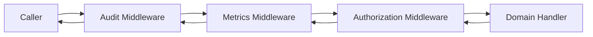
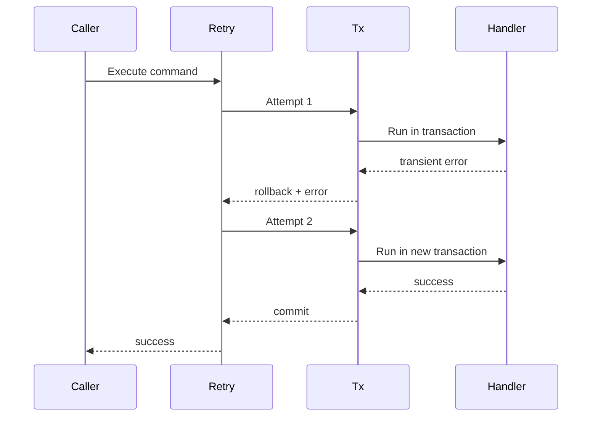
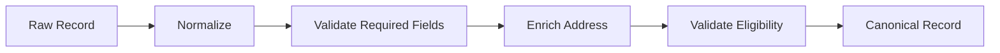
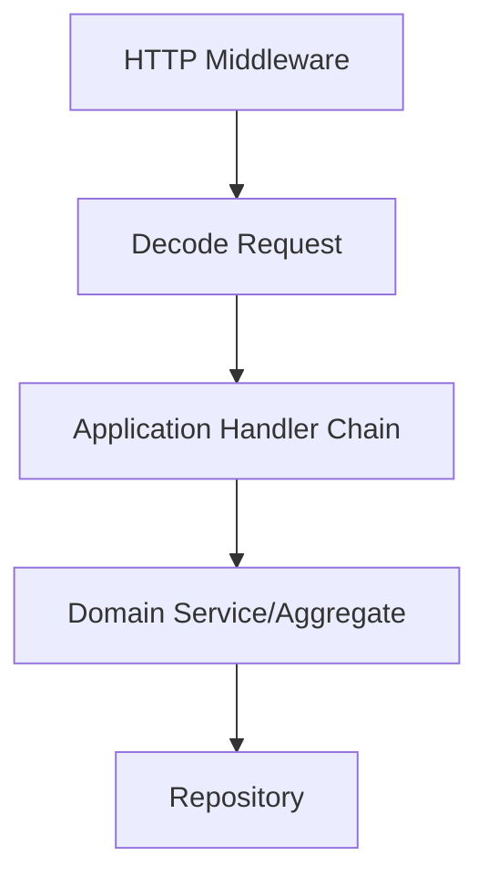
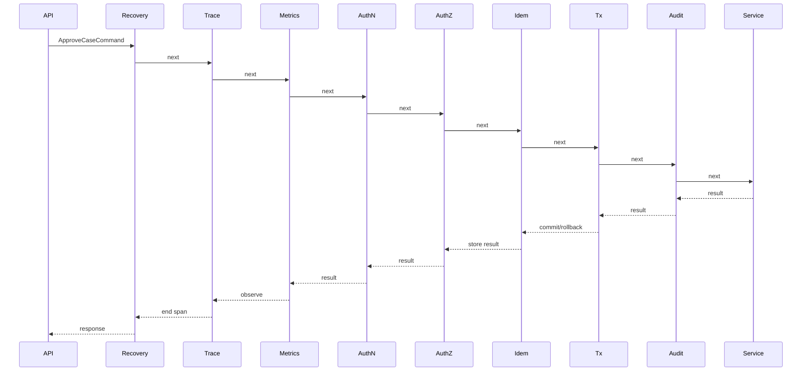

# learn-go-composition-oop-functional-reflection-codegen-modules-part-013.md

# Part 013 — Higher-Order API Design: Middleware, Interceptor, Handler Chain, Mapper, Reducer, dan Function Composition yang Tetap Go-like

> Seri: `learn-go-composition-oop-functional-reflection-codegen-modules`  
> Untuk: Java Software Engineer yang ingin membangun keluwesan desain Go level senior/principal  
> Fokus: higher-order API design di Go tanpa mengubah Go menjadi framework-heavy language

---

## 0. Posisi Part Ini Dalam Seri

Kita sudah melewati fondasi berikut:

1. Go bukan Java dengan syntax berbeda.
2. Object model Go dibangun dari `type`, method, package boundary, interface, dan composition.
3. Interface satisfaction bersifat structural dan implicit.
4. Embedding bukan inheritance.
5. Function di Go dapat dipakai sebagai policy, strategy, validator, mapper, middleware, dan boundary wrapper.
6. Functional options pattern berguna untuk configuration API, tetapi harus dijaga dari option explosion.

Part ini membahas langkah berikutnya: **higher-order API design**.

Higher-order API adalah API yang menerima function, mengembalikan function, atau membentuk rantai function.

Contoh bentuknya:

```go
func Retry(next Handler) Handler
func WithAudit(next Handler) Handler
func Map[T, U any](items []T, fn func(T) U) []U
func Reduce[T, R any](items []T, zero R, fn func(R, T) R) R
func Chain(middlewares ...Middleware) Middleware
```

Di Java, pola serupa sering muncul sebagai:

- `Filter`
- `Interceptor`
- `HandlerInterceptor`
- `OncePerRequestFilter`
- `Function<T, R>`
- `Consumer<T>`
- `Predicate<T>`
- `CompletableFuture` pipeline
- annotation-driven AOP
- Spring Security filter chain
- servlet filter chain
- gRPC interceptor
- repository mapper
- stream map/filter/reduce

Di Go, pola ini tersedia, tetapi idiomnya berbeda. Go lebih eksplisit, lebih kecil, dan biasanya lebih dekat ke boundary yang sedang didesain.

Target part ini bukan menghafal template middleware. Targetnya adalah memahami:

- kapan higher-order function memperjelas desain;
- kapan justru menyembunyikan control flow;
- bagaimana menjaga `context.Context`, error, cancellation, audit, metric, trace, dan invariant tetap jelas;
- bagaimana mendesain chain yang predictable;
- bagaimana menghindari functional over-abstraction;
- bagaimana menerjemahkan pola Java interceptor/filter/AOP ke Go tanpa membawa kompleksitas framework.

---

## 1. Mental Model Utama

Higher-order API di Go adalah alat untuk **membungkus behavior**, bukan alat untuk membangun hierarchy tersembunyi.

Kalimat kuncinya:

> Higher-order API yang baik membuat cross-cutting behavior eksplisit tanpa menghilangkan alur domain utama.

Cross-cutting behavior yang umum:

- logging;
- metric;
- tracing;
- audit;
- authorization;
- retry;
- rate limiting;
- timeout;
- panic recovery;
- idempotency;
- validation;
- transaction wrapper;
- cache wrapper;
- feature flag;
- request enrichment;
- context propagation.

Dalam Java/Spring, behavior seperti ini sering disembunyikan oleh:

- annotation;
- proxy;
- reflection;
- AOP;
- container lifecycle;
- servlet chain;
- declarative transaction boundary;
- security filter chain.

Di Go, behavior ini biasanya dibuat eksplisit:

```go
handler := WithAudit(auditLog)(
    WithMetrics(metrics)(
        WithAuthorization(authz)(
            ApproveCaseHandler(service),
        ),
    ),
)
```

Atau dengan chain helper:

```go
handler := Chain(
    WithAudit(auditLog),
    WithMetrics(metrics),
    WithAuthorization(authz),
)(ApproveCaseHandler(service))
```

Kelebihan desain eksplisit:

- mudah ditest;
- dependency terlihat;
- urutan wrapper terlihat;
- tidak butuh magic container;
- lebih mudah dipahami saat debugging;
- cocok untuk library kecil dan service boundary.

Risikonya:

- urutan wrapper bisa salah;
- function signature bisa membengkak;
- error handling bisa tidak konsisten;
- context bisa hilang;
- observability bisa double count;
- chain terlalu generic bisa lebih sulit dibaca daripada kode biasa.

---

## 2. Higher-Order API: Bentuk Dasar

Ada empat bentuk dasar.

### 2.1 Function menerima function

```go
func ExecuteWithAudit(ctx context.Context, audit AuditLog, action func(context.Context) error) error {
    audit.Start(ctx)
    err := action(ctx)
    audit.Finish(ctx, err)
    return err
}
```

Ini cocok untuk scope lokal.

Misalnya:

```go
err := ExecuteWithAudit(ctx, auditLog, func(ctx context.Context) error {
    return service.Approve(ctx, caseID, actor)
})
```

Kelebihan:

- sederhana;
- tidak perlu mendefinisikan banyak type;
- dependency lokal jelas.

Kekurangan:

- jika sering diulang, call site menjadi berisik;
- sulit menyusun banyak wrapper;
- tidak reusable sebagai pipeline formal.

---

### 2.2 Function mengembalikan function

```go
func WithAudit(audit AuditLog) func(Handler) Handler {
    return func(next Handler) Handler {
        return func(ctx context.Context, cmd Command) error {
            audit.Start(ctx, cmd)
            err := next(ctx, cmd)
            audit.Finish(ctx, cmd, err)
            return err
        }
    }
}
```

Ini mulai menjadi middleware.

---

### 2.3 Type function dengan method

```go
type Handler func(context.Context, Command) error

func (h Handler) Handle(ctx context.Context, cmd Command) error {
    return h(ctx, cmd)
}
```

Ini berguna jika ingin function sekaligus satisfy interface.

```go
type CommandHandler interface {
    Handle(context.Context, Command) error
}
```

`Handler` bisa dipakai sebagai function dan sebagai object behavior.

---

### 2.4 Function chain

```go
type Middleware func(Handler) Handler

func Chain(middlewares ...Middleware) Middleware {
    return func(final Handler) Handler {
        h := final
        for i := len(middlewares) - 1; i >= 0; i-- {
            h = middlewares[i](h)
        }
        return h
    }
}
```

Pemanggilan:

```go
handler := Chain(
    WithAudit(auditLog),
    WithMetrics(metrics),
    WithAuthorization(authz),
)(ApproveCaseHandler(service))
```

Jika chain dibangun dari kanan ke kiri, middleware pertama di list menjadi wrapper terluar.

```text
WithAudit(
  WithMetrics(
    WithAuthorization(
      ApproveCaseHandler
    )
  )
)
```

Diagram:



---

## 3. Mengapa Higher-Order API Penting di Go

Go mendorong desain eksplisit. Namun sistem produksi tetap butuh cross-cutting concerns.

Tanpa higher-order API, kode domain sering menjadi seperti ini:

```go
func (s *Service) Approve(ctx context.Context, id CaseID, actor Actor) error {
    start := time.Now()
    s.metrics.Inc("approve_started")
    s.audit.Record(ctx, "approve_started", id, actor)

    if err := s.authz.CanApprove(ctx, actor, id); err != nil {
        s.metrics.Inc("approve_denied")
        s.audit.Record(ctx, "approve_denied", id, actor)
        return err
    }

    tx, err := s.db.BeginTx(ctx, nil)
    if err != nil {
        s.metrics.Inc("approve_failed")
        return err
    }
    defer tx.Rollback()

    if err := s.repo.LockCase(ctx, tx, id); err != nil {
        s.metrics.Inc("approve_failed")
        return err
    }

    if err := s.repo.MarkApproved(ctx, tx, id, actor); err != nil {
        s.metrics.Inc("approve_failed")
        return err
    }

    if err := tx.Commit(); err != nil {
        s.metrics.Inc("approve_failed")
        return err
    }

    s.metrics.Observe("approve_duration", time.Since(start))
    s.audit.Record(ctx, "approve_completed", id, actor)
    return nil
}
```

Masalah:

- domain logic tertutup noise;
- audit dan metric tersebar;
- error path tidak konsisten;
- sulit memastikan semua handler punya behavior yang sama;
- sulit menambah tracing atau idempotency tanpa edit banyak fungsi.

Dengan higher-order design, domain handler bisa fokus:

```go
func ApproveCaseHandler(service CaseService) Handler {
    return func(ctx context.Context, cmd Command) error {
        approve, ok := cmd.(ApproveCaseCommand)
        if !ok {
            return ErrUnsupportedCommand
        }
        return service.Approve(ctx, approve.CaseID, approve.Actor)
    }
}
```

Cross-cutting logic berada di wrapper:

```go
handler := Chain(
    WithRecovery(logger),
    WithTracing(tracer),
    WithMetrics(metrics),
    WithAudit(auditLog),
    WithAuthorization(authz),
    WithTransaction(txManager),
)(ApproveCaseHandler(service))
```

---

## 4. Perbedaan Filter, Middleware, Interceptor, Decorator, dan Chain

Istilah sering bercampur. Kita perlu vocabulary yang presisi.

| Istilah | Bentuk umum | Fokus | Contoh |
|---|---|---|---|
| Decorator | membungkus object/function | menambah behavior tanpa mengubah core | metrics wrapper |
| Middleware | `func(next Handler) Handler` | chain request/command | HTTP middleware |
| Interceptor | before/after around call | observability/security/transaction | gRPC unary interceptor |
| Filter | allow/deny/transform | screening request | auth filter |
| Handler chain | sequence of handler | routing/processing | validation chain |
| Pipeline | output step jadi input step | transformasi data | normalize -> validate -> enrich |

Di Go, semua bisa direpresentasikan dengan function type. Yang membedakan adalah **semantic contract**, bukan syntax.

---

## 5. Signature Design: Bagian Paling Menentukan

Sebelum membuat middleware, tentukan signature handler.

Signature menentukan:

- apa yang bisa diobservasi;
- apa yang bisa dimodifikasi;
- bagaimana cancellation bekerja;
- bagaimana error disampaikan;
- apakah response bisa diubah;
- apakah request immutable;
- apakah metadata perlu dibawa lewat context atau explicit struct.

---

## 6. Signature Minimal

```go
type Handler func(context.Context) error
```

Cocok untuk:

- job sederhana;
- command tanpa payload karena payload sudah captured di closure;
- local transaction wrapper.

Contoh:

```go
func WithTransaction(txm TxManager) func(func(context.Context) error) func(context.Context) error {
    return func(next func(context.Context) error) func(context.Context) error {
        return func(ctx context.Context) error {
            return txm.WithTx(ctx, func(ctx context.Context) error {
                return next(ctx)
            })
        }
    }
}
```

Kelemahan:

- tidak ada request metadata formal;
- observability bergantung pada closure;
- sulit generic untuk banyak command.

---

## 7. Signature Command Handler

```go
type Handler[C any] func(context.Context, C) error
```

Ini cocok untuk command/action.

```go
type ApproveCaseCommand struct {
    CaseID CaseID
    Actor  Actor
    Reason string
}

type Handler[C any] func(context.Context, C) error
```

Middleware generic:

```go
type Middleware[C any] func(Handler[C]) Handler[C]
```

Audit middleware:

```go
func WithAudit[C any](audit AuditLog, describe func(C) AuditEvent) Middleware[C] {
    return func(next Handler[C]) Handler[C] {
        return func(ctx context.Context, cmd C) error {
            event := describe(cmd)
            audit.Start(ctx, event)
            err := next(ctx, cmd)
            audit.Finish(ctx, event, err)
            return err
        }
    }
}
```

Kelebihan:

- type-safe;
- command eksplisit;
- cocok untuk application service layer;
- tidak perlu reflection.

Kekurangan:

- middleware perlu generic atau per command;
- chain untuk command berbeda punya type berbeda;
- jika terlalu banyak command, composition bisa verbose.

---

## 8. Signature Request/Response Handler

```go
type Handler[Req any, Res any] func(context.Context, Req) (Res, error)
```

Cocok untuk query/use case yang menghasilkan response.

```go
type QueryHandler[Q any, R any] func(context.Context, Q) (R, error)

type QueryMiddleware[Q any, R any] func(QueryHandler[Q, R]) QueryHandler[Q, R]
```

Example:

```go
func WithQueryMetrics[Q any, R any](metrics Metrics, name string) QueryMiddleware[Q, R] {
    return func(next QueryHandler[Q, R]) QueryHandler[Q, R] {
        return func(ctx context.Context, q Q) (R, error) {
            start := time.Now()
            res, err := next(ctx, q)
            metrics.Observe(name+".duration", time.Since(start))
            metrics.Count(name+".completed", err == nil)
            return res, err
        }
    }
}
```

Kelemahan:

- zero value `R` harus dikembalikan saat error;
- middleware harus hati-hati tidak menelan error;
- response mutation perlu contract jelas.

```go
var zero R
return zero, err
```

---

## 9. Signature Dengan Envelope

Untuk sistem enterprise, request biasanya punya metadata:

- request id;
- actor;
- tenant;
- agency;
- correlation id;
- idempotency key;
- permission scope;
- source channel;
- effective date;
- audit reason;
- feature flags.

Jangan otomatis memasukkan semuanya ke `context.Context`.

Bisa buat envelope eksplisit:

```go
type CommandEnvelope[C any] struct {
    Command       C
    RequestID     string
    CorrelationID string
    Actor         Actor
    Tenant        TenantID
    IdempotencyKey string
    Source        SourceChannel
}

type Handler[C any] func(context.Context, CommandEnvelope[C]) error
```

Kelebihan:

- metadata terlihat di signature;
- cocok untuk audit/regulatory system;
- mudah ditest;
- tidak menyalahgunakan context.

Kekurangan:

- verbose;
- generic type bisa menyebar;
- perlu discipline agar envelope tidak menjadi god object.

---

## 10. Context: Apa yang Boleh dan Tidak Boleh

`context.Context` cocok untuk:

- cancellation;
- deadline;
- timeout;
- request-scoped values yang melintasi boundary;
- trace/span propagation;
- auth token internal yang memang request scoped;
- correlation id jika dipakai lintas layer.

`context.Context` tidak ideal untuk:

- command payload utama;
- required domain argument;
- mutable state;
- optional config jangka panjang;
- dependency injection global;
- transaction object jika membuat ownership tidak jelas;
- menyembunyikan actor/tenant yang penting untuk invariant.

Buruk:

```go
func Approve(ctx context.Context) error {
    caseID := ctx.Value(caseIDKey{}).(CaseID)
    actor := ctx.Value(actorKey{}).(Actor)
    return approve(ctx, caseID, actor)
}
```

Lebih baik:

```go
func Approve(ctx context.Context, cmd ApproveCaseCommand) error {
    return approve(ctx, cmd.CaseID, cmd.Actor)
}
```

Jika actor adalah domain invariant, jadikan explicit input.

---

## 11. Error Contract Dalam Higher-Order API

Middleware tidak boleh sembarangan mengubah error.

Pertanyaan desain:

1. Apakah middleware boleh wrap error?
2. Apakah middleware boleh mengganti error?
3. Apakah middleware boleh retry berdasarkan error?
4. Apakah middleware boleh menyembunyikan error untuk fallback?
5. Apakah middleware boleh mengubah error menjadi success?
6. Apakah error classification harus dilakukan di middleware atau handler?

Contoh bad middleware:

```go
func WithAudit(audit AuditLog) Middleware[ApproveCaseCommand] {
    return func(next Handler[ApproveCaseCommand]) Handler[ApproveCaseCommand] {
        return func(ctx context.Context, cmd ApproveCaseCommand) error {
            err := next(ctx, cmd)
            if auditErr := audit.Record(ctx, cmd, err); auditErr != nil {
                return auditErr
            }
            return err
        }
    }
}
```

Masalah:

- audit failure bisa menutupi business failure;
- caller melihat error yang salah;
- regulatory evidence bisa salah interpretasi.

Lebih eksplisit:

```go
func WithAudit(audit AuditLog, logger Logger) Middleware[ApproveCaseCommand] {
    return func(next Handler[ApproveCaseCommand]) Handler[ApproveCaseCommand] {
        return func(ctx context.Context, cmd ApproveCaseCommand) error {
            err := next(ctx, cmd)

            auditErr := audit.Record(ctx, cmd, err)
            if auditErr != nil {
                logger.Error(ctx, "audit record failed", "error", auditErr)

                if err == nil {
                    return fmt.Errorf("audit record failed after successful command: %w", auditErr)
                }

                return err
            }

            return err
        }
    }
}
```

Namun ini pun policy-specific. Untuk regulatory system, audit failure setelah successful domain mutation bisa menjadi fatal karena evidence tidak lengkap. Maka desain harus jelas:

- audit before mutation?
- audit in same transaction?
- audit outbox?
- audit async but guaranteed?
- audit failure blocks command?

Higher-order API tidak menyelesaikan policy. Ia hanya memberi tempat untuk mengeksekusi policy.

---

## 12. Middleware Ordering: Urutan Adalah Semantik

Urutan wrapper bukan kosmetik.

```go
handler := Chain(
    WithRecovery(logger),
    WithTracing(tracer),
    WithMetrics(metrics),
    WithAuthorization(authz),
    WithTransaction(txm),
    WithAudit(audit),
)(final)
```

Pertanyaan:

- Apakah authorization terjadi sebelum transaction?
- Apakah audit mencatat denied request?
- Apakah metrics mengukur termasuk authz time?
- Apakah tracing mencakup semua middleware?
- Apakah recovery menangkap panic dari semua wrapper?
- Apakah transaction mencakup audit?
- Apakah retry membungkus transaction atau transaction membungkus retry?

Contoh ordering buruk:

```go
handler := Chain(
    WithTransaction(txm),
    WithRetry(retryPolicy),
)(final)
```

Jika retry berjalan di dalam transaction yang sama, bisa menyebabkan transaction state corrupt atau retry tidak benar.

Biasanya lebih aman:

```go
handler := Chain(
    WithRetry(retryPolicy),
    WithTransaction(txm),
)(final)
```

Artinya setiap retry attempt mendapat transaction baru.

Diagram:



---

## 13. Chain Implementation yang Benar

Middleware type:

```go
type Handler[C any] func(context.Context, C) error

type Middleware[C any] func(Handler[C]) Handler[C]
```

Chain:

```go
func Chain[C any](middlewares ...Middleware[C]) Middleware[C] {
    return func(final Handler[C]) Handler[C] {
        if final == nil {
            panic("final handler is nil")
        }

        h := final
        for i := len(middlewares) - 1; i >= 0; i-- {
            if middlewares[i] == nil {
                panic("middleware is nil")
            }
            h = middlewares[i](h)
            if h == nil {
                panic("middleware returned nil handler")
            }
        }
        return h
    }
}
```

Mengapa pakai panic di construction?

Karena nil middleware adalah programmer error. Lebih baik fail-fast saat wiring daripada runtime silent no-op.

Untuk library publik, bisa juga return error:

```go
func BuildChain[C any](final Handler[C], middlewares ...Middleware[C]) (Handler[C], error) {
    if final == nil {
        return nil, errors.New("final handler is nil")
    }

    h := final
    for i := len(middlewares) - 1; i >= 0; i-- {
        if middlewares[i] == nil {
            return nil, fmt.Errorf("middleware at index %d is nil", i)
        }
        h = middlewares[i](h)
        if h == nil {
            return nil, fmt.Errorf("middleware at index %d returned nil handler", i)
        }
    }
    return h, nil
}
```

Rule:

- application wiring boleh panic fail-fast;
- library publik lebih baik return error jika invalid input bisa berasal dari user.

---

## 14. Middleware Dengan State

Middleware sering butuh dependency:

- logger;
- metrics;
- tracer;
- audit repository;
- policy engine;
- clock;
- id generator;
- retry policy;
- rate limiter.

Gunakan closure:

```go
func WithMetrics[C any](metrics Metrics, name string, clock Clock) Middleware[C] {
    if metrics == nil {
        panic("metrics is nil")
    }
    if clock == nil {
        panic("clock is nil")
    }

    return func(next Handler[C]) Handler[C] {
        if next == nil {
            panic("next handler is nil")
        }

        return func(ctx context.Context, cmd C) error {
            start := clock.Now()
            err := next(ctx, cmd)
            metrics.ObserveDuration(ctx, name, clock.Since(start), err)
            return err
        }
    }
}
```

Dependency dicek saat construction, bukan saat request.

Ini penting agar request path tidak dipenuhi validasi dependency yang seharusnya invariant.

---

## 15. Middleware Tidak Boleh Menyimpan Request State Global

Buruk:

```go
type MetricsMiddleware[C any] struct {
    lastCommand C
}

func (m *MetricsMiddleware[C]) Middleware(next Handler[C]) Handler[C] {
    return func(ctx context.Context, cmd C) error {
        m.lastCommand = cmd
        return next(ctx, cmd)
    }
}
```

Masalah:

- race condition;
- cross-request leak;
- tidak aman untuk concurrent handler;
- sulit diuji.

State per-request harus lokal di function call:

```go
return func(ctx context.Context, cmd C) error {
    start := time.Now()
    err := next(ctx, cmd)
    metrics.Observe(time.Since(start), err)
    return err
}
```

Jika middleware punya shared state, pastikan state itu memang concurrent-safe:

- atomic counter;
- mutex-protected cache;
- rate limiter yang thread-safe;
- immutable config;
- dependency yang documented safe for concurrent use.

---

## 16. Middleware Untuk Authorization

Authorization middleware terlihat menarik:

```go
func WithAuthorization[C any](authz Authorizer, action Action, resourceOf func(C) Resource) Middleware[C] {
    return func(next Handler[C]) Handler[C] {
        return func(ctx context.Context, cmd C) error {
            actor, ok := ActorFromContext(ctx)
            if !ok {
                return ErrUnauthenticated
            }
            resource := resourceOf(cmd)
            if err := authz.Authorize(ctx, actor, action, resource); err != nil {
                return err
            }
            return next(ctx, cmd)
        }
    }
}
```

Tetapi hati-hati. Authorization sering bagian dari domain invariant, bukan sekadar wrapper.

Jika authorization bergantung pada current state case, role assignment, escalation level, ownership, conflict of interest, agency scope, dan legal status, maka middleware yang terlalu generic bisa misleading.

Lebih aman:

- middleware untuk coarse-grained authorization;
- domain service untuk fine-grained invariant.

```go
handler := Chain(
    WithAuthenticatedActor(),
    WithPermission("case.approve"),
)(func(ctx context.Context, cmd ApproveCaseCommand) error {
    return service.Approve(ctx, cmd)
})
```

Di dalam `service.Approve`, tetap cek invariant:

```go
func (s *CaseService) Approve(ctx context.Context, cmd ApproveCaseCommand) error {
    c, err := s.repo.GetForUpdate(ctx, cmd.CaseID)
    if err != nil {
        return err
    }

    if err := c.CanBeApprovedBy(cmd.Actor, cmd.Reason); err != nil {
        return err
    }

    c.Approve(cmd.Actor, cmd.Reason, s.clock.Now())
    return s.repo.Save(ctx, c)
}
```

Rule:

> Middleware boleh menjaga access boundary, tetapi domain invariant tetap berada di domain/application logic.

---

## 17. Middleware Untuk Transaction Boundary

Transaction middleware umum, tetapi rawan.

```go
func WithTransaction[C any](txm TxManager) Middleware[C] {
    return func(next Handler[C]) Handler[C] {
        return func(ctx context.Context, cmd C) error {
            return txm.WithTx(ctx, func(txCtx context.Context) error {
                return next(txCtx, cmd)
            })
        }
    }
}
```

Pertanyaan penting:

1. Bagaimana transaction disimpan? Di context atau explicit parameter?
2. Apakah nested transaction allowed?
3. Apakah idempotency check di dalam transaction?
4. Apakah audit ikut transaction?
5. Apakah event outbox ikut transaction?
6. Apakah retry terjadi di luar transaction?
7. Apakah read-only handler butuh transaction?

Context-based transaction bisa praktis:

```go
tx := TxFromContext(ctx)
```

Tapi terlalu banyak context magic bisa membuat dependency tersembunyi.

Alternatif explicit unit of work:

```go
type Handler[C any] func(context.Context, UnitOfWork, C) error
```

Namun signature menjadi lebih berat.

Pragmatic rule:

- untuk application service yang banyak repository, context-carried tx sering acceptable;
- dokumentasikan bahwa repository mengambil tx dari context;
- test nested transaction dan missing transaction;
- jangan simpan tx sebagai field service;
- jangan leak tx keluar request lifecycle.

---

## 18. Middleware Untuk Idempotency

Idempotency cocok sebagai middleware jika command punya key.

```go
type IdempotentCommand interface {
    IdempotencyKey() string
}

func WithIdempotency[C IdempotentCommand](store IdempotencyStore) Middleware[C] {
    return func(next Handler[C]) Handler[C] {
        return func(ctx context.Context, cmd C) error {
            key := cmd.IdempotencyKey()
            if key == "" {
                return ErrMissingIdempotencyKey
            }

            acquired, err := store.TryStart(ctx, key)
            if err != nil {
                return err
            }
            if !acquired {
                return store.Result(ctx, key)
            }

            err = next(ctx, cmd)
            if finishErr := store.Finish(ctx, key, err); finishErr != nil {
                if err != nil {
                    return err
                }
                return finishErr
            }
            return err
        }
    }
}
```

Tapi desain ini menyimpan `error` sebagai result. Untuk command dengan response, perlu model result yang lebih kaya.

```go
type Handler[C any, R any] func(context.Context, C) (R, error)
```

Idempotency untuk response:

```go
func WithIdempotentResult[C IdempotentCommand, R any](store ResultStore[R]) QueryMiddleware[C, R] {
    return func(next QueryHandler[C, R]) QueryHandler[C, R] {
        return func(ctx context.Context, cmd C) (R, error) {
            key := cmd.IdempotencyKey()

            if result, ok, err := store.Get(ctx, key); err != nil {
                var zero R
                return zero, err
            } else if ok {
                return result.Value, result.Err
            }

            res, err := next(ctx, cmd)
            if saveErr := store.Save(ctx, key, res, err); saveErr != nil && err == nil {
                var zero R
                return zero, saveErr
            }
            return res, err
        }
    }
}
```

Production warning:

- idempotency storage harus atomic;
- perlu TTL;
- perlu handle in-progress request;
- jangan cache authorization failure tanpa policy jelas;
- jangan cache transient failure sembarangan;
- key harus scoped ke actor/tenant/action.

---

## 19. Middleware Untuk Retry

Retry middleware bisa berbahaya.

```go
func WithRetry[C any](policy RetryPolicy, clock Clock) Middleware[C] {
    return func(next Handler[C]) Handler[C] {
        return func(ctx context.Context, cmd C) error {
            var last error
            for attempt := 1; attempt <= policy.MaxAttempts(); attempt++ {
                err := next(ctx, cmd)
                if err == nil {
                    return nil
                }
                if !policy.ShouldRetry(err) {
                    return err
                }
                last = err

                delay := policy.Delay(attempt, err)
                timer := clock.NewTimer(delay)
                select {
                case <-ctx.Done():
                    timer.Stop()
                    return ctx.Err()
                case <-timer.C():
                }
            }
            return last
        }
    }
}
```

Pertanyaan wajib:

- Apakah operation idempotent?
- Apakah retry bisa menggandakan side effect?
- Apakah retry berada di luar transaction?
- Apakah error classification benar?
- Apakah context cancellation dihormati?
- Apakah backoff punya jitter?
- Apakah metric mencatat attempt atau command?
- Apakah audit mencatat setiap attempt atau final result?

Retry tidak boleh dijadikan default wrapper semua handler.

Cocok untuk:

- network call idempotent;
- optimistic lock conflict dengan reload;
- temporary DB serialization failure;
- external service 429/503 dengan idempotency key;
- outbox publish retry.

Tidak cocok untuk:

- mutation tanpa idempotency;
- payment-like operation tanpa deduplication;
- domain transition irreversible;
- command yang menghasilkan audit event non-idempotent.

---

## 20. Middleware Untuk Panic Recovery

Panic recovery sering dipakai di boundary, bukan di domain internal.

```go
func WithRecovery[C any](logger Logger) Middleware[C] {
    return func(next Handler[C]) Handler[C] {
        return func(ctx context.Context, cmd C) (err error) {
            defer func() {
                if r := recover(); r != nil {
                    logger.Error(ctx, "panic recovered", "panic", r)
                    err = ErrInternal
                }
            }()
            return next(ctx, cmd)
        }
    }
}
```

Gunakan recovery di boundary:

- HTTP handler;
- worker loop;
- scheduler job;
- message consumer;
- plugin execution boundary.

Jangan gunakan recovery untuk menyembunyikan programmer error di domain core.

Jika panic muncul karena invariant rusak, recovery boleh mencegah process crash di request boundary, tetapi harus tetap:

- log cukup detail;
- emit metric;
- preserve correlation id;
- fail request;
- tidak lanjut commit transaction;
- tidak mengubah panic menjadi success.

---

## 21. Mapper, Filter, Reducer: Kapan Layak Dibuat?

Java engineer sering terbiasa dengan stream API:

```java
items.stream()
    .filter(x -> x.isActive())
    .map(x -> mapper.toDto(x))
    .collect(toList());
```

Di Go, loop eksplisit sering lebih idiomatis:

```go
out := make([]CaseDTO, 0, len(cases))
for _, c := range cases {
    if !c.Active() {
        continue
    }
    out = append(out, ToCaseDTO(c))
}
```

Namun generic mapper bisa berguna bila:

- transformasi benar-benar umum;
- call site menjadi lebih jelas;
- allocation behavior terkendali;
- error handling jelas;
- tidak menyembunyikan branching penting.

---

## 22. Map Function

```go
func Map[T any, U any](items []T, fn func(T) U) []U {
    if len(items) == 0 {
        return nil
    }

    out := make([]U, len(items))
    for i, item := range items {
        out[i] = fn(item)
    }
    return out
}
```

Pertanyaan desain:

- apakah empty input return nil atau empty slice?
- apakah preserve length?
- apakah function boleh panic?
- apakah function boleh return error?
- apakah allocation acceptable?

Untuk API publik, `nil` vs empty slice penting.

Versi preserve empty slice:

```go
func Map[T any, U any](items []T, fn func(T) U) []U {
    out := make([]U, 0, len(items))
    for _, item := range items {
        out = append(out, fn(item))
    }
    return out
}
```

Jika `items` nil, hasilnya non-nil empty slice. Ini bisa berbeda dari harapan caller.

Versi preserve nil:

```go
func MapPreserveNil[T any, U any](items []T, fn func(T) U) []U {
    if items == nil {
        return nil
    }
    out := make([]U, len(items))
    for i, item := range items {
        out[i] = fn(item)
    }
    return out
}
```

Rule:

> Generic helper kecil harus punya semantic contract yang eksplisit. Kalau tidak, loop biasa lebih baik.

---

## 23. Map Dengan Error

```go
func MapErr[T any, U any](items []T, fn func(T) (U, error)) ([]U, error) {
    out := make([]U, 0, len(items))
    for _, item := range items {
        mapped, err := fn(item)
        if err != nil {
            return nil, err
        }
        out = append(out, mapped)
    }
    return out, nil
}
```

Masalah:

- partial result hilang;
- error tidak punya index;
- caller sulit tahu item mana gagal.

Lebih informatif:

```go
type MapError struct {
    Index int
    Err   error
}

func (e MapError) Error() string {
    return fmt.Sprintf("map item at index %d: %v", e.Index, e.Err)
}

func (e MapError) Unwrap() error {
    return e.Err
}

func MapErr[T any, U any](items []T, fn func(int, T) (U, error)) ([]U, error) {
    out := make([]U, 0, len(items))
    for i, item := range items {
        mapped, err := fn(i, item)
        if err != nil {
            return nil, MapError{Index: i, Err: err}
        }
        out = append(out, mapped)
    }
    return out, nil
}
```

Tetapi untuk domain logic, kadang loop eksplisit lebih jelas:

```go
for i, item := range items {
    mapped, err := ToDTO(item)
    if err != nil {
        return nil, fmt.Errorf("case %s at index %d: %w", item.ID, i, err)
    }
    out = append(out, mapped)
}
```

---

## 24. Filter Function

```go
func Filter[T any](items []T, keep func(T) bool) []T {
    out := make([]T, 0, len(items))
    for _, item := range items {
        if keep(item) {
            out = append(out, item)
        }
    }
    return out
}
```

Kelebihan:

- concise;
- reusable;
- cocok untuk simple predicate.

Kekurangan:

- predicate bisa menyembunyikan logic penting;
- allocation baru;
- sulit memberi error;
- bisa kurang jelas untuk complex filter.

Untuk regulatory workflow, explicit loop sering lebih audit-friendly:

```go
eligible := make([]Case, 0, len(cases))
for _, c := range cases {
    if c.Status != StatusPendingReview {
        continue
    }
    if c.AssignedOfficer != actor.ID {
        continue
    }
    if c.HasConflictOfInterest(actor) {
        continue
    }
    eligible = append(eligible, c)
}
```

Logic seperti ini tidak sebaiknya disembunyikan dalam chain functional yang terlalu padat.

---

## 25. Reduce Function

```go
func Reduce[T any, R any](items []T, zero R, fn func(R, T) R) R {
    acc := zero
    for _, item := range items {
        acc = fn(acc, item)
    }
    return acc
}
```

Contoh:

```go
total := Reduce(cases, 0, func(acc int, c Case) int {
    if c.Overdue() {
        return acc + 1
    }
    return acc
})
```

Namun di Go, ini sering kalah jelas dari loop:

```go
total := 0
for _, c := range cases {
    if c.Overdue() {
        total++
    }
}
```

Reduce lebih berguna jika:

- ada abstraction memang reusable;
- transformasi dipakai banyak tempat;
- accumulator bukan trivial;
- helper memberi invariant tambahan.

Contoh reduce untuk grouping:

```go
func GroupBy[T any, K comparable](items []T, keyOf func(T) K) map[K][]T {
    out := make(map[K][]T)
    for _, item := range items {
        key := keyOf(item)
        out[key] = append(out[key], item)
    }
    return out
}
```

Ini lebih useful daripada generic reduce mentah.

---

## 26. Pipeline Design

Pipeline adalah sequence transformasi.

```go
type Step[T any] func(context.Context, T) (T, error)

func Pipeline[T any](steps ...Step[T]) Step[T] {
    return func(ctx context.Context, input T) (T, error) {
        current := input
        for i, step := range steps {
            next, err := step(ctx, current)
            if err != nil {
                var zero T
                return zero, fmt.Errorf("pipeline step %d: %w", i, err)
            }
            current = next
        }
        return current, nil
    }
}
```

Cocok untuk:

- normalization;
- enrichment;
- validation;
- canonicalization;
- transformation;
- import processing;
- generated data mapping.

Contoh:

```go
type CaseImportRecord struct {
    RawID       string
    NormalizedID CaseID
    Applicant  string
    PostalCode string
}

pipeline := Pipeline[CaseImportRecord](
    NormalizeCaseID,
    ValidateApplicant,
    EnrichAddress,
    ValidateEligibility,
)
```

Diagram:



---

## 27. Pipeline Dengan Type Berbeda Per Step

Kadang step mengubah type:

```text
RawCSVRow -> ParsedRecord -> ValidatedCommand -> PersistedCase
```

Generic pipeline dengan type berbeda sulit dibuat tanpa kehilangan type safety atau menjadi terlalu rumit.

Jangan memaksa abstraction.

Lebih baik eksplisit:

```go
row, err := ParseCSV(input)
if err != nil {
    return err
}

record, err := ValidateRecord(row)
if err != nil {
    return err
}

cmd, err := BuildCreateCaseCommand(record)
if err != nil {
    return err
}

return handler(ctx, cmd)
```

Rule:

> Pipeline generic cocok untuk transformasi homogen. Untuk transformasi heterogen, explicit staged code sering lebih baik.

---

## 28. Handler Chain vs Pipeline

Handler chain:

- biasanya same input;
- wrapper bisa before/after;
- middleware memutuskan apakah memanggil `next`;
- cocok untuk cross-cutting concern.

Pipeline:

- step sequential;
- output step menjadi input step berikutnya;
- cocok untuk transformasi data;
- biasanya tidak punya before/after around call.

Perbandingan:

| Aspek | Handler Chain | Pipeline |
|---|---|---|
| Shape | `Middleware(next) Handler` | `Step(input) output` |
| Control | middleware bisa skip next | step biasanya selalu lanjut jika success |
| Use case | auth, metrics, tx, retry | parse, normalize, validate, enrich |
| Around behavior | kuat | lemah |
| Data transformation | terbatas | utama |
| Risk | ordering wrapper | hidden transformation |

---

## 29. Interceptor Untuk Client Call

Higher-order pattern juga cocok untuk client library.

Misalnya external API client:

```go
type RoundTrip func(context.Context, Request) (Response, error)

type ClientInterceptor func(RoundTrip) RoundTrip
```

Retry/logging/tracing:

```go
func WithClientLogging(logger Logger) ClientInterceptor {
    return func(next RoundTrip) RoundTrip {
        return func(ctx context.Context, req Request) (Response, error) {
            logger.Info(ctx, "external request started", "operation", req.Operation)
            res, err := next(ctx, req)
            logger.Info(ctx, "external request completed", "operation", req.Operation, "error", err)
            return res, err
        }
    }
}
```

Client construction:

```go
type Client struct {
    roundTrip RoundTrip
}

func NewClient(http HTTPClient, interceptors ...ClientInterceptor) *Client {
    base := func(ctx context.Context, req Request) (Response, error) {
        return callHTTP(ctx, http, req)
    }

    rt := base
    for i := len(interceptors) - 1; i >= 0; i-- {
        rt = interceptors[i](rt)
    }

    return &Client{roundTrip: rt}
}
```

Ini mirip `http.RoundTripper`, gRPC interceptor, atau Java client interceptor.

---

## 30. Middleware Untuk HTTP: Jangan Terlalu Cepat Menggeneralisasi

HTTP middleware umum di Go:

```go
type Middleware func(http.Handler) http.Handler
```

Contoh:

```go
func WithRequestID(next http.Handler) http.Handler {
    return http.HandlerFunc(func(w http.ResponseWriter, r *http.Request) {
        requestID := r.Header.Get("X-Request-ID")
        if requestID == "" {
            requestID = uuid()
        }
        ctx := context.WithValue(r.Context(), requestIDKey{}, requestID)
        next.ServeHTTP(w, r.WithContext(ctx))
    })
}
```

Tetapi application command middleware tidak harus memakai `http.Handler`.

Pisahkan:

```text
HTTP middleware: transport concern
Application middleware: use-case concern
Domain invariant: domain concern
```

Diagram boundary:



Jangan memasukkan semua concern ke HTTP middleware karena:

- message consumer tidak lewat HTTP;
- CLI/job tidak lewat HTTP;
- test application logic jadi bergantung HTTP;
- use case boundary menjadi kabur.

---

## 31. Transport Middleware vs Application Middleware

Contoh transport concern:

- request size limit;
- CORS;
- panic recovery HTTP response;
- request ID header;
- access log;
- content type;
- HTTP timeout;
- route-level auth token parsing.

Contoh application concern:

- command authorization;
- idempotency command;
- audit domain action;
- transaction boundary;
- domain metrics;
- case lifecycle validation;
- workflow escalation guard.

Contoh domain concern:

- case cannot be approved if withdrawn;
- officer cannot approve own submitted case;
- appeal cannot be opened after legal deadline;
- enforcement action requires delegated authority;
- escalation requires pending status.

---

## 32. AOP Translation Dari Java ke Go

Java/Spring:

```java
@Transactional
@PreAuthorize("hasPermission(#caseId, 'APPROVE')")
@Audited(action = "APPROVE_CASE")
public void approve(UUID caseId, Actor actor) { ... }
```

Go equivalent yang eksplisit:

```go
handler := Chain(
    WithPermission(authz, "case.approve", ResourceFromApproveCommand),
    WithAudit(auditLog, DescribeApproveCase),
    WithTransaction(txm),
)(ApproveCaseHandler(service))
```

Namun jangan hanya translasi annotation satu-ke-satu.

Pertanyaan desain:

- Apakah audit harus di luar atau di dalam transaction?
- Apakah authorization membutuhkan data yang hanya tersedia setelah load aggregate?
- Apakah transaction harus membungkus audit?
- Apakah denied request tetap diaudit?
- Apakah permission failure harus dihitung metric?
- Apakah retry boleh mengulang audit?

Go memaksa keputusan ini terlihat.

---

## 33. Observability Dalam Higher-Order API

Middleware observability harus punya aturan.

### 33.1 Logging

Jangan log payload sensitif tanpa redaction.

```go
func WithLogging[C any](logger Logger, describe func(C) LogFields) Middleware[C] {
    return func(next Handler[C]) Handler[C] {
        return func(ctx context.Context, cmd C) error {
            fields := describe(cmd)
            logger.Info(ctx, "command started", fields...)
            err := next(ctx, cmd)
            logger.Info(ctx, "command completed", append(fields, "error", err)...)
            return err
        }
    }
}
```

`describe` harus aman:

```go
func DescribeApprove(cmd ApproveCaseCommand) LogFields {
    return LogFields{
        "case_id", cmd.CaseID,
        "actor_id", cmd.Actor.ID,
        // no personal data
        // no document content
        // no raw reason if sensitive
    }
}
```

### 33.2 Metrics

Bedakan:

- attempt count;
- final command count;
- latency total;
- latency downstream;
- error classification;
- denied vs failed;
- business rejection vs system error.

### 33.3 Tracing

Middleware bisa membuat span:

```go
func WithTracing[C any](tracer Tracer, name string) Middleware[C] {
    return func(next Handler[C]) Handler[C] {
        return func(ctx context.Context, cmd C) error {
            ctx, span := tracer.Start(ctx, name)
            defer span.End()

            err := next(ctx, cmd)
            if err != nil {
                span.RecordError(err)
            }
            return err
        }
    }
}
```

Pastikan `ctx` dari tracer diteruskan ke `next`.

Bug umum:

```go
ctx, span := tracer.Start(ctx, name)
defer span.End()
return next(originalCtx, cmd) // salah, span context hilang
```

---

## 34. Higher-Order API dan Testing

Higher-order API mudah ditest jika signature kecil.

### 34.1 Test middleware calls next

```go
func TestWithMetricsCallsNext(t *testing.T) {
    called := false

    mw := WithMetrics[ApproveCaseCommand](fakeMetrics{}, "approve", realClock{})
    h := mw(func(ctx context.Context, cmd ApproveCaseCommand) error {
        called = true
        return nil
    })

    err := h(context.Background(), ApproveCaseCommand{})
    if err != nil {
        t.Fatal(err)
    }
    if !called {
        t.Fatal("next was not called")
    }
}
```

### 34.2 Test middleware stops chain

```go
func TestAuthorizationStopsChain(t *testing.T) {
    called := false

    mw := WithAuthorization[ApproveCaseCommand](denyAllAuthz{}, ApproveAction, ResourceFromApprove)
    h := mw(func(ctx context.Context, cmd ApproveCaseCommand) error {
        called = true
        return nil
    })

    err := h(context.Background(), ApproveCaseCommand{})
    if err == nil {
        t.Fatal("expected error")
    }
    if called {
        t.Fatal("next should not be called")
    }
}
```

### 34.3 Test ordering

```go
func TestChainOrdering(t *testing.T) {
    var events []string

    mk := func(name string) Middleware[string] {
        return func(next Handler[string]) Handler[string] {
            return func(ctx context.Context, s string) error {
                events = append(events, name+":before")
                err := next(ctx, s)
                events = append(events, name+":after")
                return err
            }
        }
    }

    h := Chain(
        mk("a"),
        mk("b"),
    )(func(ctx context.Context, s string) error {
        events = append(events, "handler")
        return nil
    })

    _ = h(context.Background(), "x")

    want := []string{"a:before", "b:before", "handler", "b:after", "a:after"}
    if !reflect.DeepEqual(events, want) {
        t.Fatalf("events = %v, want %v", events, want)
    }
}
```

---

## 35. Contract Test Untuk Middleware

Untuk middleware reusable, buat contract test table:

| Contract | Harus diuji |
|---|---|
| Calls next on success path | yes |
| Does not call next when blocked | auth/rate limit/idempotency |
| Propagates context | tracing/timeout |
| Preserves original error | logging/metrics/audit |
| Wraps error intentionally | transaction/retry maybe |
| Handles panic | recovery only |
| Is concurrency-safe | yes |
| Does not mutate command unexpectedly | yes |
| Does not leak sensitive data | logging/audit |
| Ordering documented | yes |

---

## 36. Mutability and Ownership

Jika command adalah struct berisi slice/map/pointer, middleware bisa mengubahnya.

```go
type Command struct {
    Tags map[string]string
}
```

Middleware buruk:

```go
func WithTag(next Handler[Command]) Handler[Command] {
    return func(ctx context.Context, cmd Command) error {
        cmd.Tags["middleware"] = "true" // mutates caller-owned map
        return next(ctx, cmd)
    }
}
```

Karena map reference type, mutation terlihat di caller.

Rule:

- middleware tidak boleh mutate input kecuali contract jelas;
- jika perlu enrich, buat copy;
- kalau payload besar, desain envelope dengan metadata terpisah;
- dokumentasikan ownership.

Copy map:

```go
func cloneMap(in map[string]string) map[string]string {
    if in == nil {
        return nil
    }
    out := make(map[string]string, len(in))
    for k, v := range in {
        out[k] = v
    }
    return out
}
```

---

## 37. Generic Higher-Order API: Kapan Dipakai?

Generics cocok jika:

- behavior sama untuk banyak command;
- type safety penting;
- tidak butuh runtime reflection;
- caller mendapat compile-time checking;
- abstraction tidak menyembunyikan domain logic.

Contoh baik:

```go
type Handler[C any] func(context.Context, C) error
```

Contoh berlebihan:

```go
type Pipeline[A, B, C, D, E any] struct { ... }
```

Jika generic API menjadi sulit dibaca, explicit code lebih baik.

---

## 38. Reflection Dalam Higher-Order API

Kadang ingin middleware otomatis membaca command name:

```go
name := reflect.TypeOf(cmd).Name()
```

Ini boleh, tetapi hati-hati:

- pointer vs value name berbeda;
- nil interface bisa panic;
- generic type name bisa tidak seperti harapan;
- package path perlu dipertimbangkan;
- reflection di hot path perlu cache;
- command rename mengubah metric label.

Lebih baik explicit name untuk metric stable:

```go
WithMetrics[ApproveCaseCommand](metrics, "case.approve")
```

Untuk audit, lebih baik explicit descriptor:

```go
WithAudit(auditLog, func(cmd ApproveCaseCommand) AuditEvent {
    return AuditEvent{
        Action: "CASE_APPROVE",
        ResourceID: cmd.CaseID.String(),
        ActorID: cmd.Actor.ID.String(),
    }
})
```

Reflection boleh sebagai fallback, bukan primary contract.

---

## 39. Code Generation Dalam Higher-Order Design

Jika banyak command butuh descriptor, bisa pakai code generation.

Misalnya command:

```go
//go:generate go run ./cmd/cmdmeta

type ApproveCaseCommand struct {
    CaseID CaseID `cmdmeta:"resource_id"`
    Actor  Actor  `cmdmeta:"actor"`
}
```

Generated:

```go
func DescribeApproveCaseCommand(cmd ApproveCaseCommand) AuditEvent {
    return AuditEvent{
        Action: "APPROVE_CASE",
        ResourceID: cmd.CaseID.String(),
        ActorID: cmd.Actor.ID.String(),
    }
}
```

Middleware tetap explicit:

```go
handler := Chain(
    WithAudit(auditLog, DescribeApproveCaseCommand),
)(ApproveCaseHandler(service))
```

Pattern ini sering lebih baik daripada reflection runtime karena:

- compile-time visibility;
- easier review;
- faster runtime;
- generated output bisa dilihat;
- cocok untuk enterprise governance.

---

## 40. Package Placement

Jangan buat package `middleware` global terlalu cepat.

Buruk:

```text
/internal/middleware
  auth.go
  audit.go
  transaction.go
  metrics.go
  retry.go
```

Masalah:

- package jadi tempat semua hal;
- dependency direction bisa kacau;
- middleware application, HTTP, client tercampur;
- domain-specific audit bercampur transport logging.

Lebih baik:

```text
/internal/platform/httpmw
/internal/platform/clientmw
/internal/app/command
/internal/app/commandmw
/internal/caseapp
/internal/caseapp/casemw
```

Atau:

```text
/internal/app/handler
  handler.go
  chain.go
  metrics.go
  audit.go
  authz.go
```

Rule:

> Package middleware harus mengikuti boundary semantic, bukan mengikuti pattern name.

---

## 41. Naming

Nama yang baik:

```go
WithMetrics
WithAudit
WithTransaction
WithIdempotency
WithRetry
WithAuthorization
Chain
Handler
Middleware
QueryHandler
CommandHandler
```

Nama yang kurang baik:

```go
DoFunc
ProcessFunc
ManagerFunc
ExecutorWrapper
UniversalPipeline
GenericProcessor
ActionResolver
```

Nama harus menjawab:

- apa yang dibungkus;
- behavior apa yang ditambahkan;
- apakah ini command, query, HTTP, client call, atau domain step.

---

## 42. Case Study: Regulatory Case Approval Command

Kita desain application command chain untuk approval.

### 42.1 Domain command

```go
type ApproveCaseCommand struct {
    CaseID         CaseID
    Actor          Actor
    Reason         string
    IdempotencyKey string
}

func (c ApproveCaseCommand) IdempotencyKeyValue() string {
    return c.IdempotencyKey
}
```

Lebih baik gunakan method name spesifik interface:

```go
type IdempotentCommand interface {
    IdempotencyKeyValue() string
}
```

### 42.2 Handler type

```go
type Handler[C any] func(context.Context, C) error

type Middleware[C any] func(Handler[C]) Handler[C]
```

### 42.3 Chain

```go
approveHandler := Chain(
    WithRecovery[ApproveCaseCommand](logger),
    WithTracing[ApproveCaseCommand](tracer, "case.approve"),
    WithMetrics[ApproveCaseCommand](metrics, "case.approve", clock),
    WithAuthentication[ApproveCaseCommand](),
    WithPermission[ApproveCaseCommand](authz, "case.approve", ApproveResource),
    WithIdempotency[ApproveCaseCommand](idempotencyStore),
    WithTransaction[ApproveCaseCommand](txm),
    WithAudit[ApproveCaseCommand](auditLog, DescribeApproveCase),
)(func(ctx context.Context, cmd ApproveCaseCommand) error {
    return caseService.Approve(ctx, cmd)
})
```

### 42.4 Flow



### 42.5 Review of ordering

Recovery outermost:

- catches panic from all wrappers.

Tracing near outer:

- span covers most behavior.

Metrics near outer:

- captures total application handling time.

Authentication before authorization:

- actor must exist before permission check.

Authorization before idempotency:

- do not reveal cached result to unauthorized actor.

Idempotency before transaction:

- avoid opening transaction for duplicate command when result known.

Transaction before audit:

- if audit must be transactional, audit writes inside tx.

Audit before service:

- can record start and finish around domain mutation.

But different compliance policy could require audit before authz for denied access attempts. In that case chain changes:

```go
Chain(
    WithRecovery(...),
    WithTracing(...),
    WithMetrics(...),
    WithAuditAttempt(...),
    WithAuthentication(...),
    WithPermission(...),
    WithIdempotency(...),
    WithTransaction(...),
    WithAuditMutation(...),
)
```

This is the point: ordering exposes policy.

---

## 43. Edge Cases

### 43.1 Middleware calls next twice

```go
return func(ctx context.Context, cmd C) error {
    if err := next(ctx, cmd); err != nil {
        return next(ctx, cmd) // maybe retry, maybe bug
    }
    return nil
}
```

If this is retry, name it `WithRetry` and enforce idempotency. Otherwise it is a bug.

### 43.2 Middleware forgets to call next

```go
return func(ctx context.Context, cmd C) error {
    metrics.Inc("called")
    return nil
}
```

Could be valid for cache hit, auth deny, idempotency duplicate. Otherwise bug.

### 43.3 Middleware swallows context cancellation

```go
if errors.Is(err, context.Canceled) {
    return nil
}
```

Usually bad. Caller needs cancellation signal.

### 43.4 Middleware starts goroutine without lifecycle

```go
go audit.Record(ctx, cmd, err)
```

Risk:

- ctx canceled before audit finishes;
- goroutine leak;
- audit loss;
- no error handling.

Use outbox or supervised worker.

### 43.5 Middleware mutates response

For query handler, middleware may modify response. This must be explicit.

```go
func WithRedaction[Q any](redact func(Response) Response) QueryMiddleware[Q, Response]
```

Redaction is valid, but must be visible.

---

## 44. Anti-Patterns

### 44.1 Universal handler

```go
type Handler func(context.Context, any) (any, error)
```

This removes type safety.

Use only when building framework boundary where dynamic dispatch is truly required. Even then, isolate it.

### 44.2 Context as everything bag

```go
ctx = context.WithValue(ctx, "caseID", caseID)
ctx = context.WithValue(ctx, "actor", actor)
ctx = context.WithValue(ctx, "tx", tx)
ctx = context.WithValue(ctx, "audit", audit)
```

This turns explicit Go into hidden framework.

### 44.3 Middleware chain too long

If chain has 20 middleware, readability collapses.

Group by boundary:

```go
transport := HTTPChain(...)
application := CommandChain(...)
client := ExternalClientChain(...)
```

### 44.4 Generic helper for every loop

Not every `for` needs `Map`, `Filter`, `Reduce`.

Explicit loops are often clearer, faster to debug, and easier to audit.

### 44.5 Reflection-based auto middleware

```go
AutoWireAllMiddlewares(handler)
```

This tends to recreate framework magic. Avoid unless building a framework intentionally.

### 44.6 Silent fallback

```go
if err != nil {
    logger.Warn(...)
    return nil
}
```

Dangerous unless fallback semantics are explicitly part of contract.

---

## 45. Decision Matrix

| Problem | Recommended shape | Avoid |
|---|---|---|
| Add logging/metrics/tracing around handler | middleware | scattered logging in domain |
| Enforce simple permission before command | middleware | reflection annotation clone |
| Enforce domain invariant | domain method/service | generic auth middleware only |
| Wrap DB transaction | middleware or unit-of-work | tx field in service singleton |
| Retry transient external call | client interceptor | retry all commands blindly |
| Normalize import rows | pipeline | handler middleware |
| Transform slice simply | loop or Map | complex stream clone |
| Convert DTO/domain repeatedly | explicit mapper or generated mapper | reflection in hot path |
| Share HTTP behavior | `func(http.Handler) http.Handler` | application middleware tied to HTTP |
| Dynamic plugin boundary | interface or registry | `any` everywhere |

---

## 46. Production Checklist

Before approving higher-order API design, ask:

1. Is the signature minimal but complete?
2. Is `context.Context` used only for request-scoped concern?
3. Are required domain inputs explicit?
4. Does middleware preserve error semantics?
5. Is ordering documented and tested?
6. Does retry require idempotency?
7. Does transaction scope match business semantics?
8. Is audit failure policy explicit?
9. Are metric labels stable and low-cardinality?
10. Is logging redacted?
11. Is middleware concurrency-safe?
12. Does any middleware mutate command/response?
13. Does panic recovery exist only at boundary?
14. Are nil dependencies detected at construction?
15. Does chain construction fail fast?
16. Are generic helpers genuinely clearer than loops?
17. Is reflection avoided unless justified?
18. Can each middleware be tested independently?
19. Can the final handler be tested without middleware?
20. Can chain be replaced in tests with a smaller chain?

---

## 47. Design Review Questions untuk Senior Engineer

Gunakan pertanyaan ini saat code review:

- Apa semantic unit dari handler ini: command, query, HTTP request, job, atau external client call?
- Apakah chain ini mencerminkan policy atau hanya mengikuti template?
- Behavior mana yang wajib terjadi even when request denied?
- Behavior mana yang hanya terjadi after domain mutation success?
- Apakah retry akan menghasilkan duplicate side effect?
- Jika audit gagal, apakah command harus gagal?
- Jika metric gagal, apakah command boleh tetap sukses?
- Apakah authorization di middleware cukup, atau domain tetap harus cek invariant?
- Jika handler panic, apakah transaction rollback?
- Apakah context cancellation dihormati semua layer?
- Apakah wrapper membuat debugging lebih mudah atau lebih sulit?
- Apakah abstraction ini akan tetap masuk akal saat command bertambah 50 jenis?

---

## 48. Mini Reference Implementation

```go
package command

import (
    "context"
    "errors"
    "fmt"
    "time"
)

type Handler[C any] func(context.Context, C) error

type Middleware[C any] func(Handler[C]) Handler[C]

func Chain[C any](middlewares ...Middleware[C]) Middleware[C] {
    return func(final Handler[C]) Handler[C] {
        if final == nil {
            panic("command: final handler is nil")
        }

        h := final
        for i := len(middlewares) - 1; i >= 0; i-- {
            mw := middlewares[i]
            if mw == nil {
                panic(fmt.Sprintf("command: middleware at index %d is nil", i))
            }
            h = mw(h)
            if h == nil {
                panic(fmt.Sprintf("command: middleware at index %d returned nil handler", i))
            }
        }
        return h
    }
}

type Logger interface {
    Info(context.Context, string, ...any)
    Error(context.Context, string, ...any)
}

type Metrics interface {
    ObserveDuration(context.Context, string, time.Duration, error)
}

type Clock interface {
    Now() time.Time
    Since(time.Time) time.Duration
}

func WithMetrics[C any](metrics Metrics, clock Clock, name string) Middleware[C] {
    if metrics == nil {
        panic("command: metrics is nil")
    }
    if clock == nil {
        panic("command: clock is nil")
    }
    if name == "" {
        panic("command: metric name is empty")
    }

    return func(next Handler[C]) Handler[C] {
        if next == nil {
            panic("command: next handler is nil")
        }

        return func(ctx context.Context, cmd C) error {
            start := clock.Now()
            err := next(ctx, cmd)
            metrics.ObserveDuration(ctx, name, clock.Since(start), err)
            return err
        }
    }
}

func WithRecovery[C any](logger Logger) Middleware[C] {
    if logger == nil {
        panic("command: logger is nil")
    }

    return func(next Handler[C]) Handler[C] {
        if next == nil {
            panic("command: next handler is nil")
        }

        return func(ctx context.Context, cmd C) (err error) {
            defer func() {
                if r := recover(); r != nil {
                    logger.Error(ctx, "command panic recovered", "panic", r)
                    err = errors.New("internal command failure")
                }
            }()
            return next(ctx, cmd)
        }
    }
}
```

---

## 49. Mental Model Akhir

Higher-order API di Go adalah salah satu alat desain paling kuat jika dipakai dengan disiplin.

Tetapi kekuatan itu datang dari kesederhanaan, bukan dari membuat framework mini.

Gunakan function composition untuk:

- membungkus behavior yang benar-benar cross-cutting;
- menjaga domain handler tetap fokus;
- membuat ordering policy eksplisit;
- memperbaiki testability;
- mengurangi duplication yang nyata;
- menjaga context/error/observability tetap konsisten.

Hindari function composition jika:

- loop biasa lebih jelas;
- abstraction menyembunyikan invariant;
- signature menjadi `any` everywhere;
- chain terlalu panjang;
- retry/idempotency/audit policy belum jelas;
- middleware hanya meniru annotation/AOP dari Java tanpa memahami konsekuensinya.

Kalimat penutup:

> Di Go, higher-order API yang baik bukan yang paling generic. Yang baik adalah yang membuat behavior lintas boundary menjadi eksplisit, teruji, dan tidak mengaburkan keputusan domain.

---

## 50. Latihan

### Latihan 1 — Command Chain

Buat command chain untuk `SubmitAppealCommand` dengan middleware:

- recovery;
- tracing;
- metrics;
- authentication;
- authorization;
- idempotency;
- transaction;
- audit.

Tentukan ordering dan jelaskan alasannya.

### Latihan 2 — Audit Policy

Desain dua audit middleware:

1. `WithAuditAttempt` untuk mencatat semua attempt termasuk denied request.
2. `WithAuditMutation` untuk mencatat hasil mutation di dalam transaction.

Jelaskan error policy keduanya.

### Latihan 3 — Retry Safety

Buat `WithRetry` yang hanya menerima command dengan constraint:

```go
type RetryableCommand interface {
    Retryable() bool
    IdempotencyKeyValue() string
}
```

Pastikan retry tidak berjalan jika key kosong.

### Latihan 4 — Pipeline

Buat pipeline untuk import CSV:

```text
RawRow -> normalized RawRow -> validated RawRow -> CreateCaseCommand
```

Tentukan apakah akan memakai generic pipeline atau explicit staged code.

### Latihan 5 — Test Ordering

Buat test yang membuktikan chain execution order:

```text
A before, B before, handler, B after, A after
```

---

## 51. Ringkasan

Di part ini kita membahas:

- higher-order API sebagai alat composition;
- handler, middleware, interceptor, filter, decorator, pipeline;
- signature design untuk command/query/request-response;
- context dan error contract;
- ordering sebagai semantic policy;
- chain implementation yang fail-fast;
- middleware untuk authz, tx, idempotency, retry, recovery;
- mapper/filter/reducer dengan generics;
- pipeline homogen vs staged heterogen;
- boundary HTTP vs application vs domain;
- AOP translation dari Java ke Go;
- observability dan testing;
- anti-pattern yang sering muncul.

Part berikutnya akan membahas **iterator-style design, `iter` ecosystem mindset, lazy sequence, dan API ergonomics modern Go**.

---

## 52. Status Seri

- Part saat ini: **Part 013 dari 030**
- Status: **belum selesai**
- Berikutnya: `learn-go-composition-oop-functional-reflection-codegen-modules-part-014.md`


<!-- NAVIGATION_FOOTER -->
<div class="page-nav">
<a href="./learn-go-composition-oop-functional-reflection-codegen-modules-part-012.md">⬅️ Part 012 — Functional Options Pattern: Configuration API, Validation, Defaulting, dan Immutable Boundary</a>
<a href="./index.md">📚 Kategori</a>
<a href="../../index.md">🏠 Home</a>
<a href="./learn-go-composition-oop-functional-reflection-codegen-modules-part-014.md">Part 014 — Iterator-Style Design, Lazy Sequence, dan API Ergonomics Modern Go ➡️</a>
</div>
