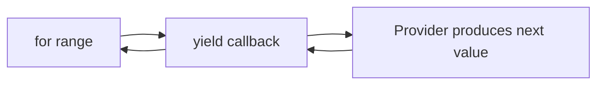
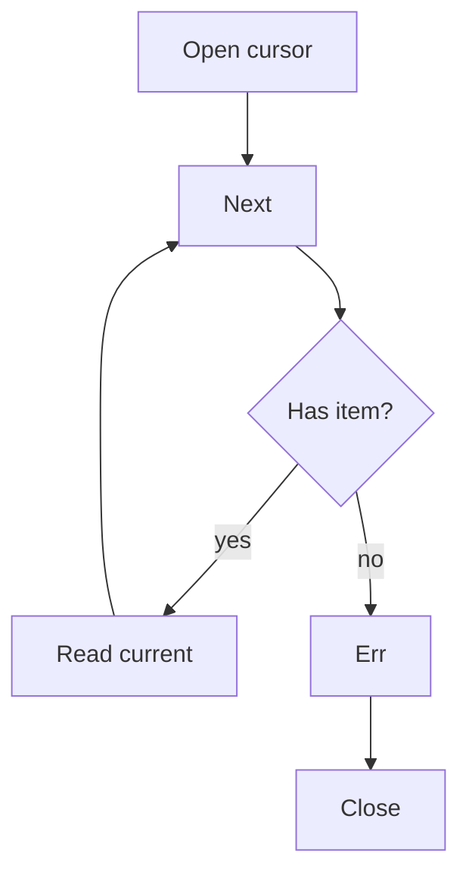
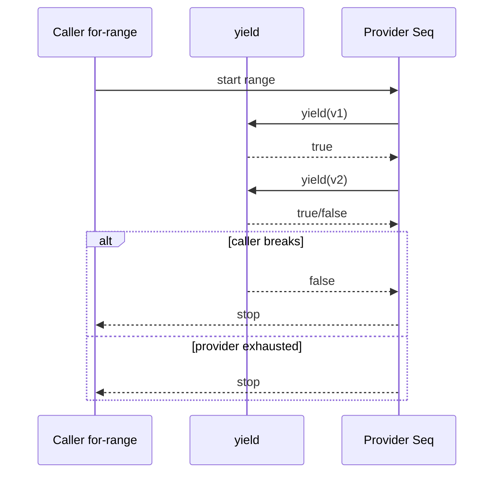
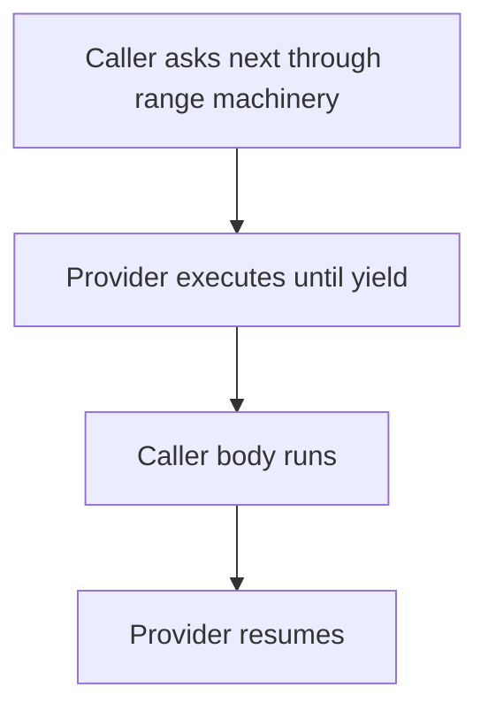

# learn-go-composition-oop-functional-reflection-codegen-modules-part-014.md

# Part 014 — Iterator-Style Design, Lazy Sequence, dan API Ergonomics Modern Go

> Seri: `learn-go-composition-oop-functional-reflection-codegen-modules`  
> Untuk: Java software engineer / tech lead yang ingin membangun keluwesan desain Go tingkat senior+  
> Fokus part ini: iterator-style API, lazy sequence, `iter.Seq`, `iter.Seq2`, `range` over function, ownership, cancellation, error, resource lifecycle, dan trade-off desain API traversal modern Go.

---

## 0. Posisi Part Ini Dalam Seri

Pada part sebelumnya kita sudah membahas:

- function sebagai first-class value,
- closure,
- strategy,
- functional options,
- middleware,
- interceptor,
- higher-order API design.

Part ini adalah kelanjutan natural dari tema tersebut. Kita akan masuk ke desain traversal data.

Di Java, Anda mungkin terbiasa dengan:

- `Iterator<T>`,
- `Iterable<T>`,
- `Stream<T>`,
- `Spliterator<T>`,
- `ResultSet`,
- reactive stream,
- callback visitor,
- repository returning `List<T>`.

Di Go, desain traversal historically lebih sederhana:

- `for i := range slice`,
- `for k, v := range map`,
- `bufio.Scanner`,
- `sql.Rows`,
- channel stream,
- callback visitor,
- pagination function,
- explicit cursor object.

Sejak Go 1.23, bahasa Go mendukung **range over function types**, dan standard library memiliki package `iter` dengan definisi `Seq` dan `Seq2`. Ini membuat desain iterator di Go lebih formal, lebih idiomatis, dan lebih mudah dikomposisi tanpa membuat framework berat.

Namun ini juga membawa jebakan baru: tidak semua traversal harus dibuat iterator. Slice kadang lebih benar. Cursor object kadang lebih aman. Channel kadang salah. Callback kadang cukup. Code generation kadang lebih stabil daripada reflection-based iterator.

Part ini bertujuan membangun judgement tersebut.

---

## 1. Learning Objectives

Setelah menyelesaikan part ini, Anda harus mampu:

1. Menjelaskan mental model `iter.Seq` dan `iter.Seq2` sebagai push iterator.
2. Membedakan eager collection, lazy sequence, cursor, channel stream, dan callback visitor.
3. Mendesain API traversal yang jelas ownership-nya.
4. Menentukan kapan iterator lebih baik daripada `[]T`.
5. Menentukan kapan iterator lebih buruk daripada `[]T`.
6. Mendesain iterator yang aman terhadap early stop.
7. Mendesain iterator yang bisa membawa error tanpa mengaburkan control flow.
8. Mendesain iterator yang memperhitungkan resource lifecycle seperti file, DB rows, network stream, lock, dan transaction.
9. Menghindari closure capture bug, allocation leak, goroutine leak, dan hidden blocking.
10. Menghubungkan iterator dengan package boundary, interface, generics, reflection, code generation, dan large-scale API compatibility.

---

## 2. Baseline Faktual

Beberapa baseline resmi yang relevan:

- Go 1.23 memperkenalkan kemampuan `for range` atas function iterator seperti `func(func(K) bool)` untuk user-defined iterators.
- Package standard `iter` mendefinisikan bentuk dasar iterator sequence, terutama `Seq[V]` dan `Seq2[K, V]`.
- Blog resmi Go menjelaskan model ini sebagai **standard push iterator**.
- Go spec mendefinisikan aturan `range` termasuk range expression atas function.
- Dokumentasi package `iter` menjelaskan iterator sebagai function yang mengoper successive values ke callback `yield`.

Referensi resmi:

- https://go.dev/blog/range-functions
- https://pkg.go.dev/iter
- https://go.dev/ref/spec
- https://go.dev/doc/go1.23
- https://go.dev/doc/go1.26

---

## 3. Problem Framing: Kenapa Iterator Design Penting?

Traversal API terlihat sederhana:

```go
func ListCases(ctx context.Context) ([]Case, error)
```

Tetapi pada sistem produksi, pertanyaan sebenarnya jauh lebih banyak:

- Apakah hasil bisa jutaan row?
- Apakah caller butuh semua data atau hanya sebagian?
- Apakah traversal harus cancellable?
- Apakah error bisa terjadi di tengah traversal?
- Apakah data perlu streaming dari DB?
- Apakah object yang dikembalikan safe untuk disimpan?
- Apakah function menahan lock selama traversal?
- Apakah traversal membuka file/socket/transaction?
- Apakah urutan hasil deterministic?
- Apakah caller boleh stop lebih awal?
- Apakah data snapshot-consistent?
- Apakah traversal repeatable?
- Apakah sequence lazy atau materialized?
- Apakah operation idempotent?
- Apakah traversal boleh concurrent?

Di sistem kecil, `[]T` cukup. Di sistem besar, return `[]T` untuk semua traversal sering menjadi sumber masalah:

- memory spike,
- long DB transaction,
- timeout,
- GC pressure,
- hidden latency,
- inability to stop early,
- impossible pagination,
- leak abstraction dari persistence ke service,
- ambiguous ownership.

Iterator-style API adalah salah satu alat untuk mengontrol masalah tersebut.

Tetapi iterator juga bisa menjadi over-engineering jika digunakan untuk data kecil, stable, dan murah.

---

## 4. Mental Model Utama

### 4.1 Eager collection

Eager collection berarti semua data dikumpulkan dulu sebelum caller memproses.

```go
func ListUsers(ctx context.Context) ([]User, error)
```

Model:

```mermaid
flowchart LR
    A[Provider] --> B[Load all]
    B --> C[[]User]
    C --> D[Caller loops]
```

Kelebihan:

- sederhana,
- mudah dites,
- error muncul sebelum loop,
- caller bebas sorting/filtering,
- data bisa dipakai berkali-kali.

Kelemahan:

- memory proportional terhadap jumlah data,
- latency sebelum item pertama tinggi,
- tidak natural untuk early stop,
- tidak cocok untuk stream besar,
- bisa menyembunyikan query mahal.

### 4.2 Lazy sequence

Lazy sequence berarti item diberikan satu per satu saat caller melakukan traversal.

Dengan `iter.Seq[T]`:

```go
func AllCases() iter.Seq[Case]
```

Caller:

```go
for c := range store.AllCases() {
    if c.IsEscalated() {
        break
    }
}
```

Model:



Kelebihan:

- bisa lazy,
- bisa stop early,
- tidak perlu materialize semua data,
- cocok untuk API traversal internal,
- lebih composable daripada ad-hoc callback.

Kelemahan:

- error handling lebih tricky,
- resource lifecycle harus jelas,
- closure allocation bisa muncul,
- tidak semua caller familiar,
- repeatability harus dijelaskan,
- blocking behavior bisa tersembunyi.

### 4.3 Cursor object

Cursor object berarti traversal punya state eksplisit.

```go
rows, err := repo.QueryCases(ctx, q)
if err != nil {
    return err
}
defer rows.Close()

for rows.Next() {
    c := rows.Case()
    // process
}
if err := rows.Err(); err != nil {
    return err
}
```

Model:



Kelebihan:

- resource lifecycle eksplisit,
- error model familiar,
- cocok untuk DB/network/file,
- caller bisa defer close,
- bisa expose scanning API.

Kelemahan:

- lebih verbose,
- caller bisa lupa close,
- state machine lebih banyak,
- harder to compose.

### 4.4 Channel stream

```go
func StreamCases(ctx context.Context) (<-chan Case, <-chan error)
```

Channel sering tampak attractive, tetapi tidak selalu benar.

Kelebihan:

- cocok jika producer benar-benar concurrent,
- natural untuk fan-in/fan-out,
- backpressure lewat blocking send,
- cancellation bisa via context.

Kelemahan:

- goroutine lifecycle risk,
- error channel awkward,
- early stop bisa menyebabkan goroutine leak,
- ordering dan close semantics harus jelas,
- lebih sulit untuk simple synchronous traversal.

Rule of thumb:

> Jangan memakai channel hanya karena ingin “streaming”. Pakai channel bila ada concurrency boundary nyata.

### 4.5 Callback visitor

```go
func WalkCases(ctx context.Context, fn func(Case) bool) error
```

Ini mirip push iterator manual.

Kelebihan:

- explicit error return,
- early stop via bool,
- bisa sangat jelas untuk one-off traversal.

Kelemahan:

- tidak senatural `for range`,
- komposisi antar traversal kurang rapi,
- pattern berbeda-beda antar package.

`iter.Seq` bisa dianggap sebagai standarisasi bentuk callback visitor.

---

## 5. `iter.Seq` dan `iter.Seq2`

Package `iter` mendefinisikan bentuk dasar:

```go
package iter

type Seq[V any] func(yield func(V) bool)
type Seq2[K, V any] func(yield func(K, V) bool)
```

Interpretasi:

- `Seq[V]` adalah sequence nilai `V`.
- Provider memanggil `yield(v)` untuk setiap item.
- Jika `yield` mengembalikan `false`, provider harus berhenti.
- Caller bisa memakai `for v := range seq`.
- `Seq2[K,V]` dipakai untuk pasangan nilai seperti key/value, index/value, atau name/value.

Contoh sederhana:

```go
func Numbers(n int) iter.Seq[int] {
    return func(yield func(int) bool) {
        for i := 0; i < n; i++ {
            if !yield(i) {
                return
            }
        }
    }
}
```

Caller:

```go
for n := range Numbers(10) {
    if n == 5 {
        break
    }
    fmt.Println(n)
}
```

Yang penting: `break` dari caller menyebabkan `yield` mengembalikan `false` ke iterator function.

---

## 6. Push Iterator vs Pull Iterator

### 6.1 Push iterator

`iter.Seq` adalah push iterator.

Provider mengontrol loop dan “mendorong” value ke caller lewat `yield`.



### 6.2 Pull iterator

Pull iterator biasanya seperti:

```go
type Iterator[T any] interface {
    Next() bool
    Value() T
    Err() error
    Close() error
}
```

Caller menarik item satu per satu.

```go
for it.Next() {
    v := it.Value()
}
if err := it.Err(); err != nil {
    return err
}
```

### 6.3 Mana yang lebih baik?

Tidak ada jawaban tunggal.

| Situasi | Lebih cocok |
|---|---|
| Traversal in-memory ringan | `iter.Seq` atau `[]T` |
| Data kecil dan sering dipakai ulang | `[]T` |
| DB rows/file/network dengan close wajib | cursor object atau callback dengan cleanup internal |
| Need composability filter/map/take | `iter.Seq` |
| Need explicit error after traversal | cursor object atau `Seq2[T,error]` carefully |
| Concurrent producer-consumer | channel |
| Public API untuk engineer umum | `[]T` atau cursor, tergantung scale |
| Internal package traversal | `iter.Seq` sangat cocok |

---

## 7. Java Translation: Dari `Iterator`, `Stream`, dan `ResultSet` ke Go

### 7.1 Java `Iterator<T>`

Java:

```java
Iterator<Case> it = repository.findCases(query);
while (it.hasNext()) {
    Case c = it.next();
}
```

Go equivalent bisa berupa:

```go
for c := range repo.Cases(query) {
    // use c
}
```

Tetapi berbeda secara mental:

- Java iterator biasanya pull-based object.
- Go `iter.Seq` function adalah push-based.
- Java interface implementation eksplisit nominal-ish by declaration.
- Go sequence adalah function type, bukan class object.

### 7.2 Java `Stream<T>`

Java:

```java
repository.streamCases(query)
    .filter(Case::isOpen)
    .map(CaseSummary::from)
    .limit(100)
    .toList();
```

Go tidak mendorong fluent chain berat sebagai default. Go biasanya lebih eksplisit:

```go
var out []CaseSummary
for c := range repo.Cases(query) {
    if !c.IsOpen() {
        continue
    }
    out = append(out, NewCaseSummary(c))
    if len(out) == 100 {
        break
    }
}
```

Ini bukan kurang modern. Ini intentional: control flow, error, allocation, dan early stop terlihat.

Anda bisa membuat combinator, tetapi harus hati-hati agar tidak menjadi Java Stream clone yang tidak cocok dengan Go.

### 7.3 Java `ResultSet`

Java:

```java
try (ResultSet rs = stmt.executeQuery()) {
    while (rs.next()) {
        // scan
    }
}
```

Go idiom serupa:

```go
rows, err := db.QueryContext(ctx, query)
if err != nil {
    return err
}
defer rows.Close()

for rows.Next() {
    var c Case
    if err := rows.Scan(&c.ID, &c.Status); err != nil {
        return err
    }
}
if err := rows.Err(); err != nil {
    return err
}
```

Untuk DB rows, cursor object tetap sangat kuat karena resource lifecycle eksplisit.

---

## 8. Prinsip Desain Iterator Production-Grade

### 8.1 Jangan sembunyikan biaya besar

Bad:

```go
func (r *Repo) Cases() iter.Seq[Case] {
    return func(yield func(Case) bool) {
        cases, _ := r.loadAllCases() // hidden eager load
        for _, c := range cases {
            if !yield(c) {
                return
            }
        }
    }
}
```

Masalah:

- API terlihat lazy padahal eager.
- error dibuang.
- memory spike tersembunyi.

Better jika memang eager:

```go
func (r *Repo) ListCases(ctx context.Context) ([]Case, error) {
    return r.loadAllCases(ctx)
}
```

Atau jika lazy:

```go
func (r *Repo) WalkCases(ctx context.Context, fn func(Case) bool) error {
    rows, err := r.db.QueryContext(ctx, `select id, status from cases`)
    if err != nil {
        return err
    }
    defer rows.Close()

    for rows.Next() {
        var c Case
        if err := rows.Scan(&c.ID, &c.Status); err != nil {
            return err
        }
        if !fn(c) {
            return nil
        }
    }
    return rows.Err()
}
```

### 8.2 Early stop harus dihormati

Bad:

```go
func All(items []Item) iter.Seq[Item] {
    return func(yield func(Item) bool) {
        for _, item := range items {
            yield(item) // ignores false
        }
    }
}
```

Jika caller `break`, provider tetap melanjutkan. Untuk data kecil ini mungkin tidak terlihat. Untuk stream besar ini fatal.

Good:

```go
func All(items []Item) iter.Seq[Item] {
    return func(yield func(Item) bool) {
        for _, item := range items {
            if !yield(item) {
                return
            }
        }
    }
}
```

Invariant:

> Setiap call ke `yield` harus dicek. Jika `yield` return false, iterator harus berhenti secepat mungkin.

### 8.3 Resource lifecycle harus deterministik

Jika iterator membuka resource, pastikan resource ditutup saat:

- sequence habis,
- caller break early,
- error terjadi,
- panic terjadi jika Anda memilih recover boundary tertentu.

Contoh internal callback lebih aman:

```go
func (r *Repo) WalkCases(ctx context.Context, fn func(Case) bool) error {
    rows, err := r.db.QueryContext(ctx, `select id, status from cases`)
    if err != nil {
        return err
    }
    defer rows.Close()

    for rows.Next() {
        var c Case
        if err := rows.Scan(&c.ID, &c.Status); err != nil {
            return err
        }
        if !fn(c) {
            return nil
        }
    }
    return rows.Err()
}
```

Jika ingin expose `iter.Seq`, error handling menjadi pertanyaan besar.

### 8.4 Ownership value harus jelas

Apakah value yang di-yield:

- copy aman?
- pointer ke internal mutable object?
- buffer reused?
- object valid hanya sampai next iteration?
- object boleh disimpan caller?

Bad:

```go
func Lines(scanner *bufio.Scanner) iter.Seq[[]byte] {
    return func(yield func([]byte) bool) {
        for scanner.Scan() {
            if !yield(scanner.Bytes()) { // buffer may be reused
                return
            }
        }
    }
}
```

Jika caller menyimpan `[]byte`, isi bisa berubah.

Better jika ingin safe ownership:

```go
func Lines(scanner *bufio.Scanner) iter.Seq[[]byte] {
    return func(yield func([]byte) bool) {
        for scanner.Scan() {
            b := append([]byte(nil), scanner.Bytes()...)
            if !yield(b) {
                return
            }
        }
    }
}
```

Atau dokumentasikan borrowing:

```go
// BorrowedLines yields byte slices valid only until the next iteration.
func BorrowedLines(scanner *bufio.Scanner) iter.Seq[[]byte]
```

Naming harus jujur.

### 8.5 Jangan menyembunyikan blocking I/O dalam iterator tanpa context

Bad:

```go
func (c *Client) Events() iter.Seq[Event]
```

Apakah ini network call? Blocking? Bisa cancel?

Better:

```go
func (c *Client) Events(ctx context.Context) iter.Seq[Event]
```

Tetapi error tetap perlu model.

Lebih explicit:

```go
func (c *Client) WalkEvents(ctx context.Context, fn func(Event) bool) error
```

Atau cursor:

```go
stream, err := c.OpenEventStream(ctx)
```

---

## 9. Error Handling Dalam Iterator

Ini bagian paling sensitif.

`iter.Seq[T]` hanya membawa `T`, tidak membawa `error` secara built-in.

Ada beberapa opsi.

### 9.1 Opsi A — Callback visitor dengan error return

```go
func (r *Repo) WalkCases(ctx context.Context, fn func(Case) bool) error
```

Kelebihan:

- error return natural,
- cleanup mudah,
- caller bisa stop via bool,
- cocok untuk resourceful traversal.

Kelemahan:

- tidak bisa langsung `for range`,
- tidak standar `iter.Seq`.

### 9.2 Opsi B — `Seq2[T, error]`

```go
func (r *Repo) Cases(ctx context.Context) iter.Seq2[Case, error]
```

Caller:

```go
for c, err := range repo.Cases(ctx) {
    if err != nil {
        return err
    }
    use(c)
}
```

Kelebihan:

- tetap `for range`,
- error terlihat di loop.

Kelemahan:

- setiap iteration harus cek error,
- bagaimana final error tanpa item?
- apakah setelah err iterator berhenti?
- mudah disalahgunakan.

Jika memakai ini, kontrak harus ketat:

```go
// Cases yields either a Case with nil error or a zero Case with non-nil error.
// After yielding a non-nil error, the sequence stops.
func (r *Repo) Cases(ctx context.Context) iter.Seq2[Case, error]
```

### 9.3 Opsi C — Value wrapper

```go
type Result[T any] struct {
    Value T
    Err   error
}

func (r *Repo) Cases(ctx context.Context) iter.Seq[Result[Case]]
```

Kelebihan:

- explicit single yielded type,
- bisa dipakai di combinator.

Kelemahan:

- mirip `Either`/`Try` pattern,
- Go code bisa terasa tidak idiomatis jika overused,
- caller bisa lupa cek `Err`.

### 9.4 Opsi D — Iterator object dengan `Err()`

```go
type CaseIterator interface {
    Next() bool
    Case() Case
    Err() error
    Close() error
}
```

Kelebihan:

- familiar untuk DB/file,
- error final jelas,
- close jelas.

Kelemahan:

- lebih verbose,
- tidak langsung `range`.

### 9.5 Opsi E — Panic

Jangan gunakan panic untuk error normal traversal.

Panic hanya untuk programmer error atau invariant violation, bukan I/O error.

---

## 10. Decision Matrix Error Model

| Traversal | Error bisa terjadi saat loop? | Resourceful? | Recommended API |
|---|---:|---:|---|
| In-memory slice | Tidak | Tidak | `iter.Seq[T]` atau `[]T` |
| In-memory tree/map | Tidak normal | Tidak | `iter.Seq[T]` / `Seq2[K,V]` |
| DB query | Ya | Ya | cursor atau `WalkX(ctx, fn) error` |
| File scanner | Ya | Ya | cursor/scanner wrapper atau `WalkLines(ctx, fn) error` |
| Network event stream | Ya | Ya | stream object/channel with context, carefully |
| Paginated API | Ya | Maybe | `WalkPages(ctx, fn) error` atau cursor |
| Codegen metadata | Tidak setelah build | Tidak | `iter.Seq[T]` |
| Reflection traversal | Bisa panic/error | Maybe | explicit result/error model |

---

## 11. Iterator Combinators: Useful atau Over-Abstraction?

Karena `iter.Seq` adalah function, kita bisa membuat combinator.

### 11.1 Filter

```go
func Filter[T any](seq iter.Seq[T], keep func(T) bool) iter.Seq[T] {
    return func(yield func(T) bool) {
        for v := range seq {
            if !keep(v) {
                continue
            }
            if !yield(v) {
                return
            }
        }
    }
}
```

### 11.2 Map

```go
func Map[A, B any](seq iter.Seq[A], f func(A) B) iter.Seq[B] {
    return func(yield func(B) bool) {
        for a := range seq {
            if !yield(f(a)) {
                return
            }
        }
    }
}
```

### 11.3 Take

```go
func Take[T any](seq iter.Seq[T], n int) iter.Seq[T] {
    return func(yield func(T) bool) {
        if n <= 0 {
            return
        }
        count := 0
        for v := range seq {
            if count >= n {
                return
            }
            count++
            if !yield(v) {
                return
            }
        }
    }
}
```

### 11.4 Collect

```go
func Collect[T any](seq iter.Seq[T]) []T {
    var out []T
    for v := range seq {
        out = append(out, v)
    }
    return out
}
```

### 11.5 Bahaya combinator berlebihan

Code berikut bisa terlihat elegan:

```go
out := Collect(Take(Map(Filter(repo.Cases(), isOpen), summarize), 100))
```

Tetapi di Go production code, versi eksplisit kadang lebih mudah direview:

```go
var out []CaseSummary
for c := range repo.Cases() {
    if !isOpen(c) {
        continue
    }
    out = append(out, summarize(c))
    if len(out) == 100 {
        break
    }
}
```

Kuncinya bukan anti-combinator. Kuncinya adalah readability dan observability.

Gunakan combinator bila:

- package memang menyediakan sequence utilities,
- operasi pure dan murah,
- error/resource lifecycle tidak rumit,
- profiling tidak menunjukkan overhead signifikan,
- tim memahami pattern-nya.

Hindari combinator bila:

- logic bisnis perlu auditability,
- error/context/retry/metric harus eksplisit,
- traversal menyentuh DB/network,
- chain terlalu panjang,
- debugging jadi sulit.

---

## 12. Lazy Sequence dan Backpressure

Lazy sequence bukan otomatis backpressure seperti reactive stream.

Pada `iter.Seq`, caller dan provider berada pada call stack yang sama kecuali provider membuat goroutine sendiri.

Model synchronous:



Ini berarti:

- tidak ada queue default,
- tidak ada buffering default,
- tidak ada goroutine default,
- producer tidak bisa mendahului consumer,
- backpressure natural lewat synchronous call.

Ini bagus untuk traversal synchronous.

Jika Anda membuat goroutine di iterator, Anda mengubah model secara drastis.

Bad:

```go
func AsyncEvents(ctx context.Context) iter.Seq[Event] {
    return func(yield func(Event) bool) {
        ch := make(chan Event)
        go func() {
            defer close(ch)
            produce(ctx, ch)
        }()
        for e := range ch {
            if !yield(e) {
                return // producer may still block sending
            }
        }
    }
}
```

Risk:

- goroutine leak saat caller break,
- producer blocked karena channel tidak dibaca,
- context cancellation tidak dijamin,
- error hilang.

Better jika memang async:

```go
func AsyncEvents(ctx context.Context) (<-chan Event, <-chan error)
```

Atau cursor/stream object dengan `Close`.

---

## 13. Resource Lifecycle Pattern

### 13.1 In-memory safe sequence

```go
type CaseIndex struct {
    cases []Case
}

func (idx *CaseIndex) All() iter.Seq[Case] {
    return func(yield func(Case) bool) {
        for _, c := range idx.cases {
            if !yield(c) {
                return
            }
        }
    }
}
```

Potential issue: if `idx.cases` is mutable concurrently, sequence can race.

Safer options:

- lock during iteration,
- snapshot copy,
- immutable index,
- document not concurrent-safe.

### 13.2 Lock during iteration

```go
type CaseIndex struct {
    mu    sync.RWMutex
    cases []Case
}

func (idx *CaseIndex) AllLocked() iter.Seq[Case] {
    return func(yield func(Case) bool) {
        idx.mu.RLock()
        defer idx.mu.RUnlock()

        for _, c := range idx.cases {
            if !yield(c) {
                return
            }
        }
    }
}
```

Problem:

- caller body runs while lock is held.
- if caller calls back into index, deadlock risk.
- long iteration blocks writers.

### 13.3 Snapshot before iteration

```go
func (idx *CaseIndex) Snapshot() iter.Seq[Case] {
    idx.mu.RLock()
    snapshot := append([]Case(nil), idx.cases...)
    idx.mu.RUnlock()

    return func(yield func(Case) bool) {
        for _, c := range snapshot {
            if !yield(c) {
                return
            }
        }
    }
}
```

Trade-off:

- memory copy cost,
- but no lock during caller body,
- stable view,
- safer API.

For production, prefer snapshot for public traversal unless copying is too expensive.

### 13.4 Borrowed iterator with strict docs

```go
// BorrowedAll yields cases while holding idx's read lock.
// The caller must not call methods that may acquire idx's write lock from inside the loop.
func (idx *CaseIndex) BorrowedAll() iter.Seq[Case]
```

This is valid for internal performance-sensitive package, but risky as public API.

---

## 14. Iterator dan Concurrency Safety

Iterator API harus menjawab:

1. Apakah sequence boleh di-range lebih dari sekali?
2. Apakah sequence boleh dipakai concurrent oleh dua goroutine?
3. Apakah yielded value boleh dimutasi?
4. Apakah provider data structure boleh berubah saat iteration?
5. Apakah order deterministic?

Contoh repeatability ambiguity:

```go
seq := repo.Cases(ctx)
for c := range seq { ... }
for c := range seq { ... }
```

Untuk in-memory sequence, mungkin bisa.
Untuk network stream, mungkin tidak.
Untuk DB cursor, biasanya tidak.

Kontrak perlu jelas:

```go
// Cases returns a repeatable in-memory snapshot sequence.
func (s *Store) Cases() iter.Seq[Case]
```

atau:

```go
// Events returns a one-shot sequence. It must be ranged at most once.
func (s *Stream) Events(ctx context.Context) iter.Seq[Event]
```

Namun `iter.Seq` sendiri tidak mengekspresikan one-shot vs repeatable. Itu harus didokumentasikan atau jangan expose `Seq` untuk one-shot resourceful stream.

---

## 15. Iterator Ordering Semantics

Ordering adalah bagian kontrak.

Bad docs:

```go
func (s *Store) Cases() iter.Seq[Case]
```

Better:

```go
// Cases yields cases in ascending CaseID order.
func (s *Store) Cases() iter.Seq[Case]
```

atau:

```go
// Cases yields cases in unspecified order.
// Callers must not depend on iteration order.
func (s *Store) Cases() iter.Seq[Case]
```

Untuk map traversal, Go tidak menjamin order deterministik. Jika API mengembalikan iterator atas map dan caller butuh deterministic output, sorting harus eksplisit.

Example:

```go
func SortedKeys[K cmp.Ordered, V any](m map[K]V) iter.Seq[K] {
    keys := make([]K, 0, len(m))
    for k := range m {
        keys = append(keys, k)
    }
    slices.Sort(keys)

    return func(yield func(K) bool) {
        for _, k := range keys {
            if !yield(k) {
                return
            }
        }
    }
}
```

Trade-off:

- deterministic,
- but eager materialization of keys.

Dokumentasikan biaya.

---

## 16. Iterator Naming Guidelines

Naming harus mengkomunikasikan cost dan semantics.

| Name | Implied meaning |
|---|---|
| `All()` | usually in-memory or cheap traversal; be careful if DB/network |
| `List()` | eager materialization likely |
| `Find()` | query with filtering; may be expensive |
| `Walk()` | callback traversal, can stop, usually may return error |
| `Range()` | sequence traversal, may match Go style but sometimes vague |
| `Scan()` | streaming parse or DB-like traversal |
| `Stream()` | may imply asynchronous or I/O stream |
| `Iter()` | explicit iterator; acceptable but less domain-specific |
| `Positions()` | yields mutable position/cursor handles |
| `BorrowedX()` | yielded value has limited lifetime |
| `Snapshot()` | stable view, likely copied or versioned |

Recommended:

- Use domain language: `Cases`, `Transitions`, `Violations`, `Permissions`.
- Use cost words when necessary: `SnapshotCases`, `WalkCases`, `StreamEvents`.
- Avoid making DB/network operation look like cheap collection access.

---

## 17. API Design Patterns

### 17.1 Simple collection API

Use when data is small and cheap.

```go
func (r *Role) Permissions() []Permission {
    return append([]Permission(nil), r.permissions...)
}
```

Why copy?

- protect invariant,
- avoid caller mutating internal slice,
- ownership clear.

### 17.2 Internal iterator API

```go
func (r *Role) PermissionsSeq() iter.Seq[Permission] {
    return func(yield func(Permission) bool) {
        for _, p := range r.permissions {
            if !yield(p) {
                return
            }
        }
    }
}
```

Use if:

- avoid allocation,
- allow early stop,
- internal package users understand semantics.

### 17.3 Public snapshot sequence

```go
func (r *Role) Permissions() iter.Seq[Permission] {
    snapshot := append([]Permission(nil), r.permissions...)
    return func(yield func(Permission) bool) {
        for _, p := range snapshot {
            if !yield(p) {
                return
            }
        }
    }
}
```

This is safe but allocation occurs at call time.

### 17.4 Walk with error

```go
func (e *Engine) WalkTransitions(ctx context.Context, fn func(Transition) bool) error {
    rows, err := e.queryTransitions(ctx)
    if err != nil {
        return err
    }
    defer rows.Close()

    for rows.Next() {
        t, err := scanTransition(rows)
        if err != nil {
            return err
        }
        if !fn(t) {
            return nil
        }
    }
    return rows.Err()
}
```

This is often best for resourceful traversal.

### 17.5 Cursor for advanced caller control

```go
type TransitionCursor struct {
    rows *sql.Rows
    cur  Transition
    err  error
}

func (c *TransitionCursor) Next() bool {
    if !c.rows.Next() {
        return false
    }
    c.cur, c.err = scanTransition(c.rows)
    return c.err == nil
}

func (c *TransitionCursor) Transition() Transition { return c.cur }
func (c *TransitionCursor) Err() error {
    if c.err != nil {
        return c.err
    }
    return c.rows.Err()
}
func (c *TransitionCursor) Close() error { return c.rows.Close() }
```

Good for:

- DB-like scanning,
- callers needing manual lifecycle,
- advanced batching,
- partial reads,
- streaming from external systems.

---

## 18. Case Study: Regulatory Case Lifecycle Traversal

Suppose we model regulatory case lifecycle:

- case has activities,
- activities have transitions,
- transitions may create audit entries,
- escalation rules inspect history,
- reviewer dashboard needs recent events,
- reporting job scans millions of cases.

Naive API:

```go
func (r *Repo) ListAllCaseActivities(ctx context.Context, caseID CaseID) ([]Activity, error)
```

This is fine if per case activity is small.

But for cross-case reporting:

```go
func (r *Repo) ListAllActivities(ctx context.Context) ([]Activity, error)
```

This is dangerous.

### 18.1 Better split by use case

```go
type ActivityRepo struct { /* ... */ }

// For interactive UI; bounded by case ID.
func (r *ActivityRepo) ListByCase(ctx context.Context, id CaseID) ([]Activity, error)

// For batch/reporting; may scan many rows.
func (r *ActivityRepo) WalkByPeriod(
    ctx context.Context,
    period Period,
    fn func(Activity) bool,
) error

// For advanced processing.
func (r *ActivityRepo) OpenCursor(
    ctx context.Context,
    q ActivityQuery,
) (*ActivityCursor, error)
```

Each API communicates scale.

### 18.2 Escalation engine using iterator internally

```go
type ActivitySource interface {
    Activities(caseID CaseID) iter.Seq[Activity]
}

type EscalationEngine struct {
    rules []Rule
}

func (e *EscalationEngine) Evaluate(src ActivitySource, caseID CaseID) Decision {
    var facts Facts
    for a := range src.Activities(caseID) {
        facts.Observe(a)
        if facts.IsTerminal() {
            break
        }
    }
    return e.decide(facts)
}
```

This is fine if `Activities` is in-memory or already loaded for one case.

For DB-backed source with error:

```go
type ActivityWalker interface {
    WalkActivities(ctx context.Context, caseID CaseID, fn func(Activity) bool) error
}

func (e *EscalationEngine) Evaluate(
    ctx context.Context,
    src ActivityWalker,
    caseID CaseID,
) (Decision, error) {
    var facts Facts
    err := src.WalkActivities(ctx, caseID, func(a Activity) bool {
        facts.Observe(a)
        return !facts.IsTerminal()
    })
    if err != nil {
        return Decision{}, err
    }
    return e.decide(facts), nil
}
```

This API better reflects production failure.

---

## 19. Mermaid: Choosing Traversal API

```mermaid
flowchart TD
    A[Need to expose multiple values] --> B{Data bounded and small?}
    B -->|Yes| C{Caller needs all values?}
    C -->|Yes| D[Return []T]
    C -->|No / early stop useful| E[iter.Seq[T]]

    B -->|No| F{Error can occur during traversal?}
    F -->|No| G{Resource involved?}
    G -->|No| H[iter.Seq[T] with clear docs]
    G -->|Yes| I[Cursor or Walk(ctx, fn) error]

    F -->|Yes| J{Resource close required?}
    J -->|Yes| K[Cursor or Walk(ctx, fn) error]
    J -->|No| L[Seq2[T,error] only with strict contract]

    A --> M{Concurrency boundary needed?}
    M -->|Yes| N[Channel/stream object with context and close]
    M -->|No| O[Do not use channel]
```

---

## 20. Iterator dan Package Boundary

Iterator design harus mengikuti package ownership.

### 20.1 Provider-owned traversal

Package `casehistory` owns internal representation.

```go
package casehistory

type History struct {
    events []Event
}

func (h *History) Events() iter.Seq[Event] {
    return func(yield func(Event) bool) {
        for _, e := range h.events {
            if !yield(e) {
                return
            }
        }
    }
}
```

Caller tidak tahu `events` disimpan sebagai slice.

### 20.2 Consumer-side interface

Package `escalation` hanya butuh behavior.

```go
package escalation

type EventSource interface {
    Events() iter.Seq[casehistory.Event]
}
```

Ini sesuai prinsip part 006: interface berada dekat consumer.

### 20.3 Jangan expose internal cursor jika bukan bagian contract

Bad:

```go
type History struct {
    Events []Event
}
```

Caller bisa mutate.

Better:

```go
func (h *History) Events() iter.Seq[Event]
```

atau:

```go
func (h *History) SnapshotEvents() []Event
```

---

## 21. Iterator dan Generics

Generics membuat reusable sequence utilities possible.

### 21.1 Constraint-free utilities

```go
func Count[T any](seq iter.Seq[T]) int {
    n := 0
    for range seq {
        n++
    }
    return n
}
```

### 21.2 Ordered utilities

```go
func Min[T cmp.Ordered](seq iter.Seq[T]) (T, bool) {
    var min T
    ok := false
    for v := range seq {
        if !ok || v < min {
            min = v
            ok = true
        }
    }
    return min, ok
}
```

### 21.3 Comparable utilities

```go
func Contains[T comparable](seq iter.Seq[T], target T) bool {
    for v := range seq {
        if v == target {
            return true
        }
    }
    return false
}
```

### 21.4 Domain-specific constraints

```go
type Identified[ID comparable] interface {
    Identity() ID
}

func IndexByID[T Identified[ID], ID comparable](seq iter.Seq[T]) map[ID]T {
    out := make(map[ID]T)
    for v := range seq {
        out[v.Identity()] = v
    }
    return out
}
```

Use with care. Do not force domain models to implement generic constraints only for utility convenience.

---

## 22. Iterator dan Reflection

Reflection often appears when building generic traversal over struct fields.

Example:

```go
func Fields(v any) iter.Seq2[string, any] {
    return func(yield func(string, any) bool) {
        rv := reflect.ValueOf(v)
        if rv.Kind() == reflect.Pointer {
            rv = rv.Elem()
        }
        if rv.Kind() != reflect.Struct {
            return
        }

        rt := rv.Type()
        for i := 0; i < rv.NumField(); i++ {
            field := rt.Field(i)
            value := rv.Field(i)
            if !value.CanInterface() {
                continue
            }
            if !yield(field.Name, value.Interface()) {
                return
            }
        }
    }
}
```

This is useful for:

- diagnostic tooling,
- generic mapper,
- validation prototype,
- schema extraction.

But for production hot path:

- cache metadata,
- avoid repeated `Interface()` allocations,
- avoid panic on unexported fields,
- consider code generation.

Reflection iterator is often a bridge, not final architecture.

---

## 23. Iterator dan Code Generation

For DTO mapping, validation, enum traversal, route registration, permission registry, code generation can produce iterator-like APIs without runtime reflection.

Example generated enum values:

```go
// Code generated by go generate; DO NOT EDIT.

func AllCaseStatuses() iter.Seq[CaseStatus] {
    return func(yield func(CaseStatus) bool) {
        for _, v := range [...]CaseStatus{
            CaseStatusDraft,
            CaseStatusSubmitted,
            CaseStatusUnderReview,
            CaseStatusApproved,
            CaseStatusRejected,
        } {
            if !yield(v) {
                return
            }
        }
    }
}
```

Alternative eager:

```go
func CaseStatuses() []CaseStatus {
    return []CaseStatus{
        CaseStatusDraft,
        CaseStatusSubmitted,
        CaseStatusUnderReview,
        CaseStatusApproved,
        CaseStatusRejected,
    }
}
```

Which one is better?

For five statuses, `[]CaseStatus` is simpler.
For large generated registry, `iter.Seq` may avoid copies.

Decision should be based on API ergonomics and cost, not novelty.

---

## 24. Iterator dan Module/API Compatibility

Public iterator API is an exported contract.

Changing:

```go
func (s *Store) Cases() []Case
```

to:

```go
func (s *Store) Cases() iter.Seq[Case]
```

is a breaking change.

Changing:

```go
func (s *Store) WalkCases(func(Case) bool)
```

to:

```go
func (s *Store) WalkCases(context.Context, func(Case) bool) error
```

is also breaking.

Therefore, choose traversal shape carefully before public v1.

### 24.1 Compatibility-safe evolution

You can add a new method:

```go
func (s *Store) ListCases(ctx context.Context) ([]Case, error)
func (s *Store) WalkCases(ctx context.Context, fn func(Case) bool) error
```

or:

```go
func (s *Store) Cases() iter.Seq[Case]
func (s *Store) SnapshotCases() []Case
```

Avoid replacing existing semantics.

### 24.2 Interface compatibility

Adding method to interface breaks all implementers.

Bad:

```go
type CaseSource interface {
    Cases() iter.Seq[Case]
    SnapshotCases() []Case // added later, breaking
}
```

Better split:

```go
type CaseSequencer interface {
    Cases() iter.Seq[Case]
}

type CaseSnapshotter interface {
    SnapshotCases() []Case
}
```

This follows small interface design.

---

## 25. Performance Considerations

Iterator-style APIs can reduce memory, but not always improve CPU.

### 25.1 Potential benefits

- no full slice allocation,
- early stop,
- lower peak memory,
- better latency to first item,
- streaming-friendly,
- avoids intermediate collections.

### 25.2 Potential costs

- function call overhead,
- closure allocation,
- less obvious inlining,
- more complex escape behavior,
- difficult error propagation,
- hard-to-profile abstraction layers.

### 25.3 Benchmark before declaring victory

Compare:

- loop over slice,
- `iter.Seq`,
- callback visitor,
- cursor object,
- channel stream.

Example benchmark sketch:

```go
func BenchmarkSeq(b *testing.B) {
    data := makeCases(1000)
    seq := func(yield func(Case) bool) {
        for _, c := range data {
            if !yield(c) {
                return
            }
        }
    }

    for b.Loop() {
        count := 0
        for c := range seq {
            if c.Open {
                count++
            }
        }
        sink = count
    }
}
```

In Go 1.24+, `testing.B.Loop` is available and helps avoid common benchmark mistakes. For this series, we care less about memorizing benchmark mechanics and more about requiring measurement before claiming iterator is faster.

---

## 26. Anti-Patterns

### 26.1 Iterator for everything

Bad:

```go
func (u User) NameChars() iter.Seq[rune]
```

Unless there is a real need, this is overkill.

### 26.2 Hiding database query in cheap-looking method

Bad:

```go
func (s *Service) Cases() iter.Seq[Case]
```

If this hits DB, name and error model are misleading.

### 26.3 Ignoring `yield` result

Already covered, but important enough to repeat:

```go
yield(v) // bad unless deliberately impossible to stop, which is almost never
```

### 26.4 Yielding borrowed mutable buffers without docs

Bad:

```go
yield(scanner.Bytes())
```

unless named/documented as borrowed.

### 26.5 Holding locks while calling caller code

Risky:

```go
mu.RLock()
defer mu.RUnlock()
yield(v) // caller code under lock
```

May be acceptable internally, but dangerous public API.

### 26.6 Channel when no concurrency boundary exists

Bad:

```go
func Values() <-chan Value
```

for simple in-memory list.

### 26.7 Fluent stream clone

Bad Go design:

```go
repo.Cases().Filter(...).Map(...).Distinct().Sorted().Limit(10).Collect()
```

Not always bad, but often hides cost and error.

### 26.8 Sequence with hidden goroutine

Bad unless carefully managed:

```go
func Events() iter.Seq[Event] { go produce(...) }
```

### 26.9 Ambiguous one-shot sequence

Bad:

```go
seq := stream.Events()
for e := range seq { ... }
for e := range seq { ... } // what happens?
```

If one-shot, prefer cursor/stream object.

---

## 27. Production Checklist

Before exposing traversal API, answer these.

### 27.1 Shape

- Is data bounded?
- Is traversal lazy or eager?
- Is first item available before all data is loaded?
- Is early stop useful?
- Is repeat iteration supported?

### 27.2 Error

- Can error occur before traversal?
- Can error occur during traversal?
- Can error occur after last item?
- How does caller observe error?
- Is error ignored accidentally possible?

### 27.3 Resource

- Does traversal open file, DB rows, socket, transaction, lock?
- Who closes it?
- What happens on early break?
- What happens on panic?
- Can context cancel it?

### 27.4 Ownership

- Is yielded value copied?
- Is yielded value borrowed?
- Can caller mutate it?
- Can caller store it?
- Is buffer reused?

### 27.5 Concurrency

- Is API goroutine-safe?
- Can caller range from multiple goroutines?
- Does iterator hold locks while yielding?
- Is underlying collection mutable during iteration?

### 27.6 Ordering

- Is order deterministic?
- Is order sorted?
- Is order unspecified?
- Does order depend on map iteration?

### 27.7 Compatibility

- Is this public API stable?
- Would changing traversal shape be breaking?
- Should you provide both eager and streaming APIs?
- Should interface be split?

---

## 28. Design Heuristics

### Heuristic 1: Return `[]T` when data is small, bounded, and caller likely needs all of it.

Example:

```go
func (p Policy) Rules() []Rule
```

### Heuristic 2: Use `iter.Seq[T]` for cheap, synchronous, mostly error-free traversal.

Example:

```go
func (g *Graph) Nodes() iter.Seq[Node]
```

### Heuristic 3: Use `Walk(ctx, fn) error` for resourceful traversal with possible error.

Example:

```go
func (r *Repo) WalkCases(ctx context.Context, q Query, fn func(Case) bool) error
```

### Heuristic 4: Use cursor object when caller must control lifecycle.

Example:

```go
cursor, err := repo.OpenCaseCursor(ctx, q)
```

### Heuristic 5: Use channel only for actual concurrent production.

Example:

```go
func Subscribe(ctx context.Context) (<-chan Event, <-chan error)
```

### Heuristic 6: Prefer explicit loops for business-critical logic.

Iterator combinators are fine for generic utilities. In audited business workflows, explicit loop often wins.

---

## 29. Large-Scale Engineering Implications

In a large Go codebase, traversal APIs become architecture.

Bad architecture smell:

```go
// Every repository returns []T, even for unbounded data.
ListAllUsers(ctx) ([]User, error)
ListAllCases(ctx) ([]Case, error)
ListAllAuditEntries(ctx) ([]AuditEntry, error)
ListAllEvents(ctx) ([]Event, error)
```

This invites memory and latency incidents.

Better API taxonomy:

```go
// Bounded UI queries.
ListCases(ctx, filter, page) ([]CaseSummary, PageInfo, error)

// Batch processing.
WalkCases(ctx, filter, func(Case) bool) error

// Advanced streaming.
OpenCaseCursor(ctx, filter) (*CaseCursor, error)

// In-memory domain aggregate.
caseHistory.Events() iter.Seq[Event]

// Snapshot for safe external usage.
caseHistory.SnapshotEvents() []Event
```

This is not just code style. It is system safety.

---

## 30. Review Examples

### Example A: Bad repository API

```go
type CaseRepository interface {
    Cases() iter.Seq[Case]
}
```

Questions:

- Does it hit DB?
- Where is context?
- Where is error?
- Is it bounded?
- Is it repeatable?

Better:

```go
type CaseRepository interface {
    ListByOwner(ctx context.Context, owner UserID, page PageRequest) ([]CaseSummary, PageInfo, error)
    WalkByStatus(ctx context.Context, status CaseStatus, fn func(Case) bool) error
}
```

### Example B: Bad in-memory API

```go
type Policy struct {
    Rules []Rule
}
```

Problem: exported mutable field breaks invariant.

Better:

```go
type Policy struct {
    rules []Rule
}

func (p Policy) Rules() iter.Seq[Rule] {
    return func(yield func(Rule) bool) {
        for _, r := range p.rules {
            if !yield(r) {
                return
            }
        }
    }
}
```

or if caller needs slice:

```go
func (p Policy) SnapshotRules() []Rule {
    return append([]Rule(nil), p.rules...)
}
```

### Example C: Bad stream API

```go
func (c *Client) Events() <-chan Event
```

Questions:

- How stop?
- How receive error?
- Who closes?
- Is there goroutine per call?

Better:

```go
func (c *Client) Subscribe(ctx context.Context) (<-chan Event, <-chan error)
```

or:

```go
type Subscription interface {
    Events() <-chan Event
    Err() error
    Close() error
}
```

---

## 31. Capstone Mini Design: Audit Trail Scanner

We design an audit trail API.

Requirements:

- UI needs latest 50 audit entries for one case.
- Export job scans millions of entries by period.
- Escalation engine inspects history and stops after enough facts.
- Audit row may contain large metadata.
- DB errors can occur during scan.
- Caller must be able to cancel.

### 31.1 Wrong single API

```go
func (r *AuditRepo) Entries(ctx context.Context, q AuditQuery) ([]AuditEntry, error)
```

This forces all use cases into eager collection.

### 31.2 Better API family

```go
type AuditRepo struct { /* ... */ }

func (r *AuditRepo) ListRecentByCase(
    ctx context.Context,
    caseID CaseID,
    limit int,
) ([]AuditEntrySummary, error)

func (r *AuditRepo) WalkByPeriod(
    ctx context.Context,
    period Period,
    fn func(AuditEntry) bool,
) error

func (r *AuditRepo) WalkByCase(
    ctx context.Context,
    caseID CaseID,
    fn func(AuditEntry) bool,
) error

func (r *AuditRepo) OpenCursor(
    ctx context.Context,
    q AuditQuery,
) (*AuditCursor, error)
```

### 31.3 Domain history object

Once loaded for one case:

```go
type History struct {
    entries []AuditEntry
}

func (h History) Entries() iter.Seq[AuditEntry] {
    return func(yield func(AuditEntry) bool) {
        for _, e := range h.entries {
            if !yield(e) {
                return
            }
        }
    }
}
```

This distinction is key:

- repository traversal: resourceful, error-prone, context-aware,
- domain aggregate traversal: in-memory, error-free, sequence-friendly.

---

## 32. What Top 1% Engineers Notice

Average implementation asks:

> How do I return multiple values elegantly?

Strong implementation asks:

> What is the lifecycle, cost, consistency, ownership, and failure model of this traversal?

Top-tier design asks:

1. Is traversal bounded by business invariant?
2. If not bounded, why is eager API allowed?
3. Where does cancellation enter?
4. Can caller stop early without leaking resource?
5. Can caller accidentally ignore mid-stream error?
6. Is ordering a contract or implementation detail?
7. Is yielded data immutable, copied, borrowed, or mutable?
8. Does callback execute under lock/transaction?
9. Is the abstraction honest about I/O?
10. Can this API evolve without breaking downstream packages?

Iterator design is not about clever syntax. It is about making traversal honest.

---

## 33. Summary

Part 014 introduced iterator-style design in modern Go.

Core conclusions:

- `iter.Seq` and `iter.Seq2` provide a standard push iterator shape.
- They are excellent for synchronous, cheap, mostly error-free traversal.
- They are not automatic replacements for `[]T`, cursor object, callback visitor, or channel.
- For DB/file/network traversal, `Walk(ctx, fn) error` or cursor object is often safer.
- `yield` result must be respected.
- Resource lifecycle must handle early stop.
- Ownership of yielded values must be explicit.
- Iterator ordering must be documented.
- Public traversal API is compatibility-sensitive.
- Avoid Java Stream clone unless the domain genuinely benefits.
- Explicit loops remain a strength of Go, especially in audited business workflows.

The essential mental model:

> Traversal shape is part of system architecture. Choose `[]T`, `iter.Seq`, callback, cursor, or channel based on cost, error, lifecycle, concurrency, and ownership — not based on aesthetics.

---

## 34. Preparation for Part 015

Next part:

```text
learn-go-composition-oop-functional-reflection-codegen-modules-part-015.md
```

Topic:

```text
Reflection mental model: type vs value, kind vs type, settable/addressable, zero value, panic surface
```

Part 015 will move from function-based abstraction to runtime type inspection. We will build the reflection mental model carefully because reflection is one of the easiest places for Java engineers to import the wrong assumptions into Go.

---

## 35. References

- Go Blog — Range Over Function Types: https://go.dev/blog/range-functions
- Go package `iter`: https://pkg.go.dev/iter
- Go Language Specification: https://go.dev/ref/spec
- Go 1.23 Release Notes: https://go.dev/doc/go1.23
- Go 1.26 Release Notes: https://go.dev/doc/go1.26
- Go package `slices`: https://pkg.go.dev/slices
- Go package `maps`: https://pkg.go.dev/maps
- Go package `cmp`: https://pkg.go.dev/cmp
- Go package `database/sql`: https://pkg.go.dev/database/sql
- Go package `bufio`: https://pkg.go.dev/bufio

<!-- NAVIGATION_FOOTER -->
<div class="page-nav">
<a href="./learn-go-composition-oop-functional-reflection-codegen-modules-part-013.md">⬅️ Part 013 — Higher-Order API Design: Middleware, Interceptor, Handler Chain, Mapper, Reducer, dan Function Composition yang Tetap Go-like</a>
<a href="./index.md">📚 Kategori</a>
<a href="../../index.md">🏠 Home</a>
<a href="./learn-go-composition-oop-functional-reflection-codegen-modules-part-015.md">Part 015 — Reflection Mental Model: Type, Value, Kind, Addressability, Settability, Zero Value, dan Panic Surface ➡️</a>
</div>
