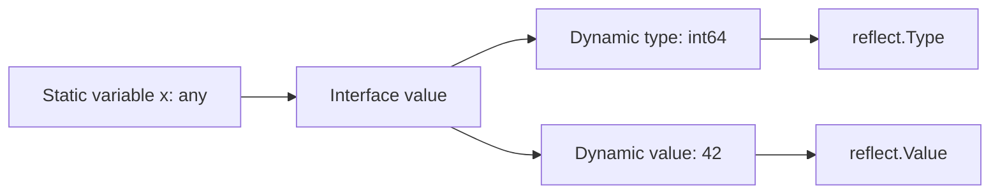
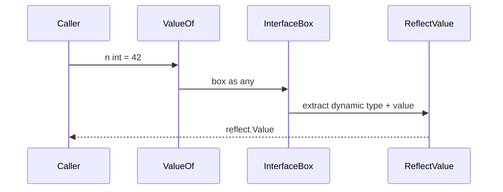
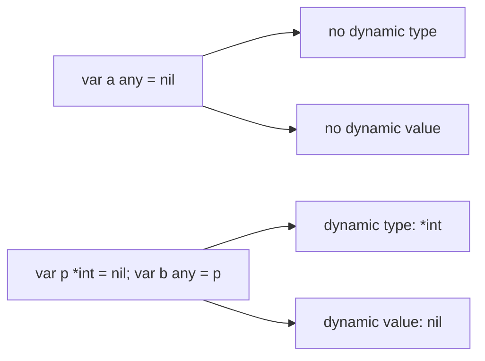
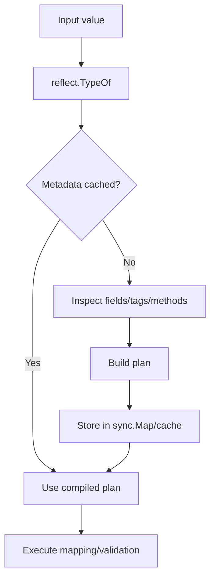
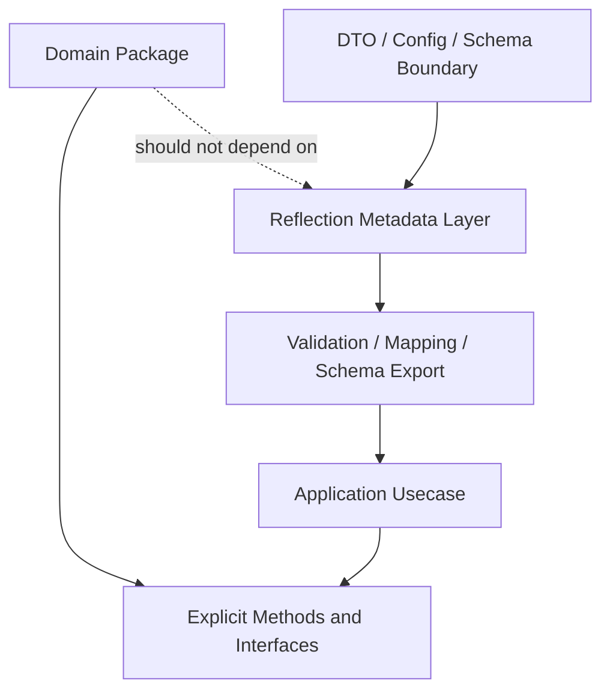

# learn-go-composition-oop-functional-reflection-codegen-modules-part-015.md

# Part 015 — Reflection Mental Model: Type, Value, Kind, Addressability, Settability, Zero Value, dan Panic Surface

> Seri: `learn-go-composition-oop-functional-reflection-codegen-modules`  
> Target: Java software engineer yang ingin menguasai Go composition, OOP-style design, functional style, reflection, code generation, modules, dan package management pada level internal engineering handbook.  
> Status seri: Part 015 dari 030. Seri belum selesai.

---

## 0. Tujuan Part Ini

Part ini membangun fondasi mental model reflection di Go.

Reflection sering terlihat seperti fitur kecil: `reflect.TypeOf`, `reflect.ValueOf`, `Kind`, `Field`, `Method`, `Set`, `Call`. Tetapi di sistem produksi, reflection adalah salah satu area paling rawan karena ia memindahkan sebagian pemeriksaan dari compile time ke runtime.

Di Java, reflection sering dipakai untuk framework besar: dependency injection, annotation scanning, ORM, validation, serialization, AOP proxy, test framework, dan runtime discovery. Di Go, reflection juga dipakai oleh banyak library penting seperti JSON/XML encoding, validation, mapper, ORM-ish library, mock framework, dan generic-ish utilities sebelum generics hadir. Namun idiom desainnya berbeda.

Tujuan bagian ini bukan membuat Anda hafal API `reflect`, tetapi membuat Anda memiliki model berpikir yang cukup untuk:

1. tahu kapan reflection memang tepat;
2. tahu kapan reflection adalah smell;
3. memahami kenapa kode reflection sering panic;
4. membedakan `Type`, `Value`, dan `Kind`;
5. memahami addressability dan settability;
6. menangani nil dan zero value dengan aman;
7. membuat wrapper reflection yang production-grade;
8. memutuskan kapan harus berpindah ke generics atau code generation.

---

## 1. Sumber Resmi dan Baseline Fakta

Baseline seri ini tetap Go hingga 1.26.x. Dokumen resmi Go menjelaskan bahwa package `reflect` mengimplementasikan runtime reflection, memungkinkan program memanipulasi object dengan arbitrary type. Pemakaian tipikalnya adalah mengambil value dengan static type `interface{}`/`any`, lalu mengekstrak informasi dynamic type melalui `TypeOf` dan runtime data melalui `ValueOf`. Dokumentasi resmi juga menegaskan bahwa `CanSet` menentukan apakah `Value` dapat diubah; kalau `CanSet` false, operasi `Set` atau setter spesifik seperti `SetInt` akan panic. Blog resmi “The Laws of Reflection” merangkum fondasi reflection sebagai hubungan antara interface value, concrete type, dan concrete value. Referensi Go 1.26 menyatakan rilis tetap menjaga Go 1 compatibility promise, sehingga mental model dasar reflection tetap relevan untuk Go 1.26.x.

Referensi utama:

- Go `reflect` package documentation.
- Go Blog: The Laws of Reflection.
- Go language specification.
- Go 1.26 release notes dan release history.

---

## 2. Problem Framing: Kenapa Reflection Perlu Dikuasai, Bukan Dihindari Secara Dogmatis

Ada dua ekstrem yang sama-sama lemah.

Ekstrem pertama: “Reflection itu buruk, jangan pernah pakai.” Ini terlalu simplistik. Banyak kebutuhan sistem nyata memang memerlukan runtime metadata:

- generic serializer/deserializer;
- config loader;
- validator berbasis struct tag;
- object mapper;
- database row scanner;
- test data generator;
- dependency graph inspection;
- plugin registry;
- audit diff generator;
- schema exporter;
- backward-compatible DTO transformer.

Ekstrem kedua: “Reflection membuat API fleksibel.” Ini juga berbahaya. Reflection yang dipakai terlalu cepat sering menyebabkan:

- compile-time safety hilang;
- error baru muncul di production;
- panic surface melebar;
- performance tidak stabil;
- allocation meningkat;
- API menjadi sulit dicari oleh IDE;
- behavior tersembunyi di struct tags;
- refactor menjadi rapuh;
- domain invariant bisa ditembus.

Reflection di Go harus dilihat sebagai **runtime escape hatch**.

Ia bukan mekanisme desain utama. Ia adalah alat untuk kasus yang memang membutuhkan metadata atau operasi lintas-type yang tidak praktis dengan interface/generics/manual code.

---

## 3. Mental Model Utama: Go Reflection Berangkat dari Interface Value

Reflection di Go bukan “membuka semua object” seperti Java reflection secara default. Reflection berangkat dari value yang Anda berikan ke `reflect.TypeOf` atau `reflect.ValueOf`.

Secara mental, sebuah interface value di Go menyimpan pasangan:

```text
(dynamic concrete type, dynamic concrete value)
```

Contoh:

```go
var x any = int64(42)

reflect.TypeOf(x)  // int64
reflect.ValueOf(x) // reflect.Value wrapping int64(42)
```

Bukan `any`-nya yang menjadi type hasil `TypeOf`, tetapi dynamic concrete type di dalam interface.

Diagram mental:



Ini penting karena banyak bug reflection berasal dari salah paham terhadap apa yang sedang direfleksikan:

- interface container;
- concrete value;
- pointer ke concrete value;
- nil interface;
- typed nil di dalam interface;
- zero `reflect.Value`;
- field value yang tidak settable.

---

## 4. Tiga Konsep Sentral: Type, Value, Kind

Reflection Go punya tiga kata yang sering tertukar:

1. `reflect.Type`
2. `reflect.Value`
3. `reflect.Kind`

### 4.1 `reflect.Type`

`reflect.Type` adalah deskripsi type runtime.

Ia menjawab pertanyaan seperti:

- nama type apa?
- package path apa?
- kind-nya apa?
- jumlah field berapa?
- jumlah method berapa?
- type element untuk slice/map/pointer apa?
- apakah type ini assignable ke type lain?
- apakah type ini implement interface tertentu?

Contoh:

```go
package main

import (
    "fmt"
    "reflect"
)

type CaseID string

func main() {
    var id CaseID = "CASE-001"
    t := reflect.TypeOf(id)

    fmt.Println(t.Name()) // CaseID
    fmt.Println(t.Kind()) // string
    fmt.Println(t.PkgPath())
}
```

`Name()` menjawab defined type name. `Kind()` menjawab kategori underlying runtime-nya.

### 4.2 `reflect.Value`

`reflect.Value` adalah representasi runtime dari value.

Ia menjawab pertanyaan seperti:

- value sekarang apa?
- bisa diubah atau tidak?
- addressable atau tidak?
- nil atau tidak?
- zero atau tidak?
- field ke-n nilainya apa?
- method ke-n bisa dipanggil atau tidak?
- bisa dikonversi ke interface atau tidak?

Contoh:

```go
v := reflect.ValueOf(CaseID("CASE-001"))
fmt.Println(v.String())
fmt.Println(v.Kind())
```

### 4.3 `reflect.Kind`

`Kind` adalah kategori umum dari type.

Contoh kind:

- `Bool`
- `Int`
- `String`
- `Struct`
- `Ptr`
- `Slice`
- `Map`
- `Interface`
- `Func`

Defined type dan underlying kind berbeda:

```go
type CaseID string

t := reflect.TypeOf(CaseID("CASE-001"))

fmt.Println(t.Name()) // CaseID
fmt.Println(t.Kind()) // string
```

Artinya: `CaseID` adalah type domain yang berbeda, tetapi kind-nya `String`.

### 4.4 Rule of Thumb

Gunakan:

- `Type` saat butuh metadata type;
- `Value` saat butuh data runtime;
- `Kind` saat butuh branching berdasarkan kategori umum.

Jangan pakai `Kind` untuk mengambil keputusan domain yang seharusnya berbasis type spesifik.

Buruk:

```go
if v.Kind() == reflect.String {
    // assume this is CaseID
}
```

Lebih baik:

```go
caseIDType := reflect.TypeOf(CaseID(""))
if v.Type() == caseIDType {
    // truly CaseID
}
```

---

## 5. Reflection Tidak Sama dengan Dynamic Typing

Go tetap static language. Reflection tidak mengubah Go menjadi dynamic language.

Reflection hanya menyediakan API runtime untuk memeriksa dan memanipulasi value yang sudah ada. Tetapi semua operasi reflection tetap dibatasi oleh aturan type system Go.

Misalnya:

```go
v := reflect.ValueOf(123)
v.SetString("abc") // panic
```

Kenapa? Karena value itu bukan string, tidak settable, dan setter yang dipakai tidak sesuai.

Reflection bukan bypass universal. Ia lebih seperti “manual gearbox” untuk type system. Anda bisa melakukan banyak hal, tetapi Anda juga harus memeriksa sendiri semua precondition.

---

## 6. First Law of Reflection: Dari Interface Value ke Reflection Object

Hukum pertama: reflection berjalan dari interface value ke reflection object.

```go
var x any = 42

t := reflect.TypeOf(x)
v := reflect.ValueOf(x)
```

`TypeOf` dan `ValueOf` menerima `any`, sehingga argumen selalu masuk melalui interface boundary.

Ini berarti:

```go
var n int = 42
v := reflect.ValueOf(n)
```

Walaupun `n` bukan interface di source code, saat dipassing ke `ValueOf`, ia dikemas ke interface value.

Diagram:



Konsekuensi: Anda merefleksikan copy dari interface value, bukan selalu storage original.

---

## 7. Second Law: Dari Reflection Object Kembali ke Interface Value

Dari `reflect.Value`, Anda bisa mengambil interface value lagi dengan `Interface()`.

```go
v := reflect.ValueOf(42)
x := v.Interface()

fmt.Printf("%T %v\n", x, x) // int 42
```

Tetapi ada jebakan: `Interface()` dapat panic jika value berasal dari unexported field tertentu.

Contoh konseptual:

```go
type secret struct {
    token string
}

s := secret{token: "abc"}
v := reflect.ValueOf(s).FieldByName("token")

_ = v.Interface() // dapat panic karena unexported field
```

Reflection tidak memberi akses bebas ke semua field private. Package boundary tetap penting.

---

## 8. Third Law: Untuk Mengubah Value, Value Harus Settable

Ini hukum yang paling sering menyebabkan panic.

```go
x := 42
v := reflect.ValueOf(x)

v.SetInt(100) // panic
```

Kenapa? Karena `v` bukan representasi storage `x` yang bisa diubah. Ia adalah reflection atas copy value yang dimasukkan ke interface.

Yang benar:

```go
x := 42
v := reflect.ValueOf(&x).Elem()

v.SetInt(100)
fmt.Println(x) // 100
```

Mental model:

```mermaid
flowchart TD
    A[Want to mutate x] --> B{Did you pass pointer?}
    B -- No --> C[ValueOf(x): not settable]
    C --> D[Set panics]
    B -- Yes --> E[ValueOf(&x)]
    E --> F[Elem]
    F --> G[settable Value]
    G --> H[Set succeeds if type-compatible]
```

---

## 9. Addressability vs Settability

Dua konsep ini mirip tetapi tidak sama.

### 9.1 Addressable

Sebuah value addressable jika address-nya bisa diambil.

Dalam reflection, `CanAddr()` menjawab apakah `Addr()` aman dipanggil.

Contoh addressable:

- variable lokal;
- field dari addressable struct;
- element slice;
- element addressable array;
- hasil dereference pointer.

### 9.2 Settable

Sebuah value settable jika dapat diubah melalui reflection.

Dalam reflection, `CanSet()` menjawab apakah setter aman dipanggil.

Semua settable value addressable, tetapi tidak semua addressable value settable.

Contoh unexported struct field bisa addressable dalam konteks tertentu tetapi tidak settable dari luar package via reflection.

### 9.3 Checklist Sebelum Set

Sebelum memanggil `Set`, `SetString`, `SetInt`, dan sejenisnya, cek:

```go
if !v.IsValid() {
    return errors.New("invalid value")
}
if !v.CanSet() {
    return errors.New("value is not settable")
}
if newValue.Type().AssignableTo(v.Type()) {
    v.Set(newValue)
    return nil
}
if newValue.Type().ConvertibleTo(v.Type()) {
    v.Set(newValue.Convert(v.Type()))
    return nil
}
return fmt.Errorf("cannot assign %s to %s", newValue.Type(), v.Type())
```

---

## 10. Zero `reflect.Value` Bukan Zero Value Biasa

Ini salah satu sumber bug paling umum.

`reflect.Value{}` adalah zero `reflect.Value`. Ia bukan `nil` value biasa dan bukan value dari typed nil.

```go
var v reflect.Value
fmt.Println(v.IsValid()) // false
```

Banyak method akan panic jika dipanggil pada zero `Value`.

Contoh:

```go
var v reflect.Value
_ = v.Kind() // invalid kind allowed? check docs carefully
_ = v.IsNil() // panic: invalid Value
```

Aturan aman:

```go
if !v.IsValid() {
    // no value present
    return
}
```

### 10.1 `ValueOf(nil)` Menghasilkan Zero Value

```go
v := reflect.ValueOf(nil)
fmt.Println(v.IsValid()) // false
```

Jangan langsung:

```go
reflect.ValueOf(nil).IsNil() // panic
```

Gunakan helper:

```go
func isNilReflect(v reflect.Value) bool {
    if !v.IsValid() {
        return true
    }

    switch v.Kind() {
    case reflect.Chan, reflect.Func, reflect.Interface, reflect.Map, reflect.Pointer, reflect.Slice:
        return v.IsNil()
    default:
        return false
    }
}
```

---

## 11. Nil Interface vs Typed Nil

Di Go, nil interface dan typed nil dalam interface berbeda.

```go
var a any = nil
fmt.Println(a == nil) // true

var p *int = nil
var b any = p
fmt.Println(b == nil) // false
```

`b` tidak nil karena interface value menyimpan dynamic type `*int` dan dynamic value nil.

Diagram:



Reflection membantu melihat perbedaannya:

```go
func inspect(x any) {
    v := reflect.ValueOf(x)
    if !v.IsValid() {
        fmt.Println("nil interface")
        return
    }

    fmt.Println("type:", v.Type())
    fmt.Println("kind:", v.Kind())

    if canBeNil(v.Kind()) {
        fmt.Println("is nil:", v.IsNil())
    }
}

func canBeNil(k reflect.Kind) bool {
    switch k {
    case reflect.Chan, reflect.Func, reflect.Interface, reflect.Map, reflect.Pointer, reflect.Slice:
        return true
    default:
        return false
    }
}
```

Production implication:

- validation library harus membedakan missing vs typed nil;
- mapper harus membedakan absent field vs present nil pointer;
- config loader harus membedakan unset vs explicitly null;
- error wrapping harus hati-hati dengan typed nil error.

---

## 12. `Kind` Branching Harus Dibatasi

Reflection code sering menjadi giant switch:

```go
switch v.Kind() {
case reflect.String:
case reflect.Int:
case reflect.Struct:
case reflect.Slice:
case reflect.Map:
}
```

Ini wajar untuk serializer/validator/mapper. Tetapi bahaya muncul ketika business logic memakai `Kind` sebagai domain model.

Buruk:

```go
func IsEmptyDomainValue(v reflect.Value) bool {
    switch v.Kind() {
    case reflect.String:
        return v.Len() == 0
    case reflect.Int:
        return v.Int() == 0
    }
    return false
}
```

Kenapa buruk?

`CaseID("")`, `OfficerID("")`, `Reason("")`, dan `Email("")` semua kind-nya `String`, tetapi invariant domain berbeda.

Lebih baik:

- gunakan type-specific handling;
- gunakan interface contract;
- gunakan generated code;
- gunakan struct tag hanya untuk metadata non-domain;
- gunakan explicit validator per field/domain type.

---

## 13. Reflection Panic Surface

Reflection API banyak yang panic jika precondition salah. Ini berbeda dari Go biasa yang sering eksplisit mengembalikan error.

Contoh operasi rawan panic:

- `Value.Set` pada value tidak settable;
- `Value.SetInt` pada non-int kind;
- `Value.Int` pada non-int kind;
- `Value.IsNil` pada kind yang tidak nil-able;
- `Value.Elem` pada non-pointer/non-interface atau nil pointer tertentu;
- `Value.Field(i)` dengan index out of range;
- `Value.Method(i)` dengan index out of range;
- `Value.Call` dengan argumen salah;
- `Value.Interface` pada unexported field;
- `Type.Elem` pada type yang tidak punya element;
- `Type.Field(i)` pada non-struct atau index salah.

Production rule:

> Jangan expose raw reflection operation di business path. Bungkus dalam helper yang memvalidasi precondition dan mengembalikan error bermakna.

Contoh wrapper aman:

```go
func derefValue(v reflect.Value) (reflect.Value, bool) {
    if !v.IsValid() {
        return reflect.Value{}, false
    }

    for v.Kind() == reflect.Interface || v.Kind() == reflect.Pointer {
        if v.IsNil() {
            return reflect.Value{}, false
        }
        v = v.Elem()
    }
    return v, true
}
```

---

## 14. Type Identity: Defined Type Tidak Sama dengan Underlying Type

```go
type CaseID string
type OfficerID string
```

Keduanya kind `String`, tetapi type berbeda.

```go
caseIDType := reflect.TypeOf(CaseID(""))
officerIDType := reflect.TypeOf(OfficerID(""))

fmt.Println(caseIDType == officerIDType) // false
fmt.Println(caseIDType.Kind() == officerIDType.Kind()) // true
```

Ini sangat penting untuk mapper/validator.

Buruk:

```go
if v.Kind() == reflect.String {
    // treat all string-like values equally
}
```

Lebih aman:

```go
switch v.Type() {
case reflect.TypeOf(CaseID("")):
    // case id rule
case reflect.TypeOf(OfficerID("")):
    // officer id rule
}
```

Atau lebih idiomatis: hindari reflection untuk domain rule, gunakan method/interface.

```go
type Validatable interface {
    Validate() error
}
```

---

## 15. Pointer, Interface, dan `Elem`

`Elem()` mengambil element dari pointer atau interface.

```go
x := 42
v := reflect.ValueOf(&x)
fmt.Println(v.Kind())        // ptr
fmt.Println(v.Elem().Kind()) // int
```

Tetapi `Elem()` bisa panic atau menghasilkan invalid value jika tidak hati-hati.

Pattern aman:

```go
func indirect(v reflect.Value) (reflect.Value, bool) {
    if !v.IsValid() {
        return reflect.Value{}, false
    }

    for {
        switch v.Kind() {
        case reflect.Interface, reflect.Pointer:
            if v.IsNil() {
                return reflect.Value{}, false
            }
            v = v.Elem()
        default:
            return v, true
        }
    }
}
```

Namun jangan selalu dereference otomatis. Kadang pointer punya semantic penting:

- nil means absent;
- pointer means optional;
- pointer identity matters;
- pointer receiver method set matters;
- pointer field may signal partial update.

Contoh regulatory DTO:

```go
type UpdateCaseRequest struct {
    AssignedOfficerID *OfficerID `json:"assignedOfficerId"`
}
```

Di sini nil bukan sekadar zero. Nil berarti field tidak dikirim atau tidak ingin diubah.

Reflection mapper yang auto-deref tanpa semantic bisa merusak partial update.

---

## 16. Struct Field Reflection

Struct adalah target reflection yang paling umum.

```go
type Case struct {
    ID     CaseID `json:"id" validate:"required"`
    Status string `json:"status"`
}

func inspectStruct(x any) error {
    v := reflect.ValueOf(x)
    v, ok := indirect(v)
    if !ok {
        return errors.New("nil value")
    }
    if v.Kind() != reflect.Struct {
        return fmt.Errorf("expected struct, got %s", v.Kind())
    }

    t := v.Type()
    for i := 0; i < t.NumField(); i++ {
        sf := t.Field(i)
        fv := v.Field(i)
        fmt.Println(sf.Name, sf.Type, sf.Tag, fv.Kind())
    }
    return nil
}
```

Hal yang harus diperhatikan:

- embedded fields;
- promoted fields;
- unexported fields;
- anonymous fields;
- tag parsing;
- duplicate JSON names;
- field shadowing;
- pointer fields;
- zero vs nil;
- `omitempty` semantics;
- cross-field validation;
- field order stability;
- metadata caching.

Part 016 akan membahas struct metadata secara jauh lebih dalam.

---

## 17. Exported vs Unexported Field

Go package boundary tetap berlaku.

```go
type Case struct {
    ID     string
    secret string
}
```

Reflection bisa menemukan field `secret`, tetapi tidak berarti bebas mengambil interface atau mengubahnya.

```go
v := reflect.ValueOf(Case{ID: "1", secret: "x"})
f := v.FieldByName("secret")

fmt.Println(f.IsValid())
fmt.Println(f.CanInterface())
fmt.Println(f.CanSet())
```

Production implication:

- jangan mendesain library yang membutuhkan akses ke unexported field user;
- gunakan exported field untuk serialization/config binding;
- gunakan constructor/method untuk invariant domain;
- jangan pakai `unsafe` untuk membobol field kecuali benar-benar low-level dan documented.

---

## 18. `IsZero` vs Domain Empty

`Value.IsZero()` menjawab apakah value adalah zero value untuk type-nya.

Contoh:

```go
reflect.ValueOf(0).IsZero()       // true
reflect.ValueOf("").IsZero()      // true
reflect.ValueOf(false).IsZero()   // true
reflect.ValueOf([]int(nil)).IsZero() // true
reflect.ValueOf([]int{}).IsZero()    // false
```

Tetapi domain empty tidak selalu sama dengan zero value.

Contoh:

```go
type CaseStatus string

const (
    CaseStatusUnknown CaseStatus = "UNKNOWN"
    CaseStatusDraft   CaseStatus = "DRAFT"
)
```

Zero value `""` mungkin invalid, sementara domain default adalah `UNKNOWN`.

Jangan pakai `IsZero` untuk domain invariant tanpa design decision eksplisit.

Lebih baik:

```go
func (s CaseStatus) Valid() bool {
    switch s {
    case CaseStatusDraft, CaseStatusUnknown:
        return true
    default:
        return false
    }
}
```

---

## 19. Reflection dan Method

Reflection bisa menemukan dan memanggil method.

```go
type Case struct {
    ID string
}

func (c Case) DisplayName() string {
    return "Case " + c.ID
}

v := reflect.ValueOf(Case{ID: "001"})
m := v.MethodByName("DisplayName")

out := m.Call(nil)
fmt.Println(out[0].String())
```

Namun dynamic method call punya banyak risiko:

- method tidak ditemukan;
- method tidak exported;
- argumen salah;
- return count salah;
- panic dari method target;
- allocation tinggi;
- tidak searchable secara statis;
- refactor nama method bisa silent break jika tidak dites.

Production alternative:

```go
type DisplayNamer interface {
    DisplayName() string
}
```

Gunakan reflection method call hanya untuk kasus seperti:

- test framework;
- plugin convention;
- command registry berbasis naming;
- compatibility adapter legacy;
- development tooling.

---

## 20. Reflection dan Function Call

`Value.Call` memungkinkan memanggil function secara dynamic.

```go
fn := func(a int, b int) int { return a + b }
v := reflect.ValueOf(fn)

out := v.Call([]reflect.Value{
    reflect.ValueOf(1),
    reflect.ValueOf(2),
})

fmt.Println(out[0].Int())
```

Precondition:

- `v.Kind() == Func`;
- jumlah argumen sesuai;
- type argumen assignable;
- variadic ditangani benar;
- return value ditangani benar.

Dynamic function call jarang diperlukan di business code. Biasanya lebih aman memakai function type.

Buruk:

```go
func Invoke(fn any, args ...any) ([]any, error)
```

Lebih baik:

```go
type CaseHandler func(context.Context, CaseCommand) error
```

Reflection call sebaiknya muncul di boundary seperti test runner, script engine, atau codegen runtime, bukan core domain.

---

## 21. Metadata Cache: Reflection Jangan Diulang di Hot Path

Reflection metadata extraction relatif mahal dibanding akses statis. Untuk serializer/validator/mapper, pattern produksi biasanya:

1. inspect type sekali;
2. build metadata plan;
3. cache by `reflect.Type`;
4. execute plan berkali-kali.

Diagram:



Contoh skeleton:

```go
type fieldPlan struct {
    name  string
    index []int
}

type structPlan struct {
    fields []fieldPlan
}

var planCache sync.Map // map[reflect.Type]*structPlan

func getStructPlan(t reflect.Type) (*structPlan, error) {
    if p, ok := planCache.Load(t); ok {
        return p.(*structPlan), nil
    }

    p, err := buildStructPlan(t)
    if err != nil {
        return nil, err
    }

    actual, _ := planCache.LoadOrStore(t, p)
    return actual.(*structPlan), nil
}
```

Caveat:

- cache growth bisa tidak terbatas jika type banyak/dynamic;
- plugin/generated type bisa memperbesar cache;
- metadata harus immutable setelah dibuat;
- hindari data race dalam plan;
- error plan harus jelas dan deterministik.

---

## 22. Reflection Error Design

Karena banyak operasi reflection panic, wrapper production harus mengubah precondition failure menjadi error yang actionable.

Buruk:

```go
panic("bad type")
```

Lebih baik:

```go
type PathError struct {
    Path string
    Op   string
    Want string
    Got  string
}

func (e *PathError) Error() string {
    return fmt.Sprintf("%s at %s: want %s, got %s", e.Op, e.Path, e.Want, e.Got)
}
```

Contoh error:

```text
validate field Case.AssignedOfficerID: want non-nil pointer, got nil
map field Case.CreatedAt: cannot assign string to time.Time
parse tag Case.Status: duplicate json name "status"
```

Production reflection library harus memberikan:

- field path;
- operation;
- expected type/kind;
- actual type/kind;
- tag/source metadata;
- whether panic was recovered;
- stable error classification.

---

## 23. Recover Boundary

Apakah reflection wrapper perlu `recover`?

Jawabannya: kadang iya, tetapi jangan jadikan `recover` sebagai pengganti precondition check.

Pattern aman:

```go
func safeReflectOp(fn func() error) (err error) {
    defer func() {
        if r := recover(); r != nil {
            err = fmt.Errorf("reflection panic: %v", r)
        }
    }()
    return fn()
}
```

Namun lebih baik:

- cek kind sebelum akses kind-specific method;
- cek `IsValid` sebelum method lain;
- cek `CanSet` sebelum setter;
- cek assignability sebelum `Set`;
- cek nil sebelum `Elem`;
- cek field index bounds;
- cek argumen function call.

`recover` adalah seatbelt, bukan steering wheel.

---

## 24. Reflection vs Interface

Gunakan interface jika operasi yang dibutuhkan adalah behavior.

Contoh:

```go
type Validator interface {
    Validate(context.Context) error
}
```

Jangan pakai reflection untuk mencari method `Validate` jika interface cukup.

Buruk:

```go
func Validate(x any) error {
    m := reflect.ValueOf(x).MethodByName("Validate")
    // dynamic call...
}
```

Lebih baik:

```go
func Validate(ctx context.Context, x any) error {
    if v, ok := x.(interface{ Validate(context.Context) error }); ok {
        return v.Validate(ctx)
    }
    return nil
}
```

Gunakan reflection jika operasi yang dibutuhkan adalah metadata, bukan behavior statis.

Contoh cocok untuk reflection:

```go
type CreateCaseRequest struct {
    ApplicantID string `validate:"required" json:"applicantId"`
    Category    string `validate:"oneof:license,appeal" json:"category"`
}
```

Validator generic perlu membaca tag dan field value.

---

## 25. Reflection vs Generics

Generics cocok jika:

- type diketahui saat compile time;
- operasi bisa dinyatakan melalui constraint;
- tidak perlu membaca struct tag;
- tidak perlu enumerasi field arbitrary struct;
- return type ingin tetap statically typed.

Reflection cocok jika:

- type arbitrary;
- field metadata runtime diperlukan;
- struct tag diperlukan;
- schema discovery diperlukan;
- interop dengan wire/database/config format diperlukan.

Contoh generics lebih baik:

```go
func Contains[T comparable](items []T, target T) bool {
    for _, item := range items {
        if item == target {
            return true
        }
    }
    return false
}
```

Reflection untuk fungsi seperti itu adalah overkill.

Contoh reflection lebih wajar:

```go
func ValidateStruct(x any) error {
    // inspect struct tags and fields
    return nil
}
```

---

## 26. Reflection vs Code Generation

Code generation cocok jika:

- schema/type set diketahui saat build time;
- hot path butuh performance;
- type safety penting;
- error ingin compile-time;
- behavior perlu eksplisit;
- reflection overhead tidak dapat diterima.

Reflection cocok jika:

- fleksibilitas runtime lebih penting;
- type tidak diketahui saat build time;
- jumlah model besar dan toleransi overhead ada;
- development ergonomics lebih penting dari raw performance;
- metadata perlu tetap dynamic.

Decision matrix:

| Kebutuhan | Interface | Generics | Reflection | Codegen |
|---|---:|---:|---:|---:|
| Behavior polymorphism | Sangat baik | Kadang | Lemah | Kadang |
| Type-safe collection/helper | Kadang | Sangat baik | Buruk | Kadang |
| Struct tag processing | Buruk | Buruk | Sangat baik | Sangat baik |
| Hot-path serializer | Kadang | Kadang | Sedang/lemah | Sangat baik |
| Dynamic plugin | Kadang | Lemah | Baik | Lemah |
| Refactor safety | Baik | Baik | Lemah | Baik jika generated diuji |
| Runtime schema discovery | Lemah | Lemah | Baik | Sedang |
| Library ergonomics | Baik | Baik | Baik jika dibungkus | Sedang |

---

## 27. Practical Example: Safe Struct Required Validator

Ini contoh kecil validator reflection yang lebih aman daripada giant panic-prone snippet.

```go
package validate

import (
    "errors"
    "fmt"
    "reflect"
    "strings"
)

type FieldError struct {
    Field string
    Rule  string
    Msg   string
}

func (e FieldError) Error() string {
    return fmt.Sprintf("%s violates %s: %s", e.Field, e.Rule, e.Msg)
}

func RequiredStruct(x any) error {
    v := reflect.ValueOf(x)
    if !v.IsValid() {
        return errors.New("validate: nil input")
    }

    v, ok := derefNonNil(v)
    if !ok {
        return errors.New("validate: nil pointer/interface input")
    }

    if v.Kind() != reflect.Struct {
        return fmt.Errorf("validate: expected struct, got %s", v.Kind())
    }

    t := v.Type()
    for i := 0; i < t.NumField(); i++ {
        sf := t.Field(i)
        if sf.PkgPath != "" { // unexported
            continue
        }

        tag := sf.Tag.Get("validate")
        if !hasRule(tag, "required") {
            continue
        }

        fv := v.Field(i)
        if isEmptyRequiredValue(fv) {
            return FieldError{
                Field: sf.Name,
                Rule:  "required",
                Msg:   "value is empty",
            }
        }
    }

    return nil
}

func derefNonNil(v reflect.Value) (reflect.Value, bool) {
    for v.IsValid() && (v.Kind() == reflect.Interface || v.Kind() == reflect.Pointer) {
        if v.IsNil() {
            return reflect.Value{}, false
        }
        v = v.Elem()
    }
    return v, v.IsValid()
}

func hasRule(tag string, rule string) bool {
    for _, part := range strings.Split(tag, ",") {
        if strings.TrimSpace(part) == rule {
            return true
        }
    }
    return false
}

func isEmptyRequiredValue(v reflect.Value) bool {
    if !v.IsValid() {
        return true
    }

    switch v.Kind() {
    case reflect.Chan, reflect.Func, reflect.Interface, reflect.Map, reflect.Pointer, reflect.Slice:
        return v.IsNil()
    default:
        return v.IsZero()
    }
}
```

Catatan desain:

- tidak langsung `Elem` tanpa nil check;
- skip unexported field;
- tidak memanggil `IsNil` untuk kind non-nil-able;
- error mengandung field/rule;
- domain validation tetap sebaiknya tidak semuanya diserahkan ke tag.

---

## 28. Practical Example: Safe Setter by Field Name

Contoh setter reflection sering tampak sederhana, tetapi banyak jebakan.

```go
func SetField(target any, name string, value any) error {
    if target == nil {
        return errors.New("set field: nil target")
    }

    rv := reflect.ValueOf(target)
    if rv.Kind() != reflect.Pointer || rv.IsNil() {
        return fmt.Errorf("set field: target must be non-nil pointer, got %T", target)
    }

    elem := rv.Elem()
    if elem.Kind() != reflect.Struct {
        return fmt.Errorf("set field: target must point to struct, got %s", elem.Kind())
    }

    field := elem.FieldByName(name)
    if !field.IsValid() {
        return fmt.Errorf("set field: field %q not found", name)
    }
    if !field.CanSet() {
        return fmt.Errorf("set field: field %q cannot be set", name)
    }

    vv := reflect.ValueOf(value)
    if !vv.IsValid() {
        // nil assignment only valid for nil-able fields
        if isNilable(field.Kind()) {
            field.Set(reflect.Zero(field.Type()))
            return nil
        }
        return fmt.Errorf("set field: cannot assign nil to %s", field.Type())
    }

    if vv.Type().AssignableTo(field.Type()) {
        field.Set(vv)
        return nil
    }

    if vv.Type().ConvertibleTo(field.Type()) {
        field.Set(vv.Convert(field.Type()))
        return nil
    }

    return fmt.Errorf("set field: cannot assign %s to field %q of type %s", vv.Type(), name, field.Type())
}

func isNilable(k reflect.Kind) bool {
    switch k {
    case reflect.Chan, reflect.Func, reflect.Interface, reflect.Map, reflect.Pointer, reflect.Slice:
        return true
    default:
        return false
    }
}
```

Production caveat:

- Jangan gunakan setter generic ini untuk domain aggregate internal jika invariant penting.
- Lebih aman expose method domain seperti `AssignOfficer`, `TransitionTo`, `Approve`, `Reject`.
- Setter reflection cocok untuk DTO/config/test helper, bukan core business invariant.

---

## 29. Reflection dalam Regulatory System

Dalam sistem regulatory/case management, reflection bisa muncul di:

- audit diff generator;
- form schema generator;
- DTO validation;
- permission matrix export;
- workflow transition metadata;
- report column mapper;
- CSV/Excel importer;
- API compatibility checker;
- data migration utility;
- test fixture builder.

Namun core domain sebaiknya tetap explicit.

Buruk:

```go
func ApplyTransition(caseObj any, transitionName string) error {
    // find method by name and call dynamically
}
```

Lebih baik:

```go
type Transition interface {
    Name() string
    Apply(context.Context, *Case) error
}
```

Reflection boleh dipakai untuk metadata:

```go
type CaseSnapshot struct {
    ID        CaseID     `audit:"id"`
    Status    CaseStatus `audit:"status"`
    OfficerID OfficerID  `audit:"officer_id" pii:"low"`
}
```

Audit exporter membaca tag. Tetapi perubahan status tetap lewat method domain eksplisit.

---

## 30. Common Anti-Patterns

### 30.1 Reflection untuk Menghindari Desain Interface

Buruk:

```go
func Process(x any) {
    reflect.ValueOf(x).MethodByName("Process").Call(nil)
}
```

Lebih baik:

```go
type Processor interface {
    Process(context.Context) error
}
```

### 30.2 Reflection untuk Mapper Semua Hal

Generic mapper yang mencoba mengubah semua struct ke semua struct biasanya menjadi framework kecil yang sulit diprediksi.

Lebih baik:

- manual mapper untuk domain penting;
- generated mapper untuk repetitive DTO;
- reflection mapper hanya untuk low-risk boundary;
- explicit conversion untuk value object.

### 30.3 Struct Tag sebagai Business Logic

Buruk:

```go
type Case struct {
    Status string `transition:"DRAFT->SUBMITTED->APPROVED"`
}
```

Tag cocok untuk metadata. Workflow invariant sebaiknya bukan tersembunyi di tag.

### 30.4 Recover Tanpa Precondition Check

Buruk:

```go
func Magic(x any) (err error) {
    defer func() { recover() }()
    // lots of unsafe reflection
    return nil
}
```

Ini menyembunyikan bug dan membuat observability buruk.

### 30.5 Losing Type Identity

Buruk:

```go
if v.Kind() == reflect.String {
    // normalize all strings
}
```

Ini bisa merusak `CaseID`, `Email`, `Reason`, `OfficerID`, dan domain string lain.

---

## 31. Production Checklist untuk Reflection Code

Sebelum menerima reflection code di code review, tanyakan:

1. Apakah reflection memang diperlukan?
2. Apakah interface/generics/manual code/codegen lebih baik?
3. Apakah semua operation punya precondition check?
4. Apakah `IsValid` dicek sebelum operasi rawan?
5. Apakah `IsNil` hanya dipanggil untuk nil-able kind?
6. Apakah `Elem` dipanggil setelah nil check?
7. Apakah setter dicek `CanSet`?
8. Apakah assignment dicek `AssignableTo`/`ConvertibleTo`?
9. Apakah unexported fields ditangani dengan aman?
10. Apakah panic surface dibatasi?
11. Apakah error punya path/type/rule yang jelas?
12. Apakah metadata di-cache jika dipakai berulang?
13. Apakah cache immutable dan concurrency-safe?
14. Apakah nil interface vs typed nil ditangani?
15. Apakah zero value vs domain empty dibedakan?
16. Apakah struct tags hanya metadata, bukan core business rule?
17. Apakah test mencakup pointer, nil, embedded field, unexported field, alias/defined type?
18. Apakah benchmark dibuat untuk hot path?
19. Apakah dokumentasi menjelaskan reflection contract?
20. Apakah ada migration path ke codegen jika performance menjadi masalah?

---

## 32. Testing Matrix untuk Reflection Helper

Reflection helper harus dites lebih luas dari fungsi biasa karena input domain-nya luas.

| Case | Harus dites? | Alasan |
|---|---:|---|
| nil input | Ya | `ValueOf(nil)` invalid |
| typed nil pointer | Ya | interface tidak nil tetapi value nil |
| non-pointer input untuk setter | Ya | tidak settable |
| pointer to struct | Ya | happy path |
| pointer to pointer | Ya | dereference policy |
| unexported field | Ya | CanSet/CanInterface false |
| embedded struct | Ya | field promotion/shadowing |
| defined string type | Ya | type identity berbeda dari string |
| nil slice vs empty slice | Ya | `IsZero` berbeda |
| nil map | Ya | nil-able kind |
| invalid field name | Ya | FieldByName invalid |
| wrong type assignment | Ya | assignability/conversion |
| convertible type | Ya | policy explicit |
| function value | Ya jika supported | nil-able + call risk |
| concurrency cache | Ya | race/cache correctness |

---

## 33. Reflection Layer Architecture

Dalam sistem besar, reflection jangan tersebar di semua package.

Lebih baik buat boundary:

```text
/internal/reflectx
/internal/metadata
/internal/validate
/internal/mapper
/internal/schema
```

Dengan aturan:

- package domain tidak import `reflect`;
- package usecase tidak bergantung pada tag parsing;
- reflection hanya di infrastructure/helper boundary;
- semua reflection helper punya test matrix;
- metadata plan immutable;
- error model standar;
- benchmark tersedia untuk hot path.

Diagram arsitektur:



---

## 34. Java Translation Notes

Untuk Java engineer, mapping konsepnya kira-kira seperti ini:

| Java | Go |
|---|---|
| `Class<?>` | `reflect.Type` |
| object instance reflection | `reflect.Value` |
| primitive/category check | `reflect.Kind` |
| field annotation | struct tag |
| private field reflection hack | biasanya tidak idiomatis; package boundary dihormati |
| runtime proxy | function/interface composition lebih umum |
| annotation processor | `go generate` / codegen tools |
| reflection-heavy framework | explicit wiring + small library |
| BeanUtils mapper | manual/generated mapper lebih aman untuk domain |
| validation annotation | struct tag validation untuk DTO, method validation untuk domain |

Perbedaan paling penting:

Di Java, reflection sering menjadi fondasi framework inversion-of-control. Di Go, desain yang lebih umum adalah explicit composition. Reflection dipakai di boundary, bukan sebagai arsitektur utama aplikasi.

---

## 35. Mental Model Summary

Pegang lima model ini:

1. **Reflection starts from interface value.**  
   `TypeOf` dan `ValueOf` membaca dynamic type/value dari interface boundary.

2. **Type, Value, dan Kind berbeda.**  
   `Type` adalah identitas type, `Value` adalah data runtime, `Kind` adalah kategori umum.

3. **Mutation membutuhkan settability.**  
   Untuk mengubah value, biasanya Anda harus mulai dari pointer lalu `Elem()`.

4. **Nil punya banyak bentuk.**  
   Nil interface, typed nil, nil pointer, nil slice, dan zero `reflect.Value` berbeda.

5. **Reflection adalah escape hatch.**  
   Pakai untuk metadata/runtime generic behavior. Jangan pakai untuk menghindari desain interface, generics, atau explicit domain model.

---

## 36. Latihan Mandiri

### Latihan 1 — Nil Inspector

Buat function:

```go
func DescribeNil(x any) string
```

Harus membedakan:

- nil interface;
- typed nil pointer;
- nil slice;
- empty slice;
- nil map;
- non-nil zero value.

### Latihan 2 — Safe Field Reader

Buat function:

```go
func FieldValue(x any, field string) (any, error)
```

Requirement:

- menerima struct atau pointer to struct;
- menolak nil;
- menolak non-struct;
- menolak unexported field;
- mengembalikan error dengan field path.

### Latihan 3 — Metadata Cache

Buat cache metadata untuk struct tags:

```go
type FieldMeta struct {
    GoName string
    JSONName string
    Index []int
    Type reflect.Type
}
```

Requirement:

- cache by `reflect.Type`;
- concurrency-safe;
- skip unexported field;
- handle embedded field;
- detect duplicate JSON name.

### Latihan 4 — Reflection Decision Review

Ambil salah satu mapper/validator/config loader yang pernah Anda buat di Java. Tulis ulang decision matrix:

- bagian mana yang harus interface;
- bagian mana yang harus generics;
- bagian mana yang boleh reflection;
- bagian mana yang lebih baik code generation.

---

## 37. Hubungan ke Part Berikutnya

Part ini membangun fondasi mental model reflection. Part berikutnya akan memperdalam kasus paling umum di production Go:

```text
Part 016 — Reflection for Struct Metadata: tags, visible fields, embedded fields, validation, mapping, serialization
```

Di sana kita akan masuk ke:

- parsing struct tag;
- field visibility;
- embedded field traversal;
- duplicate name resolution;
- validator/mapper architecture;
- metadata cache;
- JSON-like field naming;
- domain vs DTO reflection boundary.

---

## 38. Status Seri

Seri belum selesai.

Progress saat ini:

```text
Part 015 dari 030 selesai.
Next: Part 016 — Reflection for Struct Metadata.
```

<!-- NAVIGATION_FOOTER -->
<div class="page-nav">
<a href="./learn-go-composition-oop-functional-reflection-codegen-modules-part-014.md">⬅️ Part 014 — Iterator-Style Design, Lazy Sequence, dan API Ergonomics Modern Go</a>
<a href="./index.md">📚 Kategori</a>
<a href="../../index.md">🏠 Home</a>
<a href="./learn-go-composition-oop-functional-reflection-codegen-modules-part-016.md">Part 016 — Reflection for Struct Metadata: Tags, Visible Fields, Mapping, Validation, Serialization ➡️</a>
</div>
