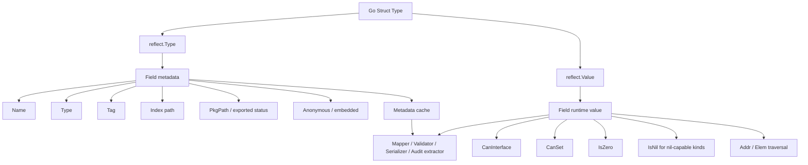
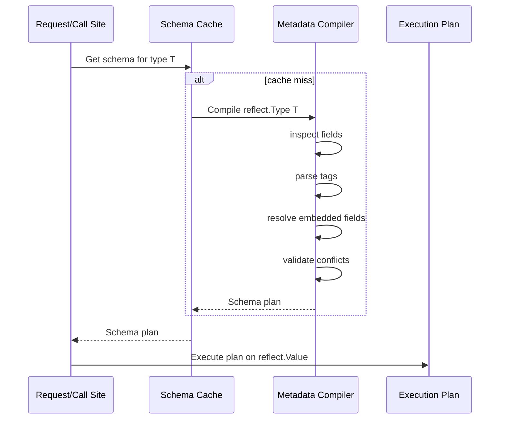
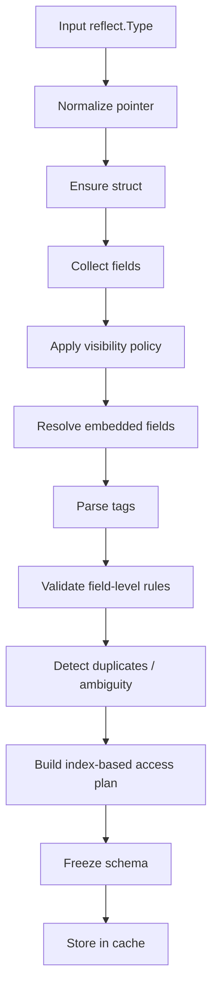
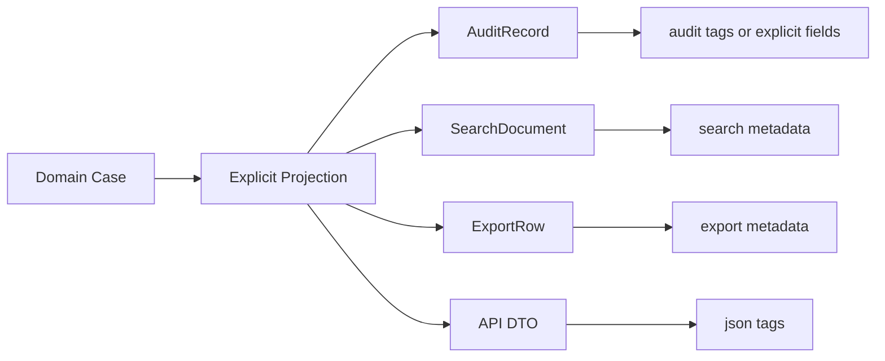

# learn-go-composition-oop-functional-reflection-codegen-modules-part-016.md

# Part 016 — Reflection for Struct Metadata: Tags, Visible Fields, Mapping, Validation, Serialization

> Seri: `learn-go-composition-oop-functional-reflection-codegen-modules`  
> Bagian: `016 / 030`  
> Target pembaca: Java software engineer / tech lead yang ingin memahami desain Go tingkat production, khususnya ketika metadata struct dipakai untuk mapper, validator, serializer, audit, dan framework internal.  
> Fokus: bukan “cara pakai reflect.FieldByName saja”, tetapi bagaimana membangun mental model dan engineering discipline agar reflection-based metadata tidak berubah menjadi runtime trap.

---

## 0. Posisi Part Ini Dalam Seri

Pada Part 015 kita membangun fondasi reflection:

- `reflect.Type` adalah metadata type.
- `reflect.Value` adalah handle runtime value.
- `Kind` adalah kategori bentuk dasar value.
- Tidak semua `Value` bisa di-set.
- Tidak semua field bisa diakses aman.
- Reflection memperluas surface panic.
- Reflection sebaiknya dipakai sebagai runtime escape hatch.

Part 016 masuk ke penggunaan reflection yang paling sering di production Go:

- membaca struct field,
- membaca struct tag,
- membangun metadata cache,
- membuat mapper,
- membuat validator,
- membuat serializer,
- menangani embedded struct,
- menjaga compatibility ketika model berubah.

Ini area yang terlihat sederhana, tetapi banyak bug production lahir dari sini:

- field tidak terbaca karena pointer depth salah,
- unexported field menyebabkan panic,
- embedded field membuat ambiguity,
- tag typo tidak terdeteksi compile-time,
- validator melewatkan field karena `omitempty`,
- mapper silently overwrite field,
- metadata cache tidak aman untuk concurrent access,
- reflection path terlalu lambat karena metadata diparsing ulang setiap request,
- DTO internal bocor ke wire contract,
- domain invariant dilanggar karena direct reflective set.

Mental model pentingnya:

> Reflection metadata adalah runtime schema. Begitu Anda memakai tag dan field reflection, Anda sedang membangun mini schema system di atas Go type system. Karena schema ini tidak sepenuhnya diverifikasi compiler, Anda perlu mengganti sebagian compile-time safety dengan validation, tests, cache discipline, dan failure policy yang eksplisit.

---

## 1. Problem Framing

Di Java, banyak metadata-driven behavior dibangun dengan:

- annotation,
- reflection,
- classpath scanning,
- Bean Introspection,
- Jackson annotation,
- Hibernate annotation,
- Jakarta Validation annotation,
- Spring stereotype annotation,
- runtime proxy,
- annotation processor.

Di Go, bentuk yang paling dekat adalah:

- struct tag,
- interface implementation,
- function registration,
- `go generate`,
- build tag,
- explicit constructor,
- explicit registry,
- reflection package.

Go sengaja lebih eksplisit. Struct tag ada, tetapi tidak punya semantic bawaan global. Tag hanyalah string literal yang melekat pada field. Meaning tag ditentukan oleh package yang membacanya.

Contoh:

```go
type CreateCaseRequest struct {
    CaseType string `json:"caseType" validate:"required,oneof=APPEAL COMPLIANCE"`
    Summary  string `json:"summary" validate:"required,max=500"`
}
```

Go compiler tidak memahami `json` atau `validate` secara domain-specific. Compiler hanya menyimpan tag string sebagai bagian metadata field. Package `encoding/json` memahami key `json`. Validator tertentu memahami key `validate`. Mapper internal Anda mungkin memahami key `map`.

Konsekuensinya:

> Tag adalah kontrak runtime, bukan kontrak bahasa penuh.

Karena itu, desain yang matang perlu menjawab:

- tag apa yang boleh dipakai?
- apakah tag wajib?
- bagaimana jika tag invalid?
- bagaimana jika dua field punya tag sama?
- bagaimana handling embedded struct?
- apakah unexported field diproses?
- apakah pointer field diinisialisasi otomatis?
- apakah zero value berbeda dari missing value?
- apakah error terjadi saat startup atau saat request?
- apakah metadata diparse sekali atau setiap operasi?
- apakah reflection hanya dipakai di boundary atau masuk ke domain core?

---

## 2. Mental Model: Struct Metadata Sebagai Schema Runtime

Struct Go punya dua bentuk informasi:

1. **Static shape**
   - field name,
   - field type,
   - exported/unexported status,
   - embedded field,
   - tag string,
   - package path,
   - index path.

2. **Runtime value**
   - nilai field,
   - addressability,
   - settable status,
   - nil status,
   - pointer target,
   - zero value.

`reflect.Type` digunakan untuk membaca static shape.  
`reflect.Value` digunakan untuk membaca atau mengubah runtime value.

Diagram mental:



Production-grade reflection biasanya memisahkan dua fase:

1. **Metadata compilation phase**
   - inspect struct type,
   - parse tags,
   - resolve embedded fields,
   - validate conflicts,
   - build field access plan,
   - cache result.

2. **Execution phase**
   - receive concrete value,
   - normalize pointer,
   - execute precomputed field access plan,
   - read/set values,
   - return typed error.

Anti-pattern besar:

```go
func Validate(v any) error {
    rv := reflect.ValueOf(v)
    rt := rv.Type()

    for i := 0; i < rt.NumField(); i++ {
        tag := rt.Field(i).Tag.Get("validate")
        // parse tag every request
        // inspect nested struct every request
        // panic if input not struct
        // no conflict detection
    }

    return nil
}
```

Ini mungkin lolos untuk demo, tetapi rapuh untuk production.

Production-oriented shape:

```go
type Schema struct {
    Type   reflect.Type
    Fields []FieldPlan
}

type FieldPlan struct {
    GoName     string
    WireName   string
    Index      []int
    Type       reflect.Type
    Required   bool
    OmitEmpty  bool
    Validators []ValidatorPlan
}
```

Runtime path cukup menjalankan plan.

---

## 3. Struct Field Metadata

`reflect.StructField` berisi metadata field. Field penting:

```go
type StructField struct {
    Name      string
    PkgPath   string
    Type      reflect.Type
    Tag       reflect.StructTag
    Offset    uintptr
    Index     []int
    Anonymous bool
}
```

Makna praktis:

| Field | Makna Desain |
|---|---|
| `Name` | Nama field Go. Untuk exported field diawali huruf besar. |
| `PkgPath` | Non-empty untuk unexported field. Bisa dipakai untuk mendeteksi visibility. |
| `Type` | Type field. Bisa pointer, slice, map, struct, interface, alias, defined type. |
| `Tag` | Raw struct tag. Perlu diparse dengan `Get` atau `Lookup`. |
| `Index` | Path field dalam struct, termasuk embedded nesting. Penting untuk `FieldByIndex`. |
| `Anonymous` | Field embedded/anonymous. Tidak berarti field itu selalu harus dipromosikan aman. |

Contoh:

```go
type AuditInfo struct {
    CreatedBy string `json:"createdBy" audit:"actor"`
}

type CaseRecord struct {
    ID string `json:"id" validate:"required"`
    AuditInfo
}
```

Field `AuditInfo` adalah anonymous embedded field. Field `CreatedBy` dapat terlihat sebagai promoted field pada selector `record.CreatedBy`, tetapi reflection metadata perlu memutuskan apakah ia ingin flatten field embedded atau memperlakukannya sebagai nested object.

Ini keputusan desain, bukan sekadar teknis.

---

## 4. Struct Tag: String Kecil, Kontrak Besar

Struct tag adalah string literal pada field.

Contoh umum:

```go
type Person struct {
    Name string `json:"name" db:"name" validate:"required"`
}
```

Secara konvensi, tag berbentuk key-value:

```text
key:"value" key2:"value2"
```

Misalnya:

```go
json:"name,omitempty" validate:"required,max=100"
```

### 4.1 `Get` vs `Lookup`

`StructTag.Get(key)` mengembalikan string value, atau empty string jika key tidak ada.

Masalah:

```go
tag := field.Tag.Get("json")
```

Tidak bisa membedakan:

```go
`json:""`
```

Dengan:

```go
// no json tag
```

Gunakan `Lookup` jika perbedaan itu penting:

```go
value, ok := field.Tag.Lookup("json")
if !ok {
    // tag not present
}
```

Prinsip:

> Untuk schema compiler internal, lebih aman gunakan `Lookup`, bukan `Get`, karena missing tag dan explicitly empty tag sering punya arti berbeda.

### 4.2 Tag Bukan Annotation Java

Perbedaan penting:

| Java Annotation | Go Struct Tag |
|---|---|
| Bisa punya type-safe element. | Hanya string. |
| Bisa diproses annotation processor. | Default-nya diproses runtime oleh package. |
| Bisa punya retention policy. | Tag selalu metadata field jika type tersedia via reflection. |
| Bisa target class/method/field/parameter. | Struct tag hanya di field. |
| Compiler tahu bentuk annotation. | Compiler tidak tahu semantic tag custom. |

Ini berarti tag custom harus diperlakukan seperti DSL kecil.

Jika Anda membuat tag internal seperti:

```go
type CaseDTO struct {
    Status string `case:"state,required,transitionable"`
}
```

Anda sedang membuat DSL. DSL butuh:

- grammar,
- parser,
- validation,
- error message,
- compatibility rule,
- test corpus,
- documentation.

Kalau tidak, tag akan menjadi string magic yang sulit direview.

---

## 5. Exported vs Unexported Fields

Reflection bisa melihat metadata unexported field, tetapi tidak selalu boleh mengambil interface value atau mengubahnya secara aman.

Contoh:

```go
type Case struct {
    ID     string
    status string
}
```

Package lain dapat melihat bahwa field `status` ada lewat metadata, tetapi tidak boleh memperlakukannya seperti public API.

Production rule:

> Reflection-based mapper/serializer/validator sebaiknya hanya memproses exported fields, kecuali berada dalam package yang sama dan benar-benar punya alasan kuat.

Alasan:

- unexported field biasanya menyimpan invariant internal,
- reflective set bisa melewati constructor/domain method,
- behavior menjadi tidak konsisten dengan normal Go visibility,
- sulit menjaga compatibility,
- raw access ke unexported field sering memerlukan `unsafe`, yang memperbesar risiko.

Deteksi exported field:

```go
func isExportedField(f reflect.StructField) bool {
    return f.PkgPath == ""
}
```

`PkgPath` non-empty berarti field unexported.

---

## 6. Visible Fields dan Embedded Struct

Go menyediakan helper `reflect.VisibleFields` untuk mendapatkan field yang visible dengan aturan field promotion. Ini berguna untuk mapper/serializer yang ingin meniru selector visibility Go.

Namun, “visible” bukan berarti “harus otomatis dimasukkan ke schema Anda”.

Embedded struct punya beberapa pilihan desain:

1. **Flatten promoted fields**
2. **Treat embedded field as nested object**
3. **Ignore embedded fields unless tagged**
4. **Disallow embedded fields in DTO**
5. **Allow embedded only untuk metadata umum seperti audit fields**

Contoh:

```go
type AuditFields struct {
    CreatedBy string `json:"createdBy"`
    UpdatedBy string `json:"updatedBy"`
}

type CaseDTO struct {
    ID string `json:"id"`
    AuditFields
}
```

Jika serializer flatten:

```json
{
  "id": "C-001",
  "createdBy": "alice",
  "updatedBy": "bob"
}
```

Jika serializer nested:

```json
{
  "id": "C-001",
  "auditFields": {
    "createdBy": "alice",
    "updatedBy": "bob"
  }
}
```

Keduanya valid sebagai desain. Yang salah adalah tidak sadar framework internal Anda memilih yang mana.

### 6.1 Ambiguity

Contoh:

```go
type A struct {
    ID string `json:"id"`
}

type B struct {
    ID string `json:"id"`
}

type C struct {
    A
    B
}
```

Selector `c.ID` ambiguous. Metadata compiler Anda harus memutuskan:

- error saat startup,
- ignore semua ambiguous field,
- require explicit tag on parent,
- require named fields,
- use priority rule.

Untuk sistem internal engineering handbook level, pilihan paling aman:

> Jangan silently pick salah satu field ambiguous. Fail fast dengan error yang menyebut type, field, tag, dan index path.

---

## 7. Field Index Path: Kunci Akses Cepat dan Akurat

`StructField.Index` menyimpan path field dari root type.

Misalnya:

```go
type Audit struct {
    CreatedBy string
}

type Case struct {
    Audit
}
```

Field `CreatedBy` mungkin punya index path `[0, 0]`:

- `0`: field `Audit` pada `Case`
- `0`: field `CreatedBy` pada `Audit`

Execution phase bisa memakai:

```go
fieldValue := rootValue.FieldByIndex(index)
```

Tetapi hati-hati: jika path melewati nil pointer embedded field, operasi bisa panic.

Contoh:

```go
type Audit struct {
    CreatedBy string
}

type Case struct {
    *Audit
}
```

Jika `Case{Audit:nil}`, access ke `CreatedBy` melalui embedded pointer tidak aman.

Production field accessor perlu handle nil path.

```go
func fieldByIndexSafe(v reflect.Value, index []int) (reflect.Value, bool) {
    for _, i := range index {
        if v.Kind() == reflect.Pointer {
            if v.IsNil() {
                return reflect.Value{}, false
            }
            v = v.Elem()
        }
        if v.Kind() != reflect.Struct {
            return reflect.Value{}, false
        }
        v = v.Field(i)
    }
    return v, true
}
```

Catatan: ini simplified. Production version harus lebih hati-hati terhadap invalid value, unexported field, dan nil-capable kinds.

---

## 8. Metadata Cache: Wajib Untuk Production

Reflection metadata parsing mahal jika dilakukan berulang.

Yang harus dicache:

- root type,
- normalized type,
- field list,
- tag parse result,
- validation rule parse result,
- index path,
- encoder/decoder function,
- setter/getter plan,
- nested schema relation,
- duplicate/conflict detection result.

Diagram:



### 8.1 Cache Key

Cache by `reflect.Type`, not by string name.

```go
type schemaCache struct {
    mu sync.RWMutex
    m  map[reflect.Type]*Schema
}
```

Why not string?

- Different packages can define same type name.
- Alias and defined type behavior matters.
- Pointer vs non-pointer needs normalization.
- Generic instantiations are distinct types.

Normalize input:

```go
func derefType(t reflect.Type) reflect.Type {
    for t.Kind() == reflect.Pointer {
        t = t.Elem()
    }
    return t
}
```

But be explicit: for some APIs, pointer-vs-value matters for settable execution. Cache metadata by underlying struct type, but execution policy may require pointer.

### 8.2 Concurrency

Metadata cache is usually shared globally or per component.

Rules:

- cache construction must be race-free,
- partially built schema must not be published,
- recursive types must not deadlock,
- duplicate compile work is acceptable if simpler,
- once published, schema should be immutable.

Simple pattern:

```go
type SchemaCache struct {
    mu sync.RWMutex
    m  map[reflect.Type]*Schema
}

func (c *SchemaCache) Get(t reflect.Type) (*Schema, error) {
    t = derefType(t)

    c.mu.RLock()
    s := c.m[t]
    c.mu.RUnlock()
    if s != nil {
        return s, nil
    }

    built, err := CompileSchema(t)
    if err != nil {
        return nil, err
    }

    c.mu.Lock()
    if existing := c.m[t]; existing != nil {
        c.mu.Unlock()
        return existing, nil
    }
    c.m[t] = built
    c.mu.Unlock()

    return built, nil
}
```

This is enough for many internal libraries. More advanced cache can use `sync.Map`, singleflight, or recursive placeholders, but do not over-engineer early.

---

## 9. Designing a Tag Parser

Suppose we define validation tag:

```go
type CreateCaseRequest struct {
    CaseType string `validate:"required,oneof=APPEAL|COMPLIANCE|max=50"`
}
```

This is already a DSL.

A parser should produce structured data:

```go
type ValidationRule struct {
    Name string
    Args []string
}
```

Bad parser:

```go
strings.Split(tag, ",")
```

This fails if args can contain comma, escaping, quoted values, or nested expression.

Better approach:

- keep grammar simple,
- forbid complex escaping unless necessary,
- document separators,
- reject unknown rules,
- reject duplicate incompatible rules,
- detect empty tokens,
- return field-aware error.

Example parse result:

```go
type FieldError struct {
    TypeName  string
    FieldName string
    TagKey    string
    TagValue  string
    Message   string
}
```

Error message should help the engineer fix the tag:

```text
invalid validate tag on CreateCaseRequest.CaseType: unknown rule "requred" in `validate:"requred"`; did you mean "required"?
```

Do not return vague runtime errors like:

```text
invalid tag
```

Production metadata parser is developer-facing tooling. Its UX matters.

---

## 10. Mapper Design With Struct Metadata

A mapper transforms one shape to another:

- struct to map,
- map to struct,
- struct to struct,
- DB row to struct,
- struct to audit record,
- domain object to DTO,
- DTO to command.

Reflection mapper tends to start simple:

```go
func ToMap(v any) map[string]any
```

But real production needs policy:

- field naming source: Go name or tag?
- include zero values?
- include nil values?
- flatten embedded fields?
- include unexported fields?
- support pointer fields?
- support custom converter?
- support time formatting?
- support sensitive masking?
- support field-level ACL?
- preserve order for audit?

### 10.1 Example: Audit Extractor

```go
type Case struct {
    ID        string `audit:"case_id"`
    Status    string `audit:"status"`
    Summary   string `audit:"summary,mask=partial"`
    Internal  string `audit:"-"`
    CreatedBy string `audit:"created_by"`
}
```

Metadata plan:

```go
type AuditFieldPlan struct {
    Name      string
    Index     []int
    Masking   MaskingPolicy
    Omit      bool
    ValueType reflect.Type
}
```

Execution:

```go
func ExtractAudit(v any) ([]AuditField, error) {
    rv := reflect.ValueOf(v)
    if rv.Kind() == reflect.Pointer {
        if rv.IsNil() {
            return nil, ErrNilInput
        }
        rv = rv.Elem()
    }

    schema, err := cache.Get(rv.Type())
    if err != nil {
        return nil, err
    }

    out := make([]AuditField, 0, len(schema.Fields))
    for _, f := range schema.Fields {
        fv, ok := fieldByIndexSafe(rv, f.Index)
        if !ok {
            continue
        }
        if !fv.CanInterface() {
            continue
        }
        val := fv.Interface()
        out = append(out, AuditField{Name: f.Name, Value: f.Masking.Apply(val)})
    }
    return out, nil
}
```

Critical decision:

> Audit extraction should usually be read-only. Avoid reflective set in audit path.

---

## 11. Validator Design With Struct Metadata

Validator is one of the most common uses of reflection tags.

Example:

```go
type SubmitAppealRequest struct {
    ApplicantID string `json:"applicantId" validate:"required"`
    Reason      string `json:"reason" validate:"required,max=2000"`
    EvidenceIDs []string `json:"evidenceIds" validate:"maxItems=20"`
}
```

Validator design questions:

1. Does it validate only exported fields?
2. Does it recurse into nested structs?
3. Does it validate nil pointer nested structs?
4. Does `omitempty` skip validation or only skip serialization?
5. Does required mean non-zero, non-empty, non-nil, or present in input?
6. Can it distinguish missing from explicitly zero?
7. Are errors field-path based?
8. Does it return first error or all errors?
9. Is validation order deterministic?
10. Are custom validators pure and concurrency-safe?

### 11.1 Zero vs Missing

This is a deep issue.

Given:

```go
type Request struct {
    Priority int `json:"priority" validate:"required"`
}
```

If JSON input omits `priority`, Go zero value is `0`.  
If JSON input sends `"priority": 0`, Go value is also `0`.

A plain struct cannot distinguish missing vs explicit zero.

Solutions:

1. Use pointer:

```go
type Request struct {
    Priority *int `json:"priority" validate:"required"`
}
```

2. Use custom nullable/presence type:

```go
type OptionalInt struct {
    Value int
    Set   bool
}
```

3. Decode into raw map first and track presence.
4. Use generated decoder with presence tracking.

Important:

> Reflection validator cannot magically recover presence information if decoder already discarded it.

This is a common architecture bug.

### 11.2 Field Path Error

Bad validation error:

```text
required field missing
```

Good validation error:

```text
submitAppealRequest.evidenceIds[3]: must not be empty
```

Internal structure:

```go
type Violation struct {
    Path    string
    Code    string
    Message string
    Value   any
}
```

For security-sensitive systems, be careful including raw value in error because it may contain PII/secrets.

---

## 12. Serialization Metadata

`encoding/json` uses reflection and tags heavily.

Example:

```go
type CaseDTO struct {
    ID     string `json:"id"`
    Status string `json:"status,omitempty"`
    Secret string `json:"-"`
}
```

Key semantics you must design around:

- `json:"name"` changes field name.
- `json:"-"` ignores field.
- `omitempty` omits empty value during marshaling.
- unexported fields are ignored by standard JSON encoding.
- matching behavior during unmarshal follows package rules.

But do not blindly copy JSON semantics for internal tag systems.

For example, audit tag semantics may differ:

```go
AuditStatus string `audit:"status,omitempty"`
```

Does `omitempty` mean:

- omit from audit if empty?
- log as empty?
- treat as error?
- inherit JSON behavior?

For defensible audit systems, omitting empty values can be dangerous. An empty value may be meaningful.

Production rule:

> Do not reuse tag options like `omitempty` across domains unless the semantics are explicitly identical.

---

## 13. Reflection Metadata and Domain Invariants

Reflection can bypass normal domain methods.

Example domain object:

```go
type Case struct {
    status Status
}

func NewCase() *Case {
    return &Case{status: StatusDraft}
}

func (c *Case) Submit() error {
    if c.status != StatusDraft {
        return ErrInvalidTransition
    }
    c.status = StatusSubmitted
    return nil
}
```

A reflection-based mapper that sets `status` directly can violate lifecycle invariant.

Bad:

```go
SetFieldsFromMap(caseObj, map[string]any{"status": "APPROVED"})
```

This bypasses `Submit`, `Review`, `Approve` transition rules.

Boundary rule:

> Reflection mappers should usually target DTOs, command structs, persistence rows, or generated structs — not rich domain aggregates with private invariants.

If mapping into domain is needed, use explicit constructor/factory:

```go
func NewSubmitCommand(req SubmitCaseRequest) (SubmitCommand, error) {
    // explicit validation and invariant conversion
}
```

---

## 14. Metadata Compilation Pipeline

A robust reflection metadata system has a pipeline.



Each stage should return typed errors.

Example errors:

```go
var (
    ErrNotStruct        = errors.New("metadata: expected struct")
    ErrUnsupportedField = errors.New("metadata: unsupported field")
    ErrDuplicateTag     = errors.New("metadata: duplicate tag")
    ErrInvalidTag       = errors.New("metadata: invalid tag")
)
```

Context-rich wrapper:

```go
type SchemaError struct {
    Type  reflect.Type
    Field string
    Tag   string
    Err   error
}

func (e *SchemaError) Error() string {
    if e.Field == "" {
        return fmt.Sprintf("schema %s: %v", e.Type, e.Err)
    }
    return fmt.Sprintf("schema %s.%s: tag %q: %v", e.Type, e.Field, e.Tag, e.Err)
}

func (e *SchemaError) Unwrap() error { return e.Err }
```

This makes errors usable with `errors.Is` while keeping operator/debug context.

---

## 15. Case Study: Regulatory Case Metadata Extractor

Imagine a regulatory case platform. You want generic extraction for:

- audit trail,
- list view indexing,
- search indexing,
- export CSV,
- field-level masking,
- validation.

Tempting design:

```go
type EnforcementCase struct {
    ID          string `json:"id" audit:"id" search:"keyword" export:"Case ID"`
    ApplicantID string `json:"applicantId" audit:"applicant_id" search:"keyword" export:"Applicant ID" mask:"id"`
    Status      string `json:"status" audit:"status" search:"keyword" export:"Status"`
    Summary     string `json:"summary" audit:"summary" search:"text" export:"Summary"`
}
```

This seems convenient, but it couples one struct to many concerns.

Risks:

- changing export label affects domain model review,
- search indexing rule sits next to JSON contract,
- masking policy scattered across DTOs,
- audit semantics tied to wire model,
- tag clutter becomes unreadable,
- no clear owner of each metadata domain.

Better architecture:



Use tags where they serve the owning boundary.

Example:

```go
type CaseAPIResponse struct {
    ID          string `json:"id"`
    ApplicantID string `json:"applicantId"`
    Status      string `json:"status"`
    Summary     string `json:"summary"`
}

type CaseAuditRecord struct {
    ID          string `audit:"id"`
    ApplicantID string `audit:"applicant_id,mask=id"`
    Status      string `audit:"status"`
    Summary     string `audit:"summary,mask=partial"`
}
```

Duplication is sometimes cheaper than coupling.

Top-tier Go design often prefers **purpose-specific simple structs** over **one mega-annotated universal struct**.

---

## 16. Designing Reflection-Based Mapper Safely

A safer mapper should have explicit policy:

```go
type MapperOptions struct {
    TagKey             string
    IncludeZero        bool
    IncludeUnexported  bool
    FlattenEmbedded    bool
    FailOnDuplicateTag bool
    FailOnUnknownKind  bool
}
```

But avoid making everything configurable if semantics should be fixed.

For internal platform library, prefer named constructors:

```go
func NewAuditExtractor() *Extractor
func NewJSONLikeExtractor() *Extractor
func NewExportExtractor() *Extractor
```

Each constructor encodes policy.

This is better than:

```go
NewExtractor(WithEverythingConfigurable(...))
```

Because too much configurability makes behavior unpredictable.

### 16.1 Startup Validation

For stable DTOs, compile metadata during startup:

```go
func MustRegisterSchemas(reg *SchemaRegistry) {
    reg.MustCompile(CreateCaseRequest{})
    reg.MustCompile(UpdateCaseRequest{})
    reg.MustCompile(CaseAuditRecord{})
}
```

Failing at startup is usually better than failing during a critical request.

### 16.2 Hot Path Execution

Hot path should not parse tags.

Bad:

```go
for each request:
    inspect type
    parse every tag
    split every rule
    allocate field metadata
```

Good:

```go
startup / first use:
    compile metadata plan

hot path:
    execute plan
```

---

## 17. Embedded Field Flattening Policy

Recommended policy matrix:

| Use Case | Embedded Flattening Recommendation |
|---|---|
| JSON DTO matching `encoding/json` mental model | Allowed, but test ambiguity. |
| DB row mapping | Prefer explicit field names; flatten only if convention is stable. |
| Audit extraction | Prefer explicit audit record; flatten with fail-fast conflict. |
| Domain aggregate | Avoid reflection flattening. |
| Config struct | Embedded config sections can be okay if documented. |
| Security-sensitive masking | Avoid implicit flattening; explicit is safer. |

Why security-sensitive metadata should avoid implicit flattening:

```go
type Sensitive struct {
    NationalID string `mask:"id"`
}

type Response struct {
    Sensitive
    NationalID string `json:"nationalId"`
}
```

Depending on conflict resolution, masking might apply to one field and not the other. That can leak data.

Fail fast.

---

## 18. Field Name Resolution

Common resolution order:

1. If tag says `-`, ignore.
2. If tag provides explicit name, use it.
3. Else use Go field name.
4. Optionally transform Go field name to snake_case/camelCase.

Example parser:

```go
type TagInfo struct {
    Name    string
    Options map[string]string
    Ignore  bool
    Present bool
}
```

For tag:

```go
`audit:"case_id,mask=partial,omitempty"`
```

Parsed:

```text
Name: case_id
Options:
  mask = partial
  omitempty = true
```

Do not parse tag differently in different places. Centralize parser per tag domain.

---

## 19. Reflection and Generics Together

Generics can reduce runtime type assertions, but cannot inspect struct fields at compile time in Go.

Example:

```go
func Extract[T any](v T) ([]Field, error) {
    return extractReflect(v)
}
```

This gives call-site type clarity, but metadata still requires reflection.

Better use:

```go
func Compile[T any]() (*Schema, error) {
    var zero T
    return compileType(reflect.TypeOf(zero))
}
```

But watch out: if `T` is pointer type, zero is nil pointer and `reflect.TypeOf(zero)` may still work if typed nil is inside interface? Actually:

```go
var p *MyStruct
reflect.TypeOf(p) // *MyStruct
```

But:

```go
var x any = nil
reflect.TypeOf(x) // nil
```

Safer generic helper:

```go
func TypeOf[T any]() reflect.Type {
    return reflect.TypeFor[T]()
}
```

Modern Go provides `reflect.TypeFor[T]()` for obtaining `reflect.Type` of a type parameter. This is useful for schema compilation APIs.

```go
func Compile[T any]() (*Schema, error) {
    return compileType(reflect.TypeFor[T]())
}
```

This improves ergonomics:

```go
schema, err := metadata.Compile[CreateCaseRequest]()
```

Still, generics do not make struct tags type-safe. They only improve type selection and API ergonomics.

---

## 20. Reflection vs Code Generation for Metadata

Decision matrix:

| Need | Reflection | Code Generation |
|---|---:|---:|
| Quick internal tool | Good | Maybe overkill |
| Stable public wire contract | Acceptable | Often better |
| Hot path serialization | Risky | Better |
| Compile-time field validation | Weak | Better |
| Dynamic unknown types | Better | Poor |
| Startup schema validation | Good | Good |
| Zero runtime reflection | No | Yes |
| Developer workflow simplicity | Good | Medium |
| Large enterprise consistency | Medium | Good if tooling mature |

Good pattern:

- use reflection first to learn semantics,
- harden tests and metadata model,
- generate code for hot paths or compatibility-critical paths.

Bad pattern:

- immediately generate code without clear semantics,
- then generated code becomes a copy of inconsistent runtime behavior.

Code generation should generate from a stable semantic model, not from accidental reflection behavior.

---

## 21. Common Failure Modes

### 21.1 Panic from Non-Struct Input

Bad:

```go
rt := reflect.TypeOf(v)
for i := 0; i < rt.NumField(); i++ { ... }
```

If `v` is pointer, slice, nil, or primitive, panic.

Good:

```go
func normalizeStructValue(v any) (reflect.Value, error) {
    if v == nil {
        return reflect.Value{}, ErrNilInput
    }
    rv := reflect.ValueOf(v)
    for rv.Kind() == reflect.Pointer {
        if rv.IsNil() {
            return reflect.Value{}, ErrNilInput
        }
        rv = rv.Elem()
    }
    if rv.Kind() != reflect.Struct {
        return reflect.Value{}, ErrNotStruct
    }
    return rv, nil
}
```

### 21.2 Silent Duplicate Field Name

```go
type Request struct {
    UserID string `json:"userId"`
    UID    string `json:"userId"`
}
```

Your schema compiler should detect duplicate target name.

### 21.3 Tag Typo

```go
Name string `validte:"required"`
```

Compiler accepts it. Your validator ignores it. Production bug.

Mitigation:

- schema linting,
- startup compile,
- custom analyzer,
- code generation validation,
- unit test that enumerates expected required fields.

### 21.4 `omitempty` Misused for Required Fields

```go
Name string `json:"name,omitempty" validate:"required"`
```

This may be valid, but suspicious:

- JSON output omits empty name,
- validation requires name.

Could be intentional for response vs request models. If not, split DTOs.

### 21.5 Reflective Set Into Nil Pointer Field

```go
type Request struct {
    Profile *Profile
}
```

Mapper tries to set `Profile.Name` but `Profile` is nil.

Policy needed:

- auto allocate pointer path,
- return error,
- skip,
- require explicit constructor.

For domain object, do not auto allocate. For DTO decoder, maybe acceptable.

---

## 22. Testing Strategy

Reflection metadata libraries need tests at multiple layers.

### 22.1 Table Test for Tag Parser

```go
func TestParseAuditTag(t *testing.T) {
    tests := []struct {
        name string
        tag  string
        want TagInfo
        err  bool
    }{
        {name: "name only", tag: "case_id", want: TagInfo{Name: "case_id"}},
        {name: "ignore", tag: "-", want: TagInfo{Ignore: true}},
        {name: "mask", tag: "summary,mask=partial", want: TagInfo{Name: "summary"}},
        {name: "empty token", tag: "summary,,mask=partial", err: true},
    }

    for _, tt := range tests {
        t.Run(tt.name, func(t *testing.T) {
            got, err := ParseAuditTag(tt.tag)
            if tt.err && err == nil {
                t.Fatal("expected error")
            }
            if !tt.err && err != nil {
                t.Fatal(err)
            }
            _ = got
        })
    }
}
```

### 22.2 Schema Compilation Test

Test:

- pointer input,
- value input,
- nil pointer input,
- embedded struct,
- duplicate tag,
- unexported field,
- ignored field,
- invalid tag,
- nested pointer field,
- generic type instantiation,
- alias/defined type.

### 22.3 Race Test

Schema cache should pass:

```bash
go test -race ./...
```

### 22.4 Fuzz Test Tag Parser

Tag parser is a great fuzz target:

```go
func FuzzParseAuditTag(f *testing.F) {
    f.Add("case_id")
    f.Add("summary,mask=partial")
    f.Add("-")

    f.Fuzz(func(t *testing.T, s string) {
        _, _ = ParseAuditTag(s)
    })
}
```

Goal: no panic.

---

## 23. Review Checklist

Use this checklist when reviewing reflection metadata code.

### 23.1 Metadata Compilation

- [ ] Input type normalization handles pointer and nil correctly.
- [ ] Non-struct input returns typed error, not panic.
- [ ] Only exported fields are processed unless explicitly justified.
- [ ] Embedded field policy is documented.
- [ ] Duplicate target names are detected.
- [ ] Ambiguous promoted fields fail fast.
- [ ] Tag grammar is documented.
- [ ] Unknown tag options fail fast or are intentionally ignored.
- [ ] Missing vs empty tag is handled via `Lookup` if relevant.
- [ ] Metadata is cached by `reflect.Type`.
- [ ] Cached schema is immutable after publication.

### 23.2 Runtime Execution

- [ ] Field access uses precomputed index path.
- [ ] Nil pointer path is handled.
- [ ] Unexported field is not interfaced/set unsafely.
- [ ] Set operations check `CanSet`.
- [ ] Nil-capable kinds check kind before `IsNil`.
- [ ] Errors include field path.
- [ ] Sensitive values are not leaked in error messages/logs.
- [ ] Hot path does not parse tags repeatedly.

### 23.3 Architecture

- [ ] Reflection is restricted to boundary/package layer.
- [ ] Domain invariant is not bypassed.
- [ ] Tag concern belongs to the struct owner.
- [ ] Multi-concern tag clutter is avoided.
- [ ] Codegen considered for hot path or public compatibility.
- [ ] Tests include embedded fields and conflict cases.

---

## 24. Practical Design Heuristics

### 24.1 Prefer Explicit Structs Over Universal Metadata Structs

Do not make one struct serve:

- API request,
- API response,
- DB row,
- audit record,
- search document,
- export row,
- domain aggregate.

Each boundary may deserve its own struct.

### 24.2 Fail Fast For Developer Errors

Invalid tag is developer error. Prefer failing at startup/test rather than runtime request.

### 24.3 Do Not Hide Reflection Behind “Magic”

APIs like this are risky:

```go
framework.DoEverything(anyStruct)
```

Better:

```go
schema := audit.MustCompile[CaseAuditRecord]()
extractor := audit.NewExtractor(schema)
```

This makes metadata compilation visible.

### 24.4 Use Tags For Stable, Local Metadata

Good tag use:

```go
json:"caseId"
```

Questionable tag use:

```go
workflow:"if status == PENDING and role in [MANAGER,ADMIN] then allow approve except region=EU"
```

When tag starts containing business logic, move it to code or declarative config with proper parser and tests.

### 24.5 Reflection Is Not a Substitute For API Design

If your package needs reflection to hide a confusing API, the API probably needs redesign.

---

## 25. Mini Implementation: Metadata Compiler Skeleton

Below is a simplified skeleton. It is not a complete framework, but it shows production direction.

```go
package metadata

import (
    "errors"
    "fmt"
    "reflect"
    "strings"
    "sync"
)

var (
    ErrNilInput     = errors.New("metadata: nil input")
    ErrNotStruct    = errors.New("metadata: expected struct")
    ErrInvalidTag   = errors.New("metadata: invalid tag")
    ErrDuplicateKey = errors.New("metadata: duplicate key")
)

type Schema struct {
    Type   reflect.Type
    Fields []Field
}

type Field struct {
    GoName  string
    Key     string
    Index   []int
    Type    reflect.Type
    Options map[string]string
}

type Cache struct {
    mu sync.RWMutex
    m  map[reflect.Type]*Schema
}

func NewCache() *Cache {
    return &Cache{m: make(map[reflect.Type]*Schema)}
}

func (c *Cache) Get(t reflect.Type) (*Schema, error) {
    if t == nil {
        return nil, ErrNilInput
    }
    t = derefType(t)
    if t.Kind() != reflect.Struct {
        return nil, fmt.Errorf("%w: got %s", ErrNotStruct, t.Kind())
    }

    c.mu.RLock()
    s := c.m[t]
    c.mu.RUnlock()
    if s != nil {
        return s, nil
    }

    built, err := Compile(t)
    if err != nil {
        return nil, err
    }

    c.mu.Lock()
    if existing := c.m[t]; existing != nil {
        c.mu.Unlock()
        return existing, nil
    }
    c.m[t] = built
    c.mu.Unlock()
    return built, nil
}

func Compile(t reflect.Type) (*Schema, error) {
    t = derefType(t)
    if t.Kind() != reflect.Struct {
        return nil, fmt.Errorf("%w: got %s", ErrNotStruct, t.Kind())
    }

    fields := reflect.VisibleFields(t)
    out := make([]Field, 0, len(fields))
    seen := make(map[string]string)

    for _, sf := range fields {
        if sf.PkgPath != "" {
            continue // unexported
        }

        tagValue, ok := sf.Tag.Lookup("meta")
        if ok && tagValue == "-" {
            continue
        }

        key := sf.Name
        opts := map[string]string{}
        if ok {
            parsedKey, parsedOpts, err := parseMetaTag(tagValue)
            if err != nil {
                return nil, fmt.Errorf("%w on %s.%s: %v", ErrInvalidTag, t, sf.Name, err)
            }
            if parsedKey != "" {
                key = parsedKey
            }
            opts = parsedOpts
        }

        if prev, exists := seen[key]; exists {
            return nil, fmt.Errorf("%w %q on %s.%s and %s.%s", ErrDuplicateKey, key, t, prev, t, sf.Name)
        }
        seen[key] = sf.Name

        out = append(out, Field{
            GoName:  sf.Name,
            Key:     key,
            Index:   append([]int(nil), sf.Index...),
            Type:    sf.Type,
            Options: opts,
        })
    }

    return &Schema{Type: t, Fields: out}, nil
}

func derefType(t reflect.Type) reflect.Type {
    for t.Kind() == reflect.Pointer {
        t = t.Elem()
    }
    return t
}

func parseMetaTag(s string) (string, map[string]string, error) {
    s = strings.TrimSpace(s)
    if s == "" {
        return "", nil, errors.New("empty meta tag")
    }

    parts := strings.Split(s, ",")
    for _, p := range parts {
        if strings.TrimSpace(p) == "" {
            return "", nil, errors.New("empty tag token")
        }
    }

    name := strings.TrimSpace(parts[0])
    opts := make(map[string]string)
    for _, raw := range parts[1:] {
        raw = strings.TrimSpace(raw)
        k, v, ok := strings.Cut(raw, "=")
        if !ok {
            opts[raw] = "true"
            continue
        }
        k = strings.TrimSpace(k)
        v = strings.TrimSpace(v)
        if k == "" {
            return "", nil, errors.New("empty option key")
        }
        opts[k] = v
    }
    return name, opts, nil
}
```

Usage:

```go
type Case struct {
    ID     string `meta:"case_id"`
    Status string `meta:"status"`
    Secret string `meta:"-"`
}

func example() error {
    cache := metadata.NewCache()
    schema, err := cache.Get(reflect.TypeFor[Case]())
    if err != nil {
        return err
    }
    _ = schema
    return nil
}
```

---

## 26. What Top 1% Engineers Notice Here

A surface-level engineer sees reflection metadata as convenience:

> “We can just tag fields and loop over them.”

A stronger engineer sees hidden runtime schema:

> “We need a deterministic schema compiler, tag grammar, ambiguity policy, cache, error model, field path model, startup validation, and boundary discipline.”

A top-tier engineer also asks:

- Which part of this should be compile-time instead?
- Is reflection leaking into domain core?
- Are tags carrying too many concerns?
- Can production fail due to a typo in a string tag?
- Are field conflicts detected early?
- Is metadata cache immutable and race-free?
- Does this preserve security boundaries?
- Does it respect domain lifecycle/invariant?
- Do we have tests for nil, embedded, duplicate, and unexported cases?
- Is this library observable when schema compilation fails?

---

## 27. Summary

Reflection for struct metadata is powerful because Go structs are often used as boundary schemas. Tags make it easy to attach metadata for JSON, validation, mapping, audit, export, and indexing.

But the power comes with cost:

- tag semantics are runtime-defined,
- tag typos are not compiler errors,
- embedded fields introduce ambiguity,
- pointer paths can be nil,
- unexported fields protect invariants,
- reflection can panic,
- repeated metadata parsing hurts performance,
- universal metadata structs create coupling,
- reflection mappers can bypass domain rules.

The production answer is not “never use reflection”. The production answer is:

1. restrict reflection to boundary layers,
2. compile metadata into immutable schema plans,
3. cache by `reflect.Type`,
4. parse tags with explicit grammar,
5. fail fast on developer errors,
6. avoid implicit behavior for security-sensitive metadata,
7. split structs by boundary when semantics differ,
8. use code generation when runtime reflection becomes too costly or too unsafe.

---

## 28. References

- Go package `reflect`: https://pkg.go.dev/reflect
- Go Language Specification — struct types, tags, promoted fields, method sets: https://go.dev/ref/spec
- Go package `encoding/json`: https://pkg.go.dev/encoding/json
- Go Blog — The Laws of Reflection: https://go.dev/blog/laws-of-reflection
- Go Blog — JSON and Go: https://go.dev/blog/json

---

## 29. Next Part

Part 017 akan membahas:

```text
Reflection performance & safety: allocation, caching metadata, unsafe boundary, concurrency safety
```

Kita akan masuk lebih dalam ke biaya runtime reflection, escape/allocation pattern, cache strategy, concurrency, unsafe temptation, dan cara memutuskan kapan reflection harus diganti oleh generics atau code generation.


<!-- NAVIGATION_FOOTER -->
<div class="page-nav">
<a href="./learn-go-composition-oop-functional-reflection-codegen-modules-part-015.md">⬅️ Part 015 — Reflection Mental Model: Type, Value, Kind, Addressability, Settability, Zero Value, dan Panic Surface</a>
<a href="./index.md">📚 Kategori</a>
<a href="../../index.md">🏠 Home</a>
<a href="./learn-go-composition-oop-functional-reflection-codegen-modules-part-017.md">Part 017 — Reflection Performance & Safety: Allocation, Metadata Cache, Panic Boundary, `unsafe`, dan Concurrency Discipline ➡️</a>
</div>
