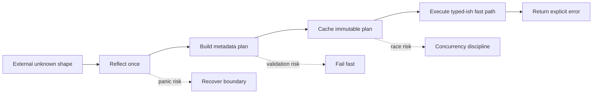
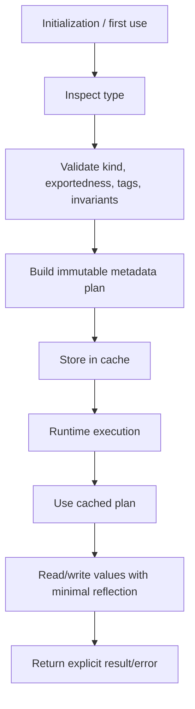
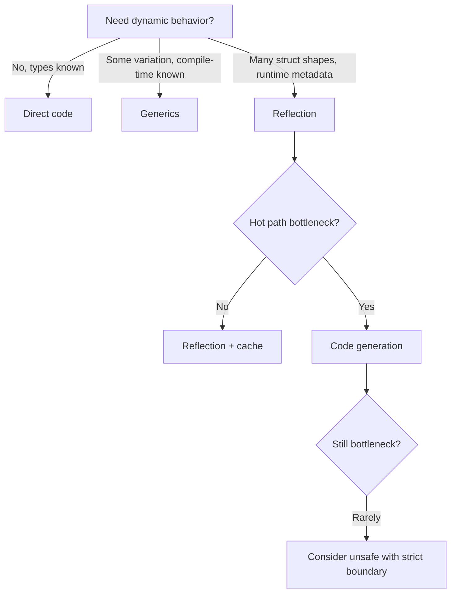
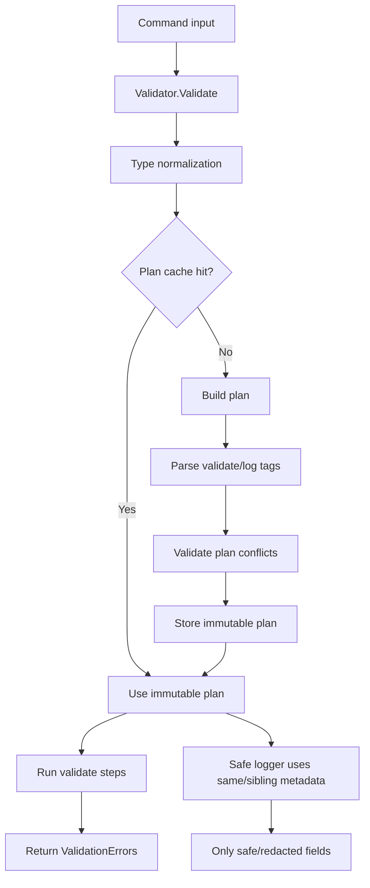
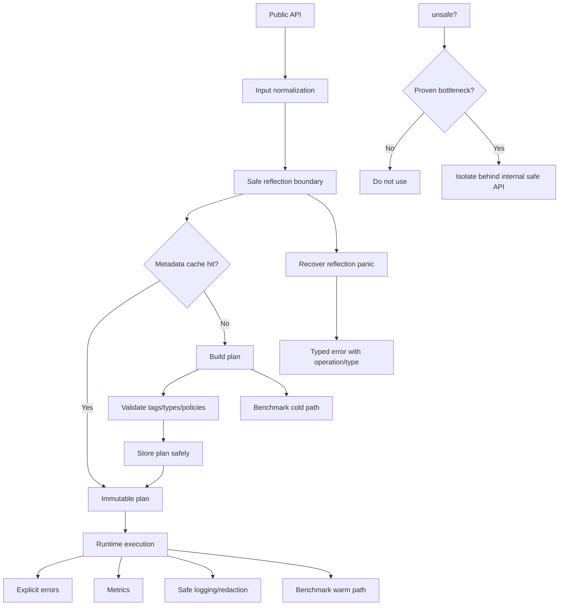

# learn-go-composition-oop-functional-reflection-codegen-modules-part-017.md

# Part 017 — Reflection Performance & Safety: Allocation, Metadata Cache, Panic Boundary, `unsafe`, dan Concurrency Discipline

> Seri: `learn-go-composition-oop-functional-reflection-codegen-modules`  
> Bagian: `017 / 030`  
> Status seri: **belum selesai**  
> Target pembaca: Java senior engineer / tech lead yang ingin memahami Go reflection secara production-grade, bukan sekadar bisa memakai `reflect`.

---

## 0. Tujuan Bagian Ini

Bagian sebelumnya membahas reflection untuk struct metadata: tag, embedded field, visible fields, index path, dan desain mapper/validator/serializer. Bagian ini naik satu level ke pertanyaan yang lebih berbahaya:

> Bagaimana membuat reflection tetap aman, cepat, deterministik, testable, dan defensible di sistem produksi?

Reflection di Go berguna, tetapi ia juga membuka beberapa risiko:

1. runtime panic,
2. allocation tersembunyi,
3. dynamic dispatch yang sulit dianalisis,
4. bypass terhadap compile-time type checking,
5. akses field/method yang berubah menjadi kontrak implicit,
6. cache metadata yang bisa race atau leak,
7. potensi misuse `unsafe`,
8. behavior yang sulit dibaca oleh reviewer.

Di Java, reflection sering muncul lewat framework besar: Spring, Jackson, Hibernate, JPA, Bean Validation, CDI, test framework, proxy, annotation processor. Di Go, reflection ada, tetapi idiom produksinya berbeda: **pakai reflection di boundary tertentu, parse metadata sekali, cache hasilnya, lalu eksekusi path utama dengan struktur yang sudah dikompilasi secara internal.**

Mental model part ini:



Reflection yang baik bukan reflection yang banyak. Reflection yang baik adalah reflection yang **terisolasi, tervalidasi, tercache, terukur, dan punya fallback error yang eksplisit**.

---

## 1. Sumber Resmi yang Menjadi Baseline

Beberapa fakta dasar yang harus dipakai sebagai baseline:

1. Package `reflect` memungkinkan program memanipulasi object dengan arbitrary type saat runtime. `TypeOf` mengambil dynamic type, `ValueOf` mengambil runtime value, dan banyak operasi `Value` dapat panic bila dipanggil pada kind yang salah atau value yang tidak valid.  
   Referensi: `pkg.go.dev/reflect`.

2. Go Blog “The Laws of Reflection” menjelaskan tiga hukum reflection: dari interface value ke reflection object, dari reflection object kembali ke interface value, dan untuk memodifikasi reflection object, value harus settable.  
   Referensi: Go Blog, “The Laws of Reflection”.

3. Package `unsafe` secara eksplisit berisi operasi yang melangkahi type safety Go; package yang memakai `unsafe` dapat menjadi non-portable dan tidak dilindungi oleh compatibility guarantees yang sama seperti kode Go biasa.  
   Referensi: `pkg.go.dev/unsafe`.

4. Package `sync` menyediakan primitive sinkronisasi. Dokumentasinya menekankan bahwa values yang berisi tipe dari `sync` tidak boleh dicopy setelah digunakan. Ini relevan bila metadata cache memakai `sync.Mutex`, `sync.RWMutex`, `sync.Once`, atau `sync.Map`.  
   Referensi: `pkg.go.dev/sync`.

Part ini tidak akan mengulang seluruh API `reflect`, tetapi akan membangun desain yang bisa dipakai untuk production library.

---

## 2. Masalah Nyata: Reflection Bukan Lambat Karena “Ajaib”, Tetapi Karena Path-nya Dynamic

Banyak engineer menyederhanakan isu reflection menjadi:

> Reflection lambat.

Itu benar secara praktis pada banyak hot path, tetapi kurang presisi. Yang sebenarnya terjadi:

1. compiler kehilangan banyak informasi statis,
2. operasi menjadi indirect,
3. type/kind harus dicek runtime,
4. beberapa operasi menyebabkan boxing/unboxing via interface,
5. akses field/method memakai metadata lookup,
6. value bisa tidak addressable/settable,
7. error contract sering berubah menjadi panic,
8. allocation bisa muncul karena escape ke interface atau pembuatan object metadata sementara,
9. cache yang buruk membuat reflection dilakukan berulang-ulang.

Jadi problem reflection production bukan hanya speed. Problemnya adalah **predictability**.

Desain production harus menjawab:

| Pertanyaan | Risiko bila tidak dijawab |
|---|---|
| Reflection terjadi di mana? | Menyebar ke seluruh codebase |
| Apakah reflection ada di hot path? | Latency/CPU spike |
| Metadata dicache atau dihitung ulang? | Repeated cost |
| Panic dikonversi menjadi error? | Crash boundary |
| Field/method access tervalidasi? | Runtime bug |
| Cache concurrency-safe? | Data race |
| `unsafe` dipakai? | Non-portable, memory corruption, subtle bug |
| Behavior benchmarked? | Klaim performance tanpa bukti |

---

## 3. Mental Model: Reflection Memiliki Dua Fase

Reflection library yang sehat biasanya dipisahkan menjadi dua fase:



### 3.1 Fase 1 — Metadata Planning

Pada fase ini, library melakukan hal berat:

- inspect `reflect.Type`,
- traverse fields,
- parse tags,
- resolve embedded fields,
- detect ambiguity,
- detect unsupported type,
- build index path,
- precompute encoder/decoder/validator steps,
- validate config,
- cache hasilnya.

Fase ini boleh lebih mahal karena terjadi saat startup, registration, atau first use.

### 3.2 Fase 2 — Runtime Execution

Pada fase ini, library menjalankan plan:

- ambil `reflect.Value` root,
- traverse field by precomputed index,
- jalankan validator/mapper/encoder step,
- minimalkan parsing tag ulang,
- minimalkan lookup field by name,
- minimalkan allocation,
- return error, bukan panic.

### 3.3 Prinsip

> Reflection boleh dipakai untuk membangun plan. Jangan jadikan reflection sebagai interpreter penuh di setiap request kecuali memang tidak ada alternatif.

---

## 4. Cost Model Reflection

Cost reflection dapat dipahami dalam beberapa kategori.

### 4.1 Type Discovery Cost

Contoh operasi:

```go
rt := reflect.TypeOf(v)
rv := reflect.ValueOf(v)
```

Cost-nya biasanya kecil, tetapi bila dilakukan berjuta-juta kali di hot loop, tetap signifikan.

Yang lebih mahal biasanya bukan `TypeOf` tunggal, tetapi traversal berulang:

```go
for i := 0; i < rt.NumField(); i++ {
    sf := rt.Field(i)
    tag := sf.Tag.Get("json")
    // parse tag every time
}
```

Jika dilakukan setiap request, desainnya buruk.

### 4.2 Field Lookup Cost

Ada beberapa cara akses field:

```go
v.FieldByName("Status")
v.FieldByIndex([]int{2, 1})
v.Field(i)
```

Secara desain:

| Cara | Karakter |
|---|---|
| `FieldByName` | Ergonomis, tetapi lookup by string; hindari di hot path |
| `FieldByIndex` | Cocok untuk precomputed metadata path |
| `Field(i)` | Cepat untuk direct field index |

Rule of thumb:

> Resolve name/tag sekali menjadi index path; runtime gunakan index path.

### 4.3 Interface Boxing Cost

Operasi seperti ini dapat menyebabkan dynamic conversion:

```go
x := rv.Interface()
```

`Interface()` berguna, tetapi terlalu sering memanggilnya dalam loop dapat membuat path lebih mahal. Selain itu, `Interface()` dapat panic bila value berasal dari unexported field tertentu.

Desain lebih baik:

- gunakan kind-specific accessor bila memungkinkan,
- gunakan `Int`, `String`, `Bool`, `Float`, `Bytes`, `IsNil` sesuai `Kind`,
- panggil `Interface()` hanya saat memang perlu keluar dari layer reflection.

### 4.4 Allocation Cost

Reflection bisa memicu allocation lewat:

- membuat temporary slice/map,
- parsing tag berulang,
- boxing ke `interface{}`,
- building error message berulang,
- membuat closure per field per request,
- recursive traversal tanpa stack reuse,
- cache miss yang terlalu sering.

Tidak semua reflection pasti allocate, tetapi reflection-heavy code mudah membuat allocation tersembunyi.

### 4.5 Panic Cost

Banyak method `reflect.Value` memiliki precondition. Jika precondition dilanggar, method panic.

Contoh umum:

```go
v.SetString("x") // panic jika v bukan string atau tidak settable
v.Len()          // panic jika kind tidak mendukung Len
v.IsNil()        // panic jika kind bukan chan, func, map, pointer, unsafe pointer, interface, slice
v.Interface()    // panic untuk beberapa unexported field access
```

Dalam production library, panic dari reflection sebaiknya tidak bocor sebagai crash service.

---

## 5. Benchmark Mindset: Jangan Percaya Feeling

Reflection performance harus dibuktikan dengan benchmark, bukan opini.

Contoh benchmark minimal:

```go
package mapper_test

import (
    "reflect"
    "testing"
)

type Case struct {
    ID     string
    Status string
    Score  int
}

func BenchmarkDirectAccess(b *testing.B) {
    c := Case{ID: "C-1", Status: "OPEN", Score: 10}
    var s string

    b.ReportAllocs()
    for i := 0; i < b.N; i++ {
        s = c.Status
    }
    _ = s
}

func BenchmarkReflectFieldByName(b *testing.B) {
    c := Case{ID: "C-1", Status: "OPEN", Score: 10}
    v := reflect.ValueOf(c)
    var s string

    b.ReportAllocs()
    for i := 0; i < b.N; i++ {
        s = v.FieldByName("Status").String()
    }
    _ = s
}

func BenchmarkReflectFieldByIndex(b *testing.B) {
    c := Case{ID: "C-1", Status: "OPEN", Score: 10}
    v := reflect.ValueOf(c)
    idx := []int{1}
    var s string

    b.ReportAllocs()
    for i := 0; i < b.N; i++ {
        s = v.FieldByIndex(idx).String()
    }
    _ = s
}
```

Interpretasi yang dicari:

1. apakah `FieldByName` jauh lebih mahal dari `FieldByIndex`,
2. apakah ada allocation,
3. apakah cost masih acceptable dibanding IO/database/network,
4. apakah reflection ada di hot path atau cold path,
5. apakah cache memberi dampak nyata.

### 5.1 Jangan Benchmark Hal yang Salah

Benchmark yang buruk:

```go
func BenchmarkReflectTypeOfOnly(b *testing.B) {
    var x any = Case{}
    for i := 0; i < b.N; i++ {
        _ = reflect.TypeOf(x)
    }
}
```

Benchmark ini tidak menggambarkan mapper/validator/serializer sebenarnya.

Benchmark yang lebih relevan:

- parse metadata once vs every call,
- validate 10 fields vs direct typed validation,
- encode 1000 records,
- map DTO to domain object,
- cache hit under parallel load,
- cold start cache miss,
- mixed type workload.

---

## 6. Pattern: Metadata Cache

Reflection code paling sering membaik drastis ketika metadata dicache.

### 6.1 Contoh Problem

Misalnya kita punya validator tag:

```go
type SubmitCaseCommand struct {
    CaseID string `validate:"required"`
    Actor  string `validate:"required"`
    Reason string `validate:"required,max=500"`
}
```

Desain buruk:

```go
func Validate(v any) error {
    rv := reflect.ValueOf(v)
    rt := rv.Type()

    for i := 0; i < rt.NumField(); i++ {
        sf := rt.Field(i)
        tag := sf.Tag.Get("validate")
        rules := parseRules(tag) // repeated every call
        _ = rules
    }

    return nil
}
```

Masalah:

- parse tag berulang,
- field traversal berulang,
- rule construction berulang,
- error hanya muncul saat request,
- tidak ada cache.

### 6.2 Desain Lebih Baik

```go
type validatorPlan struct {
    typ    reflect.Type
    fields []fieldPlan
}

type fieldPlan struct {
    name  string
    index []int
    rules []rule
}

type rule interface {
    validate(fieldName string, v reflect.Value) error
}
```

Plan dibuat sekali:

```go
func buildValidatorPlan(rt reflect.Type) (*validatorPlan, error) {
    if rt.Kind() == reflect.Pointer {
        rt = rt.Elem()
    }
    if rt.Kind() != reflect.Struct {
        return nil, fmt.Errorf("validator: expected struct, got %s", rt)
    }

    fields := reflect.VisibleFields(rt)
    plan := &validatorPlan{typ: rt}

    for _, sf := range fields {
        if sf.PkgPath != "" { // unexported
            continue
        }

        raw, ok := sf.Tag.Lookup("validate")
        if !ok || raw == "-" || raw == "" {
            continue
        }

        rules, err := parseValidationRules(raw)
        if err != nil {
            return nil, fmt.Errorf("validator: field %s: %w", sf.Name, err)
        }

        copiedIndex := append([]int(nil), sf.Index...)
        plan.fields = append(plan.fields, fieldPlan{
            name:  sf.Name,
            index: copiedIndex,
            rules: rules,
        })
    }

    return plan, nil
}
```

Runtime memakai plan:

```go
func (p *validatorPlan) validate(rv reflect.Value) error {
    if rv.Kind() == reflect.Pointer {
        if rv.IsNil() {
            return fmt.Errorf("validator: nil pointer")
        }
        rv = rv.Elem()
    }

    for _, fp := range p.fields {
        fv := rv.FieldByIndex(fp.index)
        for _, r := range fp.rules {
            if err := r.validate(fp.name, fv); err != nil {
                return err
            }
        }
    }

    return nil
}
```

---

## 7. Cache Key: `reflect.Type`, Bukan String Name

Untuk type metadata cache, key yang natural adalah `reflect.Type`.

```go
type Validator struct {
    mu    sync.RWMutex
    plans map[reflect.Type]*validatorPlan
}
```

Kenapa bukan `rt.Name()`?

Karena type identity bukan sekadar name:

- package path penting,
- unnamed struct bisa ada,
- generic instantiation berbeda bisa berbeda,
- alias/defined type punya semantics berbeda,
- pointer vs non-pointer harus dinormalisasi dengan sadar.

Contoh normalization:

```go
func normalizeStructType(t reflect.Type) (reflect.Type, error) {
    if t == nil {
        return nil, fmt.Errorf("nil type")
    }
    if t.Kind() == reflect.Pointer {
        t = t.Elem()
    }
    if t.Kind() != reflect.Struct {
        return nil, fmt.Errorf("expected struct, got %s", t)
    }
    return t, nil
}
```

### 7.1 Cache dengan RWMutex

```go
type Validator struct {
    mu    sync.RWMutex
    plans map[reflect.Type]*validatorPlan
}

func NewValidator() *Validator {
    return &Validator{plans: make(map[reflect.Type]*validatorPlan)}
}

func (v *Validator) planFor(rt reflect.Type) (*validatorPlan, error) {
    rt, err := normalizeStructType(rt)
    if err != nil {
        return nil, err
    }

    v.mu.RLock()
    plan := v.plans[rt]
    v.mu.RUnlock()
    if plan != nil {
        return plan, nil
    }

    built, err := buildValidatorPlan(rt)
    if err != nil {
        return nil, err
    }

    v.mu.Lock()
    defer v.mu.Unlock()

    // Another goroutine may have built it while we were building.
    if existing := v.plans[rt]; existing != nil {
        return existing, nil
    }
    v.plans[rt] = built
    return built, nil
}
```

Catatan:

1. plan immutable setelah masuk cache,
2. map dilindungi lock,
3. double-check menghindari overwrite,
4. build dilakukan di luar write lock agar tidak memblokir semua reader.

### 7.2 Cache dengan `sync.Map`

Untuk cache read-mostly yang key-nya stabil, `sync.Map` bisa cocok.

```go
type Validator struct {
    plans sync.Map // map[reflect.Type]*validatorPlan
}

func (v *Validator) planFor(rt reflect.Type) (*validatorPlan, error) {
    rt, err := normalizeStructType(rt)
    if err != nil {
        return nil, err
    }

    if p, ok := v.plans.Load(rt); ok {
        return p.(*validatorPlan), nil
    }

    built, err := buildValidatorPlan(rt)
    if err != nil {
        return nil, err
    }

    actual, _ := v.plans.LoadOrStore(rt, built)
    return actual.(*validatorPlan), nil
}
```

Kapan cocok:

- cache mostly read,
- key inserted once per type,
- plan immutable,
- contention cukup tinggi,
- ingin menghindari manual lock.

Kapan tidak cocok:

- perlu eviction kompleks,
- perlu transaction update multi-entry,
- perlu typed map ergonomics,
- workload write-heavy.

---

## 8. Cache Memory Growth: Jangan Lupa Eviction atau Scope

Reflection cache sering dianggap aman karena jumlah type terbatas. Itu benar untuk banyak service biasa, tetapi tidak selalu.

Cache bisa tumbuh tidak terkendali bila:

1. menerima arbitrary generated struct type,
2. memakai plugin/dynamic loading,
3. test membuat banyak anonymous struct,
4. multi-tenant schema membuat type/plan dinamis,
5. cache global dipakai di long-running process,
6. code generation/test framework membuat banyak synthetic type.

### 8.1 Global Cache vs Instance Cache

Global cache:

```go
var globalPlans sync.Map
```

Kelebihan:

- mudah,
- shared across callers,
- cocok untuk standard library style.

Kekurangan:

- sulit direset saat test,
- memory lifetime sepanjang process,
- sulit multi-config,
- sulit observability per instance,
- konfigurasi berbeda bisa bentrok.

Instance cache:

```go
type Validator struct {
    config Config
    plans  sync.Map
}
```

Kelebihan:

- cache scoped by config,
- test lebih mudah,
- metrics per instance,
- bisa reset,
- cocok untuk enterprise library.

Rule:

> Jika behavior dipengaruhi config, jangan pakai global cache yang hanya keyed by `reflect.Type`.

Contoh bug:

```go
// validator A: tagName = "validate"
// validator B: tagName = "policy"
// global cache only keyed by reflect.Type
// result: B mungkin memakai plan A
```

Cache key harus mencakup semua hal yang memengaruhi plan.

---

## 9. Panic Boundary: Reflection Panic Harus Dipetakan ke Error

Reflection API punya banyak panic surface. Production boundary sebaiknya mengonversi panic internal menjadi error yang jelas.

### 9.1 Jangan Recover Terlalu Luas

Buruk:

```go
func Validate(v any) (err error) {
    defer func() {
        if r := recover(); r != nil {
            err = fmt.Errorf("validation failed")
        }
    }()

    // arbitrary logic
    return validateReflect(v)
}
```

Masalah:

- menyembunyikan programming error,
- error kehilangan context,
- bisa menelan panic dari bug unrelated,
- menyulitkan debugging.

### 9.2 Recover di Boundary Sempit

Lebih baik:

```go
type ReflectionPanicError struct {
    Operation string
    Type      reflect.Type
    Cause     any
}

func (e ReflectionPanicError) Error() string {
    if e.Type == nil {
        return fmt.Sprintf("reflection panic during %s: %v", e.Operation, e.Cause)
    }
    return fmt.Sprintf("reflection panic during %s on %s: %v", e.Operation, e.Type, e.Cause)
}

func safeReflect(operation string, typ reflect.Type, fn func() error) (err error) {
    defer func() {
        if r := recover(); r != nil {
            err = ReflectionPanicError{
                Operation: operation,
                Type:      typ,
                Cause:     r,
            }
        }
    }()
    return fn()
}
```

Pemakaian:

```go
func (v *Validator) Validate(x any) error {
    if x == nil {
        return fmt.Errorf("validator: nil input")
    }

    rt := reflect.TypeOf(x)
    return safeReflect("validate", rt, func() error {
        plan, err := v.planFor(rt)
        if err != nil {
            return err
        }
        return plan.validate(reflect.ValueOf(x))
    })
}
```

### 9.3 Tetapi Jangan Gunakan Recover Sebagai Control Flow

Recover bukan pengganti validasi precondition.

Buruk:

```go
func getLen(v reflect.Value) (n int) {
    defer func() { _ = recover() }()
    return v.Len()
}
```

Baik:

```go
func hasLen(k reflect.Kind) bool {
    switch k {
    case reflect.Array, reflect.Chan, reflect.Map, reflect.Slice, reflect.String:
        return true
    default:
        return false
    }
}
```

Panic boundary hanya safety net, bukan desain utama.

---

## 10. Precondition Discipline untuk `reflect.Value`

Reflection code production harus penuh dengan guard kecil.

### 10.1 Validity

```go
if !v.IsValid() {
    return fmt.Errorf("invalid value")
}
```

Zero `reflect.Value` bukan zero value domain biasa. Banyak method akan panic bila dipanggil pada invalid value.

### 10.2 Kind Check

```go
if v.Kind() != reflect.Struct {
    return fmt.Errorf("expected struct, got %s", v.Kind())
}
```

### 10.3 Pointer Nil Check

```go
if v.Kind() == reflect.Pointer {
    if v.IsNil() {
        return fmt.Errorf("nil pointer")
    }
    v = v.Elem()
}
```

### 10.4 Settable Check

```go
if !field.CanSet() {
    return fmt.Errorf("field %s is not settable", name)
}
```

### 10.5 Interface Check

```go
if !field.CanInterface() {
    return fmt.Errorf("field %s cannot be interfaced", name)
}
```

### 10.6 Nil-able Kind Check

```go
func isNilable(k reflect.Kind) bool {
    switch k {
    case reflect.Chan, reflect.Func, reflect.Interface, reflect.Map, reflect.Pointer, reflect.Slice, reflect.UnsafePointer:
        return true
    default:
        return false
    }
}

func isNilValue(v reflect.Value) bool {
    return isNilable(v.Kind()) && v.IsNil()
}
```

Jangan panggil `IsNil()` pada `string`, `int`, `struct`, atau array.

---

## 11. Immutable Plan: Fondasi Concurrency Safety

Metadata plan harus immutable setelah dibuat.

Buruk:

```go
type plan struct {
    fields []fieldPlan
}

func (p *plan) addField(f fieldPlan) {
    p.fields = append(p.fields, f)
}
```

Jika plan sudah dicache lalu masih bisa dimutasi, race mudah terjadi.

Lebih baik:

```go
type plan struct {
    fields []fieldPlan
}

func newPlan(fields []fieldPlan) *plan {
    copied := append([]fieldPlan(nil), fields...)
    return &plan{fields: copied}
}

func (p *plan) Fields() []fieldPlan {
    return append([]fieldPlan(nil), p.fields...)
}
```

Untuk internal runtime path, tidak harus expose copy jika tidak ada public accessor. Yang penting: setelah masuk cache, tidak ada mutasi.

### 11.1 Copy Slice Index Path

`StructField.Index` adalah `[]int`. Jangan simpan slice yang bisa dimutasi dari luar tanpa copy.

```go
idx := append([]int(nil), sf.Index...)
```

### 11.2 Rule Object Harus Immutable

```go
type maxLenRule struct {
    n int
}

func (r maxLenRule) validate(field string, v reflect.Value) error {
    // no mutation
    return nil
}
```

Hindari rule yang menyimpan mutable state per validation call.

---

## 12. Concurrency Safety: Reflect Value Bukan Cache State

Metadata cache boleh shared. `reflect.Value` dari input runtime tidak boleh disimpan lintas request kecuali benar-benar paham lifetime dan ownership-nya.

Buruk:

```go
type plan struct {
    lastValue reflect.Value // WRONG
}
```

Kenapa buruk:

- value mengacu ke object runtime tertentu,
- lifetime tidak jelas,
- bisa race,
- bisa menahan object dari GC,
- membuat plan tidak immutable.

Plan harus menyimpan metadata, bukan data instance.

Baik:

```go
type fieldPlan struct {
    name  string
    index []int
    rules []rule
}
```

Runtime menerima `reflect.Value` sebagai parameter call-local.

---

## 13. `reflect.Type` vs `reflect.Value`: Apa yang Boleh Dicache?

| Item | Boleh dicache? | Catatan |
|---|---:|---|
| `reflect.Type` | Ya | Type metadata stabil |
| Field index path | Ya | Copy slice |
| Parsed tags | Ya | Immutable |
| Rule/encoder function | Ya | Harus stateless atau concurrency-safe |
| `reflect.Value` dari input | Umumnya tidak | Instance-specific |
| Pointer ke input user | Tidak | Ownership/race risk |
| Temporary buffer | Tidak di global plan | Pakai pool dengan hati-hati |
| Error object mutable | Tidak | Build per call atau immutable |

---

## 14. Avoiding Repeated Tag Parsing

Struct tag parsing terlihat murah, tetapi repeated parsing di hot path buruk.

### 14.1 Contoh Tag Parser Sederhana

```go
type tagOptions struct {
    name      string
    required  bool
    omitEmpty bool
}

func parseJSONLikeTag(raw string) tagOptions {
    if raw == "" {
        return tagOptions{}
    }
    if raw == "-" {
        return tagOptions{name: "-"}
    }

    parts := strings.Split(raw, ",")
    opt := tagOptions{name: parts[0]}
    for _, p := range parts[1:] {
        switch p {
        case "required":
            opt.required = true
        case "omitempty":
            opt.omitEmpty = true
        }
    }
    return opt
}
```

Parser ini harus dipanggil saat build plan, bukan saat tiap encode/validate.

### 14.2 Validate Tag Conflict di Build Time

Contoh rule:

- `required` dan `omitempty` conflict untuk validator tertentu,
- `max` harus angka,
- duplicate field alias harus error,
- embedded ambiguity harus error,
- unsupported kind harus error.

Lebih baik gagal saat startup daripada gagal di request ke-100000.

---

## 15. Reflection dan Error Design

Reflection library tidak boleh mengembalikan error generik seperti:

```text
invalid input
```

Error harus menjawab:

1. type apa,
2. field apa,
3. tag/rule apa,
4. operation apa,
5. expected kind apa,
6. actual kind apa.

Contoh error type:

```go
type FieldError struct {
    Type      reflect.Type
    Field     string
    Operation string
    Rule      string
    Message   string
}

func (e FieldError) Error() string {
    return fmt.Sprintf("%s.%s: %s failed for %s: %s",
        e.Type, e.Field, e.Operation, e.Rule, e.Message)
}
```

Untuk multi-field validation:

```go
type ValidationErrors []error

func (e ValidationErrors) Error() string {
    return fmt.Sprintf("%d validation errors", len(e))
}
```

Tetapi expose detail dengan method:

```go
func (e ValidationErrors) Unwrap() []error {
    return []error(e)
}
```

---

## 16. Safe Setter Design

Reflection setter sangat rawan panic.

### 16.1 Setter Naif

```go
func setField(dst any, name string, value any) error {
    rv := reflect.ValueOf(dst).Elem()
    fv := rv.FieldByName(name)
    fv.Set(reflect.ValueOf(value))
    return nil
}
```

Masalah:

- `dst` bisa nil,
- `dst` bisa bukan pointer,
- pointer bisa nil,
- field tidak ada,
- field unexported,
- field tidak settable,
- type value tidak assignable,
- convertible belum tentu aman,
- panic surface luas.

### 16.2 Setter Aman

```go
func setField(dst any, name string, value any) error {
    if dst == nil {
        return fmt.Errorf("set field %q: nil destination", name)
    }

    rv := reflect.ValueOf(dst)
    if rv.Kind() != reflect.Pointer {
        return fmt.Errorf("set field %q: destination must be pointer, got %s", name, rv.Kind())
    }
    if rv.IsNil() {
        return fmt.Errorf("set field %q: nil pointer destination", name)
    }

    rv = rv.Elem()
    if rv.Kind() != reflect.Struct {
        return fmt.Errorf("set field %q: destination must point to struct, got %s", name, rv.Kind())
    }

    fv := rv.FieldByName(name)
    if !fv.IsValid() {
        return fmt.Errorf("set field %q: field not found", name)
    }
    if !fv.CanSet() {
        return fmt.Errorf("set field %q: field not settable", name)
    }

    vv := reflect.ValueOf(value)
    if !vv.IsValid() {
        fv.Set(reflect.Zero(fv.Type()))
        return nil
    }

    if vv.Type().AssignableTo(fv.Type()) {
        fv.Set(vv)
        return nil
    }
    if vv.Type().ConvertibleTo(fv.Type()) {
        fv.Set(vv.Convert(fv.Type()))
        return nil
    }

    return fmt.Errorf("set field %q: cannot assign %s to %s", name, vv.Type(), fv.Type())
}
```

### 16.3 Policy: Convertible Tidak Selalu Diizinkan

`ConvertibleTo` bisa berbahaya untuk domain semantics.

Contoh:

```go
type CaseID string
type UserID string
```

Secara underlying type, `UserID` bisa convert ke `CaseID`, tetapi secara domain salah.

Dalam mapper production, conversion policy harus eksplisit:

```go
type ConversionPolicy int

const (
    ConversionStrictAssignable ConversionPolicy = iota
    ConversionAllowSafePrimitive
    ConversionAllowExplicitRegistered
)
```

Untuk domain object, default sebaiknya strict.

---

## 17. Unsafe Boundary: Jangan Menjadikan `unsafe` sebagai Performance Shortcut Default

`unsafe` menggoda karena bisa menghindari beberapa overhead reflection. Tetapi `unsafe` membawa risiko besar:

- melangkahi type safety,
- bisa non-portable,
- rentan terhadap perubahan runtime/internal layout,
- bisa membuat memory corruption,
- bisa mematahkan GC assumptions,
- sulit direview,
- sulit dites secara lengkap.

### 17.1 Red Flag Pemakaian `unsafe`

```go
// Convert string to []byte tanpa copy.
func bytesFromString(s string) []byte {
    return unsafe.Slice(unsafe.StringData(s), len(s))
}
```

Masalah:

- string immutable secara kontrak bahasa,
- slice hasilnya bisa digunakan untuk mutasi bila tidak dicegah,
- lifetime harus dipahami,
- salah sedikit bisa bug serius.

### 17.2 Policy Production untuk `unsafe`

Sebelum memakai `unsafe`, jawab semua:

1. Apakah hot path sudah benchmarked?
2. Apakah reflection/generics/codegen tidak cukup?
3. Apakah allocation benar-benar bottleneck?
4. Apakah ada test race/fuzz/benchmark?
5. Apakah invariant lifetime terdokumentasi?
6. Apakah API mencegah caller memutasi memory yang tidak boleh?
7. Apakah package diberi boundary internal?
8. Apakah ada fallback safe implementation?
9. Apakah reviewer memahami implikasi GC?
10. Apakah benefit terukur melebihi maintenance cost?

### 17.3 Boundary Pattern

Jika harus memakai `unsafe`, isolasi:

```text
/internal/fastpath
    safe.go
    unsafe_enabled.go
    unsafe_disabled.go
```

Expose API aman:

```go
package fastpath

func BytesView(s string) []byte {
    // implementation detail hidden
}
```

Tetapi jangan expose mutability bila data tidak boleh diubah.

---

## 18. Reflection vs Code Generation untuk Performance

Jika reflection ada di hot path dan bottleneck nyata, opsi terbaik sering bukan `unsafe`, tetapi **code generation**.



Codegen biasanya lebih cocok untuk:

- mapper DTO/domain,
- enum stringer,
- validator,
- SQL scanner/binder,
- JSON-like custom codec,
- RPC client/server glue,
- permission matrix,
- error catalog.

Reflection tetap cocok untuk:

- generic admin/debug tooling,
- schema discovery,
- test helper,
- plugin boundary,
- low-throughput config loader,
- one-time metadata build,
- CLI inspection.

---

## 19. Production Pattern: Compile Reflection into Function Steps

Alih-alih menyimpan raw metadata saja, kita bisa menyimpan function steps.

```go
type validateStep func(root reflect.Value) error

type validatorPlan struct {
    steps []validateStep
}
```

Build plan:

```go
func buildRequiredStringStep(rt reflect.Type, sf reflect.StructField) validateStep {
    idx := append([]int(nil), sf.Index...)
    fieldName := sf.Name

    return func(root reflect.Value) error {
        fv := root.FieldByIndex(idx)
        if fv.Kind() != reflect.String {
            return FieldError{
                Type:      rt,
                Field:     fieldName,
                Operation: "validate",
                Rule:      "required",
                Message:   "expected string",
            }
        }
        if fv.String() == "" {
            return FieldError{
                Type:      rt,
                Field:     fieldName,
                Operation: "validate",
                Rule:      "required",
                Message:   "empty string",
            }
        }
        return nil
    }
}
```

Runtime:

```go
func (p *validatorPlan) validate(root reflect.Value) error {
    if root.Kind() == reflect.Pointer {
        if root.IsNil() {
            return fmt.Errorf("nil pointer")
        }
        root = root.Elem()
    }
    for _, step := range p.steps {
        if err := step(root); err != nil {
            return err
        }
    }
    return nil
}
```

Kelebihan:

- parsing/dispatch rule sudah terjadi saat build,
- runtime lebih sederhana,
- code lebih dekat ke compiled plan,
- mudah benchmark per step.

Kekurangan:

- closure bisa allocate saat build,
- lebih sulit introspect plan,
- harus hati-hati capture variable loop.

Bug umum:

```go
for _, sf := range fields {
    steps = append(steps, func(root reflect.Value) error {
        return validate(root.FieldByIndex(sf.Index)) // BUG di Go lama? capture semantics perlu dipahami
    })
}
```

Lebih aman:

```go
for _, sf := range fields {
    sf := sf
    idx := append([]int(nil), sf.Index...)
    steps = append(steps, func(root reflect.Value) error {
        return validate(root.FieldByIndex(idx))
    })
}
```

Walaupun versi Go modern sudah memperbaiki banyak jebakan loop variable, kebiasaan explicit capture masih membantu readability saat membangun closure plan.

---

## 20. Object Pooling: Jangan Prematur

`sync.Pool` sering dipakai untuk mengurangi allocation, tetapi harus hati-hati.

Cocok untuk:

- temporary buffer besar,
- encoder scratch space,
- per-call stack object,
- object yang benar-benar reusable dan tidak membawa state sensitive.

Tidak cocok untuk:

- metadata plan immutable,
- object kecil yang tidak bottleneck,
- object yang menyimpan pointer ke input user,
- object dengan security-sensitive data tanpa clear,
- pooling karena “terlihat keren”.

Contoh buffer pool:

```go
type Encoder struct {
    buffers sync.Pool
}

func NewEncoder() *Encoder {
    return &Encoder{
        buffers: sync.Pool{
            New: func() any {
                b := make([]byte, 0, 4096)
                return &b
            },
        },
    }
}

func (e *Encoder) Encode(v any) ([]byte, error) {
    bp := e.buffers.Get().(*[]byte)
    buf := (*bp)[:0]
    defer func() {
        if cap(buf) <= 64*1024 { // avoid retaining huge buffer
            *bp = buf[:0]
            e.buffers.Put(bp)
        }
    }()

    // encode into buf
    _ = v
    out := append([]byte(nil), buf...) // ownership copy for caller
    return out, nil
}
```

Perhatikan ownership: jika buffer dikembalikan ke pool, jangan return slice yang menunjuk ke buffer yang sama tanpa copy, kecuali API secara eksplisit memindahkan ownership.

---

## 21. Hot Path Design: Avoid Reflection per Element Bila Bisa

Misalnya encoding list:

Buruk:

```go
func EncodeCases(cases []Case) []byte {
    var out []byte
    for _, c := range cases {
        out = encodeReflect(out, c) // reflect each element fully
    }
    return out
}
```

Lebih baik:

```go
func EncodeSlice[T any](xs []T, enc *Encoder) ([]byte, error) {
    rt := reflect.TypeOf((*T)(nil)).Elem()
    plan, err := enc.planFor(rt)
    if err != nil {
        return nil, err
    }

    var out []byte
    for i := range xs {
        rv := reflect.ValueOf(xs[i])
        var err error
        out, err = plan.encodeInto(out, rv)
        if err != nil {
            return nil, err
        }
    }
    return out, nil
}
```

Masih memakai reflection untuk value access, tetapi metadata plan hanya sekali.

Untuk performa lebih tinggi, codegen:

```go
func EncodeCase(out []byte, c Case) []byte {
    // direct field access generated
    return out
}
```

---

## 22. Reflection dan Generics: Kombinasi yang Sehat

Generics tidak menghapus kebutuhan reflection, tetapi bisa membatasi input type secara compile-time.

Contoh API:

```go
func Validate[T any](v T) error {
    return defaultValidator.Validate(v)
}
```

Ini memberi ergonomics, tetapi tidak memberi constraint struct.

Jika butuh pointer mutability:

```go
func DecodeInto[T any](dst *T, data []byte) error {
    if dst == nil {
        return fmt.Errorf("nil destination")
    }
    return defaultDecoder.Decode(dst, data)
}
```

Generic wrapper membantu API, reflection tetap dipakai internal.

Namun jangan membuat generic palsu:

```go
func Convert[T any](v any) (T, error) {
    // full reflection inside
}
```

Ini bisa berguna, tetapi jangan klaim compile-time safety. Input-nya tetap runtime `any`.

---

## 23. Reflection dan Observability

Reflection-heavy library harus observable.

Metrics yang berguna:

| Metric | Makna |
|---|---|
| plan cache hit/miss | Apakah cache efektif |
| plan build duration | Cold path cost |
| validation/encode duration | Runtime cost |
| reflection panic count | Safety boundary alarm |
| unsupported type count | Misuse/API gap |
| cache size | Memory growth |
| allocation benchmark | Optimization target |

Contoh interface metric minimal:

```go
type Metrics interface {
    IncCacheHit(operation string)
    IncCacheMiss(operation string)
    ObservePlanBuild(operation string, typ string, seconds float64)
    IncReflectionPanic(operation string, typ string)
}
```

Jangan memaksa dependency telemetry tertentu ke library core. Gunakan interface kecil atau hook function.

---

## 24. Security & Data Sensitivity

Reflection sering digunakan untuk logging/debugging. Ini berbahaya.

Contoh buruk:

```go
func Dump(v any) string {
    return fmt.Sprintf("%+v", v)
}
```

Jika `v` berisi:

- token,
- password,
- NRIC/NIK,
- email,
- phone,
- address,
- case notes,
- audit metadata,
- internal decision reason,

maka dump bisa menjadi data leakage.

### 24.1 Redaction Tag

```go
type UserSession struct {
    UserID string
    Token  string `log:"redact"`
}
```

Redaction harus opt-out atau opt-in?

Untuk regulated system, lebih aman:

- default tidak log field,
- field harus explicit `log:"safe"`,
- sensitive field harus `log:"redact"`,
- unknown struct jangan didump penuh.

### 24.2 Reflection Debug Tool Harus Punya Boundary

Jangan expose generic reflection dump ke production request log tanpa policy.

```go
func SafeFields(v any) map[string]string {
    // only exported fields with log:"safe"
    return nil
}
```

---

## 25. Case Study: Production Validator untuk Regulatory Command

### 25.1 Domain

```go
type ApproveCaseCommand struct {
    CaseID     string `validate:"required" log:"safe"`
    ActorID    string `validate:"required" log:"safe"`
    Decision   string `validate:"required,oneof=approve reject" log:"safe"`
    Reason     string `validate:"required,max=1000" log:"redact"`
    InternalID string `log:"redact"`
}
```

Kebutuhan:

1. validation cepat,
2. error jelas,
3. metadata cache,
4. log redaction,
5. no reflection panic leak,
6. concurrency-safe,
7. tidak expose sensitive field.

### 25.2 Architecture



### 25.3 Plan Model

```go
type Plan struct {
    typ      reflect.Type
    validate []validateStep
    log      []logStep
}

type validateStep func(root reflect.Value) error

type logStep struct {
    name   string
    index  []int
    policy LogPolicy
}

type LogPolicy int

const (
    LogSkip LogPolicy = iota
    LogSafe
    LogRedact
)
```

### 25.4 Runtime Validation

```go
func (p *Plan) ValidateValue(rv reflect.Value) error {
    if rv.Kind() == reflect.Pointer {
        if rv.IsNil() {
            return fmt.Errorf("%s: nil pointer", p.typ)
        }
        rv = rv.Elem()
    }
    if rv.Type() != p.typ {
        return fmt.Errorf("expected %s, got %s", p.typ, rv.Type())
    }

    var errs ValidationErrors
    for _, step := range p.validate {
        if err := step(rv); err != nil {
            errs = append(errs, err)
        }
    }
    if len(errs) > 0 {
        return errs
    }
    return nil
}
```

### 25.5 Safe Logging

```go
func (p *Plan) SafeLogFields(rv reflect.Value) map[string]string {
    if rv.Kind() == reflect.Pointer {
        if rv.IsNil() {
            return map[string]string{"_error": "nil pointer"}
        }
        rv = rv.Elem()
    }

    out := make(map[string]string, len(p.log))
    for _, step := range p.log {
        switch step.policy {
        case LogSafe:
            fv := rv.FieldByIndex(step.index)
            out[step.name] = safeString(fv)
        case LogRedact:
            out[step.name] = "<redacted>"
        }
    }
    return out
}
```

### 25.6 Review Notes

- Validation and logging share metadata, but policies are separate.
- Sensitive field is never emitted raw.
- Plan is immutable.
- Cache key must include tag names/config.
- Runtime reflection uses index path.
- Panic boundary wraps public API.

---

## 26. Anti-Patterns

### 26.1 Reflection Everywhere

```go
func Process(v any) {
    // reflect here
    validate(v)
    // reflect there
    mapToDB(v)
    // reflect again
    log(v)
    // reflect again
    audit(v)
}
```

Fix: build shared metadata plan or explicit typed boundary.

### 26.2 Stringly-Typed Field Access in Hot Path

```go
rv.FieldByName("Status")
```

Fix: precompute field index.

### 26.3 Swallowing Panic

```go
defer func() { recover() }()
```

Fix: convert to typed error with context.

### 26.4 Global Cache with Config-Dependent Behavior

```go
var cache map[reflect.Type]*Plan
```

Fix: instance cache or config-aware key.

### 26.5 Mutable Cached Plan

```go
plan.fields = append(plan.fields, newField)
```

Fix: immutable plan after publication.

### 26.6 `unsafe` to Avoid Thinking

```go
// reflection is slow, let's unsafe everything
```

Fix: benchmark, cache, codegen first.

### 26.7 Generic API That Pretends Runtime Input Is Compile-Time Safe

```go
func MustConvert[T any](x any) T
```

Fix: explicit error and honest contract.

---

## 27. Testing Strategy

Reflection library needs stronger tests than ordinary code.

### 27.1 Table Tests for Kinds

Test:

- struct,
- pointer to struct,
- nil pointer,
- non-struct,
- unexported field,
- embedded field,
- ambiguous field,
- unsupported kind,
- typed nil interface,
- zero `reflect.Value` if internal functions accept it.

### 27.2 Race Tests

Run:

```bash
go test -race ./...
```

Test parallel cache access:

```go
func TestValidatorConcurrentCache(t *testing.T) {
    v := NewValidator()
    cmd := ApproveCaseCommand{
        CaseID: "C-1", ActorID: "U-1", Decision: "approve", Reason: "ok",
    }

    const n = 100
    var wg sync.WaitGroup
    wg.Add(n)
    for i := 0; i < n; i++ {
        go func() {
            defer wg.Done()
            if err := v.Validate(cmd); err != nil {
                t.Errorf("Validate() error = %v", err)
            }
        }()
    }
    wg.Wait()
}
```

### 27.3 Fuzz Tests

Fuzz tag parser:

```go
func FuzzParseValidationRules(f *testing.F) {
    f.Add("required,max=10")
    f.Add("oneof=a b c")
    f.Add("")

    f.Fuzz(func(t *testing.T, raw string) {
        _, _ = parseValidationRules(raw)
    })
}
```

Goal: parser tidak panic untuk arbitrary input.

### 27.4 Benchmark Tests

Benchmark:

- cold plan build,
- warm validation,
- cache hit parallel,
- direct vs reflect,
- reflect by name vs by index,
- with/without `Interface()`.

### 27.5 Golden Error Tests

Error harus stabil cukup untuk debugging, tetapi jangan terlalu fragile. Test field/rule/type, bukan full string bila string bisa berubah.

---

## 28. Decision Matrix

| Situasi | Pilihan Utama | Alasan |
|---|---|---|
| Tipe diketahui compile-time, logic sederhana | Direct code | Paling jelas dan cepat |
| Banyak tipe dengan operasi sama dan constraint jelas | Generics | Compile-time safety |
| Struct shape arbitrary, low/medium throughput | Reflection + cache | Flexible dan cukup cepat |
| Struct shape arbitrary, high throughput | Codegen | Avoid runtime reflection |
| Need inspect tag/schema once | Reflection cold path | Cocok |
| Need dynamic plugin/admin/debug | Reflection | Runtime flexibility |
| Need avoid allocation di bottleneck terbukti | Codegen dulu, unsafe terakhir | Maintainability |
| Need mutate unexported fields | Redesign | Boundary salah |
| Need log arbitrary object | Jangan default dump | Security risk |

---

## 29. Checklist Production Review

Sebelum merge reflection-heavy code, tanyakan:

### Correctness

- [ ] Input nil ditangani?
- [ ] Pointer/non-pointer semantics jelas?
- [ ] `Kind` dicek sebelum method kind-specific?
- [ ] `CanSet` dicek sebelum `Set`?
- [ ] `CanInterface` dicek sebelum `Interface`?
- [ ] Unexported field policy jelas?
- [ ] Embedded ambiguity ditangani?
- [ ] Typed nil interface diuji?
- [ ] Error berisi type/field/rule/operation?

### Performance

- [ ] Metadata dicache?
- [ ] Cache key benar?
- [ ] Tag parsing tidak berulang di hot path?
- [ ] `FieldByName` tidak dipakai di hot loop?
- [ ] Benchmark dengan `b.ReportAllocs()` ada?
- [ ] Cold/warm path dibedakan?
- [ ] Alternative generics/codegen dipertimbangkan?

### Safety

- [ ] Panic boundary sempit?
- [ ] Recover tidak menelan unrelated panic secara diam-diam?
- [ ] Plan immutable setelah cache?
- [ ] Cache concurrency-safe?
- [ ] Race test ada?
- [ ] `unsafe` tidak dipakai, atau jika dipakai: isolated, documented, benchmarked?

### Security

- [ ] Reflection dump tidak membocorkan sensitive data?
- [ ] Redaction policy jelas?
- [ ] Logging default aman?
- [ ] Error message tidak mengandung rahasia?

### Maintainability

- [ ] Public API tetap jelas?
- [ ] Reflection internal tersembunyi?
- [ ] Test mencakup unsupported type?
- [ ] Metrics/hook tersedia bila library kritikal?
- [ ] Documentation menjelaskan contract?

---

## 30. Diagram Final: Reflection Production Envelope



---

## 31. Key Takeaways

1. Reflection production design harus dipisah menjadi **metadata planning** dan **runtime execution**.
2. Hot path tidak boleh parse tag, traverse field name, dan build rule berulang-ulang.
3. Cache key paling natural adalah `reflect.Type`, tetapi config-dependent behavior membutuhkan cache key yang lebih kaya atau instance cache.
4. Cached plan harus immutable.
5. `reflect.Value` dari input runtime umumnya tidak boleh dicache.
6. Reflection panic harus dicegah dengan precondition check dan dibungkus dengan panic boundary sempit.
7. `unsafe` bukan optimisasi default; ia adalah last resort setelah benchmark, cache, generics, dan codegen dipertimbangkan.
8. Reflection-heavy library butuh benchmark, race test, fuzz test, dan observability.
9. Untuk regulated system, reflection-based logging harus default-safe dan redaction-aware.
10. Reflection yang sehat terasa seperti compiler mini: inspect once, validate, compile plan, execute deterministically.

---

## 32. Latihan

### Latihan 1 — Metadata Cache

Buat validator kecil yang:

- menerima struct atau pointer to struct,
- membaca tag `validate:"required"`,
- cache plan by `reflect.Type`,
- thread-safe,
- return error jelas.

### Latihan 2 — Benchmark

Bandingkan:

1. direct field access,
2. `FieldByName`,
3. `FieldByIndex`,
4. cached validation plan.

Gunakan:

```bash
go test -bench=. -benchmem ./...
```

### Latihan 3 — Panic Surface

Buat test untuk memastikan validator tidak panic saat input:

- nil,
- nil pointer,
- int,
- slice,
- struct dengan unexported field,
- field type unsupported,
- invalid tag.

### Latihan 4 — Redaction

Tambahkan tag `log:"safe"` dan `log:"redact"`, lalu buat `SafeLogFields(v any) map[string]string` yang tidak pernah membocorkan field tanpa tag.

### Latihan 5 — Reflection vs Codegen Decision

Ambil satu mapper DTO-domain dari project nyata. Tulis analisis:

- apakah direct code cukup,
- apakah generics membantu,
- apakah reflection acceptable,
- kapan codegen lebih masuk akal,
- apa benchmark yang diperlukan sebelum mengubah desain.

---

## 33. Penutup

Part ini membahas sisi paling praktis dari reflection: bukan cara memanggil API-nya, tetapi cara menjaga reflection tetap aman dan efisien di production.

Inti engineering-nya:

> Reflection adalah runtime metaprogramming. Treat it like a compiler pipeline: parse, validate, compile a plan, cache it, execute with strict boundaries, and measure everything.

Bagian berikutnya akan membahas **Reflection vs Generics vs Code Generation** sebagai decision framework yang lebih lengkap. Kita akan menyusun cara memilih abstraction mechanism berdasarkan type knowledge, runtime flexibility, performance, compatibility, testability, dan maintainability.

---

## Status Seri

- Selesai: Part 000 sampai Part 017
- Berikutnya: Part 018 — Reflection vs Generics vs Code Generation: Decision Framework dan Trade-off Matrix
- Seri belum selesai.


<!-- NAVIGATION_FOOTER -->
<div class="page-nav">
<a href="./learn-go-composition-oop-functional-reflection-codegen-modules-part-016.md">⬅️ Part 016 — Reflection for Struct Metadata: Tags, Visible Fields, Mapping, Validation, Serialization</a>
<a href="./index.md">📚 Kategori</a>
<a href="../../index.md">🏠 Home</a>
<a href="./learn-go-composition-oop-functional-reflection-codegen-modules-part-018.md">Part 018 — Reflection vs Generics vs Code Generation: Decision Framework untuk Production Go ➡️</a>
</div>
