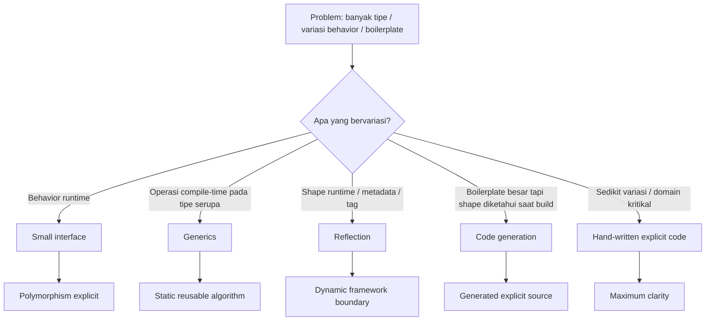
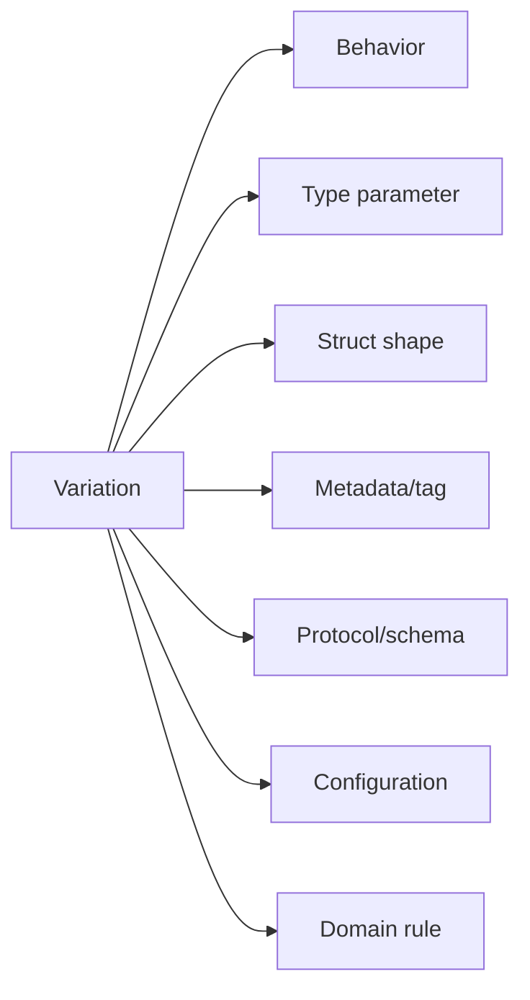
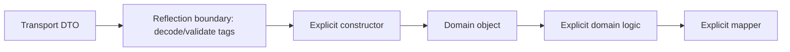
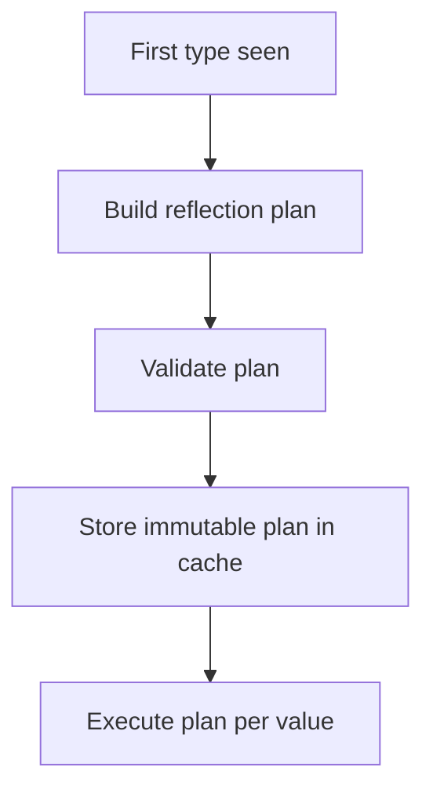
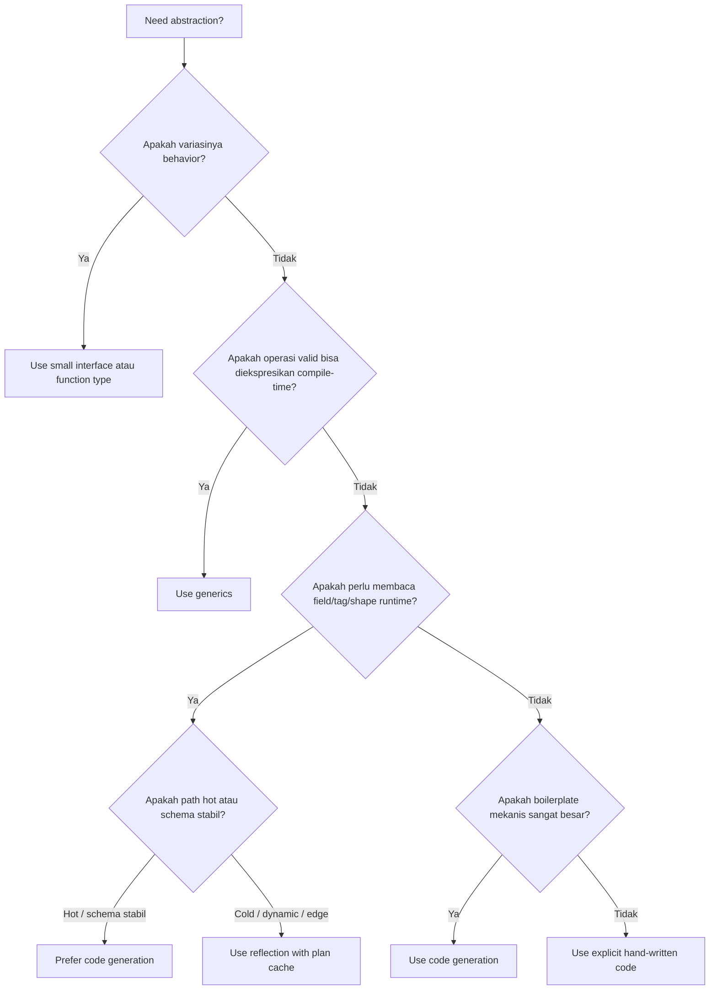
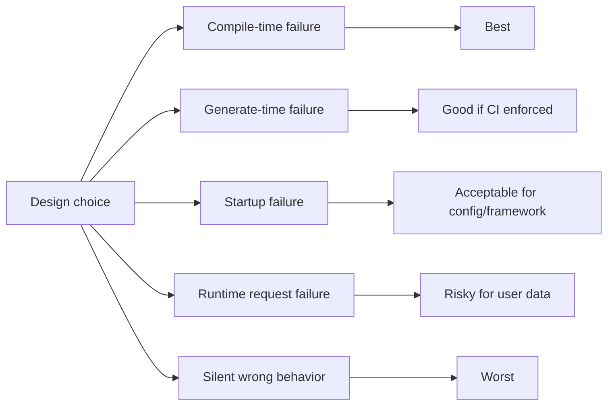
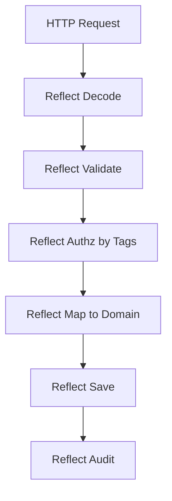
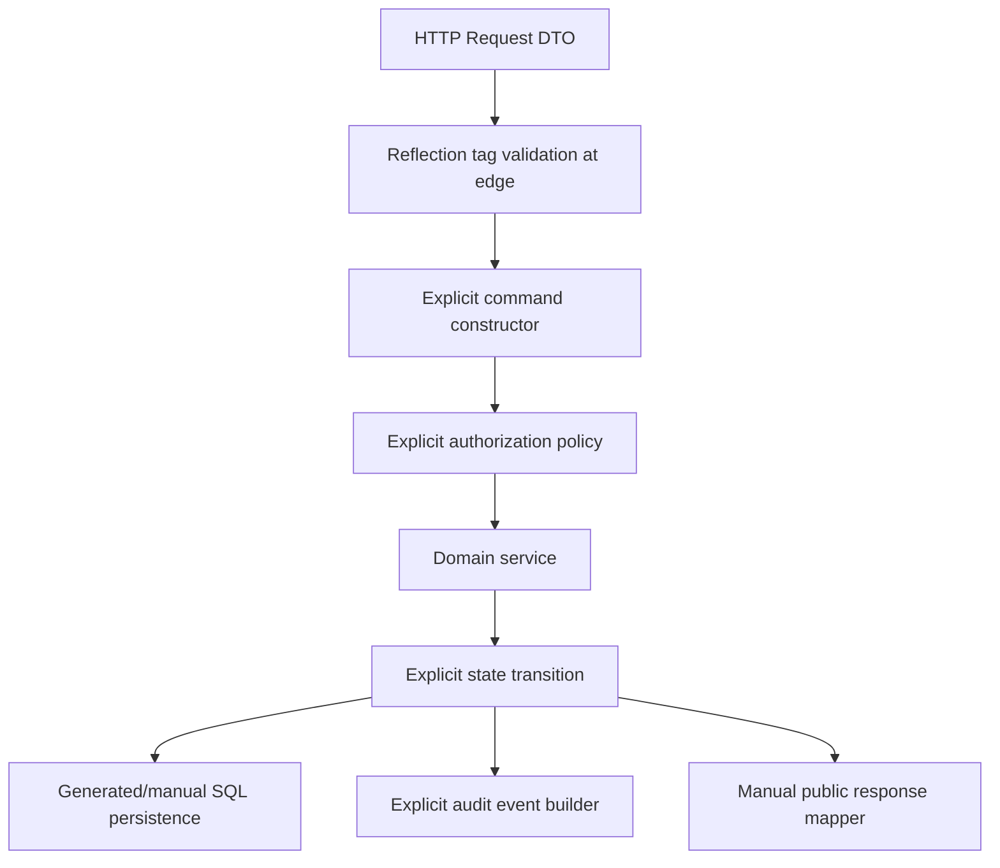
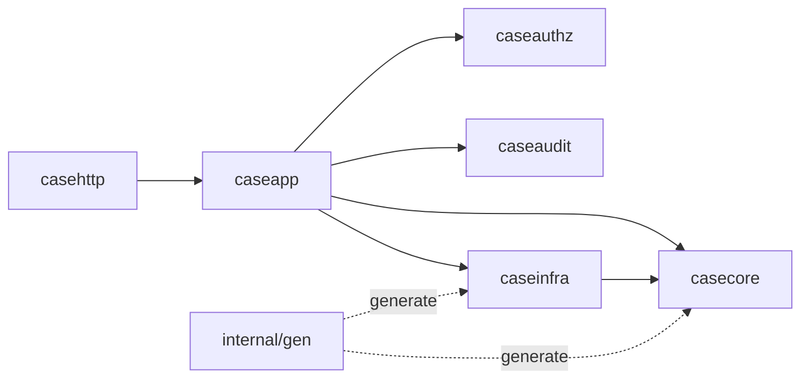

# learn-go-composition-oop-functional-reflection-codegen-modules-part-018.md

# Part 018 — Reflection vs Generics vs Code Generation: Decision Framework untuk Production Go

> Seri: `learn-go-composition-oop-functional-reflection-codegen-modules`  
> Bagian: `018 / 030`  
> Status seri: **belum selesai**  
> Target pembaca: Java software engineer / tech lead yang ingin mendesain library, framework kecil, domain platform, dan enterprise Go codebase dengan keputusan abstraction yang defensible.

---

## 0. Tujuan Bagian Ini

Pada bagian sebelumnya kita sudah membahas reflection dari sisi mental model, struct metadata, safety, caching, dan performance. Sekarang kita naik satu level: **bagaimana memilih antara reflection, generics, code generation, interface biasa, atau explicit hand-written code**.

Ini adalah salah satu keputusan desain paling penting di Go modern.

Di Java, pilihan abstraction sering terlihat seperti ini:

```text
interface / abstract class / annotation / reflection / proxy / annotation processor / bytecode generation
```

Di Go, bentuknya berbeda:

```text
small interface / generics constraint / reflection / go generate / AST/type-aware generator / hand-written code
```

Kesalahan umum Java engineer ketika pindah ke Go adalah membawa intuisi berikut:

> Kalau tipe berbeda-beda dan logic mirip, buat framework generic/reflection/annotation-style.

Di Go, intuisi itu sering terlalu mahal.

Go lebih suka desain yang:

1. eksplisit,
2. mudah dibaca dari source,
3. compile-time friendly,
4. dependency-nya kecil,
5. failure mode-nya jelas,
6. tooling-nya sederhana,
7. API compatibility-nya stabil,
8. runtime behavior-nya tidak tersembunyi.

Namun bukan berarti reflection atau code generation buruk. Keduanya sangat berguna bila ditempatkan di boundary yang tepat.

Bagian ini membangun **decision framework** yang bisa dipakai saat Anda mendesain:

- mapper,
- validator,
- serializer,
- repository helper,
- domain rules engine,
- config loader,
- OpenAPI/client generator,
- SQL scanner,
- enum/stringer,
- mocks/test doubles,
- module/package public API,
- enterprise platform library.

---

## 1. Baseline Resmi Go yang Relevan

Beberapa fakta bahasa/tooling yang menjadi fondasi desain:

1. Go adalah bahasa statically typed. Type menentukan set nilai serta operasi/method yang valid pada nilai tersebut.
2. Interface di Go dapat merepresentasikan method set, dan untuk constraint generic, interface juga dapat memiliki type set.
3. Package `reflect` menyediakan runtime reflection untuk memanipulasi object dengan arbitrary type.
4. `go generate` menjalankan command berdasarkan directive di source file, tetapi bukan bagian otomatis dari `go build` dan tidak melakukan dependency analysis penuh.
5. Go 1.26 memperkuat tooling modernisasi melalui `go fix`, dan mendukung perubahan bahasa seperti `new` dengan initial value serta self-referential generic constraints.

Implikasi praktis:

- **Generics** memberi compile-time abstraction, tetapi hanya untuk operasi yang bisa diekspresikan lewat type parameter/constraint.
- **Reflection** memberi runtime introspection, tetapi harus membayar cost runtime, panic surface, dan hilangnya sebagian static guarantee.
- **Code generation** memberi hasil compile-time yang eksplisit, tetapi menambah toolchain, reproducibility, review, dan governance cost.
- **Interface biasa** tetap sangat kuat untuk behavior polymorphism, tetapi tidak cocok untuk semua bentuk data-shape abstraction.

---

## 2. Peta Besar Pilihan Abstraction

Sebelum membandingkan tiga teknik utama, kita harus menambahkan dua baseline: **hand-written code** dan **small interface**.



Mental model utama:

| Teknik | Pertanyaan desain |
|---|---|
| Hand-written code | Apakah boilerplate ini sebenarnya domain clarity? |
| Interface | Apakah variasinya adalah behavior? |
| Generics | Apakah variasinya adalah type, tetapi operasi bisa diketahui compile-time? |
| Reflection | Apakah program perlu membaca shape/metadata type saat runtime? |
| Code generation | Apakah boilerplate bisa dibuat eksplisit sebelum compile? |

---

## 3. Jangan Mulai dari Tool, Mulai dari Variasi

Sebelum memilih generics/reflection/codegen, tanyakan:

> Apa yang sebenarnya berubah antar use case?

Ada beberapa jenis variasi:



Mapping awal:

| Variation | Biasanya cocok |
|---|---|
| Behavior berbeda | interface / function type / strategy |
| Algorithm sama untuk type berbeda | generics |
| Struct field/tag dibaca runtime | reflection |
| Schema/protocol external | code generation |
| Config berbeda | functional options / config struct |
| Domain rule eksplisit | interface/function/policy object |
| Boilerplate mekanis | codegen bila besar, manual bila kecil |

Contoh sederhana:

- `PaymentAuthorizer`, `CaseEscalator`, `RiskScorer` → interface/function.
- `Set[T comparable]`, `MapKeys[K comparable, V any]` → generics.
- `validate:"required,max=100"` → reflection metadata.
- protobuf/OpenAPI/SQLC → code generation.
- `WithTimeout`, `WithLogger`, `WithRetryPolicy` → functional options.

---

## 4. Dimensi Evaluasi Production

Keputusan abstraction tidak boleh hanya berdasarkan “lebih sedikit code”. Gunakan dimensi berikut.

| Dimensi | Pertanyaan |
|---|---|
| Static guarantee | Apakah compiler bisa menangkap kesalahan? |
| Runtime safety | Apakah ada panic/silent behavior? |
| Performance | Apakah path ini hot path? |
| Allocation | Apakah per-call allocation signifikan? |
| API stability | Apakah perubahan ini breaking? |
| Debuggability | Apakah stack trace/source jelas? |
| Observability | Apakah bisa diberi log/metric/span yang bermakna? |
| Testability | Apakah behavior bisa diuji tanpa framework berat? |
| Tooling | Apakah IDE, `go test`, `go vet`, CI mudah? |
| Reproducibility | Apakah build deterministic? |
| Onboarding | Apakah engineer baru bisa paham dari source? |
| Security | Apakah data sensitive bisa bocor lewat generic mapper/logger? |
| Governance | Siapa maintain generator/framework? |

Rule of thumb:

> Di Go, abstraction yang “mengurangi jumlah baris” tetapi mengurangi compile-time guarantee dan debuggability sering bukan abstraction yang lebih baik.

---

## 5. Hand-Written Code: Baseline yang Sering Diremehkan

Sebelum memakai tool kuat, evaluasi apakah code manual lebih baik.

Contoh mapper eksplisit:

```go
func ToCaseDTO(c casecore.Case) CaseDTO {
    return CaseDTO{
        ID:        c.ID().String(),
        Status:    string(c.Status()),
        Priority:  string(c.Priority()),
        CreatedAt: c.CreatedAt().UTC(),
    }
}
```

Ini terlihat repetitive, tetapi punya kelebihan:

- semua mapping terlihat,
- invariant domain bisa dihormati,
- field rename memicu compile error,
- transformation eksplisit,
- security review mudah,
- tidak ada magic tag,
- tidak ada runtime reflection panic,
- tidak ada generated file drift.

Manual mapping sangat cocok untuk:

- domain object ↔ API DTO,
- persistence ↔ domain aggregate,
- security-sensitive redaction,
- regulatory audit output,
- logic dengan semantic transformation,
- boundary antar bounded context.

Manual mapping kurang cocok untuk:

- ratusan flat DTO mekanis,
- generated protocol schema,
- database row boilerplate besar,
- repetitive enum/string mapping,
- clone/copy code yang benar-benar mekanis.

### 5.1 Hidden Cost dari “Menghilangkan Boilerplate”

Tidak semua boilerplate buruk.

Ada dua jenis boilerplate:

```text
incidental boilerplate = noise mekanis tanpa nilai domain
semantic boilerplate   = code eksplisit yang memuat keputusan bisnis/security
```

Contoh semantic boilerplate:

```go
func ToPublicCaseView(c casecore.Case, actor authz.Actor) PublicCaseView {
    view := PublicCaseView{
        ID:     c.ID().String(),
        Status: c.Status().PublicLabel(),
    }

    if actor.CanViewSensitiveRiskScore() {
        view.RiskScore = ptr(c.RiskScore().Value())
    }

    return view
}
```

Kalau ini diganti generic reflection mapper, Anda berisiko:

- membocorkan field sensitive,
- melewati authorization,
- membuat mapping bergantung pada nama field,
- kehilangan auditability,
- membuat perubahan domain diam-diam mengubah output.

---

## 6. Interface: Untuk Behavior, Bukan Shape Data

Interface cocok ketika variasinya adalah behavior.

```go
type EscalationPolicy interface {
    Evaluate(ctx context.Context, c Case) (EscalationDecision, error)
}
```

Interface tidak cocok bila Anda hanya ingin “semua struct yang punya field ID”. Go interface tidak menyatakan field requirement. Untuk shape data, pilihannya biasanya:

- explicit method,
- generics constraint dengan method,
- reflection,
- codegen,
- manual code.

Contoh mengubah shape menjadi behavior:

```go
type Identified interface {
    ID() CaseID
}
```

Ini lebih Go-like daripada ingin constraint “punya field ID”.

### 6.1 Interface vs Generics

Interface runtime:

```go
func Authorize(ctx context.Context, p Policy, actor Actor, action Action) error {
    return p.Allow(ctx, actor, action)
}
```

Generics compile-time:

```go
func Contains[T comparable](items []T, target T) bool {
    for _, item := range items {
        if item == target {
            return true
        }
    }
    return false
}
```

Perbedaan mental model:

| Interface | Generics |
|---|---|
| Runtime polymorphism | Compile-time parametric polymorphism |
| Fokus behavior | Fokus algorithm atas type family |
| Bisa heterogenous collection | Biasanya homogeneous per instantiation |
| Cocok untuk dependency boundary | Cocok untuk reusable data/algorithm utility |
| Method dispatch dynamic | Operasi type-checked per instantiation |

---

## 7. Generics: Compile-Time Reuse, Bukan Framework Generator

Generics cocok untuk algorithm yang sama pada banyak type.

Contoh ideal:

```go
func MapSlice[A any, B any](items []A, fn func(A) B) []B {
    out := make([]B, 0, len(items))
    for _, item := range items {
        out = append(out, fn(item))
    }
    return out
}
```

Contoh lain:

```go
type Set[T comparable] map[T]struct{}

func (s Set[T]) Add(v T) {
    s[v] = struct{}{}
}

func (s Set[T]) Has(v T) bool {
    _, ok := s[v]
    return ok
}
```

Generics bagus bila:

- operasi terhadap type bisa diketahui compile-time,
- tidak perlu membaca field/tag runtime,
- constraint bisa dibuat kecil dan jelas,
- caller mendapat compile-time error,
- tidak ada kebutuhan heterogenous runtime collection,
- abstraction tidak menyembunyikan domain logic.

Generics buruk bila:

- constraint menjadi rumit,
- type parameter ada tetapi tidak memberi safety,
- function body penuh type switch/reflection,
- ingin mengakses field struct by name,
- ingin membuat mini-framework annotation-style,
- mengurangi readability dibanding explicit code.

### 7.1 Generic Smell: Type Parameter yang Tidak Dipakai Bermakna

Smell:

```go
func Decode[T any](data []byte) (T, error) {
    var out T
    err := json.Unmarshal(data, &out)
    return out, err
}
```

Ini bisa valid sebagai convenience function, tetapi secara safety tidak banyak berbeda dari:

```go
func Decode(data []byte, out any) error
```

Generic `T` di sini tidak menghilangkan runtime decoding failure. Ia hanya mengubah ergonomics.

Pertanyaan review:

- Apakah `T` memberi compile-time operation guarantee?
- Atau hanya membungkus runtime reflection library?
- Apakah error behavior tetap jelas?
- Apakah zero value `T` aman saat error?

Versi yang lebih eksplisit:

```go
func DecodeJSON[T any](data []byte) (T, error) {
    var zero T
    var out T
    if err := json.Unmarshal(data, &out); err != nil {
        return zero, fmt.Errorf("decode json: %w", err)
    }
    return out, nil
}
```

Tetap boleh, tetapi jangan menganggapnya compile-time safe mapping.

### 7.2 Generic Constraint yang Baik

Constraint baik biasanya kecil dan langsung berhubungan dengan operasi.

```go
type ID interface {
    ~string | ~int64
}

func EqualID[T ID](a, b T) bool {
    return a == b
}
```

Atau method-based:

```go
type Validatable interface {
    Validate() error
}

func ValidateAll[T Validatable](items []T) error {
    for i, item := range items {
        if err := item.Validate(); err != nil {
            return fmt.Errorf("item %d: %w", i, err)
        }
    }
    return nil
}
```

Namun hati-hati: bila behavior-nya runtime dependency, interface biasa mungkin lebih sederhana.

---

## 8. Reflection: Runtime Metadata Boundary

Reflection cocok ketika logic membutuhkan informasi type saat runtime.

Contoh:

- membaca struct tag,
- dynamic config loader,
- validator berbasis tag,
- serializer/deserializer,
- generic database scanner,
- dependency injection container kecil,
- test helper,
- adapter ke external framework.

Contoh reflection boundary:

```go
func ValidateStruct(v any) error {
    rv := reflect.ValueOf(v)
    if rv.Kind() == reflect.Pointer {
        if rv.IsNil() {
            return errors.New("nil pointer")
        }
        rv = rv.Elem()
    }
    if rv.Kind() != reflect.Struct {
        return fmt.Errorf("expected struct, got %s", rv.Kind())
    }

    // parse metadata, validate fields...
    return nil
}
```

Reflection bagus bila:

- input type tidak diketahui oleh package saat compile,
- contract berbasis metadata/tag,
- shape lebih penting daripada behavior,
- API framework butuh menerima arbitrary struct,
- cost runtime masih dapat diterima,
- metadata bisa di-cache,
- panic surface dibungkus menjadi error.

Reflection buruk bila:

- hot path per request tanpa caching,
- domain mapping security-sensitive,
- field rename harus caught compile-time,
- invariant domain penting,
- library behavior sulit diprediksi,
- silent ignore bisa terjadi,
- error baru muncul di production data.

### 8.1 Reflection Boundary Harus Kecil

Desain buruk:

```text
business service -> reflection mapper -> reflection validator -> reflection authz -> reflection auditor
```

Desain lebih baik:



Reflection sebaiknya berada di edge:

- input decoding,
- config loading,
- validation of DTO,
- framework integration,
- development tooling,
- generated plan building.

Reflection sebaiknya tidak menjadi core domain model.

### 8.2 Reflection Plan Pattern

Untuk performance dan safety, jangan interpret tag setiap call.



Pseudo-code:

```go
type structPlan struct {
    typ    reflect.Type
    fields []fieldPlan
}

type fieldPlan struct {
    name  string
    index []int
    rule  rule
}
```

Dengan pattern ini:

- parsing tag dilakukan sekali per type,
- ambiguity ditemukan lebih awal,
- execution path lebih kecil,
- cache bisa concurrent-safe,
- panic surface berkurang.

---

## 9. Code Generation: Compile-Time Explicitness dengan Tooling Cost

Code generation cocok ketika boilerplate besar, mekanis, dan shape diketahui sebelum compile.

Contoh:

- protobuf/gRPC code,
- OpenAPI client/server stubs,
- SQL query bindings,
- enum stringer,
- mocks,
- DTO mapper,
- validator,
- dependency registry,
- error code table,
- permission/action registry,
- typed config schema.

Keunggulan codegen:

- hasilnya Go source biasa,
- compile-time checking,
- lebih cepat dari reflection hot path,
- IDE bisa navigate hasil generate,
- generated code bisa direview bila policy mengharuskan,
- runtime behavior lebih eksplisit.

Cost codegen:

- generator harus dirawat,
- generated file bisa drift,
- CI harus memastikan reproducibility,
- error generator kadang sulit dibaca,
- developer harus tahu kapan regenerate,
- versioning schema/generator harus dikontrol,
- generated code bisa noisy di PR.

### 9.1 `go generate` Bukan Build Step Otomatis

Ini sangat penting.

`go generate` adalah command eksplisit. Ia menjalankan directive seperti:

```go
//go:generate go run ./cmd/casegen -type=CaseStatus
```

Tetapi `go build` tidak otomatis menjalankan generator. Karena itu enterprise policy harus jelas:

- generated file commit atau tidak?
- generator version pinning bagaimana?
- CI menjalankan generate lalu diff?
- hasil generate deterministic?
- bagaimana handling developer Windows/Linux/macOS?
- apakah generator membutuhkan network?
- apakah generator bergantung pada local state?

Rule production:

> Generator boleh kompleks, tetapi invocation-nya harus sederhana, deterministic, dan bisa dijalankan di CI tanpa rahasia lokal.

### 9.2 Generated File Contract

Generated file harus punya header:

```go
// Code generated by casegen v1.4.2; DO NOT EDIT.
```

Sebaiknya juga memuat input utama:

```go
// Source: internal/case/status.go
// Command: go run ./cmd/casegen -type=CaseStatus
```

Contract minimum:

- deterministic output,
- formatted dengan `gofmt`/`go/format`,
- stable import ordering,
- no timestamp volatile kecuali sengaja,
- clear error message,
- exit non-zero bila gagal,
- tidak diam-diam skip file,
- kompatibel lint/test pipeline.

---

## 10. Matrix Utama: Reflection vs Generics vs Codegen

| Dimensi | Generics | Reflection | Code Generation |
|---|---|---|---|
| Waktu keputusan | Compile-time | Runtime | Pre-compile/generate-time |
| Static safety | Tinggi | Rendah–sedang | Tinggi setelah generated |
| Runtime overhead | Rendah | Sedang–tinggi | Rendah |
| Boilerplate user | Rendah | Rendah | Rendah–sedang |
| Tooling cost | Rendah | Rendah–sedang | Sedang–tinggi |
| Debuggability | Tinggi | Sedang/rendah | Sedang/tinggi |
| Cocok untuk tag metadata | Tidak | Ya | Ya, bila input schema tersedia |
| Cocok untuk algorithms | Ya | Jarang | Kadang |
| Cocok untuk protocol/schema | Kadang | Kadang | Ya |
| Cocok untuk hot path | Ya | Hati-hati | Ya |
| Failure timing | Compile-time | Runtime | Generate/compile-time |
| API complexity risk | Constraint rumit | Magic behavior | Toolchain drift |

---

## 11. Decision Tree Praktis

Gunakan tree ini saat review desain.



---

## 12. Use Case 1: DTO Mapping

### 12.1 Manual Mapping

```go
func ToCaseResponse(c casecore.Case) CaseResponse {
    return CaseResponse{
        ID:          c.ID().String(),
        Status:      c.Status().String(),
        Priority:    c.Priority().String(),
        SubmittedAt: c.SubmittedAt().UTC(),
    }
}
```

Pilih ini bila:

- ada transformation semantic,
- ada redaction,
- ada authorization,
- domain invariant penting,
- field tidak one-to-one,
- regulatory audit butuh explicit mapping.

### 12.2 Reflection Mapper

```go
type CaseResponse struct {
    ID       string `map:"id"`
    Status   string `map:"status"`
    Priority string `map:"priority"`
}
```

Pilih ini bila:

- mapping flat,
- low-risk,
- banyak struct mirip,
- error bisa runtime,
- mapping ada di edge,
- performance tidak kritikal atau plan-cache tersedia.

Risiko:

- field rename tidak compile error,
- tag salah baru ketahuan runtime,
- silent omission,
- security leak,
- domain transformation tersembunyi.

### 12.3 Codegen Mapper

```go
//go:generate go run ./cmd/mappergen -source=Case -target=CaseResponse
```

Pilih ini bila:

- mapping banyak dan mekanis,
- ingin compile-time generated code,
- schema stabil,
- performance penting,
- CI bisa enforce regeneration,
- generated code mudah direview.

Decision:

| Mapping type | Pilihan |
|---|---|
| Domain → public API | manual |
| Internal flat DTO low-risk | reflection atau codegen |
| High-volume mapper | codegen/manual |
| Security-sensitive | manual |
| External schema generated | codegen |

---

## 13. Use Case 2: Validation

### 13.1 Method-Based Validation

```go
type Validatable interface {
    Validate() error
}
```

Cocok untuk domain object:

```go
func (c CreateCaseCommand) Validate() error {
    if c.Subject == "" {
        return errors.New("subject required")
    }
    if c.SubmitterID == "" {
        return errors.New("submitter required")
    }
    return nil
}
```

Kelebihan:

- explicit,
- compile-time,
- domain rule bisa kompleks,
- mudah test,
- mudah audit.

### 13.2 Reflection Tag Validation

```go
type CreateCaseRequest struct {
    Subject string `validate:"required,min=5,max=200"`
    Email   string `validate:"required,email"`
}
```

Cocok untuk transport DTO, bukan domain core.

Kelebihan:

- ringkas,
- cocok untuk request validation umum,
- reusable,
- metadata declarative.

Risiko:

- tag typo,
- runtime error,
- cross-field rule sulit,
- localization/error mapping kompleks,
- domain invariant bisa tersebar.

### 13.3 Generated Validation

Generated validation cocok bila:

- schema kuat,
- banyak DTO,
- performance penting,
- rule set formal,
- perlu compile-time-ish generated code.

Contoh generated output:

```go
func (r CreateCaseRequest) ValidateGenerated() error {
    if r.Subject == "" {
        return ValidationError{Field: "subject", Code: "required"}
    }
    if len(r.Subject) < 5 {
        return ValidationError{Field: "subject", Code: "min"}
    }
    return nil
}
```

Decision:

| Validation type | Pilihan |
|---|---|
| Domain invariant | method/manual |
| Transport required/basic format | reflection tag |
| High-volume DTO schema | codegen |
| Cross-field business rule | manual/method |
| Regulatory defensibility | explicit manual + tests |

---

## 14. Use Case 3: Repository / SQL Scanner

Misalnya Anda ingin scan row ke struct.

### 14.1 Reflection Scanner

```go
type CaseRow struct {
    ID     string `db:"case_id"`
    Status string `db:"status"`
}
```

Reflection scanner berguna untuk CRUD sederhana, tetapi punya risiko:

- column mismatch runtime,
- null handling tricky,
- type conversion runtime,
- performance overhead,
- query drift,
- silent missing column bila library permisif.

### 14.2 Codegen SQL

Codegen dari SQL/schema memberi:

- generated scan code,
- compile-time struct fields,
- less reflection,
- query sebagai source of truth,
- easier review.

Namun harus ada governance:

- DB schema migration sync,
- generated code diff,
- SQL compatibility,
- migration rollout.

### 14.3 Manual Scanner

Untuk query penting:

```go
func scanCase(row scanner) (CaseRow, error) {
    var r CaseRow
    if err := row.Scan(&r.ID, &r.Status, &r.Priority); err != nil {
        return CaseRow{}, fmt.Errorf("scan case row: %w", err)
    }
    return r, nil
}
```

Manual scan tetap bagus untuk:

- query penting,
- performance critical,
- custom null handling,
- audit query,
- migration-sensitive path.

---

## 15. Use Case 4: Enum/Stringer/Error Code

Enum string conversion adalah contoh codegen yang sangat cocok.

Manual:

```go
type CaseStatus int

const (
    CaseDraft CaseStatus = iota
    CaseSubmitted
    CaseApproved
    CaseRejected
)

func (s CaseStatus) String() string {
    switch s {
    case CaseDraft:
        return "DRAFT"
    case CaseSubmitted:
        return "SUBMITTED"
    case CaseApproved:
        return "APPROVED"
    case CaseRejected:
        return "REJECTED"
    default:
        return "UNKNOWN"
    }
}
```

Bila enum banyak, codegen membantu:

- menghindari lupa case,
- konsisten parsing,
- bisa generate `MarshalText`, `UnmarshalText`, `IsValid`, `AllStatuses`,
- bisa enforce registry.

Reflection tidak cocok untuk enum stringer karena tidak perlu runtime shape.

Generics juga biasanya tidak menambah banyak value kecuali untuk helper registry generic.

Decision:

```text
enum stringer => codegen/manual
reflection    => no
heavy generic => usually no
```

---

## 16. Use Case 5: Dependency Injection / Wiring

Java sering memakai reflection/annotation DI container. Di Go, default terbaik sering explicit wiring.

```go
func NewApp(cfg Config) (*App, error) {
    db, err := NewDB(cfg.DB)
    if err != nil {
        return nil, err
    }

    repo := caseinfra.NewRepository(db)
    policy := casepolicy.NewEscalationPolicy(cfg.Policy)
    svc := caseapp.NewService(repo, policy)

    return &App{CaseService: svc}, nil
}
```

Kelebihan:

- dependency graph terlihat,
- init order jelas,
- error handling eksplisit,
- config validation jelas,
- tidak butuh magic runtime.

Reflection DI container bisa dipakai untuk aplikasi tertentu, tetapi risikonya:

- dependency error runtime,
- cyclic dependency lebih sulit dilihat,
- constructor selection magic,
- startup panic,
- sulit trace ownership resource.

Codegen DI adalah kompromi:

- source dependency graph tetap eksplisit di generated code,
- compile-time lebih kuat,
- startup overhead rendah,
- tetapi tooling cost naik.

Decision:

| Scale | Pilihan |
|---|---|
| Small/medium app | manual wiring |
| Large app with repeated wiring | codegen DI boleh |
| Dynamic plugin | reflection/registry |
| Core domain | avoid reflection DI |

---

## 17. Use Case 6: Authorization / Permission Registry

Untuk regulatory system, authorization sering butuh defensibility.

Buruk:

```go
// auto-map method name to permission using reflection
```

Risiko:

- permission implicit,
- rename method mengubah security behavior,
- audit sulit,
- default allow/deny bisa salah,
- sulit review.

Lebih baik:

```go
type Permission string

const (
    PermissionCaseApprove Permission = "case.approve"
    PermissionCaseReject  Permission = "case.reject"
)

type Policy interface {
    Allow(ctx context.Context, actor Actor, permission Permission, resource Resource) error
}
```

Registry bisa manual atau generated dari source table.

```go
var AllPermissions = []Permission{
    PermissionCaseApprove,
    PermissionCaseReject,
}
```

Untuk permission, codegen bisa valid bila:

- source declarative direview,
- generated registry deterministic,
- CI memastikan tidak drift,
- default deny tetap eksplisit,
- audit trail punya permission ID stabil.

Reflection untuk authorization harus sangat dibatasi.

---

## 18. Runtime Failure vs Compile-Time Failure

Ini dimensi paling penting.



Prefer urutan:

```text
compile-time > generate-time in CI > startup-time > runtime request-time > silent behavior
```

Reflection sering menggeser error ke runtime. Codegen bisa menggeser error ke generate/compile time. Generics menjaga error di compile time.

---

## 19. Performance Model

Jangan hanya bertanya “reflection lambat atau tidak?”. Tanya:

1. Apakah path ini hot?
2. Berapa call per request?
3. Apakah metadata di-cache?
4. Apakah reflection dipakai untuk plan build atau execution?
5. Apakah allocation terlihat di benchmark?
6. Apakah generated/manual code akan mengurangi tail latency?
7. Apakah complexity generator sepadan?

### 19.1 Cold Path

Reflection sering acceptable untuk:

- config load startup,
- CLI command parsing,
- migration tooling,
- test helper,
- admin-only endpoint,
- schema inspection once.

### 19.2 Warm Path

Reflection dengan plan cache bisa acceptable untuk:

- request DTO validation,
- JSON-like mapping,
- logging redaction,
- database row mapping pada traffic sedang.

### 19.3 Hot Path

Prefer manual/codegen/generics untuk:

- per-record high-volume processing,
- audit export jutaan row,
- message broker consumer high throughput,
- low-latency API,
- tight loop mapping,
- cryptographic/security-sensitive transform,
- high-cardinality telemetry processing.

---

## 20. API Compatibility Implications

### 20.1 Generics Compatibility

Mengubah constraint bisa breaking.

Contoh:

```go
func Process[T any](v T) error
```

Jika nanti diubah menjadi:

```go
func Process[T interface{ Validate() error }](v T) error
```

Caller lama yang tidak punya `Validate` akan gagal compile.

Constraint adalah bagian dari API contract.

### 20.2 Reflection Tag Compatibility

Mengubah tag bisa breaking secara runtime, meskipun compile tetap sukses.

```go
type Request struct {
    CaseID string `json:"caseId" validate:"required"`
}
```

Mengubah `caseId` ke `case_id` dapat memutus client.

Reflection metadata harus diperlakukan sebagai API, bukan komentar.

### 20.3 Codegen Compatibility

Generator version adalah bagian dari supply chain.

Breaking bisa muncul dari:

- perubahan generated API,
- perubahan naming,
- perubahan import path,
- perubahan zero/null handling,
- perubahan error type,
- perubahan default behavior,
- perubahan runtime dependency generated code.

Policy:

- pin generator version,
- changelog generator,
- generated diff review,
- compatibility tests,
- migration guide.

---

## 21. Observability dan Debuggability

Abstraction harus tetap bisa diobservasi.

### 21.1 Interface/Manual

Mudah diberi log:

```go
logger.Info("case approved", "case_id", id, "actor", actor.ID())
```

### 21.2 Generics

Generic function perlu context naming yang jelas.

Buruk:

```go
return fmt.Errorf("process failed: %w", err)
```

Lebih baik:

```go
return fmt.Errorf("process case commands: item %d: %w", i, err)
```

### 21.3 Reflection

Reflection harus melaporkan path metadata:

```text
field "Submitter.Email" validate:"email": invalid email format
```

Bukan:

```text
invalid field
```

### 21.4 Codegen

Generated code harus bisa di-debug:

- generated file diformat,
- line numbers stabil,
- error mencantumkan source schema,
- jangan minify generated Go,
- jangan generate code yang mustahil dibaca.

---

## 22. Security Model

Reflection dan generic mapper bisa berbahaya untuk data sensitive.

Contoh field:

```go
type OfficerInternalView struct {
    ID           string
    Email        string
    PasswordHash string
    MFASecret    string
}
```

Generic mapper by field name dapat membocorkan field jika target punya nama sama.

Rule:

1. Public output mapping harus explicit atau generated dari allowlist.
2. Jangan pakai reflection mapper default untuk sensitive data.
3. Redaction harus default deny.
4. Permission/field visibility harus diuji.
5. Generated serializers harus punya golden test.
6. Reflection logger harus support denylist/allowlist tag.

Contoh safer tag:

```go
type OfficerInternalView struct {
    ID           string `log:"safe"`
    Email        string `log:"safe"`
    PasswordHash string `log:"never"`
    MFASecret    string `log:"never"`
}
```

Namun untuk security tinggi, explicit redaction lebih defensible.

---

## 23. Testing Strategy per Teknik

### 23.1 Manual/Interface

- table-driven tests,
- contract tests,
- fake implementation,
- edge cases eksplisit,
- authorization scenario tests.

### 23.2 Generics

Test minimal beberapa representative type:

```go
func TestSet(t *testing.T) {
    testSetWith[string](t, "a", "b")
    testSetWith[int](t, 1, 2)
}
```

Perhatikan:

- zero value,
- pointer type,
- custom defined type,
- comparable semantics,
- nil-like values.

### 23.3 Reflection

Test harus mencakup:

- non-struct input,
- nil pointer,
- pointer/value,
- unexported field,
- embedded field,
- ambiguous promoted field,
- invalid tag,
- unsupported kind,
- typed nil,
- concurrent cache access,
- panic containment.

### 23.4 Codegen

Test generator dan generated output:

- golden file tests,
- generated code compile test,
- idempotency test,
- gofmt test,
- CI diff test,
- malformed input test,
- version compatibility test.

---

## 24. Governance untuk Enterprise Codebase

Untuk team besar, abstraction decision harus menjadi policy, bukan preferensi personal.

### 24.1 Abstraction Review Checklist

Sebelum approve PR yang memakai generics/reflection/codegen, tanya:

1. Problem variasinya apa?
2. Kenapa interface/manual code tidak cukup?
3. Apakah failure terjadi compile-time, generate-time, startup-time, atau runtime?
4. Apakah ada silent failure?
5. Apakah path ini hot?
6. Apakah benchmark diperlukan?
7. Apakah field sensitive mungkin bocor?
8. Apakah API compatibility berubah?
9. Apakah testing mencakup edge cases teknik tersebut?
10. Apakah developer baru bisa memahami behavior dari source?
11. Apakah CI menjaga generator drift?
12. Apakah error message actionable?

### 24.2 Policy Sederhana

Contoh policy:

```text
1. Domain core: prefer explicit code, interface kecil, dan constructor invariant.
2. Transport edge: reflection tag validation boleh, dengan plan cache dan strict mode.
3. Public mapping/security output: manual atau generated allowlist only.
4. High-throughput path: generics/manual/codegen; reflection harus dibenchmark.
5. Codegen wajib deterministic, gofmt, pinned, dan dicek CI.
6. Generics constraint harus minimal dan menjadi bagian dari API review.
7. Reflection panic harus ditransform menjadi error, kecuali programmer error internal.
```

---

## 25. Studi Kasus: Regulatory Case Platform Library

Bayangkan kita membuat internal Go platform untuk lifecycle enforcement case.

Kebutuhan:

- command validation,
- domain invariant,
- authorization,
- audit event generation,
- DTO mapping,
- SQL persistence,
- enum status,
- API client,
- workflow transition.

### 25.1 Salah Desain: Reflection Everywhere



Masalah:

- authorization implicit,
- invariant domain lemah,
- audit tidak defensible,
- field rename runtime failure,
- security review sulit,
- performance tidak jelas,
- terlalu banyak hidden behavior.

### 25.2 Desain Lebih Baik



Pilihan teknik:

| Concern | Pilihan |
|---|---|
| Request basic validation | reflection tag validator |
| Command invariant | manual constructor/method |
| Authorization | explicit policy interface |
| State transition | explicit domain logic |
| Status enum string | codegen/manual |
| SQL persistence | manual untuk critical query, codegen untuk repetitive query |
| Audit event | explicit builder |
| Public response | manual allowlist mapping |
| Internal collection helper | generics |
| API client from OpenAPI | codegen |

### 25.3 Example Structure

```text
caseplatform/
  casecore/
    case.go
    status.go
    transition.go
  caseapp/
    approve_command.go
    approve_service.go
  caseauthz/
    permission.go
    policy.go
  casehttp/
    approve_request.go
    handler.go
    validate.go
  caseaudit/
    event.go
    builder.go
  caseinfra/
    repository.go
    sql_generated.go
  internal/gen/
    statusgen/
    sqlgen/
```

Abstraction boundary:



Reflection tidak bocor ke `casecore`.

---

## 26. Decision Matrix yang Bisa Dipakai di Design Doc

Gunakan tabel ini di RFC/design review.

| Pertanyaan | Interface | Generics | Reflection | Codegen | Manual |
|---|---:|---:|---:|---:|---:|
| Behavior bervariasi? | ✅ | ⚠️ | ❌ | ⚠️ | ✅ |
| Type algorithm reusable? | ⚠️ | ✅ | ❌ | ⚠️ | ⚠️ |
| Perlu baca tag/field runtime? | ❌ | ❌ | ✅ | ⚠️ | ❌ |
| Schema external? | ⚠️ | ❌ | ⚠️ | ✅ | ⚠️ |
| Hot path? | ✅ | ✅ | ⚠️ | ✅ | ✅ |
| Security-sensitive output? | ✅ | ⚠️ | ❌ | ✅ allowlist | ✅ |
| Compile-time guarantee penting? | ✅ | ✅ | ❌ | ✅ | ✅ |
| Tooling sederhana? | ✅ | ✅ | ✅/⚠️ | ❌ | ✅ |
| Boilerplate besar mekanis? | ⚠️ | ⚠️ | ✅ | ✅ | ❌ |
| Domain invariant penting? | ✅ | ⚠️ | ❌ | ⚠️ | ✅ |

Legend:

- ✅ cocok
- ⚠️ tergantung desain
- ❌ hindari sebagai default

---

## 27. Anti-Patterns

### 27.1 Generic Karena Ingin Terlihat Modern

```go
func Save[T any](ctx context.Context, db *sql.DB, value T) error
```

Jika body akhirnya reflection atas `T`, generic tidak memberi safety berarti.

### 27.2 Reflection untuk Domain Rule

```go
// validate business rule using struct tags
Amount int `rule:"must_be_less_than_remaining_budget"`
```

Business rule penting sebaiknya explicit.

### 27.3 Codegen Tanpa CI Drift Check

Generator yang tidak dijalankan di CI akan menghasilkan bug “works on my machine”.

### 27.4 Interface Besar untuk Menghindari Generics

```go
type Repository interface {
    CreateCase(...)
    UpdateCase(...)
    DeleteCase(...)
    CreateAppeal(...)
    UpdateAppeal(...)
    DeleteAppeal(...)
}
```

Ini bukan abstraction sehat; ini god interface.

### 27.5 Reflection Mapper untuk Public API

Public API mapping harus explicit/allowlisted, bukan “copy same field names”.

### 27.6 Generator yang Menghasilkan Framework Tak Terbaca

Generated code sebaiknya Go yang jelas, bukan bytecode-style source.

### 27.7 Constraint Terlalu Pintar

Constraint yang kompleks bisa membuat API lebih sulit daripada manual overload-like functions.

---

## 28. Practical Heuristics

Gunakan heuristik berikut:

1. **Domain core: manual/interface.**
2. **Algorithm library: generics.**
3. **Metadata edge: reflection.**
4. **Protocol/schema boilerplate: codegen.**
5. **Security output: manual/generated allowlist.**
6. **Hot path: benchmark reflection; prefer codegen/manual/generics.**
7. **Small boilerplate: manual.**
8. **Large mechanical boilerplate: codegen.**
9. **Unknown runtime type: reflection, but isolate it.**
10. **Behavior polymorphism: interface/function type.**

---

## 29. Review Template

Gunakan template ini untuk design doc.

```markdown
## Abstraction Decision

### Problem
Apa boilerplate/variasi yang ingin diselesaikan?

### Variation Type
- Behavior / type algorithm / metadata / schema / config / domain rule

### Options Considered
- Manual
- Interface
- Generics
- Reflection
- Code generation

### Chosen Approach
Pendekatan yang dipilih dan alasan.

### Failure Timing
Compile-time / generate-time / startup-time / runtime / silent risk.

### Safety
Bagaimana panic, nil, invalid input, sensitive field, dan authorization ditangani?

### Performance
Apakah path hot? Apakah perlu benchmark? Apakah ada cache/generated code?

### Compatibility
Apa yang menjadi public API contract? Constraint? Tag? Generated type? File format?

### Testing
Unit, contract, golden, fuzz, benchmark, CI drift check.

### Operational Governance
Bagaimana regenerate, pin version, review generated diff, dan migration?
```

---

## 30. Latihan Desain

### Latihan 1 — Mapper

Anda punya 60 DTO internal dan 15 DTO public. Mana yang manual, reflection, codegen?

Jawaban yang defensible:

- public DTO: manual atau generated allowlist,
- internal flat DTO: reflection mapper dengan strict mode atau codegen,
- domain aggregate mapping: manual.

### Latihan 2 — Validator

Request validation punya 200 struct dengan rule required/min/max/email. Domain validation punya state transition complex.

Pilihan:

- request DTO: reflection tag validator dengan plan cache,
- domain transition: explicit method/service,
- high-volume batch validation: generated validator bila benchmark menunjukkan perlu.

### Latihan 3 — Permission Registry

Ada 300 permission action untuk enforcement lifecycle.

Pilihan:

- source permission declarative,
- generated registry + docs,
- explicit policy evaluation,
- no reflection by method name,
- CI check permission uniqueness.

### Latihan 4 — Collection Utility

Banyak package butuh `Map`, `Filter`, `GroupBy` untuk slice.

Pilihan:

- generics utility kecil,
- jangan buat functional framework besar,
- error/context semantics eksplisit bila side effect.

---

## 31. Summary Mental Model

Ingat matriks sederhana ini:

```text
behavior varies        -> interface / function type
algorithm over types   -> generics
runtime metadata       -> reflection
mechanical boilerplate -> code generation
semantic domain logic  -> manual explicit code
```

Atau versi production:

```text
Prefer compile-time failure.
Accept generate-time failure if CI enforces it.
Use startup-time failure for config/framework validation.
Avoid runtime request failure for invariant/security.
Never accept silent wrong behavior.
```

Reflection, generics, dan code generation bukan ranking “modernitas”. Mereka adalah alat dengan failure mode berbeda.

Top engineer bukan yang paling sering memakai generics/reflection/codegen, tetapi yang bisa menjawab:

- kenapa teknik ini dipilih,
- apa failure mode-nya,
- bagaimana testing-nya,
- bagaimana compatibility-nya,
- bagaimana team akan maintain-nya,
- bagaimana behavior-nya tetap jelas di production.

---

## 32. Production Checklist

Sebelum memakai generics:

- [ ] Constraint kecil dan jelas.
- [ ] Type parameter memberi compile-time value nyata.
- [ ] Tidak menyembunyikan reflection di dalam generic API tanpa alasan.
- [ ] Error/zero value semantics jelas.
- [ ] API compatibility constraint dipertimbangkan.

Sebelum memakai reflection:

- [ ] Reflection dibatasi di edge/boundary.
- [ ] Input kind/type divalidasi.
- [ ] Panic surface dikendalikan.
- [ ] Metadata di-cache bila repeated.
- [ ] Field/tag ambiguity ditangani strict.
- [ ] Sensitive field tidak bocor.
- [ ] Error message mencantumkan field/path.
- [ ] Benchmark ada bila path hot.

Sebelum memakai codegen:

- [ ] Generator deterministic.
- [ ] Generated file punya header.
- [ ] `go generate` command jelas.
- [ ] CI menjalankan generate/diff check.
- [ ] Generator version dipin.
- [ ] Generated code diformat dan readable.
- [ ] Golden tests ada untuk generator.
- [ ] Migration policy jelas.

Sebelum memilih manual code:

- [ ] Boilerplate memang tidak terlalu besar.
- [ ] Code manual membawa semantic clarity.
- [ ] Test cukup untuk mencegah drift.
- [ ] Duplication masih dalam batas wajar.

---

## 33. Hubungan ke Part Berikutnya

Part ini adalah jembatan menuju code generation.

Mulai Part 019 kita akan masuk ke:

- `go generate`,
- directive contract,
- generated file policy,
- reproducible generation,
- generator lifecycle,
- CI governance,
- source layout,
- build integration,
- failure model.

Setelah itu Part 020 dan 021 akan masuk ke AST-based dan type-aware generation.

---

## 34. Referensi Utama

- Go 1.26 Release Notes — perubahan bahasa/tooling modern, termasuk `go fix` modernizer dan perubahan generics yang relevan.
- Go Specification — type, method set, interface, type parameter, type set, assignability.
- Package `reflect` — runtime reflection, `Type`, `Value`, `Kind`, zero value, addressability/settability.
- Go Blog: The Laws of Reflection — mental model interface value dan reflection.
- Go Blog: Generating Code — `go generate` sebagai explicit authoring tool, bukan bagian otomatis dari build.
- Go Modules Reference — module/version/go directive/toolchain/go command behavior untuk governance dependency.

---

# Status Seri

Bagian ini adalah **Part 018 dari 030**.

Seri **belum selesai**.


<!-- NAVIGATION_FOOTER -->
<div class="page-nav">
<a href="./learn-go-composition-oop-functional-reflection-codegen-modules-part-017.md">⬅️ Part 017 — Reflection Performance & Safety: Allocation, Metadata Cache, Panic Boundary, `unsafe`, dan Concurrency Discipline</a>
<a href="./index.md">📚 Kategori</a>
<a href="../../index.md">🏠 Home</a>
<a href="./learn-go-composition-oop-functional-reflection-codegen-modules-part-019.md">Part 019 — Code Generation Fundamentals: `go generate`, Generated-File Contract, Reproducibility, dan CI Policy ➡️</a>
</div>
