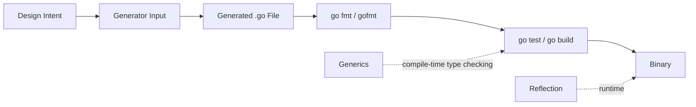
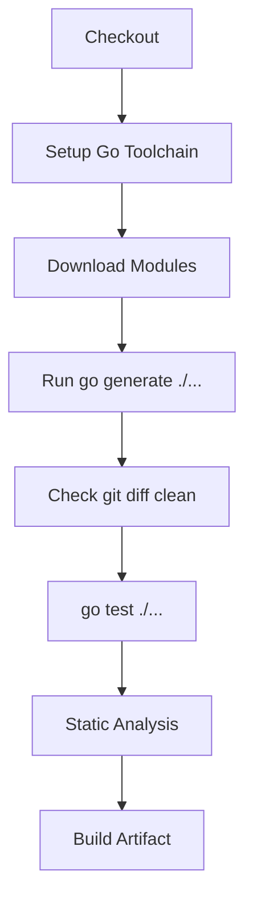
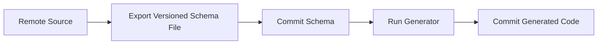
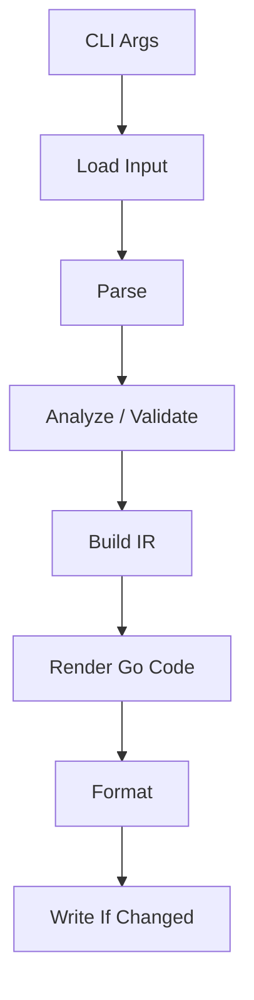
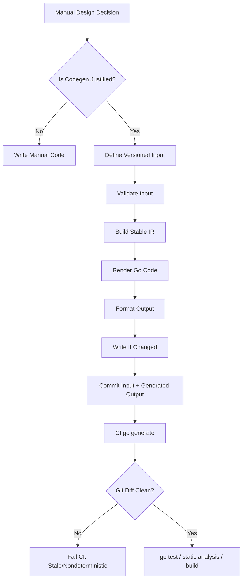
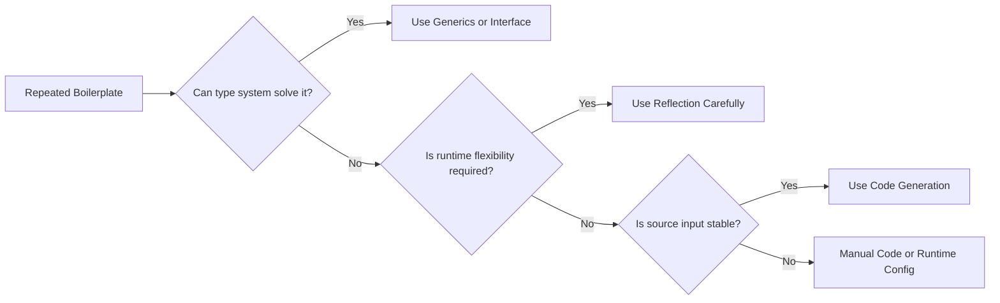

# learn-go-composition-oop-functional-reflection-codegen-modules-part-019.md

# Part 019 — Code Generation Fundamentals: `go generate`, Generated-File Contract, Reproducibility, dan CI Policy

> Series: `learn-go-composition-oop-functional-reflection-codegen-modules`  
> Part: `019 / 030`  
> Target pembaca: Java software engineer / tech lead yang ingin menguasai Go design pada level production engineering.  
> Fokus: fondasi code generation di Go, bukan sekadar cara menjalankan `go generate`.

---

## 0. Posisi Part Ini Dalam Seri

Sampai part sebelumnya, kita sudah membangun fondasi:

- composition dan method set;
- interface dan structural typing;
- OOP tanpa class;
- functional style;
- reflection;
- generics;
- decision framework antara manual code, interface, generics, reflection, dan code generation.

Part ini mulai masuk ke **code generation track**.

Di Java, code generation sering terasa “normal” karena ekosistemnya kuat di annotation processing, bytecode enhancement, Lombok, MapStruct, JPA metamodel, OpenAPI generator, gRPC/protobuf plugin, framework scanner, dan build lifecycle Maven/Gradle.

Di Go, filosofi dasarnya berbeda:

- build Go ingin sederhana dan eksplisit;
- generator bukan otomatis bagian dari `go build`;
- source generated biasanya commit ke repository;
- package author yang bertanggung jawab menjalankan generator;
- generated code harus bisa dibaca, di-review, di-diff, dan di-debug seperti source biasa.

Kalau disederhanakan:

> Di Java, code generation sering disembunyikan di build lifecycle.  
> Di Go, code generation yang sehat harus eksplisit, reproducible, dan terlihat sebagai engineering artifact.

---

## 1. Tujuan Pembelajaran

Setelah part ini, Anda harus mampu:

1. Menjelaskan apa itu `go generate` dan apa yang **bukan** tanggung jawabnya.
2. Mendesain directive `//go:generate` yang aman, jelas, dan maintainable.
3. Menentukan kapan generated code perlu di-commit ke repository.
4. Menulis kontrak generated-file yang jelas: header, ownership, edit policy, determinism, dan formatting.
5. Membuat policy CI untuk memastikan generated code tidak stale.
6. Menghindari generator yang nondeterministic, environment-sensitive, atau sulit di-debug.
7. Membedakan generator sebagai developer tool, build input, compile-time artifact, dan runtime dependency.
8. Mendesain pipeline code generation yang cocok untuk enterprise repository.

---

## 2. Mental Model Utama

### 2.1 Code Generation Adalah Source Authoring Automation

Code generation di Go sebaiknya dipahami sebagai:

> otomatisasi penulisan source code yang manusia sebenarnya bisa tulis manual, tetapi terlalu repetitif, rawan salah, atau perlu konsistensi mekanis.

Contoh masuk akal:

- enum `String()` method;
- DTO mapper;
- validator boilerplate;
- mock implementation;
- protobuf/gRPC binding;
- OpenAPI client/server stub;
- SQL query wrapper;
- permission matrix lookup;
- routing registry;
- error code catalog;
- serialization fast path.

Code generation bukan alasan untuk:

- menyembunyikan desain domain;
- membuat mini-framework opaque;
- menghindari API design yang baik;
- memindahkan semua complexity ke template;
- membuat build sulit dipahami;
- mengganti type system dengan stringly typed metadata.

### 2.2 Generator Bukan Runtime Magic

Reflection bekerja saat runtime.

Generics bekerja saat compile time melalui type checking.

Code generation bekerja **sebelum compile** dengan menghasilkan Go source.



Implikasinya:

- generator failure harus terjadi sebelum build/test;
- generated file harus bisa dikompilasi normal;
- debugging runtime tetap melihat Go code biasa;
- generated code tidak boleh bergantung pada generator saat binary berjalan.

### 2.3 Generated Code Harus Menurunkan Risiko, Bukan Menambah Risiko

Code generation layak dipakai jika hasilnya:

- mengurangi repetitive manual code;
- meningkatkan compile-time guarantee;
- membuat perubahan schema/contract lebih eksplisit;
- mengurangi runtime reflection cost;
- mengurangi copy-paste drift;
- membuat artifact reviewable.

Code generation buruk jika hasilnya:

- sulit dibaca;
- tidak deterministic;
- sering stale;
- terlalu banyak hidden convention;
- butuh environment khusus;
- generated diff besar tapi tidak berarti;
- error message sulit dipahami;
- build pipeline menjadi fragile.

---

## 3. `go generate`: Apa Itu dan Apa Bukan

### 3.1 Definisi Praktis

`go generate` adalah perintah Go toolchain yang mencari directive berbentuk:

```go
//go:generate command arguments...
```

lalu menjalankan command tersebut.

Contoh:

```go
package status

//go:generate go run ./cmd/statusgen -type=Status

type Status int

const (
    StatusUnknown Status = iota
    StatusDraft
    StatusSubmitted
    StatusApproved
    StatusRejected
)
```

Saat developer menjalankan:

```bash
go generate ./...
```

Go tool akan mengeksekusi directive yang ditemukan pada package yang diproses.

### 3.2 Hal Yang Sengaja Tidak Dilakukan `go generate`

`go generate` bukan:

- bagian otomatis dari `go build`;
- dependency analyzer;
- incremental build system;
- package manager;
- replacement untuk `make`/Taskfile/Bazel;
- mekanisme runtime plugin;
- jaminan bahwa generated code selalu up-to-date;
- security sandbox.

Ini penting.

Banyak engineer dari Java/Maven/Gradle awalnya menganggap generator akan “otomatis jalan saat build”. Di Go, asumsi itu salah.

`go build` tidak menjalankan `go generate`.

Karena itu, kalau generated file dibutuhkan untuk compile, biasanya file generated **di-commit** ke repository.

---

## 4. Mengapa Go Memilih Model Eksplisit?

Ada alasan engineering yang kuat.

### 4.1 Build Harus Cepat dan Predictable

Go sangat menekankan build yang cepat, sederhana, dan reproducible.

Kalau setiap `go build` bisa menjalankan arbitrary generator:

- build bisa melakukan network call;
- build bisa berubah tergantung waktu;
- build bisa bergantung pada binary eksternal;
- build bisa lambat;
- build bisa punya side effect;
- build bisa sulit di-cache;
- build bisa sulit diamankan.

Model eksplisit mendorong generator dijalankan sebagai langkah development/CI yang terkontrol.

### 4.2 Generated Code Adalah Source, Bukan Rahasia Build

Dengan commit generated code:

- reviewer bisa melihat perubahan nyata;
- developer tanpa generator tetap bisa build;
- CI tidak harus install semua tool kecuali untuk drift check;
- debugging lebih mudah;
- dependency generator tidak menjadi runtime dependency.

Trade-off-nya:

- repository lebih besar;
- diff bisa noisy;
- perlu policy untuk memastikan generated code tidak stale.

### 4.3 Responsibility Ada Pada Package Author

Directive `go generate` biasanya ditulis oleh package author.

Artinya:

- package menentukan generator apa yang dibutuhkan;
- package menentukan input dan output;
- package menentukan contract;
- package menentukan kapan generator dijalankan.

Ini berbeda dari framework global yang memindai seluruh project dan melakukan generation berdasarkan convention tersembunyi.

---

## 5. Generated-File Contract

Generated file yang baik harus punya kontrak eksplisit.

Minimal:

```go
// Code generated by statusgen; DO NOT EDIT.
```

Header standar ini penting karena banyak tool mengenali pola `Code generated ... DO NOT EDIT.`.

Contoh lebih lengkap:

```go
// Code generated by go run ./cmd/statusgen -type=Status; DO NOT EDIT.
// Source: status.go
// Generator version: statusgen v0.3.1
```

Namun hati-hati: memasukkan timestamp ke header bisa membuat output nondeterministic.

Buruk:

```go
// Code generated at 2026-06-22T17:00:00+07:00; DO NOT EDIT.
```

Kenapa buruk?

Karena setiap run menghasilkan diff walaupun input tidak berubah.

### 5.1 Kontrak Yang Harus Dijawab

Setiap generated file harus menjawab:

| Pertanyaan | Jawaban yang sehat |
|---|---|
| Siapa yang membuat file ini? | Generator name + command ringkas |
| Apakah boleh diedit manual? | Tidak, kecuali bagian generated partial sangat jelas |
| Dari input apa file ini dibuat? | Source file, schema, config, atau directive |
| Bagaimana regenerate? | `go generate ./...` atau command spesifik |
| Apakah deterministic? | Ya, output stabil untuk input sama |
| Apakah diformat? | Ya, `gofmt`/`go/format` |
| Apakah di-commit? | Ya jika dibutuhkan build atau review |
| Bagaimana CI memverifikasi? | regenerate + git diff check |

---

## 6. Determinism: Syarat Production Generator

Generator production-grade harus deterministic.

Artinya:

> input sama + tool version sama + environment relevan sama = output sama.

### 6.1 Sumber Nondeterminism Umum

| Sumber | Contoh | Perbaikan |
|---|---|---|
| Map iteration | output field dari `map[string]Field` | sort key sebelum emit |
| Timestamp | generated at now | jangan emit timestamp |
| Absolute path | `/home/user/project/...` | pakai path relatif/module path |
| Random ID | random suffix | pakai stable name dari input |
| OS-specific newline | CRLF/LF campur | normalize LF |
| Go version drift | output berubah antar generator build | pin tool version |
| Network fetch | schema download saat generate | vendor/cache schema |
| Locale | sort berbeda | explicit byte/string ordering |
| File glob order | OS-dependent | sort file list |

### 6.2 Contoh Bug: Map Iteration

Generator buruk:

```go
for name, field := range fields {
    emitField(name, field)
}
```

Karena iteration order map di Go tidak boleh diasumsikan stabil.

Generator lebih baik:

```go
names := make([]string, 0, len(fields))
for name := range fields {
    names = append(names, name)
}
slices.Sort(names)

for _, name := range names {
    emitField(name, fields[name])
}
```

### 6.3 Rule of Thumb

Jika generated diff berubah padahal source input tidak berubah, generator Anda belum production-grade.

---

## 7. Idempotency

Generator harus idempotent.

Menjalankan generator dua kali berturut-turut harus menghasilkan state repository yang sama.

```bash
go generate ./...
git diff --exit-code

go generate ./...
git diff --exit-code
```

Kalau run kedua masih menghasilkan diff, biasanya ada masalah:

- timestamp;
- ordering tidak stabil;
- formatting tidak konsisten;
- generator membaca output sebelumnya lalu mengubahnya lagi;
- template menambah duplicate content;
- path normalization buruk.

Idempotency adalah invariant penting.

---

## 8. Anatomy Directive `//go:generate`

### 8.1 Directive Sederhana

```go
//go:generate stringer -type=Status
```

Kelebihan:

- ringkas;
- familiar.

Kekurangan:

- mengandalkan `stringer` ada di PATH;
- versi tool tidak terlihat;
- developer environment bisa berbeda.

### 8.2 Directive Dengan `go run`

```go
//go:generate go run golang.org/x/tools/cmd/stringer@v0.34.0 -type=Status
```

Kelebihan:

- tool version eksplisit;
- tidak perlu install global;
- lebih reproducible.

Kekurangan:

- bisa download module jika belum ada cache;
- CI offline perlu persiapan;
- command bisa panjang.

### 8.3 Directive Dengan Local Tool Package

```go
//go:generate go run ./internal/cmd/statusgen -type=Status -output=status_string.go
```

Kelebihan:

- generator source ada di repo;
- bisa direview;
- cocok untuk domain-specific generator;
- version mengikuti repo.

Kekurangan:

- generator ikut maintain;
- perlu testing generator;
- bisa menambah kompleksitas repo.

### 8.4 Directive Dengan Wrapper Script

```go
//go:generate go run ./internal/tools/genstatus
```

atau:

```go
//go:generate ./scripts/gen-status.sh
```

Kelebihan:

- bisa menyembunyikan command panjang;
- bisa melakukan banyak langkah;
- cocok untuk multi-output.

Kekurangan:

- shell script bisa tidak portable Windows/Linux;
- logic generation tersembunyi;
- error trace bisa kurang jelas.

Untuk environment Windows-heavy, lebih aman memakai:

- Go-based wrapper;
- PowerShell script jika memang Windows-first;
- atau Make/Taskfile dengan dokumentasi jelas.

Namun untuk library Go umum, **Go-based wrapper** biasanya paling portable.

---

## 9. File Placement Strategy

### 9.1 Generated File Di Package Yang Sama

Contoh:

```text
case/
  status.go
  status_string.go        # generated
```

Cocok untuk:

- enum methods;
- mapper internal package;
- validator method;
- registry package-local.

Kelebihan:

- access ke unexported identifiers jika package sama;
- compile integration mudah;
- API terasa natural.

Kekurangan:

- package bisa penuh;
- generated diff bercampur source manual.

### 9.2 Generated File Di Subpackage

```text
case/
  model.go
  casegen/
    mapper_gen.go
```

Cocok untuk:

- generated client;
- generated adapter;
- generated fixture;
- generated metadata table.

Kelebihan:

- boundary lebih jelas;
- generated API terpisah;
- mengurangi clutter.

Kekurangan:

- tidak bisa akses unexported names;
- import cycle risk;
- API harus diekspor.

### 9.3 Generated File Di `internal/`

```text
internal/generated/permission/
  matrix_gen.go
```

Cocok untuk:

- internal registry;
- permission matrix;
- generated lookup table;
- platform-specific generated code.

Kelebihan:

- tidak menjadi public API;
- bebas diubah internal;
- cocok untuk enterprise platform.

Kekurangan:

- consumer luar module tidak bisa import;
- perlu façade jika perlu expose behavior.

---

## 10. Naming Convention

Common convention:

```text
<thing>_gen.go
<thing>_string.go
<thing>_mock.go
<thing>_mapper.go
zz_generated.<tool>.go
```

Rekomendasi:

| Jenis output | Nama sehat |
|---|---|
| Enum string | `status_string.go` |
| Mapper | `case_mapper_gen.go` |
| Validator | `case_validator_gen.go` |
| Registry | `registry_gen.go` |
| Permission matrix | `permission_matrix_gen.go` |
| OpenAPI client | `client.gen.go` |
| Protobuf | `case.pb.go` |
| gRPC | `case_grpc.pb.go` |

Hindari nama terlalu generik:

```text
gen.go
output.go
auto.go
code.go
```

Nama file harus membantu reviewer memahami jenis artifact.

---

## 11. Build Tags Untuk Generated Code

Kadang generated code berbeda berdasarkan build tag.

Contoh:

```go
//go:build enterprise

package permission
```

Use case:

- enterprise/community edition;
- platform-specific implementation;
- optional integration;
- generated mock hanya untuk test;
- codegen untuk slow path/fast path.

Namun hati-hati.

Build tags menambah state space.

Jika package punya 4 build tags, jumlah kombinasi build bisa membesar.

Rule:

> Jangan pakai build tag untuk menyembunyikan desain yang bisa diselesaikan dengan package boundary atau interface biasa.

---

## 12. Commit Generated Code atau Tidak?

Ini pertanyaan besar.

### 12.1 Commit Generated Code Jika

Commit generated code bila:

- generated file diperlukan untuk `go build`;
- developer biasa tidak wajib install generator;
- generated diff perlu review;
- generator berat/lambat;
- generator butuh tool eksternal;
- generator input berasal dari schema yang di-version;
- consumer module perlu source lengkap;
- CI/build harus tetap sederhana.

Ini umum untuk:

- protobuf `.pb.go`;
- stringer output;
- mocks dalam beberapa project;
- OpenAPI generated code;
- SQL generated code;
- domain-specific generated registry.

### 12.2 Tidak Commit Generated Code Jika

Tidak commit generated code bisa masuk akal jika:

- artifact sangat besar;
- artifact murni build cache;
- generator selalu tersedia dalam hermetic build;
- project memakai Bazel/Nix/monorepo build system yang mengelola artifact;
- artifact tidak perlu direview;
- source package tidak dimaksudkan dibuild tanpa pipeline khusus.

Namun di Go module publik/umum, tidak commit generated code sering menyulitkan consumer.

### 12.3 Rekomendasi Untuk Enterprise Go Repo

Untuk repository enterprise biasa:

> Commit generated `.go` files yang dibutuhkan compile, lalu CI melakukan regenerate-and-diff check.

Ini menyeimbangkan:

- reproducibility;
- developer ergonomics;
- reviewability;
- build simplicity.

---

## 13. CI Policy Untuk Generated Code

Minimal CI policy:

```bash
go generate ./...
gofmt -w .
go test ./...
git diff --exit-code
```

Namun `gofmt -w .` terlalu luas dan bisa mengubah manual code di CI. Biasanya lebih baik generator sendiri memastikan output formatted.

Policy lebih baik:

```bash
go generate ./...
go test ./...
git diff --exit-code
```

Kalau `git diff --exit-code` gagal, berarti developer lupa commit generated update atau generator nondeterministic.

### 13.1 CI Stage Yang Disarankan



Catatan:

- `go generate` bisa ditempatkan sebelum atau sesudah test tergantung kebutuhan.
- Jika tests membutuhkan generated code terbaru, generate dulu.
- Jika generated code di-commit, build tetap bisa berjalan tanpa generate, tapi drift check tetap berguna.

### 13.2 Drift Check Script

Contoh PowerShell:

```powershell
$ErrorActionPreference = "Stop"

go generate ./...
go test ./...

$diff = git status --porcelain
if ($diff) {
    Write-Host "Generated files are stale or generator is nondeterministic."
    git status --short
    git diff --stat
    exit 1
}
```

Contoh Bash:

```bash
#!/usr/bin/env bash
set -euo pipefail

go generate ./...
go test ./...

if [[ -n "$(git status --porcelain)" ]]; then
  echo "Generated files are stale or generator is nondeterministic."
  git status --short
  git diff --stat
  exit 1
fi
```

---

## 14. Pinning Generator Version

Generator harus diperlakukan sebagai build/development dependency.

### 14.1 Problem PATH Global

Directive seperti ini fragile:

```go
//go:generate stringer -type=Status
```

Karena:

- developer A pakai stringer versi lama;
- developer B pakai stringer versi baru;
- CI tidak punya stringer;
- output bisa berubah.

### 14.2 `go run module@version`

Lebih baik:

```go
//go:generate go run golang.org/x/tools/cmd/stringer@v0.34.0 -type=Status
```

Ini eksplisit.

Trade-off:

- perlu internet/cache module;
- command panjang;
- setiap directive mungkin mengulang versi.

### 14.3 Tool Dependency Via `tools.go`

Pattern umum:

```go
//go:build tools

package tools

import (
    _ "golang.org/x/tools/cmd/stringer"
)
```

Lalu module mengunci versi tool di `go.mod`.

Directive:

```go
//go:generate go run golang.org/x/tools/cmd/stringer -type=Status
```

Kelebihan:

- version ada di `go.mod`;
- dependency terlihat;
- cocok untuk banyak tools.

Kekurangan:

- perlu disiplin;
- beberapa tool tidak nyaman sebagai module dependency;
- `tools.go` bisa membingungkan junior engineer jika tidak didokumentasi.

### 14.4 Local Generator Package

Untuk generator internal:

```text
internal/cmd/casegen/
  main.go
```

Directive:

```go
//go:generate go run ../internal/cmd/casegen -input=case.go -output=case_gen.go
```

Atau dari package root:

```go
//go:generate go run ./internal/cmd/casegen -pkg=case
```

Local generator cocok jika logic generation adalah bagian dari domain platform.

---

## 15. Generator Input Design

Generator bisa membaca input dari beberapa bentuk.

### 15.1 Source Code Sebagai Input

Contoh:

```go
type Status int

const (
    StatusDraft Status = iota
    StatusSubmitted
    StatusApproved
)
```

Generator membaca AST dan menghasilkan:

```go
func (s Status) String() string { ... }
```

Cocok untuk:

- enum;
- method boilerplate;
- interface mock;
- mapper dari struct;
- validator dari tag.

Risiko:

- perlu AST/type analysis;
- complex jika generics/embedding/import alias;
- error message harus bagus.

### 15.2 Schema Sebagai Input

```text
schema/openapi.yaml
schema/case.proto
schema/permission.yaml
schema/error-codes.yaml
```

Cocok untuk:

- API contract;
- protobuf;
- permission matrix;
- error catalog;
- workflow state transition table.

Risiko:

- schema drift dari implementation;
- schema format perlu versioning;
- schema validation wajib.

### 15.3 Config Sebagai Input

```yaml
package: permission
output: permission_matrix_gen.go
roles:
  - officer
  - supervisor
  - admin
```

Cocok untuk domain table yang lebih nyaman ditulis declarative.

Risiko:

- config bisa menjadi programming language tersembunyi;
- validation buruk menghasilkan generated bug;
- complex conditional logic makin sulit.

### 15.4 Database/Remote System Sebagai Input

Contoh:

- introspect database schema;
- fetch OpenAPI spec dari server;
- query permission metadata dari service.

Untuk production reproducibility, ini paling berisiko.

Sebaiknya hindari generator yang langsung membaca live remote system.

Lebih baik:



Dengan begitu generation input tetap versioned.

---

## 16. Output Design

Generated code harus Go-like.

### 16.1 Jangan Generate Java Di Go

Buruk:

```go
type CaseStatusClass struct{}

func (c CaseStatusClass) GetValue(status CaseStatus) string { ... }
func (c CaseStatusClass) SetValue(status *CaseStatus, value string) { ... }
```

Lebih Go-like:

```go
func (s CaseStatus) String() string { ... }

func ParseCaseStatus(text string) (CaseStatus, bool) { ... }
```

### 16.2 Output Harus Minimal

Jangan generate 5.000 line jika 200 line cukup.

Generated code sering tidak dibaca sedalam manual code. Karena itu justru harus lebih sederhana, bukan lebih rumit.

### 16.3 Output Harus Stable

Urutan declarations harus stabil.

Contoh ordering:

1. package comment jika perlu;
2. package declaration;
3. imports;
4. const block;
5. var block;
6. type declarations;
7. functions/methods;
8. compile-time assertions.

### 16.4 Output Harus Diformat

Generator harus memakai:

```go
format.Source(src)
```

atau menjalankan `gofmt` secara eksplisit.

Lebih baik generator memformat sendiri agar directive tidak perlu chaining shell command.

---

## 17. Error Message Generator

Generator production-grade harus punya error message yang membantu.

Buruk:

```text
invalid input
```

Lebih baik:

```text
casegen: status.go:17: type CaseStatus must have underlying type int or string
```

Lebih baik lagi:

```text
casegen: status.go:17: unsupported enum type CaseStatus
  expected: defined type with underlying int or string
  found:    struct type
  hint:     define `type CaseStatus int` and const values of that type
```

Untuk generator berbasis source code, error idealnya menyertakan:

- file;
- line;
- column jika tersedia;
- identifier;
- expected shape;
- actual shape;
- hint perbaikan.

---

## 18. Security Considerations

`go generate` menjalankan command arbitrary.

Artinya:

- jangan menjalankan `go generate ./...` pada repository tidak dipercaya tanpa review;
- generator bisa membaca file lokal;
- generator bisa menulis file;
- generator bisa melakukan network call;
- generator bisa menjalankan shell command;
- generator bisa exfiltrate environment variable.

Untuk enterprise:

- pin generator version;
- review directive;
- hindari curl-pipe-shell;
- disable network di CI generate stage jika memungkinkan;
- gunakan private proxy/cache;
- audit generator dependency;
- jalankan dalam container terbatas bila perlu.

### 18.1 Jangan Taruh Secret Di Directive

Buruk:

```go
//go:generate go run ./cmd/gen -token=$PROD_TOKEN
```

Lebih buruk:

```go
//go:generate go run ./cmd/gen -token=real-secret-value
```

Generator tidak boleh membutuhkan secret production.

Kalau generator perlu akses private schema registry, gunakan token development/CI dengan scope minimal, tetapi lebih baik schema sudah diekspor dan di-version di repository.

---

## 19. Case Study: Error Code Catalog Generator

Bayangkan regulatory case platform punya error code catalog:

```yaml
errors:
  - code: CASE_NOT_FOUND
    http_status: 404
    category: case
    user_message: Case not found.
    retryable: false
  - code: CASE_ALREADY_APPROVED
    http_status: 409
    category: lifecycle
    user_message: Case is already approved.
    retryable: false
```

Generator menghasilkan:

```go
// Code generated by go run ./internal/cmd/errorgen; DO NOT EDIT.

package errors

type Code string

const (
    CodeCaseNotFound        Code = "CASE_NOT_FOUND"
    CodeCaseAlreadyApproved Code = "CASE_ALREADY_APPROVED"
)

type Metadata struct {
    HTTPStatus  int
    Category    string
    UserMessage string
    Retryable   bool
}

var metadataByCode = map[Code]Metadata{
    CodeCaseNotFound: {
        HTTPStatus:  404,
        Category:    "case",
        UserMessage: "Case not found.",
        Retryable:   false,
    },
    CodeCaseAlreadyApproved: {
        HTTPStatus:  409,
        Category:    "lifecycle",
        UserMessage: "Case is already approved.",
        Retryable:   false,
    },
}

func Lookup(code Code) (Metadata, bool) {
    m, ok := metadataByCode[code]
    return m, ok
}
```

### 19.1 Kenapa Ini Layak Digenerate?

Karena error catalog:

- harus konsisten;
- sering punya banyak rows;
- butuh enum typed constants;
- butuh lookup table;
- butuh validation duplicate;
- bisa dipakai lint/check;
- bisa diexport ke documentation.

### 19.2 Generator Validation

Generator harus reject:

- duplicate code;
- invalid naming;
- invalid HTTP status;
- missing category;
- empty user message;
- unknown retry policy;
- inconsistent severity;
- unused/deprecated code jika policy mengharuskan.

### 19.3 CI Contract

```bash
go generate ./internal/errors
go test ./internal/errors
git diff --exit-code
```

### 19.4 Review Contract

Reviewer melihat dua hal:

1. perubahan YAML sebagai source of truth;
2. generated Go diff sebagai effect.

Kalau generated diff tidak sesuai source, generator bermasalah.

---

## 20. Case Study: Permission Matrix Generator

Untuk platform enforcement/regulatory, permission sering berbentuk matrix:

```yaml
permissions:
  - action: case.approve
    roles: [supervisor, admin]
    states: [submitted, under_review]
    constraints:
      - assignee_required
      - no_conflict_of_interest

  - action: case.reject
    roles: [supervisor, admin]
    states: [submitted, under_review]
    constraints:
      - rejection_reason_required
```

Generated code bisa berupa static table:

```go
func IsRoleAllowed(action Action, role Role) bool { ... }
func IsStateAllowed(action Action, state State) bool { ... }
func ConstraintsFor(action Action) []Constraint { ... }
```

### 20.1 Benefit

- permission policy versioned;
- static validation saat generate;
- lookup cepat;
- tidak perlu reflection;
- tidak perlu runtime YAML parsing;
- review matrix lebih mudah.

### 20.2 Risiko

- policy bisa terlalu kompleks;
- generated code bisa menyembunyikan authorization reasoning;
- config YAML bisa menjadi mini-language;
- runtime emergency change tidak mungkin tanpa deploy.

### 20.3 Decision

Cocok jika permission policy harus:

- defensible;
- reviewed;
- versioned;
- audit-friendly;
- tied to release process.

Kurang cocok jika permission harus sering berubah oleh non-engineer via admin UI.

---

## 21. Generator Testing

Generator harus dites seperti production code.

### 21.1 Golden File Test

Pattern umum:

```text
testdata/
  simple/
    input.go
    expected.go
  embedded/
    input.go
    expected.go
  invalid/
    input.go
    expected.err
```

Test flow:

1. read input;
2. run generator;
3. compare output dengan expected;
4. optional update golden via env flag.

Pseudo-code:

```go
func TestGenerateSimple(t *testing.T) {
    got, err := Generate("testdata/simple/input.go")
    if err != nil {
        t.Fatal(err)
    }

    want := readFile(t, "testdata/simple/expected.go")
    if diff := cmpDiff(want, got); diff != "" {
        t.Fatalf("generated mismatch (-want +got):\n%s", diff)
    }
}
```

Tanpa external diff library, Anda bisa bandingkan string dan print file path temp.

### 21.2 Compile Test

Generated output harus compile.

Caranya:

- generate ke temp module;
- jalankan `go test` pada temp package;
- atau include golden output dalam test package.

### 21.3 Negative Test

Generator harus dites untuk input invalid.

Contoh:

- duplicate enum value;
- unsupported field type;
- invalid tag;
- missing required directive;
- ambiguous embedded field;
- import cycle.

Negative test penting karena generator adalah compiler kecil. Compiler kecil harus punya error diagnostics yang bagus.

---

## 22. Generator Architecture

Generator production sebaiknya dipisah menjadi beberapa layer.



### 22.1 Jangan Campur Semua Di Template

Buruk:

```go
template.Execute(w, rawParsedSchema)
```

Jika template berisi terlalu banyak logic:

- sulit dites;
- error buruk;
- ordering tersembunyi;
- invariant sulit dijaga.

Lebih baik bentuk intermediate representation atau IR:

```go
type File struct {
    PackageName string
    Imports     []Import
    Types       []Type
    Functions   []Function
}
```

Atau domain-specific IR:

```go
type ErrorCatalog struct {
    PackageName string
    Codes       []ErrorCode
}
```

IR harus sudah validated dan sorted sebelum render.

### 22.2 Write If Changed

Generator sebaiknya tidak rewrite file jika content sama.

```go
func writeFileIfChanged(path string, content []byte) error {
    old, err := os.ReadFile(path)
    if err == nil && bytes.Equal(old, content) {
        return nil
    }
    return os.WriteFile(path, content, 0o644)
}
```

Manfaat:

- timestamp file tidak berubah;
- incremental tooling lebih tenang;
- editor tidak reload sia-sia;
- CI lebih bersih.

---

## 23. Template vs AST Construction

Ada beberapa cara menghasilkan Go source.

### 23.1 String Builder

```go
var b strings.Builder
fmt.Fprintf(&b, "package %s\n", pkg)
fmt.Fprintf(&b, "func ...")
```

Cocok untuk generator kecil.

Risiko:

- escaping manual;
- import management manual;
- formatting rawan;
- sulit jika output kompleks.

### 23.2 `text/template`

Cocok untuk output dengan struktur besar dan readable.

Kelebihan:

- template mudah dibaca;
- separation render dari analysis;
- cocok untuk repetitive declaration.

Risiko:

- logic bisa bocor ke template;
- whitespace management;
- escaping identifier harus benar.

### 23.3 AST Construction

Menggunakan `go/ast`, `go/token`, lalu print/format.

Kelebihan:

- lebih structurally correct;
- cocok untuk transformasi source;
- mengurangi syntax bug tertentu.

Kekurangan:

- verbose;
- sulit dibaca;
- tidak selalu worth it untuk generator sederhana.

### 23.4 Rule Praktis

| Output | Pendekatan |
|---|---|
| Enum/string/lookup kecil | string builder atau template |
| DTO mapper sedang | template dengan IR kuat |
| Source transform | AST |
| Import-aware generated code | template + import manager atau AST |
| Complex framework generator | IR + renderer modular |

Part 020 dan 021 akan membahas AST dan type-aware generation lebih dalam.

---

## 24. Import Management

Generator sering perlu menulis imports.

Buruk:

```go
import (
    "fmt"
    "time"
)
```

padahal output tertentu tidak memakai `fmt`.

Go compiler reject unused import.

Generator harus:

- hanya emit import yang dipakai;
- alias import jika conflict;
- handle package name berbeda dari last path;
- avoid dot import;
- avoid unnecessary blank import.

Untuk generator sederhana, import bisa ditentukan oleh feature flags.

Contoh:

```go
imports := map[string]bool{}

if needsTime {
    imports["time"] = true
}
if needsJSON {
    imports["encoding/json"] = true
}
```

Sebelum render, sort import path.

---

## 25. Generated Code dan API Compatibility

Generated code bisa menjadi public API.

Contoh:

```go
func ParseStatus(s string) (Status, bool)
```

Jika function ini diekspor dan consumer memakainya, maka perubahan generator bisa breaking change.

### 25.1 Public Generated API Harus Stabil

Kalau generated output diekspor:

- nama function harus predictable;
- signature tidak berubah sembarangan;
- behavior harus documented;
- deprecation strategy perlu ada;
- test compatibility perlu ada.

### 25.2 Prefer Generated Internal Detail + Manual Public Facade

Sering lebih baik:

```text
case/
  status.go              # manual public API
  status_lookup_gen.go   # generated internal table
```

Manual file:

```go
func ParseStatus(s string) (Status, bool) {
    return lookupStatus(s)
}
```

Generated file:

```go
func lookupStatus(s string) (Status, bool) { ... }
```

Dengan begitu generator bebas mengubah internal implementation tanpa merusak public API.

---

## 26. Reviewability

Generated code harus reviewable, tapi reviewer tidak harus membaca setiap line generated besar.

Policy review yang sehat:

1. Review source input dengan teliti.
2. Review generator logic jika berubah.
3. Review generated diff secara sampling/structural.
4. Pastikan generated diff sesuai input.
5. Pastikan CI regenerate clean.

### 26.1 Jangan Menyembunyikan Generated Diff Tanpa Policy

Beberapa repo menyembunyikan generated files dari review. Ini bisa valid untuk protobuf besar, tetapi harus ada kompensasi:

- generator pinned;
- CI drift check;
- schema review ketat;
- generated output compile/test;
- security scan tetap jalan.

---

## 27. Documentation Pattern

Setiap generator internal sebaiknya punya README.

Minimal:

```markdown
# casegen

Generates case lifecycle lookup code from `case_lifecycle.yaml`.

## Regenerate

```bash
go generate ./internal/case/lifecycle
```

## Inputs

- `case_lifecycle.yaml`

## Outputs

- `lifecycle_gen.go`

## Invariants

- state names must be unique
- transitions must reference existing states
- terminal states cannot have outgoing transitions

## CI

CI runs `go generate ./...` and fails if generated files are stale.
```

Dokumentasi ini mengurangi bus factor.

---

## 28. Production Checklist

Gunakan checklist ini saat review generator.

### 28.1 Directive

- [ ] Directive jelas dan lokal ke package yang relevan.
- [ ] Tidak bergantung pada PATH global tanpa alasan.
- [ ] Tool version dipin atau generator ada di repo.
- [ ] Tidak membutuhkan secret production.
- [ ] Tidak melakukan network call kecuali benar-benar diperlukan dan documented.

### 28.2 Input

- [ ] Input versioned.
- [ ] Input divalidasi sebelum render.
- [ ] Error message menyebut file/line/identifier.
- [ ] Duplicate/ambiguous input ditolak.
- [ ] Schema/config tidak menjadi mini-language liar.

### 28.3 Output

- [ ] Ada header `Code generated ... DO NOT EDIT.`.
- [ ] Output deterministic.
- [ ] Output idempotent.
- [ ] Output `gofmt`.
- [ ] Imports minimal dan sorted.
- [ ] Public API generated disengaja, bukan accidental.
- [ ] Tidak ada timestamp/random/absolute path noisy.

### 28.4 CI

- [ ] CI menjalankan regenerate check.
- [ ] CI gagal jika git diff tidak bersih.
- [ ] Generator tests ada.
- [ ] Golden tests ada untuk kasus utama.
- [ ] Negative tests ada untuk invalid input.
- [ ] Generated code ikut compile/test/static analysis.

### 28.5 Security

- [ ] Generator dependency diaudit.
- [ ] Tidak mengeksekusi shell command dari input tidak dipercaya.
- [ ] Tidak membaca secret/env tanpa alasan.
- [ ] Tidak menulis keluar output directory yang diizinkan.
- [ ] Path traversal dicegah.

---

## 29. Anti-Patterns

### 29.1 Generator Sebagai Framework Tersembunyi

Jika developer harus memahami 40 convention tersembunyi sebelum bisa debug, generator sudah berubah menjadi framework opaque.

Go lebih menyukai explicit code.

Generated code boleh banyak, tetapi hasilnya harus bisa dibaca.

### 29.2 Runtime Config Menghasilkan Compile-Time Code

Jika generator membaca database production untuk menghasilkan source, build menjadi tidak defensible.

Jadikan remote data sebagai exported/versioned schema dulu.

### 29.3 Generated Code Tidak Di-Commit Tapi Dibutuhkan Build

Ini membuat developer baru gagal build.

Kalau artifact dibutuhkan compile, commit atau buat build system hermetic yang jelas.

### 29.4 Generator Nondeterministic

Diff berubah setiap run.

Ini membunuh trust reviewer.

### 29.5 Manual Edit Generated File

Jika developer sering edit generated file manual, berarti generator/input/extension point salah desain.

Solusi:

- tambahkan manual partial file;
- expose hook/interface;
- ubah input schema;
- jangan patch generated output.

### 29.6 One Generator To Rule Them All

Generator raksasa yang generate semua layer sekaligus biasanya sulit evolve.

Lebih baik beberapa generator kecil dengan boundary jelas:

- enum generator;
- mapper generator;
- validator generator;
- registry generator;
- docs generator.

---

## 30. Java Engineer Translation Notes

| Java habit | Go equivalent yang lebih sehat |
|---|---|
| Annotation processor tersembunyi | `go generate` eksplisit |
| Lombok untuk boilerplate | manual code atau generator kecil yang outputnya reviewable |
| Runtime reflection framework | reflection terbatas atau generated static code |
| Maven lifecycle auto-generate | CI regenerate-and-diff policy |
| Generated target dir tidak di-review | generated `.go` sering di-commit dan direview |
| Classpath scanning | explicit registry/codegen registry |
| Annotation sebagai DSL | struct tag/directive/config dengan validation kuat |
| Bytecode enhancement | source generation eksplisit |
| Framework owns lifecycle | package owns generator contract |

Perbedaan besarnya:

> Java sering nyaman dengan framework yang mengontrol lifecycle.  
> Go lebih kuat saat package dan source code tetap eksplisit.

---

## 31. Mermaid: End-to-End Codegen Governance



---

## 32. Mermaid: Decision Boundary



---

## 33. Mini Design Exercise

Problem:

Anda punya 80 case lifecycle states dan 250 transitions. Setiap transition punya:

- source state;
- target state;
- action;
- role allowed;
- validation constraints;
- audit event name;
- notification template key.

Pilihan:

1. hardcode manual map;
2. load YAML saat runtime;
3. reflection dari struct tags;
4. generate static Go lookup dari YAML;
5. simpan di database dan cache runtime.

### 33.1 Analisis

Manual map:

- simple;
- compile-time;
- tapi rawan copy-paste untuk 250 transitions.

Runtime YAML:

- flexible;
- tapi config error muncul saat startup/runtime;
- perlu deployment artifact management.

Reflection struct tags:

- tidak cocok untuk transition matrix kompleks;
- tag akan menjadi mini-language buruk.

Generated static Go:

- source of truth YAML reviewable;
- validation saat generate;
- lookup cepat;
- release-bound;
- audit-friendly.

Database runtime:

- cocok jika policy sering diubah admin;
- butuh governance, audit, migration, approval flow;
- lebih kompleks.

### 33.2 Rekomendasi

Untuk enforcement lifecycle yang harus defensible dan release-reviewed:

> gunakan YAML/schema versioned + generator static Go + CI drift check.

Jika nanti policy harus dikelola non-engineer, evolusikan ke database-backed policy dengan audit workflow, bukan langsung mencampur runtime mutability ke generated code.

---

## 34. Key Takeaways

1. `go generate` adalah mekanisme eksplisit untuk menjalankan generator; bukan bagian otomatis dari `go build`.
2. Generated code di Go sebaiknya diperlakukan sebagai source artifact yang reviewable.
3. Generator production harus deterministic, idempotent, tested, dan punya diagnostics bagus.
4. Pin generator version atau simpan generator internal di repo.
5. Commit generated `.go` files jika dibutuhkan build atau review.
6. CI harus melakukan regenerate-and-diff check.
7. Jangan biarkan generator melakukan network/live introspection tanpa versioned input.
8. Generated public API adalah public API sungguhan; jaga compatibility-nya.
9. Code generation yang baik membuat sistem lebih eksplisit, bukan lebih magic.
10. Untuk domain regulatory, codegen sangat cocok untuk artifact defensible seperti permission matrix, state transition table, error catalog, dan typed registry.

---

## 35. Referensi Resmi Dan Relevan

- Go Blog — `go generate`: konsep dasar, explicit generation, dan alasan command ini bukan bagian dari `go build`.
- Go Command Documentation — `go help generate` untuk detail directive, execution model, environment, dan package processing.
- Go Module Reference — penting untuk pinning tool dependency, `go.mod`, module versioning, dan reproducible dependency graph.
- Go Spec — package, build constraints, declarations, method/type system yang menentukan hasil generated code.
- Package `go/format` — formatting generated Go source.
- Package `go/ast`, `go/parser`, `go/token`, `go/types` — fondasi generator berbasis source analysis; akan dibahas lebih dalam di Part 020 dan 021.

---

## 36. Apa Yang Akan Dibahas Di Part Berikutnya

Part berikutnya:

```text
learn-go-composition-oop-functional-reflection-codegen-modules-part-020.md
```

Topik:

> AST-based generation: `go/parser`, `go/ast`, `go/token`, formatting, comments, directive parsing.

Kita akan masuk lebih teknis:

- bagaimana membaca source file;
- membedakan declaration, type spec, value spec;
- mencari directive/comment;
- menjaga token position untuk error message;
- menghasilkan Go code dari AST atau template;
- kapan perlu AST dan kapan cukup parser sederhana.

---

## 37. Status Seri

Seri belum selesai.

Progress saat ini:

```text
Part 019 / 030 selesai.
Next: Part 020 / 030.
```

<!-- NAVIGATION_FOOTER -->
<div class="page-nav">
<a href="./learn-go-composition-oop-functional-reflection-codegen-modules-part-018.md">⬅️ Part 018 — Reflection vs Generics vs Code Generation: Decision Framework untuk Production Go</a>
<a href="./index.md">📚 Kategori</a>
<a href="../../index.md">🏠 Home</a>
<a href="./learn-go-composition-oop-functional-reflection-codegen-modules-part-020.md">Part 020 — AST-Based Generation: `go/parser`, `go/ast`, `go/token`, Formatting, Comments, Directives, and Deterministic Generators ➡️</a>
</div>
