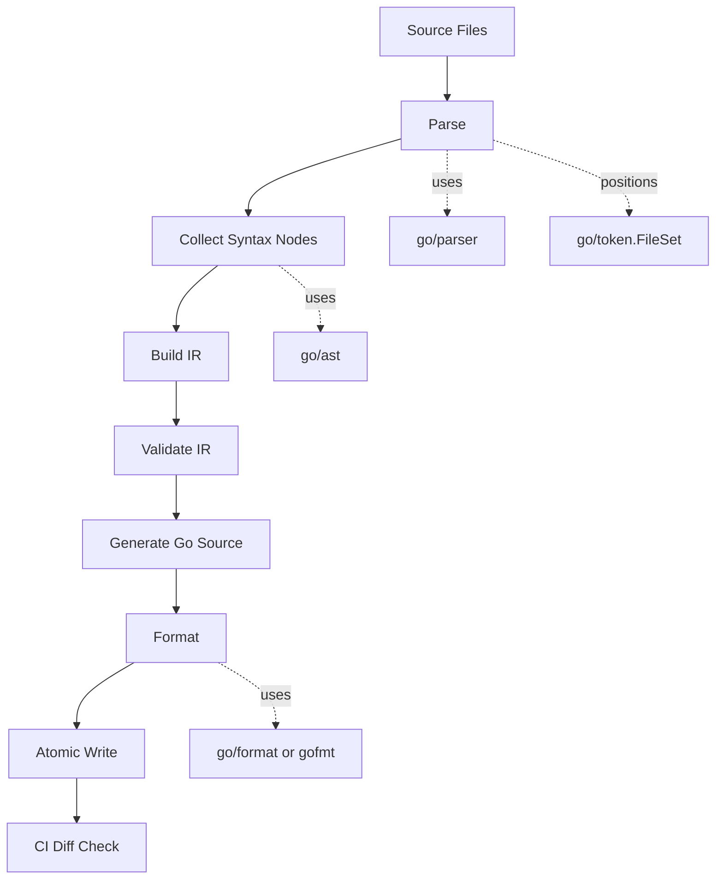

# learn-go-composition-oop-functional-reflection-codegen-modules-part-020.md

# Part 020 — AST-Based Generation: `go/parser`, `go/ast`, `go/token`, Formatting, Comments, Directives, and Deterministic Generators

> Seri: **Go Composition, OOP, Functional, Reflection, Code Generation, Modules & Package Management**  
> Target pembaca: **Java software engineer / tech lead** yang ingin membangun keluwesan desain Go tingkat production/handbook internal engineering.  
> Fokus part ini: **membangun generator berbasis AST** yang aman, deterministic, reviewable, dan tidak berubah menjadi sumber technical debt.

---

## 0. Posisi Part Ini Dalam Seri

Pada part sebelumnya kita membahas fundamental code generation: kapan codegen layak dipakai, kontrak generated file, policy CI, dan governance. Part ini masuk satu level lebih teknis: **bagaimana generator membaca source Go sebagai struktur sintaksis**, bukan sebagai plain text.

Di Go, paket standar menyediakan building block penting:

- `go/parser`: membaca source Go dan menghasilkan AST.
- `go/ast`: struktur data untuk merepresentasikan syntax tree.
- `go/token`: posisi source, token lexical, dan `FileSet`.
- `go/format`: formatting source Go standar.
- `go/printer`: printing AST dengan kontrol lebih rendah.
- `go/doc` dan `go/doc/comment`: ekstraksi dokumentasi bila generator perlu membaca comment/doc.

Part ini belum membahas type checking penuh dengan `go/types`; itu masuk Part 021. Di sini kita fokus pada **syntax-level generation**.

Syntax-level generation cocok saat generator hanya butuh membaca:

- nama type;
- struct fields;
- struct tags;
- const declaration;
- method declaration;
- comment directive;
- import path;
- package name;
- basic expression shape.

Syntax-level generation **tidak cukup** saat generator perlu tahu:

- apakah `Foo` berasal dari package mana;
- apakah `T` mengimplementasikan interface;
- apakah `[]CustomerID` adalah slice dari defined type tertentu;
- apakah field embedded berasal dari alias;
- apakah generic instantiation valid;
- apakah method set dari type tertentu memenuhi kontrak.

Itu butuh type-aware pipeline, dan akan dibahas pada part berikutnya.

---

## 1. Mental Model: AST Generator Bukan Regex Generator

Banyak generator internal gagal bukan karena AST sulit, tetapi karena generator diperlakukan seperti script text replacement.

Text-based generator berpikir seperti ini:

```text
Cari string `type X struct {`, lalu parse baris berikutnya.
```

AST-based generator berpikir seperti ini:

```text
Baca file sebagai Go syntax tree.
Cari declaration node.
Ambil type declaration.
Pastikan underlying node adalah struct type.
Baca field list, tag, name, comment, dan posisi source.
Bangun intermediate representation.
Generate output deterministic dari IR.
```

Perbedaan mental modelnya besar.

Regex cocok untuk format yang Anda kontrol penuh dan sangat sempit. Source code Go bukan format sempit: ada comment, blank line, multi-name declaration, grouped declaration, alias, embedded field, tag raw string, import alias, dot import, generic type parameter, method receiver, build tag, dan file-level directive.

AST membuat generator tahan terhadap variasi formatting.

Contoh bentuk source yang secara semantik mirip tetapi text-nya berbeda:

```go
type User struct {
    ID string `json:"id"`
}
```

```go
type (
    User struct {
        ID string `json:"id"`
    }
)
```

```go
// User is an account user.
type User struct{ ID string `json:"id"` }
```

```go
type User[T any] struct {
    ID T `json:"id"`
}
```

Regex parser biasanya mulai pecah pada variasi seperti ini. AST parser tidak.

---

## 2. Architecture View: Pipeline Generator Berbasis AST

Generator production-grade sebaiknya dipisahkan menjadi beberapa tahap.



Tahap penting:

1. **Parse** source menjadi AST.
2. **Collect** node yang relevan.
3. **Build IR** agar generator tidak langsung generate dari AST mentah.
4. **Validate IR** agar error muncul sebelum output ditulis.
5. **Generate** output dari IR secara deterministic.
6. **Format** source.
7. **Write atomically** agar partial write tidak merusak repo.
8. **CI diff check** agar output selalu sinkron.

Kesalahan umum: langsung membaca AST dan langsung menulis string output di callback traversal. Ini cepat untuk demo, tetapi sulit di-maintain.

---

## 3. Syntax Tree, Token, dan FileSet

### 3.1 `go/parser`

`go/parser` membaca source Go dan menghasilkan AST. Fungsi yang paling sering dipakai:

```go
file, err := parser.ParseFile(fset, filename, nil, parser.ParseComments)
```

Parameter penting:

- `fset`: `*token.FileSet` untuk posisi source.
- `filename`: nama file atau path.
- `src`: bisa `nil`, `string`, `[]byte`, atau `io.Reader`.
- `mode`: flag parsing, misalnya `parser.ParseComments`.

Jika `src == nil`, parser membaca isi file dari `filename`.

Mode `parser.ParseComments` penting bila generator bergantung pada:

- `//go:generate`;
- custom directive seperti `//casegen:enum`;
- doc comment untuk generated documentation;
- comment marker untuk include/exclude.

Tanpa `parser.ParseComments`, comment tidak dimasukkan ke AST.

### 3.2 `go/ast`

`go/ast` mendefinisikan node syntax Go: file, declaration, statement, expression, spec, field, comment group, dan seterusnya.

Contoh node penting:

| Node | Makna |
|---|---|
| `*ast.File` | satu file Go lengkap |
| `ast.Decl` | top-level declaration |
| `*ast.GenDecl` | grouped declaration: `type`, `const`, `var`, `import` |
| `*ast.TypeSpec` | satu type declaration |
| `*ast.StructType` | struct type syntax |
| `*ast.InterfaceType` | interface type syntax |
| `*ast.FuncDecl` | function/method declaration |
| `*ast.Field` | field struct, parameter, result, atau receiver |
| `ast.Expr` | expression syntax |
| `*ast.Ident` | identifier |
| `*ast.SelectorExpr` | selector seperti `time.Time` |
| `*ast.StarExpr` | pointer expression seperti `*User` |
| `*ast.ArrayType` | array/slice syntax |
| `*ast.MapType` | map syntax |
| `*ast.IndexExpr` / `IndexListExpr` | generic instantiation syntax |

### 3.3 `go/token`

`go/token` menyediakan token lexical dan position model. Komponen paling penting bagi generator adalah `token.FileSet`.

`FileSet` menyimpan mapping dari posisi AST ke file/line/column. Ini penting untuk error message yang usable.

Generator buruk memberi error seperti:

```text
invalid struct tag
```

Generator yang layak production memberi error seperti:

```text
internal/case/model.go:42:17: field CaseID has invalid casegen tag: expected key=value pair
```

Untuk itu, gunakan:

```go
pos := fset.Position(node.Pos())
```

---

## 4. Minimal Parser: Membaca Type Declaration

Contoh generator kecil yang membaca semua type declaration dari file Go.

```go
package main

import (
    "fmt"
    "go/ast"
    "go/parser"
    "go/token"
    "log"
)

func main() {
    fset := token.NewFileSet()

    file, err := parser.ParseFile(fset, "model.go", nil, parser.ParseComments)
    if err != nil {
        log.Fatal(err)
    }

    for _, decl := range file.Decls {
        gen, ok := decl.(*ast.GenDecl)
        if !ok || gen.Tok != token.TYPE {
            continue
        }

        for _, spec := range gen.Specs {
            ts, ok := spec.(*ast.TypeSpec)
            if !ok {
                continue
            }

            pos := fset.Position(ts.Pos())
            fmt.Printf("%s: type %s\n", pos, ts.Name.Name)
        }
    }
}
```

Hal yang perlu diperhatikan:

- Type declaration bisa single atau grouped.
- `GenDecl.Tok` membedakan `type`, `const`, `var`, `import`.
- `TypeSpec.Type` adalah `ast.Expr`, belum tentu struct.
- `TypeSpec.Assign` menunjukkan apakah ini alias declaration: `type A = B`.

---

## 5. Membaca Struct Fields Dengan Aman

Misalkan input:

```go
package model

import "time"

// CaseRecord is persisted regulatory case state.
type CaseRecord struct {
    ID          CaseID     `db:"id" json:"id"`
    Status      CaseStatus `db:"status" json:"status"`
    SubmittedAt time.Time  `db:"submitted_at" json:"submittedAt"`

    // internalScore is not exported and must not be generated into public DTO.
    internalScore int `db:"internal_score"`

    AuditMetadata
}
```

AST membaca field sebagai `*ast.Field`.

```go
func collectStructFields(fset *token.FileSet, st *ast.StructType) []FieldIR {
    if st.Fields == nil {
        return nil
    }

    var fields []FieldIR

    for _, field := range st.Fields.List {
        typeText := exprString(field.Type)
        tag := ""
        if field.Tag != nil {
            tag = field.Tag.Value // includes backticks
        }

        // Normal named fields: ID CaseID
        if len(field.Names) > 0 {
            for _, name := range field.Names {
                fields = append(fields, FieldIR{
                    Name:     name.Name,
                    TypeText: typeText,
                    TagRaw:   tag,
                    Exported: name.IsExported(),
                    Pos:      fset.Position(name.Pos()).String(),
                })
            }
            continue
        }

        // Embedded field: AuditMetadata or *AuditMetadata or pkg.Type.
        fields = append(fields, FieldIR{
            Name:     embeddedFieldName(field.Type),
            TypeText: typeText,
            TagRaw:   tag,
            Embedded: true,
            Pos:      fset.Position(field.Pos()).String(),
        })
    }

    return fields
}
```

A robust generator needs helper functions.

```go
type FieldIR struct {
    Name     string
    TypeText string
    TagRaw   string
    Exported bool
    Embedded bool
    Pos      string
}
```

### 5.1 Kenapa tidak langsung memakai `fmt.Sprint(field.Type)`?

AST node bukan string representation stabil untuk source code. Untuk mencetak expression, gunakan `go/printer` atau `go/format`.

```go
func exprString(expr ast.Expr) string {
    var b bytes.Buffer
    if err := printer.Fprint(&b, token.NewFileSet(), expr); err != nil {
        return "<invalid>"
    }
    return b.String()
}
```

Catatan: untuk source position yang benar, gunakan `FileSet` yang sama dengan parser. Tetapi untuk sekadar mencetak expression kecil, `token.NewFileSet()` cukup dalam banyak kasus.

---

## 6. Jangan Generate Langsung dari AST: Buat IR

AST adalah representasi syntax. Generator butuh representasi domain.

Contoh AST-level object:

```go
*ast.TypeSpec
*ast.StructType
*ast.Field
*ast.BasicLit
*ast.SelectorExpr
```

Contoh IR-level object:

```go
type EntityIR struct {
    PackageName string
    TypeName    string
    Fields      []FieldIR
    Directives  Directives
    Pos         token.Position
}

type FieldIR struct {
    Name          string
    GoType        string
    JSONName      string
    DBName        string
    Optional      bool
    Embedded      bool
    Exported      bool
    Sensitive     bool
    Source        token.Position
}
```

Kenapa IR penting?

1. **Validation lebih bersih**: error terhadap domain generator, bukan node AST.
2. **Testing lebih mudah**: IR bisa dibandingkan tanpa source formatting noise.
3. **Generator output modular**: satu IR bisa menghasilkan mapper, validator, enum, OpenAPI fragment, atau registry.
4. **Future migration lebih mudah**: dari syntax-only ke type-aware generation.

Anti-pattern:

```go
ast.Inspect(file, func(n ast.Node) bool {
    if field, ok := n.(*ast.Field); ok {
        fmt.Fprintf(out, "... generated code ...")
    }
    return true
})
```

Ini membuat traversal, validation, dan output bercampur.

Pattern yang lebih kuat:

```go
files := parseFiles(...)
raw := collectDeclarations(files)
ir, err := buildIR(raw)
if err != nil { return err }
if err := validateIR(ir); err != nil { return err }
src, err := render(ir)
if err != nil { return err }
return writeFormatted(path, src)
```

---

## 7. Traversal: Manual Walk vs `ast.Inspect`

### 7.1 Manual traversal

Manual traversal cocok saat struktur yang dicari jelas.

```go
for _, decl := range file.Decls {
    gen, ok := decl.(*ast.GenDecl)
    if !ok || gen.Tok != token.TYPE {
        continue
    }

    for _, spec := range gen.Specs {
        ts, ok := spec.(*ast.TypeSpec)
        if !ok {
            continue
        }

        st, ok := ts.Type.(*ast.StructType)
        if !ok {
            continue
        }

        collectStruct(ts, st)
    }
}
```

Keunggulan:

- mudah dibaca;
- tidak terlalu magical;
- bagus untuk generator type/struct/const.

Kelemahan:

- kurang fleksibel untuk search node arbitrer;
- nested declaration atau expression-specific analysis lebih verbose.

### 7.2 `ast.Inspect`

`ast.Inspect` cocok saat Anda ingin mengunjungi semua node.

```go
ast.Inspect(file, func(n ast.Node) bool {
    switch x := n.(type) {
    case *ast.FuncDecl:
        fmt.Println("func", x.Name.Name)
    case *ast.TypeSpec:
        fmt.Println("type", x.Name.Name)
    }
    return true
})
```

Nilai return menentukan apakah traversal masuk ke child node.

```go
return false // skip children
```

Kapan pakai `ast.Inspect`:

- mencari semua call expression tertentu;
- membaca comment/directive dekat node;
- lint-like generator;
- migrator source.

Kapan tidak:

- generator sederhana yang hanya butuh top-level declaration;
- saat traversal order harus sangat eksplisit;
- saat generator harus memberi error dengan konteks domain yang jelas.

---

## 8. Membaca Comment dan Directive

Go generator sering memakai directive seperti:

```go
//casegen:entity table=cases dto=public
//casegen:permission action=approve resource=case
//casegen:enum prefix=CaseStatus
```

Comment dapat muncul sebagai:

- doc comment declaration;
- line comment field;
- trailing comment;
- file-level comment;
- standalone comment group.

### 8.1 Declaration doc comment

Untuk type declaration:

```go
// CaseRecord is persisted case state.
//casegen:entity table=cases
 type CaseRecord struct { ... }
```

Doc comment bisa berada di:

- `GenDecl.Doc` bila declaration tidak grouped atau comment melekat ke group;
- `TypeSpec.Doc` pada beberapa bentuk grouped declaration;
- `TypeSpec.Comment` untuk trailing comment.

Karena source bisa bervariasi, generator perlu policy yang jelas:

1. Directive type-level hanya diterima di doc comment yang langsung melekat pada `TypeSpec` atau `GenDecl`.
2. Directive field-level hanya diterima di `Field.Doc` atau `Field.Comment`.
3. File-level directive hanya diterima sebelum `package` atau pada package doc.

Jangan menerima directive dari sembarang comment di file. Itu membuka ambiguity.

### 8.2 Helper membaca comment text

```go
func commentLines(groups ...*ast.CommentGroup) []string {
    var out []string
    for _, g := range groups {
        if g == nil {
            continue
        }
        for _, c := range g.List {
            text := strings.TrimSpace(c.Text)
            text = strings.TrimPrefix(text, "//")
            text = strings.TrimPrefix(text, "/*")
            text = strings.TrimSuffix(text, "*/")
            out = append(out, strings.TrimSpace(text))
        }
    }
    return out
}
```

Untuk production, block comment multi-line perlu parser lebih hati-hati. Jangan menganggap semua comment selalu `//`.

### 8.3 Directive parser yang aman

Directive parser jangan terlalu bebas.

Format yang disarankan:

```text
//casegen:entity key=value key2=value2
```

Aturan:

- prefix harus exact;
- command harus termasuk whitelist;
- key harus whitelist;
- duplicate key error;
- unknown key error;
- value quoting didukung atau dilarang secara eksplisit;
- error menyertakan file:line:column.

Contoh struktur:

```go
type Directive struct {
    Namespace string
    Command   string
    Args      map[string]string
    Pos       token.Position
}
```

Contoh parse high-level:

```go
func parseDirective(line string, pos token.Position) (Directive, bool, error) {
    const prefix = "casegen:"
    line = strings.TrimSpace(line)
    if !strings.HasPrefix(line, prefix) {
        return Directive{}, false, nil
    }

    body := strings.TrimPrefix(line, prefix)
    parts := strings.Fields(body)
    if len(parts) == 0 {
        return Directive{}, true, fmt.Errorf("%s: missing directive command", pos)
    }

    d := Directive{
        Namespace: "casegen",
        Command:   parts[0],
        Args:      make(map[string]string),
        Pos:       pos,
    }

    for _, p := range parts[1:] {
        k, v, ok := strings.Cut(p, "=")
        if !ok || k == "" || v == "" {
            return Directive{}, true, fmt.Errorf("%s: invalid argument %q", pos, p)
        }
        if _, exists := d.Args[k]; exists {
            return Directive{}, true, fmt.Errorf("%s: duplicate argument %q", pos, k)
        }
        d.Args[k] = v
    }

    return d, true, nil
}
```

Untuk directive kompleks, gunakan parser kecil yang mendukung quoting, bukan split sederhana.

---

## 9. Struct Tags: Jangan Parse Dengan String Split Naif

Struct tag raw dari AST:

```go
field.Tag.Value
```

Nilainya masih menyertakan backtick:

```text
`json:"id,omitempty" db:"case_id"`
```

Cara aman:

```go
raw := strings.Trim(field.Tag.Value, "`")
tag := reflect.StructTag(raw)
jsonName, ok := tag.Lookup("json")
```

Walaupun kita berada di generator AST, `reflect.StructTag` tetap berguna untuk parsing format tag karena formatnya sama dengan tag runtime.

Contoh helper:

```go
func lookupTag(field *ast.Field, key string) (string, bool) {
    if field.Tag == nil {
        return "", false
    }
    raw, err := strconv.Unquote(field.Tag.Value)
    if err != nil {
        return "", false
    }
    return reflect.StructTag(raw).Lookup(key)
}
```

Kenapa `strconv.Unquote` lebih baik daripada trim backtick?

Karena tag literal di AST adalah Go string literal. Umumnya raw string literal memakai backtick, tetapi secara grammar bisa juga interpreted string literal. `strconv.Unquote` mengikuti aturan literal Go.

---

## 10. Type Expression: Jangan Oversimplify

Field type bisa berupa banyak bentuk.

```go
ID CaseID
Name string
Owner *User
Tags []string
Scores [3]int
Attrs map[string]string
CreatedAt time.Time
Items []domain.Item
Optional nullable.Value[CaseID]
Pair map[string][]*pkg.Type[ID]
```

AST expression terkait:

| Source | AST shape |
|---|---|
| `string` | `*ast.Ident` |
| `time.Time` | `*ast.SelectorExpr` |
| `*User` | `*ast.StarExpr` |
| `[]string` | `*ast.ArrayType` dengan `Len == nil` |
| `[3]int` | `*ast.ArrayType` dengan `Len != nil` |
| `map[string]int` | `*ast.MapType` |
| `T[U]` | `*ast.IndexExpr` atau `*ast.IndexListExpr` |
| `chan Event` | `*ast.ChanType` |
| `func(context.Context) error` | `*ast.FuncType` |
| `interface{ M() }` | `*ast.InterfaceType` |
| `struct{ X int }` | `*ast.StructType` |

Generator syntax-only dapat mencetak type expression sebagai text. Tetapi jangan mengambil keputusan type-aware dari text tanpa policy jelas.

Contoh keputusan yang aman secara syntax-only:

- field ini pointer karena top-level expr adalah `*ast.StarExpr`;
- field ini slice karena top-level expr adalah `*ast.ArrayType` dan `Len == nil`;
- field ini map karena top-level expr adalah `*ast.MapType`;
- field ini selector expression `pkg.Name`.

Contoh keputusan yang tidak aman secara syntax-only:

- `ID` pasti alias string;
- `domain.CaseID` pasti type tertentu;
- `nullable.Value[CaseID]` pasti nullable wrapper yang kita maksud;
- embedded field punya method set tertentu;
- `[]byte` harus diperlakukan sebagai binary bukan repeated uint8 pada semua context.

Untuk itu, Part 021 akan memperkenalkan `go/types`.

---

## 11. Import Management: Problem yang Sering Diremehkan

Generator Go perlu menghasilkan import yang benar.

Ada beberapa pendekatan:

### 11.1 Render source dengan import manual

```go
package out

import (
    "context"
    "time"
)
```

Cocok untuk generator sederhana dengan import statis.

Kelemahan:

- unused import menyebabkan compile error;
- import alias sulit;
- import order harus diformat;
- collision nama package perlu ditangani.

### 11.2 Build import set dari IR

```go
type ImportIR struct {
    Path  string
    Alias string
}
```

Lalu render import hanya jika dipakai.

```go
func (g *Generator) UseImport(path string) string {
    name := defaultPackageName(path)
    if g.names[name] {
        name = disambiguate(name)
    }
    g.imports[path] = name
    return name
}
```

### 11.3 Delegasikan formatting dan import fixing

`go/format` hanya formatting Go source. Ia bukan full import organizer. Untuk import insertion/removal, banyak tool memakai `golang.org/x/tools/imports`. Namun penggunaan dependency eksternal harus diputuskan dengan sadar.

Untuk generator internal enterprise, dua pendekatan valid:

1. **No external dependency**: render import set sendiri, lalu `gofmt`.
2. **Use x/tools/imports**: lebih ergonomis, tetapi pin versi module dan pahami upgrade impact.

Policy yang disarankan:

- generated source harus deterministic tanpa bergantung pada environment lokal;
- generator tool dependency harus dipin;
- CI memakai versi toolchain yang sama;
- import alias collision harus diuji.

---

## 12. Formatting: `go/format` vs `gofmt`

`go/format` menyediakan formatting standar dari library. Tetapi dokumentasi `go/format` memberi catatan penting: formatting Go dapat berubah dari waktu ke waktu. Tool yang mengandalkan formatting konsisten sebaiknya menjalankan versi `gofmt` tertentu agar stabil terhadap perubahan toolchain.

Konsekuensi production:

- Jika generator dipakai dalam satu repo dengan toolchain fixed, `go/format` biasanya cukup.
- Jika generator binary dikompilasi sekali lalu dipakai lintas versi Go, output formatting bisa berbeda dari `gofmt` versi target.
- Jika CI regenerate-and-diff strict, pastikan versi Go/toolchain konsisten.

Helper sederhana:

```go
func formatGo(filename string, src []byte) ([]byte, error) {
    out, err := format.Source(src)
    if err != nil {
        return nil, fmt.Errorf("format %s: %w\n--- source ---\n%s", filename, err, src)
    }
    return out, nil
}
```

Untuk error debugging, menyertakan source mentah sangat membantu, tetapi hati-hati bila generated source mengandung secret atau data sensitif. Generator sebaiknya tidak pernah memasukkan secret ke source.

---

## 13. Atomic Write dan Idempotency

Generator harus idempotent:

```text
run generator once  -> output A
run generator again -> output A exactly
```

Jika output berubah setiap run, CI diff akan berisik dan developer kehilangan trust.

Sumber nondeterminism umum:

- iterasi map tanpa sort;
- timestamp di header;
- absolute path lokal;
- random ID;
- OS-specific path separator;
- Go version mismatch;
- import order tidak stabil;
- output berdasarkan file discovery order yang tidak disortir.

### 13.1 Sort everything

```go
sort.Slice(fields, func(i, j int) bool {
    return fields[i].Name < fields[j].Name
})
```

Namun hati-hati: kadang order source penting, misalnya field order untuk DTO atau SQL column order. Dalam kasus itu, preserve source order. Yang harus disortir adalah unordered set seperti map/import/type registry.

### 13.2 Atomic write

Jangan menulis langsung ke output final jika proses bisa gagal di tengah.

```go
func writeFileAtomic(path string, data []byte, perm fs.FileMode) error {
    dir := filepath.Dir(path)
    tmp, err := os.CreateTemp(dir, ".tmp-*.go")
    if err != nil {
        return err
    }
    tmpName := tmp.Name()
    defer os.Remove(tmpName)

    if _, err := tmp.Write(data); err != nil {
        tmp.Close()
        return err
    }
    if err := tmp.Close(); err != nil {
        return err
    }
    if err := os.Chmod(tmpName, perm); err != nil {
        return err
    }
    return os.Rename(tmpName, path)
}
```

Untuk Windows, `os.Rename` behavior terhadap existing file perlu diuji sesuai kebutuhan. Pendekatan lain adalah write-if-changed dengan temp + replace policy yang eksplisit.

### 13.3 Write only if changed

```go
func writeIfChanged(path string, data []byte) error {
    old, err := os.ReadFile(path)
    if err == nil && bytes.Equal(old, data) {
        return nil
    }
    if err != nil && !errors.Is(err, os.ErrNotExist) {
        return err
    }
    return writeFileAtomic(path, data, 0o644)
}
```

Keuntungan:

- mtime tidak berubah bila content sama;
- incremental build lebih bersih;
- editor/watch tool tidak trigger reload palsu.

---

## 14. File Discovery dan Build Tags

Generator sering scan package directory.

Naif:

```go
filepath.WalkDir(root, func(path string, d fs.DirEntry, err error) error { ... })
```

Masalah:

- file `_test.go` mungkin harus exclude;
- file generated harus exclude agar generator tidak membaca output-nya sendiri;
- file dengan build tags bisa ikut padahal tidak aktif;
- vendor directory tidak boleh dibaca;
- symlink bisa membingungkan;
- hidden directory/tool cache bisa ikut.

Policy minimum:

- exclude `vendor/`;
- exclude output generated file;
- exclude file dengan suffix `_generated.go` atau header generated;
- decide apakah `_test.go` ikut;
- sort file path;
- handle build tags secara eksplisit.

Untuk build constraints, syntax modern memakai:

```go
//go:build linux && amd64
```

Jika generator harus menghormati build tags, jangan hanya skip dengan regex sederhana. Pertimbangkan package loading dengan `go/packages` pada part berikutnya, atau dokumentasikan bahwa generator membaca semua source non-test tanpa evaluasi build tags.

---

## 15. Generated Header Contract

Generated file harus punya header standar.

```go
// Code generated by casegen v1.4.2; DO NOT EDIT.
```

Konvensi Go mengenali bentuk:

```text
Code generated ... DO NOT EDIT.
```

Header disarankan:

```go
// Code generated by casegen; DO NOT EDIT.
// Source: internal/case/model.go

package casegen
```

Untuk reproducibility, hindari:

```go
// Generated at 2026-06-22T10:15:00Z
// Generated on /Users/fajar/project/...
```

Timestamp dan absolute path membuat output nondeterministic.

Jika butuh traceability, gunakan:

- generator version;
- input file relative path;
- schema version;
- command name.

Contoh:

```go
// Code generated by permissiongen v0.7.0; DO NOT EDIT.
// Inputs: permissions.yaml, internal/auth/action.go
// Schema: permissiongen/v2
```

---

## 16. Pattern: Marker Comment + Struct Tag

Misalkan kita ingin generate DTO mapper dari domain struct.

Input:

```go
package casecore

//casegen:dto name=CaseResponse visibility=public
 type Case struct {
    ID          CaseID     `json:"id"`
    Status      Status     `json:"status"`
    InternalNote string    `json:"-" casegen:"internal"`
}
```

Generator membaca:

- directive `casegen:dto` untuk menentukan output;
- struct fields;
- `json` tag untuk nama field DTO;
- `casegen:"internal"` untuk exclude.

IR:

```go
type DTOIR struct {
    SourceType string
    OutputName string
    Fields     []DTOFieldIR
}

type DTOFieldIR struct {
    SourceName string
    OutputName string
    GoType     string
    JSONName   string
}
```

Output:

```go
// Code generated by casegen; DO NOT EDIT.

package casecore

type CaseResponse struct {
    ID     CaseID `json:"id"`
    Status Status `json:"status"`
}

func NewCaseResponse(src Case) CaseResponse {
    return CaseResponse{
        ID:     src.ID,
        Status: src.Status,
    }
}
```

Design decision:

- Generator syntax-only bisa copy field type text.
- Tapi jika field type berasal dari import package lain, output package placement penting.
- Bila output di package sama, type text aman.
- Bila output di package berbeda, butuh import/type resolution. Itu masuk type-aware generation.

---

## 17. Pattern: Const Enum Generator

Input:

```go
package casecore

//casegen:enum stringer=true validate=true
 type CaseStatus string

const (
    CaseStatusDraft     CaseStatus = "DRAFT"
    CaseStatusSubmitted CaseStatus = "SUBMITTED"
    CaseStatusApproved  CaseStatus = "APPROVED"
    CaseStatusRejected  CaseStatus = "REJECTED"
)
```

AST yang dibaca:

- `TypeSpec` untuk `CaseStatus`;
- directive enum;
- `GenDecl` const;
- `ValueSpec` entries;
- type name match;
- literal value.

IR:

```go
type EnumIR struct {
    TypeName string
    Values   []EnumValueIR
}

type EnumValueIR struct {
    Name  string
    Value string
    Pos   token.Position
}
```

Output:

```go
var validCaseStatus = map[CaseStatus]struct{}{
    CaseStatusDraft:     {},
    CaseStatusSubmitted: {},
    CaseStatusApproved:  {},
    CaseStatusRejected:  {},
}

func (s CaseStatus) Valid() bool {
    _, ok := validCaseStatus[s]
    return ok
}
```

Validation rules:

- const value must be string literal;
- duplicate literal error;
- empty literal forbidden unless explicit;
- generated map order deterministic;
- unknown directive key error;
- enum type must have allowed underlying type.

Syntax-only limitation:

```go
const CaseStatusDraft = CaseStatus("DRAFT")
```

AST can parse this, but interpreting expression shape becomes more complex. Decide whether to support it.

Production generator should prefer **small supported grammar** over “try to understand arbitrary Go expressions”.

---

## 18. Pattern: Permission Matrix Generator From Go Declarations

For regulatory system, permissions often become scattered constants.

Input:

```go
package permissions

type Action string

type Resource string

const (
    ActionViewCase    Action = "case.view"
    ActionApproveCase Action = "case.approve"

    ResourceCase Resource = "case"
)

//casegen:permission action=ActionApproveCase resource=ResourceCase role=Supervisor
//casegen:permission action=ActionViewCase resource=ResourceCase role=Officer
```

Generator responsibilities:

- collect action consts;
- collect resource consts;
- parse permission directives;
- validate referenced identifiers exist;
- generate registry.

Output:

```go
var StaticPermissionMatrix = []PermissionRule{
    {Action: ActionApproveCase, Resource: ResourceCase, Role: RoleSupervisor},
    {Action: ActionViewCase, Resource: ResourceCase, Role: RoleOfficer},
}
```

Important invariant:

- permission directive references should be validated against collected declarations;
- output order must be stable;
- missing role should fail generation;
- duplicate permission should fail or warn by policy;
- generated registry should be auditable.

This is where codegen improves regulatory defensibility: permission matrix becomes explicit, generated, and testable.

---

## 19. Error Model Untuk Generator

Generator error harus actionable.

Bad:

```text
failed
```

Better:

```text
internal/case/model.go:38:2: casegen:dto on Case: unsupported field type func(context.Context) error for DTO field Callback
```

Recommended error shape:

```go
type GenError struct {
    Pos     token.Position
    Code    string
    Message string
    Hint    string
}

func (e GenError) Error() string {
    if e.Hint == "" {
        return fmt.Sprintf("%s: %s: %s", e.Pos, e.Code, e.Message)
    }
    return fmt.Sprintf("%s: %s: %s; hint: %s", e.Pos, e.Code, e.Message, e.Hint)
}
```

For multiple errors, aggregate.

```go
type ErrorList []error

func (l ErrorList) Error() string {
    var b strings.Builder
    for _, err := range l {
        b.WriteString(err.Error())
        b.WriteByte('\n')
    }
    return strings.TrimSpace(b.String())
}
```

Policy:

- syntax parse error: stop early;
- directive parse error: collect if possible;
- validation error: collect all;
- output format error: stop, print generated source path/context;
- write error: fail hard.

---

## 20. Testing AST Generators

Generator testing needs more than one golden file.

### 20.1 Unit test parser to IR

Input source as string:

```go
const src = `package sample

//casegen:enum validate=true
type Status string

const StatusOpen Status = "OPEN"
`
```

Parse:

```go
fset := token.NewFileSet()
file, err := parser.ParseFile(fset, "sample.go", src, parser.ParseComments)
```

Assert IR:

```go
want := EnumIR{
    TypeName: "Status",
    Values: []EnumValueIR{{Name: "StatusOpen", Value: "OPEN"}},
}
```

### 20.2 Golden output test

Generate source and compare with `testdata/*.golden`.

Golden test should normalize line endings if repo spans Windows/macOS/Linux.

```go
func normalize(s []byte) []byte {
    return bytes.ReplaceAll(s, []byte("\r\n"), []byte("\n"))
}
```

### 20.3 Negative tests

Test bad inputs:

- duplicate directive key;
- unknown directive;
- invalid struct tag;
- unsupported field type;
- duplicate generated output name;
- unexported field included in public DTO;
- generated file parsed as input;
- build tag edge case;
- generic type expression;
- grouped declaration.

### 20.4 Idempotency test

```go
first := generate(input)
second := generate(input)
if !bytes.Equal(first, second) {
    t.Fatal("generator is not deterministic")
}
```

Better:

- run generator;
- parse generated output;
- run generator again;
- compare exact bytes.

---

## 21. Review Checklist Untuk AST Generator

Gunakan checklist ini saat code review generator internal.

### Parsing

- [ ] Parser memakai `parser.ParseComments` bila directive/comment dibutuhkan.
- [ ] Parse error menampilkan file path dan posisi.
- [ ] File discovery deterministic dan disortir.
- [ ] Generated files tidak ikut menjadi input kecuali disengaja.
- [ ] `_test.go` policy eksplisit.
- [ ] Build tag policy eksplisit.

### AST traversal

- [ ] Traversal tidak bercampur dengan rendering output.
- [ ] Generator membangun IR sebelum render.
- [ ] Type declaration grouped dan single sama-sama didukung.
- [ ] Alias declaration ditangani atau ditolak dengan error jelas.
- [ ] Generic type parameter ditangani atau ditolak dengan error jelas.
- [ ] Embedded field ditangani atau ditolak dengan error jelas.

### Directive & tag

- [ ] Directive namespace/prefix jelas.
- [ ] Unknown command/key error.
- [ ] Duplicate key error.
- [ ] Struct tag diparse dengan `strconv.Unquote` + `reflect.StructTag`.
- [ ] Comment placement policy jelas.
- [ ] Error menyertakan posisi.

### Rendering

- [ ] Output deterministic.
- [ ] Import set deterministic.
- [ ] Map iteration disortir.
- [ ] Header generated mengikuti konvensi `Code generated ... DO NOT EDIT.`
- [ ] Tidak ada timestamp, absolute path, random ID.
- [ ] Source diformat.
- [ ] File ditulis atomically atau write-if-changed.

### Testing

- [ ] Parser-to-IR unit test ada.
- [ ] Golden output test ada.
- [ ] Negative tests ada.
- [ ] Idempotency test ada.
- [ ] Generated output dikompilasi dalam CI.
- [ ] Regenerate-and-diff check ada.

---

## 22. Java Translation Notes

Untuk Java engineer, peta konsepnya seperti ini:

| Java ecosystem | Go equivalent / mindset |
|---|---|
| Annotation processor | `go generate` + AST/type analysis |
| Reflection scanning classpath | Explicit package/file parsing |
| Lombok-style transformation | Biasanya dihindari; generated file eksplisit lebih disukai |
| Runtime annotation metadata | Struct tags/comment directive/source declaration |
| Class hierarchy introspection | Syntax tree + type checker + package boundary |
| Maven/Gradle build plugin | Separate generator command, explicit invocation |
| Generated sources directory | Often committed `.go` file next to package or under internal generated package |
| Annotation retention | Comment/tag must be parsed from source; runtime tag only if compiled into struct |

Perbedaan besar: Java annotation processor terintegrasi dengan compiler/build lifecycle. Di Go, `go generate` **bukan bagian otomatis dari `go build`**. Ini membuat pipeline lebih eksplisit, tetapi juga menuntut discipline CI.

---

## 23. Production Case Study: Case Workflow DTO and Permission Registry Generator

Bayangkan regulatory case platform punya kebutuhan:

1. Domain model internal kaya invariant.
2. Public DTO tidak boleh expose internal fields.
3. Permission matrix harus auditable.
4. Error code harus konsisten.
5. Output generated harus reviewable.

Source:

```go
package casecore

//casegen:dto name=CaseSummaryResponse
 type Case struct {
    ID              CaseID     `json:"id"`
    Status          Status     `json:"status"`
    AssignedOfficer OfficerID  `json:"assignedOfficer"`
    RiskScore       int        `json:"-" casegen:"internal"`
    InternalNote    string     `json:"-" casegen:"internal,sensitive"`
}

//casegen:enum validate=true
type Status string

const (
    StatusDraft     Status = "DRAFT"
    StatusSubmitted Status = "SUBMITTED"
    StatusApproved  Status = "APPROVED"
)
```

Generated DTO:

```go
// Code generated by casegen; DO NOT EDIT.

package casecore

type CaseSummaryResponse struct {
    ID              CaseID    `json:"id"`
    Status          Status    `json:"status"`
    AssignedOfficer OfficerID `json:"assignedOfficer"`
}

func NewCaseSummaryResponse(src Case) CaseSummaryResponse {
    return CaseSummaryResponse{
        ID:              src.ID,
        Status:          src.Status,
        AssignedOfficer: src.AssignedOfficer,
    }
}
```

Generated enum validation:

```go
var validStatus = map[Status]struct{}{
    StatusDraft:     {},
    StatusSubmitted: {},
    StatusApproved:  {},
}

func (s Status) Valid() bool {
    _, ok := validStatus[s]
    return ok
}
```

Important review questions:

- Does `json:"-"` always exclude field?
- Does `casegen:"internal"` always exclude field?
- What if field has no json tag?
- What if field is unexported?
- What if field is embedded?
- What if source type is generic?
- What if generated DTO name conflicts with existing type?
- What if output package is different?
- What if `Status` const values are split across files?
- What if const uses expression rather than literal?

Top-tier engineering is not about making generator clever. It is about making the supported grammar small, explicit, deterministic, and enforced.

---

## 24. AST Generator Failure Modes

### 24.1 Silent skip

Generator sees an unsupported construct and silently ignores it.

Bad:

```go
if !ok { continue }
```

Better:

```go
if !ok {
    return fmt.Errorf("%s: expected struct type for casegen:dto", pos)
}
```

Silence is dangerous in compliance/regulatory systems because missing generated rules may mean missing validation, permission, mapping, or audit coverage.

### 24.2 Over-supporting arbitrary Go

Trying to evaluate arbitrary Go expression is a trap.

Example:

```go
const StatusSubmitted Status = "SUB" + "MITTED"
```

Should generator support this? Usually no. Require literal unless you have a type/value evaluation pipeline.

### 24.3 Source order ambiguity

If fields are generated in map iteration order, output flips.

Always define output order:

- preserve source order for fields;
- sort by name for registry maps;
- sort by value for enum string tables if desired;
- document ordering.

### 24.4 Reading generated output as input

This creates recursive growth.

```text
source -> generated -> generator reads generated -> generated includes generated -> ...
```

Avoid by:

- header detection;
- output suffix convention;
- input include/exclude list;
- separate input/output dirs.

### 24.5 Coupling source syntax to business semantics too tightly

Example:

```go
json tag name == database column name
```

This may be convenient but wrong. Keep separate tags or directives if semantics differ.

---

## 25. Recommended Generator Package Layout

For a production generator:

```text
internal/tools/casegen/
  main.go
  command.go
  parse.go
  collect.go
  directive.go
  ir.go
  validate.go
  render.go
  write.go
  errors.go
  testdata/
    dto_input.go
    dto_output.golden
```

If generator is reused across repos, make it a module/tool:

```text
tools/casegen/
  cmd/casegen/main.go
  internal/parser/
  internal/ir/
  internal/render/
  internal/check/
```

Avoid putting generator internals into application runtime packages. Generator is build-time tooling, not runtime domain code.

---

## 26. Minimal End-to-End Skeleton

```go
package main

import (
    "bytes"
    "flag"
    "fmt"
    "go/format"
    "go/parser"
    "go/token"
    "os"
    "path/filepath"
    "sort"
)

func main() {
    var dir string
    var out string
    flag.StringVar(&dir, "dir", ".", "input package directory")
    flag.StringVar(&out, "out", "casegen_generated.go", "output file")
    flag.Parse()

    if err := run(dir, out); err != nil {
        fmt.Fprintln(os.Stderr, err)
        os.Exit(1)
    }
}

func run(dir, out string) error {
    fset := token.NewFileSet()

    files, err := discoverGoFiles(dir, out)
    if err != nil {
        return err
    }

    var parsed []*ParsedFile
    for _, path := range files {
        file, err := parser.ParseFile(fset, path, nil, parser.ParseComments)
        if err != nil {
            return fmt.Errorf("parse %s: %w", path, err)
        }
        parsed = append(parsed, &ParsedFile{Path: path, File: file})
    }

    ir, err := collectIR(fset, parsed)
    if err != nil {
        return err
    }
    if err := validateIR(ir); err != nil {
        return err
    }

    src, err := render(ir)
    if err != nil {
        return err
    }

    formatted, err := format.Source(src)
    if err != nil {
        return fmt.Errorf("format generated source: %w\n%s", err, src)
    }

    return writeIfChanged(filepath.Join(dir, out), formatted)
}

type ParsedFile struct {
    Path string
    File *ast.File
}

func discoverGoFiles(dir, out string) ([]string, error) {
    entries, err := os.ReadDir(dir)
    if err != nil {
        return nil, err
    }

    var files []string
    for _, e := range entries {
        name := e.Name()
        if e.IsDir() {
            continue
        }
        if !strings.HasSuffix(name, ".go") {
            continue
        }
        if strings.HasSuffix(name, "_test.go") {
            continue
        }
        if name == out {
            continue
        }
        files = append(files, filepath.Join(dir, name))
    }

    sort.Strings(files)
    return files, nil
}

func render(ir IR) ([]byte, error) {
    var b bytes.Buffer
    b.WriteString("// Code generated by casegen; DO NOT EDIT.\n\n")
    b.WriteString("package ")
    b.WriteString(ir.PackageName)
    b.WriteString("\n\n")
    // render declarations here
    return b.Bytes(), nil
}
```

Skeleton ini belum lengkap, tetapi menunjukkan separation of concerns.

---

## 27. What Makes This Top 1% Level?

Bukan sekadar bisa memakai `go/ast`. Banyak engineer bisa membaca `TypeSpec`. Pembeda level senior/principal adalah:

1. **Membedakan syntax knowledge dan type knowledge**.
2. **Membatasi grammar yang didukung** agar generator predictable.
3. **Membuat error actionable** dengan posisi source.
4. **Mendesain IR** sebagai contract internal generator.
5. **Menjaga determinism** agar CI dan review bersih.
6. **Memisahkan generation pipeline dari runtime code**.
7. **Menjadikan generated output reviewable dan auditable**.
8. **Tidak memakai reflection/runtime magic untuk masalah build-time**.
9. **Mendesain escape hatch** saat source terlalu kompleks.
10. **Menyediakan test suite negatif**, bukan hanya happy path.

Dalam sistem regulatory, generator yang salah bukan hanya bug teknis. Ia bisa menghasilkan permission, validation, DTO, atau audit logic yang tidak lengkap. Karena itu, generator harus diperlakukan seperti compiler kecil: input grammar, semantic rules, diagnostics, deterministic output, dan regression test.

---

## 28. Latihan Praktis

### Latihan 1 — Struct Tag Collector

Buat generator yang membaca semua struct dengan directive:

```go
//casegen:collect-tags
```

Lalu generate registry:

```go
var StructTags = map[string]map[string]string{
    "Case.ID": {
        "json": "id",
        "db":   "case_id",
    },
}
```

Requirement:

- preserve source field order in output slice version;
- sort map keys if memakai map literal;
- error jika tag invalid;
- ignore unexported field kecuali `casegen:"include"`.

### Latihan 2 — Enum Validator

Buat generator enum untuk type string.

Input:

```go
//casegen:enum validate=true
 type Status string
```

Requirement:

- const bisa grouped atau single;
- duplicate literal error;
- output stable;
- generated file tidak dibaca ulang;
- golden test.

### Latihan 3 — Directive Parser

Buat parser directive dengan grammar:

```text
namespace:command key=value key2="quoted value"
```

Requirement:

- unknown key error;
- duplicate key error;
- quoted string support;
- file position di error;
- unit test untuk malformed directive.

### Latihan 4 — AST Shape Explorer

Buat command kecil:

```bash
go run ./cmd/astdump --file sample.go --expr-only
```

Yang mencetak shape AST untuk field types.

Tujuan: membangun intuisi bahwa `[]*pkg.Type[T]` bukan string sederhana.

---

## 29. Ringkasan

AST-based generation adalah fondasi untuk generator Go yang lebih kuat dari text replacement tetapi belum sekompleks type-aware generation.

Key takeaways:

- Gunakan `go/parser` untuk parse source Go.
- Gunakan `go/ast` untuk membaca structure syntax.
- Gunakan `go/token.FileSet` untuk posisi error yang actionable.
- Gunakan `parser.ParseComments` bila butuh directive/comment.
- Jangan generate langsung dari AST; bangun IR.
- Parse struct tag dengan `strconv.Unquote` dan `reflect.StructTag`.
- Jangan membuat keputusan type-aware dari syntax text.
- Output harus deterministic, formatted, atomic, dan idempotent.
- Generator harus punya grammar kecil yang eksplisit.
- Negative tests sama pentingnya dengan golden tests.

Part berikutnya akan naik dari syntax-level ke **type-aware generation** menggunakan `go/types`, package loading, import resolution, dan inspeksi generic type.

---

## 30. Referensi Resmi

- Go package `go/ast`: https://pkg.go.dev/go/ast
- Go package `go/parser`: https://pkg.go.dev/go/parser
- Go package `go/token`: https://pkg.go.dev/go/token
- Go package `go/format`: https://pkg.go.dev/go/format
- Go package `go/printer`: https://pkg.go.dev/go/printer
- Go package `go/doc`: https://pkg.go.dev/go/doc
- Go Blog — Generating code: https://go.dev/blog/generate
- Go command documentation: https://pkg.go.dev/cmd/go
- Go language specification: https://go.dev/ref/spec

---

## Status Seri

- Part saat ini: **020 dari 030**
- Status: **belum selesai**
- Part berikutnya: **Part 021 — Type-aware generation: `go/types`, package loading, import resolution, generic type inspection**

<!-- NAVIGATION_FOOTER -->
<div class="page-nav">
<a href="./learn-go-composition-oop-functional-reflection-codegen-modules-part-019.md">⬅️ Part 019 — Code Generation Fundamentals: `go generate`, Generated-File Contract, Reproducibility, dan CI Policy</a>
<a href="./index.md">📚 Kategori</a>
<a href="../../index.md">🏠 Home</a>
<a href="./learn-go-composition-oop-functional-reflection-codegen-modules-part-021.md">Aware Code Generation: `go/types`, Package Loading, Import Resolution, dan Generic Type Inspection ➡️</a>
</div>
