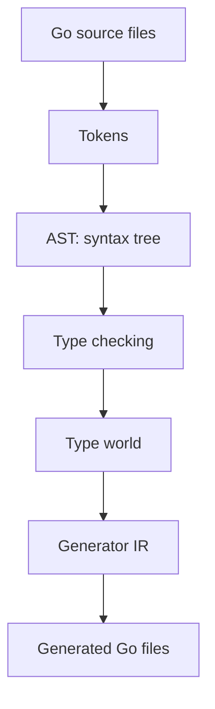
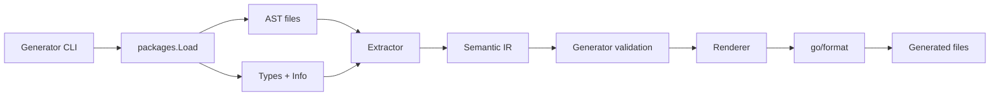
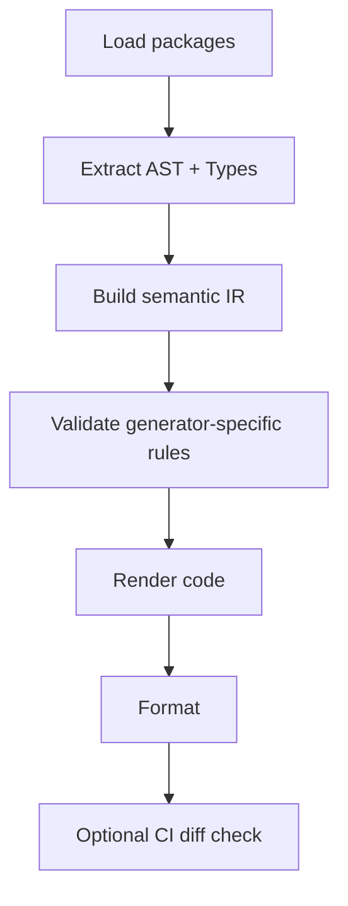
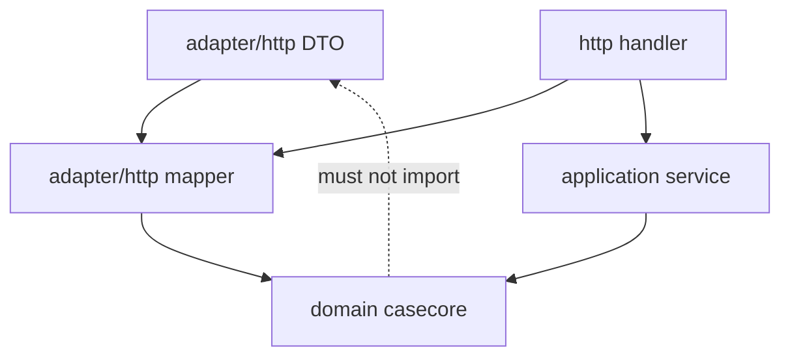
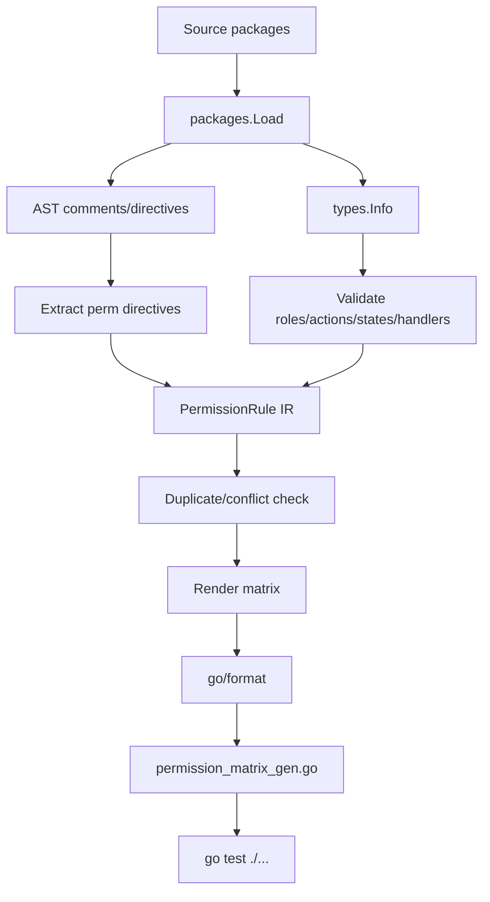

# learn-go-composition-oop-functional-reflection-codegen-modules-part-021

# Type-Aware Code Generation: `go/types`, Package Loading, Import Resolution, dan Generic Type Inspection

> Seri: `learn-go-composition-oop-functional-reflection-codegen-modules`  
> Bagian: 021 dari 030  
> Target pembaca: Java software engineer / tech lead yang ingin menguasai desain Go level production handbook  
> Fokus: membuat generator yang tidak hanya membaca AST, tetapi memahami *meaning* dari program Go.

---

## 0. Posisi Part Ini dalam Seri

Di Part 020 kita membahas **AST-based generation**:

- membaca file Go dengan `go/parser`,
- menavigasi node `go/ast`,
- membaca komentar/directive,
- menghasilkan file deterministic,
- mengatur formatting,
- membangun IR dari syntax.

Namun AST hanya menjawab pertanyaan seperti:

> “Di file ini ada struct bernama `CaseCommand` dengan field bernama `CaseID` bertipe `CaseID`.”

AST **tidak otomatis tahu**:

- `CaseID` itu type dari package mana,
- apakah `CaseID` alias atau defined type,
- apakah type itu underlying-nya `string`,
- apakah `[]Permission` berisi element type dari package internal,
- apakah sebuah method berasal dari embedded field,
- apakah type parameter `T` constrained oleh `~string`,
- apakah `Foo` yang tertulis di source adalah selector, local type, imported type, atau predeclared identifier,
- apakah expression valid menurut type checker,
- apakah method set suatu type memenuhi interface tertentu.

Part ini membahas layer berikutnya: **type-aware generation**.

Secara sederhana:

```text
AST generator      = understands syntax shape
Type-aware generator = understands program meaning
```

Atau dalam bahasa Java:

```text
AST-only Go generator  ~= Java parser yang melihat token dan class declaration
Type-aware Go generator ~= javac annotation processor yang punya TypeMirror/Elements/Symbol info
```

Tetapi Go punya filosofi yang berbeda: code generation tidak built-in sebagai annotation processor di compile pipeline. Generator Go biasanya eksplisit, dijalankan lewat `go generate`, tool CLI, atau CI step.

---

## 1. Core Problem

Generator production sering mulai sederhana:

```go
//go:generate go run ./cmd/gen-validator

type CreateCaseCommand struct {
    CaseID string `validate:"required"`
}
```

Awalnya generator hanya perlu membaca struct tag.

Lalu kebutuhan bertambah:

- validasi berbeda untuk `type CaseID string`,
- enum generator perlu tahu constant type,
- mapper generator perlu membedakan DTO vs domain type,
- permission generator perlu resolve package import,
- mock generator perlu method set interface,
- client generator perlu inspect generic response type,
- serialization generator perlu tahu apakah field implement `encoding.TextMarshaler`,
- registry generator perlu tahu apakah type implement contract tertentu.

Pada titik ini, AST-only generator mulai rapuh.

Contoh:

```go
package command

import domain "example.com/reg/domain/case"

type SubmitCommand struct {
    ID domain.CaseID `json:"id" validate:"required"`
}
```

AST melihat field type sebagai:

```text
SelectorExpr{
  X: Ident{Name: "domain"},
  Sel: Ident{Name: "CaseID"},
}
```

Tetapi AST tidak tahu bahwa:

```text
domain => example.com/reg/domain/case
CaseID => defined type with underlying string
```

Untuk generator production, informasi ini sering menentukan output.

---

## 2. Mental Model: Syntax Tree vs Type World

Go source code punya beberapa representasi mental:



### 2.1 AST World

AST world berisi struktur source code:

- package declaration,
- import declarations,
- type declarations,
- field declarations,
- function declarations,
- comments,
- expressions,
- syntax-level identifiers.

AST bagus untuk:

- menemukan directive,
- membaca struct tag literal,
- mempertahankan source location,
- mengelola comments,
- melihat deklarasi yang tertulis eksplisit.

### 2.2 Type World

Type world berisi makna setelah type checker bekerja:

- object identity,
- type identity,
- underlying type,
- method set,
- interface implementation,
- constant value,
- package path,
- import resolution,
- generic instantiation,
- assignability,
- convertibility,
- type parameter constraints.

Type world bagus untuk:

- memastikan generator tidak salah resolve type,
- membangun output berdasarkan semantic contract,
- menolak input invalid lebih awal,
- memproduksi error dengan source position,
- mengurangi string matching rapuh.

---

## 3. Kapan AST Saja Cukup, Kapan Perlu Type Checker

Tidak semua generator perlu `go/types`. Type checking menambah kompleksitas, waktu eksekusi, dependency loading, dan failure mode.

Gunakan AST-only bila generator:

- hanya membaca tag field lokal,
- hanya membaca komentar directive,
- hanya memproses file dalam satu package tanpa import meaning,
- tidak perlu tahu interface satisfaction,
- tidak perlu tahu underlying type,
- tidak perlu tahu constant value yang dihitung,
- tidak perlu generic inspection.

Gunakan type-aware bila generator perlu:

- resolve imported type,
- membedakan alias vs defined type,
- membaca underlying type,
- membaca method set,
- menentukan apakah type implement interface,
- membaca constant typed/untyped value,
- memahami generic declaration/instantiation,
- men-generate berdasarkan package path aktual,
- memvalidasi expression atau assignment compatibility,
- menghindari collision karena local import alias.

Decision rule sederhana:

```text
Jika output generator berubah berdasarkan arti type, bukan hanya bentuk syntax,
generator perlu type information.
```

---

## 4. Go Tooling Layers untuk Type-Aware Generator

Ada beberapa package penting:

| Package | Fungsi |
|---|---|
| `go/token` | posisi source, file set |
| `go/ast` | syntax tree |
| `go/parser` | parse file/package |
| `go/types` | type checker dan semantic model |
| `go/importer` | importer sederhana untuk compiled export data |
| `golang.org/x/tools/go/packages` | package loader production-oriented |
| `go/constant` | representasi nilai constant |
| `go/format` | format output Go |
| `go/printer` | print AST node |
| `go/build` | historical build context, jarang jadi pilihan utama modern generator |

Untuk generator production modern, biasanya arsitekturnya:



---

## 5. `go/types`: Komponen Utama

`go/types` menyediakan model semantic Go.

Konsep utamanya:

| Concept | Makna |
|---|---|
| `types.Package` | package semantic, punya path dan scope |
| `types.Scope` | namespace berisi object |
| `types.Object` | named object: type, var, const, func, package name |
| `types.Type` | semantic type |
| `types.Named` | defined named type |
| `types.Alias` | alias type modern API |
| `types.Basic` | basic type seperti string, int, bool |
| `types.Struct` | struct type semantic |
| `types.Interface` | interface semantic, type set/method set |
| `types.Signature` | function/method signature |
| `types.Tuple` | parameter/result list |
| `types.Pointer` | pointer type |
| `types.Slice` | slice type |
| `types.Array` | array type |
| `types.Map` | map type |
| `types.Chan` | channel type |
| `types.TypeParam` | generic type parameter |
| `types.Union` | union term di constraint |
| `types.Term` | satu term dalam union type set |
| `types.Info` | mapping AST node ke type/object/selection |

Yang paling penting untuk generator adalah `types.Info`.

---

## 6. `types.Info`: Jembatan AST ke Semantic Meaning

`types.Info` menyimpan hasil type checker untuk AST.

Field penting:

| Field | Isi |
|---|---|
| `Types` | type dan value untuk expression |
| `Defs` | identifier yang mendefinisikan object |
| `Uses` | identifier yang memakai object |
| `Selections` | selector resolution: field/method selection |
| `Scopes` | scope untuk AST node tertentu |
| `Implicits` | object implicit, misalnya import dot atau type switch implisit |
| `Instances` | generic instantiation info |

Mental model:

```go
// Source:
var x domain.CaseID
```

AST tahu ada ident `domain` dan selector `CaseID`.

`types.Info` tahu:

```text
Ident "domain" => imported package object
Selector "CaseID" => type object from package example.com/reg/domain/case
```

---

## 7. Minimal Type Check Example

Contoh sederhana untuk memahami `go/types` secara manual:

```go
package main

import (
    "fmt"
    "go/ast"
    "go/importer"
    "go/parser"
    "go/token"
    "go/types"
)

func main() {
    src := `
package demo

import "time"

type CaseID string

type Case struct {
    ID CaseID
    CreatedAt time.Time
}
`

    fset := token.NewFileSet()
    file, err := parser.ParseFile(fset, "demo.go", src, parser.ParseComments)
    if err != nil {
        panic(err)
    }

    info := &types.Info{
        Types:      make(map[ast.Expr]types.TypeAndValue),
        Defs:       make(map[*ast.Ident]types.Object),
        Uses:       make(map[*ast.Ident]types.Object),
        Selections: make(map[*ast.SelectorExpr]*types.Selection),
    }

    conf := types.Config{
        Importer: importer.Default(),
        Error: func(err error) {
            fmt.Println("type error:", err)
        },
    }

    pkg, err := conf.Check("demo", fset, []*ast.File{file}, info)
    if err != nil {
        panic(err)
    }

    fmt.Println("package:", pkg.Path())

    ast.Inspect(file, func(n ast.Node) bool {
        ident, ok := n.(*ast.Ident)
        if !ok {
            return true
        }

        if obj := info.Defs[ident]; obj != nil {
            fmt.Printf("DEF %-10s => %T %s\n", ident.Name, obj, obj)
        }
        if obj := info.Uses[ident]; obj != nil {
            fmt.Printf("USE %-10s => %T %s\n", ident.Name, obj, obj)
        }

        return true
    })
}
```

Output kira-kira menunjukkan mana identifier yang mendefinisikan object dan mana yang memakai object.

Namun untuk generator real, jarang kita memanggil `types.Config.Check` langsung terhadap satu file. Lebih sering kita memakai `packages.Load`.

---

## 8. Kenapa `packages.Load` Lebih Cocok untuk Generator Production

`go/types` sendiri butuh:

- daftar file,
- import resolution,
- build tags,
- GOOS/GOARCH,
- module context,
- cgo setting,
- overlay file,
- test variants bila perlu.

Di real project, package loading bukan trivial.

`golang.org/x/tools/go/packages` membantu membaca package sesuai environment `go` command.

Dengan `packages.Load`, generator bisa:

- load package berdasarkan pattern seperti `./...`, `.`, atau package path,
- menghormati module/workspace,
- menghormati build tags,
- mendapatkan syntax AST,
- mendapatkan `types.Package`,
- mendapatkan `types.Info`,
- mendapatkan file list,
- mendapatkan error package/type check.

---

## 9. Minimal `packages.Load` Skeleton

```go
package main

import (
    "fmt"
    "go/ast"
    "go/token"
    "log"

    "golang.org/x/tools/go/packages"
)

func main() {
    fset := token.NewFileSet()

    cfg := &packages.Config{
        Mode: packages.NeedName |
            packages.NeedFiles |
            packages.NeedCompiledGoFiles |
            packages.NeedSyntax |
            packages.NeedTypes |
            packages.NeedTypesInfo |
            packages.NeedImports,
        Fset: fset,
        Dir:  ".",
    }

    pkgs, err := packages.Load(cfg, ".")
    if err != nil {
        log.Fatal(err)
    }

    for _, pkg := range pkgs {
        for _, err := range pkg.Errors {
            fmt.Println("package error:", err)
        }

        fmt.Println("package:", pkg.PkgPath)

        for _, file := range pkg.Syntax {
            ast.Inspect(file, func(n ast.Node) bool {
                ts, ok := n.(*ast.TypeSpec)
                if !ok {
                    return true
                }

                obj := pkg.TypesInfo.Defs[ts.Name]
                if obj != nil {
                    fmt.Printf("type %s => %s\n", ts.Name.Name, obj.Type().String())
                }
                return false
            })
        }
    }
}
```

Production notes:

- jangan ignore `pkg.Errors`,
- jangan assume satu package saja bila pattern bisa match banyak,
- jangan pakai `NeedDeps` kecuali memang perlu karena bisa berat,
- gunakan mode minimal sesuai kebutuhan,
- set `Dir` agar generator stabil saat dipanggil dari lokasi berbeda,
- pertimbangkan build tags melalui `BuildFlags`.

---

## 10. Package Loading Mode: Jangan Overload Tanpa Alasan

`packages.Load` mode menentukan data apa yang dimuat.

Contoh kombinasi umum:

```go
Mode: packages.NeedName |
      packages.NeedFiles |
      packages.NeedCompiledGoFiles |
      packages.NeedSyntax |
      packages.NeedTypes |
      packages.NeedTypesInfo |
      packages.NeedImports
```

Untuk generator besar:

| Need | Kapan dipakai |
|---|---|
| `NeedName` | hampir selalu |
| `NeedFiles` | perlu source file paths |
| `NeedCompiledGoFiles` | perlu file yang benar-benar masuk build setelah tags |
| `NeedSyntax` | perlu AST |
| `NeedTypes` | perlu package type object |
| `NeedTypesInfo` | perlu mapping AST ke type/object |
| `NeedImports` | perlu direct imports |
| `NeedDeps` | perlu transitive dependencies; mahal |
| `NeedModule` | perlu module info |

Anti-pattern:

```go
Mode: packages.LoadAllSyntax
```

Untuk semua generator.

Masalah:

- lambat,
- memori tinggi,
- memuat dependency terlalu luas,
- error surface lebih besar,
- CI generator menjadi berat.

Gunakan mode sesuai kebutuhan.

---

## 11. Build Tags dan Conditional Compilation

Go package yang sama bisa punya file berbeda tergantung:

- `GOOS`,
- `GOARCH`,
- build tags,
- cgo,
- file suffix seperti `_linux.go`, `_windows.go`,
- `_test.go` bila load test variant.

Generator harus jelas:

```text
Apakah output dibuat untuk package compiled saat ini?
Atau untuk semua source file lintas build tag?
```

### 11.1 Generator untuk Runtime Code

Jika generated file akan di-compile dalam build normal, biasanya harus mengikuti compiled package.

Gunakan:

```go
packages.NeedCompiledGoFiles
```

Dan jalankan dengan build flags yang sama:

```go
cfg := &packages.Config{
    BuildFlags: []string{"-tags=enterprise,regulatory"},
}
```

### 11.2 Generator untuk Documentation/Registry Global

Jika output bukan compile target atau ingin scan semua file, AST manual kadang lebih cocok. Tetapi harus hati-hati karena type checker tidak bisa type-check semua mutually exclusive files sekaligus.

---

## 12. Import Resolution

Salah satu alasan utama memakai type info adalah import resolution.

Source:

```go
import casedomain "example.com/reg/domain/case"

type Command struct {
    ID casedomain.CaseID
}
```

AST hanya tahu alias `casedomain`.

Type info bisa memberi package path:

```go
func packagePathOfSelector(pkg *packages.Package, sel *ast.SelectorExpr) string {
    ident, ok := sel.X.(*ast.Ident)
    if !ok {
        return ""
    }

    obj := pkg.TypesInfo.Uses[ident]
    pname, ok := obj.(*types.PkgName)
    if !ok {
        return ""
    }

    return pname.Imported().Path()
}
```

Dengan ini generator tidak tergantung alias import lokal.

---

## 13. Named Type, Alias, dan Underlying Type

Type-aware generator sering perlu membedakan:

```go
type CaseID string

type ExternalID = string
```

`CaseID` adalah **defined type**.

`ExternalID` adalah **alias**.

Konsekuensi:

- defined type punya identity sendiri,
- alias hanya nama lain untuk type yang sama,
- method bisa dideklarasikan pada defined type lokal,
- alias tidak menciptakan domain boundary baru,
- generator domain biasanya harus treat keduanya berbeda.

### 13.1 Inspect Defined Type

```go
func describeTypeName(obj types.Object) {
    tn, ok := obj.(*types.TypeName)
    if !ok {
        return
    }

    typ := tn.Type()

    if named, ok := typ.(*types.Named); ok {
        fmt.Println("defined type:", named.Obj().Name())
        fmt.Println("underlying:", named.Underlying().String())
    }
}
```

### 13.2 Inspect Alias

Modern `go/types` punya konsep alias type yang lebih eksplisit. Untuk generator production, jangan hanya mengandalkan string output.

Pattern aman:

```go
func isNamedDefinedType(t types.Type) bool {
    _, ok := t.(*types.Named)
    return ok
}
```

Lalu treat alias sesuai API `go/types` versi yang dipakai generator. Karena behavior alias representation pernah berevolusi, generator harus punya test untuk alias input.

---

## 14. Underlying Type sebagai Semantic Signal

Misalnya:

```go
type CaseID string
type Version int64
type Permission string
```

Generator validation bisa membuat rule:

- semua `CaseID` required dan canonicalized,
- semua type dengan underlying `string` bisa memakai text codec,
- semua enum defined type dengan underlying `string` bisa dibuatkan `IsValid()`.

Tetapi hati-hati:

```text
Underlying type adalah mekanisme bahasa,
bukan selalu domain semantics.
```

`type Email string` dan `type PlainTextPassword string` sama-sama underlying `string`, tetapi policy-nya berbeda.

Decision rule:

```text
Use underlying type for mechanical generation.
Use directive/tag/interface for domain semantics.
```

---

## 15. Reading Struct Type via `go/types`

AST:

```go
type SubmitCommand struct {
    CaseID CaseID `json:"caseId"`
}
```

Type-aware extraction:

```go
func inspectTypeSpec(pkg *packages.Package, ts *ast.TypeSpec) {
    obj := pkg.TypesInfo.Defs[ts.Name]
    if obj == nil {
        return
    }

    named, ok := obj.Type().(*types.Named)
    if !ok {
        return
    }

    st, ok := named.Underlying().(*types.Struct)
    if !ok {
        return
    }

    for i := 0; i < st.NumFields(); i++ {
        field := st.Field(i)
        tag := st.Tag(i)

        fmt.Println("field:", field.Name())
        fmt.Println("type:", field.Type().String())
        fmt.Println("tag:", tag)
        fmt.Println("exported:", field.Exported())
        fmt.Println("embedded:", field.Embedded())
    }
}
```

Kelebihan membaca struct via `types.Struct`:

- type sudah resolved,
- tag tetap tersedia,
- field object punya package/export info,
- embedded status semantic tersedia.

Kekurangan:

- komentar field tidak tersedia dari `types.Struct`,
- source-level directive harus dibaca dari AST,
- posisi field perlu dikaitkan balik ke AST bila ingin diagnostic detail.

Production extractor sering menggabungkan AST dan types.

---

## 16. Combining AST Field and `types.Var`

Untuk mendapatkan komentar, tag, posisi, dan type semantic sekaligus:

```go
func extractStructFields(pkg *packages.Package, ts *ast.TypeSpec) {
    stNode, ok := ts.Type.(*ast.StructType)
    if !ok {
        return
    }

    obj := pkg.TypesInfo.Defs[ts.Name]
    named, ok := obj.Type().(*types.Named)
    if !ok {
        return
    }

    st, ok := named.Underlying().(*types.Struct)
    if !ok {
        return
    }

    semanticIndex := 0

    for _, fieldNode := range stNode.Fields.List {
        names := fieldNode.Names
        if len(names) == 0 {
            // embedded field
            if semanticIndex < st.NumFields() {
                fieldObj := st.Field(semanticIndex)
                fmt.Println("embedded:", fieldObj.Name(), fieldObj.Type())
                semanticIndex++
            }
            continue
        }

        for _, name := range names {
            if semanticIndex >= st.NumFields() {
                continue
            }

            fieldObj := st.Field(semanticIndex)
            pos := pkg.Fset.Position(name.Pos())

            fmt.Println("field:", name.Name)
            fmt.Println("position:", pos)
            fmt.Println("semantic type:", fieldObj.Type())

            semanticIndex++
        }
    }
}
```

Catatan:

- field declaration bisa punya banyak names: `A, B string`,
- embedded field tidak punya `Names`,
- urutan AST field dan `types.Struct` field biasanya align, tapi generator harus punya test untuk edge cases,
- jangan lupa blank identifier dan invalid field akibat type error.

---

## 17. Method Set Inspection

Generator mock, decorator, proxy, instrumentation wrapper, dan registry sering perlu membaca method set.

Contoh:

```go
type CaseRepository interface {
    Find(ctx context.Context, id CaseID) (Case, error)
    Save(ctx context.Context, c Case) error
}
```

Inspect interface methods:

```go
func inspectInterface(t types.Type) {
    iface, ok := t.Underlying().(*types.Interface)
    if !ok {
        return
    }

    iface = iface.Complete()

    for i := 0; i < iface.NumMethods(); i++ {
        m := iface.Method(i)
        sig := m.Type().(*types.Signature)
        fmt.Println("method:", m.Name())
        fmt.Println("sig:", sig.String())
    }
}
```

Inspect method set of concrete type:

```go
func inspectMethodSet(t types.Type) {
    ms := types.NewMethodSet(t)
    for i := 0; i < ms.Len(); i++ {
        sel := ms.At(i)
        fmt.Println(sel.Obj().Name(), sel.Type())
    }
}
```

Important:

```text
Method set of T and *T can differ.
```

Untuk generator decorator/proxy, Anda harus menentukan apakah target wrapper menyimpan `T` atau `*T`, dan apakah method receiver pointer perlu dipertahankan.

---

## 18. Interface Implementation Check

`go/types` menyediakan helper:

```go
ok := types.Implements(concreteType, interfaceType)
```

Untuk pointer receiver:

```go
ok := types.Implements(types.NewPointer(concreteType), interfaceType)
```

Contoh helper:

```go
func implements(t types.Type, iface *types.Interface) bool {
    iface = iface.Complete()
    if types.Implements(t, iface) {
        return true
    }
    if _, ok := t.(*types.Pointer); !ok {
        return types.Implements(types.NewPointer(t), iface)
    }
    return false
}
```

Namun jangan selalu auto-check pointer juga. Itu bisa menyembunyikan keputusan desain.

Decision rule:

```text
Jika generated code akan menerima value T, check T.
Jika generated code akan menerima pointer *T, check *T.
Jangan check keduanya kecuali semantics memang membolehkan keduanya.
```

---

## 19. Selector Resolution: Field atau Method?

Source:

```go
x.Status
x.Status()
```

AST selector sama-sama `SelectorExpr`, tetapi meaning berbeda.

`types.Info.Selections` memberi resolution untuk selector pada field/method:

```go
ast.Inspect(file, func(n ast.Node) bool {
    sel, ok := n.(*ast.SelectorExpr)
    if !ok {
        return true
    }

    if selection := pkg.TypesInfo.Selections[sel]; selection != nil {
        fmt.Println("selector:", sel.Sel.Name)
        fmt.Println("kind:", selection.Kind())
        fmt.Println("obj:", selection.Obj())
        fmt.Println("index:", selection.Index())
        fmt.Println("indirect:", selection.Indirect())
    }

    return true
})
```

Selection kind bisa menunjukkan:

- field access,
- method value,
- method expression.

Ini penting untuk generator yang menganalisis expression atau DSL-like source.

---

## 20. Constant Inspection

Enum-like generator sering perlu membaca const.

```go
type CaseStatus string

const (
    CaseStatusDraft     CaseStatus = "DRAFT"
    CaseStatusSubmitted CaseStatus = "SUBMITTED"
)
```

Extract const semantic:

```go
func inspectValueSpec(pkg *packages.Package, vs *ast.ValueSpec) {
    for _, name := range vs.Names {
        obj := pkg.TypesInfo.Defs[name]
        c, ok := obj.(*types.Const)
        if !ok {
            continue
        }

        fmt.Println("const:", c.Name())
        fmt.Println("type:", c.Type())
        fmt.Println("value:", c.Val())
    }
}
```

Kenapa bukan AST literal saja?

Karena const bisa seperti:

```go
const (
    Base CaseStatus = "DRAFT"
    Alias            = Base
)
```

Type checker membantu menyelesaikan nilai constant.

---

## 21. Generic Type Inspection

Go generics menambah dimensi baru untuk generator.

Contoh:

```go
type Page[T any] struct {
    Items []T
    Total int
}

type CasePage = Page[CaseDTO]
```

Pertanyaan generator:

- apakah `Page` generic type?
- type parameternya apa?
- constraint-nya apa?
- apakah field `Items` adalah `[]T` atau instantiated `[]CaseDTO`?
- apakah alias instantiation perlu di-generate?

### 21.1 Type Parameters on Named Type

```go
func inspectNamed(named *types.Named) {
    tparams := named.TypeParams()
    if tparams != nil {
        for i := 0; i < tparams.Len(); i++ {
            tp := tparams.At(i)
            fmt.Println("type param:", tp.Obj().Name())
            fmt.Println("constraint:", tp.Constraint())
        }
    }
}
```

### 21.2 Type Arguments on Instantiated Type

```go
func inspectTypeArgs(named *types.Named) {
    targs := named.TypeArgs()
    if targs != nil {
        for i := 0; i < targs.Len(); i++ {
            fmt.Println("type arg:", targs.At(i))
        }
    }
}
```

### 21.3 `types.Info.Instances`

`TypesInfo.Instances` maps identifiers to generic instantiation info.

Useful saat source memakai generic function/type:

```go
var p Page[CaseDTO]
```

Generator bisa inspect instantiated type melalui type info expression.

---

## 22. Constraint Inspection

Contoh:

```go
type StringID interface {
    ~string
}

type EntityID[T StringID] struct {
    Value T
}
```

Inspect constraint:

```go
func inspectConstraint(tp *types.TypeParam) {
    c := tp.Constraint()
    iface, ok := c.Underlying().(*types.Interface)
    if !ok {
        return
    }

    iface = iface.Complete()

    fmt.Println("methods:", iface.NumMethods())
    fmt.Println("embeddeds:", iface.NumEmbeddeds())

    // For deeper type set analysis, inspect embedded types.
    for i := 0; i < iface.NumEmbeddeds(); i++ {
        fmt.Println("embedded:", iface.EmbeddedType(i))
    }
}
```

Constraint generator harus hati-hati: tidak semua constraint mudah direpresentasikan sebagai runtime logic.

Misalnya:

```go
interface { ~string | ~int }
```

Ini compile-time type set, bukan runtime enum.

---

## 23. Type Identity: Jangan Pakai String Matching sebagai Truth

Bad generator:

```go
if field.Type().String() == "time.Time" {
    // ...
}
```

Masalah:

- package alias bisa berubah,
- vendoring/module path bisa berbeda,
- local type bisa bernama `time.Time` via weird import alias scenario,
- string representation bukan API contract utama.

Better:

```go
func isNamedType(t types.Type, pkgPath, name string) bool {
    named, ok := deref(t).(*types.Named)
    if !ok {
        return false
    }

    obj := named.Obj()
    if obj == nil || obj.Pkg() == nil {
        return false
    }

    return obj.Pkg().Path() == pkgPath && obj.Name() == name
}

func deref(t types.Type) types.Type {
    if p, ok := t.(*types.Pointer); ok {
        return p.Elem()
    }
    return t
}
```

Usage:

```go
if isNamedType(field.Type(), "time", "Time") {
    // stable
}
```

---

## 24. Import Rendering for Generated Code

Type-aware generator sering perlu menghasilkan import.

Jangan hardcode alias kecuali perlu.

Generator output harus:

- deterministic,
- tidak collision,
- memakai import path asli,
- memberi alias hanya saat diperlukan,
- tidak menghasilkan unused import,
- diformat oleh `go/format` atau `goimports` equivalent.

### 24.1 Internal Import Model

Gunakan IR:

```go
type ImportRef struct {
    Path  string
    Alias string // optional
}

type GoTypeRef struct {
    PackagePath string
    Name        string
    Pointer     bool
    Slice       bool
}
```

Jangan simpan type hanya sebagai string.

Bad IR:

```go
type Field struct {
    Type string // "domain.CaseID"
}
```

Better IR:

```go
type Field struct {
    Name string
    Type TypeRef
}

type TypeRef struct {
    Kind        TypeRefKind
    PackagePath string
    Name        string
    Elem        *TypeRef
}
```

---

## 25. Generated Type Naming and Collision

Generator harus menangani collision:

```go
package command

import casepkg "example.com/reg/domain/case"
import usercase "example.com/reg/domain/usercase"
```

Dua package bisa punya default import name sama.

Collision policy:

1. prefer default package name,
2. detect duplicate local names,
3. assign deterministic alias,
4. fail bila alias tidak bisa dibuat aman,
5. test output dengan `go test`.

Example deterministic alias:

```text
casepkg
usercase
```

Atau:

```text
case1
case2
```

Tetapi alias numeric kurang reviewable.

Production preference:

```text
Use explicit configured alias for known collision-prone domains.
Fail with actionable message for unknown collision.
```

---

## 26. Source Position and Diagnostics

Generator error harus menunjuk file dan line.

Bad error:

```text
invalid tag on field CaseID
```

Good error:

```text
internal/case/command/submit.go:17:2: field CaseID: validate tag uses unknown rule "case_idd"; did you mean "case_id"?
```

Use `token.FileSet`:

```go
func diagnostic(fset *token.FileSet, pos token.Pos, msg string) string {
    p := fset.Position(pos)
    return fmt.Sprintf("%s:%d:%d: %s", p.Filename, p.Line, p.Column, msg)
}
```

For type-aware generators, attach position from AST node, not from `types.Object` only.

---

## 27. Handling Package Errors

`packages.Load` can return packages with errors. Decide policy.

For production code generator, usually:

```text
If package has syntax/type errors, fail generation.
```

Because generating from invalid code creates confusing output.

Example:

```go
func failOnPackageErrors(pkgs []*packages.Package) error {
    var msgs []string
    for _, pkg := range pkgs {
        for _, err := range pkg.Errors {
            msgs = append(msgs, err.Error())
        }
    }
    if len(msgs) > 0 {
        return fmt.Errorf("package loading failed:\n%s", strings.Join(msgs, "\n"))
    }
    return nil
}
```

However, some analyzers can tolerate type errors. Code generators usually should not.

---

## 28. Designing Semantic IR

Do not generate directly from AST/types.

Pipeline recommended:



Why IR matters:

- isolates parsing from rendering,
- easier to test,
- easier to validate,
- supports multiple renderers,
- prevents generator logic from becoming AST spaghetti,
- makes output deterministic.

Example IR for enum generator:

```go
type EnumIR struct {
    PackageName string
    PackagePath string
    TypeName    string
    Underlying  BasicKind
    Values      []EnumValueIR
    Position    token.Position
}

type EnumValueIR struct {
    Name     string
    Value    string
    Position token.Position
}
```

Example IR for mapper generator:

```go
type StructIR struct {
    Name      string
    PkgPath   string
    Fields    []FieldIR
    Directives []DirectiveIR
}

type FieldIR struct {
    Name       string
    JSONName   string
    Type       TypeIR
    Required   bool
    Position   token.Position
}
```

---

## 29. TypeRef IR Design

A robust `TypeIR` might look like:

```go
type TypeKind int

const (
    TypeInvalid TypeKind = iota
    TypeBasic
    TypeNamed
    TypePointer
    TypeSlice
    TypeArray
    TypeMap
    TypeStruct
    TypeInterface
    TypeTypeParam
)

type TypeIR struct {
    Kind TypeKind

    // For named type.
    PackagePath string
    Name        string

    // For basic type.
    BasicName string

    // Recursive shapes.
    Elem  *TypeIR
    Key   *TypeIR
    Value *TypeIR

    // For generic type.
    TypeArgs []TypeIR

    // Additional semantic flags.
    IsAlias       bool
    IsDefined     bool
    IsComparable  bool
    Underlying    *TypeIR
}
```

But do not over-generalize. Build IR for generator needs, not a second compiler.

Rule:

```text
Your generator IR should be complete enough for its output,
but not attempt to model all of Go unless you are building a compiler-like tool.
```

---

## 30. Example: Type-Aware Enum Generator

Input:

```go
package casecore

//go:generate go run ./cmd/genenum -type=CaseStatus

type CaseStatus string

const (
    CaseStatusDraft     CaseStatus = "DRAFT"
    CaseStatusSubmitted CaseStatus = "SUBMITTED"
    CaseStatusApproved  CaseStatus = "APPROVED"
    CaseStatusRejected  CaseStatus = "REJECTED"
)
```

Generated output:

```go
// Code generated by genenum; DO NOT EDIT.

package casecore

func (v CaseStatus) IsValid() bool {
    switch v {
    case CaseStatusDraft,
        CaseStatusSubmitted,
        CaseStatusApproved,
        CaseStatusRejected:
        return true
    default:
        return false
    }
}

func AllCaseStatus() []CaseStatus {
    return []CaseStatus{
        CaseStatusDraft,
        CaseStatusSubmitted,
        CaseStatusApproved,
        CaseStatusRejected,
    }
}
```

Why type-aware?

- ensure `CaseStatus` exists,
- ensure it is a defined type,
- ensure underlying type is `string`,
- collect only constants of type `CaseStatus`,
- resolve aliases/constant values,
- fail if duplicate values exist,
- emit stable output.

---

## 31. Type-Aware Enum Extraction Pseudocode

```go
func extractEnum(pkg *packages.Package, typeName string) (*EnumIR, error) {
    obj := pkg.Types.Scope().Lookup(typeName)
    if obj == nil {
        return nil, fmt.Errorf("type %s not found in package %s", typeName, pkg.PkgPath)
    }

    tn, ok := obj.(*types.TypeName)
    if !ok {
        return nil, fmt.Errorf("%s is not a type", typeName)
    }

    named, ok := tn.Type().(*types.Named)
    if !ok {
        return nil, fmt.Errorf("%s is not a defined named type", typeName)
    }

    basic, ok := named.Underlying().(*types.Basic)
    if !ok || basic.Kind() != types.String {
        return nil, fmt.Errorf("%s must have underlying string type", typeName)
    }

    ir := &EnumIR{
        PackageName: pkg.Name,
        PackagePath: pkg.PkgPath,
        TypeName: typeName,
    }

    for _, file := range pkg.Syntax {
        ast.Inspect(file, func(n ast.Node) bool {
            vs, ok := n.(*ast.ValueSpec)
            if !ok {
                return true
            }

            for _, name := range vs.Names {
                c, ok := pkg.TypesInfo.Defs[name].(*types.Const)
                if !ok {
                    continue
                }

                if types.Identical(c.Type(), named) {
                    ir.Values = append(ir.Values, EnumValueIR{
                        Name: name.Name,
                        Value: constant.StringVal(c.Val()),
                        Position: pkg.Fset.Position(name.Pos()),
                    })
                }
            }

            return true
        })
    }

    return ir, nil
}
```

Validation:

- no empty enum,
- no duplicate constant names,
- no duplicate values unless explicitly allowed,
- no unexported constants if public API requires exported,
- stable sort by source order or value order,
- fail on unsupported iota expression if generator cannot handle it.

---

## 32. Example: Type-Aware Mapper Generator

Input:

```go
package dto

import "example.com/reg/domain/casecore"

type CaseDTO struct {
    ID     string `json:"id"`
    Status string `json:"status"`
}

//go:mapper source=CaseDTO target=casecore.Case
type _CaseMapperMarker struct{}
```

Target domain:

```go
package casecore

type CaseID string
type CaseStatus string

type Case struct {
    id     CaseID
    status CaseStatus
}

func NewCase(id CaseID, status CaseStatus) (Case, error) {
    // validate invariant
}
```

A naive mapper might generate direct field assignment. That fails because domain fields are unexported.

Type-aware production mapper should detect:

- target fields are not exported,
- target constructor exists,
- source field `ID string` maps to `CaseID`,
- source field `Status string` maps to `CaseStatus`,
- conversions may require validation,
- generated code must call constructor.

Important design conclusion:

```text
Type-aware generation should not bypass domain invariants.
```

If generator has to choose between:

```go
casecore.Case{...}
```

and:

```go
casecore.NewCase(...)
```

prefer constructor when domain invariants exist.

---

## 33. Detecting Constructor Functions

Convention example:

```text
New<TypeName>
```

Use package scope:

```go
func findConstructor(pkg *types.Package, typeName string) *types.Func {
    obj := pkg.Scope().Lookup("New" + typeName)
    fn, _ := obj.(*types.Func)
    return fn
}
```

Then inspect signature:

```go
func inspectConstructor(fn *types.Func) {
    sig := fn.Type().(*types.Signature)

    params := sig.Params()
    results := sig.Results()

    for i := 0; i < params.Len(); i++ {
        p := params.At(i)
        fmt.Println("param:", p.Name(), p.Type())
    }

    for i := 0; i < results.Len(); i++ {
        r := results.At(i)
        fmt.Println("result:", r.Type())
    }
}
```

Validation for constructor-like function:

- name matches convention or directive,
- returns target type,
- optionally returns `error`,
- parameters can be mapped from source,
- no ambiguous overload issue because Go does not overload functions.

---

## 34. Production Error Messages for Mapper Generator

Bad:

```text
cannot map field
```

Good:

```text
internal/dto/case.go:12:1: mapper CaseDTO -> example.com/reg/domain/casecore.Case: target has unexported fields and no constructor directive was provided; expected constructor with signature func NewCase(...) (Case, error)
```

This matters because generator users debug input source, not generator internals.

---

## 35. Import Cycle Risk

Code generation can accidentally create import cycles.

Example:

```text
domain/casecore imports dto? bad
dto imports domain/casecore? okay depending boundary
```

Generated file location determines dependency direction.

If mapper generated in `domain`, it may import DTO and create wrong dependency.

Better:

```text
internal/app/casemapper
```

or

```text
adapter/http/casemapper
```

Architecture:



Code generator must respect architecture layer.

Production policy:

```text
Generated code is still architecture code.
It must obey dependency direction.
```

---

## 36. Type-Aware Generator and Package Boundary

Generator must not normalize away Go's package boundary.

Bad generator behavior:

- accesses unexported fields via unsafe,
- generates files into domain package to bypass visibility,
- creates giant shared generated package imported everywhere,
- rewrites package architecture for convenience,
- generates code that couples core domain to adapters.

Good generator behavior:

- fails when contract is insufficient,
- requires explicit constructor or exported method,
- generates at boundary package,
- maintains dependency direction,
- uses interface/adapter where appropriate,
- makes visibility constraints explicit.

---

## 37. Working with Test Packages

Go has two common test package styles:

```go
package casecore
```

and:

```go
package casecore_test
```

If generator needs test-only types, package loading becomes trickier.

For production generators:

- avoid depending on `_test.go` unless generator specifically creates test code,
- if generating mocks for tests, decide whether source interface lives in production package or test package,
- include `packages.NeedForTest` / test variants only when needed.

Rule:

```text
Production code generator should load production package.
Test code generator may load test variants explicitly.
```

---

## 38. Handling Workspace and Multi-Module Repositories

Enterprise Go repositories often use:

- one module,
- multiple modules,
- `go.work`,
- private modules,
- generated packages under internal tools,
- replace directives during development.

`packages.Load` respects the `go` command context better than manual parsing.

Generator CLI should expose:

```text
-dir
-pattern
-tags
-output
-module-root maybe optional
```

Example invocation:

```bash
go run ./tools/genmapper -dir . -pattern ./internal/... -tags enterprise
```

Avoid assuming current working directory is repository root.

---

## 39. Tool Version Pinning

Type-aware generator depends on Go version and `x/tools` version.

Production recommendations:

- keep generator code in repository or pinned module,
- pin `golang.org/x/tools` in `go.mod`,
- run generator with known Go toolchain,
- record generator version in generated header,
- CI verifies generated output clean.

Header example:

```go
// Code generated by genmapper v0.8.2 using go1.26.4; DO NOT EDIT.
```

Caution:

```text
Do not include timestamp in generated file unless required,
because it breaks deterministic diff.
```

---

## 40. Performance Model

Type-aware generation can be expensive because loading packages may invoke `go list`, parse files, read export data, and type check.

Performance practices:

- load only target packages,
- minimize `packages.Mode`,
- avoid `NeedDeps` unless required,
- process packages in deterministic but not necessarily serial order,
- cache semantic IR per package within one run,
- do not repeatedly call `packages.Load` per type,
- batch generation by package.

Bad:

```text
for each target type:
    packages.Load(".")
```

Good:

```text
packages.Load once per pattern
extract all target types
render all outputs
```

---

## 41. Concurrency in Generators

Generator can parallelize rendering, but be careful:

- `token.FileSet` read access is generally okay after loading, but avoid mutation,
- shared maps must be protected or immutable,
- output file writes need deterministic ordering,
- diagnostics should be sorted by position,
- logging should not interleave into unreadable output.

Recommended:

```text
1. load packages
2. extract immutable IR
3. validate IR serially or parallel with collected diagnostics
4. sort IR
5. render deterministic files
6. write files atomically
```

Do not let goroutine scheduling affect output order.

---

## 42. Atomic Writes and Idempotency

Generated file writer should:

1. render bytes,
2. format bytes,
3. compare with existing file,
4. write only if changed,
5. use temp file + rename,
6. preserve permission when appropriate.

Why?

- avoids touching mtime unnecessarily,
- reduces CI noise,
- prevents partial files on generator crash,
- makes repeated runs idempotent.

Pseudo:

```go
func writeIfChanged(path string, content []byte) error {
    old, err := os.ReadFile(path)
    if err == nil && bytes.Equal(old, content) {
        return nil
    }

    tmp := path + ".tmp"
    if err := os.WriteFile(tmp, content, 0o644); err != nil {
        return err
    }
    return os.Rename(tmp, path)
}
```

Production version should handle cross-platform behavior, cleanup temp file, and permission preservation.

---

## 43. Security Considerations

Type-aware generator may parse untrusted source in CI. Treat generator as code execution if it runs arbitrary packages? `packages.Load` invokes `go list` and processes module context, but it does not execute package code. However:

- generator itself may run with repo permissions,
- directives may contain paths/commands if you design them badly,
- generated output can be malicious if input directives are malicious,
- importing private modules may access credentials,
- generator logs may expose file paths/secrets in tags/comments.

Safe directive design:

- do not execute arbitrary directive shell fragments,
- whitelist directive keys,
- reject path traversal,
- restrict output path under package or configured root,
- do not include source comments containing secrets in generated output,
- fail closed on unknown directive where appropriate.

---

## 44. Common Failure Modes

### 44.1 String-Based Type Matching

Symptom:

- generator breaks after import alias change.

Fix:

- compare package path + object name.

### 44.2 Ignoring Build Tags

Symptom:

- generated code references type unavailable on target OS/build tag.

Fix:

- use compiled files and explicit build flags.

### 44.3 Loading Too Much

Symptom:

- generator takes minutes in CI.

Fix:

- reduce mode/pattern, avoid `NeedDeps`.

### 44.4 Bypassing Domain Invariants

Symptom:

- generated mapper constructs invalid domain object.

Fix:

- require constructor/factory contract.

### 44.5 Non-Deterministic Output

Symptom:

- CI diff changes randomly.

Fix:

- sort maps/slices, no timestamp, stable import aliases.

### 44.6 Poor Diagnostics

Symptom:

- developer cannot fix generator failure quickly.

Fix:

- attach file:line:column and actionable message.

### 44.7 Import Cycle Creation

Symptom:

- generated code fails compile due to cycle.

Fix:

- design output package placement according to architecture dependency direction.

---

## 45. Production Checklist

Use this before accepting a type-aware generator into a serious codebase.

### Loading

- [ ] Uses `packages.Load` or justified manual `go/types` flow.
- [ ] Sets `Dir` explicitly.
- [ ] Supports build tags when needed.
- [ ] Uses minimal `packages.Mode`.
- [ ] Fails on package/type errors unless intentionally analyzer-like.

### Semantic Extraction

- [ ] Compares type identity using package path + name, not string only.
- [ ] Handles pointer/value distinction explicitly.
- [ ] Handles alias vs defined type intentionally.
- [ ] Handles generic type parameters/arguments if supported.
- [ ] Fails clearly for unsupported type shape.
- [ ] Combines AST and type info when comments/positions/directives are needed.

### IR

- [ ] Has explicit semantic IR.
- [ ] IR is deterministic.
- [ ] IR validation separated from rendering.
- [ ] Test covers extraction independent of rendering.

### Rendering

- [ ] Output deterministic.
- [ ] Imports resolved safely.
- [ ] No unused imports.
- [ ] Formatted with `go/format` or equivalent.
- [ ] Atomic write or write-if-changed.
- [ ] Generated header present.

### Architecture

- [ ] Generated code respects package boundary.
- [ ] Does not bypass unexported domain state.
- [ ] Does not create import cycles.
- [ ] Does not introduce dependency direction violation.

### CI

- [ ] `go generate ./...` or explicit generator command is part of verification.
- [ ] CI checks regenerate-and-diff.
- [ ] Generator tool version pinned.
- [ ] Golden tests cover representative cases.
- [ ] Negative tests cover invalid input.

---

## 46. Study Case: Regulatory Permission Matrix Generator

Imagine a regulatory case management platform.

You have domain concepts:

```go
type Role string

type Action string

type CaseState string
```

And command handlers annotated by directive:

```go
//perm: action=case.approve states=SUBMITTED,REVIEWED roles=SUPERVISOR,APPROVER
func ApproveCase(ctx context.Context, cmd ApproveCaseCommand) error {
    // ...
}
```

Generated output:

```go
var PermissionMatrix = []PermissionRule{
    {
        Action: "case.approve",
        AllowedStates: []CaseState{CaseStateSubmitted, CaseStateReviewed},
        AllowedRoles: []Role{RoleSupervisor, RoleApprover},
    },
}
```

AST-only generator can read the comment.

Type-aware generator can additionally verify:

- function exists and signature matches command handler convention,
- `ApproveCaseCommand` type exists,
- action constant exists if action uses typed const,
- state names map to `CaseState` constants,
- role names map to `Role` constants,
- generated package imports the right domain package,
- no duplicate action-state-role entries,
- all actions referenced by UI registry exist,
- no permission rule points to unsupported case state.

This is where type-aware generation becomes powerful for regulatory defensibility.

It turns implicit comment metadata into compile-time generated registry with validation.

---

## 47. Mermaid: Type-Aware Permission Generator Flow



---

## 48. Java Engineer Translation Notes

### 48.1 Closest Java Analogy

Type-aware Go generator feels closest to:

- Java annotation processor,
- javac plugin-like semantic analysis,
- reflection metadata processor,
- compile-time codegen tool.

But there are major differences:

| Java | Go |
|---|---|
| Annotation processing integrated into javac | `go generate` explicit, not automatic build dependency |
| Annotations are first-class metadata | Go uses comments, tags, directives, marker interfaces, config files |
| Classpath/type system managed by javac | Package loading via `go` command/module system |
| Reflection common in frameworks | Go often prefers explicit code, interfaces, generics, or codegen |
| Inheritance hierarchy common | Package + composition + interface contracts common |

### 48.2 Mindset Shift

In Java, you might build framework magic:

```java
@Permission(action = "case.approve")
class ApproveCaseHandler implements Handler<ApproveCommand> { ... }
```

In Go, prefer explicit source truth + generator validation:

```go
//perm: action=case.approve
func ApproveCase(ctx context.Context, cmd ApproveCaseCommand) error { ... }
```

or explicit registry:

```go
var ApproveCasePermission = PermissionRule{...}
```

Then generator can derive optimized registry, docs, tests, or OpenAPI fragments.

The Go approach should remain:

```text
explicit enough for humans,
automated enough to prevent drift.
```

---

## 49. Review Questions

Use these to test your understanding.

1. Why is AST alone insufficient to know whether `domain.CaseID` has underlying type `string`?
2. What does `types.Info.Uses` tell you that AST cannot?
3. Why is `field.Type().String() == "time.Time"` fragile?
4. When should a generator fail because target domain fields are unexported?
5. Why can generated mapper code violate domain invariants?
6. Why should `packages.Load` mode be minimized?
7. What is the difference between `types.Named` and alias semantics?
8. Why should generated output not include timestamps?
9. How can build tags affect generated code correctness?
10. Why should generated code placement be reviewed as architecture, not just tooling?

---

## 50. Summary

Type-aware generation is the point where Go code generation becomes serious engineering.

AST tells you what source code looks like.

`go/types` tells you what source code means.

`packages.Load` lets your generator understand packages in the same environment as the `go` command: modules, workspace, imports, build tags, and type information.

The production-quality pattern is:

```text
load packages -> combine AST + type info -> build semantic IR -> validate -> render deterministic output -> format -> atomic write -> CI regenerate check
```

Use type-aware generation when output depends on semantic meaning:

- imported type identity,
- underlying type,
- interface implementation,
- method set,
- generic parameters,
- constants,
- package path,
- build constraints.

But do not use it casually. Type-aware generators are more powerful, but also heavier and more operationally sensitive.

The strongest Go generator is not the one that hides the most magic. It is the one that makes source-of-truth explicit, validates it semantically, generates boring deterministic code, and fails with diagnostics that a developer can fix immediately.

---

# Status Seri

Selesai: Part 021 dari 030.

Belum selesai. Lanjut berikutnya:

```text
learn-go-composition-oop-functional-reflection-codegen-modules-part-022.md
```

Topik berikutnya:

```text
Annotation-like design in Go: struct tags, marker interfaces, directives, registries, build tags
```


<!-- NAVIGATION_FOOTER -->
<div class="page-nav">
<a href="./learn-go-composition-oop-functional-reflection-codegen-modules-part-020.md">⬅️ Part 020 — AST-Based Generation: `go/parser`, `go/ast`, `go/token`, Formatting, Comments, Directives, and Deterministic Generators</a>
<a href="./index.md">📚 Kategori</a>
<a href="../../index.md">🏠 Home</a>
<a href="./learn-go-composition-oop-functional-reflection-codegen-modules-part-022.md">Part 022 — Annotation-like Design di Go: Struct Tags, Marker Interfaces, Directives, Registries, dan Build Tags ➡️</a>
</div>
