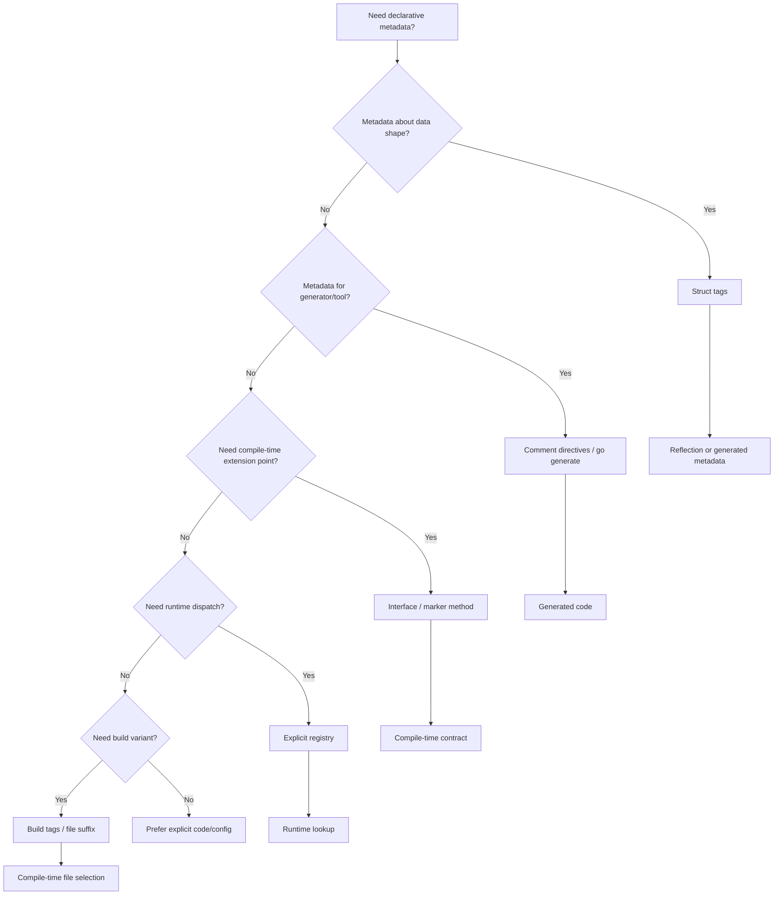
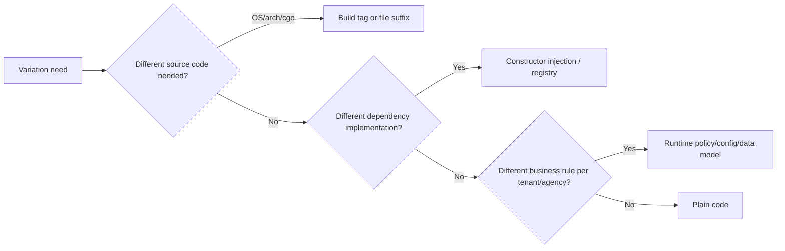
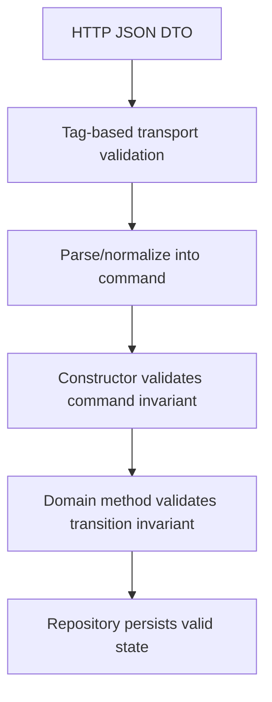
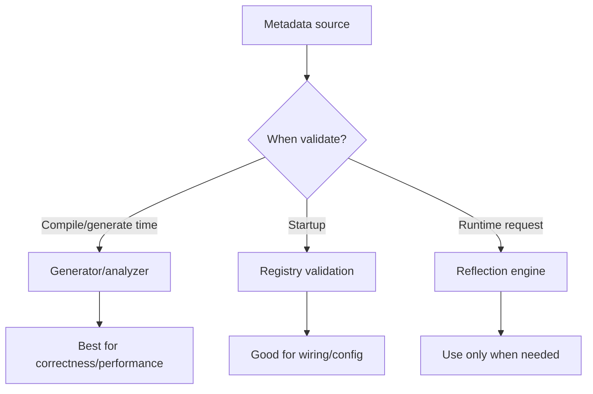
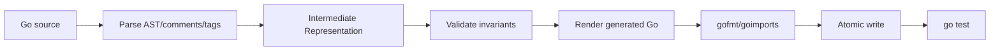
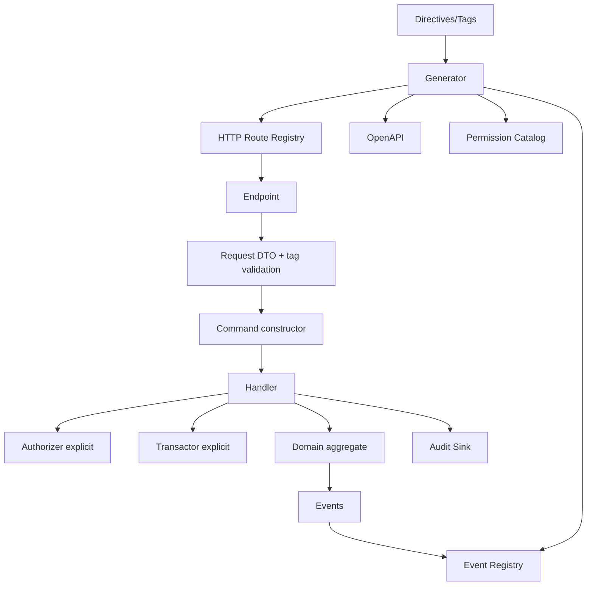
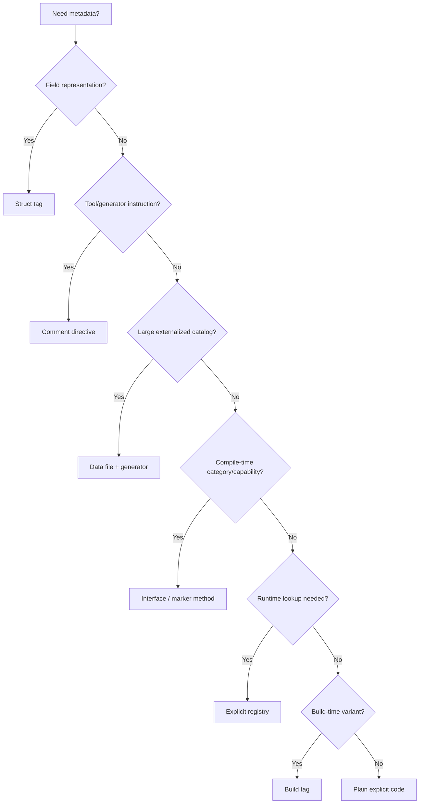

# learn-go-composition-oop-functional-reflection-codegen-modules-part-022.md

# Part 022 — Annotation-like Design di Go: Struct Tags, Marker Interfaces, Directives, Registries, dan Build Tags

> Seri: `learn-go-composition-oop-functional-reflection-codegen-modules`  
> Bagian: 022 dari 030  
> Status seri: **belum selesai**  
> Target pembaca: Java software engineer / tech lead yang ingin mendesain platform Go production-grade tanpa membawa kebiasaan annotation-heavy framework secara mentah-mentah.

---

## 0. Tujuan Bagian Ini

Di Java enterprise, banyak sistem dibangun di atas **annotation-driven programming**:

```java
@RestController
@RequestMapping("/cases")
class CaseController {
    @PostMapping
    @PreAuthorize("hasAuthority('CASE_CREATE')")
    @Transactional
    @Validated
    public CaseResponse create(@Valid @RequestBody CreateCaseRequest request) {
        ...
    }
}
```

Annotation memberi kesan bahwa sistem bisa “dinyalakan” dengan metadata deklaratif. Framework membaca annotation, membangun runtime graph, membuat proxy, menjalankan interceptor, membuka transaksi, melakukan validation, mapping, routing, authorization, serialization, observability, dan seterusnya.

Go tidak didesain seperti itu.

Go punya beberapa mekanisme yang **mirip annotation dalam efeknya**, tetapi berbeda secara filosofi, compile-time behavior, runtime cost, dan failure mode:

1. **Struct tag**
2. **Comment directive**
3. **Marker interface**
4. **Explicit registry**
5. **Generated metadata/code**
6. **Build tag / build constraint**
7. **Package boundary dan exported/unexported symbol**
8. **Interface satisfaction dan method set**

Bagian ini membahas cara berpikirnya secara sistematis.

Tujuannya bukan membuat Go menjadi Java. Tujuannya adalah memahami kapan metadata deklaratif berguna, kapan harus diganti explicit code, kapan harus code generation, dan kapan harus ditolak karena menyembunyikan invariant penting.

---

## 1. Core Thesis

Di Go, annotation-like design yang sehat harus mengikuti prinsip berikut:

> Metadata boleh menjelaskan struktur, tetapi behavior penting sebaiknya tetap eksplisit, typed, testable, dan mudah ditelusuri.

Dengan kata lain:

- tag boleh membantu mapping field
- directive boleh membantu generator
- build tag boleh memilih file berdasarkan target build
- marker interface boleh membatasi extension point
- registry boleh menghubungkan plugin/policy
- code generation boleh menurunkan boilerplate

Tetapi:

- transaction boundary jangan tersembunyi tanpa trace
- authorization policy jangan hanya string magic
- lifecycle side effect jangan muncul dari tag diam-diam
- domain invariant jangan bergantung pada reflection ad hoc
- dependency graph jangan menjadi kejutan runtime

Go lebih menyukai desain yang bisa dijawab dengan cepat:

1. Siapa yang memanggil siapa?
2. Kontraknya apa?
3. Error-nya muncul kapan?
4. Apakah compiler bisa membantu?
5. Apakah behavior bisa diuji tanpa framework besar?
6. Apakah failure terlihat di code review?

---

## 2. Mental Model: Java Annotation vs Go Annotation-like Mechanisms

### 2.1 Java annotation biasanya framework-facing

Di Java, annotation sering menjadi API utama antara aplikasi dan framework.

```java
@Transactional
@Retryable(maxAttempts = 3)
@PreAuthorize("hasAuthority('APPROVE_CASE')")
public void approve(...) { ... }
```

Aplikasi mendeklarasikan metadata, framework membaca metadata tersebut, lalu behavior muncul melalui:

- runtime reflection
- classpath scanning
- proxy
- bytecode enhancement
- AOP interceptor
- dependency injection container
- annotation processor

Kelebihannya:

- deklaratif
- ringkas
- familiar untuk enterprise
- framework bisa melakukan banyak wiring otomatis

Kekurangannya:

- behavior bisa tersembunyi
- urutan interceptor bisa sulit ditebak
- failure sering runtime/startup-time
- refactoring string metadata rawan
- debugging melewati proxy/lifecycle framework
- kontrak kadang tersebar di banyak annotation

### 2.2 Go lebih package-facing dan code-facing

Di Go, metadata biasanya bukan pusat arsitektur. Go cenderung mengarahkan desain ke:

- explicit constructor
- explicit dependency injection
- small interface
- generated code yang terlihat
- package boundary
- test biasa
- command/tooling eksplisit

Contoh Go yang setara secara intent:

```go
type ApprovalHandler struct {
    authorize Authorizer
    tx        Transactor
    repo      CaseRepository
    audit     AuditSink
}

func (h *ApprovalHandler) Approve(ctx context.Context, cmd ApproveCaseCommand) error {
    if err := h.authorize.CanApprove(ctx, cmd.ActorID, cmd.CaseID); err != nil {
        return err
    }

    return h.tx.WithinTx(ctx, func(ctx context.Context) error {
        c, err := h.repo.GetForUpdate(ctx, cmd.CaseID)
        if err != nil {
            return err
        }
        if err := c.Approve(cmd.ActorID, cmd.Comment); err != nil {
            return err
        }
        if err := h.repo.Save(ctx, c); err != nil {
            return err
        }
        return h.audit.Record(ctx, AuditEvent{...})
    })
}
```

Lebih verbose, tetapi behavior utama terlihat.

Dalam Go, metadata-like mechanism sebaiknya mendukung code seperti ini, bukan menggantikannya secara total.

---

## 3. Peta Mekanisme Annotation-like di Go



Mekanisme-mekanisme ini tidak setara. Mereka punya timing berbeda:

| Mechanism | Dibaca kapan | Failure muncul kapan | Cocok untuk | Risiko utama |
|---|---:|---:|---|---|
| Struct tag | Runtime reflection atau generator | runtime / generate-time | field mapping, validation metadata, serialization | stringly-typed, silent ignore |
| Comment directive | generate-time / analyzer-time | generate-time / CI | generator instruction, lint rule, tool hint | parser custom rapuh |
| Marker interface | compile-time / runtime type assertion | compile-time atau runtime | capability, sealing, extension point | interface kosong/magic |
| Explicit registry | init-time / startup / runtime | startup/runtime | handler/policy lookup, plugin map | duplicate key, missing registration |
| Generated metadata | compile-time setelah generate | generate-time/compile-time | fast mapper, validator, registry | stale generated code |
| Build tag | build-time | build-time | OS/env/edition specific code | variant tidak dites |
| Package boundary | compile-time | compile-time | encapsulation/invariant | package terlalu besar/kecil |

---

## 4. Struct Tags: Metadata yang Paling Mirip Annotation

Struct tag adalah string literal setelah field declaration.

```go
type CreateCaseRequest struct {
    CaseType    string `json:"caseType" validate:"required,oneof=complaint investigation appeal"`
    Description string `json:"description" validate:"required,min=20,max=4000"`
    Priority    string `json:"priority,omitempty" validate:"omitempty,oneof=low normal high"`
}
```

Secara bahasa, tag adalah bagian dari field declaration. Package `reflect` dapat membaca tag melalui `StructField.Tag`.

### 4.1 Struct tag bukan behavior

Tag hanya metadata.

```go
validate:"required"
```

tidak melakukan validasi apa pun sampai ada code yang membaca dan mengeksekusinya.

Ini perbedaan penting dari banyak framework Java, karena di Java annotation sering langsung terhubung ke container lifecycle. Di Go, Anda harus mendesain:

- siapa yang membaca tag
- kapan tag dibaca
- apakah tag diparse setiap request atau dicache
- error apa yang muncul jika tag invalid
- apakah tag invalid gagal saat startup/generate-time/test
- apakah tag memengaruhi domain invariant atau hanya transport validation

### 4.2 Tag cocok untuk metadata struktural

Struct tag cocok untuk:

- JSON field name
- XML field name
- database column mapping dalam tool tertentu
- validation metadata untuk DTO
- redaction hint
- audit field inclusion/exclusion
- generated mapper hint
- generated OpenAPI schema hint

Struct tag kurang cocok untuk:

- transaction boundary
- authorization decision kompleks
- state machine transition
- retry policy bisnis
- cross-aggregate consistency
- side effect lifecycle
- dependency wiring besar

Rule praktis:

> Jika metadata hanya menjelaskan “bagaimana field ini direpresentasikan”, struct tag masuk akal. Jika metadata mengubah “apa yang sistem lakukan”, hati-hati.

---

## 5. Mendesain Struct Tag yang Baik

### 5.1 Jangan mencampur terlalu banyak domain dalam satu tag

Buruk:

```go
type Case struct {
    Status string `case:"json=status,db=status,validate=required,auth=case.approve,audit=public,workflow=terminal:false"`
}
```

Masalah:

- grammar tag custom kompleks
- sulit diuji
- sulit refactor
- error parsing sulit dibaca
- metadata linting sulit
- satu field menjadi pusat banyak concern

Lebih baik:

```go
type CaseRecord struct {
    Status string `db:"status"`
}

type CaseResponse struct {
    Status string `json:"status" audit:"safe"`
}

type ApproveCaseCommand struct {
    CaseID string `validate:"required"`
}
```

Pisahkan model berdasarkan boundary:

- persistence record
- transport DTO
- domain object
- command object
- audit projection

### 5.2 Jangan pakai tag untuk domain invariant utama

Buruk:

```go
type Case struct {
    Status string `validate:"oneof=draft submitted approved rejected"`
}
```

Jika `Case` adalah domain object, tag validation saja tidak cukup. Domain invariant harus dijaga oleh method.

Lebih baik:

```go
type CaseStatus string

const (
    StatusDraft     CaseStatus = "draft"
    StatusSubmitted CaseStatus = "submitted"
    StatusApproved  CaseStatus = "approved"
    StatusRejected  CaseStatus = "rejected"
)

type Case struct {
    id     CaseID
    status CaseStatus
}

func (c *Case) Approve(actor ActorID, comment string) error {
    if c.status != StatusSubmitted {
        return ErrInvalidTransition
    }
    if comment == "" {
        return ErrMissingApprovalComment
    }
    c.status = StatusApproved
    return nil
}
```

Tag boleh berada di command/DTO, bukan sebagai satu-satunya penjaga domain.

### 5.3 Tag harus punya grammar kecil dan stabil

Contoh tag custom yang masih wajar:

```go
type CaseAuditView struct {
    ID        string `audit:"id"`
    Status    string `audit:"field,status"`
    Comment   string `audit:"redact"`
    CreatedBy string `audit:"actor"`
}
```

Tetapi begitu tag menjadi mini-language seperti:

```go
policy:"allow(role in ['ADMIN','SUPERVISOR']) && case.status in ['SUBMITTED'] && actor.agency == case.agency"
```

Anda sedang membangun policy language. Itu bukan sekadar tag lagi. Untuk production, policy language perlu:

- parser formal
- test fixture
- error reporting
- versioning
- auditability
- migration
- security review

Mungkin lebih baik policy ditulis sebagai code atau data model eksplisit.

---

## 6. StructTag.Get vs StructTag.Lookup

Di reflection, `StructTag` menyediakan `Get` dan `Lookup`.

```go
field.Tag.Get("json")
field.Tag.Lookup("json")
```

Perbedaan konseptual:

- `Get` mengembalikan string kosong jika key tidak ada atau value kosong.
- `Lookup` membedakan key tidak ada vs key ada dengan value kosong.

Dalam desain metadata production, ini penting.

Contoh:

```go
type Field struct {
    A string `audit:""`
    B string
}
```

Apakah `audit:""` berarti:

- sengaja pakai default audit behavior?
- sengaja disable?
- invalid?
- sama dengan tidak ada tag?

Gunakan `Lookup` jika kehadiran tag memiliki makna.

```go
func parseAuditTag(f reflect.StructField) (AuditRule, bool, error) {
    raw, ok := f.Tag.Lookup("audit")
    if !ok {
        return AuditRule{}, false, nil
    }
    if raw == "" {
        return AuditRule{}, true, fmt.Errorf("field %s has empty audit tag", f.Name)
    }
    ...
}
```

---

## 7. Exported vs Unexported Field

Reflection dapat melihat metadata field, tetapi akses value punya aturan.

```go
type Request struct {
    Public  string `json:"public"`
    private string `json:"private"`
}
```

Untuk serialization, validation, mapping, dan generator, Anda harus menentukan policy:

- apakah unexported field diabaikan?
- apakah tag pada unexported field dianggap error?
- apakah embedded unexported type diperlakukan khusus?
- apakah generated code berada di package yang sama sehingga bisa akses unexported field?

Rule production yang aman:

> Jika tag ditempatkan pada unexported field untuk framework umum, jadikan error saat validation/generation, bukan silent ignore.

Silent ignore sangat berbahaya.

```go
type CreateCaseRequest struct {
    caseType string `json:"caseType" validate:"required"` // BUG: unexported
}
```

Jika tool mengabaikan field ini, request bisa lolos tanpa data yang diharapkan.

---

## 8. Embedded Fields dan Visible Fields

Struct embedding membuat tag parsing lebih rumit.

```go
type BaseDTO struct {
    ID string `json:"id" validate:"required"`
}

type CaseDTO struct {
    BaseDTO
    Status string `json:"status"`
}
```

Pertanyaan desain:

- apakah field embedded dipromosikan?
- apakah tag dari embedded field ikut dibaca?
- bagaimana jika field shadowing terjadi?
- bagaimana jika dua embedded struct punya field dengan JSON name sama?
- apakah ambiguity menjadi error atau salah satu menang?

Untuk reflection-based metadata walker, gunakan konsep visible field dengan hati-hati. `reflect.VisibleFields` membantu mengembalikan field yang visible berdasarkan selector rules, termasuk promoted fields, tetapi Anda tetap harus mendesain policy tag-level.

Contoh ambiguity:

```go
type CreatedAudit struct {
    Actor string `json:"actor" audit:"created_by"`
}

type UpdatedAudit struct {
    Actor string `json:"actor" audit:"updated_by"`
}

type CaseDTO struct {
    CreatedAudit
    UpdatedAudit
}
```

`Actor` ambigu secara selector. Untuk metadata framework, lebih baik fail fast:

```text
ambiguous promoted field "Actor" in CaseDTO: CreatedAudit.Actor and UpdatedAudit.Actor
```

Daripada memilih salah satu secara diam-diam.

---

## 9. Comment Directives: Annotation untuk Tool, Bukan Runtime Framework

Go memakai comment directive untuk beberapa keperluan tooling.

Contoh paling umum:

```go
//go:generate go run ./cmd/permgen -type=Permission
```

`go generate` memindai source file untuk directive `//go:generate` dan menjalankan command. Penting: `go generate` bukan bagian dari `go build`, tidak memiliki dependency analysis, dan harus dijalankan eksplisit oleh author package.

### 9.1 Custom directive untuk generator

Anda bisa membuat directive sendiri untuk tool Anda.

```go
//casegen:command name=ApproveCase aggregate=Case permission=case.approve
//casegen:event name=CaseApproved
```

Generator Anda membaca comment ini melalui AST.

Keuntungannya:

- tidak mengotori runtime struct
- cocok untuk code generation
- bisa ditempatkan dekat source concept
- mudah dibaca di review

Risikonya:

- parser custom bisa rapuh
- typo bisa silent jika tidak divalidasi
- refactoring nama symbol bisa tidak ikut update
- directive tidak punya type safety bawaan

### 9.2 Directive harus punya grammar sederhana

Buruk:

```go
//casegen:command name=ApproveCase when="status in submitted && actor.has(case.approve)" tx=true audit=full retry=3 timeout=5s
```

Lebih baik pisahkan:

```go
//casegen:command ApproveCase
//casegen:aggregate Case
//casegen:permission case.approve
```

Atau gunakan data file eksplisit bila metadata makin kompleks:

```yaml
commands:
  - name: ApproveCase
    aggregate: Case
    permission: case.approve
    emits:
      - CaseApproved
```

### 9.3 Directive harus divalidasi di CI

Setiap custom directive wajib punya:

- parser test
- invalid directive test
- duplicate directive test
- unknown attribute rejection
- deterministic output
- regenerate-and-diff CI
- clear error message dengan file:line

Error buruk:

```text
invalid directive
```

Error bagus:

```text
case_command.go:17: unknown casegen attribute "permisson"; did you mean "permission"?
```

---

## 10. Marker Interfaces: Compile-time Capability Signal

Marker interface di Java sering kosong:

```java
interface Serializable {}
```

Di Go, interface kosong sebagai marker biasanya buruk karena semua type mengimplementasikannya.

```go
type Marker interface{}
```

Ini tidak memberi informasi apa pun.

Marker interface Go yang lebih sehat biasanya memakai method kecil, sering unexported jika ingin membatasi implementasi dari luar package.

```go
type Command interface {
    commandMarker()
}
```

Lalu:

```go
type ApproveCaseCommand struct {
    CaseID  CaseID
    ActorID ActorID
}

func (ApproveCaseCommand) commandMarker() {}
```

Karena method `commandMarker` unexported, package lain tidak bisa secara natural mengimplementasikan interface tersebut kecuali berada di package yang sama. Ini memberi efek “sealed-like” pada boundary tertentu.

### 10.1 Kapan marker interface berguna?

Marker interface berguna ketika Anda ingin membedakan kategori type secara compile-time:

- command
- event
- query
- domain error
- internal plugin
- permission token
- generated type family

Contoh event sealed-like:

```go
type Event interface {
    eventMarker()
    EventName() string
}

type CaseApproved struct {
    CaseID CaseID
}

func (CaseApproved) eventMarker() {}
func (CaseApproved) EventName() string { return "case.approved" }
```

### 10.2 Jangan jadikan marker pengganti behavior

Buruk:

```go
type Auditable interface {
    auditableMarker()
}
```

Jika tidak ada behavior, registry, atau generator yang jelas, marker ini hanya noise.

Lebih baik:

```go
type AuditEvent interface {
    EventName() string
    AuditFields() []AuditField
}
```

Atau generated metadata:

```go
func AuditDescriptorOf(v any) (AuditDescriptor, bool) { ... }
```

### 10.3 Compile-time assertion

Gunakan assertion untuk membuat maksud jelas:

```go
var _ Event = CaseApproved{}
```

Ini bukan hanya test kecil. Ini dokumentasi desain.

---

## 11. Explicit Registry: Pengganti Classpath Scanning

Java framework sering melakukan classpath scanning:

```java
@Component
class ApprovalPolicy implements Policy { ... }
```

Container menemukan class secara otomatis.

Go lebih sering memakai registry eksplisit:

```go
type PolicyRegistry struct {
    byName map[string]Policy
}

func NewPolicyRegistry(policies ...Policy) (*PolicyRegistry, error) {
    r := &PolicyRegistry{byName: make(map[string]Policy)}
    for _, p := range policies {
        name := p.Name()
        if name == "" {
            return nil, errors.New("policy name is empty")
        }
        if _, exists := r.byName[name]; exists {
            return nil, fmt.Errorf("duplicate policy %q", name)
        }
        r.byName[name] = p
    }
    return r, nil
}
```

Wiring:

```go
registry, err := NewPolicyRegistry(
    NewApproveCasePolicy(...),
    NewRejectCasePolicy(...),
    NewEscalateCasePolicy(...),
)
if err != nil {
    return err
}
```

Lebih eksplisit, lebih mudah grep, lebih mudah test.

### 11.1 Registry dengan generated code

Jika jumlah policy besar, registry bisa digenerate.

Source:

```go
//casegen:policy case.approve
func NewApproveCasePolicy(...) Policy { ... }

//casegen:policy case.reject
func NewRejectCasePolicy(...) Policy { ... }
```

Generated:

```go
func RegisterGeneratedPolicies(r *PolicyRegistry, deps PolicyDeps) error {
    return errors.Join(
        r.Register(NewApproveCasePolicy(deps.Authz, deps.Clock)),
        r.Register(NewRejectCasePolicy(deps.Authz, deps.Clock)),
    )
}
```

Keuntungannya:

- explicit generated output bisa direview
- duplicate bisa dideteksi saat generate/compile/test
- tidak butuh runtime scanning
- startup lebih deterministic

---

## 12. Build Tags / Build Constraints: Annotation untuk Build Variant

Build tag memilih file mana yang ikut dibangun.

```go
//go:build integration

package caseapp
```

Atau file suffix:

```text
store_postgres.go
store_postgres_test.go
clock_linux.go
clock_windows.go
```

Build constraints diberikan dengan komentar `//go:build` dekat bagian atas file dan harus berada sebelum package clause. Constraints juga bisa berdasarkan nama file seperti `_windows.go`.

### 12.1 Kapan build tag cocok?

Build tag cocok untuk:

- OS-specific implementation
- architecture-specific implementation
- integration test
- enterprise/community edition split
- cgo vs purego
- generated fallback
- debug/profiling build variant

Contoh:

```go
//go:build integration

func TestPostgresCaseRepository(t *testing.T) {
    ...
}
```

Run:

```bash
go test -tags=integration ./...
```

### 12.2 Jangan pakai build tag untuk konfigurasi bisnis runtime

Buruk:

```go
//go:build agency_cea
```

untuk membedakan rule agency yang seharusnya runtime-configurable atau data-driven.

Kenapa berbahaya:

- binary berbeda untuk tiap agency
- testing matrix meledak
- behavior produksi bergantung build command
- auditability sulit
- deployment risk tinggi

Build tag adalah compile-time variant, bukan feature flag runtime.

### 12.3 Build tag wajib punya test matrix

Jika punya variant:

```text
storage_memory.go
storage_postgres.go
storage_oracle.go
```

Pastikan CI menguji kombinasi penting:

```bash
go test ./...
go test -tags=integration ./...
go test -tags=oracle ./...
go test -tags=postgres ./...
```

Tanpa test matrix, build variant bisa busuk berbulan-bulan.

---

## 13. Build Tags vs Runtime Config vs Dependency Injection



Decision rule:

| Variation | Prefer |
|---|---|
| Linux vs Windows syscall | build tag/file suffix |
| integration test requiring DB | build tag |
| enterprise-only compiled feature | build tag with strict CI matrix |
| PostgreSQL vs Oracle implementation selected at startup | interface + constructor/registry |
| agency-specific approval threshold | runtime policy/config |
| feature rollout | feature flag/runtime config |
| debug instrumentation | build tag or runtime flag depending need |

---

## 14. Annotation-like Authorization: Jangan Sembunyikan Policy Kritis

Java style:

```java
@PreAuthorize("hasAuthority('CASE_APPROVE')")
public void approve(...) { ... }
```

Di Go, Anda mungkin tergoda membuat tag:

```go
type ApproveCaseCommand struct {
    CaseID string `authz:"case.approve"`
}
```

Ini bisa berguna untuk documentation/generation, tetapi jangan jadikan satu-satunya enforcement kecuali framework Anda sangat matang.

Lebih aman:

```go
type ApproveCaseHandler struct {
    authz Authorizer
    repo  CaseRepository
}

func (h *ApproveCaseHandler) Handle(ctx context.Context, cmd ApproveCaseCommand) error {
    if err := h.authz.Require(ctx, PermissionCaseApprove, ResourceCase(cmd.CaseID)); err != nil {
        return err
    }
    ...
}
```

Permission bisa generated:

```go
type Permission string

const (
    PermissionCaseApprove Permission = "case.approve"
)
```

Metadata bisa membantu registry/OpenAPI/docs:

```go
//casegen:command ApproveCase permission=case.approve
```

Tetapi enforcement tetap explicit di handler atau middleware yang typed.

---

## 15. Annotation-like Transaction: Boundary Harus Terlihat

Java style:

```java
@Transactional
public void approve(...) { ... }
```

Go style yang lebih audit-friendly:

```go
func (h *ApproveCaseHandler) Handle(ctx context.Context, cmd ApproveCaseCommand) error {
    return h.tx.WithinTx(ctx, func(ctx context.Context) error {
        c, err := h.repo.GetForUpdate(ctx, cmd.CaseID)
        if err != nil {
            return err
        }
        if err := c.Approve(cmd.ActorID); err != nil {
            return err
        }
        return h.repo.Save(ctx, c)
    })
}
```

Kenapa lebih baik:

- transaction boundary terlihat
- nested transaction policy bisa jelas
- context propagation eksplisit
- retry/idempotency bisa ditaruh di tempat yang benar
- testing bisa memakai fake transactor
- review bisa melihat operasi DB mana yang dalam transaksi

Annotation-like transaction di Go berisiko karena butuh proxy/interceptor. Itu bukan idiom utama Go.

---

## 16. Annotation-like Validation: DTO Tag Boleh, Domain Method Tetap Wajib

DTO validation:

```go
type CreateCaseRequest struct {
    CaseType    string `json:"caseType" validate:"required"`
    Description string `json:"description" validate:"required,min=20"`
}
```

Command construction:

```go
func (r CreateCaseRequest) ToCommand(actor ActorID) (CreateCaseCommand, error) {
    caseType, err := ParseCaseType(r.CaseType)
    if err != nil {
        return CreateCaseCommand{}, err
    }
    return NewCreateCaseCommand(actor, caseType, r.Description)
}
```

Domain invariant:

```go
func NewCase(cmd CreateCaseCommand, now time.Time) (*Case, error) {
    if cmd.Description == "" {
        return nil, ErrMissingDescription
    }
    ...
}
```

Layering:



Tag validation menangani input shape. Domain method menjaga business truth.

---

## 17. Annotation-like Mapping: Reflection, Codegen, atau Manual?

Mapping sering menjadi tempat metadata-like design muncul.

```go
type CaseRecord struct {
    ID     string `db:"id"`
    Status string `db:"status"`
}

type CaseDTO struct {
    ID     string `json:"id"`
    Status string `json:"status"`
}
```

Pilihan:

1. Manual mapping
2. Reflection mapping berdasarkan tag
3. Generated mapping berdasarkan tag/directive
4. Generic helper untuk pola kecil

Decision matrix:

| Situation | Prefer |
|---|---|
| domain mapping mengandung invariant | manual |
| DTO flat banyak dan stabil | generated mapper |
| admin/internal tool low volume | reflection mapper |
| performance-sensitive hot path | manual/generated |
| many schemas, metadata-driven platform | generated metadata + runtime engine |
| migration/one-off scripts | reflection/manual pragmatis |

Rule penting:

> Jangan biarkan generic reflection mapper melewati constructor domain.

Buruk:

```go
mapper.Map(record, &caseDomain) // sets fields directly
```

Lebih aman:

```go
func CaseFromRecord(r CaseRecord) (*Case, error) {
    status, err := ParseCaseStatus(r.Status)
    if err != nil {
        return nil, err
    }
    return RehydrateCase(CaseSnapshot{ID: CaseID(r.ID), Status: status})
}
```

---

## 18. Annotation-like OpenAPI / Schema Generation

Metadata untuk API schema masuk akal, tetapi jangan jadikan request handling tersamarkan.

Contoh:

```go
type CreateCaseRequest struct {
    CaseType string `json:"caseType" schema:"required,description=Type of case"`
}
```

Atau directive:

```go
//apigen:route POST /cases operation=CreateCase permission=case.create
func (h *CreateCaseHandler) Handle(ctx context.Context, cmd CreateCaseCommand) (CaseResponse, error) {
    ...
}
```

Production checklist:

- schema generated deterministic
- generated schema committed atau checked in CI
- breaking API change detected
- examples tested
- permission metadata cross-checked dengan route registry
- handler still explicit
- request validation not only documentation

---

## 19. Annotation-like Routing: Explicit Registry Bias

Java/Spring:

```java
@PostMapping("/cases/{id}/approve")
```

Go options:

### 19.1 Explicit route registration

```go
func RegisterCaseRoutes(r *Router, h *CaseHandlers) {
    r.Post("/cases/{id}/approve", h.Approve)
    r.Post("/cases/{id}/reject", h.Reject)
}
```

Kelebihan:

- route list jelas
- grep mudah
- no hidden scanning
- startup validation mudah

### 19.2 Generated route registration

Source directive:

```go
//apigen:POST /cases/{id}/approve permission=case.approve
func (h *ApproveCaseEndpoint) ServeHTTP(w http.ResponseWriter, r *http.Request) { ... }
```

Generated:

```go
func RegisterGeneratedRoutes(r *Router, endpoints Endpoints) {
    r.Post("/cases/{id}/approve", endpoints.ApproveCase.ServeHTTP)
}
```

Ini masih explicit karena generated file bisa dibaca dan diuji.

### 19.3 Reflection route scanning

Bisa dibuat, tetapi biasanya kurang Go-like:

```go
RegisterAnnotatedHandlers(container)
```

Masalah:

- method discovery runtime
- naming convention magic
- startup failure lebih sulit
- test lebih berat
- refactor raw string rawan

---

## 20. Annotation-like Event Handling

Event systems sering tergoda memakai auto discovery.

Lebih Go-like:

```go
type EventHandler[E Event] interface {
    Handle(ctx context.Context, event E) error
}
```

Registry eksplisit:

```go
func RegisterEventHandlers(bus *EventBus, deps Deps) error {
    bus.Handle(CaseApproved{}, NewSendApprovalEmailHandler(deps.Mail))
    bus.Handle(CaseApproved{}, NewWriteAuditTrailHandler(deps.Audit))
    bus.Handle(CaseRejected{}, NewNotifyApplicantHandler(deps.Notify))
    return nil
}
```

Generated registry jika banyak:

```go
//eventgen:handles CaseApproved
func NewSendApprovalEmailHandler(mail Mailer) Handler[CaseApproved] { ... }
```

Generated output:

```go
func RegisterGeneratedEventHandlers(bus *EventBus, deps Deps) {
    bus.Handle(CaseApproved{}, NewSendApprovalEmailHandler(deps.Mail))
}
```

---

## 21. Registry Invariant Checklist

Registry production-grade harus punya invariant:

1. Key tidak kosong.
2. Duplicate key gagal saat startup/generate-time.
3. Missing required handler terdeteksi.
4. Handler nil ditolak.
5. Registration order jelas jika order penting.
6. Concurrency policy jelas: mutable saat startup saja atau thread-safe runtime.
7. Lookup error typed.
8. Metrics/logging untuk missing handler.
9. Tests untuk duplicate/missing.
10. Generated registry deterministic.

Contoh:

```go
type HandlerRegistry struct {
    handlers map[CommandName]CommandHandler
    frozen   bool
}

func (r *HandlerRegistry) Register(name CommandName, h CommandHandler) error {
    if r.frozen {
        return ErrRegistryFrozen
    }
    if name == "" {
        return ErrEmptyCommandName
    }
    if h == nil {
        return ErrNilHandler
    }
    if _, exists := r.handlers[name]; exists {
        return fmt.Errorf("duplicate command handler %q", name)
    }
    r.handlers[name] = h
    return nil
}

func (r *HandlerRegistry) Freeze() {
    r.frozen = true
}
```

---

## 22. Generated Metadata: Middle Ground antara Tag dan Runtime Reflection

Daripada membaca tag setiap request:

```go
func Validate(v any) error {
    t := reflect.TypeOf(v)
    ...
}
```

Generator bisa menghasilkan metadata:

```go
var createCaseRequestDescriptor = StructDescriptor{
    TypeName: "CreateCaseRequest",
    Fields: []FieldDescriptor{
        {Name: "CaseType", JSONName: "caseType", Required: true},
        {Name: "Description", JSONName: "description", Required: true, MinLen: 20},
    },
}
```

Atau generated validator langsung:

```go
func (r CreateCaseRequest) Validate() error {
    var errs []error
    if r.CaseType == "" {
        errs = append(errs, FieldError{Field: "caseType", Code: "required"})
    }
    if len(r.Description) < 20 {
        errs = append(errs, FieldError{Field: "description", Code: "min_length"})
    }
    return errors.Join(errs...)
}
```

Kelebihan:

- lebih cepat
- compile-time visible
- no reflection panic path di runtime
- error generated bisa diuji
- generated output bisa direview

Kekurangan:

- perlu tool governance
- stale generated file risk
- CI regenerate-and-diff wajib
- generator harus versioned

---

## 23. Comment Directive vs Struct Tag vs Data File

| Need | Struct tag | Comment directive | Data file |
|---|---:|---:|---:|
| Field-level JSON name | bagus | buruk | berlebihan |
| Field-level validation | bagus untuk DTO | bisa | mungkin berlebihan |
| Command permission | bisa, tapi rawan | bagus | bagus jika banyak |
| Route metadata | kurang cocok | bagus | bagus |
| Large permission matrix | buruk | sedang | bagus |
| Cross-field workflow | buruk | buruk/sedang | bagus atau code |
| Generator hint near type | bagus | bagus | sedang |
| Non-Go stakeholders edit | buruk | buruk | bagus |
| Need type proximity | bagus | bagus | buruk/sedang |
| Complex grammar | buruk | buruk | lebih baik data file formal |

Rule:

- Field concern → struct tag
- Symbol/tool concern → directive
- Large cross-cutting metadata → data file
- Behavior/invariant → code

---

## 24. Designing a Custom Annotation-like System

Jika Anda tetap perlu membangun annotation-like system di Go, desainlah seperti platform, bukan helper kecil.

### 24.1 Tentukan timing



Semakin awal error muncul, semakin baik.

Preferred order:

1. compile-time
2. generate-time
3. test-time
4. startup-time
5. runtime request-time

### 24.2 Buat metadata schema formal

Jangan parsing string sembarangan.

Contoh parser result:

```go
type PermissionDirective struct {
    File       string
    Line       int
    SymbolName string
    Permission Permission
}
```

### 24.3 Buat diagnostic yang bagus

Bad metadata pasti terjadi. Buat error yang membantu.

```text
case_handler.go:42: apigen route directive missing permission attribute
case_handler.go:42: example: //apigen:POST /cases/{id}/approve permission=case.approve
```

### 24.4 Reject unknown fields

Jangan diam-diam menerima typo.

```go
//apigen:POST /cases permission=case.create authroize=true
```

Harus error:

```text
unknown directive attribute "authroize"
```

### 24.5 Jangan gabungkan scanning dan execution

Pisahkan:

1. parse source
2. build IR
3. validate IR
4. render generated code
5. format
6. write atomically

Pipeline:



---

## 25. Annotation-like Design Anti-patterns

### 25.1 Runtime magic container

```go
container.Scan("./...")
container.InvokeAnnotatedMethods()
```

Ini membawa classpath scanning style ke Go. Biasanya buruk karena:

- Go binary tidak punya classpath seperti JVM
- package loading runtime bukan model standar
- dependency graph tersembunyi
- compile-time help hilang
- debugging sulit

### 25.2 Tag mini-language untuk business rules

```go
State string `workflow:"from=draft,to=submitted,if=user.role==officer&&case.age<30d"`
```

Ini bukan metadata ringan. Ini DSL. Treat sebagai DSL formal atau pindahkan ke code/data model.

### 25.3 Silent fallback

```go
if tag == "" {
    return DefaultBehavior
}
```

Kadang default benar. Kadang default menyembunyikan typo.

Gunakan policy eksplisit:

- missing tag allowed?
- empty tag allowed?
- unknown option error?
- duplicate tag error?

### 25.4 Interface kosong sebagai marker

```go
type Command interface{}
```

Tidak memberi kontrak.

Lebih baik:

```go
type Command interface {
    CommandName() CommandName
}
```

Atau sealed-like:

```go
type Command interface {
    commandMarker()
    CommandName() CommandName
}
```

### 25.5 Build tag untuk feature flag runtime

```go
//go:build customer_a
```

Untuk behavior tenant/customer/agency yang berubah runtime, ini biasanya salah.

### 25.6 Generated code tidak direview

Generated code boleh besar, tetapi kontraknya harus jelas. Minimal:

- header generated
- deterministic
- CI diff
- tool version
- source pointer
- test coverage

---

## 26. Enterprise Example: Regulatory Case Platform

Bayangkan platform regulatory case dengan kebutuhan:

- command handling
- authorization permission
- audit trail
- validation
- route registration
- event handling
- OpenAPI docs
- DTO mapping

### 26.1 Java-like temptation

```go
type ApproveCase struct {
    CaseID string `route:"POST /cases/{id}/approve" permission:"case.approve" tx:"required" audit:"full" validate:"required" event:"CaseApproved"`
}
```

Masalah:

- terlalu banyak concern di satu struct
- transaction dan audit behavior tersembunyi
- route, command, permission, event tercampur
- sulit enforce compile-time

### 26.2 Go-like architecture



### 26.3 Source code shape

DTO:

```go
type ApproveCaseRequest struct {
    Comment string `json:"comment" validate:"required,min=10,max=2000"`
}
```

Command:

```go
type ApproveCaseCommand struct {
    CaseID  CaseID
    ActorID ActorID
    Comment string
}

func NewApproveCaseCommand(caseID CaseID, actorID ActorID, comment string) (ApproveCaseCommand, error) {
    if caseID == "" {
        return ApproveCaseCommand{}, ErrMissingCaseID
    }
    if actorID == "" {
        return ApproveCaseCommand{}, ErrMissingActorID
    }
    if strings.TrimSpace(comment) == "" {
        return ApproveCaseCommand{}, ErrMissingComment
    }
    return ApproveCaseCommand{CaseID: caseID, ActorID: actorID, Comment: comment}, nil
}
```

Handler:

```go
//casegen:command ApproveCase permission=case.approve event=CaseApproved
func (h *ApproveCaseHandler) Handle(ctx context.Context, cmd ApproveCaseCommand) error {
    if err := h.authz.Require(ctx, PermissionCaseApprove, ResourceCase(cmd.CaseID)); err != nil {
        return err
    }

    return h.tx.WithinTx(ctx, func(ctx context.Context) error {
        c, err := h.repo.GetForUpdate(ctx, cmd.CaseID)
        if err != nil {
            return err
        }
        if err := c.Approve(cmd.ActorID, cmd.Comment); err != nil {
            return err
        }
        if err := h.repo.Save(ctx, c); err != nil {
            return err
        }
        return h.audit.Record(ctx, NewCaseApprovedAudit(c.ID(), cmd.ActorID))
    })
}
```

Generated permission catalog:

```go
const PermissionCaseApprove Permission = "case.approve"
```

Generated route docs:

```go
func RegisterGeneratedCaseRoutes(r *Router, e CaseEndpoints) {
    r.Post("/cases/{id}/approve", e.Approve)
}
```

Generated OpenAPI:

```yaml
paths:
  /cases/{id}/approve:
    post:
      x-permission: case.approve
```

Behavior utama tetap explicit. Metadata membantu consistency.

---

## 27. Failure Modeling

Annotation-like design harus dievaluasi dari failure mode.

| Failure | Penyebab | Mitigasi |
|---|---|---|
| tag typo silent | parser permissive | reject unknown option, tests |
| missing registration | registry manual lupa | generated registry atau startup validation |
| duplicate permission | copy-paste | generator duplicate check |
| stale generated code | generate tidak dijalankan | CI regenerate-and-diff |
| build variant rusak | build tag tidak dites | CI matrix per tag |
| domain invariant bypass | reflection sets field | constructor/rehydration boundary |
| authorization missing | metadata only docs | explicit authorizer call / route middleware validation |
| transaction missing | no explicit boundary | transactor in handler/review checklist |
| comment directive invalid | weak parser | file:line diagnostic |
| unexported tagged field ignored | reflection limitation | fail fast lint/generator |
| ambiguous embedded field | promoted conflict | visible field conflict detection |

---

## 28. Review Checklist untuk Annotation-like Design

Gunakan checklist ini saat code review.

### 28.1 Scope

- Apakah metadata hanya menjelaskan shape, atau mengubah behavior?
- Jika mengubah behavior, apakah behavior masih terlihat di code?
- Apakah metadata berada di layer yang tepat?

### 28.2 Timing

- Kapan metadata divalidasi?
- Bisa gagal di compile/generate/test/startup daripada request-time?
- Apakah CI menangkap stale/generated mismatch?

### 28.3 Type safety

- Apakah raw string bisa diganti typed constant?
- Apakah permission/event/route name generated?
- Apakah refactor symbol aman?

### 28.4 Diagnostics

- Apakah error menyebut file, line, symbol, dan expected format?
- Apakah typo unknown option ditolak?
- Apakah duplicate dan missing detected?

### 28.5 Runtime behavior

- Apakah reflection dipakai di hot path?
- Apakah metadata cache immutable dan concurrency-safe?
- Apakah panic surface tertutup?
- Apakah nil/zero/missing semantics jelas?

### 28.6 Security

- Apakah authorization enforcement explicit?
- Apakah audit/redaction tag diuji?
- Apakah sensitive field default-nya aman?
- Apakah generated docs tidak membocorkan internal field?

### 28.7 Build variants

- Apakah build tag benar-benar compile-time concern?
- Apakah semua variant penting dites?
- Apakah behavior produksi bisa dilacak dari build artifact?

---

## 29. Decision Framework Ringkas



Golden rule:

> Use metadata to reduce duplication. Do not use metadata to hide system behavior that must be reasoned about during incidents, audits, and production debugging.

---

## 30. Practical Pattern Library

### 30.1 Field metadata tag

```go
type CaseResponse struct {
    ID        string `json:"id" audit:"safe"`
    Applicant string `json:"applicant" audit:"redact"`
}
```

Use for representation.

### 30.2 Tool directive

```go
//casegen:command ApproveCase permission=case.approve
```

Use for generated registry/docs/catalog.

### 30.3 Marker interface with method

```go
type DomainEvent interface {
    domainEvent()
    EventName() string
}
```

Use for controlled type family.

### 30.4 Explicit registry

```go
func RegisterHandlers(r *Registry, deps Deps) error {
    return errors.Join(
        r.Register(CommandApproveCase, NewApproveCaseHandler(deps)),
        r.Register(CommandRejectCase, NewRejectCaseHandler(deps)),
    )
}
```

Use for deterministic wiring.

### 30.5 Generated registry

```go
// Code generated by casegen v1.4.2; DO NOT EDIT.

func RegisterGeneratedHandlers(r *Registry, deps Deps) error {
    ...
}
```

Use when manual registry becomes too repetitive.

### 30.6 Build tag for integration tests

```go
//go:build integration

package casepostgres_test
```

Use for optional test suites.

---

## 31. Hubungan dengan Part Sebelumnya

Bagian ini terhubung dengan:

- Part 004: embedding bisa memengaruhi field visibility dan tag ambiguity.
- Part 006: interface adalah behavioral contract, bukan sekadar marker kosong.
- Part 007: structural typing membuat marker method dan sealed-like pattern penting.
- Part 008: generics bisa mengganti sebagian reflection/generator jika type relationship jelas.
- Part 015–017: reflection tag reader harus memperhatikan addressability, settability, panic surface, dan cache.
- Part 018: metadata design harus masuk decision framework reflection vs generics vs codegen.
- Part 019–021: generator yang membaca directive/tag harus deterministic, type-aware, dan CI-friendly.

---

## 32. Latihan Desain

### Latihan 1 — Refactor annotation-heavy Java handler ke Go

Ambil Java-style concept:

```java
@PostMapping("/cases/{id}/approve")
@PreAuthorize("hasAuthority('case.approve')")
@Transactional
@Audited
public ApproveCaseResponse approve(@Valid @RequestBody ApproveCaseRequest request) { ... }
```

Desain Go equivalent dengan:

- explicit route registration
- DTO tag validation
- command constructor
- explicit authorizer
- explicit transactor
- explicit audit sink
- optional `//casegen` directive untuk docs/registry

### Latihan 2 — Buat tag parser policy

Untuk tag:

```go
`audit:"safe"`
`audit:"redact"`
`audit:"ignore"`
```

Tentukan:

- apakah empty tag valid?
- apakah missing tag default safe atau error?
- apakah unknown option error?
- bagaimana embedded fields diproses?
- bagaimana unexported tagged field diperlakukan?

### Latihan 3 — Build tag review

Anda punya file:

```go
//go:build agency_cea
```

Untuk rule approval khusus agency. Evaluasi apakah build tag tepat. Jika tidak, desain alternatif runtime policy.

### Latihan 4 — Registry failure mode

Desain `PermissionRegistry` yang menolak:

- duplicate permission
- empty permission
- missing description
- permission tanpa owner module
- permission tidak dipakai oleh route/command mana pun

---

## 33. Ringkasan

Go tidak punya annotation ecosystem seperti Java enterprise, tetapi Go punya mekanisme annotation-like yang kuat jika dipakai secara disiplin:

- Struct tag untuk metadata field.
- Comment directive untuk generator/tool.
- Marker interface untuk capability/type family.
- Explicit registry untuk deterministic wiring.
- Generated code untuk mengurangi boilerplate tanpa runtime magic.
- Build tag untuk compile-time variant.
- Package boundary untuk invariant dan encapsulation.

Perbedaan utamanya adalah Go menuntut behavior penting tetap jelas.

Desain top-tier di Go bukan menolak metadata, tetapi menempatkan metadata pada layer yang benar, memvalidasinya sedini mungkin, dan memastikan production behavior tetap bisa ditelusuri saat incident, audit, migration, dan code review.

---

## 34. Referensi Resmi

- Go Specification — struct tags, method/interface/type rules: https://go.dev/ref/spec
- Package `reflect` — `StructTag`, `StructField`, `VisibleFields`: https://pkg.go.dev/reflect
- Go Blog — Generating code with `go generate`: https://go.dev/blog/generate
- Package `go/build` — build constraints/build tags: https://pkg.go.dev/go/build
- Package `go/build/constraint` — parsing build constraints: https://pkg.go.dev/go/build/constraint
- `cmd/go` documentation — build constraints and command behavior: https://pkg.go.dev/cmd/go

---

## 35. Status Seri

- Bagian ini: **Part 022 selesai**.
- Seri: **belum selesai**.
- Berikutnya: **Part 023 — Generating Production APIs: DTO, Mapper, Validator, Enum Stringer, Error Codes, Mocks, Clients**.

<!-- NAVIGATION_FOOTER -->
<div class="page-nav">
<a href="./learn-go-composition-oop-functional-reflection-codegen-modules-part-021.md">⬅️ Aware Code Generation: `go/types`, Package Loading, Import Resolution, dan Generic Type Inspection</a>
<a href="./index.md">📚 Kategori</a>
<a href="../../index.md">🏠 Home</a>
<a href="./learn-go-composition-oop-functional-reflection-codegen-modules-part-023.md">Part 023 — Generating Production APIs: DTO, Mapper, Validator, Enum Stringer, Error Codes, Mocks, and Clients ➡️</a>
</div>
