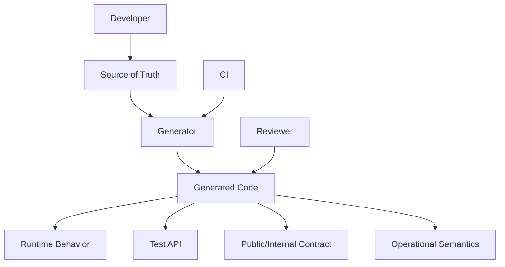
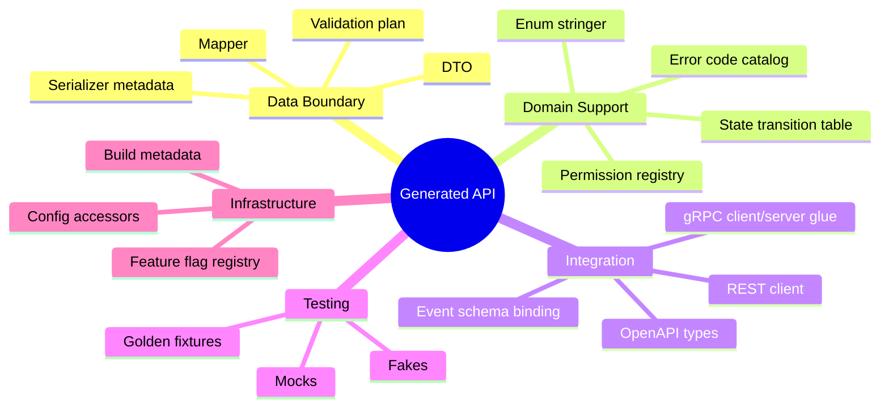
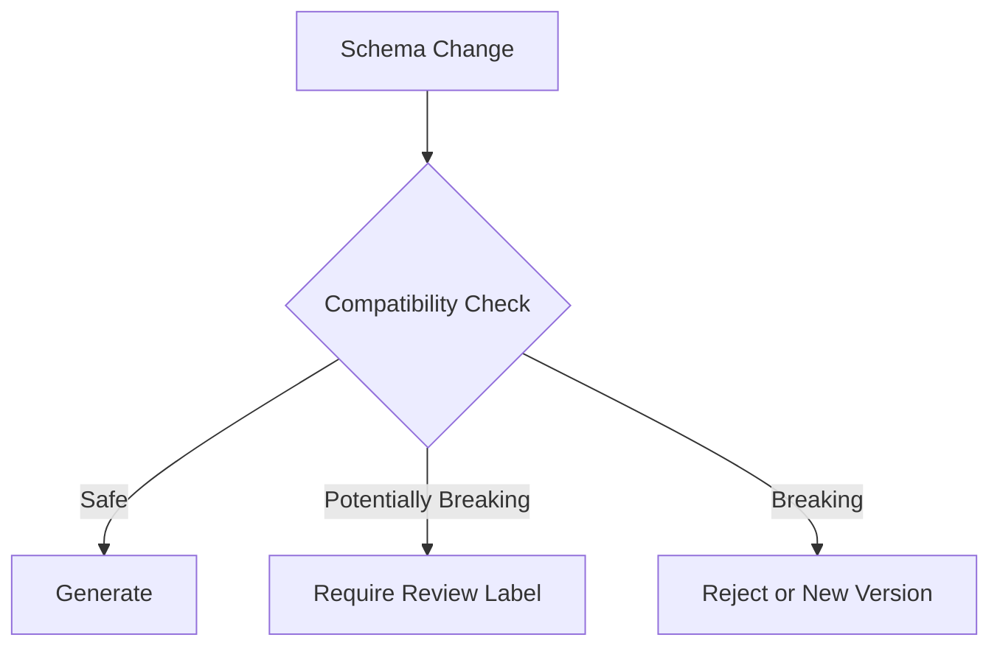
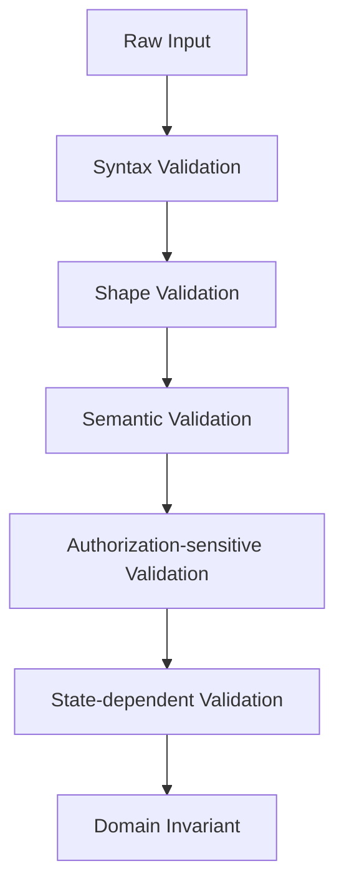
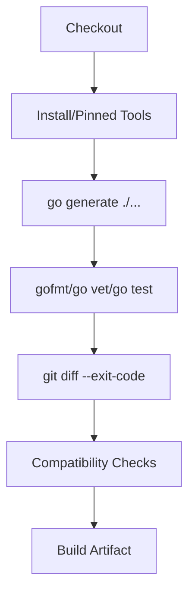
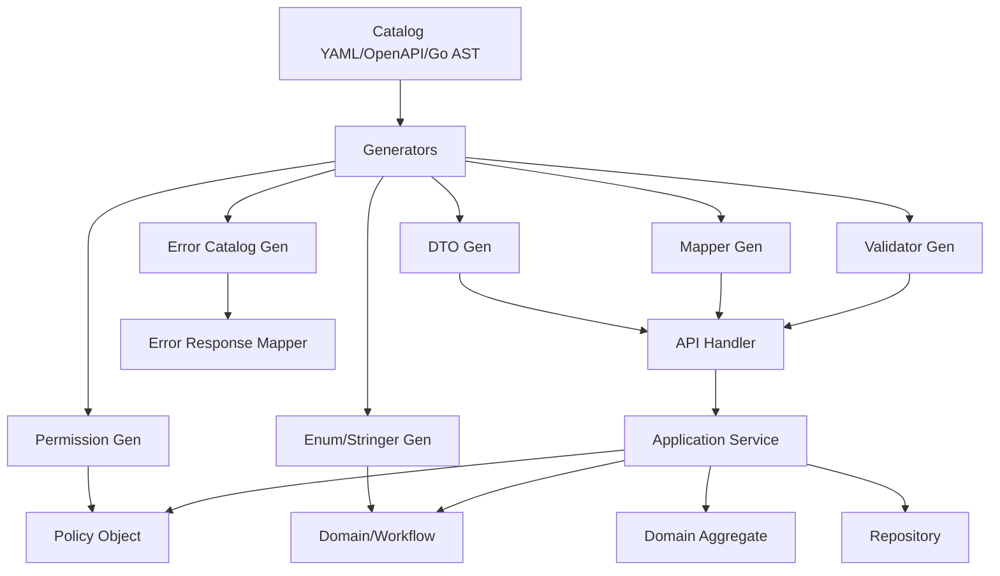
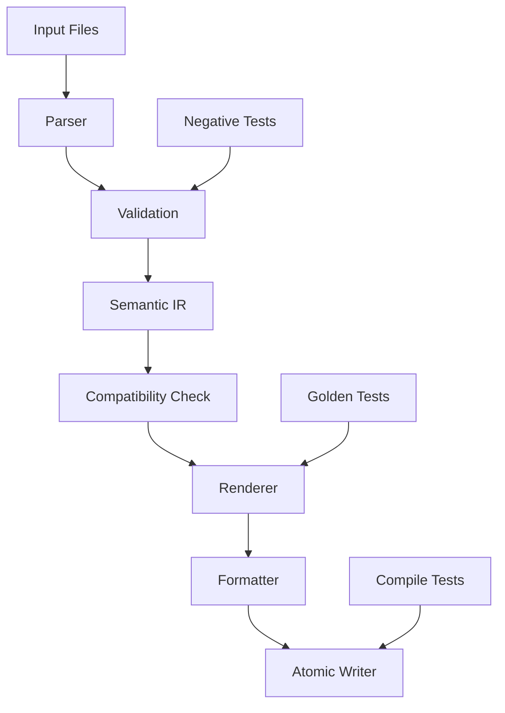

# learn-go-composition-oop-functional-reflection-codegen-modules-part-023.md

# Part 023 — Generating Production APIs: DTO, Mapper, Validator, Enum Stringer, Error Codes, Mocks, and Clients

> Seri: `learn-go-composition-oop-functional-reflection-codegen-modules`  
> Bagian: 023 dari 030  
> Status seri: belum selesai  
> Target pembaca: Java software engineer / tech lead yang ingin memakai code generation di Go secara production-grade, bukan sekadar otomatisasi boilerplate.

---

## 0. Tujuan Bagian Ini

Bagian sebelumnya membahas fondasi code generation:

- Part 019: `go generate`, reproducibility, deterministic output, CI policy.
- Part 020: AST-based generation.
- Part 021: type-aware generation.
- Part 022: annotation-like design di Go.

Bagian ini bergerak dari fondasi menuju **penerapan nyata**: bagaimana menghasilkan API produksi yang dipakai oleh banyak package, banyak service, banyak tim, dan banyak versi.

Fokusnya bukan “cara generate file”. Fokusnya adalah:

1. **Kapan generated code layak menjadi public/internal API**.
2. **Bagaimana mendesain source-of-truth** agar tidak menjadi konfigurasi mati.
3. **Bagaimana menjaga compatibility** saat generator dan input berevolusi.
4. **Bagaimana menghindari generated code yang terlihat efisien tetapi merusak invariant domain**.
5. **Bagaimana membuat generated output mudah direview, dites, dan dipertanggungjawabkan**.

Topik praktis yang dibahas:

- DTO generation.
- Mapper generation.
- Validator generation.
- Enum/stringer-style generation.
- Error code catalog generation.
- Mock generation.
- Client generation.
- Registry and permission generation.
- Governance generated API.

---

## 1. Mental Model: Generated API Adalah API, Bukan File Sampingan

Kesalahan umum engineer yang baru memakai generator adalah menganggap generated code sebagai “detail teknis”. Dalam sistem produksi, generated code sering justru menjadi **kontrak utama**.

Contoh:

- DTO generated menentukan wire format.
- Client generated menentukan cara service lain memanggil API.
- Validator generated menentukan input apa yang diterima atau ditolak.
- Error catalog generated menentukan error apa yang bisa diandalkan caller.
- Permission registry generated menentukan siapa boleh melakukan apa.
- Mock generated menentukan gaya testing seluruh codebase.

Dengan kata lain:



Generated code adalah **production artifact**. Karena itu ia harus memenuhi standar yang sama seperti code manusia:

- predictable,
- readable,
- testable,
- compatible,
- observable bila relevan,
- secure,
- deterministic,
- documented,
- reviewable.

---

## 2. Prinsip Inti: Generate Code, Bukan Generate Design

Generator yang baik mempercepat implementasi desain yang sudah jelas. Generator yang buruk mencoba menyembunyikan desain yang belum matang.

### 2.1 Generator Bukan Pengganti Boundary yang Jelas

Buruk:

```text
Kita belum tahu model domain, DTO, validation rule, permission rule,
jadi kita generate semuanya dari database schema.
```

Masalah:

- database schema belum tentu domain model,
- persistence constraint belum tentu API constraint,
- column name belum tentu contract name,
- relational cardinality belum tentu lifecycle invariant,
- generated API mudah membocorkan internal representation.

Lebih baik:

```text
Kita punya explicit source-of-truth untuk API/domain boundary,
lalu generator menurunkan boilerplate yang mekanis.
```

### 2.2 Generator Harus Menghilangkan Repetition, Bukan Menghilangkan Thinking

Generate bagian yang:

- repetitif,
- mudah salah bila ditulis manual,
- mengikuti aturan deterministik,
- bisa dites secara sistematis,
- punya source-of-truth jelas.

Jangan generate bagian yang:

- membutuhkan judgment bisnis,
- mengandung invariant domain kompleks,
- perlu observability custom,
- membutuhkan keputusan arsitektur per kasus,
- rawan disalahpahami reviewer.

---

## 3. Kapan Generated API Layak Digunakan?

Gunakan generator bila minimal beberapa kondisi ini terpenuhi:

| Kondisi | Penjelasan |
|---|---|
| Banyak bentuk serupa | DTO, mapper, enum, permission, error code, client method |
| Aturan transformasi stabil | Input → output dapat ditentukan dengan rule eksplisit |
| Kesalahan manual mahal | salah field, salah permission, salah error code, salah tag |
| Perlu konsistensi lintas package | banyak service/tim memakai kontrak sama |
| Bisa dibuat deterministic | output tidak tergantung waktu/random/map iteration tidak stabil |
| Bisa dites dengan golden/contract test | generator punya expected output |
| Ada CI enforcement | generated code selalu up-to-date |

Jangan gunakan generator bila:

- output lebih sulit dipahami daripada manual code,
- source-of-truth ambigu,
- generator sering butuh exception manual,
- generated output terlalu besar untuk direview,
- generator menutup-nutupi desain API yang buruk,
- tim tidak sanggup menjaga toolchain-nya.

---

## 4. Taxonomy Generated API di Go

Dalam sistem Go skala besar, generated API biasanya jatuh ke beberapa kategori berikut.



Bagian ini akan membahas pola yang paling sering berguna.

---

## 5. Generated DTO

DTO generation adalah area yang menggoda tetapi berbahaya.

DTO sering dianggap “hanya struct”. Padahal DTO adalah kontrak antara boundary:

- API caller dan server,
- service internal dan external system,
- frontend dan backend,
- message producer dan consumer,
- storage representation dan application layer.

### 5.1 DTO Bukan Domain Object

Contoh domain object:

```go
type Case struct {
    id        CaseID
    status    CaseStatus
    applicant ApplicantID
    version   int64
}

func NewCase(id CaseID, applicant ApplicantID) (*Case, error) {
    if id == "" {
        return nil, errors.New("case id is required")
    }
    if applicant == "" {
        return nil, errors.New("applicant is required")
    }
    return &Case{
        id:        id,
        status:    CaseStatusDraft,
        applicant: applicant,
        version:   1,
    }, nil
}

func (c *Case) Submit(now time.Time) error {
    if c.status != CaseStatusDraft {
        return fmt.Errorf("cannot submit case in status %s", c.status)
    }
    c.status = CaseStatusSubmitted
    return nil
}
```

DTO:

```go
type CaseResponse struct {
    ID        string `json:"id"`
    Status    string `json:"status"`
    Applicant string `json:"applicant"`
    Version   int64  `json:"version"`
}
```

DTO boleh generated. Domain object jarang boleh fully generated kecuali domain sangat mekanis dan source-of-truth-nya benar-benar formal.

### 5.2 Source-of-Truth DTO

Ada beberapa sumber umum:

| Source | Cocok Untuk | Risiko |
|---|---|---|
| OpenAPI | REST DTO/client/server contract | spec terlalu transport-oriented |
| Protobuf | binary/event/gRPC schema | domain semantics bisa hilang |
| SQL schema | persistence model | bocor database ke API |
| Go struct tags | local reflection/generation | tag menjadi annotation-heavy |
| YAML/JSON catalog | permission/error/config registry | perlu schema validation kuat |
| AST comments/directives | lightweight marker | parsing directive harus disiplin |

### 5.3 DTO Generation Pattern

Struktur umum:

```text
schema/openapi.yaml
schema/case.yaml
internal/case/domain/*.go
internal/case/api/*.go
internal/case/api/case_dto.gen.go
```

Generated file:

```go
// Code generated by casegen v1.4.2; DO NOT EDIT.

package api

type CaseResponse struct {
    ID        string `json:"id"`
    Status    string `json:"status"`
    Applicant string `json:"applicant"`
    Version   int64  `json:"version"`
}
```

Rules:

- Generated DTO should live near the package that owns the API boundary.
- Do not put generated DTO in generic `models` dumping ground.
- Do not expose persistence fields accidentally.
- Do not make generated DTO carry behavior unless behavior is purely mechanical.
- Do not let generated DTO replace domain invariant.

### 5.4 DTO Compatibility Rules

For JSON/REST DTO:

Generally safer:

- add optional field,
- add nullable field with explicit semantics,
- add enum value if caller is tolerant,
- add response-only metadata.

Risky or breaking:

- rename JSON field,
- change field type,
- change requiredness,
- remove field,
- change enum string,
- change default behavior,
- change timestamp format,
- change empty/null semantics.

Generated DTO pipeline must classify changes:



---

## 6. Generated Mapper

Mapper generation is useful because manual field mapping is repetitive and error-prone. But mapper generation can also destroy domain boundaries if abused.

### 6.1 What Mapper Generation Should Do

Good candidates:

- DTO → command struct.
- domain → response DTO.
- persistence record → domain constructor input.
- enum conversion between external/internal names.
- optional/nullable conversion.
- mechanical field rename.

Poor candidates:

- business decision,
- authorization,
- state transition,
- validation that requires repository access,
- defaulting that depends on policy,
- mutation of existing aggregate with lifecycle rules.

### 6.2 Mapper Shape

Prefer generated mappers that call explicit constructors rather than assigning private domain fields.

Bad:

```go
func ToDomain(r CaseRow) Case {
    return Case{
        id:        CaseID(r.ID),
        status:    CaseStatus(r.Status),
        applicant: ApplicantID(r.ApplicantID),
        version:   r.Version,
    }
}
```

This bypasses invariant if fields are exported or same package access is abused.

Better:

```go
func ToDomain(r CaseRow) (*domain.Case, error) {
    return domain.RestoreCase(domain.RestoreCaseInput{
        ID:        domain.CaseID(r.ID),
        Status:    domain.CaseStatus(r.Status),
        Applicant: domain.ApplicantID(r.ApplicantID),
        Version:   r.Version,
    })
}
```

Generated mapper should perform mechanical conversion, but domain package should still own construction semantics.

### 6.3 Mapper Failure Model

Generated mapper must answer:

- Can conversion fail?
- If yes, how are errors represented?
- Are all fields mapped?
- Are unknown enum values rejected or preserved?
- Are zero values meaningful?
- Are pointer fields copied or shared?
- Are slices/maps deep copied?
- Are timestamps normalized?
- Are decimal/money values lossless?

Example:

```go
type MapError struct {
    Field string
    Code  string
    Cause error
}

func (e *MapError) Error() string {
    if e.Cause == nil {
        return e.Field + ": " + e.Code
    }
    return e.Field + ": " + e.Code + ": " + e.Cause.Error()
}
```

Generated mapper can produce structured errors:

```go
func MapCreateCaseRequest(req CreateCaseRequest) (command.CreateCase, error) {
    if req.ApplicantID == "" {
        return command.CreateCase{}, &MapError{Field: "applicantId", Code: "required"}
    }

    return command.CreateCase{
        ApplicantID: domain.ApplicantID(req.ApplicantID),
        Source:      command.Source(req.Source),
    }, nil
}
```

### 6.4 Mapper Completeness

A production mapper generator should enforce completeness:

```text
Every target field must be:
- mapped explicitly,
- ignored explicitly,
- defaulted explicitly,
- computed explicitly.
```

Avoid silent omission.

Bad directive:

```go
// @mapper:auto
```

Better:

```go
// @mapper:target CreateCase
// @map applicantId -> ApplicantID
// @map source -> Source
// @ignore correlationId reason="set by middleware"
```

This is more verbose, but reviewable.

---

## 7. Generated Validator

Validation has multiple layers. A generator must not collapse them into one generic mechanism.

### 7.1 Validation Layers



Examples:

| Layer | Example | Good for generation? |
|---|---|---|
| Syntax | valid UUID, valid date format | yes |
| Shape | required field, max length | yes |
| Semantic | start date before end date | sometimes |
| Authorization-sensitive | user may assign officer | no, or generated registry only |
| State-dependent | cannot approve closed case | no, domain/service logic |
| Invariant | aggregate lifecycle guarantee | no, domain-owned |

### 7.2 Generated Validator Shape

Generated validator should return structured violations, not arbitrary strings.

```go
type Violation struct {
    Field   string
    Code    string
    Message string
    Params  map[string]string
}

type Violations []Violation

func (v Violations) Error() string {
    return fmt.Sprintf("%d validation violation(s)", len(v))
}
```

Generated function:

```go
func ValidateCreateCaseRequest(req CreateCaseRequest) error {
    var out Violations

    if req.ApplicantID == "" {
        out = append(out, Violation{
            Field: "applicantId",
            Code:  "required",
        })
    }

    if len(req.Description) > 4000 {
        out = append(out, Violation{
            Field: "description",
            Code:  "max_length",
            Params: map[string]string{"max": "4000"},
        })
    }

    if len(out) > 0 {
        return out
    }
    return nil
}
```

### 7.3 Validator Source-of-Truth

Potential source:

```yaml
type: CreateCaseRequest
fields:
  applicantId:
    required: true
    format: applicant-id
  description:
    required: false
    maxLength: 4000
  attachments:
    maxItems: 20
```

Generated output should preserve stable order:

- same field order as schema,
- deterministic violation order,
- deterministic parameter order if rendered.

### 7.4 Validation and Domain Invariant

Do not trust generated validator as the only protection.

Bad:

```go
func (s *Service) Submit(req SubmitRequest) error {
    if err := ValidateSubmitRequest(req); err != nil {
        return err
    }
    c := Case{ID: req.ID, Status: CaseStatus(req.Status)}
    c.Status = CaseStatusSubmitted
    return s.repo.Save(c)
}
```

Better:

```go
func (s *Service) Submit(ctx context.Context, req SubmitRequest) error {
    if err := ValidateSubmitRequest(req); err != nil {
        return err
    }

    c, err := s.repo.Get(ctx, domain.CaseID(req.ID))
    if err != nil {
        return err
    }

    if err := c.Submit(s.clock.Now()); err != nil {
        return err
    }

    return s.repo.Save(ctx, c)
}
```

Generated validation guards input shape. Domain object guards lifecycle invariant.

---

## 8. Generated Enum and Stringer

Enum-like constants are common in Go.

```go
type CaseStatus string

const (
    CaseStatusDraft     CaseStatus = "DRAFT"
    CaseStatusSubmitted CaseStatus = "SUBMITTED"
    CaseStatusApproved  CaseStatus = "APPROVED"
    CaseStatusRejected  CaseStatus = "REJECTED"
)
```

You can manually write helpers:

```go
func (s CaseStatus) Valid() bool {
    switch s {
    case CaseStatusDraft, CaseStatusSubmitted, CaseStatusApproved, CaseStatusRejected:
        return true
    default:
        return false
    }
}
```

But across many enums, generation is attractive.

### 8.1 Generated Enum Helpers

Useful generated helpers:

- `String()`
- `Valid()`
- `ParseCaseStatus(string) (CaseStatus, error)`
- `MustParseCaseStatus(string) CaseStatus` for tests only or controlled init
- `AllCaseStatuses() []CaseStatus`
- JSON marshal/unmarshal
- Text marshal/unmarshal
- database scan/value if needed
- OpenAPI/schema generation metadata

Example:

```go
// Code generated by enumgen v0.9.0; DO NOT EDIT.

func (s CaseStatus) Valid() bool {
    switch s {
    case CaseStatusDraft,
        CaseStatusSubmitted,
        CaseStatusApproved,
        CaseStatusRejected:
        return true
    default:
        return false
    }
}

func ParseCaseStatus(v string) (CaseStatus, error) {
    switch v {
    case "DRAFT":
        return CaseStatusDraft, nil
    case "SUBMITTED":
        return CaseStatusSubmitted, nil
    case "APPROVED":
        return CaseStatusApproved, nil
    case "REJECTED":
        return CaseStatusRejected, nil
    default:
        return "", fmt.Errorf("unknown CaseStatus %q", v)
    }
}
```

### 8.2 Stringer Caveat

For string-backed enum, `String()` can safely return `string(s)` but this may hide invalid values.

```go
func (s CaseStatus) String() string {
    return string(s)
}
```

This is convenient but not validating.

For int-backed enum:

```go
type Priority int

const (
    PriorityLow Priority = iota + 1
    PriorityMedium
    PriorityHigh
)
```

Generated `String()` should handle unknown:

```go
func (p Priority) String() string {
    switch p {
    case PriorityLow:
        return "LOW"
    case PriorityMedium:
        return "MEDIUM"
    case PriorityHigh:
        return "HIGH"
    default:
        return fmt.Sprintf("Priority(%d)", int(p))
    }
}
```

### 8.3 Enum Compatibility

Adding enum value can be breaking if caller assumes exhaustive switch.

Generator can help by generating exhaustive switch tests or analyzer rules, but cannot solve semantic compatibility alone.

For public APIs, document:

- whether unknown enum values may appear,
- whether clients must tolerate unknown values,
- whether old clients should preserve unknown values,
- whether enum is closed or open.

### 8.4 Closed vs Open Enum

Closed enum:

```text
Only listed values are valid. Unknown value rejected.
```

Good for internal domain state.

Open enum:

```text
Known values have named constants, but unknown values may appear from external systems.
```

Good for external integration when provider may add values.

Generator should distinguish both.

---

## 9. Generated Error Code Catalog

Error codes are excellent candidates for generation because they need consistency across:

- backend,
- frontend,
- documentation,
- observability,
- support playbook,
- test assertions,
- API responses.

### 9.1 Source-of-Truth Example

```yaml
errors:
  CASE_NOT_FOUND:
    httpStatus: 404
    severity: info
    retryable: false
    message: Case was not found.
    owner: case-platform
  CASE_ALREADY_CLOSED:
    httpStatus: 409
    severity: warn
    retryable: false
    message: Case is already closed.
    owner: case-platform
  CASE_LOCK_TIMEOUT:
    httpStatus: 503
    severity: error
    retryable: true
    message: Case is temporarily unavailable.
    owner: case-platform
```

### 9.2 Generated Go Code

```go
// Code generated by errorgen v1.2.0; DO NOT EDIT.

package errorsx

type Code string

const (
    CodeCaseNotFound      Code = "CASE_NOT_FOUND"
    CodeCaseAlreadyClosed Code = "CASE_ALREADY_CLOSED"
    CodeCaseLockTimeout   Code = "CASE_LOCK_TIMEOUT"
)

type Descriptor struct {
    Code       Code
    HTTPStatus int
    Severity   string
    Retryable  bool
    Message    string
    Owner      string
}

var descriptors = map[Code]Descriptor{
    CodeCaseNotFound: {
        Code:       CodeCaseNotFound,
        HTTPStatus: 404,
        Severity:   "info",
        Retryable:  false,
        Message:    "Case was not found.",
        Owner:      "case-platform",
    },
    CodeCaseAlreadyClosed: {
        Code:       CodeCaseAlreadyClosed,
        HTTPStatus: 409,
        Severity:   "warn",
        Retryable:  false,
        Message:    "Case is already closed.",
        Owner:      "case-platform",
    },
    CodeCaseLockTimeout: {
        Code:       CodeCaseLockTimeout,
        HTTPStatus: 503,
        Severity:   "error",
        Retryable:  true,
        Message:    "Case is temporarily unavailable.",
        Owner:      "case-platform",
    },
}

func Lookup(code Code) (Descriptor, bool) {
    d, ok := descriptors[code]
    return d, ok
}
```

### 9.3 Generated Docs

Same source can generate markdown:

```markdown
| Code | HTTP | Retryable | Severity | Owner |
|---|---:|---:|---|---|
| CASE_NOT_FOUND | 404 | false | info | case-platform |
| CASE_ALREADY_CLOSED | 409 | false | warn | case-platform |
| CASE_LOCK_TIMEOUT | 503 | true | error | case-platform |
```

### 9.4 Runtime Error Type

Generated catalog should not necessarily generate every error instance. It should generate descriptors. Runtime code can create errors explicitly.

```go
type AppError struct {
    Code  errorsx.Code
    Cause error
    Meta  map[string]string
}

func (e *AppError) Error() string {
    if e.Cause != nil {
        return string(e.Code) + ": " + e.Cause.Error()
    }
    return string(e.Code)
}

func (e *AppError) Unwrap() error {
    return e.Cause
}
```

Usage:

```go
return &AppError{
    Code: errorsx.CodeCaseNotFound,
    Meta: map[string]string{"caseId": id.String()},
}
```

### 9.5 Governance Rules

Error catalog generator should enforce:

- no duplicate code,
- valid code naming convention,
- owner required,
- message required,
- HTTP status valid,
- retryable flag explicit,
- no PII in static message,
- severity from allowed set,
- deprecation policy.

---

## 10. Generated Permission Registry

Permission and authorization data is another strong candidate for generation because manual duplication is dangerous.

### 10.1 Source-of-Truth Example

```yaml
permissions:
  CASE_VIEW:
    resource: CASE
    action: VIEW
    description: View case details
  CASE_SUBMIT:
    resource: CASE
    action: SUBMIT
    description: Submit draft case
  CASE_APPROVE:
    resource: CASE
    action: APPROVE
    description: Approve submitted case

roles:
  CASE_OFFICER:
    permissions:
      - CASE_VIEW
      - CASE_SUBMIT
  CASE_APPROVER:
    permissions:
      - CASE_VIEW
      - CASE_APPROVE
```

### 10.2 Generated Constants

```go
// Code generated by permissiongen v1.0.0; DO NOT EDIT.

package permissions

type Permission string

const (
    CaseView    Permission = "CASE_VIEW"
    CaseSubmit  Permission = "CASE_SUBMIT"
    CaseApprove Permission = "CASE_APPROVE"
)

type Role string

const (
    RoleCaseOfficer  Role = "CASE_OFFICER"
    RoleCaseApprover Role = "CASE_APPROVER"
)
```

### 10.3 Generated Registry

```go
var rolePermissions = map[Role][]Permission{
    RoleCaseOfficer: {
        CaseView,
        CaseSubmit,
    },
    RoleCaseApprover: {
        CaseView,
        CaseApprove,
    },
}

func PermissionsForRole(role Role) []Permission {
    ps := rolePermissions[role]
    out := make([]Permission, len(ps))
    copy(out, ps)
    return out
}
```

Notice the defensive copy. Generated code should not expose mutable internal slice if mutation would corrupt registry.

### 10.4 Permission Generation Invariants

Generator must validate:

- every role references existing permission,
- no duplicate permission in role,
- no unused permission unless explicitly allowed,
- no cyclic role inheritance if role composition exists,
- mutually exclusive permissions are not assigned together,
- dangerous permissions require owner/reviewer metadata,
- deprecated permission is not assigned to new role.

### 10.5 What Not To Generate

Do not generate the full authorization decision if runtime attributes matter.

Bad:

```go
func CanApprove(user User, c Case) bool {
    return user.HasPermission(CaseApprove)
}
```

This misses state, ownership, segregation of duty, assignment, and conflict rules.

Better:

```go
func (p Policy) CanApprove(ctx context.Context, actor Actor, c Case) Decision {
    if !actor.HasPermission(permissions.CaseApprove) {
        return Deny("missing_permission")
    }
    if c.Status() != domain.CaseStatusSubmitted {
        return Deny("invalid_case_status")
    }
    if c.SubmitterID() == actor.ID {
        return Deny("segregation_of_duty")
    }
    return Allow()
}
```

Generator provides the permission catalog. Policy object owns runtime decision.

---

## 11. Generated Mocks

Mock generation is common in Go, but it can damage design if used indiscriminately.

### 11.1 Mock Generation Is a Design Feedback Tool

If generated mock is huge, the interface is probably too big.

Bad interface:

```go
type CaseRepository interface {
    Create(context.Context, *Case) error
    Update(context.Context, *Case) error
    Delete(context.Context, CaseID) error
    FindByID(context.Context, CaseID) (*Case, error)
    FindByApplicant(context.Context, ApplicantID) ([]*Case, error)
    FindByStatus(context.Context, CaseStatus) ([]*Case, error)
    Lock(context.Context, CaseID) error
    Unlock(context.Context, CaseID) error
    Audit(context.Context, CaseID) ([]Audit, error)
    Export(context.Context, ExportFilter) ([]byte, error)
}
```

Generated mock for this interface becomes a testing monster.

Better: split by consumer need.

```go
type CaseLoader interface {
    FindByID(context.Context, domain.CaseID) (*domain.Case, error)
}

type CaseSaver interface {
    Save(context.Context, *domain.Case) error
}
```

### 11.2 Mock Generation Rules

Generated mock should support:

- explicit expectations,
- deterministic failure messages,
- context-sensitive matching when needed,
- call count assertions,
- ordered/unordered call modes if relevant,
- race-safe usage if tests are concurrent,
- zero hidden goroutines,
- no global mutable state.

### 11.3 Prefer Fakes for Complex Behavior

If behavior is stateful and important, generated mock may be the wrong tool.

For repository:

```go
type InMemoryCaseRepository struct {
    mu    sync.Mutex
    cases map[domain.CaseID]*domain.Case
}
```

A hand-written fake can be better than a generated mock because it exercises behavior, not just method calls.

Use generated mocks for:

- narrow external port,
- side effect verification,
- failure injection,
- callback/event publisher,
- clock/ID generator if simple.

Use fake for:

- repository semantics,
- workflow state,
- rule engine,
- queue-like behavior,
- transaction simulation.

---

## 12. Generated Clients

Client generation is common for REST, gRPC, OpenAPI, internal RPC, event schema, and SDKs.

### 12.1 Client Generation Must Not Hide Operational Semantics

A generated client that only exposes:

```go
func (c *Client) ApproveCase(req ApproveCaseRequest) (*ApproveCaseResponse, error)
```

is incomplete unless caller also understands:

- timeout,
- context cancellation,
- retry behavior,
- idempotency key,
- authentication,
- correlation ID,
- error mapping,
- rate limit handling,
- response body limit,
- transport observability,
- circuit breaker ownership,
- version compatibility.

### 12.2 Better Generated Client Shape

```go
type Client struct {
    endpoint   string
    httpClient *http.Client
    auth       TokenProvider
    logger     Logger
    tracer     Tracer
}

type ApproveCaseOptions struct {
    IdempotencyKey string
    CorrelationID  string
}

func (c *Client) ApproveCase(
    ctx context.Context,
    req ApproveCaseRequest,
    opts ApproveCaseOptions,
) (*ApproveCaseResponse, error) {
    // generated request encoding
    // generated response decoding
    // generated error mapping
    // explicit context propagation
    // no hidden background context
}
```

### 12.3 Client Generation Boundaries

Generated:

- request/response types,
- endpoint path construction,
- query encoding,
- JSON/protobuf encode/decode,
- status code mapping,
- typed error mapping,
- OpenAPI docs alignment.

Manual or policy-driven:

- retry policy,
- token provider implementation,
- circuit breaker,
- fallback,
- cache,
- business idempotency,
- high-level orchestration.

### 12.4 Client Error Type

Generated clients should not return only `fmt.Errorf`.

```go
type HTTPError struct {
    StatusCode int
    Code       string
    Message    string
    Body       []byte
}

func (e *HTTPError) Error() string {
    return fmt.Sprintf("http %d: %s", e.StatusCode, e.Code)
}
```

But be careful with body retention:

- limit body size,
- redact sensitive values,
- avoid logging raw body,
- include correlation/request IDs when safe.

---

## 13. Generated Registry Pattern

Many production systems need registries:

- module registry,
- command handler registry,
- permission registry,
- state transition registry,
- feature flag registry,
- event type registry,
- validation rule registry.

### 13.1 Avoid Runtime Hidden Registration Unless Needed

Java frameworks often rely on classpath scanning and annotations. In Go, prefer explicit generated registry.

Bad:

```go
func init() {
    registry.Register("CASE_APPROVE", ApproveHandler{})
}
```

Potential issues:

- init order surprise,
- hidden dependency,
- hard to test,
- hard to audit,
- accidental side effects on import.

Better generated registry:

```go
func NewCommandRegistry(deps Deps) CommandRegistry {
    r := NewRegistry()
    r.Register("CASE_APPROVE", NewApproveHandler(deps.CaseRepo, deps.Policy))
    r.Register("CASE_SUBMIT", NewSubmitHandler(deps.CaseRepo, deps.Clock))
    return r
}
```

This makes dependencies explicit.

### 13.2 Registry Completeness Test

Generator can emit tests:

```go
func TestGeneratedRegistryCompleteness(t *testing.T) {
    got := AllCommandNames()
    want := []string{
        "CASE_APPROVE",
        "CASE_SUBMIT",
    }
    if diff := cmp.Diff(want, got); diff != "" {
        t.Fatal(diff)
    }
}
```

Even without external diff package, simple sorted comparison is enough.

---

## 14. Generated Code and Package Boundary

Where generated code lives matters.

### 14.1 Bad Layout

```text
/models
  case.gen.go
  user.gen.go
  permission.gen.go
  error.gen.go
```

This creates a shared dumping ground and encourages cyclic dependencies.

### 14.2 Better Layout

```text
/internal/case/domain
  case.go
  status.go
  status_string.gen.go
/internal/case/api
  dto.go
  dto_mapper.gen.go
/internal/case/persistence
  row.go
  row_mapper.gen.go
/internal/platform/errorsx
  catalog.yaml
  catalog.gen.go
  catalog.md
/internal/platform/authz/permissions
  permissions.yaml
  permissions.gen.go
```

Rule:

```text
Generated code should live at the boundary it serves.
```

Not all generated code belongs in one package.

---

## 15. Generated API Compatibility

Generated API compatibility has two axes:

1. **Input source compatibility** — old source-of-truth still accepted by new generator?
2. **Generated output compatibility** — old caller still compiles/runs with new generated output?

### 15.1 Compatibility Matrix

| Change | Source compatibility | Output compatibility | Risk |
|---|---:|---:|---|
| Add optional DTO field | usually yes | usually yes | low |
| Rename DTO field | maybe | no | high |
| Add enum value | yes | maybe | medium |
| Remove enum value | maybe | no | high |
| Change generated function signature | yes | no | high |
| Add generated helper function | yes | yes | low |
| Change error code string | maybe | no | high |
| Add permission | yes | yes | medium |
| Remove permission | maybe | no | high |

### 15.2 Version Generator Separately

A generator should expose its own version:

```text
casegen v1.4.2
```

Generated file header should include it:

```go
// Code generated by casegen v1.4.2; DO NOT EDIT.
```

This helps debugging when different teams use different generator versions.

### 15.3 Generated Output as Committed Artifact

In most application repos, commit generated code if:

- it is required to build,
- generator is not universally available,
- review wants to see API diff,
- CI validates regenerate-and-diff.

Do not commit generated code if:

- build system reliably regenerates it,
- generated output is huge and ephemeral,
- output depends on machine-specific environment,
- artifact belongs in build output, not source control.

For enterprise Go service, committed generated API with CI diff check is often the practical choice.

---

## 16. Deterministic Output Rules

Generated APIs must be deterministic.

Checklist:

- sort map keys,
- stable field order,
- stable import order,
- stable comment output,
- no timestamps in generated file,
- no absolute machine paths,
- no random IDs,
- no environment-dependent output unless declared,
- atomic write to avoid partial files,
- `gofmt`/`go/format` output,
- run generator in CI same as local.

Bad generated header:

```go
// Generated at 2026-06-22 10:15:34 on /Users/fajar/project
```

Good:

```go
// Code generated by permissiongen v1.0.0; DO NOT EDIT.
// Source: permissions.yaml
```

No timestamp. No local path.

---

## 17. Security Concerns in Generated APIs

Generated code can amplify mistakes.

### 17.1 Common Security Failures

| Area | Failure |
|---|---|
| DTO | exposes internal field or PII |
| Mapper | copies sensitive field to response |
| Validator | accepts dangerous unknown field |
| Error catalog | leaks internal details |
| Client | logs token/body |
| Permission registry | grants dangerous permission via duplicate/default role |
| Mock | tests pass despite missing authz behavior |
| Generator | executes untrusted directive/shell command |

### 17.2 Defensive Generation

Generator should support security metadata:

```yaml
fields:
  nric:
    json: nric
    sensitivity: pii
    expose: false
  applicantName:
    json: applicantName
    sensitivity: personal_data
    expose: true
    redactInLogs: true
```

Generated response mapper should refuse exposing `expose: false` field.

Generated logger helper should redact sensitive fields.

### 17.3 Do Not Generate From Untrusted Input Without Validation

If generator reads YAML/JSON/directives, validate strictly:

- unknown keys rejected,
- enum fields validated,
- file paths sanitized,
- output path restricted,
- no shell execution from schema,
- no template injection into generated comments without escaping,
- no arbitrary import path injection.

---

## 18. Testing Generated APIs

Testing generator output has multiple levels.

### 18.1 Generator Unit Test

Test parser, IR builder, renderer separately.

```text
schema input -> IR
IR -> generated output
invalid schema -> error
```

### 18.2 Golden File Test

Golden test compares expected generated file.

Rules:

- keep golden files small enough to review,
- normalize line endings,
- avoid timestamps,
- include negative cases,
- update golden intentionally.

### 18.3 Compile Test

Generated output must compile.

```bash
go generate ./...
go test ./...
```

### 18.4 Contract Test

For generated clients/DTOs:

- JSON field names stable,
- required/optional semantics stable,
- error mapping stable,
- enum parsing stable,
- unknown field behavior explicit.

### 18.5 Mutation/Regression Test

For permission/error/validation catalog:

- duplicate code rejected,
- invalid owner rejected,
- unknown permission rejected,
- deprecated permission handling correct,
- missing required metadata rejected.

---

## 19. CI Pipeline for Generated API

Recommended pipeline:



Key rule:

```text
CI must fail if generated code is stale.
```

Example script:

```bash
set -euo pipefail

go generate ./...
go test ./...

if ! git diff --exit-code; then
  echo "generated code is stale; run go generate ./... and commit changes"
  exit 1
fi
```

For Windows/PowerShell:

```powershell
$ErrorActionPreference = "Stop"

go generate ./...
go test ./...

git diff --exit-code
if ($LASTEXITCODE -ne 0) {
    Write-Error "generated code is stale; run go generate ./... and commit changes"
}
```

---

## 20. Case Study: Regulatory Case Platform Generated API

Imagine a regulatory case management platform with:

- case lifecycle,
- role-based permission,
- state transition,
- audit logging,
- external applicant portal,
- officer portal,
- appeal workflow,
- compliance inspection workflow.

### 20.1 Source-of-Truth Files

```text
/internal/platform/errorsx/catalog.yaml
/internal/platform/authz/permissions.yaml
/internal/case/api/schema.yaml
/internal/case/domain/status.go
/internal/case/workflow/transitions.yaml
```

### 20.2 Generated Artifacts

```text
/internal/platform/errorsx/catalog.gen.go
/internal/platform/errorsx/catalog.md
/internal/platform/authz/permissions/permissions.gen.go
/internal/case/api/dto.gen.go
/internal/case/api/mapper.gen.go
/internal/case/api/validator.gen.go
/internal/case/domain/status_string.gen.go
/internal/case/workflow/transitions.gen.go
/internal/case/workflow/transitions.md
```

### 20.3 Runtime Ownership

| Concern | Generated? | Owner |
|---|---:|---|
| DTO struct | yes | API boundary |
| Request validator | yes for shape | API boundary |
| Domain invariant | no | domain package |
| Permission constants | yes | authz platform |
| Runtime authz decision | no | policy object |
| State transition table | maybe | workflow package |
| Transition side effects | no | service/application layer |
| Error descriptors | yes | platform errors |
| Error creation | manual | domain/service |
| API client | yes | integration package |
| Retry policy | manual/configured | caller/platform |

### 20.4 Architecture Diagram



The generator supports the architecture. It does not own the architecture.

---

## 21. Common Anti-Patterns

### 21.1 Generate Everything From Database

Symptom:

```text
Table -> Go struct -> JSON DTO -> REST API -> frontend contract
```

Problem:

- database leaks into API,
- migrations become API breaking changes,
- internal fields exposed,
- domain invariant bypassed,
- persistence optimization affects external contract.

Better:

```text
DB row, domain object, API DTO are separate boundaries.
Generate mechanical mapping where safe.
```

### 21.2 Generated God Package

Symptom:

```text
/internal/generated/everything.go
```

Problem:

- import cycles,
- unclear ownership,
- impossible review,
- poor package cohesion.

Better:

```text
Generate near owner package.
```

### 21.3 Hidden Runtime Registration

Symptom:

```go
func init() {
    RegisterEverything()
}
```

Problem:

- import side effects,
- unpredictable test behavior,
- hidden dependency graph.

Better:

```go
func NewRegistry(deps Deps) Registry
```

### 21.4 Generated Validation as Business Truth

Symptom:

```text
If generated validator passed, command is valid.
```

Problem:

- state-dependent rules missing,
- authorization missing,
- invariant missing,
- repository-dependent checks missing.

Better:

```text
Generated validator protects input shape. Domain/service protects behavior.
```

### 21.5 Non-Deterministic Output

Symptom:

```text
Every generation changes file order.
```

Problem:

- noisy PR,
- hidden changes,
- review fatigue,
- merge conflicts.

Better:

- sort everything,
- stable rendering,
- no timestamp/path/randomness.

### 21.6 Generator Knows Too Much

Symptom:

```text
One generator understands every domain rule, every package, every infra concern.
```

Problem:

- generator becomes a framework,
- hard to test,
- hard to evolve,
- domain logic hidden in tooling.

Better:

- small generators,
- clear IR,
- narrow source-of-truth,
- explicit package ownership.

---

## 22. Design Review Checklist for Generated API

Use this checklist before approving generated API.

### 22.1 Source-of-Truth

- [ ] Is the source-of-truth explicit?
- [ ] Is it versioned?
- [ ] Is it validated?
- [ ] Are unknown fields rejected?
- [ ] Is ownership clear?
- [ ] Is compatibility policy clear?

### 22.2 Generated Output

- [ ] Is output deterministic?
- [ ] Is output readable?
- [ ] Is generated header present?
- [ ] Is package placement correct?
- [ ] Are imports stable?
- [ ] Are names idiomatic?
- [ ] Are comments useful?
- [ ] Is there no timestamp/local path?

### 22.3 API Boundary

- [ ] Does generated code expose only intended API?
- [ ] Are sensitive fields protected?
- [ ] Are DTO/domain/persistence separated?
- [ ] Are generated functions compatible with existing callers?
- [ ] Are errors structured?
- [ ] Is context propagation explicit for clients?

### 22.4 Safety

- [ ] Does generator reject invalid input?
- [ ] Does it avoid arbitrary shell execution?
- [ ] Does it sanitize output paths?
- [ ] Does it avoid leaking secrets/PII?
- [ ] Does generated code avoid mutable global state?
- [ ] Are slices/maps defensively copied where needed?

### 22.5 Testing

- [ ] Are parser/IR/renderer tested?
- [ ] Are golden files used?
- [ ] Does generated code compile in CI?
- [ ] Does CI fail on stale generated code?
- [ ] Are compatibility checks present for public APIs?
- [ ] Are negative cases tested?

---

## 23. Decision Matrix

| Need | Best Fit | Avoid |
|---|---|---|
| DTO from OpenAPI/protobuf | codegen | reflection at runtime |
| Small domain behavior | manual code | generated domain logic |
| Repetitive field mapping | codegen if rules clear | broad magical mapper |
| Runtime unknown shape | reflection | excessive codegen |
| Compile-time typed collection/helper | generics | reflection |
| Error code catalog | codegen | string constants scattered manually |
| Permission constants/registry | codegen | init-time hidden registration |
| Stateful test behavior | fake | generated mock only |
| Narrow external port mock | mockgen | giant provider interface |
| Client request/response boilerplate | codegen | handwritten repetitive client |
| Retry/fallback policy | manual/platform component | generated hidden behavior |

---

## 24. A Practical Generator Architecture

A production generator should be structured like this:



Package layout:

```text
/cmd/permissiongen
  main.go
/internal/permissiongen/parser
/internal/permissiongen/schema
/internal/permissiongen/validate
/internal/permissiongen/ir
/internal/permissiongen/render
/internal/permissiongen/testdata
```

`main.go` should be boring:

```go
func main() {
    if err := run(os.Args[1:], os.Stdout, os.Stderr); err != nil {
        fmt.Fprintln(os.Stderr, err)
        os.Exit(1)
    }
}
```

Core logic should be testable without shelling out.

---

## 25. Senior-Level Heuristics

### 25.1 Generated Code Should Make Review Easier

If reviewer cannot understand generated diff, generation is not helping governance.

### 25.2 Generated Code Should Make Invariants More Visible

Good generation centralizes catalogs, permissions, schemas, and compatibility.

Bad generation hides behavior in a tool nobody reads.

### 25.3 Do Not Generate Away Domain Language

Generated names should reinforce domain vocabulary, not erase it.

Bad:

```go
type TableCASE_MGMT_001 struct { ... }
```

Better:

```go
type CaseResponse struct { ... }
```

### 25.4 Prefer Explicit Failure Over Silent Default

If mapper cannot map field, generator should fail unless field is explicitly ignored/defaulted.

### 25.5 Runtime Magic Should Decrease, Not Increase

Code generation should often replace reflection-heavy runtime behavior with compile-time artifacts.

### 25.6 Generated Public API Requires Compatibility Discipline

Once generated code is imported by other packages, changing generator output can be a breaking API change.

---

## 26. Mini Exercise

Design a generated error catalog for a case platform.

Requirements:

1. Source-of-truth in YAML.
2. Each error has:
   - code,
   - HTTP status,
   - retryable,
   - severity,
   - owner,
   - public message.
3. Generator emits:
   - Go constants,
   - descriptor lookup,
   - markdown documentation.
4. CI fails if generated output is stale.
5. Duplicate code is rejected.
6. Missing owner is rejected.
7. Public message must not contain internal package name or SQL error text.

Questions:

- Which package owns the generated Go file?
- Should generated descriptors be mutable?
- Should error instances be generated or manually created?
- How do you handle deprecation?
- How do you test compatibility?

Suggested answer direction:

- Put catalog in `internal/platform/errorsx` or equivalent platform package.
- Keep descriptors immutable or return defensive copies.
- Generate descriptors and constants, not every runtime error instance.
- Add `deprecated: true` and optional replacement code.
- Golden test generated Go/markdown and run compatibility check against previous catalog.

---

## 27. Ringkasan

Generated API di Go adalah alat kuat, tetapi hanya aman bila diperlakukan sebagai bagian dari desain sistem, bukan sekadar cara mengurangi boilerplate.

Poin terpenting:

1. Generated code is production API.
2. Generate mechanical repetition, not domain judgment.
3. DTO, mapper, validator, enum, error catalog, permission registry, mocks, and clients each have different risk profiles.
4. Generated validation does not replace domain invariant.
5. Generated permission constants do not replace runtime policy.
6. Generated clients must expose context/error/operational semantics clearly.
7. Package placement determines ownership and dependency direction.
8. Determinism is mandatory.
9. CI must detect stale generated code.
10. Security and compatibility rules must be part of generator design.

---

## 28. Apa Berikutnya?

Part berikutnya:

```text
learn-go-composition-oop-functional-reflection-codegen-modules-part-024.md
```

Topik:

```text
Package design: naming, export surface, internal package, dependency direction, package cohesion
```

Setelah memahami reflection, generics, dan code generation, kita akan masuk ke desain package. Ini penting karena di Go, package adalah unit arsitektur paling nyata: ia menentukan visibility, cohesion, dependency graph, testability, API stability, dan batas domain.

---

## 29. Status Seri

- Part saat ini: **023 dari 030**
- Seri: **belum selesai**
- Bagian terakhir yang direncanakan: **Part 030 — Capstone handbook: designing a production-grade Go platform library end-to-end**


<!-- NAVIGATION_FOOTER -->
<div class="page-nav">
<a href="./learn-go-composition-oop-functional-reflection-codegen-modules-part-022.md">⬅️ Part 022 — Annotation-like Design di Go: Struct Tags, Marker Interfaces, Directives, Registries, dan Build Tags</a>
<a href="./index.md">📚 Kategori</a>
<a href="../../index.md">🏠 Home</a>
<a href="./learn-go-composition-oop-functional-reflection-codegen-modules-part-024.md">Part 024 — Package Design: Naming, Export Surface, `internal`, Dependency Direction, dan Package Cohesion ➡️</a>
</div>
