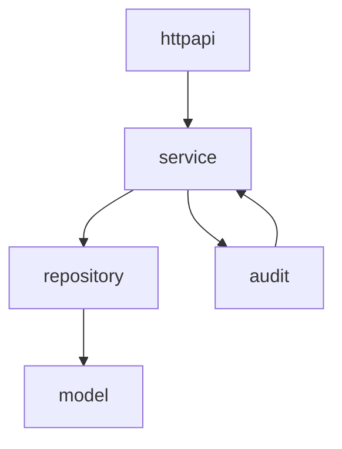
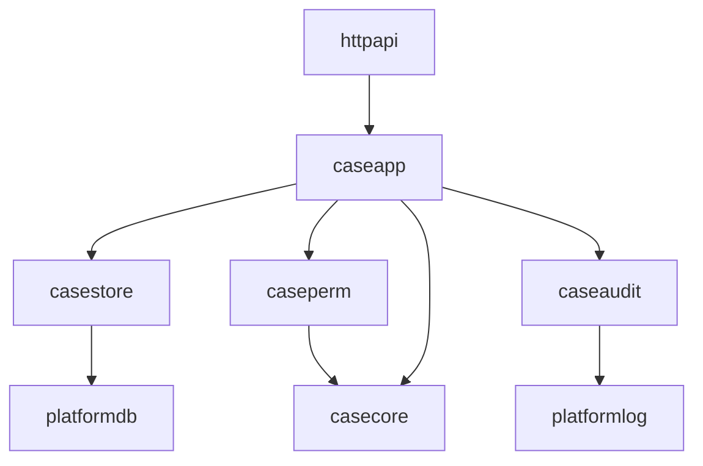
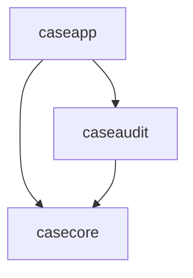
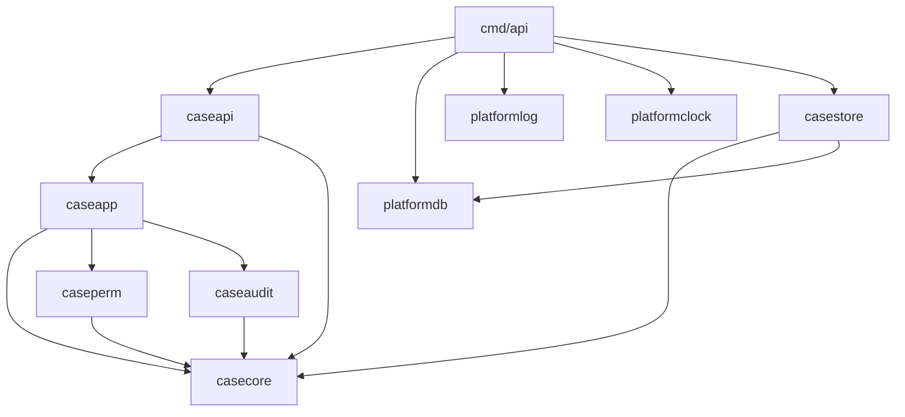
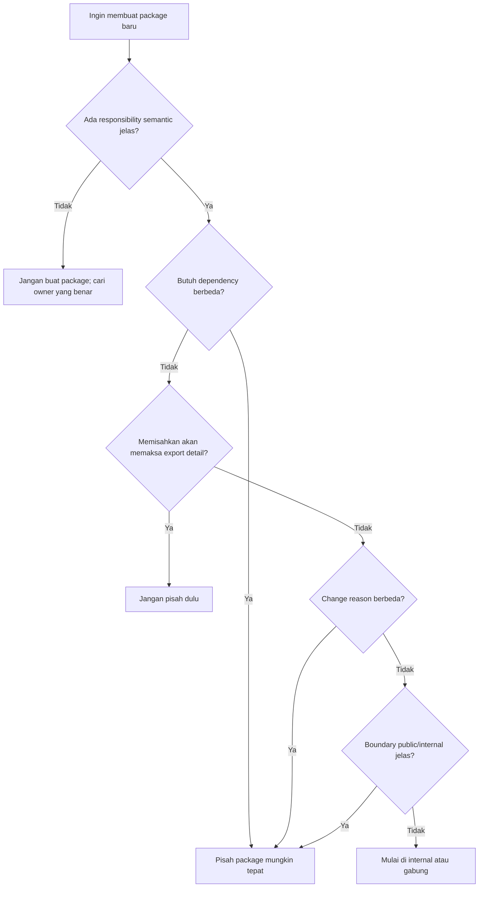

# learn-go-composition-oop-functional-reflection-codegen-modules-part-024.md

# Part 024 — Package Design: Naming, Export Surface, `internal`, Dependency Direction, dan Package Cohesion

> Seri: `learn-go-composition-oop-functional-reflection-codegen-modules`  
> Bagian: `024 / 030`  
> Status seri: **belum selesai**  
> Target pembaca: Java software engineer / tech lead yang ingin mendesain package Go secara production-grade  
> Fokus: package boundary sebagai unit desain, bukan sekadar folder organisasi

---

## 0. Kenapa package design di Go sangat penting?

Di Java, unit utama desain biasanya:

- class,
- interface,
- package,
- module,
- annotation,
- framework convention,
- dependency injection container.

Di Go, pusat desain bergeser.

Unit utama yang paling sering menentukan kualitas arsitektur adalah:

- **package**,
- exported vs unexported identifier,
- constructor,
- small interface,
- concrete type,
- `internal` boundary,
- import direction,
- module boundary.

Package Go bukan hanya namespace. Package adalah:

1. **unit visibility** — identifier lowercase hanya bisa diakses di package yang sama;
2. **unit compilation** — files dalam satu directory dan package name yang sama dikompilasi sebagai satu package;
3. **unit API surface** — exported identifiers membentuk kontrak publik;
4. **unit test boundary** — package tests bisa berada di package yang sama atau external test package;
5. **unit dependency** — Go tidak mengizinkan import cycle;
6. **unit architecture pressure** — desain buruk cepat terlihat dari import graph;
7. **unit semantic cohesion** — nama package memberi konteks pada semua exported names di dalamnya.

Mental model terpenting:

> Di Go, package adalah boundary utama untuk menyembunyikan detail, menjaga invariant, membatasi dependency, dan membuat API kecil.

Kalau Java engineer membawa kebiasaan class-heavy design ke Go, hasilnya sering menjadi:

- terlalu banyak package kecil ala `controller`, `service`, `repository`, `model`, `dto`;
- interface dibuat di provider package;
- semua type diexport karena ingin “dipakai nanti”;
- package bernama `common`, `util`, `helper`, `base`, `shared`;
- import cycle muncul karena dependency direction tidak jelas;
- domain invariant bocor karena struct fields diexport semua;
- test sulit karena boundary salah tempat;
- API sulit berubah karena terlalu banyak public surface.

Part ini akan membahas package design sebagai **architecture mechanism**.

---

## 1. Baseline resmi Go yang perlu dipahami

Beberapa fondasi resmi yang menjadi basis pembahasan:

1. Go documentation menjelaskan layout module dan memperlihatkan penggunaan `internal` untuk package pendukung yang tidak dimaksudkan diimpor dari luar subtree tertentu.
2. Effective Go menekankan bahwa package name adalah default qualifier saat import, sehingga nama package harus membantu pembacaan exported identifiers.
3. Go Tour menjelaskan visibility dasar: identifier exported jika dimulai dengan huruf kapital; unexported jika tidak.
4. Go module reference mendefinisikan hubungan module, package, import path, dependency, dan module graph.
5. Go command memberlakukan aturan khusus untuk directory bernama `internal`.

Konsekuensinya:

- package name adalah bagian dari API readability;
- exported identifier adalah public contract;
- `internal` adalah boundary yang enforceable oleh toolchain;
- module boundary adalah boundary distribusi/versioning, bukan selalu boundary desain internal;
- import graph harus acyclic.

Referensi utama:

- Go module layout: <https://go.dev/doc/modules/layout>
- Effective Go: <https://go.dev/doc/effective_go>
- Exported names: <https://go.dev/tour/basics/3>
- Go modules reference: <https://go.dev/ref/mod>
- Go packages command documentation: <https://pkg.go.dev/cmd/go>

---

## 2. Package bukan folder layer ala Java

Java/Spring project umum:

```text
com.company.caseplatform
├── controller
├── service
├── repository
├── entity
├── dto
├── mapper
├── config
├── util
└── exception
```

Struktur ini sering masuk akal di Java karena:

- class adalah unit desain utama;
- package sering dipakai sebagai layer namespace;
- DI framework menghubungkan object antar-layer;
- annotation menyatakan role class;
- visibility sering `public` karena framework reflection memerlukan akses.

Kalau pattern ini dipindahkan mentah-mentah ke Go:

```text
caseplatform/
├── controller
├── service
├── repository
├── model
├── dto
├── mapper
├── util
└── exception
```

maka muncul masalah:

1. `controller` butuh `service`.
2. `service` butuh `repository`.
3. `repository` butuh `model`.
4. `mapper` butuh `dto`, `model`, kadang `service`.
5. `util` dipakai semua.
6. `model` menjadi tempat semua type dari semua domain.
7. API package menjadi terlalu generik.
8. Import cycle mulai muncul.

Go lebih cocok dengan package yang disusun berdasarkan **capability/domain responsibility**, bukan layer teknis mentah.

Contoh lebih Go-like:

```text
internal/
├── caseapp/
│   ├── command.go
│   ├── handler.go
│   ├── workflow.go
│   └── policy.go
├── caseaudit/
│   ├── recorder.go
│   └── event.go
├── caseperm/
│   ├── decision.go
│   └── evaluator.go
├── casestore/
│   ├── store.go
│   └── oracle.go
├── httpapi/
│   ├── routes.go
│   └── case_handlers.go
└── platformlog/
    └── logger.go
```

Di sini package tidak dinamai berdasarkan “class stereotype”, tetapi berdasarkan tanggung jawab konkret.

---

## 3. Mental model: package sebagai semantic capsule

Package yang baik menjawab empat pertanyaan:

1. **Apa konsep yang dimodelkan?**
2. **Apa operasi yang aman diekspos?**
3. **Apa invariant yang harus disembunyikan?**
4. **Siapa yang boleh bergantung pada package ini?**

Contoh package `caseperm`:

```go
package caseperm

type Decision struct {
    Allowed bool
    Reason  Reason
}

type Evaluator struct {
    rules []Rule
}

func NewEvaluator(rules []Rule) (*Evaluator, error) {
    if len(rules) == 0 {
        return nil, ErrNoRules
    }
    copied := append([]Rule(nil), rules...)
    return &Evaluator{rules: copied}, nil
}

func (e *Evaluator) Evaluate(input Input) Decision {
    // invariant and rule ordering hidden here
}
```

Package ini menyembunyikan:

- rule ordering;
- internal representation;
- default behavior;
- conflict resolution;
- evaluation trace detail;
- mutable slice ownership.

Package ini mengekspor:

- `Decision`, karena caller perlu hasil;
- `Evaluator`, karena caller perlu capability;
- `NewEvaluator`, karena constructor menjaga invariant;
- `Input`, karena caller perlu menyediakan fakta.

Yang tidak perlu diexport:

- `ruleSet`,
- `priorityIndex`,
- `mergeTrace`,
- `normalizeInput`,
- `defaultDenyReason`.

Prinsip:

> Export hanya hal yang memang menjadi kontrak lintas-package.

---

## 4. Package name adalah bagian dari desain API

Di Go, caller membaca exported identifier bersama package qualifier.

Contoh:

```go
caseperm.Decision
caseperm.Evaluator
caseperm.NewEvaluator
caseaudit.Recorder
caseaudit.Event
casestore.Store
```

Karena package name menjadi qualifier, nama type tidak perlu mengulang nama package.

Buruk:

```go
package caseperm

type CasePermissionDecision struct{}
type CasePermissionEvaluator struct{}
func NewCasePermissionEvaluator() *CasePermissionEvaluator
```

Pemakaian menjadi:

```go
caseperm.CasePermissionDecision
caseperm.NewCasePermissionEvaluator()
```

Redundan.

Lebih baik:

```go
package caseperm

type Decision struct{}
type Evaluator struct{}
func NewEvaluator() *Evaluator
```

Pemakaian:

```go
caseperm.Decision
caseperm.NewEvaluator()
```

Aturan praktis:

| Hindari | Lebih baik | Alasan |
|---|---|---|
| `case.CaseService` | `caseapp.Service` atau `caseapp.Handler` | Tidak perlu mengulang package name |
| `audit.AuditRecorder` | `audit.Recorder` | Package memberi konteks |
| `permission.PermissionDecision` | `permission.Decision` | Reduksi noise |
| `email.EmailSender` | `email.Sender` | Caller membaca `email.Sender` |
| `validation.ValidationError` | `validation.Error` jika jelas | Tidak duplikatif |

Namun jangan terlalu pendek jika kehilangan makna.

Contoh:

```go
http.Client
sql.DB
json.Decoder
regexp.Regexp
```

Nama pendek efektif karena package memberi konteks kuat.

---

## 5. Package name yang buruk

Beberapa nama package yang sering menjadi smell:

### 5.1 `util`

```text
internal/util
```

Masalah:

- tidak punya domain;
- semua orang mengimpor;
- dependency graph menjadi kabur;
- mudah jadi tempat sampah;
- sulit dipensiunkan;
- sering memicu import cycle.

Lebih baik pecah berdasarkan konsep:

```text
internal/clock
internal/idgen
internal/redact
internal/retry
internal/strcase
internal/decimal
```

### 5.2 `common`

`common` biasanya berarti “saya belum tahu ownership-nya”.

Buruk:

```text
internal/common
├── constants.go
├── errors.go
├── dto.go
├── date.go
├── validation.go
└── mapper.go
```

Lebih baik:

```text
internal/caseid
internal/platformerr
internal/auditmeta
internal/timeutil
internal/validation
```

Namun `validation` juga bisa menjadi terlalu generik jika berisi semua validasi domain. Validasi domain biasanya lebih cocok dekat dengan domain package.

### 5.3 `model`

`model` sering menjadi dumping ground:

```text
internal/model
├── case.go
├── user.go
├── audit.go
├── permission.go
├── dto.go
└── db_entity.go
```

Masalah:

- domain bercampur dengan persistence;
- DTO bercampur dengan business object;
- package dependency menjadi terbalik;
- semua layer bergantung pada `model`;
- invariant domain bocor.

Lebih baik:

```text
internal/caseapp
internal/casestore
internal/caseapi
internal/caseaudit
```

Setiap package punya type sesuai boundary-nya.

### 5.4 `types`

`types` sering mirip `model`.

Buruk:

```text
internal/types
```

Lebih baik:

```text
internal/caseid
internal/caseperm
internal/workflow
```

Kalau semua package butuh type tersebut, tanyakan:

- Apakah ini benar-benar konsep platform?
- Apakah type ini terlalu umum?
- Apakah perlu dependency inversion?
- Apakah type ini sebenarnya milik satu domain tetapi dipakai terlalu luas?

### 5.5 `base`

`base` biasanya warisan OOP inheritance.

Buruk:

```text
internal/base
├── service.go
├── repository.go
└── controller.go
```

Di Go, lebih baik gunakan composition eksplisit:

```text
internal/platformtx
internal/platformlog
internal/httpmw
```

---

## 6. Export surface: public API harus kecil

Di Go, exported identifier adalah semua nama yang dimulai huruf kapital.

```go
type Case struct{}      // exported
func NewCase() Case     // exported
func normalizeCase()    // unexported
const MaxAttempts = 3   // exported
var DefaultClock Clock  // exported
```

Public surface yang terlalu besar menyebabkan:

- caller bergantung ke detail;
- refactor sulit;
- backward compatibility berat;
- generated docs noisy;
- misuse lebih mudah;
- package invariant lebih sulit dijaga.

Prinsip:

> Exported API adalah janji. Jangan membuat janji yang belum perlu.

### 6.1 Export constructor, bukan field, jika invariant penting

Buruk:

```go
type EscalationPolicy struct {
    Levels []Level
    Clock  Clock
}
```

Caller bisa membuat state invalid:

```go
p := EscalationPolicy{} // no levels, nil clock
```

Lebih baik:

```go
type EscalationPolicy struct {
    levels []Level
    clock  Clock
}

func NewEscalationPolicy(levels []Level, clock Clock) (*EscalationPolicy, error) {
    if len(levels) == 0 {
        return nil, ErrNoLevels
    }
    if clock == nil {
        return nil, ErrNilClock
    }
    return &EscalationPolicy{
        levels: append([]Level(nil), levels...),
        clock:  clock,
    }, nil
}
```

### 6.2 Export type jika caller perlu menyebutnya

Kadang constructor bisa return interface atau unexported concrete.

```go
type Evaluator interface {
    Evaluate(Input) Decision
}

func NewEvaluator(rules []Rule) (Evaluator, error) {
    return &defaultEvaluator{rules: rules}, nil
}

type defaultEvaluator struct {
    rules []Rule
}
```

Ini berguna jika:

- concrete type tidak perlu dikonfigurasi setelah dibuat;
- caller hanya perlu behavior;
- Anda ingin bebas mengganti implementasi;
- package ingin menyembunyikan state.

Namun jangan berlebihan. Returning interface dari constructor bisa menyulitkan jika caller butuh method tambahan, testing, atau composition.

Alternatif yang sering lebih fleksibel:

```go
type Evaluator struct {
    rules []Rule
}

func NewEvaluator(rules []Rule) (*Evaluator, error) { ... }
```

Lalu consumer yang butuh interface mendefinisikan sendiri:

```go
type PermissionEvaluator interface {
    Evaluate(caseperm.Input) caseperm.Decision
}
```

---

## 7. Package cohesion: apa yang seharusnya berada dalam package yang sama?

Sebuah package cohesive jika file-file di dalamnya:

- berubah karena alasan yang sama;
- menjaga invariant yang sama;
- punya vocabulary yang sama;
- saling membutuhkan unexported details secara wajar;
- tidak memaksa export hanya agar package tetangga bisa mengakses detail.

### 7.1 Tanda package terlalu besar

- Nama package generik.
- File terlalu banyak dengan subdomain tidak terkait.
- Banyak exported type yang tidak saling terkait.
- Tests sulit difokuskan.
- Banyak dependency eksternal tidak terkait.
- Perubahan kecil sering menyentuh package besar.

Contoh package terlalu besar:

```text
internal/case
├── approval.go
├── audit.go
├── email.go
├── payment.go
├── permission.go
├── report.go
├── search.go
├── storage.go
├── workflow.go
└── http.go
```

Ini mungkin perlu dipisah:

```text
internal/caseapp
internal/caseaudit
internal/caseperm
internal/casereport
internal/casesearch
internal/casestore
internal/caseapi
```

### 7.2 Tanda package terlalu kecil

- Satu package hanya berisi satu tiny type tanpa alasan boundary.
- Terlalu banyak package import internal satu sama lain.
- Banyak unexported detail terpaksa diexport.
- Import path menjadi panjang tapi tidak menambah makna.
- Developer harus melompat antar 10 package untuk memahami satu feature.

Contoh terlalu kecil:

```text
internal/caseid
internal/casestatus
internal/casepriority
internal/caseassignee
internal/casedeadline
internal/casetype
```

Jika semua type ini hanya dipakai bersama untuk aggregate case, mungkin lebih baik:

```text
internal/casecore
```

atau:

```text
internal/caseapp
```

Tergantung ownership-nya.

### 7.3 Heuristic cohesion

Tanyakan:

1. Apakah type A dan B harus berubah bersama?
2. Apakah B butuh akses ke unexported field A?
3. Apakah caller sering memakai A dan B bersama?
4. Apakah memisahkan mereka membuat banyak symbol diexport?
5. Apakah menggabungkan mereka membuat dependency tidak relevan masuk?

Jika jawaban 1–4 “ya”, gabungkan.  
Jika jawaban 5 “ya”, pisahkan.

---

## 8. Dependency direction: import graph adalah arsitektur nyata

Go melarang import cycle. Ini bukan gangguan; ini feature desain.

Import cycle biasanya muncul ketika boundary tidak jelas.

Buruk:



Cycle `service -> audit -> service` menunjukkan ownership kabur.

Lebih baik:



Arah dependency:

- inbound adapter bergantung pada application package;
- application package bergantung pada domain/policy package;
- persistence adapter bisa bergantung pada domain type jika memang menyimpan domain;
- domain package sebaiknya tidak bergantung pada HTTP/database/framework;
- platform package sebaiknya tidak bergantung pada domain.

### 8.1 Import direction rule

Aturan sederhana:

```text
outer/detail -> inner/policy
adapter      -> app
app          -> domain/policy/interface
infra        -> platform primitives
platform     -> standard library / external libs
```

Hindari:

```text
domain -> http
domain -> database
domain -> logger concrete
domain -> config loader
platform -> business domain
```

### 8.2 Interface sebagai alat membalik dependency

Misal `caseapp` butuh storage, tetapi tidak ingin bergantung ke Oracle implementation.

```go
package caseapp

type CaseStore interface {
    Save(ctx context.Context, c Case) error
    Find(ctx context.Context, id CaseID) (Case, error)
}

type Handler struct {
    store CaseStore
}
```

Lalu implementation:

```go
package casestore

type OracleStore struct {
    db *sql.DB
}

func (s *OracleStore) Save(ctx context.Context, c caseapp.Case) error { ... }
func (s *OracleStore) Find(ctx context.Context, id caseapp.CaseID) (caseapp.Case, error) { ... }
```

Wiring package:

```go
package main

func main() {
    store := casestore.NewOracleStore(db)
    handler := caseapp.NewHandler(store)
    httpapi.Register(handler)
}
```

Perhatikan: interface berada di consumer package (`caseapp`) karena `caseapp` yang tahu behavior minimal yang dibutuhkan.

---

## 9. `internal` package: boundary yang enforceable

Directory bernama `internal` punya aturan khusus: package di dalamnya hanya bisa diimpor oleh code yang berada di parent tree dari `internal` tersebut.

Contoh:

```text
caseplatform/
├── go.mod
├── cmd/
│   └── api/
│       └── main.go
└── internal/
    ├── caseapp/
    ├── casestore/
    └── httpapi/
```

Package di `caseplatform/internal/caseapp` bisa diimpor oleh code dalam module `caseplatform`, tetapi tidak oleh module lain di luar parent tree.

Ini penting karena:

- Anda bisa membuat package kecil tanpa menjadikannya public dependency;
- Anda bisa refactor internal architecture tanpa breaking external users;
- Anda bisa membatasi coupling antar repository;
- Anda bisa mencegah “accidental platform API”.

### 9.1 Kapan pakai `internal`?

Gunakan `internal` untuk:

- application implementation;
- adapter;
- domain implementation yang belum stabil sebagai public lib;
- generated internal registry;
- wiring helper;
- package yang hanya valid untuk executable/repo tersebut.

Contoh:

```text
internal/
├── caseapp
├── caseapi
├── casestore
├── casemigrate
├── platformconfig
├── platformdb
└── platformlog
```

### 9.2 Kapan tidak pakai `internal`?

Jangan pakai `internal` jika package memang dimaksudkan sebagai public library:

```text
caseid/
caseperm/
auditcodec/
```

Tetapi hati-hati. Public package berarti versioning dan compatibility lebih berat.

Jika ragu, mulai dari `internal`.

> Lebih mudah membuka API internal menjadi public daripada menarik kembali API public yang sudah dipakai.

---

## 10. `/cmd`, `/internal`, `/pkg`: hati-hati dengan cargo cult

Layout populer:

```text
cmd/
internal/
pkg/
```

Namun tidak semua project perlu semuanya.

### 10.1 `/cmd`

Gunakan `/cmd/<binary>` jika repository menghasilkan satu atau lebih executable.

```text
cmd/
├── api/
│   └── main.go
├── worker/
│   └── main.go
└── migrator/
    └── main.go
```

`main.go` sebaiknya tipis:

```go
func main() {
    if err := run(); err != nil {
        log.Fatal(err)
    }
}
```

Wiring detail bisa diletakkan di package khusus jika membesar.

### 10.2 `/internal`

Tempat utama implementation package untuk aplikasi.

```text
internal/caseapp
internal/httpapi
internal/casestore
```

### 10.3 `/pkg`

Kontroversial karena sering dipakai sebagai “public-ish dumping ground”.

Gunakan `/pkg` hanya jika Anda sengaja menyediakan package untuk diimpor oleh project lain.

Buruk:

```text
pkg/common
pkg/utils
pkg/models
```

Lebih baik:

```text
caseid
permission
```

Atau jika ingin tetap `/pkg`:

```text
pkg/caseid
pkg/permission
```

Tetapi jangan menganggap `/pkg` punya enforcement seperti `internal`. `/pkg` hanyalah convention, bukan boundary toolchain.

---

## 11. Package boundary vs module boundary

Package dan module berbeda.

Package:

- unit source code dalam directory;
- unit import;
- unit visibility;
- unit compilation.

Module:

- unit versioning;
- unit dependency management;
- punya `go.mod`;
- punya module path;
- bisa berisi banyak package.

Jangan membuat module baru hanya karena ingin package baru.

Buruk:

```text
case-platform/
├── case-core/go.mod
├── case-api/go.mod
├── case-store/go.mod
├── case-perm/go.mod
└── case-worker/go.mod
```

Ini membuat:

- versioning internal rumit;
- local replace banyak;
- CI lambat;
- dependency drift;
- release coordination sulit;
- import graph antar-module lebih susah dipahami.

Mulai dengan satu module kecuali ada alasan kuat:

```text
case-platform/
├── go.mod
├── cmd/
└── internal/
```

Gunakan multi-module jika:

- ada lifecycle rilis berbeda;
- ada public library stabil;
- ada dependency berat yang ingin diisolasi;
- ada ownership tim berbeda;
- ada compatibility promise berbeda;
- ada alasan supply-chain/security jelas.

Part 025–028 akan membahas module dan repo architecture lebih dalam.

---

## 12. Package API design: concrete type vs interface

Salah satu kesalahan umum:

```go
package user

type Service interface {
    Create(...)
    Update(...)
    Delete(...)
}

type service struct { ... }

func NewService(...) Service { ... }
```

Ini sering warisan Java:

```java
public interface UserService {}
@Service
public class UserServiceImpl implements UserService {}
```

Di Go, ini tidak selalu salah, tetapi sering unnecessary.

Lebih Go-like:

```go
package userapp

type Service struct {
    store Store
}

func NewService(store Store) *Service {
    return &Service{store: store}
}

func (s *Service) Create(ctx context.Context, cmd CreateCommand) (UserID, error) { ... }
```

Consumer yang butuh mock bisa mendefinisikan interface kecil di tempatnya:

```go
package httpapi

type UserCreator interface {
    Create(ctx context.Context, cmd userapp.CreateCommand) (userapp.UserID, error)
}
```

### Decision table

| Situasi | Return concrete | Return interface |
|---|---:|---:|
| Caller butuh method lengkap concrete | Ya | Tidak |
| Implementasi hanya satu | Biasanya ya | Biasanya tidak |
| Ingin menyembunyikan concrete karena invariant kuat | Kadang | Ya |
| Public library ingin bebas mengganti implementation | Kadang | Kadang ya |
| Consumer butuh subset behavior | Consumer define interface | Jangan provider paksa |
| Testing seam | Interface di consumer | Bisa jika abstraction benar-benar public |

Prinsip:

> Accept interface, return concrete adalah heuristic, bukan hukum absolut. Yang lebih penting: interface harus berada di boundary yang benar.

---

## 13. Unexported type dengan exported constructor

Pattern ini berguna untuk menyembunyikan implementation.

```go
package token

type Validator interface {
    Validate(ctx context.Context, raw string) (Claims, error)
}

func NewValidator(keys KeySet, clock Clock) (Validator, error) {
    if keys.Empty() {
        return nil, ErrNoKeys
    }
    return &validator{keys: keys, clock: clock}, nil
}

type validator struct {
    keys  KeySet
    clock Clock
}

func (v *validator) Validate(ctx context.Context, raw string) (Claims, error) { ... }
```

Kelebihan:

- caller tidak bisa mutate internals;
- implementation bisa diganti;
- public surface kecil.

Kekurangan:

- caller tidak bisa type assert ke concrete;
- extension sulit;
- mocking kadang perlu interface manual;
- documentation harus jelas.

Gunakan untuk capability yang memang ingin opaque.

---

## 14. Exported struct field vs method

Exported field membuat representation menjadi API.

```go
type Case struct {
    ID     string
    Status string
}
```

Caller bisa:

```go
c.Status = "INVALID"
```

Jika invariant penting, gunakan unexported fields + method:

```go
type Case struct {
    id     ID
    status Status
}

func NewCase(id ID) Case {
    return Case{id: id, status: StatusDraft}
}

func (c Case) ID() ID { return c.id }
func (c Case) Status() Status { return c.status }

func (c *Case) Submit(now time.Time) error {
    if c.status != StatusDraft {
        return ErrInvalidTransition
    }
    c.status = StatusSubmitted
    return nil
}
```

Namun untuk DTO/wire type, exported fields masuk akal:

```go
type CreateCaseRequest struct {
    ApplicantID string `json:"applicantId"`
    Category    string `json:"category"`
}
```

Decision:

| Type kind | Export fields? | Alasan |
|---|---:|---|
| Domain aggregate | Biasanya tidak | Invariant penting |
| Config input | Kadang ya | Ergonomics |
| JSON DTO | Ya | Encoder/decoder perlu akses |
| DB row internal | Bisa ya jika internal package | Tidak public |
| Immutable value object | Bisa tidak | Constructor validation |
| Generated wire type | Biasanya ya | Tooling convention |

---

## 15. Package tests: same package vs external package

Go test bisa ditulis dalam dua mode.

### 15.1 Same package test

```go
package caseperm

func TestNormalizeRules(t *testing.T) {
    got := normalizeRules(...)
}
```

Kelebihan:

- bisa mengakses unexported function/type;
- cocok untuk internal invariant;
- cocok untuk algorithm detail.

Kekurangan:

- test bisa terlalu dekat dengan implementation;
- public API usability kurang teruji.

### 15.2 External package test

```go
package caseperm_test

func TestEvaluatorEvaluate(t *testing.T) {
    e, err := caseperm.NewEvaluator(...)
}
```

Kelebihan:

- menguji package seperti user eksternal;
- memaksa public API ergonomics;
- mendeteksi API yang terlalu sulit dipakai.

Kekurangan:

- tidak bisa cek detail internal;
- kadang perlu fixture lebih banyak.

### 15.3 Production guideline

Gunakan keduanya:

```text
caseperm/
├── evaluator.go
├── rule.go
├── evaluator_test.go        # package caseperm
└── evaluator_api_test.go    # package caseperm_test
```

Same package tests untuk invariant internal.  
External package tests untuk contract public API.

---

## 16. Dependency injection tanpa container

Go tidak memerlukan DI framework untuk banyak kasus.

Package boundary + constructor sudah cukup.

```go
type Handler struct {
    store   Store
    clock   Clock
    audit   AuditRecorder
    permits PermissionEvaluator
}

func NewHandler(deps Deps) (*Handler, error) {
    if deps.Store == nil {
        return nil, ErrNilStore
    }
    if deps.Clock == nil {
        return nil, ErrNilClock
    }
    if deps.Audit == nil {
        return nil, ErrNilAudit
    }
    if deps.Permissions == nil {
        return nil, ErrNilPermissions
    }
    return &Handler{
        store:   deps.Store,
        clock:   deps.Clock,
        audit:   deps.Audit,
        permits: deps.Permissions,
    }, nil
}

type Deps struct {
    Store       Store
    Clock       Clock
    Audit       AuditRecorder
    Permissions PermissionEvaluator
}
```

Wiring di `main`:

```go
store := casestore.NewOracle(db)
audit := caseaudit.NewRecorder(auditStore)
perm := caseperm.NewEvaluator(rules)
handler, err := caseapp.NewHandler(caseapp.Deps{
    Store:       store,
    Clock:       clock.System{},
    Audit:       audit,
    Permissions: perm,
})
```

Keuntungan:

- dependency eksplisit;
- compile-time visible;
- tidak perlu reflection;
- startup failure jelas;
- test mudah;
- import graph terlihat.

---

## 17. Package-level state: gunakan sangat hati-hati

Package-level variable sering menjadi hidden global dependency.

Buruk:

```go
package audit

var defaultRecorder Recorder

func Record(ctx context.Context, e Event) error {
    return defaultRecorder.Record(ctx, e)
}
```

Masalah:

- test saling bocor;
- race risk;
- startup ordering;
- sulit multi-tenant;
- hidden dependency;
- observability sulit.

Lebih baik:

```go
type Recorder struct {
    sink Sink
}

func NewRecorder(sink Sink) *Recorder {
    return &Recorder{sink: sink}
}

func (r *Recorder) Record(ctx context.Context, e Event) error {
    return r.sink.Write(ctx, e)
}
```

Package-level const atau immutable var bisa aman:

```go
const MaxReasonLength = 500

var ErrInvalidTransition = errors.New("invalid transition")
```

Tetapi mutable global sebaiknya dihindari.

---

## 18. Error ownership di package

Error adalah bagian dari package API.

```go
package caseapp

var ErrInvalidTransition = errors.New("invalid transition")
```

Caller bisa:

```go
if errors.Is(err, caseapp.ErrInvalidTransition) { ... }
```

Jangan membuat package `errors` global berisi semua error.

Buruk:

```text
internal/errors
├── case_errors.go
├── auth_errors.go
├── audit_errors.go
└── db_errors.go
```

Lebih baik error tinggal dekat dengan owner behavior:

```text
internal/caseapp/errors.go
internal/authn/errors.go
internal/caseaudit/errors.go
```

Jika perlu error platform generic:

```text
internal/platformerr
```

Tetapi jangan semua error domain masuk ke situ.

---

## 19. Package documentation

Package public harus punya package comment.

```go
// Package caseperm evaluates whether an actor may perform operations on a case.
//
// The package is intentionally policy-only. It does not load users, read cases
// from storage, or emit audit records. Callers must provide all facts through Input.
package caseperm
```

Package comment yang baik menjelaskan:

- tujuan package;
- boundary;
- apa yang bukan tanggung jawabnya;
- concurrency safety jika relevan;
- lifecycle jika object perlu Close;
- error semantics;
- compatibility expectations.

Buruk:

```go
// Package caseperm contains case permission utilities.
package caseperm
```

Terlalu vague.

Lebih baik:

```go
// Package caseperm contains deterministic permission evaluation for case commands.
//
// Evaluators are immutable after construction and safe for concurrent use.
// The package does not perform I/O. All caller, role, case, and organization
// facts must be supplied in Input.
package caseperm
```

---

## 20. Naming exported identifiers

Karena package name memberi konteks, exported names harus dibaca bersama qualifier.

### 20.1 Constructor naming

Umum:

```go
New()
NewClient()
NewStore()
NewEvaluator()
```

Jika package hanya punya satu primary type, `New` bisa cukup.

```go
package caseperm

func New(rules []Rule) (*Evaluator, error)
```

Caller:

```go
e, err := caseperm.New(rules)
```

Jika ada banyak primary type, gunakan nama spesifik:

```go
func NewEvaluator(rules []Rule) (*Evaluator, error)
func NewCompiler(src Source) (*Compiler, error)
```

### 20.2 Interface naming

Single-method interface sering memakai `-er`:

```go
type Reader interface { Read([]byte) (int, error) }
type Writer interface { Write([]byte) (int, error) }
type Validator interface { Validate(Input) error }
```

Tetapi jangan memaksa `-er` jika tidak natural.

```go
type Store interface { ... }
type Clock interface { Now() time.Time }
type Policy interface { Decide(Input) Decision }
```

### 20.3 Avoid stutter

Buruk:

```go
caseaudit.AuditEvent
caseaudit.AuditRecorder
caseaudit.NewAuditRecorder
```

Lebih baik:

```go
caseaudit.Event
caseaudit.Recorder
caseaudit.NewRecorder
```

---

## 21. Designing around import cycles

Import cycle bukan sekadar error teknis. Itu sinyal desain.

Contoh:

```text
caseapp imports caseaudit
caseaudit imports caseapp
```

Kenapa bisa terjadi?

- `caseaudit.Event` butuh `caseapp.Case`;
- `caseapp.Handler` butuh `caseaudit.Recorder`;
- dua package saling tahu terlalu banyak.

Solusi 1: pindahkan shared value ke package lebih bawah.

```text
casecore
├── CaseID
├── ActorID
└── Status
```



Solusi 2: pakai interface di consumer.

```go
package caseapp

type AuditRecorder interface {
    Record(ctx context.Context, e AuditEvent) error
}
```

Solusi 3: event contract dimiliki application package, audit adapter mengimplementasikan sink.

```go
package caseapp

type EventSink interface {
    Append(ctx context.Context, event Event) error
}
```

Solusi 4: buat package contract khusus jika benar-benar shared dan stabil.

```text
caseevent
```

Namun hati-hati agar `caseevent` tidak menjadi `common` baru.

---

## 22. Package design untuk regulatory case platform

Misalkan kita membangun platform enforcement/case management.

Kebutuhan:

- create case;
- assign officer;
- escalate case;
- approve enforcement action;
- record audit trail;
- evaluate permission;
- persist to database;
- expose HTTP API;
- publish event.

Struktur buruk:

```text
internal/
├── controller
├── service
├── repository
├── model
├── dto
├── mapper
├── util
└── common
```

Struktur lebih baik:

```text
internal/
├── casecore/
│   ├── id.go
│   ├── status.go
│   └── actor.go
├── caseapp/
│   ├── command.go
│   ├── handler.go
│   ├── deps.go
│   └── workflow.go
├── caseperm/
│   ├── input.go
│   ├── decision.go
│   └── evaluator.go
├── caseaudit/
│   ├── event.go
│   └── recorder.go
├── casestore/
│   ├── store.go
│   ├── oracle.go
│   └── row.go
├── caseapi/
│   ├── routes.go
│   ├── request.go
│   └── response.go
├── platformdb/
│   └── db.go
├── platformlog/
│   └── logger.go
└── platformclock/
    └── clock.go
```

Dependency graph:



Catatan penting:

- `cmd/api` melakukan wiring.
- `caseapi` tidak langsung bicara database.
- `caseapp` tidak tahu HTTP.
- `caseperm` tidak melakukan I/O.
- `caseaudit` tidak bergantung ke `caseapp` jika event contract cukup via `casecore` atau event type sendiri.
- `casestore` bisa mengubah row mapping tanpa mengubah domain package.

---

## 23. Vertical slice vs horizontal layer

Horizontal layer:

```text
controller -> service -> repository -> database
```

Vertical slice:

```text
caseapi -> caseapp -> caseperm/caseaudit/casestore
```

Go sering lebih nyaman dengan package berdasarkan vertical capability.

Namun jangan ekstrem. Untuk platform primitive seperti DB/log/config, package horizontal tetap masuk akal:

```text
platformdb
platformlog
platformconfig
```

Decision:

| Concern | Package style |
|---|---|
| Business capability | Vertical/domain capability |
| HTTP adapter | Adapter package |
| Database primitive | Platform package |
| Domain policy | Domain/policy package |
| Shared primitive with stable meaning | Small focused package |
| Random helpers | Jangan buat `util` |

---

## 24. Package boundary dan generated code

Generated code harus diletakkan pada boundary yang benar.

Contoh permission registry generated:

```text
internal/caseperm/
├── permission.go
├── registry.go
├── registry_gen.go
└── registry_source.go
```

Jika generated file adalah implementation detail, letakkan di `internal` package dan unexport symbol-nya.

```go
var generatedPermissions = map[Code]Definition{...}
```

Jangan export hanya karena generated.

Buruk:

```go
var GeneratedPermissionMap = ...
```

Lebih baik:

```go
func Lookup(code Code) (Definition, bool) {
    d, ok := generatedPermissions[code]
    return d, ok
}
```

Generator harus menghormati package API design:

- jangan membuat semua symbol public;
- jangan menabrak naming convention;
- jangan membuat import cycle;
- jangan menaruh generated DTO domain di package domain jika itu wire-specific;
- jangan menggabungkan generated registry semua domain ke satu package `generated`.

---

## 25. Reflection-heavy package boundary

Reflection sering membuat package boundary kabur.

Contoh:

```go
func Validate(v any) error
```

Jika berada di package generic `validation`, semua domain bisa memakai tag yang sama.

Risiko:

- invariant domain pindah ke tag;
- field harus diexport agar reflection bisa akses;
- package domain menjadi DTO-like;
- validation rule tersebar di string tag;
- refactor tidak compile-time safe.

Lebih baik pisahkan:

```text
internal/platformvalidate   # generic reflective engine
internal/caseapp            # domain validation policy
```

Domain package bisa memakai engine jika perlu, tetapi rule penting tetap explicit.

```go
func (cmd CreateCaseCommand) Validate() error {
    if cmd.ApplicantID == "" {
        return ErrMissingApplicant
    }
    if !validCategory(cmd.Category) {
        return ErrInvalidCategory
    }
    return nil
}
```

Reflection engine cocok untuk structural validation, bukan seluruh business policy.

---

## 26. Package naming dalam enterprise codebase

Untuk codebase besar, prefix domain sering membantu.

Contoh:

```text
caseapp
caseapi
caseperm
caseaudit
casestore
```

Kenapa tidak nested?

```text
case/app
case/api
case/perm
case/audit
case/store
```

Nested path boleh, tetapi jangan menganggap nested package punya hubungan khusus. Di Go, package path nested tidak memberi visibility khusus selain `internal`.

`case/app` dan `case/api` adalah package berbeda. Package `case/app` tidak punya akses khusus ke unexported identifier `case` atau `case/api`.

Flat-ish names sering mengurangi asumsi palsu.

Namun nested path bisa bagus jika grouping besar:

```text
internal/case/app
internal/case/api
internal/case/store
internal/case/perm
```

Pilih berdasarkan navigability dan import readability.

Import readability:

```go
import "example.com/platform/internal/caseapp"
```

vs

```go
import "example.com/platform/internal/case/app"
```

Package name tetap `app` jika path `case/app`, sehingga caller membaca:

```go
app.NewHandler()
```

Ini kurang jelas jika banyak package bernama `app`.

Bisa diberi package name `caseapp`, tetapi package name berbeda dari last path element kadang membingungkan.

Praktis:

- untuk domain besar, `internal/caseapp` lebih jelas;
- untuk subpackage banyak dalam domain, `internal/case/...` bisa masuk akal;
- hindari banyak package dengan name `app`, `api`, `store` jika diimport bersama.

---

## 27. Public package compatibility

Begitu package public dipakai external user, Anda punya compatibility burden.

Breaking changes:

- rename exported type/function;
- remove exported field;
- change method signature;
- add method to exported interface;
- change behavior yang sudah didokumentasikan;
- change error sentinel;
- change struct field tag jika caller bergantung;
- change import path.

Non-breaking atau relatif aman:

- add new exported function;
- add new method to concrete type;
- add unexported field to exported struct;
- add new option function;
- add new error wrapping while preserving `errors.Is`;
- improve internal algorithm without behavior change.

Caution:

Adding method to exported interface is breaking for external implementers.

```go
type Store interface {
    Save(ctx context.Context, c Case) error
}
```

Mengubah menjadi:

```go
type Store interface {
    Save(ctx context.Context, c Case) error
    Delete(ctx context.Context, id ID) error
}
```

Semua implementer external rusak.

Karena itu exported interface harus kecil dan stabil.

---

## 28. Anti-pattern catalog

### 28.1 Package per class

Buruk:

```text
internal/casehandler
internal/caseservice
internal/caserepository
```

Go package bukan class wrapper.

### 28.2 Interface package

Buruk:

```text
internal/interfaces
```

Interface harus dekat consumer atau domain contract yang stabil.

### 28.3 DTO global package

Buruk:

```text
internal/dto
```

DTO harus dekat adapter boundary:

```text
internal/caseapi
```

### 28.4 Mapper global package

Buruk:

```text
internal/mapper
```

Mapping harus dekat boundary yang melakukan transformasi.

```text
internal/caseapi/request_mapping.go
internal/casestore/row_mapping.go
```

### 28.5 Config package mengimpor semua domain

Buruk:

```go
package config

import (
    "caseapp"
    "casestore"
    "caseaudit"
)
```

Config package seharusnya membaca config, bukan wiring semua aplikasi.

Wiring lebih cocok di `cmd` atau package bootstrap.

### 28.6 Logger package bergantung pada domain

Buruk:

```go
package platformlog

import "caseapp"
```

Platform package tidak boleh tahu business domain.

### 28.7 Export karena test

Buruk:

```go
func NormalizeRulesForTest(...) {}
```

Lebih baik same-package test, atau test via public behavior.

### 28.8 Export karena generated code package salah

Jika generator butuh access internal detail, mungkin generated code harus berada di package yang sama, bukan memaksa export.

---

## 29. Package review checklist

Gunakan checklist ini saat code review.

### 29.1 Naming

- Apakah nama package singkat, lowercase, dan bermakna?
- Apakah package name memberi konteks pada exported identifiers?
- Apakah ada stutter seperti `audit.AuditEvent`?
- Apakah ada package `util`, `common`, `helper`, `base`, `types`, `model`?

### 29.2 Export surface

- Apakah semua exported identifiers memang diperlukan caller luar package?
- Apakah exported field membocorkan invariant?
- Apakah exported interface stabil?
- Apakah constructor menjaga state valid?
- Apakah error exported merupakan contract yang sengaja?

### 29.3 Cohesion

- Apakah files dalam package berubah karena alasan yang sama?
- Apakah package terlalu besar?
- Apakah package terlalu kecil?
- Apakah unexported details dipakai wajar oleh beberapa file?
- Apakah ada unrelated dependency masuk?

### 29.4 Dependency direction

- Apakah import graph sesuai arah architecture?
- Apakah domain package bebas dari HTTP/database/framework?
- Apakah platform package bebas dari business domain?
- Apakah ada import cycle smell?
- Apakah interface berada di consumer side?

### 29.5 Internal/public boundary

- Apakah package seharusnya berada di `internal`?
- Apakah public package punya compatibility policy?
- Apakah `/pkg` dipakai dengan sengaja atau cargo cult?
- Apakah generated package mengekspos terlalu banyak?

### 29.6 Testing

- Apakah ada external package test untuk public API?
- Apakah same package test hanya menguji invariant internal yang pantas?
- Apakah test memaksa API menjadi public?

---

## 30. Decision framework: kapan memecah package?

Pecah package jika:

- dependency berbeda secara signifikan;
- responsibility berbeda;
- package terlalu besar untuk dipahami;
- change reason berbeda;
- public API bisa lebih kecil setelah dipisah;
- lifecycle atau ownership berbeda;
- boundary perlu diuji sebagai contract.

Jangan pecah package jika:

- hanya karena file banyak;
- hanya karena ingin “rapi”;
- menyebabkan banyak unexported detail harus diexport;
- menyebabkan import path berisik;
- memecah invariant yang seharusnya dijaga bersama;
- menghasilkan package bernama generik.

Mermaid decision tree:



---

## 31. Practical refactoring: dari Java-style ke Go-style

Awal:

```text
internal/
├── controller
│   └── case_controller.go
├── service
│   └── case_service.go
├── repository
│   └── case_repository.go
├── model
│   └── case.go
├── dto
│   └── case_request.go
└── util
    └── date.go
```

Langkah refactor:

### Step 1: Identifikasi capability

- case command handling;
- HTTP request/response;
- persistence;
- permission;
- audit;
- platform clock.

### Step 2: Bentuk package semantic

```text
internal/
├── caseapi
├── caseapp
├── casestore
├── caseperm
├── caseaudit
└── platformclock
```

### Step 3: Pindahkan DTO ke adapter

```text
caseapi/request.go
caseapi/response.go
```

### Step 4: Pindahkan DB row ke store

```text
casestore/row.go
casestore/oracle.go
```

### Step 5: Interface di consumer

```go
package caseapp

type Store interface { ... }
type PermissionEvaluator interface { ... }
type AuditRecorder interface { ... }
```

### Step 6: Wiring di `cmd`

```go
package main

func main() {
    db := platformdb.MustOpen(...)
    store := casestore.NewOracle(db)
    perm := caseperm.NewEvaluator(...)
    audit := caseaudit.NewRecorder(...)
    app := caseapp.NewHandler(caseapp.Deps{...})
    server := caseapi.NewServer(app)
    server.ListenAndServe()
}
```

### Step 7: Hapus package generik

- `util/date.go` menjadi `platformclock` atau langsung `time` helper dekat caller;
- `model/case.go` menjadi `casecore` atau `caseapp` tergantung invariant;
- `dto` hilang ke `caseapi`.

---

## 32. What top 1% engineers notice

Engineer kuat tidak hanya bertanya:

> “Package ini compile?”

Mereka bertanya:

1. “Siapa owner semantic package ini?”
2. “Apa public contract-nya?”
3. “Apa yang sengaja disembunyikan?”
4. “Apakah import graph menunjukkan architecture yang benar?”
5. “Apakah package ini stabil atau masih internal?”
6. “Apakah nama package membantu caller membaca API?”
7. “Apakah exported interface akan menyulitkan compatibility?”
8. “Apakah package ini akan menjadi dumping ground enam bulan lagi?”
9. “Apakah generated/reflection code menghormati boundary?”
10. “Apakah test membuktikan contract atau implementation detail?”

Go membuat dependency dan visibility lebih eksplisit daripada banyak framework Java. Ini membuat desain buruk lebih cepat terlihat, tetapi hanya jika engineer membaca import graph sebagai sinyal arsitektur.

---

## 33. Ringkasan prinsip utama

1. Package adalah unit desain utama di Go.
2. Nama package adalah bagian dari readability API.
3. Hindari package generik seperti `util`, `common`, `helper`, `base`, `model`, `types`.
4. Exported identifier adalah public contract.
5. Constructor menjaga invariant; exported fields membocorkan representation.
6. Interface sebaiknya kecil dan sering berada di consumer side.
7. `internal` adalah toolchain-enforced boundary; gunakan untuk implementation detail.
8. `/pkg` bukan enforcement boundary; jangan cargo cult.
9. Import cycle adalah sinyal desain, bukan sekadar error compiler.
10. Package cohesion lebih penting daripada folder rapi.
11. Generated code dan reflection harus tunduk pada package boundary.
12. Public package membawa compatibility cost.
13. External package tests membantu menguji usability public API.
14. Wiring eksplisit di `cmd` sering lebih baik daripada DI magic.
15. Import graph adalah architecture map yang nyata.

---

## 34. Latihan desain

### Latihan 1 — Refactor package `common`

Diberikan:

```text
internal/common
├── date.go
├── error.go
├── audit.go
├── permission.go
├── string.go
└── case.go
```

Tugas:

1. Pecah menjadi package semantic.
2. Tentukan mana yang tetap internal.
3. Tentukan exported dan unexported API.
4. Gambar import graph.
5. Jelaskan package mana yang berisiko menjadi dumping ground baru.

### Latihan 2 — Desain package permission

Buat package `caseperm` yang:

- tidak melakukan I/O;
- menerima facts melalui `Input`;
- menghasilkan `Decision`;
- immutable setelah construction;
- safe untuk concurrent use;
- tidak mengekspos rule internals.

Tentukan:

- exported types;
- unexported types;
- constructor;
- package comment;
- tests same package vs external package.

### Latihan 3 — Hilangkan import cycle

Diberikan:

```text
caseapp -> caseaudit
caseaudit -> casestore
casestore -> caseapp
```

Tugas:

1. Identifikasi ownership yang salah.
2. Buat dependency graph baru.
3. Tentukan apakah perlu package `casecore` atau interface consumer-side.
4. Jelaskan trade-off masing-masing solusi.

---

## 35. Preview Part 025

Part berikutnya akan masuk ke:

# Part 025 — Module Fundamentals: `go.mod`, `go.sum`, MVS, Semantic Import Versioning, `replace`, `exclude`, dan `retract`

Kita akan membahas:

- beda package vs module;
- module path dan import path;
- minimal version selection;
- `go.mod` sebagai dependency contract;
- `go.sum` sebagai integrity database lokal;
- semantic import versioning;
- major version path `/v2`;
- `replace` untuk development vs production risk;
- `exclude` dan `retract`;
- private module implication;
- compatibility dan release governance.

---

## Referensi

1. Go Documentation — Organizing a Go module: <https://go.dev/doc/modules/layout>
2. Effective Go — Package names and exported identifiers: <https://go.dev/doc/effective_go>
3. A Tour of Go — Exported names: <https://go.dev/tour/basics/3>
4. Go Modules Reference: <https://go.dev/ref/mod>
5. Go command documentation: <https://pkg.go.dev/cmd/go>
6. Go Specification: <https://go.dev/ref/spec>
7. Go Blog — Package names: <https://go.dev/blog/package-names>
8. Go Style Best Practices: <https://google.github.io/styleguide/go/best-practices.html>

<!-- NAVIGATION_FOOTER -->
<div class="page-nav">
<a href="./learn-go-composition-oop-functional-reflection-codegen-modules-part-023.md">⬅️ Part 023 — Generating Production APIs: DTO, Mapper, Validator, Enum Stringer, Error Codes, Mocks, and Clients</a>
<a href="./index.md">📚 Kategori</a>
<a href="../../index.md">🏠 Home</a>
<a href="./learn-go-composition-oop-functional-reflection-codegen-modules-part-025.md">Part 025 — Go Module Fundamentals: `go.mod`, `go.sum`, MVS, Semantic Import Versioning, `replace`, `exclude`, dan `retract` ➡️</a>
</div>
