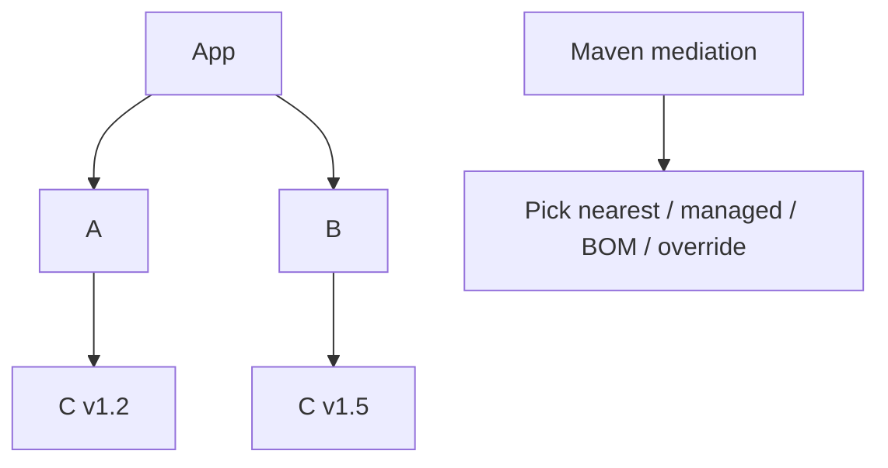
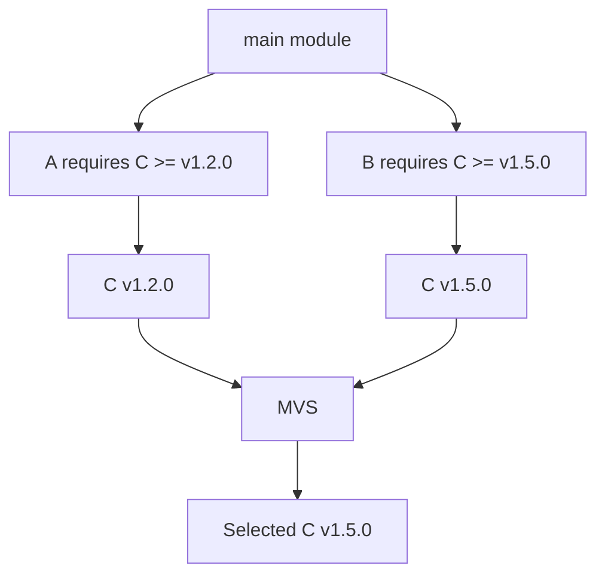
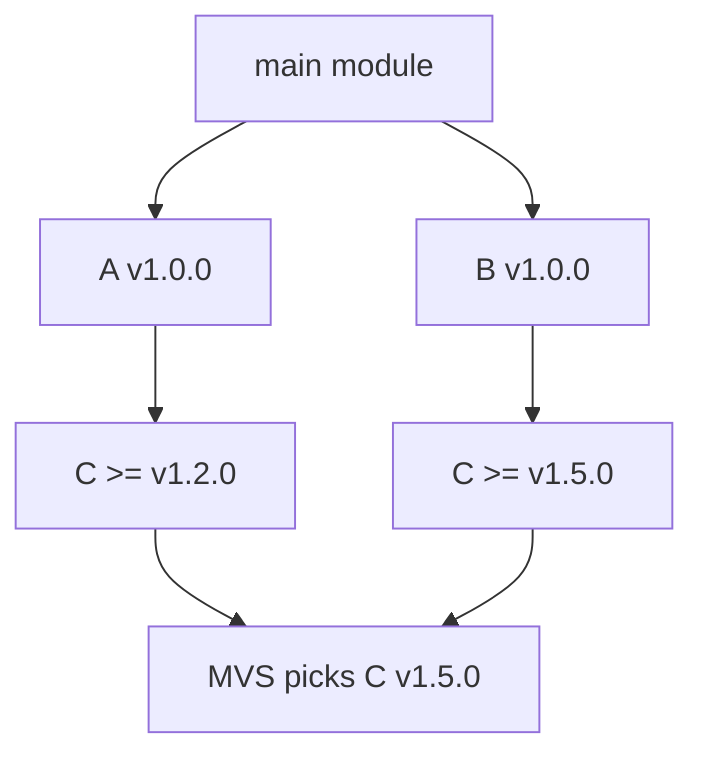
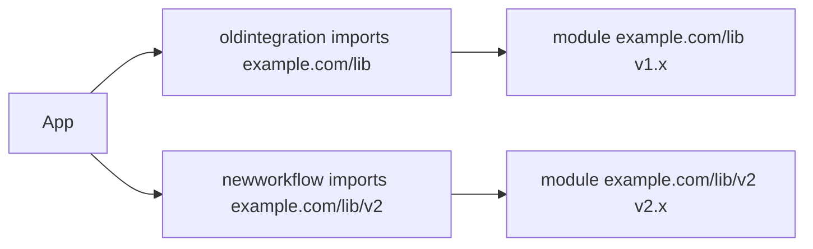
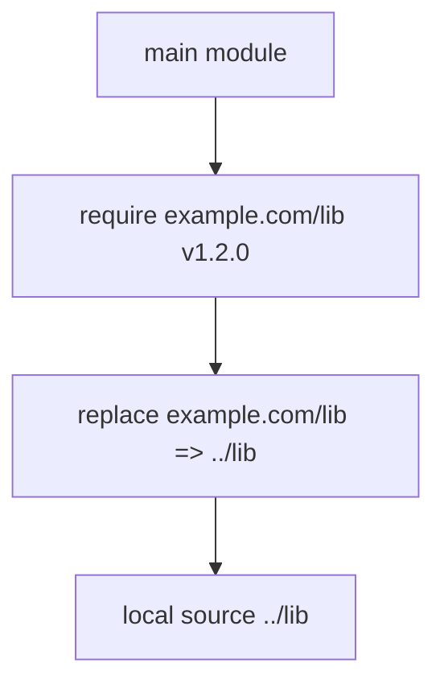
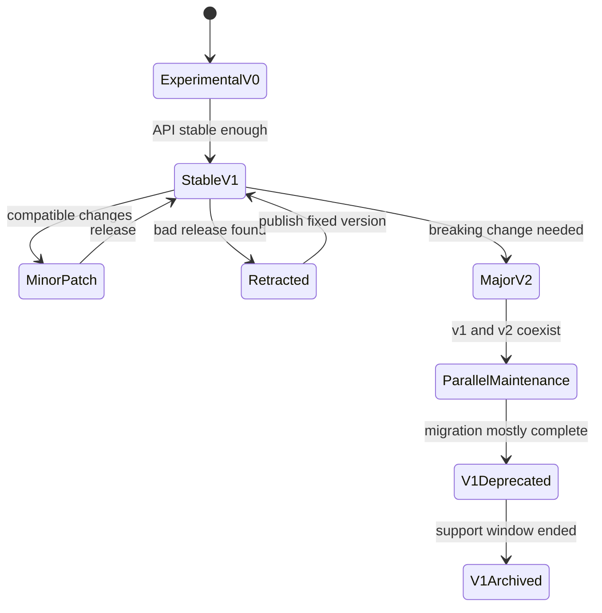
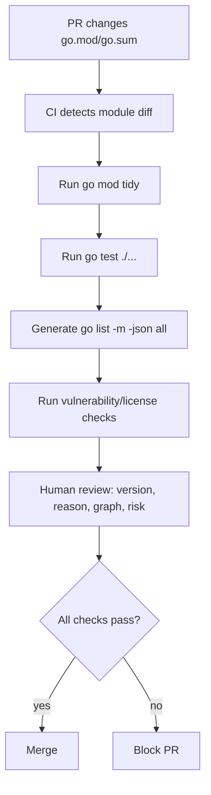

# learn-go-composition-oop-functional-reflection-codegen-modules-part-025.md

# Part 025 — Go Module Fundamentals: `go.mod`, `go.sum`, MVS, Semantic Import Versioning, `replace`, `exclude`, dan `retract`

> Seri: **learn-go-composition-oop-functional-reflection-codegen-modules**  
> Bagian: **025 dari 030**  
> Level: **Advanced / internal engineering handbook**  
> Target pembaca: **Java software engineer / tech lead yang ingin memahami Go module system secara production-grade**  
> Fokus: **dependency resolution, module graph, versioning, compatibility, reproducibility, dan governance dasar sebelum masuk enterprise supply chain**

---

## 0. Posisi part ini dalam seri

Sampai part sebelumnya, kita sudah membahas:

- composition, embedding, interface, structural typing
- functional API design
- reflection
- code generation
- package design

Sekarang kita naik satu level dari **package boundary** ke **module boundary**.

Di Go, package adalah unit kompilasi dan namespace import.  
Module adalah unit **versioning, dependency management, distribution, dan compatibility**.

Kalau package menjawab:

> “Kode ini dikelompokkan sebagai apa?”

Maka module menjawab:

> “Kode ini dirilis, diambil, diverifikasi, dan dikompatibelkan sebagai apa?”

Untuk engineer Java, Go module sering terasa sederhana karena tidak punya kompleksitas Maven/Gradle seperti:

- transitive dependency mediation yang rumit
- parent POM inheritance
- BOM import
- classifier
- scope dependency seperti `compile`, `provided`, `runtime`, `test`
- plugin lifecycle kompleks
- repository manager convention yang berat

Tetapi kesederhanaan Go module bukan berarti dangkal. Ia punya model yang sangat spesifik:

- **module path adalah identity**
- **package import path berasal dari module path + package subdirectory**
- **version selection memakai Minimal Version Selection / MVS**
- **major version mulai v2 harus masuk ke module path**
- **`go.sum` bukan lockfile biasa**
- **`replace` bukan dependency override universal untuk downstream consumer**
- **`retract` memberi sinyal versi bermasalah**
- **module compatibility adalah bagian dari public API design**

Part ini membangun fondasi sebelum part 026 yang akan membahas governance modern seperti:

- `go` directive
- `toolchain`
- `godebug`
- workspace
- vendoring
- modern module maintenance

---

## 1. Problem besar yang diselesaikan Go modules

Sebelum modules, ekosistem Go sangat bergantung pada GOPATH dan dependency source checkout. Ini membuat build sulit direproduksi karena dependency sering diambil dari branch/head tertentu, bukan versi eksplisit.

Go modules menyelesaikan lima masalah utama.

### 1.1 Identity

Sebuah dependency harus punya identity yang stabil.

Di Go:

```go
module example.com/platform/authz
```

Module path ini bukan sekadar nama. Ia adalah identitas distribusi dan basis import path.

Package di dalamnya menjadi:

```go
import "example.com/platform/authz/policy"
import "example.com/platform/authz/decision"
```

### 1.2 Versioning

Dependency harus punya versi eksplisit:

```go
require github.com/google/uuid v1.6.0
```

Versi Go module mengikuti semantic version format seperti:

```text
vMAJOR.MINOR.PATCH
```

Contoh:

```text
v1.2.3
v2.0.0
v0.9.1
```

### 1.3 Transitive dependency resolution

Jika module A butuh B v1.2.0 dan module C butuh B v1.5.0, build harus memilih versi B yang konsisten.

Go memilih versi minimum yang memenuhi requirement tertinggi di module graph. Model ini disebut **Minimal Version Selection**.

### 1.4 Reproducibility

Build harus bisa diverifikasi. Go menyimpan checksum dependency dalam `go.sum`.

`go.sum` tidak sama dengan `package-lock.json` atau `pom.lock`. Ia adalah database checksum untuk module content yang pernah dibutuhkan oleh module graph.

### 1.5 Compatibility

Jika sebuah module membuat breaking change, Go tidak ingin dependency graph diam-diam mengganti API lama dengan API baru yang incompatible.

Solusinya adalah **Semantic Import Versioning**:

```go
// v1
import "example.com/lib"

// v2
import "example.com/lib/v2"
```

Dengan begitu, v1 dan v2 adalah import path berbeda dan bisa hidup berdampingan.

---

## 2. Mental model utama: module graph, bukan dependency tree mutable

Engineer Java sering membawa mental model seperti ini:



Go lebih baik dipahami sebagai **module requirement graph**.



Key insight:

> Dalam Go, `require C v1.2.0` berarti “minimum C version yang dibutuhkan”, bukan “tepat C v1.2.0 harus dipakai”.

Ini berbeda dari lockfile mental model.

---

## 3. File `go.mod`

`go.mod` adalah manifest module.

Contoh minimal:

```go
module example.com/regsys/caseplatform

go 1.25.0
```

Contoh lebih realistis:

```go
module example.com/regsys/caseplatform

go 1.25.0

require (
    github.com/google/uuid v1.6.0
    golang.org/x/sync v0.12.0
)

require (
    github.com/klauspost/compress v1.18.0 // indirect
)
```

`go.mod` biasanya berisi:

- `module`
- `go`
- `require`
- `replace`
- `exclude`
- `retract`
- `toolchain`
- `godebug`
- `ignore` pada Go modern
- directive lain yang relevan tergantung versi Go

Part ini fokus pada dasar: `module`, `require`, `replace`, `exclude`, `retract`.

---

## 4. Directive `module`

Directive `module` menentukan module path.

```go
module example.com/team/project
```

Module path menjadi prefix import path.

Jika module punya package:

```text
example.com/team/project
├── go.mod
├── policy/
│   └── policy.go
└── decision/
    └── decision.go
```

Maka import path-nya:

```go
import "example.com/team/project/policy"
import "example.com/team/project/decision"
```

### 4.1 Module path adalah API

Jangan anggap module path sebagai detail repo saja.

Module path muncul di:

- source code consumer
- generated code
- documentation
- import graph
- build cache
- vulnerability scanner
- proxy cache
- sum database
- package identity

Mengubah module path adalah breaking change besar.

### 4.2 Module path bukan harus GitHub

Contoh valid:

```go
module company.internal/regsys/caseplatform
module git.example.com/platform/audit
module example.com/lib/authz
```

Go module path sering terlihat seperti URL tanpa scheme, tetapi secara konseptual ia adalah identifier yang bisa dipetakan ke VCS/proxy.

### 4.3 Production recommendation

Untuk enterprise:

```go
module git.company.com/regsys/caseplatform
```

atau:

```go
module go.company.com/regsys/caseplatform
```

`go.company.com` bisa menjadi vanity import domain yang stabil, sementara repository fisik bisa pindah dari GitHub Enterprise ke GitLab atau internal forge tanpa mengubah import path.

---

## 5. Directive `go`

Contoh:

```go
go 1.25.0
```

Directive `go` bukan hanya catatan dokumentasi. Ia mempengaruhi beberapa perilaku toolchain dan compatibility semantics.

Pada Go modern, `go mod init` di Go 1.26 membuat `go.mod` dengan default `go 1.25.0`, bukan `go 1.26.0`, agar module baru lebih kompatibel dengan supported release sebelumnya.

Mental model:

> `go` directive menyatakan bahasa dan module behavior baseline yang ditargetkan module, bukan otomatis berarti seluruh developer memakai binary Go dengan versi itu.

Detail modern seperti `toolchain` dan `godebug` akan dibahas di part 026.

---

## 6. Directive `require`

`require` menyatakan module dependency dan minimum version.

```go
require github.com/google/uuid v1.6.0
```

Untuk beberapa dependency:

```go
require (
    github.com/google/uuid v1.6.0
    golang.org/x/sync v0.12.0
)
```

### 6.1 Direct vs indirect

Contoh:

```go
require github.com/klauspost/compress v1.18.0 // indirect
```

`// indirect` berarti module tersebut tidak di-import langsung oleh package dalam main module, tetapi dibutuhkan oleh dependency graph.

Namun jangan salah paham:

> `// indirect` bukan scope seperti Maven `runtime` atau `test`.

Itu hanya annotation yang dikelola oleh `go mod tidy`.

### 6.2 Require bukan exact pin

Jika `go.mod` berisi:

```go
require example.com/lib v1.2.0
```

Artinya:

> module ini butuh minimal `example.com/lib` versi `v1.2.0`.

Jika dependency lain membutuhkan `example.com/lib v1.5.0`, maka build memakai `v1.5.0`.

### 6.3 Tidak ada dependency scope seperti Maven

Go tidak punya:

```xml
<scope>provided</scope>
<scope>runtime</scope>
<scope>test</scope>
```

Go menentukan dependency berdasarkan import graph dan build constraints.

Test dependency muncul karena package test meng-import dependency tersebut.

Contoh:

```go
// handler_test.go
import "github.com/stretchr/testify/require"
```

Jika hanya test yang memakai `testify`, dependency itu tetap masuk module graph karena diperlukan untuk menjalankan test.

### 6.4 Production implication

Jangan berharap bisa menyembunyikan dependency test dengan scope. Yang bisa dilakukan:

- pisahkan package test dengan build tag jika perlu
- hindari test framework berat jika tidak perlu
- jaga `go mod tidy` bersih
- audit dependency graph secara rutin

---

## 7. File `go.sum`

`go.sum` berisi cryptographic checksum untuk module versions dan `go.mod` dependency yang pernah dibutuhkan.

Contoh bentuknya:

```text
github.com/google/uuid v1.6.0 h1:...
github.com/google/uuid v1.6.0/go.mod h1:...
```

### 7.1 `go.sum` bukan lockfile tradisional

Lockfile biasanya menentukan exact resolved versions.

`go.sum` tidak bekerja seperti itu. Versi yang dipakai tetap ditentukan dari:

- `go.mod`
- module graph
- MVS
- build tags / package patterns yang sedang dibangun
- replacement/exclusion relevant

`go.sum` menyimpan checksum untuk verifikasi.

### 7.2 Kenapa ada checksum untuk `/go.mod`

Go perlu memverifikasi metadata module graph tanpa selalu mengunduh seluruh source module.

Checksum `vX.Y.Z/go.mod` memverifikasi file `go.mod` module dependency.

### 7.3 Haruskah `go.sum` di-commit?

Ya.

Untuk aplikasi dan library, umumnya `go.sum` harus di-commit.

Alasannya:

- mempercepat verifikasi
- mencegah supply-chain tampering
- membuat build lebih reproducible
- memudahkan CI bekerja konsisten

### 7.4 Kenapa `go.sum` bisa berisi dependency yang tidak terlihat dipakai?

Karena `go.sum` mencatat checksum module yang pernah relevan untuk module graph, termasuk transitive dependency atau module metadata.

Jangan hapus manual kecuali paham. Jalankan:

```bash
go mod tidy
```

---

## 8. Minimal Version Selection / MVS

MVS adalah jantung Go module resolution.

Aturan sederhananya:

> Untuk setiap module path, pilih versi tertinggi yang disebutkan sebagai minimum requirement dalam module graph.

Contoh:

```text
Main requires A v1.0.0
Main requires B v1.0.0
A requires C v1.2.0
B requires C v1.5.0
```

Go memilih:

```text
C v1.5.0
```

Karena `v1.5.0` adalah requirement minimum tertinggi.

### 8.1 Diagram MVS



### 8.2 MVS bukan SAT solver

Banyak package manager menyelesaikan constraint seperti:

```text
C >= 1.2, < 2.0
C >= 1.5, < 1.6
```

Lalu solver mencari versi yang memenuhi semua constraints.

Go tidak memakai model itu untuk module versions. Go mengandalkan compatibility rule:

> Versi baru dalam major version yang sama harus backward compatible.

Karena itu, memilih versi minimum tertinggi dianggap aman.

### 8.3 Trade-off MVS

| Aspek | Konsekuensi |
|---|---|
| Sederhana | Mudah dipahami dan deterministic |
| Cepat | Tidak perlu dependency solver kompleks |
| Stable | Upgrade tidak terjadi kecuali dibutuhkan |
| Bergantung compatibility | Jika library melanggar backward compatibility dalam v1, consumer bisa rusak |
| Tidak ekspresif | Tidak ada range constraint kompleks |
| Operationally clear | Masalah dependency biasanya lebih mudah dilacak |

### 8.4 MVS dalam bahasa Java engineer

Di Maven, dependency mediation bisa dipengaruhi oleh:

- nearest definition
- dependency management
- BOM
- parent POM
- plugin/lifecycle
- exclusions

Di Go, pertanyaannya lebih sederhana:

> Versi minimum tertinggi apa yang disebutkan dalam module graph?

Itu membuat hasilnya lebih predictable, tetapi juga mengandalkan discipline ecosystem.

---

## 9. Semantic Import Versioning

Semantic Import Versioning adalah aturan bahwa major version incompatible harus punya import path berbeda.

Untuk v0 dan v1:

```go
module example.com/lib
```

Untuk v2:

```go
module example.com/lib/v2
```

Consumer import:

```go
import "example.com/lib/v2"
```

### 9.1 Kenapa major version masuk import path?

Karena v1 dan v2 mungkin punya API incompatible.

Dengan path berbeda, keduanya bisa dipakai bersamaan:

```go
import (
    libv1 "example.com/lib"
    libv2 "example.com/lib/v2"
)
```

Ini penting dalam large systems. Misalnya:

```text
App
├── package oldintegration uses lib v1
└── package newworkflow uses lib v2
```

Go bisa membangun keduanya karena import path berbeda.

### 9.2 Diagram semantic import versioning



### 9.3 Breaking change rule

Jika module sudah v1 atau lebih tinggi, breaking change harus dilakukan dengan major version baru.

Contoh:

```text
v1.4.2 -> v1.5.0
```

harus backward compatible.

Jika tidak compatible:

```text
v2.0.0
```

dan module path harus berubah:

```go
module example.com/lib/v2
```

### 9.4 v0 special case

`v0.x.y` berarti belum stabil. Breaking change boleh terjadi lebih sering.

Namun dalam enterprise internal platform, jangan menjadikan v0 sebagai alasan untuk chaos.

Rekomendasi:

- gunakan v0 hanya untuk module yang belum punya external consumer stabil
- tulis compatibility expectation di README
- beri migration notes walau masih v0
- jangan terlalu lama menggantung platform critical module di v0

---

## 10. Pseudo-version

Go bisa mereferensikan commit yang belum punya tag release dengan pseudo-version.

Contoh bentuk umum:

```text
v0.0.0-yyyymmddhhmmss-abcdefabcdef
v1.2.4-0.yyyymmddhhmmss-abcdefabcdef
v2.0.1-0.yyyymmddhhmmss-abcdefabcdef
```

Pseudo-version berguna untuk:

- testing commit tertentu
- temporary integration sebelum release tag
- private module development

Namun pseudo-version buruk untuk long-term dependency governance.

### 10.1 Production recommendation

Pseudo-version boleh untuk:

- short-lived branch testing
- incident patch validation
- pre-release integration

Hindari untuk:

- long-lived production dependency
- platform library release
- security-critical dependency tanpa tag

CI policy yang sehat:

```text
No pseudo-version in main branch unless explicitly approved with expiry date.
```

---

## 11. Directive `replace`

`replace` mengganti module path/version dengan path/version lain.

Contoh local replacement:

```go
replace example.com/platform/authz => ../authz
```

Contoh replacement ke fork:

```go
replace github.com/vendor/lib v1.2.3 => github.com/company/lib v1.2.3-patch.1
```

Contoh replace version:

```go
replace example.com/lib v1.2.0 => example.com/lib v1.2.1
```

### 11.1 Replace hanya berlaku di main module

Ini sangat penting.

Jika library Anda punya `replace` di `go.mod`, replacement itu tidak otomatis berlaku saat library Anda dipakai sebagai dependency oleh module lain.

Mental model:

> `replace` adalah instruksi build untuk main module, bukan deklarasi transitive policy untuk semua consumer.

### 11.2 Good use cases

#### Local development

```go
replace example.com/platform/authz => ../authz
```

Dipakai saat mengembangkan dua module berdampingan.

#### Temporary fork

```go
replace github.com/upstream/lib => github.com/company/lib v1.2.3-company.1
```

Dipakai saat menunggu upstream merge.

#### Emergency security patch

```go
replace example.com/vulnerable/lib => example.com/company/lib v1.4.9-security.1
```

Bisa diterima jika ada governance jelas.

### 11.3 Bad use cases

#### Permanent fork diam-diam

```go
replace github.com/upstream/lib => github.com/random/fork v1.0.0
```

Tanpa dokumentasi dan ownership jelas, ini supply-chain risk.

#### Menggunakan replace untuk menyembunyikan module architecture buruk

Jika terus-menerus butuh local replace antar module internal, mungkin repository/module boundary salah.

#### Mengandalkan replace di library published

Consumer tidak akan otomatis mendapat replace Anda.

### 11.4 Replace dan reproducibility

`replace` ke local path membuat build tidak portable:

```go
replace example.com/lib => ../lib
```

CI yang tidak punya path `../lib` akan gagal.

Untuk main branch, biasanya jangan commit local path replace kecuali:

- monorepo dengan layout stabil
- CI memahami layout itu
- policy repository mengizinkan
- workspace tidak lebih cocok

### 11.5 Diagram replace



---

## 12. Directive `exclude`

`exclude` mencegah module version tertentu dipakai.

Contoh:

```go
exclude example.com/lib v1.2.3
```

Jika MVS memilih `v1.2.3`, Go harus memilih versi lain yang tersedia dan memenuhi graph.

### 12.1 Kapan memakai exclude?

Gunakan saat versi tertentu:

- corrupt
- salah tag
- punya regression kritikal
- tidak bisa build
- punya issue security sementara belum ada retract

### 12.2 Exclude bukan global ban

Seperti `replace`, `exclude` hanya berlaku di main module.

Jika Anda publish library dengan `exclude`, consumer Anda tidak otomatis mewarisi policy itu.

### 12.3 Production recommendation

Jika harus memakai `exclude`, dokumentasikan:

```go
exclude example.com/lib v1.2.3 // broken release: panic in validator; remove after v1.2.4 adoption
```

Tetapi komentar di `go.mod` harus dipakai hati-hati dan tetap dijaga rapi.

Lebih baik juga catat di:

- ADR
- dependency exception registry
- security ticket
- release notes

---

## 13. Directive `retract`

`retract` dipakai oleh module author untuk memberi tahu bahwa versi tertentu tidak seharusnya digunakan.

Contoh dalam `go.mod` milik module yang menerbitkan versi:

```go
retract v1.2.3
```

Dengan alasan:

```go
retract v1.2.3 // accidentally published with broken authorization check
```

Range:

```go
retract [v1.2.0, v1.2.5]
```

### 13.1 Retract berbeda dari delete tag

Jangan menghapus tag release sembarangan. Go module proxy dan checksum database bisa sudah menyimpan versi tersebut.

Retract memberi sinyal resmi:

> Versi ini ada, tetapi tidak direkomendasikan untuk dipakai.

### 13.2 Kapan module author harus retract?

Gunakan retract jika:

- versi tidak sengaja dipublish
- ada vulnerability serius
- ada regression fatal
- module path/tag salah
- release mengandung generated file salah
- API incompatibility tidak sengaja terjadi di minor/patch release

### 13.3 Consumer behavior

Tool Go dapat memberi warning saat versi retracted dipilih atau dilihat.

Tetapi retract bukan magic forced upgrade. Consumer tetap perlu melakukan dependency maintenance.

### 13.4 Production policy

Untuk internal platform module:

- setiap retract harus punya reason
- reason harus masuk release note
- harus ada recommended replacement version
- vulnerability-related retract harus terhubung ke security advisory/ticket
- jangan retract hanya karena “versi lama”

---

## 14. `go mod tidy`

`go mod tidy` menyesuaikan `go.mod` dan `go.sum` dengan import graph.

Ia akan:

- menambahkan missing module requirement
- menghapus requirement yang tidak lagi dibutuhkan
- mengupdate checksum yang relevan
- menandai indirect dependency sesuai kebutuhan

Command:

```bash
go mod tidy
```

### 14.1 Kapan menjalankan tidy?

Minimal:

- setelah menambah import baru
- setelah menghapus dependency
- sebelum commit
- sebelum release
- dalam CI verification

CI check umum:

```bash
go mod tidy
git diff --exit-code go.mod go.sum
```

### 14.2 Jangan jadikan tidy sebagai ritual buta

Jika `go mod tidy` mengubah banyak hal, review dengan serius:

- dependency baru dari mana?
- kenapa indirect berubah?
- ada major version baru?
- ada pseudo-version?
- ada module path tidak dikenal?
- ada private module bocor?
- ada replace lokal masuk commit?

---

## 15. `go get`

Pada Go modern, `go get` dipakai untuk mengubah dependency module, bukan install binary command.

Contoh upgrade:

```bash
go get example.com/lib@v1.4.0
```

Upgrade patch/minor:

```bash
go get -u=patch ./...
```

Mengambil latest:

```bash
go get example.com/lib@latest
```

Downgrade:

```bash
go get example.com/lib@v1.2.0
```

Remove dependency biasanya cukup hapus import lalu:

```bash
go mod tidy
```

### 15.1 Jangan asal `@latest`

Dalam production system, `@latest` tanpa review bisa berbahaya.

Checklist sebelum upgrade:

- changelog dibaca
- breaking change dicek
- vulnerability status dicek
- test suite jalan
- generated code diregenerate bila perlu
- compatibility dengan Go version dicek
- transitive dependency diff dicek

---

## 16. `go list -m`

`go list -m` adalah alat inspeksi module.

List semua module:

```bash
go list -m all
```

JSON:

```bash
go list -m -json all
```

Melihat versi tersedia:

```bash
go list -m -versions example.com/lib
```

Melihat update:

```bash
go list -m -u all
```

### 16.1 Production usage

Buat dependency audit script:

```bash
go list -m -json all > build/module-graph.json
```

Gunakan untuk:

- SBOM
- vulnerability scan
- license scan
- dependency ownership review
- upgrade planning

---

## 17. Module graph command

Go menyediakan command untuk melihat module graph:

```bash
go mod graph
```

Output bentuknya edge:

```text
mainmodule depmodule@version
depmodule@version transitive@version
```

Contoh:

```bash
go mod graph | grep example.com/lib
```

### 17.1 Kenapa penting?

Saat dependency aneh muncul di `go.sum`, jangan menebak. Lihat graph.

Useful question:

> “Dependency ini masuk dari path mana?”

Di Go, Anda bisa tracing:

```bash
go mod why -m example.com/lib
```

Atau untuk package:

```bash
go mod why example.com/lib/subpkg
```

---

## 18. `go mod why`

`go mod why` menjawab kenapa package/module dibutuhkan.

Contoh:

```bash
go mod why -m github.com/klauspost/compress
```

Output bisa menunjukkan chain dari main module ke dependency.

Jika output menyatakan tidak dibutuhkan tetapi masih ada di `go.sum`, mungkin checksum tersisa dari graph sebelumnya atau metadata.

Jalankan:

```bash
go mod tidy
```

---

## 19. Module path, package path, import path

Ini sering membingungkan.

Misalnya:

```text
module example.com/regsys/caseplatform
```

Struktur:

```text
caseplatform/
├── go.mod
├── cmd/api/main.go
├── internal/caseapp/service.go
└── pkg/audit/audit.go
```

Import path:

```go
import "example.com/regsys/caseplatform/internal/caseapp"
import "example.com/regsys/caseplatform/pkg/audit"
```

Tetapi package name di file bisa:

```go
package caseapp
```

atau:

```go
package audit
```

### 19.1 Import path tidak harus sama dengan package name terakhir

Walau idiomatisnya package name cocok dengan last path element, Go tidak mewajibkan selalu.

Namun untuk readability:

```go
import "example.com/regsys/caseplatform/pkg/audit"
```

sebaiknya:

```go
package audit
```

Bukan:

```go
package auditlib
```

kecuali ada alasan kuat.

---

## 20. Public library vs application module

Desain module berbeda untuk library dan application.

### 20.1 Application module

Application module biasanya:

- punya satu atau lebih command di `/cmd`
- dependency graph dikontrol penuh oleh team aplikasi
- boleh memakai `replace` temporary jika policy mengizinkan
- release bukan terutama untuk di-import oleh consumer
- compatibility external package mungkin tidak terlalu kritis

Contoh:

```text
example.com/regsys/caseplatform
```

### 20.2 Library module

Library module:

- di-import oleh module lain
- public API harus dijaga
- `replace` tidak boleh diandalkan downstream
- semantic versioning jauh lebih penting
- breaking change harus lewat major version baru
- release notes wajib lebih disiplin

Contoh:

```text
example.com/platform/authz
example.com/platform/audit
example.com/platform/workflow
```

### 20.3 Platform module

Platform module internal sering berada di tengah:

- tidak public internet
- tetapi punya banyak consumer internal
- compatibility tetap penting
- release governance harus serius
- vulnerability dan supply chain tetap relevan

---

## 21. Multi-module repository

Satu repository bisa punya beberapa `go.mod`.

Contoh:

```text
repo/
├── authz/
│   ├── go.mod
│   └── ...
├── audit/
│   ├── go.mod
│   └── ...
└── caseplatform/
    ├── go.mod
    └── ...
```

Ini disebut multi-module repo.

### 21.1 Kapan multi-module masuk akal?

Masuk akal jika:

- release cadence berbeda
- ownership berbeda
- consumer berbeda
- dependency graph perlu dipisah
- module ingin dipakai mandiri
- compatibility contract berbeda

### 21.2 Kapan multi-module buruk?

Buruk jika:

- hanya untuk “rapi-rapi folder”
- semua module selalu release bersama
- banyak local replace permanen
- import antar module sangat saling silang
- CI menjadi rumit tanpa benefit
- breaking change antar module terjadi terus

### 21.3 Rule of thumb

> Jangan membuat module boundary jika Anda belum siap mengelola version boundary.

Package boundary murah.  
Module boundary mahal.

---

## 22. Major version layout

Untuk v2+, ada beberapa pendekatan layout.

### 22.1 Subdirectory `/v2`

```text
repo/
├── go.mod          // module example.com/lib
└── v2/
    ├── go.mod      // module example.com/lib/v2
    └── ...
```

### 22.2 Major branch

Branch `v2` dengan module path:

```go
module example.com/lib/v2
```

### 22.3 Which one?

Subdirectory lebih mudah jika ingin maintain v1 dan v2 dalam satu branch.

Major branch bisa lebih bersih jika codebase divergen besar.

Production decision bergantung pada:

- release tooling
- CI
- consumer migration period
- amount of shared code
- security maintenance need
- repository governance

---

## 23. Module compatibility as architecture

Module versioning bukan urusan build engineer saja.

Ia mempengaruhi:

- API shape
- package export
- interface evolution
- generated code stability
- reflection tag stability
- error code compatibility
- config compatibility
- migration path
- deployment coordination

Contoh:

```go
type Decision struct {
    Allowed bool
    Reason  string
}
```

Jika library platform mengubah:

```go
type Decision struct {
    Effect Effect
    Reasons []Reason
}
```

Itu breaking change untuk consumer.

Dalam v1, Anda harus:

- menambah field secara backward compatible jika memungkinkan
- menyediakan adapter
- deprecate field lama
- menunda breaking removal ke v2

---

## 24. Compatibility surface di Go module

Public API bukan hanya exported function.

Termasuk:

- exported type
- exported method
- exported field
- interface method set
- generic constraint
- struct tag expectation
- generated file contract
- error sentinel/type
- behavior documented
- panic behavior documented
- concurrency safety documented
- nil handling documented
- module path
- package path
- build tags
- config file schema
- environment variable expectation

### 24.1 Interface evolution is dangerous

Menambah method ke exported interface adalah breaking change.

```go
type Store interface {
    Get(ctx context.Context, key string) ([]byte, error)
}
```

Jika di v1.1 Anda menambah:

```go
type Store interface {
    Get(ctx context.Context, key string) ([]byte, error)
    Put(ctx context.Context, key string, val []byte) error
}
```

Semua implementer downstream rusak.

Lebih aman:

```go
type Reader interface {
    Get(ctx context.Context, key string) ([]byte, error)
}

type Writer interface {
    Put(ctx context.Context, key string, val []byte) error
}

type Store interface {
    Reader
    Writer
}
```

Atau tambah interface baru:

```go
type StoreV2 interface {
    Store
    Put(ctx context.Context, key string, val []byte) error
}
```

Tetapi `StoreV2` sebagai nama permanen juga bisa buruk; lebih baik nama behavior-based.

---

## 25. `replace` vs workspace

Untuk local multi-module development, dulu banyak orang memakai `replace`.

Contoh:

```go
replace example.com/platform/authz => ../authz
replace example.com/platform/audit => ../audit
```

Pada Go modern, workspace (`go.work`) sering lebih cocok untuk development lokal multi-module.

Part 026 akan membahas workspace detail.

Untuk sekarang, pahami:

- `replace` berada di `go.mod`
- workspace berada di `go.work`
- `replace` bisa ikut ter-commit
- workspace sering local/dev-level

Recommendation:

```text
Use go.work for local multi-module development.
Use replace for explicit, reviewed, module-level override.
```

---

## 26. Enterprise examples

### 26.1 Regulatory case platform application

```go
module git.company.com/regsys/caseplatform

go 1.25.0

require (
    git.company.com/platform/authz v1.8.2
    git.company.com/platform/audit v1.4.1
    git.company.com/platform/workflow v0.9.7
    github.com/google/uuid v1.6.0
)
```

Architecture meaning:

- `caseplatform` is application module
- `authz` and `audit` are platform modules
- `workflow` still v0, so breaking changes may occur
- dependency governance must track internal platform versions

### 26.2 Temporary authz fork during incident

```go
replace git.company.com/platform/authz v1.8.2 => git.company.com/security/authz v1.8.2-hotfix.1
```

Policy required:

- incident ticket
- expiry date
- owner
- upstream merge plan
- CI check to prevent stale replace

### 26.3 Bad module split

```text
case-domain/
case-service/
case-repository/
case-handler/
case-validation/
case-audit/
```

Each with separate `go.mod`.

This often mirrors Java Maven module habits, but in Go it may create unnecessary versioning friction.

Better:

```text
caseplatform/
├── go.mod
├── internal/case/domain
├── internal/case/service
├── internal/case/repository
├── internal/case/handler
└── internal/case/validation
```

Use packages first. Promote to separate module only if there is real independent release/consumer need.

---

## 27. Dependency upgrade workflow

A mature Go upgrade flow:

```mermaid
flowchart TD
    Start["Need dependency upgrade"]
    Inspect["Inspect current module graph"]
    Read["Read changelog/release notes"]
    Change["go get module@version"]
    Tidy["go mod tidy"]
    Test["Run unit/integration tests"]
    Gen["Regenerate generated code if affected"]
    Scan["Run vuln/license scan"]
    Diff["Review go.mod/go.sum diff"]
    Release["Merge with notes"]
```



Concrete commands:

```bash
go list -m -u all
go get example.com/lib@v1.4.2
go mod tidy
go test ./...
go list -m all
git diff -- go.mod go.sum
```

### 27.1 Upgrade review checklist

Ask:

- Is this direct or transitive dependency?
- Why do we need the upgrade?
- Is it security, bugfix, feature, compatibility, or cleanup?
- Is there a major version change?
- Any pseudo-version?
- Any retracted version?
- Any unexpected new dependency?
- Any license change?
- Any generated code affected?
- Any public API affected?
- Any runtime behavior affected?
- Any config/env behavior affected?
- Any known Go version requirement change?

---

## 28. Dependency downgrade workflow

Downgrade is sometimes needed after regression.

```bash
go get example.com/lib@v1.3.9
go mod tidy
go test ./...
```

But downgrade can fail if another dependency requires a higher minimum version.

Example:

```text
Main wants C v1.3.9
A requires C v1.5.0
```

MVS still selects `v1.5.0`.

You must inspect:

```bash
go mod graph
go mod why -m example.com/c
```

Then decide:

- downgrade A
- replace C
- patch application
- wait for upstream fix
- fork temporarily

---

## 29. Dependency removal workflow

Steps:

1. Remove imports.
2. Remove code usage.
3. Run tests.
4. Run tidy.
5. Inspect diff.

```bash
go mod tidy
git diff -- go.mod go.sum
```

If dependency remains, use:

```bash
go mod why -m example.com/removed
go mod graph | grep example.com/removed
```

It may still be transitive.

---

## 30. Module and generated code

Generated code can affect module graph.

Example:

```go
// generated_client.go
import "google.golang.org/grpc"
import "google.golang.org/protobuf/proto"
```

If generator emits imports, `go mod tidy` will add dependencies.

Production rule:

> Generator changes must be reviewed as dependency changes too.

Checklist:

- generated imports deterministic?
- generator version pinned?
- generated dependency versions understood?
- no unexpected transitive dependency explosion?
- generated code not importing internal-only module accidentally?
- generated path compatible with module path?

---

## 31. Module and reflection-heavy libraries

Reflection libraries often bring dependencies for:

- tag parsing
- validation
- serialization
- schema generation
- mapping
- ORM-like behavior

Before adding one, ask:

- is reflection needed?
- can generics solve it?
- can codegen solve it?
- is dependency stable?
- how large is transitive graph?
- does it use `unsafe`?
- does it change behavior based on tags?
- does it support Go version used by module?
- does it expose compatibility risks?

Module governance connects directly to design choices from parts 015–023.

---

## 32. Common pitfalls

### 32.1 Treating `go.sum` as lockfile

Wrong mental model:

> “If `go.sum` has version X, build is locked to X.”

Correct:

> `go.sum` verifies module content; selected versions come from module graph and MVS.

### 32.2 Committing local replace accidentally

Bad:

```go
replace example.com/platform/authz => ../../my-local-authz
```

CI fails or worse: another developer resolves different local path.

### 32.3 Creating too many modules

Coming from Maven, engineers often over-split.

In Go:

> package boundary first, module boundary only when version/release boundary is real.

### 32.4 Ignoring semantic import versioning

Bad v2 module:

```go
module example.com/lib
```

with tag:

```text
v2.0.0
```

For proper module semantics, v2+ should use:

```go
module example.com/lib/v2
```

### 32.5 Assuming `replace` propagates

Library author:

```go
replace broken.com/lib => fixed.com/lib v1.2.3
```

Consumer will not automatically use this replacement.

### 32.6 Upgrading transitive dependency blindly

`go get -u ./...` can move many dependencies. In production, review the graph.

### 32.7 Publishing v1 too early

Once v1 is published, compatibility promise becomes serious. If API is still volatile, stay v0 but communicate clearly.

### 32.8 Staying v0 forever

If many critical services depend on module, “still v0” becomes governance debt.

---

## 33. Java comparison table

| Java Maven/Gradle | Go modules |
|---|---|
| groupId/artifactId | module path |
| package namespace | package import path |
| dependencyManagement/BOM | no direct equivalent |
| nearest-wins mediation | MVS |
| version ranges | avoided in normal module model |
| dependency scopes | no direct equivalent |
| parent POM inheritance | no equivalent |
| multi-module build | multi-module repo or workspace, but not same mental model |
| lockfile plugins | `go.sum` is checksum database, not traditional lockfile |
| major version artifact rename sometimes | semantic import versioning requires `/vN` path |
| local Maven repository | module cache |
| repository manager | GOPROXY/private proxy |
| checksum verification optional-ish depending setup | checksum database/module verification central to model |

---

## 34. Design heuristics for top-tier Go engineers

### 34.1 Think in contracts

Before adding dependency, ask:

> What contract am I importing into this module?

Not just API contract, but:

- release contract
- compatibility contract
- security contract
- operational contract
- maintenance contract

### 34.2 Keep module graph boring

A boring module graph is good.

Healthy signs:

- few direct dependencies
- no unexplained pseudo-version
- no stale local replace
- no abandoned module
- no unnecessary major version mix
- tidy diff small and understandable
- upgrade path documented

### 34.3 Avoid dependency convenience traps

In Java, pulling a framework dependency may be normal. In Go, dependency weight matters more culturally and operationally.

Ask:

- Can standard library solve it?
- Can a small internal package solve it?
- Is the dependency worth transitive risk?
- Is the API stable?
- Is it maintained?
- Does it use reflection/unsafe heavily?
- Does it hide behavior that should be explicit?

### 34.4 Module boundary should reflect release boundary

If two pieces must always change together, they likely belong in same module.

If two pieces have different consumers and release cadence, module split may be justified.

### 34.5 Do not publish accidental API

Once a module is consumed, exported names become compatibility surface.

Use `internal` packages aggressively for implementation.

---

## 35. Production checklist

### 35.1 Before adding dependency

- [ ] Is dependency necessary?
- [ ] Is standard library enough?
- [ ] Is internal implementation cheaper?
- [ ] Is module maintained?
- [ ] Is latest version stable?
- [ ] Is license acceptable?
- [ ] Is security history acceptable?
- [ ] Is transitive graph acceptable?
- [ ] Does it require newer Go version?
- [ ] Does it use reflection/unsafe?
- [ ] Is API compatible with long-term use?
- [ ] Is replacement strategy possible if abandoned?

### 35.2 Before merging `go.mod` / `go.sum` change

- [ ] `go mod tidy` run
- [ ] `go test ./...` pass
- [ ] diff reviewed
- [ ] no unexpected pseudo-version
- [ ] no local path replace
- [ ] no unexpected major version
- [ ] no retracted version
- [ ] module graph understood
- [ ] vulnerability scan pass
- [ ] generated code updated if affected
- [ ] release notes mention dependency changes if relevant

### 35.3 Before publishing module release

- [ ] public API diff reviewed
- [ ] semantic version selected correctly
- [ ] breaking change only in major version
- [ ] module path correct for v2+
- [ ] `go.mod` tidy
- [ ] `go.sum` tidy
- [ ] tags correct
- [ ] no temporary replace
- [ ] generated files committed if policy requires
- [ ] README compatibility updated
- [ ] migration notes written
- [ ] retracted bad versions if needed

---

## 36. Case study: internal authorization module

Misalnya Anda punya platform authorization module:

```text
git.company.com/platform/authz
```

Initial API:

```go
package authz

type Decision struct {
    Allowed bool
    Reason  string
}

type Evaluator interface {
    Evaluate(ctx context.Context, subject Subject, action Action, resource Resource) (Decision, error)
}
```

### 36.1 v1.0.0 release

```go
module git.company.com/platform/authz

go 1.25.0
```

Tag:

```text
v1.0.0
```

Consumer:

```go
require git.company.com/platform/authz v1.0.0
```

### 36.2 Need new decision model

New requirement:

```go
type Decision struct {
    Effect  Effect
    Reasons []Reason
    Advice  []Advice
}
```

This breaks consumer expecting:

```go
if decision.Allowed { ... }
```

Options:

#### Option A — compatible extension

```go
type Decision struct {
    Allowed bool
    Reason  string

    Effect  Effect
    Reasons []Reason
    Advice  []Advice
}
```

Pros:

- no major version
- migration gradual

Cons:

- duplicate semantics
- risk inconsistent fields
- old design lingers

#### Option B — new API alongside old

```go
type Evaluator interface {
    Evaluate(ctx context.Context, subject Subject, action Action, resource Resource) (Decision, error)
}

type RichEvaluator interface {
    EvaluateRich(ctx context.Context, subject Subject, action Action, resource Resource) (RichDecision, error)
}
```

Pros:

- compatible
- clear migration

Cons:

- more API surface

#### Option C — v2

```go
module git.company.com/platform/authz/v2
```

Pros:

- clean design
- old and new can coexist

Cons:

- migration cost
- import path changes
- downstream coordination

Top-tier decision depends on:

- number of consumers
- criticality
- migration window
- how broken old abstraction is
- whether dual semantics would create security risk

For security-sensitive authz, forcing a clean v2 may be safer than keeping ambiguous dual fields.

---

## 37. Mermaid: module lifecycle state machine



---

## 38. Mermaid: dependency change review pipeline



---

## 39. Practical command reference

### Initialize module

```bash
go mod init example.com/my/module
```

### Add/update dependency

```bash
go get example.com/lib@v1.2.3
```

### Use latest

```bash
go get example.com/lib@latest
```

### Tidy

```bash
go mod tidy
```

### List modules

```bash
go list -m all
```

### List modules as JSON

```bash
go list -m -json all
```

### Check available versions

```bash
go list -m -versions example.com/lib
```

### Check updates

```bash
go list -m -u all
```

### Explain why module is needed

```bash
go mod why -m example.com/lib
```

### Print module graph

```bash
go mod graph
```

### Download modules

```bash
go mod download
```

### Verify module cache

```bash
go mod verify
```

---

## 40. Review questions

Gunakan pertanyaan ini untuk mengecek pemahaman:

1. Apa perbedaan module path, package path, dan package name?
2. Mengapa `go.sum` bukan lockfile tradisional?
3. Apa arti `require example.com/lib v1.2.0` dalam model MVS?
4. Mengapa v2+ perlu `/v2` dalam module path?
5. Mengapa `replace` tidak boleh dianggap sebagai transitive dependency policy?
6. Kapan `exclude` layak dipakai?
7. Kapan module author harus memakai `retract`?
8. Mengapa multi-module repo bisa menjadi governance debt?
9. Apa risiko menambah method ke exported interface dalam module v1?
10. Bagaimana Anda men-debug dependency yang muncul tiba-tiba di `go.sum`?

---

## 41. Jawaban ringkas review questions

### 41.1 Module path, package path, package name

- module path: identity module di `go.mod`
- package path/import path: module path + subdirectory
- package name: nama namespace di source file

### 41.2 `go.sum`

`go.sum` menyimpan checksum untuk verifikasi module content dan metadata, bukan daftar exact resolved dependency versi lockfile.

### 41.3 `require v1.2.0`

Artinya minimum version yang dibutuhkan module, bukan exact pin.

### 41.4 v2 path

Karena major version incompatible harus punya import path berbeda agar v1 dan v2 bisa coexist.

### 41.5 `replace`

`replace` berlaku di main module saja. Consumer library Anda tidak otomatis mewarisinya.

### 41.6 `exclude`

Untuk mencegah versi tertentu dipilih dalam main module karena broken/corrupt/regression/security issue.

### 41.7 `retract`

Saat module author ingin menyatakan versi tertentu tidak seharusnya dipakai, misalnya bad release atau vulnerability.

### 41.8 Multi-module debt

Karena setiap module berarti version boundary, release boundary, compatibility boundary, CI complexity, dan dependency graph baru.

### 41.9 Interface method addition

Breaking change karena semua implementer downstream harus menambah method baru.

### 41.10 Debug dependency

Gunakan:

```bash
go mod why -m module
go mod graph
go list -m -json all
```

lalu jalankan `go mod tidy`.

---

## 42. Summary mental model

Ingat lima kalimat ini:

1. **Module adalah unit versioning dan dependency management, bukan sekadar folder.**
2. **`require` menyatakan minimum version, bukan exact pin.**
3. **MVS memilih versi minimum tertinggi dalam module graph.**
4. **Major version incompatible harus masuk import path mulai v2.**
5. **`replace`, `exclude`, dan `retract` adalah alat governance; salah pakai akan menjadi production risk.**

---

## 43. Koneksi ke part berikutnya

Part 026 akan membahas:

- `go` directive modern
- `toolchain` directive
- `godebug` directive
- `ignore` directive
- workspace `go.work`
- vendoring
- module cache
- proxy behavior
- practical governance untuk Go 1.26.x

Dengan part 025, Anda sudah punya fondasi untuk memahami module graph.  
Part 026 akan menambahkan layer **toolchain dan enterprise reproducibility**.

---

## Referensi resmi

- Go Modules Reference — https://go.dev/ref/mod
- Module version numbering — https://go.dev/doc/modules/version-numbers
- Developing and publishing modules — https://go.dev/doc/modules/developing
- Using Go Modules — https://go.dev/blog/using-go-modules
- Publishing Go Modules — https://go.dev/blog/publishing-go-modules
- Go Modules: v2 and Beyond — https://go.dev/blog/v2-go-modules
- A Proposal for Package Versioning in Go — https://go.dev/blog/versioning-proposal
- Go 1.26 Release Notes — https://go.dev/doc/go1.26
- Go FAQ: modules and compatibility — https://go.dev/doc/faq

---

## Status seri

- Part saat ini: **025**
- Total rencana: **030**
- Status: **belum selesai**
- Berikutnya: **Part 026 — Modern module governance: toolchain directive, `go` directive, `godebug`, workspace, vendoring**

<!-- NAVIGATION_FOOTER -->
<div class="page-nav">
<a href="./learn-go-composition-oop-functional-reflection-codegen-modules-part-024.md">⬅️ Part 024 — Package Design: Naming, Export Surface, `internal`, Dependency Direction, dan Package Cohesion</a>
<a href="./index.md">📚 Kategori</a>
<a href="../../index.md">🏠 Home</a>
<a href="./learn-go-composition-oop-functional-reflection-codegen-modules-part-026.md">Part 026 — Modern Module Governance: `toolchain`, `go` Directive, `godebug`, Workspace, Vendoring, dan Reproducible Build ➡️</a>
</div>
