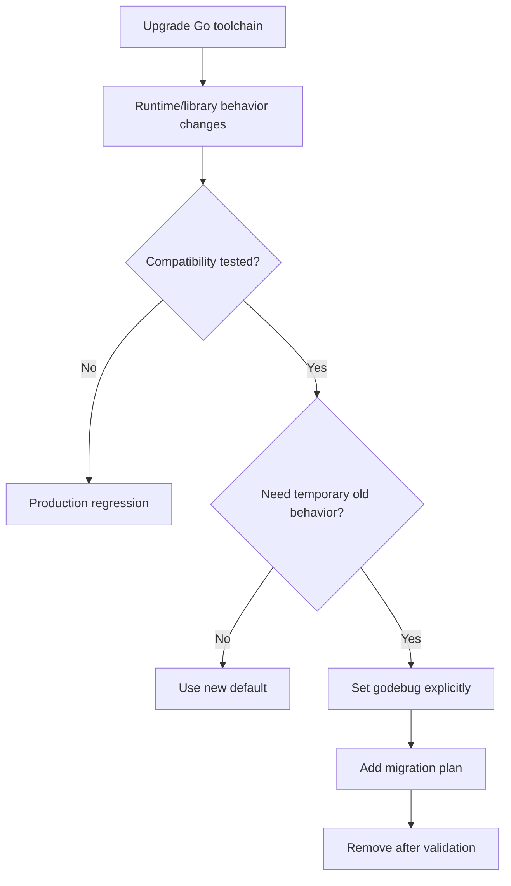
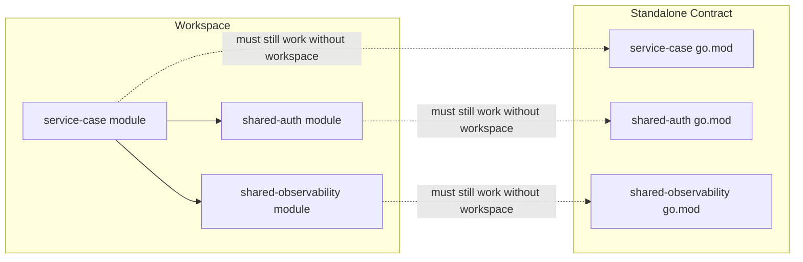
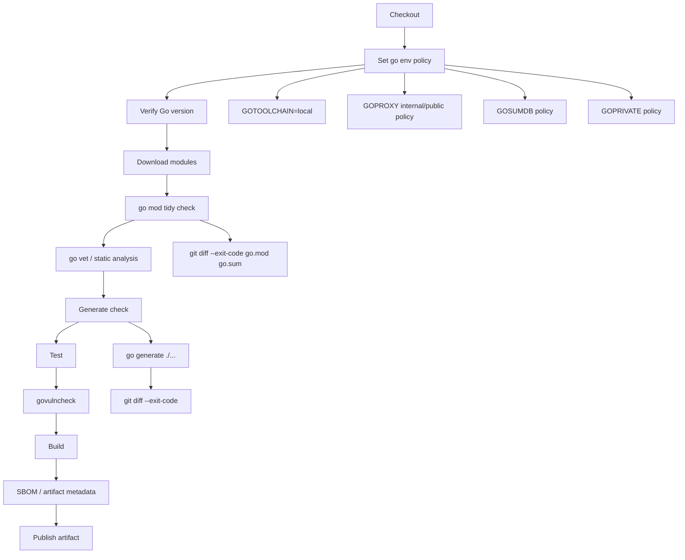
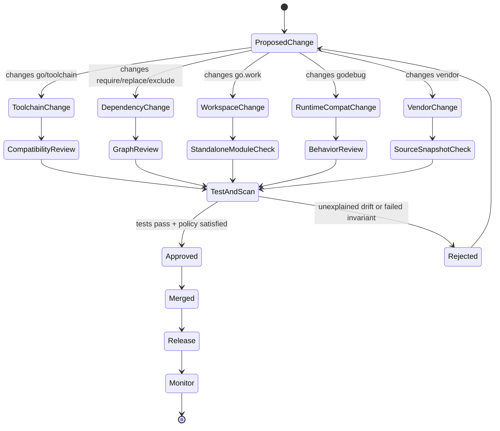

# learn-go-composition-oop-functional-reflection-codegen-modules-part-026.md

# Part 026 — Modern Module Governance: `toolchain`, `go` Directive, `godebug`, Workspace, Vendoring, dan Reproducible Build

> Seri: `learn-go-composition-oop-functional-reflection-codegen-modules`  
> Bagian: `026 / 030`  
> Target pembaca: Java software engineer / tech lead yang ingin mengelola Go modules secara production-grade di lingkungan enterprise  
> Fokus: governance build/dependency/toolchain modern Go, bukan sekadar `go get`

---

## 0. Posisi Part Ini Dalam Seri

Sampai Part 025, kita sudah membahas fondasi module:

- `go.mod`
- `go.sum`
- Minimal Version Selection
- semantic import versioning
- pseudo-version
- `replace`
- `exclude`
- `retract`
- `go mod tidy`
- module graph
- compatibility surface

Part ini naik satu level: **bagaimana module dikelola sebagai sistem produksi**.

Di project kecil, module governance terlihat seperti:

```bash
go mod tidy
go test ./...
```

Di organisasi besar, module governance menyentuh:

- versi bahasa yang boleh dipakai
- versi toolchain yang dipakai developer dan CI
- apakah toolchain boleh auto-download
- bagaimana compatibility behavior Go runtime dikunci
- bagaimana workspace lokal tidak bocor ke CI
- kapan vendoring dipakai
- bagaimana dependency upgrade direview
- bagaimana module cache/proxy/sumdb/private module dikontrol
- bagaimana build tetap reproducible lintas mesin
- bagaimana policy mencegah supply-chain drift

Mental model utama:

> `go.mod` bukan hanya daftar dependency.  
> `go.mod` adalah **kontrak build, compatibility, toolchain, dependency graph, dan operational behavior**.

---

## 1. Kenapa Module Governance Penting

Dalam Java ecosystem, governance biasanya tersebar di beberapa tempat:

- Maven/Gradle build file
- parent POM / convention plugin
- Java toolchain config
- dependency management BOM
- corporate artifact repository
- CI image
- runtime JVM flags
- static analysis config
- deployment manifest

Di Go, banyak hal tersentralisasi di sekitar:

- `go.mod`
- `go.sum`
- `go.work`
- `vendor/`
- environment variables seperti `GOPROXY`, `GOSUMDB`, `GOPRIVATE`, `GOTOOLCHAIN`
- `go env`
- CI command discipline
- module proxy / checksum database policy

Ini membuat Go terasa sederhana, tetapi juga mudah diremehkan.

Contoh kegagalan nyata yang sering muncul:

1. Developer memakai Go 1.26, CI memakai Go 1.24, build berbeda.
2. `toolchain` directive menyebabkan CI mengunduh toolchain tanpa disadari.
3. `replace` lokal tertinggal di `go.mod`.
4. `go.work` membuat lokal lulus, CI gagal.
5. `go mod tidy` di versi Go berbeda menghasilkan perubahan `go.mod`/`go.sum`.
6. Private module tidak dikonfigurasi dengan `GOPRIVATE`, lalu path internal bocor ke public proxy/checksum service.
7. Vendoring dipakai, tetapi tidak diverifikasi sinkron dengan `go.mod`.
8. `godebug` behavior berbeda antara local dan production.
9. Dependency update minor membawa perubahan behavior transitif.
10. Generated code memakai tool versi berbeda antar developer.

Governance bukan birokrasi. Governance adalah cara menjaga invariant:

> Source code yang sama harus menghasilkan build behavior yang sama, pada mesin yang berbeda, dalam waktu yang berbeda, dengan risiko dependency yang terkendali.

---

## 2. Peta Konsep Modern Module Governance

```mermaid
flowchart TD
    A[Repository] --> B[go.mod]
    A --> C[go.sum]
    A --> D[go.work?]
    A --> E[vendor?]
    A --> F[CI Policy]
    A --> G[Developer Tooling]

    B --> B1[module path]
    B --> B2[go directive]
    B --> B3[toolchain directive]
    B --> B4[godebug directive]
    B --> B5[require]
    B --> B6[replace/exclude/retract]
    B --> B7[ignore directive if used]

    F --> F1[go version]
    F --> F2[GOTOOLCHAIN]
    F --> F3[GOPROXY/GOSUMDB/GOPRIVATE]
    F --> F4[go mod tidy check]
    F --> F5[vendor check]
    F --> F6[govulncheck]
    F --> F7[reproducible build flags]

    G --> G1[local go env]
    G --> G2[workspace isolation]
    G --> G3[generator version]
    G --> G4[lint/test commands]

    B2 --> H[Language + module semantics]
    B3 --> I[Toolchain selection]
    B4 --> J[Compatibility behavior defaults]
    B5 --> K[Module graph]
    C --> L[Checksum verification]
    D --> M[Local multi-module editing]
    E --> N[Dependency source snapshot]
```



Agar jelas:

- `go` directive mengatur minimum Go version dan language/module semantics.
- `toolchain` directive memberi preferensi toolchain.
- `godebug` directive mengunci compatibility behavior tertentu.
- `go.work` membantu local multi-module development.
- `vendor/` membantu dependency source snapshot.
- `go.sum` menjaga checksum dependency.
- CI policy memastikan semua itu dipakai konsisten.

---

## 3. `go` Directive: Lebih Dari “Versi Go”

Contoh:

```go
module example.com/case-platform

go 1.26.0

require (
    github.com/google/uuid v1.6.0
)
```

Secara mental, `go 1.26.0` berarti:

1. Module ini menyatakan minimum toolchain/semantics Go yang diperlukan.
2. Toolchain lama yang tidak memenuhi requirement harus menolak atau memilih toolchain yang sesuai.
3. Beberapa behavior `go` command tergantung pada versi di `go` directive.
4. Language feature yang tersedia untuk package dipengaruhi oleh versi ini.
5. `go mod tidy` dan module graph behavior bisa dipengaruhi oleh versi `go`.

### 3.1 Java Analogy

Di Java, ini mirip kombinasi:

```xml
<maven.compiler.release>21</maven.compiler.release>
```

plus:

```xml
<pluginManagement>
```

plus:

```gradle
java {
    toolchain {
        languageVersion = JavaLanguageVersion.of(21)
    }
}
```

Tetapi tidak identik.

Di Java, dependency resolution dan runtime behavior banyak diatur oleh build tool/JVM. Di Go, `go` directive mempengaruhi command behavior, toolchain selection, dan language compatibility.

### 3.2 Kesalahan Umum

Kesalahan umum:

```go
go 1.26
```

diubah sembarang hanya karena developer memasang Go terbaru.

Pertanyaan yang benar bukan:

> “Versi Go apa yang saya install?”

Tetapi:

> “Minimum versi Go apa yang secara sadar kita jadikan kontrak module ini?”

Untuk library, menaikkan `go` directive adalah compatibility decision. Untuk application, menaikkan `go` directive adalah operational build decision.

### 3.3 Policy Praktis

Untuk application service:

```text
go directive = versi Go minimum yang disetujui organization untuk build service tersebut.
CI image = sama atau lebih baru sesuai policy.
Deployment artifact = dibangun oleh CI, bukan laptop developer.
```

Untuk shared library:

```text
go directive = versi minimum yang masih ingin didukung oleh konsumen library.
Jangan naikkan hanya karena lokal sudah upgrade.
Naikkan jika memang butuh fitur/semantics baru atau support matrix berubah.
```

### 3.4 Go 1.26 Note: `go mod init`

Pada Go 1.26, `go mod init` default lebih konservatif: toolchain `1.N.X` membuat `go.mod` dengan `go 1.(N-1).0`. Untuk Go 1.26, default-nya menjadi `go 1.25.0`.

Konsekuensinya:

- repo baru yang dibuat dengan Go 1.26 tidak otomatis punya `go 1.26.0`;
- ini membantu kompatibilitas dengan supported release sebelumnya;
- tetapi jika project memang membutuhkan fitur Go 1.26, directive harus dinaikkan eksplisit.

Governance implication:

```bash
go mod edit -go=1.26.0
go mod tidy
```

harus menjadi keputusan sadar, bukan efek samping.

---

## 4. `toolchain` Directive

Contoh:

```go
module example.com/case-platform

go 1.25.0
toolchain go1.26.4
```

Mental model:

- `go` directive menyatakan minimum version semantics.
- `toolchain` directive menyatakan preferred toolchain untuk bekerja dengan module ini.

Mulai Go 1.21, `go` command dapat memakai bundled toolchain, mencari toolchain lain di `PATH`, atau mengunduh toolchain sesuai konfigurasi.

### 4.1 Kenapa Ini Penting

Tanpa governance, developer bisa punya kondisi berikut:

```text
Developer A:
  go command: 1.26.4
  bundled toolchain: 1.26.4

Developer B:
  go command: 1.25.3
  auto-download: enabled
  actual toolchain: 1.26.4

CI:
  go command: 1.25.0
  auto-download: disabled
  build fails

Docker builder:
  golang:1.26.2
  not same as preferred 1.26.4
```

Jika tidak dikontrol, “versi Go” menjadi non-deterministic.

### 4.2 `GOTOOLCHAIN`

`GOTOOLCHAIN` mengontrol toolchain selection.

Contoh policy:

```bash
GOTOOLCHAIN=local
```

Artinya CI hanya memakai toolchain yang sudah tersedia secara lokal. Jika module butuh versi lebih baru, build gagal secara eksplisit.

Contoh lain:

```bash
GOTOOLCHAIN=auto
```

Artinya `go` command boleh memilih/mengunduh toolchain lain sesuai kebutuhan.

### 4.3 Enterprise Recommendation

Untuk CI enterprise:

```text
Default: GOTOOLCHAIN=local
Go version pinned by CI image.
toolchain directive boleh ada, tetapi tidak boleh menjadi mekanisme download diam-diam di CI.
Upgrade toolchain lewat PR yang mengubah CI image + go.mod + release notes.
```

Untuk developer local:

```text
Boleh memakai GOTOOLCHAIN=auto jika organization mengizinkan.
Tetapi `go env GOTOOLCHAIN` harus terdokumentasi.
```

Untuk regulated/high-security environment:

```text
Disable auto-download.
Mirror Go toolchain internally.
Pin CI image digest.
Record toolchain version in build metadata.
```

### 4.4 Decision Matrix

| Context | `toolchain` directive | `GOTOOLCHAIN` | Rationale |
|---|---:|---:|---|
| Open-source library | Optional | auto/local | Contributor convenience, but keep `go` directive conservative |
| Internal service | Recommended | local in CI | Build reproducibility |
| Regulated platform | Recommended | local | No implicit download |
| Air-gapped build | Required only if mirrored | local | Toolchain must be preinstalled |
| Experimental repo | Flexible | auto | Developer ergonomics |

### 4.5 Review Checklist

Saat melihat PR yang mengubah `toolchain`:

- Apakah CI image juga berubah?
- Apakah base Docker image berubah?
- Apakah release notes Go baru sudah direview?
- Apakah `go mod tidy` dijalankan dengan toolchain final?
- Apakah `go.sum` berubah wajar?
- Apakah benchmark/regression test perlu dijalankan?
- Apakah generated code berubah karena versi formatter/tool berbeda?
- Apakah security scanning tool mendukung toolchain baru?

---

## 5. `godebug` Directive

Go punya mekanisme `GODEBUG` untuk menjaga compatibility saat runtime behavior berubah antar versi.

Contoh di environment:

```bash
GODEBUG=http2server=0
```

Contoh di `go.mod` modern:

```go
godebug (
    default=go1.25
)
```

Atau specific setting jika tersedia:

```go
godebug (
    panicnil=1
)
```

Exact setting yang valid tergantung versi Go. Yang penting di sini adalah mental model dan governance.

### 5.1 Apa Masalah yang Diselesaikan

Go menjaga backward compatibility, tetapi runtime/library behavior kadang perlu berubah demi correctness, security, atau performance. `GODEBUG` memberi mekanisme transisi:

- module lama bisa tetap memakai behavior lama;
- module baru bisa memakai default baru;
- perubahan behavior bisa dikontrol dan didokumentasikan.

### 5.2 Kenapa Ini Governance, Bukan Tuning Random

`godebug` berbeda dari environment tweak biasa. Ini memengaruhi semantic behavior program.

Jika sebuah service butuh `godebug` tertentu, tanyakan:

1. Behavior apa yang sedang dikunci?
2. Kenapa default baru tidak bisa diterima?
3. Apakah ini sementara atau permanen?
4. Apa migration plan-nya?
5. Bagaimana test membuktikan setting ini masih diperlukan?
6. Apakah production env dan local test memakai behavior yang sama?

### 5.3 Policy Praktis

Jangan melakukan ini tanpa dokumen:

```bash
export GODEBUG=...
```

di script deployment tersembunyi.

Lebih baik:

```go
godebug (
    default=go1.25
)
```

dengan catatan di repository:

```markdown
## GODEBUG policy

This module pins default compatibility behavior to Go 1.25 while migrating to Go 1.26 runtime behavior.

Owner: Platform Team
Review date: 2026-08-01
Exit condition:
- all compatibility tests pass with default=go1.26
- no production regression observed for two releases
```

### 5.4 Failure Mode



### 5.5 Anti-pattern

Anti-pattern:

```text
Service fails after Go upgrade.
Someone adds GODEBUG to prod env.
No one records why.
Two years later no one knows whether it is still needed.
```

Better:

```text
Compatibility setting belongs to module governance.
It must have owner, reason, tests, and expiry/migration review.
```

---

## 6. Workspace: `go.work`

`go.work` membantu mengembangkan beberapa module lokal bersama-sama.

Contoh:

```go
go 1.26.0

use (
    ./case-platform
    ./shared-auth
    ./shared-observability
)
```

Dengan workspace, import module dapat diarahkan ke checkout lokal tanpa `replace` di masing-masing `go.mod`.

### 6.1 Masalah yang Diselesaikan

Tanpa workspace, developer sering melakukan ini:

```go
replace example.com/shared-auth => ../shared-auth
```

Lalu lupa menghapusnya sebelum commit.

`go.work` memindahkan local override dari module contract (`go.mod`) ke workspace lokal (`go.work`).

### 6.2 Java Analogy

Mirip multi-module Maven/Gradle build, tetapi lebih ringan dan lebih eksplisit.

Namun ada perbedaan penting:

- `go.work` bukan selalu production build contract.
- `go.mod` tetap kontrak utama module.
- workspace bisa membuat local build berhasil meski module standalone gagal.

### 6.3 Risiko `go.work`

Risiko utama:

```text
Local uses workspace:
  ./service
  ./shared-lib local branch

CI uses module:
  shared-lib released version

Local tests pass, CI/prod fails.
```

Atau:

```text
Developer edits shared lib API locally.
Service compiles in workspace.
But released shared lib version does not contain API.
```

### 6.4 Policy

Untuk repo enterprise, pilih salah satu policy berikut.

#### Policy A — `go.work` tidak di-commit

Cocok untuk banyak repo terpisah.

```gitignore
go.work
go.work.sum
```

Kelebihan:

- menghindari CI bergantung pada workspace lokal;
- module tetap diuji sebagai unit independen.

Kekurangan:

- onboarding multi-repo butuh instruksi manual.

#### Policy B — `go.work` di-commit untuk monorepo multi-module

Cocok untuk monorepo yang memang punya banyak module.

Kelebihan:

- developer experience konsisten;
- seluruh module lokal bisa diuji bersama.

Kekurangan:

- harus ada CI yang juga menguji setiap module secara standalone.

#### Policy C — template workspace

Commit file template:

```text
go.work.example
```

Developer copy:

```bash
cp go.work.example go.work
```

Kelebihan:

- aman untuk multi-repo;
- tetap memberi guidance.

### 6.5 Recommended CI Checks

Jika memakai workspace di monorepo:

```bash
go work sync
go test ./...
```

Tetapi juga perlu standalone check per module:

```bash
for mod in ./services/case ./libs/auth ./libs/observability; do
  (cd "$mod" && GOWORK=off go test ./...)
done
```

Kenapa `GOWORK=off`?

Karena ingin membuktikan module bisa build tanpa bantuan workspace.

### 6.6 Workspace Boundary Diagram



---

## 7. Vendoring: `vendor/`

Vendoring membuat copy source dependency ke folder `vendor/`.

Command:

```bash
go mod vendor
```

Build dengan vendor:

```bash
go build -mod=vendor ./...
go test -mod=vendor ./...
```

### 7.1 Kapan Vendoring Berguna

Vendoring berguna jika:

- build environment tidak boleh akses internet;
- dependency source harus diaudit/snapshotted;
- organization butuh reproducibility yang tidak bergantung pada proxy eksternal;
- regulated environment butuh evidence source yang dibuild;
- incident response butuh memastikan dependency source tidak berubah.

### 7.2 Kapan Vendoring Tidak Perlu

Vendoring bisa tidak perlu jika:

- organization punya internal Go proxy/cache;
- `go.sum` dan sumdb policy cukup;
- CI image/network stabil;
- dependency audit dilakukan lewat tooling lain;
- vendor folder membuat repo terlalu besar dan review bising.

### 7.3 Vendoring Bukan Pengganti Governance

Vendoring tidak otomatis menyelesaikan:

- dependency vulnerability
- license compliance
- malicious code review
- dependency freshness
- transitive dependency risk
- internal module leakage
- generated code drift

Vendoring hanya mengubah **source acquisition model**.

### 7.4 Vendor Sync Check

Jika `vendor/` di-commit, CI harus memverifikasi:

```bash
go mod vendor
git diff --exit-code vendor go.mod go.sum
```

Atau build/test dengan:

```bash
go test -mod=vendor ./...
```

Failure mode:

```text
go.mod updated
vendor not updated
CI without -mod=vendor passes
production offline build fails
```

### 7.5 Vendor Policy Matrix

| Environment | Use vendor? | Alternative |
|---|---:|---|
| Open-source library | Usually no | `go.sum` |
| Internal service with internet CI | Usually no | Internal proxy |
| Air-gapped production build | Yes | Preloaded module cache |
| Regulated/audited build | Often yes | Internal proxy + artifact snapshot |
| Huge monorepo | Case-by-case | Module cache/proxy |

---

## 8. Reproducible Build

Reproducible build di Go berarti:

> Untuk source, module graph, toolchain, environment, dan build flags yang sama, artifact build dapat direproduksi secara konsisten.

Tidak semua hal otomatis deterministic karena build dapat memasukkan:

- path lokal
- VCS metadata
- build timestamp dari aplikasi
- generated file nondeterministic
- CGO/toolchain eksternal
- OS/architecture difference
- environment variables
- embed files
- dependency source
- `go env` differences

### 8.1 Minimal Reproducibility Contract

Untuk service production:

```text
Required:
- Go toolchain pinned.
- `go.mod` and `go.sum` committed.
- `go test ./...` clean.
- `go mod tidy` no diff.
- Generated code checked.
- Build command documented.
- Build metadata explicit.
- CI image pinned.
- Private module access controlled.
```

Untuk high assurance:

```text
Additional:
- GOTOOLCHAIN=local.
- GOPROXY internal.
- GOSUMDB policy explicit.
- CGO disabled unless needed.
- Vendor or internal module mirror.
- Container image digest pinned.
- SBOM generated.
- govulncheck run.
- License scan run.
- Build path trimmed.
```

### 8.2 Useful Build Flags

Common production build:

```bash
CGO_ENABLED=0 \
go build \
  -trimpath \
  -ldflags="-s -w -X 'main.version=${VERSION}' -X 'main.commit=${COMMIT}' -X 'main.buildDate=${BUILD_DATE}'" \
  -o bin/case-service \
  ./cmd/case-service
```

Caveat:

- `BUILD_DATE` makes artifact intentionally time-dependent.
- For bit-for-bit reproducibility, use stable timestamp or omit timestamp.
- `-trimpath` removes local file system paths from resulting binary/debug info.

### 8.3 Recommended Build Metadata

Instead of random runtime introspection, define explicit package:

```go
package buildinfo

var (
    Version = "dev"
    Commit  = "unknown"
    Date    = "unknown"
)
```

Then inject:

```bash
go build -ldflags="
-X 'example.com/case-platform/internal/buildinfo.Version=${VERSION}'
-X 'example.com/case-platform/internal/buildinfo.Commit=${COMMIT}'
-X 'example.com/case-platform/internal/buildinfo.Date=${BUILD_DATE}'
"
```

### 8.4 Version Endpoint

For service:

```go
type VersionInfo struct {
    Version   string `json:"version"`
    Commit    string `json:"commit"`
    BuildDate string `json:"buildDate"`
    GoVersion string `json:"goVersion"`
}
```

Add `runtime.Version()` at runtime.

Why?

- incident response;
- rollback verification;
- proving which toolchain built production;
- correlating behavior with Go runtime version.

---

## 9. `go.mod` as Governance Document

A production `go.mod` should be readable as policy.

Example:

```go
module example.com/regulatory/case-platform

go 1.26.0

toolchain go1.26.4

godebug (
    default=go1.26
)

require (
    github.com/google/uuid v1.6.0
    golang.org/x/sync v0.14.0
)

require (
    golang.org/x/crypto v0.39.0 // indirect
)
```

The surrounding repo should explain:

```markdown
# Build Policy

- Required Go: 1.26.4
- CI uses GOTOOLCHAIN=local.
- Local developers may use GOTOOLCHAIN=auto, but must not rely on uncommitted go.work.
- `go mod tidy` must be run with Go 1.26.4.
- Dependency updates require `go test ./...`, `govulncheck ./...`, and module graph review.
- `replace` directives are forbidden in main branch except approved forks.
- `vendor/` is not committed; CI uses internal GOPROXY.
```

Or if vendoring:

```markdown
# Dependency Source Policy

- `vendor/` is committed.
- CI builds with `-mod=vendor`.
- Any dependency change must update `go.mod`, `go.sum`, and `vendor/`.
```

---

## 10. `replace` Governance

`replace` adalah alat kuat, tetapi berbahaya jika tidak dikontrol.

Valid use cases:

1. temporary local development;
2. approved internal fork;
3. hotfix before upstream release;
4. monorepo transition;
5. security patch fork.

Invalid use cases:

1. permanent hidden fork tanpa owner;
2. local path committed tidak sengaja;
3. bypass dependency review;
4. patching dependency behavior tanpa tests;
5. replacing public module with unknown private module without provenance.

### 10.1 Local Replace

Bad:

```go
replace example.com/shared-auth => ../shared-auth
```

committed to main.

Better:

- use `go.work`;
- or maintain separate uncommitted local patch;
- or make branch-specific PR with explicit reason.

### 10.2 Fork Replace

Example:

```go
replace github.com/vendor/lib => example.com/internal-forks/lib v1.2.3-patch.1
```

Must have:

- owner;
- reason;
- upstream issue link if applicable;
- test coverage;
- exit plan;
- security scan;
- license check.

### 10.3 Replace Review Checklist

- Is it local path or module version?
- Is it committed intentionally?
- Does replacement module have stable version?
- Is checksum available?
- Is owner documented?
- Is there a removal/migration plan?
- Are transitive effects reviewed?
- Is fork security posture acceptable?

---

## 11. `exclude` and `retract` Governance

### 11.1 `exclude`

`exclude` tells module resolution not to use a specific version.

Use carefully when:

- a dependency version is known broken;
- upstream accidentally published bad module;
- internal compatibility issue exists.

Example:

```go
exclude example.com/lib v1.4.2
```

Risk:

- future maintainers may not know why;
- MVS behavior changes silently;
- dependency update may become confusing.

Policy:

```text
Every exclude must have a comment in repo docs or adjacent dependency governance file.
```

### 11.2 `retract`

`retract` is published by a module author to mark versions as unsuitable.

For your own public/internal library, use `retract` when:

- version was accidentally published;
- severe bug;
- security issue;
- wrong module path;
- incompatible release.

Example:

```go
retract v1.2.0 // contains broken permission evaluation
```

Governance:

- retraction reason must be precise;
- changelog must mention replacement version;
- consumers must be notified if internal.

---

## 12. `ignore` Directive

Go 1.25 introduced a `go.mod` `ignore` directive. It can specify directories the `go` command should ignore when matching package patterns such as `all` or `./...`.

This matters in large repos containing:

- generated scratch directories;
- archived experiments;
- embedded examples that are not valid packages;
- foreign-language directories;
- partially migrated modules.

Example intent:

```text
Ignore directories that are intentionally not part of module package discovery.
```

Governance rule:

> Use `ignore` to encode intentional package discovery boundaries, not to hide broken packages casually.

Bad use:

```text
A package fails tests, so we ignore it.
```

Good use:

```text
A directory contains generated fixtures with invalid partial source by design.
```

Review checklist:

- Why is this directory ignored?
- Is it documented?
- Is it temporary or permanent?
- Would moving it outside the module be cleaner?
- Does it hide code that should be tested?

---

## 13. Dependency Upgrade Governance

In Go, dependency upgrade can be simple:

```bash
go get example.com/lib@v1.2.3
go mod tidy
```

But production governance asks:

1. What changed?
2. Is it direct or transitive?
3. Does it affect public API?
4. Does it affect runtime behavior?
5. Does it affect generated code?
6. Does it affect security/vulnerability posture?
7. Does it affect license?
8. Does it affect performance?
9. Does it affect module graph size?
10. Does it require Go version/toolchain change?

### 13.1 Direct vs Transitive Dependency

Direct dependency:

```go
require github.com/google/uuid v1.6.0
```

used by your code.

Indirect dependency:

```go
require golang.org/x/sys v0.34.0 // indirect
```

needed by dependencies.

But governance should not treat indirect as irrelevant. An indirect dependency can contain:

- crypto code;
- syscall integration;
- network protocol;
- parser;
- compression;
- authentication logic.

### 13.2 Upgrade PR Template

```markdown
## Dependency Upgrade

Module:
- from:
- to:

Reason:
- security / bugfix / feature / routine refresh

Direct or transitive:
-

Go version/toolchain impact:
-

Module graph impact:
- output of `go mod graph` or summary

Testing:
- `go test ./...`
- integration tests:
- benchmark if relevant:

Security:
- `govulncheck ./...`
- vulnerability notes:

Compatibility:
- public API impact:
- behavior impact:

Rollback:
-
```

### 13.3 Upgrade Cadence

Recommended:

```text
Security updates: immediate.
Patch/minor dependency updates: scheduled weekly/biweekly.
Major version migration: planned design review.
Toolchain upgrade: separate PR from large dependency upgrade when possible.
```

Avoid:

```text
one giant PR:
- Go 1.25 to 1.26
- 80 dependencies
- generator updates
- refactor
- feature change
```

That makes causality impossible.

---

## 14. Private Module Governance Preview

Part 027 will go deep into private modules, but Part 026 needs enough baseline.

Key variables:

- `GOPRIVATE`
- `GONOPROXY`
- `GONOSUMDB`
- `GOPROXY`
- `GOSUMDB`

The immediate governance principle:

> Internal module paths must not accidentally leak to public proxy/checksum infrastructure.

Example:

```bash
go env -w GOPRIVATE=example.com/internal/*
```

CI should set it explicitly, not rely on developer machine.

More detailed enterprise supply chain handling is in Part 027.

---

## 15. CI Pipeline Blueprint

A robust Go module governance pipeline:



Example CI script:

```bash
set -euo pipefail

go version
go env GOTOOLCHAIN GOPROXY GOSUMDB GOPRIVATE GOWORK

export GOTOOLCHAIN=local

go mod download

go mod tidy
git diff --exit-code go.mod go.sum

go generate ./...
git diff --exit-code

go test ./...

govulncheck ./...

go build -trimpath -o bin/case-service ./cmd/case-service
```

If vendoring:

```bash
go mod vendor
git diff --exit-code go.mod go.sum vendor

go test -mod=vendor ./...
go build -mod=vendor -trimpath -o bin/case-service ./cmd/case-service
```

### 15.1 `go mod download` vs Build-Time Download

Do module download explicitly:

```bash
go mod download
```

Why?

- separates network/dependency acquisition failure from compile failure;
- makes CI logs clearer;
- enables caching;
- helps audit dependency resolution.

### 15.2 `go mod tidy` Check

Recommended:

```bash
go mod tidy
git diff --exit-code go.mod go.sum
```

This catches:

- missing direct dependency;
- stale indirect dependency;
- inconsistent `go.sum`;
- developer forgot tidy;
- tidy behavior drift after Go upgrade.

### 15.3 Generate Check

If repo uses `go generate`:

```bash
go generate ./...
git diff --exit-code
```

This catches:

- generated code not committed;
- generator version mismatch;
- nondeterministic generator;
- stale schema/metadata.

---

## 16. Developer Environment Contract

A production repo should have `docs/development.md` or equivalent.

Example:

```markdown
# Development Environment

Required:
- Go 1.26.4
- GOTOOLCHAIN may be auto locally, but CI uses local.
- Run `go env` and ensure:
  - GOPRIVATE=example.com/internal/*
  - GOPROXY=https://proxy.golang.org,direct or internal proxy
  - GOSUMDB=sum.golang.org unless internal policy says otherwise

Common commands:
- go test ./...
- go mod tidy
- go generate ./...
- go work use ./service ./libs/auth only for local multi-module development

Do not commit:
- local path replace directives
- accidental go.work unless repo policy allows
- generated files not produced by approved generator
```

### 16.1 `go env` Hygiene

Ask developers to inspect:

```bash
go env
```

But CI should not trust local env.

CI must set:

```bash
export GOTOOLCHAIN=local
export GOPRIVATE=example.com/internal/*
export GOPROXY=https://your-internal-proxy.example.com,direct
export GOSUMDB=sum.golang.org
```

or enterprise-specific alternatives.

---

## 17. Multi-Module Repo Governance

Multi-module repo is tempting:

```text
repo/
  services/case/go.mod
  services/appeal/go.mod
  libs/auth/go.mod
  libs/workflow/go.mod
```

Benefits:

- independent versioning;
- smaller dependency graphs;
- clearer ownership;
- easier library publishing;
- less accidental coupling.

Costs:

- more CI complexity;
- more release coordination;
- workspace risk;
- local development complexity;
- version skew across internal modules;
- dependency update duplication.

### 17.1 When Multi-Module Is Worth It

Use multi-module if:

- modules are released independently;
- modules have different consumers;
- modules need different Go version support;
- dependencies differ significantly;
- ownership boundaries are real;
- you need semantic import versioning independently.

Avoid multi-module if:

- everything deploys together;
- versioning is always lockstep;
- boundaries are not stable;
- module split only mimics Java packages;
- CI cannot test standalone modules.

### 17.2 Monorepo Single Module

Often better:

```text
repo/
  go.mod
  cmd/
  internal/
  pkg/
```

Benefits:

- simpler module graph;
- one `go test ./...`;
- no internal module version skew;
- no workspace needed for normal dev.

Costs:

- dependency graph shared;
- harder independent release of libraries;
- all packages share `go` directive.

### 17.3 Decision Matrix

| Question | Single module | Multi-module |
|---|---:|---:|
| Deploy together? | Strong fit | Weak fit |
| Version independently? | Weak fit | Strong fit |
| Different external consumers? | Weak fit | Strong fit |
| Need isolated dependency graph? | Medium | Strong |
| Team maturity low? | Strong | Weak |
| Regulated release per component? | Medium | Strong |
| Avoid local workspace complexity? | Strong | Weak |

---

## 18. Governance for Generated Tools

From Part 019–023, we know codegen must be deterministic. Module governance must also govern generator dependencies.

Example pattern:

```go
//go:generate go run ./internal/tools/permissiongen -input permissions.yaml -output permissions_gen.go
```

Risk:

```bash
go run github.com/acme/gen@latest
```

This is not governance-friendly.

Better:

```bash
go run github.com/acme/gen@v1.4.2
```

Better still for internal tools:

```text
tools/go.mod
tools/go.sum
```

or a `tools.go` pattern:

```go
//go:build tools

package tools

import (
    _ "github.com/acme/permissiongen"
)
```

Then pin in `go.mod`.

### 18.1 Tool Version Policy

For generator:

- must be versioned;
- must be reproducible;
- must not fetch unpinned schemas;
- must produce deterministic output;
- must be checked in CI;
- must not depend on local absolute paths;
- must not inspect local environment except documented flags.

### 18.2 Build Tool Module

Option:

```text
repo/
  go.mod
  tools/
    go.mod
    go.sum
```

Use when build tools have dependency graph you do not want in main module.

Trade-off:

- cleaner main module;
- more CI commands;
- more governance docs.

---

## 19. Build Tags and Module Governance

Build tags affect which files are part of a package.

Example:

```go
//go:build enterprise

package permission
```

Build command:

```bash
go test -tags=enterprise ./...
```

Governance risk:

```text
Local tests without tags pass.
Production build with tags fails.
```

Policy:

- document supported tag sets;
- CI must test supported combinations;
- avoid tag explosion;
- avoid tags as hidden product configuration;
- prefer runtime config for operational behavior unless compile-time exclusion is required.

### 19.1 Supported Tag Matrix

Example:

| Tag Set | Purpose | CI Required |
|---|---|---:|
| none | default OSS/internal build | Yes |
| `enterprise` | enterprise integrations | Yes |
| `fips` | FIPS-compatible crypto path | Yes if supported |
| `integration` | external integration tests | Scheduled |
| `tools` | tool pinning only | No build artifact |

### 19.2 Anti-pattern

Bad:

```go
//go:build prod
```

and local never tests it.

Better:

```text
Build tags are for source inclusion/exclusion, not ordinary environment selection.
```

---

## 20. Compatibility Upgrade Playbook: Go 1.25 to 1.26 Example

Assume service currently:

```go
go 1.25.0
toolchain go1.25.5
```

Target:

```go
go 1.26.0
toolchain go1.26.4
```

### Step 1 — Read Release Notes

Review:

- language changes;
- standard library changes;
- `go` command changes;
- runtime changes;
- security changes;
- deprecations;
- known compatibility changes.

### Step 2 — Upgrade Toolchain in Branch

Update CI image or toolchain installation.

```bash
go version
```

### Step 3 — Update `toolchain`

```bash
go mod edit -toolchain=go1.26.4
```

### Step 4 — Decide `go` Directive

If service will require 1.26 semantics:

```bash
go mod edit -go=1.26.0
```

If not:

```text
Keep go 1.25.0 temporarily, but document why.
```

### Step 5 — Tidy and Test

```bash
go mod tidy
go test ./...
go vet ./...
govulncheck ./...
```

### Step 6 — Generate Check

```bash
go generate ./...
git diff --exit-code
```

If generated files change due to formatting/tool behavior, review carefully.

### Step 7 — Compatibility Tests

Run:

- unit tests;
- integration tests;
- performance benchmarks if performance-sensitive;
- serialization/deserialization compatibility;
- DB migration tests;
- auth/security integration tests;
- concurrency stress tests if runtime changes are relevant.

### Step 8 — `godebug` Decision

If behavior regression occurs:

1. identify changed behavior;
2. check if `godebug` compatibility setting exists;
3. add explicit setting only with owner and exit plan;
4. write regression test.

### Step 9 — Rollout

Use normal progressive delivery:

- staging;
- canary;
- production;
- monitor error rate, latency, memory, goroutine count, GC, CPU.

### Step 10 — Clean Up

- remove temporary `godebug` if not needed;
- update docs;
- update developer setup;
- update generator/tool docs.

---

## 21. Case Study: Regulatory Case Platform

Imagine Go service:

```text
case-platform/
  go.mod
  cmd/case-api/
  internal/caseflow/
  internal/permission/
  internal/audit/
  internal/generated/
  tools/
```

It handles:

- case lifecycle;
- enforcement workflow;
- permission matrix;
- audit trail;
- identity integration;
- generated DTO/validator;
- strict release evidence.

### 21.1 Governance Requirements

The platform needs:

- reproducible CI build;
- clear Go version;
- generated permission matrix checked in;
- no local workspace dependency in release;
- no unreviewed `replace`;
- stable runtime behavior across upgrade;
- private module protection;
- vulnerability scan;
- evidence for dependency source.

### 21.2 Recommended `go.mod`

```go
module example.com/regulatory/case-platform

go 1.26.0

toolchain go1.26.4

godebug (
    default=go1.26
)

require (
    example.com/regulatory/shared-auth v1.8.3
    example.com/regulatory/shared-observability v1.4.1
    github.com/google/uuid v1.6.0
    golang.org/x/sync v0.14.0
)
```

### 21.3 CI Policy

```bash
export GOTOOLCHAIN=local
export GOPRIVATE=example.com/regulatory/*
export GOPROXY=https://go-proxy.internal.example.com,direct
export GOSUMDB=sum.golang.org

go version
go env GOTOOLCHAIN GOPRIVATE GOPROXY GOSUMDB GOWORK

go mod download
go mod tidy
git diff --exit-code go.mod go.sum

go generate ./...
git diff --exit-code

go test ./...
govulncheck ./...

go build -trimpath -o bin/case-api ./cmd/case-api
```

### 21.4 Local Workspace

Developer may create:

```go
go 1.26.0

use (
    .
    ../shared-auth
    ../shared-observability
)
```

But `go.work` is not committed.

Before PR:

```bash
GOWORK=off go test ./...
```

### 21.5 Permission Generator

```go
//go:generate go run ./tools/permissiongen -input permissions.yaml -output internal/generated/permissions_gen.go
```

CI verifies no diff after generation.

### 21.6 Upgrade Scenario

A developer wants to update `shared-auth`:

```bash
go get example.com/regulatory/shared-auth@v1.9.0
go mod tidy
go test ./...
```

Review must include:

- auth behavior changes;
- permission behavior changes;
- transitive dependency changes;
- compatibility with existing tokens/sessions;
- generated permission matrix if schema changed;
- rollback plan.

---

## 22. Anti-Patterns

### 22.1 “Always Use Latest Go Locally”

Bad:

```text
Everyone uses whatever Go they installed.
```

Why bad:

- `go mod tidy` drift;
- generated output drift;
- inconsistent language semantics;
- hard-to-debug CI failures.

Better:

```text
Repo declares supported Go/toolchain.
CI enforces it.
Developers may use newer only if compatible and tidy output stable.
```

### 22.2 `go.work` as Hidden Dependency

Bad:

```text
Service compiles only because workspace points to local unreleased lib.
```

Better:

```bash
GOWORK=off go test ./...
```

before merge.

### 22.3 Permanent `replace` Fork

Bad:

```go
replace github.com/vendor/auth => ../my-auth-fix
```

Better:

```go
replace github.com/vendor/auth => example.com/internal-forks/auth v1.2.3-patch.1
```

with owner, reason, and exit plan.

### 22.4 Tidy Without Toolchain Discipline

Bad:

```text
Developer A runs tidy with Go 1.24.
Developer B runs tidy with Go 1.26.
PRs keep changing go.mod/go.sum.
```

Better:

```text
Tidy must be run with repository-supported Go version.
CI enforces no diff.
```

### 22.5 Vendoring Without Verification

Bad:

```text
vendor/ committed but CI builds from module cache.
```

Better:

```bash
go test -mod=vendor ./...
go mod vendor
git diff --exit-code vendor
```

### 22.6 GODEBUG as Permanent Mystery Flag

Bad:

```bash
GODEBUG=something=old
```

set in deployment script with no context.

Better:

```go
godebug (
    default=go1.25
)
```

with documented owner, reason, test, and removal plan.

---

## 23. Design Review Checklist

Use this checklist when reviewing Go module governance.

### 23.1 `go.mod`

- Is `module` path correct and stable?
- Is `go` directive intentional?
- Is `toolchain` directive intentional?
- Is `godebug` used? If yes, is it documented?
- Are direct dependencies direct?
- Are indirect dependencies reasonable?
- Are `replace` directives intentional?
- Are `exclude` directives documented?
- Are `retract` directives used correctly if this is a published module?
- Is `ignore` used only for intentional package discovery boundaries?

### 23.2 Toolchain

- Does CI pin Go version?
- Is `GOTOOLCHAIN` policy explicit?
- Does CI allow auto-download? If yes, is that acceptable?
- Is Docker builder version aligned?
- Is build metadata capturing Go version?

### 23.3 Workspace

- Is `go.work` committed or ignored by policy?
- Does CI test with `GOWORK=off` where needed?
- Do modules build standalone?
- Are local overrides prevented from leaking?

### 23.4 Vendoring

- Is vendor used intentionally?
- Does CI build with `-mod=vendor`?
- Is vendor synchronized?
- Is vendor reviewed/audited?
- Is there an internal proxy alternative?

### 23.5 Dependency Updates

- Is upgrade reason stated?
- Are changes direct/transitive understood?
- Was `go mod tidy` run with correct Go?
- Was `go test ./...` run?
- Was vulnerability scanning run?
- Are major versions handled via semantic import versioning?
- Is rollback possible?

### 23.6 Generated Code

- Are generator versions pinned?
- Is `go generate ./...` deterministic?
- Does CI check generated diff?
- Are generated files committed or intentionally excluded?
- Is generator input reviewed?

### 23.7 Reproducibility

- Are build flags documented?
- Is `-trimpath` used where appropriate?
- Are build metadata fields intentional?
- Are environment variables explicit?
- Is CGO policy explicit?
- Are module source and checksum policies explicit?

---

## 24. Practical Commands Cheat Sheet

Inspect module:

```bash
go env GOMOD GOWORK GOVERSION GOTOOLCHAIN GOPROXY GOSUMDB GOPRIVATE
go list -m all
go mod graph
go mod why -m example.com/module
```

Tidy:

```bash
go mod tidy
git diff --exit-code go.mod go.sum
```

Download:

```bash
go mod download
```

Vendor:

```bash
go mod vendor
go test -mod=vendor ./...
```

Workspace:

```bash
go work init ./service ./lib
go work use ./another-module
go work sync
GOWORK=off go test ./...
```

Toolchain/directive edits:

```bash
go mod edit -go=1.26.0
go mod edit -toolchain=go1.26.4
```

Dependency upgrade:

```bash
go get example.com/lib@v1.2.3
go mod tidy
go test ./...
```

Dependency downgrade:

```bash
go get example.com/lib@v1.2.2
go mod tidy
```

Show why dependency exists:

```bash
go mod why -m example.com/lib
```

Build:

```bash
go build -trimpath ./cmd/service
```

Disable workspace:

```bash
GOWORK=off go test ./...
```

---

## 25. Mental Model: Module Governance as State Machine



The point:

> Every module change has a class.  
> Every class has review requirements.  
> No dependency/toolchain/runtime behavior change should be “just tidy”.

---

## 26. What Top Engineers Internalize

A strong Go engineer does not merely know commands.

They internalize these invariants:

1. `go.mod` is a contract, not a scratchpad.
2. `go.sum` is evidence, not noise.
3. `go` directive is compatibility policy.
4. `toolchain` directive is toolchain governance.
5. `godebug` directive is runtime behavior governance.
6. `go.work` is local composition, not always release truth.
7. `vendor/` is dependency source snapshot, not vulnerability solution.
8. `replace` is a scalpel, not a default workflow.
9. `go mod tidy` output depends on toolchain/version semantics.
10. CI must prove local assumptions do not leak.
11. Dependency upgrade is a behavior change until proven otherwise.
12. Reproducible build starts before Docker; it starts in module policy.
13. Generated code belongs to governance because it changes source truth.
14. Private module policy is security posture, not convenience.
15. Toolchain upgrade must be observable, testable, and reversible.

---

## 27. Exercises

### Exercise 1 — Audit a `go.mod`

Given:

```go
module example.com/case-platform

go 1.26.0

require (
    example.com/internal/auth v0.0.0-20260601120000-aabbccddeeff
    github.com/google/uuid v1.6.0
)

replace example.com/internal/auth => ../auth
```

Questions:

1. What is unsafe for main branch?
2. What should replace local path usage?
3. How should CI catch this?
4. What environment variable must be configured for private module?
5. What should be documented about the pseudo-version?

Expected reasoning:

- local path `replace` should not be committed;
- use `go.work` for local development;
- CI should run with `GOWORK=off`;
- CI should grep/check forbidden `replace` or use policy tooling;
- `GOPRIVATE` should include internal module path;
- pseudo-version should be temporary or explained.

### Exercise 2 — Design Toolchain Policy

You run 20 Go services.

Requirements:

- all services must use Go 1.26.4 in CI;
- developers may install newer Go locally;
- CI must not download toolchains;
- release artifact must include Go version.

Write policy:

```text
- go.mod contains toolchain go1.26.4.
- CI image pins Go 1.26.4.
- CI sets GOTOOLCHAIN=local.
- `go version` is printed.
- runtime version endpoint includes runtime.Version().
- `go mod tidy` checked in CI.
```

### Exercise 3 — Workspace Safety

You have:

```text
service-case/
shared-auth/
shared-permission/
```

Developer uses local workspace.

Write pre-merge commands:

```bash
go test ./...
GOWORK=off go test ./...
go mod tidy
git diff --exit-code go.mod go.sum
```

If service depends on unreleased shared module API, `GOWORK=off` should expose it.

### Exercise 4 — Vendoring Decision

You are building for an air-gapped government environment.

Decision:

```text
Use vendoring or internal module mirror.
If vendoring:
- commit vendor/
- build with -mod=vendor
- verify vendor sync in CI
- scan vendor source
```

### Exercise 5 — `godebug` Governance

A Go upgrade changes behavior and tests fail.

Do not immediately set env var permanently.

Steps:

1. identify behavior change;
2. write regression test;
3. decide if old behavior is temporarily required;
4. add `godebug` directive if justified;
5. document owner/reason/exit date;
6. create migration task;
7. remove setting after compatibility fixed.

---

## 28. Summary

Modern Go module governance is the discipline of making build, dependency, toolchain, runtime compatibility, workspace, generated code, and dependency source behavior explicit.

The most important shift:

> A Go module is not just code plus dependencies.  
> It is a reproducible engineering contract.

Key takeaways:

- `go` directive defines minimum Go semantics and requirement.
- `toolchain` directive influences toolchain selection.
- `GOTOOLCHAIN` must be governed in CI.
- `godebug` should be treated as compatibility policy.
- `go.work` is excellent for local multi-module development but dangerous if it hides release reality.
- vendoring is useful for source snapshot/offline build, but not a replacement for security governance.
- dependency upgrades need review proportional to risk.
- generated code and generator versions are part of module governance.
- reproducible build requires explicit environment, toolchain, flags, dependency source, and CI checks.

---

## 29. References

Primary references:

- Go Modules Reference — `go.mod`, module graph, directives, MVS, vendoring, workspace behavior.
- Go `go.mod` file reference — `go`, `toolchain`, and module directive behavior.
- Go Toolchains documentation — toolchain selection and `GOTOOLCHAIN`.
- Go 1.26 Release Notes — Go 1.26 module/tooling behavior, including `go mod init` default change.
- Go, Backwards Compatibility, and GODEBUG — compatibility behavior management.
- `cmd/go` documentation — Go command behavior, build/test/module commands.
- Managing dependencies — official dependency management guidance.

---

## 30. Next Part

Part 027 akan membahas:

# Private Modules & Enterprise Supply Chain

Topik utama:

- `GOPRIVATE`
- `GONOPROXY`
- `GONOSUMDB`
- `GOPROXY`
- `GOSUMDB`
- private Git authentication
- internal Go proxy
- checksum database policy
- module cache
- artifact repository
- vendoring vs internal proxy
- dependency provenance
- regulated supply-chain review
- CI/CD secret handling
- large organization module access model

Status seri: **belum selesai**. Part ini adalah **026 dari 030**.

<!-- NAVIGATION_FOOTER -->
<div class="page-nav">
<a href="./learn-go-composition-oop-functional-reflection-codegen-modules-part-025.md">⬅️ Part 025 — Go Module Fundamentals: `go.mod`, `go.sum`, MVS, Semantic Import Versioning, `replace`, `exclude`, dan `retract`</a>
<a href="./index.md">📚 Kategori</a>
<a href="../../index.md">🏠 Home</a>
<a href="./learn-go-composition-oop-functional-reflection-codegen-modules-part-027.md">Part 027 — Private Modules & Enterprise Supply Chain: `GOPRIVATE`, Proxy, SumDB, Private Git Auth, Registry, Provenance, dan CI/CD Secret Handling ➡️</a>
</div>
