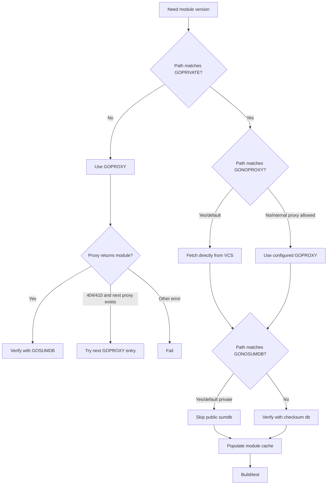
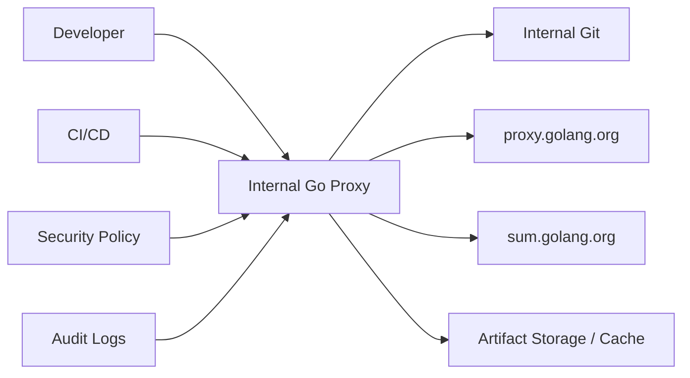

# learn-go-composition-oop-functional-reflection-codegen-modules-part-027.md

# Part 027 — Private Modules & Enterprise Supply Chain: `GOPRIVATE`, Proxy, SumDB, Private Git Auth, Registry, Provenance, dan CI/CD Secret Handling

> Seri: `learn-go-composition-oop-functional-reflection-codegen-modules`  
> Bagian: `027 / 030`  
> Target pembaca: Java software engineer / tech lead yang ingin mengelola private Go modules di environment enterprise, regulated, dan large-scale engineering  
> Fokus: private module resolution, supply-chain trust boundary, CI/CD authentication, internal proxy/registry, checksum policy, provenance, dan failure modeling

---

## 0. Posisi Part Ini Dalam Seri

Part 025 membahas module fundamentals.

Part 026 membahas modern module governance:

- `go` directive
- `toolchain`
- `GOTOOLCHAIN`
- `godebug`
- workspace
- vendoring
- reproducible build
- CI policy

Part 027 masuk ke area yang lebih sensitif:

> Bagaimana Go mengambil dependency private secara aman, reproducible, dan tidak membocorkan informasi internal.

Dalam sistem enterprise, dependency management bukan hanya pertanyaan:

```bash
go get internal/module
```

Pertanyaan sebenarnya:

1. Dari mana source module diambil?
2. Apakah path internal bocor ke public proxy/checksum database?
3. Siapa yang boleh mengakses module?
4. Bagaimana CI melakukan authentication tanpa membocorkan token?
5. Apakah dependency source bisa diaudit?
6. Apakah private module checksum diverifikasi?
7. Apakah internal proxy dipercaya?
8. Apakah module fork punya provenance?
9. Apakah build bisa jalan saat internet mati?
10. Apakah dependency graph bisa direproduksi enam bulan kemudian?

Mental model utama:

> Private module governance adalah **supply-chain boundary design**, bukan sekadar konfigurasi `GOPRIVATE`.

---

## 1. Problem Framing

Dalam Java ecosystem, private dependency biasanya diselesaikan lewat:

- Nexus
- Artifactory
- Maven repository
- Gradle enterprise cache
- internal BOM
- credentials di `settings.xml`
- artifact signing
- internal CA
- repository manager policy

Di Go, dependency distribution lebih decentralized:

- module path biasanya menunjuk ke VCS location;
- public module proxy bisa menjadi cache;
- checksum database memverifikasi module version content;
- private modules butuh konfigurasi agar tidak memakai public proxy/sumdb;
- internal proxy bisa dipakai sebagai trust boundary;
- Git authentication sering menjadi bagian dari module resolution.

Simplicity Go membuatnya nyaman, tetapi supply-chain risk-nya nyata.

Contoh risiko:

```text
module example.internal/regulatory/auth
```

Jika environment tidak dikonfigurasi benar, `go` command bisa mencoba mencari module itu melalui public proxy/checksum infrastructure. Walaupun source tidak dapat diakses, module path internal bisa bocor sebagai metadata.

Bagi regulated system, metadata leak pun bisa bermasalah:

- nama domain internal;
- nama sistem;
- struktur organisasi;
- nama service sensitif;
- dependency relationship;
- timing build;
- internal module version pattern.

---

## 2. Core Variables

Private module behavior dikontrol oleh beberapa environment variable.

| Variable | Fungsi |
|---|---|
| `GOPROXY` | Daftar module proxy yang dipakai `go` command untuk download module |
| `GOSUMDB` | Checksum database yang dipakai untuk verifikasi public module |
| `GOPRIVATE` | Pattern module path yang dianggap private |
| `GONOPROXY` | Pattern module path yang tidak boleh lewat proxy |
| `GONOSUMDB` | Pattern module path yang tidak boleh diverifikasi via checksum database |
| `GOINSECURE` | Pattern module path yang boleh memakai transport insecure atau skip cert validation tertentu; harus sangat dibatasi |
| `GOVCS` | Policy VCS/protocol yang boleh dipakai berdasarkan public/private module |
| `GOMODCACHE` | Lokasi module cache |
| `GONOSUMDB` | Membatasi sumdb untuk path tertentu |
| `GONOPROXY` | Membatasi proxy untuk path tertentu |

Important hierarchy:

```text
GOPRIVATE acts as default for GONOPROXY and GONOSUMDB.
```

Artinya jika:

```bash
GOPRIVATE=example.com/internal/*
```

maka secara default module yang match pattern tersebut:

- tidak menggunakan public proxy;
- tidak menggunakan public checksum database.

Namun jika organisasi punya trusted internal proxy untuk private modules, konfigurasi bisa berbeda.

---

## 3. Module Fetching Mental Model

Ketika `go` command melihat dependency:

```go
require example.com/regulatory/shared-auth v1.8.3
```

Ia harus menjawab:

1. Apakah module ini private?
2. Apakah harus lewat proxy?
3. Proxy mana?
4. Apakah checksum harus diverifikasi?
5. Checksum database mana?
6. Jika tidak lewat proxy, VCS mana?
7. Protocol apa yang boleh dipakai?
8. Credential mana yang dipakai?
9. Apakah versi module valid?
10. Apakah konten module cocok dengan checksum?

Flow sederhana:



The key:

> “Private” is not just about authentication.  
> It changes proxy and checksum database behavior.

---

## 4. `GOPRIVATE`

`GOPRIVATE` is a comma-separated list of glob patterns.

Example:

```bash
go env -w GOPRIVATE=example.com/regulatory/*
```

or:

```bash
export GOPRIVATE=github.com/my-org/*
```

Pattern syntax follows Go path matching style. Think in module path prefixes, not package names.

### 4.1 Good Patterns

For company-owned domain:

```bash
GOPRIVATE=example.com/*
```

For narrower scope:

```bash
GOPRIVATE=example.com/regulatory/*
```

For GitHub organization:

```bash
GOPRIVATE=github.com/acme-corp/*
```

For multiple domains:

```bash
GOPRIVATE=example.com/internal/*,github.com/acme-corp/*
```

### 4.2 Overly Broad Patterns

Avoid:

```bash
GOPRIVATE=github.com/*
```

unless organization truly wants all GitHub modules fetched directly and excluded from public checksum DB.

Why bad?

- bypasses proxy/sumdb benefits for public modules;
- reduces tamper detection;
- slows build;
- increases VCS dependency;
- changes caching behavior.

### 4.3 Too Narrow Patterns

Bad:

```bash
GOPRIVATE=example.com/regulatory/shared-auth
```

when modules are:

```text
example.com/regulatory/shared-auth
example.com/regulatory/shared-permission
example.com/regulatory/shared-audit
```

Better:

```bash
GOPRIVATE=example.com/regulatory/*
```

### 4.4 Policy Rule

> `GOPRIVATE` should match organization ownership boundaries, not random individual repositories.

---

## 5. `GONOPROXY` and `GONOSUMDB`

By default, `GOPRIVATE` sets both:

```text
GONOPROXY = GOPRIVATE
GONOSUMDB = GOPRIVATE
```

But you may override them.

### 5.1 Direct VCS for Private Modules

Common simple configuration:

```bash
GOPRIVATE=example.com/regulatory/*
GOPROXY=https://proxy.golang.org,direct
GOSUMDB=sum.golang.org
```

Result:

- public modules use public proxy + public checksum database;
- private modules are fetched directly from VCS;
- private modules skip public checksum database.

### 5.2 Internal Proxy for Private Modules

If organization has trusted private proxy:

```bash
GOPROXY=https://go-proxy.internal.example.com,https://proxy.golang.org,direct
GONOSUMDB=example.com/regulatory/*
```

Maybe no `GONOPROXY` because you want private modules through internal proxy.

This means:

- internal proxy handles private modules;
- public proxy handles public modules;
- private modules skip public sumdb;
- internal proxy must be trusted and access-controlled.

### 5.3 Internal Proxy Only

High-control environment:

```bash
GOPROXY=https://go-proxy.internal.example.com
GOSUMDB=off
GOPRIVATE=example.com/regulatory/*
```

This is stricter but has trade-offs:

- internal proxy must mirror/cache all public modules needed;
- public sumdb verification disabled unless internal equivalent exists;
- organization owns dependency integrity pipeline.

### 5.4 Decision Matrix

| Setup | Public Modules | Private Modules | SumDB | Use Case |
|---|---|---|---|---|
| Public proxy + direct private | public proxy | direct VCS | public for public only | Simple company setup |
| Internal proxy + public fallback | internal first, public fallback | internal proxy | public for public, skip private | Enterprise common |
| Internal proxy only | internal proxy | internal proxy | off/internal | Regulated/air-gapped |
| Vendor only | vendor folder | vendor folder | not at build time | Offline snapshot build |
| Direct only | VCS direct | VCS direct | public unless disabled | Simple but less cache-friendly |

---

## 6. `GOPROXY`

`GOPROXY` is a comma-separated list.

Default historically:

```bash
GOPROXY=https://proxy.golang.org,direct
```

Meaning:

1. try public Go module proxy;
2. if allowed fallback occurs, fetch direct from origin.

### 6.1 Proxy Fallback Semantics

Important nuance:

- `404` and `410` allow fallback to next proxy;
- other errors generally stop.

This matters for internal proxy design.

If internal proxy cannot serve a module but should allow fallback, it must return the right status code.

Bad internal proxy behavior:

```text
returns 500 for unknown public module
```

Result:

```text
go command does not fallback to public proxy/direct as intended
```

Better:

```text
returns 404/410 for modules it intentionally does not serve
```

### 6.2 Internal Proxy First

Common enterprise:

```bash
GOPROXY=https://go-proxy.internal.example.com,https://proxy.golang.org,direct
```

Pros:

- internal cache improves speed;
- internal audit point;
- can block disallowed modules;
- can serve private modules;
- can record dependency usage.

Cons:

- internal proxy availability becomes build dependency;
- misconfiguration can block builds;
- must handle auth/TLS/scaling;
- must implement correct fallback semantics.

### 6.3 No Direct Fallback

High-control:

```bash
GOPROXY=https://go-proxy.internal.example.com
```

Pros:

- no uncontrolled origin fetch;
- clear allowlist policy;
- reproducible dependency acquisition;
- better for air-gapped/security.

Cons:

- new dependency requires proxy population;
- emergency build blocked if proxy missing module;
- internal proxy is critical infrastructure.

### 6.4 Anti-pattern

```bash
GOPROXY=direct
```

used everywhere.

Why bad:

- slower;
- less cacheable;
- more fragile;
- public module tamper detection still depends on sumdb but source fetch is decentralized;
- every build depends on many external VCS providers;
- harder to audit.

Use `direct` deliberately, not as default enterprise policy.

---

## 7. `GOSUMDB`

`GOSUMDB` configures checksum database.

Default public:

```bash
GOSUMDB=sum.golang.org
```

Disable:

```bash
GOSUMDB=off
```

### 7.1 What Checksum Database Gives You

Checksum database protects against:

- module author force-moving tags;
- proxy returning wrong bits;
- origin server returning changed content for same version;
- accidental content mismatch;
- tampering in module distribution.

It gives an auditable record for public modules.

### 7.2 Why Private Modules Usually Skip Public SumDB

Private modules are usually:

- not publicly accessible;
- not appropriate to disclose module path;
- not verifiable by public checksum database.

Thus:

```bash
GONOSUMDB=example.com/regulatory/*
```

or via:

```bash
GOPRIVATE=example.com/regulatory/*
```

### 7.3 Should You Set `GOSUMDB=off`?

Only if you understand the cost.

Bad blanket policy:

```bash
GOSUMDB=off
```

because “it fixed private module errors.”

Better:

```bash
GOPRIVATE=example.com/regulatory/*
```

so public modules still use checksum verification.

Disable `GOSUMDB` globally only when:

- all modules come from trusted internal proxy;
- organization has alternate integrity controls;
- build is air-gapped;
- dependency source is snapshotted/vendor-reviewed;
- policy explicitly accepts the loss of public sumdb verification.

### 7.4 Policy

```text
Public modules should use checksum verification unless organization has a stronger internal mechanism.
Private module paths should not be sent to public sumdb.
```

---

## 8. `GOVCS`

`GOVCS` controls which version control systems and protocols are allowed for module downloads.

Why it matters:

- Go can fetch from VCS directly.
- VCS clients may execute commands.
- Protocol choice affects security.
- Public/private modules may have different policy.

Example policy intent:

```text
For public modules, allow only git and hg.
For private modules, allow git.
Disallow arbitrary VCS/protocols.
```

Exact syntax should be set according to current `go help vcs` / official docs.

Governance principle:

> If builds fetch source directly from VCS, VCS protocol policy is part of supply-chain security.

### 8.1 When to Care

Care strongly when:

- `GOPROXY=direct`;
- private modules fetched from Git directly;
- CI has network access to many hosts;
- organization uses self-hosted Git;
- threat model includes malicious module path;
- regulated build pipeline needs protocol allowlist.

### 8.2 Safer Posture

Use internal proxy.

Then CI does not need broad VCS network access for every module.

---

## 9. Private Git Authentication

If private modules are fetched directly from VCS, `go` command delegates to Git.

That means Git auth must work non-interactively.

Common mechanisms:

1. SSH keys
2. HTTPS with token
3. `.netrc`
4. Git credential helper
5. CI-provided token
6. deploy keys
7. GitHub App/GitLab deploy token
8. internal SSO-backed Git credential
9. machine account

### 9.1 SSH

Git config:

```ini
[url "ssh://git@github.com/"]
    insteadOf = https://github.com/
```

Then Go module path:

```go
require github.com/acme-corp/private-lib v1.2.3
```

Git fetch uses SSH.

Pros:

- mature;
- deploy keys possible;
- no token in URL;
- good for developer machines.

Cons:

- CI key management required;
- host key verification needed;
- broad SSH key access can be risky;
- difficult per-repo scoping if using one key.

### 9.2 HTTPS Token via `.netrc`

Example:

```text
machine github.com
login x-access-token
password ${GITHUB_TOKEN}
```

Pros:

- simple in CI;
- token scoping possible;
- works with HTTPS.

Cons:

- `.netrc` must be protected;
- tokens can leak via logs if mishandled;
- token rotation required.

### 9.3 Avoid Token in Module URL

Bad:

```go
require https://token@github.com/acme/private-lib v1.2.3
```

Module paths are not arbitrary credential containers. Never put secrets in:

- `go.mod`;
- import paths;
- `replace` URLs;
- error logs;
- build args that end up in image layers.

### 9.4 CI Secret Handling

Best practices:

- use short-lived tokens where possible;
- use least privilege;
- scope token to read-only repository/module access;
- inject secret at runtime, not baked in image;
- mask secret in logs;
- avoid echoing `go env` variables that contain secrets;
- remove credential files after use;
- ensure Docker build layers do not preserve secrets;
- use BuildKit secrets for Docker builds;
- rotate tokens;
- separate developer token from CI token.

### 9.5 Docker Build Secret Anti-pattern

Bad Dockerfile:

```dockerfile
ARG GITHUB_TOKEN
RUN git config --global url."https://${GITHUB_TOKEN}@github.com/".insteadOf "https://github.com/"
RUN go mod download
```

Why bad:

- token can be visible in image history/layers;
- build logs may leak token;
- cache may persist credential.

Better with BuildKit secret:

```dockerfile
# syntax=docker/dockerfile:1.6

FROM golang:1.26.4 AS build
WORKDIR /src
COPY go.mod go.sum ./

RUN --mount=type=secret,id=netrc,target=/root/.netrc \
    go mod download

COPY . .
RUN --mount=type=secret,id=netrc,target=/root/.netrc \
    go build -trimpath -o /out/service ./cmd/service
```

Then build:

```bash
docker build --secret id=netrc,src=$HOME/.netrc .
```

For SSH:

```dockerfile
RUN --mount=type=ssh go mod download
```

with:

```bash
docker build --ssh default .
```

---

## 10. Internal Go Proxy

An internal Go proxy can serve as:

- cache;
- policy gate;
- private module source;
- public module mirror;
- availability buffer;
- audit point;
- dependency allowlist enforcement;
- reproducibility support.

### 10.1 Proxy Roles



### 10.2 Proxy Responsibilities

A serious internal proxy should handle:

- TLS;
- authentication/authorization;
- caching;
- upstream fallback;
- correct 404/410 fallback behavior;
- module immutability;
- audit logs;
- retention;
- access logs;
- allowlist/denylist;
- vulnerability metadata integration;
- private module resolution;
- checksum policy integration;
- high availability.

### 10.3 Proxy as Trust Boundary

If CI uses:

```bash
GOPROXY=https://go-proxy.internal.example.com
GOSUMDB=off
```

then internal proxy becomes the trust anchor.

It must answer:

- which module versions are allowed?
- were bits verified before caching?
- can cached bits be mutated?
- who can publish private modules?
- who can delete versions?
- can admins rewrite module content?
- are audit logs immutable?
- how are cache poisoning risks handled?

### 10.4 Public Module Mirroring

Options:

1. lazy cache on demand;
2. pre-approved allowlist;
3. curated mirror;
4. vendor snapshot;
5. SBOM-driven prefetch.

For regulated environment, prefer:

```text
Dependency change PR -> security review -> proxy allowlist/cache -> build.
```

not:

```text
Build fetches arbitrary new dependency from internet.
```

---

## 11. Internal Module Registry vs Git as Source

Go modules can be served by VCS or module proxy protocol.

### 11.1 Git as Source

Pros:

- simple;
- natural for developers;
- tags define versions;
- no extra infrastructure.

Cons:

- CI needs Git auth;
- every build may hit Git;
- harder to centralize policy;
- availability depends on Git;
- public/private path leakage requires careful env;
- VCS protocol risk.

### 11.2 Internal Proxy/Registry

Pros:

- central policy;
- caching;
- controlled release artifacts;
- auditability;
- better offline support;
- fewer credentials in CI;
- can decouple build from Git availability.

Cons:

- infrastructure complexity;
- proxy must be reliable;
- publishing workflow required;
- governance overhead.

### 11.3 Decision Matrix

| Requirement | Git Direct | Internal Proxy |
|---|---:|---:|
| Small team | Strong | Medium |
| Enterprise CI | Medium | Strong |
| Air-gapped build | Weak | Strong |
| Central audit | Weak | Strong |
| Simple setup | Strong | Medium |
| Fine-grained policy | Medium | Strong |
| Avoid CI Git secrets | Weak | Strong |
| Public dependency cache | Weak | Strong |

---

## 12. Module Versioning for Private Modules

Private modules still need version discipline.

Bad:

```bash
go get example.com/regulatory/shared-auth@master
```

or:

```bash
go get example.com/regulatory/shared-auth@latest
```

in CI/build script.

Better:

```go
require example.com/regulatory/shared-auth v1.8.3
```

### 12.1 Tags Matter

A private module version should be immutable.

Policy:

```text
Never move tags after publishing.
Never delete released tags without incident process.
Never reuse version numbers.
Use retract for bad versions.
Use patch version for hotfix.
```

### 12.2 Pseudo-Versions

Pseudo-version example:

```go
v0.0.0-20260601120000-aabbccddeeff
```

Valid use:

- temporary integration before release;
- internal branch coordination;
- emergency patch while waiting tag.

Risk:

- less human-readable;
- hard to reason about release quality;
- may point to unreviewed commit;
- can become permanent accidentally.

Policy:

```text
Pseudo-versions allowed only temporarily, with owner and cleanup target.
Mainline service should prefer tagged versions.
```

### 12.3 Semantic Import Versioning

Private modules still follow semantic import versioning:

```text
example.com/regulatory/shared-auth/v2
```

for v2+ major versions.

Do not assume “private” means “can break consumers freely.”

In a large organization, internal consumers are still consumers.

---

## 13. Release Workflow for Private Libraries

A production private module release should include:

1. changelog;
2. version tag;
3. tests;
4. compatibility note;
5. vulnerability scan;
6. license scan if external dependencies changed;
7. generated code check;
8. SBOM if required;
9. release artifact/cache in internal proxy;
10. notification to consumers for major behavior changes.

### 13.1 Private Library Release Checklist

```markdown
## Release v1.9.0

Module:
- example.com/regulatory/shared-auth

Changes:
-

Compatibility:
- Public API:
- Behavior:
- Config:
- Security:

Dependencies:
- Added:
- Removed:
- Updated:

Validation:
- go test ./...
- govulncheck ./...
- integration test:
- benchmark if relevant:

Consumer migration:
-

Rollback:
-
```

### 13.2 Consumer Upgrade Checklist

```markdown
## Upgrade shared-auth v1.8.3 -> v1.9.0

Reason:
-

Expected impact:
-

Test evidence:
-

Runtime compatibility:
-

Security review:
-

Rollback:
-
```

---

## 14. Access Control Model

Private module access should be designed at module/repo level.

Questions:

1. Who can read module source?
2. Who can publish tags?
3. Who can modify release branches?
4. Who can approve dependency upgrades?
5. Who can access internal proxy?
6. Who can fetch modules in CI?
7. Who can update CI credentials?
8. Who can override checksum/proxy policy?
9. Who can add `replace` to internal forks?
10. Who can deprecate/retract bad versions?

### 14.1 Roles

Example roles:

| Role | Permissions |
|---|---|
| Module owner | approve API changes, tag releases |
| Platform team | maintain proxy/toolchain policy |
| Security team | approve new external dependencies, vuln exceptions |
| Service team | consume approved module versions |
| CI machine account | read-only fetch modules |
| Release bot | create tags after approved workflow |
| Admin | emergency override with audit |

### 14.2 Dangerous Permission Combinations

Avoid:

```text
Same token can:
- read all repos
- write tags
- administer proxy
- publish artifacts
- run CI
```

Least privilege matters.

CI build token usually only needs:

```text
read module source/artifacts
read internal proxy
read package metadata
```

not write access.

---

## 15. Provenance and Integrity

Private module supply chain needs provenance.

Minimum provenance answer:

- Which repository?
- Which commit?
- Which tag?
- Who approved release?
- Which CI job built/validated it?
- Which dependencies did it include?
- Which Go version/toolchain?
- Which generated files changed?
- Which artifact/proxy cache entry?
- Which service consumed it?

### 15.1 SBOM

For service artifact, generate SBOM where possible.

At minimum, record:

```bash
go version -m ./bin/service
```

Go binaries can include module build information.

Example:

```bash
go version -m bin/case-service
```

This can show:

- Go version;
- module path;
- dependency versions;
- build settings.

### 15.2 Build Metadata Endpoint

For service:

```json
{
  "service": "case-api",
  "version": "2026.06.22.1",
  "commit": "abc123",
  "goVersion": "go1.26.4",
  "module": "example.com/regulatory/case-platform",
  "dependencies": {
    "example.com/regulatory/shared-auth": "v1.9.0"
  }
}
```

Do not expose overly sensitive dependency detail publicly. For internal admin/diagnostic endpoint, it can be valuable.

### 15.3 Reproducibility Evidence

Store:

- source commit;
- `go.mod`;
- `go.sum`;
- build logs;
- Go version;
- module proxy configuration;
- SBOM;
- vulnerability scan output;
- artifact digest;
- container image digest;
- generated code diff evidence.

---

## 16. Checksum Strategy for Private Modules

Public modules use public checksum database by default.

Private modules need alternate integrity strategy.

Options:

1. trust Git tag immutability;
2. use internal module proxy with immutable cache;
3. vendor source;
4. internal checksum database;
5. artifact signing/provenance framework;
6. source archive storage;
7. binary provenance/SBOM.

### 16.1 Trusting Git Alone

Pros:

- simple;
- no extra infra.

Cons:

- admins can rewrite tags;
- repository compromise can alter source;
- less centralized audit;
- harder offline reproducibility.

Mitigation:

- protected tags;
- signed tags;
- branch protection;
- audit logs;
- read-only deploy tokens;
- release bot;
- immutable release archive.

### 16.2 Internal Proxy with Immutable Cache

Pros:

- better reproducibility;
- central source snapshot;
- can prevent mutation;
- auditable download.

Cons:

- proxy is trust anchor;
- must be secured.

### 16.3 Vendor

Pros:

- source in repo;
- easy audit per PR;
- offline build.

Cons:

- repo bloat;
- noisy diffs;
- manual sync;
- not scalable for many services.

### 16.4 Internal SumDB

More advanced.

Use if organization needs:

- cryptographic transparency for private modules;
- high assurance against proxy/source tampering;
- centralized checksum verification.

Cost:

- infrastructure and operational complexity.

---

## 17. Failure Modeling

### 17.1 Metadata Leak

Scenario:

```bash
GOPRIVATE not set
go test ./...
```

Module:

```text
example.com/regulatory/enforcement-risk-engine
```

Risk:

- Go tries public proxy/sumdb;
- module path appears in external request;
- internal architecture metadata leaks.

Mitigation:

```bash
GOPRIVATE=example.com/regulatory/*
```

CI must set it.

### 17.2 CI Works, Developer Fails

Scenario:

- CI uses internal proxy;
- developer lacks `GOPRIVATE` and credentials.

Mitigation:

- documented setup;
- bootstrap script;
- `go env` check;
- internal dev proxy;
- read-only developer access groups.

### 17.3 Developer Works, CI Fails

Scenario:

- developer has `go.work` or local `replace`;
- CI uses released module version.

Mitigation:

```bash
GOWORK=off go test ./...
```

and reject local path `replace`.

### 17.4 Token Leak in Docker Layer

Scenario:

```dockerfile
ARG TOKEN
RUN git config --global url."https://$TOKEN@github.com/".insteadOf "https://github.com/"
```

Mitigation:

- BuildKit secret;
- no token in ARG;
- multi-stage build with no credential copy;
- inspect image history;
- secret scanning.

### 17.5 Public SumDB Disabled Globally

Scenario:

```bash
GOSUMDB=off
```

to fix private module error.

Risk:

- public dependency tamper detection weakened.

Mitigation:

```bash
GOPRIVATE=example.com/regulatory/*
```

not global sumdb off unless policy demands.

### 17.6 Internal Proxy Returns Wrong Status

Scenario:

- internal proxy returns `500` for unknown module;
- fallback does not happen;
- builds fail.

Mitigation:

- proxy returns `404`/`410` when fallback should be allowed;
- monitor proxy status codes;
- test proxy behavior.

### 17.7 Moved Private Tags

Scenario:

- private module tag `v1.4.0` moved to new commit;
- consumers get inconsistent source.

Mitigation:

- protected tags;
- immutable proxy cache;
- release bot;
- audit;
- no tag rewrite policy;
- internal checksum/provenance.

### 17.8 Overbroad `GOPRIVATE`

Scenario:

```bash
GOPRIVATE=github.com/*
```

Risk:

- public GitHub modules skip public proxy/sumdb;
- slower and weaker verification.

Mitigation:

```bash
GOPRIVATE=github.com/acme-corp/*
```

---

## 18. CI/CD Blueprint for Private Modules

### 18.1 Direct Git Private Module

```bash
set -euo pipefail

export GOTOOLCHAIN=local
export GOPRIVATE=github.com/acme-corp/*
export GOPROXY=https://proxy.golang.org,direct
export GOSUMDB=sum.golang.org

# Configure Git auth using CI secret.
cat > "$HOME/.netrc" <<EOF
machine github.com
login x-access-token
password ${GITHUB_TOKEN}
EOF
chmod 0600 "$HOME/.netrc"

go env GOPRIVATE GOPROXY GOSUMDB GOTOOLCHAIN
go mod download
go test ./...
go build -trimpath -o bin/service ./cmd/service

rm -f "$HOME/.netrc"
```

Caution:

- do not print `$GITHUB_TOKEN`;
- ensure CI masks it;
- cleanup credential;
- prefer short-lived token.

### 18.2 Internal Proxy

```bash
set -euo pipefail

export GOTOOLCHAIN=local
export GOPROXY=https://go-proxy.internal.example.com
export GOPRIVATE=example.com/regulatory/*
export GONOSUMDB=example.com/regulatory/*
export GOSUMDB=sum.golang.org

go mod download
go test ./...
go build -trimpath -o bin/service ./cmd/service
```

If internal proxy handles all public verification internally:

```bash
export GOPROXY=https://go-proxy.internal.example.com
export GOSUMDB=off
```

Only if security policy accepts internal proxy as trust anchor.

### 18.3 Air-Gapped with Vendor

```bash
set -euo pipefail

export GOTOOLCHAIN=local
export GOPROXY=off
export GOSUMDB=off

go test -mod=vendor ./...
go build -mod=vendor -trimpath -o bin/service ./cmd/service
```

Precondition:

```bash
go mod vendor
git diff --exit-code vendor go.mod go.sum
```

must happen in connected/preparation pipeline.

---

## 19. Docker Build Blueprint

### 19.1 BuildKit Secret with `.netrc`

```dockerfile
# syntax=docker/dockerfile:1.6

FROM golang:1.26.4 AS build

WORKDIR /src

ENV GOTOOLCHAIN=local
ENV GOPRIVATE=github.com/acme-corp/*
ENV GOPROXY=https://proxy.golang.org,direct
ENV GOSUMDB=sum.golang.org

COPY go.mod go.sum ./

RUN --mount=type=secret,id=netrc,target=/root/.netrc \
    go mod download

COPY . .

RUN --mount=type=secret,id=netrc,target=/root/.netrc \
    go test ./...

RUN --mount=type=secret,id=netrc,target=/root/.netrc \
    go build -trimpath -o /out/service ./cmd/service

FROM gcr.io/distroless/static-debian12
COPY --from=build /out/service /service
USER nonroot:nonroot
ENTRYPOINT ["/service"]
```

Build:

```bash
docker build --secret id=netrc,src=.ci/netrc .
```

### 19.2 Internal Proxy Docker Build

```dockerfile
FROM golang:1.26.4 AS build

WORKDIR /src

ENV GOTOOLCHAIN=local
ENV GOPROXY=https://go-proxy.internal.example.com
ENV GOPRIVATE=example.com/regulatory/*
ENV GONOSUMDB=example.com/regulatory/*

COPY go.mod go.sum ./
RUN go mod download

COPY . .
RUN go test ./...
RUN go build -trimpath -o /out/service ./cmd/service
```

This is simpler because CI does not need Git credentials if proxy handles access.

---

## 20. Enterprise Policy Templates

### 20.1 Simple Private Git Policy

```markdown
# Go Private Module Policy

Private module namespace:
- github.com/acme-corp/*

Developer environment:
- GOPRIVATE=github.com/acme-corp/*
- GOPROXY=https://proxy.golang.org,direct
- GOSUMDB=sum.golang.org

CI:
- GOTOOLCHAIN=local
- GOPRIVATE=github.com/acme-corp/*
- Git auth via read-only CI token
- No token in Docker ARG
- BuildKit secrets required for Docker module download

Rules:
- No local path replace in main branch.
- No moved tags.
- Private modules must use semantic versions.
- Pseudo-versions require owner and cleanup plan.
- Dependency upgrade PR must include test and vulnerability scan evidence.
```

### 20.2 Internal Proxy Policy

```markdown
# Go Module Proxy Policy

All builds use:
- GOPROXY=https://go-proxy.internal.example.com
- GOTOOLCHAIN=local

Private namespaces:
- example.com/regulatory/*

Checksum:
- Public modules verified by configured checksum strategy.
- Private modules excluded from public sumdb.
- Internal proxy is immutable for released module versions.

CI:
- no direct internet dependency fetch unless approved.
- no Git credentials required for normal dependency download.
- proxy access uses CI identity.

Rules:
- new public dependency must pass allowlist/security review.
- private module releases must be tagged and published to proxy.
- `replace` forks require owner, reason, and exit plan.
```

### 20.3 Regulated/Air-Gapped Policy

```markdown
# Regulated Go Build Policy

Build environment:
- no public internet access.
- GOTOOLCHAIN=local.
- Go toolchain installed from approved internal artifact.
- GOPROXY=off or internal approved proxy only.
- GOSUMDB=off unless internal checksum database exists.

Dependencies:
- dependency source must be pre-approved.
- vendor/ or internal proxy snapshot required.
- SBOM required for release artifact.
- dependency graph archived with release evidence.
- no pseudo-version in production release unless exception approved.

Secrets:
- no long-lived tokens in Docker images.
- no credentials in go.mod, import path, or logs.
- CI credentials are read-only and rotated.
```

---

## 21. Policy Enforcement

Manual review is not enough.

Automate checks.

### 21.1 Reject Local Replace

Script idea:

```bash
if grep -E '^replace .* => \.\.?/' go.mod; then
  echo "local path replace is not allowed in main branch"
  exit 1
fi
```

More robust:

```bash
go mod edit -json | jq '.Replace'
```

### 21.2 Verify Env

```bash
go env GOPRIVATE GOPROXY GOSUMDB GOTOOLCHAIN GOWORK
```

For CI, assert expected:

```bash
test "$(go env GOTOOLCHAIN)" = "local"
```

### 21.3 Verify No Workspace Dependency

```bash
GOWORK=off go test ./...
```

### 21.4 Verify Tidy

```bash
go mod tidy
git diff --exit-code go.mod go.sum
```

### 21.5 Verify Vendor

```bash
go mod vendor
git diff --exit-code vendor
go test -mod=vendor ./...
```

### 21.6 Verify No Secret Leakage

Use secret scanning:

- repository scanning;
- Dockerfile scanning;
- image history scanning;
- CI log masking;
- `.netrc` cleanup.

Check:

```bash
docker history image-name
```

for accidental token.

---

## 22. Module Cache Governance

`GOMODCACHE` controls module cache location.

Default typically under `GOPATH/pkg/mod`.

### 22.1 CI Cache

Caching module downloads improves build speed.

Risk:

- stale/inconsistent cache;
- poisoned cache if runner compromised;
- cache shared across trust boundaries;
- private module source retained on shared runner.

Policy:

- isolate cache per trust boundary;
- do not share private module cache with untrusted jobs;
- clear cache on suspicious build;
- prefer internal proxy over huge CI cache;
- restrict cache write permissions;
- ensure cache key includes OS/arch/go version when needed.

### 22.2 Developer Cache

Developers may have old module cache.

Troubleshooting:

```bash
go clean -modcache
go mod download
```

But do not make this normal workflow. If module tags are immutable, cache should not need frequent cleaning.

If cache cleaning fixes issue, investigate:

- moved tag;
- proxy inconsistency;
- replace/workspace confusion;
- auth/path issue.

---

## 23. Security Scanning

Use Go-specific and general scanning.

### 23.1 `govulncheck`

Run:

```bash
govulncheck ./...
```

It analyzes code and dependencies for known Go vulnerabilities.

Governance:

- run in CI;
- record exceptions;
- differentiate reachable vs non-reachable where tool supports;
- include private module vulnerabilities through internal advisory process if possible.

### 23.2 Dependency Review

Review new dependencies:

- maintainer reputation;
- license;
- activity;
- transitive dependency size;
- security history;
- API stability;
- whether standard library is enough;
- whether dependency runs code generation/build scripts;
- whether dependency includes native/CGO components;
- whether dependency affects auth/crypto/parsing/network boundary.

### 23.3 Private Advisory Process

Private modules need internal vulnerability process:

- report channel;
- severity;
- affected versions;
- fixed version;
- retraction if needed;
- consumer notification;
- upgrade deadline;
- exception process.

---

## 24. Supply-Chain Threat Model

Threat actors / risks:

1. compromised public dependency;
2. compromised private module repository;
3. moved tag;
4. leaked CI token;
5. malicious internal contributor;
6. compromised internal proxy;
7. dependency confusion;
8. MITM if TLS/proxy misconfigured;
9. poisoned CI cache;
10. malicious code generator;
11. unsafe `replace`;
12. accidental metadata leak.

Controls:

| Risk | Control |
|---|---|
| Public dependency tampering | checksum DB, internal proxy, review |
| Private tag rewrite | protected tags, immutable proxy |
| Token leak | BuildKit secrets, short-lived tokens |
| Metadata leak | `GOPRIVATE`, `GONOSUMDB` |
| Dependency confusion | internal namespace policy, proxy allowlist |
| Proxy compromise | immutable storage, audit logs, least privilege |
| CI cache poisoning | isolated runners/cache policy |
| Malicious generator | pinned tools, generated diff check |
| Local replace leak | CI policy check |
| Workspace hidden dependency | `GOWORK=off` CI check |

---

## 25. Dependency Confusion in Go Context

Dependency confusion usually means build pulls a public package when it intended an internal one.

In Go, module paths are globally named by path.

Example dangerous ambiguity:

```text
github.com/acme/auth
```

if internal and public naming are confused.

Safer internal naming:

```text
go.acme.internal/security/auth
```

or:

```text
example.com/acme/internal/security/auth
```

with domain controlled by organization.

### 25.1 Namespace Policy

Strong rule:

```text
All private modules must live under controlled domain/path prefix.
```

Example:

```text
go.company.internal/*
```

or:

```text
example.com/company/*
```

Avoid private module paths under domains you do not control.

### 25.2 Vanity Import Paths

Go supports import path discovery via meta tags.

A vanity domain can map:

```text
go.company.com/security/auth
```

to internal Git.

Pros:

- stable module path independent of Git provider;
- easier migration from GitHub to internal Git;
- controlled namespace.

Cons:

- requires web endpoint;
- must secure metadata endpoint;
- extra infrastructure.

---

## 26. Vanity Import Path Governance

Vanity path example:

```go
module go.company.com/regulatory/shared-auth
```

The `go` command may query:

```text
https://go.company.com/regulatory/shared-auth?go-get=1
```

to discover VCS metadata.

Governance:

- endpoint must not expose more metadata than needed;
- TLS required;
- access policy considered;
- migration plan documented;
- module path stability preserved;
- `GOPRIVATE` includes vanity path.

Example:

```bash
GOPRIVATE=go.company.com/*
```

Pros:

- stable module path;
- internal ownership;
- easier Git host migration.

Cons:

- more moving parts;
- discovery endpoint is infrastructure dependency;
- possible metadata exposure if public.

---

## 27. `replace` with Private Forks

Private fork example:

```go
replace github.com/vendor/lib => example.com/forks/vendor-lib v1.2.3-acme.1
```

This can be valid when:

- upstream has security issue;
- bug fix needed urgently;
- upstream is abandoned;
- organization applies internal patch.

Governance requirements:

- fork repository access controlled;
- patch documented;
- upstream diff reviewed;
- version naming clear;
- owner assigned;
- exit plan;
- vulnerability scan;
- legal/license review;
- periodic rebase policy.

Anti-pattern:

```text
Fork lives forever, no one knows why, divergence grows, upgrades become impossible.
```

---

## 28. Private Module API Governance

Private modules often become internal platforms.

Treat them like products.

A shared internal module should have:

- owner;
- README;
- examples;
- compatibility policy;
- release notes;
- deprecation policy;
- migration guide;
- supported Go versions;
- security policy;
- public API review;
- test strategy;
- semantic versioning discipline.

### 28.1 Internal Does Not Mean Informal

Bad mindset:

```text
It is internal, so we can break it anytime.
```

Better:

```text
It is internal, but it has consumers and operational blast radius.
```

For a module used by 20 services, breaking change can be more expensive than a public library break.

---

## 29. Observability of Dependency Resolution

Dependency resolution failures are often opaque.

Add diagnostic commands to CI logs:

```bash
go version
go env GOPROXY GOSUMDB GOPRIVATE GONOPROXY GONOSUMDB GOTOOLCHAIN GOWORK
go list -m all
```

Caution:

- do not print secrets;
- `GOPROXY` may include credential if misconfigured, which it should not.

For troubleshooting:

```bash
GONOSUMDB=... GOPRIVATE=... go env
go mod download -x
```

`-x` prints commands. Use carefully; it may expose URLs/commands.

### 29.1 Failure Classification

| Symptom | Likely Cause |
|---|---|
| `404 Not Found` public proxy for private module | `GOPRIVATE` missing or proxy not configured |
| authentication failed | Git credential missing/expired |
| checksum mismatch | moved tag, proxy/cache issue, tampering |
| terminal prompts disabled | CI Git auth not configured |
| works locally but not CI | local `go.work`, local credential, local cache |
| CI slow downloading modules | no proxy/cache |
| public modules skip sumdb | overbroad `GOPRIVATE`/`GONOSUMDB` |
| Docker build fails, local works | credentials not passed securely into build |

---

## 30. Case Study: Regulatory Platform Private Modules

Assume organization has:

```text
go.govtech.internal/regulatory/auth
go.govtech.internal/regulatory/permission
go.govtech.internal/regulatory/audit
go.govtech.internal/regulatory/workflow
```

Service:

```text
go.govtech.internal/aceas/case-api
```

### 30.1 Desired Properties

- no internal module path leak to public proxy/sumdb;
- CI builds without direct Git internet access;
- private module versions immutable;
- dependency graph auditable;
- Go toolchain pinned;
- generated permission matrix deterministic;
- vulnerability scanning mandatory;
- build artifact includes module metadata;
- emergency fork process exists.

### 30.2 Recommended Config

```bash
GOTOOLCHAIN=local
GOPROXY=https://go-proxy.govtech.internal
GOPRIVATE=go.govtech.internal/*
GONOSUMDB=go.govtech.internal/*
GOSUMDB=sum.golang.org
```

If internal proxy mirrors public modules and internal policy disables public access:

```bash
GOPROXY=https://go-proxy.govtech.internal
GOSUMDB=off
```

with internal integrity controls.

### 30.3 CI

```bash
set -euo pipefail

go version
go env GOTOOLCHAIN GOPROXY GOPRIVATE GONOSUMDB GOSUMDB GOWORK

go mod download
go mod tidy
git diff --exit-code go.mod go.sum

GOWORK=off go test ./...

go generate ./...
git diff --exit-code

govulncheck ./...

go build -trimpath \
  -ldflags="-X 'internal/buildinfo.Version=${VERSION}' -X 'internal/buildinfo.Commit=${COMMIT}'" \
  -o bin/case-api \
  ./cmd/case-api

go version -m bin/case-api
```

### 30.4 Release Evidence

Archive:

- `go.mod`;
- `go.sum`;
- `go env` selected variables;
- `go version`;
- `go list -m all`;
- `go version -m` output;
- artifact digest;
- vulnerability scan result;
- generated diff check result;
- dependency approval ticket;
- internal proxy snapshot ID if available.

---

## 31. Practical Checklist

### 31.1 Setup Checklist

- [ ] Decide private namespace.
- [ ] Configure `GOPRIVATE`.
- [ ] Decide public proxy vs internal proxy.
- [ ] Decide checksum strategy.
- [ ] Configure CI explicitly.
- [ ] Configure developer onboarding.
- [ ] Decide `go.work` policy.
- [ ] Decide vendoring/internal proxy policy.
- [ ] Decide Git auth mechanism.
- [ ] Prevent secrets in Docker layers.
- [ ] Add module governance CI checks.
- [ ] Add vulnerability scanning.
- [ ] Add release workflow for private modules.

### 31.2 PR Review Checklist for Private Dependency Change

- [ ] Is dependency private or public?
- [ ] Is module path under approved namespace?
- [ ] Is version tagged, not branch/latest?
- [ ] If pseudo-version, is it justified?
- [ ] Does `go mod tidy` produce expected diff?
- [ ] Does module graph change make sense?
- [ ] Are new transitive deps reviewed?
- [ ] Was `govulncheck` run?
- [ ] Is license acceptable?
- [ ] Is rollback possible?
- [ ] Are generated files updated?
- [ ] Any `replace` added?
- [ ] Any `GOPRIVATE`/proxy policy change needed?

### 31.3 CI Checklist

- [ ] `GOTOOLCHAIN=local`
- [ ] `GOPRIVATE` explicit
- [ ] `GOPROXY` explicit
- [ ] `GOSUMDB`/`GONOSUMDB` explicit
- [ ] no secret printed
- [ ] `go mod download`
- [ ] `go mod tidy` diff check
- [ ] `GOWORK=off` check if relevant
- [ ] reject forbidden `replace`
- [ ] `go test ./...`
- [ ] `govulncheck ./...`
- [ ] generated diff check
- [ ] build with `-trimpath`
- [ ] artifact metadata captured

---

## 32. Anti-Patterns

### 32.1 Fixing Private Module by Disabling Everything

Bad:

```bash
GOPROXY=direct
GOSUMDB=off
```

everywhere.

Better:

```bash
GOPRIVATE=company.com/*
GOPROXY=https://proxy.golang.org,direct
GOSUMDB=sum.golang.org
```

or internal proxy policy.

### 32.2 Token in Git URL

Bad:

```bash
git config --global url."https://token@github.com/".insteadOf "https://github.com/"
```

if token can leak to logs/history.

Better:

- `.netrc` via secret mount;
- SSH mount;
- short-lived token;
- credential cleanup.

### 32.3 Local Replace in Main

Bad:

```go
replace company.com/auth => ../auth
```

committed.

Better:

```text
Use go.work locally.
CI runs GOWORK=off.
```

### 32.4 Private Module Without Tags

Bad:

```go
require company.com/auth v0.0.0-...
```

forever.

Better:

```go
require company.com/auth v1.4.2
```

### 32.5 Overbroad `GOPRIVATE`

Bad:

```bash
GOPRIVATE=github.com/*
```

Better:

```bash
GOPRIVATE=github.com/company/*
```

### 32.6 Internal Proxy Without Immutability

Bad:

```text
Proxy cache can be overwritten manually.
```

Better:

```text
Released module versions immutable.
Override requires incident process.
```

### 32.7 Shared CI Token with Write Access

Bad:

```text
CI token can read/write all repos and create tags.
```

Better:

```text
CI build token read-only.
Release bot token separate.
```

---

## 33. What Top Engineers Internalize

Strong Go engineers understand:

1. Private module config is supply-chain design.
2. `GOPRIVATE` protects both access behavior and metadata privacy.
3. `GOPRIVATE` defaults `GONOPROXY` and `GONOSUMDB`.
4. Public modules should retain checksum verification where possible.
5. Disabling `GOSUMDB` globally is a serious trust decision.
6. Internal proxy becomes trust anchor if all modules flow through it.
7. Git authentication belongs to CI secret governance.
8. Build credentials must not enter Docker layers.
9. `go.work` is not release truth.
10. Local `replace` is a common source of hidden dependency.
11. Private modules still need semantic versioning and release notes.
12. Internal consumers deserve compatibility discipline.
13. Module path namespace is security architecture.
14. Module metadata leakage can matter.
15. Reproducibility requires source, version, checksum/proxy, toolchain, and provenance controls.

---

## 34. Exercises

### Exercise 1 — Diagnose Private Module Leak

Given CI error:

```text
reading https://sum.golang.org/lookup/example.com/regulatory/auth@v1.2.0: 404 Not Found
```

Question:

- What likely happened?

Answer:

- Private module path was sent to public checksum database.
- `GOPRIVATE` or `GONOSUMDB` is missing/misconfigured.

Fix:

```bash
GOPRIVATE=example.com/regulatory/*
```

or:

```bash
GONOSUMDB=example.com/regulatory/*
```

depending on proxy policy.

### Exercise 2 — Design Config for Internal Proxy

Requirement:

- private modules served by internal proxy;
- public modules may use public proxy fallback;
- private modules must not use public sumdb.

Config:

```bash
GOPROXY=https://go-proxy.internal.example.com,https://proxy.golang.org,direct
GOPRIVATE=example.com/regulatory/*
GONOSUMDB=example.com/regulatory/*
```

Do not set `GONOPROXY` if private modules should go through internal proxy.

### Exercise 3 — Secure Docker Build

Bad Dockerfile uses:

```dockerfile
ARG GITHUB_TOKEN
RUN git config --global url."https://${GITHUB_TOKEN}@github.com/".insteadOf "https://github.com/"
```

Rewrite with BuildKit secret:

```dockerfile
RUN --mount=type=secret,id=netrc,target=/root/.netrc go mod download
```

### Exercise 4 — Reject Bad PR

PR changes:

```go
replace example.com/regulatory/shared-auth => ../shared-auth
```

Reject because:

- local path replace cannot be main branch contract;
- use `go.work` for local development;
- release dependency must be tagged version.

### Exercise 5 — Private Library Release

Create release checklist for:

```text
example.com/regulatory/shared-permission v1.7.0
```

Must include:

- tag;
- changelog;
- tests;
- vulnerability scan;
- generated code check;
- migration notes;
- consumer impact;
- rollback guidance.

---

## 35. Summary

Private module governance is where Go module simplicity meets enterprise supply-chain reality.

Key points:

- `GOPRIVATE` marks module path patterns as private and defaults `GONOPROXY`/`GONOSUMDB`.
- `GOPROXY` determines where modules are downloaded from.
- `GOSUMDB` protects public module integrity; do not disable it casually.
- Private modules usually skip public checksum database to prevent path leak and because source is not public.
- Internal proxy can centralize cache, access control, audit, and policy.
- If internal proxy is the sole trust source, it must be treated as critical infrastructure.
- Git credentials must be handled non-interactively and securely in CI.
- Never put secrets in module paths, Docker build args, `go.mod`, or logs.
- Private modules still require semantic versioning, release discipline, compatibility policy, and provenance.
- `go.work` and `replace` are development conveniences, not uncontrolled release mechanisms.
- Reproducible private module builds require explicit environment, source acquisition, checksum/proxy strategy, and artifact evidence.

---

## 36. References

Primary references:

- Go Modules Reference — private modules, `GOPRIVATE`, `GONOPROXY`, `GONOSUMDB`, `GOPROXY`, checksum database, module proxy behavior.
- Managing dependencies — official guidance for private module configuration.
- Go Module Mirror and Checksum Database launch article — rationale for module proxy and checksum database integrity model.
- Go FAQ — private modules and Git SSH configuration notes.
- Go module release and versioning workflow — tagging and release workflow guidance.
- `cmd/go` help documentation — environment variables and module download behavior.
- Go workspaces tutorial — workspace behavior for multi-module local development.

---

## 37. Next Part

Part 028 akan membahas:

# Large-Scale Repo Architecture

Topik utama:

- monorepo vs multi-repo
- single module vs multi-module
- `/cmd`, `/internal`, `/pkg`
- application vs library boundaries
- platform package layout
- dependency direction
- import cycle prevention
- shared kernel vs bounded context
- module ownership
- generated code placement
- testing strategy per package/module
- large organization migration strategy

Status seri: **belum selesai**. Part ini adalah **027 dari 030**.

<!-- NAVIGATION_FOOTER -->
<div class="page-nav">
<a href="./learn-go-composition-oop-functional-reflection-codegen-modules-part-026.md">⬅️ Part 026 — Modern Module Governance: `toolchain`, `go` Directive, `godebug`, Workspace, Vendoring, dan Reproducible Build</a>
<a href="./index.md">📚 Kategori</a>
<a href="../../index.md">🏠 Home</a>
<a href="./learn-go-composition-oop-functional-reflection-codegen-modules-part-028.md">Part 028 — Large-Scale Repo Architecture: Monorepo, Multi-Module, `/cmd`, `/internal`, `/pkg`, Dependency Direction, Ownership Boundary, dan Migration Strategy ➡️</a>
</div>
